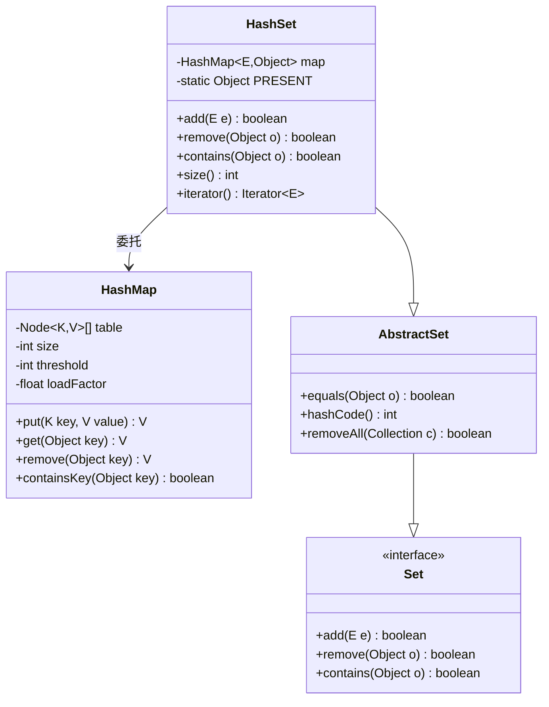

# 工业级Set设计思想
#### 目录介绍
- 01.Set核心思想
  - 1.1 核心设计理念
  - 1.2 接口层次结构
  - 1.3 整体架构图
  - 1.4 唯一性保证
  - 1.5 快速查找
  - 1.6 无序性特点
- 02.Set集合如何设计
  - 2.1 使用数组设计
  - 2.2 使用链表设计
  - 2.3 设计考虑点
  - 2.4 数据迁移和安全
  - 2.5 元素效率考量


## 01.Set核心思想

### 1.1 核心设计理念

HashSet是Java集合框架中Set接口的一个重要实现，基于HashMap的键值对存储机制实现。

通过分析源码可以发现，HashSet本质上是对HashMap的一个包装，利用HashMap的键来存储Set中的元素，而值则使用一个固定的PRESENT对象。

### 1.3 整体架构图



### 1.4 唯一性保证

Set集合的核心思想是**元素唯一性**，即集合中不允许存在重复元素。HashSet通过以下机制保证唯一性：

```java
// HashSet中的核心字段
private transient HashMap<E,Object> map;
private static final Object PRESENT = new Object();

// 添加元素时的唯一性检查
public boolean add(E e) {
    return map.put(e, PRESENT)==null;
}
```

### 1.5 快速查找

基于哈希表的数据结构，提供O(1)平均时间复杂度的查找、插入和删除操作。

### 1.6 无序性特点

HashSet不保证元素的迭代顺序，这是为了获得最佳的性能表现。


