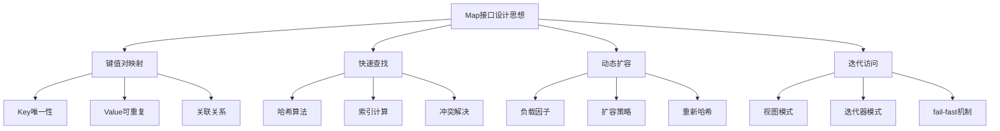
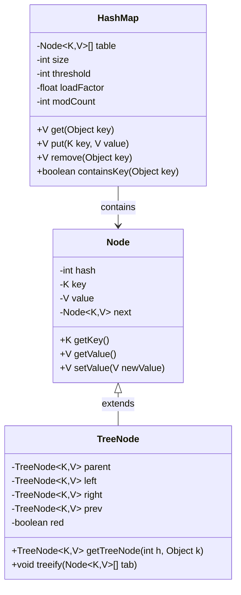

#### 目录介绍
- 01.Map核心思想
  - 1.1 基本特征
  - 1.2 键值对映射思想
  - 1.3 核心设计原则
  - 1.5 整体架构图
  - 1.6 核心设计理念
- 02.核心设计思路
  - 2.1 解决核心痛点
  - 2.2 核心数据结构
  - 2.3 哈希算法设计


## 01.Map核心思想

### 1.1 基本特征

- **数据结构**: 数组 + 链表 + 红黑树（JDK 1.8+）
- **时间复杂度**: 平均O(1)，最坏O(log n)
- **空间复杂度**: O(n)
- **线程安全**: 非线程安全
- **允许null**: 允许一个null键和多个null值

### 1.2 键值对映射思想



### 1.3 核心设计原则

1.高效性原则

- **O(1)平均时间复杂度**: 通过哈希算法实现常数时间的查找、插入、删除
- **空间时间权衡**: 通过负载因子平衡空间利用率和时间效率

2.灵活性原则

- **动态扩容**: 根据元素数量自动调整容量
- **null值支持**: 允许null键和null值，提高使用灵活性

一致性原则

- **哈希一致性**: 相同对象必须产生相同哈希值
- **equals一致性**: 哈希值相等的对象必须通过equals比较

## 02.核心设计思路

### 2.1 解决核心痛点

数组查找痛点

```java
// 传统数组查找 - O(n)时间复杂度
for (int i = 0; i < array.length; i++) {
    if (array[i].key.equals(targetKey)) {
        return array[i].value;
    }
}
```

HashMap解决方案

```java
// HashMap查找 - O(1)平均时间复杂度
public V get(Object key) {
    Node<K,V> e;
    return (e = getNode(hash(key), key)) == null ? null : e.value;
}
```

### 2.2 核心数据结构



### 2.3 哈希算法设计

哈希函数

```java
static final int hash(Object key) {
    int h;
    return (key == null) ? 0 : (h = key.hashCode()) ^ (h >>> 16);
}
```

索引计算

```java
// 通过位运算快速计算索引
int index = (table.length - 1) & hash;
```


