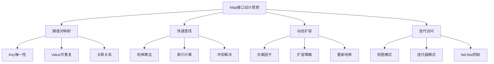
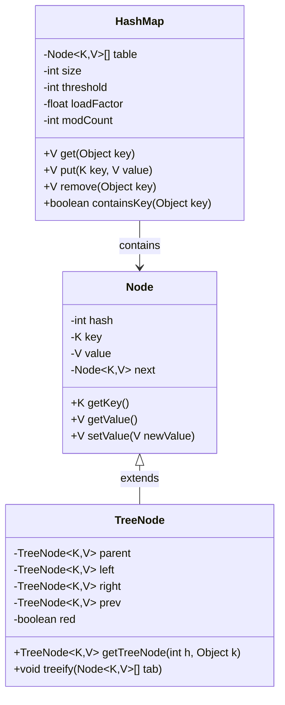
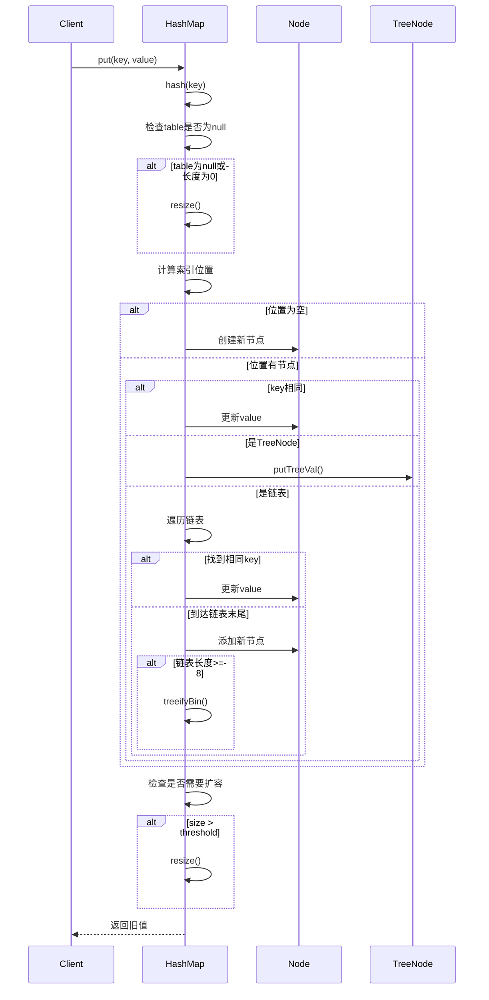
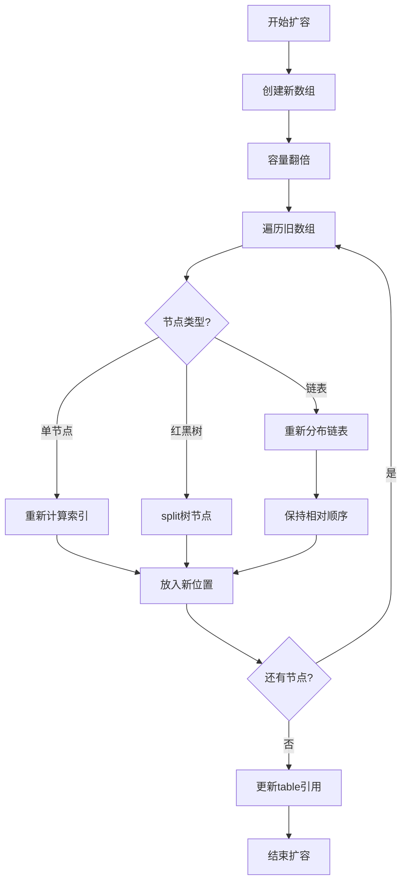
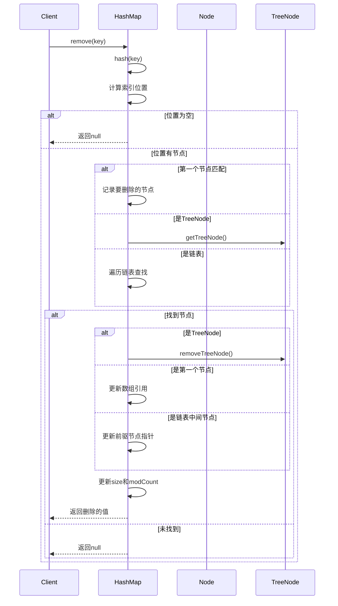
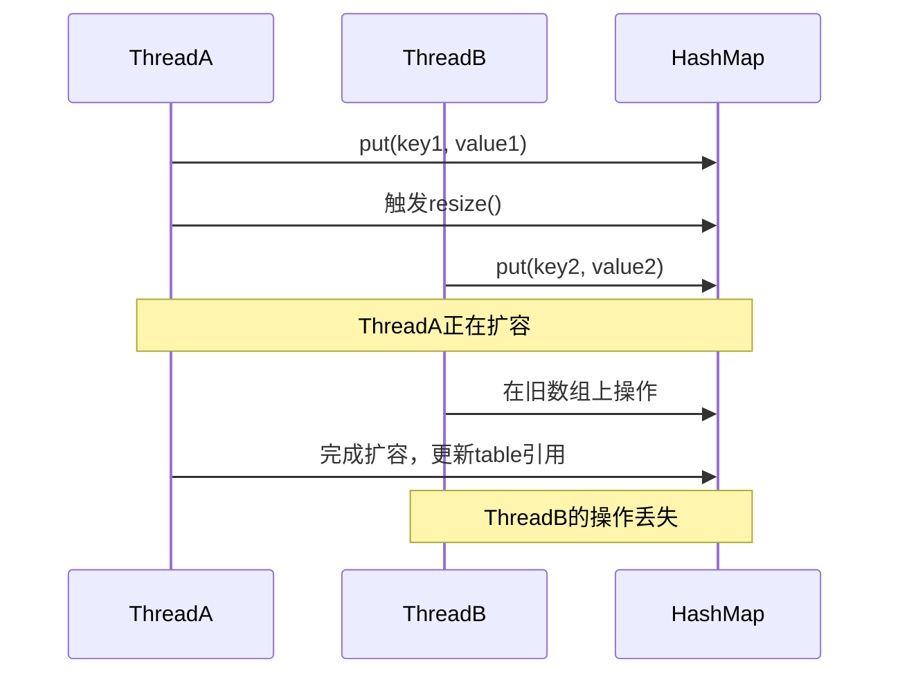

#### 目录介绍
- 01.Map核心思想
  - 1.1 基本特征
  - 1.2 键值对映射思想
  - 1.3 核心设计原则
  - 1.5 整体架构图
  - 1.6 核心设计理念
- 02.核心设计思路
  - 2.1 解决核心痛点
  - 2.2 核心数据结构
  - 2.3 哈希算法设计
  - 2.4 哈希冲突解决
  - 2.5 设计缺陷说明
- 03.插入元素设计
  - 3.1 插入元素思路
  - 3.2 put操作流程
  - 3.3 核心实现代码
- 04.扩容机制设计
  - 4.1 扩容机制思路
  - 4.2 扩容触发条件
  - 4.3 扩容流程
- 05.移除元素设计
  - 5.1 移除元素思路
  - 5.2 remove操作流程
  - 5.3 核心实现代码
- 06.访问元素设计
  - 6.1 访问元素思路
  - 6.2 get操作实现
  - 6.3 核心实现代码
  - 6.4 查找性能分析
- 07.线程安全性分析
  - 7.1 数据竞争问题
  - 7.2 扩容时的问题
  - 7.3 fail-fast机制
  - 7.4 线程安全解决方案
  - 7.5 性能对比
- 08.容量管理设计
  - 8.1 容量设计思路
  - 8.2 容量参数
  - 8.3 容量计算算法
  - 8.4 扩容时机
  - 8.5 扩容流程图
  - 8.6 负载因子影响


## 01.Map核心思想

### 1.1 基本特征

- **数据结构**: 数组 + 链表 + 红黑树（JDK 1.8+）
- **时间复杂度**: 平均O(1)，最坏O(log n)
- **空间复杂度**: O(n)
- **线程安全**: 非线程安全
- **允许null**: 允许一个null键和多个null值

### 1.2 键值对映射思想



### 1.3 核心设计原则

1.高效性原则

- **O(1)平均时间复杂度**: 通过哈希算法实现常数时间的查找、插入、删除
- **空间时间权衡**: 通过负载因子平衡空间利用率和时间效率

2.灵活性原则

- **动态扩容**: 根据元素数量自动调整容量
- **null值支持**: 允许null键和null值，提高使用灵活性

一致性原则

- **哈希一致性**: 相同对象必须产生相同哈希值
- **equals一致性**: 哈希值相等的对象必须通过equals比较

## 02.核心设计思路

### 2.1 解决核心痛点

数组查找痛点

```java
// 传统数组查找 - O(n)时间复杂度
for (int i = 0; i < array.length; i++) {
    if (array[i].key.equals(targetKey)) {
        return array[i].value;
    }
}
```

HashMap解决方案

```java
// HashMap查找 - O(1)平均时间复杂度
public V get(Object key) {
    Node<K,V> e;
    return (e = getNode(hash(key), key)) == null ? null : e.value;
}
```

### 2.2 核心数据结构



### 2.3 哈希算法设计

哈希函数

```java
static final int hash(Object key) {
    int h;
    return (key == null) ? 0 : (h = key.hashCode()) ^ (h >>> 16);
}
```

索引计算

```java
// 通过位运算快速计算索引
int index = (table.length - 1) & hash;
```

### 2.4 哈希冲突解决

```mermaid
graph TD
    A[哈希冲突] --> B[链地址法]
    B --> C[链表长度 < 8]
    B --> D[链表长度 >= 8]
    
    C --> E[使用链表]
    D --> F{数组长度 >= 64?}
    F -->|是| G[转换为红黑树]
    F -->|否| H[扩容数组]
    
    G --> I[O(log n)查找]
    E --> J[O(n)查找]
```

### 2.5 设计缺陷说明

线程安全问题

- **数据竞争**: 多线程并发修改可能导致数据不一致
- **死循环**: JDK 1.7中扩容时可能形成环形链表
- **数据丢失**: 并发put操作可能覆盖数据

性能退化问题

- **哈希碰撞攻击**: 恶意构造相同哈希值的key
- **内存碎片**: 频繁扩容可能导致内存碎片
- **缓存不友好**: 链表结构对CPU缓存不友好


## 03.插入元素设计

### 3.1 插入元素思路


### 3.2 put操作流程



### 3.3 核心实现代码

核心实现代码分析，putVal方法

```java
final V putVal(int hash, K key, V value, boolean onlyIfAbsent, boolean evict) {
    Node<K,V>[] tab; Node<K,V> p; int n, i;
    
    // 1. 初始化或扩容
    if ((tab = table) == null || (n = tab.length) == 0)
        n = (tab = resize()).length;
    
    // 2. 计算索引，检查是否有冲突
    if ((p = tab[i = (n - 1) & hash]) == null)
        tab[i] = newNode(hash, key, value, null);
    else {
        Node<K,V> e; K k;
        
        // 3. 检查第一个节点
        if (p.hash == hash && ((k = p.key) == key || (key != null && key.equals(k))))
            e = p;
        // 4. 红黑树处理
        else if (p instanceof TreeNode)
            e = ((TreeNode<K,V>)p).putTreeVal(this, tab, hash, key, value);
        // 5. 链表处理
        else {
            for (int binCount = 0; ; ++binCount) {
                if ((e = p.next) == null) {
                    p.next = newNode(hash, key, value, null);
                    // 链表长度达到阈值，转换为红黑树
                    if (binCount >= TREEIFY_THRESHOLD - 1)
                        treeifyBin(tab, hash);
                    break;
                }
                if (e.hash == hash && ((k = e.key) == key || (key != null && key.equals(k))))
                    break;
                p = e;
            }
        }
        
        // 6. 更新已存在的key
        if (e != null) {
            V oldValue = e.value;
            if (!onlyIfAbsent || oldValue == null)
                e.value = value;
            afterNodeAccess(e);
            return oldValue;
        }
    }
    
    // 7. 修改计数和扩容检查
    ++modCount;
    if (++size > threshold)
        resize();
    afterNodeInsertion(evict);
    return null;
}
```

## 04.扩容机制设计

### 4.1 扩容机制思路


### 4.2 扩容触发条件

```java
// 当元素数量超过阈值时触发扩容
if (++size > threshold)
    resize();

// 阈值计算
threshold = capacity * loadFactor;
```

### 4.3 扩容流程



## 05.移除元素设计

### 5.1 移除元素思路


### 5.2 remove操作流程



### 5.3 核心实现代码

```java
final Node<K,V> removeNode(int hash, Object key, Object value,
                           boolean matchValue, boolean movable) {
    Node<K,V>[] tab; Node<K,V> p; int n, index;
    
    // 1. 检查table和定位节点
    if ((tab = table) != null && (n = tab.length) > 0 &&
        (p = tab[index = (n - 1) & hash]) != null) {
        
        Node<K,V> node = null, e; K k; V v;
        
        // 2. 检查第一个节点
        if (p.hash == hash && ((k = p.key) == key || (key != null && key.equals(k))))
            node = p;
        else if ((e = p.next) != null) {
            // 3. 红黑树查找
            if (p instanceof TreeNode)
                node = ((TreeNode<K,V>)p).getTreeNode(hash, key);
            // 4. 链表查找
            else {
                do {
                    if (e.hash == hash &&
                        ((k = e.key) == key || (key != null && key.equals(k)))) {
                        node = e;
                        break;
                    }
                    p = e;
                } while ((e = e.next) != null);
            }
        }
        
        // 5. 删除找到的节点
        if (node != null && (!matchValue || (v = node.value) == value ||
                           (value != null && value.equals(v)))) {
            if (node instanceof TreeNode)
                ((TreeNode<K,V>)node).removeTreeNode(this, tab, movable);
            else if (node == p)
                tab[index] = node.next;
            else
                p.next = node.next;
            
            ++modCount;
            --size;
            afterNodeRemoval(node);
            return node;
        }
    }
    return null;
}
```

## 06.访问元素设计
### 6.1 访问元素思路


### 6.2 get操作实现

```mermaid
flowchart TD
    A[get(key)] --> B[计算hash值]
    B --> C[计算索引位置]
    C --> D{位置是否为空?}
    
    D -->|是| E[返回null]
    D -->|否| F[检查第一个节点]
    
    F --> G{key匹配?}
    G -->|是| H[返回value]
    G -->|否| I{是否有next节点?}
    
    I -->|否| E
    I -->|是| J{是TreeNode?}
    
    J -->|是| K[红黑树查找]
    J -->|否| L[链表遍历查找]
    
    K --> M{找到?}
    L --> M
    
    M -->|是| H
    M -->|否| E
```

### 6.3 核心实现代码

```java
final Node<K,V> getNode(int hash, Object key) {
    Node<K,V>[] tab; Node<K,V> first, e; int n; K k;
    
    // 1. 检查table并定位第一个节点
    if ((tab = table) != null && (n = tab.length) > 0 &&
        (first = tab[(n - 1) & hash]) != null) {
        
        // 2. 检查第一个节点
        if (first.hash == hash && 
            ((k = first.key) == key || (key != null && key.equals(k))))
            return first;
        
        // 3. 检查后续节点
        if ((e = first.next) != null) {
            // 红黑树查找
            if (first instanceof TreeNode)
                return ((TreeNode<K,V>)first).getTreeNode(hash, key);
            
            // 链表查找
            do {
                if (e.hash == hash &&
                    ((k = e.key) == key || (key != null && key.equals(k))))
                    return e;
            } while ((e = e.next) != null);
        }
    }
    return null;
}
```

### 6.4 查找性能分析

| 数据结构 | 平均时间复杂度 | 最坏时间复杂度 | 空间复杂度 |
|---------|---------------|---------------|-----------|
| 数组索引 | O(1) | O(1) | O(n) |
| 链表查找 | O(1) | O(n) | O(n) |
| 红黑树查找 | O(1) | O(log n) | O(n) |

## 07.线程安全性分析

### 7.1 数据竞争问题

```java
// 线程A和线程B同时执行put操作
Thread A: if ((p = tab[i = (n - 1) & hash]) == null)  // 检查位置为空
Thread B: if ((p = tab[i = (n - 1) & hash]) == null)  // 同样检查位置为空
Thread A: tab[i] = newNode(hash, key, value, null);   // 创建节点A
Thread B: tab[i] = newNode(hash, key, value, null);   // 覆盖节点A，数据丢失
```

### 7.2 扩容时的问题



### 7.3 fail-fast机制

```java
// 迭代器检查并发修改
final class KeyIterator extends HashIterator implements Iterator<K> {
    public final K next() { 
        return nextNode().key; 
    }
}

abstract class HashIterator {
    int expectedModCount;  // 期望的修改次数
    
    HashIterator() {
        expectedModCount = modCount;
    }
    
    final Node<K,V> nextNode() {
        if (modCount != expectedModCount)
            throw new ConcurrentModificationException();
        // ...
    }
}
```

### 7.4 线程安全解决方案

Collections.synchronizedMap

```java
Map<String, String> syncMap = Collections.synchronizedMap(new HashMap<>());
```

ConcurrentHashMap

```java
Map<String, String> concurrentMap = new ConcurrentHashMap<>();
```

### 7.5 性能对比

| 方案 | 读性能 | 写性能 | 内存开销 | 适用场景 |
|------|--------|--------|----------|----------|
| HashMap | 最高 | 最高 | 最低 | 单线程 |
| synchronizedMap | 低 | 低 | 低 | 读写均衡，低并发 |
| ConcurrentHashMap | 高 | 中 | 中 | 高并发 |

## 08.容量管理设计

### 8.1 容量设计思路


### 8.2 容量参数

```java
// 默认初始容量 - 必须是2的幂
static final int DEFAULT_INITIAL_CAPACITY = 1 << 4; // 16

// 最大容量
static final int MAXIMUM_CAPACITY = 1 << 30;

// 默认负载因子
static final float DEFAULT_LOAD_FACTOR = 0.75f;

// 树化阈值
static final int TREEIFY_THRESHOLD = 8;

// 反树化阈值
static final int UNTREEIFY_THRESHOLD = 6;

// 最小树化容量
static final int MIN_TREEIFY_CAPACITY = 64;
```

### 8.3 容量计算算法


### 8.4 扩容时机


### 8.5 扩容流程图


### 8.6 负载因子影响


