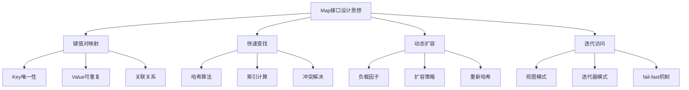

#### 目录介绍
- 01.Map核心思想
  - 1.1 基本特征
  - 1.2 键值对映射思想
  - 1.3 整体架构图
  - 1.6 核心设计理念
- 02.Map集合如何设计
  - 2.1 使用数组设计
  - 2.2 使用链表设计
  - 2.3 设计考虑点
  - 2.4 数据迁移和安全
  - 2.5 元素效率考量

## 01.Map核心思想

### 1.1 基本特征

- **数据结构**: 数组 + 链表 + 红黑树（JDK 1.8+）
- **时间复杂度**: 平均O(1)，最坏O(log n)
- **空间复杂度**: O(n)
- **线程安全**: 非线程安全
- **允许null**: 允许一个null键和多个null值

### 1.2 键值对映射思想

