# 41.消息机制设计思想
#### 目录介绍
- [01.概述与背景](#01概述与背景)
  - [1.1 消息机制背景](#11-消息机制背景)
  - [1.2 主要解决问题](#12-主要解决问题)
  - [1.3 设计目标](#13-设计目标)
  - [1.4 设计哲学思想](#14-设计哲学思想)
  - [1.5 核心设计原则](#15-核心设计原则)
- [02.不同平台机制](#02不同平台机制)
  - [2.1 Android消息机制](#21-android消息机制)
  - [2.2 iOS消息机制](#22-ios消息机制)
  - [2.3 Web消息机制](#23-web消息机制)
  - [2.4 平台对比分析](#24-平台对比分析)
  - [2.5 抽象能力对比](#25-抽象能力对比)
  - [2.6 通用抽象思路](#26-通用抽象思路)
  - [2.7 设计核心洞察](#27-设计核心洞察)
- [03.消息机制架构](#03消息机制架构)
  - [3.1 整体架构图](#31-整体架构图)
  - [3.2 核心组件类图](#32-核心组件类图)
- [04.消息体设计原理](#04消息体设计原理)
  - [4.1 消息结构设计](#41-消息结构设计)
  - [4.2 同步和异步消息](#42-同步和异步消息)
  - [4.3 消息类型分类](#43-消息类型分类)
- [05.消息队列设计](#05消息队列设计)
  - [5.1 队列数据结构](#51-队列数据结构)
  - [5.2 消息入队算法](#52-消息入队算法)
  - [5.3 队列核心实现](#53-队列核心实现)
  - [5.4 队列管理策略](#54-队列管理策略)
- [06.消息处理器设计](#06消息处理器设计)
  - [6.1 Handler设计模式](#61-handler设计模式)
  - [6.2 处理器抽象](#62-处理器抽象)
  - [6.3 消息分发机制](#63-消息分发机制)
  - [6.4 生命周期管理](#64-生命周期管理)
  - [6.5 最佳实践建议](#65-最佳实践建议)
- [07.Looper设计原理](#07looper设计原理)
  - [7.1 Looper设计思想](#71-looper设计思想)
  - [7.2 Looper工作流程](#72-looper工作流程)
  - [7.3 Looper核心实现](#73-looper核心实现)
  - [7.4 多Looper架构设计](#74-多looper架构设计)
  - [7.5 支持多Looper](#75-支持多looper)


## 01.概述与背景

### 1.1 消息机制背景

在现代移动应用开发中，消息机制是解决异步编程和线程间通信的核心技术。其设计背景和必要性体现在以下几个方面：

- **多线程环境**: 现代应用需要处理UI渲染、网络请求、数据库操作等多种任务
- **异步编程需求**: 避免阻塞主线程，提升用户体验
- **事件驱动架构**: 响应用户交互、系统事件、网络回调等各种事件
- **线程安全**: 确保多线程环境下的数据一致性和操作安全性

### 1.2 主要解决问题

**疑惑**：为什么Android，iOS等不采用多线程直接更新UI的方式？

**答疑**：如果允许多线程同时修改UI，就需要对所有UI操作加锁，这会带来两个严重问题：

1. **性能下降**：每次UI操作都需要获取锁，频繁的锁竞争会严重影响渲染性能
2. **死锁风险**：复杂的UI操作涉及多个View层级，多线程加锁容易产生死锁

Handler机制正是为了解决线程间通信问题而设计的。它提供了一种优雅的方式，让任意线程都能向目标线程的消息队列投递消息，由目标线程按序处理。

### 1.3 设计目标

| 目标 | 描述 | 实现方式 |
|------|------|----------|
| **线程安全** | 确保多线程环境下的数据一致性 | 消息队列同步机制 |
| **高性能** | 最小化消息传递开销 | 高效的队列数据结构 |
| **易用性** | 提供简洁的API接口 | 封装复杂的底层实现 |
| **可扩展性** | 支持自定义消息类型和处理器 | 插件化架构设计 |
| **可靠性** | 保证消息不丢失，按序处理 | 持久化和重试机制 |

### 1.4 设计哲学思想

消息机制作为现代操作系统和应用框架的基础设施，体现了多个重要的设计哲学：

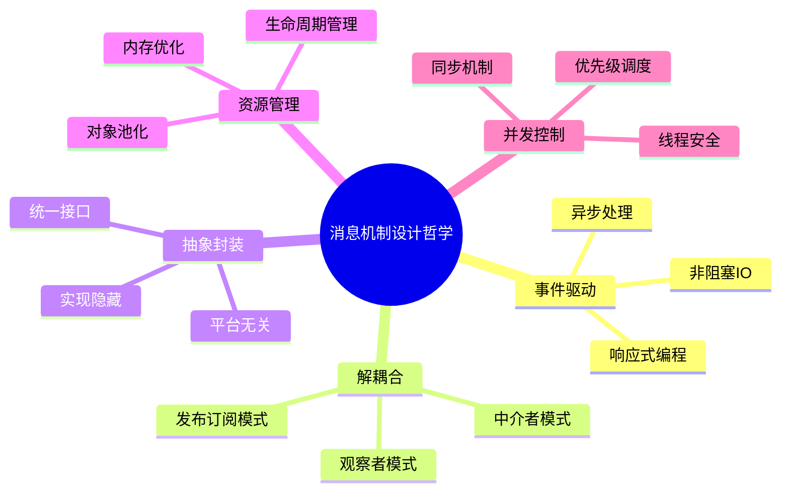

### 1.5 核心设计原则

| 设计原则 | Android实现 | iOS实现 | 设计意图 |
|----------|-------------|---------|----------|
| **单一职责** | Handler专注消息处理 | RunLoop专注事件循环 | 每个组件职责明确 |
| **开闭原则** | 可扩展Handler类型 | 可添加RunLoop Source | 对扩展开放，对修改封闭 |
| **依赖倒置** | 基于接口回调 | 基于delegate模式 | 依赖抽象而非具体实现 |
| **接口隔离** | 不同类型的消息接口 | 不同类型的事件源 | 客户端不依赖不需要的接口 |
| **最少知识** | 通过消息解耦 | 通过事件解耦 | 减少组件间直接依赖 |


## 02.不同平台机制

### 2.1 Android消息机制

Handler消息机制的四大组件：

```
┌──────────────────────────────────────────────────┐
│                    Thread                         │
│  ┌──────────┐    ┌──────────────┐                │
│  │ Handler   │───→│ MessageQueue │                │
│  │ 消息处理器 │    │ 消息队列      │                │
│  └──────────┘    │ ┌──────────┐ │  ┌──────────┐  │
│       ↑          │ │ Message  │ │  │  Looper   │  │
│       │          │ │ Message  │←│──│ 消息循环   │  │
│       │          │ │ Message  │ │  │           │  │
│  处理消息        │ └──────────┘ │  └──────────┘  │
│                  └──────────────┘                │
└──────────────────────────────────────────────────┘
```

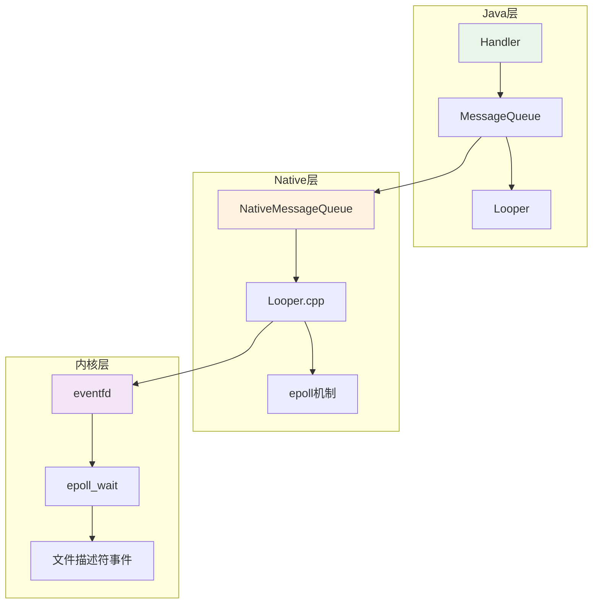

Android消息机制的设计思想，体现了**分层架构**和**责任链模式**的设计思想：

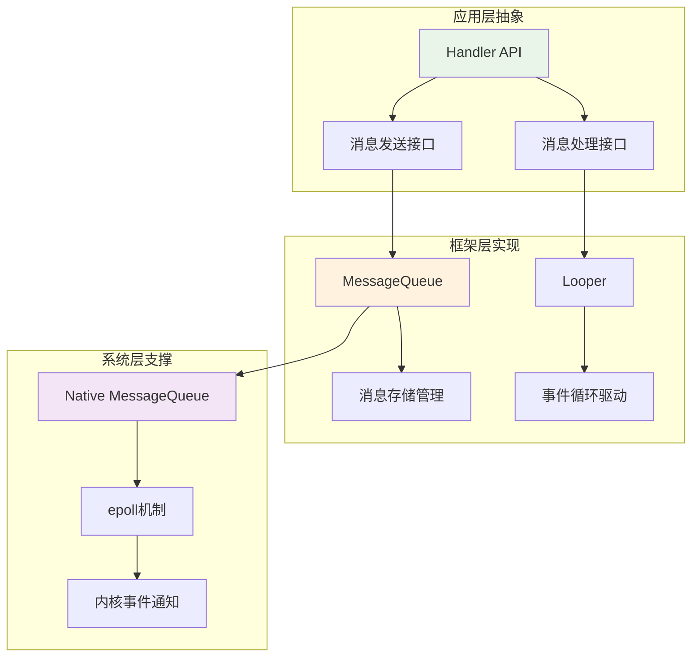


### 2.2 iOS消息机制

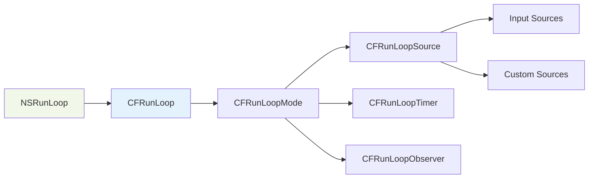

iOS的RunLoop体现了**模式驱动**和**事件源抽象**的设计思想：

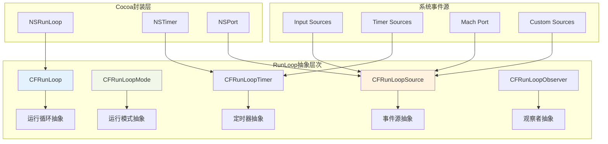


> 模式抽象（Mode Abstraction）

```objc
// RunLoop模式的抽象设计
typedef struct __CFRunLoopMode {
    CFStringRef _name;              // 模式名称抽象
    CFMutableSetRef _sources0;      // Source0事件源集合抽象
    CFMutableSetRef _sources1;      // Source1事件源集合抽象
    CFMutableArrayRef _observers;   // 观察者集合抽象
    CFMutableArrayRef _timers;      // 定时器集合抽象
    CFMutableDictionaryRef _portToV1SourceMap; // 端口映射抽象
} CFRunLoopMode;

// 预定义模式的抽象
FOUNDATION_EXPORT CFStringRef const kCFRunLoopDefaultMode;     // 默认模式
FOUNDATION_EXPORT CFStringRef const kCFRunLoopCommonModes;     // 通用模式标记
```

**抽象设计特点**：

1. **模式隔离**: 不同模式下的事件源完全隔离，实现了运行时的上下文抽象
2. **集合管理**: 通过集合抽象管理不同类型的事件源
3. **动态切换**: 支持运行时动态切换模式，实现了行为的抽象切换

> 事件源抽象（Source Abstraction）

```objc
// Source0: 用户事件源抽象
typedef struct {
    CFIndex version;
    void *  info;
    const void *(*retain)(const void *info);
    void    (*release)(const void *info);
    CFStringRef (*copyDescription)(const void *info);
    Boolean (*equal)(const void *info1, const void *info2);
    CFHashCode  (*hash)(const void *info);
    void    (*schedule)(void *info, CFRunLoopRef rl, CFStringRef mode);
    void    (*cancel)(void *info, CFRunLoopRef rl, CFStringRef mode);
    void    (*perform)(void *info);  // 事件处理抽象
} CFRunLoopSourceContext;

// Source1: 系统事件源抽象
typedef struct {
    CFIndex version;
    void *  info;
    const void *(*retain)(const void *info);
    void    (*release)(const void *info);
    CFStringRef (*copyDescription)(const void *info);
    Boolean (*equal)(const void *info1, const void *info2);
    CFHashCode  (*hash)(const void *info);
    mach_port_t (*getPort)(void *info);     // 端口获取抽象
    void *  (*perform)(void *msg, CFIndex size, CFAllocatorRef allocator, void *info);
} CFRunLoopSourceContext1;
```

**抽象能力体现**：
1. **事件类型抽象**: Source0抽象用户事件，Source1抽象系统事件
2. **生命周期抽象**: 通过函数指针抽象事件源的生命周期管理
3. **处理逻辑抽象**: 通过回调函数抽象事件的具体处理逻辑

> 观察者抽象（Observer Abstraction）

```objc
// RunLoop状态观察抽象
typedef CF_OPTIONS(CFOptionFlags, CFRunLoopActivity) {
    kCFRunLoopEntry         = (1UL << 0),    // 进入RunLoop
    kCFRunLoopBeforeTimers  = (1UL << 1),    // 处理Timer前
    kCFRunLoopBeforeSources = (1UL << 2),    // 处理Source前
    kCFRunLoopBeforeWaiting = (1UL << 5),    // 进入休眠前
    kCFRunLoopAfterWaiting  = (1UL << 6),    // 休眠后唤醒
    kCFRunLoopExit          = (1UL << 7),    // 退出RunLoop
    kCFRunLoopAllActivities = 0x0FFFFFFFU    // 所有状态
};

// 观察者回调抽象
typedef void (*CFRunLoopObserverCallBack)(CFRunLoopObserverRef observer, 
                                          CFRunLoopActivity activity, 
                                          void *info);
```

**抽象设计优势**：
1. **状态抽象**: 将RunLoop的复杂状态抽象为有限的几个关键节点
2. **监控抽象**: 提供统一的监控接口，抽象了状态变化的通知机制
3. **扩展抽象**: 支持自定义观察者，实现了监控逻辑的抽象扩展

### 2.3 Web消息机制


### 2.4 平台对比分析

| 特性 | Android Handler | iOS RunLoop | Web Event Loop |
|------|-----------------|-------------|----------------|
| **消息队列** | MessageQueue | CFRunLoopMode | Task Queue |
| **事件循环** | Looper.loop() | CFRunLoopRun | Event Loop |
| **线程模型** | 多线程支持 | 主要在主线程 | 单线程 |
| **底层机制** | epoll | kqueue/select | libuv |
| **优先级** | 时间排序 | Mode切换 | 微任务/宏任务 |


### 2.5 抽象能力对比

| 抽象维度 | Android | iOS | Web | 抽象程度评价 |
|----------|---------|-----|-----|--------------|
| **消息抽象** | Message类统一抽象 | 多种Source类型抽象 | Event对象抽象 | Android最统一 |
| **队列抽象** | 单一MessageQueue | 多Mode管理 | 多Queue分层 | iOS最灵活 |
| **处理抽象** | Handler统一处理 | 回调函数处理 | Promise/async处理 | Web最现代 |
| **时间抽象** | when字段+延时 | Timer独立抽象 | setTimeout分离 | iOS最清晰 |
| **生命周期** | prepare/loop/quit | run/stop模式 | 自动管理 | Android最明确 |


### 2.6 通用抽象思路

所有平台都采用了事件驱动的抽象模型：

```mermaid
sequenceDiagram
    participant Producer as 事件生产者
    participant Queue as 事件队列
    participant Loop as 事件循环
    participant Handler as 事件处理器
    
    Note over Producer,Handler: 通用事件驱动抽象模型
    
    Producer->>Queue: 产生事件
    Queue->>Queue: 事件排队
    Loop->>Queue: 获取事件
    Queue->>Loop: 返回事件
    Loop->>Handler: 分发事件
    Handler->>Handler: 处理事件
    Handler-->>Loop: 处理完成
    Loop->>Queue: 继续获取
```

### 2.7 设计核心洞察

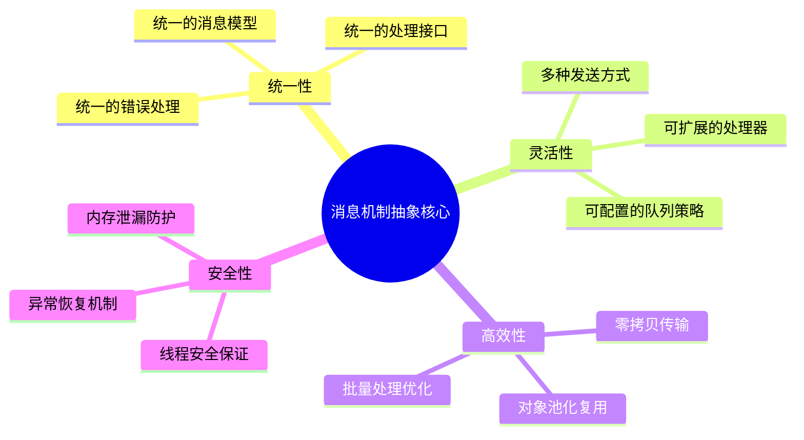

## 03.消息机制架构

### 3.1 整体架构图

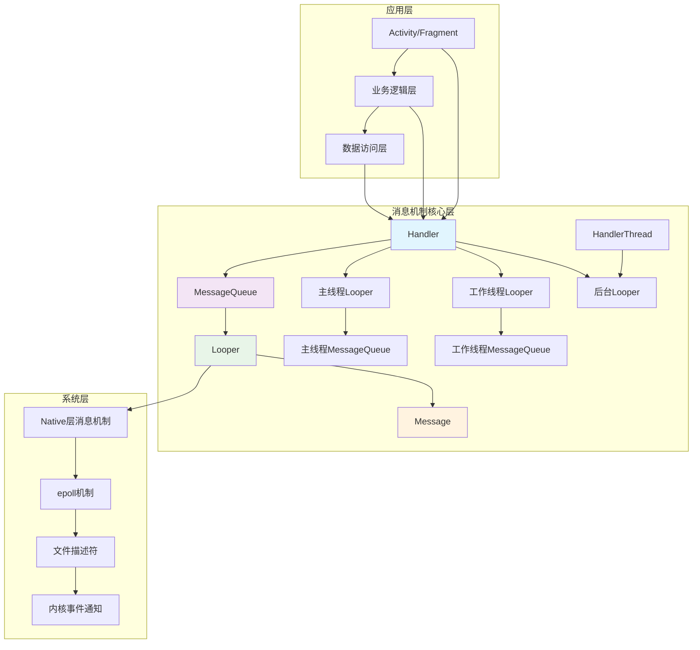

### 3.2 核心组件类图

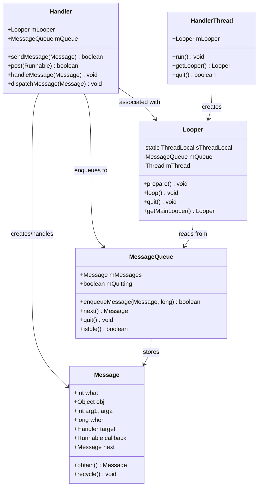

## 04.消息体设计原理

### 4.1 消息结构设计

消息是消息机制的基本单元，其设计需要考虑性能、内存管理和扩展性：

```java
public final class Message implements Parcelable {
    // 消息标识符
    public int what;
    
    // 简单数据参数
    public int arg1;
    public int arg2;
    
    // 复杂数据对象
    public Object obj;
    
    // 消息携带的数据包
    Bundle data;
    
    // 消息处理器
    Handler target;
    
    // 回调函数
    Runnable callback;
    
    // 消息发送时间
    long when;
    
    // 链表指针（用于消息队列）
    Message next;
    
    // 消息池相关
    private static final Object sPoolSync = new Object();
    private static Message sPool;
    private static int sPoolSize = 0;
    private static final int MAX_POOL_SIZE = 50;
}
```

**设计思想分析**：

- **数据抽象**: 通过`what`、`obj`、`Bundle`等提供多层次的数据抽象
- **行为抽象**: 通过`Handler`和`Runnable`抽象消息的处理行为
- **时间抽象**: 通过`when`字段抽象消息的时间属性
- **结构抽象**: 通过链表结构抽象队列的存储方式

### 4.2 同步和异步消息

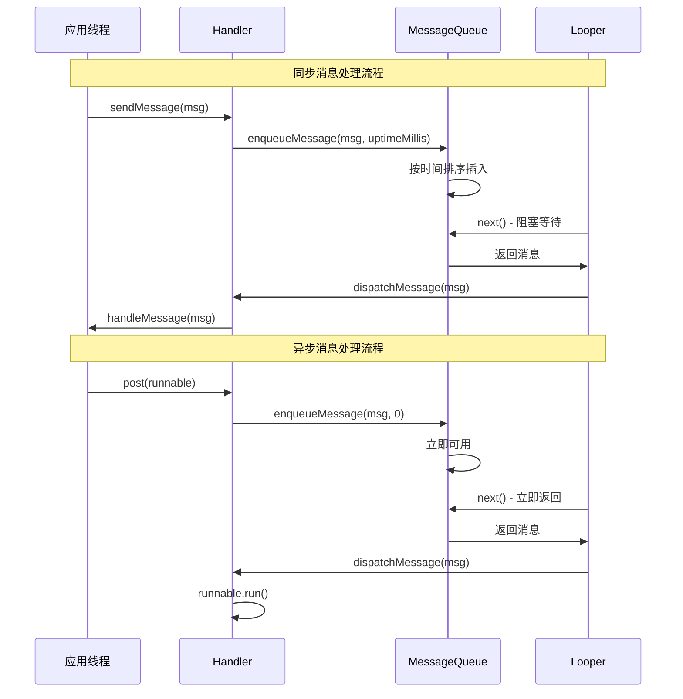

### 4.3 消息类型分类

| 消息类型 | 特点 | 使用场景 | 处理方式 |
|----------|------|----------|----------|
| **普通消息** | 按时间顺序处理 | 一般业务逻辑 | handleMessage() |
| **延时消息** | 指定时间后处理 | 定时任务、超时处理 | sendMessageDelayed() |
| **屏障消息** | 阻塞同步消息 | 优先处理异步消息 | postSyncBarrier() |
| **异步消息** | 不受屏障影响 | UI刷新、高优先级任务 | setAsynchronous(true) |
| **空闲消息** | 队列空闲时处理 | 资源清理、预加载 | IdleHandler |

## 05.消息队列设计

### 5.1 队列数据结构

消息队列采用**单链表**结构，按照消息的执行时间进行排序：

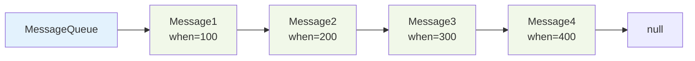

### 5.2 消息入队算法

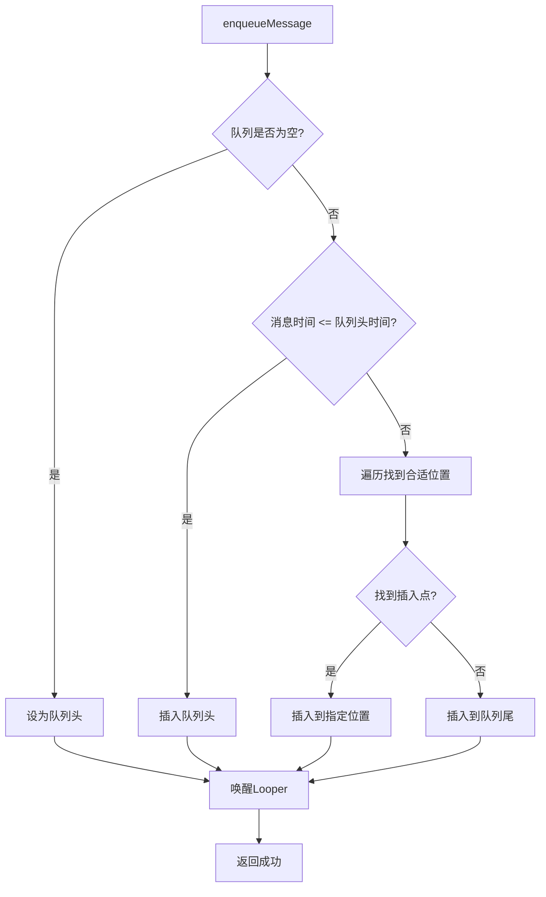

### 5.3 队列核心实现

```java
public final class MessageQueue {
    Message mMessages; // 队列头
    private final Object mLock = new Object();
    
    boolean enqueueMessage(Message msg, long when) {
        synchronized (mLock) {
            msg.when = when;
            Message p = mMessages;
            boolean needWake;
            
            // 插入到队列头部
            if (p == null || when == 0 || when < p.when) {
                msg.next = p;
                mMessages = msg;
                needWake = mBlocked;
            } else {
                // 找到合适的插入位置
                needWake = mBlocked && p.target == null && msg.isAsynchronous();
                Message prev;
                for (;;) {
                    prev = p;
                    p = p.next;
                    if (p == null || when < p.when) {
                        break;
                    }
                    if (needWake && p.isAsynchronous()) {
                        needWake = false;
                    }
                }
                msg.next = p;
                prev.next = msg;
            }
            
            // 唤醒等待的Looper
            if (needWake) {
                nativeWake(mPtr);
            }
        }
        return true;
    }
}
```

### 5.4 队列管理策略

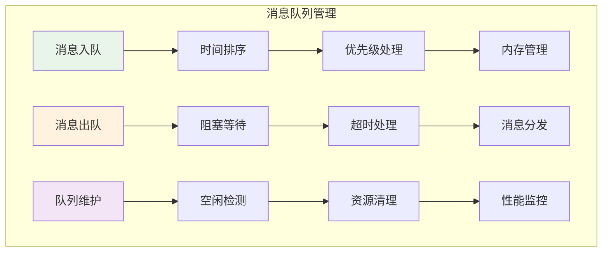

## 06.消息处理器设计

### 6.1 Handler设计模式

Handler采用**策略模式**和**模板方法模式**，提供灵活的消息处理机制：

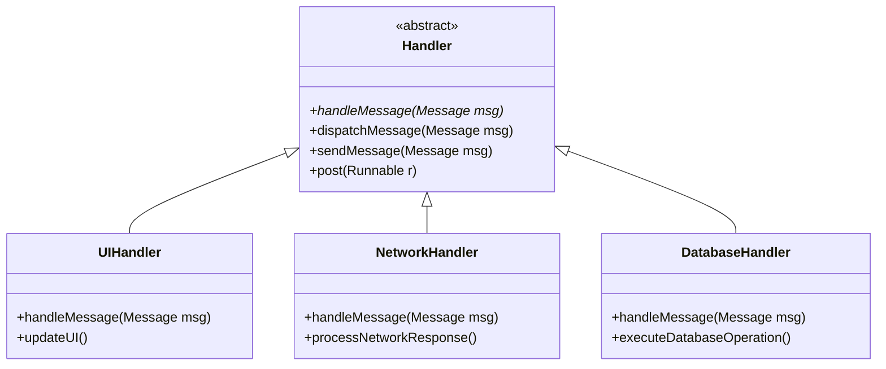

### 6.2 处理器抽象

```java
public class Handler {
    // 抽象能力1: 消息分发的抽象
    public void dispatchMessage(Message msg) {
        if (msg.callback != null) {
            handleCallback(msg);        // 回调方式抽象
        } else {
            if (mCallback != null) {
                if (mCallback.handleMessage(msg)) {
                    return;             // 拦截器方式抽象
                }
            }
            handleMessage(msg);         // 继承方式抽象
        }
    }
    
    // 抽象能力2: 消息发送的抽象
    public final boolean sendMessage(Message msg) {
        return sendMessageDelayed(msg, 0);
    }
    
    public final boolean sendMessageDelayed(Message msg, long delayMillis) {
        if (delayMillis < 0) {
            delayMillis = 0;
        }
        return sendMessageAtTime(msg, SystemClock.uptimeMillis() + delayMillis);
    }
    
    // 抽象能力3: 时间处理的抽象
    public boolean sendMessageAtTime(Message msg, long uptimeMillis) {
        MessageQueue queue = mQueue;
        if (queue == null) {
            return false;
        }
        return enqueueMessage(queue, msg, uptimeMillis);
    }
}
```

**抽象能力体现**：
1. **处理方式抽象**: 支持回调、拦截器、继承三种处理方式
2. **时间维度抽象**: 将立即发送、延时发送、定时发送统一抽象
3. **错误处理抽象**: 统一的异常处理和容错机制


### 6.3 消息分发机制

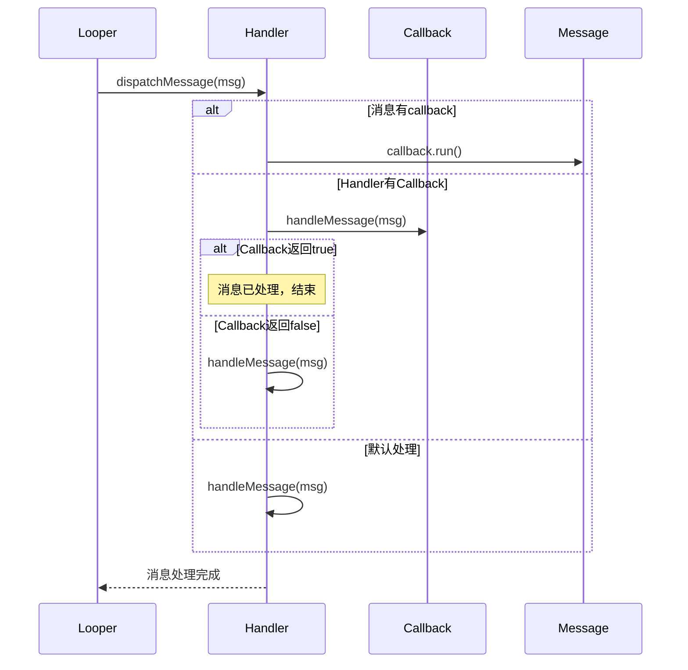


### 6.4 生命周期管理

### 6.5 最佳实践建议

| 实践 | 说明 | 代码示例 |
|------|------|----------|
| **使用Message.obtain()** | 复用消息对象，减少GC | `Message.obtain(handler, what, obj)` |
| **及时清理Handler** | 避免内存泄漏 | `handler.removeCallbacksAndMessages(null)` |
| **使用WeakReference** | 防止Activity泄漏 | `WeakReference<Activity> activityRef` |
| **合理设置消息优先级** | 保证重要消息及时处理 | `msg.setAsynchronous(true)` |
| **避免在Handler中执行耗时操作** | 防止ANR | 使用线程池处理耗时任务 |


## 07.Looper设计原理

### 7.1 Looper设计思想

Looper是消息机制的核心驱动器，采用**事件循环**模式，其设计思想包括：

1. **单线程模型**: 每个线程最多只能有一个Looper
2. **事件驱动**: 基于消息队列的事件循环
3. **阻塞等待**: 没有消息时进入休眠状态
4. **优先级调度**: 支持不同优先级的消息处理

```java
public final class Looper {
    // 抽象能力1: 线程绑定抽象
    static final ThreadLocal<Looper> sThreadLocal = new ThreadLocal<Looper>();
    
    // 抽象能力2: 事件循环抽象
    public static void loop() {
        final Looper me = myLooper();
        final MessageQueue queue = me.mQueue;
        
        // 无限循环的抽象实现
        for (;;) {
            Message msg = queue.next(); // 可能阻塞
            if (msg == null) {
                return; // 退出循环的抽象条件
            }
            
            // 消息分发的抽象
            try {
                msg.target.dispatchMessage(msg);
            } catch (Exception exception) {
                throw exception;
            } finally {
                msg.recycleUnchecked();
            }
        }
    }
    
    // 抽象能力3: 生命周期抽象
    public void quit() {
        mQueue.quit(false);
    }
    
    public void quitSafely() {
        mQueue.quit(true);
    }
}
```

### 7.2 Looper工作流程

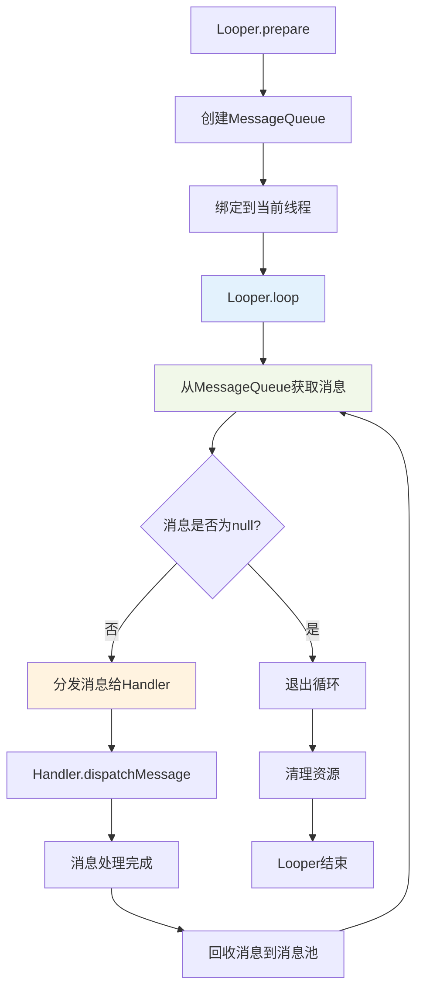

### 7.3 Looper核心实现

```java
public final class Looper {
    static final ThreadLocal<Looper> sThreadLocal = new ThreadLocal<Looper>();
    private static Looper sMainLooper;
    
    final MessageQueue mQueue;
    final Thread mThread;
    
    public static void prepare() {
        prepare(true);
    }
    
    private static void prepare(boolean quitAllowed) {
        if (sThreadLocal.get() != null) {
            throw new RuntimeException("Only one Looper may be created per thread");
        }
        sThreadLocal.set(new Looper(quitAllowed));
    }
    
    public static void loop() {
        final Looper me = myLooper();
        if (me == null) {
            throw new RuntimeException("No Looper; Looper.prepare() wasn't called on this thread.");
        }
        
        final MessageQueue queue = me.mQueue;
        
        for (;;) {
            Message msg = queue.next(); // 可能阻塞
            if (msg == null) {
                // 没有消息表示消息队列正在退出
                return;
            }
            
            try {
                msg.target.dispatchMessage(msg);
            } finally {
                msg.recycleUnchecked();
            }
        }
    }
}
```

### 7.4 多Looper架构设计

应用可以有多个Looper，每个线程最多一个：

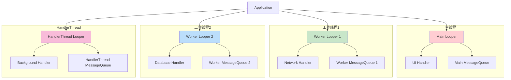

### 7.5 支持多Looper

| 原因 | 说明 | 优势 |
|------|------|------|
| **线程隔离** | 不同线程处理不同类型任务 | 避免相互影响，提高稳定性 |
| **性能优化** | 分散处理负载 | 充分利用多核CPU资源 |
| **职责分离** | UI线程专注界面更新 | 后台线程处理耗时操作 |
| **优先级管理** | 不同优先级的任务分离 | 保证关键任务及时处理 |


