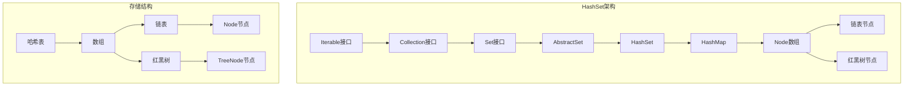
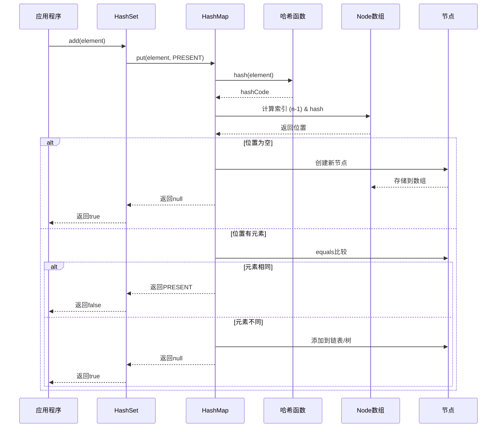
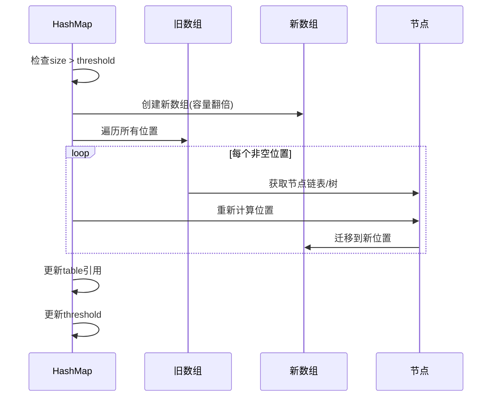

# HashSet集合设计与实现技术分析报告

## 目录
1. [概述](#概述)
2. [Set集合设计核心思想](#set集合设计核心思想)
3. [核心设计思路与痛点解决](#核心设计思路与痛点解决)
4. [添加元素设计与实现](#添加元素设计与实现)
5. [移除元素设计与实现](#移除元素设计与实现)
6. [访问元素设计](#访问元素设计)
7. [线程安全性分析](#线程安全性分析)
8. [容量管理设计](#容量管理设计)
9. [架构图与时序图](#架构图与时序图)
10. [设计缺陷与不足](#设计缺陷与不足)
11. [总结](#总结)

## 概述


## Set集合设计核心思想

### 1. 唯一性保证


### 2. 快速查找

### 3. 无序性

## 核心设计思路与痛点解决

### 设计思路


## 添加元素设计与实现

### 添加流程


### 核心实现代码分析


### 数据存储机制


### 扩容与迁移


## 移除元素设计与实现

### 移除流程


### 高效删除实现


### 删除优化策略


## 访问元素设计

### 查找机制


### 核心查找代码


### 迭代器设计


## 线程安全性分析

### 非线程安全设计


### 并发问题示例


### 线程安全解决方案


## 容量管理设计

### 容量参数


### 容量管理策略


### 性能优化

## 架构图与时序图

### 整体架构图



### 添加元素时序图



### 扩容时序图



## 设计缺陷与不足

### 1. 线程安全问题

**缺陷**: 非线程安全设计
- 并发修改可能导致数据不一致
- 扩容时可能出现无限循环
- 迭代器fail-fast机制不能保证线程安全

**影响**: 多线程环境下使用需要额外同步

### 2. 内存开销

**缺陷**: 相对较高的内存开销
- 每个元素需要额外的PRESENT对象引用
- HashMap的Node节点包含hash、key、value、next字段
- 负载因子0.75意味着25%的空间浪费

**对比分析**:
```java
// HashSet内存结构
Element -> HashMap.Node {
    int hash;
    E key;           // 实际元素
    Object value;    // PRESENT对象
    Node<E,Object> next;
}

// 理想的Set内存结构
Element -> SetNode {
    int hash;
    E element;       // 实际元素
    SetNode next;
}
```

### 3. 哈希冲突性能退化

**缺陷**: 哈希函数质量依赖
- 大量哈希冲突时性能退化到O(n)
- 虽然有红黑树优化，但仍不如理想的O(1)
- 恶意构造的hashCode可能导致拒绝服务攻击

### 4. 无序性限制

**缺陷**: 不保证元素顺序
- 无法按插入顺序遍历
- 无法按自然顺序遍历
- 需要额外的LinkedHashSet或TreeSet来解决

### 5. 空间局部性差

**缺陷**: 缓存友好性不佳
- 链表结构破坏空间局部性
- 频繁的指针跳转影响CPU缓存效率
- 相比数组结构的集合性能较差

### 改进建议

1. **使用专门的Set实现**: 避免HashMap的value开销
2. **提供线程安全版本**: 内置并发控制机制
3. **优化哈希函数**: 提供更好的散列分布
4. **支持有序遍历**: 提供可选的顺序保证
5. **内存紧凑设计**: 减少对象开销和内存碎片

## 总结

HashSet作为Java集合框架的重要组成部分，通过委托HashMap实现了高效的Set集合功能。其设计体现了以下特点：

### 优势
1. **高性能**: O(1)平均时间复杂度的基本操作
2. **简洁设计**: 通过委托模式复用HashMap功能
3. **动态扩容**: 自动管理容量，使用方便
4. **标准接口**: 符合Java集合框架规范

### 劣势
1. **非线程安全**: 需要外部同步
2. **内存开销**: 相对较高的空间复杂度
3. **无序性**: 不保证元素顺序
4. **哈希依赖**: 性能依赖哈希函数质量

### 适用场景
- 需要快速去重的场景
- 频繁查找元素的应用
- 对元素顺序无要求的集合操作
- 单线程或有外部同步保证的环境

HashSet的设计充分体现了工程实践中的权衡思想，在性能、简洁性和功能性之间找到了良好的平衡点，是一个成功的集合实现案例。