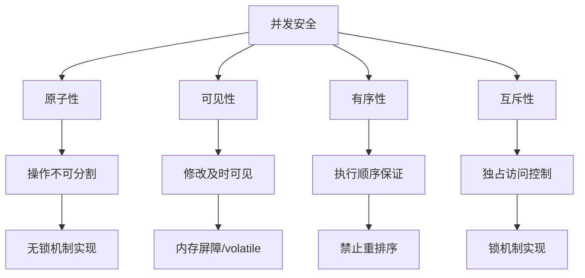
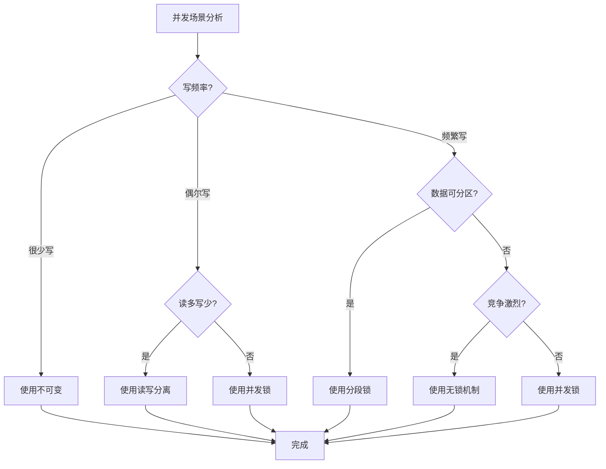

# 并发安全设计机制深度解析

## 一、引言：并发安全的四大基石

在并发编程中，安全性建立在四个核心原则之上：**原子性、可见性、有序性、互斥性**。任何并发安全机制都是对这四大原则的组合实现。本文将深入分析六种主流的并发安全设计机制，揭示它们如何从不同维度保障并发安全。



## 二、不可变机制：无共享的绝对安全

### 2.1 核心原理

不可变机制通过**禁止状态变更**从根本上消除并发问题。其安全保证基于以下设计：

```java
// 不可变类的标准实现
public final class ImmutablePoint {
    // 1. 所有字段final
    private final int x;
    private final int y;
    private final long timestamp;
    // 2. 不可变对象引用
    private final String name;  // String本身不可变
    
    // 3. 构造器完成所有初始化
    public ImmutablePoint(int x, int y, String name) {
        this.x = x;
        this.y = y;
        this.name = name;
        this.timestamp = System.currentTimeMillis();
    }
    
    // 4. 不提供setter，只提供getter
    public int getX() { return x; }
    public int getY() { return y; }
    public String getName() { return name; }
    
    // 5. 创建新对象而非修改
    public ImmutablePoint withX(int newX) {
        return new ImmutablePoint(newX, this.y, this.name);
    }
}
```

### 2.2 四大原则的实现机制


### 2.3 内存模型保证

Java内存模型（JMM）为不可变对象提供了特殊保证：

```java
// JMM对final字段的保证
class FinalFieldExample {
    final int x;  // final字段
    int y;        // 普通字段
    
    static FinalFieldExample f;
    
    public FinalFieldExample() {
        x = 3;
        y = 4;
    }
    
    static void writer() {
        f = new FinalFieldExample();
    }
    
    static void reader() {
        if (f != null) {
            int i = f.x;  // 保证看到3
            int j = f.y;  // 可能看到0（未初始化）或4
        }
    }
}
```

**关键保证**：
1. 在构造器完成时，final字段的写入对其他线程立即可见
2. 引用不可变对象的引用本身没有特殊要求
3. 如果对象引用逃逸（this逸出），保证失效

## 三、线程局部存储：空间换隔离

### 3.1 核心原理

线程局部存储（ThreadLocal）为每个线程创建独立的变量副本，通过**空间隔离**避免共享：

```java
// ThreadLocal实现原理
public class ThreadLocal<T> {
    // ThreadLocalMap是Thread的成员变量
    static class ThreadLocalMap {
        // 键值对条目
        static class Entry extends WeakReference<ThreadLocal<?>> {
            Object value;
            Entry(ThreadLocal<?> k, Object v) {
                super(k);  // 弱引用键
                value = v;
            }
        }
        
        private Entry[] table;
        
        // 获取当前线程的值
        private Entry getEntry(ThreadLocal<?> key) {
            int i = key.threadLocalHashCode & (table.length - 1);
            for (Entry e = table[i]; e != null; e = e.next) {
                if (e.get() == key) {
                    return e;
                }
            }
            return null;
        }
    }
}
```

### 3.2 四大原则的实现机制


### 3.3 内存模型分析

```java
// ThreadLocal的内存可见性示例
class ThreadLocalExample {
    // 普通共享变量
    private static int sharedCounter = 0;
    
    // ThreadLocal变量
    private static final ThreadLocal<Integer> threadLocalCounter = 
        ThreadLocal.withInitial(() -> 0);
    
    public void increment() {
        // 共享变量：需要同步
        synchronized (this) {
            sharedCounter++;
        }
        
        // ThreadLocal变量：无需同步
        int localValue = threadLocalCounter.get();
        threadLocalCounter.set(localValue + 1);
    }
    
    public int getThreadLocalValue() {
        // 直接读取，无需同步
        return threadLocalCounter.get();
    }
}
```


## 四、读写分离：差异化访问控制

### 4.1 核心原理

读写分离（ReadWriteLock）基于**访问模式区分**，允许多个读操作并发，写操作独占：

```java
// 读写锁实现原理
public class ReentrantReadWriteLock implements ReadWriteLock {
    // 读写状态设计
    static final class Sync extends AbstractQueuedSynchronizer {
        // 状态分割：高16位表示读锁，低16位表示写锁
        static final int SHARED_SHIFT   = 16;
        static final int SHARED_UNIT    = (1 << SHARED_SHIFT);
        static final int MAX_COUNT      = (1 << SHARED_SHIFT) - 1;
        static final int EXCLUSIVE_MASK = (1 << SHARED_SHIFT) - 1;
        
        // 读锁计数
        static int sharedCount(int c) { return c >>> SHARED_SHIFT; }
        // 写锁计数
        static int exclusiveCount(int c) { return c & EXCLUSIVE_MASK; }
        
        // 获取读锁
        protected final int tryAcquireShared(int unused) {
            Thread current = Thread.currentThread();
            int c = getState();
            
            // 如果有写锁且不是当前线程，失败
            if (exclusiveCount(c) != 0 && 
                getExclusiveOwnerThread() != current) {
                return -1;
            }
            
            int r = sharedCount(c);
            if (!readerShouldBlock() && r < MAX_COUNT && 
                compareAndSetState(c, c + SHARED_UNIT)) {
                // 获取读锁成功
                return 1;
            }
            return fullTryAcquireShared(current);
        }
        
        // 获取写锁
        protected final boolean tryAcquire(int acquires) {
            Thread current = Thread.currentThread();
            int c = getState();
            int w = exclusiveCount(c);
            
            if (c != 0) {
                // 有读锁或有其他线程的写锁
                if (w == 0 || current != getExclusiveOwnerThread()) {
                    return false;
                }
                // 可重入
                if (w + exclusiveCount(acquires) > MAX_COUNT) {
                    throw new Error("Maximum lock count exceeded");
                }
                setState(c + acquires);
                return true;
            }
            
            if (writerShouldBlock() || 
                !compareAndSetState(c, c + acquires)) {
                return false;
            }
            setExclusiveOwnerThread(current);
            return true;
        }
    }
}
```

### 4.2 四大原则的实现机制

| 原则 | 实现机制 | 技术细节 |
|------|---------|---------|
| **原子性** | CAS更新状态 | compareAndSetState保证状态变更原子性 |
| **可见性** | volatile状态 | 状态变量声明为volatile |
| **有序性** | 内存屏障 | 锁的获取/释放插入内存屏障 |
| **互斥性** | 写写互斥，读写互斥 | 写锁独占，读锁共享 |

### 4.3 锁降级机制

```java
// 锁降级：写锁降级为读锁
class CachedData {
    Object data;
    volatile boolean cacheValid;
    final ReentrantReadWriteLock rwl = new ReentrantReadWriteLock();
    
    void processCachedData() {
        rwl.readLock().lock();
        if (!cacheValid) {
            // 释放读锁，因为下面需要获取写锁
            rwl.readLock().unlock();
            rwl.writeLock().lock();
            
            try {
                // 双重检查
                if (!cacheValid) {
                    data = fetchData();
                    cacheValid = true;
                }
                // 锁降级：在释放写锁前获取读锁
                rwl.readLock().lock();
            } finally {
                rwl.writeLock().unlock();  // 释放写锁，保持读锁
            }
        }
        
        try {
            use(data);
        } finally {
            rwl.readLock().unlock();
        }
    }
}
```

**锁降级的意义**：
1. 保证数据一致性：在写锁保护下更新数据
2. 提高并发性：写锁释放后，其他读线程可立即获取读锁
3. 避免死锁：按固定顺序获取锁

## 五、无锁机制：乐观并发控制

### 5.1 核心原理

无锁机制（Lock-Free）基于**CAS操作**，通过乐观重试而非悲观阻塞实现并发控制：

```java
// CAS实现原理
public class AtomicInteger {
    // 使用Unsafe进行底层CAS操作
    private static final Unsafe unsafe = Unsafe.getUnsafe();
    private static final long valueOffset;
    
    static {
        try {
            // 获取value字段的内存偏移量
            valueOffset = unsafe.objectFieldOffset(
                AtomicInteger.class.getDeclaredField("value"));
        } catch (Exception ex) { throw new Error(ex); }
    }
    
    private volatile int value;
    
    // CAS操作
    public final boolean compareAndSet(int expect, int update) {
        return unsafe.compareAndSwapInt(this, valueOffset, expect, update);
    }
    
    // 自增的CAS循环
    public final int incrementAndGet() {
        for (;;) {
            int current = get();
            int next = current + 1;
            if (compareAndSet(current, next)) {
                return next;
            }
            // CAS失败，重试
        }
    }
}
```

### 5.2 四大原则的实现机制

| 原则 | 实现机制 | 技术细节 |
|------|---------|---------|
| **原子性** | 硬件CAS指令 | CPU提供compare-and-swap原子指令 |
| **可见性** | volatile变量 | CAS操作包含内存屏障 |
| **有序性** | 内存屏障 | CAS是全屏障（load-store） |
| **互斥性** | 无互斥 | 通过重试解决冲突，不阻塞线程 |

### 5.3 ABA问题与解决方案

```java
// ABA问题与解决
class AtomicStampedReference<V> {
    // 封装值和版本戳
    private static class Pair<T> {
        final T reference;
        final int stamp;
        private Pair(T reference, int stamp) {
            this.reference = reference;
            this.stamp = stamp;
        }
    }
    
    private volatile Pair<V> pair;
    
    // 带版本戳的CAS
    public boolean compareAndSet(
        V expectedReference, V newReference,
        int expectedStamp, int newStamp) {
        
        Pair<V> current = pair;
        return (
            expectedReference == current.reference &&
            expectedStamp == current.stamp &&
            ((newReference == current.reference && 
              newStamp == current.stamp) ||
             casPair(current, new Pair<>(newReference, newStamp)))
        );
    }
    
    // 解决ABA问题的栈实现
    static class Stack<T> {
        static class Node<T> {
            T value;
            AtomicStampedReference<Node<T>> next;
            
            Node(T value, Node<T> next) {
                this.value = value;
                this.next = new AtomicStampedReference<>(next, 0);
            }
        }
        
        AtomicStampedReference<Node<T>> top = 
            new AtomicStampedReference<>(null, 0);
        
        public void push(T value) {
            Node<T> newHead = new Node<>(value, null);
            Node<T> oldHead;
            int oldStamp;
            
            do {
                oldHead = top.getReference();
                oldStamp = top.getStamp();
                newHead.next.set(oldHead, 0);
            } while (!top.compareAndSet(
                oldHead, newHead, oldStamp, oldStamp + 1));
        }
    }
}
```

**无锁算法的层级**：
1. **阻塞算法**：可能死锁、饥饿
2. **无锁算法**：至少一个线程能前进
3. **无等待算法**：每个线程都能在有限步内完成
4. **无界无等待算法**：有限步内完成，与线程数无关

## 六、并发锁：悲观互斥控制

### 6.1 核心原理

并发锁（如ReentrantLock）通过**显式锁控制**提供灵活的互斥访问：

```java
// ReentrantLock实现原理
public class ReentrantLock implements Lock {
    // 同步器
    private final Sync sync;
    
    abstract static class Sync extends AbstractQueuedSynchronizer {
        // 尝试获取锁
        abstract void lock();
        
        // 非公平获取
        final boolean nonfairTryAcquire(int acquires) {
            final Thread current = Thread.currentThread();
            int c = getState();
            if (c == 0) {
                if (compareAndSetState(0, acquires)) {
                    setExclusiveOwnerThread(current);
                    return true;
                }
            } else if (current == getExclusiveOwnerThread()) {
                // 可重入
                int nextc = c + acquires;
                if (nextc < 0) throw new Error("Maximum lock count exceeded");
                setState(nextc);
                return true;
            }
            return false;
        }
        
        // 释放锁
        protected final boolean tryRelease(int releases) {
            int c = getState() - releases;
            if (Thread.currentThread() != getExclusiveOwnerThread()) {
                throw new IllegalMonitorStateException();
            }
            boolean free = false;
            if (c == 0) {
                free = true;
                setExclusiveOwnerThread(null);
            }
            setState(c);
            return free;
        }
    }
    
    // 公平锁实现
    static final class FairSync extends Sync {
        // 公平锁：检查是否有前驱节点
        protected final boolean tryAcquire(int acquires) {
            final Thread current = Thread.currentThread();
            int c = getState();
            if (c == 0) {
                if (!hasQueuedPredecessors() &&  // 检查队列
                    compareAndSetState(0, acquires)) {
                    setExclusiveOwnerThread(current);
                    return true;
                }
            } else if (current == getExclusiveOwnerThread()) {
                int nextc = c + acquires;
                if (nextc < 0) throw new Error("Maximum lock count exceeded");
                setState(nextc);
                return true;
            }
            return false;
        }
    }
}
```

### 6.2 四大原则的实现机制

| 原则 | 实现机制 | 技术细节 |
|------|---------|---------|
| **原子性** | CAS设置状态 | 锁状态变更原子性 |
| **可见性** | volatile状态 | 锁状态变更对其他线程立即可见 |
| **有序性** | 内存屏障 | lock/unlock建立happens-before关系 |
| **互斥性** | 状态控制 | 通过状态位控制独占访问 |

### 6.3 AQS（AbstractQueuedSynchronizer）原理

```java
// AQS核心原理
public abstract class AbstractQueuedSynchronizer {
    // CLH队列节点
    static final class Node {
        // 节点状态
        volatile int waitStatus;
        // 前驱、后继节点
        volatile Node prev;
        volatile Node next;
        // 节点关联的线程
        volatile Thread thread;
        // 下一个等待条件
        Node nextWaiter;
    }
    
    // 队列头尾
    private transient volatile Node head;
    private transient volatile Node tail;
    // 同步状态
    private volatile int state;
    
    // 获取锁
    public final void acquire(int arg) {
        if (!tryAcquire(arg) &&  // 尝试获取
            acquireQueued(addWaiter(Node.EXCLUSIVE), arg)) {  // 加入队列
            selfInterrupt();  // 恢复中断状态
        }
    }
    
    // 释放锁
    public final boolean release(int arg) {
        if (tryRelease(arg)) {
            Node h = head;
            if (h != null && h.waitStatus != 0) {
                unparkSuccessor(h);  // 唤醒后继节点
            }
            return true;
        }
        return false;
    }
    
    // 节点入队
    private Node addWaiter(Node mode) {
        Node node = new Node(Thread.currentThread(), mode);
        // 快速入队
        Node pred = tail;
        if (pred != null) {
            node.prev = pred;
            if (compareAndSetTail(pred, node)) {
                pred.next = node;
                return node;
            }
        }
        enq(node);  // 完整入队
        return node;
    }
}
```

**锁优化技术**：
1. **自旋锁**：短时间等待时不立即阻塞
2. **自适应自旋**：根据历史等待时间调整自旋次数
3. **锁消除**：JVM消除不可能存在竞争的锁
4. **锁粗化**：合并多个连续的锁操作
5. **偏向锁**：无竞争时消除同步开销
6. **轻量级锁**：通过CAS避免操作系统互斥

## 七、分段锁：细粒度并发控制

### 7.1 核心原理

分段锁（Segmented Locking）通过**资源分片**减少锁竞争，将一个大锁分解为多个小锁：

```java
// 分段锁实现原理
public class ConcurrentHashMap<K, V> {
    // 分段数组
    final Segment<K,V>[] segments;
    
    // 分段
    static final class Segment<K,V> extends ReentrantLock {
        // 分段内的哈希表
        transient volatile HashEntry<K,V>[] table;
        // 元素计数
        transient int count;
        // 修改次数
        transient int modCount;
        // 扩容阈值
        transient int threshold;
        
        // 分段内操作
        V get(Object key, int hash) {
            // 只锁定当前分段
            lock();
            try {
                HashEntry<K,V>[] tab = table;
                int index = (tab.length - 1) & hash;
                HashEntry<K,V> e = tab[index];
                while (e != null) {
                    if (e.hash == hash && key.equals(e.key)) {
                        return e.value;
                    }
                    e = e.next;
                }
                return null;
            } finally {
                unlock();
            }
        }
        
        V put(K key, int hash, V value, boolean onlyIfAbsent) {
            lock();  // 只锁定当前分段
            try {
                // ... 插入逻辑
                return oldValue;
            } finally {
                unlock();
            }
        }
    }
    
    // 获取分段
    private Segment<K,V> segmentForHash(int h) {
        long u = (((h >>> segmentShift) & segmentMask) << SSHIFT) + SBASE;
        return (Segment<K,V>) UNSAFE.getObjectVolatile(segments, u);
    }
}
```

### 7.2 四大原则的实现机制

| 原则 | 实现机制 | 技术细节 |
|------|---------|---------|
| **原子性** | 分段内保证 | 每个分段内操作原子性 |
| **可见性** | volatile数组 | 分段数组volatile保证可见性 |
| **有序性** | 分段内保证 | 每个分段内部操作有序 |
| **互斥性** | 分段粒度 | 不同分段操作不互斥，同分段互斥 |

### 7.3 分段策略与性能优化

```java
// 动态分段策略
class DynamicSegmentedCache<K, V> {
    // 自适应分段
    private volatile Segment<K,V>[] segments;
    private volatile int segmentShift;
    private volatile int segmentMask;
    
    // 根据并发度动态调整分段数
    public DynamicSegmentedCache(int expectedConcurrencyLevel) {
        // 找到最接近的2的幂
        int sshift = 0;
        int ssize = 1;
        while (ssize < expectedConcurrencyLevel) {
            ++sshift;
            ssize <<= 1;
        }
        
        this.segmentShift = 32 - sshift;
        this.segmentMask = ssize - 1;
        this.segments = new Segment[ssize];
        
        for (int i = 0; i < segments.length; ++i) {
            segments[i] = new Segment<>();
        }
    }
    
    // 动态重分段
    public synchronized void rehash(int newConcurrencyLevel) {
        if (newConcurrencyLevel <= segments.length) {
            return;  // 只能增加不能减少
        }
        
        Segment<K,V>[] newSegments = new Segment[newConcurrencyLevel];
        // 重新分配元素
        redistributeElements(newSegments);
        segments = newSegments;
        // 更新掩码和偏移
        updateMaskAndShift(newConcurrencyLevel);
    }
    
    // 热点分段检测与优化
    class HotSpotAwareSegment<K,V> extends Segment<K,V> {
        // 访问计数
        private final AtomicLong accessCount = new AtomicLong();
        // 热点阈值
        private static final long HOT_SPOT_THRESHOLD = 1000;
        
        @Override
        V get(Object key, int hash) {
            long start = System.nanoTime();
            try {
                return super.get(key, hash);
            } finally {
                long duration = System.nanoTime() - start;
                accessCount.incrementAndGet();
                
                // 检测热点
                if (accessCount.get() > HOT_SPOT_THRESHOLD) {
                    splitIfHot();
                }
            }
        }
        
        // 热点时分段
        private void splitIfHot() {
            if (shouldSplit()) {
                Segment<K,V> newSegment = createNewSegment();
                // 迁移部分数据到新分段
                migrateData(newSegment);
            }
        }
    }
}
```

**分段锁优化策略**：
1. **等比分段**：每段包含相同数量元素
2. **哈希分段**：根据key哈希值分配
3. **动态分段**：根据负载动态调整
4. **热点分段**：检测并拆分热点段
5. **层级分段**：多级分段减少竞争

## 八、综合比较与选择指南

### 8.1 机制对比矩阵

| 机制 | 原子性 | 可见性 | 有序性 | 互斥性 | 适用场景 | 性能特点 |
|------|--------|--------|--------|--------|----------|----------|
| **不可变** | 强保证 | 强保证 | 强保证 | 不需要 | 配置信息、状态快照 | 读性能极佳，写需创建新对象 |
| **线程局部** | 线程内 | 线程内 | 线程内 | 不需要 | 线程上下文、连接管理 | 零竞争，内存占用高 |
| **读写分离** | 写时保证 | 锁保证 | 锁保证 | 读写互斥 | 读多写少缓存 | 高读并发，写有竞争 |
| **无锁机制** | CAS保证 | volatile | 内存屏障 | 乐观重试 | 计数器、队列 | 高吞吐，可能饥饿 |
| **并发锁** | 锁保证 | 锁保证 | 锁保证 | 完全互斥 | 复杂临界区 | 灵活，有阻塞开销 |
| **分段锁** | 分段内 | 分段内 | 分段内 | 分段互斥 | 哈希表、缓存 | 减少竞争，实现复杂 |

### 8.2 选择决策树



### 8.3 混合使用模式

```java
// 混合并发控制模式
class HybridConcurrentCache<K, V> {
    // 1. 使用分段锁减少竞争
    private final Segment<K, Node<V>>[] segments;
    
    // 2. 节点值使用不可变包装
    static class Node<V> {
        private final V value;
        private final long version;
        private final long timestamp;
        
        Node(V value) {
            this.value = value;
            this.version = 0;
            this.timestamp = System.currentTimeMillis();
        }
        
        // 创建新版本（不可变）
        Node<V> update(V newValue) {
            return new Node<>(newValue, version + 1, 
                System.currentTimeMillis());
        }
    }
    
    // 3. 使用无锁机制进行版本控制
    static class VersionedReference<T> {
        private static class Holder<T> {
            final T value;
            final long version;
            
            Holder(T value, long version) {
                this.value = value;
                this.version = version;
            }
        }
        
        private final AtomicReference<Holder<T>> ref = 
            new AtomicReference<>();
        
        // 无锁更新
        boolean update(T expected, T newValue, long expectedVersion) {
            Holder<T> current = ref.get();
            if (current.value == expected && 
                current.version == expectedVersion) {
                Holder<T> newHolder = new Holder<>(newValue, 
                    expectedVersion + 1);
                return ref.compareAndSet(current, newHolder);
            }
            return false;
        }
    }
    
    // 4. 使用线程局部优化读操作
    private static final ThreadLocal<Map<K, Object>> threadLocalCache = 
        ThreadLocal.withInitial(WeakHashMap::new);
    
    public V get(K key) {
        // 先检查线程局部缓存
        Map<K, Object> localCache = threadLocalCache.get();
        Object cached = localCache.get(key);
        if (cached != null) {
            return (V) cached;
        }
        
        // 分段锁保护读取
        Segment<K, Node<V>> segment = segmentFor(key);
        segment.lock();
        try {
            Node<V> node = segment.get(key);
            if (node != null) {
                V value = node.value;
                // 放入线程局部缓存
                localCache.put(key, value);
                return value;
            }
        } finally {
            segment.unlock();
        }
        return null;
    }
}
```

## 九、未来发展趋势

### 9.1 硬件层面的优化

1. **事务内存**：硬件支持的内存事务
2. **缓存一致性协议优化**：减少伪共享
3. **NUMA架构优化**：考虑内存访问局部性
4. **持久内存**：内存持久化带来的新挑战

### 9.2 软件层面的演进

1. **协程友好并发**：轻量级线程的并发控制
2. **响应式编程模型**：异步非阻塞的并发
3. **函数式并发**：无副作用的纯函数并发
4. **分布式并发**：跨节点的协调机制

### 9.3 智能化并发控制

```java
// 自适应并发控制器
class AdaptiveConcurrencyController {
    // 监控指标
    static class Metrics {
        long lockContentionCount;
        long averageWaitTime;
        long throughput;
        long errorRate;
    }
    
    // 策略选择器
    enum ConcurrencyStrategy {
        PESSIMISTIC_LOCK,
        OPTIMISTIC_LOCK,
        LOCK_FREE,
        IMMUTABLE
    }
    
    // 基于机器学习的策略选择
    class MLStrategySelector {
        // 特征提取
        Features extractFeatures(Metrics metrics, Workload workload) {
            return new Features(
                metrics.lockContentionCount,
                metrics.averageWaitTime,
                workload.readWriteRatio,
                workload.dataSize,
                workload.accessPattern
            );
        }
        
        // 预测最佳策略
        ConcurrencyStrategy predict(Features features) {
            // 使用训练好的模型预测
            return trainedModel.predict(features);
        }
    }
    
    // 动态策略切换
    public void executeWithBestStrategy(Runnable task) {
        Metrics currentMetrics = collectMetrics();
        Workload currentWorkload = analyzeWorkload();
        
        Features features = extractFeatures(currentMetrics, currentWorkload);
        ConcurrencyStrategy strategy = strategySelector.predict(features);
        
        switch (strategy) {
            case PESSIMISTIC_LOCK:
                executeWithPessimisticLock(task);
                break;
            case OPTIMISTIC_LOCK:
                executeWithOptimisticLock(task);
                break;
            case LOCK_FREE:
                executeLockFree(task);
                break;
            case IMMUTABLE:
                executeWithImmutable(task);
                break;
        }
    }
}
```

## 总结

并发安全设计是一个多维度的系统工程，需要根据具体场景选择合适的技术组合：

1. **理解本质**：深入理解原子性、可见性、有序性、互斥性的底层原理
2. **权衡取舍**：在性能、复杂度、正确性之间找到平衡
3. **组合使用**：现实系统往往是多种机制的混合
4. **持续优化**：基于监控数据动态调整并发策略
5. **面向未来**：关注硬件和编程模型的发展趋势

随着硬件多核化、应用分布式化，并发安全设计的重要性日益凸显。掌握这些核心机制的原理和应用场景，是构建高性能、高可靠并发系统的关键。未来，随着新硬件、新编程范式的出现，并发安全设计将向更智能、更自动化的方向发展，但对基本原理的深入理解将始终是技术人员的核心竞争力。


## 理解CAS设计和由来

设计思想总结


核心原理总结

局限性剖析


