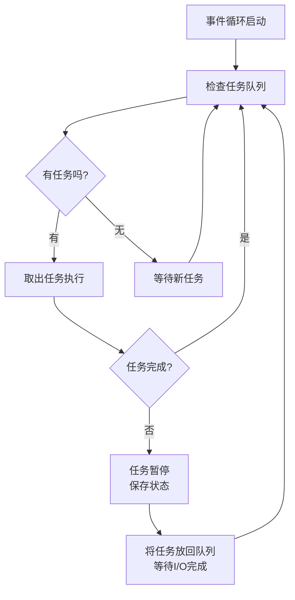
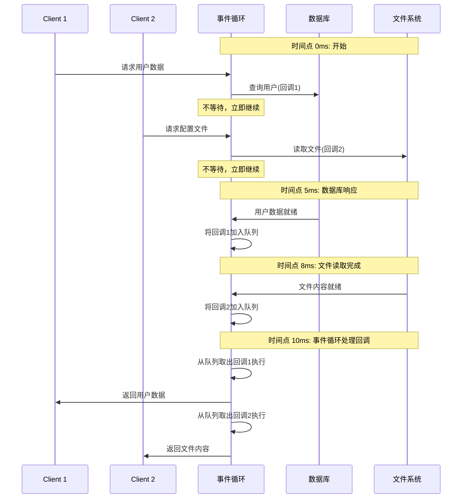

好的，这是一个非常核心且重要的话题。单线程模型和协程是理解现代高性能编程（如Node.js、Go、Python asyncio）的基石。我会用直观的方式解释它们是如何实现“多任务”的。

让我们从一个生动的比喻开始。

---

### 一、核心思想：餐厅厨房比喻

---

### 二、什么是单线程模型？


---

### 三、协程如何实现“多任务”？三要素解析

协程不是通过并行（同时执行）实现多任务，而是通过**并发**（交替执行）来实现的。其核心依赖三个机制：

#### 1. 事件循环 (Event Loop) - “大脑调度中心”

事件循环是一个无限循环，它不断地检查是否有任务需要执行。其工作流程可以用下图表示：



**真实工作流程**：
1. 执行所有可立即运行的代码（同步任务）
2. 遇到I/O操作时，**不等待**，将其交给底层系统（如操作系统）去处理
3. 继续执行下一个任务
4. 当系统完成I/O后，会将结果和回调函数放入**任务队列**
5. 事件循环在下一轮检查中执行对应的回调

#### 2. 非阻塞I/O (Non-blocking I/O) - “高效助手”

这是协程能够高效的基础。操作系统提供了非阻塞I/O接口，使得发起I/O请求后能立即返回，而不是傻等。

| 阻塞I/O | 非阻塞I/O |
| :--- | :--- |
| `线程: 我要读文件` → **等待** → `收到数据` | `线程: 我要读文件` → **立即返回"正在处理"** → 线程做别的事 → `系统: 文件读好了，数据在队列里` |

#### 3. 协程 (Coroutine) - “可暂停的函数”

协程是特殊的函数，它有**从暂停点恢复执行**的能力。通过 `async/await` 或 `yield` 关键字标识。

**关键特性**：
- **挂起 (Suspend)**：遇到耗时操作时，让出执行权，而不是阻塞
- **恢复 (Resume)**：当耗时操作完成后，从之前暂停的地方继续执行
- **状态保持**：暂停时，局部变量、执行位置等状态都被保存

```javascript
// 协程示例 (JavaScript async/await)
async function placeOrder() {
    console.log('开始点餐');
    let menu = await readFile('menu.txt'); // 暂停点，不阻塞线程
    console.log('菜单是:', menu); // 恢复执行
    let food = await cookAsync(); // 再次暂停
    console.log('菜做好了:', food);
}
// 在等待读文件时，线程可以执行其他任务的协程
```

---

### 四、完整工作流程解析

让我们通过一个具体的时间线来看看单线程如何"同时"处理多个请求：



**关键洞察**：
- **单线程**：任何时候真正在执行代码的只有一个线程
- **高并发**：通过重叠I/O等待时间，实现了并发处理
- **无阻塞**：线程永远不会因为I/O而空闲等待

---

### 五、协程 vs 线程：本质区别


---

### 六、实际应用场景

---

### 总结

单线程模型下的协程实现"多任务"的本质是：

**通过“事件循环”机制，在单个线程内交替执行多个任务，遇到I/O操作时暂停并切换至其他任务，充分利用I/O等待时间，从而实现高并发处理。**

这种模型的优势在于：
1. **极高的资源利用率**：没有线程创建、销毁、上下文切换的开销
2. **简单的编程模型**：避免了多线程编程中的锁竞争、死锁等问题
3. **强大的伸缩性**：可以轻松应对数万甚至数百万的并发连接

正是这些特性，使得基于事件循环+协程的框架（如Node.js、Tornado、Go）在高并发I/O领域表现出色。