# 事件机制技术方案

## 1. 概述

事件机制是现代软件开发中的核心设计模式，广泛应用于Android、iOS、前端Web开发等各个平台。本方案详细阐述了通用事件机制的设计原理、架构模式和实现方案。

## 2. 事件机制基本概念

### 2.1 核心组件

- **事件源（Event Source）**：产生事件的对象
- **事件（Event）**：描述发生了什么的数据结构
- **事件监听器（Event Listener）**：处理事件的回调函数或对象
- **事件分发器（Event Dispatcher）**：负责事件路由和分发的中心组件

### 2.2 事件流程

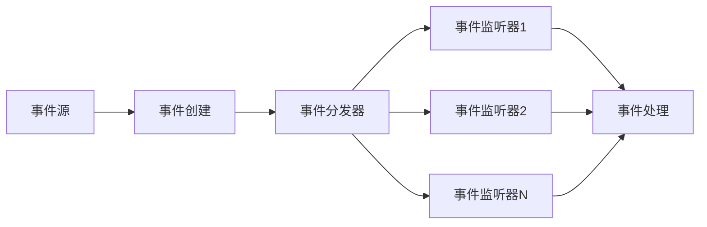

## 3. 系统架构设计

### 3.1 整体架构图

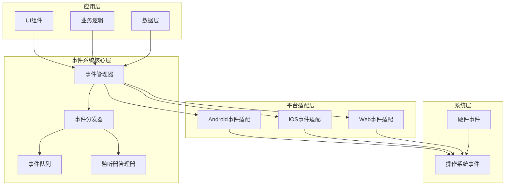

### 3.2 核心类图

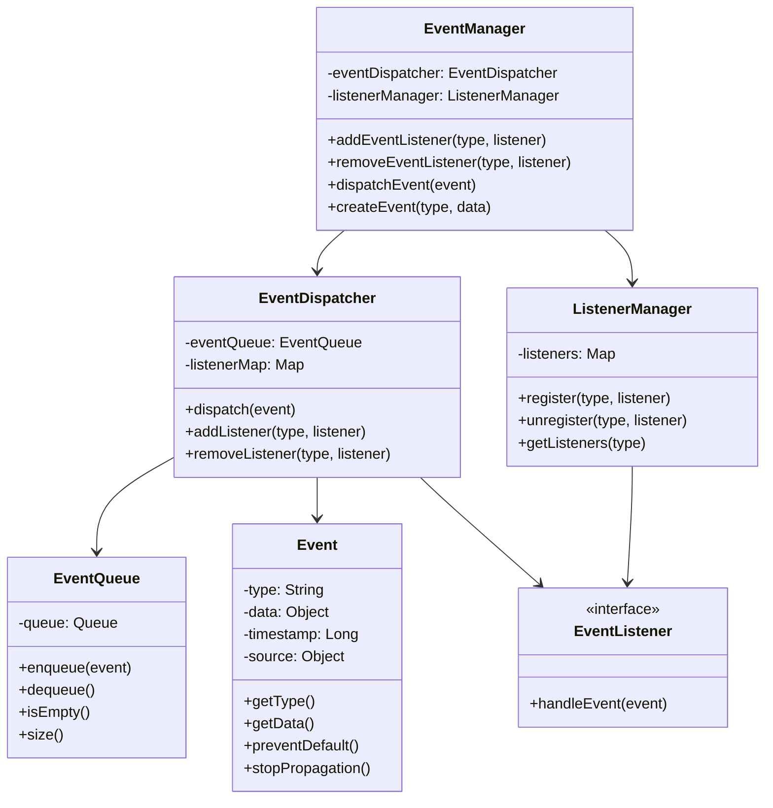

## 4. 事件处理时序图

### 4.1 事件注册时序

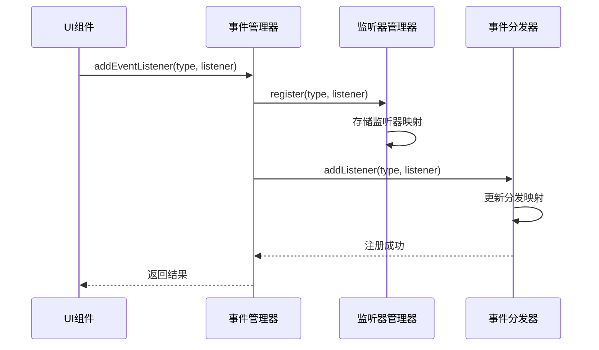

### 4.2 事件触发和处理时序

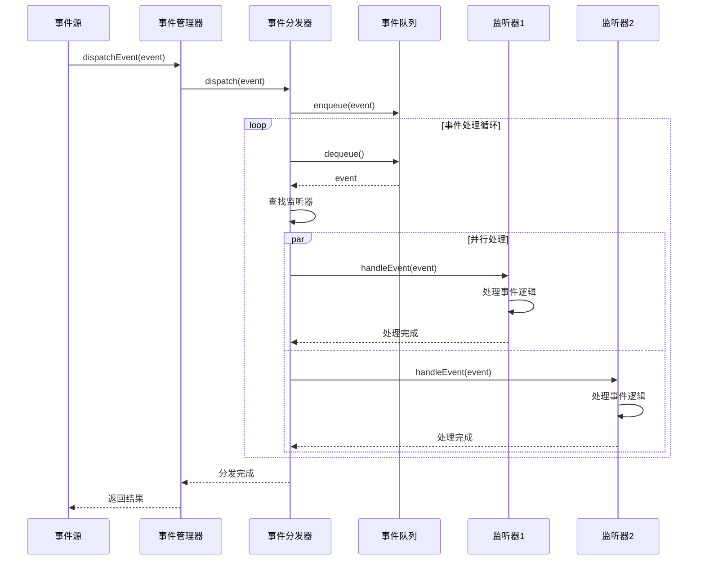

## 5. 平台特定实现

### 5.1 Android事件机制

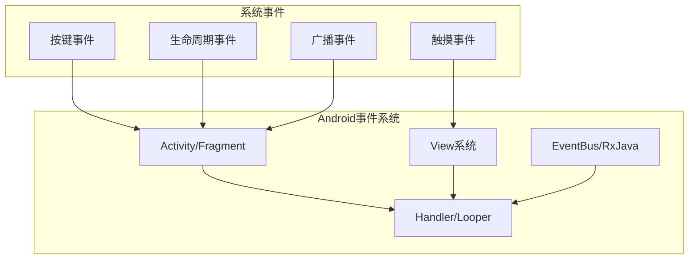

**Android实现特点：**
- 基于Handler-Looper消息机制
- View事件分发机制（onTouchEvent）
- 生命周期事件回调
- 广播接收器模式

### 5.2 iOS事件机制

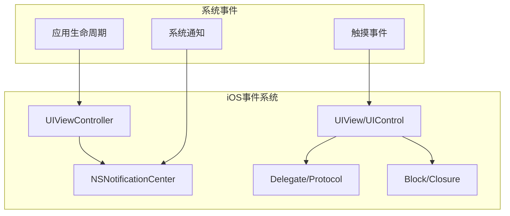

**iOS实现特点：**
- Target-Action模式
- 委托代理模式
- 通知中心机制
- 响应者链（Responder Chain）

### 5.3 Web前端事件机制

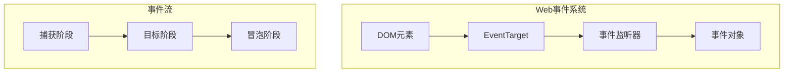

**Web实现特点：**
- DOM事件模型
- 事件冒泡和捕获
- addEventListener/removeEventListener
- 自定义事件支持

## 6. 事件系统核心实现

### 6.1 事件管理器核心代码结构

```javascript
// 通用事件管理器伪代码
class EventManager {
    constructor() {
        this.listeners = new Map();
        this.eventQueue = [];
        this.isProcessing = false;
    }
    
    addEventListener(type, listener, options = {}) {
        if (!this.listeners.has(type)) {
            this.listeners.set(type, new Set());
        }
        this.listeners.get(type).add({
            listener,
            once: options.once || false,
            priority: options.priority || 0
        });
    }
    
    removeEventListener(type, listener) {
        if (this.listeners.has(type)) {
            const listenerSet = this.listeners.get(type);
            listenerSet.forEach(item => {
                if (item.listener === listener) {
                    listenerSet.delete(item);
                }
            });
        }
    }
    
    dispatchEvent(event) {
        this.eventQueue.push(event);
        if (!this.isProcessing) {
            this.processEventQueue();
        }
    }
    
    processEventQueue() {
        this.isProcessing = true;
        while (this.eventQueue.length > 0) {
            const event = this.eventQueue.shift();
            this.handleEvent(event);
        }
        this.isProcessing = false;
    }
    
    handleEvent(event) {
        const listeners = this.listeners.get(event.type);
        if (listeners) {
            // 按优先级排序
            const sortedListeners = Array.from(listeners)
                .sort((a, b) => b.priority - a.priority);
            
            for (const item of sortedListeners) {
                try {
                    item.listener(event);
                    if (item.once) {
                        listeners.delete(item);
                    }
                    if (event.isPropagationStopped) {
                        break;
                    }
                } catch (error) {
                    console.error('事件处理错误:', error);
                }
            }
        }
    }
}
```

### 6.2 事件对象设计

```javascript
class Event {
    constructor(type, data = {}) {
        this.type = type;
        this.data = data;
        this.timestamp = Date.now();
        this.defaultPrevented = false;
        this.isPropagationStopped = false;
        this.source = null;
    }
    
    preventDefault() {
        this.defaultPrevented = true;
    }
    
    stopPropagation() {
        this.isPropagationStopped = true;
    }
    
    stopImmediatePropagation() {
        this.isPropagationStopped = true;
        this.isImmediatePropagationStopped = true;
    }
}
```

## 7. 性能优化策略

### 7.1 事件处理优化流程

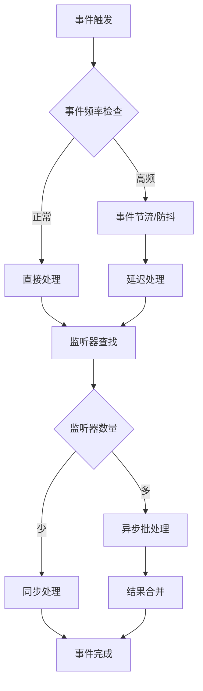

### 7.2 优化策略

1. **事件池化**：重用事件对象，减少GC压力
2. **监听器缓存**：缓存常用监听器映射
3. **异步处理**：非关键事件异步处理
4. **事件合并**：合并相似事件，减少处理次数
5. **优先级队列**：重要事件优先处理

## 8. 错误处理和容错机制

### 8.1 错误处理流程

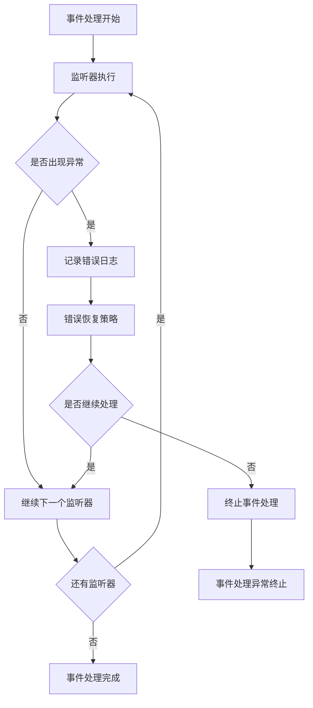

### 8.2 容错策略

1. **异常隔离**：单个监听器异常不影响其他监听器
2. **重试机制**：关键事件处理失败时自动重试
3. **降级处理**：系统负载过高时启用简化处理模式
4. **监控告警**：异常率超过阈值时触发告警

## 9. 测试策略

### 9.1 测试金字塔

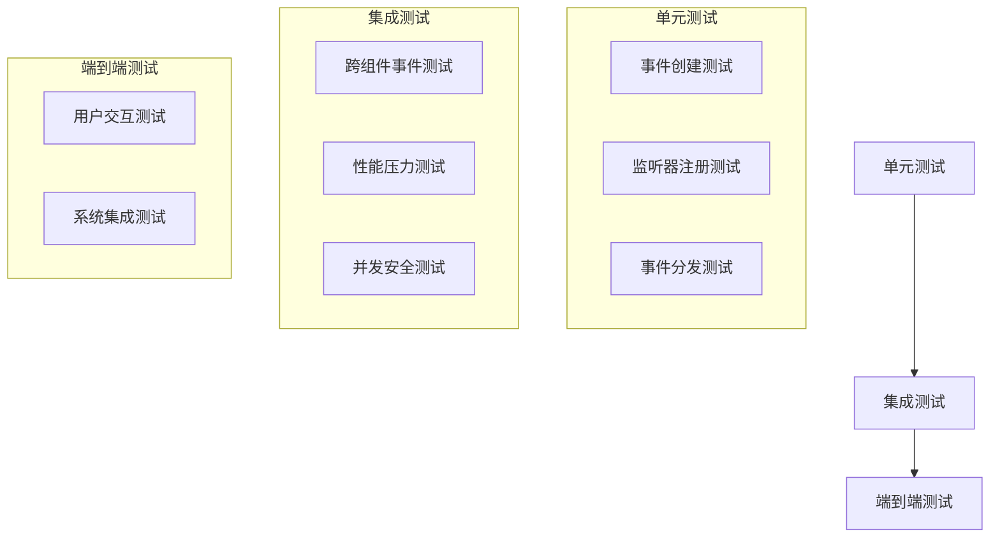

### 9.2 测试用例设计

1. **功能测试**
   - 事件注册和注销
   - 事件触发和处理
   - 事件传播控制

2. **性能测试**
   - 高频事件处理能力
   - 大量监听器场景
   - 内存使用情况

3. **异常测试**
   - 监听器异常处理
   - 内存泄漏检测
   - 并发安全验证

## 10. 部署和监控

### 10.1 部署架构

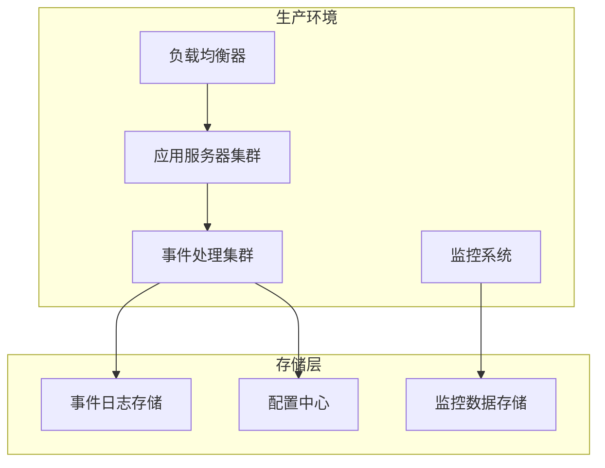

### 10.2 监控指标

1. **性能指标**
   - 事件处理延迟
   - 事件处理吞吐量
   - 监听器执行时间

2. **可用性指标**
   - 事件处理成功率
   - 系统错误率
   - 服务可用性

3. **资源指标**
   - CPU使用率
   - 内存使用率
   - 网络IO

## 11. 最佳实践

### 11.1 设计原则

1. **单一职责**：每个监听器只处理特定类型的事件
2. **松耦合**：事件源和监听器之间保持松耦合
3. **可扩展性**：支持动态添加新的事件类型和监听器
4. **性能优先**：优化事件处理性能，避免阻塞主线程

### 11.2 开发规范

1. **命名规范**：事件类型使用统一的命名约定
2. **文档规范**：详细记录事件接口和使用方法
3. **版本管理**：事件接口变更时保持向后兼容
4. **安全规范**：验证事件数据，防止恶意事件

## 12. 总结

本事件机制技术方案提供了一个完整、可扩展的事件处理框架，适用于多种平台和场景。通过合理的架构设计、性能优化和错误处理机制，能够满足现代应用对事件处理的各种需求。

关键优势：
- **跨平台兼容**：支持Android、iOS、Web等多平台
- **高性能**：优化的事件处理机制，支持高并发场景
- **可扩展**：模块化设计，易于扩展新功能
- **可靠性**：完善的错误处理和容错机制
- **易维护**：清晰的架构和完善的文档

该方案为开发团队提供了实施事件机制的完整指导，有助于构建高质量、高性能的应用系统。