# 内存模型技术方案详解

## 目录
1. [为何设计内存模型](#1-为何设计内存模型)
2. [内存模型基础概念](#2-内存模型基础概念)
3. [线程私有内存详解](#3-线程私有内存详解)
4. [线程共享内存详解](#4-线程共享内存详解)
5. [堆内存与栈内存核心原理](#5-堆内存与栈内存核心原理)
6. [通用案例教学](#6-通用案例教学)
7. [跨平台内存模型对比](#7-跨平台内存模型对比)
8. [内存管理最佳实践](#8-内存管理最佳实践)
9. [总结](#9-总结)

---

## 1. 为何设计内存模型

### 1.1 内存模型存在的根本原因

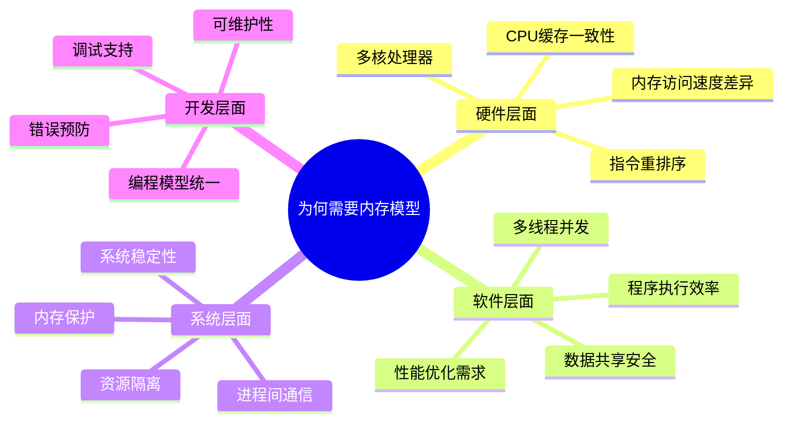
```mermaid
mindmap
  root((为何需要内存模型))
    硬件层面
      CPU缓存一致性
      多核处理器
      内存访问速度差异
      指令重排序
    
    软件层面
      多线程并发
      数据共享安全
      性能优化需求
      程序执行效率
    
    系统层面
      资源隔离
      内存保护
      进程间通信
      系统稳定性
    
    开发层面
      编程模型统一
      错误预防
      调试支持
      可维护性
```

### 1.2 内存模型解决的核心问题

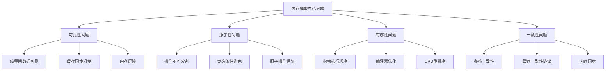
```mermaid
graph TD
    A[内存模型核心问题] --> B[可见性问题]
    A --> C[原子性问题]
    A --> D[有序性问题]
    A --> E[一致性问题]
    
    B --> B1[线程间数据可见]
    B --> B2[缓存同步机制]
    B --> B3[内存屏障]
    
    C --> C1[操作不可分割]
    C --> C2[竞态条件避免]
    C --> C3[原子操作保证]
    
    D --> D1[指令执行顺序]
    D --> D2[编译器优化]
    D --> D3[CPU重排序]
    
    E --> E1[多核一致性]
    E --> E2[缓存一致性协议]
    E --> E3[内存同步]
```

### 1.3 没有内存模型会发生什么

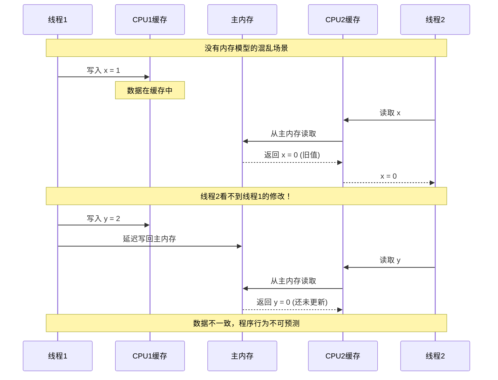
```mermaid
sequenceDiagram
    participant T1 as 线程1
    participant Cache1 as CPU1缓存
    participant Memory as 主内存
    participant Cache2 as CPU2缓存
    participant T2 as 线程2
    
    Note over T1,T2: 没有内存模型的混乱场景
    
    T1->>Cache1: 写入 x = 1
    Note over Cache1: 数据在缓存中
    
    T2->>Cache2: 读取 x
    Cache2->>Memory: 从主内存读取
    Memory-->>Cache2: 返回 x = 0 (旧值)
    Cache2-->>T2: x = 0
    
    Note over T1,T2: 线程2看不到线程1的修改！
    
    T1->>Cache1: 写入 y = 2
    T1->>Memory: 延迟写回主内存
    
    T2->>Cache2: 读取 y
    Cache2->>Memory: 从主内存读取
    Memory-->>Cache2: 返回 y = 0 (还未更新)
    
    Note over T1,T2: 数据不一致，程序行为不可预测
```

---

## 2. 内存模型基础概念

### 2.1 内存模型整体架构

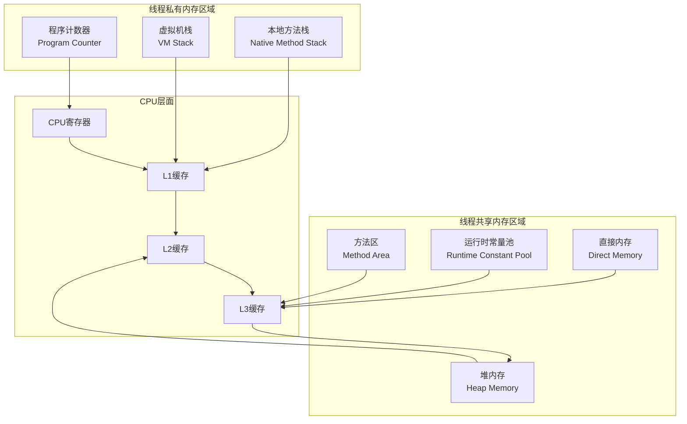
```mermaid
graph TB
    subgraph "线程私有内存区域"
        A1[程序计数器<br/>Program Counter]
        A2[虚拟机栈<br/>VM Stack]
        A3[本地方法栈<br/>Native Method Stack]
    end
    
    subgraph "线程共享内存区域"
        B1[堆内存<br/>Heap Memory]
        B2[方法区<br/>Method Area]
        B3[运行时常量池<br/>Runtime Constant Pool]
        B4[直接内存<br/>Direct Memory]
    end
    
    subgraph "CPU层面"
        C1[CPU寄存器]
        C2[L1缓存]
        C3[L2缓存]
        C4[L3缓存]
    end
    
    A1 --> C1
    A2 --> C2
    A3 --> C2
    
    B1 --> C3
    B2 --> C4
    B3 --> C4
    B4 --> C4
    
    C1 --> C2
    C2 --> C3
    C3 --> C4
    C4 --> B1
```

### 2.2 线程私有 vs 线程共享对比

| 特性 | 线程私有内存 | 线程共享内存 |
|------|-------------|-------------|
| **访问权限** | 仅当前线程可访问 | 所有线程都可访问 |
| **生命周期** | 与线程同生共死 | 与进程同生共死 |
| **数据安全** | 天然线程安全 | 需要同步机制 |
| **性能** | 访问速度快 | 可能存在竞争 |
| **内存大小** | 相对较小 | 相对较大 |
| **典型用途** | 方法调用、局部变量 | 对象实例、类信息 |

### 2.3 内存访问层次结构

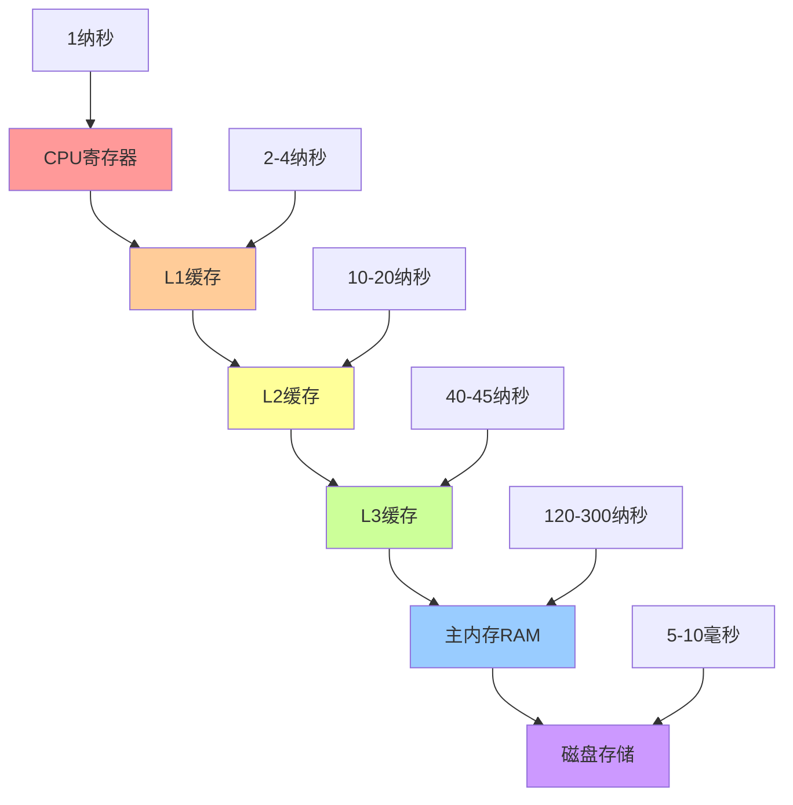
```mermaid
graph TD
    A[CPU寄存器] --> B[L1缓存]
    B --> C[L2缓存]
    C --> D[L3缓存]
    D --> E[主内存RAM]
    E --> F[磁盘存储]
    
    A1[1纳秒] --> A
    B1[2-4纳秒] --> B
    C1[10-20纳秒] --> C
    D1[40-45纳秒] --> D
    E1[120-300纳秒] --> E
    F1[5-10毫秒] --> F
    
    style A fill:#ff9999
    style B fill:#ffcc99
    style C fill:#ffff99
    style D fill:#ccff99
    style E fill:#99ccff
    style F fill:#cc99ff
```

---

## 3. 线程私有内存详解

### 3.1 程序计数器（Program Counter）

#### 3.1.1 设计原理

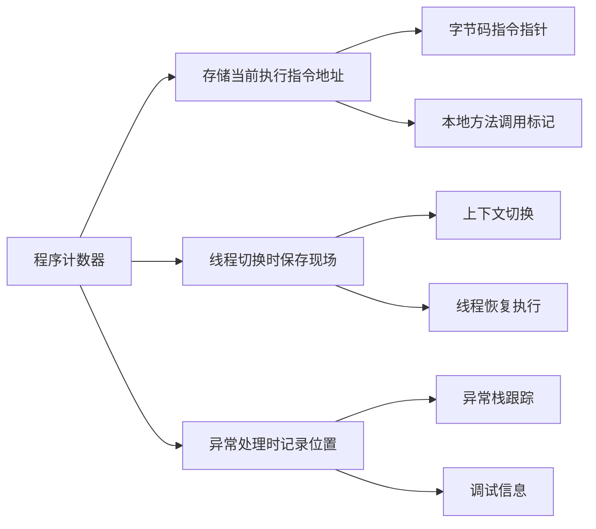
```mermaid
graph LR
    A[程序计数器] --> B[存储当前执行指令地址]
    A --> C[线程切换时保存现场]
    A --> D[异常处理时记录位置]
    
    B --> B1[字节码指令指针]
    B --> B2[本地方法调用标记]
    
    C --> C1[上下文切换]
    C --> C2[线程恢复执行]
    
    D --> D1[异常栈跟踪]
    D --> D2[调试信息]
```

#### 3.1.2 实际场景案例

```java
// Java 示例：程序计数器的作用
public class PCExample {
    public static void main(String[] args) {
        int a = 1;           // PC指向这条指令
        int b = 2;           // PC移动到这条指令
        int c = add(a, b);   // PC指向方法调用指令
        System.out.println(c); // PC指向输出指令
    }
    
    public static int add(int x, int y) {
        return x + y;        // PC在方法内部移动
    }
}
```

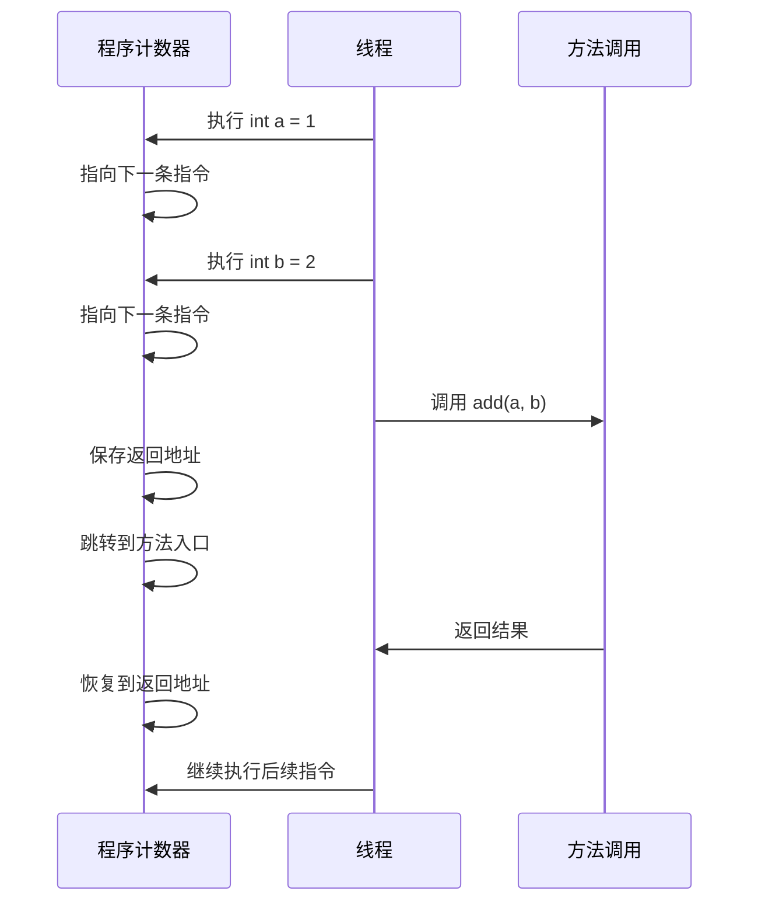
```mermaid
sequenceDiagram
    participant PC as 程序计数器
    participant Thread as 线程
    participant Method as 方法调用
    
    Thread->>PC: 执行 int a = 1
    PC->>PC: 指向下一条指令
    
    Thread->>PC: 执行 int b = 2
    PC->>PC: 指向下一条指令
    
    Thread->>Method: 调用 add(a, b)
    PC->>PC: 保存返回地址
    PC->>PC: 跳转到方法入口
    
    Method->>Thread: 返回结果
    PC->>PC: 恢复到返回地址
    
    Thread->>PC: 继续执行后续指令
```

### 3.2 虚拟机栈（VM Stack）

#### 3.2.1 栈帧结构

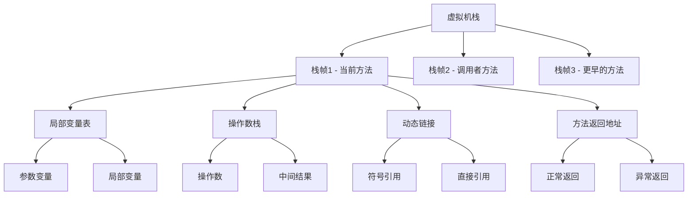
```mermaid
graph TD
    A[虚拟机栈] --> B[栈帧1 - 当前方法]
    A --> C[栈帧2 - 调用者方法]
    A --> D[栈帧3 - 更早的方法]
    
    B --> B1[局部变量表]
    B --> B2[操作数栈]
    B --> B3[动态链接]
    B --> B4[方法返回地址]
    
    B1 --> B11[参数变量]
    B1 --> B12[局部变量]
    
    B2 --> B21[操作数]
    B2 --> B22[中间结果]
    
    B3 --> B31[符号引用]
    B3 --> B32[直接引用]
    
    B4 --> B41[正常返回]
    B4 --> B42[异常返回]
```

#### 3.2.2 实际场景案例

```java
// 栈内存使用示例
public class StackExample {
    public void methodA() {
        int localVar = 10;    // 存储在栈帧的局部变量表
        String str = "Hello"; // 引用存储在栈，对象在堆
        methodB(localVar);    // 创建新栈帧
    } // 栈帧销毁，局部变量消失
    
    public void methodB(int param) {
        int[] array = new int[5]; // 引用在栈，数组对象在堆
        for (int i = 0; i < 5; i++) {
            array[i] = i * param; // 操作数栈参与计算
        }
    } // 栈帧销毁
}
```

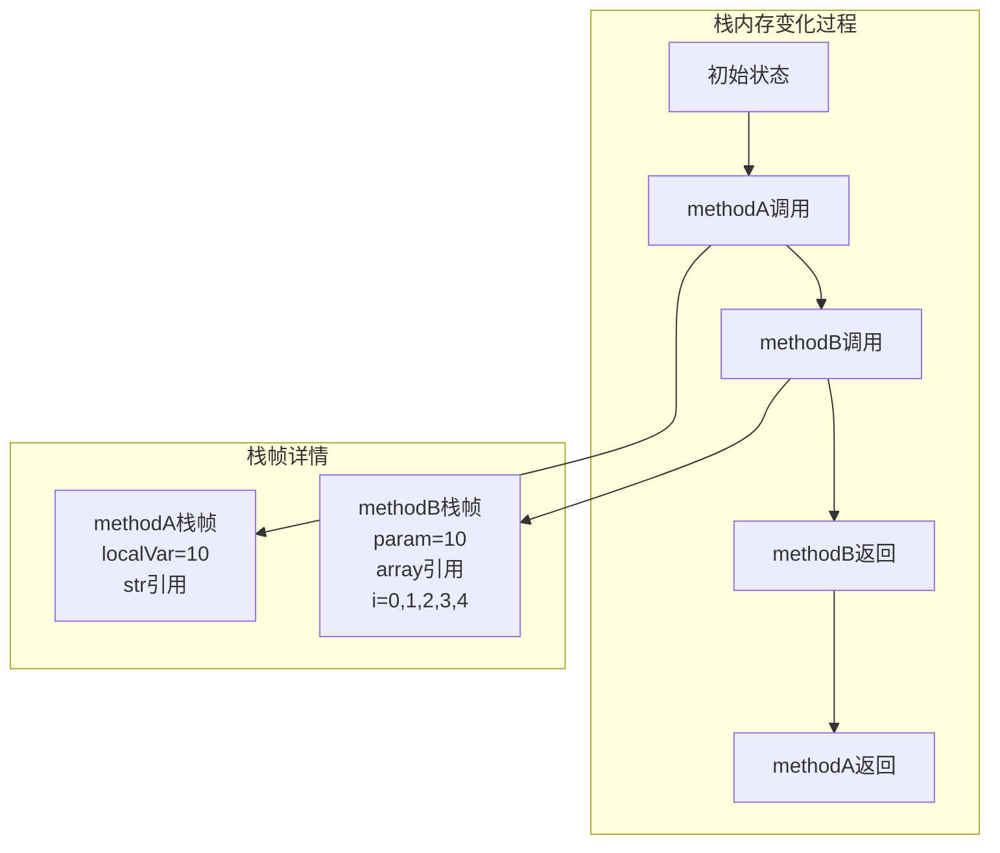
```mermaid
graph TD
    subgraph "栈内存变化过程"
        A[初始状态] --> B[methodA调用]
        B --> C[methodB调用]
        C --> D[methodB返回]
        D --> E[methodA返回]
    end
    
    subgraph "栈帧详情"
        F[methodB栈帧<br/>param=10<br/>array引用<br/>i=0,1,2,3,4]
        G[methodA栈帧<br/>localVar=10<br/>str引用]
    end
    
    C --> F
    B --> G
```

### 3.3 本地方法栈（Native Method Stack）

#### 3.3.1 设计目的

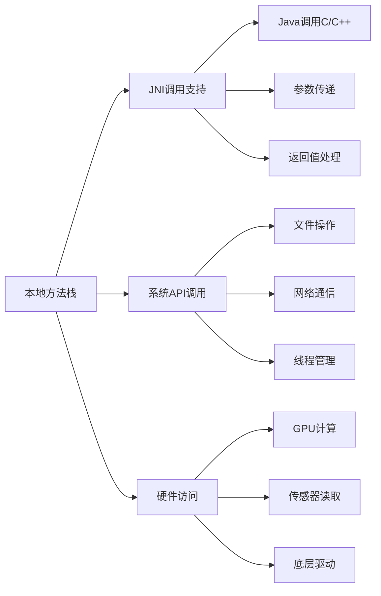
```mermaid
graph LR
    A[本地方法栈] --> B[JNI调用支持]
    A --> C[系统API调用]
    A --> D[硬件访问]
    
    B --> B1[Java调用C/C++]
    B --> B2[参数传递]
    B --> B3[返回值处理]
    
    C --> C1[文件操作]
    C --> C2[网络通信]
    C --> C3[线程管理]
    
    D --> D1[GPU计算]
    D --> D2[传感器读取]
    D --> D3[底层驱动]
```

#### 3.3.2 实际场景案例

```java
// JNI本地方法调用示例
public class NativeExample {
    // 声明本地方法
    public native int calculateHash(String input);
    public native void processImage(byte[] imageData);
    
    static {
        // 加载本地库
        System.loadLibrary("nativelib");
    }
    
    public void useNativeMethod() {
        String data = "Hello World";
        // 调用本地方法，使用本地方法栈
        int hash = calculateHash(data);
        System.out.println("Hash: " + hash);
    }
}
```

```c
// C语言实现的本地方法
#include <jni.h>
#include <string.h>

JNIEXPORT jint JNICALL 
Java_NativeExample_calculateHash(JNIEnv *env, jobject obj, jstring input) {
    // 本地方法栈中的局部变量
    const char *str = (*env)->GetStringUTFChars(env, input, 0);
    int hash = 0;
    
    // 在本地方法栈中执行计算
    for (int i = 0; i < strlen(str); i++) {
        hash = hash * 31 + str[i];
    }
    
    (*env)->ReleaseStringUTFChars(env, input, str);
    return hash;
}
```

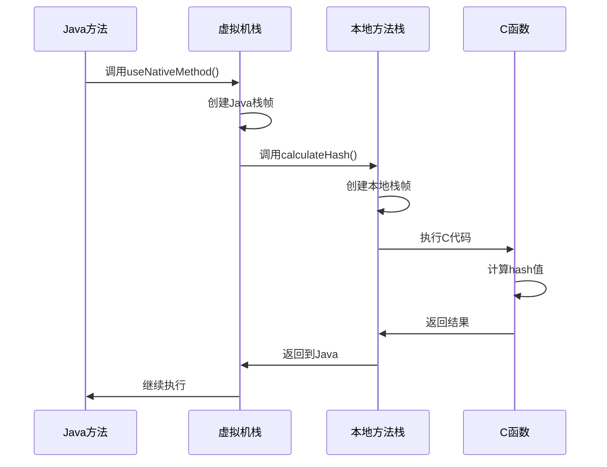
```mermaid
sequenceDiagram
    participant Java as Java方法
    participant JVM as 虚拟机栈
    participant Native as 本地方法栈
    participant C as C函数
    
    Java->>JVM: 调用useNativeMethod()
    JVM->>JVM: 创建Java栈帧
    
    JVM->>Native: 调用calculateHash()
    Native->>Native: 创建本地栈帧
    Native->>C: 执行C代码
    
    C->>C: 计算hash值
    C->>Native: 返回结果
    Native->>JVM: 返回到Java
    JVM->>Java: 继续执行
```

---

## 4. 线程共享内存详解

### 4.1 堆内存（Heap Memory）

#### 4.1.1 堆内存分代结构

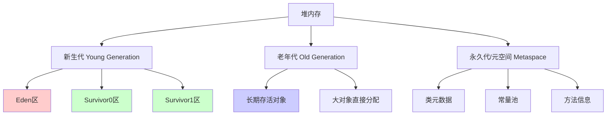
```mermaid
graph TD
    A[堆内存] --> B[新生代 Young Generation]
    A --> C[老年代 Old Generation]
    A --> D[永久代/元空间 Metaspace]
    
    B --> B1[Eden区]
    B --> B2[Survivor0区]
    B --> B3[Survivor1区]
    
    C --> C1[长期存活对象]
    C --> C2[大对象直接分配]
    
    D --> D1[类元数据]
    D --> D2[常量池]
    D --> D3[方法信息]
    
    style B1 fill:#ffcccc
    style B2 fill:#ccffcc
    style B3 fill:#ccffcc
    style C1 fill:#ccccff
```

#### 4.1.2 实际场景案例

```java
// 堆内存使用示例
public class HeapExample {
    private static List<String> staticList = new ArrayList<>(); // 在堆中
    
    public void createObjects() {
        // 所有对象都在堆内存中创建
        String str = new String("Hello");     // 在堆中
        StringBuilder sb = new StringBuilder(); // 在堆中
        int[] array = new int[1000];          // 在堆中
        
        // 对象引用在栈中，对象实例在堆中
        Person person = new Person("张三", 25);
        
        // 集合对象在堆中，元素也在堆中
        List<Person> persons = new ArrayList<>();
        persons.add(person);
        
        // 大对象可能直接进入老年代
        byte[] bigArray = new byte[1024 * 1024]; // 1MB
    }
    
    static class Person {
        private String name;  // 引用在堆中，字符串对象也在堆中
        private int age;      // 基本类型值在堆中（作为对象的字段）
        
        public Person(String name, int age) {
            this.name = name;
            this.age = age;
        }
    }
}
```

#### 4.1.3 垃圾回收过程

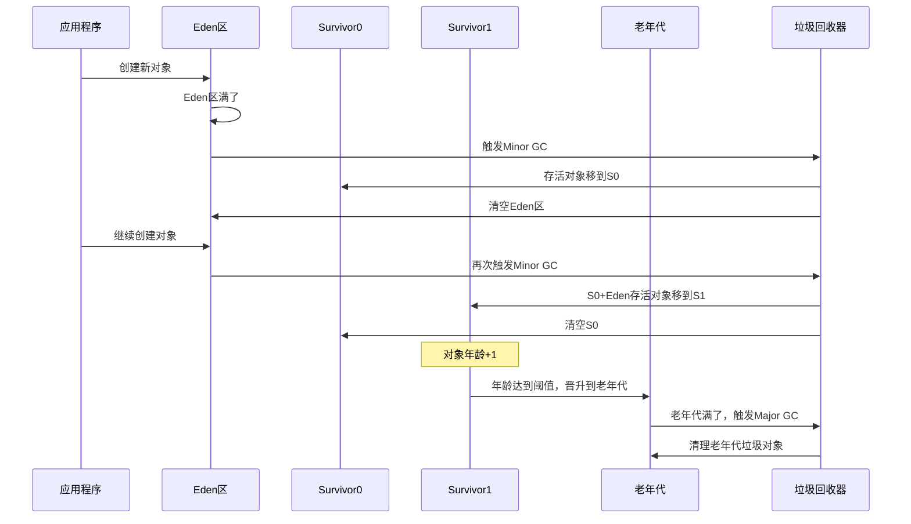
```mermaid
sequenceDiagram
    participant App as 应用程序
    participant Eden as Eden区
    participant S0 as Survivor0
    participant S1 as Survivor1
    participant Old as 老年代
    participant GC as 垃圾回收器
    
    App->>Eden: 创建新对象
    Eden->>Eden: Eden区满了
    
    Eden->>GC: 触发Minor GC
    GC->>S0: 存活对象移到S0
    GC->>Eden: 清空Eden区
    
    App->>Eden: 继续创建对象
    Eden->>GC: 再次触发Minor GC
    GC->>S1: S0+Eden存活对象移到S1
    GC->>S0: 清空S0
    
    Note over S1: 对象年龄+1
    
    S1->>Old: 年龄达到阈值，晋升到老年代
    
    Old->>GC: 老年代满了，触发Major GC
    GC->>Old: 清理老年代垃圾对象
```

### 4.2 方法区（Method Area）

#### 4.2.1 方法区内容

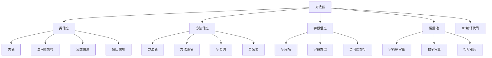
```mermaid
graph TD
    A[方法区] --> B[类信息]
    A --> C[方法信息]
    A --> D[字段信息]
    A --> E[常量池]
    A --> F[JIT编译代码]
    
    B --> B1[类名]
    B --> B2[访问修饰符]
    B --> B3[父类信息]
    B --> B4[接口信息]
    
    C --> C1[方法名]
    C --> C2[方法签名]
    C --> C3[字节码]
    C --> C4[异常表]
    
    D --> D1[字段名]
    D --> D2[字段类型]
    D --> D3[访问修饰符]
    
    E --> E1[字符串常量]
    E --> E2[数字常量]
    E --> E3[符号引用]
```

#### 4.2.2 实际场景案例

```java
// 方法区存储示例
public class MethodAreaExample {
    // 类信息存储在方法区
    private static final String CONSTANT = "常量"; // 常量池
    private static int staticVar = 100;            // 静态变量在堆中，引用在方法区
    
    private String instanceVar;                    // 字段信息在方法区
    
    // 方法信息存储在方法区
    public void instanceMethod() {
        String localStr = "局部字符串"; // 字符串字面量在常量池
        System.out.println(localStr);
    }
    
    public static void staticMethod() {
        // 静态方法信息在方法区
        Class<?> clazz = MethodAreaExample.class; // 类对象在堆中
        String className = clazz.getName();       // 反射获取类信息
    }
}

// 类加载过程
class ClassLoadingExample {
    static {
        System.out.println("类初始化"); // 类信息加载到方法区时执行
    }
    
    public static void triggerClassLoading() {
        // 首次使用类时，类信息加载到方法区
        ClassLoadingExample example = new ClassLoadingExample();
    }
}
```

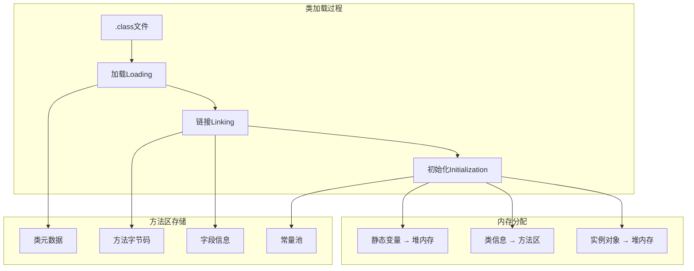
```mermaid
graph TD
    subgraph "类加载过程"
        A[.class文件] --> B[加载Loading]
        B --> C[链接Linking]
        C --> D[初始化Initialization]
    end
    
    subgraph "方法区存储"
        E[类元数据]
        F[方法字节码]
        G[字段信息]
        H[常量池]
    end
    
    B --> E
    C --> F
    C --> G
    D --> H
    
    subgraph "内存分配"
        I[静态变量 → 堆内存]
        J[类信息 → 方法区]
        K[实例对象 → 堆内存]
    end
    
    D --> I
    D --> J
    D --> K
```

### 4.3 运行时常量池（Runtime Constant Pool）

#### 4.3.1 常量池类型

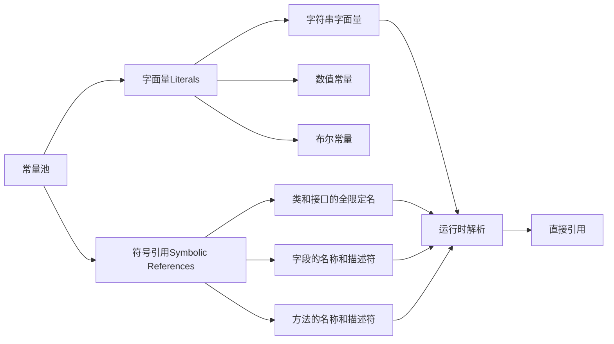
```mermaid
graph LR
    A[常量池] --> B[字面量Literals]
    A --> C[符号引用Symbolic References]
    
    B --> B1[字符串字面量]
    B --> B2[数值常量]
    B --> B3[布尔常量]
    
    C --> C1[类和接口的全限定名]
    C --> C2[字段的名称和描述符]
    C --> C3[方法的名称和描述符]
    
    B1 --> D[运行时解析]
    C1 --> D
    C2 --> D
    C3 --> D
    
    D --> E[直接引用]
```

#### 4.3.2 实际场景案例

```java
// 常量池使用示例
public class ConstantPoolExample {
    public static void stringPoolExample() {
        // 字符串字面量存储在字符串常量池
        String str1 = "Hello";           // 常量池中
        String str2 = "Hello";           // 复用常量池中的对象
        String str3 = new String("Hello"); // 堆中新建对象
        
        System.out.println(str1 == str2);    // true，同一个对象
        System.out.println(str1 == str3);    // false，不同对象
        System.out.println(str1.equals(str3)); // true，内容相同
        
        // intern()方法的使用
        String str4 = str3.intern();     // 返回常量池中的对象
        System.out.println(str1 == str4);    // true
    }
    
    public static void numericConstantExample() {
        // 数值常量在常量池中
        int a = 100;    // 小整数缓存
        int b = 100;    // 复用缓存
        
        Integer i1 = 100;  // 自动装箱，使用缓存
        Integer i2 = 100;  // 复用缓存
        Integer i3 = 200;  // 超出缓存范围，新建对象
        Integer i4 = 200;  // 新建对象
        
        System.out.println(i1 == i2);  // true，缓存对象
        System.out.println(i3 == i4);  // false，不同对象
    }
}
```

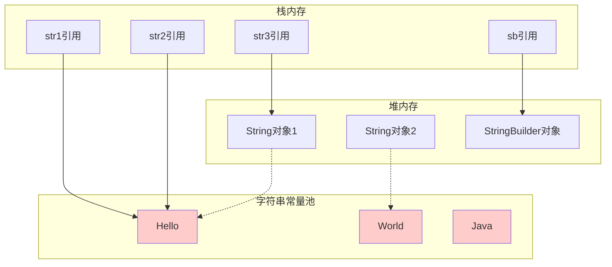
```mermaid
graph TD
    subgraph "字符串常量池"
        A["Hello"]
        B["World"]
        C["Java"]
    end
    
    subgraph "堆内存"
        D[String对象1]
        E[String对象2]
        F[StringBuilder对象]
    end
    
    subgraph "栈内存"
        G[str1引用] --> A
        H[str2引用] --> A
        I[str3引用] --> D
        J[sb引用] --> F
    end
    
    D -.-> A
    E -.-> B
    
    style A fill:#ffcccc
    style B fill:#ffcccc
    style C fill:#ffcccc
```

### 4.4 直接内存（Direct Memory）

#### 4.4.1 直接内存特点

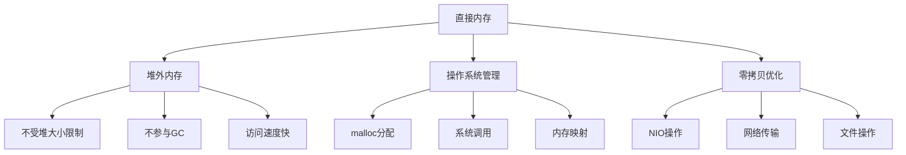
```mermaid
graph TD
    A[直接内存] --> B[堆外内存]
    A --> C[操作系统管理]
    A --> D[零拷贝优化]
    
    B --> B1[不受堆大小限制]
    B --> B2[不参与GC]
    B --> B3[访问速度快]
    
    C --> C1[malloc分配]
    C --> C2[系统调用]
    C --> C3[内存映射]
    
    D --> D1[NIO操作]
    D --> D2[网络传输]
    D --> D3[文件操作]
```

#### 4.4.2 实际场景案例

```java
// 直接内存使用示例
import java.nio.ByteBuffer;
import java.nio.channels.FileChannel;
import java.io.RandomAccessFile;

public class DirectMemoryExample {
    
    public void directBufferExample() {
        // 分配直接内存
        ByteBuffer directBuffer = ByteBuffer.allocateDirect(1024 * 1024); // 1MB
        ByteBuffer heapBuffer = ByteBuffer.allocate(1024 * 1024);         // 堆内存
        
        // 直接内存的优势：零拷贝
        byte[] data = "Hello Direct Memory".getBytes();
        directBuffer.put(data);
        directBuffer.flip();
        
        // 读取数据
        byte[] result = new byte[data.length];
        directBuffer.get(result);
        
        System.out.println(new String(result));
    }
    
    public void fileChannelExample() throws Exception {
        RandomAccessFile file = new RandomAccessFile("test.txt", "rw");
        FileChannel channel = file.getChannel();
        
        // 使用直接内存进行文件操作
        ByteBuffer buffer = ByteBuffer.allocateDirect(1024);
        
        // 零拷贝读取文件
        int bytesRead = channel.read(buffer);
        buffer.flip();
        
        // 零拷贝写入文件
        channel.write(buffer);
        
        channel.close();
        file.close();
    }
    
    // 内存映射文件示例
    public void memoryMappedFileExample() throws Exception {
        RandomAccessFile file = new RandomAccessFile("large_file.dat", "rw");
        FileChannel channel = file.getChannel();
        
        // 内存映射，使用直接内存
        long fileSize = 1024 * 1024 * 100; // 100MB
        var mappedBuffer = channel.map(
            FileChannel.MapMode.READ_WRITE, 0, fileSize
        );
        
        // 直接操作内存映射区域
        mappedBuffer.put(0, (byte) 'A');
        byte value = mappedBuffer.get(0);
        
        channel.close();
        file.close();
    }
}
```

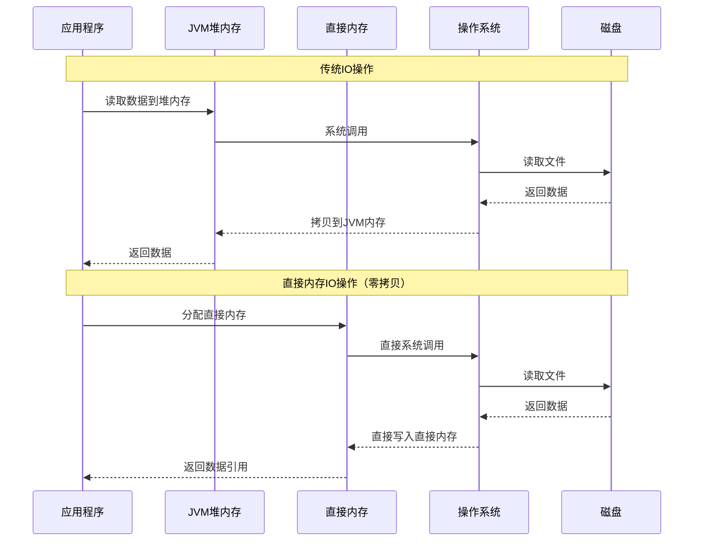
```mermaid
sequenceDiagram
    participant App as 应用程序
    participant JVM as JVM堆内存
    participant Direct as 直接内存
    participant OS as 操作系统
    participant Disk as 磁盘
    
    Note over App,Disk: 传统IO操作
    App->>JVM: 读取数据到堆内存
    JVM->>OS: 系统调用
    OS->>Disk: 读取文件
    Disk-->>OS: 返回数据
    OS-->>JVM: 拷贝到JVM内存
    JVM-->>App: 返回数据
    
    Note over App,Disk: 直接内存IO操作（零拷贝）
    App->>Direct: 分配直接内存
    Direct->>OS: 直接系统调用
    OS->>Disk: 读取文件
    Disk-->>OS: 返回数据
    OS-->>Direct: 直接写入直接内存
    Direct-->>App: 返回数据引用
```

---

## 5. 堆内存与栈内存核心原理

### 5.1 设计哲学对比

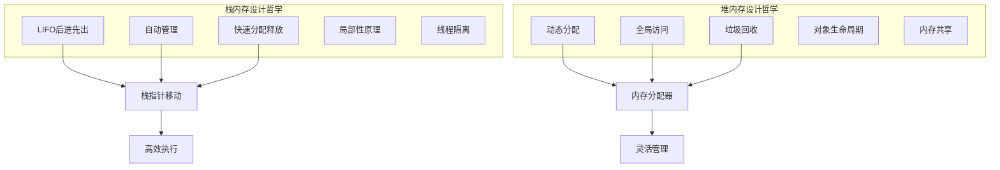
```mermaid
graph TD
    subgraph "栈内存设计哲学"
        A1[LIFO后进先出]
        A2[自动管理]
        A3[快速分配释放]
        A4[局部性原理]
        A5[线程隔离]
    end
    
    subgraph "堆内存设计哲学"
        B1[动态分配]
        B2[全局访问]
        B3[垃圾回收]
        B4[对象生命周期]
        B5[内存共享]
    end
    
    A1 --> C[栈指针移动]
    A2 --> C
    A3 --> C
    
    B1 --> D[内存分配器]
    B2 --> D
    B3 --> D
    
    C --> E[高效执行]
    D --> F[灵活管理]
```

### 5.2 内存分配策略

```mermaid
graph LR
    subgraph "栈内存分配"
        A[栈顶指针] --> B[分配空间]
        B --> C[使用内存]
        C --> D[自动释放]
        D --> E[栈顶指针回退]
    end
    
    subgraph "堆内存分配"
        F[空闲链表] --> G[查找合适块]
        G --> H[分割内存块]
        H --> I[返回地址]
        I --> J[标记已使用]
    end
    
    subgraph "性能对比"
        K[栈分配：O1时间复杂度]
        L[堆分配：On时间复杂度]
    end
    
    E --> K
    J --> L
```

### 5.3 核心原理深度解析

#### 5.3.1 栈内存工作原理

```java
// 栈内存工作原理示例
public class StackPrincipleExample {
    
    public void demonstrateStackOperation() {
        // 栈帧1开始
        int a = 10;        // 局部变量表slot 0
        double b = 3.14;   // 局部变量表slot 1-2 (double占2个slot)
        
        String str = processData(a, b); // 方法调用，创建新栈帧
        
        System.out.println(str);
        // 栈帧1结束，所有局部变量自动销毁
    }
    
    private String processData(int num, double decimal) {
        // 栈帧2开始
        // 参数：num在slot 0, decimal在slot 1-2
        StringBuilder sb = new StringBuilder(); // 局部变量slot 3
        
        // 操作数栈操作
        sb.append("Number: ");  // sb引用压入操作数栈
        sb.append(num);         // num值压入操作数栈，调用append
        sb.append(", Decimal: ");
        sb.append(decimal);     // decimal值压入操作数栈
        
        String result = sb.toString(); // 调用toString，结果压入操作数栈
        return result;          // 返回值通过操作数栈传递
        // 栈帧2结束，局部变量自动销毁
    }
}
```

```mermaid
graph TD
    subgraph "栈帧结构详解"
        A[栈帧] --> B[局部变量表]
        A --> C[操作数栈]
        A --> D[动态链接]
        A --> E[返回地址]
        
        B --> B1[Slot 0: this引用]
        B --> B2[Slot 1: 参数1]
        B --> B3[Slot 2: 参数2]
        B --> B4[Slot 3: 局部变量1]
        
        C --> C1[栈底]
        C --> C2[操作数1]
        C --> C3[操作数2]
        C --> C4[栈顶]
    end
    
    subgraph "栈操作过程"
        F[压栈Push] --> G[计算]
        G --> H[弹栈Pop]
        H --> I[存储结果]
    end
```

#### 5.3.2 堆内存工作原理

```java
// 堆内存工作原理示例
public class HeapPrincipleExample {
    
    public void demonstrateHeapOperation() {
        // 对象创建过程
        Person person = new Person("张三", 25);
        
        // 数组创建
        int[] numbers = new int[100];
        
        // 集合创建
        List<String> list = new ArrayList<>();
        list.add("Hello");
        list.add("World");
        
        // 大对象创建
        byte[] bigData = new byte[1024 * 1024]; // 1MB，可能直接进入老年代
        
        // 对象引用传递
        processPerson(person);
        
        // 方法结束，栈中的引用消失，但堆中的对象可能仍然存在
    }
    
    private void processPerson(Person p) {
        // p是对堆中Person对象的另一个引用
        p.setAge(26); // 修改堆中的对象
        
        // 创建新对象
        Person newPerson = new Person("李四", 30);
        // newPerson引用在方法结束时消失，但对象在堆中等待GC
    }
    
    static class Person {
        private String name;  // 引用类型字段
        private int age;      // 基本类型字段
        
        public Person(String name, int age) {
            this.name = name; // 字符串对象也在堆中
            this.age = age;
        }
        
        // getter和setter方法
        public void setAge(int age) { this.age = age; }
    }
}
```

```mermaid
graph TD
    subgraph "堆内存分配过程"
        A[new Person] --> B[计算对象大小]
        B --> C[在Eden区分配]
        C --> D[初始化对象头]
        D --> E[调用构造函数]
        E --> F[返回对象引用]
    end
    
    subgraph "对象内存布局"
        G[对象头 Object Header] --> G1[Mark Word]
        G --> G2[Class Pointer]
        G --> G3[Array Length可选]
        
        H[实例数据 Instance Data] --> H1[name字段引用]
        H --> H2[age字段值]
        
        I[对齐填充 Padding]
    end
    
    F --> G
    G --> H
    H --> I
```

### 5.4 内存访问模式对比

```mermaid
sequenceDiagram
    participant CPU as CPU
    participant Cache as 缓存
    participant Stack as 栈内存
    participant Heap as 堆内存
    
    Note over CPU,Heap: 栈内存访问模式
    CPU->>Stack: 访问局部变量
    Stack-->>CPU: 直接返回（高缓存命中率）
    
    Note over CPU,Heap: 堆内存访问模式
    CPU->>Cache: 查找对象
    alt 缓存命中
        Cache-->>CPU: 返回数据
    else 缓存未命中
        Cache->>Heap: 从堆加载
        Heap-->>Cache: 返回数据
        Cache-->>CPU: 返回数据
    end
    
    Note over CPU,Heap: 性能差异显著
```

---

## 6. 通用案例教学

### 6.1 完整的内存使用案例

```java
/**
 * 综合内存模型案例：在线购物系统
 * 演示各种内存区域的使用
 */
public class OnlineShoppingSystem {
    
    // 静态变量：引用在方法区，对象在堆中
    private static final String SYSTEM_NAME = "购物系统"; // 字符串常量池
    private static Map<String, Product> productCache = new ConcurrentHashMap<>(); // 堆中
    
    // 实例变量：存储在堆中（作为对象的一部分）
    private String userId;
    private List<CartItem> shoppingCart;
    
    public OnlineShoppingSystem(String userId) {
        this.userId = userId;                    // 字符串在堆中
        this.shoppingCart = new ArrayList<>();   // 集合对象在堆中
    }
    
    /**
     * 添加商品到购物车
     * 演示栈内存、堆内存、方法区的协作
     */
    public void addToCart(String productId, int quantity) {
        // 局部变量在栈中
        long startTime = System.currentTimeMillis(); // 栈中
        
        try {
            // 从缓存获取商品（堆内存访问）
            Product product = getProductFromCache(productId);
            
            if (product == null) {
                // 从数据库加载（可能使用直接内存进行IO）
                product = loadProductFromDatabase(productId);
                
                if (product != null) {
                    // 加入缓存（堆内存操作）
                    productCache.put(productId, product);
                }
            }
            
            if (product != null && product.getStock() >= quantity) {
                // 创建购物车项（堆内存分配）
                CartItem item = new CartItem(product, quantity);
                
                // 添加到购物车（堆内存中的集合操作）
                shoppingCart.add(item);
                
                // 更新库存（堆内存中对象状态修改）
                product.reduceStock(quantity);
                
                // 记录日志（可能使用直接内存进行文件IO）
                logOperation("添加商品", productId, quantity);
            }
            
        } catch (Exception e) {
            // 异常对象在堆中创建
            handleException(e);
        } finally {
            // 计算耗时（栈中局部变量）
            long duration = System.currentTimeMillis() - startTime;
            System.out.println("操作耗时: " + duration + "ms");
        }
    }
    
    /**
     * 使用本地方法进行性能优化
     */
    public native double calculateOptimalPrice(double basePrice, int quantity);
    
    /**
     * 异步处理订单（演示线程私有内存）
     */
    public CompletableFuture<Order> processOrderAsync() {
        return CompletableFuture.supplyAsync(() -> {
            // 新线程有自己的栈内存
            String threadName = Thread.currentThread().getName(); // 栈中
            long threadId = Thread.currentThread().getId();       // 栈中
            
            try {
                // 创建订单对象（堆内存）
                Order order = new Order(userId, new ArrayList<>(shoppingCart));
                
                // 计算总价（栈中临时变量）
                double totalPrice = 0.0;
                for (CartItem item : shoppingCart) {
                    double itemPrice = item.getProduct().getPrice() * item.getQuantity();
                    
                    // 使用本地方法优化价格计算（本地方法栈）
                    itemPrice = calculateOptimalPrice(itemPrice, item.getQuantity());
                    
                    totalPrice += itemPrice;
                }
                
                order.setTotalPrice(totalPrice);
                
                // 保存订单（可能使用直接内存进行数据库IO）
                saveOrderToDatabase(order);
                
                return order;
                
            } catch (Exception e) {
                throw new RuntimeException("订单处理失败", e);
            }
        });
    }
    
    // 辅助方法
    private Product getProductFromCache(String productId) {
        return productCache.get(productId); // 访问堆中的缓存
    }
    
    private Product loadProductFromDatabase(String productId) {
        // 模拟数据库查询，可能使用直接内存进行IO
        // 实际实现会使用JDBC等
        return new Product(productId, "商品名称", 99.99, 100);
    }
    
    private void logOperation(String operation, String productId, int quantity) {
        // 日志记录，可能使用直接内存写入文件
        String logMessage = String.format("[%s] %s: 商品=%s, 数量=%d", 
            new Date(), operation, productId, quantity);
        System.out.println(logMessage);
    }
    
    private void handleException(Exception e) {
        // 异常处理逻辑
        e.printStackTrace();
    }
    
    private void saveOrderToDatabase(Order order) {
        // 模拟数据库保存操作
        System.out.println("订单已保存: " + order.getOrderId());
    }
}

// 辅助类定义
class Product {
    private String id;
    private String name;
    private double price;
    private int stock;
    
    public Product(String id, String name, double price, int stock) {
        this.id = id;
        this.name = name;
        this.price = price;
        this.stock = stock;
    }
    
    public synchronized void reduceStock(int quantity) {
        if (stock >= quantity) {
            stock -= quantity;
        }
    }
    
    // getter方法
    public double getPrice() { return price; }
    public int getStock() { return stock; }
}

class CartItem {
    private Product product;
    private int quantity;
    
    public CartItem(Product product, int quantity) {
        this.product = product;
        this.quantity = quantity;
    }
    
    // getter方法
    public Product getProduct() { return product; }
    public int getQuantity() { return quantity; }
}

class Order {
    private String orderId;
    private String userId;
    private List<CartItem> items;
    private double totalPrice;
    private Date createTime;
    
    public Order(String userId, List<CartItem> items) {
        this.orderId = UUID.randomUUID().toString();
        this.userId = userId;
        this.items = items;
        this.createTime = new Date();
    }
    
    // getter和setter方法
    public String getOrderId() { return orderId; }
    public void setTotalPrice(double totalPrice) { this.totalPrice = totalPrice; }
}
```

### 6.2 内存使用分析图

```mermaid
graph TD
    subgraph "线程1栈内存"
        A1[addToCart方法栈帧]
        A2[局部变量: startTime, product, item]
        A3[方法参数: productId, quantity]
    end
    
    subgraph "线程2栈内存（异步）"
        B1[processOrderAsync方法栈帧]
        B2[局部变量: threadName, totalPrice]
        B3[循环变量: item, itemPrice]
    end
    
    subgraph "堆内存"
        C1[OnlineShoppingSystem实例]
        C2[productCache Map对象]
        C3[Product对象们]
        C4[CartItem对象们]
        C5[Order对象]
        C6[ArrayList对象]
    end
    
    subgraph "方法区"
        D1[OnlineShoppingSystem类信息]
        D2[Product类信息]
        D3[方法字节码]
        D4[静态变量引用]
    end
    
    subgraph "常量池"
        E1["购物系统" 字符串]
        E2["添加商品" 字符串]
        E3[其他字符串常量]
    end
    
    A2 --> C1
    A2 --> C3
    B2 --> C5
    C1 --> C2
    C2 --> C3
    D4 --> C2
    D1 --> E1
```

### 6.3 内存生命周期分析

```mermaid
sequenceDiagram
    participant Thread as 线程
    participant Stack as 栈内存
    participant Heap as 堆内存
    participant Method as 方法区
    participant GC as 垃圾回收器
    
    Note over Thread,GC: 对象创建和销毁生命周期
    
    Thread->>Stack: 调用addToCart()
    Stack->>Stack: 创建栈帧，分配局部变量
    
    Thread->>Heap: new CartItem()
    Heap->>Heap: 在Eden区分配对象
    
    Thread->>Method: 访问类信息
    Method-->>Thread: 返回方法字节码
    
    Thread->>Stack: 方法执行完毕
    Stack->>Stack: 销毁栈帧，局部变量消失
    
    Note over Heap: 对象失去引用，成为垃圾
    
    GC->>Heap: 检测垃圾对象
    GC->>Heap: 清理无引用对象
    
    Note over Thread,GC: 栈内存自动管理，堆内存需要GC
```

---

## 7. 跨平台内存模型对比

### 7.1 不同语言内存模型对比

```mermaid
graph TD
    A[编程语言内存模型] --> B[Java/JVM]
    A --> C[C/C++]
    A --> D[JavaScript/V8]
    A --> E[Go]
    A --> F[Rust]
    
    B --> B1[堆栈分离]
    B --> B2[垃圾回收]
    B --> B3[JMM内存模型]
    
    C --> C1[手动管理]
    C --> C2[栈堆统一]
    C --> C3[指针直接访问]
    
    D --> D1[V8堆管理]
    D --> D2[标记清除GC]
    D --> D3[事件循环]
    
    E --> E1[Goroutine栈]
    E --> E2[GC并发]
    E --> E3[CSP模型]
    
    F --> F1[所有权系统]
    F --> F2[零成本抽象]
    F --> F3[内存安全]
```

### 7.2 平台特定实现

#### 7.2.1 JavaScript V8引擎

```javascript
// JavaScript内存模型示例
class JavaScriptMemoryExample {
    constructor() {
        // 对象属性存储在堆中
        this.instanceVar = "实例变量";
        this.numbers = [1, 2, 3, 4, 5]; // 数组在堆中
    }
    
    demonstrateMemoryUsage() {
        // 基本类型在栈中（V8优化）
        let localNum = 42;
        let localStr = "局部字符串";
        
        // 对象在堆中
        let obj = {
            name: "张三",
            age: 25,
            hobbies: ["读书", "游泳"] // 嵌套数组也在堆中
        };
        
        // 闭包会捕获外部变量
        function createClosure() {
            let capturedVar = "被捕获的变量"; // 可能被提升到堆中
            
            return function() {
                console.log(capturedVar); // 闭包访问
            };
        }
        
        let closure = createClosure();
        
        // 异步操作
        setTimeout(() => {
            // 回调函数可能引用外部变量
            console.log(obj.name);
        }, 1000);
    }
    
    // 内存泄漏示例
    memoryLeakExample() {
        let bigArray = new Array(1000000).fill("大数据");
        
        // 全局变量引用，不会被GC
        window.globalLeak = bigArray;
        
        // 事件监听器未移除
        document.addEventListener('click', function() {
            console.log(bigArray.length); // 引用大数组
        });
        
        // 定时器未清除
        setInterval(() => {
            console.log(bigArray[0]);
        }, 1000);
    }
}
```

#### 7.2.2 Go语言内存模型

```go
// Go语言内存模型示例
package main

import (
    "fmt"
    "runtime"
    "sync"
    "time"
)

type GoMemoryExample struct {
    instanceVar string
    numbers     []int
}

func (g *GoMemoryExample) demonstrateMemoryUsage() {
    // 栈变量
    localNum := 42
    localStr := "局部字符串"
    
    // 切片在堆中分配
    slice := make([]int, 1000)
    
    // map在堆中分配
    m := make(map[string]int)
    m["key"] = 100
    
    // 结构体可能在栈或堆中，取决于逃逸分析
    type Person struct {
        Name string
        Age  int
    }
    
    person := Person{Name: "张三", Age: 25} // 可能在栈中
    personPtr := &Person{Name: "李四", Age: 30} // 在堆中
    
    fmt.Printf("栈变量: %d, %s\n", localNum, localStr)
    fmt.Printf("切片长度: %d\n", len(slice))
    fmt.Printf("Map值: %d\n", m["key"])
    fmt.Printf("结构体: %+v, %+v\n", person, personPtr)
}

// Goroutine栈管理
func demonstrateGoroutineStack() {
    var wg sync.WaitGroup
    
    for i := 0; i < 10; i++ {
        wg.Add(1)
        go func(id int) {
            defer wg.Done()
            
            // 每个goroutine有自己的栈
            var localArray [1000]int
            localArray[0] = id
            
            // 递归调用会增长栈
            recursiveFunction(10, id)
            
            fmt.Printf("Goroutine %d 完成\n", id)
        }(i)
    }
    
    wg.Wait()
}

func recursiveFunction(depth, id int) {
    if depth <= 0 {
        return
    }
    
    // 栈帧增长
    var localVar [100]int
    localVar[0] = depth
    
    recursiveFunction(depth-1, id)
}

// 内存统计
func printMemoryStats() {
    var m runtime.MemStats
    runtime.ReadMemStats(&m)
    
    fmt.Printf("分配的堆内存: %d KB\n", m.Alloc/1024)
    fmt.Printf("总分配内存: %d KB\n", m.TotalAlloc/1024)
    fmt.Printf("系统内存: %d KB\n", m.Sys/1024)
    fmt.Printf("GC次数: %d\n", m.NumGC)
}

func main() {
    example := &GoMemoryExample{
        instanceVar: "实例变量",
        numbers:     []int{1, 2, 3, 4, 5},
    }
    
    example.demonstrateMemoryUsage()
    
    fmt.Println("开始Goroutine测试...")
    demonstrateGoroutineStack()
    
    fmt.Println("内存统计:")
    printMemoryStats()
    
    // 强制GC
    runtime.GC()
    time.Sleep(100 * time.Millisecond)
    
    fmt.Println("GC后内存统计:")
    printMemoryStats()
}
```

#### 7.2.3 Rust内存模型

```rust
// Rust内存模型示例
use std::collections::HashMap;
use std::thread;
use std::sync::{Arc, Mutex};

struct RustMemoryExample {
    instance_var: String,
    numbers: Vec<i32>,
}

impl RustMemoryExample {
    fn new() -> Self {
        RustMemoryExample {
            instance_var: String::from("实例变量"),
            numbers: vec![1, 2, 3, 4, 5],
        }
    }
    
    fn demonstrate_ownership(&self) {
        // 栈上的变量
        let local_num = 42;
        let local_str = "局部字符串"; // &str 在栈中，字符串数据在程序段
        
        // 堆上的数据
        let owned_string = String::from("拥有的字符串"); // 在堆中
        let vec_data = vec![1, 2, 3, 4, 5]; // 在堆中
        
        // 所有权转移
        let moved_string = owned_string; // 所有权转移
        // println!("{}", owned_string); // 编译错误！所有权已转移
        
        // 借用
        let borrowed_str = &moved_string; // 不可变借用
        println!("借用的字符串: {}", borrowed_str);
        
        // 可变借用
        let mut mutable_vec = vec![1, 2, 3];
        let mutable_ref = &mut mutable_vec;
        mutable_ref.push(4);
        
        println!("局部数字: {}", local_num);
        println!("局部字符串: {}", local_str);
        println!("向量数据: {:?}", vec_data);
    }
    
    fn demonstrate_lifetimes<'a>(&self, input: &'a str) -> &'a str {
        // 生命周期确保引用有效性
        if input.len() > 5 {
            input
        } else {
            "默认值"
        }
    }
    
    fn demonstrate_smart_pointers(&self) {
        use std::rc::Rc;
        use std::cell::RefCell;
        
        // Box: 堆分配
        let boxed_value = Box::new(42);
        println!("Box值: {}", boxed_value);
        
        // Rc: 引用计数
        let rc_value = Rc::new(String::from("共享数据"));
        let rc_clone = Rc::clone(&rc_value);
        println!("Rc计数: {}", Rc::strong_count(&rc_value));
        
        // RefCell: 内部可变性
        let ref_cell = RefCell::new(vec![1, 2, 3]);
        ref_cell.borrow_mut().push(4);
        println!("RefCell数据: {:?}", ref_cell.borrow());
    }
}

// 线程安全的内存共享
fn demonstrate_thread_safety() {
    let shared_data = Arc::new(Mutex::new(HashMap::new()));
    let mut handles = vec![];
    
    for i in 0..10 {
        let data = Arc::clone(&shared_data);
        let handle = thread::spawn(move || {
            let mut map = data.lock().unwrap();
            map.insert(i, i * i);
        });
        handles.push(handle);
    }
    
    for handle in handles {
        handle.join().unwrap();
    }
    
    let final_data = shared_data.lock().unwrap();
    println!("线程共享数据: {:?}", *final_data);
}

// 零成本抽象示例
fn zero_cost_abstraction() {
    let numbers = vec![1, 2, 3, 4, 5];
    
    // 迭代器是零成本抽象
    let sum: i32 = numbers
        .iter()
        .map(|x| x * x)
        .filter(|&x| x > 10)
        .sum();
    
    println!("计算结果: {}", sum);
}

fn main() {
    let example = RustMemoryExample::new();
    
    println!("=== 所有权演示 ===");
    example.demonstrate_ownership();
    
    println!("\n=== 生命周期演示 ===");
    let result = example.demonstrate_lifetimes("Hello Rust");
    println!("生命周期结果: {}", result);
    
    println!("\n=== 智能指针演示 ===");
    example.demonstrate_smart_pointers();
    
    println!("\n=== 线程安全演示 ===");
    demonstrate_thread_safety();
    
    println!("\n=== 零成本抽象演示 ===");
    zero_cost_abstraction();
}
```

### 7.3 内存模型特性对比表

| 特性 | Java | JavaScript | Go | Rust | C++ |
|------|------|------------|----|----- |-----|
| **内存管理** | 自动GC | 自动GC | 自动GC | 编译时检查 | 手动管理 |
| **栈堆分离** | 明确分离 | V8优化 | 逃逸分析 | 明确分离 | 程序员控制 |
| **线程安全** | synchronized | 单线程+Worker | channel/mutex | 所有权系统 | 程序员保证 |
| **内存泄漏** | 可能发生 | 可能发生 | 较少发生 | 编译时防止 | 容易发生 |
| **性能开销** | GC暂停 | GC暂停 | 低延迟GC | 零成本抽象 | 最优性能 |
| **学习难度** | 中等 | 简单 | 中等 | 较难 | 困难 |

---

## 8. 内存管理最佳实践

### 8.1 通用最佳实践

```mermaid
mindmap
  root((内存管理最佳实践))
    设计原则
      最小化对象创建
      复用对象池
      及时释放资源
      避免内存泄漏
    
    编码规范
      明确生命周期
      合理使用缓存
      注意循环引用
      监控内存使用
    
    性能优化
      减少GC压力
      优化数据结构
      批量操作
      懒加载策略
    
    调试技巧
      内存分析工具
      GC日志分析
      堆转储分析
      性能监控
```

### 8.2 内存优化代码示例

```java
// 内存优化最佳实践示例
public class MemoryOptimizationExample {
    
    // 对象池模式
    private static final ObjectPool<StringBuilder> STRING_BUILDER_POOL = 
        new ObjectPool<>(StringBuilder::new, 10);
    
    // 缓存策略
    private static final Map<String, Object> CACHE = 
        new ConcurrentHashMap<>(1000);
    
    // 弱引用缓存，避免内存泄漏
    private static final Map<String, WeakReference<Object>> WEAK_CACHE = 
        new ConcurrentHashMap<>();
    
    /**
     * 优化字符串拼接
     */
    public String optimizedStringConcat(List<String> strings) {
        StringBuilder sb = STRING_BUILDER_POOL.borrow();
        try {
            for (String str : strings) {
                sb.append(str);
            }
            return sb.toString();
        } finally {
            sb.setLength(0); // 清空内容
            STRING_BUILDER_POOL.returnObject(sb);
        }
    }
    
    /**
     * 批量处理减少GC压力
     */
    public void batchProcess(List<Data> dataList) {
        final int BATCH_SIZE = 1000;
        
        for (int i = 0; i < dataList.size(); i += BATCH_SIZE) {
            int endIndex = Math.min(i + BATCH_SIZE, dataList.size());
            List<Data> batch = dataList.subList(i, endIndex);
            
            // 批量处理
            processBatch(batch);
            
            // 建议GC（在批次间隙）
            if (i % (BATCH_SIZE * 10) == 0) {
                System.gc(); // 仅在必要时建议GC
            }
        }
    }
    
    /**
     * 懒加载和缓存结合
     */
    public Object getExpensiveObject(String key) {
        // 先检查强引用缓存
        Object cached = CACHE.get(key);
        if (cached != null) {
            return cached;
        }
        
        // 检查弱引用缓存
        WeakReference<Object> weakRef = WEAK_CACHE.get(key);
        if (weakRef != null) {
            Object obj = weakRef.get();
            if (obj != null) {
                // 重新放入强引用缓存
                CACHE.put(key, obj);
                return obj;
            } else {
                // 弱引用已被回收
                WEAK_CACHE.remove(key);
            }
        }
        
        // 创建新对象
        Object newObj = createExpensiveObject(key);
        
        // 根据缓存策略存储
        if (CACHE.size() < 100) {
            CACHE.put(key, newObj);
        } else {
            WEAK_CACHE.put(key, new WeakReference<>(newObj));
        }
        
        return newObj;
    }
    
    /**
     * 资源管理模式
     */
    public void processFileWithProperResourceManagement(String filename) {
        // 使用try-with-resources确保资源释放
        try (FileInputStream fis = new FileInputStream(filename);
             BufferedInputStream bis = new BufferedInputStream(fis);
             ByteArrayOutputStream baos = new ByteArrayOutputStream()) {
            
            byte[] buffer = new byte[8192]; // 合理的缓冲区大小
            int bytesRead;
            
            while ((bytesRead = bis.read(buffer)) != -1) {
                baos.write(buffer, 0, bytesRead);
            }
            
            // 处理数据
            processData(baos.toByteArray());
            
        } catch (IOException e) {
            handleException(e);
        }
        // 资源自动释放
    }
    
    /**
     * 内存监控和告警
     */
    public void monitorMemoryUsage() {
        MemoryMXBean memoryBean = ManagementFactory.getMemoryMXBean();
        MemoryUsage heapUsage = memoryBean.getHeapMemoryUsage();
        
        long used = heapUsage.getUsed();
        long max = heapUsage.getMax();
        double usagePercent = (double) used / max * 100;
        
        if (usagePercent > 80) {
            // 内存使用率过高，触发告警
            logger.warn("内存使用率过高: {}%", String.format("%.2f", usagePercent));
            
            // 清理缓存
            clearCache();
            
            // 建议GC
            System.gc();
        }
        
        // 记录内存使用情况
        logger.info("堆内存使用: {} MB / {} MB ({}%)", 
            used / 1024 / 1024, 
            max / 1024 / 1024, 
            String.format("%.2f", usagePercent));
    }
    
    private void processBatch(List<Data> batch) {
        // 批量处理逻辑
    }
    
    private Object createExpensiveObject(String key) {
        // 创建昂贵对象的逻辑
        return new Object();
    }
    
    private void processData(byte[] data) {
        // 数据处理逻辑
    }
    
    private void handleException(Exception e) {
        // 异常处理逻辑
    }
    
    private void clearCache() {
        CACHE.clear();
        WEAK_CACHE.clear();
    }
}

// 简单对象池实现
class ObjectPool<T> {
    private final Queue<T> pool = new ConcurrentLinkedQueue<>();
    private final Supplier<T> factory;
    private final int maxSize;
    
    public ObjectPool(Supplier<T> factory, int maxSize) {
        this.factory = factory;
        this.maxSize = maxSize;
    }
    
    public T borrow() {
        T obj = pool.poll();
        return obj != null ? obj : factory.get();
    }
    
    public void returnObject(T obj) {
        if (pool.size() < maxSize) {
            pool.offer(obj);
        }
    }
}
```

### 8.3 内存调优工具和技巧

```mermaid
graph TD
    A[内存调优工具] --> B[分析工具]
    A --> C[监控工具]
    A --> D[调试工具]
    
    B --> B1[JProfiler]
    B --> B2[Eclipse MAT]
    B --> B3[VisualVM]
    B --> B4[JConsole]
    
    C --> C1[Prometheus + Grafana]
    C --> C2[New Relic]
    C --> C3[AppDynamics]
    C --> C4[自定义监控]
    
    D --> D1[GC日志分析]
    D --> D2[堆转储分析]
    D --> D3[线程转储分析]
    D --> D4[性能基准测试]
```

---

## 9. 总结

### 9.1 内存模型核心要点

```mermaid
mindmap
  root((内存模型核心))
    设计目的
      并发安全
      性能优化
      资源管理
      程序正确性
    
    关键概念
      线程私有内存
      线程共享内存
      内存可见性
      内存一致性
    
    实现机制
      栈内存管理
      堆内存分配
      垃圾回收
      内存屏障
    
    最佳实践
      合理使用缓存
      及时释放资源
      避免内存泄漏
      性能监控
```

### 9.2 学习建议

1. **理论基础**：深入理解操作系统内存管理原理
2. **实践应用**：通过实际项目加深理解
3. **工具使用**：熟练掌握内存分析工具
4. **持续学习**：关注新技术和最佳实践
5. **性能调优**：建立完整的性能监控体系

### 9.3 发展趋势

- **更智能的GC算法**：低延迟、高吞吐量
- **编译时优化**：更好的逃逸分析和内存布局优化
- **硬件协同**：利用新硬件特性优化内存访问
- **语言演进**：更安全、更高效的内存管理模型

通过深入理解内存模型，我们能够编写出更高效、更安全、更可维护的程序，这是每个程序员都应该掌握的核心技能。