# 同步异步技术方案详解

## 目录
1. [概述](#1-概述)
2. [基础概念](#2-基础概念)
3. [技术架构设计](#3-技术架构设计)
4. [平台实现方案](#4-平台实现方案)
5. [性能优化策略](#5-性能优化策略)
6. [最佳实践](#6-最佳实践)
7. [常见问题与解决方案](#7-常见问题与解决方案)
8. [总结](#8-总结)

---

## 1. 概述

### 1.1 为什么需要同步异步技术方案

### 1.2 适用场景

| 场景类型 | 同步操作 | 异步操作 |
|----------|----------|----------|
| 网络请求 | ❌ 阻塞UI | ✅ 推荐 |
| 文件读写 | ⚠️ 小文件可用 | ✅ 大文件推荐 |
| 数据库操作 | ⚠️ 简单查询 | ✅ 复杂操作推荐 |
| UI更新 | ✅ 主线程必须 | ❌ 不适用 |
| 计算密集 | ❌ 阻塞UI | ✅ 后台处理 |

---

## 2. 基础概念

### 2.1 同步 vs 异步

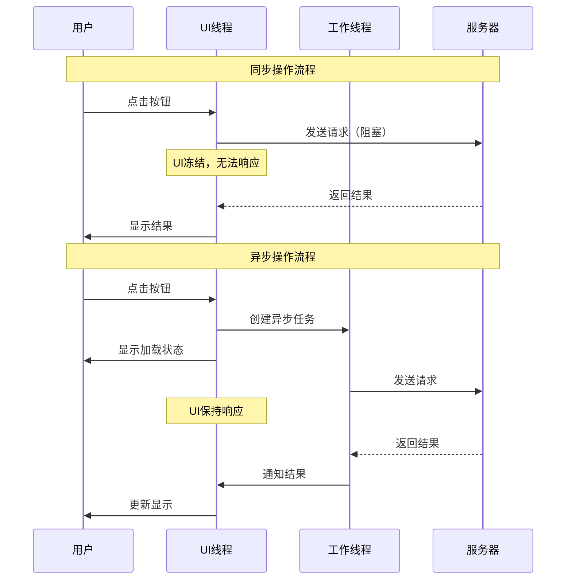

### 2.2 核心概念定义

#### 2.2.1 同步操作（Synchronous）
- **定义**：代码按顺序执行，每个操作必须等待前一个操作完成
- **特点**：简单直观，但可能阻塞主线程
- **适用**：快速操作、UI更新、简单计算

#### 2.2.2 异步操作（Asynchronous）
- **定义**：操作在后台执行，不阻塞主线程
- **特点**：复杂但高效，提升用户体验
- **适用**：网络请求、文件操作、长时间计算

### 2.3 异步编程模型

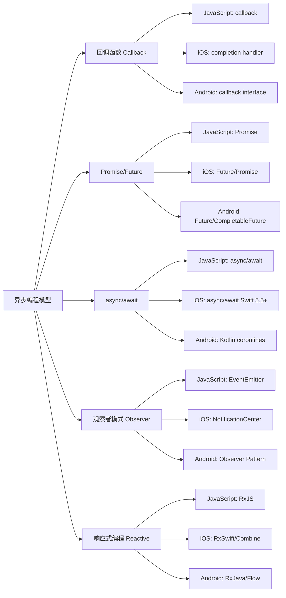

---

## 3. 技术架构设计

### 3.1 整体架构

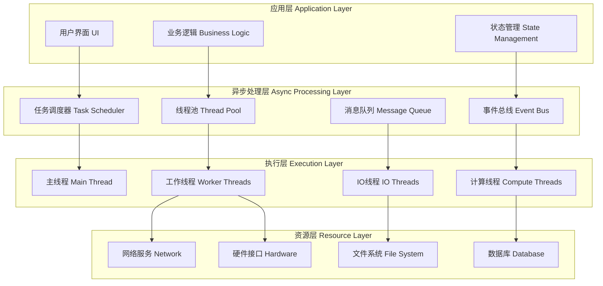

### 3.2 异步任务生命周期

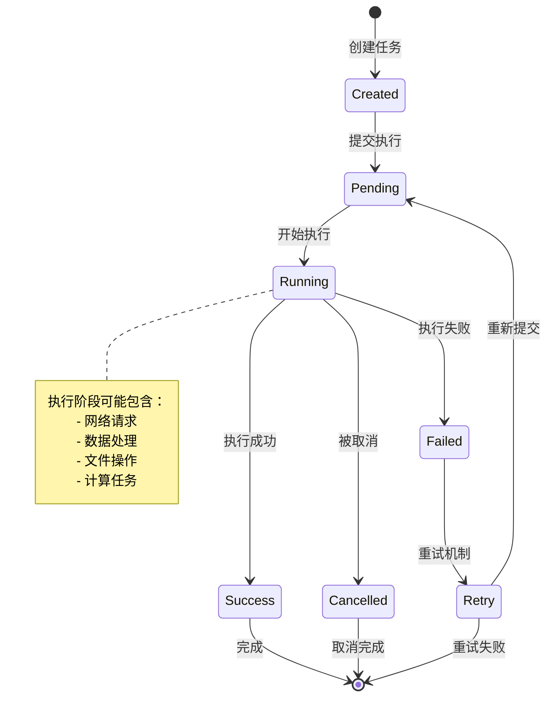

### 3.3 线程模型设计

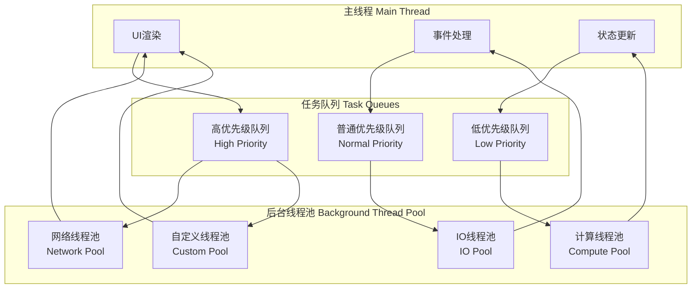

---

## 4. 平台实现方案

### 4.1 Web端实现

#### 4.1.1 技术栈选择

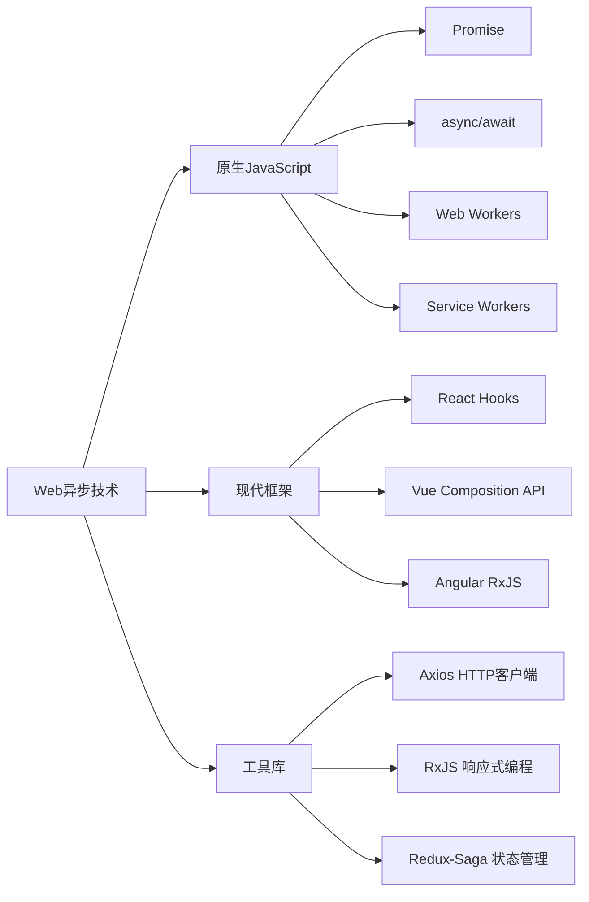

#### 4.1.2 Web端代码示例

```typescript
// 1. Promise 基础实现
class WebAsyncManager {
  // 网络请求封装
  async fetchData<T>(url: string, options?: RequestInit): Promise<T> {
    try {
      const response = await fetch(url, {
        ...options,
        headers: {
          'Content-Type': 'application/json',
          ...options?.headers
        }
      });
      
      if (!response.ok) {
        throw new Error(`HTTP ${response.status}: ${response.statusText}`);
      }
      
      return await response.json();
    } catch (error) {
      console.error('网络请求失败:', error);
      throw error;
    }
  }
  
  // 并发请求处理
  async fetchMultiple<T>(urls: string[]): Promise<T[]> {
    const promises = urls.map(url => this.fetchData<T>(url));
    return Promise.all(promises);
  }
  
  // 超时控制
  async fetchWithTimeout<T>(url: string, timeout: number = 5000): Promise<T> {
    const controller = new AbortController();
    const timeoutId = setTimeout(() => controller.abort(), timeout);
    
    try {
      const result = await this.fetchData<T>(url, {
        signal: controller.signal
      });
      clearTimeout(timeoutId);
      return result;
    } catch (error) {
      clearTimeout(timeoutId);
      throw error;
    }
  }
}

// 2. Web Workers 实现
// main.ts
class WebWorkerManager {
  private workers: Map<string, Worker> = new Map();
  
  createWorker(name: string, scriptPath: string): Worker {
    const worker = new Worker(scriptPath);
    this.workers.set(name, worker);
    return worker;
  }
  
  async executeTask<T>(workerName: string, data: any): Promise<T> {
    const worker = this.workers.get(workerName);
    if (!worker) {
      throw new Error(`Worker ${workerName} not found`);
    }
    
    return new Promise((resolve, reject) => {
      worker.postMessage(data);
      
      worker.onmessage = (event) => {
        if (event.data.error) {
          reject(new Error(event.data.error));
        } else {
          resolve(event.data.result);
        }
      };
      
      worker.onerror = (error) => reject(error);
    });
  }
}

// worker.js
self.onmessage = function(event) {
  const { type, data } = event.data;
  
  try {
    let result;
    switch (type) {
      case 'HEAVY_COMPUTATION':
        result = performHeavyComputation(data);
        break;
      case 'DATA_PROCESSING':
        result = processLargeDataSet(data);
        break;
      default:
        throw new Error(`Unknown task type: ${type}`);
    }
    
    self.postMessage({ result });
  } catch (error) {
    self.postMessage({ error: error.message });
  }
};

// 3. React Hooks 异步处理
import { useState, useEffect, useCallback } from 'react';

// 自定义异步Hook
function useAsyncOperation<T>() {
  const [data, setData] = useState<T | null>(null);
  const [loading, setLoading] = useState(false);
  const [error, setError] = useState<Error | null>(null);
  
  const execute = useCallback(async (asyncFn: () => Promise<T>) => {
    setLoading(true);
    setError(null);
    
    try {
      const result = await asyncFn();
      setData(result);
    } catch (err) {
      setError(err as Error);
    } finally {
      setLoading(false);
    }
  }, []);
  
  return { data, loading, error, execute };
}

// 使用示例
function DataComponent() {
  const { data, loading, error, execute } = useAsyncOperation<UserData>();
  
  useEffect(() => {
    execute(() => fetchUserData());
  }, [execute]);
  
  if (loading) return <div>加载中...</div>;
  if (error) return <div>错误: {error.message}</div>;
  if (!data) return <div>暂无数据</div>;
  
  return <div>{/* 渲染数据 */}</div>;
}
```

### 4.2 Android端实现

#### 4.2.1 Android异步技术栈

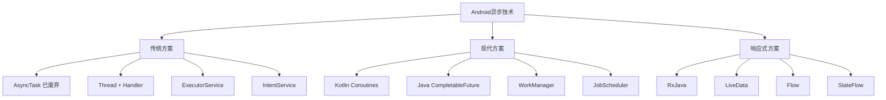

#### 4.2.2 Android代码示例

```kotlin
// 1. Kotlin Coroutines 实现
class AndroidAsyncManager {
    private val networkScope = CoroutineScope(Dispatchers.IO + SupervisorJob())
    private val mainScope = CoroutineScope(Dispatchers.Main + SupervisorJob())
    
    // 网络请求
    suspend fun <T> fetchData(
        url: String,
        parser: (String) -> T
    ): Result<T> = withContext(Dispatchers.IO) {
        try {
            val response = httpClient.get(url)
            val data = parser(response.body)
            Result.success(data)
        } catch (e: Exception) {
            Log.e("AsyncManager", "网络请求失败", e)
            Result.failure(e)
        }
    }
    
    // 并发请求
    suspend fun <T> fetchMultiple(
        requests: List<suspend () -> T>
    ): List<Result<T>> = coroutineScope {
        requests.map { request ->
            async { 
                try {
                    Result.success(request())
                } catch (e: Exception) {
                    Result.failure(e)
                }
            }
        }.awaitAll()
    }
    
    // 超时控制
    suspend fun <T> fetchWithTimeout(
        timeoutMs: Long,
        block: suspend () -> T
    ): T = withTimeout(timeoutMs) {
        block()
    }
    
    // UI更新
    fun updateUI(block: () -> Unit) {
        mainScope.launch {
            block()
        }
    }
}

// 2. Repository 模式 + Coroutines
class UserRepository(
    private val apiService: ApiService,
    private val database: UserDao
) {
    // 缓存优先策略
    suspend fun getUser(userId: String): Flow<Resource<User>> = flow {
        emit(Resource.Loading())
        
        // 先从本地获取
        val localUser = database.getUser(userId)
        if (localUser != null) {
            emit(Resource.Success(localUser))
        }
        
        // 再从网络获取
        try {
            val remoteUser = apiService.getUser(userId)
            database.insertUser(remoteUser)
            emit(Resource.Success(remoteUser))
        } catch (e: Exception) {
            if (localUser == null) {
                emit(Resource.Error(e.message ?: "Unknown error"))
            }
        }
    }.flowOn(Dispatchers.IO)
    
    // 分页加载
    fun getUsersPaged(): Flow<PagingData<User>> {
        return Pager(
            config = PagingConfig(pageSize = 20),
            pagingSourceFactory = { UserPagingSource(apiService) }
        ).flow.cachedIn(viewModelScope)
    }
}

// 3. ViewModel 中的异步处理
class UserViewModel(
    private val repository: UserRepository
) : ViewModel() {
    
    private val _uiState = MutableStateFlow(UserUiState())
    val uiState: StateFlow<UserUiState> = _uiState.asStateFlow()
    
    fun loadUser(userId: String) {
        viewModelScope.launch {
            repository.getUser(userId)
                .catch { e ->
                    _uiState.update { it.copy(error = e.message) }
                }
                .collect { resource ->
                    when (resource) {
                        is Resource.Loading -> {
                            _uiState.update { it.copy(isLoading = true) }
                        }
                        is Resource.Success -> {
                            _uiState.update { 
                                it.copy(
                                    isLoading = false,
                                    user = resource.data,
                                    error = null
                                )
                            }
                        }
                        is Resource.Error -> {
                            _uiState.update { 
                                it.copy(
                                    isLoading = false,
                                    error = resource.message
                                )
                            }
                        }
                    }
                }
        }
    }
    
    // 防抖搜索
    private val searchQuery = MutableStateFlow("")
    
    init {
        searchQuery
            .debounce(300)
            .distinctUntilChanged()
            .filter { it.isNotBlank() }
            .flatMapLatest { query ->
                repository.searchUsers(query)
            }
            .catch { e ->
                _uiState.update { it.copy(error = e.message) }
            }
            .launchIn(viewModelScope)
    }
}

// 4. WorkManager 后台任务
class DataSyncWorker(
    context: Context,
    params: WorkerParameters
) : CoroutineWorker(context, params) {
    
    override suspend fun doWork(): Result {
        return try {
            // 执行数据同步
            val syncResult = performDataSync()
            
            if (syncResult.isSuccess) {
                Result.success()
            } else {
                Result.retry()
            }
        } catch (e: Exception) {
            Log.e("DataSyncWorker", "同步失败", e)
            Result.failure()
        }
    }
    
    private suspend fun performDataSync(): SyncResult {
        // 实现具体的同步逻辑
        return withContext(Dispatchers.IO) {
            // 同步数据
            SyncResult.Success
        }
    }
}
```

### 4.3 iOS端实现

#### 4.3.1 iOS异步技术栈

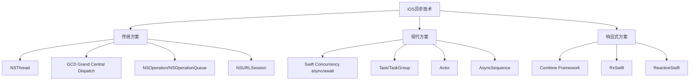

#### 4.3.2 iOS代码示例

```swift
// 1. Swift Concurrency 实现
import Foundation

class IOSAsyncManager {
    private let session = URLSession.shared
    
    // 网络请求
    func fetchData<T: Codable>(
        from url: URL,
        type: T.Type
    ) async throws -> T {
        let (data, response) = try await session.data(from: url)
        
        guard let httpResponse = response as? HTTPURLResponse,
              200...299 ~= httpResponse.statusCode else {
            throw NetworkError.invalidResponse
        }
        
        do {
            return try JSONDecoder().decode(T.self, from: data)
        } catch {
            throw NetworkError.decodingError(error)
        }
    }
    
    // 并发请求
    func fetchMultiple<T: Codable>(
        urls: [URL],
        type: T.Type
    ) async throws -> [T] {
        return try await withThrowingTaskGroup(of: T.self) { group in
            for url in urls {
                group.addTask {
                    try await self.fetchData(from: url, type: type)
                }
            }
            
            var results: [T] = []
            for try await result in group {
                results.append(result)
            }
            return results
        }
    }
    
    // 超时控制
    func fetchWithTimeout<T: Codable>(
        from url: URL,
        type: T.Type,
        timeout: TimeInterval
    ) async throws -> T {
        return try await withTimeout(timeout) {
            try await fetchData(from: url, type: type)
        }
    }
    
    // 主线程更新UI
    @MainActor
    func updateUI(_ block: () -> Void) {
        block()
    }
}

// 2. Repository 模式
actor UserRepository {
    private let apiService: APIService
    private let coreDataStack: CoreDataStack
    private var cache: [String: User] = [:]
    
    init(apiService: APIService, coreDataStack: CoreDataStack) {
        self.apiService = apiService
        self.coreDataStack = coreDataStack
    }
    
    // 缓存优先策略
    func getUser(id: String) async throws -> User {
        // 检查内存缓存
        if let cachedUser = cache[id] {
            return cachedUser
        }
        
        // 检查本地数据库
        if let localUser = try await coreDataStack.fetchUser(id: id) {
            cache[id] = localUser
            
            // 后台更新
            Task {
                try? await refreshUser(id: id)
            }
            
            return localUser
        }
        
        // 从网络获取
        return try await refreshUser(id: id)
    }
    
    private func refreshUser(id: String) async throws -> User {
        let user = try await apiService.fetchUser(id: id)
        
        // 保存到数据库
        try await coreDataStack.saveUser(user)
        
        // 更新缓存
        cache[id] = user
        
        return user
    }
}

// 3. ViewModel with Combine
import Combine

@MainActor
class UserViewModel: ObservableObject {
    @Published var user: User?
    @Published var isLoading = false
    @Published var errorMessage: String?
    
    private let repository: UserRepository
    private var cancellables = Set<AnyCancellable>()
    
    init(repository: UserRepository) {
        self.repository = repository
    }
    
    func loadUser(id: String) {
        isLoading = true
        errorMessage = nil
        
        Task {
            do {
                let user = try await repository.getUser(id: id)
                await MainActor.run {
                    self.user = user
                    self.isLoading = false
                }
            } catch {
                await MainActor.run {
                    self.errorMessage = error.localizedDescription
                    self.isLoading = false
                }
            }
        }
    }
    
    // 搜索防抖
    @Published var searchText = ""
    @Published var searchResults: [User] = []
    
    private func setupSearch() {
        $searchText
            .debounce(for: .milliseconds(300), scheduler: RunLoop.main)
            .removeDuplicates()
            .sink { [weak self] searchText in
                guard !searchText.isEmpty else {
                    self?.searchResults = []
                    return
                }
                
                Task {
                    await self?.performSearch(query: searchText)
                }
            }
            .store(in: &cancellables)
    }
    
    private func performSearch(query: String) async {
        do {
            let results = try await repository.searchUsers(query: query)
            await MainActor.run {
                self.searchResults = results
            }
        } catch {
            await MainActor.run {
                self.errorMessage = error.localizedDescription
            }
        }
    }
}

// 4. SwiftUI 中的异步处理
struct UserView: View {
    @StateObject private var viewModel: UserViewModel
    let userId: String
    
    var body: some View {
        Group {
            if viewModel.isLoading {
                ProgressView("加载中...")
            } else if let errorMessage = viewModel.errorMessage {
                Text("错误: \(errorMessage)")
                    .foregroundColor(.red)
            } else if let user = viewModel.user {
                UserDetailView(user: user)
            } else {
                Text("暂无数据")
            }
        }
        .task {
            await viewModel.loadUser(id: userId)
        }
        .refreshable {
            await viewModel.loadUser(id: userId)
        }
    }
}

// 5. 后台任务处理
class BackgroundTaskManager {
    private var backgroundTask: UIBackgroundTaskIdentifier = .invalid
    
    func performBackgroundSync() {
        backgroundTask = UIApplication.shared.beginBackgroundTask { [weak self] in
            self?.endBackgroundTask()
        }
        
        Task {
            do {
                try await performDataSync()
            } catch {
                print("后台同步失败: \(error)")
            }
            
            endBackgroundTask()
        }
    }
    
    private func endBackgroundTask() {
        UIApplication.shared.endBackgroundTask(backgroundTask)
        backgroundTask = .invalid
    }
    
    private func performDataSync() async throws {
        // 实现具体的同步逻辑
    }
}
```

---

## 5. 性能优化策略

### 5.1 性能优化架构

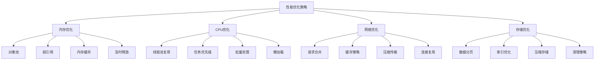

### 5.2 性能监控指标

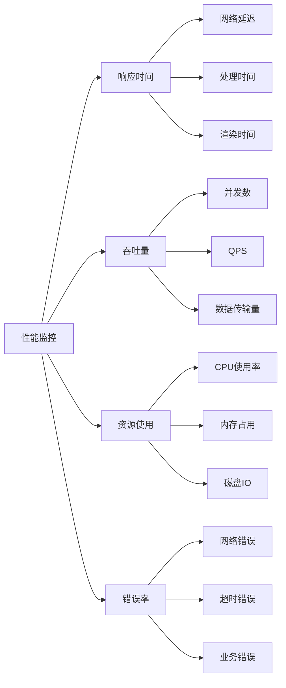

### 5.3 优化实践代码

```typescript
// Web端性能优化
class PerformanceOptimizer {
  private requestCache = new Map<string, Promise<any>>();
  private objectPool = new Map<string, any[]>();
  
  // 请求去重
  async deduplicateRequest<T>(key: string, requestFn: () => Promise<T>): Promise<T> {
    if (this.requestCache.has(key)) {
      return this.requestCache.get(key);
    }
    
    const promise = requestFn().finally(() => {
      this.requestCache.delete(key);
    });
    
    this.requestCache.set(key, promise);
    return promise;
  }
  
  // 对象池
  getObject<T>(type: string, factory: () => T): T {
    const pool = this.objectPool.get(type) || [];
    if (pool.length > 0) {
      return pool.pop();
    }
    return factory();
  }
  
  returnObject<T>(type: string, obj: T): void {
    const pool = this.objectPool.get(type) || [];
    if (pool.length < 10) { // 限制池大小
      pool.push(obj);
      this.objectPool.set(type, pool);
    }
  }
  
  // 批量处理
  private batchQueue = new Map<string, any[]>();
  private batchTimers = new Map<string, NodeJS.Timeout>();
  
  batchProcess<T>(
    key: string,
    item: T,
    processor: (items: T[]) => Promise<void>,
    delay: number = 100
  ): void {
    const queue = this.batchQueue.get(key) || [];
    queue.push(item);
    this.batchQueue.set(key, queue);
    
    // 清除之前的定时器
    const existingTimer = this.batchTimers.get(key);
    if (existingTimer) {
      clearTimeout(existingTimer);
    }
    
    // 设置新的定时器
    const timer = setTimeout(async () => {
      const items = this.batchQueue.get(key) || [];
      this.batchQueue.delete(key);
      this.batchTimers.delete(key);
      
      if (items.length > 0) {
        await processor(items);
      }
    }, delay);
    
    this.batchTimers.set(key, timer);
  }
}
```

---

## 6. 最佳实践

### 6.1 设计原则

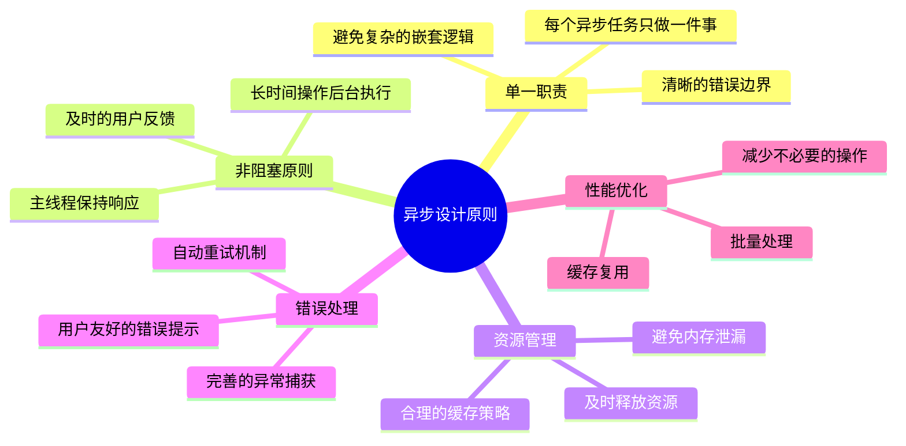

### 6.2 代码规范

#### 6.2.1 命名规范

```typescript
// ✅ 好的命名
async function fetchUserProfile(userId: string): Promise<UserProfile> { }
function handleAsyncError(error: Error): void { }
const loadingState = useState(false);

// ❌ 不好的命名
async function getData(id: string): Promise<any> { }
function handle(e: any): void { }
const state = useState(false);
```

#### 6.2.2 错误处理规范

```typescript
// ✅ 完善的错误处理
async function safeAsyncOperation<T>(
  operation: () => Promise<T>,
  fallback?: T
): Promise<T | undefined> {
  try {
    return await operation();
  } catch (error) {
    console.error('异步操作失败:', error);
    
    // 记录错误日志
    errorLogger.log(error);
    
    // 用户友好的错误提示
    showUserFriendlyError(error);
    
    return fallback;
  }
}

// ❌ 简陋的错误处理
async function unsafeOperation() {
  try {
    return await someAsyncCall();
  } catch (e) {
    console.log(e);
  }
}
```

### 6.3 测试策略

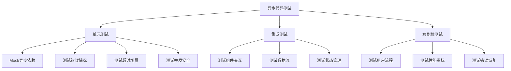

#### 6.3.1 测试代码示例

```typescript
// Jest 异步测试示例
describe('AsyncManager', () => {
  let asyncManager: AsyncManager;
  
  beforeEach(() => {
    asyncManager = new AsyncManager();
  });
  
  // 测试成功场景
  it('should fetch data successfully', async () => {
    const mockData = { id: 1, name: 'Test' };
    jest.spyOn(global, 'fetch').mockResolvedValue({
      ok: true,
      json: () => Promise.resolve(mockData)
    } as Response);
    
    const result = await asyncManager.fetchData('/api/test');
    expect(result).toEqual(mockData);
  });
  
  // 测试错误场景
  it('should handle network errors', async () => {
    jest.spyOn(global, 'fetch').mockRejectedValue(new Error('Network error'));
    
    await expect(asyncManager.fetchData('/api/test')).rejects.toThrow('Network error');
  });
  
  // 测试超时场景
  it('should handle timeout', async () => {
    jest.spyOn(global, 'fetch').mockImplementation(() => 
      new Promise(resolve => setTimeout(resolve, 10000))
    );
    
    await expect(
      asyncManager.fetchWithTimeout('/api/test', 1000)
    ).rejects.toThrow('timeout');
  });
  
  // 测试并发场景
  it('should handle concurrent requests', async () => {
    const urls = ['/api/1', '/api/2', '/api/3'];
    const mockResponses = [
      { id: 1 }, { id: 2 }, { id: 3 }
    ];
    
    jest.spyOn(global, 'fetch')
      .mockImplementation((url) => {
        const index = urls.indexOf(url as string);
        return Promise.resolve({
          ok: true,
          json: () => Promise.resolve(mockResponses[index])
        } as Response);
      });
    
    const results = await asyncManager.fetchMultiple(urls);
    expect(results).toEqual(mockResponses);
  });
});
```

---

## 7. 常见问题与解决方案

### 7.1 问题分类

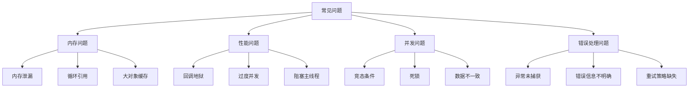

### 7.2 解决方案

#### 7.2.1 内存泄漏解决方案

```typescript
// ✅ 正确的资源管理
class ResourceManager {
  private subscriptions: (() => void)[] = [];
  private timers: NodeJS.Timeout[] = [];
  
  addSubscription(unsubscribe: () => void): void {
    this.subscriptions.push(unsubscribe);
  }
  
  addTimer(timer: NodeJS.Timeout): void {
    this.timers.push(timer);
  }
  
  cleanup(): void {
    // 清理订阅
    this.subscriptions.forEach(unsubscribe => unsubscribe());
    this.subscriptions = [];
    
    // 清理定时器
    this.timers.forEach(timer => clearTimeout(timer));
    this.timers = [];
  }
}

// React Hook 示例
function useAsyncEffect(
  effect: () => Promise<void | (() => void)>,
  deps: any[]
) {
  useEffect(() => {
    let cancelled = false;
    let cleanup: (() => void) | undefined;
    
    effect().then(result => {
      if (!cancelled && typeof result === 'function') {
        cleanup = result;
      }
    });
    
    return () => {
      cancelled = true;
      cleanup?.();
    };
  }, deps);
}
```

#### 7.2.2 竞态条件解决方案

```typescript
// 请求取消机制
class RequestManager {
  private activeRequests = new Map<string, AbortController>();
  
  async request<T>(key: string, url: string): Promise<T> {
    // 取消之前的请求
    this.cancelRequest(key);
    
    // 创建新的控制器
    const controller = new AbortController();
    this.activeRequests.set(key, controller);
    
    try {
      const response = await fetch(url, {
        signal: controller.signal
      });
      
      if (!response.ok) {
        throw new Error(`HTTP ${response.status}`);
      }
      
      const data = await response.json();
      this.activeRequests.delete(key);
      return data;
    } catch (error) {
      this.activeRequests.delete(key);
      if (error.name === 'AbortError') {
        throw new Error('Request cancelled');
      }
      throw error;
    }
  }
  
  cancelRequest(key: string): void {
    const controller = this.activeRequests.get(key);
    if (controller) {
      controller.abort();
      this.activeRequests.delete(key);
    }
  }
  
  cancelAllRequests(): void {
    this.activeRequests.forEach(controller => controller.abort());
    this.activeRequests.clear();
  }
}
```

### 7.3 调试技巧

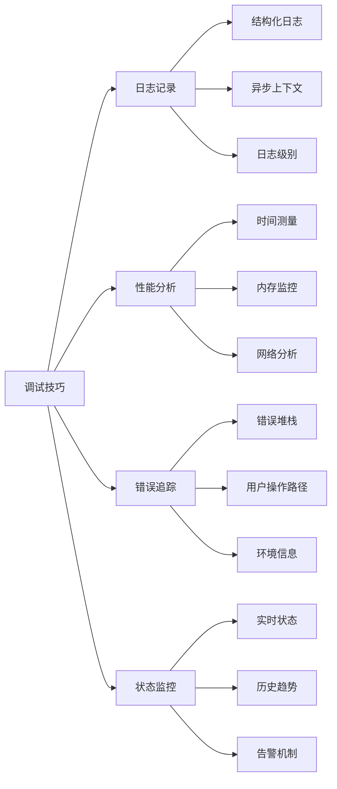

---

## 8. 总结

### 8.1 技术选择建议

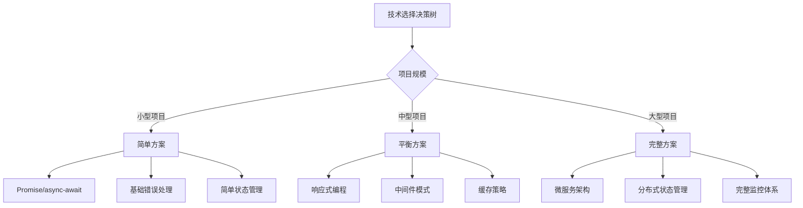

### 8.2 发展趋势

1. **更好的语言支持**
   - Swift Concurrency
   - Kotlin Coroutines
   - JavaScript Async Iterators

2. **框架演进**
   - React Concurrent Features
   - Vue 3 Composition API
   - SwiftUI async/await

3. **工具链改进**
   - 更好的调试工具
   - 性能分析工具
   - 自动化测试工具

### 8.3 最终建议

1. **选择合适的技术栈**：根据项目需求和团队技能选择
2. **建立完善的错误处理机制**：用户体验的关键
3. **重视性能优化**：从设计阶段就考虑性能
4. **完善的测试覆盖**：确保异步代码的可靠性
5. **持续监控和优化**：上线后的持续改进

---

## 附录

### A. 参考资源

- [MDN Web Docs - Asynchronous JavaScript](https://developer.mozilla.org/en-US/docs/Learn/JavaScript/Asynchronous)
- [Swift Concurrency Documentation](https://docs.swift.org/swift-book/LanguageGuide/Concurrency.html)
- [Kotlin Coroutines Guide](https://kotlinlang.org/docs/coroutines-guide.html)
- [React Concurrent Features](https://reactjs.org/docs/concurrent-mode-intro.html)

### B. 工具推荐

- **调试工具**：Chrome DevTools, Xcode Instruments, Android Profiler
- **测试框架**：Jest, XCTest, JUnit
- **监控工具**：Sentry, Crashlytics, New Relic
- **性能分析**：Lighthouse, Firebase Performance, Instruments

### C. 代码模板

本文档中的所有代码示例都可以作为项目模板使用，建议根据具体需求进行调整和优化。