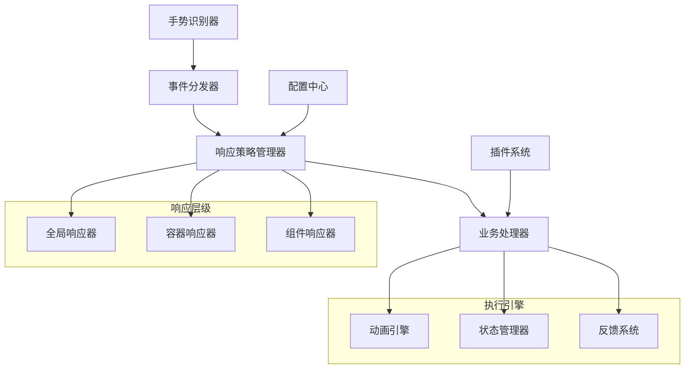
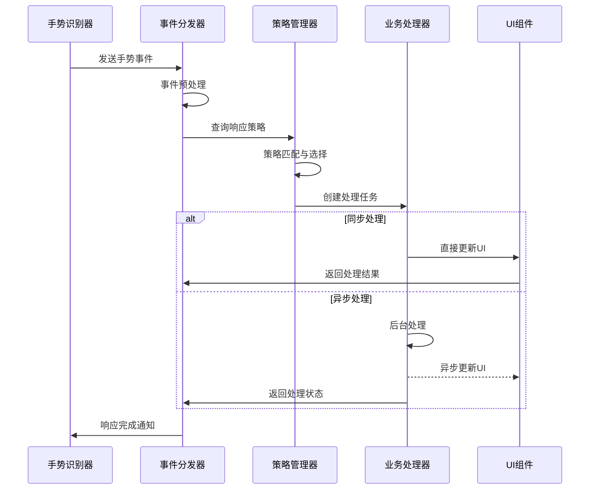
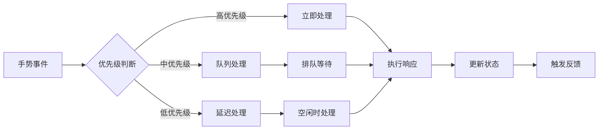
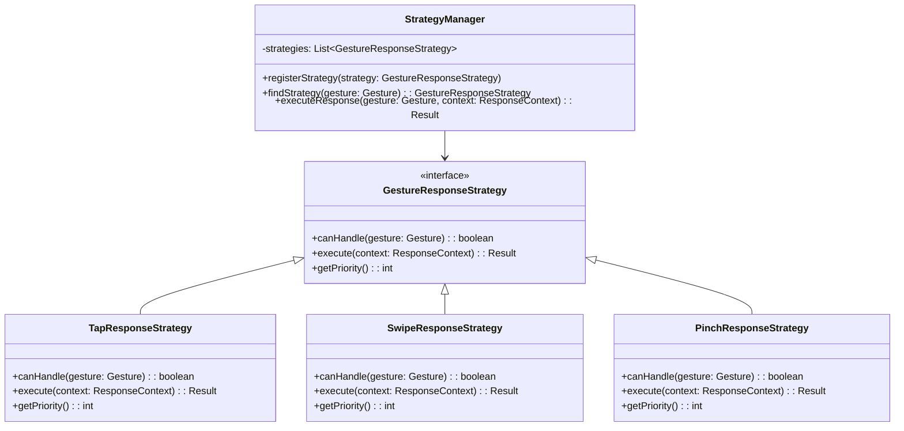
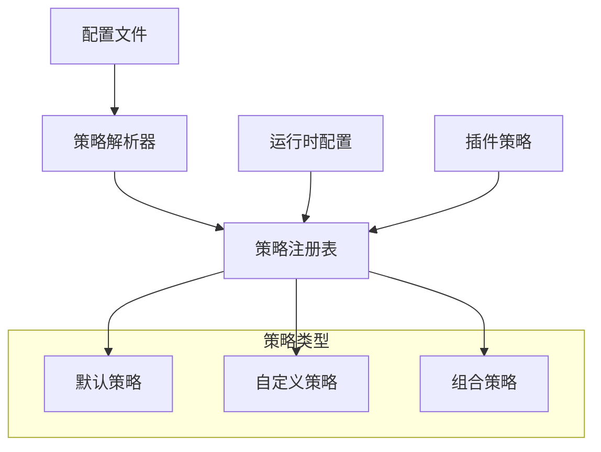
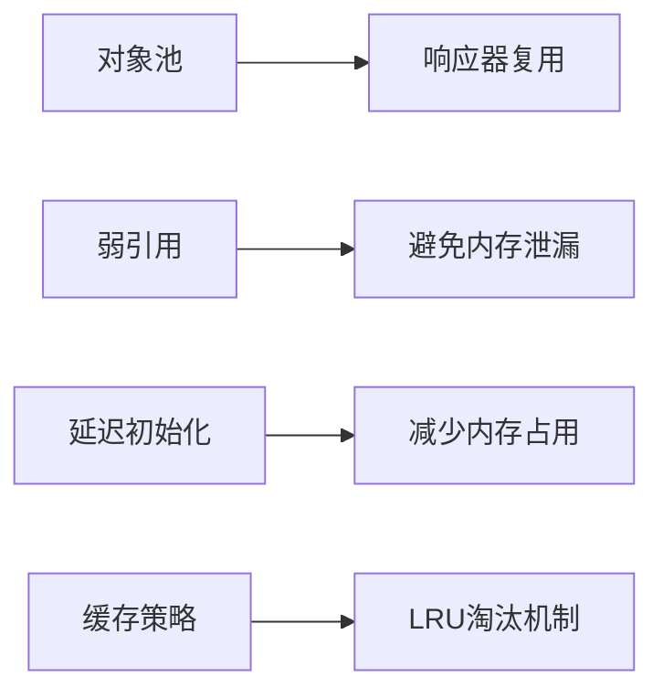
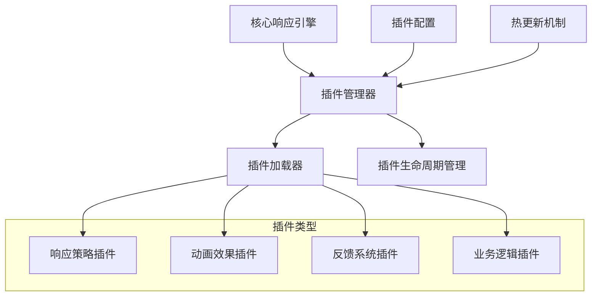
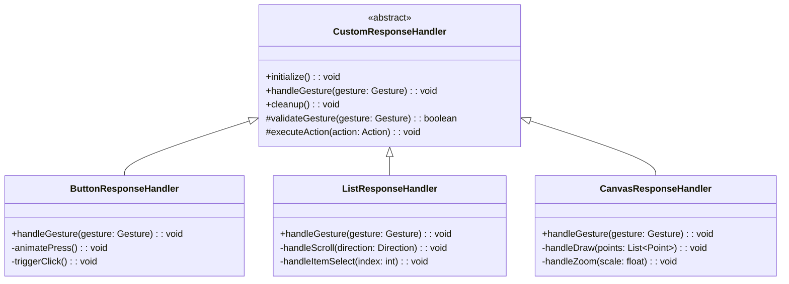
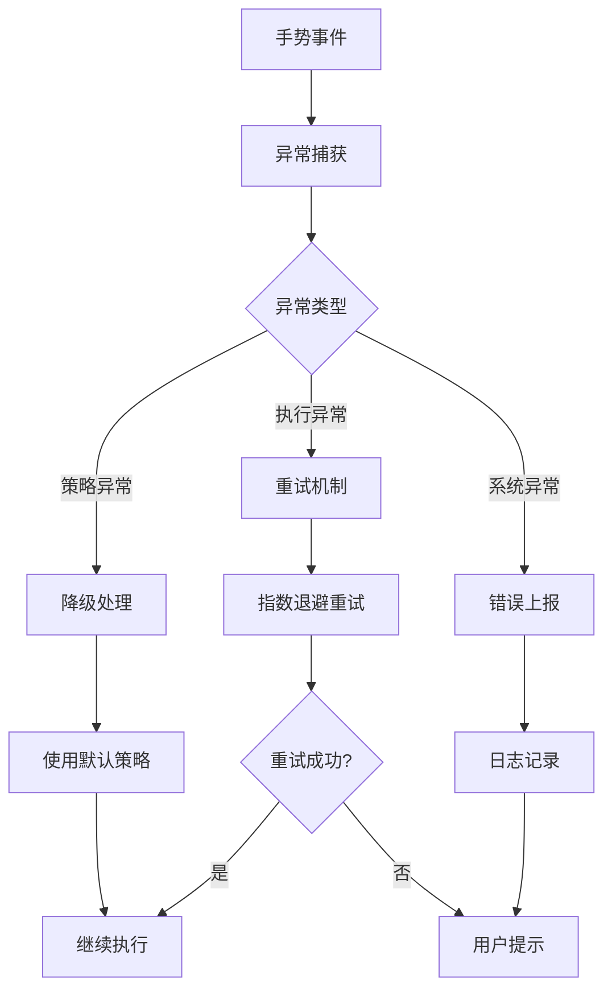
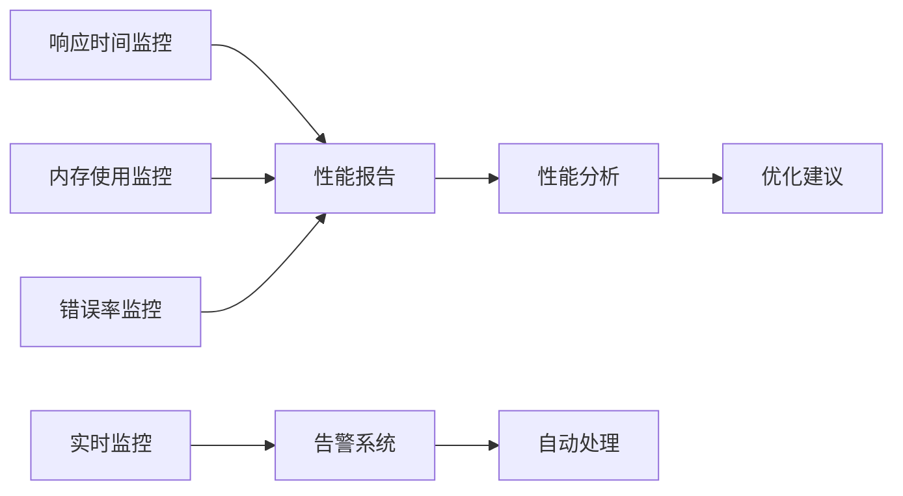

## 05.手势事件响应

### 5.1 概述

手势事件响应是触摸交互系统的核心环节，负责将识别出的手势转换为具体的业务操作。一个优秀的手势响应系统需要具备高效性、可扩展性和灵活性，能够支持复杂的手势组合和自定义响应逻辑。

### 5.2 系统架构设计

#### 5.2.1 整体架构

#### 5.2.2 核心组件

**事件分发器 (Event Dispatcher)**
- 负责接收手势识别结果
- 根据优先级和作用域分发事件
- 支持事件冒泡和捕获机制

**响应策略管理器 (Response Strategy Manager)**
- 管理不同手势的响应策略
- 支持策略的动态切换和组合
- 提供策略优先级管理

**业务处理器 (Business Handler)**
- 执行具体的业务逻辑
- 支持异步处理和批量操作
- 提供错误处理和回滚机制

### 5.3 响应机制设计

#### 5.3.1 事件响应流程

#### 5.3.2 优先级处理机制

### 5.4 响应策略设计

#### 5.4.1 策略模式实现

#### 5.4.2 策略配置管理

### 5.5 性能优化策略

#### 5.5.1 响应时间优化

**预处理优化**
- 事件预筛选，过滤无效事件
- 策略预加载，减少查找时间
- 缓存机制，避免重复计算

**并发处理优化**
- 异步处理非关键响应
- 线程池管理，避免频繁创建销毁
- 批量处理相似事件

#### 5.5.2 内存优化

### 5.6 扩展性设计

#### 5.6.1 插件化架构

#### 5.6.2 自定义响应器

### 5.7 错误处理与容错

#### 5.7.1 异常处理机制

#### 5.7.2 容错策略

**超时处理**
- 设置响应超时时间
- 超时后自动取消或降级
- 提供用户反馈

**资源保护**
- 限制并发响应数量
- 内存使用监控
- CPU使用率控制

### 5.8 监控与调试

#### 5.8.1 性能监控

#### 5.8.2 调试工具

**响应链追踪**
- 记录事件传递路径
- 显示处理时间分布
- 标识性能瓶颈

**可视化调试**
- 实时显示手势轨迹
- 响应状态可视化
- 性能指标图表

### 5.9 最佳实践

#### 5.9.1 设计原则

1. **单一职责原则**：每个响应器只处理特定类型的手势
2. **开闭原则**：对扩展开放，对修改封闭
3. **依赖倒置原则**：依赖抽象而非具体实现
4. **接口隔离原则**：提供细粒度的接口定义

#### 5.9.2 性能建议

1. **避免阻塞主线程**：耗时操作异步处理
2. **合理使用缓存**：缓存频繁使用的数据
3. **及时释放资源**：避免内存泄漏
4. **优化算法复杂度**：选择高效的数据结构和算法

#### 5.9.3 用户体验优化

1. **即时反馈**：提供视觉和触觉反馈
2. **平滑动画**：使用适当的缓动函数
3. **错误提示**：友好的错误信息展示
4. **可访问性**：支持无障碍功能

### 5.10 总结

手势事件响应系统是触摸交互的关键环节，需要在性能、扩展性和用户体验之间找到平衡。通过合理的架构设计、优化策略和最佳实践，可以构建出高效、稳定、易扩展的手势响应系统。

关键要点：
- 采用分层架构，职责清晰
- 使用策略模式，支持灵活配置
- 实现插件化，便于扩展
- 注重性能优化和错误处理
- 提供完善的监控和调试工具

