# 并发编程设计技术文档

## 目录
1. [概述](#概述)
2. [并发编程三大核心思想](#并发编程三大核心思想)
3. [分工设计 - 解决"谁来做"](#分工设计---解决谁来做)
4. [同步设计 - 解决"何时做"](#同步设计---解决何时做)
5. [互斥设计 - 解决"谁独占"](#互斥设计---解决谁独占)
6. [跨语言实现对比](#跨语言实现对比)
7. [并发编程架构模式](#并发编程架构模式)
8. [性能优化与最佳实践](#性能优化与最佳实践)
9. [总结](#总结)

## 概述

并发编程是现代软件系统的核心技术，它通过同时执行多个任务来提高系统性能、响应性和资源利用率。无论是Java、C++还是Objective-C，并发编程都可以归纳为三个核心思想问题的解决：

- **分工（Division of Labor）**：解决"谁来做"的问题
- **同步（Synchronization）**：解决"何时做"的问题  
- **互斥（Mutual Exclusion）**：解决"谁独占"的问题

### 并发编程核心架构

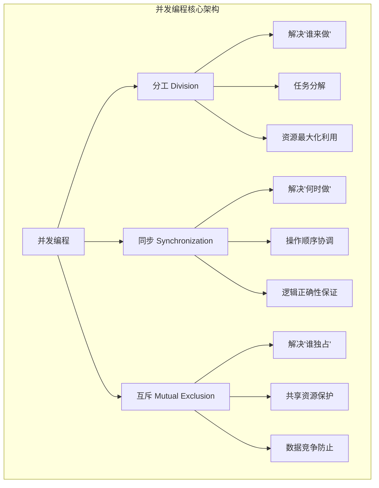
```mermaid
graph TB
    subgraph "并发编程核心架构"
        A[并发编程] --> B[分工 Division]
        A --> C[同步 Synchronization]
        A --> D[互斥 Mutual Exclusion]
        
        B --> B1["解决'谁来做'"]
        B --> B2[任务分解]
        B --> B3[资源最大化利用]
        
        C --> C1["解决'何时做'"]
        C --> C2[操作顺序协调]
        C --> C3[逻辑正确性保证]
        
        D --> D1["解决'谁独占'"]
        D --> D2[共享资源保护]
        D --> D3[数据竞争防止]
    end
```

## 并发编程三大核心思想

### 核心思想关系图

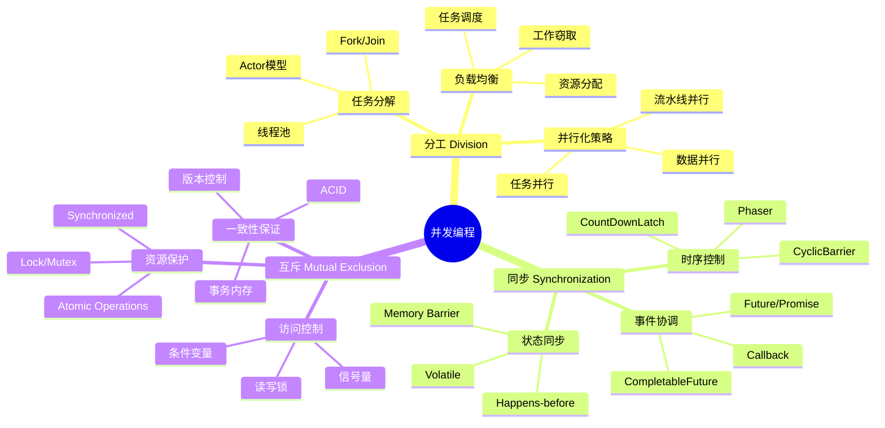
```mermaid
mindmap
  root((并发编程))
    分工 Division
      任务分解
        Fork/Join
        线程池
        Actor模型
      负载均衡
        工作窃取
        任务调度
        资源分配
      并行化策略
        数据并行
        任务并行
        流水线并行
    同步 Synchronization
      时序控制
        CountDownLatch
        CyclicBarrier
        Phaser
      事件协调
        Future/Promise
        CompletableFuture
        Callback
      状态同步
        Volatile
        Memory Barrier
        Happens-before
    互斥 Mutual Exclusion
      资源保护
        Lock/Mutex
        Synchronized
        Atomic Operations
      访问控制
        读写锁
        信号量
        条件变量
      一致性保证
        ACID
        事务内存
        版本控制
```

### 三大核心思想的协作关系

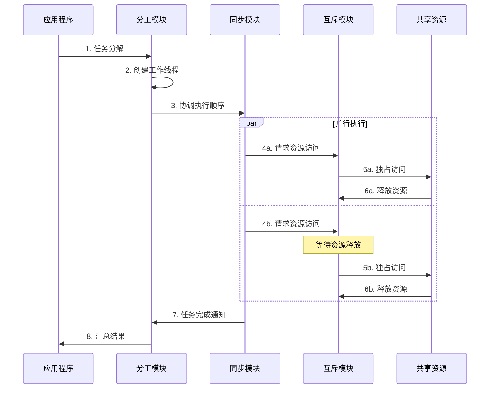
```mermaid
sequenceDiagram
    participant App as 应用程序
    participant Division as 分工模块
    participant Sync as 同步模块
    participant Mutex as 互斥模块
    participant Resource as 共享资源
    
    App->>Division: 1. 任务分解
    Division->>Division: 2. 创建工作线程
    Division->>Sync: 3. 协调执行顺序
    
    par 并行执行
        Sync->>Mutex: 4a. 请求资源访问
        Mutex->>Resource: 5a. 独占访问
        Resource->>Mutex: 6a. 释放资源
    and
        Sync->>Mutex: 4b. 请求资源访问
        Note over Mutex: 等待资源释放
        Mutex->>Resource: 5b. 独占访问
        Resource->>Mutex: 6b. 释放资源
    end
    
    Sync->>Division: 7. 任务完成通知
    Division->>App: 8. 汇总结果
```

## 分工设计 - 解决"谁来做"

分工是并发编程的第一步，核心目标是将大型任务分解为可并行执行的子任务，最大化利用计算资源。

### 3.1 分工设计架构

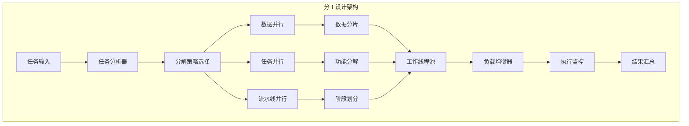
```mermaid
graph TB
    subgraph "分工设计架构"
        A[任务输入] --> B[任务分析器]
        B --> C[分解策略选择]
        
        C --> D[数据并行]
        C --> E[任务并行]
        C --> F[流水线并行]
        
        D --> G[数据分片]
        E --> H[功能分解]
        F --> I[阶段划分]
        
        G --> J[工作线程池]
        H --> J
        I --> J
        
        J --> K[负载均衡器]
        K --> L[执行监控]
        L --> M[结果汇总]
    end
```

### 3.2 分工模式详解

#### 3.2.1 Fork/Join模式

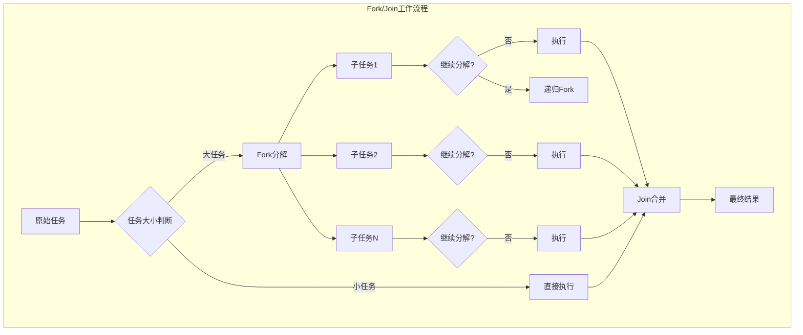
```mermaid
graph TD
    subgraph "Fork/Join工作流程"
        A[原始任务] --> B{任务大小判断}
        B -->|大任务| C[Fork分解]
        B -->|小任务| D[直接执行]
        
        C --> E[子任务1]
        C --> F[子任务2]
        C --> G[子任务N]
        
        E --> H{继续分解?}
        F --> I{继续分解?}
        G --> J{继续分解?}
        
        H -->|是| K[递归Fork]
        H -->|否| L[执行]
        I -->|否| M[执行]
        J -->|否| N[执行]
        
        L --> O[Join合并]
        M --> O
        N --> O
        D --> O
        
        O --> P[最终结果]
    end
```

#### 3.2.2 Java Fork/Join实现

```java
import java.util.concurrent.RecursiveTask;
import java.util.concurrent.ForkJoinPool;

public class ParallelSum extends RecursiveTask<Long> {
    private static final int THRESHOLD = 1000;
    private final int[] array;
    private final int start;
    private final int end;
    
    public ParallelSum(int[] array, int start, int end) {
        this.array = array;
        this.start = start;
        this.end = end;
    }
    
    @Override
    protected Long compute() {
        if (end - start <= THRESHOLD) {
            // 小任务直接计算
            long sum = 0;
            for (int i = start; i < end; i++) {
                sum += array[i];
            }
            return sum;
        } else {
            // 大任务分解
            int mid = (start + end) / 2;
            ParallelSum leftTask = new ParallelSum(array, start, mid);
            ParallelSum rightTask = new ParallelSum(array, mid, end);
            
            // Fork分解
            leftTask.fork();
            rightTask.fork();
            
            // Join合并
            return leftTask.join() + rightTask.join();
        }
    }
    
    public static void main(String[] args) {
        int[] array = new int[10000];
        // 初始化数组...
        
        ForkJoinPool pool = new ForkJoinPool();
        ParallelSum task = new ParallelSum(array, 0, array.length);
        Long result = pool.invoke(task);
        
        System.out.println("并行计算结果: " + result);
    }
}
```

#### 3.2.3 线程池分工模式

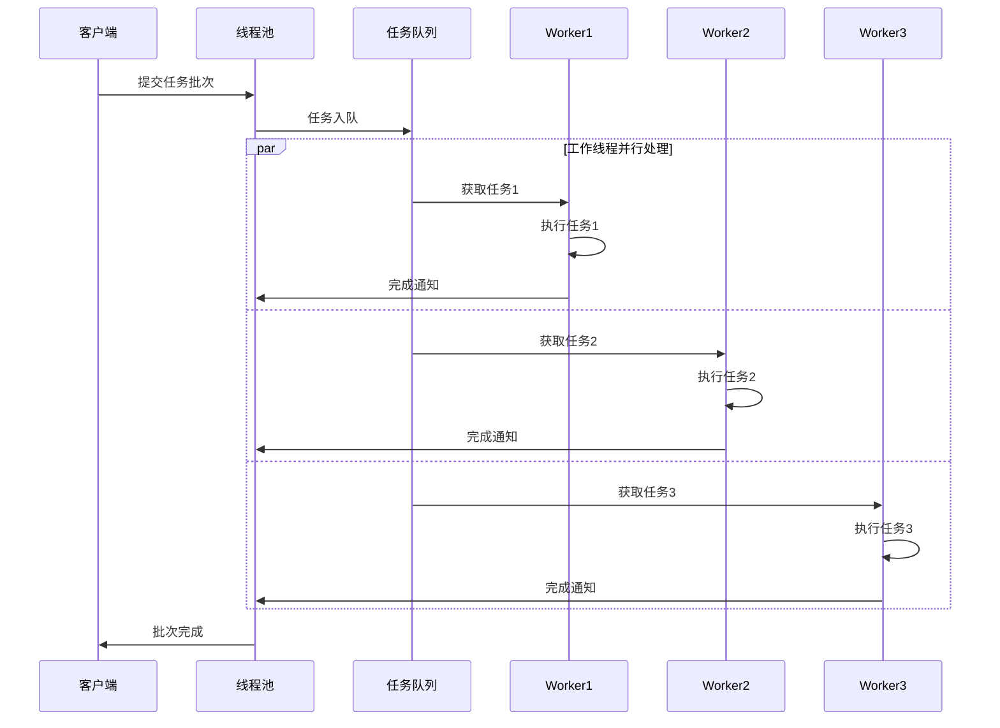
```mermaid
sequenceDiagram
    participant Client as 客户端
    participant Pool as 线程池
    participant Queue as 任务队列
    participant W1 as Worker1
    participant W2 as Worker2
    participant W3 as Worker3
    
    Client->>Pool: 提交任务批次
    Pool->>Queue: 任务入队
    
    par 工作线程并行处理
        Queue->>W1: 获取任务1
        W1->>W1: 执行任务1
        W1->>Pool: 完成通知
    and
        Queue->>W2: 获取任务2
        W2->>W2: 执行任务2
        W2->>Pool: 完成通知
    and
        Queue->>W3: 获取任务3
        W3->>W3: 执行任务3
        W3->>Pool: 完成通知
    end
    
    Pool->>Client: 批次完成
```

#### 3.2.4 C++线程池实现

```cpp
#include <vector>
#include <queue>
#include <thread>
#include <mutex>
#include <condition_variable>
#include <functional>
#include <future>

class ThreadPool {
private:
    std::vector<std::thread> workers;
    std::queue<std::function<void()>> tasks;
    std::mutex queue_mutex;
    std::condition_variable condition;
    bool stop;
    
public:
    ThreadPool(size_t threads) : stop(false) {
        for(size_t i = 0; i < threads; ++i) {
            workers.emplace_back([this] {
                for(;;) {
                    std::function<void()> task;
                    {
                        std::unique_lock<std::mutex> lock(this->queue_mutex);
                        this->condition.wait(lock, [this]{ 
                            return this->stop || !this->tasks.empty(); 
                        });
                        
                        if(this->stop && this->tasks.empty())
                            return;
                            
                        task = std::move(this->tasks.front());
                        this->tasks.pop();
                    }
                    task();
                }
            });
        }
    }
    
    template<class F, class... Args>
    auto enqueue(F&& f, Args&&... args) 
        -> std::future<typename std::result_of<F(Args...)>::type> {
        
        using return_type = typename std::result_of<F(Args...)>::type;
        
        auto task = std::make_shared<std::packaged_task<return_type()>>(
            std::bind(std::forward<F>(f), std::forward<Args>(args)...)
        );
        
        std::future<return_type> res = task->get_future();
        {
            std::unique_lock<std::mutex> lock(queue_mutex);
            if(stop)
                throw std::runtime_error("enqueue on stopped ThreadPool");
                
            tasks.emplace([task](){ (*task)(); });
        }
        condition.notify_one();
        return res;
    }
    
    ~ThreadPool() {
        {
            std::unique_lock<std::mutex> lock(queue_mutex);
            stop = true;
        }
        condition.notify_all();
        for(std::thread &worker: workers)
            worker.join();
    }
};
```

### 3.3 工作窃取算法

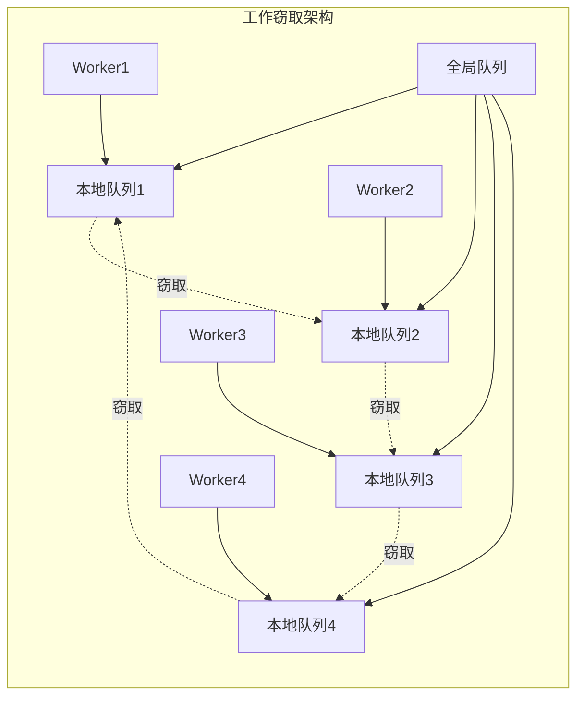
```mermaid
graph LR
    subgraph "工作窃取架构"
        W1[Worker1] --> Q1[本地队列1]
        W2[Worker2] --> Q2[本地队列2]
        W3[Worker3] --> Q3[本地队列3]
        W4[Worker4] --> Q4[本地队列4]
        
        Q1 -.->|窃取| Q2
        Q2 -.->|窃取| Q3
        Q3 -.->|窃取| Q4
        Q4 -.->|窃取| Q1
        
        GQ[全局队列] --> Q1
        GQ --> Q2
        GQ --> Q3
        GQ --> Q4
    end
```

## 同步设计 - 解决"何时做"

同步解决多个执行单元的操作顺序协调问题，确保程序逻辑的正确性。

### 4.1 同步机制分类

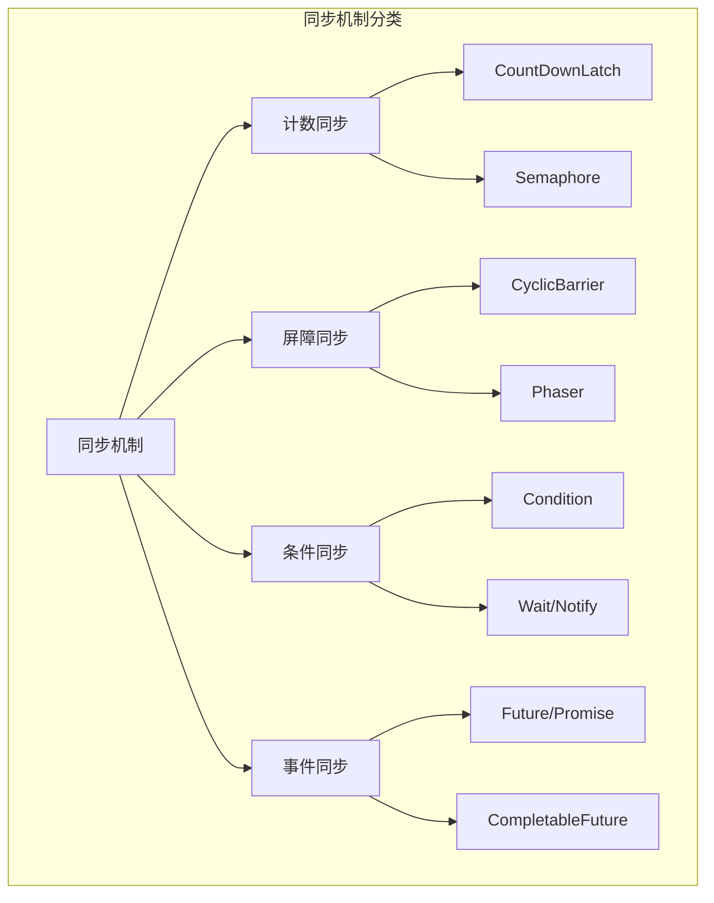
```mermaid
graph TB
    subgraph "同步机制分类"
        A[同步机制] --> B[计数同步]
        A --> C[屏障同步]
        A --> D[条件同步]
        A --> E[事件同步]
        
        B --> B1[CountDownLatch]
        B --> B2[Semaphore]
        
        C --> C1[CyclicBarrier]
        C --> C2[Phaser]
        
        D --> D1[Condition]
        D --> D2[Wait/Notify]
        
        E --> E1[Future/Promise]
        E --> E2[CompletableFuture]
    end
```

### 4.2 同步模式详解

#### 4.2.1 CountDownLatch - 倒计时门闩

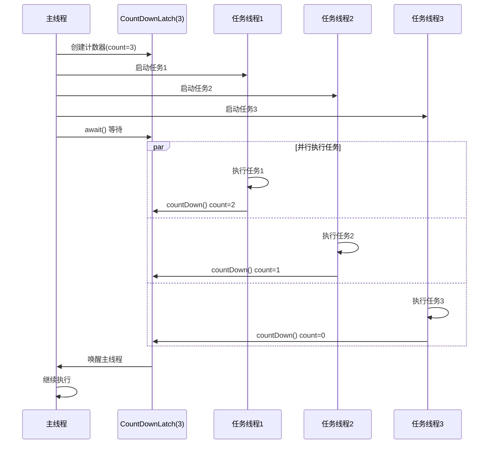
```mermaid
sequenceDiagram
    participant Main as 主线程
    participant CDL as CountDownLatch(3)
    participant T1 as 任务线程1
    participant T2 as 任务线程2
    participant T3 as 任务线程3
    
    Main->>CDL: 创建计数器(count=3)
    Main->>T1: 启动任务1
    Main->>T2: 启动任务2
    Main->>T3: 启动任务3
    Main->>CDL: await() 等待
    
    par 并行执行任务
        T1->>T1: 执行任务1
        T1->>CDL: countDown() count=2
    and
        T2->>T2: 执行任务2
        T2->>CDL: countDown() count=1
    and
        T3->>T3: 执行任务3
        T3->>CDL: countDown() count=0
    end
    
    CDL->>Main: 唤醒主线程
    Main->>Main: 继续执行
```

#### 4.2.2 Java同步实现示例

```java
import java.util.concurrent.*;

public class SynchronizationExample {
    
    // 1. CountDownLatch示例
    public static void countDownLatchExample() throws InterruptedException {
        int taskCount = 3;
        CountDownLatch latch = new CountDownLatch(taskCount);
        ExecutorService executor = Executors.newFixedThreadPool(taskCount);
        
        for (int i = 0; i < taskCount; i++) {
            final int taskId = i;
            executor.submit(() -> {
                try {
                    // 模拟任务执行
                    Thread.sleep(1000 + taskId * 500);
                    System.out.println("任务 " + taskId + " 完成");
                } catch (InterruptedException e) {
                    Thread.currentThread().interrupt();
                } finally {
                    latch.countDown(); // 计数减1
                }
            });
        }
        
        System.out.println("等待所有任务完成...");
        latch.await(); // 等待计数归零
        System.out.println("所有任务已完成！");
        
        executor.shutdown();
    }
    
    // 2. CyclicBarrier示例
    public static void cyclicBarrierExample() {
        int parties = 3;
        CyclicBarrier barrier = new CyclicBarrier(parties, () -> {
            System.out.println("所有线程都到达屏障点，开始下一阶段！");
        });
        
        for (int i = 0; i < parties; i++) {
            final int threadId = i;
            new Thread(() -> {
                try {
                    System.out.println("线程 " + threadId + " 正在工作...");
                    Thread.sleep(1000 + threadId * 300);
                    System.out.println("线程 " + threadId + " 到达屏障点");
                    
                    barrier.await(); // 等待其他线程
                    
                    System.out.println("线程 " + threadId + " 继续执行");
                } catch (InterruptedException | BrokenBarrierException e) {
                    e.printStackTrace();
                }
            }).start();
        }
    }
    
    // 3. CompletableFuture异步编排
    public static void completableFutureExample() {
        CompletableFuture<String> future1 = CompletableFuture.supplyAsync(() -> {
            try { Thread.sleep(1000); } catch (InterruptedException e) {}
            return "任务1结果";
        });
        
        CompletableFuture<String> future2 = CompletableFuture.supplyAsync(() -> {
            try { Thread.sleep(1500); } catch (InterruptedException e) {}
            return "任务2结果";
        });
        
        CompletableFuture<String> combinedFuture = future1.thenCombine(future2, 
            (result1, result2) -> result1 + " + " + result2);
        
        combinedFuture.thenAccept(result -> 
            System.out.println("组合结果: " + result));
    }
}
```

#### 4.2.3 CyclicBarrier - 循环屏障

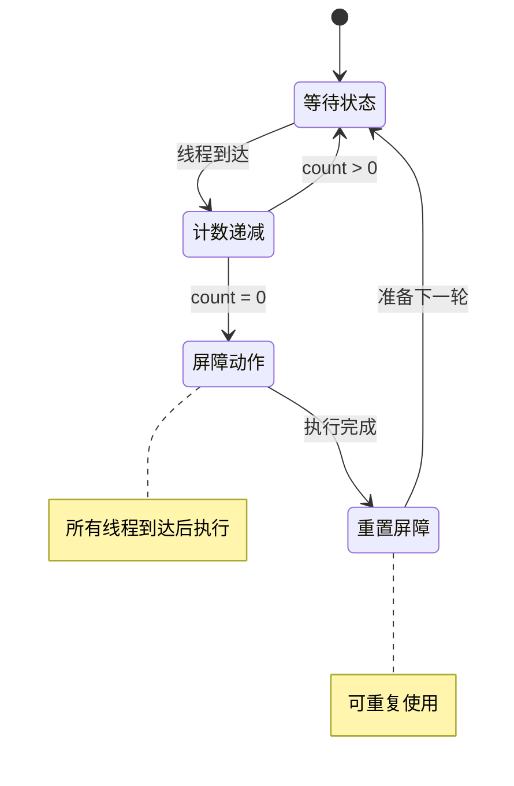
```mermaid
stateDiagram-v2
    [*] --> 等待状态
    等待状态 --> 计数递减 : 线程到达
    计数递减 --> 等待状态 : count > 0
    计数递减 --> 屏障动作 : count = 0
    屏障动作 --> 重置屏障 : 执行完成
    重置屏障 --> 等待状态 : 准备下一轮
    
    note right of 屏障动作 : 所有线程到达后执行
    note right of 重置屏障 : 可重复使用
```

### 4.3 Objective-C同步机制

```objc
#import <Foundation/Foundation.h>

@interface SynchronizationManager : NSObject

// 1. GCD信号量同步
- (void)semaphoreExample {
    dispatch_semaphore_t semaphore = dispatch_semaphore_create(0);
    dispatch_queue_t queue = dispatch_get_global_queue(DISPATCH_QUEUE_PRIORITY_DEFAULT, 0);
    
    // 异步任务
    dispatch_async(queue, ^{
        // 模拟网络请求
        sleep(2);
        NSLog(@"网络请求完成");
        dispatch_semaphore_signal(semaphore); // 发送信号
    });
    
    // 等待信号
    dispatch_semaphore_wait(semaphore, DISPATCH_TIME_FOREVER);
    NSLog(@"继续执行主逻辑");
}

// 2. GCD组同步
- (void)groupExample {
    dispatch_group_t group = dispatch_group_create();
    dispatch_queue_t queue = dispatch_get_global_queue(DISPATCH_QUEUE_PRIORITY_DEFAULT, 0);
    
    // 添加任务到组
    dispatch_group_async(group, queue, ^{
        sleep(1);
        NSLog(@"任务1完成");
    });
    
    dispatch_group_async(group, queue, ^{
        sleep(2);
        NSLog(@"任务2完成");
    });
    
    // 等待组内所有任务完成
    dispatch_group_notify(group, dispatch_get_main_queue(), ^{
        NSLog(@"所有任务完成");
    });
}

// 3. NSOperation依赖
- (void)operationDependencyExample {
    NSOperationQueue *queue = [[NSOperationQueue alloc] init];
    
    NSBlockOperation *operation1 = [NSBlockOperation blockOperationWithBlock:^{
        sleep(1);
        NSLog(@"操作1完成");
    }];
    
    NSBlockOperation *operation2 = [NSBlockOperation blockOperationWithBlock:^{
        sleep(1);
        NSLog(@"操作2完成");
    }];
    
    NSBlockOperation *operation3 = [NSBlockOperation blockOperationWithBlock:^{
        NSLog(@"操作3完成（依赖1和2）");
    }];
    
    // 设置依赖关系
    [operation3 addDependency:operation1];
    [operation3 addDependency:operation2];
    
    [queue addOperations:@[operation1, operation2, operation3] waitUntilFinished:NO];
}

@end
```

## 互斥设计 - 解决"谁独占"

互斥确保对共享资源的独占访问，防止数据竞争和不一致状态。

### 5.1 互斥机制架构

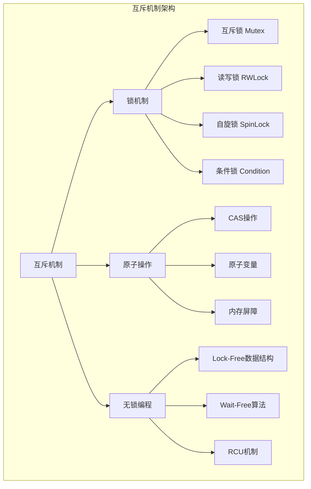
```mermaid
graph TB
    subgraph "互斥机制架构"
        A[互斥机制] --> B[锁机制]
        A --> C[原子操作]
        A --> D[无锁编程]
        
        B --> B1[互斥锁 Mutex]
        B --> B2[读写锁 RWLock]
        B --> B3[自旋锁 SpinLock]
        B --> B4[条件锁 Condition]
        
        C --> C1[CAS操作]
        C --> C2[原子变量]
        C --> C3[内存屏障]
        
        D --> D1[Lock-Free数据结构]
        D --> D2[Wait-Free算法]
        D --> D3[RCU机制]
    end
```

### 5.2 锁的层次结构

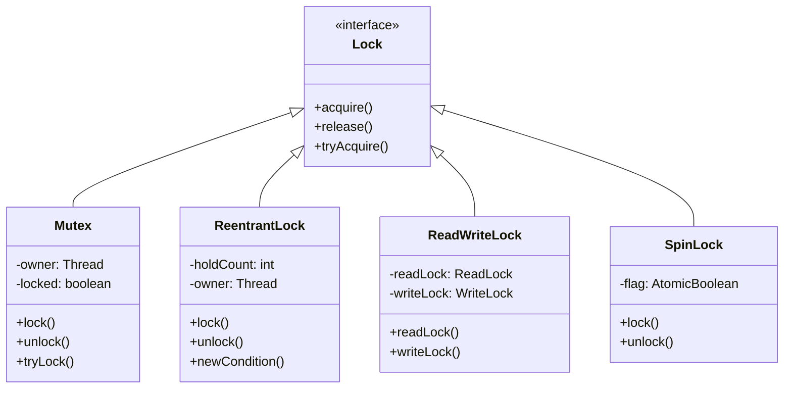
```mermaid
classDiagram
    class Lock {
        <<interface>>
        +acquire()
        +release()
        +tryAcquire()
    }
    
    class Mutex {
        -owner: Thread
        -locked: boolean
        +lock()
        +unlock()
        +tryLock()
    }
    
    class ReentrantLock {
        -holdCount: int
        -owner: Thread
        +lock()
        +unlock()
        +newCondition()
    }
    
    class ReadWriteLock {
        -readLock: ReadLock
        -writeLock: WriteLock
        +readLock()
        +writeLock()
    }
    
    class SpinLock {
        -flag: AtomicBoolean
        +lock()
        +unlock()
    }
    
    Lock <|-- Mutex
    Lock <|-- ReentrantLock
    Lock <|-- ReadWriteLock
    Lock <|-- SpinLock
```

### 5.3 互斥实现详解

#### 5.3.1 读写锁模式

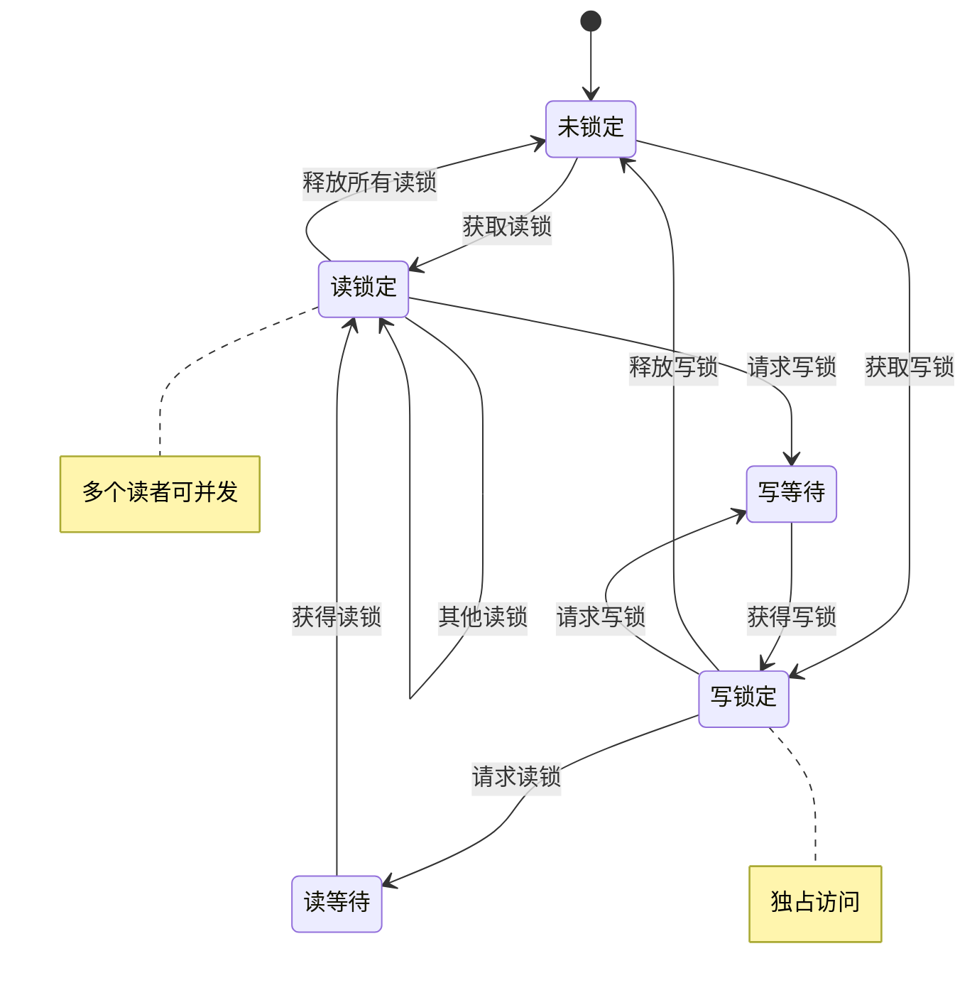
```mermaid
stateDiagram-v2
    [*] --> 未锁定
    未锁定 --> 读锁定 : 获取读锁
    未锁定 --> 写锁定 : 获取写锁
    
    读锁定 --> 读锁定 : 其他读锁
    读锁定 --> 未锁定 : 释放所有读锁
    读锁定 --> 写等待 : 请求写锁
    
    写锁定 --> 未锁定 : 释放写锁
    写锁定 --> 读等待 : 请求读锁
    写锁定 --> 写等待 : 请求写锁
    
    写等待 --> 写锁定 : 获得写锁
    读等待 --> 读锁定 : 获得读锁
    
    note right of 读锁定 : 多个读者可并发
    note right of 写锁定 : 独占访问
```

#### 5.3.2 Java互斥实现

```java
import java.util.concurrent.locks.*;
import java.util.concurrent.atomic.AtomicInteger;

public class MutualExclusionExample {
    
    // 1. 读写锁实现缓存
    public static class ReadWriteCache<K, V> {
        private final Map<K, V> cache = new HashMap<>();
        private final ReadWriteLock lock = new ReentrantReadWriteLock();
        private final Lock readLock = lock.readLock();
        private final Lock writeLock = lock.writeLock();
        
        public V get(K key) {
            readLock.lock();
            try {
                return cache.get(key);
            } finally {
                readLock.unlock();
            }
        }
        
        public void put(K key, V value) {
            writeLock.lock();
            try {
                cache.put(key, value);
            } finally {
                writeLock.unlock();
            }
        }
        
        public void clear() {
            writeLock.lock();
            try {
                cache.clear();
            } finally {
                writeLock.unlock();
            }
        }
    }
    
    // 2. 条件变量实现生产者消费者
    public static class BoundedBuffer<T> {
        private final T[] buffer;
        private int count, putIndex, takeIndex;
        private final ReentrantLock lock = new ReentrantLock();
        private final Condition notEmpty = lock.newCondition();
        private final Condition notFull = lock.newCondition();
        
        @SuppressWarnings("unchecked")
        public BoundedBuffer(int capacity) {
            buffer = (T[]) new Object[capacity];
        }
        
        public void put(T item) throws InterruptedException {
            lock.lock();
            try {
                while (count == buffer.length) {
                    notFull.await(); // 缓冲区满，等待
                }
                buffer[putIndex] = item;
                putIndex = (putIndex + 1) % buffer.length;
                count++;
                notEmpty.signal(); // 通知消费者
            } finally {
                lock.unlock();
            }
        }
        
        public T take() throws InterruptedException {
            lock.lock();
            try {
                while (count == 0) {
                    notEmpty.await(); // 缓冲区空，等待
                }
                T item = buffer[takeIndex];
                buffer[takeIndex] = null;
                takeIndex = (takeIndex + 1) % buffer.length;
                count--;
                notFull.signal(); // 通知生产者
                return item;
            } finally {
                lock.unlock();
            }
        }
    }
    
    // 3. 原子操作实现无锁计数器
    public static class LockFreeCounter {
        private final AtomicInteger count = new AtomicInteger(0);
        
        public int increment() {
            return count.incrementAndGet();
        }
        
        public int decrement() {
            return count.decrementAndGet();
        }
        
        public int get() {
            return count.get();
        }
        
        // CAS操作示例
        public boolean compareAndSet(int expect, int update) {
            return count.compareAndSet(expect, update);
        }
    }
}
```

#### 5.3.3 C++互斥实现

```cpp
#include <mutex>
#include <shared_mutex>
#include <condition_variable>
#include <atomic>
#include <queue>

// 1. 读写锁实现
class ReadWriteCounter {
private:
    mutable std::shared_mutex mtx;
    int count = 0;
    
public:
    void increment() {
        std::unique_lock<std::shared_mutex> lock(mtx);
        ++count;
    }
    
    int get() const {
        std::shared_lock<std::shared_mutex> lock(mtx);
        return count;
    }
};

// 2. 条件变量实现队列
template<typename T>
class ThreadSafeQueue {
private:
    mutable std::mutex mtx;
    std::queue<T> data_queue;
    std::condition_variable data_cond;
    
public:
    void push(T item) {
        std::lock_guard<std::mutex> lock(mtx);
        data_queue.push(item);
        data_cond.notify_one();
    }
    
    bool try_pop(T& item) {
        std::lock_guard<std::mutex> lock(mtx);
        if(data_queue.empty()) {
            return false;
        }
        item = data_queue.front();
        data_queue.pop();
        return true;
    }
    
    void wait_and_pop(T& item) {
        std::unique_lock<std::mutex> lock(mtx);
        while(data_queue.empty()) {
            data_cond.wait(lock);
        }
        item = data_queue.front();
        data_queue.pop();
    }
    
    bool empty() const {
        std::lock_guard<std::mutex> lock(mtx);
        return data_queue.empty();
    }
};

// 3. 无锁栈实现
template<typename T>
class LockFreeStack {
private:
    struct Node {
        T data;
        Node* next;
        Node(T const& data_) : data(data_) {}
    };
    
    std::atomic<Node*> head;
    
public:
    void push(T const& data) {
        Node* const new_node = new Node(data);
        new_node->next = head.load();
        while(!head.compare_exchange_weak(new_node->next, new_node));
    }
    
    bool pop(T& result) {
        Node* old_head = head.load();
        while(old_head && 
              !head.compare_exchange_weak(old_head, old_head->next));
        
        if(old_head) {
            result = old_head->data;
            delete old_head;
            return true;
        }
        return false;
    }
};
```

### 5.4 死锁预防与检测

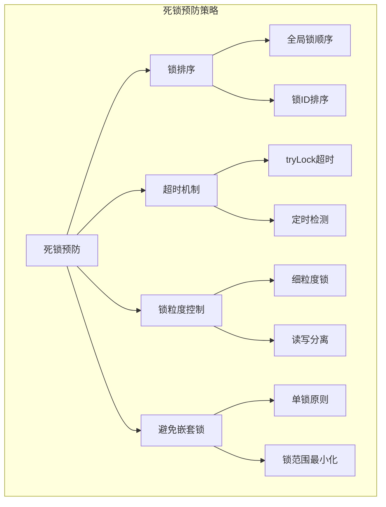
```mermaid
graph TB
    subgraph "死锁预防策略"
        A[死锁预防] --> B[锁排序]
        A --> C[超时机制]
        A --> D[锁粒度控制]
        A --> E[避免嵌套锁]
        
        B --> B1[全局锁顺序]
        B --> B2[锁ID排序]
        
        C --> C1[tryLock超时]
        C --> C2[定时检测]
        
        D --> D1[细粒度锁]
        D --> D2[读写分离]
        
        E --> E1[单锁原则]
        E --> E2[锁范围最小化]
    end
```

## 跨语言实现对比

### 6.1 语言特性对比表

| 特性 | Java | C++ | Objective-C |
|------|------|-----|-------------|
| **分工机制** | | | |
| 线程池 | ExecutorService | std::thread + 自实现 | NSOperationQueue |
| Fork/Join | ForkJoinPool | std::async | GCD dispatch_apply |
| 任务调度 | ScheduledExecutorService | std::chrono + timer | NSTimer + GCD |
| **同步机制** | | | |
| 计数同步 | CountDownLatch | std::latch (C++20) | dispatch_semaphore |
| 屏障同步 | CyclicBarrier | std::barrier (C++20) | dispatch_group |
| 条件同步 | Condition | std::condition_variable | NSCondition |
| 异步编排 | CompletableFuture | std::future | NSOperation依赖 |
| **互斥机制** | | | |
| 基础锁 | synchronized | std::mutex | @synchronized |
| 读写锁 | ReadWriteLock | std::shared_mutex | pthread_rwlock |
| 原子操作 | AtomicInteger | std::atomic | OSAtomic函数 |
| 自旋锁 | 自实现 | std::atomic_flag | OSSpinLock |

### 6.2 性能特性对比

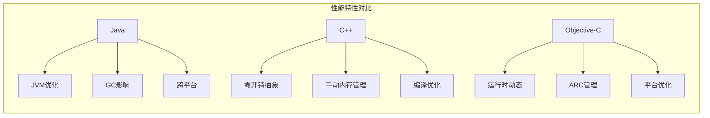
```mermaid
graph LR
    subgraph "性能特性对比"
        A[Java] --> A1[JVM优化]
        A --> A2[GC影响]
        A --> A3[跨平台]
        
        B[C++] --> B1[零开销抽象]
        B --> B2[手动内存管理]
        B --> B3[编译优化]
        
        C[Objective-C] --> C1[运行时动态]
        C --> C2[ARC管理]
        C --> C3[平台优化]
    end
```

## 并发编程架构模式

### 7.1 Actor模型

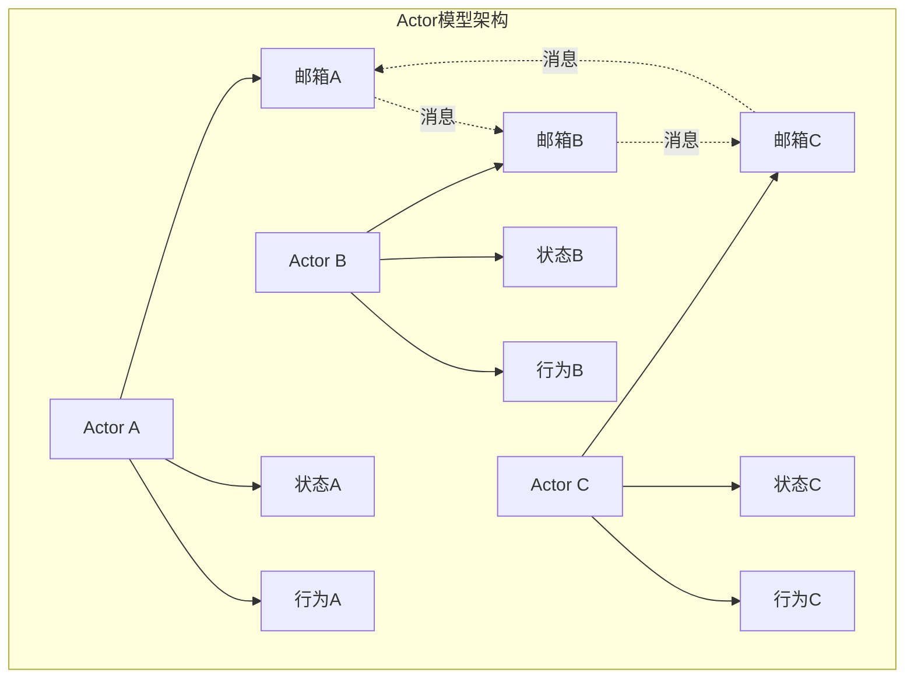
```mermaid
graph TB
    subgraph "Actor模型架构"
        A[Actor A] --> MA[邮箱A]
        B[Actor B] --> MB[邮箱B]
        C[Actor C] --> MC[邮箱C]
        
        MA -.->|消息| MB
        MB -.->|消息| MC
        MC -.->|消息| MA
        
        A --> SA[状态A]
        B --> SB[状态B]
        C --> SC[状态C]
        
        A --> BA[行为A]
        B --> BB[行为B]
        C --> BC[行为C]
    end
```

### 7.2 生产者-消费者模式

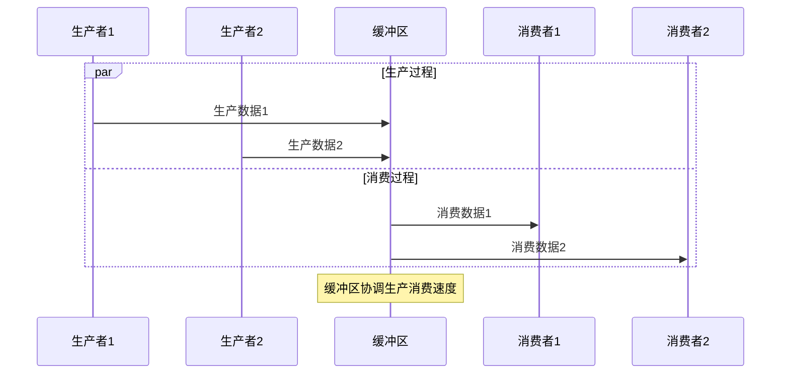
```mermaid
sequenceDiagram
    participant P1 as 生产者1
    participant P2 as 生产者2
    participant Buffer as 缓冲区
    participant C1 as 消费者1
    participant C2 as 消费者2
    
    par 生产过程
        P1->>Buffer: 生产数据1
        P2->>Buffer: 生产数据2
    and 消费过程
        Buffer->>C1: 消费数据1
        Buffer->>C2: 消费数据2
    end
    
    Note over Buffer: 缓冲区协调生产消费速度
```

### 7.3 Master-Worker模式

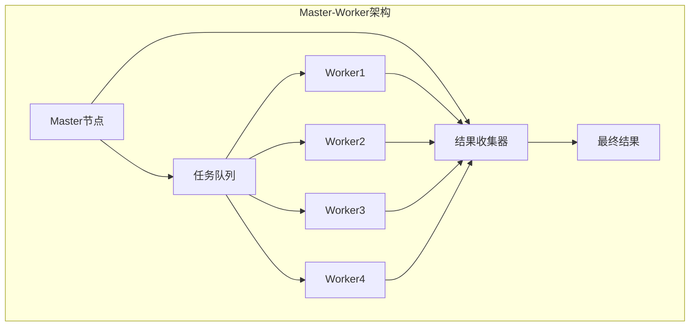
```mermaid
graph TD
    subgraph "Master-Worker架构"
        Master[Master节点] --> TaskQueue[任务队列]
        Master --> ResultCollector[结果收集器]
        
        TaskQueue --> W1[Worker1]
        TaskQueue --> W2[Worker2]
        TaskQueue --> W3[Worker3]
        TaskQueue --> W4[Worker4]
        
        W1 --> ResultCollector
        W2 --> ResultCollector
        W3 --> ResultCollector
        W4 --> ResultCollector
        
        ResultCollector --> FinalResult[最终结果]
    end
```

## 性能优化与最佳实践

### 8.1 性能优化策略

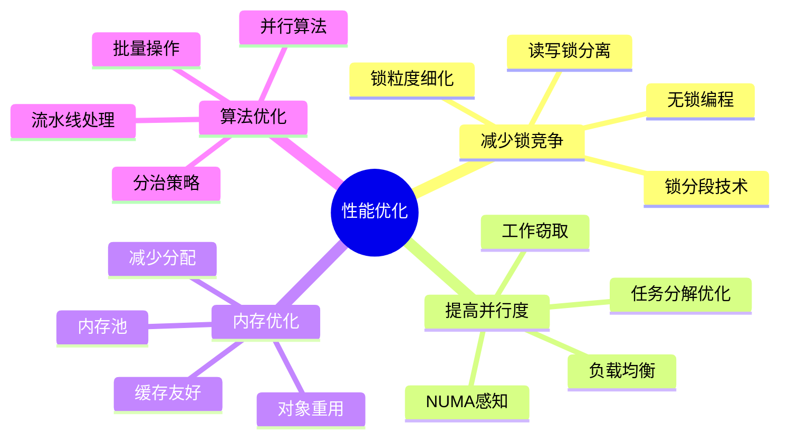
```mermaid
mindmap
  root((性能优化))
    减少锁竞争
      锁粒度细化
      读写锁分离
      锁分段技术
      无锁编程
    提高并行度
      任务分解优化
      负载均衡
      工作窃取
      NUMA感知
    内存优化
      缓存友好
      内存池
      对象重用
      减少分配
    算法优化
      并行算法
      分治策略
      流水线处理
      批量操作
```

### 8.2 最佳实践清单

#### 8.2.1 分工最佳实践

```java
// ✅ 推荐：使用合适的线程池
ExecutorService executor = Executors.newWorkStealingPool();

// ✅ 推荐：任务大小适中
int optimalTaskSize = availableProcessors() * 2;

// ❌ 避免：创建过多线程
// new Thread(() -> task.run()).start(); // 每次创建新线程

// ✅ 推荐：使用CompletableFuture进行异步编排
CompletableFuture.supplyAsync(() -> fetchData())
    .thenApply(data -> processData(data))
    .thenAccept(result -> saveResult(result));
```

#### 8.2.2 同步最佳实践

```java
// ✅ 推荐：使用CountDownLatch等待多个任务
CountDownLatch latch = new CountDownLatch(taskCount);

// ✅ 推荐：使用CyclicBarrier进行阶段同步
CyclicBarrier barrier = new CyclicBarrier(threadCount, () -> {
    System.out.println("所有线程完成当前阶段");
});

// ❌ 避免：使用Thread.sleep进行同步
// Thread.sleep(1000); // 不可靠的同步方式
```

#### 8.2.3 互斥最佳实践

```java
// ✅ 推荐：使用读写锁提高并发度
ReadWriteLock rwLock = new ReentrantReadWriteLock();

// ✅ 推荐：使用原子类避免锁
AtomicInteger counter = new AtomicInteger(0);

// ✅ 推荐：最小化锁的范围
synchronized(lockObject) {
    // 只包含必要的临界区代码
    criticalSection();
}

// ❌ 避免：过大的同步块
// synchronized(this) {
//     longRunningOperation(); // 锁持有时间过长
// }
```

### 8.3 性能监控与调优

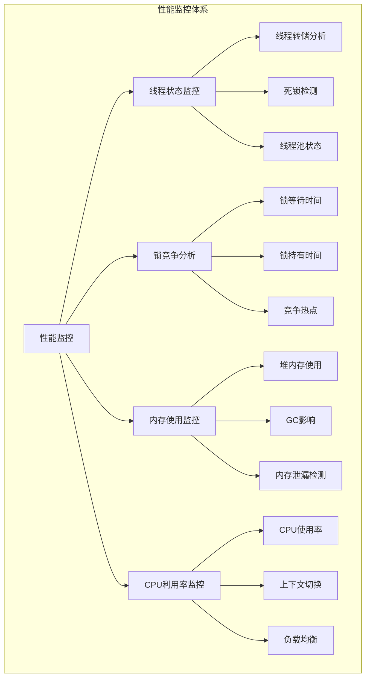
```mermaid
graph TB
    subgraph "性能监控体系"
        A[性能监控] --> B[线程状态监控]
        A --> C[锁竞争分析]
        A --> D[内存使用监控]
        A --> E[CPU利用率监控]
        
        B --> B1[线程转储分析]
        B --> B2[死锁检测]
        B --> B3[线程池状态]
        
        C --> C1[锁等待时间]
        C --> C2[锁持有时间]
        C --> C3[竞争热点]
        
        D --> D1[堆内存使用]
        D --> D2[GC影响]
        D --> D3[内存泄漏检测]
        
        E --> E1[CPU使用率]
        E --> E2[上下文切换]
        E --> E3[负载均衡]
    end
```

## 总结

并发编程的核心在于正确理解和应用分工、同步、互斥三大核心思想：

### 9.1 核心要点总结

```mermaid
graph LR
    subgraph "并发编程核心要点"
        A[分工 Division] --> A1[任务分解]
        A --> A2[负载均衡]
        A --> A3[并行执行]
        
        B[同步 Synchronization] --> B1[时序控制]
        B --> B2[状态协调]
        B --> B3[依赖管理]
        
        C[互斥 Mutual Exclusion] --> C1[资源保护]
        C --> C2[数据一致性]
        C --> C3[竞争避免]
        
        A1 --> D[高性能]
        B1 --> E[正确性]
        C1 --> F[安全性]
        
        D --> G[并发系统]
        E --> G
        F --> G
    end
```

### 9.2 设计原则

1. **分工原则**
   - 任务分解要合理，避免过度分解导致开销增大
   - 负载均衡要动态，适应不同的工作负载
   - 并行度要适中，考虑硬件资源限制

2. **同步原则**
   - 同步点要明确，避免不必要的等待
   - 依赖关系要清晰，防止循环依赖
   - 超时机制要完善，避免无限等待

3. **互斥原则**
   - 锁粒度要适当，平衡性能和安全
   - 锁顺序要一致，预防死锁发生
   - 无锁优先，在可能的情况下使用原子操作

### 9.3 技术选型建议

| 场景 | Java推荐 | C++推荐 | Objective-C推荐 |
|------|----------|---------|-----------------|
| CPU密集型任务 | ForkJoinPool | std::async | GCD dispatch_apply |
| I/O密集型任务 | CompletableFuture | std::future | NSOperation |
| 实时系统 | 自定义线程池 | 实时线程 | 高优先级队列 |
| 高并发读写 | ConcurrentHashMap | lock-free结构 | dispatch_concurrent |
| 简单同步 | CountDownLatch | std::latch | dispatch_semaphore |
| 复杂协调 | CyclicBarrier | 自实现 | NSOperation依赖 |

通过深入理解这三大核心思想并结合具体的技术实现，我们可以构建出高性能、高可靠性的并发系统。关键在于根据具体场景选择合适的技术方案，并持续优化和监控系统性能。