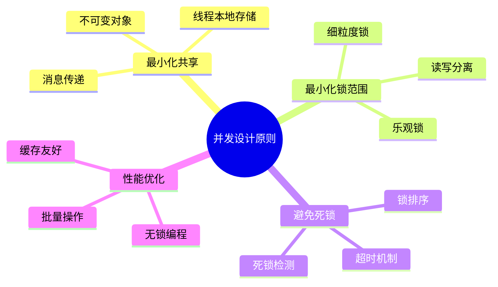
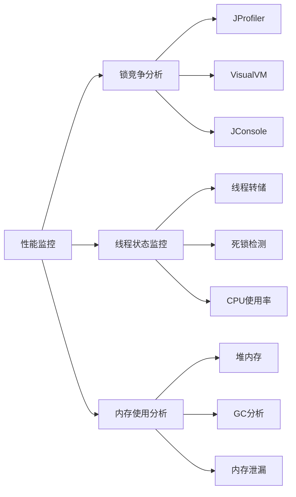

# 并发编程中锁的设计技术文档

## 目录
1. [概述](#概述)
2. [多线程脏数据问题分析](#多线程脏数据问题分析)
3. [线程模型与内存设计](#线程模型与内存设计)
4. [脏数据案例分析](#脏数据案例分析)
5. [线程安全核心设计思想](#线程安全核心设计思想)
6. [各编程语言线程安全方案](#各编程语言线程安全方案)
7. [并发编程三大核心问题](#并发编程三大核心问题)
8. [并发编程Bug源头分析](#并发编程bug源头分析)
9. [线程安全核心原理](#线程安全核心原理)
10. [锁的架构设计](#锁的架构设计)
11. [总结与最佳实践](#总结与最佳实践)


## 锁的架构设计

### 8.1 锁的层次结构


### 8.2 锁的实现原理


#### 8.2.2 锁升级机制（Java）


### 8.3 高性能锁设计

#### 8.3.1 分段锁（ConcurrentHashMap）

```java
public class SegmentedLock<K, V> {
    private final Segment<K, V>[] segments;
    private final int segmentMask;
    
    static class Segment<K, V> extends ReentrantLock {
        private final Map<K, V> table = new HashMap<>();
        
        V put(K key, V value) {
            lock();
            try {
                return table.put(key, value);
            } finally {
                unlock();
            }
        }
    }
    
    private Segment<K, V> segmentFor(int hash) {
        return segments[hash & segmentMask];
    }
}
```

#### 8.3.2 无锁数据结构

```cpp
// 无锁栈实现
template<typename T>
class LockFreeStack {
private:
    struct Node {
        T data;
        Node* next;
        Node(T const& data_) : data(data_) {}
    };
    
    std::atomic<Node*> head;
    
public:
    void push(T const& data) {
        Node* new_node = new Node(data);
        new_node->next = head.load();
        while (!head.compare_exchange_weak(new_node->next, new_node));
    }
    
    bool pop(T& result) {
        Node* old_head = head.load();
        while (old_head && 
               !head.compare_exchange_weak(old_head, old_head->next));
        
        if (old_head) {
            result = old_head->data;
            delete old_head;
            return true;
        }
        return false;
    }
};
```

## 总结与最佳实践

### 9.1 设计原则



### 9.2 最佳实践清单

#### 9.2.1 Java最佳实践

```java
// ✅ 推荐做法
public class BestPracticeExample {
    // 1. 使用并发集合
    private final ConcurrentHashMap<String, String> cache = new ConcurrentHashMap<>();
    
    // 2. 使用原子类
    private final AtomicLong counter = new AtomicLong(0);
    
    // 3. 使用不可变对象
    private final List<String> immutableList = Collections.unmodifiableList(Arrays.asList("a", "b"));
    
    // 4. 正确使用锁
    private final ReentrantReadWriteLock rwLock = new ReentrantReadWriteLock();
    
    public String getValue(String key) {
        rwLock.readLock().lock();
        try {
            return cache.get(key);
        } finally {
            rwLock.readLock().unlock();
        }
    }
    
    public void setValue(String key, String value) {
        rwLock.writeLock().lock();
        try {
            cache.put(key, value);
        } finally {
            rwLock.writeLock().unlock();
        }
    }
}
```

#### 9.2.2 性能监控与调优



### 9.3 总结

并发编程中的锁设计是一个复杂而重要的主题。通过理解线程安全的核心原理、掌握各种同步机制的使用场景、遵循最佳实践，我们可以构建出高性能、可靠的并发系统。

**关键要点：**

1. **理解根本原因**：脏数据源于原子性、可见性、有序性问题
2. **选择合适工具**：根据场景选择synchronized、Lock、原子类等
3. **遵循设计原则**：最小化共享、避免死锁、优化性能
4. **持续监控优化**：使用工具监控锁竞争，持续优化性能

通过系统性的学习和实践，我们能够在并发编程中游刃有余，构建出既安全又高效的多线程应用程序。