# 并发编程中锁的设计技术文档

## 目录
1. [概述](#概述)
2. [多线程脏数据问题分析](#多线程脏数据问题分析)
3. [线程模型与内存设计](#线程模型与内存设计)
4. [脏数据案例分析](#脏数据案例分析)
5. [线程安全核心设计思想](#线程安全核心设计思想)
6. [各编程语言线程安全方案](#各编程语言线程安全方案)
7. [并发编程三大核心问题](#并发编程三大核心问题)
8. [并发编程Bug源头分析](#并发编程bug源头分析)
9. [线程安全核心原理](#线程安全核心原理)
10. [锁的架构设计](#锁的架构设计)
11. [总结与最佳实践](#总结与最佳实践)

## 概述


#### 1.1.1 CPU缓存一致性问题


#### 1.1.2 指令重排序


#### 1.1.3 原子性缺失

多步操作在执行过程中被其他线程中断，导致数据不一致。

### 1.2 线程模型与内存设计

#### 1.2.1 Java内存模型(JMM)

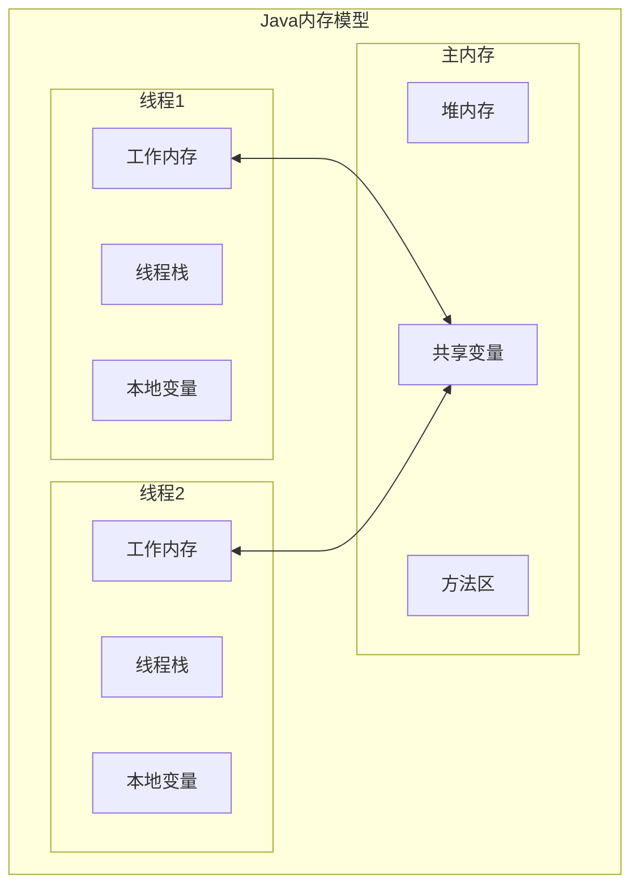

#### 1.2.2 C++内存模型

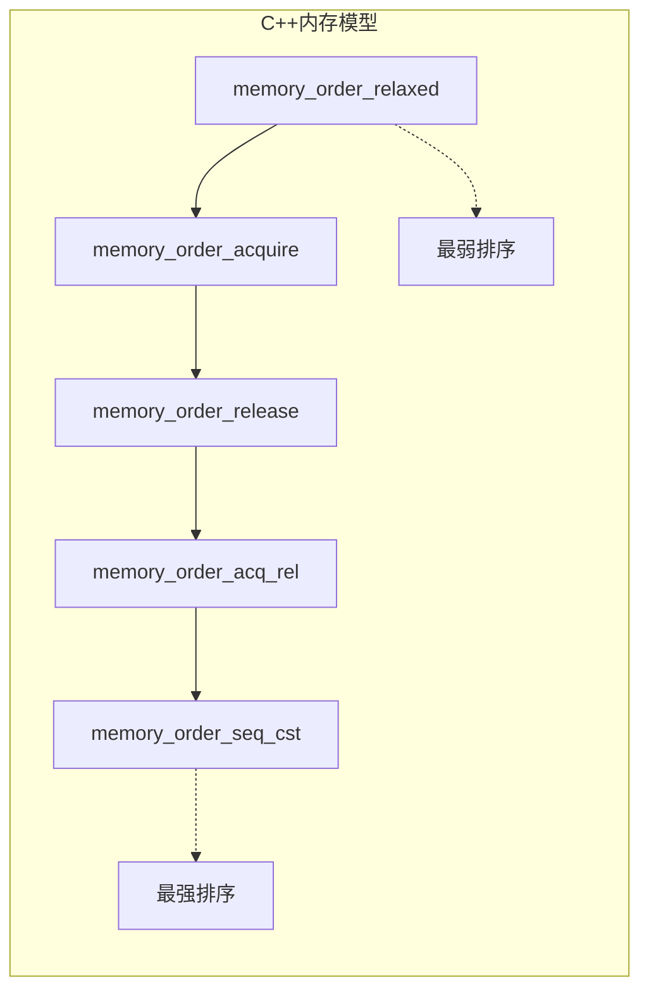

## 脏数据案例分析

### 案例1：银行转账问题（Java）

```java
public class BankAccount {
    private volatile int balance = 1000;
    
    // 问题代码：非原子操作
    public void withdraw(int amount) {
        if (balance >= amount) {  // 步骤1：检查余额
            // 此处可能被其他线程中断
            balance -= amount;    // 步骤2：扣减余额
        }
    }
}
```

**问题分析时序图：**

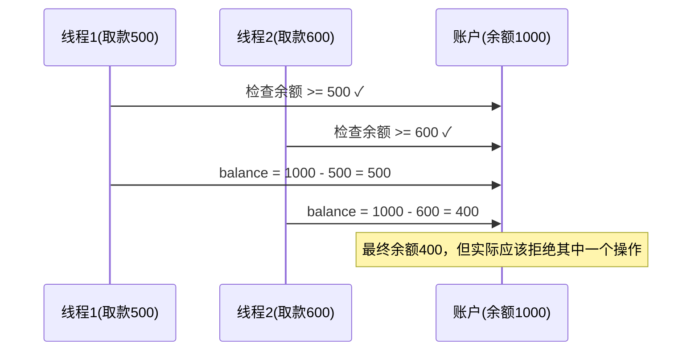

### 案例2：计数器问题（C++）

```cpp
class Counter {
private:
    int count = 0;
public:
    void increment() {
        count++;  // 非原子操作：读取->增加->写入
    }
    
    int getCount() {
        return count;
    }
};
```

### 案例3：单例模式问题（Objective-C）

```objc
@implementation Singleton

+ (instancetype)sharedInstance {
    static Singleton *instance = nil;
    if (instance == nil) {  // 问题：双重检查但无同步
        instance = [[Singleton alloc] init];
    }
    return instance;
}

@end
```

## 线程安全核心设计思想

### 3.1 核心原则

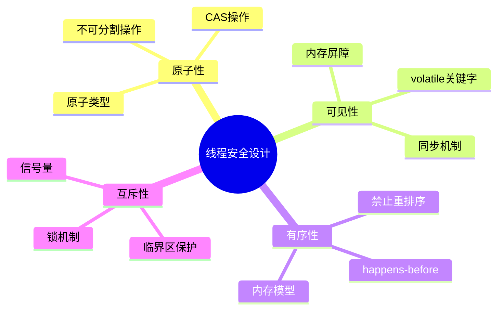

### 3.2 设计模式

#### 3.2.1 不可变对象模式

```java
public final class ImmutableCounter {
    private final int value;
    
    public ImmutableCounter(int value) {
        this.value = value;
    }
    
    public ImmutableCounter increment() {
        return new ImmutableCounter(value + 1);
    }
    
    public int getValue() {
        return value;
    }
}
```

#### 3.2.2 线程本地存储模式

```java
public class ThreadLocalExample {
    private static final ThreadLocal<SimpleDateFormat> formatter = 
        ThreadLocal.withInitial(() -> new SimpleDateFormat("yyyy-MM-dd"));
    
    public String formatDate(Date date) {
        return formatter.get().format(date);
    }
}
```

## 各编程语言线程安全方案

### 4.1 Java解决方案

#### 4.1.1 同步机制层次结构

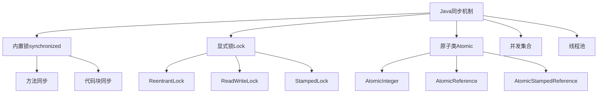

#### 4.1.2 Java锁的实现

```java
// 1. synchronized关键字
public class SynchronizedExample {
    private final Object lock = new Object();
    private int count = 0;
    
    public synchronized void increment() {
        count++;
    }
    
    public void incrementWithBlock() {
        synchronized(lock) {
            count++;
        }
    }
}

// 2. ReentrantLock
public class LockExample {
    private final ReentrantLock lock = new ReentrantLock();
    private int count = 0;
    
    public void increment() {
        lock.lock();
        try {
            count++;
        } finally {
            lock.unlock();
        }
    }
}

// 3. 原子类
public class AtomicExample {
    private final AtomicInteger count = new AtomicInteger(0);
    
    public void increment() {
        count.incrementAndGet();
    }
}
```

### 4.2 C++解决方案

#### 4.2.1 C++同步原语

```cpp
#include <mutex>
#include <atomic>
#include <shared_mutex>

class ThreadSafeCounter {
private:
    mutable std::mutex mtx;
    int count = 0;
    
public:
    // 1. 互斥锁
    void increment() {
        std::lock_guard<std::mutex> lock(mtx);
        ++count;
    }
    
    // 2. 读写锁
    int getCount() const {
        std::shared_lock<std::shared_mutex> lock(mtx);
        return count;
    }
};

// 3. 原子操作
class AtomicCounter {
private:
    std::atomic<int> count{0};
    
public:
    void increment() {
        count.fetch_add(1, std::memory_order_relaxed);
    }
    
    int getCount() const {
        return count.load(std::memory_order_acquire);
    }
};
```

### 4.3 Objective-C解决方案

```objc
// 1. @synchronized
@implementation ThreadSafeClass {
    NSMutableArray *_array;
}

- (void)addObject:(id)object {
    @synchronized(self) {
        [_array addObject:object];
    }
}

// 2. NSLock
- (void)addObjectWithLock:(id)object {
    [_lock lock];
    [_array addObject:object];
    [_lock unlock];
}

// 3. dispatch_queue (GCD)
- (void)addObjectWithGCD:(id)object {
    dispatch_sync(_serialQueue, ^{
        [_array addObject:object];
    });
}

// 4. 原子属性
@property (atomic, strong) NSString *atomicProperty;
@end
```

## 并发编程三大核心问题

### 5.1 分工、同步、互斥架构图

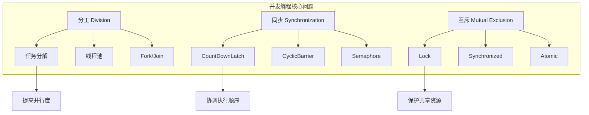

### 5.2 设计灵魂

#### 5.2.1 分工设计模式

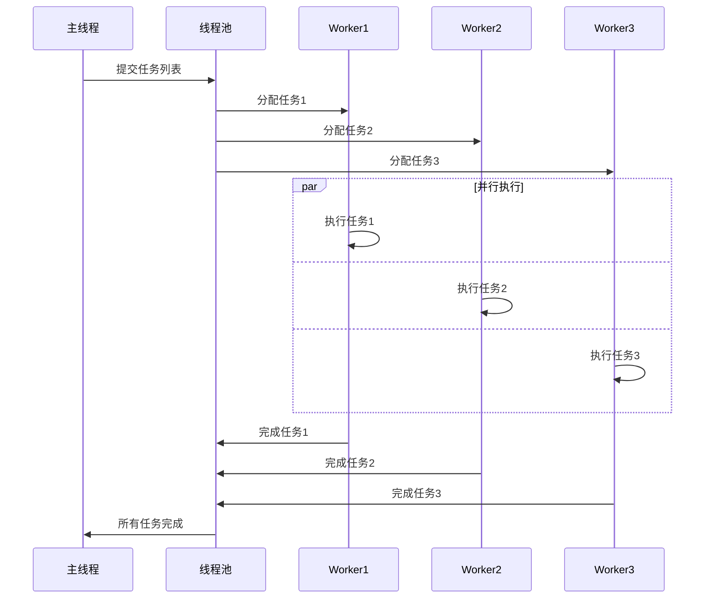

#### 5.2.2 同步设计模式

```java
// CountDownLatch示例
public class TaskCoordinator {
    private final CountDownLatch latch;
    
    public void waitForAllTasks() throws InterruptedException {
        latch.await(); // 等待所有任务完成
    }
    
    public void taskCompleted() {
        latch.countDown(); // 任务完成，计数减1
    }
}
```

#### 5.2.3 互斥设计模式

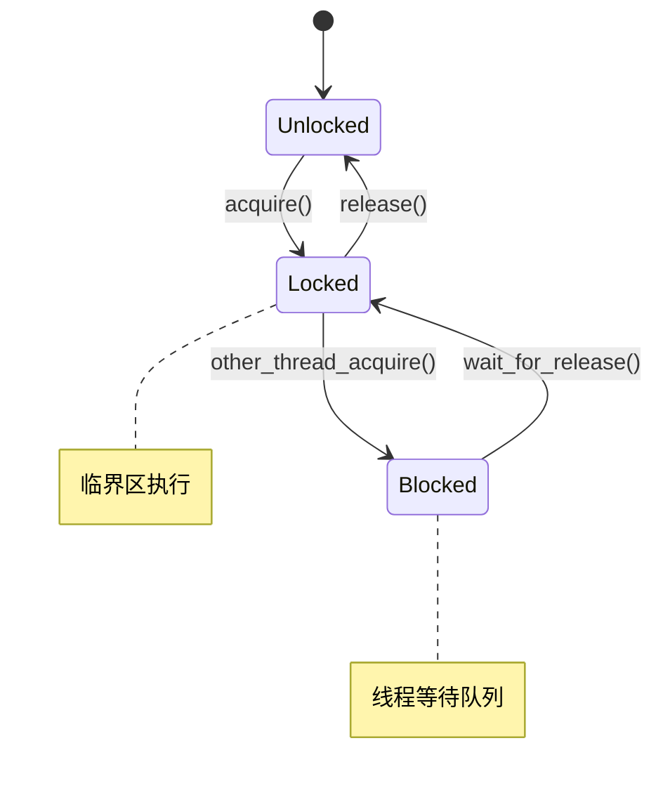

## 并发编程Bug源头分析

### 6.1 Bug分类与源头

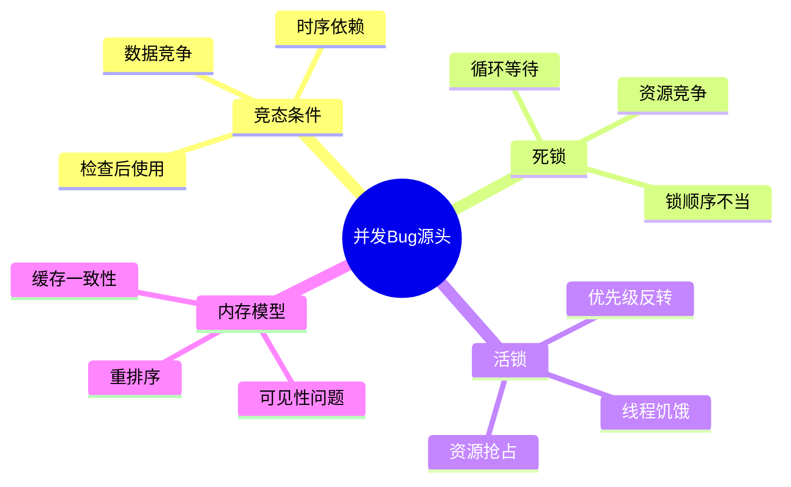

### 6.2 典型Bug模式

#### 6.2.1 死锁示例

```java
public class DeadlockExample {
    private final Object lock1 = new Object();
    private final Object lock2 = new Object();
    
    public void method1() {
        synchronized(lock1) {
            synchronized(lock2) {
                // 业务逻辑
            }
        }
    }
    
    public void method2() {
        synchronized(lock2) {  // 锁顺序相反
            synchronized(lock1) {
                // 业务逻辑
            }
        }
    }
}
```

**死锁时序图：**

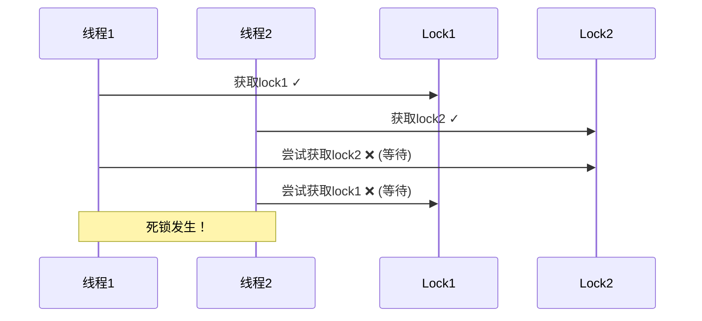

## 线程安全核心原理

### 7.1 核心原理架构

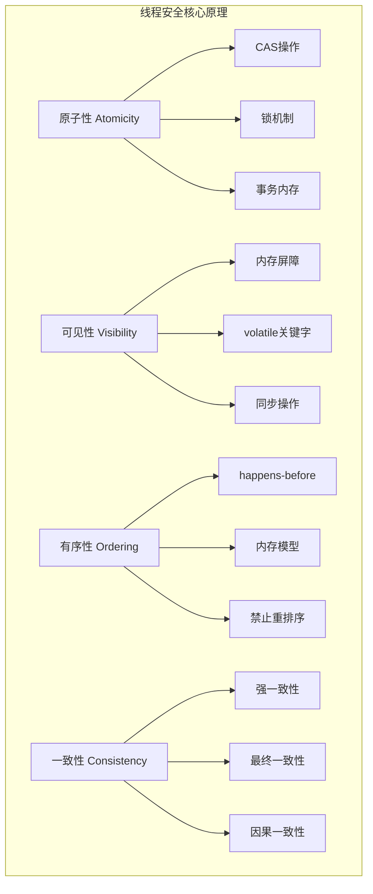

### 7.2 CAS原理详解

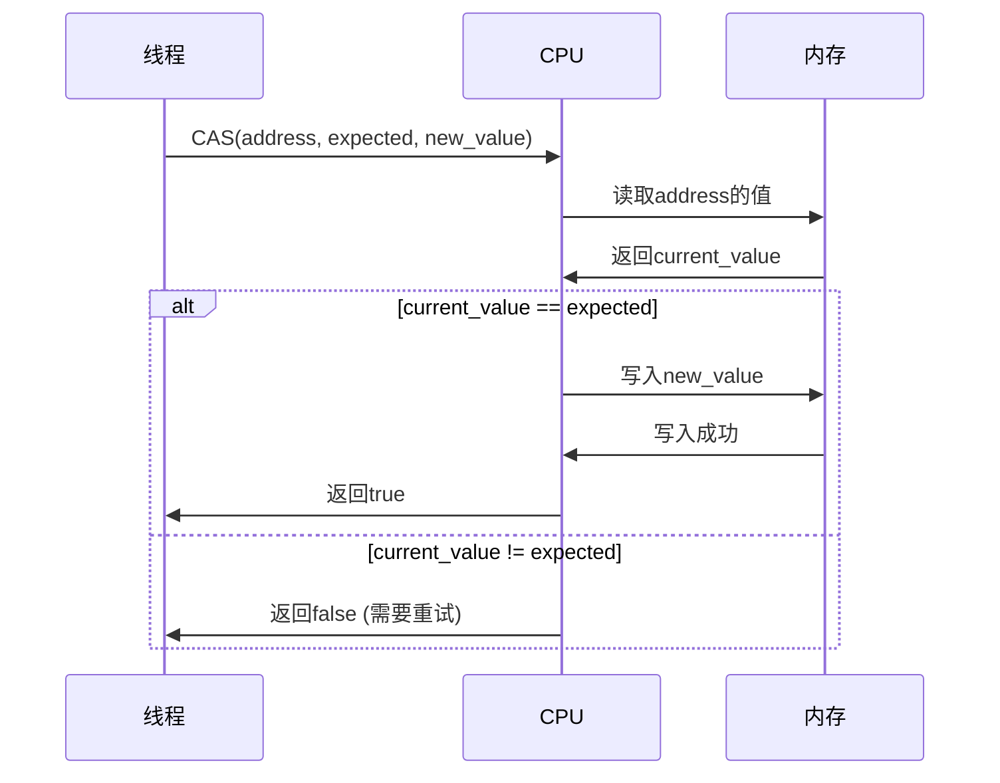

### 7.3 内存屏障原理

```cpp
// C++内存屏障示例
class MemoryBarrierExample {
private:
    std::atomic<bool> flag{false};
    int data = 0;
    
public:
    void producer() {
        data = 42;                                    // 1
        flag.store(true, std::memory_order_release);  // 2 (release屏障)
    }
    
    void consumer() {
        if (flag.load(std::memory_order_acquire)) {   // 3 (acquire屏障)
            assert(data == 42);                       // 4 保证能看到data=42
        }
    }
};
```

## 锁的架构设计

### 8.1 锁的层次结构

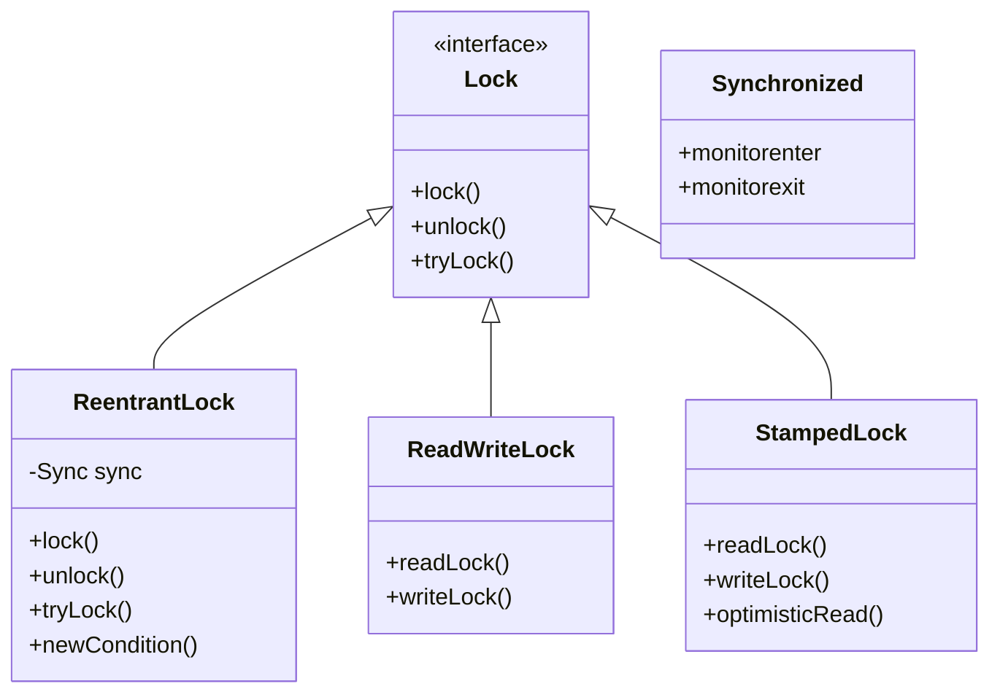

### 8.2 锁的实现原理

#### 8.2.1 AQS (AbstractQueuedSynchronizer) 架构

```mermaid
graph TB
    subgraph "AQS架构"
        A[AbstractQueuedSynchronizer] --> B[state状态]
        A --> C[FIFO等待队列]
        A --> D[Condition条件队列]
        
        B --> B1[0: 未锁定]
        B --> B2[1: 已锁定]
        B --> B3[>1: 重入次数]
        
        C --> C1[Head节点]
        C --> C2[等待节点]
        C --> C3[Tail节点]
        
        D --> D1[await()]
        D --> D2[signal()]
        D --> D3[signalAll()]
    end
```

#### 8.2.2 锁升级机制（Java）

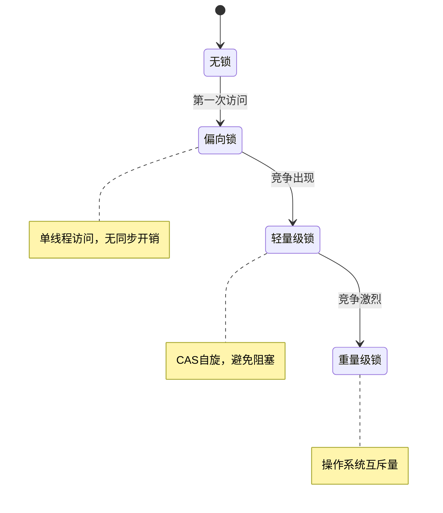

### 8.3 高性能锁设计

#### 8.3.1 分段锁（ConcurrentHashMap）

```java
public class SegmentedLock<K, V> {
    private final Segment<K, V>[] segments;
    private final int segmentMask;
    
    static class Segment<K, V> extends ReentrantLock {
        private final Map<K, V> table = new HashMap<>();
        
        V put(K key, V value) {
            lock();
            try {
                return table.put(key, value);
            } finally {
                unlock();
            }
        }
    }
    
    private Segment<K, V> segmentFor(int hash) {
        return segments[hash & segmentMask];
    }
}
```

#### 8.3.2 无锁数据结构

```cpp
// 无锁栈实现
template<typename T>
class LockFreeStack {
private:
    struct Node {
        T data;
        Node* next;
        Node(T const& data_) : data(data_) {}
    };
    
    std::atomic<Node*> head;
    
public:
    void push(T const& data) {
        Node* new_node = new Node(data);
        new_node->next = head.load();
        while (!head.compare_exchange_weak(new_node->next, new_node));
    }
    
    bool pop(T& result) {
        Node* old_head = head.load();
        while (old_head && 
               !head.compare_exchange_weak(old_head, old_head->next));
        
        if (old_head) {
            result = old_head->data;
            delete old_head;
            return true;
        }
        return false;
    }
};
```

## 总结与最佳实践

### 9.1 设计原则

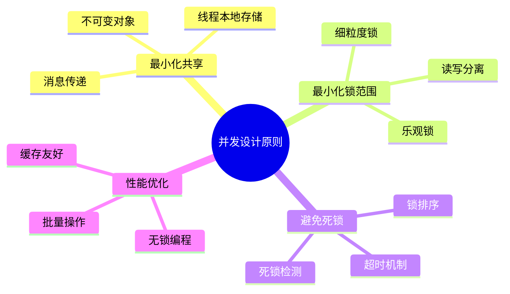

### 9.2 最佳实践清单

#### 9.2.1 Java最佳实践

```java
// ✅ 推荐做法
public class BestPracticeExample {
    // 1. 使用并发集合
    private final ConcurrentHashMap<String, String> cache = new ConcurrentHashMap<>();
    
    // 2. 使用原子类
    private final AtomicLong counter = new AtomicLong(0);
    
    // 3. 使用不可变对象
    private final List<String> immutableList = Collections.unmodifiableList(Arrays.asList("a", "b"));
    
    // 4. 正确使用锁
    private final ReentrantReadWriteLock rwLock = new ReentrantReadWriteLock();
    
    public String getValue(String key) {
        rwLock.readLock().lock();
        try {
            return cache.get(key);
        } finally {
            rwLock.readLock().unlock();
        }
    }
    
    public void setValue(String key, String value) {
        rwLock.writeLock().lock();
        try {
            cache.put(key, value);
        } finally {
            rwLock.writeLock().unlock();
        }
    }
}
```

#### 9.2.2 性能监控与调优

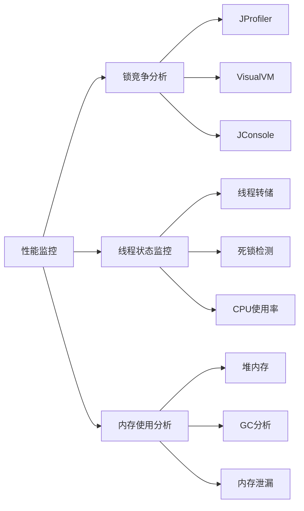

### 9.3 总结

并发编程中的锁设计是一个复杂而重要的主题。通过理解线程安全的核心原理、掌握各种同步机制的使用场景、遵循最佳实践，我们可以构建出高性能、可靠的并发系统。

**关键要点：**

1. **理解根本原因**：脏数据源于原子性、可见性、有序性问题
2. **选择合适工具**：根据场景选择synchronized、Lock、原子类等
3. **遵循设计原则**：最小化共享、避免死锁、优化性能
4. **持续监控优化**：使用工具监控锁竞争，持续优化性能

通过系统性的学习和实践，我们能够在并发编程中游刃有余，构建出既安全又高效的多线程应用程序。