# 序列化设计方案技术文档

## 目录
1. [为什么要序列化](#1-为什么要序列化)
2. [序列化怎么做](#2-序列化怎么做)
3. [序列化和反序列化实现方案](#3-序列化和反序列化实现方案)
4. [序列化原理](#4-序列化原理)
5. [序列化数据安全](#5-序列化数据安全)
6. [架构设计](#6-架构设计)
7. [实现示例](#7-实现示例)

---

## 1. 为什么要序列化

### 1.1 定义
序列化（Serialization）是将内存中的对象状态转换为可存储或传输格式的过程。反序列化（Deserialization）则是将序列化后的数据重新转换为内存对象的过程。

### 1.2 核心需求

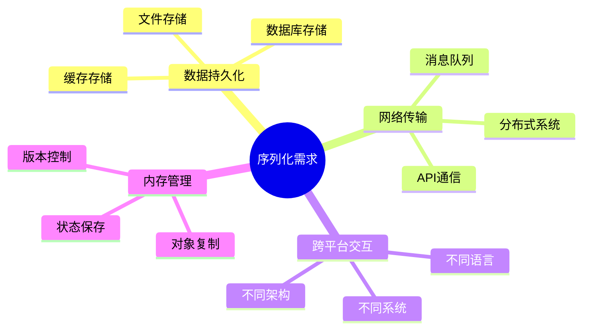

### 1.3 应用场景

| 场景 | 描述 | 示例 |
|------|------|------|
| **网络通信** | 在网络中传输复杂对象 | REST API、RPC调用 |
| **数据持久化** | 将对象保存到存储介质 | 数据库、文件系统 |
| **缓存机制** | 临时存储对象状态 | Redis、Memcached |
| **分布式系统** | 跨服务传输数据 | 微服务、消息队列 |
| **深拷贝** | 完整复制对象 | 对象克隆、状态备份 |

---

## 2. 序列化怎么做

### 2.1 序列化流程

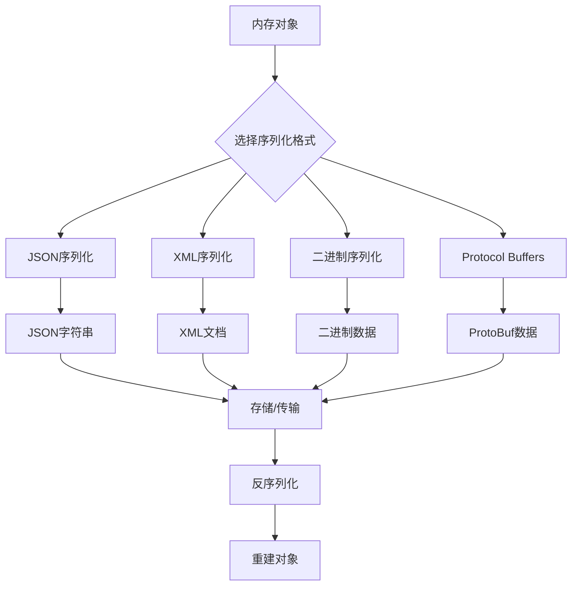

### 2.2 关键步骤

1. **对象分析**：识别对象结构和属性
2. **格式选择**：根据需求选择序列化格式
3. **数据转换**：将对象转换为目标格式
4. **数据验证**：确保序列化数据完整性
5. **存储/传输**：保存或发送序列化数据

### 2.3 设计原则

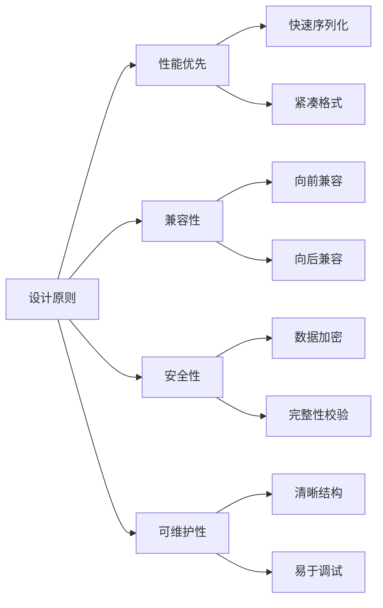

---

## 3. 序列化和反序列化实现方案

### 3.1 方案对比

| 方案 | 优点 | 缺点 | 适用场景 |
|------|------|------|----------|
| **JSON** | 人类可读、跨语言、简单 | 体积大、类型信息丢失 | Web API、配置文件 |
| **XML** | 结构化、可扩展、标准化 | 冗余大、解析复杂 | 企业系统、配置管理 |
| **Protocol Buffers** | 高效、强类型、版本兼容 | 需要定义文件、二进制 | 微服务、高性能系统 |
| **MessagePack** | 紧凑、快速、类型保持 | 二进制格式、调试困难 | 游戏、实时系统 |
| **Avro** | Schema演进、压缩率高 | 复杂性高、学习成本 | 大数据、流处理 |

### 3.2 技术架构对比

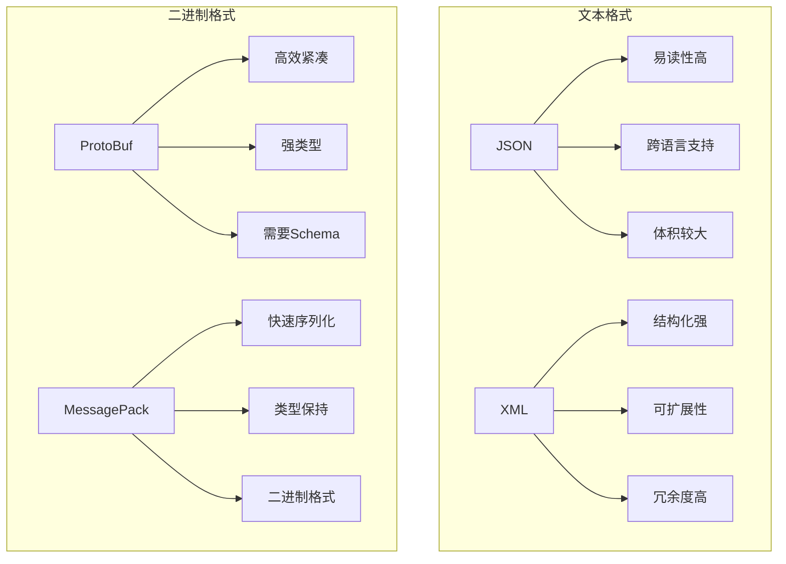

### 3.3 实现策略

#### 3.3.1 基于反射的序列化

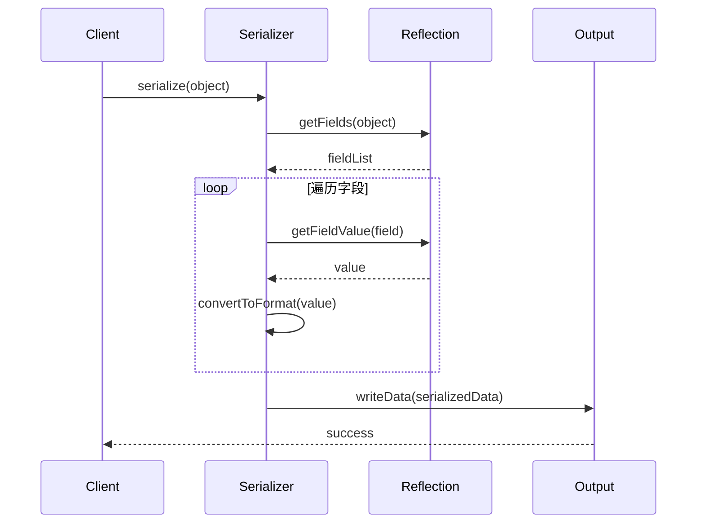

#### 3.3.2 基于代码生成的序列化

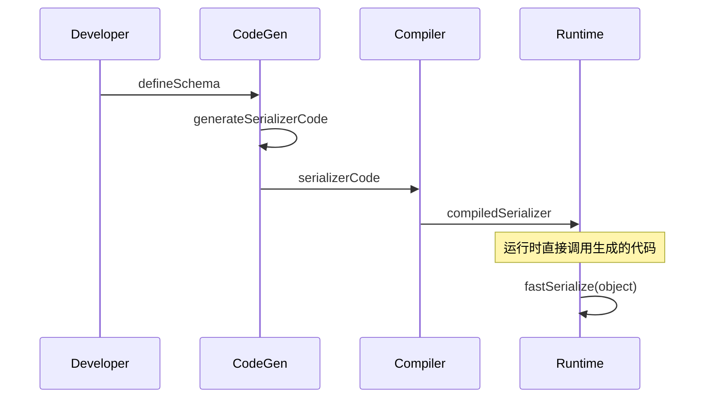

---

## 4. 序列化原理

### 4.1 核心原理

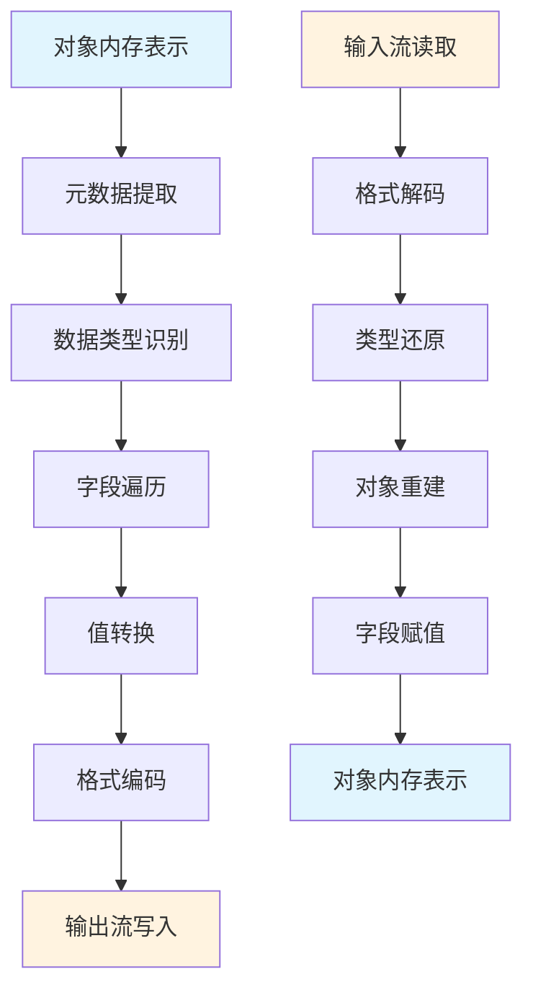

### 4.2 内存布局分析

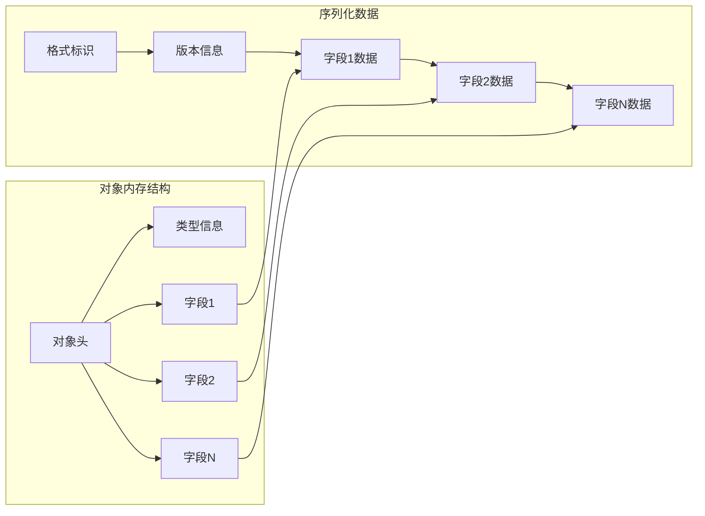

### 4.3 类型系统映射

| 源类型 | JSON | XML | ProtoBuf | MessagePack |
|--------|------|-----|----------|-------------|
| **整数** | number | text | varint | int |
| **浮点数** | number | text | fixed64 | float |
| **字符串** | string | text | string | str |
| **布尔值** | boolean | text | bool | bool |
| **数组** | array | elements | repeated | array |
| **对象** | object | element | message | map |
| **null** | null | empty | optional | nil |

---

## 5. 序列化数据安全

### 5.1 安全威胁模型

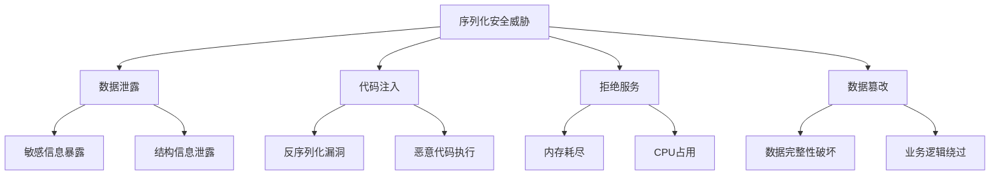

### 5.2 安全防护策略

#### 5.2.1 加密保护

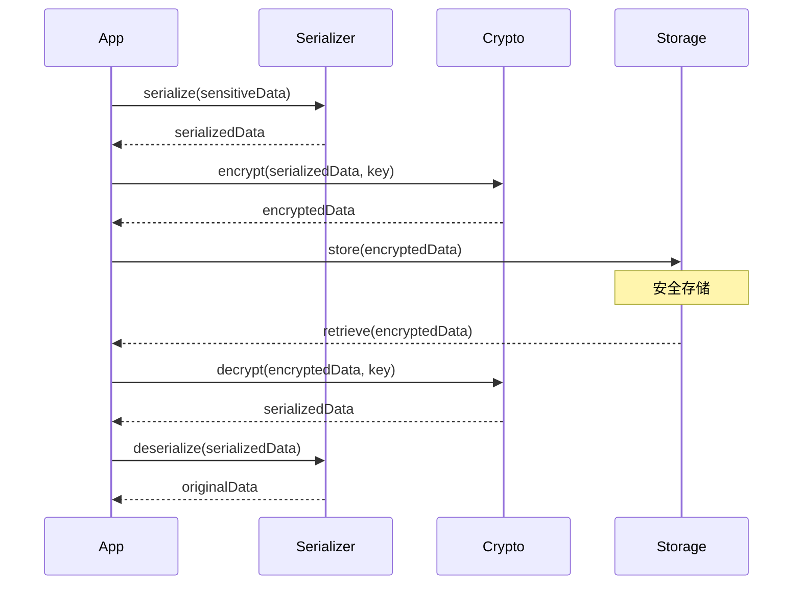

#### 5.2.2 完整性校验

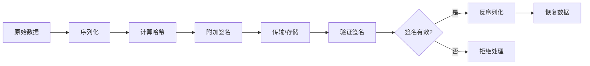

### 5.3 安全实现方案

#### 5.3.1 白名单机制

```typescript
interface SerializationWhitelist {
    allowedClasses: Set<string>;
    allowedFields: Map<string, Set<string>>;
    maxDepth: number;
    maxSize: number;
}

class SecureSerializer {
    private whitelist: SerializationWhitelist;
    
    serialize(obj: any): string {
        this.validateObject(obj);
        return this.doSerialize(obj);
    }
    
    private validateObject(obj: any, depth = 0): void {
        if (depth > this.whitelist.maxDepth) {
            throw new Error('Max depth exceeded');
        }
        
        const className = obj.constructor.name;
        if (!this.whitelist.allowedClasses.has(className)) {
            throw new Error(`Class ${className} not allowed`);
        }
    }
}
```

#### 5.3.2 沙箱反序列化

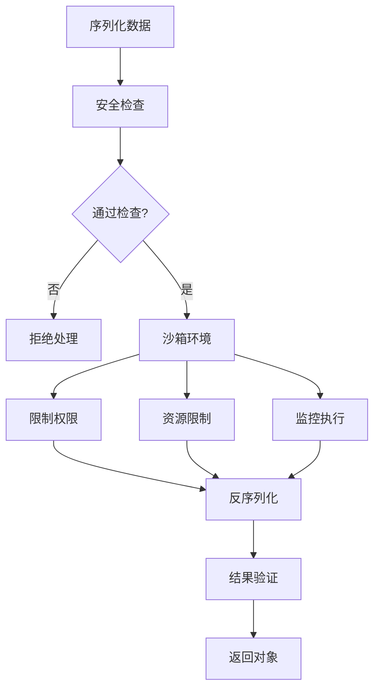

---

## 6. 架构设计

### 6.1 整体架构

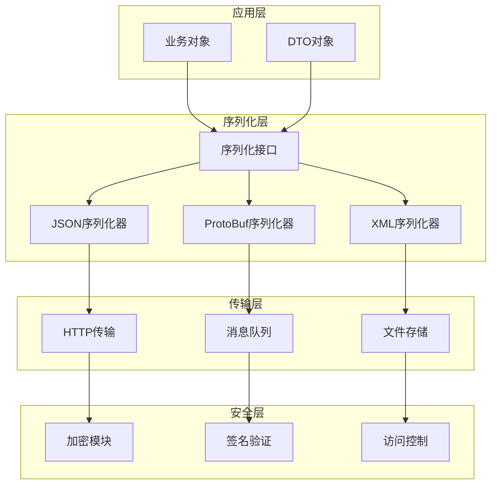

### 6.2 组件设计

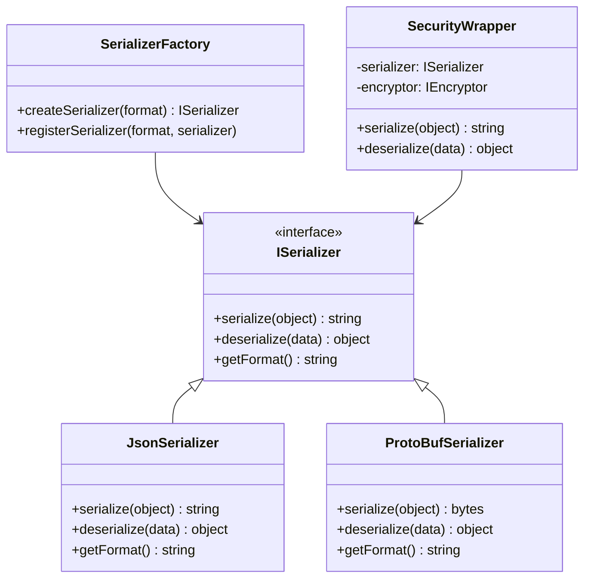

### 6.3 数据流设计

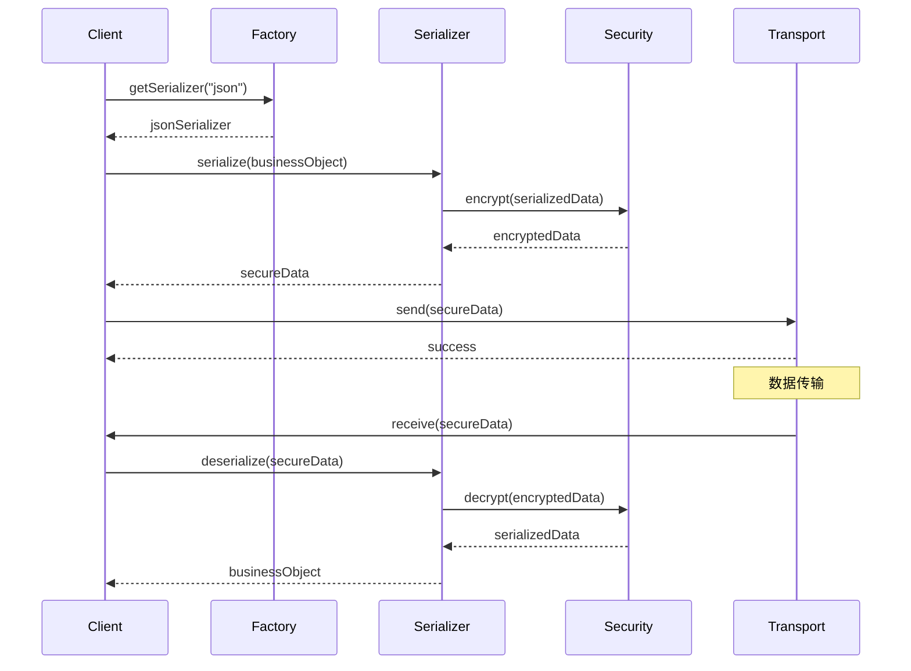

---

## 7. 实现示例

### 7.1 TypeScript实现

```typescript
// 序列化接口定义
interface ISerializer<T> {
    serialize(obj: T): string | Uint8Array;
    deserialize(data: string | Uint8Array): T;
    getContentType(): string;
}

// JSON序列化器实现
class JsonSerializer<T> implements ISerializer<T> {
    serialize(obj: T): string {
        try {
            return JSON.stringify(obj, this.replacer);
        } catch (error) {
            throw new SerializationError(`JSON序列化失败: ${error.message}`);
        }
    }
    
    deserialize(data: string): T {
        try {
            return JSON.parse(data, this.reviver);
        } catch (error) {
            throw new SerializationError(`JSON反序列化失败: ${error.message}`);
        }
    }
    
    getContentType(): string {
        return 'application/json';
    }
    
    private replacer(key: string, value: any): any {
        // 处理特殊类型
        if (value instanceof Date) {
            return { __type: 'Date', value: value.toISOString() };
        }
        if (value instanceof Map) {
            return { __type: 'Map', value: Array.from(value.entries()) };
        }
        return value;
    }
    
    private reviver(key: string, value: any): any {
        if (value && typeof value === 'object' && value.__type) {
            switch (value.__type) {
                case 'Date':
                    return new Date(value.value);
                case 'Map':
                    return new Map(value.value);
            }
        }
        return value;
    }
}

// 安全序列化包装器
class SecureSerializer<T> implements ISerializer<T> {
    constructor(
        private serializer: ISerializer<T>,
        private encryptor: IEncryptor,
        private validator: IValidator<T>
    ) {}
    
    serialize(obj: T): string {
        // 1. 验证对象
        this.validator.validate(obj);
        
        // 2. 序列化
        const serialized = this.serializer.serialize(obj);
        
        // 3. 加密
        const encrypted = this.encryptor.encrypt(serialized);
        
        // 4. 添加完整性校验
        const signature = this.encryptor.sign(encrypted);
        
        return JSON.stringify({
            data: encrypted,
            signature: signature,
            timestamp: Date.now()
        });
    }
    
    deserialize(data: string): T {
        const envelope = JSON.parse(data);
        
        // 1. 验证签名
        if (!this.encryptor.verify(envelope.data, envelope.signature)) {
            throw new SecurityError('数据签名验证失败');
        }
        
        // 2. 检查时间戳
        if (Date.now() - envelope.timestamp > 3600000) { // 1小时过期
            throw new SecurityError('数据已过期');
        }
        
        // 3. 解密
        const decrypted = this.encryptor.decrypt(envelope.data);
        
        // 4. 反序列化
        return this.serializer.deserialize(decrypted);
    }
    
    getContentType(): string {
        return 'application/encrypted+json';
    }
}

// 序列化器工厂
class SerializerFactory {
    private static serializers = new Map<string, () => ISerializer<any>>();
    
    static register<T>(format: string, factory: () => ISerializer<T>): void {
        this.serializers.set(format, factory);
    }
    
    static create<T>(format: string): ISerializer<T> {
        const factory = this.serializers.get(format);
        if (!factory) {
            throw new Error(`不支持的序列化格式: ${format}`);
        }
        return factory();
    }
}

// 使用示例
interface UserData {
    id: number;
    name: string;
    email: string;
    createdAt: Date;
    preferences: Map<string, any>;
}

// 注册序列化器
SerializerFactory.register('json', () => new JsonSerializer<UserData>());
SerializerFactory.register('secure-json', () => 
    new SecureSerializer(
        new JsonSerializer<UserData>(),
        new AESEncryptor(),
        new UserDataValidator()
    )
);

// 使用
const userData: UserData = {
    id: 1,
    name: 'John Doe',
    email: 'john@example.com',
    createdAt: new Date(),
    preferences: new Map([['theme', 'dark'], ['lang', 'zh-CN']])
};

const serializer = SerializerFactory.create<UserData>('secure-json');
const serialized = serializer.serialize(userData);
const deserialized = serializer.deserialize(serialized);
```

### 7.2 性能优化示例

```typescript
// 对象池优化
class SerializerPool<T> {
    private pool: ISerializer<T>[] = [];
    private factory: () => ISerializer<T>;
    
    constructor(factory: () => ISerializer<T>, initialSize = 5) {
        this.factory = factory;
        for (let i = 0; i < initialSize; i++) {
            this.pool.push(factory());
        }
    }
    
    acquire(): ISerializer<T> {
        return this.pool.pop() || this.factory();
    }
    
    release(serializer: ISerializer<T>): void {
        if (this.pool.length < 10) { // 限制池大小
            this.pool.push(serializer);
        }
    }
}

// 流式序列化
class StreamingSerializer<T> {
    async serializeStream(objects: AsyncIterable<T>): Promise<ReadableStream> {
        return new ReadableStream({
            async start(controller) {
                controller.enqueue('[');
                let first = true;
                
                for await (const obj of objects) {
                    if (!first) {
                        controller.enqueue(',');
                    }
                    controller.enqueue(JSON.stringify(obj));
                    first = false;
                }
                
                controller.enqueue(']');
                controller.close();
            }
        });
    }
}
```

---

## 总结

本文档详细介绍了序列化的设计方案，包括：

1. **需求分析**：明确了序列化的必要性和应用场景
2. **技术方案**：对比了多种序列化格式的优缺点
3. **架构设计**：提供了完整的系统架构和组件设计
4. **安全考虑**：详细分析了安全威胁和防护措施
5. **实现示例**：提供了完整的TypeScript实现代码

通过合理的架构设计和安全措施，可以构建一个高效、安全、可扩展的序列化系统，满足各种业务场景的需求。

---

**文档版本**: v1.0  
**创建日期**: 2025-11-24  
**更新日期**: 2025-11-24