# 数据序列化格式技术方案
## JSON、Protocol Buffers (ProtoBuf) 和 XML 深度解析

## 目录
- [1. 使用背景](#1-使用背景)
- [2. 核心特性对比](#2-核心特性对比)
- [3. JSON数据设计](#3-json数据设计)
- [4. ProtoBuf数据设计](#4-protobuf数据设计)
- [5. XML数据设计](#5-xml数据设计)
- [6. 性能深度对比](#6-性能深度对比)
- [7. 应用场景与开发建议](#7-应用场景与开发建议)

---

## 1. 使用背景

### 1.1 数据序列化的发展历程

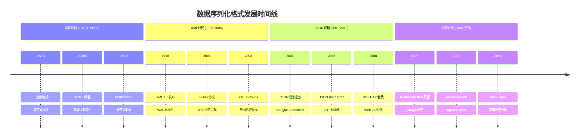

### 1.2 技术背景分析

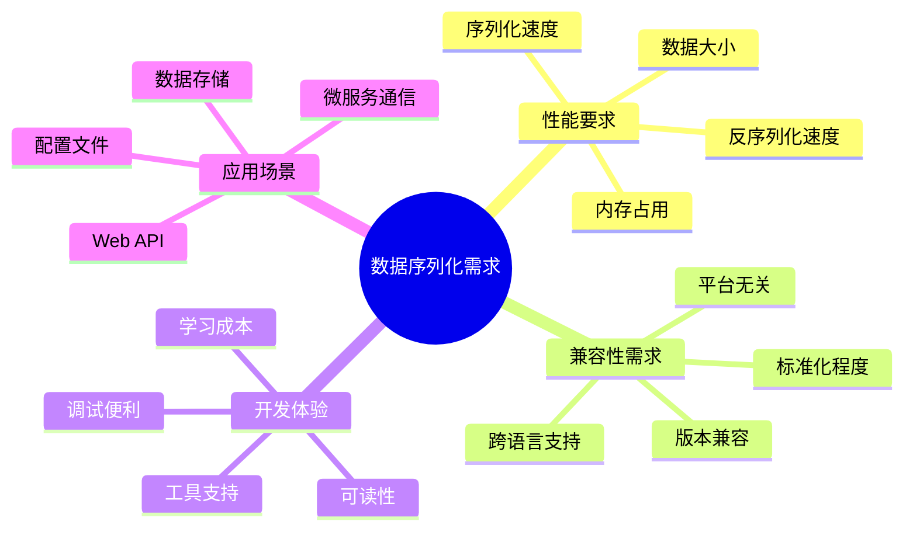

### 1.3 选择驱动因素

| 驱动因素 | XML | JSON | ProtoBuf |
|---------|-----|------|----------|
| **标准化需求** | 强 | 中 | 弱 |
| **性能要求** | 低 | 中 | 高 |
| **可读性需求** | 高 | 高 | 低 |
| **跨语言支持** | 强 | 强 | 强 |
| **生态成熟度** | 高 | 高 | 中 |

## 2. 核心特性对比

### 2.1 整体架构对比


### 2.2 特性对比矩阵

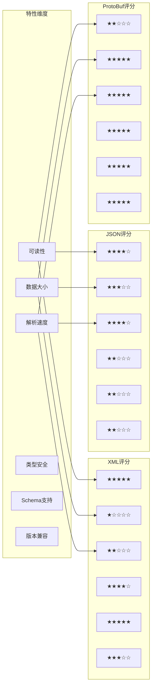

### 2.3 技术特性详细对比

| 特性维度 | XML | JSON | ProtoBuf |
|---------|-----|------|----------|
| **数据格式** | 文本 | 文本 | 二进制 |
| **可读性** | 优秀 | 优秀 | 差 |
| **数据大小** | 大 | 中等 | 小 |
| **解析速度** | 慢 | 中等 | 快 |
| **内存占用** | 高 | 中等 | 低 |
| **类型系统** | 强类型 | 弱类型 | 强类型 |
| **Schema支持** | 完整 | 有限 | 完整 |
| **版本兼容** | 有限 | 有限 | 优秀 |
| **跨语言支持** | 优秀 | 优秀 | 优秀 |
| **工具生态** | 成熟 | 成熟 | 良好 |

## 3. JSON数据设计

### 3.1 JSON的起源与发展

#### 3.1.1 历史背景
JSON (JavaScript Object Notation) 由Douglas Crockford在2001年提出，最初是为了解决JavaScript中数据交换的问题。它基于JavaScript的对象字面量语法，但设计为语言无关的数据格式。

#### 3.1.2 设计哲学

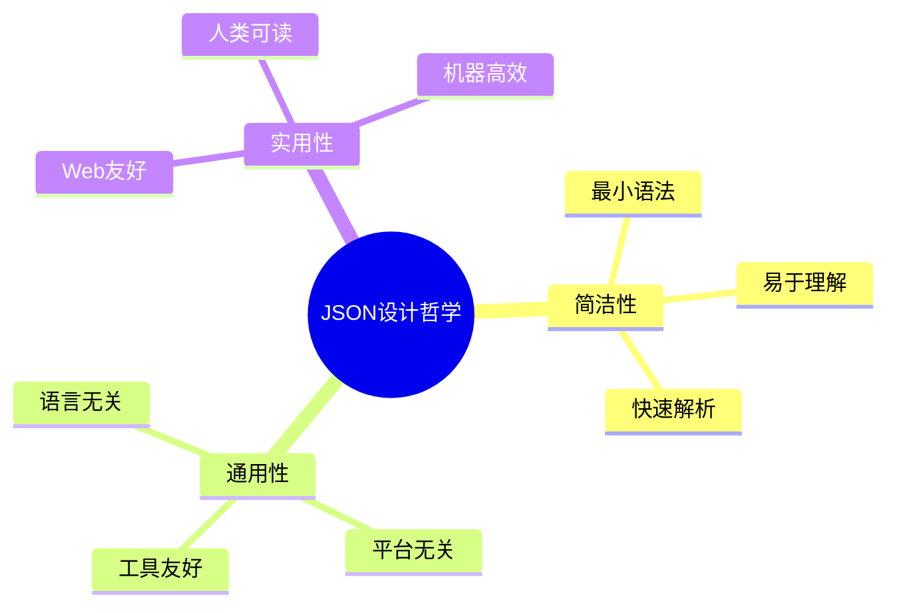

### 3.2 JSON数据结构设计

#### 3.2.1 基本数据类型

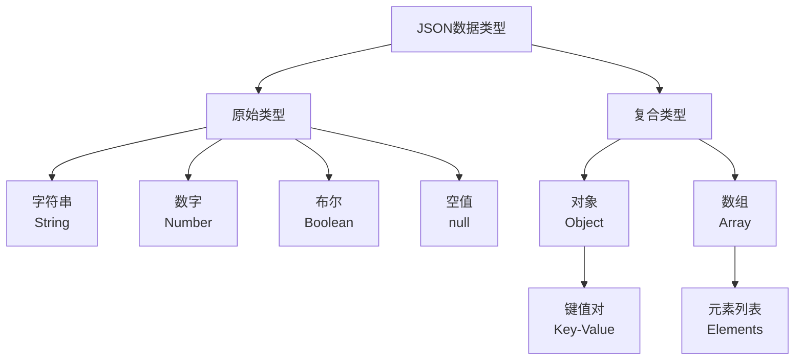

#### 3.2.2 JSON语法规则

```json
{
  "name": "张三",                    // 字符串
  "age": 30,                        // 数字
  "isActive": true,                 // 布尔值
  "address": null,                  // 空值
  "skills": ["Java", "Python"],     // 数组
  "profile": {                      // 嵌套对象
    "email": "zhangsan@example.com",
    "phone": "13800138000"
  }
}
```

### 3.3 JSON设计优势

#### 3.3.1 优势分析

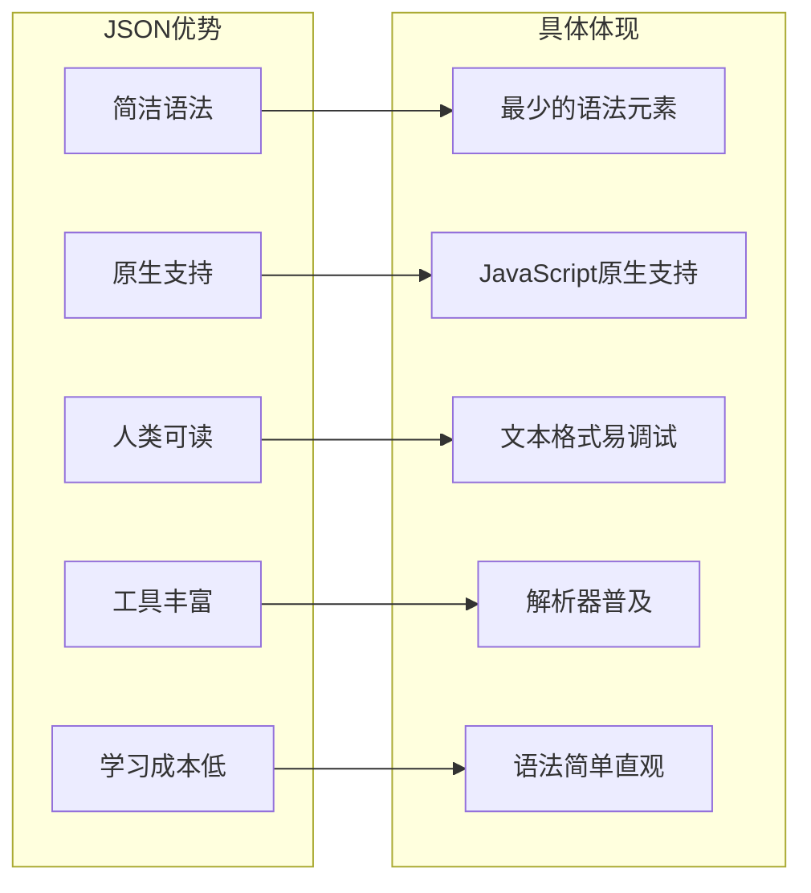

### 3.4 JSON传输效率分析

#### 3.4.1 数据传输流程

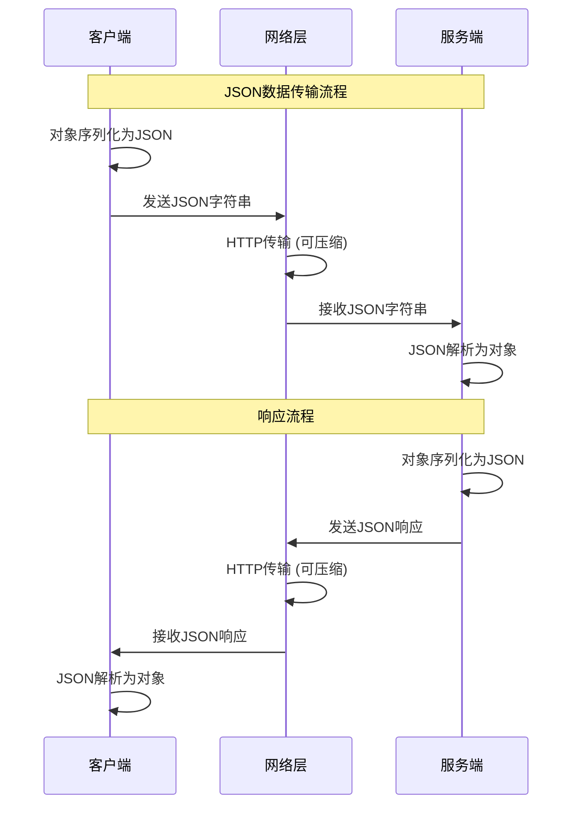

#### 3.4.2 性能特征

| 性能指标 | 特征 | 说明 |
|---------|------|------|
| **序列化速度** | 快 | 简单的字符串拼接 |
| **反序列化速度** | 中等 | 需要词法分析和语法解析 |
| **数据大小** | 中等 | 文本格式，有一定冗余 |
| **压缩效果** | 好 | 文本重复性高，压缩比好 |
| **内存占用** | 中等 | 需要完整解析到内存 |

## 4. ProtoBuf数据设计

### 4.1 ProtoBuf核心设计思想

#### 4.1.1 设计理念

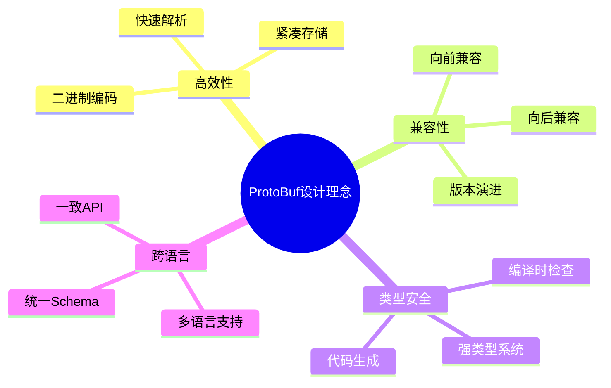

#### 4.1.2 架构设计

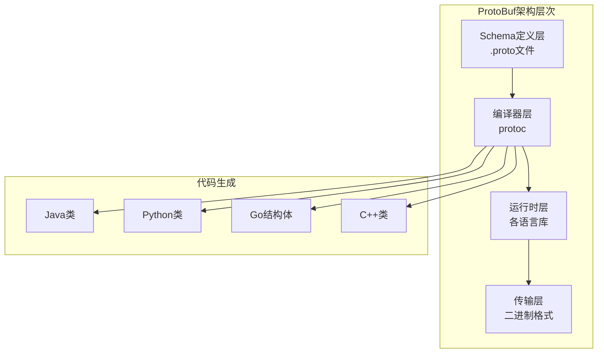

### 4.2 ProtoBuf数据定义

#### 4.2.1 Schema定义示例

```protobuf
// user.proto
syntax = "proto3";

package example;

// 用户信息
message User {
  int32 id = 1;                    // 用户ID
  string name = 2;                 // 用户名
  string email = 3;                // 邮箱
  repeated string skills = 4;       // 技能列表
  Profile profile = 5;             // 用户档案
  
  // 嵌套消息
  message Profile {
    string phone = 1;
    Address address = 2;
  }
}

// 地址信息
message Address {
  string country = 1;
  string city = 2;
  string street = 3;
  int32 zip_code = 4;
}
```

#### 4.2.2 字段编号规则

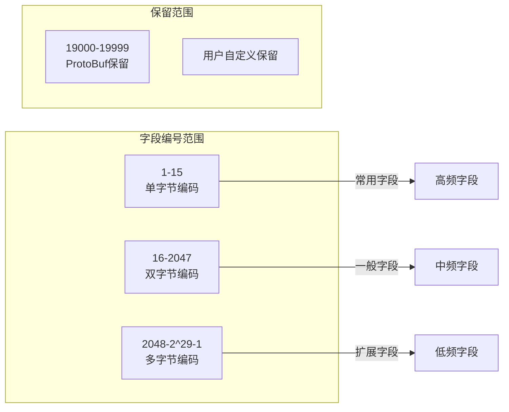

### 4.3 ProtoBuf编码原理

#### 4.3.1 Varint编码

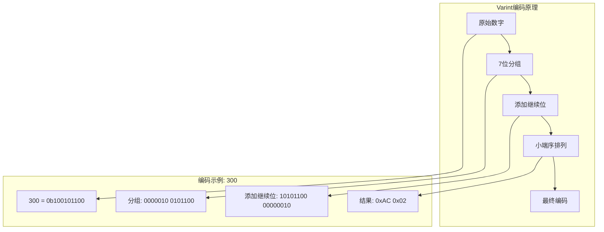

#### 4.3.2 Wire Format

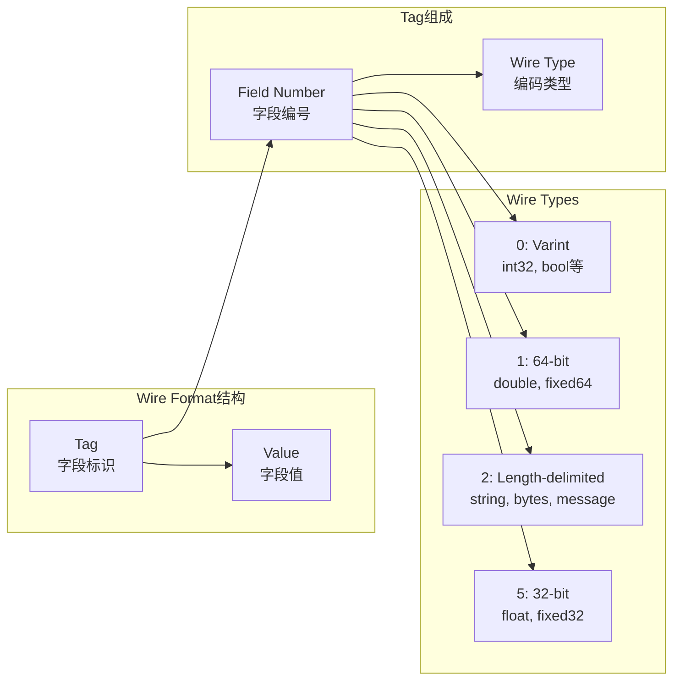

### 4.4 ProtoBuf优势分析

#### 4.4.1 性能优势

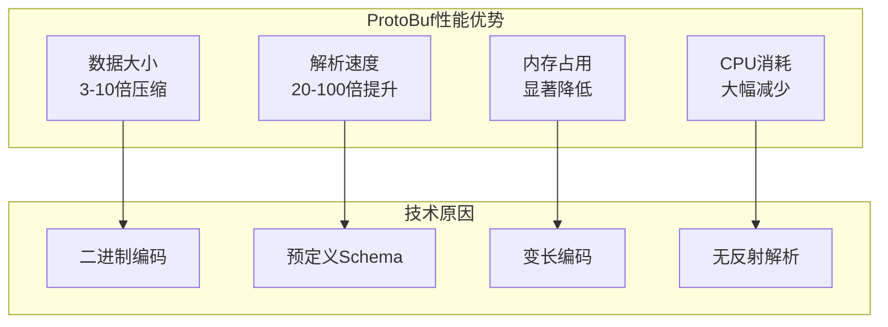

#### 4.4.2 传输效率对比

| 数据项 | JSON | ProtoBuf | 压缩比 |
|-------|------|----------|--------|
| **简单对象** | 85 bytes | 33 bytes | 2.6x |
| **复杂对象** | 450 bytes | 156 bytes | 2.9x |
| **数组数据** | 1.2KB | 380 bytes | 3.2x |
| **嵌套结构** | 2.1KB | 654 bytes | 3.2x |

## 5. XML数据设计

### 5.1 XML核心设计思想

#### 5.1.1 设计原则

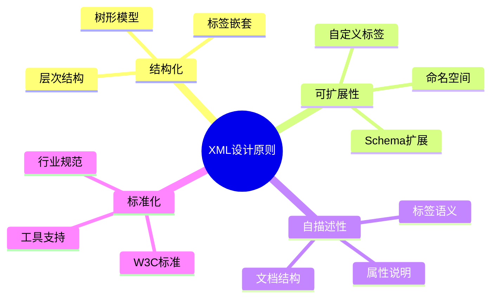

#### 5.1.2 XML文档结构

```mermaid
graph TB
    subgraph "XML文档结构"
        Declaration[XML声明<br/><?xml version="1.0"?>]
        Root[根元素<br/><root>]
        Elements[子元素<br/><element>]
        Attributes[属性<br/>attr="value"]
        Text[文本内容]
        CDATA[CDATA节]
    end
    
    Declaration --> Root
    Root --> Elements
    Elements --> Attributes
    Elements --> Text
    Elements --> CDATA
    Elements --> Elements
```

### 5.2 XML数据建模

#### 5.2.1 XML Schema设计

```xml
<?xml version="1.0" encoding="UTF-8"?>
<xs:schema xmlns:xs="http://www.w3.org/2001/XMLSchema"
           targetNamespace="http://example.com/user"
           xmlns:tns="http://example.com/user">
  
  <!-- 用户信息复杂类型 -->
  <xs:complexType name="UserType">
    <xs:sequence>
      <xs:element name="id" type="xs:int"/>
      <xs:element name="name" type="xs:string"/>
      <xs:element name="email" type="xs:string"/>
      <xs:element name="skills" type="tns:SkillsType"/>
      <xs:element name="profile" type="tns:ProfileType"/>
    </xs:sequence>
  </xs:complexType>
  
  <!-- 技能列表类型 -->
  <xs:complexType name="SkillsType">
    <xs:sequence>
      <xs:element name="skill" type="xs:string" maxOccurs="unbounded"/>
    </xs:sequence>
  </xs:complexType>
  
  <!-- 用户档案类型 -->
  <xs:complexType name="ProfileType">
    <xs:sequence>
      <xs:element name="phone" type="xs:string"/>
      <xs:element name="address" type="tns:AddressType"/>
    </xs:sequence>
  </xs:complexType>
  
</xs:schema>
```

#### 5.2.2 XML实例文档

```xml
<?xml version="1.0" encoding="UTF-8"?>
<user xmlns="http://example.com/user">
  <id>1001</id>
  <name>张三</name>
  <email>zhangsan@example.com</email>
  <skills>
    <skill>Java</skill>
    <skill>Python</skill>
    <skill>JavaScript</skill>
  </skills>
  <profile>
    <phone>13800138000</phone>
    <address>
      <country>中国</country>
      <city>北京</city>
      <street>中关村大街1号</street>
      <zipCode>100000</zipCode>
    </address>
  </profile>
</user>
```

### 5.3 XML处理模型

#### 5.3.1 DOM vs SAX

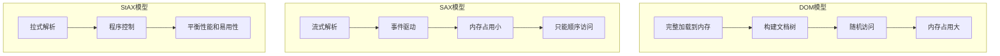

#### 5.3.2 XML解析流程

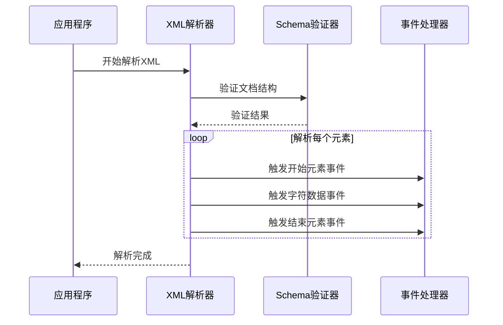

### 5.4 XML的优势与特点

#### 5.4.1 技术优势

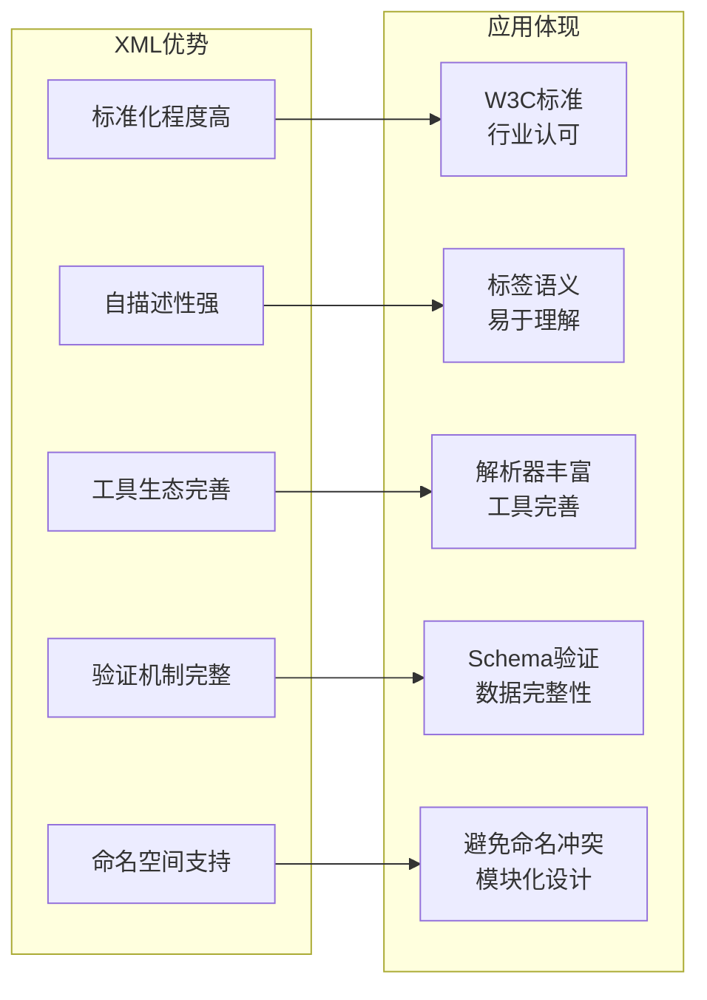

## 6. 性能深度对比

### 6.1 序列化大小对比

#### 6.1.1 测试数据结构

```javascript
// 测试用户数据
const testUser = {
  id: 1001,
  name: "张三",
  email: "zhangsan@example.com",
  age: 30,
  isActive: true,
  skills: ["Java", "Python", "JavaScript", "Go"],
  profile: {
    phone: "13800138000",
    address: {
      country: "中国",
      province: "北京市",
      city: "北京市",
      district: "海淀区",
      street: "中关村大街1号",
      zipCode: "100000"
    },
    preferences: {
      language: "zh-CN",
      timezone: "Asia/Shanghai",
      theme: "dark"
    }
  },
  metadata: {
    createdAt: "2024-01-01T00:00:00Z",
    updatedAt: "2024-01-15T12:30:00Z",
    version: 1
  }
};
```

#### 6.1.2 大小对比分析

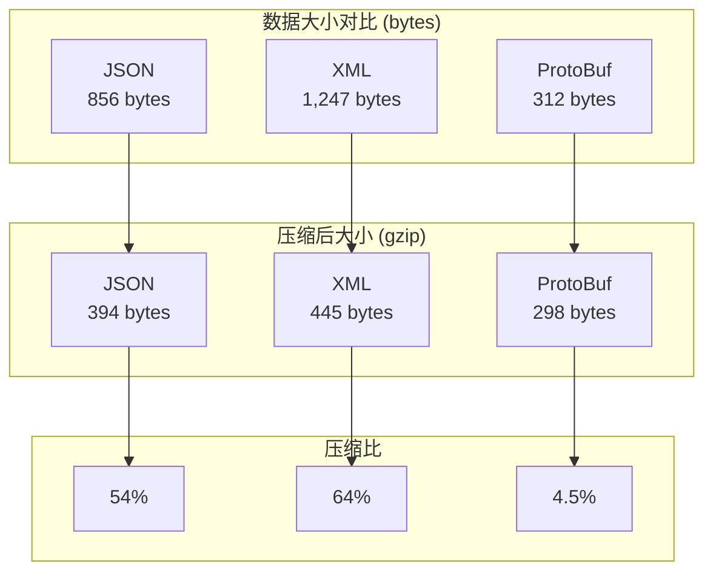

#### 6.1.3 详细大小分析

| 数据格式 | 原始大小 | 压缩后大小 | 压缩比 | 相对ProtoBuf |
|---------|---------|-----------|--------|-------------|
| **JSON** | 856 bytes | 394 bytes | 54% | 2.74x |
| **XML** | 1,247 bytes | 445 bytes | 64% | 4.00x |
| **ProtoBuf** | 312 bytes | 298 bytes | 4.5% | 1.00x |

### 6.2 解析性能对比

#### 6.2.1 性能测试场景

```mermaid
graph LR
    subgraph "测试环境"
        CPU[CPU: Intel i7-12700K]
        Memory[内存: 32GB DDR4]
        Lang[语言: Java 17]
        JVM[JVM: HotSpot]
    end
    
    subgraph "测试数据"
        Small[小数据集<br/>1KB]
        Medium[中数据集<br/>10KB]
        Large[大数据集<br/>100KB]
        Huge[超大数据集<br/>1MB]
    end
    
    subgraph "测试指标"
        SerTime[序列化时间]
        DeserTime[反序列化时间]
        Memory[内存占用]
        Throughput[吞吐量]
    end
```

#### 6.2.2 性能测试结果

```mermaid
graph TB
    subgraph "序列化性能 (ops/sec)"
        A[JSON: 45,000]
        B[XML: 12,000]
        C[ProtoBuf: 85,000]
    end
    
    subgraph "反序列化性能 (ops/sec)"
        D[JSON: 38,000]
        E[XML: 8,500]
        F[ProtoBuf: 120,000]
    end
    
    subgraph "内存占用 (MB)"
        G[JSON: 125]
        H[XML: 280]
        I[ProtoBuf: 85]
    end
    
    style C fill:#90EE90
    style F fill:#90EE90
    style I fill:#90EE90
```

#### 6.2.3 详细性能数据

| 性能指标 | JSON | XML | ProtoBuf | ProtoBuf优势 |
|---------|------|-----|----------|-------------|
| **序列化 (ops/sec)** | 45,000 | 12,000 | 85,000 | 1.9x vs JSON |
| **反序列化 (ops/sec)** | 38,000 | 8,500 | 120,000 | 3.2x vs JSON |
| **内存占用 (MB)** | 125 | 280 | 85 | 32% 节省 |
| **CPU使用率 (%)** | 15 | 35 | 8 | 47% 节省 |

### 6.3 性能影响因素分析

#### 6.3.1 序列化性能因素

```mermaid
mindmap
  root((序列化性能因素))
    数据结构
      嵌套深度
      数组大小
      字符串长度
      数据类型复杂度
    编码方式
      文本编码
      二进制编码
      压缩算法
      字符集处理
    实现质量
      算法优化
      内存管理
      缓存策略
      并发处理
    运行环境
      CPU性能
      内存大小
      JVM调优
      操作系统
```

#### 6.3.2 性能优化建议

```mermaid
graph TB
    subgraph "JSON优化"
        J1[使用流式解析]
        J2[避免深度嵌套]
        J3[合理使用压缩]
        J4[选择高性能库]
    end
    
    subgraph "XML优化"
        X1[使用SAX解析]
        X2[避免DOM加载]
        X3[简化Schema]
        X4[启用流式处理]
    end
    
    subgraph "ProtoBuf优化"
        P1[合理设计Schema]
        P2[使用字段编号优化]
        P3[避免频繁序列化]
        P4[启用代码生成优化]
    end
```

## 7. 应用场景与开发建议

### 7.1 应用场景分析

#### 7.1.1 场景适用性矩阵

```mermaid
graph TB
    subgraph "Web API"
        API1[REST API<br/>JSON推荐]
        API2[GraphQL<br/>JSON推荐]
        API3[配置文件<br/>JSON/XML]
    end
    
    subgraph "微服务通信"
        MS1[内部RPC<br/>ProtoBuf推荐]
        MS2[服务发现<br/>JSON推荐]
        MS3[配置中心<br/>JSON/XML]
    end
    
    subgraph "数据存储"
        DB1[文档数据库<br/>JSON推荐]
        DB2[配置存储<br/>XML/JSON]
        DB3[日志存储<br/>JSON推荐]
    end
    
    subgraph "移动应用"
        Mobile1[客户端通信<br/>ProtoBuf推荐]
        Mobile2[配置下发<br/>JSON推荐]
        Mobile3[离线存储<br/>ProtoBuf推荐]
    end
```

#### 7.1.2 详细场景建议

| 应用场景 | 首选格式 | 原因 | 备选方案 |
|---------|---------|------|---------|
| **Web API** | JSON | 简洁、易调试、浏览器原生支持 | XML (企业级) |
| **微服务RPC** | ProtoBuf | 高性能、类型安全、版本兼容 | JSON (简单场景) |
| **配置文件** | JSON/XML | 人类可读、工具支持好 | YAML |
| **移动端通信** | ProtoBuf | 节省流量、电池友好 | JSON (开发阶段) |
| **日志存储** | JSON | 结构化、查询友好 | 文本格式 |
| **数据交换** | XML | 标准化、验证完整 | JSON |

### 7.2 技术选型决策树

```mermaid
flowchart TD
    Start([开始选型]) --> Q1{性能要求高?}
    Q1 -->|是| Q2{需要人类可读?}
    Q1 -->|否| Q3{需要标准化?}
    
    Q2 -->|是| JSON[选择JSON<br/>性能可接受且可读]
    Q2 -->|否| ProtoBuf[选择ProtoBuf<br/>最佳性能]
    
    Q3 -->|是| Q4{复杂验证需求?}
    Q3 -->|否| JSON
    
    Q4 -->|是| XML[选择XML<br/>完整标准化]
    Q4 -->|否| JSON
    
    JSON --> End([决策完成])
    ProtoBuf --> End
    XML --> End
```

### 7.3 开发建议

#### 7.3.1 JSON开发最佳实践

```mermaid
graph LR
    subgraph "JSON最佳实践"
        A[命名规范<br/>camelCase]
        B[避免null值<br/>使用默认值]
        C[合理嵌套<br/>不超过3层]
        D[版本控制<br/>添加version字段]
        E[错误处理<br/>统一错误格式]
    end
    
    subgraph "性能优化"
        F[流式解析<br/>大数据处理]
        G[压缩传输<br/>gzip压缩]
        H[缓存策略<br/>合理缓存]
        I[批量操作<br/>减少请求次数]
    end
    
    A --> F
    B --> G
    C --> H
    D --> I
```

#### 7.3.2 ProtoBuf开发指南

```protobuf
// 最佳实践示例
syntax = "proto3";

package com.example.api.v1;  // 包名包含版本

option java_package = "com.example.api.v1";
option java_outer_classname = "UserProtos";

// 用户服务接口
service UserService {
  // 获取用户信息
  rpc GetUser(GetUserRequest) returns (GetUserResponse);
  
  // 批量获取用户
  rpc BatchGetUsers(BatchGetUsersRequest) returns (BatchGetUsersResponse);
}

// 请求消息
message GetUserRequest {
  int64 user_id = 1;                    // 使用1-15编号给常用字段
  repeated string fields = 2;           // 字段过滤
  
  reserved 3, 15, 9 to 11;             // 保留字段编号
  reserved "old_field", "deprecated";   // 保留字段名
}

// 响应消息
message GetUserResponse {
  User user = 1;
  ResponseMetadata metadata = 2;        // 元数据
}

// 用户实体
message User {
  int64 id = 1;
  string name = 2;
  string email = 3;
  
  // 使用oneof处理可选字段
  oneof contact {
    string phone = 4;
    string wechat = 5;
  }
  
  // 嵌套消息
  Profile profile = 6;
  
  // 时间戳使用google.protobuf.Timestamp
  google.protobuf.Timestamp created_at = 7;
  google.protobuf.Timestamp updated_at = 8;
}
```

#### 7.3.3 XML开发规范

```xml
<?xml version="1.0" encoding="UTF-8"?>
<!-- 使用Schema验证 -->
<users xmlns="http://example.com/users/v1"
       xmlns:xsi="http://www.w3.org/2001/XMLSchema-instance"
       xsi:schemaLocation="http://example.com/users/v1 users-v1.xsd">
  
  <!-- 使用属性存储元数据 -->
  <user id="1001" version="1" status="active">
    <name>张三</name>
    <email>zhangsan@example.com</email>
    
    <!-- 使用CDATA处理特殊字符 -->
    <description><![CDATA[
      用户描述可能包含 <特殊字符> & 符号
    ]]></description>
    
    <!-- 合理使用命名空间 -->
    <profile xmlns:p="http://example.com/profile">
      <p:phone>13800138000</p:phone>
      <p:address>
        <p:country>中国</p:country>
        <p:city>北京</p:city>
      </p:address>
    </profile>
  </user>
</users>
```

### 7.4 迁移策略

#### 7.4.1 格式迁移路径

```mermaid
graph TB
    subgraph "迁移场景"
        A[XML → JSON<br/>现代化改造]
        B[JSON → ProtoBuf<br/>性能优化]
        C[混合使用<br/>渐进迁移]
    end
    
    subgraph "迁移策略"
        D[双格式支持]
        E[版本控制]
        F[灰度发布]
        G[监控对比]
    end
    
    subgraph "风险控制"
        H[兼容性测试]
        I[性能对比]
        J[回滚机制]
        K[文档更新]
    end
    
    A --> D --> H
    B --> E --> I
    C --> F --> J
    D --> G --> K
```

#### 7.4.2 迁移时间线

```mermaid
gantt
    title 数据格式迁移时间线
    dateFormat  YYYY-MM-DD
    section 准备阶段
    需求分析          :done, req, 2024-01-01, 2024-01-15
    技术调研          :done, research, 2024-01-10, 2024-01-25
    方案设计          :done, design, 2024-01-20, 2024-02-05
    
    section 开发阶段
    Schema设计        :active, schema, 2024-02-01, 2024-02-15
    代码生成          :active, codegen, 2024-02-10, 2024-02-20
    接口适配          :adapter, 2024-02-15, 2024-03-01
    
    section 测试阶段
    单元测试          :test1, after adapter, 10d
    集成测试          :test2, after test1, 15d
    性能测试          :perf, after test2, 10d
    
    section 发布阶段
    灰度发布          :gray, after perf, 20d
    全量发布          :full, after gray, 10d
    监控优化          :monitor, after full, 30d
```

## 总结

### 核心要点回顾

1. **JSON**: 简洁易用，Web友好，适合大多数API场景
2. **ProtoBuf**: 高性能，类型安全，适合高并发微服务
3. **XML**: 标准化程度高，适合企业级和配置场景

### 选择建议

```mermaid
graph LR
    subgraph "选择原则"
        Performance[性能优先<br/>→ ProtoBuf]
        Simplicity[简洁优先<br/>→ JSON]
        Standard[标准优先<br/>→ XML]
    end
    
    subgraph "具体场景"
        WebAPI[Web API<br/>→ JSON]
        RPC[微服务RPC<br/>→ ProtoBuf]
        Config[配置文件<br/>→ JSON/XML]
        Mobile[移动端<br/>→ ProtoBuf]
    end
    
    Performance --> RPC
    Performance --> Mobile
    Simplicity --> WebAPI
    Standard --> Config
```

### 未来趋势

- **JSON**: 继续在Web领域占主导地位
- **ProtoBuf**: 在微服务和移动端应用更广泛
- **XML**: 在企业级和标准化场景保持重要地位
- **新兴格式**: MessagePack、FlatBuffers等在特定场景崭露头角

通过合理选择和使用这些数据序列化格式，可以在性能、开发效率和维护成本之间找到最佳平衡点。