# 组件化开发技术方案

## 目录
- [1. 为什么要做组件化开发？](#1-为什么要做组件化开发)
- [2. 组件化开发主要解决什么问题？](#2-组件化开发主要解决什么问题)
- [3. 从原始项目到组件化演变的过程](#3-从原始项目到组件化演变的过程)
- [4. 组件化考虑的关键问题](#4-组件化考虑的关键问题)
- [5. 组件化架构拆分设计](#5-组件化架构拆分设计)
- [6. 组件化交互与业务通信设计](#6-组件化交互与业务通信设计)
- [7. 组件化避坑指南](#7-组件化避坑指南)

---

## 1. 为什么要做组件化开发？

### 1.1 业务背景

### 1.2 组件化的价值


## 2. 组件化开发主要解决什么问题？

### 2.1 核心问题域


### 2.2 问题解决架构图


## 3. 从原始项目到组件化演变的过程

### 3.1 演进路径

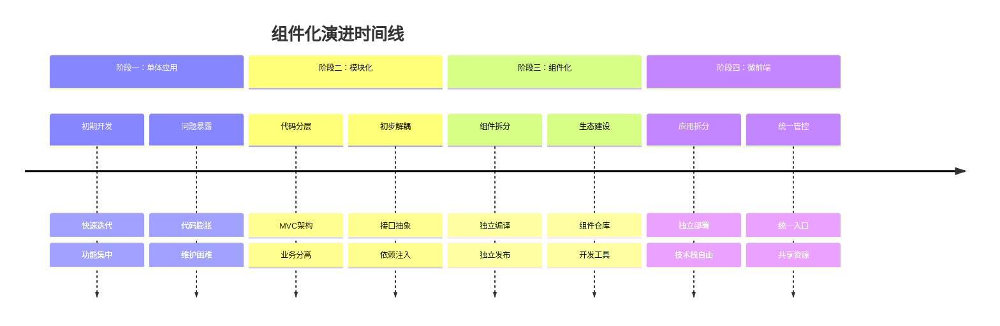

### 3.2 技术演进架构对比

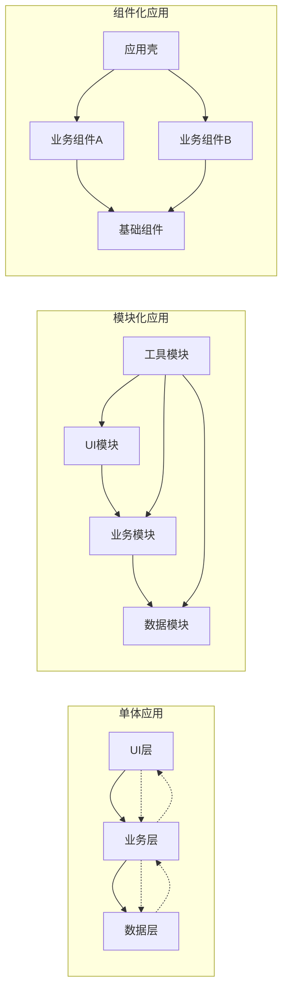

### 3.3 迁移策略

#### 3.3.1 渐进式迁移流程

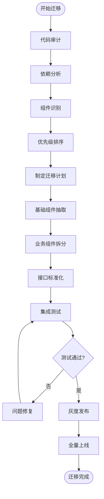

## 4. 组件化考虑的关键问题

### 4.1 代码解耦

#### 4.1.1 解耦原则
- **单一职责原则**：每个组件只负责一个特定功能
- **依赖倒置原则**：依赖抽象而非具体实现
- **接口隔离原则**：接口应该小而专一
- **开闭原则**：对扩展开放，对修改关闭

#### 4.1.2 解耦架构图

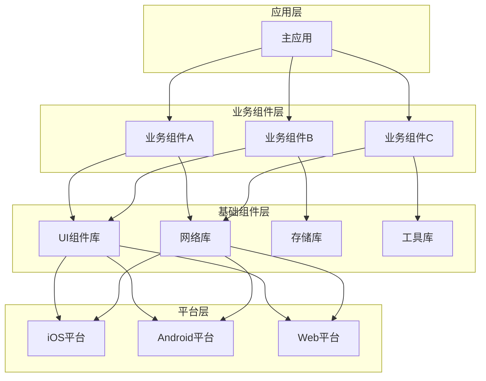

### 4.2 组件间通信

#### 4.2.1 通信方式对比

| 通信方式 | 适用场景 | 优点 | 缺点 |
|---------|---------|------|------|
| **直接调用** | 同步操作、强依赖 | 简单直接、性能好 | 耦合度高 |
| **事件总线** | 异步通知、松耦合 | 解耦彻底、扩展性好 | 调试困难、性能开销 |
| **依赖注入** | 接口调用、可测试 | 可测试性强、灵活 | 配置复杂 |
| **消息队列** | 异步处理、高并发 | 可靠性高、可扩展 | 复杂度高、延迟 |

#### 4.2.2 通信架构设计

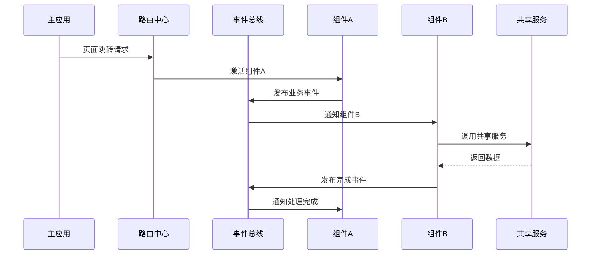

### 4.3 组件生命周期

#### 4.3.1 生命周期状态图

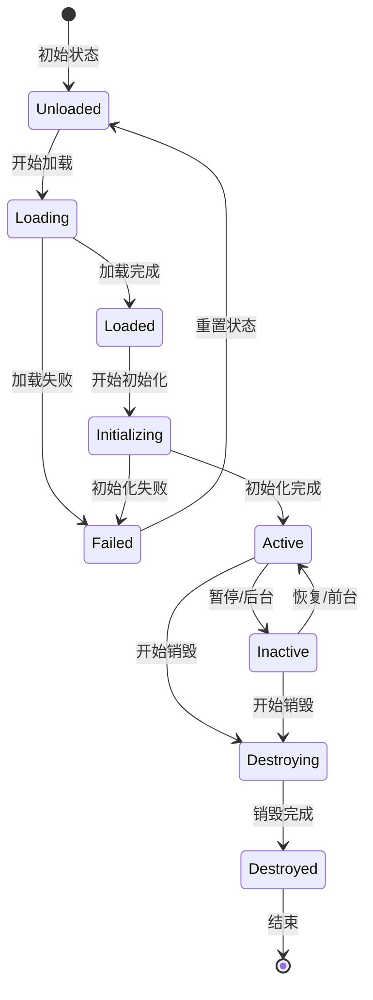

#### 4.3.2 生命周期管理

```typescript
interface ComponentLifecycle {
  // 组件加载
  onLoad(): Promise<void>;
  
  // 组件初始化
  onInit(): Promise<void>;
  
  // 组件激活
  onActive(): void;
  
  // 组件暂停
  onInactive(): void;
  
  // 组件销毁
  onDestroy(): void;
  
  // 错误处理
  onError(error: Error): void;
}
```

### 4.4 集成调试

#### 4.4.1 调试架构

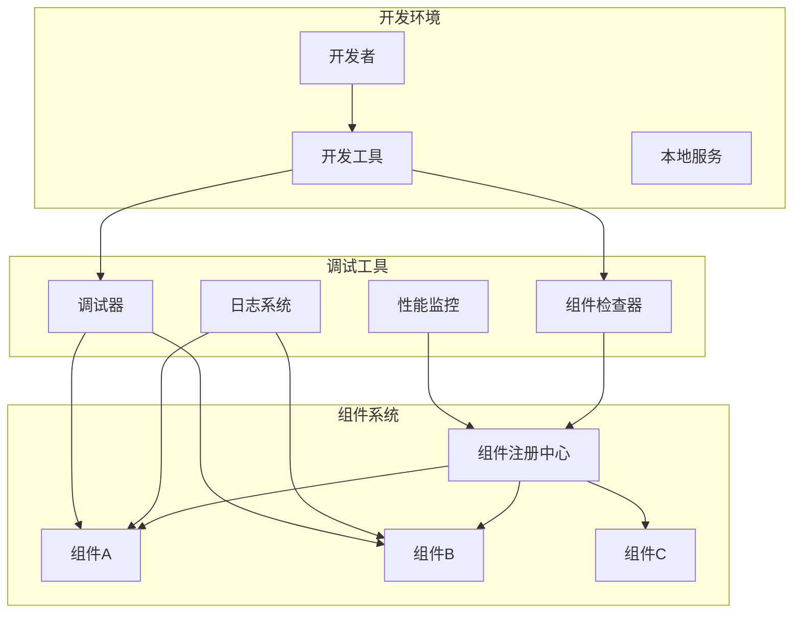

## 5. 组件化架构拆分设计

### 5.1 整体架构设计

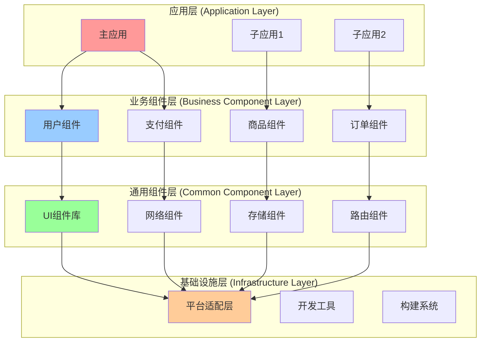

### 5.2 组件分层原则

#### 5.2.1 分层策略

| 层级 | 职责 | 特点 | 示例 |
|------|------|------|------|
| **应用层** | 业务流程编排、页面组装 | 薄层、组合性 | 主应用、微应用 |
| **业务组件层** | 具体业务逻辑实现 | 领域相关、可复用 | 用户模块、支付模块 |
| **通用组件层** | 跨业务的通用能力 | 业务无关、高复用 | UI库、网络库 |
| **基础设施层** | 平台能力、开发工具 | 平台相关、稳定 | 构建工具、平台适配 |

#### 5.2.2 依赖关系图

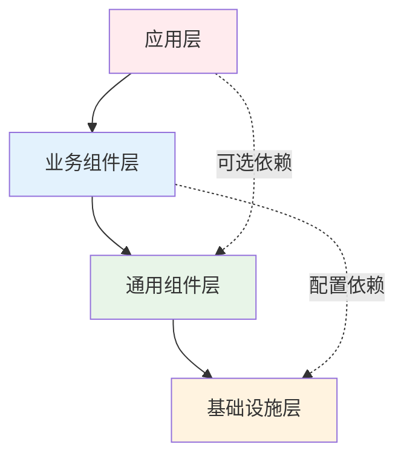

### 5.3 组件拆分策略

#### 5.3.1 拆分维度

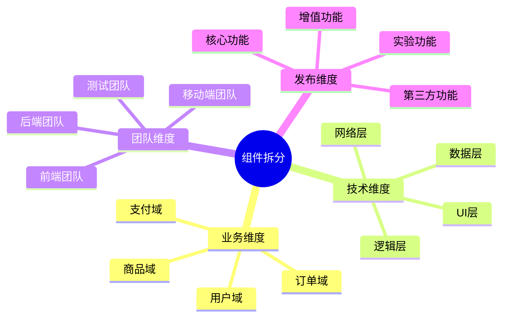

#### 5.3.2 拆分决策树

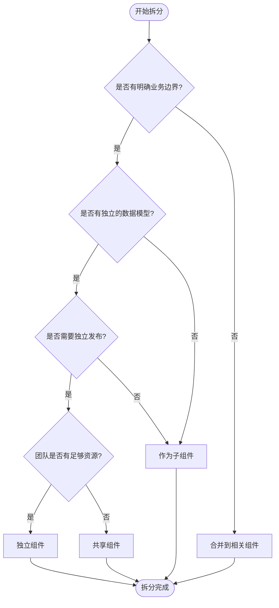

## 6. 组件化交互与业务通信设计

### 6.1 通信架构总览

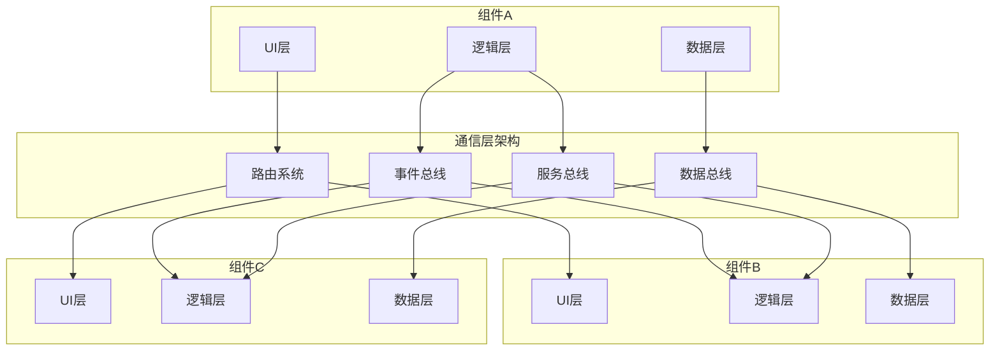

### 6.2 通信方式详解

#### 6.2.1 路由通信

```typescript
// 路由配置
interface RouteConfig {
  path: string;
  component: string;
  params?: Record<string, any>;
  meta?: Record<string, any>;
}

// 路由跳转
class Router {
  navigate(path: string, params?: any): Promise<void>;
  replace(path: string, params?: any): Promise<void>;
  goBack(): void;
  getCurrentRoute(): RouteConfig;
}
```

#### 6.2.2 事件通信时序图

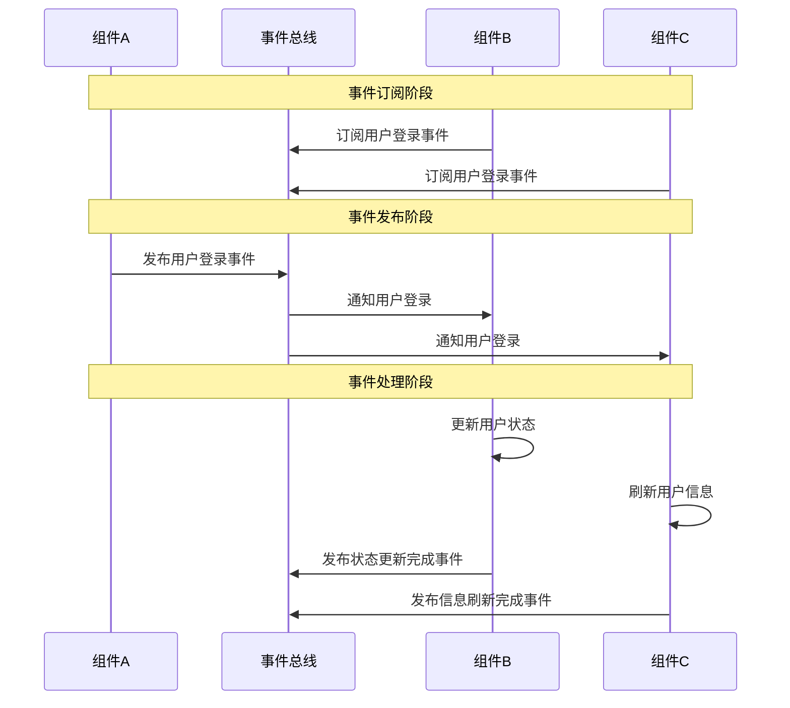

#### 6.2.3 服务通信

```typescript
// 服务接口定义
interface UserService {
  getUserInfo(userId: string): Promise<UserInfo>;
  updateUserInfo(userInfo: UserInfo): Promise<void>;
  logout(): Promise<void>;
}

// 服务注册与发现
class ServiceRegistry {
  register<T>(name: string, service: T): void;
  resolve<T>(name: string): T;
  unregister(name: string): void;
}
```

### 6.3 数据共享机制

#### 6.3.1 数据流架构

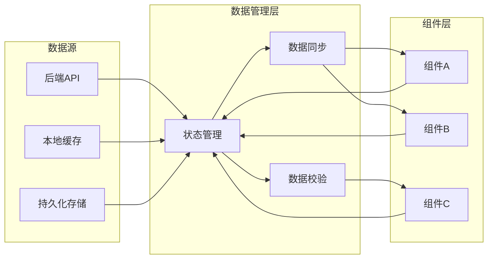

#### 6.3.2 状态管理模式

```typescript
// 状态定义
interface AppState {
  user: UserState;
  product: ProductState;
  order: OrderState;
}

// 状态管理器
class StateManager {
  private state: AppState;
  private listeners: Map<string, Function[]>;
  
  getState<T>(key: keyof AppState): T;
  setState<T>(key: keyof AppState, value: T): void;
  subscribe(key: string, listener: Function): void;
  unsubscribe(key: string, listener: Function): void;
}
```

## 7. 组件化避坑指南

### 7.1 常见问题与解决方案

#### 7.1.1 问题分类

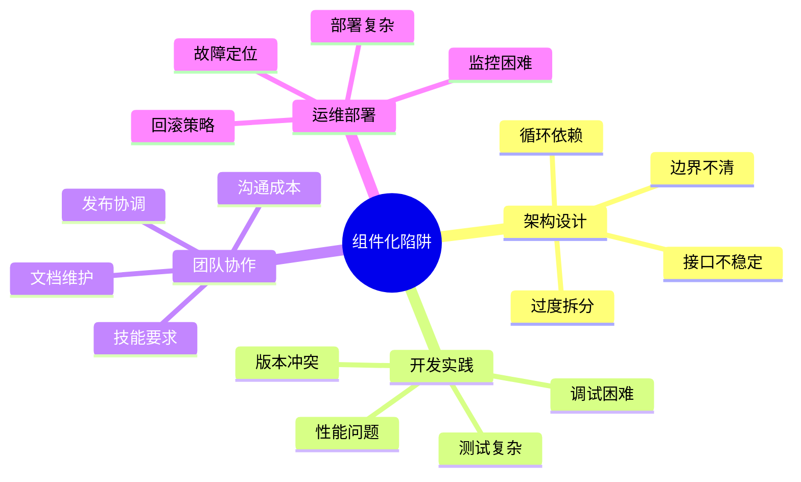

#### 7.1.2 问题解决矩阵

| 问题类型 | 具体问题 | 解决方案 | 预防措施 |
|---------|---------|---------|---------|
| **过度拆分** | 组件粒度过细 | 合并相关组件 | 制定拆分标准 |
| **循环依赖** | 组件间相互依赖 | 引入中间层 | 依赖关系检查 |
| **版本冲突** | 依赖版本不一致 | 统一版本管理 | 版本锁定机制 |
| **性能问题** | 加载时间过长 | 懒加载、预加载 | 性能监控 |
| **调试困难** | 跨组件调试复杂 | 统一调试工具 | 日志标准化 |

### 7.2 最佳实践

#### 7.2.1 设计原则

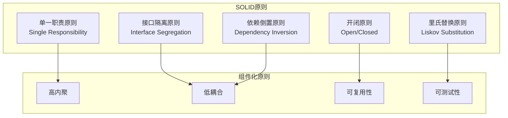

#### 7.2.2 开发规范

```typescript
// 组件接口规范
interface ComponentInterface {
  // 组件元信息
  readonly name: string;
  readonly version: string;
  readonly dependencies: string[];
  
  // 生命周期方法
  init(config: ComponentConfig): Promise<void>;
  destroy(): Promise<void>;
  
  // 对外接口
  getAPI(): ComponentAPI;
  
  // 事件处理
  on(event: string, handler: Function): void;
  off(event: string, handler: Function): void;
  emit(event: string, data: any): void;
}

// 组件配置规范
interface ComponentConfig {
  readonly id: string;
  readonly mode: 'development' | 'production';
  readonly features: Record<string, boolean>;
  readonly theme: ThemeConfig;
}
```

### 7.3 质量保障

#### 7.3.1 测试策略

```mermaid
pyramid
    title 测试金字塔
    
    section E2E测试
        用户场景测试
        集成测试
    
    section 组件测试
        组件单元测试
        组件集成测试
        API测试
    
    section 单元测试
        函数测试
        类测试
        工具测试
```

#### 7.3.2 监控体系

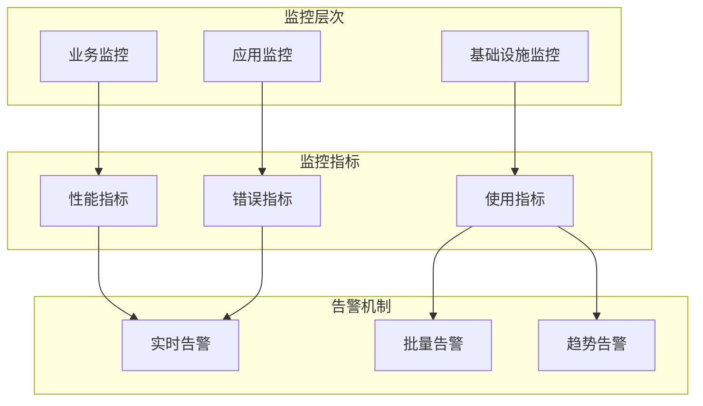

### 7.4 迁移建议

#### 7.4.1 迁移路线图

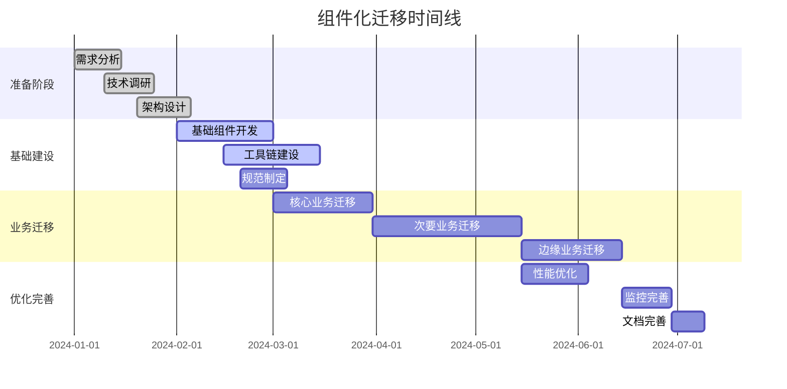

#### 7.4.2 风险控制

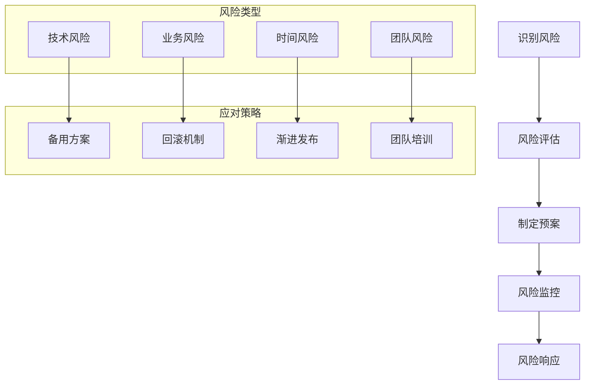

## 总结

组件化开发是现代软件工程的重要实践，通过合理的架构设计、规范的开发流程和完善的质量保障体系，可以显著提升开发效率、代码质量和团队协作效率。

### 关键成功因素

1. **明确的架构设计**：清晰的分层和边界定义
2. **标准化的开发规范**：统一的接口、编码和测试标准
3. **完善的工具链支持**：自动化的构建、测试和部署工具
4. **持续的优化改进**：基于监控数据的持续优化
5. **团队能力建设**：组件化思维和技能的培养

### 实施建议

- **循序渐进**：从简单组件开始，逐步扩展到复杂业务
- **重视基础**：优先建设基础组件和工具链
- **关注质量**：建立完善的测试和监控体系
- **团队协作**：加强跨团队沟通和协作机制
- **持续改进**：基于实践经验不断优化架构和流程

通过系统性的规划和实施，组件化开发将为项目带来长期的技术红利和业务价值。


### 01.项目整体概述
#### 1.1 项目背景说明
- APP迭代维护成本增高
    - APP版本不断迭代：新功能，业务模块数量不断增加；业务上的处理逻辑越变越复杂；同时每个模块代码也变得越来越多。这就引发问题，所维护代码成本越来越高，稍微一改动可能就牵一发而动全身，改个小的功能点就需要回归整个APP测试，这就对开发和维护带来很大的挑战。
- 多人组合需要组件化
    - APP架构方式是单一工程模式，业务规模扩大，随之带来的是团队规模扩大，每个移动端软件开发人员势必要熟悉如此之多代码，如果不按照一定的模块组件机制去划分，将很难进行多人协作开发。随着单一项目变大，在单一工程代码耦合严重，每修改一处代码后都需要重新编译打包测试，导致非常耗时。


#### 1.2 遇到问题记录
- 代码量膨胀，不利于维护和功能迭代
    - 项目工程构建速度慢，在一些电脑上写两句代码，重新编译整个项目，有的甚至更长。
- 不同模块之间代码耦合严重，有时候修改一处代码而牵动许多模块
    - 每个模块之间都有引用第三方库，但有些第三方库版本不一致，导致打包APP时候代码冗余，容易引起版本冲突。
- 代码历史遗留问题
    - 现有项目基于以前其他人项目基础上开发，经手的人次过多，存在着不同的代码风格，项目中代码规范乱，类似的功能写法却不一样，导致不统一。
- 公司有多个app项目，需要沉淀一套通用组件
    - 公司有多个app，比如都会有支付，登陆，视频播放等业务逻辑，那么组件化改造项目，刚好可以沉淀一套技术库。新开发的app也可以快速用组件搭建。


#### 1.3 基础概念介绍
- 什么是组件化呢？
    - 组件化是基于组件可重用的目的上，将一个大的软件系统按照分离关注点的形式，拆分成多个独立的组件，做到更少的耦合和更高的内聚。
- 模块化和组件化区别
    - 简单来说，组件化相比模块化粒度更小，两者的本质思想都是一致的，都是把大往小的方向拆分，都是为了复用和解耦，只不过模块化更加侧重于业务功能的划分，偏向于复用，组件化更加侧重于单一功能的内聚，偏向于解耦。


#### 1.4 开发设计目标
- 组件化的目标
    - 组件化的目标之一就是降低整体工程（app）与组件的依赖关系，缺少任何一个组件都是可以存在并正常运行的。
- 对组件化层次划分
    - 需要结构清晰，拆分粒度符合设计规范。方便迁移，按需加载。针对业务庞大，每个人员可以负责自己独立的业务组件……
- 可以做到技术沉淀
    - 比如针对功能组件，服务组件，还有基础组件，可以沉淀出来做成中台公共库。方便维护，在多个APP中可以复用组件。


#### 1.5 组件化改造阻力
- 商业化项目稳定性保证
    - 商业化项目，很强调稳定性。有些项目做了很多年，不敢轻易改动，害怕组件化改造会带来不可估量的影响和线上bug。
- 不同层人看待技术角度不同
    - 公司领导层和一线程序员存在对技术不同想法。开发想着如何用一些新技术去改造项目提升自己技术能力；领导想着技术是偏下游，确保稳定性，如何提升业务收益。
- 改造收益比较难衡量
    - 改造项目对程序员来说，提高了架构设计能力，能够有一些技术上沉淀。但是对于公司，考虑好具体的收益再做改造决定吧，


#### 1.6 组件化收益分析
- 提高效率，代码解耦
    - 通过组件化的解耦，降低各个组件之间的相互依赖，使每个组件都是高内聚低耦合的状态。各个程序员负责维护自己模块，单独某个组件的修改不会对其它组件有重大影响，提高维护性！
- 功能库下沉快速复用
    - 每个单独的组件就是一个单一功能，对于业务线的开发团队来说，通过直接使用组件快速完成功能开发，同时减少了重复的开发工作量。


### 02.组件化演变架构图
#### 2.1 以前App说明
- 传统APP架构图
    - 
- 存在的问题
    - 单一工程模型下的业务关系，总的来说就是：你中有我，我中有你，相互依赖，无法分离，多个开发代码越维护越臃肿，耦合严重。如下图：
    - 


#### 2.2 现在App架构图
- 按照不同层级架构图
    - 


### 03.组件化实践的步骤
#### 3.1 组件化考虑问题
- 考虑的问题：分而治之，并行开发，一切皆组件。要实现组件化，无论采用什么样的技术方式，需要考虑以下方面问题：
- 代码解耦：对已存在的项目进行模块拆分，模块分为两种类型，一种是作为依赖库对外提供；另一种是业务组件模块，专门处理业务逻辑等功能，这些业务组件模块最终负责组装APP。
- 组件间通信：页面跳转可以使用路由；业务组件业务调用可以采用SPI或者接口反射
- 组件生命周期：组件是否可以做到按需、动态使用、因此就会涉及到组件加载、卸载等管理问题。
- 集成调试：在开发阶段如何做到按需编译组件？一次调试中可能有一两个组件参与集成，这样编译时间就会大大降低，提高开发效率。
- 告别结构臃肿：让各个业务变得相对独立，业务组件在组件模式下可以独立开发，而在集成模式下又可以变为AAR包集成到“APP壳工程”中，组成一个完整功能的 APP。


#### 3.2 组件化架构拆分
- 主工程(壳工程代码，多favor，debug助手等)：
    - 除了一些全局配置和主 Activity 之外，不要包含太多的业务代码。有的也叫做空壳app，主要是依赖业务组件进行运行。
- 业务组件(主要是业务层拆分的组件)：
    - 最上层的业务，每个组件表示一条完整的业务线，彼此之间互相独立。原则上来说：各个业务组件之间不能有直接依赖！对于测试的时候，需要依赖多个业务组件的功能进行集成测试的时候。可以使用app壳进行多组件依赖管理运行。
- 功能组件(分为服务组件和中台组件)：
    - 该案例中分为，登录注册组件，分享组件，支付组件，Hybrid组件等等。同时注意，可能会涉及多个业务组件对某个功能组件进行依赖！
- 基础组件(分为工具组件和视图组件，这部分完全和业务无关)：
    - 支撑上层业务组件运行的基础业务服务。此部分组件为上层业务组件提供基本的功能支持。基础组件库中主要有，网络请求，图片加载，通信机制，工具类，自定义控件等等。
- 这样拆分的目的
    - 架构分层将模块化带来的网状依赖结构改造成树状依赖结构(上层依赖下层)，降低了依赖的复杂度，保障各层之间的依赖不劣化。


#### 3.3 架构设计的出发点
- 思考一下为何要做架构，做架构目的是什么
    - 举个例子，MVP特别流行，MVP的好处就是降低耦合，降低后续维护成本，但事实上，用了MVP后，代码极度膨胀，新增了很多类，代码可读性也差，读代码在一大堆presenter中迷失，想想，这样做维护成本是否真的降低了？
- 移动端架构 = 业务架构（模块化/组件化） + 技术架构（分层）
    - 提高程序性能和可扩展性，降低后续的维护成本；架构设计的目标是解决当前项目的痛点，如果当前项目没有痛点，那就先别进行架构设计了。
- 架构设计要以实用为目的，架构设计有一些基本原则
    - 1、合适优于领先。适合自己当前业务的就好，不要总想搞领先的架构；2、简单优于复杂。架构设计也是一样，越简单的架构越牛逼；3、演进优于一步到位，架构设计优先解决当下的问题。
    - 这三个原则也是有优先级的，具体是：合适优于先进 > 演化优于一步到位 > 简单优于复杂。合适也就是适应当前需要是首位的，连当前需求都满足不了谈不到其他，然后不断演进，最后精简代码。


### 04.组件化是如何交互
#### 4.1 组件初始化功能
- 有些组件有在应用启动时初始化服务的需求时，通过自定义生命周期框架进行实现初始化任务依赖和先后顺序的管理。


#### 4.2 组件间页面跳转
- 这是组件化工程模型下的业务关系，业务之间将不再直接引用和依赖，而是通过“路由”这样一个中转站间接产生联系。推荐使用的阿里开源的路由框架。


#### 4.3 组件间业务通信
- 不同模块业务调用场景【针对平级组件而言】
    - A 首页模块，B 设备模块需要调用 C 个人中心模块某一个功能(比如选择用户功能)；C 模块又要调用A 模块中版本更新业务
- 有哪些方式可以实现业务通信
    - 方案1：A 模块直接依赖 C 模块，然后直接调用即可，这样不友好，破坏了组件的隔离。
    - 方案2：接口 + 实现类 + 反射。在A，B，C都依赖的接口层定义接口，在各自自己模块写实现类，利用反射的方式调用。注意避免反射混淆了类名！
    - 方案3：SPI(还是通过接口依赖方式去通信)，其实实质还是反射，用起来非常顺手。


#### 4.4 业务耦合逐渐劣化
- 随着时间的推移，各个业务线的代码边界会像组件化之前的主工程一样逐渐劣化，耦合会越来越严重。
    - 第一种解决方式：使用 sourceSets 的方式将不同的业务代码放到不同的文件夹，但是 sourceSets 的问题在于，它并不能限制各个 sourceSet 之间互相引用，所以这种方式并不太友好！
    - 第二种解决方式：下沉，抽取需求为共同类，通过不同组件传值而达到调用关系，这样只需要改工具类即可改需求。但是这种只是符合需求一样，但是用在不同模块的场景。


### 05.组件化避坑的指南
#### 5.1 避免组件依赖恶化
- 分层架构，技术人员定义了每一层组件的依赖规范。
    - 主要是以防止不合理的循环依赖，保证整体依赖不劣化。在分层依赖规范中，高层可以依赖低层、实现可以依赖接口，接口层没有依赖，且优先以前向声明为主。
- 避免业务公共组件不断下沉导致臃肿
    - 比如有首页，订单，视频，个人中心，设备等不同业务组件，一般利用到一些公共布局或资源，会往公共common组件下沉。要避免过渡下沉造成公共common库臃肿！


#### 5.2 组件化时资源名冲突
- 资源名冲突有哪些？
    - 比如，color，shape，drawable，图片资源，布局资源，或者anim资源等等，都有可能造成资源名称冲突。这是为何了，有时候大家负责不同的模块，如果不是按照统一规范命名，则会偶发出现该问题。
    - 尤其是如果string， color，dimens这些资源分布在了代码的各个角落，一个个去拆，非常繁琐。其实大可不必这么做。因为android在build时，会进行资源的merge和shrink。res/values下的各个文件（styles.xml需注意）最后都只会把用到的放到intermediate/res/merged/../valus.xml，无用的都会自动删除。并且最后我们可以使用lint来自动删除。所以这个地方不要耗费太多的时间。
- 解决办法
    - 这个问题也不是新问题了，第三方SDK基本都会遇到，可以通过设置 resourcePrefix 来避免。设置了这个值后，你所有的资源名必须以指定的字符串做前缀，否则会报错。但是 resourcePrefix 这个值只能限定 xml 里面的资源，并不能限定图片资源，所有图片资源仍然需要你手动去修改资源名。
- 个人建议
    - 将color，shape等放到基础库组件中，因为所有的业务组件都会依赖基础组件库。在styles.xml需注意，写属性名字的时候，一定要加上前缀限定词。假如说不加的话，有可能会在打包成aar后给其他模块使用的时候，会出现属性名名字重复的冲突。


#### 5.3 关于依赖优化记录
- 查看依赖树，在项目根目录下执行如下命令，将依赖导出到文件：
    ``` java
    ./gradlew app:dependencies > log_depend.txt
    ```
- implementation：
    - 只能在内部使用此模块，比如我在一个library中使用implementation依赖了gson库，然后我的主项目依赖了library，那么，我的主项目就无法访问gson库中的方法。这样的好处是编译速度会加快，推荐使用implementation的方式去依赖
- compile（api）
    - 这种是我们最常用的方式，使用该方式依赖的库将会参与编译和打包。
- compileOnly
    - 使用场景：有多个library，只要确保有一个module中该依赖能参与到打包即可，其他的可以使用compileOnly。运行时不需要，例如仅源代码注解或注释处理器


### 06.公共基础库的介绍
#### 6.1 公共组件层概括
- 组件化开发中基础公共库，activity栈管理；Log日志；通用缓存库(支持sp，mmkv，lru，disk等多种存储方式切换)；App重启；通用全面的工具类Utils；通用基类fragment；Vp库；通用接口层；intent内容打印到控制台库；加解密库；file文件管理；通用Utils库。
    - 


#### 6.2 公共组件说明
|公共基础库地址|库说明|功能介绍|
|--  |--  |--  |
|[ActivityManager]() | Activity任务栈管理 |轻松和完全解耦合式管理activity栈操作 |
|[AppStatusLib]() | 常见广播监听库 | 可以全局监听电量，蓝牙，gps，网络，屏幕，Wi-Fi等状态 |
|[ToolUtilsLib]() | 常用基础工具类 | 大量工具库相关utils代码，可以节省开发时间 |
|[ApplicationLib]() | application初始化 | 用于组件化中application初始化操作库 |
|[ParallelTaskLib]() | app任务启动神器 | 有向无环图，简介版本的启动优化策略task库 |
|[AppBaseStore]() | 通用存储库 | 支持sp，mmkv，lru，disk，map多种缓存，统一api调用 |
|[BaseClassLib]() | 基础base类 | 主要是四大组件，fragment等相关的包装类 |
|[ReflectionLib]() | 反射工具库 | 提高反射调用，一行代码即可，增强反射的开发效率 |
|[AppLogLib]() | 简易版本log | 简单版本log日志工具库，可以自由灵活实现日志记录 |
|[AppRestartLib]() | app重启动库 | 使用闹钟，service，清单等多种方式重新启动app |
|[SafeIntentLib]() | intent打印库 | 支持intent，Bundle数据完整信息输出到控制台 |
|[ArchitectureLib]() | jitpack库 | 待完善中 |
|[FragmentManager]() | Fragment生命周期监听 | 支持多activity的子fragment的周期监听 |
|[ToolFileLib]() | File文件工具库 | 字节流，字符流，高效流读和写文件操作库 |
|[EventUploadLib]() | 异常&事件&日志上报库 | 辅助基础和功能组件的日志，异常和埋点上报接口库 |
|[AppCommonInter]() | 基础接口库 | 用于基础组件中异常降级，日志，异常等接口调用  |
|[AppPermission]() | 简单的权限库 | 用于权限判断，申请以及回调相关处理库 |
|[AppLruDisk]() | Lru磁盘缓存  | Lru淘汰算法磁盘缓存库，写入file文件。基础工具库 |
|[AppLruCache]() | Lru内存缓存 | Lru淘汰算法内存缓存库，写入到map集合中 |
|[BaseVpAdapter]() | Vp，Vp2适配器库  | 主要是针对vp控件adapter的简单封装 |


### 07.功能组件库的介绍
#### 7.1 功能组件层概括
- 组件化初始化：https://github.com/bingoogolapple/AppInit

#### 7.2 功能组件说明
|功能组件库地址|库说明|功能介绍|
|--  |--  |--  |
|[ZxingServerLib]() | 二维码扫描库 | 用于二维码扫描识别的基础功能 |
|[ZXingCodeLib]() | 二维码生成库  | 用于生成二维码的基础库 |
|[SerialTaskLib]() | 串行线程任务管理库  | 用于串行线程任务执行策略的task管理库 |
|[LocaleHelperLib]() | 国际化locale库 | 国际化业务locale管理库 |
|[CountTimerLib]() | 倒计时器库 | 用于倒计时时间工具库 |
|[AppTraceTool]() | Trace工具库 |  |
|[LongAliveLib]() | 保活库 |  |
|[ThreadPoolLib]() | 线程池封装库  | 各种线程池案例封装库 |
|[AutoCloserLib]() | 推到后台杀死app库 | 推到后台n时间后自动杀死app应用进程 |
|[AppProcessLib]() | 前后台监听库 | 用于判断前后台状态，监听前后台切换的库 |
|[EasyExecutor]() | 轻量级线程池库 | 轻量级线程池封装库，简易好用 |
|[ThreadDebugLib]() | 线程debug工具 | 线程debug工具库 |
|[NtpTimeLib]() | Ntp国际时间校验库  | 主要是用于智能设备时间校验库  |
|[AppUpdateLib]() | App版本更新库  | App版本更新，可以设置强制更新，普通更新 |


### 08.服务组件库的介绍
|服务组件库地址|库说明|功能介绍|
|--  |--  |--  |
|[ImageServer]() | 图片压缩库  | 图片经典压缩库，高度压缩图片质量库 |
|[OkHttpServer]() | 网络请求库  | 简单对okhttp网络请求封装版本的网络库 |
|[ShareServer]() | 本地分享工具库  | 调用本地分享，可以分享图片，文件等等 |
|[NfcServer]() | NFC封装库  | 智能设备之间关于nfc通信交互的简单封装库 |
|[GsonServer]() | 解析容错框架  | 解析gson数据容错框架，主要是对后台返回json数据实体偶发类型匹配错误校验 |
|[IpcServer]() | IPC进程通信库  |  |
|[EasyBleServer]() | 简单蓝牙库  | 蓝牙链接和配对，数据传递的简易版本封装库 |
|[LogUpload]() | 日志上报库  | 支持上传本地路径日志文件到服务端，支持前后台上传和配置重试 |
|[PrivateServer]() | 隐私合规API库  |  |
|[NetInterceptor]() | 网络日志拦截器  | 网络日志拦截器，可以打印完整json内容输出到控制台 |
|[GlideProgressLib]() | Glide加载进度库   | 替换请求拦截即监听glide加载图片百分比进度 |
|[CompressServer]() | 图片加载库  | 简易版本图片压缩库 |
|[BellsVibrations]() | 铃声和震动库  | 一键可以设置铃声，设置手机震动和调整声音的库 |


### 09.项目稳定性的实践
#### 9.1 项目稳定性背景
- 引用一句对系统稳定性的定义：
    - 系统稳定性指系统要素在外界影响下表现出的某种稳定状态。
- 对于客户端来说，从 App 的使用者和开发者这两个角度来说，稳定性的含义有所不同：
    - 对于用户，稳定性意味着：使用 App 的过程中不崩不卡，能正常提供用户所需的服务，出现异常情况时引导合理，提示友好。
    - 对于开发者，稳定性意味着：线上整体性能指标达标，核心业务链路稳定不出错，非核心业务异常时有出口、可降级。
- 因此应用的稳定性可以分为三个纬度，如下所示：
    - 1、Crash纬度：最重要的指标就是应用的Crash率。
    - 2、性能纬度：包括启动速度、内存、绘制等等优化方向，相对于Crash来说是次要的，但也是应用稳定性的一部分。
    - 3、业务高可用纬度：它是非常关键的一步，我们需要采用多种手段来保证我们App的主流程以及核心路径的稳定性。


#### 9.2 稳定性建设实践
- 事前预警
    - 监控触发报警 -> 有充足时间应对。（可以采用三方平台配置报警机制）
    - 分层监控：系统级监控、性能指标监控、业务监控、健康度分析（指标变化趋势）
    - 监控曲线：根据业务流程监控，以识别出现问题的环节
- 事故处理
    - 第一原则：及时止损；因发版导致的问题，则及时回滚
    - 限流：防刷、等待+限时、轮训改为长链接（白名单放过关键路径，如支付）
    - 保护用户体验：客户端配合降级；力保关键路径：非关键路径模块降级
- 事后总结
    - 必须找到根源：采用 5whys 分析方法从现象开始追踪到最根本的原因
    - 核算造成的损失：计算稳定性
    - 事故总结，如何优化：系统改进、流程改进、开发红线
    - 总结的意义：看到问题，采取措施，以便在将来再次遇到问题时处理地更快更好
- 稳定性建设架构图
    - 


### 10.项目诊断工具开发
#### 10.1 为何需要诊断工具


#### 10.2 诊断工具分类说明
|工具库地址|库说明|功能介绍|
|--  |--  |--  |
|[MonitorPrivacy]()| 隐私合规检查 | 使用hook技术检测隐私合规api的调用堆栈 |
|[MonitorFileLib]()| 磁盘查看工具 | |
|[MonitorNetLib]()| 网络抓包工具 | |
|[MonitorCrashLib]()| 崩溃拦截工具 | |
|[MonitorInterceptor]()| 弱网模拟工具 | |
|[MonitorCatonLib]()| 卡顿检测工具 | |
|[MonitorPingLib]()| Ping域名工具 | |
|[MonitorFpsLib]()| Fps检查工具 | |
|[MonitorAnrLib]()| ANR检测工具 | |
|[LeakCanarySdk]()| 内存泄漏工具 | |
|[MonitorSpeed]()| 流量测速工具 | |
|[MonitorXposed]()| Xposed检测 | |
|[MonitorPhone]()| App信息工具 | |


### 11.遇到的问题点记录


### 12.其他介绍
#### 12.1 其他内容介绍


#### 12.2 一些技术流程
- 存在问题如下所示
    - 流程混乱，把关不严：缺乏设计、闷头开发、收益质量得不到保障。需要有标准化流程托底。
- 技术库标准化实践流程图
    - 
- 技术库收益总结分析
    - 有什么收益：主要是解决了什么问题，给项目带了什么收益。让代码更简洁，让功能更加高效，还是其他？
    - 具有衡量数据：优化了什么，效率对比数据分析，内存优化前后数据对比等等，必须要有具体的衡量数据……
    - 有哪些问题待解决：遗留了哪些问题，为什么，后期是否有排期如何去优化？


#### 12.3 其封装库推荐
|工具库地址|库说明|功能介绍|
|--  |--  |--  |
|[YCWebView](https://github.com/yangchong211/YCWebView)| WebView封装库 | 基于腾讯x5开源库，提高webView开发效率，大概要节约你百分之六十的时间成本。 |
|[YCCommonLib](https://github.com/yangchong211/YCCommonLib)| App组件基础库  | 组件化开发中基础公共库，为App开发提高组件通用性 |
|[YCAndroidTool](https://github.com/yangchong211/YCAndroidTool)| 测试工具库 | 用于项目测试，崩溃重启操作，崩溃记录日志，网络拦截查看，统计耗时，ping相关工具 |
|[YCBlogs](https://github.com/yangchong211/YCBlogs)| 博客大汇总 | 技术博客大汇总，所有博客会同步到该库中 |
|[YCThreadPool](https://github.com/yangchong211/YCThreadPool)| 轻量级异步线程池 | 轻量级简易线程池库，轻量级线程池异步库，支持线程执行过程中状态回调监测 |
|[YCDialog](https://github.com/yangchong211/YCDialog)| 弹窗封装库 | 自定义Toast；自定义dialog控件；自定义DialogFragment弹窗；自定义PopupWindow弹窗；还有自定义Snackbar等等 |
|[YCVideoPlayer](https://github.com/yangchong211/YCVideoPlayer)| 通用音视频播放器 | 播放器内核(自由切换) + 视频播放器 + 边播边缓存 + 高度定制播放器UI视图层 |
|[YCScrollPager](https://github.com/yangchong211/YCScrollPager)| 滑动视频库 | 仿抖音，快手，短视频，竖直方向，一次滚动一个页面的封装库。 |
|[YCStateLayout](https://github.com/yangchong211/YCStateLayout)| 状态管理器库 | 状态切换，让View状态的切换和Activity彻底分离开。用builder模式来自由的添加需要的状态View |
|[YCNotification](https://github.com/yangchong211/YCNotification)| 通知栏封装库 | 通知栏封装库，强大的通知栏工具类，链式编程调用 |


#### 12.4 勘误及提问
- 如果有疑问或者发现错误，可以在相应的 issues 进行提问或勘误。
- 如果喜欢或者有所启发，欢迎star，对作者也是一种鼓励。转载麻烦注明出处。请挂上“潇湘剑雨”的小名！


#### 12.5 关于LICENSE
- 如下所示
    ``` java
    Copyright 2017 yangchong211（github.com/yangchong211）
    
    Licensed under the Apache License, Version 2.0 (the "License");
    you may not use this file except in compliance with the License.
    You may obtain a copy of the License at
    
       http://www.apache.org/licenses/LICENSE-2.0
    
    Unless required by applicable law or agreed to in writing, software
    distributed under the License is distributed on an "AS IS" BASIS,
    WITHOUT WARRANTIES OR CONDITIONS OF ANY KIND, either express or implied.
    See the License for the specific language governing permissions and
    limitations under the License.
    ```


