# 通用架构设计方案

## 目录
1. [为什么要做架构设计](#1-为什么要做架构设计)
2. [架构设计核心思想](#2-架构设计核心思想)
3. [架构设计通用能力与分层](#3-架构设计通用能力与分层)
4. [架构演变过程](#4-架构演变过程)
5. [架构设计注意事项](#5-架构设计注意事项)
6. [现代架构设计实践](#6-现代架构设计实践)
7. [总结与建议](#7-总结与建议)

---

## 1. 为什么要做架构设计

### 1.1 架构设计解决的核心问题


### 1.2 没有架构设计的问题


### 1.3 架构设计的价值


### 1.4 架构的必要性


---

## 2. 架构设计核心思想

### 2.1 架构设计的基本原则

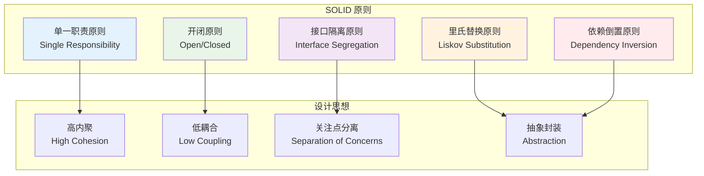

### 2.2 架构设计的核心理念

#### 2.2.1 分层思想

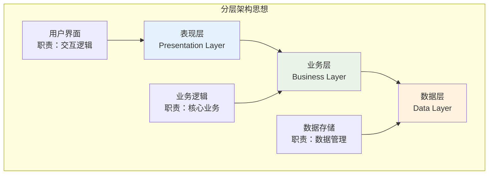

#### 2.2.2 模块化思想

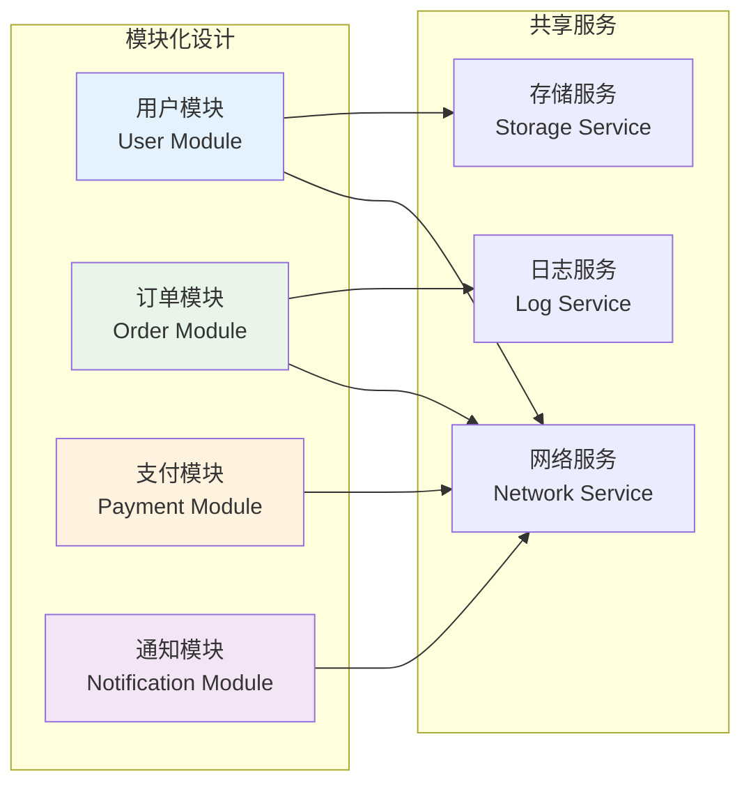

### 2.3 架构设计的思维模型

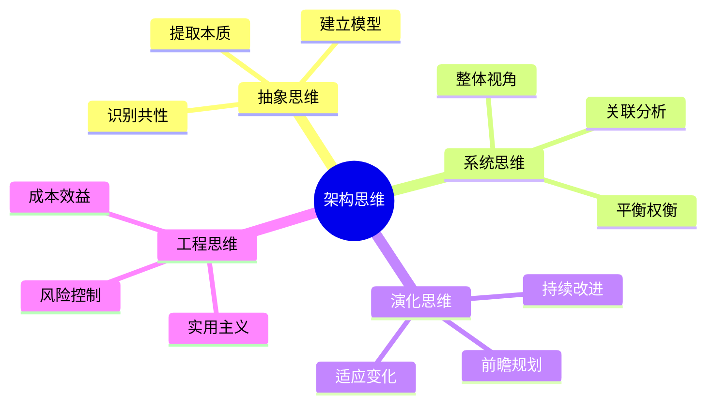

---

## 3. 架构设计通用能力与分层

### 3.1 通用架构分层模型

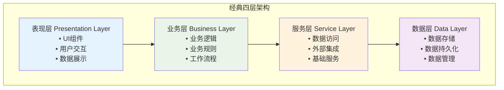

### 3.2 跨平台通用架构

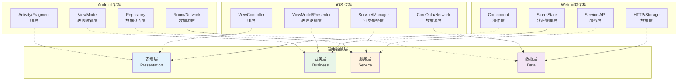

### 3.3 架构分层的通用思想

#### 3.3.1 分层原则

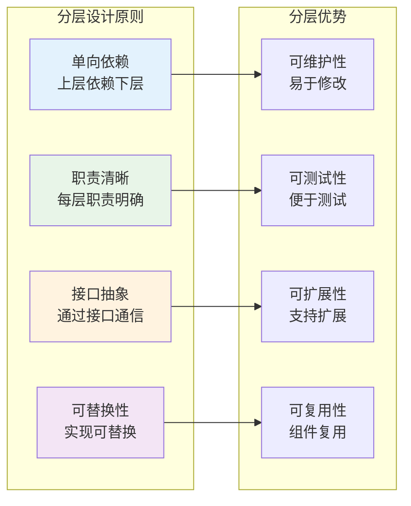

#### 3.3.2 通用能力抽象

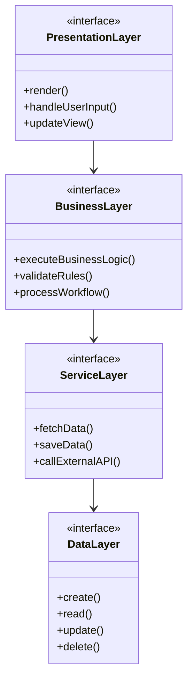

---

## 4. 架构演变过程

### 4.1 MVC 架构

#### 4.1.1 MVC 核心思想

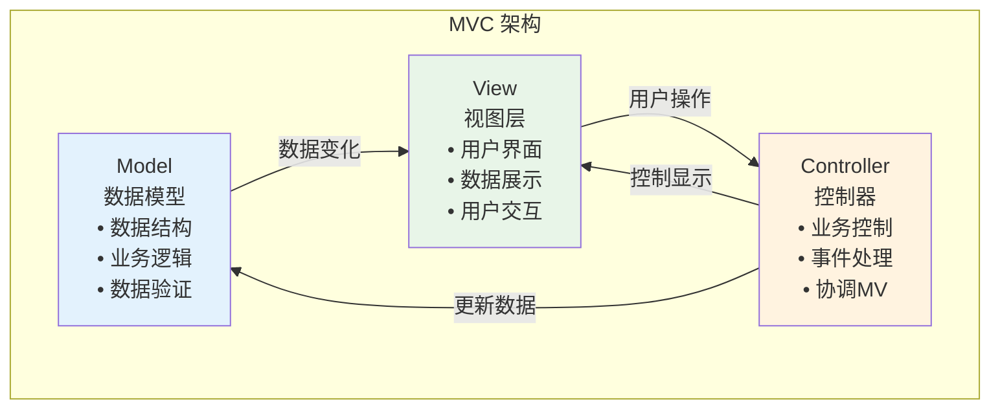

#### 4.1.2 MVC 实现案例

```typescript
// Model - 数据模型
class UserModel {
  private users: User[] = [];
  private observers: Observer[] = [];
  
  addUser(user: User) {
    this.users.push(user);
    this.notifyObservers();
  }
  
  getUsers(): User[] {
    return this.users;
  }
  
  // 观察者模式，通知视图更新
  addObserver(observer: Observer) {
    this.observers.push(observer);
  }
  
  private notifyObservers() {
    this.observers.forEach(observer => observer.update());
  }
}

// View - 视图层
class UserView implements Observer {
  constructor(private model: UserModel) {
    this.model.addObserver(this);
  }
  
  render() {
    const users = this.model.getUsers();
    // 渲染用户列表
    console.log('渲染用户列表:', users);
  }
  
  update() {
    this.render(); // 数据变化时重新渲染
  }
}

// Controller - 控制器
class UserController {
  constructor(
    private model: UserModel,
    private view: UserView
  ) {}
  
  handleAddUser(userData: UserData) {
    // 数据验证
    if (this.validateUser(userData)) {
      const user = new User(userData);
      this.model.addUser(user);
    }
  }
  
  private validateUser(userData: UserData): boolean {
    // 验证逻辑
    return userData.name && userData.email;
  }
}
```

#### 4.1.3 MVC 优缺点分析

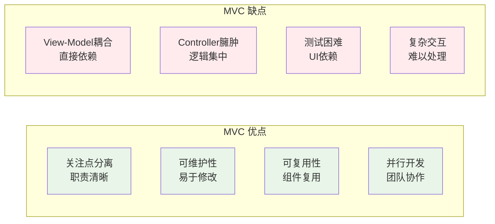

### 4.2 MVP 架构

#### 4.2.1 MVP 核心思想

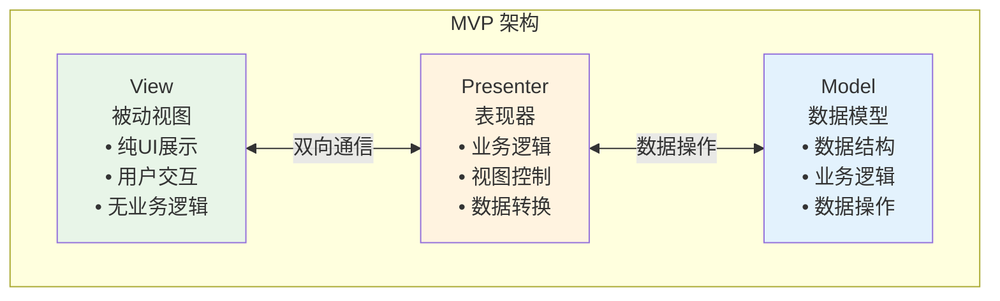

#### 4.2.2 MVP 实现案例

```typescript
// Model - 数据模型（与MVC相同）
class UserModel {
  async fetchUsers(): Promise<User[]> {
    // 从API获取用户数据
    return await api.getUsers();
  }
  
  async saveUser(user: User): Promise<boolean> {
    // 保存用户数据
    return await api.saveUser(user);
  }
}

// View 接口 - 定义视图契约
interface IUserView {
  showUsers(users: User[]): void;
  showLoading(): void;
  hideLoading(): void;
  showError(message: string): void;
  getUserInput(): UserData;
}

// View 实现 - 被动视图
class UserView implements IUserView {
  constructor(private presenter: UserPresenter) {
    this.presenter.setView(this);
  }
  
  showUsers(users: User[]) {
    // 纯UI展示，无业务逻辑
    this.renderUserList(users);
  }
  
  showLoading() {
    this.showLoadingSpinner();
  }
  
  hideLoading() {
    this.hideLoadingSpinner();
  }
  
  showError(message: string) {
    this.displayErrorMessage(message);
  }
  
  getUserInput(): UserData {
    return this.getFormData();
  }
  
  // 用户操作直接委托给Presenter
  onAddUserClick() {
    this.presenter.addUser();
  }
  
  onRefreshClick() {
    this.presenter.loadUsers();
  }
}

// Presenter - 表现器
class UserPresenter {
  private view: IUserView;
  
  constructor(private model: UserModel) {}
  
  setView(view: IUserView) {
    this.view = view;
  }
  
  async loadUsers() {
    this.view.showLoading();
    try {
      const users = await this.model.fetchUsers();
      this.view.showUsers(users);
    } catch (error) {
      this.view.showError('加载用户失败');
    } finally {
      this.view.hideLoading();
    }
  }
  
  async addUser() {
    const userData = this.view.getUserInput();
    if (this.validateUserData(userData)) {
      try {
        const success = await this.model.saveUser(new User(userData));
        if (success) {
          this.loadUsers(); // 刷新列表
        }
      } catch (error) {
        this.view.showError('保存用户失败');
      }
    }
  }
  
  private validateUserData(userData: UserData): boolean {
    // 业务验证逻辑
    return userData.name && userData.email;
  }
}
```

#### 4.2.3 MVP 优缺点分析

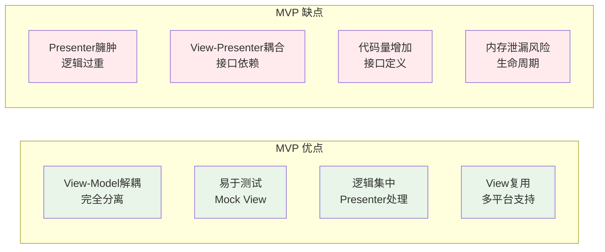

### 4.3 MVVM 架构

#### 4.3.1 MVVM 核心思想

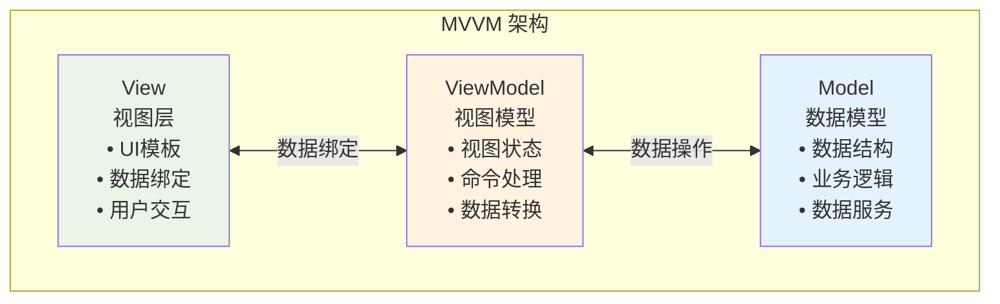

#### 4.3.2 MVVM 实现案例

```typescript
// Model - 数据模型
class UserModel {
  async fetchUsers(): Promise<User[]> {
    return await api.getUsers();
  }
  
  async saveUser(user: User): Promise<boolean> {
    return await api.saveUser(user);
  }
}

// ViewModel - 视图模型
class UserViewModel {
  // 可观察的状态
  @observable users: User[] = [];
  @observable loading: boolean = false;
  @observable error: string = '';
  @observable newUser: UserData = { name: '', email: '' };
  
  constructor(private model: UserModel) {}
  
  // 计算属性
  @computed get hasUsers(): boolean {
    return this.users.length > 0;
  }
  
  @computed get isFormValid(): boolean {
    return this.newUser.name.length > 0 && this.newUser.email.length > 0;
  }
  
  // 命令/动作
  @action async loadUsers() {
    this.loading = true;
    this.error = '';
    try {
      this.users = await this.model.fetchUsers();
    } catch (error) {
      this.error = '加载用户失败';
    } finally {
      this.loading = false;
    }
  }
  
  @action async addUser() {
    if (!this.isFormValid) return;
    
    try {
      const success = await this.model.saveUser(new User(this.newUser));
      if (success) {
        this.newUser = { name: '', email: '' }; // 重置表单
        await this.loadUsers(); // 刷新列表
      }
    } catch (error) {
      this.error = '保存用户失败';
    }
  }
  
  @action updateNewUserName(name: string) {
    this.newUser.name = name;
  }
  
  @action updateNewUserEmail(email: string) {
    this.newUser.email = email;
  }
}

// View - React组件示例
const UserView: React.FC = observer(() => {
  const viewModel = useUserViewModel();
  
  return (
    <div>
      {/* 数据绑定 */}
      {viewModel.loading && <div>加载中...</div>}
      {viewModel.error && <div className="error">{viewModel.error}</div>}
      
      {/* 用户列表 */}
      {viewModel.hasUsers && (
        <ul>
          {viewModel.users.map(user => (
            <li key={user.id}>{user.name} - {user.email}</li>
          ))}
        </ul>
      )}
      
      {/* 添加用户表单 */}
      <form onSubmit={(e) => {
        e.preventDefault();
        viewModel.addUser();
      }}>
        <input
          value={viewModel.newUser.name}
          onChange={(e) => viewModel.updateNewUserName(e.target.value)}
          placeholder="姓名"
        />
        <input
          value={viewModel.newUser.email}
          onChange={(e) => viewModel.updateNewUserEmail(e.target.value)}
          placeholder="邮箱"
        />
        <button 
          type="submit" 
          disabled={!viewModel.isFormValid}
        >
          添加用户
        </button>
      </form>
      
      <button onClick={() => viewModel.loadUsers()}>
        刷新
      </button>
    </div>
  );
});
```

#### 4.3.3 MVVM 优缺点分析

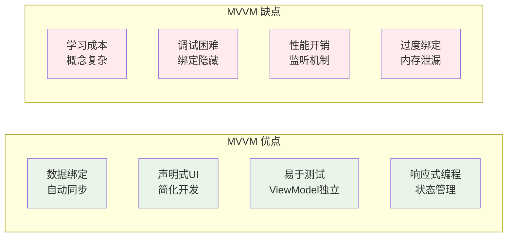

### 4.4 架构演变对比

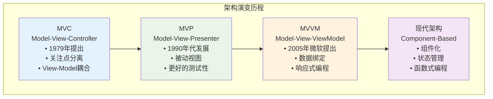

---

## 5. 架构设计注意事项

### 5.1 架构设计的常见陷阱

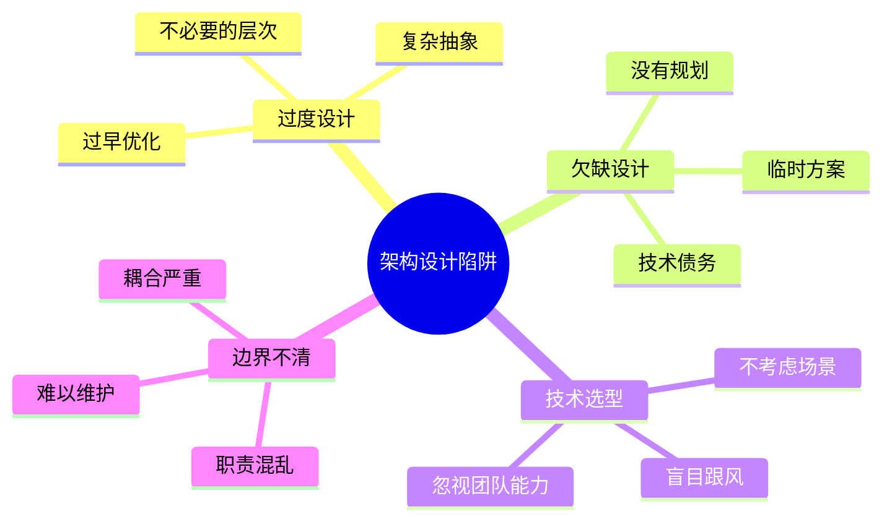

### 5.2 架构设计的关键考虑因素

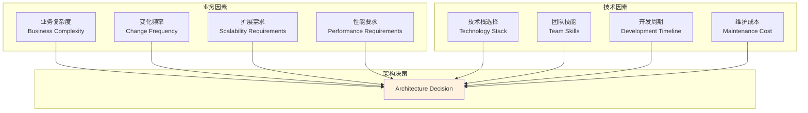

### 5.3 架构设计的最佳实践

#### 5.3.1 设计原则检查清单

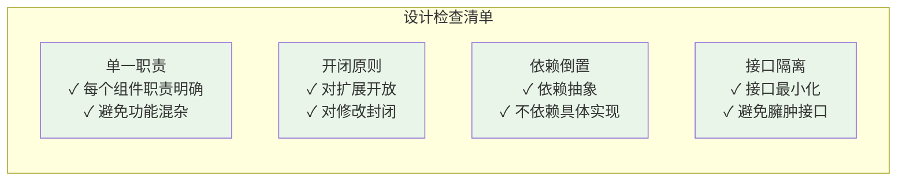

#### 5.3.2 架构评估维度

```mermaid
radar
    title 架构质量评估
    "可维护性" : 0.8
    "可扩展性" : 0.7
    "可测试性" : 0.9
    "性能" : 0.6
    "安全性" : 0.8
    "可用性" : 0.7
    "开发效率" : 0.8
```

### 5.4 架构演进策略

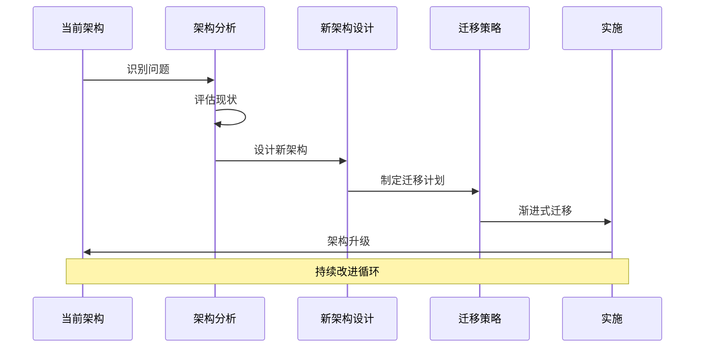

---

## 6. 现代架构设计实践

### 6.1 微前端架构

```mermaid
graph TB
    subgraph "微前端架构"
        Shell[主应用 Shell<br/>• 路由管理<br/>• 应用加载<br/>• 共享资源]
        
        App1[用户管理应用<br/>• 独立开发<br/>• 独立部署<br/>• 技术栈自由]
        
        App2[订单管理应用<br/>• 独立团队<br/>• 独立发布<br/>• 业务解耦]
        
        App3[支付应用<br/>• 安全隔离<br/>• 专业团队<br/>• 高可用]
        
        Shared[共享服务<br/>• 通用组件<br/>• 工具函数<br/>• 样式规范]
    end
    
    Shell --> App1
    Shell --> App2
    Shell --> App3
    App1 --> Shared
    App2 --> Shared
    App3 --> Shared
    
    style Shell fill:#e3f2fd
    style Shared fill:#f3e5f5
```

### 6.2 组件化架构

```mermaid
graph TB
    subgraph "组件化架构层次"
        Page[页面层<br/>Page Components<br/>• 业务页面<br/>• 路由组件<br/>• 页面逻辑]
        
        Business[业务组件层<br/>Business Components<br/>• 业务逻辑<br/>• 数据处理<br/>• 状态管理]
        
        UI[UI组件层<br/>UI Components<br/>• 纯展示组件<br/>• 交互组件<br/>• 样式组件]
        
        Base[基础组件层<br/>Base Components<br/>• 原子组件<br/>• 工具组件<br/>• 第三方封装]
    end
    
    Page --> Business
    Business --> UI
    UI --> Base
    
    style Page fill:#e3f2fd
    style Business fill:#e8f5e8
    style UI fill:#fff3e0
    style Base fill:#f3e5f5
```

### 6.3 状态管理架构

```mermaid
graph LR
    subgraph "状态管理模式"
        Component[组件<br/>Component]
        LocalState[本地状态<br/>Local State]
        GlobalState[全局状态<br/>Global State]
        ServerState[服务端状态<br/>Server State]
        
        Actions[动作<br/>Actions]
        Reducers[处理器<br/>Reducers]
        Effects[副作用<br/>Effects]
        
        Component --> LocalState
        Component --> Actions
        Actions --> Reducers
        Actions --> Effects
        Reducers --> GlobalState
        Effects --> ServerState
        GlobalState --> Component
        ServerState --> Component
    end
    
    style Component fill:#e3f2fd
    style GlobalState fill:#e8f5e8
    style ServerState fill:#fff3e0
```

---

## 7. 总结与建议

### 7.1 架构设计的核心要点

```mermaid
mindmap
  root((架构设计要点))
    业务驱动
      理解业务需求
      识别核心问题
      平衡技术与业务
    渐进演进
      从简单开始
      持续重构
      适应变化
    团队协作
      统一认知
      规范约定
      知识共享
    质量保证
      代码质量
      架构质量
      交付质量
```

### 7.2 不同场景的架构选择建议

| 项目特征 | 推荐架构 | 理由 | 注意事项 |
|----------|----------|------|----------|
| **小型项目** | 简化MVC | 开发快速，结构清晰 | 避免过度设计 |
| **中型项目** | MVP/MVVM | 更好的测试性和维护性 | 注意代码组织 |
| **大型项目** | 微前端+组件化 | 团队协作，技术多样性 | 复杂度管理 |
| **快速原型** | 组件化 | 快速开发，易于调整 | 后期重构规划 |
| **企业应用** | 分层架构+DDD | 业务复杂度管理 | 学习成本较高 |

### 7.3 架构设计的发展趋势

```mermaid
timeline
    title 架构设计发展趋势
    
    section 过去
        单体架构 : 简单直接
                : 部署容易
                : 扩展困难
    
    section 现在
        微服务架构 : 服务拆分
                  : 独立部署
                  : 复杂度增加
        
        组件化架构 : 前端组件化
                  : 可复用性
                  : 状态管理
    
    section 未来
        Serverless : 函数计算
                   : 按需付费
                   : 运维简化
        
        边缘计算 : 就近处理
                : 低延迟
                : 分布式架构
```

### 7.4 最终建议

#### 7.4.1 架构设计的黄金法则

1. **业务优先** - 架构服务于业务，不要为了技术而技术
2. **渐进演进** - 从简单开始，随着业务发展逐步演进
3. **团队匹配** - 架构复杂度要与团队能力匹配
4. **持续改进** - 架构不是一成不变的，要持续优化
5. **文档先行** - 好的架构需要好的文档支撑

#### 7.4.2 实施路径

```mermaid
graph LR
    A[需求分析] --> B[架构设计]
    B --> C[技术选型]
    C --> D[原型验证]
    D --> E[团队培训]
    E --> F[分步实施]
    F --> G[持续优化]
    G --> A
    
    style A fill:#e3f2fd
    style D fill:#fff3e0
    style G fill:#e8f5e8
```

---

## 结语

架构设计是软件工程中的核心环节，它不仅仅是技术问题，更是工程问题、管理问题和业务问题的综合体现。一个好的架构设计应该：

- **解决实际问题** - 针对具体的业务场景和技术挑战
- **平衡各种权衡** - 在复杂度、性能、开发效率等方面找到平衡点
- **支持团队协作** - 让团队能够高效协作，并行开发
- **适应业务发展** - 具备良好的扩展性和演进能力

记住，**没有银弹**，没有一种架构能够解决所有问题。选择合适的架构，比选择最先进的架构更重要。在实际项目中，要根据具体情况灵活应用这些架构思想和设计原则，创造出既满足业务需求又具备良好技术品质的软件系统。