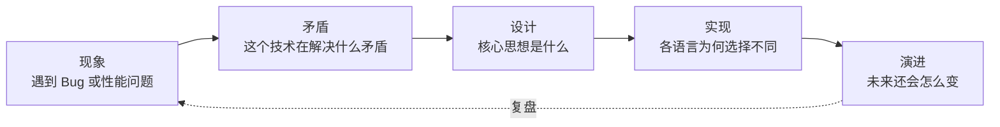

# 序卷｜方法论与导读

> **不教知识，先教看世界的方法**——这一卷决定了你后面 5 卷的吸收效率。

---

---

## 📖 篇章

| 序号 | 文档 | 核心问题 |
|------|------|---------|
| 0A | [专栏的导读和绪论](./00.专栏的导读和绪论.md) | 为什么"看见设计"比"会用 API"更值钱 |

---

## 🧭 三种推荐读法

```
🟢 通读型：序卷 → 第1卷 → 第2卷 → 第3卷 → 第4卷 → 第5卷
        建议每天 1 篇，持续 50 天

🟡 围猎型：先读序卷，再带着具体问题去找对应章节
        例如最近被 OOM 困扰 → 直接跳第4卷

🔴 突击型：序卷 + 第3卷 + 第4卷
        面试前 7 天集中突破并发与内存
```

---

## 🧠 贯穿全书的思维方法（必看）



**理解矛盾 → 理解设计 → 理解实现 → 理解演进**——这条闭环在后续每一卷都会反复出现。

---

## 🔗 下一站

读完序卷后，建议直接进入 [第 1 卷｜数据的本质](../01.第1卷数据的本质/)，从"计算机如何用 0/1 表达世界"开始建立全景。
