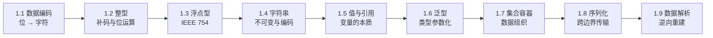
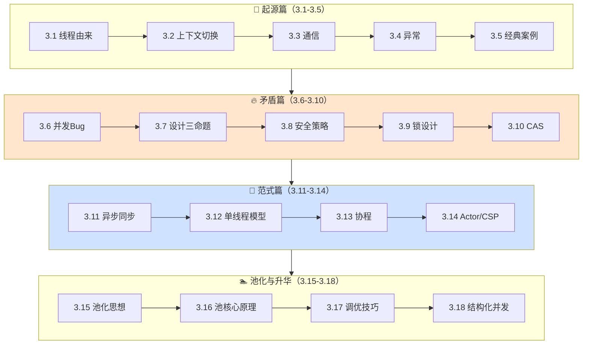
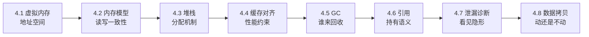
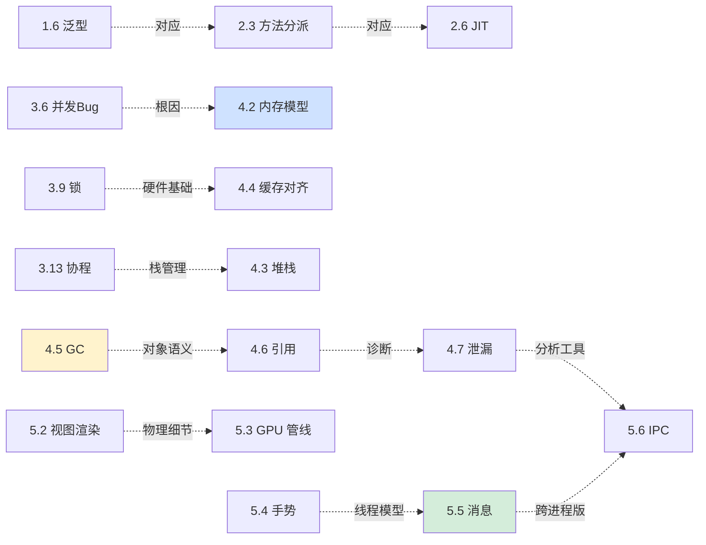

# 全专栏地图与索引

> 这份文档是整个《程序编程原理》专栏的**地图与索引**——告诉你每一篇在讲什么、彼此之间的关系、以及在不同身份下应该按什么路径来读。


## 🔢 第 1 卷｜数据的本质

> **核心命题**：计算机如何用有限的位表达无限的信息？

### 1.1 卷内脉络



### 1.2 章节速览

| # | 文档 | 关键问题 |
|---|---|---|
| 1.1 | [数据编码设计原理](../01.第1卷数据的本质/1.1.数据编码设计原理.md) | ASCII / GBK / UTF-8 / Unicode 怎么演进 |
| 1.2 | [整型与位运算原理](../01.第1卷数据的本质/1.2.整型与位运算原理.md) | 补码为什么是"几何美学"的产物 |
| 1.3 | [浮点型数据设计灵魂](../01.第1卷数据的本质/1.3.浮点型数据设计灵魂.md) | 为什么 0.1 + 0.2 ≠ 0.3 |
| 1.4 | [字符串设计的灵魂](../01.第1卷数据的本质/1.4.字符串设计的灵魂.md) | 为什么所有现代语言都让 String 不可变 |
| 1.5 | [值型变量和引用](../01.第1卷数据的本质/1.5.值型变量和引用.md) | "值传递"与"引用传递"的本质区别 |
| 1.6 | [泛型设计灵魂思想](../01.第1卷数据的本质/1.6.泛型设计灵魂思想.md) | 类型擦除 vs 单态化——Java/C++/Rust 的不同 |
| 1.7 | [集合与容器设计原理](../01.第1卷数据的本质/1.7.集合与容器设计原理.md) | ArrayList / LinkedList / HashMap 的取舍 |
| 1.8 | [序列化数据的思想](../01.第1卷数据的本质/1.8.序列化数据的思想.md) | JSON / Protobuf / Thrift / Avro 的对比 |
| 1.9 | [数据解析设计思想](../01.第1卷数据的本质/1.9.数据解析设计思想.md) | 为什么解析器性能能差 100 倍 |

---

## 🧬 第 2 卷｜运行时模型

> **核心命题**：从一行 `new` 到执行结束，程序里到底发生了什么？

### 卷内脉络


### 章节速览

| # | 文档 | 关键问题 |
|---|---|---|
| 2.1 | [类的加载核心原理](../02.第2卷运行时模型/2.1.类的加载核心原理.md) | 双亲委派为何而生 |
| 2.2 | [对象创建流程原理](../02.第2卷运行时模型/2.2.对象创建流程原理.md) | new 一个对象到底发生多少步 |
| 2.3 | [对象和函数访问原理](../02.第2卷运行时模型/2.3.对象和函数访问原理.md) | vtable / itable / 静态分派 |
| 2.4 | [函数调用栈与栈帧设计](../02.第2卷运行时模型/2.4.函数调用栈与栈帧设计.md) | 栈帧布局与调用约定 |
| 2.5 | [字节码与虚拟机执行原理](../02.第2卷运行时模型/2.5.字节码与虚拟机执行原理.md) | JVM / V8 / Python VM 的执行引擎 |
| 2.6 | [JIT 与运行时优化](../02.第2卷运行时模型/2.6.JIT与运行时优化.md) | C2 / Graal 凭什么"超过 C++" |
| 2.7 | [反射与元编程核心设计](../02.第2卷运行时模型/2.7.反射与元编程核心设计.md) | 反射 / Emit / Proxy 的共同本质 |
| 2.8 | [异常机制设计原理](../02.第2卷运行时模型/2.8.异常机制设计原理.md) | 异常从硬件中断到语言层 |

---

## ⚡ 第 3 卷｜并发之道 · 18 篇（全书最重）

> **核心命题**：从一个线程到多个线程，软件世界发生了什么质变？

### 卷内脉络（4 大阵营 18 篇）



### 章节速览

#### 起源篇

| # | 文档 | 关键问题 |
|---|---|---|
| 3.1 | [线程前世今生探索](../03.第3卷并发之道/3.1.线程前世今生探索.md) | 进程不够用？1:1/N:1/M:N 演进 |
| 3.2 | [并发上下文切换原理](../03.第3卷并发之道/3.2.并发上下文切换原理.md) | 进程/线程/协程切换代价差异 |
| 3.3 | [线程通信设计思想](../03.第3卷并发之道/3.3.线程通信设计思想.md) | 共享内存 vs 消息传递 |
| 3.4 | [线程异常设计原理](../03.第3卷并发之道/3.4.线程异常设计原理.md) | 一个线程死了别的怎么办 |
| 3.5 | [多线程并发经典案例](../03.第3卷并发之道/3.5.多线程并发经典案例.md) | 售票问题揭示的竞态 |

#### 矛盾篇

| # | 文档 | 关键问题 |
|---|---|---|
| 3.6 | [并发 Bug 源头由来](../03.第3卷并发之道/3.6.并发Bug源头由来.md) | 可见性/原子性/有序性 |
| 3.7 | [并发编程设计思想](../03.第3卷并发之道/3.7.并发编程设计思想.md) | 分工/同步/互斥三大命题 |
| 3.8 | [并发编程安全设计](../03.第3卷并发之道/3.8.并发编程安全设计.md) | 不可变/TLS/读写分离/无锁 |
| 3.9 | [锁核心设计和思想](../03.第3卷并发之道/3.9.锁核心设计和思想.md) | LOCK# 到锁升级的完整链路 |
| 3.10 | [理解 CAS 设计由来](../03.第3卷并发之道/3.10.理解CAS设计由来.md) | 从哲学到硬件，CAS 与 ABA |

#### 范式篇

| # | 文档 | 关键问题 |
|---|---|---|
| 3.11 | [异步和同步的设计](../03.第3卷并发之道/3.11.异步和同步的设计.md) | 同步→多线程→回调→async/await |
| 3.12 | [单线程模型的思想](../03.第3卷并发之道/3.12.单线程模型的思想.md) | 单线程为何反而高并发 |
| 3.13 | [协程核心设计思想](../03.第3卷并发之道/3.13.协程核心设计思想.md) | 挂起/恢复 + 有栈 vs 无栈 |
| 3.14 | [Actor 与 CSP 并发模型](../03.第3卷并发之道/3.14.Actor与CSP并发模型.md) | Erlang Actor vs Go channel |

#### 池化与升华篇

| # | 文档 | 关键问题 |
|---|---|---|
| 3.15 | [线程池的设计思想](../03.第3卷并发之道/3.15.线程池的设计思想.md) | 池化思想：生产者-消费者 |
| 3.16 | [线程池设计核心原理](../03.第3卷并发之道/3.16.线程池设计核心原理.md) | ctl 变量、状态机、Worker 模型 |
| 3.17 | [线程池使用技巧](../03.第3卷并发之道/3.17.线程池使用技巧.md) | 7 大参数调优实战 |
| 3.18 | [结构化并发设计思想](../03.第3卷并发之道/3.18.结构化并发设计思想.md) | Kotlin/Swift/Java 21/Trio |

---

## 💾 第 4 卷｜内存的真相 · 8 篇

> **核心命题**：每一个 OOM、Full GC、内存泄漏的背后，都是什么物理事实？

### 卷内脉络



### 章节速览

| # | 文档 | 关键问题 |
|---|---|---|
| 4.1 | [虚拟内存与地址空间](../04.第4卷内存的真相/4.1.虚拟内存与地址空间.md) | MMU/页表/TLB/COW |
| 4.2 | [内存模型技术设计](../04.第4卷内存的真相/4.2.内存模型技术设计.md) | 冯·诺依曼到 JMM 演进 |
| 4.3 | [堆和栈内存的设计](../04.第4卷内存的真相/4.3.堆和栈内存的设计.md) | 栈帧、malloc、glibc bin |
| 4.4 | [内存对齐与缓存局部性](../04.第4卷内存的真相/4.4.内存对齐与缓存局部性.md) | Cache Line/Padding/伪共享 |
| 4.5 | [内存回收机制设计](../04.第4卷内存的真相/4.5.内存回收机制设计.md) | 标记清除→分代→ZGC |
| 4.6 | [多种引用技术设计](../04.第4卷内存的真相/4.6.多种引用技术设计.md) | 强/软/弱/虚引用 |
| 4.7 | [内存泄漏与诊断原理](../04.第4卷内存的真相/4.7.内存泄漏与诊断原理.md) | GC Roots/支配树/Heap Dump |
| 4.8 | [数据拷贝设计原理](../04.第4卷内存的真相/4.8.数据拷贝设计原理.md) | 浅/深/写时拷贝 |

---

## 🖼 第 5 卷｜交互与系统 · 7 篇

> **核心命题**：从硬件触点到屏幕像素——用户交互背后是怎样的事件驱动架构？

### 卷内脉络


### 章节速览

| # | 文档 | 关键问题 |
|---|---|---|
| 5.1 | [窗口核心设计思想](../05.第5卷交互与系统/5.1.窗口核心设计思想.md) | 矩形+事件+坐标系 |
| 5.2 | [视图加载渲染设计](../05.第5卷交互与系统/5.2.视图加载渲染设计.md) | measure/layout/draw |
| 5.3 | [图形渲染管线原理](../05.第5卷交互与系统/5.3.图形渲染管线原理.md) | GPU 流水线/VSync/合成器/Skia |
| 5.4 | [手势事件设计灵魂](../05.第5卷交互与系统/5.4.手势事件设计灵魂.md) | 触点流→状态机→手势 |
| 5.5 | [消息机制设计思想](../05.第5卷交互与系统/5.5.消息机制设计思想.md) | Handler/Looper/MessageQueue |
| 5.6 | [跨进程通信设计](../05.第5卷交互与系统/5.6.跨进程通信设计.md) | 管道/共享内存/Binder |
| 5.7 | [数据加密和解密](../05.第5卷交互与系统/5.7.数据加密和解密.md) | 对称/非对称/哈希 |

---

## 🛤 三条阅读路径详细规划

### 🟢 新手路径｜建立整体观（10 篇 · 推荐 4 周）

> **目标**：通览整个底层世界，建立"心智地图"。

```
Week 1：序卷导读 → 1.1 数据编码 → 1.4 字符串
Week 2：2.1 类加载 → 3.1 线程由来 → 3.7 并发设计
Week 3：3.12 单线程模型 → 3.15 线程池
Week 4：4.1 虚拟内存 → 5.5 消息机制
```

**学完能做到**：理解程序"从启动到运行"的全景，但不深入硬核细节。

---

### 🟡 进阶路径｜深入核心矛盾（12 篇 · 推荐 6 周）

> **目标**：掌握专栏的"核心硬核"——并发、内存、运行时优化。

```
Week 1：1.6 泛型 → 2.3 方法分派
Week 2：2.6 JIT → 3.9 锁设计
Week 3：3.10 CAS → 3.11 异步同步
Week 4：3.13 协程 → 3.14 Actor/CSP
Week 5：3.18 结构化并发 → 4.5 GC
Week 6：4.6 引用类型 → 5.4 手势事件
```

**学完能做到**：能从硬件指令推导到语言并发原语，能看懂大多数主流框架的源码。

---

### 🔴 面试冲刺｜高频必考（10 篇 · 推荐 2 周）

> **目标**：突击大厂面试高频考点，但讲法比八股文深 10 倍。

```
Day 1-2：1.5 值与引用 ｜ 1.6 泛型
Day 3-4：3.6 并发 Bug ｜ 3.7 并发设计
Day 5-7：3.8 并发安全 ｜ 3.9 锁升级 ｜ 3.10 CAS/ABA
Day 8-9：3.16 线程池原理
Day 10-11：4.5 GC 演进
Day 12-14：4.6 四种引用 + 复盘
```

**学完能做到**：面试官问到任何并发或 JVM 内存问题，都能从根因出发回答。

---

## 🎯 三类高频面试题与对应章节

### 并发类（30+ 高频题）

| 面试题 | 推荐章节 |
|---|---|
| synchronized 锁升级 | 3.9 锁核心设计 |
| volatile 原理 | 3.6 并发 Bug |
| ReentrantLock vs synchronized | 3.9 锁设计 |
| CAS 与 ABA | 3.10 CAS 设计 |
| 线程池参数 | 3.16/3.17 |
| 协程 vs 线程 | 3.13 协程 |
| ThreadLocal 内存泄漏 | 4.7 泄漏诊断 |

### 内存类（20+ 高频题）

| 面试题 | 推荐章节 |
|---|---|
| Java 内存模型 | 4.2 内存模型 |
| GC 算法演进 | 4.5 GC 设计 |
| 强软弱虚引用 | 4.6 引用技术 |
| OOM 排查 | 4.7 泄漏诊断 |
| 堆栈区别 | 4.3 堆栈设计 |
| 虚拟内存 | 4.1 虚拟内存 |

### JVM/运行时类（15+ 高频题）

| 面试题 | 推荐章节 |
|---|---|
| 类加载双亲委派 | 2.1 类加载 |
| new 对象的过程 | 2.2 对象创建 |
| 方法分派 | 2.3 方法访问 |
| JIT 优化 | 2.6 JIT |
| 反射性能 | 2.7 反射 |

---

## 📊 跨章节的"超链矩阵"

每一篇都不是孤岛——它们之间有大量的内在联系：



**用法**：读完某一章后，沿着箭头去看相关章节——形成"知识网络"而不是"知识链表"。

---

## 🎁 你能学到什么｜10 项收益

```
🧠 认知层
  1. 看见矛盾的能力
  2. 跨语言抽象的能力
  3. 看见演进的能力

🛠 工程层
  4. 定位疑难杂症的能力
  5. 架构设计的能力
  6. 写出"不出事"代码的能力

🎤 表达层
  7. 面试的能力
  8. 晋升答辩的能力
  9. 指导新人的能力

🚀 长期层
  10. 抗时间淘汰的能力
```

---

## 🔄 配套学习方法

### 三遍精读法

```
📕 第一遍：通读，建立框架（不要深入抠细节）
   → 重点关注每篇的"§00 真实事故" + "§08 一句话总结"
   → 目标：知道每一篇大概在讲什么

📗 第二遍：精读，理解每个"为什么"
   → 重点关注 §02-§05 的核心机制
   → 跟着做笔记/思维导图
   → 目标：能复述给同事听

📘 第三遍：实战，对照项目代码
   → 找自己项目里的对应代码段
   → 用本章节的视角重新审视
   → 目标：能改进或重构现有代码
```

### 笔记模板（每篇都建议这么记）

```markdown
## X.X [章节标题]

### 核心矛盾
（这一篇解决什么）

### 演进时间线
（1970 → 现在的关键节点）

### 三种以上语言对比
- Java: ...
- Go: ...
- Rust: ...

### 我的项目里的对应代码
（找一段实际代码贴在这里）

### 一句话总结
（用自己的话写）
```

---

## 🤝 参与方式

- ⭐ Star 本仓库——支持作者
- 🐛 Issue 提问——任何疑问、勘误
- 🔀 PR 改进——欢迎补充案例、补充语言

---

> **再次强调**：这不是"速成班"。
>
> 它要花你 3-6 个月时间，
> 但读完之后，你看待技术的眼光会发生**永久性改变**。
>
> 这是它最大的价值。

