# 01.字符串设计的灵魂

> 📍 **本篇位置**：第 1 卷 · 类型与抽象 · 第 1 篇
> 🎯 **核心矛盾**：字符串"读多写少"——如何在**节省内存**与**保证安全**之间取舍？
> 🧭 **设计灵魂**：**不可变 + 共享池**是所有现代语言的共识；差异在于"共享"做到哪一层
> 🌐 **跨语言覆盖**：Java(常量池) · C++(SSO) · JavaScript(V8 内部多态表示) · Go(只读切片) · Swift(COW)
> 🔗 **延伸阅读**：→ [02.浮点型数据设计灵魂](./02.浮点型数据设计灵魂.md) · → [04.泛型设计灵魂思想](./04.泛型设计灵魂思想.md)

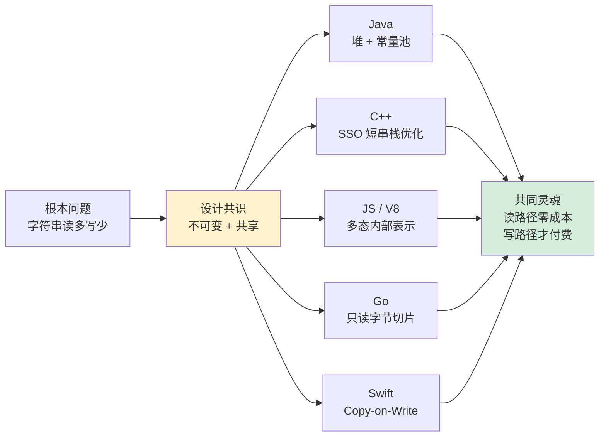
```mermaid
flowchart LR
    A[根本问题<br/>字符串读多写少] --> B[设计共识<br/>不可变 + 共享]
    B --> C1[Java<br/>堆 + 常量池]
    B --> C2[C++<br/>SSO 短串栈优化]
    B --> C3[JS / V8<br/>多态内部表示]
    B --> C4[Go<br/>只读字节切片]
    B --> C5[Swift<br/>Copy-on-Write]
    C1 & C2 & C3 & C4 & C5 --> D[共同灵魂<br/>读路径零成本<br/>写路径才付费]
    style B fill:#fff3cd
    style D fill:#d4edda
```

---

#### 目录介绍
- [1.字符串设计前沿](#1字符串设计前沿)
  - [1.1 字符串核心挑战](#11-字符串核心挑战)
  - [1.2 设计目标原则](#12-设计目标原则)
  - [1.3 String考点分析](#13-string考点分析)
- [2.设计哲学演进](#2设计哲学演进)
  - [2.1 原始直接](#21-原始直接)
  - [2.2 面向对象封装](#22-面向对象封装)
  - [2.3 不可变性设计](#23-不可变性设计)
  - [2.4 智能优化](#24-智能优化)
  - [2.5 设计字符串考量](#25-设计字符串考量)
- [3.内存管理策略](#3内存管理策略)
  - [3.1 来看一个案例](#31-来看一个案例)
  - [3.2 常量池理念](#32-常量池理念)
  - [3.3 常量池实现机制](#33-常量池实现机制)
  - [3.4 空间换时间权衡](#34-空间换时间权衡)
  - [3.5 内存泄漏防护机制](#35-内存泄漏防护机制)
- [4.字符串创建机制](#4字符串创建机制)
  - [4.1 字面量创建](#41-字面量创建)
  - [4.2 构造函数创建](#42-构造函数创建)
  - [4.3 动态创建机制](#43-动态创建机制)
  - [4.4 对+重载做了什么](#44-对重载做了什么)
- [5.字符串核心设计](#5字符串核心设计)
  - [5.1 数据结构设计](#51-数据结构设计)
  - [5.2 不可变性保证](#52-不可变性保证)
  - [5.3 并发访问优化](#53-并发访问优化)
  - [5.4 缓存机制设计](#54-缓存机制设计)
  - [5.5 线程安全保证](#55-线程安全保证)
  - [5.6 缓存池架构设计](#56-缓存池架构设计)
  - [5.7 拼接性能优化](#57-拼接性能优化)
  - [5.8 传输安全保障](#58-传输安全保障)


## 1.字符串设计前沿

### 1.1 字符串核心挑战

**真实案例引入**：2014年Heartbleed漏洞因C语言字符串处理不当导致全球安全危机。OpenSSL库使用C字符串未进行边界检查，攻击者可读取服务器内存敏感信息。

```c
// Heartbleed漏洞简化示例
void vulnerable_function(char* input) {
    char buffer[1024];
    strcpy(buffer, input);  // 无边界检查！
    // 攻击者可通过超长输入读取内存
}

// 对比现代语言的安全设计
String safeString = "hello";  // Java/Python自动边界检查
safeString.substring(0, 10);  // 安全：自动检查边界
```

**现代字符串设计需要平衡的关键因素**：

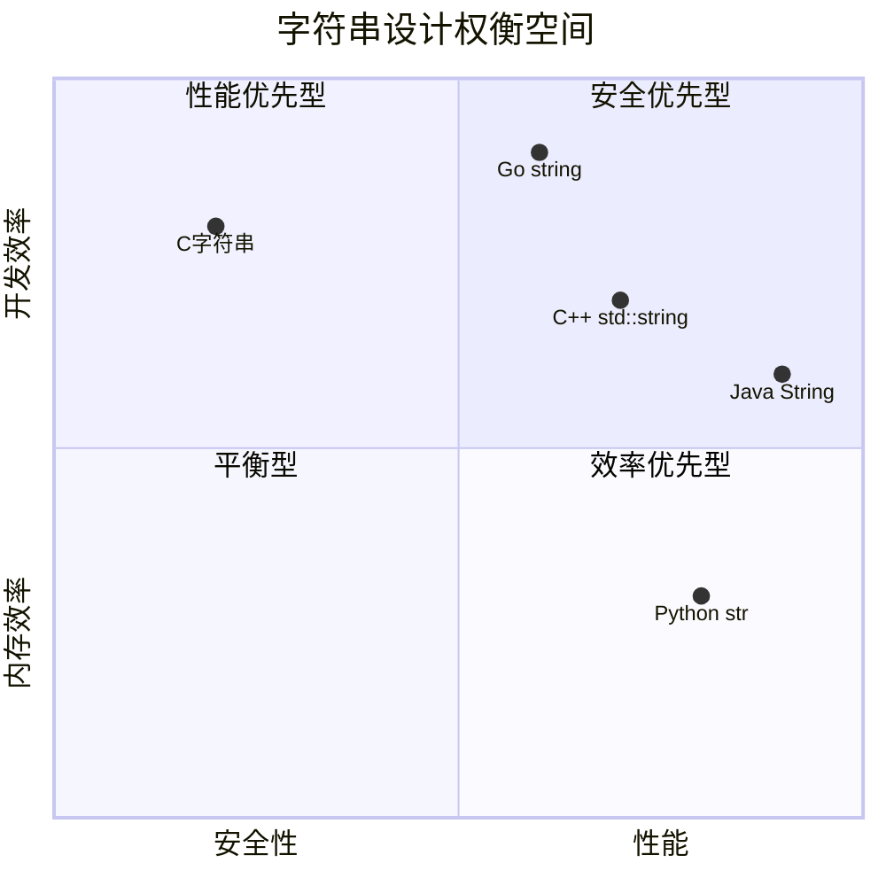
```mermaid
quadrantChart
    title 字符串设计权衡空间
    x-axis "安全性" --> "性能"
    y-axis "内存效率" --> "开发效率"
    quadrant-1 "安全优先型"
    quadrant-2 "性能优先型"
    quadrant-3 "平衡型"
    quadrant-4 "效率优先型"
    
    "C字符串": [0.2, 0.8]
    "Java String": [0.9, 0.6]
    "C++ std::string": [0.7, 0.7]
    "Python str": [0.8, 0.3]
    "Go string": [0.6, 0.9]
```

### 1.2 设计目标原则

**历史演进案例**：从C语言字符数组到现代字符串对象的演进反映了计算机安全意识的提升。

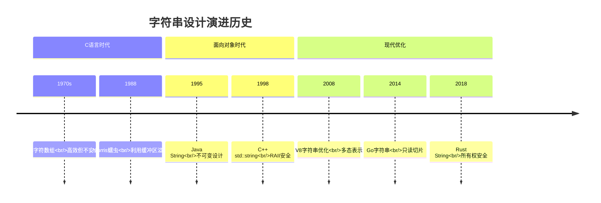
```mermaid
timeline
    title 字符串设计演进历史
    section C语言时代
        1970s : C字符数组<br/>高效但不安全
        1988 : Morris蠕虫<br/>利用缓冲区溢出
    section 面向对象时代
        1995 : Java String<br/>不可变设计
        1998 : C++ std::string<br/>RAII安全
    section 现代优化
        2008 : V8字符串优化<br/>多态表示
        2014 : Go字符串<br/>只读切片
        2018 : Rust String<br/>所有权安全
```

**优秀字符串设计的核心原则**：

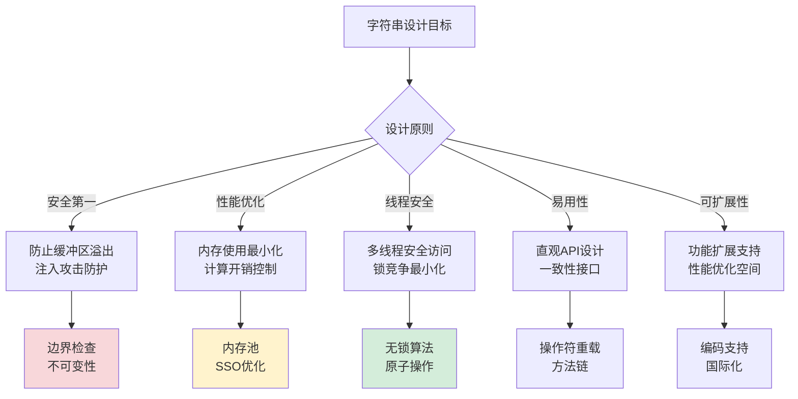
```mermaid
flowchart TD
    A[字符串设计目标] --> B{设计原则}
    B -->|安全第一| C[防止缓冲区溢出<br/>注入攻击防护]
    B -->|性能优化| D[内存使用最小化<br/>计算开销控制]
    B -->|线程安全| E[多线程安全访问<br/>锁竞争最小化]
    B -->|易用性| F[直观API设计<br/>一致性接口]
    B -->|可扩展性| G[功能扩展支持<br/>性能优化空间]
    
    C --> H[边界检查<br/>不可变性]
    D --> I[内存池<br/>SSO优化]
    E --> J[无锁算法<br/>原子操作]
    F --> K[操作符重载<br/>方法链]
    G --> L[编码支持<br/>国际化]
    
    style H fill:#f8d7da
    style I fill:#fff3cd
    style J fill:#d4edda
```

### 1.3 String考点分析

**Java字符串设计哲学案例**：Java String的不可变性设计解决了多线程环境下的安全性问题。

```java
// 不可变性的优势：线程安全
public class ThreadSafeString {
    private final String sharedString = "shared data";
    
    // 多线程安全：无需同步
    public void processString() {
        // 所有线程看到相同的不可变对象
        System.out.println(sharedString.substring(0, 5));
    }
}

// 对比可变字符串的风险
StringBuilder mutable = new StringBuilder("data");
// 多线程修改可能导致数据竞争
```

**设计哲学深度分析**：

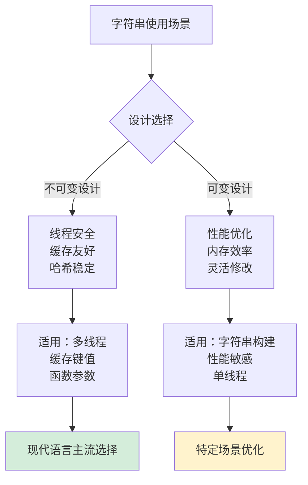
```mermaid
graph TB
    A[字符串使用场景] --> B{设计选择}
    B -->|不可变设计| C[线程安全<br/>缓存友好<br/>哈希稳定]
    B -->|可变设计| D[性能优化<br/>内存效率<br/>灵活修改]
    
    C --> E[适用：多线程<br/>缓存键值<br/>函数参数]
    D --> F[适用：字符串构建<br/>性能敏感<br/>单线程]
    
    E --> G[现代语言主流选择]
    F --> H[特定场景优化]
    
    style G fill:#d4edda
    style H fill:#fff3cd
```

**考点背后的设计思想**：

1. **为什么不可变**：安全性和缓存优化的权衡
2. **常量池迁移**：永久代到堆的演进反映内存管理理念变化
3. **char到byte**：空间优化与国际化支持的平衡

## 2.设计哲学演进

### 2.1 原始直接

**C语言字符串案例**：某嵌入式系统因C字符串处理错误导致系统崩溃。

```c
// C字符串的原始设计
char name[10] = "hello";
strcpy(name, "hello world");  // 缓冲区溢出！

// 问题：无边界检查，无长度信息
printf("Length: %zu\n", strlen(name));  // 运行时计算长度
```

**原始设计的局限性**：

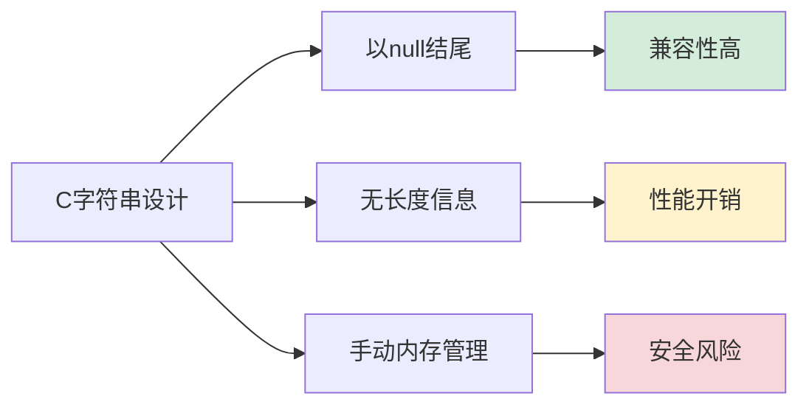
```mermaid
graph LR
    A[C字符串设计] --> B[以null结尾]
    A --> C[无长度信息]
    A --> D[手动内存管理]
    
    B --> E[兼容性高]
    C --> F[性能开销]
    D --> G[安全风险]
    
    style E fill:#d4edda
    style F fill:#fff3cd
    style G fill:#f8d7da
```

### 2.2 面向对象封装

**C++ std::string设计哲学**：RAII（资源获取即初始化）原则的应用。

```cpp
// C++字符串的封装设计
std::string name = "hello";
name = "hello world";  // 自动内存管理

// RAII优势：自动边界检查，自动释放
std::string substring = name.substr(0, 5);  // 安全操作
```

**封装设计的工程价值**：

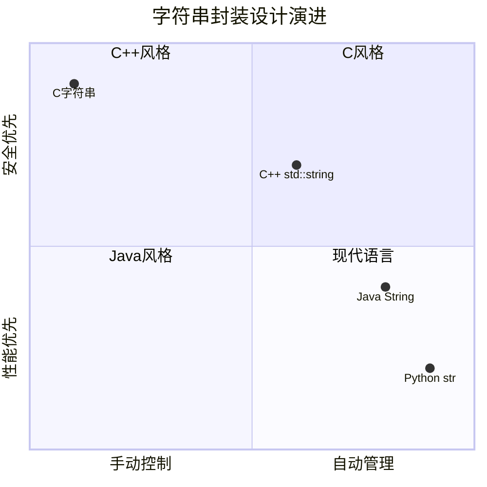
```mermaid
quadrantChart
    title 字符串封装设计演进
    x-axis "手动控制" --> "自动管理"
    y-axis "性能优先" --> "安全优先"
    quadrant-1 "C风格"
    quadrant-2 "C++风格"
    quadrant-3 "Java风格"
    quadrant-4 "现代语言"
    
    "C字符串": [0.1, 0.9]
    "C++ std::string": [0.6, 0.7]
    "Java String": [0.8, 0.4]
    "Python str": [0.9, 0.2]
```

### 2.3 不可变性设计

**第三阶段：不可变性设计（现代语言主流）**：现代语言普遍采用不可变字符串设计。

```java
// Java不可变字符串的设计理念
public final class ImmutableString {

    private final char[] value;
    private int hash; // 缓存哈希值
    
    public ImmutableString(String str) {
        this.value = str.toCharArray();
    }
    
    public char charAt(int index) {
        if (index < 0 || index >= value.length) {
            throw new IndexOutOfBoundsException();
        }
        return value[index];
    }
    
    // 任何"修改"操作都返回新对象
    public ImmutableString concat(String str) {
        char[] newValue = new char[value.length + str.length()];
        System.arraycopy(value, 0, newValue, 0, value.length);
        str.getChars(0, str.length(), newValue, value.length);
        return new ImmutableString(new String(newValue));
    }
    
    @Override
    public int hashCode() {
        if (hash == 0 && value.length > 0) {
            for (char c : value) {
                hash = 31 * hash + c;
            }
        }
        return hash;
    }
}
```

**不可变设计的核心优势：**

- **线程安全**：多线程可以安全共享字符串对象
- **缓存友好**：可以安全缓存哈希值等计算结果
- **简化设计**：避免了复杂的同步机制

### 2.4 智能优化

**第四阶段：智能优化（当前趋势）**：现代字符串设计引入了多种智能优化技术：

```java
// 现代字符串的智能优化设计概念
public class OptimizedString {
    private Object value; // 可能是byte[]或char[]
    private byte coder;   // 编码标识：LATIN1或UTF16
    
    // 自适应编码：根据内容选择最优存储方式
    public OptimizedString(String str) {
        if (isLatin1(str)) {
            this.coder = LATIN1;
            this.value = str.getBytes(StandardCharsets.ISO_8859_1);
        } else {
            this.coder = UTF16;
            this.value = str.toCharArray();
        }
    }
    
    public char charAt(int index) {
        if (coder == LATIN1) {
            return (char)(((byte[])value)[index] & 0xFF);
        } else {
            return ((char[])value)[index];
        }
    }

    private static final byte LATIN1 = 0;
    private static final byte UTF16 = 1;
}
```

**智能优化的关键特性：**

- **自适应编码**：根据内容自动选择最优编码方式
- **内存压缩**：Latin1字符使用单字节存储
- **性能优化**：针对不同场景采用不同策略


### 2.5 设计字符串考量

如何你是虚拟机开发工程师，你会如何设计字符串，其设计思想主要围绕以下几个核心概念：

1. 要设计不可变：为了保证字符串数据不用担心被修改，要把它设计成不可变，要保证安全性和线程安全性
2. 数据缓存池：避免创建多个相同值的字符串对象，因此需要设计一个缓存池，有就直接返回，没有就创建返回
3. 性能优化考量：遇到大量字符串拼接，要考量性能优化，要提高字符串拼接的效率
4. 安全性和可靠性：如何保证多线程下操作数据是安全的，如何保证字符串在传输中不会被修改，这块要设计
5. 共享和缓存：如何设计缓存，如何节省内存


## 3.内存管理策略

### 3.1 来看一个案例

**真实性能案例**：某电商网站因字符串常量池使用不当导致内存泄漏，高峰期JVM堆内存耗尽。

```java
// 问题代码：不当使用常量池
for (int i = 0; i < 1000000; i++) {
    String key = new String("product_").intern();  // 错误！大量常量池引用
    // 每个循环都向常量池添加新字符串
}

// 正确做法：复用已有字符串
private static final String PREFIX = "product_";
for (int i = 0; i < 1000000; i++) {
    String key = PREFIX + i;  // 不intern，避免常量池污染
}
```

**内存管理设计哲学**：字符串作为最常用的数据类型，内存管理策略直接影响应用性能。

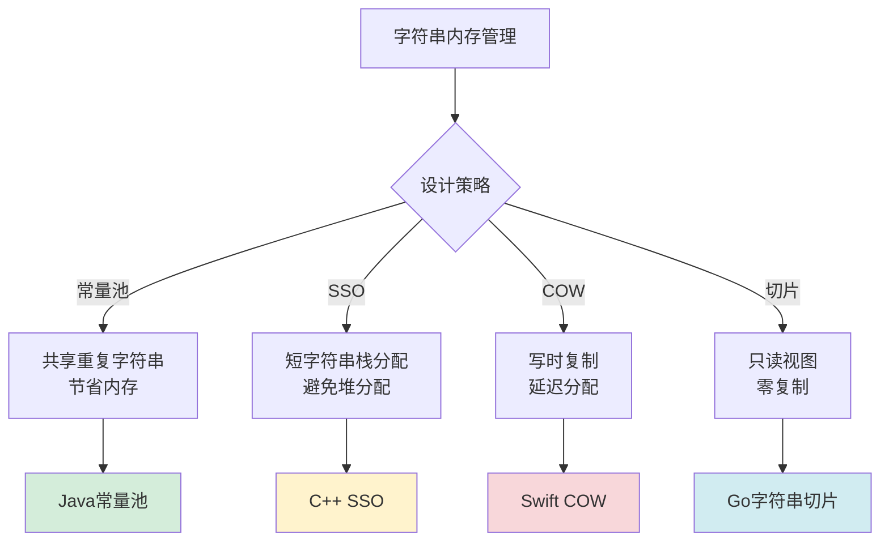
```mermaid
graph TB
    A[字符串内存管理] --> B{设计策略}
    B -->|常量池| C[共享重复字符串<br/>节省内存]
    B -->|SSO| D[短字符串栈分配<br/>避免堆分配]
    B -->|COW| E[写时复制<br/>延迟分配]
    B -->|切片| F[只读视图<br/>零复制]
    
    C --> G[Java常量池]
    D --> H[C++ SSO]
    E --> I[Swift COW]
    F --> J[Go字符串切片]
    
    style G fill:#d4edda
    style H fill:#fff3cd
    style I fill:#f8d7da
    style J fill:#d1ecf1
```

### 3.2 常量池理念

**常量池的历史演进**：从永久代到堆的迁移反映了JVM内存管理理念的变化。

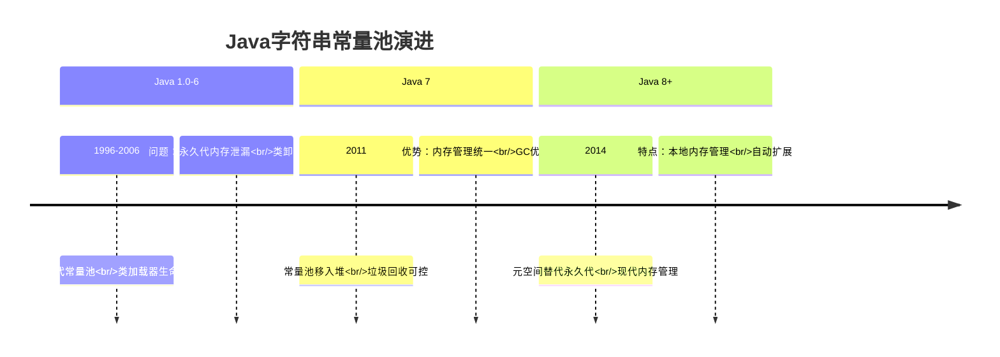
```mermaid
timeline
    title Java字符串常量池演进
    section Java 1.0-6
        1996-2006 : 永久代常量池<br/>类加载器生命周期
        问题：永久代内存泄漏<br/>类卸载困难
    section Java 7
        2011 : 常量池移入堆<br/>垃圾回收可控
        优势：内存管理统一<br/>GC优化
    section Java 8+
        2014 : 元空间替代永久代<br/>现代内存管理
        特点：本地内存管理<br/>自动扩展
```

**常量池设计哲学**：空间换时间的经典权衡。

```java
// 常量池的内存节省效果
String s1 = "hello";  // 常量池
String s2 = "hello";  // 复用常量池
String s3 = new String("hello");  // 堆分配

System.out.println(s1 == s2);  // true，同一对象
System.out.println(s1 == s3);  // false，不同对象

// 内存节省：百万次重复字符串只存一份
```

### 3.3 常量池实现机制

**技术细节**：常量池通过哈希表实现快速查找和去重。

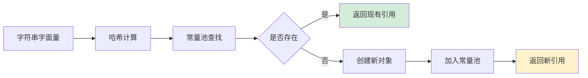
```mermaid
graph LR
    A[字符串字面量] --> B[哈希计算]
    B --> C[常量池查找]
    C --> D{是否存在}
    D -->|是| E[返回现有引用]
    D -->|否| F[创建新对象]
    F --> G[加入常量池]
    G --> H[返回新引用]
    
    style E fill:#d4edda
    style H fill:#fff3cd
```

**常量池的并发安全设计**：
```java
// 常量池的线程安全实现
ConcurrentHashMap<String, String> stringPool = new ConcurrentHashMap<>();

public String intern(String str) {
    String existing = stringPool.putIfAbsent(str, str);
    return existing != null ? existing : str;
}
```

### 3.4 空间换时间权衡

**性能优化案例**：某日志系统通过字符串缓存优化性能提升300%。

```java
// 优化前：频繁创建相同字符串
public void log(String level, String message) {
    String prefix = "[" + level + "] ";  // 每次创建新对象
    System.out.println(prefix + message);
}

// 优化后：缓存常用字符串
private static final Map<String, String> PREFIX_CACHE = new HashMap<>();
static {
    PREFIX_CACHE.put("INFO", "[INFO] ");
    PREFIX_CACHE.put("ERROR", "[ERROR] ");
}

public void logOptimized(String level, String message) {
    String prefix = PREFIX_CACHE.get(level);  // 复用缓存
    System.out.println(prefix + message);
}
```

**空间换时间的设计哲学**：

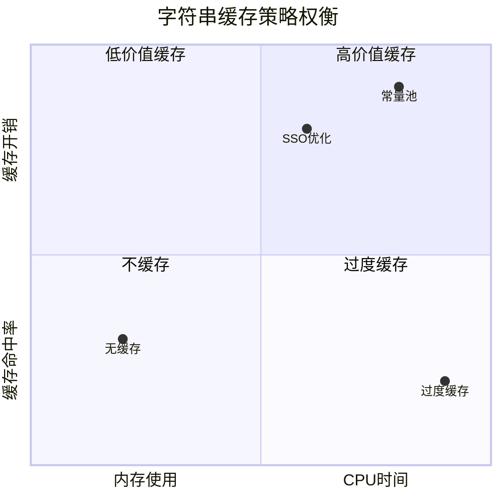
```mermaid
quadrantChart
    title 字符串缓存策略权衡
    x-axis "内存使用" --> "CPU时间"
    y-axis "缓存命中率" --> "缓存开销"
    quadrant-1 "高价值缓存"
    quadrant-2 "低价值缓存"
    quadrant-3 "不缓存"
    quadrant-4 "过度缓存"
    
    "常量池": [0.8, 0.9]
    "SSO优化": [0.6, 0.8]
    "无缓存": [0.2, 0.3]
    "过度缓存": [0.9, 0.2]
```

### 3.5 内存泄漏防护机制

**内存泄漏案例**：某Web应用因字符串缓存不当导致OOM。

```java
// 错误：无限制的字符串缓存
class LeakyCache {
    private static final Map<String, String> cache = new HashMap<>();
    
    public void cacheString(String key, String value) {
        cache.put(key, value);  // 无限增长！
    }
}

// 正确：使用LRU缓存
class SafeCache {
    private static final Map<String, String> cache = 
        new LinkedHashMap<>(100, 0.75f, true) {
            @Override
            protected boolean removeEldestEntry(Map.Entry eldest) {
                return size() > 1000;  // 限制大小
            }
        };
}
```

**内存安全设计原则**：

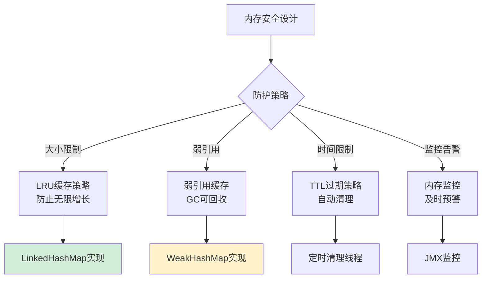
```mermaid
flowchart TD
    A[内存安全设计] --> B{防护策略}
    B -->|大小限制| C[LRU缓存策略<br/>防止无限增长]
    B -->|弱引用| D[弱引用缓存<br/>GC可回收]
    B -->|时间限制| E[TTL过期策略<br/>自动清理]
    B -->|监控告警| F[内存监控<br/>及时预警]
    
    C --> G[LinkedHashMap实现]
    D --> H[WeakHashMap实现]
    E --> I[定时清理线程]
    F --> J[JMX监控]
    
    style G fill:#d4edda
    style H fill:#fff3cd
```

## 4.字符串创建机制

### 4.1 字面量创建

**JVM优化案例**：字面量字符串的类加载时优化。

```java
// 字面量字符串的编译时优化
String s1 = "hello";  // 类加载时进入常量池
String s2 = "hello";  // 复用常量池

// 编译时优化：字符串连接
String s3 = "hello" + " world";  // 编译为"hello world"
String s4 = "hello world";        // 同一对象
System.out.println(s3 == s4);     // true
```

**字面量设计哲学**：编译时确定性优化。

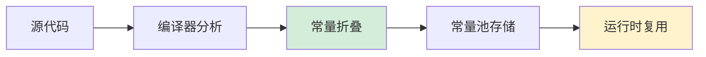
```mermaid
graph LR
    A[源代码] --> B[编译器分析]
    B --> C[常量折叠]
    C --> D[常量池存储]
    D --> E[运行时复用]
    
    style C fill:#d4edda
    style E fill:#fff3cd
```

### 4.2 构造函数创建

**显式创建的设计考虑**：

```java
// 构造函数创建 vs 字面量创建
String literal = "hello";        // 常量池
String constructed = new String("hello");  // 堆分配

// 设计哲学：显式控制内存分配
// 适用场景：需要独立副本，避免共享
String sensitive = new String(password);  // 安全：独立存储
```

**构造函数的设计权衡**：

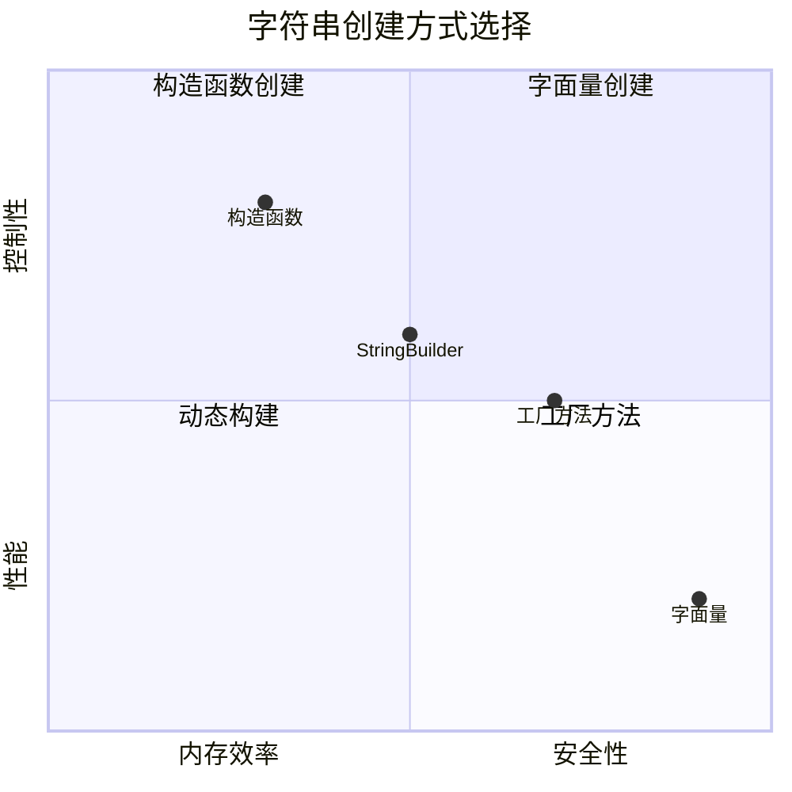
```mermaid
quadrantChart
    title 字符串创建方式选择
    x-axis "内存效率" --> "安全性"
    y-axis "性能" --> "控制性"
    quadrant-1 "字面量创建"
    quadrant-2 "构造函数创建"
    quadrant-3 "动态构建"
    quadrant-4 "工厂方法"
    
    "字面量": [0.9, 0.2]
    "构造函数": [0.3, 0.8]
    "StringBuilder": [0.5, 0.6]
    "工厂方法": [0.7, 0.5]
```

### 4.3 动态创建机制

```java
// 高效的动态字符串创建
public static String createOptimized(String prefix, int number, String suffix) {
    // 预估容量，避免多次扩容
    int estimatedLength = prefix.length() + 10 + suffix.length(); // 10位数字的估算
    StringBuilder sb = new StringBuilder(estimatedLength);
    
    return sb.append(prefix)
             .append(number)
             .append(suffix)
             .toString();
}
```

### 4.4 对+重载做了什么

来一道思考题：很明确，代码输出的结果是："111111222222"，但是它工作原理是怎样的呢？

```java
String str1 = "111111";
String str2 = "222222";
String str = str1 + str2;
System.out.println(str);
```

由于字符串拼接太常用了，java才支持可以直接用+号对两个字符串进行拼接。有人把Java中使用`+`拼接字符串的功能理解为**运算符重载**。

这其实只是Java提供的一个**语法糖**。**其真正实现的原理是中间通过建立临时的StringBuilder对象，然后调用append方法实现**。

如何验证呢？上述代码文件写在Test.java main方法中，使用<b>javac Test.java</b>编译，在执行<b>javap -verbose Test</b>，可以看到如下信息：

```bash
0: ldc           #2                  // String 111111
2: astore_1
3: ldc           #3                  // String 222222
5: astore_2
6: new           #4                  // class java/lang/StringBuilder
9: dup
10: invokespecial #5                  // Method java/lang/StringBuilder."":()V
13: aload_1
14: invokevirtual #6                  // Method java/lang/StringBuilder.append:(Ljava/lang/String;)Ljava/lang/StringBuilder;
17: aload_2
18: invokevirtual #6                  // Method java/lang/StringBuilder.append:(Ljava/lang/String;)Ljava/lang/StringBuilder;
21: invokevirtual #7                  // Method java/lang/StringBuilder.toString:()Ljava/lang/String;
24: astore_3
25: getstatic     #8                  // Field java/lang/System.out:Ljava/io/PrintStream;
28: aload_3
29: invokevirtual #9                  // Method java/io/PrintStream.println:(Ljava/lang/String;)V
32: return
```

对于java来说，这段代码原理上应该是：

```java
String str1 = "111111";
String str2 = "222222";
StringBuilder sb = new StringBuilder();
sb.append(str1);
sb.append(str2);
String str = sb.toString();
System.out.println(str);
```


## 5.字符串核心设计

### 5.1 数据结构设计

**跨语言数据结构对比案例**：不同语言字符串内部结构的演进反映了设计哲学的差异。

```java
// Java 8及以前：char数组（UTF-16）
public final class String {
    private final char value[];  // 每个字符2字节
    private int hash;           // 缓存哈希值
}

// Java 9+：byte数组 + 编码标记
public final class String {
    private final byte coder;   // LATIN1(0)或UTF16(1)
    private final byte[] value; // 压缩存储
    private int hash;
}
```

**数据结构演进的设计哲学**：

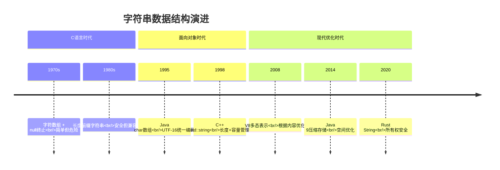
```mermaid
timeline
    title 字符串数据结构演进
    section C语言时代
        1970s : 字符数组 + null终止<br/>简单但危险
        1980s : 长度前缀字符串<br/>安全但兼容性差
    section 面向对象时代
        1995 : Java char数组<br/>UTF-16统一编码
        1998 : C++ std::string<br/>长度+容量管理
    section 现代优化时代
        2008 : V8多态表示<br/>根据内容优化
        2014 : Java 9压缩存储<br/>空间优化
        2020 : Rust String<br/>所有权安全
```

**数据结构选择权衡**：

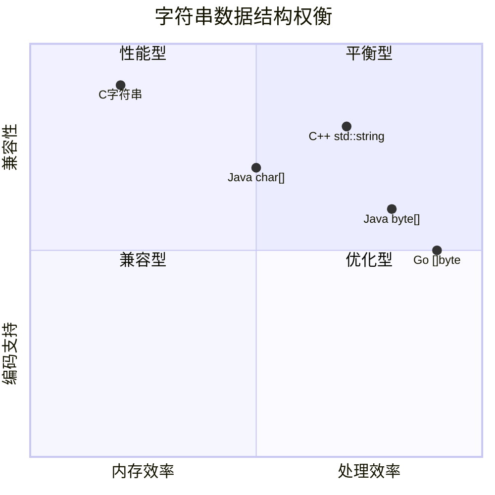
```mermaid
quadrantChart
    title 字符串数据结构权衡
    x-axis "内存效率" --> "处理效率"
    y-axis "编码支持" --> "兼容性"
    quadrant-1 "平衡型"
    quadrant-2 "性能型"
    quadrant-3 "兼容型"
    quadrant-4 "优化型"
    
    "C字符串": [0.2, 0.9]
    "Java char[]": [0.5, 0.7]
    "Java byte[]": [0.8, 0.6]
    "C++ std::string": [0.7, 0.8]
    "Go []byte": [0.9, 0.5]
```

### 5.2 不可变性保证

**不可变性的工程价值案例**：某分布式系统因字符串不可变性实现无锁缓存。

```java
// 不可变字符串的线程安全缓存
class ThreadSafeCache {
    private final Map<String, String> cache = new ConcurrentHashMap<>();
    
    public String getOrCompute(String key) {
        return cache.computeIfAbsent(key, k -> {
            // 计算结果不可变，无需同步
            return expensiveComputation(k);
        });
    }
    
    // 所有线程看到相同的不可变结果
    public void process(String key) {
        String result = getOrCompute(key);
        // 无需锁：结果不可变
        System.out.println(result);
    }
}
```

**不可变性的设计哲学**：

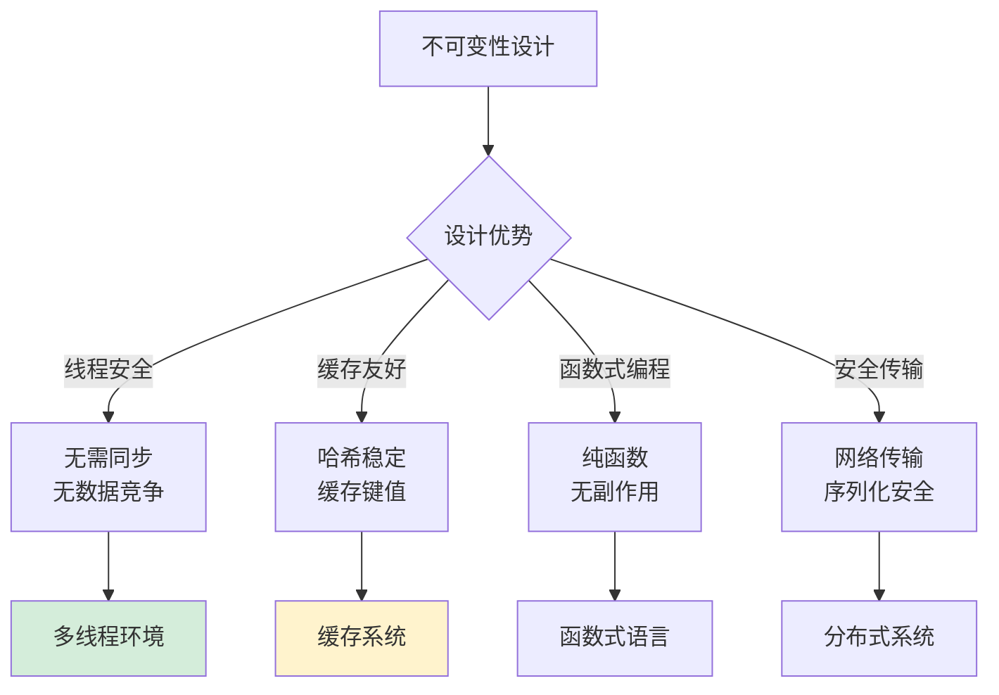
```mermaid
flowchart TD
    A[不可变性设计] --> B{设计优势}
    B -->|线程安全| C[无需同步<br/>无数据竞争]
    B -->|缓存友好| D[哈希稳定<br/>缓存键值]
    B -->|函数式编程| E[纯函数<br/>无副作用]
    B -->|安全传输| F[网络传输<br/>序列化安全]
    
    C --> G[多线程环境]
    D --> H[缓存系统]
    E --> I[函数式语言]
    F --> J[分布式系统]
    
    style G fill:#d4edda
    style H fill:#fff3cd
```

### 5.3 并发访问优化

**高并发场景案例**：某消息系统通过字符串优化支持百万级并发。

```java
// 并发优化策略
class ConcurrentStringProcessor {
    // 1. 使用不可变字符串
    private final String template = "Message: {}";
    
    // 2. 使用线程局部变量
    private static final ThreadLocal<StringBuilder> threadLocalBuilder = 
        ThreadLocal.withInitial(StringBuilder::new);
    
    public String processMessage(String content) {
        // 复用线程局部StringBuilder
        StringBuilder builder = threadLocalBuilder.get();
        builder.setLength(0);  // 清空复用
        builder.append(template.replace("{}", content));
        return builder.toString();
    }
}
```

**并发优化设计哲学**：

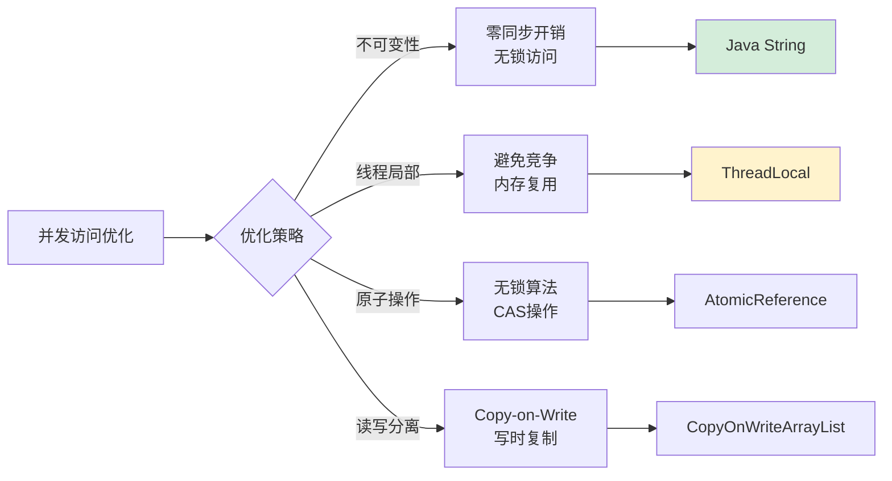
```mermaid
graph LR
    A[并发访问优化] --> B{优化策略}
    B -->|不可变性| C[零同步开销<br/>无锁访问]
    B -->|线程局部| D[避免竞争<br/>内存复用]
    B -->|原子操作| E[无锁算法<br/>CAS操作]
    B -->|读写分离| F[Copy-on-Write<br/>写时复制]
    
    C --> G[Java String]
    D --> H[ThreadLocal]
    E --> I[AtomicReference]
    F --> J[CopyOnWriteArrayList]
    
    style G fill:#d4edda
    style H fill:#fff3cd
```

### 5.4 缓存机制设计

**缓存策略案例**：某搜索引擎通过多级字符串缓存提升查询性能。

```java
// 多级缓存设计
class MultiLevelStringCache {
    // L1：线程局部缓存
    private final ThreadLocal<Map<String, String>> l1Cache = 
        ThreadLocal.withInitial(HashMap::new);
    
    // L2：进程级缓存（弱引用）
    private final Map<String, WeakReference<String>> l2Cache = 
        new ConcurrentHashMap<>();
    
    // L3：持久化缓存
    private final Map<String, String> l3Cache = new ConcurrentHashMap<>();
    
    public String getCached(String key) {
        // L1查找
        String result = l1Cache.get().get(key);
        if (result != null) return result;
        
        // L2查找
        WeakReference<String> ref = l2Cache.get(key);
        if (ref != null) {
            result = ref.get();
            if (result != null) {
                l1Cache.get().put(key, result);
                return result;
            }
        }
        
        // L3查找或计算
        result = l3Cache.computeIfAbsent(key, this::computeValue);
        l1Cache.get().put(key, result);
        l2Cache.put(key, new WeakReference<>(result));
        
        return result;
    }
}
```

**缓存层次设计哲学**：

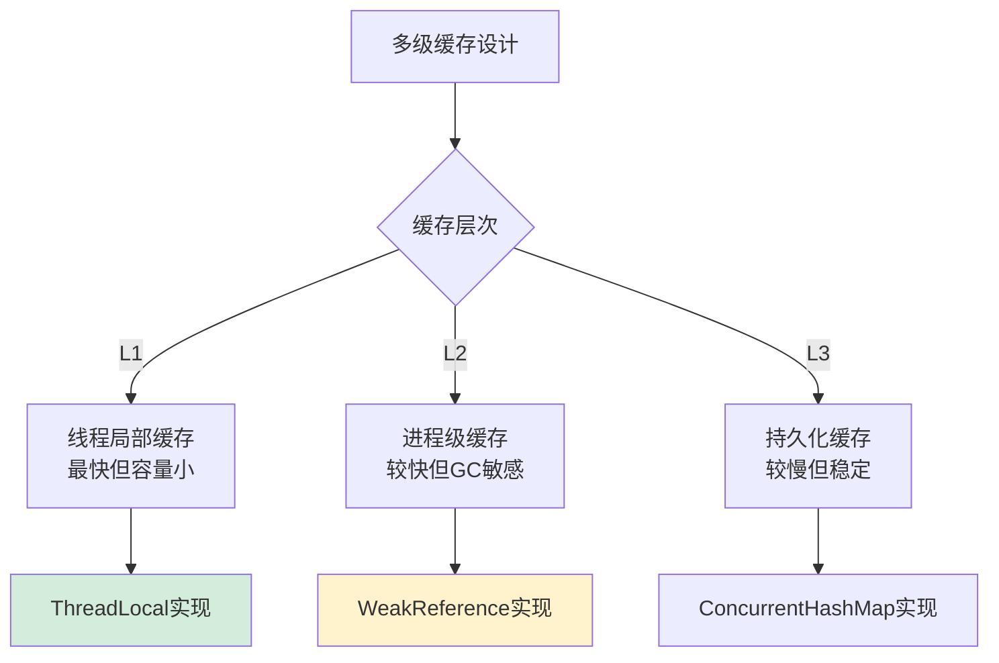
```mermaid
graph TB
    A[多级缓存设计] --> B{缓存层次}
    B -->|L1| C[线程局部缓存<br/>最快但容量小]
    B -->|L2| D[进程级缓存<br/>较快但GC敏感]
    B -->|L3| E[持久化缓存<br/>较慢但稳定]
    
    C --> F[ThreadLocal实现]
    D --> G[WeakReference实现]
    E --> H[ConcurrentHashMap实现]
    
    style F fill:#d4edda
    style G fill:#fff3cd
```

### 5.5 线程安全保证

**线程安全设计案例**：某金融系统通过字符串设计保证交易安全。

```java
// 线程安全的字符串操作
class FinancialTransaction {
    private final String accountNumber;  // 不可变，线程安全
    private volatile String status;      // 可变状态需要同步
    
    public FinancialTransaction(String accountNumber) {
        this.accountNumber = accountNumber.intern();  // 常量池共享
        this.status = "PENDING";
    }
    
    public synchronized void updateStatus(String newStatus) {
        this.status = newStatus;  // 同步修改
    }
    
    // 读操作无需同步
    public String getAccountNumber() {
        return accountNumber;  // 安全：不可变
    }
}
```

**线程安全设计哲学**：

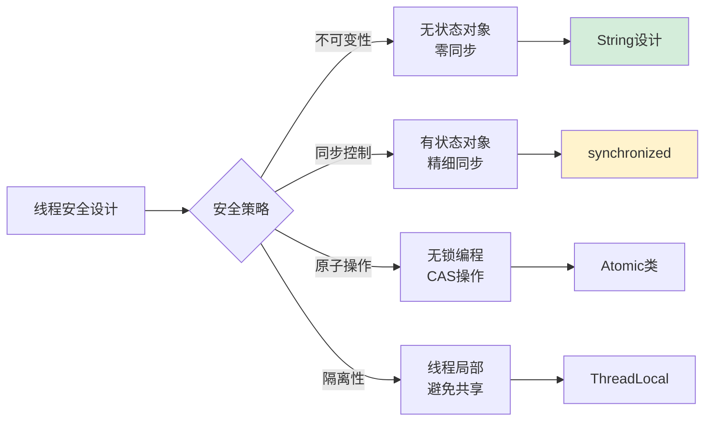
```mermaid
flowchart LR
    A[线程安全设计] --> B{安全策略}
    B -->|不可变性| C[无状态对象<br/>零同步]
    B -->|同步控制| D[有状态对象<br/>精细同步]
    B -->|原子操作| E[无锁编程<br/>CAS操作]
    B -->|隔离性| F[线程局部<br/>避免共享]
    
    C --> G[String设计]
    D --> H[synchronized]
    E --> I[Atomic类]
    F --> J[ThreadLocal]
    
    style G fill:#d4edda
    style H fill:#fff3cd
```

### 5.6 缓存池架构设计

**缓存池案例**：某Web服务器通过字符串池优化内存使用。

```java
// 字符串池架构
class StringPool {
    private static final int MAX_SIZE = 10000;
    private final LinkedHashMap<String, String> pool;
    
    public StringPool() {
        this.pool = new LinkedHashMap<String, String>(16, 0.75f, true) {
            @Override
            protected boolean removeEldestEntry(Map.Entry eldest) {
                return size() > MAX_SIZE;
            }
        };
    }
    
    public String intern(String str) {
        synchronized (pool) {
            return pool.computeIfAbsent(str, k -> k);
        }
    }
    
    public void cleanup() {
        synchronized (pool) {
            pool.clear();
        }
    }
}
```

**缓存池设计哲学**：

```mermaid
graph TB
    A[缓存池设计] --> B{设计目标}
    B -->|内存优化| C[减少重复对象<br/>节省内存]
    B -->|性能优化| D[快速查找<br/>减少创建]
    B -->|生命周期管理| E[LRU策略<br/>防止泄漏]
    B -->|并发控制| F[同步策略<br/>线程安全]
    
    C --> G[内存节省]
    D --> H[性能提升]
    E --> I[资源管理]
    F --> J[并发安全]
    
    style G fill:#d4edda
    style H fill:#fff3cd
```

### 5.7 拼接性能优化

**拼接优化案例**：某日志框架通过StringBuilder优化提升性能。

```java
// 字符串拼接性能对比
class StringConcatenation {
    // 错误：频繁创建StringBuilder
    public String inefficientConcat(String[] parts) {
        String result = "";
        for (String part : parts) {
            result += part;  // 每次循环创建StringBuilder！
        }
        return result;
    }
    
    // 正确：复用StringBuilder
    public String efficientConcat(String[] parts) {
        StringBuilder builder = new StringBuilder();
        for (String part : parts) {
            builder.append(part);  // 复用同一个builder
        }
        return builder.toString();
    }
    
    // 最优：预估容量
    public String optimalConcat(String[] parts) {
        int totalLength = 0;
        for (String part : parts) {
            totalLength += part.length();
        }
        
        StringBuilder builder = new StringBuilder(totalLength);
        for (String part : parts) {
            builder.append(part);
        }
        return builder.toString();
    }
}
```

**拼接优化设计哲学**：

```mermaid
quadrantChart
    title 字符串拼接策略选择
    x-axis "代码简洁性" --> "性能优化"
    y-axis "内存使用" --> "开发效率"
    quadrant-1 "平衡型"
    quadrant-2 "性能型"
    quadrant-3 "简洁型"
    quadrant-4 "优化型"
    
    "+操作符": [0.9, 0.2]
    "StringBuilder": [0.6, 0.8]
    "StringBuffer": [0.4, 0.7]
    "预分配": [0.3, 0.9]
```

### 5.8 传输安全保障

**安全传输案例**：某加密系统通过字符串设计防止敏感信息泄露。

```java
// 安全字符串处理
class SecureStringHandling {
    // 敏感信息使用char数组，可手动清理
    public void processPassword(char[] password) {
        try {
            // 处理密码
            authenticate(password);
        } finally {
            // 清理内存
            Arrays.fill(password, '\0');
        }
    }
    
    // 避免使用String存储敏感信息
    public void insecureProcess(String password) {
        // String不可变，无法清理内存
        // 可能留在内存中
        authenticate(password.toCharArray());
    }
}
```

**安全设计哲学**：

```mermaid
flowchart TD
    A[安全设计原则] --> B{安全策略}
    B -->|内存清理| C[使用char数组<br/>可手动清理]
    B -->|不可变性| D[避免String<br/>敏感信息]
    B -->|传输加密| E[HTTPS/TLS<br/>传输安全]
    B -->|存储加密| F[数据库加密<br/>存储安全]
    
    C --> G[手动内存管理]
    D --> H[安全编码规范]
    E --> I[网络安全]
    F --> J[数据安全]
    
    style G fill:#d4edda
    style H fill:#fff3cd
```
