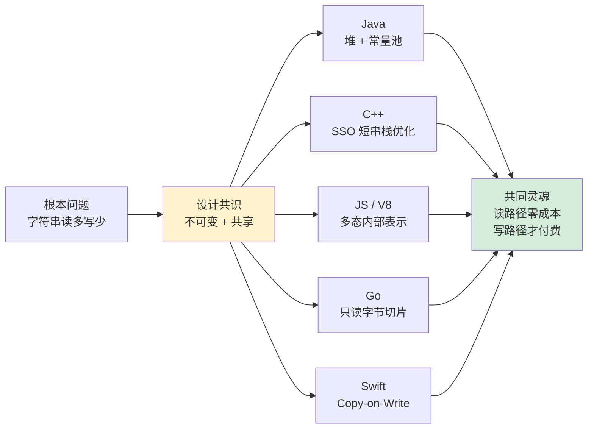

# 01.字符串设计的灵魂

> 📍 **本篇位置**：第 1 卷 · 类型与抽象 · 第 1 篇
> 🎯 **核心矛盾**：字符串"读多写少"——如何在**节省内存**与**保证安全**之间取舍？
> 🧭 **设计灵魂**：**不可变 + 共享池**是所有现代语言的共识；差异在于"共享"做到哪一层
> 🌐 **跨语言覆盖**：Java(常量池) · C++(SSO) · JavaScript(V8 内部多态表示) · Go(只读切片) · Swift(COW)
> 🔗 **延伸阅读**：→ [02.浮点型数据设计灵魂](./02.浮点型数据设计灵魂.md) · → [04.泛型设计灵魂思想](./04.泛型设计灵魂思想.md)



---

#### 目录介绍
- [1.字符串设计前沿](#1字符串设计前沿)
  - [1.1 字符串核心挑战](#11-字符串核心挑战)
  - [1.2 设计目标原则](#12-设计目标原则)
  - [1.3 String考点分析](#13-string考点分析)
- [2.设计哲学演进](#2设计哲学演进)
  - [2.1 原始直接](#21-原始直接)
  - [2.2 面向对象封装](#22-面向对象封装)
  - [2.3 不可变性设计](#23-不可变性设计)
  - [2.4 智能优化](#24-智能优化)
  - [2.5 设计字符串考量](#25-设计字符串考量)
- [3.内存管理策略](#3内存管理策略)
  - [3.1 来看一个案例](#31-来看一个案例)
  - [3.2 常量池理念](#32-常量池理念)
  - [3.3 常量池实现机制](#33-常量池实现机制)
  - [3.4 空间换时间权衡](#34-空间换时间权衡)
  - [3.5 内存泄漏防护机制](#35-内存泄漏防护机制)
- [4.字符串创建机制](#4字符串创建机制)
  - [4.1 字面量创建](#41-字面量创建)
  - [4.2 构造函数创建](#42-构造函数创建)
  - [4.3 动态创建机制](#43-动态创建机制)
  - [4.4 对+重载做了什么](#44-对重载做了什么)
- [5.字符串核心设计](#5字符串核心设计)
  - [5.1 数据结构设计](#51-数据结构设计)
  - [5.2 不可变性保证](#52-不可变性保证)
  - [5.3 并发访问优化](#53-并发访问优化)
  - [5.4 缓存机制设计](#54-缓存机制设计)
  - [5.5 线程安全保证](#55-线程安全保证)
  - [5.6 缓存池架构设计](#56-缓存池架构设计)
  - [5.7 拼接性能优化](#57-拼接性能优化)
  - [5.8 传输安全保障](#58-传输安全保障)


## 1.字符串设计前沿

从早期的C语言字符数组到现代高级语言的复杂字符串对象，字符串设计经历了从简单到复杂、从不安全到安全、从低效到高效的演进过程。

### 1.1 字符串核心挑战

现代字符串设计需要平衡以下关键因素：

**性能与安全的权衡**：1.高效的内存使用与安全的边界检查；2.快速的字符串操作与线程安全保障

**内存管理的复杂性**：1.动态内存分配的开销控制；2.内存碎片的产生和管理；3.垃圾回收与手动管理的选择

**并发环境的适应性**：1.多线程访问的安全性保障；2.锁竞争的最小化策略；3.无锁算法的合理应用

**国际化支持需求**：1.Unicode标准的完整支持；2.不同编码格式的兼容处理

### 1.2 设计目标原则

优秀的字符串设计应该遵循以下核心原则：

1. **安全第一**：防止缓冲区溢出、注入攻击等安全威胁
2. **性能优化**：最小化内存使用和计算开销
3. **线程安全**：支持多线程环境下的安全访问
4. **易用性**：提供直观、一致的API接口
5. **可扩展性**：支持未来功能扩展和性能优化

### 1.3 String考点分析

基础的问题思考，如下所示：

- String字符串是如何设计与实现考量的？String为什么要设计成不可变的？有何优缺点？
- String字符串缓存 intern()方法，由永久代移到堆中。请说下String与StringBuffer区别？
- String 的演化，Java 9 中底层把 char 数组换成了 byte 数组，占用更少的空间，为什么要这样设计？

一些考点分析，由考点来了解前因后果的字符串设计思想

- 通过 String 和相关类，考察基本的线程安全设计与实现，各种基础编程实践。
- 考察 JVM 对象缓存机制的理解以及如何良好地使用。
- 考察 JVM 优化 Java 代码的一些技巧。
- String 相关类的演进，比如 Java 9 中实现的巨大...

## 2.设计哲学演进

### 2.1 原始直接

**第一阶段：原始直接（C语言时代）**：在C语言中，字符串被设计为以null结尾的字符数组：

```c
// C语言字符串的基本设计
char str[100];                    // 固定大小数组
char *ptr = malloc(strlen(src)+1); // 动态分配
strcpy(ptr, src);                 // 字符串复制

// 存在的问题
char buffer[10];
strcpy(buffer, "This is a very long string"); // 缓冲区溢出风险
```

**设计特点分析：**

- **优势**：内存使用直接，性能高效，系统开销小
- **劣势**：容易出现缓冲区溢出，缺乏边界检查，内存管理复杂

### 2.2 面向对象封装

**第二阶段：面向对象封装（C++/Java早期）**：面向对象语言引入了字符串类，封装了内存管理和基本操作。

```cpp
// C++字符串的封装设计
class BasicString {
private:
    char* data;
    size_t length;
    size_t capacity;
    
public:
    BasicString(const char* str) {
        length = strlen(str);
        capacity = length + 1;
        data = new char[capacity];
        strcpy(data, str);
    }
    
    ~BasicString() {
        delete[] data;
    }
    
    BasicString& operator+=(const BasicString& other) {
        size_t newLength = length + other.length;
        if (newLength >= capacity) {
            capacity = newLength * 2; // 扩容策略
            char* newData = new char[capacity];
            strcpy(newData, data);
            delete[] data;
            data = newData;
        }
        strcat(data, other.data);
        length = newLength;
        return *this;
    }
};
```

**设计改进：**

- **封装性**：隐藏了内存管理细节
- **安全性**：提供了边界检查机制
- **便利性**：提供了丰富的操作接口

### 2.3 不可变性设计

**第三阶段：不可变性设计（现代语言主流）**：现代语言普遍采用不可变字符串设计。

```java
// Java不可变字符串的设计理念
public final class ImmutableString {

    private final char[] value;
    private int hash; // 缓存哈希值
    
    public ImmutableString(String str) {
        this.value = str.toCharArray();
    }
    
    public char charAt(int index) {
        if (index < 0 || index >= value.length) {
            throw new IndexOutOfBoundsException();
        }
        return value[index];
    }
    
    // 任何"修改"操作都返回新对象
    public ImmutableString concat(String str) {
        char[] newValue = new char[value.length + str.length()];
        System.arraycopy(value, 0, newValue, 0, value.length);
        str.getChars(0, str.length(), newValue, value.length);
        return new ImmutableString(new String(newValue));
    }
    
    @Override
    public int hashCode() {
        if (hash == 0 && value.length > 0) {
            for (char c : value) {
                hash = 31 * hash + c;
            }
        }
        return hash;
    }
}
```

**不可变设计的核心优势：**

- **线程安全**：多线程可以安全共享字符串对象
- **缓存友好**：可以安全缓存哈希值等计算结果
- **简化设计**：避免了复杂的同步机制

### 2.4 智能优化

**第四阶段：智能优化（当前趋势）**：现代字符串设计引入了多种智能优化技术：

```java
// 现代字符串的智能优化设计概念
public class OptimizedString {
    private Object value; // 可能是byte[]或char[]
    private byte coder;   // 编码标识：LATIN1或UTF16
    
    // 自适应编码：根据内容选择最优存储方式
    public OptimizedString(String str) {
        if (isLatin1(str)) {
            this.coder = LATIN1;
            this.value = str.getBytes(StandardCharsets.ISO_8859_1);
        } else {
            this.coder = UTF16;
            this.value = str.toCharArray();
        }
    }
    
    public char charAt(int index) {
        if (coder == LATIN1) {
            return (char)(((byte[])value)[index] & 0xFF);
        } else {
            return ((char[])value)[index];
        }
    }

    private static final byte LATIN1 = 0;
    private static final byte UTF16 = 1;
}
```

**智能优化的关键特性：**

- **自适应编码**：根据内容自动选择最优编码方式
- **内存压缩**：Latin1字符使用单字节存储
- **性能优化**：针对不同场景采用不同策略


### 2.5 设计字符串考量

如何你是虚拟机开发工程师，你会如何设计字符串，其设计思想主要围绕以下几个核心概念：

1. 要设计不可变：为了保证字符串数据不用担心被修改，要把它设计成不可变，要保证安全性和线程安全性
2. 数据缓存池：避免创建多个相同值的字符串对象，因此需要设计一个缓存池，有就直接返回，没有就创建返回
3. 性能优化考量：遇到大量字符串拼接，要考量性能优化，要提高字符串拼接的效率
4. 安全性和可靠性：如何保证多线程下操作数据是安全的，如何保证字符串在传输中不会被修改，这块要设计
5. 共享和缓存：如何设计缓存，如何节省内存


## 3.内存管理策略

### 3.1 来看一个案例

字符串内存管理设计，是如何的呢？

1. 第一种：存放在常量池内存中。使用双引号创建的字符串常量会被放入字符串池中。 
2. 第二种：存放在堆内存中。使用 new 关键字创建的字符串对象会在堆内存中创建一个新的对象，不会放入字符串池中。

```java
// 演示堆内存与常量池的协作机制
public static void demonstrateMemoryAllocation() {
  // 1. 字符串字面量 - 存储在常量池
  String literal1 = "Hello World";
  String literal2 = "Hello World";
  System.out.println("字面量引用相等: " + (literal1 == literal2)); // true
  
  // 2. new String() - 在堆中创建新对象
  String heapString1 = new String("Hello World");
  String heapString2 = new String("Hello World");
  System.out.println("堆对象引用相等: " + (heapString1 == heapString2)); // false
  System.out.println("堆对象内容相等: " + heapString1.equals(heapString2)); // true
  
  // 3. intern()方法 - 将堆对象加入常量池
  String interned = heapString1.intern();
  System.out.println("intern后引用相等: " + (literal1 == interned)); // true
  
  // 4. 字符串拼接的内存分配
  String concat1 = "Hello" + " World"; // 编译期优化，存储在常量池
  String concat2 = new String("Hello") + new String(" World"); // 运行期拼接，在堆中
  
  System.out.println("编译期拼接: " + (literal1 == concat1)); // true
  System.out.println("运行期拼接: " + (literal1 == concat2)); // false
}
```

### 3.2 常量池理念

为什么要引入常量池：由于String在编程世界中使用过于频繁，为了避免在一个系统中产生大量的String对象，引入了字符串常量池。

其运行机制是：创建一个字符串时，首先检查池中是否有值相同的字符串对象，如果有则不需要创建直接从池中刚查找到的对象引用；如果没有则新建字符串对象，返回对象引用，并且将新创建的对象放入池中。

字符串常量池是现代JVM中的一个重要优化机制，其设计理念基于以下观察：

1. 字符串重复性高：在实际应用中，相同的字符串字面量经常出现多次，如配置项、错误消息、SQL语句等。
2. 字符串不可变性：由于字符串不可变，相同内容的字符串可以安全地共享同一个对象。
3. 内存使用优化：通过共享相同的字符串对象，可以显著减少内存使用。

### 3.3 常量池实现机制

字符串常量池的核心设计思想是“共享与重用”，目的是减少内存开销、提高性能、保证不可变性和安全性。其核心设计思想：

1. 共享与重用：避免创建内容相同的多个字符串对象，通过共享唯一的字符串实例来节省内存。设计哲学：对于不可变对象（如字符串），可以安全地被多个引用共享，而不必担心数据被修改。
2. 不可变性：字符串一旦创建，其内容就不能改变。这是常量池能够安全共享的前提。任何修改操作（如拼接、替换）都会产生新的字符串对象，而原字符串保持不变。
3. 延迟初始化：常量池通常是按需填充的，只有在需要时才将字符串放入池中，而不是预先加载所有可能字符串。
4. 线程安全：常量池被多个线程共享，因此其操作（如查找、添加）必须是线程安全的。通常通过同步机制或并发数据结构实现。

核心实现步骤（以intern方法为例），intern方法是一个本地方法（native），其具体实现由JVM完成。

1. 计算哈希值：根据字符串内容计算哈希码。维护哈希表本身也有成本（如哈希计算、冲突解决）。
2. 查找哈希表：根据哈希值找到对应的桶（bucket）。常量池本质上是一个哈希表（Hash Table），用于快速查找字符串是否存在。
3. 遍历链表：在桶中遍历链表，比较字符串内容（使用equals方法）。
4. 如果找到：返回池中已有字符串的引用。
5. 如果未找到：将当前字符串对象加入池中（即将其引用加入哈希表），然后返回该引用。

```java
// 简化的HotSpot字符串常量池实现
class StringTable : public Hashtable<oop, mtSymbol> {
private:
    // 哈希表结构
    static StringTable* _the_table;
    
    // 桶数组
    HashtableBucket<mtSymbol>* _buckets;
    
    // 当前大小
    int _current_size;
    
    // 加载因子
    float _load_factor;
    
    // 锁机制
    Mutex* _lookup_mutex;
    
public:
    // 驻留字符串
    static oop intern(oop string, TRAPS) {
        if (string == NULL) return NULL;
        
        // 1. 计算哈希值
        unsigned int hashValue = java_lang_String::hash_code(string);
        
        // 2. 查找现有字符串
        oop result = the_table()->lookup(string, hashValue);
        
        if (result != NULL) {
            // 已存在，返回现有引用
            return result;
        }
        
        // 3. 添加到常量池
        return the_table()->basic_add(string, hashValue, CHECK_NULL);
    }
    
    // 查找实现
    oop lookup(oop string, unsigned int hashValue) {
        int index = hash_to_index(hashValue);
        
        for (HashtableEntry<oop, mtSymbol>* e = bucket(index); 
             e != NULL; e = e->next()) {
            
            if (e->hash() == hashValue) {
                oop s = e->literal();
                
                // 比较字符串内容
                if (java_lang_String::equals(s, string)) {
                    return s;  // 找到相同字符串
                }
            }
        }
        return NULL;  // 未找到
    }
    
    // 添加字符串
    oop basic_add(oop string, unsigned int hashValue, TRAPS) {
        MutexLocker ml(_lookup_mutex, THREAD);
        
        // 双重检查，防止并发重复添加
        oop existing = lookup(string, hashValue);
        if (existing != NULL) {
            return existing;
        }
        
        // 创建新条目
        int index = hash_to_index(hashValue);
        HashtableEntry<oop, mtSymbol>* entry = new_entry(hashValue, string);
        add_entry(index, entry);
        
        return string;
    }
};
```

### 3.4 空间换时间权衡

常量池设计体现了经典的空间换时间权衡：

```java
// 不使用常量池的情况
public static void withoutPool() {
  long startTime = System.nanoTime();
  
  String[] strings = new String[1000];
  for (int i = 0; i < strings.length; i++) {
      strings[i] = new String("Common String"); // 每次都创建新对象
  }
  
  // 字符串比较（需要逐字符比较）
  int equalCount = 0;
  for (int i = 0; i < strings.length - 1; i++) {
      if (strings[i].equals(strings[i + 1])) {
          equalCount++;
      }
  }
  
  long endTime = System.nanoTime();
  System.out.println("不使用池化 - 时间: " + (endTime - startTime) + "ns, 相等数量: " + equalCount);
}

// 使用常量池的情况
public static void withPool() {
  long startTime = System.nanoTime();
  
  String[] strings = new String[1000];
  for (int i = 0; i < strings.length; i++) {
      strings[i] = "Common String"; // 使用字面量，自动池化
  }
  
  // 字符串比较（可以使用引用比较）
  int equalCount = 0;
  for (int i = 0; i < strings.length - 1; i++) {
      if (strings[i] == strings[i + 1]) { // 引用比较，O(1)时间复杂度
          equalCount++;
      }
  }
  
  long endTime = System.nanoTime();
  System.out.println("使用池化 - 时间: " + (endTime - startTime) + "ns, 相等数量: " + equalCount);
}
```

### 3.5 内存泄漏防护机制

常量池设计必须考虑内存泄漏问题：定期清理过期引用。

1. 使用弱引用管理对象生命周期：允许垃圾回收器在需要时回收常量池中的字符串。
2. 及时清理无效条目：通过引用队列机制，在字符串被回收后，将其对应的弱引用从哈希表中移除，避免哈希表无限增长。
3. 保持常量池功能：通过重写弱引用的hashCode和equals方法，确保常量池的查找功能基于字符串内容，同时处理字符串被回收后的情况。

```java
import java.lang.ref.Reference;
import java.lang.ref.ReferenceQueue;
import java.lang.ref.WeakReference;
import java.util.concurrent.ConcurrentHashMap;

public class WeakStringPool {
    private static class WeakString extends WeakReference<String> {
        private final int hash;

        WeakString(String referent, ReferenceQueue<? super String> q) {
            super(referent, q);
            this.hash = referent.hashCode();
        }

        @Override
        public int hashCode() {
            return hash;
        }

        @Override
        public boolean equals(Object obj) {
            if (this == obj) {
                return true;
            }
            if (!(obj instanceof WeakString)) {
                return false;
            }
            WeakString other = (WeakString) obj;
            String thisString = this.get();
            String otherString = other.get();
            if (thisString == null || otherString == null) {
                return false;
            }
            return thisString.equals(otherString);
        }
    }

    private final ConcurrentHashMap<WeakString, WeakString> pool = new ConcurrentHashMap<>();
    private final ReferenceQueue<String> queue = new ReferenceQueue<>();

    public String intern(String str) {
        if (str == null) {
            return null;
        }

        expungeStaleEntries();

        WeakString key = new WeakString(str, queue);
        WeakString existing = pool.get(key);
        if (existing != null) {
            String existingString = existing.get();
            if (existingString != null) {
                return existingString;
            }
        }

        pool.put(key, key);
        return str;
    }

    private void expungeStaleEntries() {
        Reference<? extends String> ref;
        while ((ref = queue.poll()) != null) {
            if (ref instanceof WeakString) {
                pool.remove(ref);
            }
        }
    }
}
```

> 这个设计的关键点：

使用弱引用：WeakString继承WeakReference，使得当字符串没有强引用时可以被回收。

基于内容的哈希和相等：在创建WeakString时计算并缓存字符串的哈希码，并重写equals方法，使得相同内容的字符串的弱引用被认为是相等的，这样在哈希表中就可以正确查找。

引用队列：当弱引用指向的字符串被回收时，这个弱引用会被放入引用队列。通过轮询引用队列，我们可以得到那些已经被回收的字符串对应的弱引用，然后将它们从哈希表中移除，从而防止哈希表积累无用的条目。

并发安全：使用ConcurrentHashMap来保证并发访问的安全性，并且清理操作是在访问常量池时进行的，不会引入额外的清理线程。

## 4.字符串创建机制

### 4.1 字面量创建

```java
// 字面量创建的内部机制
public class LiteralCreation {
    
    public static void demonstrateLiteralCreation() {
        // 编译期字面量处理
        String s1 = "Hello";           // 存储在常量池
        String s2 = "World";           // 存储在常量池
        String s3 = "Hello" + "World"; // 编译期优化，结果存储在常量池
        
        // 运行期字符串处理
        String s4 = s1 + s2;          // 运行期拼接，创建新对象
        String s5 = new StringBuilder(s1).append(s2).toString(); // 显式构建
        
        System.out.println("s3 == \"HelloWorld\": " + (s3 == "HelloWorld")); // true
        System.out.println("s4 == \"HelloWorld\": " + (s4 == "HelloWorld")); // false
        System.out.println("s5 == \"HelloWorld\": " + (s5 == "HelloWorld")); // false
    }
    
    // 编译期常量折叠
    private static final String CONSTANT_PREFIX = "Prefix_";
    private static final String CONSTANT_SUFFIX = "_Suffix";
    
    public static void constantFolding() {
        // 这些都会在编译期被优化为单一字面量
        String folded1 = CONSTANT_PREFIX + "Middle" + CONSTANT_SUFFIX;
        String folded2 = "Prefix_" + "Middle" + "_Suffix";
        String folded3 = "Prefix_Middle_Suffix";
        
        // 所有引用都指向同一个常量池对象
        System.out.println("编译期折叠结果相等: " + 
            (folded1 == folded2 && folded2 == folded3)); // true
    }
}
```

### 4.2 构造函数创建

```java
public static void demonstrateConstructorCreation() {
  String original = "Original String";
  
  // 不同构造函数的内存分配行为
  String copy1 = new String(original);           // 堆中创建新对象
  String copy2 = new String(original.toCharArray()); // 从字符数组创建
  String copy3 = new String(original.getBytes(), StandardCharsets.UTF_8); // 从字节数组创建
  
  // 引用比较
  System.out.println("original == copy1: " + (original == copy1)); // false
  System.out.println("copy1 == copy2: " + (copy1 == copy2));       // false
  
  // 内容比较
  System.out.println("original.equals(copy1): " + original.equals(copy1)); // true
  System.out.println("copy1.equals(copy2): " + copy1.equals(copy2));       // true
}
```

### 4.3 动态创建机制

```java
// 高效的动态字符串创建
public static String createOptimized(String prefix, int number, String suffix) {
    // 预估容量，避免多次扩容
    int estimatedLength = prefix.length() + 10 + suffix.length(); // 10位数字的估算
    StringBuilder sb = new StringBuilder(estimatedLength);
    
    return sb.append(prefix)
             .append(number)
             .append(suffix)
             .toString();
}
```

### 4.4 对+重载做了什么

来一道思考题：很明确，代码输出的结果是："111111222222"，但是它工作原理是怎样的呢？

```java
String str1 = "111111";
String str2 = "222222";
String str = str1 + str2;
System.out.println(str);
```

由于字符串拼接太常用了，java才支持可以直接用+号对两个字符串进行拼接。有人把Java中使用`+`拼接字符串的功能理解为**运算符重载**。

这其实只是Java提供的一个**语法糖**。**其真正实现的原理是中间通过建立临时的StringBuilder对象，然后调用append方法实现**。

如何验证呢？上述代码文件写在Test.java main方法中，使用<b>javac Test.java</b>编译，在执行<b>javap -verbose Test</b>，可以看到如下信息：

```bash
0: ldc           #2                  // String 111111
2: astore_1
3: ldc           #3                  // String 222222
5: astore_2
6: new           #4                  // class java/lang/StringBuilder
9: dup
10: invokespecial #5                  // Method java/lang/StringBuilder."":()V
13: aload_1
14: invokevirtual #6                  // Method java/lang/StringBuilder.append:(Ljava/lang/String;)Ljava/lang/StringBuilder;
17: aload_2
18: invokevirtual #6                  // Method java/lang/StringBuilder.append:(Ljava/lang/String;)Ljava/lang/StringBuilder;
21: invokevirtual #7                  // Method java/lang/StringBuilder.toString:()Ljava/lang/String;
24: astore_3
25: getstatic     #8                  // Field java/lang/System.out:Ljava/io/PrintStream;
28: aload_3
29: invokevirtual #9                  // Method java/io/PrintStream.println:(Ljava/lang/String;)V
32: return
```

对于java来说，这段代码原理上应该是：

```java
String str1 = "111111";
String str2 = "222222";
StringBuilder sb = new StringBuilder();
sb.append(str1);
sb.append(str2);
String str = sb.toString();
System.out.println(str);
```


## 5.字符串核心设计

### 5.1 数据结构设计

讨论字符串的数据结构设计，主要考虑两个方面：一是字符的表示（使用char数组还是byte数组），二是内存的布局和编码方式。

明确一点：字符串是由字符组成的序列，而字符的表示方式（即编码）决定了存储格式。

> 历史演进：

早期，Java使用char数组（UTF-16编码）来存储字符串。每个char占用2个字节。

从Java 9开始，引入了紧凑字符串（Compact Strings）的概念，将字符串的存储改为byte数组，并附带一个编码标志（coder）。这样，对于纯Latin-1字符（每个字符只需1字节）的字符串，可以节省内存。

> 核心思想：

内存效率：尽可能减少内存占用，同时保持操作的性能。

国际化支持：需要支持多种语言，特别是非Latin-1字符（如中文、日文、韩文等），这些字符通常需要多字节编码。

> 设计权衡：

使用char数组（UTF-16）： 优点：编码统一，每个字符固定2字节，处理简单，支持所有Unicode字符（包括补充字符）。缺点：对于大量ASCII或Latin-1字符，内存浪费一倍。

使用byte数组（带有编码标志）： 优点：根据字符串内容动态选择编码（Latin-1或UTF-16），节省内存。缺点：处理复杂，需要根据编码进行分支处理，可能带来性能开销。

> Char数组的优势与问题分析

```java
// Java 8 String 实现
public final class String_Java8 {
    // 核心：char数组存储
    private final char value[];
    // 哈希值缓存
    private int hash; // Default to 0
    
    // 构造器
    public String_Java8(char value[]) {
        this.value = Arrays.copyOf(value, value.length);
    }
    
    // 获取字符
    public char charAt(int index) {
        if ((index < 0) || (index >= value.length)) {
            throw new StringIndexOutOfBoundsException(index);
        }
        return value[index];
    }
}

// Char数组的优势与问题分析
class CharArrayAnalysis {
    
    // 优势1：简单直观
    static class Advantages {
        // 1. 定长编码，随机访问O(1)
        public static char getChar(String str, int index) {
            return str.charAt(index);  // 直接数组索引
        }
        
        // 2. 处理简单，无需解码
        public static int countChars(String str) {
            return str.length();  // 字符数 = 数组长度
        }
        
        // 3. 支持所有BMP字符
        public static boolean supportsAllBMP(String str) {
            for (int i = 0; i < str.length(); i++) {
                if (str.charAt(i) > 0xFFFF) {
                    return false;  // 超出BMP需要代理对
                }
            }
            return true;
        }
    }
    
    // 问题1：内存浪费
    static class MemoryWaste {
        public static void analyzeWaste(String str) {
            int latin1Count = 0;
            int total = str.length();
            
            for (int i = 0; i < total; i++) {
                if (str.charAt(i) <= 0xFF) {
                    latin1Count++;
                }
            }
            
            double latin1Ratio = (double)latin1Count / total;
            double wasteRatio = 1 - latin1Ratio;  // 非Latin-1字符比例
            
            if (latin1Ratio > 0.8) {
                System.out.printf("高度浪费: %.1f%%字符可用1字节存储\n", 
                    latin1Ratio * 100);
            }
        }
    }
    
    // 问题2：代理对处理复杂
    static class SurrogatePairs {
        // UTF-16代理对：高代理 D800-DBFF，低代理 DC00-DFFF
        public static int codePointCount(String str) {
            int codePoints = 0;
            for (int i = 0; i < str.length(); i++) {
                char c = str.charAt(i);
                if (Character.isHighSurrogate(c)) {
                    i++;  // 跳过低代理
                }
                codePoints++;
            }
            return codePoints;
        }
        
        // 获取代码点（可能跨两个char）
        public static int getCodePoint(String str, int index) {
            char high = str.charAt(index);
            if (Character.isHighSurrogate(high) && 
                index + 1 < str.length()) {
                char low = str.charAt(index + 1);
                if (Character.isLowSurrogate(low)) {
                    return Character.toCodePoint(high, low);
                }
            }
            return high;
        }
    }
}
```

> Byte数组设计：现代内存优化方案（Java 9+）

为何要将char数组换成byte数据

为了节省内存空间，Java 9中的Compact Strings特性将String类的内部表示从char数组改为byte数组。这意味着对于只包含ASCII字符的字符串，每个字符只需要占用1个字节的空间，而不再是2个字节。

将char数组换成byte数据，对只包含ASCII字符的字符串进行内存优化，减少了字符串对象的内存占用。这种设计可以在存储大量ASCII字符的字符串时节省内存空间。

### 5.2 不可变性保证

将 String 类设计成不可变的带来了诸多优势，包括线程安全性、安全性、性能优化、简化并发编程、简化代码逻辑等。

String主要的三个成员变量

- char value[]， int offset, int count均是private，final的，并且没有对应的 getter/setter;
- String 对象一旦初始化完成，上述三个成员变量就不可修改；并且其所提供的接口任何对这些域的修改都将返回一个新对象；

被声明成为 final class，所有属性也都是final的。也由于它的不可变，类似拼接、裁剪字符串等动作，都会产生新的 String 对象。


```java
// 线程安全的不可变字符串设计
public final class ThreadSafeString {
    // 所有字段都是final，确保不可变性
    private final char[] value;
    private final int offset;
    private final int count;
    private volatile int hash; // 使用volatile保证可见性
    
    // 构造函数：防御性复制
    public ThreadSafeString(char[] chars) {
        if (chars == null) {
            throw new NullPointerException("Input array cannot be null");
        }
        
        // 防御性复制，防止外部修改
        this.value = new char[chars.length];
        System.arraycopy(chars, 0, this.value, 0, chars.length);
        this.offset = 0;
        this.count = chars.length;
    }
    
    // 字符访问：线程安全的读操作
    public char charAt(int index) {
        if (index < 0 || index >= count) {
            throw new IndexOutOfBoundsException("Index: " + index + ", Length: " + count);
        }
        return value[offset + index];
    }
    
    public int length() {
        return count;
    }
    
    // 线程安全的哈希计算
    @Override
    public int hashCode() {
        int h = hash;
        if (h == 0 && value.length > 0) {
            // 使用局部变量避免重复计算
            for (char c : value) {
                h = 31 * h + c;
            }
            hash = h; // 最后赋值，保证原子性
        }
        return h;
    }
    
    // 线程安全的比较操作
    @Override
    public boolean equals(Object obj) {
        if (this == obj) return true;
        if (!(obj instanceof ThreadSafeString)) return false;
        
        ThreadSafeString other = (ThreadSafeString) obj;
        
        // 长度比较
        if (value.length != other.value.length) return false;
        
        // 逐字符比较
        for (int i = 0; i < value.length; i++) {
            if (value[i] != other.value[i]) {
                return false;
            }
        }
        
        return true;
    }
}
```

String不可变好处

1. **可以缓存 hash 值**。因为 String 的 hash 值经常被使用，例如 String 用做 HashMap 的 key。不可变的特性可以使得 hash 值也不可变，因此只需要进行一次计算。
2. **String Pool 的需要**。如果一个String对象已经被创建过了，那么就会从 String Pool 中取得引用。只有 String 是不可变的，才可能使用 String Pool。
3. **安全性**。String 经常作为参数，String 不可变性可以保证参数不可变。例如在作为网络连接参数的情况下如果 String 是可变的，那么在网络连接过程中，String 被改变，改变 String 对象的那一方以为现在连接的是其它主机，而实际情况却不一定是。
4. **线程安全**。String 不可变性天生具备线程安全，可以在多个线程中安全地使用。
5. **效率和复用**。由于字符串是不可变的，可以在字符串常量池中共享相同的字符串对象，以节省内存空间。这在一些性能敏感的场景中非常有用，避免了频繁的字符串创建和销毁。

总结来说：不可变字符串的设计有助于提高程序的性能、安全性和可维护性，同时简化了并发编程和内存管理。

### 5.3 并发访问优化

字符串的并发访问优化是一个复杂但重要的话题，尤其在多线程环境下。核心设计思路包括：不可变性、线程局部存储、读写分离、无锁数据结构、分段锁等。

1. 不可变字符串：天生线程安全，因为无法被修改，所以可以自由地在多个线程间共享，无需同步。所有修改操作都返回新字符串，内部状态用final修饰。
2. 线程局部存储：为每个线程维护独立的字符串缓存，避免线程间的竞争。将全局竞争转化为局部变量，牺牲空间换取无锁性能。
3. 读写分离：区分读操作和写操作，针对不同操作采用不同的同步策略。读操作可以并行，写操作需要互斥，读写之间需要协调。
4. 无锁数据结构：使用CAS（Compare-and-Swap）等原子操作实现线程安全，避免锁带来的开销。通过硬件支持的原子指令实现非阻塞同步。
5. 分段锁：将数据分片，每个分片使用独立的锁，减少锁的粒度。将全局锁竞争分散到多个局部锁，提高并发度。

```java
// 并发环境下的字符串操作优化
public class ConcurrentStringOperations {
    
    // 线程安全的字符串缓存
    private final ConcurrentHashMap<String, String> cache = new ConcurrentHashMap<>();
    
    // 线程安全的字符串规范化
    public String normalize(String input) {
        if (input == null) return null;
        
        // 使用computeIfAbsent保证原子性
        return cache.computeIfAbsent(input, key -> {
            // 执行规范化操作
            return key.trim().toLowerCase().intern();
        });
    }
    
    // 并发安全的字符串构建
    public static class ConcurrentStringBuilder {
        private final Object lock = new Object();
        private StringBuilder builder;
        
        public ConcurrentStringBuilder(int capacity) {
            this.builder = new StringBuilder(capacity);
        }
        
        public ConcurrentStringBuilder append(String str) {
            synchronized (lock) {
                builder.append(str);
                return this;
            }
        }
        
        public String build() {
            synchronized (lock) {
                return builder.toString();
            }
        }
        
        public void clear() {
            synchronized (lock) {
                builder.setLength(0);
            }
        }
    }
    
    // 无锁的字符串操作
    public static class LockFreeStringProcessor {
        private final AtomicReference<String> current = new AtomicReference<>("");
        
        public void append(String str) {
            String currentValue, newValue;
            do {
                currentValue = current.get();
                newValue = currentValue + str;
            } while (!current.compareAndSet(currentValue, newValue));
        }
        
        public String get() {
            return current.get();
        }
        
        public void reset() {
            current.set("");
        }
    }
}
```

### 5.4 缓存机制设计


```java
// 字符串常量池的实现原理
public class StringPoolMechanism {
    
    // 模拟JVM字符串常量池的核心逻辑
    public static class StringPoolSimulator {
        // 使用WeakHashMap模拟常量池，允许垃圾回收
        private final Map<String, WeakReference<String>> pool = 
            Collections.synchronizedMap(new WeakHashMap<>());
        
        private final AtomicLong hitCount = new AtomicLong(0);
        private final AtomicLong missCount = new AtomicLong(0);
        
        public String intern(String str) {
            if (str == null) return null;
            
            // 检查池中是否已存在
            WeakReference<String> ref = pool.get(str);
            if (ref != null) {
                String pooled = ref.get();
                if (pooled != null) {
                    hitCount.incrementAndGet();
                    return pooled; // 缓存命中
                }
            }
            
            // 缓存未命中，创建新条目
            missCount.incrementAndGet();
            String canonical = new String(str); // 创建规范实例
            pool.put(canonical, new WeakReference<>(canonical));
            return canonical;
        }
        
        public PoolStatistics getStatistics() {
            return new PoolStatistics(
                pool.size(),
                hitCount.get(),
                missCount.get()
            );
        }
        
        // 手动清理过期条目
        public int cleanup() {
            int removed = 0;
            synchronized (pool) {
                Iterator<Map.Entry<String, WeakReference<String>>> it = 
                    pool.entrySet().iterator();
                
                while (it.hasNext()) {
                    Map.Entry<String, WeakReference<String>> entry = it.next();
                    if (entry.getValue().get() == null) {
                        it.remove();
                        removed++;
                    }
                }
            }
            return removed;
        }
    }
    
    public static class PoolStatistics {
        public final int poolSize;
        public final long hitCount;
        public final long missCount;
        
        public PoolStatistics(int poolSize, long hitCount, long missCount) {
            this.poolSize = poolSize;
            this.hitCount = hitCount;
            this.missCount = missCount;
        }
        
        public double getHitRatio() {
            long total = hitCount + missCount;
            return total > 0 ? (double) hitCount / total : 0.0;
        }
        
        @Override
        public String toString() {
            return String.format("Pool[size=%d, hits=%d, misses=%d, ratio=%.2f%%]",
                poolSize, hitCount, missCount, getHitRatio() * 100);
        }
    }
}
```

### 5.5 线程安全保证

字符串的线程安全分为三个层次：

**第一层：不可变性天生线程安全**

String对象一旦创建，内部状态不可变。多个线程同时读取同一个String对象，无需任何同步。

```java
// 安全：不可变对象在多线程间自由共享
String sharedConfig = "database.url=localhost:3306";
// 100个线程同时读取sharedConfig，完全安全
```

**第二层：可变字符串的线程安全**

| 类 | 线程安全 | 性能 | 实现机制 |
|---|---------|------|---------|
| String | 安全（不可变） | 最高（读操作） | final字段+不可变语义 |
| StringBuffer | 安全（同步） | 较低 | synchronized关键字 |
| StringBuilder | 不安全 | 最高（写操作） | 无同步 |

```java
// StringBuffer: 所有方法加synchronized
public synchronized StringBuffer append(String str) {
    toStringCache = null;
    super.append(str);  // 调用AbstractStringBuilder
    return this;
}

// StringBuilder: 不加锁，单线程使用
public StringBuilder append(String str) {
    super.append(str);  // 相同实现，无synchronized
    return this;
}
```

**第三层：hash值缓存的"良性竞争"**

```java
// String.hashCode()中的经典模式
public int hashCode() {
    int h = hash;  // 读取缓存值（可能是0）
    if (h == 0 && value.length > 0) {
        char val[] = value;
        for (int i = 0; i < value.length; i++) {
            h = 31 * h + val[i];
        }
        hash = h;  // 写入缓存
    }
    return h;
}
// 多线程可能重复计算hashCode，但结果一定相同（确定性计算）
// 这是故意允许的"良性数据竞争"——重复计算好过加锁
```

### 5.6 缓存池架构设计

字符串常量池的架构经历了重要演进：

```
Java 6及之前:
  常量池位于 永久代(PermGen)
  问题: 永久代空间固定且有限，大量intern()可能OOM

Java 7:
  常量池移至 堆(Heap)
  优势: 可以被GC回收，空间更灵活

Java 8+:
  永久代被元空间(Metaspace)替代
  常量池仍在堆中
```

**常量池的底层数据结构**：本质是一个**固定桶数的哈希表**（StringTable）。

```
StringTable (哈希表):
  默认桶数: 60013 (Java 8+, 可通过 -XX:StringTableSize 调整)
  
  bucket[0] → Entry("hello") → Entry("world") → null
  bucket[1] → null
  bucket[2] → Entry("java") → null
  ...
  
  查找: O(1)平均，O(n)最坏（哈希碰撞链）
  插入: 加锁保证线程安全
```

**intern()的使用建议**：

```java
// 好的使用场景：大量重复字符串（如XML解析中的标签名）
for (Element element : xmlElements) {
    String tagName = element.getTagName().intern();  // 大量重复的标签名共享
}

// 不好的使用场景：大量不同字符串
for (int i = 0; i < 1000000; i++) {
    String s = ("unique_" + i).intern();  // 污染常量池，无法复用
}
```

### 5.7 拼接性能优化

字符串拼接是最常见的性能陷阱。理解不同方式的底层实现至关重要：

**方式一：+ 运算符（编译器优化）**

```java
// 源代码
String result = "a" + "b" + "c";
// 编译期优化为
String result = "abc";  // 常量折叠，零开销

// 但变量拼接不能常量折叠
String a = "a";
String result = a + "b" + "c";
// Java 9之前: 编译为 new StringBuilder().append(a).append("b").append("c").toString()
// Java 9+: 编译为 invokedynamic (StringConcatFactory)，更高效
```

**方式二：StringBuilder（最佳实践）**

```java
// 循环拼接必须用StringBuilder
StringBuilder sb = new StringBuilder(estimatedSize);  // 预估容量避免扩容
for (String item : items) {
    sb.append(item);
}
String result = sb.toString();

// 反模式：循环中用+拼接
String result = "";
for (String item : items) {
    result += item;  // 每次循环创建新StringBuilder！O(n²)复杂度
}
```

**性能对比**：

```
拼接10000个字符串:
  + 运算符(循环内): ~2000ms  (每次创建StringBuilder)
  StringBuilder:     ~2ms    (一个StringBuilder，多次append)
  StringBuffer:      ~3ms    (加锁开销)
  String.join():     ~5ms    (Java 8+，语义清晰)
```

### 5.8 传输安全保障

字符串在网络传输和安全场景中的设计考量：

**不可变性保证传输完整性**

```java
// 字符串作为参数传递时不可变 → 传输过程中不会被篡改
String url = "https://api.example.com/data";
// 即使传递给多个组件，url的值永远不变
HttpClient.get(url);      // 组件A使用
Logger.log("Accessing: " + url);  // 组件B使用
// 不用担心组件A修改了url导致组件B出错
```

**安全敏感字符串的处理**

```java
// 密码等敏感信息不应使用String（不可变=无法清除）
// 推荐使用char[]，用完立即清零
char[] password = getPassword();
try {
    authenticate(password);
} finally {
    Arrays.fill(password, '\0');  // 主动清除内存中的密码
}
// String对象在GC前一直存在于内存中，可能被内存转储获取
```

**编码安全**

```java
// 字符串编码转换时的安全问题
byte[] bytes = str.getBytes(StandardCharsets.UTF_8);  // 明确指定编码
// 不要使用 str.getBytes()，它使用平台默认编码，跨平台不一致

// SQL注入防护：永远不要直接拼接用户输入
String query = "SELECT * FROM users WHERE name = '" + userInput + "'";  // 危险！
// 正确做法：使用参数化查询
PreparedStatement ps = conn.prepareStatement("SELECT * FROM users WHERE name = ?");
ps.setString(1, userInput);  // 安全
```


