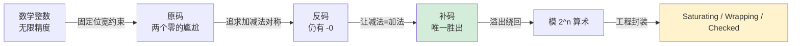
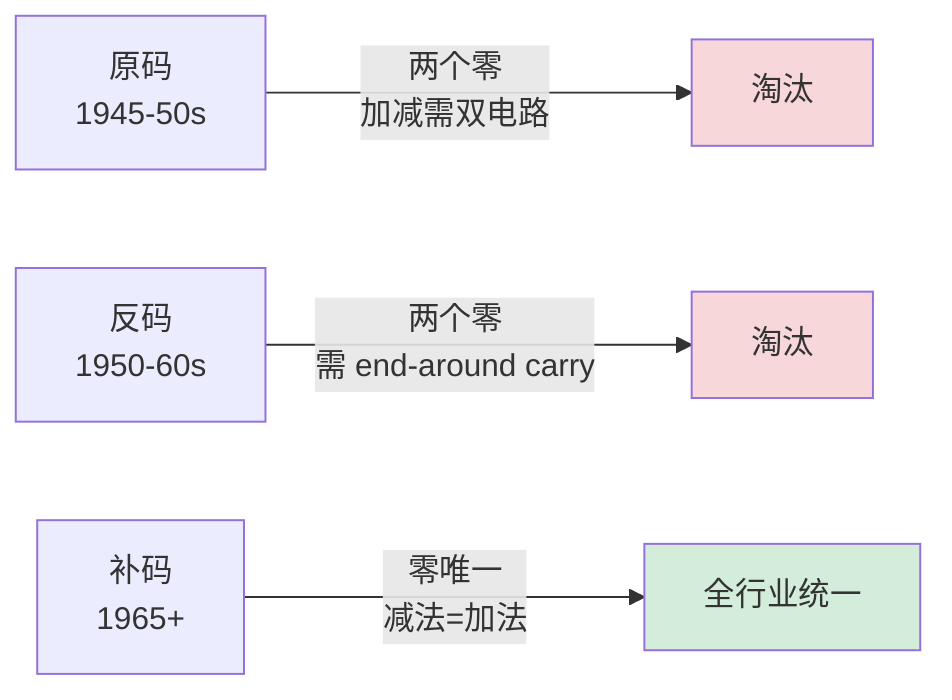
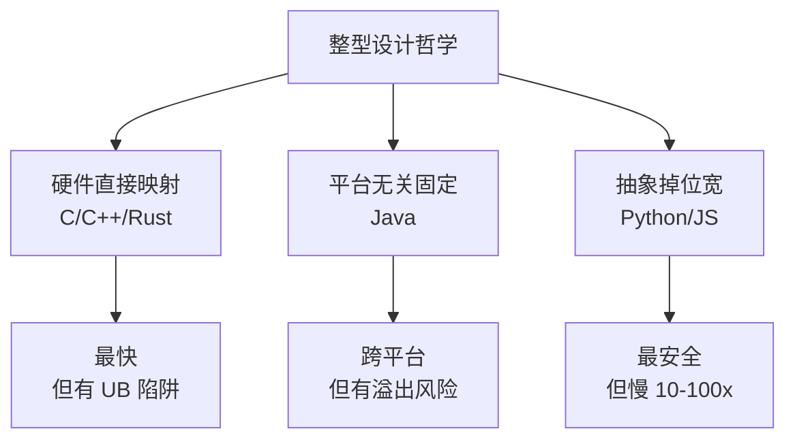

# 1.2 整型与位运算原理

📍 **本篇位置**：第 1 卷 · 数据的本质 · 第 2 篇

🎯 **核心矛盾**：**人脑的"数学整数"是无限的，CPU 的"机器整数"是有限的** —— 32 位 / 64 位的固定宽度逼着设计者在一系列"反直觉"的取舍中做出选择

🧭 **设计灵魂**：**补码**不是"为了表示负数"才发明的，而是**让减法变成加法**、**让 CPU 只需一种加法器**的工程美学；位运算不是"省一两条指令"的奇技淫巧，而是**集合论与状态压缩**在硬件层的自然投影

🌐 **跨语言覆盖**：C/C++ (UB 与编译器优化) · Java (固定大小，无符号缺失) · Rust (Saturating/Wrapping/Checked 三套语义) · Python (任意精度大整数) · Go (有符号溢出绕回)

🎯 **阅读建议**：本章不是"知识陈列"，是"侦探推理"。每一节都从一个反直觉现象出发，让你跟着设计者的思路把答案"推"出来——而不是"被告知"。

---

#### 目录介绍

- [1.真实事故引入](#1真实事故引入)
  - [1.1 二分查找的故障](#11-二分查找的故障)
  - [1.2 灵魂的三问](#12-灵魂的三问)
  - [1.3 本篇探索路径](#13-本篇探索路径)
  - [1.4 本章学习价值](#14-本章学习价值)
- [2.整型三次范式跃迁](#2整型三次范式跃迁)
  - [2.1 第一性原理](#21-第一性原理)
  - [2.2 原码设计尴尬](#22-原码设计尴尬)
  - [2.3 反码只解一半](#23-反码只解一半)
  - [2.4 补码革命性设计](#24-补码革命性设计)
  - [2.5 三种方案对比](#25-三种方案对比)
- [3.补码的数学之美与硬件根源](#3补码的数学之美与硬件根源)
  - [3.1 把整数看作一个环不是线](#31-把整数看作一个环不是线)
  - [3.2 一个让你顿悟的等式](#32-一个让你顿悟的等式)
  - [3.3 为什么-1是全一的二进制](#33-为什么-1是全一的二进制)
  - [3.4 加法器电路的诚实之美](#34-加法器电路的诚实之美)
  - [3.5 补码留下的黑洞](#35-补码留下的黑洞)
- [4.整数溢出与边界陷阱](#4整数溢出与边界陷阱)
  - [4.1 溢出的物理本质](#41-溢出的物理本质)
  - [4.2 无符号溢出：定义良好的环回](#42-无符号溢出定义良好的环回)
  - [4.3 有符号溢出：C/C++的UB深坑](#43-有符号溢出cc的ub深坑)
    - [4.3.1 GCC 真实优化案例](#431-gcc-真实优化案例)
    - [4.3.2 为什么 C 标准要把它定为 UB？](#432-为什么-c-标准要把它定为-ub)
    - [4.3.3 二分查找 BUG 的"教科书修复"](#433-二分查找-bug-的教科书修复)
  - [4.4 现代语言的整数语义方案](#44-现代语言的整数语义方案)
- [5.位运算的本质：集合论与状态压缩](#5位运算的本质集合论与状态压缩)
  - [5.1 位运算与集合运算的对应](#51-位运算与集合运算的对应)
  - [5.2 经典技巧的原理推导](#52-经典技巧的原理推导)
    - [5.2.1 判断 2 的幂：x & (x - 1) == 0](#521-判断-2-的幂x--x---1--0)
    - [5.2.2 不用临时变量交换两个数：a ^= b; b ^= a; a ^= b;](#522-不用临时变量交换两个数a--b-b--a-a--b)
    - [5.2.3 找出唯一的非重复元素](#523-找出唯一的非重复元素)
  - [5.3 位运算在工程中的真实威力](#53-位运算在工程中的真实威力)
    - [5.3.1 位图（Bitmap）：内存压缩 8 倍](#531-位图bitmap内存压缩-8-倍)
    - [5.3.2 Bloom Filter：用位运算实现"概率集合"](#532-bloom-filter用位运算实现概率集合)
    - [5.3.3 SIMD 与位并行：一条指令处理 256 位](#533-simd-与位并行一条指令处理-256-位)
  - [5.4 位运算vs算术运算的陷阱](#54-位运算vs算术运算的陷阱)
- [6.字节序与对齐：跨越机器边界的难题](#6字节序与对齐跨越机器边界的难题)
  - [6.1 字节序：为什么有大端和小端](#61-字节序为什么有大端和小端)
    - [6.1.1 内存里读一半的整数](#611-内存里读一半的整数)
    - [6.1.2 union/struct 转字节数组](#612-unionstruct-转字节数组)
  - [6.2 网络字节序：全球协议起源](#62-网络字节序全球协议起源)
  - [6.3 对齐：硬件给软件的隐形税](#63-对齐硬件给软件的隐形税)
    - [6.3.1 为什么有对齐？](#631-为什么有对齐)
    - [6.3.2 编译器自动插入"填充字节"](#632-编译器自动插入填充字节)
    - [6.3.3 字段重排：节省内存的简单技巧](#633-字段重排节省内存的简单技巧)
    - [6.3.4 强制紧凑：`#pragma pack` 与代价](#634-强制紧凑pragma-pack-与代价)
- [7.跨语言整型设计对比](#7跨语言整型设计对比)
  - [7.1 三种典型设计哲学](#71-三种典型设计哲学)
  - [7.2 Java的无符号整数遗憾](#72-java的无符号整数遗憾)
  - [7.3 Python任意精度的代价](#73-python任意精度的代价)
- [8.经典陷阱与生产级反模式](#8经典陷阱与生产级反模式)
  - [8.1 陷阱一：abs负极值仍是负数](#81-陷阱一abs负极值仍是负数)
  - [8.2 陷阱二：二分中点计算溢出](#82-陷阱二二分中点计算溢出)
  - [8.3 陷阱三：有无符号隐式转换](#83-陷阱三有无符号隐式转换)
  - [8.4 陷阱四：左移负数属于UB](#84-陷阱四左移负数属于ub)
  - [8.5 陷阱五：无符号循环计数](#85-陷阱五无符号循环计数)
- [9.一句话总结](#9一句话总结)
  - [9.1 三层认知阶梯](#91-三层认知阶梯)
  - [9.2 七字真言](#92-七字真言)
  - [9.3 与下篇的承接](#93-与下篇的承接)

---

上一篇我们看到，"数据编码"本质上是给现实信息找到一种二进制表达。但当我们真正落到机器字长（32 位、64 位）时，会发现一个绕不过去的核心问题：

**为什么计算机选择"补码"而不是"原码"来表示整数？为什么 `int` 溢出后会"绕回"？为什么 `-1` 的二进制看起来全是 1？为什么 `INT_MIN` 取个绝对值还会得到 `INT_MIN` 自己？**

本章从一个真实工作中遇到的"诡异 BUG"出发，深入挖掘整型设计背后的硬件约束、数学美感与工程权衡，并把"位运算"这种看似底层的技巧，还原成一种通用的"集合论 + 状态压缩"思想。


## 1.真实事故引入

### 1.1 二分查找的故障

我曾参与维护一个金融订单系统，里面有一段在工业界教科书上抄了几十年的"标准二分查找"：

```java
int binarySearch(int[] arr, int target) {
    int low = 0, high = arr.length - 1;
    while (low <= high) {
        int mid = (low + high) / 2;       // ← 就是这一行
        if (arr[mid] == target) return mid;
        if (arr[mid] < target) low = mid + 1;
        else                   high = mid - 1;
    }
    return -1;
}
```

这段代码上线 5 年，跑了无数次都很正常。直到某天我们做了一次"性能压测扩容"，把单机内存里的订单数组从几万扩到了 **10 亿条**。然后线上开始报 `ArrayIndexOutOfBoundsException: -1073741819`——一个**负数**索引！

**第一反应是否定的**：`(low + high) / 2` 怎么可能算出负数？`low` 和 `high` 都是非负的啊。

但当我们把日志里的具体数字拎出来：

```
low  = 1_500_000_000
high = 1_800_000_000
low + high = ???
```

数学上 `low + high = 3.3 × 10⁹`，但 Java 的 `int` 最大值是 **2,147,483,647（约 2.14×10⁹）**。两个正数相加溢出了 `int` 上界，结果"绕回"成一个负数：

```
1_500_000_000 + 1_800_000_000 = 3_300_000_000 (数学值)
                              = 3_300_000_000 - 2³² = -994_967_296 (机器值)
                              ÷ 2 = -497_483_648
```

**`mid` 算出来是负数，访问数组时下标越界 → 进程崩溃**。

这不是我们独创的 BUG——**Joshua Bloch 在 2006 年发布的博客《Extra, Extra - Read All About It: Nearly All Binary Searches and Mergesorts are Broken》中披露**：JDK 自带的 `Arrays.binarySearch`、Sun 多个内部产品、几乎所有教科书上的二分实现，**都犯了这个错**。这个 BUG 在工业界潜伏了 **20 年**才被发现。

### 1.2 灵魂的三问

这个故事让我反复追问三个问题，它们贯穿整个第 1 卷：

**1.为什么"两个正数相加得到负数"是合法的而不是抛异常？** —— Java/C++/Go 的有符号溢出，从硬件到语言层面，整条决策链是怎么定的？

**2.为什么修复方案是 `low + (high - low) / 2` 而不是 `(low + high) / 2`？** —— 它在数学上等价，但**机器语义不等价**，差别在哪里？

**3.为什么 `int` 是 32 位而不是 31 位或 64 位？** —— 这个"位宽选择"和 1.1 章的"ASCII 7 位之谜"是同一类问题吗？

如果你能回答这三个问题，你就理解了**计算机整数与数学整数的本质鸿沟**。这一章我们就要把这条鸿沟讲透。

### 1.3 本篇探索路径



我们沿着"原码 → 反码 → 补码"的范式跃迁路径，理解为什么补码胜出；然后把溢出、位运算、字节序、对齐这些看似零散的话题，统一到"**有限位宽下的整数语义**"这个核心问题上。

### 1.4 本章学习价值

读到这里你可能会想：整数不就是 `int` 吗？至于花一整章？我想抛三个**几乎所有资深工程师都会答错**的问题：

1. **`-INT_MIN` 等于多少？** —— 直觉是 `INT_MAX`，但实际上是 **`INT_MIN` 自己**！这是补码留下的一个"黑洞"。
2. **`x = x + 1; if (x < x_old) ...` 在 C 中能用来检测溢出吗？** —— 答案是**不能**。GCC `-O2` 会直接把这个 `if` 删掉，因为"有符号溢出是未定义行为，编译器假设它不会发生"。
3. **`x & (x - 1) == 0` 为什么能判断 `x` 是 2 的幂？** —— 大多数人记得这个口诀，但说不清原理。

如果你能答出第 1 题，你理解了**补码的数轴是不对称的**；
如果你能答出第 2 题，你理解了**编译器优化与 UB 的危险共谋**；
如果你能答出第 3 题，你理解了**位运算背后的代数结构**。

这一章我们要把这三个谜底，连同它们背后的整套设计哲学，**让你亲手推导出来**——不是被告知，而是和当年的设计者一起想一遍。

---

## 2.整型三次范式跃迁

### 2.1 第一性原理

让我们从零开始。**你是 1945 年的冯·诺依曼，刚刚发明了"存储程序计算机"**。现在你要决定一件事：**用 N 位二进制表示一个整数，到底该怎么编码？**

不像数学里的整数（无限精度），N 位二进制只有 **2ⁿ 个不同的位组合**。N=8 时只有 256 种状态可用。在这 256 种状态里塞下一个整数集合，你必须做 4 个决策：

| 问题 | 选项 |
|---|---|
| **要不要支持负数？** | 是 / 否 |
| **正负数的"对称性"如何安排？** | 对称 / 不对称 |
| **零的表示是否唯一？** | 是 / 否 |
| **加法和减法用同一套电路吗？** | 是 / 否 |

这 4 个决策如何选，**直接决定了 CPU 的算术逻辑单元（ALU）有多复杂**——而 ALU 的晶体管数量在 1945 年是按"个"算的，每多一种算法就要多一组真空管。

接下来我们看人类是怎么一步步把这 4 个问题答到最优的。

### 2.2 原码设计尴尬

**最直觉的方案**：拿出最高位当符号位（0 表示正、1 表示负），剩下的位表示绝对值。

```
4 位原码示例：
  +5 = 0101    -5 = 1101
  +0 = 0000    -0 = 1000   ← 出现了"两个零"
  +7 = 0111    -7 = 1111
```

这个方案的优点是**人类一眼就能看懂**——和我们平时写"+5、-5"完全对应。但问题非常致命：

**问题一：两个零**。`+0 = 0000`，`-0 = 1000`，它们在数值上相等但在位模式上不同。这意味着 CPU 必须在每次比较时做特殊处理：`if (x == 0)` 要变成 `if (x == 0000 || x == 1000)`。**所有的等于零判断都要多一个分支**。

**问题二：加减法不能用同一套电路**。

```
计算 5 + (-3)：
  原码:  0101 + 1011 = 10000 ?? 
  数学正确答案应该是 +2 = 0010
  
但二进制加法器算出的是 10000（最高位溢出，剩下 0000，即 +0）
→ 错了！原码无法直接用加法器算"正负相加"，必须先比较绝对值，再决定做加还是减。
```

这意味着 ALU 必须实现**两套电路**：一套加法器、一套减法器，外加一个"判断该用哪套"的逻辑。在 1945 年那个晶体管比黄金贵的时代，**这是不可接受的成本**。

**原码留给后世的化石**：IEEE 754 浮点数标准沿用了原码思路（最高位是符号位），所以浮点数到今天还有 `+0.0` 和 `-0.0` 两个零。这是 1.3 章的话题。

### 2.3 反码只解一半

工程师想到一个聪明办法：**负数 = 正数按位取反**。

```
4 位反码示例：
  +5 = 0101    -5 = 1010   （0101 取反）
  +0 = 0000    -0 = 1111   ← 还是有两个零！
```

**反码的好处**：加减法可以"几乎"用同一套电路。

```
计算 5 + (-3)：
  +5 = 0101
  -3 = 1100  （0011 取反）
  相加  10001
       ↑
       最高位溢出，"绕回"加到末位（这叫 end-around carry）
       0001 + 1 = 0010 = +2 ✓
```

**反码的好处不止于此**：`-0` 的存在让"按位取反"和"取相反数"完全等价，逻辑清晰。

**但反码的代价是**：每次加法都要处理 end-around carry，硬件还是要多一步。而且**两个零的问题没解决**——`0000` 和 `1111` 都是零。

UNIVAC、CDC 等 1950-60 年代的早期计算机用过反码。但当人类发现还有更好的方案时，反码就被快速淘汰了。

### 2.4 补码革命性设计

补码的核心思想是一句话：**负数 = 按位取反 + 1**。

```
4 位补码示例：
  +5 = 0101    -5 = 1011   （0101 取反 1010 + 1）
  +0 = 0000    -0 = ???
                +0 = 0000，按规则算 -0：
                0000 取反 → 1111，+1 → 1_0000
                最高位溢出丢掉 → 0000 = +0 ✓
                
  → 补码下 -0 和 +0 是同一个位模式，零唯一！
```

**那个"溢出丢掉"的最高位**正是补码的灵魂——它让 `+0 == -0`，让"两个零"的尴尬第一次彻底消失。

**补码的减法 = 加法**：

```
计算 5 - 3 = 5 + (-3)：
  +5 = 0101
  -3 = 1101  （0011 取反 1100 + 1）
  相加 10010
       ↑
       最高位溢出，直接丢掉 → 0010 = +2 ✓
       不需要 end-around carry！
```

**这一步的工程意义有多大？** 我用一句话表达：**整个 CPU 的减法器电路被消灭了**。从此 ALU 只需要一种加法器，减法 = 加上对方的补码。**晶体管数量减半，速度翻倍**。

至此我们完成了第一节的灵魂问题：**补码胜出不是因为它"更数学"，而是因为它"硬件更省"**。

### 2.5 三种方案对比



| 维度 | 原码 | 反码 | 补码 ✓ |
|------|------|------|------|
| **零的表示** | +0 / -0 | +0 / -0 | **唯一** |
| **可表示范围（n 位）** | -(2ⁿ⁻¹-1) ~ +(2ⁿ⁻¹-1) | -(2ⁿ⁻¹-1) ~ +(2ⁿ⁻¹-1) | **-2ⁿ⁻¹ ~ +(2ⁿ⁻¹-1)** |
| **加法器数量** | 2 套 | 1 套 + 进位回环 | **1 套** |
| **加减电路统一** | ❌ | △ | ✅ |
| **硬件成本** | 最高 | 中 | **最低** |

**注意补码的范围是不对称的**：负数比正数多一个！4 位补码能表示 -8（`1000`），但不能表示 +8。这正是后面 §3.1 那个"`-INT_MIN == INT_MIN`"黑洞的根源——我们留到第 3 节展开。

---

## 3.补码的数学之美与硬件根源

补码不只是一个"省硬件的技巧"，它背后藏着深刻的**模算术（modular arithmetic）**美学。理解了它，你就理解了为什么"溢出绕回"是必然的，为什么 `-1` 的二进制是全 1。

### 3.1 把整数看作一个环不是线

数学课上我们把整数画成一条数轴：

```
... -3  -2  -1   0   1   2   3 ...
```

但 **N 位补码整数不是一条线，而是一个环**：

```
4 位补码（共 16 个状态）的"圆环"：

        0000(0)
   1111      0001
  (-1)        (1)
 1110          0010
 (-2)           (2)
1101            0011
(-3)             (3)
1100             0100
(-4)              (4)
1011             0101
(-5)             (5)
 1010          0110
 (-6)         (6)
   1001     0111
   (-7)    (7)
        1000
        (-8)
```

**关键观察**：从 `0111`（+7）继续 +1，会得到 `1000`（-8），不是 +8。**整数不是无限延伸的，它是首尾相连的圆环**。

**这个"环"是什么？** 它就是数学上的 **Z/2ⁿZ**——模 2ⁿ 的整数群。N=4 时，所有运算都是 mod 16 的。

### 3.2 一个让你顿悟的等式

观察：

```
4 位补码下：
  -1 = 1111 = 15      → 16 - 1 = 15 ✓
  -3 = 1101 = 13      → 16 - 3 = 13 ✓
  -8 = 1000 = 8       → 16 - 8 = 8  ✓

8 位补码下：
  -1 = 11111111 = 255 → 256 - 1 = 255 ✓
  -128 = 10000000 = 128 → 256 - 128 = 128 ✓
```

**惊人的发现**：**N 位补码下，-x 的位模式 = (2ⁿ - x)**！

这个等式不是巧合，它是补码的**数学定义**：

```
补码定义：-x 的二进制 = 2ⁿ - x  (mod 2ⁿ)

证明 "按位取反 + 1" 等价于 "2ⁿ - x"：
  按位取反 = (2ⁿ - 1) - x   ← 因为 x XOR 全1 = 全1 - x
  +1
  = (2ⁿ - 1) - x + 1
  = 2ⁿ - x ✓
```

**所以"按位取反 + 1"不是奇技淫巧，它就是 2ⁿ - x 的硬件实现**。补码本质上是把整数嵌入到模 2ⁿ 的剩余类中，用同一个 N 位位模式既表示正数 x，也表示负数 (2ⁿ - x)。

### 3.3 为什么-1是全一的二进制

回到那个让无数初学者困惑的问题：**`(int)-1` 的二进制为什么是 `0xFFFFFFFF`？**

```
32 位补码下：
  -1 的二进制 = 2³² - 1 = 4294967295 = 0xFFFFFFFF = 全 1
```

**这一刻你应该有"原来如此"的感觉**——不是计算机随便挑的位模式，而是 `2ⁿ - 1` 的数学结果就是"全 1"。

更进一步：

```
-2 = 2³² - 2 = 0xFFFFFFFE   末两位 10
-3 = 2³² - 3 = 0xFFFFFFFD   末两位 01（11 - 1）
-4 = 2³² - 4 = 0xFFFFFFFC
...
```

**负数二进制的高位永远是 1**——这就是 CPU 判断"符号位"的依据。但符号位不是"专门设的"，它是模 2ⁿ 算术下的**自然涌现**：负数对应的 (2ⁿ - x) 在 N 位下的最高位必然是 1。

### 3.4 加法器电路的诚实之美

看到这里你可能仍有疑问：**CPU 的加法器是怎么工作的？它真的不需要知道操作数是有符号还是无符号吗？**

答案是：**真的不需要**。我们看一个例子：

```
计算 200 + 100 (8 位运算)：

无符号视角：
  200 + 100 = 300，但 8 位最大 255，溢出
  300 mod 256 = 44
  二进制：11001000 + 01100100 = 1_00101100 → 0x2C = 44

有符号视角（200 当作 -56，100 当作 +100）：
  -56 + 100 = +44 = 0x2C ✓

→ 同一段二进制 11001000，无符号是 200，有符号是 -56
   同一台加法器，两种视角下都给出正确结果！
```

**这就是补码的至善**：**CPU 不知道也不需要知道"这是有符号还是无符号"，它只做位级别的加法**，符号语义完全由编译器/程序员在外层解释。

```
+--------------------+
|    8 位加法器       |   ← 物理电路
+--------------------+
   ↑              ↑
   |              |
   不区分        不区分
   符号          符号
   
+--------------------+
|  程序语言层解释     |   ← 软件层
|  signed / unsigned |
+--------------------+
```

**这是冯·诺依曼时代留下的遗产**：硬件的诚实（只做位运算）让软件获得了无限可能（可以解释成任何整数语义）。

### 3.5 补码留下的黑洞

补码也不是完美的——它有一个数学上的"奇点"：

```
32 位补码：
  INT_MAX = +2147483647 = 0x7FFFFFFF
  INT_MIN = -2147483648 = 0x80000000
  
  注意：|INT_MIN| = 2147483648，但 INT_MAX = 2147483647
       INT_MIN 的绝对值超出了正数范围！
       
计算 -INT_MIN：
  按规则：取反 + 1
  0x80000000 取反 → 0x7FFFFFFF
  +1            → 0x80000000
                = INT_MIN 自己！

→ -INT_MIN == INT_MIN，这是数学意义上的"黑洞"
```

**这就是 §0.4 第一题的答案**：补码的负数比正数多一个，导致 `INT_MIN` 没有对应的相反数。

**真实事故**：Java 中 `Math.abs(Integer.MIN_VALUE)` 返回的是 `Integer.MIN_VALUE` 自己（依然是负数）。如果你拿这个值去做数组索引、做除数、做循环边界，**全都会出问题**。Coverity 的研究显示，这是 C/C++ 工程中 Top 5 的隐蔽 BUG 类型。

**修复方案**：用更宽的类型（`long`）做绝对值，或显式判断：

```java
long absVal = Math.abs((long) intVal);   // 转 long 后再取 abs
```

---

## 4.整数溢出与边界陷阱

### 4.1 溢出的物理本质

```
8 位有符号加法： 100 + 100 = ?
  二进制： 01100100 + 01100100 = 11001000
  
按补码解读：11001000 = -56 ?!
  
数学正确答案：200，但 200 超出了 [-128, 127]
机器返回：200 mod 256 - 256 = -56  （绕回到环的负半区）
```

**这不是 BUG，这是补码定义本身的延续**。补码运算永远是 mod 2ⁿ 的——只要输入合法，输出也是 N 位下的合法位模式。**"溢出"本质上是程序员的语义期望与硬件 mod 2ⁿ 行为的不匹配**。

### 4.2 无符号溢出：定义良好的环回

C/C++ 标准明确规定：**无符号整数溢出是良定义的，按 mod 2ⁿ 环回**。

```c
unsigned int x = UINT_MAX;  // 0xFFFFFFFF = 4294967295
x = x + 1;                  // = 0，定义良好

// 利用环回的经典技巧：
if ((unsigned)i < (unsigned)len) {
    // 同时检查 i >= 0 和 i < len
    // 如果 i 是负数，转成无符号会变成巨大值，必然 >= len
}
```

**这个"绕回"行为有时是 BUG，有时是 feature**——比如哈希表实现中故意用 unsigned 让索引自动绕回，省一次取模。

### 4.3 有符号溢出：C/C++的UB深坑

但**有符号整数溢出在 C/C++ 中是未定义行为（UB）**。这不是"按 mod 2ⁿ 绕回"，而是**"未定义"——编译器可以假设它永远不发生**。

这条规定看起来很反直觉，但它是 1989 年 C89 标准制定时的一个工程妥协。我们看一下这个妥协给现代编译器带来了什么。

#### 4.3.1 GCC 真实优化案例

```c
int detect_overflow(int x) {
    return x + 1 < x;       // 想检测溢出
}
```

**直觉**：当 `x = INT_MAX` 时，`x + 1` 溢出绕回成 `INT_MIN`，所以 `INT_MIN < INT_MAX`，返回 true。

**实际上 GCC `-O2` 编译这段代码会得到**：

```asm
detect_overflow:
    xor eax, eax        ; 直接返回 0
    ret
```

**编译器的推理链**：

```
"有符号溢出是 UB，UB 不能发生（程序员有责任避免）。
 假设 x + 1 不溢出，那么 x + 1 严格大于 x。
 所以 x + 1 < x 永远是 false。
 直接编译为 return 0。"
```

**这个 BUG 在 Linux 内核里真实发生过**：早期的 `tun.c` 有类似的溢出检测，被 GCC 优化掉，导致安全漏洞。修复方案是用 `__builtin_add_overflow` 显式表达溢出语义。

#### 4.3.2 为什么 C 标准要把它定为 UB？

历史原因：

```
1989 年 C89 制定时，C 要在多种 CPU 上跑：
  - x86：补码，溢出绕回
  - 早期 IBM：原码，溢出可能产生陷阱
  - 一些 DSP：饱和算术（溢出停在最大值）
  
不同硬件的"溢出行为"不同。如果标准规定"必须绕回"，
非补码机就要每次加法都加额外检查，性能崩溃。

→ 标准选择：把"有符号溢出"定为 UB，让编译器在每种硬件上各自取最优。
```

**代价**：30 年后绝大部分 CPU 都是补码了，但 UB 仍然写在标准里，成为编译器优化的"自由通行证"——也成了无数安全漏洞的温床。

#### 4.3.3 二分查找 BUG 的"教科书修复"

回到 §0.1 那个 BUG：

```java
int mid = (low + high) / 2;        // ❌ 溢出
int mid = low + (high - low) / 2;  // ✓ 修复
```

为什么第二种写法不会溢出？

```
约束：0 ≤ low ≤ high ≤ INT_MAX
  high - low ≥ 0 且 ≤ INT_MAX，不溢出 ✓
  (high - low) / 2 ≥ 0 且 ≤ INT_MAX/2，不溢出 ✓
  low + (...) ≤ low + (INT_MAX - low) = INT_MAX，不溢出 ✓
```

**这是补码下的一个永恒真理**：**做加法可能溢出，但减法天然安全（在保证 a ≥ b 时）**。这是为什么所有现代二分查找都用 `low + (high - low) / 2`。

### 4.4 现代语言的整数语义方案

C/C++ 的"UB 罚则"太狠，新语言纷纷引入更安全的语义。我们看 Rust 是怎么做的：

```rust
let x: i32 = i32::MAX;

// 方案 1：默认行为（debug 模式 panic、release 模式 wrap）
let _ = x + 1;                    // debug: panic, release: wrap

// 方案 2：显式 wrapping（明确要绕回）
let y = x.wrapping_add(1);        // y = i32::MIN

// 方案 3：显式 saturating（饱和到边界）
let z = x.saturating_add(1);      // z = i32::MAX

// 方案 4：显式 checked（返回 Option）
match x.checked_add(1) {
    Some(v) => println!("ok: {}", v),
    None    => println!("overflow!"),
}

// 方案 5：显式 overflowing（返回 (结果, 是否溢出)）
let (v, overflowed) = x.overflowing_add(1);
```

**这套四方案的工业意义**：

| 语义 | 适用场景 | 性能代价 |
|---|---|---|
| `wrapping_*` | 哈希、CRC、加密 | 零代价 |
| `saturating_*` | 信号处理、音频/图像 | 1-2 条额外指令 |
| `checked_*` | 金融计算、安全敏感 | 1 条 jo 跳转（分支预测命中时几乎免费）|
| `overflowing_*` | 实现大整数库、需要溢出位 | 1-2 条额外指令 |

**Rust 的智慧**：**它没有"哪种是对的"，而是把决策权交给程序员**——你必须明确告诉编译器：这次溢出我要绕回、要饱和、还是要 panic。

**对比**：
- C/C++：默认 UB，程序员要自己用 `__builtin_*_overflow`
- Java：默认绕回（无 UB，但也没饱和/检查的内置语法）
- Python：自动升级到任意精度大整数（`int` 没有上界，但慢）
- Rust：默认 debug 检查 + release 绕回，库提供四套显式语义

---

## 5.位运算的本质：集合论与状态压缩

讲完整数算术，我们进入位运算。**很多人把位运算当作"省一两条指令的奇技淫巧"——这是巨大的误解**。位运算的真实身份是**集合论与布尔代数在硬件层的自然投影**，是状态压缩和并行计算的灵魂。

### 5.1 位运算与集合运算的对应

把一个 N 位整数想象成一个**长度为 N 的布尔数组**——或者更高级地，一个**全集大小为 N 的集合的指示函数**。那么：

| 位运算 | 集合论含义 | 布尔代数 |
|---|---|---|
| `a & b` | 交集 A ∩ B | 与 (AND) |
| `a \| b` | 并集 A ∪ B | 或 (OR) |
| `a ^ b` | 对称差 A △ B | 异或 (XOR) |
| `~a` | 补集 ¬A | 非 (NOT) |
| `a & ~b` | 差集 A \ B | A AND NOT B |
| `a == 0` | A 是空集 | — |
| `(a & b) == a` | A ⊆ B | — |

**举例**：你要管理用户的权限（读/写/执行/删除/管理 = 5 种）：

```c
// 传统做法：5 个 bool，占 5 字节
struct Permission {
    bool can_read, can_write, can_exec, can_delete, can_admin;
};

// 位运算做法：1 个 byte 表示，每位代表一个权限
#define PERM_READ   0b00001
#define PERM_WRITE  0b00010
#define PERM_EXEC   0b00100
#define PERM_DELETE 0b01000
#define PERM_ADMIN  0b10000

unsigned char user_perm = PERM_READ | PERM_WRITE;   // 集合 {READ, WRITE}

// 检查权限：
bool can(unsigned char p, unsigned char need) {
    return (p & need) == need;     // 子集判断
}

// 增加权限：
user_perm |= PERM_DELETE;          // 并集

// 撤销权限：
user_perm &= ~PERM_WRITE;          // 差集
```

**这不是省字节那么简单**——位运算的真正力量是 **64 位 CPU 一条指令同时操作 64 个布尔值**。Linux 文件权限（0755）、TCP 标志位（SYN/ACK/FIN）、CPU 中断屏蔽寄存器，全是这套思想。

### 5.2 经典技巧的原理推导

很多书把位运算技巧当作"魔术口诀"列出来，让你死记硬背。其实每一个都有清晰的推导。

#### 5.2.1 判断 2 的幂：x & (x - 1) == 0

**口诀**：`x` 是 2 的幂当且仅当 `x & (x - 1) == 0`（且 `x > 0`）。

**为什么？** 我们手算几个例子：

```
x = 8 = 0b1000     x - 1 = 7 = 0b0111
                   x & (x-1) = 0000 ✓ → 8 是 2 的幂

x = 12 = 0b1100    x - 1 = 11 = 0b1011
                   x & (x-1) = 1000 ≠ 0 → 12 不是 2 的幂
```

**深层原理**：**2 的幂在二进制下是"只有一个 1"的形式**（10、100、1000、10000...）。当你 -1 时：

```
原数：    1 [00...0]
减 1：    0 [11...1]   ← 唯一的 1 变成 0，后面的 0 全变成 1
位与：    0 [00...0]   = 0
```

**而非 2 的幂至少有两个 1**：

```
原数：    1 [01...1] 1 [00...0]
减 1：    1 [01...1] 0 [11...1]
位与：    1 [01...1] 0 [00...0]   ≠ 0
```

**理解了这个推导，你就能自己设计类似的技巧**——比如"消去最低位的 1"就是 `x & (x - 1)`，"获取最低位的 1"就是 `x & (-x)`（利用了补码 -x = ~x + 1 的性质）。

#### 5.2.2 不用临时变量交换两个数：a ^= b; b ^= a; a ^= b;

```c
int a = 5, b = 3;
a ^= b;    // a = 5^3 = 6
b ^= a;    // b = 3^6 = 5  ← b 变成了原来的 a
a ^= b;    // a = 6^5 = 3  ← a 变成了原来的 b
```

**原理**：异或的两条核心性质——

```
1) x ^ x = 0          （自反性）
2) x ^ 0 = x          （单位元）
3) x ^ y ^ y = x      （由 1 和 2 推出）
```

整个交换过程的代数推导：

```
设原值 a = A, b = B：
  step 1: a = A^B,           b = B
  step 2: a = A^B,           b = B^(A^B) = A
  step 3: a = (A^B)^A = B,   b = A
  
→ 完成交换，全程不需要临时变量
```

**这不是"魔术"，是异或群（Z₂ⁿ, ⊕）的群论性质在硬件上的直接应用**。

#### 5.2.3 找出唯一的非重复元素

LeetCode 上有道经典题：一个数组里每个元素都出现两次，只有一个出现一次，找出它。

```c
int singleNumber(int* nums, int n) {
    int result = 0;
    for (int i = 0; i < n; i++) result ^= nums[i];
    return result;
}
```

**原理**：异或的**交换律 + 结合律 + 自反律**让所有"成对元素"两两抵消：

```
设数组：[a, b, a, c, b]
全部异或：a ^ b ^ a ^ c ^ b
       = (a ^ a) ^ (b ^ b) ^ c     ← 重排序
       = 0 ^ 0 ^ c
       = c   ← 唯一的非重复元素
```

**O(N) 时间、O(1) 空间**，比任何哈希表方案都快。这就是位运算的力量——**它把"集合等价性"变成代数运算**。

### 5.3 位运算在工程中的真实威力

#### 5.3.1 位图（Bitmap）：内存压缩 8 倍

```
要标记 1000 万个 ID 是否"已访问"：
  方案 A: bool array[10_000_000];        // 10 MB
  方案 B: uint64_t bits[156250];         // 1.25 MB（10MB ÷ 8）
  
  设置：bits[id >> 6] |= (1ULL << (id & 63));
  查询：bits[id >> 6] & (1ULL << (id & 63));
```

`id >> 6` 等价于 `id / 64`（找到所在的 64 位字），`id & 63` 等价于 `id % 64`（找到字内偏移）。**两条位运算指令完成定位**，比除法和取模快 10 倍。

#### 5.3.2 Bloom Filter：用位运算实现"概率集合"

Redis、HBase、Chrome 都用 Bloom Filter 来做"是否存在"的快速判断：

```
插入元素 x：
  对 x 算 k 个独立的哈希值 h1, h2, ..., hk
  将 bitmap 的第 h1, h2, ..., hk 位置 1
  
查询元素 x：
  如果 bitmap 这 k 位都是 1 → "可能存在"（小概率假阳性）
  如果有任何一位是 0     → "肯定不存在"
```

**Bloom Filter 的本质就是位运算 + 哈希**——它把"集合查询"压缩到了几条 `& | shift` 指令，单次查询纳秒级。

#### 5.3.3 SIMD 与位并行：一条指令处理 256 位

现代 CPU 有 AVX-256/AVX-512 指令集，`__m256i a = _mm256_and_si256(b, c)` 一条指令同时做 256 位的与运算。这意味着**字符串扫描、JSON 解析、Base64 编解码**等热点算法都能用 SIMD + 位运算加速 8-16 倍。

simdjson（每秒解析 3GB JSON）的核心就是用 SIMD 位运算并行扫描所有 64 字节，找到 `"`、`\`、`{`、`,` 等关键字符的位置。

### 5.4 位运算vs算术运算的陷阱

很多人以为 `x >> 1` 和 `x / 2` 等价。**对正数是的，对负数不是**：

```c
int x = -7;
printf("%d\n", x >> 1);      // -4 （算术右移：高位补符号位）
printf("%d\n", x / 2);       // -3 （C 标准规定除法向 0 截断）
```

**为什么差 1？** 算术右移是"向负无穷取整"，C 除法是"向 0 取整"——**它们对负数的舍入方向不同**：

```
-7 / 2 在数学上 = -3.5
向 0 取整  → -3   （C 的 / 算子）
向 -∞ 取整 → -4   （算术右移 >>）
```

**所以 GCC 编译 `x / 2` 不会生成 `sar x, 1`，而是生成更复杂的指令组合**（先判断符号，再调整结果）。**只有对无符号数 / 2 才能直接用右移**。

理解这个差异，就能避免"用位运算优化除法反而搞错符号"的常见 BUG。

---

## 6.字节序与对齐：跨越机器边界的难题

我们已经说清楚了"一个整数在 N 位下如何编码"。但现实中整数要离开 CPU 寄存器——**写到内存、写到文件、传到网络**——这时它就会遇到两个新问题：**字节序** 和 **对齐**。

### 6.1 字节序：为什么有大端和小端

> 这一节延续 1.1 章 §05 已经讲过的"大小端硬件根源"，我们这里聚焦"为什么整数会受字节序影响、跨语言怎么处理"。

把 32 位整数 `0x01020304` 写到 4 字节内存：

```
小端（x86, ARM 默认）：   04 03 02 01    ← 低位在低地址
大端（PowerPC, 网络协议）：01 02 03 04    ← 高位在低地址
```

**这个差异在两种场景下会咬人**：

#### 6.1.1 内存里读一半的整数

```c
// 文件里写入 0x01020304（小端 x86）
uint32_t x = 0x01020304;
fwrite(&x, 4, 1, fp);          // 文件字节：04 03 02 01

// 在大端机上读：
uint32_t y;
fread(&y, 4, 1, fp);
printf("%x\n", y);             // 0x04030201 ← 错了！
```

**修复**：跨平台二进制文件必须显式约定字节序（PNG/Java class 文件用大端、BMP/ZIP 用小端）。

#### 6.1.2 union/struct 转字节数组

```c
union {
    uint32_t i;
    uint8_t  b[4];
} u;
u.i = 0x01020304;
printf("%x %x %x %x\n", u.b[0], u.b[1], u.b[2], u.b[3]);
// x86:    04 03 02 01
// PPC:    01 02 03 04
```

**这就是 1.1 章 §5.1.1 那个 5 行 C 代码的延续**——只不过这里我们关心的是"序列化跨平台"层面的影响。

### 6.2 网络字节序：全球协议起源

为什么 TCP/IP、HTTP、DNS 等几乎所有网络协议都用**大端**？

```
1981 年，IETF 制定 IP 协议时，VAX 是小端、IBM 是大端、PDP 既不大也不小。
要让所有机器互联，必须选一种"网络字节序"。
为什么选大端？
  - 当年的主流 mainframe（IBM 360）是大端
  - 大端在打印调试时"看起来正确"（高位在前，符合人类阅读）
  - 大端在比较大小时不需要反转（按字节比较 = 按数值比较）

→ 选定大端为"网络字节序"，所有协议必须遵守
```

每次你写网络代码看到的 `htonl()` / `ntohl()`（host-to-network-long），就是把**主机字节序转成网络字节序**。在 x86 上 `htonl` 做的事就是字节反转（`bswap` 指令，1 个周期）；在 PPC 上 `htonl` 是空操作。

```c
struct sockaddr_in addr;
addr.sin_port = htons(8080);     // 必须！否则在 x86 上发出去是 0x9020 而不是 0x1F90
```

**网络字节序是 1.1 章 §05 字节序内容的"工业落地"**——它不是哲学讨论，而是每天千亿次调用的实战约定。

### 6.3 对齐：硬件给软件的隐形税

你写过这种结构体吗？

```c
struct Foo {
    char  a;     // 1 byte
    int   b;     // 4 bytes
    char  c;     // 1 byte
    double d;    // 8 bytes
};
sizeof(Foo) = ?
```

**直觉答案**：1 + 4 + 1 + 8 = 14。
**实际答案**：在 x86-64 上是 **24 字节**！

#### 6.3.1 为什么有对齐？

CPU 读内存不是按"任意字节"读的，而是按"对齐边界"读：

```
x86-64 一次读 8 字节，地址必须是 8 的倍数
ARM 早期版本：访问未对齐地址会触发异常（程序崩溃）
现代 ARM：允许未对齐，但性能下降 2-10 倍

为什么？
  CPU 内存控制器的物理总线就是 64 位宽，
  访问 0x1000~0x1007 是一次读，
  访问 0x1004~0x100B 跨了两个对齐块，
  需要发起两次读 + 一次拼接。
```

#### 6.3.2 编译器自动插入"填充字节"

```
struct Foo 在 x86-64 上的实际布局：
  offset 0:  char a       (1 byte)
  offset 1:  [3 bytes 填充]    ← 让 b 落到 4 字节对齐
  offset 4:  int  b       (4 bytes)
  offset 8:  char c       (1 byte)
  offset 9:  [7 bytes 填充]    ← 让 d 落到 8 字节对齐
  offset 16: double d     (8 bytes)
  total:     24 bytes
```

**这就是"无形税"——编译器为了让每个字段对齐，悄悄塞进了 10 字节的填充**。

#### 6.3.3 字段重排：节省内存的简单技巧

如果你按"字段大小从大到小"重新排列：

```c
struct FooOptimized {
    double d;    // 0~7
    int    b;    // 8~11
    char   a;    // 12
    char   c;    // 13
    // 14~15 填充（让数组中下一个元素对齐）
};
sizeof(FooOptimized) = 16   // 省了 8 字节！
```

**这种重排在 Linux 内核、Redis、PostgreSQL 等性能敏感项目中是标准做法**——10000 个对象 ×8 字节 = 80KB 内存，对应几次 cache miss 的差距。

#### 6.3.4 强制紧凑：`#pragma pack` 与代价

```c
#pragma pack(1)              // 强制 1 字节对齐
struct Packed {
    char  a;
    int   b;
    char  c;
    double d;
};                            // sizeof = 14
#pragma pack()
```

**代价**：访问 `Packed.b` 在 ARM 上可能触发异常，在 x86 上慢 2-3 倍。**只有在网络协议、文件格式等"位精确控制"的场景才用**，业务代码里不要乱用。

> 对齐的更深入讨论留给第 4 卷 [4.4 内存对齐与缓存局部性](../04.内存的真相/4.4.内存对齐与缓存局部性.md)。

---

## 7.跨语言整型设计对比

不同语言对"整数"的设计哲学有惊人的差异。看完下表你会发现，**没有"标准答案"，只有"取舍偏好"**。

| 语言 | 默认 int 大小 | 溢出行为 | 有无符号 | 大整数支持 |
|---|---|---|---|---|
| **C** | 取决于平台（通常 32 位） | 有符号 UB，无符号 wrap | 有 | 无（需第三方库）|
| **C++** | 同 C | 同 C | 有 | 同 C |
| **Java** | 32 位固定 | wrap | 无（Java 8 之前完全无）| `BigInteger` |
| **Go** | 与 CPU 字长匹配（int = 64 位）| wrap | 有（`uint`）| `math/big` |
| **Rust** | `i32` 显式声明 | debug panic / release wrap | 有 | 无内建（`num-bigint` 库）|
| **Python** | 任意精度 | 自动升级到大整数 | 无 | 内建（透明）|
| **JavaScript** | 64 位浮点（精确整数到 2⁵³）| 损失精度 | 无 | `BigInt`（ES2020）|
| **Swift** | 与 CPU 字长匹配 | 默认 trap，可显式 wrap | 有 | 无内建 |

### 7.1 三种典型设计哲学



- **硬件直接映射派（C/C++/Rust）**：`int` 就是 CPU 寄存器的位宽，速度最优，但 UB / 溢出陷阱密布。
- **平台无关固定派（Java）**：`int` 永远是 32 位，跨平台一致，但放弃了无符号整数（导致一些 API 设计扭曲）。
- **抽象掉位宽派（Python）**：整数是任意精度的，永远不会溢出，但每次运算都要检查"是否还能放下"，速度慢 10-100 倍。

### 7.2 Java的无符号整数遗憾

Java 设计于 1995 年，James Gosling 当时的判断是"无符号整数让程序员困惑，让转换语义变复杂"。**这个决定让 Java 后来吃了 25 年的苦**：

```java
// 想表示一个 0~255 的字节值（如颜色通道）：
byte b = (byte) 200;          // b = -56（因为 byte 是有符号的，[-128, 127]）
int  rgb = b & 0xFF;          // 必须显式 & 0xFF 才能拿回 200
```

```java
// 想做 32 位无符号比较：
int a = -1, b = 1;
a < b ? -1 : 1;               // 有符号比较：-1 < 1 → 返回 -1
                               // 但作为无符号 a = 0xFFFFFFFF > b = 1，应该返回 1
                               
Integer.compareUnsigned(a, b); // Java 8 才补的 API
```

**Java 8 (2014) 之后才补充了 `Integer.toUnsignedString`、`Long.divideUnsigned` 等无符号算术 API**，但默认行为仍然是有符号的。**这就是"早期决策的长尾代价"**。

### 7.3 Python任意精度的代价

```python
>>> 2 ** 1000
10715086071862673209484250490600018105614048117055336074437503883...

# Python 整数没有上界，自动扩展到任意精度
# 代价：每次加法都要检查是否溢出 64 位、是否要分配新对象
>>> import timeit
>>> timeit.timeit("x + 1", setup="x = 100", number=10**7)
# Python: ~0.5 秒
>>> # 等价的 C 代码：~0.005 秒（快 100 倍）
```

**Python 的整数实际上是堆上的对象**，每个 `int` 对象有 28 字节开销（PyObject 头）。**这就是 Python 慢的根源之一**——但它换来了"永远不溢出"的认知简洁性，对教学和数据科学非常友好。

NumPy 之所以快，是因为它**绕开了 Python 的任意精度整数**，用 C 的固定位宽 int 数组。这就是为什么写"科学计算 Python"必须用 NumPy / Pandas。

---

## 8.经典陷阱与生产级反模式

### 8.1 陷阱一：abs负极值仍是负数

```java
int x = Integer.MIN_VALUE;
int absX = Math.abs(x);            // 返回 -2147483648（依然是负数！）
arr[absX];                         // ArrayIndexOutOfBoundsException
```

**根因**：补码下 `-INT_MIN` 溢出回到 `INT_MIN`（§2.5）。
**修复**：

```java
long absX = Math.abs((long) x);    // 提升到 long
// 或
int absX = (x == Integer.MIN_VALUE) ? Integer.MAX_VALUE : Math.abs(x);
```

### 8.2 陷阱二：二分中点计算溢出

§0.1 的真实事故。**修复**：`low + (high - low) / 2`。

**进阶版**：在 Java 中可以用 `>>>` 无符号右移规避：

```java
int mid = (low + high) >>> 1;     // 利用无符号右移，溢出位被当作正数高位
```

这是因为即使 `low + high` 溢出成了负数（最高位变成 1），`>>>` 把这个最高位当作正常的数据位，结果依然正确。**这是 JDK `Arrays.binarySearch` 的官方修复方案**。

### 8.3 陷阱三：有无符号隐式转换

```c
int       a = -1;
unsigned  b = 1;
if (a < b)
    printf("expected\n");
else
    printf("WAT?\n");
```

**输出是 `WAT?`** —— 因为 C 的算术转换规则是"`unsigned` 优先"，`a` 被转成 `unsigned`：

```
a = -1 → 转成 unsigned = 0xFFFFFFFF（巨大正数）
0xFFFFFFFF < 1？→ false
```

**这是 C/C++ 中 Top 3 的隐蔽 BUG 类型**。修复：

```c
if ((int)b > a)            // 显式转换为 signed
```

或者**永远不混用 signed 和 unsigned**——这是 Linus Torvalds 在 LKML 上反复强调的铁律。

### 8.4 陷阱四：左移负数属于UB

```c
int x = -1;
x << 1;                    // C/C++ UB：左移负数未定义
                           // Java 中是合法的（x << 1 = -2）

int y = 1;
y << 32;                    // C/C++ UB：移位量 ≥ 类型位宽
                           // 实际可能得到 1（x86 SHL 指令对位数取模）
                           // 也可能得到 0（某些编译器）
```

**修复**：移位前断言 `0 <= shift < N`，且操作数为 unsigned。

### 8.5 陷阱五：无符号循环计数

```c
for (size_t i = arr.size() - 1; i >= 0; i--) {  // ❌ 死循环！
    process(arr[i]);
}
```

**根因**：`size_t` 是无符号的，`i = 0` 后 `i--` 不会变成 -1，而是变成 `SIZE_MAX`（最大正数），循环永远不停。

**修复**：

```c
for (size_t i = arr.size(); i-- > 0; ) {       // ✓ 经典反向循环
    process(arr[i]);
}
```

这是 Bjarne Stroustrup 推荐的"`i-- > 0`"反向循环写法——后置自减让循环条件先用 `i`、再减 1。

---

## 9.一句话总结

### 9.1 三层认知阶梯

```
第一层（知其然）：会用 int / unsigned / 位运算
  ↓
第二层（知其所以然）：理解补码为什么胜出、溢出为什么绕回、位运算为什么是集合论
  ↓
第三层（知其将所以然）：能在新场景（性能优化、密码学、内核开发）中独立做出正确决策
```

读完本章后，你应该能回答开头§0.4 提出的三个问题：

1. **`-INT_MIN` 等于多少？** → 等于 `INT_MIN` 自己。补码的负数比正数多一个，导致 `INT_MIN` 没有相反数；这是模 2ⁿ 算术下的"奇点"。
2. **`x + 1 < x` 能在 C 中检测溢出吗？** → 不能。有符号溢出是 UB，编译器假设它不发生，会把 `if` 直接删掉；正确做法是用 `__builtin_add_overflow` 或换 unsigned。
3. **`x & (x - 1) == 0` 为什么能判断 2 的幂？** → 因为 2 的幂在二进制下只有一个 1，减 1 后那个 1 变成 0、后面的 0 变成 1，与原值按位与必然得 0。

如果你能把这三个问题讲给同事听并让对方"恍然大悟"，那你已经把这一章吃透了。

### 9.2 七字真言

1. **永远把整数想成"环"，不是"线"**——溢出绕回是必然的，不是 BUG。
2. **二分查找用 `low + (high - low) / 2`**——加法可能溢出，减法在保证 `a ≥ b` 时安全。
3. **C/C++ 有符号溢出是 UB，必须避免**——用 `__builtin_*_overflow` 或换 unsigned。
4. **位运算 = 集合运算**——把权限/标志/状态压缩进一个 int，CPU 一条指令处理 64 个布尔值。
5. **`x & (x-1)` 消去最低位 1，`x & (-x)` 提取最低位 1**——这是位运算族谱的"两个根"。
6. **跨平台二进制必须显式约定字节序**——网络字节序是大端，主机通常小端，靠 `htonl/ntohl` 桥接。
7. **结构体字段按"从大到小"排列**——节省填充字节，提升 cache 命中率。

### 9.3 与下篇的承接

本篇我们解决了"**整数在二进制下如何被表示、如何运算、如何越界**"的问题。但有一类数 **整数永远表达不了**：3.14、1/3、π。这就是浮点数。

**为什么计算机里 `0.1 + 0.2 != 0.3`？为什么 `float` 比 `int` 慢得多？为什么 NaN 不等于自己？**

这就是下一篇 [1.3 浮点型数据设计灵魂](https://blog.csdn.net/m0_37700275/article/details/161518694) 要回答的——**IEEE 754 标准如何用有限位编码无限的实数集，以及它留下的精度黑洞**。

---

## 🔗 延伸阅读

- 同卷上篇：[1.1 数据编码设计原理](https://blog.csdn.net/m0_37700275/article/details/161518413)
- 同卷下篇：[1.3 浮点型数据设计灵魂](https://blog.csdn.net/m0_37700275/article/details/161518694) ｜ [1.4 字符串设计的灵魂](./1.4.字符串设计的灵魂.md)
- 内存与对齐：[4.4 内存对齐与缓存局部性](../04.内存的真相/4.4.内存对齐与缓存局部性.md)
- 并发原子操作：[3.x 内存模型与原子操作](../03.并发的设计/) （CAS / Atomic / 顺序一致性中的位运算应用）
- 编译器与 UB：[2.x 编译期与运行期](../02.运行时模型/) （UB 如何被编译器优化利用）
