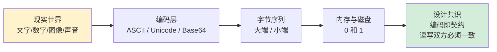
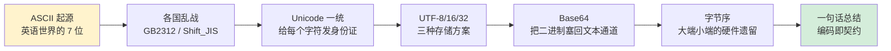

# 1.1 数据编码设计原理

📍 **本篇位置**：第 1 卷 · 数据的本质 · 第 1 篇（开卷起源篇）

🎯 **核心矛盾**：**人类语义 vs 机器二进制** —— 一切类型系统的最底层都站在编码之上

🧭 **设计灵魂**：编码是程序与世界的"翻译表"——ASCII / UTF-8 / Base64 / 大小端 都是同一个问题的不同答案

🌐 **跨语言覆盖**：C(char/wchar) · Java(UTF-16 内置) · Go(rune/byte) · Python(str/bytes) · JavaScript(UTF-16 表面+UTF-8 网络)



> 🎯 **阅读建议**：本章不是"知识陈列"，是"侦探推理"。每一节都从一个反直觉现象出发，让你跟着设计者的思路把答案"推"出来——而不是"被告知"。

---

#### 目录介绍

- [1.真实事故引入](#1真实事故引入)
  - [1.1 用户昵称引发故障](#11-用户昵称引发故障)
  - [1.2 灵魂的三问](#12-灵魂的三问)
  - [1.3 本篇探索路径](#13-本篇探索路径)
  - [1.4 本章学习价值](#14-本章学习价值)
- [2.ASCII编码表设计](#2ascii编码表设计)
  - [2.1 ASCII七位之谜](#21-ascii七位之谜)
  - [2.2 ASCII编码概述](#22-ascii编码概述)
  - [2.3 ASCII推理设计](#23-ascii推理设计)
  - [2.4 ASCII编码哲学](#24-ascii编码哲学)
  - [2.5 常见不可见字符](#25-常见不可见字符)
  - [2.6 不可见字符表示](#26-不可见字符表示)
  - [2.7 不可见字符处理](#27-不可见字符处理)
  - [2.8 不可见字符调试](#28-不可见字符调试)
  - [2.9 遇到一些问题](#29-遇到一些问题)
- [3.Unicode与UTF编码](#3unicode与utf编码)
  - [3.1 为何需要Unicode](#31-为何需要unicode)
  - [3.2 Unicode设计思想](#32-unicode设计思想)
  - [3.3 UTF-8编码原理](#33-utf-8编码原理)
  - [3.4 UTF-16与UTF-32](#34-utf-16与utf-32)
  - [3.5 编码转换陷阱](#35-编码转换陷阱)
  - [3.6 各语言编码处理](#36-各语言编码处理)
  - [3.7 NFC与NFD规范化](#37-nfc与nfd规范化)
  - [3.8 双向文本BiDi坑](#38-双向文本bidi坑)
  - [3.9 同形异义字攻击](#39-同形异义字攻击)
  - [3.10 Unicode认知阶梯](#310-unicode认知阶梯)
- [4.Base64编解码](#4base64编解码)
  - [4.1 历史与悖论](#41-历史与悖论)
  - [4.2 字符集设计](#42-字符集设计)
  - [4.3 膨胀率推导](#43-膨胀率推导)
  - [4.4 典型使用场景](#44-典型使用场景)
  - [4.5 编码原理详解](#45-编码原理详解)
  - [4.6 解码原理详解](#46-解码原理详解)
  - [4.7 填充字符规则](#47-填充字符规则)
  - [4.8 识别与特征](#48-识别与特征)
- [5.字节序与BOM](#5字节序与bom)
  - [5.1 大小端硬件根源](#51-大小端硬件根源)
  - [5.2 BOM字节序标记](#52-bom字节序标记)
- [6.经典陷阱反模式](#6经典陷阱反模式)
  - [6.1 MySQL编码骗局](#61-mysql编码骗局)
  - [6.2 emoji长度差异](#62-emoji长度差异)
  - [6.3 默认编码地雷](#63-默认编码地雷)
  - [6.4 URL加号歧义](#64-url加号歧义)
  - [6.5 JSON非法UTF-8](#65-json非法utf-8)
- [7.一句话总结](#7一句话总结)
  - [7.1 三层认知阶梯](#71-三层认知阶梯)
  - [7.2 七字真言](#72-七字真言)
  - [7.3 与下篇的承接](#73-与下篇的承接)

---

## 1.真实事故引入

### 1.1 用户昵称引发故障

凌晨两点，告警群被刷屏：**注册接口大面积 5xx**。链路日志里反复出现一条诡异的栈：

```
MySQLIntegrityConstraintViolationException:
   Incorrect string value: '\xF0\x9F\x98\x80...'
```

这是用户昵称里带了一个 `😀`。代码层、网络层、JSON 解析层全程都在用 UTF-8——但写到 MySQL 时炸了。

复盘时三个工程师轮番给出了三个看似都对的解释：

1. "是 emoji 4 字节的问题，建表用了 `utf8` 而不是 `utf8mb4`。" ✅ 表象正确
2. "那为什么 `'你好'` 又能存下？同样是中文呀。" ❓ 矛盾出现
3. "因为 `'你好'` 是 3 字节，emoji 是 4 字节，MySQL 的 `utf8` 是个**历史骗局**——只支持 3 字节。" ✅ 命中根因

但根因还能再追一层：**为什么世界上会出现"3 字节 UTF-8"和"4 字节 UTF-8"两种东西？为什么 emoji 偏偏需要 4 字节？为什么 Java 里 `"😀".length()` 返回 2，而 Go 里 `len("😀")` 返回 4？**

这些看似无关的奇怪现象，最终都指向同一个故事——**人类语义如何被翻译成 0 和 1**，以及这个翻译过程中各方妥协留下的伤疤。

### 1.2 灵魂的三问

这条事故抛出了三个绕不开的问题：

**1.为什么会有这么多种编码？** 既然都是 0 和 1，为什么 ASCII、GBK、UTF-8、UTF-16 不能合并？

**2.为什么同一个字符串，在不同语言里 `length` 返回不同的值？** Java 是 2、Go 是 4、Python 是 1——谁是对的？

**3.二进制数据为什么还要再 Base64 一次？** 这不是浪费空间吗？

带着这三个问题往下看，你会发现：**编码不是"多种实现的并列"，而是一场半个世纪的工程妥协史**。

### 1.3 本篇探索路径



下面我们沿着这条路径，把每一段历史和它留下的"工程伤疤"都讲清楚。

### 1.4 本章学习价值

读到这里你可能会想：编码不就是查个表吗？至于花一整章？我想先抛三个**几乎所有资深工程师都答不上来**的问题：

**1.为什么 ASCII 是 7 位而不是 8 位？** ——`char` 在 C 语言里是 8 位（1 字节），但 ASCII 只用 0~127，最高位永远是 0。这"浪费"了一半空间，是设计失误吗？

**2.为什么 `'A' = 65` 而 `'a' = 97`，差值正好是 32（即 2⁵）？** ——这真的只是巧合吗？

**3.为什么 UTF-8 要用 `110xxxxx 10xxxxxx` 这种看起来很怪的位模式？** ——为什么不直接 `00 01 02 03` 标记字节序号，更简单？

如果你能答出第 1 题，你理解了**电报时代的硬件约束**；
如果你能答出第 2 题，你理解了**ASCII 设计者的工程美学**；
如果你能答出第 3 题，你理解了**Ken Thompson 在 1992 年那张餐巾纸上的天才**。

这一章我们就要把这三个谜底，连同它们背后的整套设计哲学，**让你亲手推导出来**——不是被告知，而是**和当年的设计者一起想一遍**。

---

## 2.ASCII编码表设计

ASCII码是什么东西，ASCII（美国信息交换标准代码）是基于拉丁字母的一套电脑编码系统，主要用于显示现代英语和其他西欧语言。

### 2.1 ASCII七位之谜

为什么是128？这是 ASCII 留给后世最大的"工程化石"——它**只用 7 位**。

你打开任何一份 ASCII 表，最高位永远是 0；C 语言里 `char` 占 8 位却只用一半。如果让我们今天重新设计，几乎一定会用满 8 位拿到 256 个字符——多出的 128 格至少能塞下西欧重音字母。**那 1963 年的设计者为什么不这么干？**

答案要回到那个**没有"字节"概念**的时代：

```
1840s  电报时代：摩尔斯电码（变长，只有点和划）
        ↓
1870s  Baudot 码：5 位定长，能表示 32 个字符
        ↓ 字符不够用，加切换位
1924   ITA2（Murray 码）：5 位 + 字母/数字切换 = ~58 个字符
        ↓ 切换太烦，需要更多位
1963   ASCII：7 位定长 = 128 个字符 ✓
        ↓
1970s  字节（byte）= 8 位才成为事实标准
```

**关键洞察**：ASCII 诞生时，**1 字节 = 8 位还不是共识**。当年的电传打字机、磁带、纸带打孔机各家位宽不同，IBM 用 6 位的 BCDIC，DEC 用 12 位字长，霍尼韦尔用 9 位字节。

设计者的真实考量是三选一的工程平衡：

| 选项 | 字符数 | 代价 |
|---|---|---|
| 6 位 | 64 | 不够：26 字母 + 10 数字 + 标点 + 控制符已超 64 |
| 7 位 | 128 | 刚好：英文世界够用，且大多数硬件都能传 |
| 8 位 | 256 | 当年很多硬件（如 6 位电传机）传不动 |

**第 8 位被故意留空，最初是用来做奇偶校验的**——1960 年代的电报线噪声大，每个字节带 1 位奇偶位用于纠错，所以"7 位字符 + 1 位校验 = 8 位传输单元"才是当年的真实模型。

**这一段化石的影响延续至今**：

> 为什么 UTF-8 兼容 ASCII？因为 ASCII 字符的最高位是 0，UTF-8 把"最高位是 0"作为"单字节字符"的标识——这是 Ken Thompson 利用了 ASCII 的"7 位 + 1 位空闲"设计，**这个空闲位变成了 UTF-8 的"自同步信号位"**。
> 1980 年代的 Latin-1（ISO-8859-1）才把第 8 位用起来，加入 128 个西欧字符——但那时已经太晚，Unicode 即将到来。

**所以 ASCII 是 7 位，不是设计失误，而是 1963 年硬件世界给的"最优解"**。它的"半字节空闲"反而在 30 年后救了 UTF-8 的命。

### 2.2 ASCII编码概述

它们通常用于控制文本的格式、设备的行为或通信协议中的特殊功能。理解这些字符的用途和含义对于处理文本数据、调试程序以及理解底层通信协议非常重要。

ASCII（American Standard Code for Information Interchange）是一种字符编码标准，使用 7 位二进制数（0-127）表示字符。ASCII 表分为两部分：

1. **可见字符**（Printable Characters）：包括字母、数字、标点符号等，范围是 32-126。
2. **不可见字符**（Non-printable Characters）：包括控制字符和特殊字符，范围是 0-31 和 127。

ASCII 码大致由以下**两部分组**成：

ASCII 非打印控制字符： ASCII 表上的数字 **0-31** 分配给了控制字符，用于控制像打印机等一些外围设备。

ASCII 打印字符：数字 **32-126** 分配给了能在键盘上找到的字符，当查看或打印文档时就会出现。

char 类型在程序中，最常用来表示字符。其本质依然是一个数字，但每个值都对应一个固定的字符，共定义了128个字符。称之为 ASCII 码 (American Standard Code for Information Interchange) 美国信息交换标准代码。

### 2.3 ASCII推理设计

**反向推理：如果让你来排码值，你会怎么排？** 光看表是不会有感觉的，我们做一件更有趣的事——**把自己放到 1961 年 ASCII 委员会的位置上**，看看那张表为什么长成那个样子。

假设你手上有 128 个空格子（编号 0~127），要塞进这些东西：

- 26 个大写字母 A-Z
- 26 个小写字母 a-z
- 10 个数字 0-9
- 一堆标点：`! " # $ % & ' ( ) * + , - . /` 等
- 33 个控制字符（电传打字机时代的硬件指令：响铃、回车、换行……）

**问题来了：你会怎么分配 0~127？**

最自然的想法可能是「按字母顺序排」：A=0, B=1, ..., Z=25, a=26, ..., z=51, 0=52, ..., 9=61, 然后剩下的塞标点和控制符。但 ASCII 委员会做了完全不同的选择：

| 范围 | 内容 | 二进制前缀 |
|---|---|---|
| 0-31  | 控制字符 | `000xxxxx` |
| 32-47 | 标点（含空格） | `0010xxxx` |
| 48-57 | 数字 0-9 | `0011xxxx` |
| 58-64 | 标点 | `0011xxxx` 末尾 |
| 65-90 | 大写字母 A-Z | `010xxxxx` |
| 91-96 | 标点 | `0101xxxx` 末尾 |
| 97-122 | 小写字母 a-z | `011xxxxx` |
| 123-127 | 标点 + DEL | `0111xxxx` |

**三个看似巧合的"魔数"**。仔细看上表你会发现三件**绝非巧合**的事：

**🪄 魔数一：`'A' = 65 = 0100 0001`，`'a' = 97 = 0110 0001`，差值正好 32（即第 6 位的 0/1）**

```
'A' = 0 1 0 0 0 0 0 1
'a' = 0 1 1 0 0 0 0 1
       ↑
       只差这一位（第 5 位，权重 32）
```

**这意味着大小写转换变成一个位运算**：

```c
char to_upper(char c) { return c & ~0x20; }  // 清第5位
char to_lower(char c) { return c | 0x20; }   // 置第5位
char toggle(char c)   { return c ^ 0x20; }   // 翻第5位
```

在 1960 年代 CPU 没有除法器、字符串库还很原始的时代，**这个设计直接节省了大量指令**。如果按字母顺序连续编码（A=0, a=26），大小写转换就要做减法+加法，慢一个数量级。

**🪄 魔数二：`'0' = 48 = 0011 0000`，数字字符的低 4 位就是它本身的值**

```
'0' = 0011 0000   低4位 = 0
'1' = 0011 0001   低4位 = 1
'9' = 0011 1001   低4位 = 9
```

**这意味着字符转数字也是一个位运算**：

```c
int char_to_int(char c) { return c & 0x0F; }  // 取低4位
// 或者更通用的：
int char_to_int(char c) { return c - '0'; }   // 减法等价
```

为什么前缀偏偏是 `0011`？因为 1960 年代的硬件**穿孔卡片机**直接用 BCD（Binary-Coded Decimal）打孔，数字本来就是 0000~1001，ASCII 设计者只是在前面加了个 `0011` 前缀让它落在标点附近。**ASCII 数字的编码是 BCD 编码的工程化身**。

**🪄 魔数三：`DEL = 127 = 0111 1111`（七个 1），不是 NUL（0）**

为什么"删除"是 127 而不是放在 0 旁边？因为**纸带打孔时代**，"删除"操作是把这个字符位置的所有 7 个孔全部打穿。一旦打穿就没法再回退，所以 `1111111`（全打穿）天然就是"作废"标记。**DEL=127 不是数字游戏，是纸带物理学**。

### 2.4 ASCII编码哲学

**ASCII 不是"字符到数字的字典"，而是"硬件友好的位模式集合"。**

它把"字符语义"和"位运算特性"绑在一起，让 1960 年代算力极弱的 CPU 能用最少的指令处理文本。这种"为硬件量身定做"的设计哲学，**今天我们已经习以为常**——但每次你写 `c | 0x20` 把字符转小写时，都在享受 60 年前那群人留下的礼物。

---

下面是完整的 ASCII 编码表（建议对着上面的位模式分析对照看，会有恍然大悟的感觉）：

| **ASCII值** | **控制字符** | **ASCII值** | **字符**    | **ASCII值** | **字符** | **ASCII值** | **字符** |
| ----------- | ------------ | ----------- | ----------- | ----------- | -------- | ----------- | -------- |
| **0**       | **NUL**      | **32**      | **(space)** | 64          | @        | 96          | 、       |
| 1           | SOH          | 33          | !           | **65**      | **A**    | **97**      | **a**    |
| 2           | STX          | 34          | "           | 66          | B        | 98          | b        |
| 3           | ETX          | 35          | #           | 67          | C        | 99          | c        |
| 4           | EOT          | 36          | $           | 68          | D        | 100         | d        |
| 5           | ENQ          | 37          | %           | 69          | E        | 101         | e        |
| 6           | ACK          | 38          | &           | 70          | F        | 102         | f        |
| 7           | BEL          | 39          | ‘           | 71          | G        | 103         | g        |
| 8           | BS           | 40          | (           | 72          | H        | 104         | h        |
| 9           | HT           | 41          | )           | 73          | I        | 105         | i        |
| **10**      | **LF**       | 42          | *           | 74          | J        | 106         | j        |
| 11          | VT           | 43          | +           | 75          | K        | 107         | k        |
| 12          | FF           | 44          | ,           | 76          | L        | 108         | l        |
| 13          | CR           | 45          | -           | 77          | M        | 109         | m        |
| 14          | SO           | 46          | .           | 78          | N        | 110         | n        |
| 15          | SI           | 47          | /           | 79          | O        | 111         | o        |
| 16          | DLE          | **48**      | **0**       | 80          | P        | 112         | p        |
| 17          | DCI          | 49          | 1           | 81          | Q        | 113         | q        |
| 18          | DC2          | 50          | 2           | 82          | R        | 114         | r        |
| 19          | DC3          | 51          | 3           | 83          | S        | 115         | s        |
| 20          | DC4          | 52          | 4           | 84          | T        | 116         | t        |
| 21          | NAK          | 53          | 5           | 85          | U        | 117         | u        |
| 22          | SYN          | 54          | 6           | 86          | V        | 118         | v        |
| 23          | TB           | 55          | 7           | 87          | W        | 119         | w        |
| 24          | CAN          | 56          | 8           | 88          | X        | 120         | x        |
| 25          | EM           | 57          | 9           | 89          | Y        | 121         | y        |
| 26          | SUB          | 58          | :           | 90          | Z        | 122         | z        |
| 27          | ESC          | 59          | ;           | 91          | [        | 123         | {        |
| 28          | FS           | 60          | <           | 92          | \        | 124         | \|       |
| 29          | GS           | 61          | =           | 93          | ]        | 125         | }        |
| 30          | RS           | 62          | >           | 94          | ^        | 126         | ~        |
| 31          | US           | 63          | ?           | 95          | _        | 127         | DEL      |

上表中有 6 个字符对应的 ASCII 较为常见，建议大家记下，会为后续写代码提供很多方便。

| 字符     | ASCII 码 | 字符       | ASCII 码 |
|--------|---------|----------|---------|
| **空**  | **0**   | **‘\n’** | **10**  |
| **空格** | **32**  | **0**    | **48**  |
| **A**  | **65**  | **a**    | **97**  |

需注意的是，我们从键盘键入的所有内容都是字符。如，键入数字 7，实际是字符 ‘7’，真正存储在计算机内的是 55（字符 7 的 ASCII 码值），而如果我们键入了 35，实际上这是两个字符。真正存储在计算机内的是 51 和 53（字符 3 和 字符 5 的 ASCII 码值）。

### 2.5 常见不可见字符

以下是一些常见的 ASCII 不可见字符及其用途：

| 十进制 | 十六进制 | 缩写  | 名称                     | 用途                                                                 |
|--------|----------|-------|--------------------------|----------------------------------------------------------------------|
| 0      | 0x00     | NUL   | 空字符                   | 用于字符串的结束标志（C 语言中的 `\0`）。                            |
| 7      | 0x07     | BEL   | 响铃字符                 | 使终端或设备发出声音。                                               |
| 8      | 0x08     | BS    | 退格字符                 | 将光标向左移动一位，通常用于删除前一个字符。                         |
| 9      | 0x09     | HT    | 水平制表符               | 将光标移动到下一个制表位，通常用于对齐文本。                         |
| 10     | 0x0A     | LF    | 换行字符                 | 将光标移动到下一行，通常用于文本换行。                               |
| 13     | 0x0D     | CR    | 回车字符                 | 将光标移动到行首，通常与换行符一起使用（如 Windows 中的 `\r\n`）。   |
| 27     | 0x1B     | ESC   | 转义字符                 | 用于控制序列的开始（如终端控制）。                                   |
| 127    | 0x7F     | DEL   | 删除字符                 | 用于删除字符或表示删除操作。                                         |


### 2.6 不可见字符表示

在编程中，不可见字符通常用转义序列表示。以下是一些常见的转义序列：

| 字符       | 转义序列 |
|------------|----------|
| 空字符     | `\0`     |
| 响铃字符   | `\a`     |
| 退格字符   | `\b`     |
| 水平制表符 | `\t`     |
| 换行字符   | `\n`     |
| 回车字符   | `\r`     |
| 转义字符   | `\e`     |

这里有一个非常容易混淆的点：**`\n` 在源代码里是 2 个字符，在内存里是 1 个字节**。

```c
char s[] = "a\nb";
// 源代码看：4 个字符（a、\、n、b）
// 内存里看：4 个字节（'a'=0x61, '\n'=0x0A, 'b'=0x62, '\0'=0x00）
```

转义字符的本质，转义字符是**编译器层的语法糖**，它解决的矛盾是：

- 字符串字面量是用 ASCII 写的源代码
- 但你想表达的是 ASCII 中的不可见字符（如 LF=10）
- 直接写 LF 会让源码无法正常编辑
- 所以发明了 `\` + 字母的两字符序列，编译器在 lex 阶段把它翻译成 1 个字节

**这也解释了为什么 Windows 路径在字符串里要写 `"C:\\path"`** —— 因为单个 `\` 会被编译器吃掉解析转义，必须写两个让编译器吐出一个。

**示例**

```cpp
#include <iostream>

int main() {
    std::cout << "Hello\bWorld!\n"; // 输出 HelloWorld!（退格字符删除 'o'）
    std::cout << "Line 1\nLine 2\n"; // 输出两行文本
    std::cout << "Tab\tSeparated\n"; // 输出 Tab    Separated
    return 0;
}
```

### 2.7 不可见字符处理

在处理文本数据时，不可见字符可能会导致问题，例如：**1.字符串比较失败**：字符串末尾可能包含不可见字符（如空字符或换行符）。**2.文本显示异常**：不可见字符可能影响文本的格式或显示。

**示例：去除字符串末尾的换行符**

```cpp
#include <iostream>
#include <string>
#include <algorithm>

void removeNewline(std::string& str) {
    str.erase(std::remove(str.begin(), str.end(), '\n'), str.end());
}

int main() {
    std::string text = "Hello World!\n";
    removeNewline(text);
    std::cout << text; // 输出 Hello World!
    return 0;
}
```

### 2.8 不可见字符调试

在调试程序时，不可见字符可能会导致难以发现的问题。可以使用以下方法检查不可见字符：

**1.打印字符的 ASCII 值**：将字符转换为整数并打印。**2.使用十六进制查看器**：查看文件的十六进制内容。

**示例：打印字符的 ASCII 值**

```cpp
#include <iostream>

int main() {
    char ch = '\t'; // 水平制表符
    std::cout << "Character: " << ch << ", ASCII Value: " << (int)ch << std::endl;
    return 0;
}
```

### 2.9 遇到一些问题

问题 1：字符串比较失败。原因是字符串末尾可能包含不可见字符（如换行符 \n、回车符 \r 或空字符 \0），导致字符串比较失败。

```cpp
std::string str1 = "Hello";
std::string str2 = "Hello\n";
if (str1 == str2) { // 比较失败，因为 str2 包含换行符
    std::cout << "Equal";
} else {
    std::cout << "Not Equal"; // 输出 Not Equal
}
```

问题 2：文件读取错误。原因是文件中的不可见字符可能导致读取错误或解析失败。

```cpp
std::ifstream file("data.txt");
std::string line;
while (std::getline(file, line)) {
    // 如果行尾包含回车符或换行符，可能导致解析错误
}
```

## 3.Unicode与UTF编码

### 3.1 为何需要Unicode

**疑惑**：ASCII只能表示128个字符，那中文、日文、韩文、阿拉伯文怎么办？

**答疑**：ASCII的设计只考虑了英语，仅用7位编码。随着计算机在全球普及，各国开始设计自己的编码标准：中国的GB2312/GBK、日本的Shift_JIS、韩国的EUC-KR等。这导致了**编码混乱**——同一个字节序列在不同编码下表示完全不同的字符。

```
编码演进路线:
  ASCII (1963) → 7位，128个字符，仅覆盖英语
    ↓ 各国需要自己的文字
  各国编码标准 (1980s) → GB2312/GBK/Shift_JIS/EUC-KR...
    ↓ 跨国通信时乱码严重
  Unicode (1991) → 统一字符集，为全球所有文字分配唯一编号
    ↓ 需要高效的存储方式
  UTF-8 (1993) / UTF-16 / UTF-32 → 不同的编码实现
```

### 3.2 Unicode设计思想

Unicode的核心设计思想是**给世界上每一个字符一个唯一的编号（Code Point）**。

| 范围 | 用途 | 数量 |
|------|------|------|
| U+0000 ~ U+007F | Basic Latin（兼容ASCII） | 128 |
| U+0080 ~ U+07FF | Latin扩展、希腊、西里尔等 | ~1,920 |
| U+0800 ~ U+FFFF | 中日韩统一汉字(CJK)、谚文等 | ~63,488 |
| U+10000 ~ U+10FFFF | 表情符号、古文字、数学符号等 | ~1,048,576 |

**关键区分**：Unicode是**字符集**（定义编号），UTF-8/UTF-16/UTF-32是**编码方案**（定义如何存储编号）。

### 3.3 UTF-8编码原理

UTF-8是目前互联网上使用最广泛的编码方式，其设计非常精妙：

**核心思想**：用变长字节（1-4字节）编码，ASCII字符仍用1字节，中文3字节，稀有字符4字节。

```
UTF-8编码规则:
  U+0000~U+007F     → 0xxxxxxx                          (1字节，兼容ASCII)
  U+0080~U+07FF     → 110xxxxx 10xxxxxx                  (2字节)
  U+0800~U+FFFF     → 1110xxxx 10xxxxxx 10xxxxxx          (3字节，中文在此)
  U+10000~U+10FFFF  → 11110xxx 10xxxxxx 10xxxxxx 10xxxxxx (4字节，emoji在此)

示例：'中' = U+4E2D
  二进制: 0100 1110 0010 1101
  填入模板: 1110[0100] 10[111000] 10[101101]
  UTF-8字节: E4 B8 AD (3字节)
```

**UTF-8精妙设计**：

1. **向后兼容ASCII**：所有 ASCII 文件不修改一个字节，就是合法的UTF-8文件
2. **自同步**：从任意字节开始都能找到字符边界（通过首位模式区分）
3. **无字节序问题**：不像UTF-16/32需要BOM标记

**亲手设计：让你当 1992 年的 Ken Thompson**

教科书直接招出那张位模式表，会让你觉得 UTF-8 是从天上掉下来的。但**它其实是从一组硬约束里推导出来的唯一解**。我们一起把它推一遍。
时间回到 1992 年 9 月，新泽西州一家叫 Dayton's 的小餐馆。Rob Pike 和 Ken Thompson 拿着餐巾纸要解决一个棘手问题：**Unicode 委员会发布的 UTF-1 编码方案太烂了**——它不自同步、不兼容 ASCII、解析起来一团糟。

他们要设计一个新方案，必须满足**五条铁律**：

1. **兼容 ASCII**：所有 ASCII 文件不修改一个字节，就是合法的新编码文件
2. **能编码 Unicode 全集**：至少覆盖 21 位（U+0000~U+10FFFF）
3. **任意字节自同步**：拿到一段字节流，能从任意位置开始找到字符边界
4. **无字节序问题**：不能像 UTF-16 那样需要 BOM
5. **越常用的字符越短**：英文 1 字节，中文不超过 3 字节

**好，你来想**——满足这五条，你能设计出什么样的方案？

**第一步：单字节字符必须最高位是 0**

```
约束 1（兼容 ASCII）告诉我们：
  ASCII 字符（0~127）必须保持原编码不变
  ASCII 是 7 位，最高位本来就是 0
  ↓
  所以"最高位是 0"就成了"这是一个单字节 ASCII 字符"的标志
  
单字节模板：0xxxxxxx
```

ASCII 留下的"7 位空闲第 8 位"在这里立功了。

**第二步：多字节字符必须最高位是 1**

```
不是 0 就是 1。
约束 1 已经把"最高位 0"给了 ASCII。
所以多字节字符的每一个字节最高位都必须是 1。

但具体是 1 之后跟什么呢？看下一步。
```

**第三步：怎么自同步？**——这是最关键的一步

```
约束 3（自同步）说：拿到任意一个字节，要能立刻判断它是
  (a) 单字节 ASCII
  (b) 多字节字符的"首字节"
  (c) 多字节字符的"后续字节"

(a) 已经定了：0xxxxxxx
(b) 和 (c) 怎么区分？
  
  设计选择：
  - 首字节用 11... 开头（连续多个 1，1 的个数 = 总字节数）
  - 后续字节用 10... 开头（10 不会和首字节混淆）

为什么是 110/1110/11110 而不是 100/1010 之类？
  因为「1 的个数 = 总字节数」让首字节自描述，
  解析器看到 1110xxxx 就知道"接下来还有 2 个 10xxxxxx"，
  不需要查表。
```

至此，框架已经定了：

```
1 字节: 0xxxxxxx                                有效位数 = 7
2 字节: 110xxxxx 10xxxxxx                        有效位数 = 5+6 = 11
3 字节: 1110xxxx 10xxxxxx 10xxxxxx                有效位数 = 4+6+6 = 16
4 字节: 11110xxx 10xxxxxx 10xxxxxx 10xxxxxx        有效位数 = 3+6+6+6 = 21
```

**第四步：验证容量是否够**

```
1 字节: 7 位 = 128 个码位         → 覆盖 ASCII (0~127) ✓
2 字节: 11 位 = 2048 个码位        → 覆盖拉丁扩展、希腊、西里尔 ✓
3 字节: 16 位 = 65536 个码位       → 覆盖 BMP（含全部中日韩汉字）✓
4 字节: 21 位 = 2097152 个码位     → 覆盖 U+10FFFF ✓
```

**完美**。这五条约束**唯一地推出了** UTF-8 的位模式——它不是"一种选择"，而是"在那五条约束下的唯一解"。

**自同步性的真正威力**

很多教科书把"自同步"当作一句口号一带而过。但它的工程价值需要一个反例对照才看得清。

**反例：UTF-16 没有自同步性**

```
假设你拿到一段字节流：
  ... 4E 2D 5B 50 ...

如果它是 UTF-16 大端：
  0x4E2D = '中'，0x5B50 = '子'   ← 一种解读
如果你的指针偏移了 1 字节：
  0x2D5B = '⭛'，0x50?? = ???     ← 完全错误的解读
  
→ UTF-16 必须从"已知边界"开始读，否则全部错位
```

**UTF-8 不会有这个问题**：

```
假设你拿到一段字节流，从中间随机切一刀：
  ... E4 B8 AD E5 AD 90 ...
              ↑ 从这里切
  
  解析器看到 AD（10101101）：
    "10 开头 → 这是后续字节，不是首字节"
    向后扫描：E5（1110...）→ "找到首字节！"
  → 跳到 E5 重新开始解析，丢失少量字符但不会全错
```

**这个特性的实战价值**：

1. **`grep` 搜索 UTF-8 文件**：不需要先解析整个文件结构，从任意位置匹配字节模式都不会出错
2. **大文件分块处理**：MapReduce 把 10GB 的 UTF-8 文件切成 100 块并行处理，每块只需向后找到第一个 `0xxxxxxx` 或 `11xxxxxx` 就能开始
3. **网络传输丢包恢复**：丢了一个 TCP 包，下一个包还能解析出文字（虽然丢了几个字），不会整段乱码
4. **错误检测**：随机字节流出现 `10` 开头但前面没有 `11x` 首字节，立刻能判断"这不是 UTF-8"

**这就是 Ken Thompson 餐巾纸方案的天才之处**——他没有发明新概念，只是把"前缀编码"（其实就是 Huffman 编码的思想）和"ASCII 兼容"两个旧约束组合起来，得到了一个**信息论意义上几乎最优**的方案。

**UTF-8 实战推导**

'中' 是怎么变成 E4 B8 AD 的？光看规则不动手永远不会真懂。我们手算一遍：

```
Step 1: 查 'A' 的 Unicode 码点
  '中' = U+4E2D

Step 2: 把码点写成二进制
  0x4E2D = 0100 1110 0010 1101
  共 15 位有效（最高位 0 不算）

Step 3: 选模板
  15 位需要 3 字节模板（容量 16 位，够）
  模板: 1110xxxx 10xxxxxx 10xxxxxx

Step 4: 把 15 位从右向左填入模板的 x 位置
  '中' 二进制（补齐 16 位）: 0100 111000 101101
                                ↓     ↓     ↓
  填入: 1110[0100]  10[111000]  10[101101]

Step 5: 转十六进制
  11100100 = 0xE4
  10111000 = 0xB8
  10101101 = 0xAD

  → '中' 的 UTF-8 编码 = E4 B8 AD ✓
```

**你可以用 Python 验证**：

```python
>>> '中'.encode('utf-8').hex()
'e4b8ad'
>>> bin(0xE4), bin(0xB8), bin(0xAD)
('0b11100100', '0b10111000', '0b10101101')
# 看 0xE4 = 1110 0100，匹配 3 字节首字节模板 1110xxxx ✓
```

### 3.4 UTF-16与UTF-32

| 编码 | 字节数 | 优势 | 劣势 | 使用场景 |
|------|--------|------|------|---------|
| UTF-8 | 1-4 | ASCII高效，无BOM | 中文3字节，变长处理复杂 | Web、文件存储、Linux |
| UTF-16 | 2或4 | CJK字符2字节 | ASCII浪费1字节，有字节序问题 | Java/JavaScript内部、Windows API |
| UTF-32 | 4 | 定长，随机访问O(1) | 极浪费空间 | 内部处理（很少用于存储） |

**Java/JavaScript使用UTF-16的历史原因**：

Java（1995年）和JavaScript设计时，Unicode只有65536个字符（U+0000~U+FFFF），刚好2字节能覆盖。后来Unicode扩展到U+10FFFF，UTF-16不得不引入**代理对（Surrogate Pairs）**来表示超出BMP的字符（如emoji）。

```javascript
// JavaScript中的UTF-16代理对问题
'😀'.length  // 2 (不是1！因为emoji使用代理对)
'😀'.charCodeAt(0)  // 55357 (高代理 0xD83D)
'😀'.charCodeAt(1)  // 56832 (低代理 0xDE00)
'😀'.codePointAt(0) // 128512 (U+1F600，正确的码点)
```

### 3.5 编码转换陷阱

**常见乱码问题及原因**：

```
场景: 中文"你好"
  UTF-8编码: E4 BD A0 E5 A5 BD (6字节)
  GBK编码:   C4 E3 BA C3 (4字节)

如果用GBK去解读UTF-8的字节:
  E4 BD → "浣" (错误！)
  A0 E5 → "犲" (错误！)
  A5 BD → "ソ" (错误！)
→ 乱码产生！
```

**各平台的默认编码**：

| 平台 | 默认编码 | 注意事项 |
|------|---------|---------|
| Linux/macOS | UTF-8 | 现代系统统一UTF-8 |
| Windows | 系统区域设置（中文为GBK） | 需要注意文件编码 |
| Android | UTF-8 | Java String内部是UTF-16 |
| iOS | UTF-8 | NSString内部是UTF-16 |
| Web | UTF-8 | HTML需要声明`<meta charset="UTF-8">` |

### 3.6 各语言编码处理

Java: String内部UTF-16，与外部交互时指定编码

```java
byte[] utf8Bytes = "你好".getBytes(StandardCharsets.UTF_8);  // 6字节
byte[] gbkBytes = "你好".getBytes("GBK");  // 4字节
String restored = new String(utf8Bytes, StandardCharsets.UTF_8);  // 正确
```

Python 3: str是Unicode，bytes是字节序列

```python
text = "你好"          # str类型，Unicode
utf8 = text.encode('utf-8')   # bytes: b'\xe4\xbd\xa0\xe5\xa5\xbd'
gbk = text.encode('gbk')      # bytes: b'\xc4\xe3\xba\xc3'
text_back = utf8.decode('utf-8')  # 正确还原
```

JavaScript: 使用TextEncoder/TextDecoder处理编码

```javascript
const encoder = new TextEncoder();  // 默认UTF-8
const bytes = encoder.encode("你好");  // Uint8Array(6)
const decoder = new TextDecoder('utf-8');
const text = decoder.decode(bytes);  // "你好"
```

Go: string就是UTF-8字节序列

```go
s := "你好"
fmt.Println(len(s))          // 6 (字节数)
fmt.Println(utf8.RuneCountInString(s))  // 2 (字符数)
for _, r := range s {
    fmt.Printf("U+%04X ", r) // U+4F60 U+597D
}
```

### 3.7 NFC与NFD规范化

读到这里你可能觉得"Unicode 真好，全世界统一了"。但**Unicode 真正复杂的地方才刚开始**——它不只是"字符到码点"的映射表，它要解决的是**人类语言的全部混乱**，而人类语言比你想象的混乱十倍。

接下来三节是三个"看起来同一个字、电脑认为不同"或反之的深坑。每个坑都在生产环境造成过真实事故。

首先看 NFC vs NFD —— `é` 不一定等于 `é`。观察这段 Python：

```python
>>> a = 'café'
>>> b = 'café'   # 看起来一模一样
>>> a == b
False            # ?!
>>> len(a), len(b)
(4, 5)           # ?!
```

肉眼看一模一样的两个字符串，**长度不同、值不等**。这是怎么回事？

答案是 Unicode **同一个字符可以有多种合法表示**：

```
'é' 有两种合法编码方式：

方式 A（NFC，预组合）：
  U+00E9               一个码点 = 一个字符
  字节数（UTF-8）：2 字节

方式 B（NFD，分解）：
  U+0065 (e) + U+0301 (组合用尖音符)
  两个码点 = 一个用户视觉字符
  字节数（UTF-8）：3 字节
```

**为什么 Unicode 允许两种表示？** 因为不同语言对"组合字符"的需求不同：

- 法语 `é` 是固定字符 → 用预组合（NFC）方便
- 越南语 `ế`（带 3 个音调标记）→ 用分解（NFD）更灵活，能任意组合

**这造成的实际事故**：

```
场景：用户在 macOS 上保存的文件名是 "café.pdf"（NFD 形式）
      Windows 索引服务用 NFC 形式比较
      → 同步时认为是两个不同文件，重复同步、存储翻倍
```

**修复办法是"规范化"**：

```python
import unicodedata
a_nfc = unicodedata.normalize('NFC', a)
b_nfc = unicodedata.normalize('NFC', b)
a_nfc == b_nfc   # True ✓
```

**铁律**：**任何字符串比较、做 hash、做数据库索引前，都应该先规范化到 NFC**。这是 Unicode 留下的暗坑，也是大多数代码默默没做的事。

### 3.8 双向文本BiDi坑

阿拉伯语和希伯来语是从右往左写的（RTL），但其中夹杂的英文和数字又是从左往右（LTR）。Unicode 设计了一套 **BiDi 算法**（UAX #9）来处理混排——但它会反过来咬你。

**经典攻击**：**Unicode 控制字符 `U+202E` (Right-to-Left Override)** 可以把后面的字符强制反转显示。

```
攻击者上传文件，文件名是：
  "innocent_‮gpj.exe"
                 ↑ 这里有一个不可见的 U+202E

操作系统按从左到右读字节顺序：i-n-n-o-c-e-n-t-_-[U+202E]-g-p-j-.-e-x-e
但 BiDi 算法显示时把 U+202E 后面的字符反转：
  显示为：innocent_exe.jpg
  
用户看到 .jpg 放心打开 → 实际是 .exe 病毒文件
```

这不是理论威胁——**真实的 CVE-2021-42574 漏洞** 就是利用类似机制在源代码里植入"看不见的逻辑炸弹"，该漏洞影响 GCC、LLVM、Python、Java 等几乎所有编译器。

**防御策略**：在文件上传、用户名注册、源代码审查处过滤这些"危险"的不可见 Unicode 字符（U+200E、U+200F、U+202A~U+202E、U+2066~U+2069）。

### 3.9 同形异义字攻击

下面这两个字符串，肉眼几乎看不出区别：

```
apple.com    ← 全部 ASCII
аррӏе.com    ← а 是 U+0430（西里尔小写 a），р 是 U+0440（西里尔小写 r），ӏ 是 U+04CF
```

它们都是 **合法 Unicode 字符**，浏览器解析时都是合法域名，但**指向完全不同的服务器**。这就是著名的 **IDN 钓鱼攻击**（Internationalized Domain Name homograph attack）。

**根因**：Unicode 收录了很多看起来一模一样但码点不同的字符——

| 字符 | 正常码点 | 仿冒码点 | 仿冒来源 |
|---|---|---|---|
| a | U+0061 | U+0430 | 西里尔字母 |
| e | U+0065 | U+0435 | 西里尔字母 |
| o | U+006F | U+03BF | 希腊字母 ο |
| l | U+006C | U+04CF | 西里尔字母 |
| 0 | U+0030 | U+039F | 希腊大写 Ο |

**防御策略**：浏览器现在用 **Punycode** 编码混合文字域名（如 `xn--80ak6aa92e.com`），并在地址栏对"混合脚本域名"显示警告。但**如果你在做支付、社交、邮件系统，必须自己做同形异义字检测**。

### 3.10 Unicode认知阶梯

```
表面现象              深层根因                          工程对策
───────────────────────────────────────────────────────────────────
比较失败              Unicode 允许等价表示              永远先 NFC 规范化
UI 错乱/源码污染      Unicode 自带"控制字符"            过滤可疑控制字符
钓鱼/欺骗             Unicode 收录了同形异义字           关键场景做 confusable 检测
```

**Unicode 不是终点，是新起点**。它统一了"字符如何编号"，但**字符之间的关系**（等价、组合、可信、可视）需要一整套额外的标准（UAX #9/#15/#29/#39）来管理。

工业界的认知曲线大致是：

```
入门：     "我会用 UTF-8 编码"
进阶：     "我理解 UTF-8 / UTF-16 / UTF-32 区别"
高级：     "我知道 length 和 codePoint 的差异"
专家：     "我知道 Unicode 规范化和 BiDi"
安全专家： "我知道同形异义字攻击和不可见控制字符"
```

读完本章你应该处于"专家"档——这已经超过 95% 的工程师。

## 4.Base64编解码

### 4.1 历史与悖论

**Base64** 是一种将二进制数据编码为 ASCII 字符的编码方式。

它主要用于在文本协议（如电子邮件、URL、JSON 等）中安全地传输二进制数据。

**目的**：将二进制数据转换为可打印的 ASCII 字符，以便在文本环境中传输或存储。

**字符集**：Base64 使用 64 个字符（`A-Z`、`a-z`、`0-9`、`+`、`/`）以及填充字符 `=`。

**一个反直觉的悖论：明明都是字节，为什么需要再编一次？**

读到这里你应该有疑问：**所有数据本质上都是字节序列，为什么二进制数据要"塞回文本通道"？文本通道不也是传字节吗？**

这背后藏着一个 1970 年代电子邮件系统留下的"原罪"，我们必须先理解它，才能理解 Base64 存在的意义。

**1971 年，第一封电子邮件诞生时**，邮件协议（最终演化为 SMTP）只承诺传输**7 位 ASCII 文本**。原因有三：

1. 当年的邮件路由经过各种 mainframe，有些只支持 7 位通道（最高位丢弃）
2. 某些字节值（如 `0x0A` 换行、`0x0D` 回车、`0x00` 空字符）被中间设备当作**控制信号**，会被吃掉或改写
3. 行长度有限制（普遍 80 字符），二进制数据中的"超长行"会被截断

所以历史上有过一个血淋淋的现象：**你把一张 JPEG 图片直接 attach 进邮件，到对方那里就坏了**——某些字节在路由中被当成控制字符篡改了。

```
直接传 JPEG 字节 0x89 0x50 0x4E 0x47 ...
       ↓ 经过某些 7 位通道
       0x09 0x50 0x4E 0x47 ...   ← 最高位被砍
       
直接传 0x0A（换行）
       ↓ Windows 邮件网关
       0x0D 0x0A   ← 自作主张加了回车
       
→ 接收端解码图片时校验和不对，文件损坏
```

**Base64 就是对这个原罪的工程修补**：把任意字节流变成"邮件协议保证不会篡改"的 64 个安全字符的子集。

它解决的真正问题不是"二进制变文本"，而是 **"高熵字节流穿越多代际网络协议而不被破坏"**。

### 4.2 字符集设计

为什么偏偏是 **Base64**？这不是随便选的数字，而是**两个约束的最优交点**。

**约束 A：字符集必须是"绝对安全的可打印字符"**

ASCII 中真正不会被任何中间网关篡改的字符有多少个？

```
A-Z (26 个) + a-z (26 个) + 0-9 (10 个) = 62 个安全字符
然后再加 2 个常见标点不会出问题：
  + 和 /  → 凑足 64 个
还需要 1 个"填充符"：=
```

**为什么不用更多？** 因为：
- `<` `>` 在 HTML 里有特殊含义
- `&` 在 URL/HTML 里要转义  
- `:` `?` 在 URL 里有特殊含义
- 空格、换行、Tab 是控制字符
- ASCII 高位字符（` ~` 等）历史上有些通道会改

数下来"绝对安全"的字符大概就 64~70 个。

**约束 B：字符数必须是 2 的幂**

```
为什么必须是 2 的幂？
因为编码效率 = log₂(字符数) / 8 字节 = 每个字符承载的字节数

如果字符集大小是 N，每个字符承载 log₂(N) 比特。
要让 N 个字节能整齐对齐到 M 个字符（不需要小数位运算），
N 必须是 2 的幂。

候选：32、64、128、256
```

**约束 A ∩ 约束 B = 64**——这是唯一既"安全字符够用"又"是 2 的幂"的选择。

### 4.3 膨胀率推导

很多人记得"Base64 膨胀 33%"这个数字，但说不清为什么。我们来推一遍：

```
3 个字节 = 24 比特 = 4 个 6 比特单元 = 4 个 Base64 字符

输入：3 字节
输出：4 字节（每个 Base64 字符占 1 字节 ASCII）

膨胀比 = 4/3 = 1.333...
膨胀率 = 4/3 - 1 = 1/3 ≈ 33.3%
```

**这是信息论给出的最优值之一**：

| 编码 | 输入位数 | 输出字符数 | 膨胀率 | 字符集 |
|---|---|---|---|---|
| Base16 (Hex) | 4 | 1 | **100%** | 0-9, A-F |
| Base32 | 5 | 1 | 60% | A-Z, 2-7 |
| **Base64** | **6** | **1** | **33%** | **A-Z, a-z, 0-9, +, /** |
| Base128 | 7 | 1 | 14% | 不可行（找不到 128 个安全字符）|
| Base256 | 8 | 1 | 0% | 就是原始字节，无意义 |

**所以 Base64 是"安全字符可达"前提下膨胀率最低的选择**。如果未来某天网络协议进化到允许 128 个安全字符，Base128（膨胀仅 14%）会成为更优解——目前还没到那一天。

### 4.4 典型使用场景

1. 文本传输：在网络传输或存储数据时，某些数据可能包含不可打印字符或特殊字符，这可能会导致数据传输错误或解析问题。通过将数据转换为 Base64 编码，可以确保数据只包含可打印字符，从而更容易传输和处理。
2. 数据格式化： 在某些情况下，需要将二进制数据转换为文本格式，以便在不同系统之间进行交换。Base64 编码可以将二进制数据转换为文本格式，使其更易于处理和传输。
3. 数据隐藏： 在一些场景下，需要隐藏原始数据的内容。虽然 Base64 编码并不是加密，但它可以将数据转换为一种不易直接识别的形式，增加数据的保密性。
4. 数据完整性： 在某些情况下，需要确保数据在传输过程中不被篡改。通过对数据进行 Base64 编码，可以更容易地检测数据是否被篡改，因为 Base64 编码后的数据长度通常是固定的。

### 4.5 编码原理详解

**基本规则**

标准Base64只有64个字符（英文大小写、数字和+、/）以及用作后缀的等号；Base64是把3个字节变成4个可打印字符，所以Base64编码后的字符串一定能被4整除（不算用作后缀的等号）；等号一定用作后缀，且数目一定是0个、1个或2个。严格来说Base64不能算是一种加密，只能说是编码转换。

**编码步骤**

Base64 编码将二进制数据按每 3 个字节（24 位）分组，然后将这 24 位分为 4 个 6 位的单元，每个单元映射为一个 Base64 字符。

1. 将二进制数据按每 3 个字节分组。
2. 将每组的 24 位分为 4 个 6 位的单元。
3. 将每个 6 位单元映射为 Base64 字符。
4. 如果最后一组不足 3 个字节，用 0 填充，并在编码结果末尾添加填充字符 `=`。
**示例** 将字符串 `"Man"` 编码为 Base64：

1. 将 `"Man"` 转换为二进制：
   ```
   M -> 77 -> 01001101
   a -> 97 -> 01100001
   n -> 110 -> 01101110
   ```
2. 将 24 位分为 4 个 6 位单元：
   ```
   010011 010110 000101 101110
   ```
3. 将每个 6 位单元映射为 Base64 字符：
   ```
   010011 -> 19 -> T
   010110 -> 22 -> W
   000101 -> 5  -> F
   101110 -> 46 -> u
   ```
4. 编码结果为 `"TWFu"`。

### 4.6 解码原理详解

Base64 解码将 Base64 字符转换回二进制数据。

**解码步骤**

1. 将 Base64 字符转换为 6 位二进制值。
2. 将 4 个 6 位单元合并为 24 位（3 个字节）。
3. 如果编码结果包含填充字符 `=`，则忽略对应的 6 位单元。

**示例** 将 Base64 字符串 `"TWFu"` 解码为原始数据：

1. 将每个字符转换为 6 位二进制值：
   ```
   T -> 19 -> 010011
   W -> 22 -> 010110
   F -> 5  -> 000101
   u -> 46 -> 101110
   ```
2. 将 4 个 6 位单元合并为 24 位：
   ```
   010011 010110 000101 101110
   ```
3. 将 24 位分为 3 个字节：
   ```
   01001101 -> 77 -> M
   01100001 -> 97 -> a
   01101110 -> 110 -> n
   ```
4. 解码结果为 `"Man"`。

### 4.7 填充字符规则

如果二进制数据的长度不是 3 的倍数，Base64 编码会在末尾添加填充字符 `=`。

填充字符的数量取决于剩余字节数：

- 剩余 1 个字节：添加 2 个 `=`。
- 剩余 2 个字节：添加 1 个 `=`。

**示例** 将字符串 `"Ma"` 编码为 Base64：

1. 将 `"Ma"` 转换为二进制：
   ```
   M -> 77 -> 01001101
   a -> 97 -> 01100001
   ```
2. 将 16 位分为 3 个 6 位单元（不足部分用 0 填充）：
   ```
   010011 010110 000100
   ```
3. 将每个 6 位单元映射为 Base64 字符：
   ```
   010011 -> 19 -> T
   010110 -> 22 -> W
   000100 -> 4  -> E
   ```
4. 编码结果为 `"TWE="`（添加 1 个 `=`）。

### 4.8 识别与特征

**Base64 字符串的三大特征**

Base64 编码的字符串具有以下特征：

1. **字符集**：仅包含以下字符：
   - 大写字母 `A-Z`
   - 小写字母 `a-z`
   - 数字 `0-9`
   - 特殊字符 `+` 和 `/`
   - 填充字符 `=`
2. **长度**：Base64 编码后的字符串长度通常是 4 的倍数（因为每 3 个字节编码为 4 个字符）。
3. **填充字符**：如果原始数据的长度不是 3 的倍数，编码结果末尾会添加 1 或 2 个 `=` 作为填充字符。

**如何判断一个字符串是 Base64**

- **方法 1：检查字符集** —— 遍历字符串，检查每个字符是否属于 Base64 字符集。如果发现非法字符，则不是 Base64 编码。
- **方法 2：检查长度** —— 检查字符串的长度是否是 4 的倍数。如果不是，则可能不是 Base64 编码。
- **方法 3：检查填充字符** —— 检查字符串末尾是否有 1 或 2 个 `=` 填充字符。如果有，则可能是 Base64 编码。

判断一个字符串是否是 Base64 编码，可以通过检查字符集、长度和填充字符综合实现——但要注意，**Base64 看起来合法不代表它真的是 Base64**，最终验证必须靠"解码后能否复原原始字节"。

---

## 5.字节序与BOM

### 5.1 大小端硬件根源

看下面这个反直觉现象：

```c
uint32_t x = 0x12345678;
uint8_t *p = (uint8_t*)&x;
printf("%02X %02X %02X %02X\n", p[0], p[1], p[2], p[3]);

// x86 / ARM(默认) 输出: 78 56 34 12  ← 小端
// PowerPC / 网络字节序: 12 34 56 78  ← 大端
```

**为什么会有两种字节序？** 这要追溯到 1970 年代两大 CPU 阵营的分歧：

**小端阵营（Intel）**：低位字节存低地址。**优势是"地址即值"**——同一个内存地址，按 `uint8_t*` 读得到低字节、按 `uint32_t*` 读得到完整数。CPU 做加法时从低位开始进位，这个布局非常顺滑。

**大端阵营（Motorola/IBM）**：高位字节存低地址。**优势是"读起来像写的"**——hexdump 出来的字节顺序就是人类阅读的顺序，调试友好。

这场战争从来没有赢家，最终的妥协是：

| 领域 | 字节序 | 原因 |
|---|---|---|
| 主流 CPU（x86/ARM） | 小端 | Intel 路径依赖 |
| 网络协议（TCP/IP） | 大端 | 历史早期 IBM/SUN 主导 |
| Java VM | 大端 | 跨平台一致性优先 |
| 文件格式（PNG/JPEG） | 大端 | 沿袭网络字节序 |
| 文件格式（BMP/WAV） | 小端 | 沿袭 x86 内存布局 |

这就是为什么**网络通信里反复出现 `htonl` / `ntohl`**：你不知道两端 CPU 是谁，必须显式约定。

**亲手验证：判断 CPU 字节序**

光看不练不会有感觉。你打开终端，把下面这段代码存成 `endian.c` 跑一下：

```c
#include <stdio.h>
int main() {
    unsigned int x = 0x01020304;
    unsigned char *p = (unsigned char*)&x;
    printf("Byte order: %02X %02X %02X %02X\n", p[0], p[1], p[2], p[3]);
    printf("This CPU is %s endian\n", p[0] == 0x01 ? "BIG" : "LITTLE");
    return 0;
}
```

在主流的 x86/Apple Silicon/ARM Linux 机器上，输出会是：

```
Byte order: 04 03 02 01
This CPU is LITTLE endian
```

**为什么我们看到的是"反序"？** 关键在于这两行代码的**视角差异**：

```
内存视角（地址从低到高）：
  地址 0xFFFE_F000:  04   ← p[0] 看到的低地址
  地址 0xFFFE_F001:  03
  地址 0xFFFE_F002:  02
  地址 0xFFFE_F003:  01   ← p[3] 看到的高地址

数值视角（人类阅读）：
  0x01020304
   ↑       ↑
   高位    低位

小端 = "把低位字节放在低地址"
     = 内存按地址递增读，看到的是 04 03 02 01（数值的反序）
```

这个反序看起来违反直觉，但 Intel 的工程师 1970 年代选择它是有道理的：

```
做 32 位加法时：
  指令 1: 从低地址读 1 字节，做加法
  指令 2: 从下一字节读 1 字节，做加法（带进位）
  ...

如果是小端，"低地址 = 低位 = 先加的"，硬件加法器走得很顺
如果是大端，"低地址 = 高位"，要么先跳到高地址读、要么倒着加
```

**小端的本质优势是"低地址即低位"**——CPU 设计上更顺，但人脑读起来更别扭。这就是 50 年前那场字节序之战的技术根源。

**字节序咬人的三个场景**

**场景一：跨平台二进制文件**

```c
// 在 x86 上写入文件
uint32_t magic = 0x01020304;
fwrite(&magic, 4, 1, fp);   // 文件里实际是: 04 03 02 01

// 移植到 PowerPC（大端）读取
fread(&magic, 4, 1, fp);
printf("%x\n", magic);      // 输出 0x04030201，错了！
```

**修复**：要么文件格式约定字节序（PNG 用大端、BMP 用小端），要么写入前用 `htonl` 转成网络字节序。

**场景二：网络协议手写解析器**

```c
// TCP/IP 头里的端口号
struct {
    uint16_t src_port;
    uint16_t dst_port;
} tcp_header;

// 错误写法：直接读
printf("port = %d\n", tcp_header.dst_port);  // 在 x86 上得到反序的端口

// 正确写法
printf("port = %d\n", ntohs(tcp_header.dst_port));
```

**场景三：JSON/Protobuf 等"自带字节序"的协议屏蔽了这层**

为什么平时写 Web 应用感觉不到字节序问题？因为 JSON 是文本，Protobuf 内部用 varint 编码（无字节序问题）。**字节序的坑只有在你直接操作二进制结构体时才会咬人**。

### 5.2 BOM字节序标记

UTF-16 / UTF-32 一个码点占 2/4 字节，必然涉及字节序。Unicode 委员会的解决方案是：在文件开头放一个特殊字符 `U+FEFF` 当"路标"。

```
文件开头字节   →   被识别为
FE FF          →   UTF-16 大端（BE）
FF FE          →   UTF-16 小端（LE）
00 00 FE FF    →   UTF-32 大端
FF FE 00 00    →   UTF-32 小端
EF BB BF       →   UTF-8（不需要字节序，但 Windows 喜欢加）
```

**UTF-8 BOM 是工程史上的一个小灾难**：UTF-8 本身没有字节序问题，加 BOM 是多此一举。但 Windows 记事本默认加 BOM，结果导致：

- Linux/macOS 的 shell 脚本一旦带 BOM，`#!/bin/bash` 会变成 `\xEF\xBB\xBF#!/bin/bash`，内核找不到解释器直接报错
- PHP 文件带 BOM，会在 HTTP 响应前输出 3 个不可见字节，破坏 `header()` 调用
- JSON 标准明确禁止 BOM（RFC 8259），但很多解析器宽松接受，给跨系统兼容埋下地雷

**结论**：UTF-8 文件请永远使用 "UTF-8 without BOM"。

---

## 6.经典陷阱反模式

这一节回到 §1.1 那条线上事故的主线上，把每个常见编码陷阱都展开成"现象 → 根因 → 修复"的三段式。
### 6.1 MySQL编码骗局

**现象**：emoji 写入失败，错误信息 `Incorrect string value: '\xF0\x9F...'`。

**根因**：MySQL 的 `utf8` 字符集**只支持 3 字节 UTF-8**——这是 2003 年 MySQL 引入 UTF-8 时的实现 BUG，因为当时 Unicode 还在 BMP 内（U+0000~U+FFFF），UTF-8 最多 3 字节就够。后来 Unicode 扩展到 U+10FFFF，emoji 落在了"辅助平面"需要 4 字节，而 MySQL 出于兼容性**没有修这个 BUG**，而是新加了一个 `utf8mb4`。

**修复**：
```sql
ALTER TABLE users CONVERT TO CHARACTER SET utf8mb4 COLLATE utf8mb4_unicode_ci;
-- my.cnf 也要改：
-- character-set-server = utf8mb4
-- collation-server = utf8mb4_unicode_ci
```

**深层教训**：**永远不要使用 MySQL 的 `utf8`**——它是个有历史包袱的伪 UTF-8。MySQL 8.0 已经把 `utf8` 默认指向 `utf8mb3` 并标记为 deprecated。

### 6.2 emoji长度差异

**根因**：每种语言对 "length" 的定义来自其字符串内部表示：


Java：内部 UTF-16，length 是 UTF-16 code unit 数 → BMP 外字符算 2

```java
// Java
"😀".length()                      // 2  ← UTF-16 code unit 数
"😀".codePointCount(0, 2)          // 1  ← 真实字符数
```

JS：内部 UTF-16，length 是 UTF-16 code unit 数 → BMP 外字符算 2

```javascript
// JavaScript
"😀".length                        // 2  ← UTF-16 code unit 数（同 Java 病）
[..."😀"].length                   // 1  ← ES6 迭代器按 code point 拆
```

Go：string 是 UTF-8 字节序列，len 是字节数

```go
// Go
len("😀")                          // 4  ← UTF-8 字节数
utf8.RuneCountInString("😀")       // 1  ← code point 数
```

Python 3：内部按需 Latin-1/UCS-2/UCS-4，len 永远是字符数

```python
# Python 3
len("😀")                          # 1  ← 直接按 code point 计数
```

**修复如下**：

- 截短昵称、限制长度时，**永远使用"按 code point 计数"或"按 grapheme cluster 计数"**，不要用 `length`
- Java 用 `codePointCount`，JS 用 `[...str].length`，Go 用 `utf8.RuneCountInString`

**更深的坑**：连 code point 数都不够准——`👨‍👩‍👧‍👦`（一家四口 emoji）由 7 个 code point 组成（4 个人 + 3 个 ZWJ），但用户视觉上是 1 个字符。这就需要 **grapheme cluster** 概念（Unicode UAX #29）。

### 6.3 默认编码地雷

```java
// 服务在 Linux 跑得好好的，部署到 Windows 后中文全乱码
String text = new String(bytes);  // ← 默默使用平台默认编码
// Linux: UTF-8， Windows 中文版: GBK
```

**根因**：`new String(byte[])` 不指定编码时，使用 JVM 启动时确定的 `file.encoding` 系统属性，而它由操作系统区域设置决定。这是 Java 早期一个广为诟病的设计——**"看起来对，跨环境就崩"**。

**修复铁律**：

```java
// ❌ 永远不要这么写
new String(bytes);
bytes = str.getBytes();

// ✅ 永远显式指定编码
new String(bytes, StandardCharsets.UTF_8);
bytes = str.getBytes(StandardCharsets.UTF_8);
```

JDK 18 开始默认编码改为 UTF-8（JEP 400），但**生产代码不能依赖这个默认值**。

### 6.4 URL加号歧义

```
搜索 "C++ 教程" 的 URL：
方案 A: q=C%2B%2B+%E6%95%99%E7%A8%8B   ← application/x-www-form-urlencoded
方案 B: q=C%2B%2B%20%E6%95%99%E7%A8%8B  ← RFC 3986 标准
```

**根因**：HTML 表单提交（form-urlencoded）规定空格编码为 `+`，但 URL 路径部分（RFC 3986）规定空格编码为 `%20`。两者**对 `+` 字符的语义完全相反**：在表单里 `+` = 空格，在路径里 `+` = 字面量加号。

**修复**：
- Java 用 `URLEncoder.encode` 编码 query，但要知道它产生的是 form-urlencoded 风格
- 路径段用 `URI` 类的构造器，自动按 RFC 3986 编码
- **永远在前后端约定一种风格**，不要混用

### 6.5 JSON非法UTF-8

```json
{"name": "\uD83D"}    ← 一个孤立的高代理，不合法
```

**根因**：UTF-16 代理对必须成对出现（`\uD83D\uDE00` 才是 😀），孤立的高/低代理在 Unicode 中是非法字符。但 JSON 标准规定 `\uXXXX` 是合法语法，于是产生了"语法合法但语义非法"的灰色地带。

各种解析器行为：
- 严格模式（如 RFC 8259）：拒绝
- 宽松模式（大多数浏览器）：接受并产出 U+FFFD（替换字符）
- 直接透传：可能在后续序列化时崩溃

**修复**：在数据进入系统的边界（API 入口）做严格 UTF-8 校验，及早拒绝非法序列。

---

## 7.一句话总结

### 7.1 三层认知阶梯

```
第一层（知其然）：会用 UTF-8 / Base64
  ↓
第二层（知其所以然）：理解 UTF-8 为什么是 1-4 变长，理解 Base64 为什么膨胀 33%
  ↓
第三层（知其将所以然）：能在新场景（如 emoji 排序、跨平台通信、二进制嵌入）中独立做出正确决策
```

读完本章后，你应该能回答开头§0.4 提出的三个问题：

1. **ASCII 为什么是 7 位？** → 1960 年代硬件位宽不统一，7 位是"既够用又能传"的最大公约数；剩余 1 位最初是奇偶校验位，后来意外救了 UTF-8 的命。
2. **`'A' = 65`、`'a' = 97` 差值正好是 32 是巧合吗？** → 不是。这是 ASCII 设计者为"位运算大小写转换"刻意安排的——大小写差值是 2⁵，让 `c ^ 0x20` 一条指令就完成转换。
3. **UTF-8 的 `110xxxxx 10xxxxxx` 位模式怎么来的？** → 不是发明，是推导。「兼容 ASCII + 自同步 + 覆盖 21 位 + 无字节序」四条铁律下，**这是唯一解**。

如果你能把这三个问题讲给同事听，并且让对方"恍然大悟"，那你已经把这一章吃透了。

### 7.2 七字真言

> **"编码即契约，读写须一致。"**

这条原则展开是七句话：

1. **任何字符串落地（文件、网络、数据库）都必须显式指定编码**——默认编码是定时炸弹。
2. **UTF-8 是默认选择**——除非你在 JVM 内部优化、或在调用 Windows 原生 API。
3. **MySQL 永远用 `utf8mb4`**——`utf8` 是历史骗局。
4. **不要相信 `length`**——按 code point / grapheme cluster 计数才靠谱。
5. **二进制塞文本通道用 Base64**——但要知道它膨胀 33%，能避免就避免。
6. **UTF-8 不要带 BOM**——它会破坏 shell 脚本和 JSON。
7. **跨系统通信永远显式约定字节序**——网络字节序是大端，但内存字节序通常是小端。

### 7.3 与下篇的承接

本篇我们解决了"字符如何变成字节"的问题，但还有一个更基础的问题没回答：**这些字节进入计算机后，CPU 是怎么把它们"当数字"使用的？为什么 `int` 加法会绕回？为什么 `(start+end)/2` 这种写法会引发线上事故？**

这就是下一篇 [1.2 整型与位运算原理](./1.2.整型与位运算原理.md) 要回答的——**整数在二进制下的本质：补码、溢出与位运算的硬件根源**。

---

## 🔗 延伸阅读

- 同卷下篇：[1.2 整型与位运算原理](./1.2.整型与位运算原理.md) ｜[1.3 浮点型数据设计灵魂](./1.3.浮点型数据设计灵魂.md)
- 编码 → 字符串：[1.4 字符串设计的灵魂](./1.4.字符串设计的灵魂.md)
- 编码 → 序列化：[1.8 序列化数据的思想](./1.8.序列化数据的思想.md) ｜[1.9 数据解析设计思想](./1.9.数据解析设计思想.md)
- 字节序 → 内存：[4.1 虚拟内存与地址空间](../04.第4卷内存的真相/4.1.虚拟内存与地址空间.md) ｜[4.4 内存对齐与缓存局部性](../04.第4卷内存的真相/4.4.内存对齐与缓存局部性.md)
- Base64 → 加密：[5.8 数据加密和解密](../05.第5卷交互与系统/5.7.数据加密和解密)
