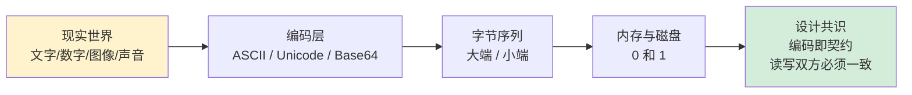
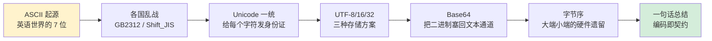

# 1.1 数据编码设计原理

> 📍 **本篇位置**：第 1 卷 · 数据的本质 · 第 1 篇（开卷起源篇）
> 🎯 **核心矛盾**：**人类语义 vs 机器二进制** —— 一切类型系统的最底层都站在编码之上
> 🧭 **设计灵魂**：编码是程序与世界的"翻译表"——ASCII / UTF-8 / Base64 / 大小端 都是同一个问题的不同答案
> 🌐 **跨语言覆盖**：C(char/wchar) · Java(UTF-16 内置) · Go(rune/byte) · Python(str/bytes) · JavaScript(UTF-16 表面+UTF-8 网络)
> 🔗 **延伸阅读**：→ [01.字符串设计的灵魂](./01.字符串设计的灵魂.md) · → [02.浮点型数据设计灵魂](./02.浮点型数据设计灵魂.md) · → [05.序列化数据的思想](./05.序列化数据的思想.md)



---

#### 目录介绍
- [00.真实事故引入](#00真实事故引入)
- [01.ASCII编码表设计](#01ascii编码表设计)
- [02.Unicode与UTF编码](#02unicode与utf编码)
- [03.Base64编解码](#03base64编解码)
- [04.转义字符设计](#04转义字符设计)
- [05.字节序与BOM](#05字节序与bom)
- [06.经典陷阱与生产级反模式](#06经典陷阱与生产级反模式)
- [07.一句话总结](#07一句话总结)

---

## 00.真实事故引入

### 0.1 一条用户昵称引发的线上 P0

凌晨两点，告警群被刷屏：**注册接口大面积 5xx**。链路日志里反复出现一条诡异的栈：

```
MySQLIntegrityConstraintViolationException:
   Incorrect string value: '\xF0\x9F\x98\x80...'
```

这是用户昵称里带了一个 `😀`。代码层、网络层、JSON 解析层全程都在用 UTF-8——但写到 MySQL 时炸了。

复盘时三个工程师轮番给出了三个看似都对的解释：

1. "是 emoji 4 字节的问题，建表用了 `utf8` 而不是 `utf8mb4`。" ✅ 表象正确
2. "那为什么 `'你好'` 又能存下？同样是中文呀。" ❓ 矛盾出现
3. "因为 `'你好'` 是 3 字节，emoji 是 4 字节，MySQL 的 `utf8` 是个**历史骗局**——只支持 3 字节。" ✅ 命中根因

但根因还能再追一层：**为什么世界上会出现"3 字节 UTF-8"和"4 字节 UTF-8"两种东西？为什么 emoji 偏偏需要 4 字节？为什么 Java 里 `"😀".length()` 返回 2，而 Go 里 `len("😀")` 返回 4？**

这些看似无关的奇怪现象，最终都指向同一个故事——**人类语义如何被翻译成 0 和 1**，以及这个翻译过程中各方妥协留下的伤疤。

### 0.2 灵魂三问

这条事故抛出了三个绕不开的问题：

1. **为什么会有这么多种编码？** 既然都是 0 和 1，为什么 ASCII、GBK、UTF-8、UTF-16 不能合并？
2. **为什么同一个字符串，在不同语言里 `length` 返回不同的值？** Java 是 2、Go 是 4、Python 是 1——谁是对的？
3. **二进制数据为什么还要再 Base64 一次？** 这不是浪费空间吗？

带着这三个问题往下看，你会发现：**编码不是"多种实现的并列"，而是一场半个世纪的工程妥协史**。

### 0.3 本篇的探索路径



下面我们沿着这条路径，把每一段历史和它留下的"工程伤疤"都讲清楚。

---

## 01.ASCII编码表设计

ASCII码是什么东西，ASCII（美国信息交换标准代码）是基于拉丁字母的一套电脑编码系统，主要用于显示现代英语和其他西欧语言。

### 1.1 ASCII是干什么

**ASCII 不可见字符**（Non-printable Characters）是指 ASCII 编码表中那些不显示为可见符号的字符。它们通常用于控制文本的格式、设备的行为或通信协议中的特殊功能。理解这些字符的用途和含义对于处理文本数据、调试程序以及理解底层通信协议非常重要。

### 1.2 ASCII编码表概述

ASCII（American Standard Code for Information Interchange）是一种字符编码标准，使用 7 位二进制数（0-127）表示字符。ASCII 表分为两部分：

1. **可见字符**（Printable Characters）：包括字母、数字、标点符号等，范围是 32-126。
2. **不可见字符**（Non-printable Characters）：包括控制字符和特殊字符，范围是 0-31 和 127。

ASCII 码大致由以下**两部分组**成：

* ASCII 非打印控制字符： ASCII 表上的数字 **0-31** 分配给了控制字符，用于控制像打印机等一些外围设备。
* ASCII 打印字符：数字 **32-126** 分配给了能在键盘上找到的字符，当查看或打印文档时就会出现。


char 类型在程序中，最常用来表示字符。其本质依然是一个数字，但每个值都对应一个固定的字符，共定义了128个字符。称之为 ASCII 码 (American Standard Code for Information Interchange) 美国信息交换标准代码。

| **ASCII值** | **控制字符** | **ASCII值** | **字符**    | **ASCII值** | **字符** | **ASCII值** | **字符** |
| ----------- | ------------ | ----------- | ----------- | ----------- | -------- | ----------- | -------- |
| **0**       | **NUL**      | **32**      | **(space)** | 64          | @        | 96          | 、       |
| 1           | SOH          | 33          | !           | **65**      | **A**    | **97**      | **a**    |
| 2           | STX          | 34          | "           | 66          | B        | 98          | b        |
| 3           | ETX          | 35          | #           | 67          | C        | 99          | c        |
| 4           | EOT          | 36          | $           | 68          | D        | 100         | d        |
| 5           | ENQ          | 37          | %           | 69          | E        | 101         | e        |
| 6           | ACK          | 38          | &           | 70          | F        | 102         | f        |
| 7           | BEL          | 39          | ‘           | 71          | G        | 103         | g        |
| 8           | BS           | 40          | (           | 72          | H        | 104         | h        |
| 9           | HT           | 41          | )           | 73          | I        | 105         | i        |
| **10**      | **LF**       | 42          | *           | 74          | J        | 106         | j        |
| 11          | VT           | 43          | +           | 75          | K        | 107         | k        |
| 12          | FF           | 44          | ,           | 76          | L        | 108         | l        |
| 13          | CR           | 45          | -           | 77          | M        | 109         | m        |
| 14          | SO           | 46          | .           | 78          | N        | 110         | n        |
| 15          | SI           | 47          | /           | 79          | O        | 111         | o        |
| 16          | DLE          | **48**      | **0**       | 80          | P        | 112         | p        |
| 17          | DCI          | 49          | 1           | 81          | Q        | 113         | q        |
| 18          | DC2          | 50          | 2           | 82          | R        | 114         | r        |
| 19          | DC3          | 51          | 3           | 83          | S        | 115         | s        |
| 20          | DC4          | 52          | 4           | 84          | T        | 116         | t        |
| 21          | NAK          | 53          | 5           | 85          | U        | 117         | u        |
| 22          | SYN          | 54          | 6           | 86          | V        | 118         | v        |
| 23          | TB           | 55          | 7           | 87          | W        | 119         | w        |
| 24          | CAN          | 56          | 8           | 88          | X        | 120         | x        |
| 25          | EM           | 57          | 9           | 89          | Y        | 121         | y        |
| 26          | SUB          | 58          | :           | 90          | Z        | 122         | z        |
| 27          | ESC          | 59          | ;           | 91          | [        | 123         | {        |
| 28          | FS           | 60          | <           | 92          | \        | 124         | \|       |
| 29          | GS           | 61          | =           | 93          | ]        | 125         | }        |
| 30          | RS           | 62          | >           | 94          | ^        | 126         | ~        |
| 31          | US           | 63          | ?           | 95          | _        | 127         | DEL      |

上表中有 6 个字符对应的 ASCII 较为常见，建议大家记下，会为后续写代码提供很多方便。

| 字符     | ASCII 码 | 字符       | ASCII 码 |
|--------|---------|----------|---------|
| **空**  | **0**   | **‘\n’** | **10**  |
| **空格** | **32**  | **0**    | **48**  |
| **A**  | **65**  | **a**    | **97**  |

需注意的是，我们从键盘键入的所有内容都是字符。如，键入数字 7，实际是字符 ‘7’，真正存储在计算机内的是 55（字符 7 的 ASCII 码值），而如果我们键入了 35，实际上这是两个字符。真正存储在计算机内的是 51 和 53（字符 3 和 字符 5 的 ASCII 码值）。

### 1.3 常见不可见字符

以下是一些常见的 ASCII 不可见字符及其用途：

| 十进制 | 十六进制 | 缩写  | 名称                     | 用途                                                                 |
|--------|----------|-------|--------------------------|----------------------------------------------------------------------|
| 0      | 0x00     | NUL   | 空字符                   | 用于字符串的结束标志（C 语言中的 `\0`）。                            |
| 7      | 0x07     | BEL   | 响铃字符                 | 使终端或设备发出声音。                                               |
| 8      | 0x08     | BS    | 退格字符                 | 将光标向左移动一位，通常用于删除前一个字符。                         |
| 9      | 0x09     | HT    | 水平制表符               | 将光标移动到下一个制表位，通常用于对齐文本。                         |
| 10     | 0x0A     | LF    | 换行字符                 | 将光标移动到下一行，通常用于文本换行。                               |
| 13     | 0x0D     | CR    | 回车字符                 | 将光标移动到行首，通常与换行符一起使用（如 Windows 中的 `\r\n`）。   |
| 27     | 0x1B     | ESC   | 转义字符                 | 用于控制序列的开始（如终端控制）。                                   |
| 127    | 0x7F     | DEL   | 删除字符                 | 用于删除字符或表示删除操作。                                         |

### 1.4 不可见字符用途

#### **文本格式化**
- **换行符（LF, 0x0A）**：用于在文本中换行。
- **回车符（CR, 0x0D）**：用于将光标移动到行首。
- **制表符（HT, 0x09）**：用于对齐文本。

#### **设备控制**
- **响铃字符（BEL, 0x07）**：使终端或设备发出声音。
- **转义字符（ESC, 0x1B）**：用于控制序列的开始，如终端颜色或光标位置。

#### **通信协议**
- **空字符（NUL, 0x00）**：用于表示字符串的结束。
- **删除字符（DEL, 0x7F）**：用于删除字符或表示删除操作。


### 1.5 不可见字符表示

在编程中，不可见字符通常用转义序列表示。以下是一些常见的转义序列：

| 字符       | 转义序列 |
|------------|----------|
| 空字符     | `\0`     |
| 响铃字符   | `\a`     |
| 退格字符   | `\b`     |
| 水平制表符 | `\t`     |
| 换行字符   | `\n`     |
| 回车字符   | `\r`     |
| 转义字符   | `\e`     |

#### **示例**
```cpp
#include <iostream>

int main() {
    std::cout << "Hello\bWorld!\n"; // 输出 HelloWorld!（退格字符删除 'o'）
    std::cout << "Line 1\nLine 2\n"; // 输出两行文本
    std::cout << "Tab\tSeparated\n"; // 输出 Tab    Separated
    return 0;
}
```

### 1.6 不可见字符处理

在处理文本数据时，不可见字符可能会导致问题，例如：

- **字符串比较失败**：字符串末尾可能包含不可见字符（如空字符或换行符）。
- **文本显示异常**：不可见字符可能影响文本的格式或显示。

**示例：去除字符串末尾的换行符**

```cpp
#include <iostream>
#include <string>
#include <algorithm>

void removeNewline(std::string& str) {
    str.erase(std::remove(str.begin(), str.end(), '\n'), str.end());
}

int main() {
    std::string text = "Hello World!\n";
    removeNewline(text);
    std::cout << text; // 输出 Hello World!
    return 0;
}
```


### 1.7 不可见字符调试

在调试程序时，不可见字符可能会导致难以发现的问题。可以使用以下方法检查不可见字符：

- **打印字符的 ASCII 值**：将字符转换为整数并打印。
- **使用十六进制查看器**：查看文件的十六进制内容。

**示例：打印字符的 ASCII 值**

```cpp
#include <iostream>

int main() {
    char ch = '\t'; // 水平制表符
    std::cout << "Character: " << ch << ", ASCII Value: " << (int)ch << std::endl;
    return 0;
}
```

### 1.8 遇到的一些问题

问题 1：字符串比较失败

原因：字符串末尾可能包含不可见字符（如换行符 \n、回车符 \r 或空字符 \0），导致字符串比较失败。

```cpp
std::string str1 = "Hello";
std::string str2 = "Hello\n";
if (str1 == str2) { // 比较失败，因为 str2 包含换行符
    std::cout << "Equal";
} else {
    std::cout << "Not Equal"; // 输出 Not Equal
}
```

问题 2：文件读取错误

原因：文件中的不可见字符可能导致读取错误或解析失败。

```cpp
std::ifstream file("data.txt");
std::string line;
while (std::getline(file, line)) {
    // 如果行尾包含回车符或换行符，可能导致解析错误
}
```


## 02.Unicode与UTF编码

### 2.1 为什么需要Unicode

**疑惑**：ASCII只能表示128个字符，那中文、日文、韩文、阿拉伯文怎么办？

**答疑**：ASCII的设计只考虑了英语，仅用7位编码。随着计算机在全球普及，各国开始设计自己的编码标准：中国的GB2312/GBK、日本的Shift_JIS、韩国的EUC-KR等。这导致了**编码混乱**——同一个字节序列在不同编码下表示完全不同的字符。

```
编码演进路线:
  ASCII (1963) → 7位，128个字符，仅覆盖英语
    ↓ 各国需要自己的文字
  各国编码标准 (1980s) → GB2312/GBK/Shift_JIS/EUC-KR...
    ↓ 跨国通信时乱码严重
  Unicode (1991) → 统一字符集，为全球所有文字分配唯一编号
    ↓ 需要高效的存储方式
  UTF-8 (1993) / UTF-16 / UTF-32 → 不同的编码实现
```

### 2.2 Unicode设计思想

Unicode的核心设计思想是**给世界上每一个字符一个唯一的编号（Code Point）**。

| 范围 | 用途 | 数量 |
|------|------|------|
| U+0000 ~ U+007F | Basic Latin（兼容ASCII） | 128 |
| U+0080 ~ U+07FF | Latin扩展、希腊、西里尔等 | ~1,920 |
| U+0800 ~ U+FFFF | 中日韩统一汉字(CJK)、谚文等 | ~63,488 |
| U+10000 ~ U+10FFFF | 表情符号、古文字、数学符号等 | ~1,048,576 |

**关键区分**：Unicode是**字符集**（定义编号），UTF-8/UTF-16/UTF-32是**编码方案**（定义如何存储编号）。

### 2.3 UTF-8编码原理

UTF-8是目前互联网上使用最广泛的编码方式，其设计非常精妙：

**核心思想**：用变长字节（1-4字节）编码，ASCII字符仍用1字节，中文3字节，稀有字符4字节。

```
UTF-8编码规则:
  U+0000~U+007F     → 0xxxxxxx                          (1字节，兼容ASCII)
  U+0080~U+07FF     → 110xxxxx 10xxxxxx                  (2字节)
  U+0800~U+FFFF     → 1110xxxx 10xxxxxx 10xxxxxx          (3字节，中文在此)
  U+10000~U+10FFFF  → 11110xxx 10xxxxxx 10xxxxxx 10xxxxxx (4字节，emoji在此)

示例：'中' = U+4E2D
  二进制: 0100 1110 0010 1101
  填入模板: 1110[0100] 10[111000] 10[101101]
  UTF-8字节: E4 B8 AD (3字节)
```

**UTF-8的精妙设计**：
1. **向后兼容ASCII**：ASCII文件就是合法的UTF-8文件
2. **自同步**：从任意字节开始都能找到字符边界（通过首位模式区分）
3. **无字节序问题**：不像UTF-16/32需要BOM标记

### 2.4 UTF-16与UTF-32

| 编码 | 字节数 | 优势 | 劣势 | 使用场景 |
|------|--------|------|------|---------|
| UTF-8 | 1-4 | ASCII高效，无BOM | 中文3字节，变长处理复杂 | Web、文件存储、Linux |
| UTF-16 | 2或4 | CJK字符2字节 | ASCII浪费1字节，有字节序问题 | Java/JavaScript内部、Windows API |
| UTF-32 | 4 | 定长，随机访问O(1) | 极浪费空间 | 内部处理（很少用于存储） |

**Java/JavaScript使用UTF-16的历史原因**：

Java（1995年）和JavaScript设计时，Unicode只有65536个字符（U+0000~U+FFFF），刚好2字节能覆盖。后来Unicode扩展到U+10FFFF，UTF-16不得不引入**代理对（Surrogate Pairs）**来表示超出BMP的字符（如emoji）。

```javascript
// JavaScript中的UTF-16代理对问题
'😀'.length  // 2 (不是1！因为emoji使用代理对)
'😀'.charCodeAt(0)  // 55357 (高代理 0xD83D)
'😀'.charCodeAt(1)  // 56832 (低代理 0xDE00)
'😀'.codePointAt(0) // 128512 (U+1F600，正确的码点)
```

### 2.5 编码转换陷阱

**常见乱码问题及原因**：

```
场景: 中文"你好"
  UTF-8编码: E4 BD A0 E5 A5 BD (6字节)
  GBK编码:   C4 E3 BA C3 (4字节)

如果用GBK去解读UTF-8的字节:
  E4 BD → "浣" (错误！)
  A0 E5 → "犲" (错误！)
  A5 BD → "ソ" (错误！)
→ 乱码产生！
```

**各平台的默认编码**：

| 平台 | 默认编码 | 注意事项 |
|------|---------|---------|
| Linux/macOS | UTF-8 | 现代系统统一UTF-8 |
| Windows | 系统区域设置（中文为GBK） | 需要注意文件编码 |
| Android | UTF-8 | Java String内部是UTF-16 |
| iOS | UTF-8 | NSString内部是UTF-16 |
| Web | UTF-8 | HTML需要声明`<meta charset="UTF-8">` |

### 2.6 各语言编码处理

```java
// Java: String内部UTF-16，与外部交互时指定编码
byte[] utf8Bytes = "你好".getBytes(StandardCharsets.UTF_8);  // 6字节
byte[] gbkBytes = "你好".getBytes("GBK");  // 4字节
String restored = new String(utf8Bytes, StandardCharsets.UTF_8);  // 正确
```

```python
# Python 3: str是Unicode，bytes是字节序列
text = "你好"          # str类型，Unicode
utf8 = text.encode('utf-8')   # bytes: b'\xe4\xbd\xa0\xe5\xa5\xbd'
gbk = text.encode('gbk')      # bytes: b'\xc4\xe3\xba\xc3'
text_back = utf8.decode('utf-8')  # 正确还原
```

```javascript
// JavaScript: 使用TextEncoder/TextDecoder处理编码
const encoder = new TextEncoder();  // 默认UTF-8
const bytes = encoder.encode("你好");  // Uint8Array(6)
const decoder = new TextDecoder('utf-8');
const text = decoder.decode(bytes);  // "你好"
```

```go
// Go: string就是UTF-8字节序列
s := "你好"
fmt.Println(len(s))          // 6 (字节数)
fmt.Println(utf8.RuneCountInString(s))  // 2 (字符数)
for _, r := range s {
    fmt.Printf("U+%04X ", r) // U+4F60 U+597D
}
```


## 03.Base64编解码

### 3.1 什么是Base64

**Base64** 是一种将二进制数据编码为 ASCII 字符的编码方式。

它主要用于在文本协议（如电子邮件、URL、JSON 等）中安全地传输二进制数据。

**目的**：将二进制数据转换为可打印的 ASCII 字符，以便在文本环境中传输或存储。

**字符集**：Base64 使用 64 个字符（`A-Z`、`a-z`、`0-9`、`+`、`/`）以及填充字符 `=`。

### 3.2 为何要Base64

各种数据加密方式，最终都会对加密后的二进制数据进行Base64编码，起到一种二次加密的效果，其实Base64从严格意义上来说的话不是一种加密算法，而是一种编码算法。

为何很多对称和非对称加密解密还要对数据base64处理？为何要使用Base64编码呢？它解决了什么问题？

在计算机中任何数据都是按ascii码存储的，而ascii码的128～255之间的值是不可见字符。

在网络上交换数据时，比如说从A地传到B地，往往要经过多个路由设备，由于不同的设备对字符的处理方式有一些不同，这样那些不可见字符就有可能被处理错误，这是不利于传输的。

所以就先把数据先做一个Base64编码，统统变成可见字符，这样出错的可能性就大大降低了。

Base64并不是安全领域的加密算法，其实Base64只能算是一个编码算法，对数据内容进行编码来适合传输。准确说是把一些二进制数转成普通字符用于网络传输。

### 3.3 Base64使用场景

1. 文本传输：在网络传输或存储数据时，某些数据可能包含不可打印字符或特殊字符，这可能会导致数据传输错误或解析问题。通过将数据转换为 Base64 编码，可以确保数据只包含可打印字符，从而更容易传输和处理。
2. 数据格式化： 在某些情况下，需要将二进制数据转换为文本格式，以便在不同系统之间进行交换。Base64 编码可以将二进制数据转换为文本格式，使其更易于处理和传输。
3. 数据隐藏： 在一些场景下，需要隐藏原始数据的内容。虽然 Base64 编码并不是加密，但它可以将数据转换为一种不易直接识别的形式，增加数据的保密性。
4. 数据完整性： 在某些情况下，需要确保数据在传输过程中不被篡改。通过对数据进行 Base64 编码，可以更容易地检测数据是否被篡改，因为 Base64 编码后的数据长度通常是固定的。

### 3.4 Base64基本规则

标准Base64只有64个字符（英文大小写、数字和+、/）以及用作后缀等号；

Base64是把3个字节变成4个可打印字符，所以Base64编码后的字符串一定能被4整除（不算用作后缀的等号）；

等号一定用作后缀，且数目一定是0个、1个或2个。这是因为如果原文长度不能被3整除，Base64要在后面添加\0凑齐3n位。为了正确还原，添加了几个\0就加上几个等号。显然添加等号的数目只能是0、1或2；

严格来说Base64不能算是一种加密，只能说是编码转换。

### 3.5 Base64编码原理

Base64 编码将二进制数据按每 3 个字节（24 位）分组，然后将这 24 位分为 4 个 6 位的单元，每个单元映射为一个 Base64 字符。

**编码步骤**

1. 将二进制数据按每 3 个字节分组。
2. 将每组的 24 位分为 4 个 6 位的单元。
3. 将每个 6 位单元映射为 Base64 字符。
4. 如果最后一组不足 3 个字节，用 0 填充，并在编码结果末尾添加填充字符 `=`。

**示例** 将字符串 `"Man"` 编码为 Base64：

1. 将 `"Man"` 转换为二进制：
   ```
   M -> 77 -> 01001101
   a -> 97 -> 01100001
   n -> 110 -> 01101110
   ```
2. 将 24 位分为 4 个 6 位单元：
   ```
   010011 010110 000101 101110
   ```
3. 将每个 6 位单元映射为 Base64 字符：
   ```
   010011 -> 19 -> T
   010110 -> 22 -> W
   000101 -> 5  -> F
   101110 -> 46 -> u
   ```
4. 编码结果为 `"TWFu"`。

### 3.6 Base64解码原理

Base64 解码将 Base64 字符转换回二进制数据。

**解码步骤**

1. 将 Base64 字符转换为 6 位二进制值。
2. 将 4 个 6 位单元合并为 24 位（3 个字节）。
3. 如果编码结果包含填充字符 `=`，则忽略对应的 6 位单元。

**示例** 将 Base64 字符串 `"TWFu"` 解码为原始数据：

1. 将每个字符转换为 6 位二进制值：
   ```
   T -> 19 -> 010011
   W -> 22 -> 010110
   F -> 5  -> 000101
   u -> 46 -> 101110
   ```
2. 将 4 个 6 位单元合并为 24 位：
   ```
   010011 010110 000101 101110
   ```
3. 将 24 位分为 3 个字节：
   ```
   01001101 -> 77 -> M
   01100001 -> 97 -> a
   01101110 -> 110 -> n
   ```
4. 解码结果为 `"Man"`。

### 3.7 Base64填充字符

如果二进制数据的长度不是 3 的倍数，Base64 编码会在末尾添加填充字符 `=`。

填充字符的数量取决于剩余字节数：

- 剩余 1 个字节：添加 2 个 `=`。
- 剩余 2 个字节：添加 1 个 `=`。

**示例** 将字符串 `"Ma"` 编码为 Base64：

1. 将 `"Ma"` 转换为二进制：
   ```
   M -> 77 -> 01001101
   a -> 97 -> 01100001
   ```
2. 将 16 位分为 3 个 6 位单元（不足部分用 0 填充）：
   ```
   010011 010110 000100
   ```
3. 将每个 6 位单元映射为 Base64 字符：
   ```
   010011 -> 19 -> T
   010110 -> 22 -> W
   000100 -> 4  -> E
   ```
4. 编码结果为 `"TWE="`（添加 1 个 `=`）。

### 3.8 如何判断Base64

**方法 1：检查字符集** 遍历字符串，检查每个字符是否属于 Base64 字符集。如果发现非法字符，则不是 Base64 编码。

**方法 2：检查长度** 检查字符串的长度是否是 4 的倍数。如果不是，则可能不是 Base64 编码。

**方法 3：检查填充字符** 检查字符串末尾是否有 1 或 2 个 `=` 填充字符。如果有，则可能是 Base64 编码。

判断一个字符串是否是 Base64 编码，可以通过检查字符集、长度和填充字符来实现。

Base64 编码的字符串仅包含特定字符，长度通常是 4 的倍数，末尾可能有 1 或 2 个 `=` 填充字符。

### 3.9 Base64字符特征

Base64 编码的字符串具有以下特征：

1. **字符集**：仅包含以下字符：
- 大写字母 `A-Z`
- 小写字母 `a-z`
- 数字 `0-9`
- 特殊字符 `+` 和 `/`
- 填充字符 `=`
2. **长度**：Base64 编码后的字符串长度通常是 4 的倍数（因为每 3 个字节编码为 4 个字符）。
3. **填充字符**：如果原始数据的长度不是 3 的倍数，编码结果末尾会添加 1 或 2 个 `=` 作为填充字符。


## 04.转义字符设计

### 4.1 转义字符表

**作用**：用于表示一些不能显示出来的ASCII字符。

现阶段我们常用的转义字符有：` \n  \\  \t`

| **转义字符** | **含义**                                | **ASCII**码值（十进制） |
| ------------ | --------------------------------------- | ----------------------- |
| \a           | 警报                                    | 007                     |
| \b           | 退格(BS) ，将当前位置移到前一列         | 008                     |
| \f           | 换页(FF)，将当前位置移到下页开头        | 012                     |
| **\n**       | **换行(LF) ，将当前位置移到下一行开头** | **010**                 |
| \r           | 回车(CR) ，将当前位置移到本行开头       | 013                     |
| **\t**       | **水平制表(HT)  （跳到下一个TAB位置）** | **009**                 |
| \v           | 垂直制表(VT)                            | 011                     |
| **\\\\**     | **代表一个反斜线字符"\"**               | **092**                 |
| \'           | 代表一个单引号（撇号）字符              | 039                     |
| \"           | 代表一个双引号字符                      | 034                     |
| \?           | 代表一个问号                            | 063                     |
| \0           | 数字0                                   | 000                     |
| \ddd         | 8进制转义字符，d范围0~7                 | 3位8进制                |
| \xhh         | 16进制转义字符，h范围0~9，a~f，A~F      | 3位16进制               |

### 4.2 转义字符的本质：源代码层 vs 内存层

这里有一个非常容易混淆的点：**`\n` 在源代码里是 2 个字符，在内存里是 1 个字节**。

```c
char s[] = "a\nb";
// 源代码看：4 个字符（a、\、n、b）
// 内存里看：4 个字节（'a'=0x61, '\n'=0x0A, 'b'=0x62, '\0'=0x00）
```

转义字符是**编译器层的语法糖**，它解决的矛盾是：

- 字符串字面量是用 ASCII 写的源代码
- 但你想表达的是 ASCII 中的不可见字符（如 LF=10）
- 直接写 LF 会让源码无法正常编辑
- 所以发明了 `\` + 字母的两字符序列，编译器在 lex 阶段把它翻译成 1 个字节

**这也解释了为什么 Windows 路径在字符串里要写 `"C:\\path"`** —— 因为单个 `\` 会被编译器吃掉解析转义，必须写两个让编译器吐出一个。

---

## 05.字节序与BOM

### 5.1 大小端的硬件根源

看下面这个反直觉现象：

```c
uint32_t x = 0x12345678;
uint8_t *p = (uint8_t*)&x;
printf("%02X %02X %02X %02X\n", p[0], p[1], p[2], p[3]);

// x86 / ARM(默认) 输出: 78 56 34 12  ← 小端
// PowerPC / 网络字节序: 12 34 56 78  ← 大端
```

**为什么会有两种字节序？** 这要追溯到 1970 年代两大 CPU 阵营的分歧：

- **小端阵营（Intel）**：低位字节存低地址。**优势是"地址即值"**——同一个内存地址，按 `uint8_t*` 读得到低字节、按 `uint32_t*` 读得到完整数。CPU 做加法时从低位开始进位，这个布局非常顺滑。
- **大端阵营（Motorola/IBM）**：高位字节存低地址。**优势是"读起来像写的"**——hexdump 出来的字节顺序就是人类阅读的顺序，调试友好。

这场战争从来没有赢家，最终的妥协是：

| 领域 | 字节序 | 原因 |
|---|---|---|
| 主流 CPU（x86/ARM） | 小端 | Intel 路径依赖 |
| 网络协议（TCP/IP） | 大端 | 历史早期 IBM/SUN 主导 |
| Java VM | 大端 | 跨平台一致性优先 |
| 文件格式（PNG/JPEG） | 大端 | 沿袭网络字节序 |
| 文件格式（BMP/WAV） | 小端 | 沿袭 x86 内存布局 |

这就是为什么**网络通信里反复出现 `htonl` / `ntohl`**：你不知道两端 CPU 是谁，必须显式约定。

### 5.2 BOM（Byte Order Mark）的来龙去脉

UTF-16 / UTF-32 一个码点占 2/4 字节，必然涉及字节序。Unicode 委员会的解决方案是：在文件开头放一个特殊字符 `U+FEFF` 当"路标"。

```
文件开头字节   →   被识别为
FE FF          →   UTF-16 大端（BE）
FF FE          →   UTF-16 小端（LE）
00 00 FE FF    →   UTF-32 大端
FF FE 00 00    →   UTF-32 小端
EF BB BF       →   UTF-8（不需要字节序，但 Windows 喜欢加）
```

**UTF-8 BOM 是工程史上的一个小灾难**：UTF-8 本身没有字节序问题，加 BOM 是多此一举。但 Windows 记事本默认加 BOM，结果导致：

- Linux/macOS 的 shell 脚本一旦带 BOM，`#!/bin/bash` 会变成 `\xEF\xBB\xBF#!/bin/bash`，内核找不到解释器直接报错
- PHP 文件带 BOM，会在 HTTP 响应前输出 3 个不可见字节，破坏 `header()` 调用
- JSON 标准明确禁止 BOM（RFC 8259），但很多解析器宽松接受，给跨系统兼容埋下地雷

**结论**：UTF-8 文件请永远使用 "UTF-8 without BOM"。

---

## 06.经典陷阱与生产级反模式

这一节回到 §0.1 那条线上事故，把每个常见编码陷阱都展开成"现象 → 根因 → 修复"的三段式。

### 6.1 陷阱一：MySQL `utf8` 的历史骗局

**现象**：emoji 写入失败，错误信息 `Incorrect string value: '\xF0\x9F...'`。

**根因**：MySQL 的 `utf8` 字符集**只支持 3 字节 UTF-8**——这是 2003 年 MySQL 引入 UTF-8 时的实现 BUG，因为当时 Unicode 还在 BMP 内（U+0000~U+FFFF），UTF-8 最多 3 字节就够。后来 Unicode 扩展到 U+10FFFF，emoji 落在了"辅助平面"需要 4 字节，而 MySQL 出于兼容性**没有修这个 BUG**，而是新加了一个 `utf8mb4`。

**修复**：
```sql
ALTER TABLE users CONVERT TO CHARACTER SET utf8mb4 COLLATE utf8mb4_unicode_ci;
-- my.cnf 也要改：
-- character-set-server = utf8mb4
-- collation-server = utf8mb4_unicode_ci
```

**深层教训**：**永远不要使用 MySQL 的 `utf8`**——它是个有历史包袱的伪 UTF-8。MySQL 8.0 已经把 `utf8` 默认指向 `utf8mb3` 并标记为 deprecated。

### 6.2 陷阱二：`"😀".length()` 跨语言行为不一致

```java
// Java
"😀".length()                      // 2  ← UTF-16 code unit 数
"😀".codePointCount(0, 2)          // 1  ← 真实字符数
```
```javascript
// JavaScript
"😀".length                        // 2  ← UTF-16 code unit 数（同 Java 病）
[..."😀"].length                   // 1  ← ES6 迭代器按 code point 拆
```
```go
// Go
len("😀")                          // 4  ← UTF-8 字节数
utf8.RuneCountInString("😀")       // 1  ← code point 数
```
```python
# Python 3
len("😀")                          # 1  ← 直接按 code point 计数
```

**根因**：每种语言对 "length" 的定义来自其字符串内部表示：
- Java/JS：内部 UTF-16，length 是 UTF-16 code unit 数 → BMP 外字符算 2
- Go：string 是 UTF-8 字节序列，len 是字节数
- Python 3：内部按需 Latin-1/UCS-2/UCS-4，len 永远是字符数

**修复**：
- 截短昵称、限制长度时，**永远使用"按 code point 计数"或"按 grapheme cluster 计数"**，不要用 `length`
- Java 用 `codePointCount`，JS 用 `[...str].length`，Go 用 `utf8.RuneCountInString`

**更深的坑**：连 code point 数都不够准——`👨‍👩‍👧‍👦`（一家四口 emoji）由 7 个 code point 组成（4 个人 + 3 个 ZWJ），但用户视觉上是 1 个字符。这就需要 **grapheme cluster** 概念（Unicode UAX #29）。

### 6.3 陷阱三：`new String(bytes)` 的默认编码地雷

```java
// 服务在 Linux 跑得好好的，部署到 Windows 后中文全乱码
String text = new String(bytes);  // ← 默默使用平台默认编码
// Linux: UTF-8， Windows 中文版: GBK
```

**根因**：`new String(byte[])` 不指定编码时，使用 JVM 启动时确定的 `file.encoding` 系统属性，而它由操作系统区域设置决定。这是 Java 早期一个广为诟病的设计——**"看起来对，跨环境就崩"**。

**修复铁律**：
```java
// ❌ 永远不要这么写
new String(bytes);
bytes = str.getBytes();

// ✅ 永远显式指定编码
new String(bytes, StandardCharsets.UTF_8);
bytes = str.getBytes(StandardCharsets.UTF_8);
```

JDK 18 开始默认编码改为 UTF-8（JEP 400），但**生产代码不能依赖这个默认值**。

### 6.4 陷阱四：URL 里的中文与 `+` 号歧义

```
搜索 "C++ 教程" 的 URL：
方案 A: q=C%2B%2B+%E6%95%99%E7%A8%8B   ← application/x-www-form-urlencoded
方案 B: q=C%2B%2B%20%E6%95%99%E7%A8%8B  ← RFC 3986 标准
```

**根因**：HTML 表单提交（form-urlencoded）规定空格编码为 `+`，但 URL 路径部分（RFC 3986）规定空格编码为 `%20`。两者**对 `+` 字符的语义完全相反**：在表单里 `+` = 空格，在路径里 `+` = 字面量加号。

**修复**：
- Java 用 `URLEncoder.encode` 编码 query，但要知道它产生的是 form-urlencoded 风格
- 路径段用 `URI` 类的构造器，自动按 RFC 3986 编码
- **永远在前后端约定一种风格**，不要混用

### 6.5 陷阱五：JSON 里的非法 UTF-8 序列

```json
{"name": "\uD83D"}    ← 一个孤立的高代理，不合法
```

**根因**：UTF-16 代理对必须成对出现（`\uD83D\uDE00` 才是 😀），孤立的高/低代理在 Unicode 中是非法字符。但 JSON 标准规定 `\uXXXX` 是合法语法，于是产生了"语法合法但语义非法"的灰色地带。

各种解析器行为：
- 严格模式（如 RFC 8259）：拒绝
- 宽松模式（大多数浏览器）：接受并产出 U+FFFD（替换字符）
- 直接透传：可能在后续序列化时崩溃

**修复**：在数据进入系统的边界（API 入口）做严格 UTF-8 校验，及早拒绝非法序列。

---

## 07.一句话总结

### 7.1 三层认知阶梯

```
第一层（知其然）：会用 UTF-8 / Base64
  ↓
第二层（知其所以然）：理解 UTF-8 为什么是 1-4 变长，理解 Base64 为什么膨胀 33%
  ↓
第三层（知其将所以然）：能在新场景（如 emoji 排序、跨平台通信、二进制嵌入）中独立做出正确决策
```

### 7.2 七字真言

> **"编码即契约，读写须一致。"**

这条原则展开是七句话：

1. **任何字符串落地（文件、网络、数据库）都必须显式指定编码**——默认编码是定时炸弹。
2. **UTF-8 是默认选择**——除非你在 JVM 内部优化、或在调用 Windows 原生 API。
3. **MySQL 永远用 `utf8mb4`**——`utf8` 是历史骗局。
4. **不要相信 `length`**——按 code point / grapheme cluster 计数才靠谱。
5. **二进制塞文本通道用 Base64**——但要知道它膨胀 33%，能避免就避免。
6. **UTF-8 不要带 BOM**——它会破坏 shell 脚本和 JSON。
7. **跨系统通信永远显式约定字节序**——网络字节序是大端，但内存字节序通常是小端。

### 7.3 与下篇的承接

本篇我们解决了"字符如何变成字节"的问题，但还有一个更基础的问题没回答：**这些字节进入计算机后，CPU 是怎么把它们"当数字"使用的？为什么 `int` 加法会绕回？为什么 `(start+end)/2` 这种写法会引发线上事故？**

这就是下一篇 [1.2 整型与位运算原理](./1.2.整型与位运算原理.md) 要回答的——**整数在二进制下的本质：补码、溢出与位运算的硬件根源**。

---

## 🔗 延伸阅读

- 同卷下篇：[1.2 整型与位运算原理](./1.2.整型与位运算原理.md) ｜[1.3 浮点型数据设计灵魂](./1.3.浮点型数据设计灵魂.md)
- 编码 → 字符串：[1.4 字符串设计的灵魂](./1.4.字符串设计的灵魂.md)
- 编码 → 序列化：[1.8 序列化数据的思想](./1.8.序列化数据的思想.md) ｜[1.9 数据解析设计思想](./1.9.数据解析设计思想.md)
- 字节序 → 内存：[4.1 虚拟内存与地址空间](../04.第4卷内存的真相/4.1.虚拟内存与地址空间.md) ｜[4.4 内存对齐与缓存局部性](../04.第4卷内存的真相/4.4.内存对齐与缓存局部性.md)
- Base64 → 加密：[5.8 数据加密和解密](../05.第5卷交互与系统/5.8.数据加密和解密.md)
