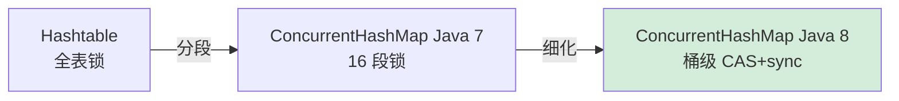
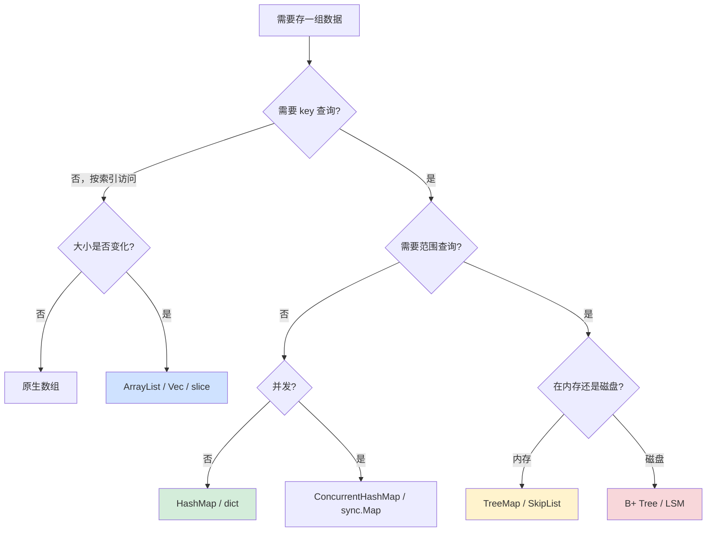

# 1.7 集合与容器设计原理

> 📍 **本篇位置**：第 1 卷 · 数据的本质 · 第 7 篇
> 🎯 **核心矛盾**：**单个数据有自己的形状，但"一组数据"在内存中如何摆放、如何检索、如何并发访问，决定了 99% 业务系统的性能上限**
> 🧭 **设计灵魂**：容器从来不是"装数据的盒子"，而是**对"访问模式"的物理建模**——你的代码会怎么读、怎么写、怎么并发、怎么遍历，决定了你应该选哪种内存布局
> 🌐 **跨语言覆盖**：Java (ArrayList/HashMap/CHM) · C++ (vector/unordered_map/std::map) · Go (slice/map) · Rust (Vec/HashMap/BTreeMap) · Python (list/dict/set) · Redis (ziplist/listpack/dict)
> 🔗 **延伸阅读**：← [1.6 泛型设计灵魂思想](./1.6.泛型设计灵魂思想.md) · → [1.8 序列化数据的思想](./1.8.序列化数据的思想.md) · → [4.2 缓存与局部性原理](../04.第4卷内存的真相/) · → [3.x 并发容器与无锁设计](../03.第3卷并发之道/)

---

> 前几章我们讨论了"单个数据"的表示——整型、浮点、字符串、引用、泛型。但工程世界几乎没有"孤立的数据"，更多的是**一组数据的集合**：用户列表、订单字典、关注者集合、消息队列……
>
> 集合容器看似只是 `List`、`Map`、`Set`，但它们背后藏着计算机科学最深刻的一组权衡：**时间 vs 空间、连续 vs 离散、有序 vs 无序、读多 vs 写多、单线程 vs 并发**。本章从一次真实的"性能踩坑"出发，回到第一性原理，重新审视容器的本质。

#### 目录介绍
- [00.真实事故引入](#00真实事故引入)
- [01.容器的第一性原理：内存布局决定一切](#01容器的第一性原理内存布局决定一切)
- [02.动态数组的设计哲学](#02动态数组的设计哲学)
- [03.哈希表：用空间换时间的极致艺术](#03哈希表用空间换时间的极致艺术)
- [04.有序容器：树结构的精妙平衡](#04有序容器树结构的精妙平衡)
- [05.并发容器：当多个线程同时访问](#05并发容器当多个线程同时访问)
- [06.跨语言容器设计对比](#06跨语言容器设计对比)
- [07.经典陷阱与生产级反模式](#07经典陷阱与生产级反模式)
- [08.一句话总结](#08一句话总结)

> 🎯 **阅读建议**：本章是第 1 卷的"集大成者"——它会把前面 6 章学到的"内存布局、引用语义、泛型抽象"全都串起来。每读到一节，请停下来想一想"如果我自己来设计这个容器，会怎么做"。

---

## 00.真实事故引入

### 0.1 一个 ArrayList.contains 把网关打到 100% CPU

我曾负责一个 API 网关，它有一个"黑名单 IP 校验"逻辑——每个进来的请求都要查一下当前 IP 是否在黑名单里：

```java
public class BlacklistFilter {
    private List<String> blacklist = new ArrayList<>();
    
    public void load() {
        // 启动时从配置中心拉取
        blacklist = configCenter.fetch("blacklist");   // 大约 5 万条 IP
    }
    
    public boolean isBlocked(String ip) {
        return blacklist.contains(ip);                 // ← 就是这一行
    }
}
```

这段代码上线后跑得很正常。直到某天黑名单从 5 万条扩充到 **80 万条**，然后线上告警雪崩——**网关单机 CPU 飙到 100%、QPS 从 5 万跌到不足 500、P99 延迟从 5ms 飙到 2 秒**。

**第一反应**：是不是哪里死循环了？是不是 GC 卡了？是不是网络抖动？

但 jstack 拎出来一看，几百个线程全部卡在 `ArrayList.contains` 这一行。

```
"http-nio-8080-exec-128" #3128 ...
   at java.util.ArrayList.indexOf(ArrayList.java:323)
   at java.util.ArrayList.contains(ArrayList.java:289)
   at com.example.BlacklistFilter.isBlocked(BlacklistFilter.java:14)
```

**根因分析**：

```
ArrayList.contains 的实现 = 线性扫描 = O(N)
单次查询：80 万次字符串比较 ≈ 0.5ms
4 核机器，QPS 5 万 → 单核 1.25 万 QPS × 0.5ms = 6.25 秒 CPU 时间/秒
→ CPU 100% 吃满，请求全部排队
```

**修复方案 1 行代码**：

```java
private Set<String> blacklist = new HashSet<>();   // ArrayList → HashSet
```

**修复后效果**：单次查询从 0.5ms 降到 50ns（**10000 倍**），CPU 从 100% 跌回 5%，QPS 恢复 5 万。

### 0.2 灵魂三问

这次事故让我反复追问三个问题：

1. **`ArrayList.contains` 和 `HashSet.contains` 都是一行代码，为什么差 10000 倍？** —— 它们的内存布局到底有多大区别？
2. **`HashSet` 是怎么做到 O(1) 查询的？真的是 O(1) 吗？** —— 哈希表底层用了什么"魔法"？为什么有时它会退化成 O(N)？
3. **如果黑名单要支持"前缀匹配"（如 `192.168.*`），`HashSet` 还够用吗？** —— 容器的选择，本质上是被"访问模式"决定的，不是被"数据类型"决定的。

如果你能回答这三个问题，你就理解了**为什么容器是工程师最容易踩坑、也最值得深挖的话题**。

### 0.3 本篇的探索路径

```mermaid
flowchart LR
    A[访问模式] --> B{需要什么?}
    B -->|顺序遍历 / 索引访问| C[数组 / 动态数组]
    B -->|按 key 查找 O(1)| D[哈希表]
    B -->|按 key 范围查询| E[有序树 / 跳表]
    B -->|频繁中间插入删除| F[链表 / 双端队列]
    B -->|多线程并发| G[并发容器]
    
    style C fill:#cfe2ff
    style D fill:#d4edda
    style E fill:#fff3cd
    style G fill:#f8d7da
```

我们沿着"内存布局 → 数组 → 哈希表 → 有序树 → 并发容器"的路径，把**每一种容器的设计动机、性能极限、退化条件**讲透。

### 0.4 为什么这个问题值得用一整章讲透

读到这里你可能会想：容器不就是 `List` / `Map` / `Set` 吗？至于花一整章？

我想抛三个**几乎所有面试候选人都答错**的问题：

1. **为什么 Java 的 `HashMap` 在 Java 8 引入了红黑树？** —— 直觉是"提升查询性能"，但更深层的原因是**抵御哈希碰撞攻击**（CVE-2011-4838）。
2. **为什么 Go 的 `map` 不允许并发写？为什么会主动 panic 而不是上锁？** —— 这是 Go 团队 2017 年深思熟虑的设计——上锁会让 95% 的"单线程使用者"付出无谓代价。
3. **为什么 Redis 用 `ziplist` 而不是普通 `LinkedList`？为什么 7.0 又把 ziplist 全换成了 `listpack`？** —— 这是数据库世界对"内存效率与连锁更新"权衡的最高级演化。

如果你能答出第 1 题，你理解了**哈希表的最坏退化路径与防御**；
如果你能答出第 2 题，你理解了**"快速失败优于慢慢腐烂"的并发哲学**；
如果你能答出第 3 题，你理解了**容器在不同尺度下的不同设计取舍**。

这一章我们就要把这三个谜底，连同它们背后的整套设计哲学，**让你亲手推导出来**。

---

## 01.容器的第一性原理：内存布局决定一切

要理解一切容器，先回到一个最基础的问题：**N 个元素在物理内存里有几种摆放方式？**

答案是只有两种：**连续摆放** 或 **离散摆放**。这两种摆放方式是所有容器设计的"原子选项"——其他一切（哈希、树、跳表、Bloom Filter）都是在这两个原子上的组合与变形。

### 1.1 连续内存：数组的伟大与局限

数组的本质是"**N 个相同大小的元素，在内存里挨着排成一排**"：

```
int arr[6] = {10, 20, 30, 40, 50, 60};

内存布局（假设起始地址 0x1000，int 占 4 字节）：
  0x1000: 10
  0x1004: 20
  0x1008: 30
  0x100C: 40
  0x1010: 50
  0x1014: 60
  
访问 arr[i] 的物理过程：
  地址 = 0x1000 + i × 4   ← 一次乘法 + 一次加法
  从该地址读 4 字节
  
→ O(1) 时间，无论 i 多大
```

**这个"O(1) 索引访问"是数组独有的超能力**——它不需要任何额外信息，**只靠地址算术就能定位任意元素**。

但代价同样明显：

| 操作 | 数组 | 解释 |
|---|---|---|
| 索引访问 `arr[i]` | **O(1)** | 地址算术 |
| 末尾追加 | **O(1)** 摊还 | 大多数情况下是直接写下一个槽位 |
| 中间插入 `arr[3] = x` | **O(N)** | 需要把 `arr[3..N-1]` 整体后移 |
| 中间删除 `del arr[3]` | **O(N)** | 需要把 `arr[4..N]` 整体前移 |
| 查找 `arr.contains(x)` | **O(N)** | 必须线性扫描 |

**§0.1 那个事故的本质**就是踩到了最后一行——`ArrayList.contains` 是 O(N) 的线性扫描。

### 1.2 离散内存：链表如何用"指针"换"灵活"

链表的设计动机是回应数组的痛点："**能不能让中间插入也是 O(1)？**"

答案是：把元素放到任意位置，每个元素额外存一个"下一个元素的地址"：

```
单链表节点：
  +---------+---------+
  |  value  |  next   |
  +---------+---------+

5 个节点的链表：
  
  [10|→]──→[20|→]──→[30|→]──→[40|→]──→[50|×]
   0x2000   0x3500   0x1100   0x4200   0x5800
   ↑↑↑      ↑↑↑      ↑↑↑      ↑↑↑      ↑↑↑
   它们在物理内存里完全分散，靠 next 指针串起来
```

**链表的优势**：

```
中间插入只需改 2 个指针：
  原来：A → B → C
  在 B 和 C 之间插入 X：
    X.next = C        ← 让 X 指向 C
    B.next = X        ← 让 B 指向 X
  → O(1) 完成
```

**但链表为这个 O(1) 插入付出了沉重代价**：

| 操作 | 链表 | 解释 |
|---|---|---|
| 索引访问 | **O(N)** | 必须从头沿 next 走 i 步 |
| 末尾追加 | **O(1)** 或 O(N) | 维护尾指针则 O(1)，否则 O(N) |
| 已知节点的中间插入 | **O(1)** | 改 2 个指针 |
| 查找 | **O(N)** | 线性扫描 |
| **空间开销** | **每个节点多 8-16 字节指针** | 64 位机上每个节点至少多一个 next |

### 1.3 缓存友好性：为什么数组在现代 CPU 上几乎总是赢家

到这里很多教科书会说"链表插入 O(1)、数组插入 O(N)，所以频繁插入用链表"。**但在现代硬件上，这个建议大多数情况下是错的**。

**原因藏在 CPU 缓存里**。

```
现代 CPU 的内存层级（典型数据，2024 年）：
  寄存器:    < 1 ns
  L1 cache:  ~1 ns       (32-64 KB)
  L2 cache:  ~3 ns       (256 KB - 1 MB)
  L3 cache:  ~12 ns      (8-32 MB，多核共享)
  DRAM:      ~100 ns     (16-128 GB)
  SSD:       ~50,000 ns
  
→ DRAM 比 L1 慢 100 倍，比寄存器慢 200 倍以上
```

CPU 每次从内存读数据**不是按字节读，而是按"缓存行（cache line, 通常 64 字节）"读**。也就是你访问 `arr[0]` 时，CPU 会顺手把 `arr[0]~arr[15]`（假设是 4 字节 int）一起拉进 L1。

**这意味着遍历数组时，每访问 16 个元素只发生 1 次 cache miss**。而遍历链表时，每个节点都在不同位置，**几乎每次访问都是 cache miss**。

**真实测试**（C++，10 万元素求和）：

```
std::vector<int>:   ~50 微秒    （连续内存，prefetch 友好）
std::list<int>:     ~3000 微秒  （离散内存，每个节点都 cache miss）
                                差距：60 倍
```

**结论**：在元素数量 < 1000、且没有"按 key 查询"需求时，**`std::vector` 的中间插入往往比 `std::list` 还快**——因为虽然 vector 要 memmove，但 memmove 是"顺序 memcpy"，CPU 用 SIMD 一次能搬 32 字节；而 list 的指针追逐每一步都是 cache miss。

**Bjarne Stroustrup（C++ 之父）在 2014 年 GoingNative 大会上专门讲过这个**——"链表的算法复杂度优势在现代 CPU 上几乎不存在"。从此 C++ 社区流行一句话：**"vector is the default container."**（vector 是默认容器）。

### 1.4 顺序访问 vs 随机访问的硬件代价差异

在第一性原理层面，CPU 对内存的两种访问模式有截然不同的代价：

| 访问模式 | 硬件机制 | 典型延迟 |
|---|---|---|
| **顺序访问** | 硬件 prefetcher 自动预取下一个 cache line | ~1 ns/元素 |
| **随机访问** | 每次都要等 DRAM 返回 | ~100 ns/元素 |
| **指针追逐** | 链表式访问，prefetcher 失效 | ~100 ns/元素 |

**这就是为什么 `ArrayList` 在 99% 场景下都比 `LinkedList` 快**——除非你做的是"在链表中间频繁插入大量元素 + 几乎不做随机访问 + 数据量极大"这种极端场景。

---

## 02.动态数组的设计哲学

定长数组的痛点是"**不知道要放多少元素，预分配多大都会要么浪费、要么不够**"。所以现代语言全都提供了动态数组（Java 的 `ArrayList`、C++ 的 `std::vector`、Go 的 slice、Rust 的 `Vec`、Python 的 `list`）。

它们看起来就是"自动扩容的数组"，但里面藏着至少 3 个非平凡的设计抉择。

### 2.1 为什么扩容因子是 1.5 或 2，而不是 1.1

动态数组的核心算法是：

```
push(x):
  if size == capacity:
    new_arr = malloc(capacity × FACTOR)   // 扩容
    memcpy(new_arr, arr, capacity)
    free(arr)
    arr = new_arr
    capacity = capacity × FACTOR
  arr[size++] = x
```

**FACTOR 应该取多少？** 这是一个被深度研究过的工程问题。

**直觉派的方案**：
- 每次 +1：每次 push 都要扩容、复制全部元素 → **O(N²)** 灾难
- 每次 ×1.1（增加 10%）：扩容次数多，复制次数也多
- 每次 ×2：扩容次数少，但每次复制内存翻倍
- 每次 ×4：复制更少，但浪费内存

**摊还分析的真相**：只要 FACTOR > 1 是常数，N 次 push 的总代价都是 **O(N)**（每次摊还 O(1)）。所以选什么 FACTOR 不影响渐进复杂度——它影响的是**实际系数**。

**实际系数对比**（N 次 push 后总复制次数）：

| FACTOR | 扩容次数 | 总复制次数 | 内存浪费上限 |
|---|---|---|---|
| 1.5 | log₁.₅ N ≈ 17（N=10⁶）| ≈ 3N | 33% |
| 2.0 | log₂ N ≈ 20（N=10⁶）| ≈ 2N | 50% |
| 4.0 | log₄ N ≈ 10（N=10⁶）| ≈ 1.33N | 75% |

**主流语言的选择**：

| 语言 | 扩容因子 | 设计考虑 |
|---|---|---|
| **Java ArrayList** | 1.5 | 1.5×oldCapacity（精确：`oldCap + (oldCap >> 1)`）|
| **C++ std::vector (GCC)** | 2.0 | 简单、log 次数少 |
| **C++ std::vector (MSVC)** | 1.5 | 内存友好 |
| **Go slice** | 2.0（小）/ 1.25（大）| 小数组 ×2，大数组（>1024）×1.25 |
| **Python list** | ~1.125 | 复杂公式：`new = old + (old >> 3) + 6` |
| **Rust Vec** | 2.0 | 简单 |

#### 2.1.1 为什么 1.5 比 2.0 更"内存友好"？

这是一个非平凡的论证——它涉及到 **malloc 内部的内存分配策略**。

**Facebook FBVector 的论文**（2014）指出：当扩容因子 = 2 时，**永远不可能复用之前释放的内存块**：

```
设初始容量 = 100，每次 ×2：
  100 → 200 → 400 → 800 → 1600 ...
  
释放历史：100 + 200 + 400 = 700
当前申请：1600
700 < 1600 → 之前释放的内存永远不够新申请，必须从 OS 拿新块

设初始容量 = 100，每次 ×1.5：
  100 → 150 → 225 → 338 → 507 → 760 → 1140
  
释放历史：100 + 150 + 225 + 338 = 813
当前申请：760
813 > 760 → 之前释放的内存可以被 malloc 复用！
```

**结论**：**1.5 是数学上"能复用历史内存"的最优常数**（精确临界值是黄金分割数 φ ≈ 1.618）。Facebook 据此把内部 vector 改成了 1.5×。

#### 2.1.2 Go slice 的双速扩容：小慢、大快

Go 的设计更精细：

```go
// runtime/slice.go (简化)
newcap := old.cap
if newcap < 1024 {
    newcap = newcap * 2          // 小数组：×2
} else {
    for newcap < required {
        newcap += newcap / 4     // 大数组：×1.25
    }
}
```

**为什么大数组用 1.25？** 因为大数组的复制成本巨大（GB 级），扩容步长大会浪费内存；小数组复制便宜，扩容步长大反而少触发几次。**这是工业界对"小尺度局部性"和"大尺度内存效率"的权衡**。

### 2.2 摊还分析：O(1) 平均插入是如何被证明的

很多人能说出"动态数组追加是 O(1) 摊还"，但很少有人能严格证明。我们用**会计法（accounting method）**来证明。

**核心思想**：每次 push 收 3 块"代金券"——1 块用于本次 push，剩余 2 块攒起来用于未来扩容时的 memcpy。

```
设当前 capacity = N，size = N（已满）
此时累积的代金券 ≥ 2N（每次 push 攒 2 块，从 N/2 扩容到 N 时积攒了 N 张）

下次 push 触发扩容：
  分配 2N 容量
  memcpy N 个元素到新数组（消耗 N 块代金券）
  push 新元素（消耗 1 块代金券）
  
还剩 ≥ N 块代金券，进入下一轮（capacity = 2N）

→ 任何时刻代金券数 ≥ 0 → 摊还代价 O(1)
```

**这个证明的精妙之处**：它告诉你"O(1) 摊还"不是平均意义上的 O(1)，而是"虽然某次 push 会很慢（扩容），但慢的次数足够稀疏，平摊下来还是 O(1)"。

**真实测量**：连续 push 10⁶ 次的延迟分布：

```
99% 的 push:    < 100 ns
0.99% 的 push:  ~1 微秒
0.01% 的 push:  ~10 毫秒（最后那次 GB 级扩容）
```

**这个"长尾延迟"是动态数组在低延迟系统（高频交易、实时游戏）中被避免的原因**——你必须用预分配 + 固定大小的环形缓冲，而不能依赖"摊还 O(1)"。

### 2.3 缩容策略：为什么大多数容器"只扩不缩"

观察一个反直觉的事实：

```java
ArrayList<Integer> list = new ArrayList<>(1_000_000);
for (int i = 0; i < 1_000_000; i++) list.add(i);
list.clear();                              // 清空所有元素
// list.size() == 0，但 list 内部数组还是 100 万容量！
```

**为什么 `clear()` 不释放底层数组？** 这是一个**深思熟虑的设计**：

```
反复 add → clear → add → clear ... 
如果每次 clear 都释放、再 add 时重新申请：
  → 内存反复被分配释放，碎片化严重
  → 容器变成"颠簸器"
  
不释放：
  → 下次 add 时复用旧数组，无 alloc 开销
  → 用户主动释放：list.trimToSize() 或 new ArrayList<>()
```

**Java 的折中方案**：`ArrayList.trimToSize()` 让用户主动触发缩容；HashMap 在 remove 后也不会自动 rehash 缩容。

**Rust 的精细设计**：

```rust
let mut v: Vec<i32> = Vec::with_capacity(1_000_000);
v.push(1); v.push(2);
v.shrink_to_fit();              // 显式缩容到 size
v.shrink_to(100);               // 缩容到指定容量
```

**这是一种工程哲学**：**容器应该"只增长、不收缩"，把收缩决策交给用户**——因为只有用户知道"我接下来还会不会再 push 很多"。

---

## 03.哈希表：用空间换时间的极致艺术

§0.1 那个事故的修复方案是 `ArrayList → HashSet`。10000 倍性能提升的根源就是哈希表。

哈希表是计算机科学最美的数据结构之一——它用一个**映射函数 + 一片连续内存**，把"按 key 查找"从 O(N) 压到 O(1)。但这个 O(1) 背后藏着大量精妙的工程权衡。

### 3.1 哈希表的核心思想：把"查找"变成"算地址"

```
查找问题：给定 key，找到对应的 value

朴素方法（数组）：遍历整个数组，逐个比较 key   → O(N)
哈希方法：
  直接 index = hash(key) % capacity
  到 arr[index] 看一下是不是要找的     → O(1)
```

**核心赌注**：**哈希函数足够好，使得不同 key 大概率落到不同 index**。这个"大概率"是哈希表的灵魂——也是它的脆弱点。

### 3.2 哈希函数的设计目标

一个好的哈希函数要同时满足三个目标：

1. **均匀性**：对任意输入分布，输出应在 `[0, 2^N)` 上均匀分布
2. **速度**：算 hash 不能比线性扫描还慢
3. **抗碰撞**：恶意输入很难构造出大量碰撞

#### 3.2.1 简单 hash：FNV-1a 与 DJB2

最经典的字符串哈希之一是 DJB2：

```c
unsigned long djb2(unsigned char *str) {
    unsigned long hash = 5381;
    int c;
    while ((c = *str++))
        hash = ((hash << 5) + hash) + c;   // hash * 33 + c
    return hash;
}
```

这只有 5 行代码，速度极快。但它**不抗碰撞**——你可以构造大量字符串映射到同一个 bucket。

#### 3.2.2 工业级 hash：MurmurHash3 / xxHash / SipHash

| 哈希函数 | 速度（GB/s）| 用途 |
|---|---|---|
| MurmurHash3 | ~3 | Hadoop、Cassandra、Redis |
| xxHash | ~20 | LZ4、Spark、ClickHouse（极致速度）|
| **SipHash** | ~1 | **抗 DoS 攻击的密码学哈希** |

**为什么 Java、Python、Rust 默认用 SipHash？**

```
SipHash 比 xxHash 慢 20 倍，但它是带密钥的（keyed）：
  hash(k, msg) = SipHash(secret_key, msg)
  
程序启动时随机生成 secret_key，攻击者无法预测哈希值
→ 无法构造碰撞攻击
```

这就是 §0.4 第一题的部分答案——**为了防御哈希碰撞攻击**。

### 3.3 碰撞处理：开放寻址 vs 链地址法

即使哈希函数再好，**碰撞总会发生**（生日悖论：N 个 key 放进 N 个槽，至少一对碰撞的概率超过 50%）。处理碰撞有两大流派。

#### 3.3.1 链地址法（Separate Chaining）

```
每个 bucket 是一个链表，碰撞的 key 串在同一链表上

bucket[3] → ("apple", 1) → ("banana", 2) → ("cherry", 3) → null
bucket[7] → ("dog", 4) → null
```

**优点**：实现简单、负载因子可超过 1（链表能无限延长）
**缺点**：链表的 cache 不友好、每个节点要额外指针

**Java HashMap、Go map（早期）、Python dict（早期）** 都用链地址法。

#### 3.3.2 开放寻址法（Open Addressing）

```
所有 key 都直接存在 bucket 数组里
碰撞时按某种探测序列找下一个空槽

bucket: [_, _, _, "apple", "banana", _, _, "dog", _]
                    ↑       ↑
                    碰撞，banana 被放到下一个空槽
```

**线性探测**：下一个槽 = `(hash + i) % cap`
**二次探测**：下一个槽 = `(hash + i²) % cap`
**双重哈希**：下一个槽 = `(hash1 + i × hash2) % cap`

**优点**：所有数据连续存储、cache 极友好、无指针开销
**缺点**：负载因子必须 < 1、删除复杂（不能直接清空，要标记 tombstone）

**Python dict、Rust HashMap、Google Swiss Table** 都用开放寻址。

### 3.4 现代哈希表的演进：Robin Hood 与 Swiss Table

#### 3.4.1 Robin Hood Hashing

线性探测有个痛点：先来的 key 占了"自己理想位置"，后来的 key 被迫向后探测得越来越远，导致**查询成本不均**——有些 key 查 1 次就到，有些要查 20 次。

**Robin Hood 的天才思想**："**劫富济贫**"——

```
插入新 key 时，沿探测序列前进。
如果遇到一个"已经到达自己理想位置"的 key（距离短）
但当前新 key 已经探测了很远（距离长），
则 SWAP 两者——让新 key 占据这个槽，"原住民"被踢走继续探测。

→ 最终所有 key 的"探测距离"几乎相等
→ 最坏情况查询次数大幅降低
```

**这个算法把 99% 查询的 cache miss 数从 ~3 降到 ~1**——因为大多数 key 都在自己 hash 的附近。

#### 3.4.2 Swiss Table（Google 2017）

Google 内部的 absl::flat_hash_map 用了一种叫 **Swiss Table** 的设计，这是过去 10 年最重要的哈希表创新之一：

```
核心思想：把 bucket 数组分成"控制字节区"和"数据区"

控制字节区（每个 byte 1 字节）：
  - 高 1 bit：是否空槽
  - 低 7 bit：hash 的 7 位指纹
  
查询时用 SIMD 一次比较 16 个控制字节（_mm_cmpeq_epi8）
→ 16 个槽的 hash 比较只需 1 条指令
```

**性能**：比 std::unordered_map 快 **2-4 倍**，比 Java HashMap 快 **3-5 倍**。

Rust 1.36 之后的 `std::HashMap` 内部也是 Swiss Table 的变种（hashbrown 库）。

### 3.5 负载因子与 rehash：为什么是 0.75

**负载因子（load factor）= 元素数 / 容量**。它是哈希表的"拥挤度"指标。

**经典问题**：负载因子取多少最优？

| 负载因子 | 平均探测次数（线性探测）| 内存利用率 |
|---|---|---|
| 0.25 | ~1.04 | 25% |
| 0.5 | ~1.5 | 50% |
| **0.75** | **~2.5** | **75%** |
| 0.9 | ~5.5 | 90% |
| 0.95 | ~10.5 | 95% |

**Java 默认 0.75 的根源**：在大量真实负载下测量，**0.75 是查询性能与内存利用率的"甜点"**——再高一点查询性能急剧恶化，再低一点内存浪费严重。

**Robin Hood 哈希可以承受 0.9** 而性能只略下降；**Swiss Table 默认 0.875**。

#### 3.5.1 rehash：必然的代价

当负载因子超过阈值时，要触发 rehash：

```
rehash:
  new_cap = old_cap × 2
  for each (key, value) in old_table:
    new_index = hash(key) % new_cap
    insert into new_table
  
→ 一次 rehash = O(N)，会造成"卡顿尖刺"
```

**这是所有哈希表的共同痛点**。Redis 用了一个绝妙的设计来缓解——**渐进式 rehash**：

```
Redis dict 有两个 hash table：ht[0], ht[1]
触发扩容时：
  分配 ht[1]（容量 ×2）
  设置 rehashidx = 0
  
之后每次 dict 的读写操作，都顺手把 ht[0][rehashidx] 迁移到 ht[1]
rehashidx++
直到 ht[0] 全部迁完，rehashidx = -1，删除 ht[0]
  
→ 把 O(N) 的 rehash 摊到 N 次操作，每次只多做 1 步迁移
→ 没有"长尾卡顿"
```

**这就是为什么 Redis 即使在亿级 key 时也能保持稳定的 P99**——它把"必然的 O(N)"摊成了"摊还 O(1)"。

### 3.6 Java HashMap 引入红黑树：抵御碰撞攻击

回到 §0.4 第一题的完整答案。**2011 年披露的 CVE-2011-4838**：攻击者构造大量碰撞的 HTTP 参数名（如 Java 的字符串 hash 当年是 `s.hashCode()`，可数学构造数千个碰撞），让 Tomcat 的参数 HashMap 退化成链表，单个 HTTP 请求消耗 100% CPU 几分钟。

**当年的对策**：随机化 hash seed（防止预测构造）。
**Java 8 的对策**：**当链表长度 ≥ 8 时，转换为红黑树**——即使最坏情况碰撞，查询也是 O(log N) 而不是 O(N)。

```
Java 8 HashMap 的 bucket 演化：
  size ≤ 8:  链表（List 简单、cache 友好）
  size > 8:  红黑树（O(log N) 最坏）
  size < 6:  退化回链表
```

**这是哈希表设计的最高境界**——**预期路径快、最坏路径不致命**。

---

## 04.有序容器：树结构的精妙平衡

哈希表很强，但它有一个根本缺陷：**不支持有序遍历、不支持范围查询**。

```java
HashMap<Integer, String> m = new HashMap<>();
m.put(3, "c"); m.put(1, "a"); m.put(2, "b");
for (var e : m.entrySet()) ...    // 顺序未定义！可能是 1,2,3 也可能是 3,1,2

// 想找 key ∈ [10, 100] 的所有元素？哈希表做不到。
```

这就要请出**有序容器**——以红黑树、跳表、B+ 树为代表。

### 4.1 为什么需要"有序"

有序容器的核心场景是**范围查询**：

- 数据库索引：`SELECT * WHERE age BETWEEN 18 AND 30`
- 排行榜：`top 10 score >= 1000`
- 时间序列：`logs WHERE timestamp >= now - 1 hour`
- 跳表（Redis ZSET）：按 score 取前 N 名

**哈希表对范围查询无能为力**——它只能 O(1) 查精确 key。

### 4.2 二叉搜索树（BST）：直觉但脆弱

最朴素的有序结构是 BST：

```
插入 50, 30, 70, 20, 40, 60, 80：

       50
      /  \
    30    70
   / \   / \
  20 40 60 80
```

**理想情况下**所有操作 O(log N)。**但 BST 有一个致命问题——会退化**：

```
插入 10, 20, 30, 40, 50（已排序）：

10
 \
  20
   \
    30
     \
      40
       \
        50

→ 退化成链表，所有操作 O(N)
```

**真实场景中"已排序输入"很常见**（按时间插入、按 ID 插入），所以朴素 BST 在工业界几乎不能用。

### 4.3 红黑树：用 5 条规则换 O(log N) 保证

红黑树是为了解决 BST 退化而发明的"自平衡 BST"。它的设计灵魂是：

> **维持一组弱平衡条件，让最长路径不超过最短路径的 2 倍**。

红黑树的 5 条铁律：

```
1. 每个节点是红色或黑色
2. 根节点是黑色
3. 叶子节点（NIL）是黑色
4. 红色节点的子节点必须是黑色（不能有连续红色）
5. 从任意节点到叶子的所有路径，黑色节点数量相同
```

**这 5 条规则共同保证最坏路径长度 ≤ 2 × log N**。

#### 4.3.1 为什么是这 5 条规则？

很多人记得这 5 条但不知道"为什么"。其实它们的共同目的是**用最少的约束实现"最长路径不超过最短路径 2 倍"**：

```
设最短路径全是黑色节点，长度 = B
设最长路径黑红交替，长度 ≤ 2B（红色不能连续 → 红色密度 ≤ 50%）

→ 树高 ≤ 2 × log N = O(log N)
```

**红黑树的精妙在于**：它**没有要求严格平衡**（那样维护代价太高），而是允许"轻微不平衡但有界"。这种**"近似平衡"思想**是红黑树相对于 AVL 树的最大优势——AVL 严格平衡导致每次插入删除都要旋转更多次。

#### 4.3.2 红黑树 vs AVL 树

| 维度 | AVL 树 | 红黑树 |
|---|---|---|
| 平衡条件 | 左右子树高度差 ≤ 1 | 黑色节点平衡 |
| 树高 | ≤ 1.44 log N | ≤ 2 log N |
| 查询 | 略快（更平衡）| 略慢 |
| 插入/删除 | 慢（最多 O(log N) 次旋转）| 快（最多 2 次旋转）|
| 适用 | 读多写少（数据库索引早期）| 读写均衡（C++ map、Linux 进程调度）|

**主流选择红黑树**：因为读写比通常是均衡的，红黑树的"插入删除便宜"价值更高。

### 4.4 跳表：用随机化打败树的复杂性

红黑树虽然强大，但实现复杂、并发难做（要锁多个节点协调旋转）。1990 年 William Pugh 发明了**跳表（Skip List）**——一个用"概率论 + 多层链表"取代树的革命性结构。

```
4 层跳表示例（→ 是 next 指针，↓ 是降层指针）：

L3:  H ─────────────────→ 25 ──────────────→ NIL
                          ↓
L2:  H ───────→ 9 ──────→ 25 ────→ 36 ────→ NIL
                ↓         ↓        ↓
L1:  H → 6 ──→ 9 → 12 ─→ 25 ─→ 30 → 36 ─→ NIL
         ↓     ↓    ↓     ↓     ↓    ↓
L0:  H → 6 ──→ 9 → 12 ─→ 25 ─→ 30 → 36 ─→ NIL

查询 30 的路径（用 ★ 标记）：
  L3: H ─→ 25 ★    （25 < 30，到 25）
  L2: 25 ─→ 36     （36 > 30，下降）
  L1: 25 ─→ 30 ★   （找到）
```

**跳表的核心**：**新插入节点的层数由抛硬币决定**——以 1/2 概率往上加一层，直到失败。

```python
def random_level():
    level = 1
    while random() < 0.5 and level < MAX_LEVEL:
        level += 1
    return level
```

**这看似随意，但概率论保证**：

- 期望层数 = 2
- 1/2 节点在 L0、1/4 在 L1、1/8 在 L2 ...
- **期望查找时间 = O(log N)**

#### 4.4.1 跳表 vs 红黑树：Redis 为什么选跳表

**Redis ZSET（有序集合）的底层是跳表 + 哈希表**，而不是红黑树。Antirez（Redis 作者）写过他的设计理由：

| 维度 | 红黑树 | 跳表 |
|---|---|---|
| **实现复杂度** | 难（旋转、染色）| 简单 |
| **范围查询** | 中序遍历 | 直接沿 L0 走 |
| **并发性** | 难（旋转需要锁多节点）| 易（每次只改局部指针）|
| **缓存友好** | 一般 | 一般 |
| **代码行数** | ~1000 行 | ~300 行 |

**跳表用更简单的代码实现了同等的复杂度**——这就是工程美学。Java 的 `ConcurrentSkipListMap`、LevelDB/RocksDB 的 MemTable，都用跳表。

### 4.5 B+ 树：磁盘世界的王者

红黑树和跳表都假设数据在内存中。**当数据在磁盘上时，它们都不够好**——因为磁盘 I/O 比内存慢 10 万倍，数据结构必须**最大化每次 I/O 读取的有用信息**。

**B+ 树的设计思想**：

> **每个节点不是 1 个 key，而是 100-1000 个 key**——因为读 4KB 一页磁盘和读 16 字节代价几乎一样。

```
3 阶 B+ 树示例：

                [50 | 80]
              /    |    \
        [10|30] [50|65] [80|95]
        /  |  \  /  |  \  /  |  \
       叶子叶子叶子叶子叶子叶子叶子叶子叶子
      ←──双向链表串起所有叶子，支持高效范围查询──→

每个节点存 100~1000 个 key：
  树高 = log_1000(N)
  10 亿数据 → 树高 = 3
  → 最多 3 次磁盘 I/O 找到任意数据
```

**B+ 树的两个关键设计**：

1. **只在叶子存数据**，内部节点只存索引 → 内部节点能塞更多 key → 扇出更大 → 树更矮
2. **叶子之间有双向链表** → 范围查询不需要回到根

**MySQL InnoDB、PostgreSQL、Oracle、SQL Server、MongoDB** 的索引全部是 B+ 树。**它是过去 50 年磁盘数据库索引的事实标准**。

#### 4.5.1 LSM 树：B+ 树的现代挑战者

近 15 年崛起的 **LSM 树（Log-Structured Merge Tree）** 是对 B+ 树的挑战：

```
B+ 树： 写入 = O(log N) 磁盘随机 I/O   （慢）
LSM：   写入 = O(1) 顺序追加 + 后台合并 （快）
```

**RocksDB、LevelDB、Cassandra、HBase** 都用 LSM。它的设计哲学是：**把所有写都变成顺序写（最快）、把读的复杂性留给后台合并**。

> 这部分的深入留给 [1.8 序列化数据的思想](./1.8.序列化数据的思想.md) 和数据库专题。

---

## 05.并发容器：当多个线程同时访问

到目前为止，我们讨论的所有容器都是**单线程**的。当多个线程同时操作同一个容器时，世界会变得复杂得多。

### 5.1 第一性问题：并发访问会出什么错？

```java
HashMap<String, Integer> map = new HashMap<>();
// 线程 A 和 B 同时执行：
map.put("key", map.getOrDefault("key", 0) + 1);
```

这看似无害，但在 Java 7 中可能让 **CPU 100% 死循环**！

**根因**：HashMap 的扩容操作是非原子的——线程 A 在 rehash 链表时被中断，线程 B 也开始 rehash，两者交错操作链表指针，导致**链表形成环**。后续 `get` 沿环遍历，永不返回。

**这是一个真实的、几乎所有 Java 老程序员都踩过的坑**。

### 5.2 三种并发容器策略

#### 5.2.1 加锁：synchronized 大锁

最朴素的方案：

```java
Map<K,V> m = Collections.synchronizedMap(new HashMap<>());
// 等价于每个方法外层 synchronized(this)
```

**问题**：所有读写都串行，吞吐量 = 单线程吞吐量。8 核机器上跟 1 核没区别。

#### 5.2.2 分段锁：ConcurrentHashMap (Java 7)

Doug Lea 的天才设计：**把整个 map 切成 16 段（segment），每段一把锁**。

```
map = [seg0, seg1, seg2, ..., seg15]
       ↑     ↑
       一把锁 一把锁

put(key, val):
  i = hash(key) % 16
  seg[i].lock()
  ... 修改 seg[i] ...
  seg[i].unlock()
```

**效果**：16 个线程访问不同 segment 完全不冲突，吞吐量提升 16 倍。

**缺点**：内存开销大（16 倍 lock 对象），跨 segment 操作（如 `size()`）要锁全部 segment。

#### 5.2.3 CAS + synchronized：ConcurrentHashMap (Java 8)

Java 8 完全重写了 CHM，**抛弃 segment**，改为：

```
直接用一个大数组（和普通 HashMap 一样的结构）
读取：完全无锁（数组通过 volatile 保证可见性）
写入：
  - bucket 为空：CAS 设置（无锁）
  - bucket 非空：synchronized(bucket头节点)（细粒度锁，只锁一个槽）
```

**性能**：读完全无锁、写只锁单个 bucket，吞吐量比 segment 版本再高 50%。



#### 5.2.4 写时复制：CopyOnWriteArrayList

读多写少的场景（配置、监听器列表）：

```java
public boolean add(E e) {
    final ReentrantLock lock = this.lock;
    lock.lock();
    try {
        Object[] elements = getArray();
        int len = elements.length;
        Object[] newElements = Arrays.copyOf(elements, len + 1);   // 复制整个数组
        newElements[len] = e;
        setArray(newElements);                                      // 原子替换
        return true;
    } finally {
        lock.unlock();
    }
}

public E get(int index) {
    return get(getArray(), index);   // 完全无锁
}
```

**适用场景**：读 1 万次写 1 次的配置列表。**不适合**写多场景（每次写都全量复制）。

### 5.3 Go 的极端选择：map 不允许并发写，直接 panic

§0.4 第二题的答案：**Go 的 map 不是线程安全的，并发写会主动 panic**：

```go
m := make(map[int]int)
go func() { m[1] = 1 }()
go func() { m[2] = 2 }()
// fatal error: concurrent map writes
```

**Go 团队的设计哲学**：

```
Java 给所有 map 一个 "thread-safe 选项"（CHM）
→ 单线程使用者也付出了 CAS / volatile 的代价

Go 默认不上锁，谁要并发自己加锁（sync.Mutex 或用 sync.Map）
→ 单线程使用者完全零成本
→ 并发用户被强制看到错误（fatal panic 而不是数据腐烂）
```

**"快速失败优于慢慢腐烂"**——这是 Go 团队对 Java 路线的明确否定，是一种语言哲学的差异。

### 5.4 无锁队列与 Disruptor

最高性能的并发容器是**完全无锁**的——它们用 CAS、内存屏障、伪共享避免，在多核上跑出极限性能。

**LMAX Disruptor**（金融交易引擎用）：

```
环形缓冲（ring buffer）：固定大小，避免 GC
单生产者单消费者优化：完全无 CAS
内存预分配：所有 slot 在启动时分配好
缓存行填充：避免 false sharing

性能：单核每秒 600 万条消息，比 ArrayBlockingQueue 快 50 倍
```

> 无锁数据结构的深入讨论留给 [3.x 内存模型与原子操作](../03.第3卷并发之道/)。

---

## 06.跨语言容器设计对比

不同语言对"容器"的设计哲学有惊人差异。

### 6.1 主流语言容器对照表

| 语言 | 动态数组 | 哈希表 | 有序映射 | 集合 |
|---|---|---|---|---|
| **Java** | `ArrayList` (×1.5) | `HashMap` (链表+红黑树) | `TreeMap` (红黑树) | `HashSet` |
| **C++** | `std::vector` (×2) | `std::unordered_map` (链地址)| `std::map` (红黑树) | `std::unordered_set` |
| **Go** | `slice` (×2/×1.25) | `map` (开放寻址，禁并发写)| **无内置**（用 sort 第三方）| 用 `map[K]struct{}` |
| **Rust** | `Vec` (×2) | `HashMap` (Swiss Table)| `BTreeMap` (B-树) | `HashSet` |
| **Python** | `list` (×1.125) | `dict` (开放寻址，保持插入序)| **无内置** | `set` |
| **JS** | `Array` | `Map` (保持插入序) | **无内置** | `Set` |

### 6.2 几个值得深思的设计选择

#### 6.2.1 Python dict 保留插入顺序（Python 3.7+）

```python
d = {}
d['c'] = 3; d['a'] = 1; d['b'] = 2
list(d)   # ['c', 'a', 'b']  ← 按插入顺序，不是哈希顺序
```

**实现机制**：dict 内部维护一个**索引数组 + 一个紧凑的 entry 数组**，entry 数组按插入顺序存储。

**这是 Raymond Hettinger 在 2016 年的天才设计**——既保持了 O(1) 查询，又**省了 30% 内存**（避免大量空 bucket），还顺手获得了"保留插入顺序"的语义。**JS Map 也采用了类似设计**。

#### 6.2.2 Rust BTreeMap 用 B-树而非红黑树

Rust 标准库的有序映射用 B-树（每个节点 6 个 key），不是红黑树。**理由是 cache 友好**——红黑树每个节点只有 1 个 key，B-树节点能塞更多 key 进同一 cache line。

**实测**：Rust BTreeMap 比同等的红黑树快 **2-3 倍**。这是"内存层级现实"对"经典数据结构"的现代修正。

#### 6.2.3 Go 没有内置有序 Map

Go 故意不提供 TreeMap——理由是**95% 场景用不到，剩余 5% 用第三方库即可**。这是 Go "标准库最小化"哲学的体现。

### 6.3 Redis 的容器进化：从 ziplist 到 listpack

§0.4 第三题的答案。**Redis 是容器设计的活教科书**——它在不同尺度下用不同实现：

```
Redis Hash 类型在小数据量时不是 hash table：
  size < 128 且每个 value < 64 字节：用 ziplist（紧凑数组）
  否则：转 hashtable
  
ziplist 的设计：
  所有 entry 紧密排列在一段连续内存里
  每个 entry 编码自身长度 + 上一个 entry 长度
  → cache 极友好、内存占用极少
  → 但插入需要 O(N) 移动
  
为什么用 ziplist？
  小数据量下 O(N) 也是几十个元素，绝对时间 < hashtable 的 hash 计算
  内存省 5-10 倍
  
为什么 Redis 7.0 全替换为 listpack？
  ziplist 的"上一个 entry 长度"字段会引发"连锁更新"——
  当某个 entry 长度从 253 字节增加到 254 字节时，
  下一个 entry 的"前驱长度"字段从 1 字节变 5 字节，
  又可能引发它的"前驱长度"变化……最坏 O(N²)。
  
  listpack 取消了"前驱长度"字段，改为"自身长度"双向编码
  → 完全避免连锁更新
  → 实现更简单、更安全
```

**这是工程演化的经典案例**——一个看起来微小的设计选择，10 年后被发现有最坏 O(N²) 的隐患，被新设计淘汰。

---

## 07.经典陷阱与生产级反模式

### 7.1 陷阱一：ArrayList.contains 的 O(N) 噩梦

§0.1 那个事故。**铁律**：**任何"contains/查找"的代码，把容器换成 HashSet/HashMap**。永远不要在循环里调用 `list.contains`。

### 7.2 陷阱二：HashMap 在循环中 put 导致扩容尖刺

```java
Map<Integer, String> m = new HashMap<>();    // 默认容量 16
for (int i = 0; i < 1_000_000; i++) {
    m.put(i, "v");                            // 触发约 17 次 rehash
}
```

每次 rehash 是 O(N) 的，最后一次 rehash 要复制 50 万条数据。**修复**：

```java
Map<Integer, String> m = new HashMap<>(2_000_000);  // 预分配
```

或更精确：`new HashMap<>((int)(N / 0.75f) + 1)`。

### 7.3 陷阱三：ConcurrentModificationException

```java
List<String> list = new ArrayList<>(...);
for (String s : list) {
    if (s.startsWith("x")) list.remove(s);   // ConcurrentModificationException
}
```

**根因**：`ArrayList` 的迭代器维护一个 `expectedModCount`，每次修改会让它失效。**修复**：

```java
list.removeIf(s -> s.startsWith("x"));        // Java 8+
// 或
Iterator<String> it = list.iterator();
while (it.hasNext()) {
    if (it.next().startsWith("x")) it.remove();
}
```

### 7.4 陷阱四：HashMap 用可变对象当 key

```java
HashMap<List<Integer>, String> m = new HashMap<>();
List<Integer> key = new ArrayList<>(List.of(1, 2, 3));
m.put(key, "value");

key.add(4);                                  // 修改了 key！
m.get(key);                                  // null —— 因为 hashCode 变了
m.get(List.of(1,2,3));                       // null —— 因为它哈希到原位置但 equals 不匹配
```

**这个 value 在内存里"丢失了"**——既找不到也回收不了（GC 仍认为它在用）。

**铁律**：**HashMap 的 key 必须是不可变的**。用 String、Integer 等不可变类型，或者保证插入后不修改。

### 7.5 陷阱五：用 LinkedList 当队列（应该用 ArrayDeque）

很多 Java 程序员用 `LinkedList` 当队列：

```java
Queue<Integer> q = new LinkedList<>();   // ❌
```

**问题**：LinkedList 每个节点要分配独立对象（24 字节 + Integer 24 字节 = 48 字节），而 ArrayDeque 是环形数组（4 字节 int）。**ArrayDeque 内存少 10 倍、速度快 3 倍**。

**Joshua Bloch（Effective Java 作者）的建议**：**永远不要用 LinkedList**——它在所有真实场景下都被 ArrayDeque 或 ArrayList 击败。

### 7.6 陷阱六：Go 的 map 遍历顺序随机

```go
m := map[string]int{"a":1, "b":2, "c":3}
for k, v := range m { fmt.Println(k, v) }
// 每次运行顺序都不同！
```

**这是 Go 故意为之**——防止程序员依赖隐式顺序。需要顺序遍历必须显式排序：

```go
keys := make([]string, 0, len(m))
for k := range m { keys = append(keys, k) }
sort.Strings(keys)
for _, k := range keys { ... }
```

### 7.7 陷阱七：Slice 的"诡异共享"

```go
a := []int{1,2,3,4,5}
b := a[1:3]                  // b = [2,3]
b = append(b, 99)            // b = [2,3,99]
fmt.Println(a)               // [1,2,3,99,5]   ← a[3] 被改了！
```

**根因**：`b` 和 `a` 共享底层数组，`append` 在容量足够时直接写入。**修复**：

```go
b := append([]int(nil), a[1:3]...)   // 显式复制
```

这是 Go slice 设计的最大踩坑点，也是其"零拷贝高效"的代价。

---

## 08.一句话总结

### 8.1 三层认知阶梯

```
第一层（知其然）：会用 ArrayList / HashMap / TreeMap / Set
  ↓
第二层（知其所以然）：理解为什么扩容因子是 1.5、为什么负载因子 0.75、为什么红黑树退化成 O(log N) 而不是 O(N)
  ↓
第三层（知其将所以然）：能根据访问模式（读多写少 / 范围查询 / 高并发）做出最优容器选择，能在新场景下设计自己的容器
```

读完本章后，你应该能回答开头§0.4 提出的三个问题：

1. **Java 8 HashMap 引入红黑树是为什么？** → 不是为了"提升常规性能"，而是**抵御哈希碰撞攻击**——防止恶意构造的碰撞 key 让查询退化成 O(N) 被打满 CPU。
2. **Go map 为什么并发写直接 panic？** → "快速失败优于慢慢腐烂"——上锁会让 95% 单线程使用者付出代价，主动 panic 让 5% 并发使用者立刻看到错误。
3. **Redis 为什么用 ziplist→listpack？** → 小数据量下连续内存比 hashtable 快、省 10 倍内存；listpack 取消"前驱长度"字段，避免 ziplist 的 O(N²) 连锁更新。

### 8.2 容器选择决策树



### 8.3 七字真言

1. **vector 是默认容器**——除非你能证明链表更优，否则用动态数组。
2. **"contains" 操作必须 HashSet**——80 万元素 ArrayList 的 contains 能打挂网关。
3. **HashMap 预分配容量**——避免 17 次 rehash 的累积尖刺。
4. **HashMap 的 key 必须不可变**——可变 key 会让 value "丢失"在内存中。
5. **范围查询用有序容器**——TreeMap、SkipList、B+ Tree，不要用 HashMap 排序。
6. **并发优先用 ConcurrentHashMap**——分段 / 桶级锁的吞吐量比全锁高 16-50 倍。
7. **小数据用紧凑数组**——10 个元素的 LinkedList 不如 ArrayList，10 个元素的 HashMap 不如 ziplist。

### 8.4 与下篇的承接

本篇我们解决了"**一组数据在内存中如何摆放、检索、并发访问**"的问题。但当数据要离开内存——**写到文件、传到网络、跨语言交换**——它就需要**序列化**：把内存中的对象图变成字节流，再从字节流还原成对象图。

**为什么 JSON 这么慢却那么流行？为什么 Protobuf 比 JSON 快 10 倍？为什么 Java 的原生序列化是"亿万级安全漏洞之源"？**

这就是下一篇 [1.8 序列化数据的思想](./1.8.序列化数据的思想.md) 要回答的——**从内存对象到字节流的"格式之战"**。

---

## 🔗 延伸阅读

- 同卷上篇：[1.6 泛型设计灵魂思想](./1.6.泛型设计灵魂思想.md)
- 同卷下篇：[1.8 序列化数据的思想](./1.8.序列化数据的思想.md) ｜ [1.9 数据解析设计思想](./1.9.数据解析设计思想.md)
- 内存布局：[4.4 内存对齐与缓存局部性](../04.第4卷内存的真相/) ｜ [4.2 缓存与局部性原理](../04.第4卷内存的真相/)
- 并发容器深入：[3.x 内存模型与原子操作](../03.第3卷并发之道/) ｜ [3.x 锁与无锁数据结构](../03.第3卷并发之道/)
- 数据库索引：B+ 树 / LSM 树（参考《Designing Data-Intensive Applications》第 3 章）
- 经典论文：
  - *Skip Lists: A Probabilistic Alternative to Balanced Trees*（William Pugh, 1990）
  - *Swiss Tables Design*（Google, 2017）
  - *Robin Hood Hashing*（Pedro Celis, 1985）

