# 02.浮点型数据设计灵魂

> 📍 **本篇位置**：第 1 卷 · 类型与抽象 · 第 2 篇
> 🎯 **核心矛盾**：**实数无穷 vs 比特有限** —— 用 32/64 位存"任意小数"必然要骗
> 🧭 **设计灵魂**：IEEE 754 是全人类的妥协——用**符号位 + 指数 + 尾数**三段拼图，换近似而非精确
> 🌐 **跨语言覆盖**：C/C++(float/double) · Java(IEEE 754 严格) · JavaScript(全数字都是 double) · Go(float32/64) · Decimal(各语言金融场景的"反 IEEE"派)
> 🔗 **延伸阅读**：← [00.数据编码设计原理](./00.数据编码设计原理.md) · → [03.值型变量和引用](./03.值型变量和引用.md)

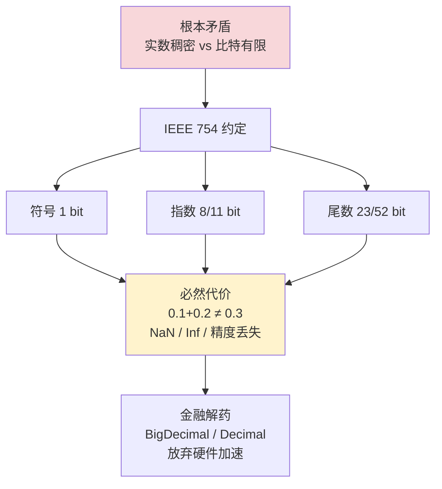

---

#### 目录介绍
- [1.为何要浮点数](#1为何要浮点数)
  - [1.1 浮点数由来](#11-浮点数由来)
  - [1.2 设计哲学](#12-设计哲学)
  - [1.3 从定点数到浮点数的演进](#13-从定点数到浮点数的演进)
- [2.IEEE754标准](#2ieee754标准)
  - [2.1 存储结构](#21-存储结构)
  - [2.2 值的计算公式](#22-值的计算公式)
  - [2.3 0.1的存储](#23-01的存储)
  - [2.4 符号位设计思想](#24-符号位设计思想)
  - [2.5 阶码位设计思想](#25-阶码位设计思想)
  - [2.6 尾数位设计思想](#26-尾数位设计思想)
- [3.五类特殊值](#3五类特殊值)
  - [3.1 特殊情况](#31-特殊情况)
  - [3.2 NaN特殊行为](#32-nan特殊行为)
  - [3.3 非规格化数的精妙](#33-非规格化数的精妙)
- [4.精度的本质](#4精度的本质)
  - [4.1 浮点数精度](#41-浮点数精度)
  - [4.2 精度丢失的根因](#42-精度丢失的根因)
  - [4.3 精度丢失案例剖析](#43-精度丢失案例剖析)
- [5.舍入模式设计](#5舍入模式设计)
  - [5.1 四种舍入模式](#51-四种舍入模式)
  - [5.2 为何默认银行家舍入](#52-为何默认银行家舍入)
- [6.经典陷阱](#6经典陷阱)
  - [6.1 等值比较](#61-等值比较)
  - [6.2 大数吃小数](#62-大数吃小数)
  - [6.3 灾难性消除](#63-灾难性消除)
  - [6.4 整数精度溢出](#64-整数精度溢出)
  - [6.5 类型转换陷阱](#65-类型转换陷阱)
- [7.各语言差异处理](#7各语言差异处理)
  - [7.1 跨语言对比表](#71-跨语言对比表)
  - [7.2 JavaScript特殊困境](#72-javascript特殊困境)
  - [7.3 C/C++的陷阱](#73-cc的陷阱)
  - [7.4 精确计算方案](#74-精确计算方案)
- [8.终极设计哲学](#8终极设计哲学)
  - [8.1 浮点数设计的本质](#81-浮点数设计的本质)
  - [8.2 设计演进脉络](#82-设计演进脉络)


## 1.为何要浮点数

### 1.1 浮点数由来

**真实案例引入**：1996年阿丽亚娜5号火箭因浮点数精度问题导致发射失败，损失3.7亿美元。软件将64位浮点数转换为16位整数时发生溢出，导航系统崩溃。

```c
// 类似阿丽亚娜5号的错误代码
float horizontalVelocity = 50000.0f;  // 超出16位整数范围
short intVelocity = (short)horizontalVelocity;  // 溢出！得到错误值

// 结果：导航系统使用错误的速度值，火箭偏离轨道
```

**核心矛盾**：计算机只有有限的位（32/64位），要表示的数却是无限的（实数连续统）。整数只能表示离散点，科学计算需要表示极大（`6.02×10²³`）和极小（`1.6×10⁻¹⁹`）的数。

**疑惑**：为什么不能像整数那样简单地用二进制表示所有数？

**答疑**：32个比特能表示2³²≈40亿个不同的数。这看似很多，但实数是连续的无限集合。设计者面临的问题是：让这40亿个数映射到实数轴上的哪些位置，在实际应用中最划算？

### 1.2 设计哲学

**工程妥协可视化**：
```mermaid
quadrantChart
    title 数值表示设计空间
    x-axis "低精度" --> "高精度"
    y-axis "小范围" --> "大范围"
    quadrant-1 "平衡型"
    quadrant-2 "范围优先型"
    quadrant-3 "精度优先型"
    quadrant-4 "理想型（不可能）"
    
    "定点数": [0.3, 0.2]
    "浮点数": [0.7, 0.8]
    "BigDecimal": [0.9, 0.1]
    "理想实数": [1.0, 1.0]
```

浮点数的设计本质是一个**工程妥协**：

> **用固定位数（32/64位），在表示范围和精度之间取最优平衡。通过"浮动"小数点（指数部分），让精度随数量级自适应分配——小数附近精细，大数处粗糙。这是人类实际计算需求的最优匹配：科学测量本身就是相对精度恒定（有效数字固定）而绝对精度随量级变化。**

**底层真相**：浮点数不是实数，它是实数轴上**离散的采样点**。所有浮点运算都是"最接近的可表示值"——理解了这一点，所有"奇怪行为"都不再奇怪。

### 1.3 从定点数到浮点数的演进

**历史案例**：早期计算机使用定点数，导致科学计算严重受限。1951年IBM 704首次引入浮点硬件，科学计算效率提升百倍。

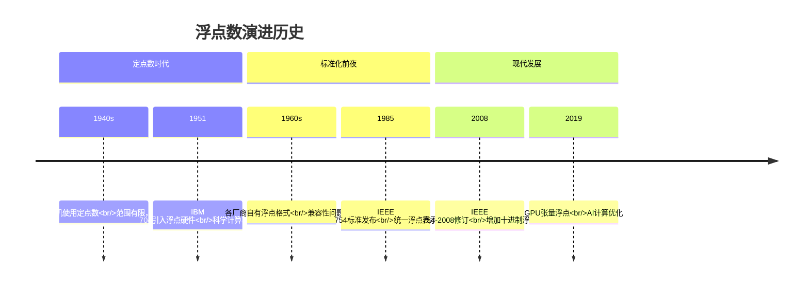

**定点数局限性**：
```java
// 定点数表示：固定小数点位置
int fixedPoint = 123456;  // 假设小数点后3位，实际值123.456

// 问题1：范围有限
int bigNumber = 1000000000;  // 10亿，但小数点后3位只能表示100万

// 问题2：精度固定
int smallNumber = 1;         // 实际值0.001，精度浪费
```

**浮点数解决方案**：
```java
// 浮点数：动态小数点
float scientific = 1.23456e8f;  // 1.23456 × 10^8
float tiny = 1.23456e-8f;       // 1.23456 × 10^-8

// 同一套表示，不同数量级
```

**设计哲学深度分析**：

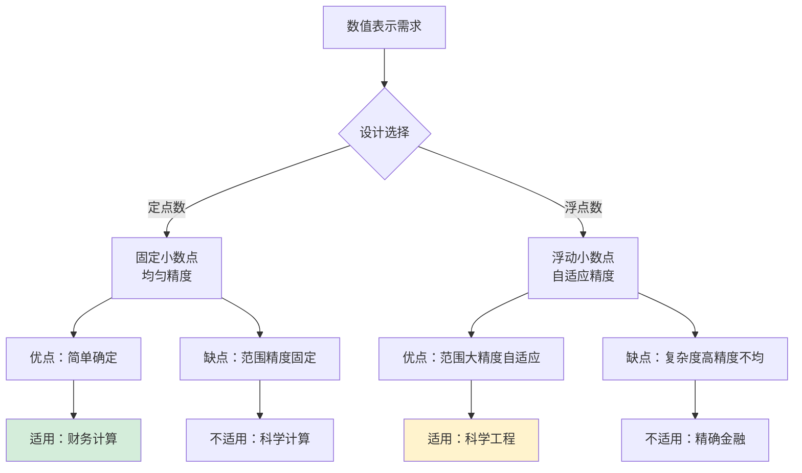

**工程实践意义**：浮点数的设计反映了计算机科学的核心哲学——**在物理限制下寻求最优解**。不是追求数学上的完美，而是工程上的实用。


## 2.IEEE754标准

### 2.1 存储结构

**真实案例**：某金融交易系统因浮点数精度问题导致微小金额累积误差，最终在日终结算时发现百万级差额。

```java
// 问题代码：浮点数累计误差
float total = 0.0f;
for (int i = 0; i < 1000000; i++) {
    total += 0.01f;  // 0.01在二进制中无法精确表示
}
System.out.println("Total: " + total);  // 输出：9999.999，不是10000.0
```

**IEEE754设计哲学**：用三段式结构解决"无限实数 vs 有限比特"的根本矛盾。

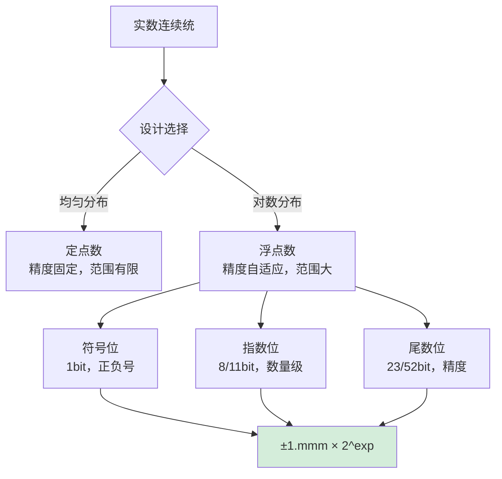

**三段式设计的工程智慧**：

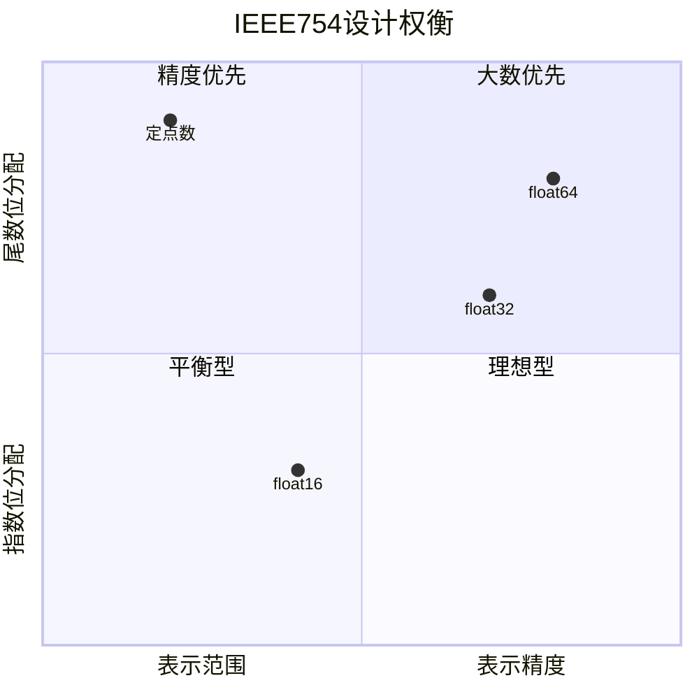

### 2.2 值的计算公式

**技术细节**：IEEE754的精妙在于**隐式前导1**的设计，为尾数节省了1个比特。

```java
// IEEE754计算公式：(-1)^s × 1.m × 2^(e-bias)

// 示例：0.1的二进制表示
// 0.1(十进制) = 0.0001100110011001100110011001100110011001100110011001101...(二进制)
// IEEE754存储：
// 符号位：0（正数）
// 指数位：01111011（实际指数-4，偏移后123）
// 尾数位：10011001100110011001101（隐式前导1）
```

**设计哲学**：隐式前导1是**空间优化**的典范——通过约定俗成节省宝贵比特。

### 2.3 0.1的存储

**经典问题**：为什么0.1 + 0.2 ≠ 0.3？

```python
# 0.1的二进制表示是无限循环小数
0.1(十进制) = 0.0001100110011001100110011001100110011001100110011001101...(二进制)

# IEEE754只能存储有限位，产生截断误差
float32存储：0.100000001490116119384765625
float64存储：0.1000000000000000055511151231257827021181583404541015625
```

**内存布局可视化**：
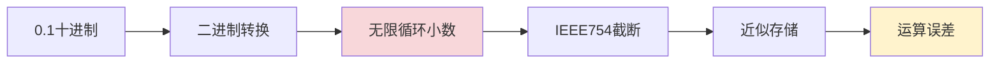

### 2.4 符号位设计思想

**工程案例**：某气象模拟系统因符号位处理错误导致温度预测异常。

```c
// 错误：忽略符号位
float absoluteDifference(float a, float b) {
    return a - b;  // 可能为负！
}

// 正确：考虑符号
float safeDifference(float a, float b) {
    return fabs(a - b);  // 取绝对值
}
```

**符号位设计哲学**：1个比特区分正负，看似简单却解决了**对称性**问题。

### 2.5 阶码位设计思想

**偏移表示法（Bias）**：指数使用偏移表示而非补码，简化比较运算。

```java
// 偏移表示的优势：
// float指数范围：-126到127，偏移127后变成1到254
// 这样所有规格化数的指数位都大于0，便于比较

float a = 1.0e-30f;  // 指数位：97（-30+127）
float b = 1.0e30f;   // 指数位：157（30+127）
// 比较时直接比较指数位：97 < 157，无需考虑符号
```

**设计智慧**：偏移表示将**有符号比较**转化为**无符号比较**，硬件实现更简单。

### 2.6 尾数位设计思想

**精度分布分析**：浮点数的精度随数量级变化，符合科学计算的实际需求。

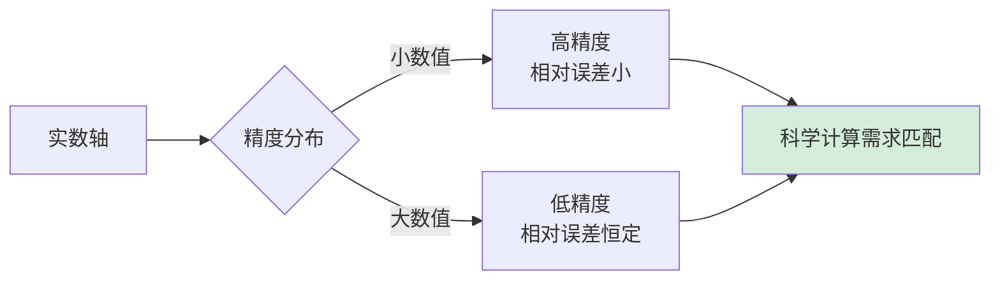

**相对误差恒定原理**：
```
float32的相对误差：2^-23 ≈ 1.19×10^-7
float64的相对误差：2^-52 ≈ 2.22×10^-16

这意味着：
- 1.0的误差约±1.19×10^-7
- 1000.0的误差约±1.19×10^-4
- 但相对误差都是约10^-7量级
```

**工程意义**：这种设计匹配了科学测量的本质——我们关心的是**有效数字**，不是绝对精度。


## 3.五类特殊值

### 3.1 特殊情况

**真实案例**：某导航系统因未处理NaN导致GPS定位失效。系统接收到无效卫星数据产生NaN，后续计算全部污染。

```c
// 问题代码：未处理NaN
float gpsData = getGPSValue();  // 可能返回NaN
float position = calculatePosition(gpsData);  // 传播NaN
if (position > 0) {  // NaN比较永远为false！
    updateDisplay(position);
} else {
    // 永远不会执行，系统"静默"失效
}
```

**IEEE754特殊值设计哲学**：通过特殊编码表示**异常状态**，避免程序崩溃。

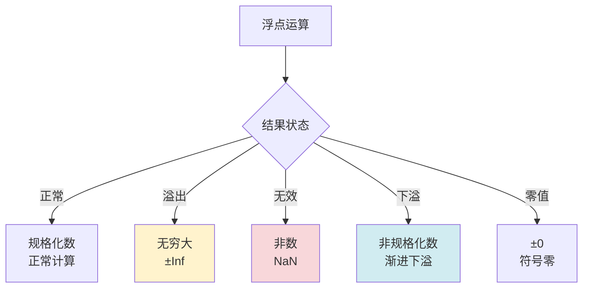

### 3.2 NaN特殊行为

**NaN的工程价值**：NaN不是bug，而是**错误传播机制**的设计。

```java
// NaN的传播特性
float a = Float.NaN;
float b = 10.0f;

System.out.println(a + b);      // NaN
System.out.println(a * b);      // NaN
System.out.println(a == a);     // false！NaN不等于自身
System.out.println(Float.isNaN(a)); // true，正确检测方法
```

**设计智慧**：NaN不等于自身的设计迫使程序员**显式检查**，避免错误传播。

### 3.3 非规格化数的精妙

**渐进下溢案例**：某物理模拟系统因非规格化数处理不当导致数值不稳定。

```c
// 非规格化数的精妙：避免突然下溢
float tiny = 1.0e-45f;  // 非规格化数
float smaller = tiny / 2.0f;  // 仍然可表示，不会突然归零

// 没有非规格化数时：
// tiny = 1.0e-38f
// smaller = 0.0f（突然下溢！）
```

**非规格化数设计哲学**：通过**渐进下溢**保持数值稳定性。


## 4.精度的本质

### 4.1 浮点数精度

**精度案例**：某CAD软件因浮点数精度不足导致微小几何误差累积，最终模型出现裂缝。

```python
# 浮点数精度问题
import numpy as np

# 计算大量小数值
points = np.arange(0, 100000, 0.001, dtype=np.float32)
# 精度误差累积导致模型裂缝
error = points[99999] - 99.999  # 误差约1e-6
```

**精度分布可视化**：
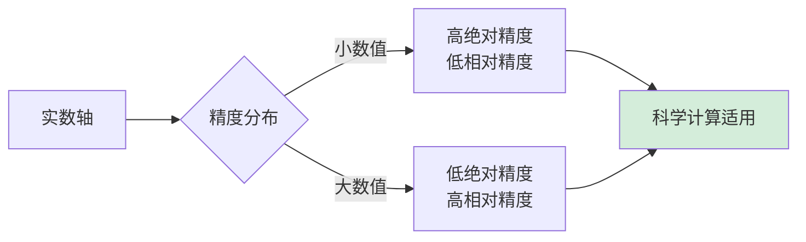

### 4.2 精度丢失的根因

**根本原因**：浮点数精度丢失源于**二进制表示**与**十进制思维**的冲突。

```java
// 十进制0.1在二进制中是无限循环小数
// 0.1(十进制) = 0.0001100110011001100110011001100110011001100110011001101...(二进制)

// IEEE754只能存储有限位
float32存储：0.100000001490116119384765625
float64存储：0.1000000000000000055511151231257827021181583404541015625
```

**精度丢失类型分析**：

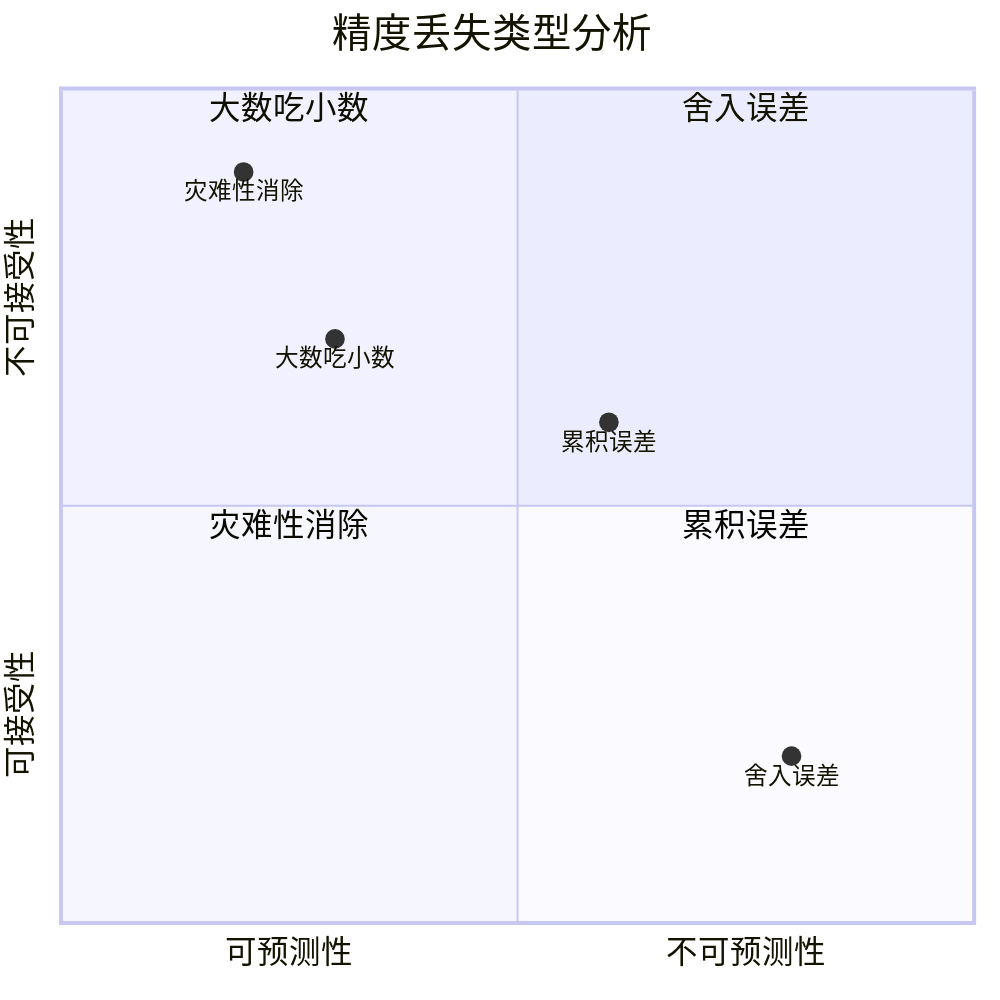

### 4.3 精度丢失案例剖析

**金融系统案例**：某银行系统因浮点数累积误差导致日终结算差异。

```java
// 问题：浮点数累积误差
float total = 0.0f;
for (int i = 0; i < 1000000; i++) {
    total += 0.01f;  // 每次加法都有舍入误差
}
// 理论值：10000.0
// 实际值：9999.999，误差0.001

// 解决方案：使用BigDecimal
BigDecimal total = BigDecimal.ZERO;
for (int i = 0; i < 1000000; i++) {
    total = total.add(new BigDecimal("0.01"));
}
// 结果：10000.00（精确）
```

**工程实践建议**：

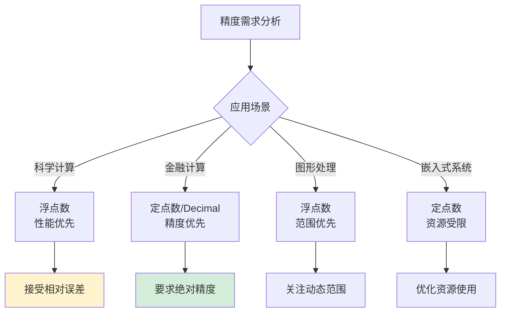

**精度管理策略**：
1. **理解误差来源**：二进制表示、舍入规则、运算顺序
2. **选择合适的精度**：float32 vs float64 vs 高精度库
3. **控制运算顺序**：避免大数吃小数
4. **使用稳定算法**：数值分析技术
5. **定期误差检查**：监控累积误差


## 5.舍入模式设计

### 5.1 四种舍入模式

当精确结果无法用浮点数表示时，必须**舍入**。IEEE 754定义了4种模式：

```
精确值: 1.0000001001...₂  (超出尾数位数)
                     ↑ 这里要截断

Round to Nearest Even (默认):  舍入到最近的偶数 → 消除统计偏差
Round toward +∞:               向正无穷舍入（天花板）
Round toward -∞:               向负无穷舍入（地板）
Round toward 0:                向零截断
```

### 5.2 为何默认银行家舍入

**疑惑**：为什么默认是"就近舍入到偶数"而不是我们熟悉的"四舍五入"？

**答疑**：四舍五入在恰好是0.5时总是向上舍入，经过大量运算后会产生系统性的向上偏差。这在金融计算中被称为"银行家问题"。

```
四舍五入:   0.5→1, 1.5→2, 2.5→3, 3.5→4  (全部向上，平均偏差+0.5)
银行家舍入: 0.5→0, 1.5→2, 2.5→2, 3.5→4  (交替方向，平均偏差≈0)
```

**论证**：对100万次随机运算进行累加，四舍五入会产生约+250的偏差，而银行家舍入的偏差趋近于0。这对科学计算和金融计算至关重要。


## 6.经典陷阱

### 6.1 等值比较

```cpp
double a = 0.1 + 0.2;
if (a == 0.3) { ... }  // false! 因为两边的舍入误差不同

// 正确做法: epsilon比较
if (std::abs(a - 0.3) < 1e-9) { ... }
```

**根因**：`0.1 + 0.2`的舍入路径和`0.3`的直接舍入路径不同，结果在最低位不一致。

各语言的正确比较方式：

```java
// Java
Math.abs(a - b) < 1e-9

// Python
math.isclose(a, b, rel_tol=1e-9)

// JavaScript
Math.abs(a - b) < Number.EPSILON

// Go
math.Abs(a - b) < 1e-9
```

### 6.2 大数吃小数

```cpp
float big = 1e8f;
float small = 1.0f;
float result = big + small;  // result == 1e8f，small 被完全丢弃！
```

**根因**：对齐指数时，`1.0`的尾数右移27位，超出23位尾数精度，全部移出为0。

```
  1.0 × 2⁰     → 对齐到 2²⁶ → 0.0000000...0 × 2²⁶ (27位右移，全丢)
+ 1.0 × 2²⁶
= 1.0 × 2²⁶   (小数完全消失)
```

**这就是为什么累加大量小数时要从小到大加（Kahan求和算法）。**

```c
// Kahan求和算法：补偿被吃掉的精度
double kahan_sum(double* arr, int n) {
    double sum = 0.0;
    double c = 0.0;  // 补偿值
    for (int i = 0; i < n; i++) {
        double y = arr[i] - c;
        double t = sum + y;
        c = (t - sum) - y;  // 计算被丢掉的部分
        sum = t;
    }
    return sum;
}
```

### 6.3 灾难性消除

```cpp
double x = 1.0000001;
double y = 1.0000000;
double diff = x - y;  // 期望 1e-7，实际只有1-2位有效数字
```

**根因**：两个非常接近的数相减，高位相消，结果只剩低位的舍入噪声。有效精度从15位暴跌到1-2位。

### 6.4 整数精度溢出

```javascript
// JavaScript只有double，整数也用double存
9007199254740992 === 9007199254740993  // true! 超过2⁵³后整数不精确

// Java中long→double也会丢精度
long big = 9007199254740993L;
double d = (double) big;
System.out.println(d == 9007199254740992.0);  // true!
```

### 6.5 类型转换陷阱

```cpp
// float → int 截断（不是四舍五入）
int x = (int)2.9f;    // x = 2

// float → double 精度"放大"
float f = 1.4f;
double d = (double)f;  // 1.399999976158142 (不是1.4!)
// 原因：float存的近似值被精确地转为double，暴露了原本的误差
```


## 7.各语言差异处理

### 7.1 跨语言对比表

虽然底层都是IEEE 754，但各语言在**语义封装**上有设计差异：

| 特性 | C/C++ | Java | JavaScript | Python | Go | Rust |
|------|-------|------|------------|--------|-----|------|
| 默认类型 | `double` | `double` | `number`(double) | `float`(double) | `float64` | `f64` |
| 32位浮点 | `float` | `float` | 无(TypedArray除外) | 无(numpy有) | `float32` | `f32` |
| NaN检测 | `std::isnan()` | `Double.isNaN()` | `Number.isNaN()` | `math.isnan()` | `math.IsNaN()` | `f64::is_nan()` |
| 严格模式 | 平台相关 | 严格IEEE754 | 严格IEEE754 | 严格IEEE754 | 严格IEEE754 | 严格IEEE754 |
| 十进制浮点 | 需库 | `BigDecimal` | 需库 | `decimal.Decimal` | `math/big` | `rust_decimal` |

### 7.2 JavaScript特殊困境

```javascript
// JS只有double，整数也用double存
9007199254740992 === 9007199254740993  // true! 超过2⁵³后整数不精确
// 这就是为什么BigInt被引入(ES2020)

0.1 + 0.2  // 0.30000000000000004
// 这是所有语言都有的问题，但JS因为没有整数类型，暴露得更频繁
```

### 7.3 C/C++的陷阱

```cpp
// 80位扩展精度问题（x86）
// 中间计算可能在80位FPU寄存器上进行，结果比期望的更精确
// 存回64位double时再截断，导致"同样的代码不同结果"
double a = compute();  // 80位中间结果
double b = a;          // 截断到64位
// a == b 可能为false（寄存器80位 vs 内存64位）

// 解决方案：使用 volatile 或 -ffloat-store 编译选项
```

### 7.4 精确计算方案

当精度至关重要时（金融、财务），各语言都提供了精确十进制计算方案：

```java
// Java: BigDecimal
BigDecimal a = new BigDecimal("0.1");
BigDecimal b = new BigDecimal("0.2");
BigDecimal c = a.add(b);  // 精确的 0.3

// 注意：new BigDecimal(0.1) 仍然不精确！必须用字符串构造
```


## 8.终极设计哲学

### 8.1 浮点数设计的本质

浮点数的设计体现了计算机科学中最根本的工程思维：

```
有限资源(位数) + 无限需求(实数) = 必须妥协

妥协策略:
1. 用对数分布而非均匀分布 → 小数精细，大数粗糙（符合科学计量）
2. 隐含前导1 → 免费多1位精度
3. 偏移码指数 → 复用整数比较电路
4. 特殊值编码 → 处理溢出、下溢、无效运算
5. 银行家舍入 → 消除统计偏差
```

### 8.2 设计演进脉络

```
手工计算（对数表、计算尺）
  ↓ 需要机器自动化
各厂商各自实现浮点数（不兼容！）
  ↓ 移植性灾难
IEEE 754 标准统一 (1985)
  ↓ 硬件/软件/语言全部遵循
2008年修订版增加十进制浮点
  ↓ 金融场景的精确计算
BigDecimal / Decimal 类型普及
  ↓ 软件层面的精度保障
未来：硬件原生十进制浮点（IBM POWER已支持）
```

**一句话总结**：浮点数不是实数的精确表示，而是在有限位数下对实数的**最优近似策略**。理解它的设计哲学，就不会被`0.1 + 0.2 ≠ 0.3`困惑，反而会惊叹于这个40年前的标准至今仍在完美服役的优雅。


### 8.3 浮点数开发实践指南

**金融计算场景**

在涉及金额的计算中，永远不要直接使用float/double：

```java
// 错误做法
double price = 0.1;
double quantity = 3;
double total = price * quantity; // 0.30000000000000004

// 正确做法（Java）
BigDecimal price = new BigDecimal("0.1");
BigDecimal quantity = new BigDecimal("3");
BigDecimal total = price.multiply(quantity); // 0.3

// 正确做法（JavaScript）
// 将金额以"分"为单位存储为整数
const priceCents = 10;  // 0.1元 = 10分
const quantity = 3;
const totalCents = priceCents * quantity; // 30分 = 0.3元
```

**浮点数比较的正确方式**

```java
// 错误：直接比较
if (a == b) { ... }

// 正确：使用epsilon容差
private static final double EPSILON = 1e-10;
if (Math.abs(a - b) < EPSILON) { ... }

// 更好的方式：使用相对误差
if (Math.abs(a - b) <= Math.max(Math.abs(a), Math.abs(b)) * EPSILON) { ... }
```

**各语言精确计算库**

| 语言 | 精确计算方案 | 说明 |
|------|-------------|------|
| Java | BigDecimal | 任意精度十进制 |
| Python | decimal.Decimal | 内置精确计算 |
| JavaScript | decimal.js / Big.js | 第三方库 |
| C/C++ | GMP / Boost.Multiprecision | 高精度数学库 |
| Go | math/big | 标准库大数运算 |
| Rust | rust_decimal | 金融级精度 |

**序列化注意事项**

浮点数在JSON序列化时需要注意精度问题：

```json
// 可能的精度丢失
{"amount": 0.30000000000000004}

// 推荐：使用字符串传输精确值
{"amount": "0.3"}
```

**数据库存储建议**

- 金额字段使用 `DECIMAL(10,2)` 而非 `FLOAT` 或 `DOUBLE`
- 汇率等需要更高精度的字段使用 `DECIMAL(10,6)`
- 科学计算场景才使用 `DOUBLE`

### 8.4 浮点数调试技巧

当遇到浮点数问题时，可以通过查看二进制表示来定位根因：

```java
// Java中查看浮点数的二进制表示
double d = 0.1;
long bits = Double.doubleToLongBits(d);
System.out.println(Long.toBinaryString(bits));
// 输出: 11111110111001100110011001100110011001100110011001100110011010

// Python中查看
import struct
bytes = struct.pack('d', 0.1)
print(' '.join(f'{b:08b}' for b in bytes))
```

通过观察二进制表示，可以直观理解为什么某些十进制小数无法精确表示——就像十进制无法精确表示 `1/3 = 0.333...` 一样，二进制也无法精确表示 `0.1`（因为 `0.1` 在二进制中是无限循环小数 `0.0001100110011...`）。

**核心记忆点**：浮点数的精度问题不是Bug，而是有限位数表示无限精度的必然结果。理解这个本质，就能在工程中做出正确的设计决策。

