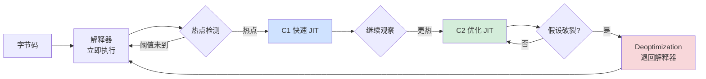
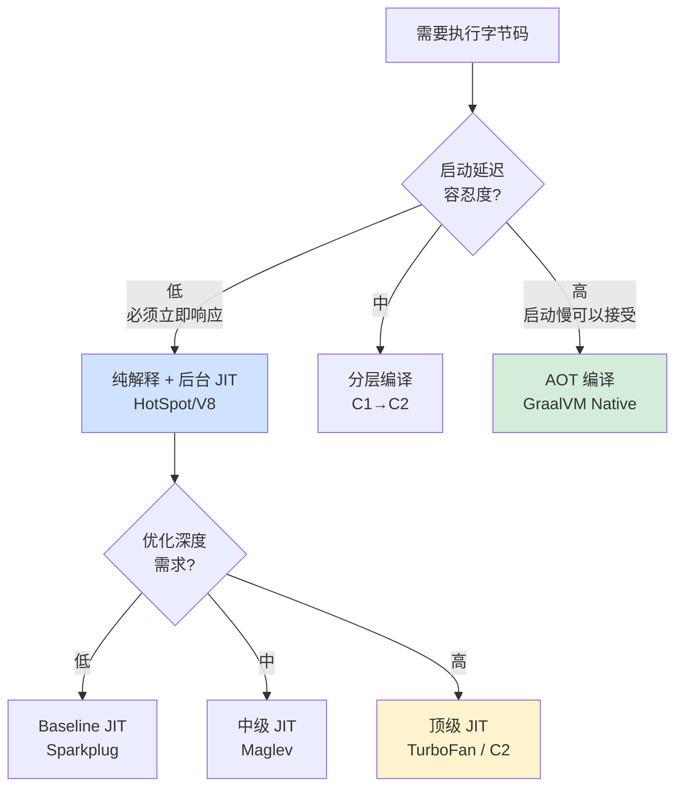

# 2.6 JIT 与运行时优化

> 📍 **本篇位置**：第 2 卷 · 运行时模型 · 第 6 篇
> 🎯 **核心矛盾**：**解释执行慢 10 倍、AOT 编译又丧失运行时灵活性——能不能"鱼和熊掌兼得"？让程序在跑的过程中"越跑越快"？**
> 🧭 **设计灵魂**：JIT 不是简单的"运行时翻译机"——它是一个建立在**乐观假设 + 兜底回退**之上的"赌徒哲学"，敢于把"99% 路径"用最激进的方式优化，把"1% 异常路径"留给 deopt 兜底
> 🌐 **跨平台覆盖**：HotSpot C1/C2/Graal · V8 Ignition+TurboFan+Sparkplug+Maglev · LuaJIT · .NET RyuJIT · CPython 3.13 (实验性 JIT)
> 🔗 **延伸阅读**：← [2.5 字节码与虚拟机执行原理](./2.5.字节码与虚拟机执行原理.md) · → [2.7 反射与元编程核心设计](./2.7.反射与元编程核心设计.md) · → [2.8 异常机制设计原理](./2.8.异常机制设计原理.md) · → [4.x 缓存局部性原理](../04.第4卷内存真相/)

---

> 上一章我们看到字节码经过解释执行可以跨平台运行，但解释执行有一个躲不掉的代价——**慢**，每条字节码都要"翻译一遍"。那为什么 Java、JavaScript、LuaJIT 在某些场景下能逼近甚至超越 C 的性能？
>
> 秘密武器叫 **JIT（Just-In-Time Compilation）**，但它远不只是"把字节码再编译成机器码"这么简单。本章从一个"代码越跑越快"的诡异现象切入，剖开 JIT 的核心：**热点检测、分层编译、内联、逃逸分析、去优化**。

#### 目录介绍
- [00.真实事故引入](#00真实事故引入)
- [01.解释器的天花板与 JIT 的诞生](#01解释器的天花板与-jit-的诞生)
- [02.热点检测与分层编译](#02热点检测与分层编译)
- [03.内联：JIT 的"原子优化"](#03内联jit-的原子优化)
- [04.逃逸分析与栈上分配](#04逃逸分析与栈上分配)
- [05.去优化：当假设被打破](#05去优化当假设被打破)
- [06.跨语言 JIT 设计对比](#06跨语言-jit-设计对比)
- [07.经典陷阱与生产级反模式](#07经典陷阱与生产级反模式)
- [08.一句话总结](#08一句话总结)

---

## 00.真实事故引入

### 0.1 一次性能冷启动雪崩

我维护过一个高吞吐 Java 服务（订单处理网关），日均 5 亿请求。某次在双 11 凌晨切流到一组新部署的 JVM 实例，结果发生了诡异的雪崩：

```
12:00:00  切流，QPS 0 → 50000
12:00:05  P99 延迟从 5ms 飙到 800ms
12:00:08  上游网关熔断，新实例被踢出
12:00:30  保留实例 QPS 翻倍，进一步过载
12:01:00  整体雪崩，订单服务跌零
```

**第一反应**：是不是新代码有 bug？是不是配置错了？

但回滚到旧版本依然会发生——只要"全量切流"就崩。

排查 1 小时后发现关键现象：

```
新实例启动后前 30 秒：
  CPU 100%
  P99 延迟 800ms
  GC 频繁
  
新实例启动 30 秒后：
  CPU 降到 30%
  P99 降到 5ms
  恢复正常
```

**这就是著名的"JVM 预热问题"**——前 30 秒还在解释执行字节码，性能极差；30 秒后 JIT 把热点函数编译成机器码，性能跃升 10-50 倍。

**这不是 bug，这是 JVM 设计的"必然代价"**：

```
解释执行：可以立刻运行，但慢
JIT 编译：要"看一会儿"才能编译，需要预热时间

切流策略错误地假设"实例启动即满血" → 大流量进来时还在解释执行 → 雪崩
```

**修复方案**：

```bash
# 方案 1：渐进切流（10% → 50% → 100%）
# 方案 2：启动后 warmup（用模拟流量预热）
# 方案 3：JVM 参数调优
java -XX:+TieredCompilation -XX:TieredStopAtLevel=4 \
     -XX:CompileThreshold=1000   # 降低 JIT 触发阈值

# 方案 4：用 GraalVM Native Image AOT 编译
# 启动即满血，但失去 JIT 的运行时优化
```

### 0.2 一个代码越跑越快的诡异现象

写一段简单的 Java 微基准：

```java
long start = System.nanoTime();
for (int i = 0; i < N; i++) compute(i);
long end = System.nanoTime();
System.out.println("avg: " + (end - start) / N + "ns");
```

测试结果：

```
N = 1000        平均 500 ns/次
N = 100000      平均 100 ns/次
N = 10000000    平均 5 ns/次

→ 同样的代码，跑得越多越快，最后比第一次快 100 倍！
```

**这就是 JIT 的"魔法"**——它不只是编译，还会**根据运行时观察到的数据分布做激进优化**。

### 0.3 灵魂三问

这两个真实场景让我反复追问三个问题：

1. **JIT 凭什么能做出比 AOT（提前编译）更好的优化？AOT 编译器看到了全部源码，难道还不如 JIT 在运行时看到的局部信息？** —— JIT 的核心优势到底在哪里？
2. **JIT 编译本身是有成本的（占用 CPU、占用内存），凭什么"在线编译"能比"启动时一次编译完"更划算？** —— 分层编译的设计逻辑是什么？
3. **为什么 V8 在 2017 年放弃了 Crankshaft（纯 JIT），改成 Ignition（解释器）+ TurboFan（JIT）的混合架构？** —— 这是技术倒退还是进步？

如果你能回答这三个问题，你就理解了**为什么 JIT 是过去 30 年最反直觉、却最有效的性能优化技术**。

### 0.4 本篇的探索路径



### 0.5 为什么这个问题值得讲透

我想抛三个**几乎所有 Java 资深工程师都答不全**的问题：

1. **为什么微基准测试（microbenchmark）一定要用 JMH？直接 `for` 循环为什么不行？** —— 因为 JIT 会做出你预想不到的优化（如循环不变量外提、死代码消除）。
2. **为什么 `final` 关键字能让某些代码加速 30%？** —— 因为它给 JIT 提供了"该字段不会变"的强假设。
3. **为什么打开 `-XX:+PrintCompilation` 后会看到大量 "made not entrant"？** —— 这是 deoptimization 在工作。

读完本章你会懂：**JIT 不是黑魔法——它是一台精密的"赌博机器"，敢赌、会赌、输了能立刻翻盘**。

---

## 01.解释器的天花板与 JIT 的诞生

### 1.1 解释执行的三个固有开销

要理解 JIT 为什么能加速，先理解解释器为什么慢。

每条字节码在解释器中执行的开销可以拆解为三部分：

**开销 1：fetch-decode-dispatch 循环**

```c
while (true) {
    opcode = code[pc++];           // 1 内存读
    handler = dispatch[opcode];    // 1 间接跳转
    handler();                     // 1 函数调用 (或宏展开)
    // 循环回顶部                   // 1 jmp
}
```

**这个循环本身就要 4-6 条机器指令**，而被解释的字节码可能"语义上"只是一个 `add`（CPU 上 1 条指令）。

**开销比**：解释器执行 1 条 add 字节码 ≈ 7 条机器指令，而 native 代码只需 1 条。**接近 7× 慢**。

**开销 2：缺乏寄存器优化**

```
JVM 字节码：
  iload_0   → 读 LVT[0]（内存）
  iload_1   → 读 LVT[1]（内存）
  iadd      → 弹两个，加，压栈（内存）
  istore_2  → 存 LVT[2]（内存）

每个值都在内存中倒来倒去。
```

而 native 代码可以让数值停留在寄存器里，减少 90% 的内存访问。

**开销 3：无法做跨指令优化**

```
解释器只能"逐条看"——它不知道下面 5 条指令是什么
所以无法做：
  - 死代码消除
  - 公共子表达式消除
  - 循环不变量外提
  - SIMD 向量化
```

**这三个开销叠加，让解释器比 native 慢 10-15 倍**——这就是 §0.1 那个"预热问题"的根源。

### 1.2 为什么不"AOT 一次编译完"

最朴素的想法："**既然 JIT 这么麻烦，我启动时就把所有字节码编译成机器码，不就完了吗？**"

这就是 **AOT（Ahead-Of-Time）** 路线——GraalVM Native Image、.NET ReadyToRun、Android ART 都走这条路。**但 AOT 有四个根本短板**：

**短板 1：丧失动态语言优势**

```java
// 反射、动态加载、动态代理在 AOT 下要么禁用、要么大量 hack
Class<?> c = Class.forName(userInputClassName);  // AOT 不知道有哪些类
```

GraalVM Native Image 必须通过"reachability metadata"提前声明所有反射使用——大型 Spring 项目这部分配置可能上千条。

**短板 2：缺乏运行时类型反馈（PGO）**

AOT 编译器只能"猜"——它不知道某个 if 分支有 99% 概率成立、某个虚方法 99% 调用 ConcreteA。**JIT 可以"看到"真实的数据分布，做出针对性优化**。

**短板 3：无法去虚化所有方法**

```java
List<String> list = getList();
list.add("x");        // 是 ArrayList？LinkedList？还是别的？
```

AOT 不知道运行时 `list` 的具体类型，只能保留虚调用。**JIT 在运行 100 万次后发现"99% 是 ArrayList"，可以激进内联 ArrayList.add 的代码**。

**短板 4：编译后无法重新优化**

AOT 编译的二进制是固定的——发现某段代码模式变了也无法重编。JIT 可以 deopt + 重新编译。

### 1.3 JIT核心思想：运行时换质量

JIT 的设计哲学一句话：

> **代码刚加载时不编译（避免无谓开销）；只编译"真正热"的代码（聚焦关键路径）；编译时利用"已经观察到的运行时信息"（做激进假设）；假设错了就 deopt 重来（保证正确性）。**

这就是 §0.3 第一题的答案——**JIT 的优势不是"编译速度"，而是"信息优势"**：

| 优化机会 | AOT 能做吗 | JIT 能做吗 |
|---|---|---|
| 内联小函数 | ✅ | ✅ |
| 去虚化（确定虚方法目标）| ⚠️ 有限 | ✅ 100% 监控 |
| 基于分支概率的代码布局 | ⚠️ 需要 PGO 数据 | ✅ 自动观察 |
| 类型猜测（type speculation）| ❌ | ✅ 核心能力 |
| 锁消除 | ⚠️ 静态分析 | ✅ 逃逸分析 |
| 重新优化 | ❌ | ✅ deopt + recompile |

**一个真实例子**：

```java
public int sum(List<Integer> list) {
    int s = 0;
    for (Integer i : list) s += i;
    return s;
}
```

AOT 编译：保留虚调用 `list.iterator()`、`it.next()`，每次循环 5-10ns。
JIT 在运行 1 万次后观察到："这里的 list 99.9% 是 ArrayList"，于是：

```java
// JIT 内部生成的"特化代码"（伪代码）
if (list.getClass() != ArrayList.class) goto deopt;  // 守卫
ArrayList al = (ArrayList) list;
Object[] arr = al.elementData;   // 直接访问内部数组
int size = al.size;
int s = 0;
for (int i = 0; i < size; i++) {
    s += (Integer)arr[i];   // 进一步优化：标量替换 Integer 拆箱
}
return s;
```

**最终性能**：每次循环 < 1ns，**比 AOT 快 5-10 倍**。

---

## 02.热点检测与分层编译

### 2.1 不是所有代码都值得编译

**关键观察**：真实程序符合 80/20 法则——**80% 的运行时间花在 20% 的代码上**（实际比例往往更极端，95/5 甚至 99/1）。

```
启动一个 Spring Boot 应用：
  加载 1 万个类，包含 10 万个方法
  启动后真正"被调用"的方法 < 5000
  其中"高频调用"（每秒>1000次）< 200
  
→ 只编译那 200 个方法就够了
```

这就是**热点检测**的核心动机——**不浪费 CPU 在冷代码上**。

### 2.2 计数器法 vs 采样法

**两种主流的热点检测策略**：

**策略 1：方法调用计数器（HotSpot 用）**

```c
// 每个方法有一个调用计数器
struct Method {
    int invocation_count;
    int back_edge_count;   // 循环回边计数
};

// 每次调用 invocation_count++
// 每次循环回边 back_edge_count++
// 超过阈值（默认 10000）触发 JIT
```

**优点**：精确、容易实现
**缺点**：每次调用都要做计数，有性能开销

**策略 2：采样（V8 早期、SpiderMonkey 用）**

```
定时器每 1ms 中断一次
检查当前正在执行的方法 → 给它 +1
统计高频出现的方法 → 标记为热点
```

**优点**：开销极低（不修改方法本体）
**缺点**：不够精确，可能漏检

**HotSpot 选择计数器法**：因为 JVM 已经为类型安全在每个方法入口做了大量工作，多一个计数器开销可以忽略。

### 2.3 OSR栈上替换机制

考虑这段代码：

```java
public static void main(String[] args) {
    long sum = 0;
    for (long i = 0; i < 1_000_000_000L; i++) {  // 10 亿次循环
        sum += i;
    }
    System.out.println(sum);
}
```

**问题**：`main` 只被调用 1 次（在循环开始前还没达到 JIT 阈值），但循环里跑 10 亿次。**如果只看方法调用计数器，永远不会编译这个 main**——结果是程序在解释器里跑 10 亿次循环，慢得离谱。

**解决方案 OSR**：

```
JIT 也跟踪"循环回边计数器"（back-edge counter）
当循环执行 1 万次时：
  1. 暂停当前解释器执行
  2. JIT 把这个方法编译成机器码
  3. 把当前栈帧"替换"为机器码栈帧（保留所有局部变量）
  4. 从循环的当前位置继续，但用机器码执行
```

**这个机制叫"栈上替换"**——在不重启方法的前提下，从解释切换到 JIT。OSR 是 JIT 能加速"长循环"的关键。

### 2.4 分层编译（Tiered）

§0.3 第二题。HotSpot 有两个 JIT：

| JIT | 编译速度 | 编译质量 | 用途 |
|---|---|---|---|
| **C1（Client）** | 快（10× C2 速度）| 中等（基础优化）| 快速到达"机器码"状态 |
| **C2（Server）** | 慢 | 极致（激进优化）| 长期高频热点 |

**纯 C2 路线（HotSpot 老版本）**：

```
解释器（慢） → 攒够 10000 次 → C2 编译（慢）→ 机器码（快）

问题：
  C2 编译要几百毫秒
  在 C2 完成前，方法都在解释器跑（慢）
```

**纯 C1 路线**：

```
解释器 → C1 → 机器码

问题：
  C1 编译质量不够，比不上 native 性能
```

**分层编译（Java 7 引入，Java 8 默认）**：

```
Level 0: 解释器
Level 1: C1（无 profiling）—— 完全编译，无运行时信息收集
Level 2: C1（有限 profiling）—— 收集调用次数和回边
Level 3: C1（完全 profiling）—— 收集类型反馈、分支概率
Level 4: C2（用 Level 3 的反馈做激进优化）

执行流程：
  方法被调用 → 解释器执行 + 计数
  达到阈值 → Level 3 编译（C1 完整 profiling）
  Level 3 收集足够数据 → Level 4 编译（C2 激进优化）
  完成 → 切换到最高级机器码
```

**这是一种"渐进加速"策略**——每一级都立即可用，每一级都比上一级快。


### 2.5 编译队列与并行 JIT

JIT 编译本身要消耗 CPU。HotSpot 的策略：

```
编译队列（Compilation Queue）：
  应用线程把"热点方法"加入队列
  独立的 JIT 编译线程从队列取出，编译完成后替换

线程数：
  -XX:CICompilerCount=N   （默认根据 CPU 核数自动设置）
  
优先级：
  C1 编译队列优先于 C2（先快速到达 Level 1，再慢慢到 Level 4）
```

**这意味着 JIT 编译不会阻塞业务线程**——它在后台异步进行，编译完成后用新机器码"替换"旧的解释执行。

---

## 03.内联：JIT 的"原子优化"

如果说 JIT 只能保留一个优化，那一定是——**内联（inlining）**。

### 3.1 内联是性能的原子操作

观察这两段代码：

```java
public int compute(int x) {
    return helper(x) + 1;
}

private int helper(int x) {
    return x * 2;
}
```

**没内联时**：

```assembly
compute:
    push    rbp
    mov     rbp, rsp
    mov     edi, [arg_x]
    call    helper             ; 调用开销 ~5-10ns
    add     eax, 1
    pop     rbp
    ret

helper:
    push    rbp
    mov     rbp, rsp
    mov     eax, [arg_x]
    shl     eax, 1
    pop     rbp
    ret
```

**内联后**：

```assembly
compute:
    mov     eax, [arg_x]
    shl     eax, 1                ; helper 体被嵌入
    add     eax, 1
    ret
```

**性能差异**：内联节省了**函数调用的全部开销**（push/pop、寄存器保存、跳转、ret）。但更重要的是——

### 3.2 内联触发的"连锁优化"

**这才是内联的真正威力**——它把"调用方上下文"和"被调方实现"合并，让其他优化变得可能：

```java
public int outer() {
    Point p = new Point(3, 4);
    return p.x + p.y;
}

public class Point {
    final int x, y;
    Point(int x, int y) { this.x = x; this.y = y; }
}
```

**没内联时**：

```
1. 在堆上分配 Point 对象
2. 调用构造函数（写入 x, y）
3. 读取 p.x（堆访问）
4. 读取 p.y（堆访问）
5. 相加
6. GC 回收
```

**内联后 + 标量替换**：

```
JIT 内联了构造函数：x = 3, y = 4
JIT 看到："这个 Point 没有逃逸到方法外"
JIT 做"标量替换"：把 Point 对象拆成两个寄存器
最终代码：
    mov eax, 7   ; 编译期常量折叠：3 + 4 = 7
    ret
```

**结果**：从"分配对象+构造+两次堆访问+加法+GC"变成"一条 mov 指令"。**这才是 JIT 的恐怖之处**。

### 3.3 多态调用去虚化Devirtualization

考虑：

```java
public int sum(Animal a) {
    return a.weight() + a.age();
}

abstract class Animal {
    abstract int weight();
    abstract int age();
}
```

**虚方法的代价**：每次调用都要查 vtable，无法内联。

**JIT 的"类型反馈"**：

```
观察 1 万次调用，发现 99% 时间 a 的运行时类型是 Cat
JIT 编译为：
    if (a.getClass() != Cat.class) goto deopt;   // 守卫
    // 内联 Cat.weight() 和 Cat.age()
    return cat_weight + cat_age;
```

**这就是"单态内联缓存"（monomorphic inline cache）**——99% 路径是 1 条比较 + 内联代码，1% 路径退回去虚化。**性能从"每次 2 次 vtable 查询"变成"1 次类型比较"，速度提升 5-10 倍**。

**多态情况**（运行时 a 可能是 Cat 或 Dog）：

```
"双态内联缓存"（bimorphic IC）：
    if (a.class == Cat) inline_cat();
    else if (a.class == Dog) inline_dog();
    else goto deopt;
```

更多种类型 → 退回 vtable 查询。

### 3.4 内联预算：为何不能无限内联

**理想情况下，JIT 应该内联一切——但实际不能**：

```
极端例子：递归内联 fact(10) 会展开成 10 层
      内联 fact(10000) 直接爆字节码尺寸

代码膨胀（code bloat）的代价：
  机器码区域变大 → I-cache miss 增加 → 反而变慢
  编译时间暴涨
```

**HotSpot 的内联策略**（默认值）：

```
-XX:MaxInlineSize=35       字节码 <= 35 字节的方法总是内联
-XX:FreqInlineSize=325     热点方法字节码 <= 325 字节内联
-XX:MaxInlineLevel=15      递归内联深度 <= 15
-XX:InlineSmallCode=2000   被内联调用方编译后 <= 2000 字节
```

**这些数值**是 Sun/Oracle 多年实测调出来的"经验最优"——再大就开始看到 I-cache 退化。

### 3.5 final 为什么能加速 30%

§0.5 第二题。看这段代码：

```java
class Config {
    public final int maxRetries = 3;        // 注意 final
    public int unsafeFlag = 1;              // 没 final
}

void process(Config cfg) {
    for (int i = 0; i < cfg.maxRetries; i++) { ... }
}
```

**`final` 字段的优化**：

```
没 final：
  JIT 不知道 cfg.maxRetries 会不会变
  → 每次循环条件都要重新读 cfg.maxRetries（堆访问）

有 final：
  JIT 假设 cfg.maxRetries 永不变（除非 deopt）
  → 把 maxRetries 当作"3"——常量传播、循环展开都能做
  → 最终代码可能直接展开成 3 次执行
```

**实测**：在循环条件、数组访问中，final 字段能带来 20-40% 的加速。

**这背后是 JIT 的强假设**：**所有 final 字段的值在初始化后不变**。但反射可以打破这个假设（`Field.setAccessible(true)` + `setInt`），所以 JIT 编译这种代码时会**保留 deopt 守卫**——一旦反射改了 final 字段，立刻 deopt。

---

## 04.逃逸分析与栈上分配

### 4.1 逃逸分析的核心问题

```java
public int compute() {
    StringBuilder sb = new StringBuilder();
    sb.append("hello").append("world");
    return sb.length();
}
```

**问题**：`sb` 这个对象有必要在堆上分配吗？

**逃逸分析的判断**：

```
sb 被赋值给方法外的变量了吗？  没有
sb 被传给可能保存它的方法了吗？没有（append 不保存）
sb 被作为返回值返回了吗？      没有
sb 被存到全局/类成员了吗？     没有

→ sb "没有逃逸"出 compute 方法 → 可以栈上分配
```

**栈上分配的好处**：

```
1. 无需 GC：方法返回时随栈帧销毁
2. 无堆分配开销：不调 malloc
3. cache 友好：栈数据热
```

### 4.2 标量替换：更激进的优化

**比栈上分配更进一步**——直接把对象拆成几个标量（基本类型）：

```java
Point p = new Point(3, 4);
int sum = p.x + p.y;
```

**标量替换后**：

```java
int p_x = 3;       // 直接是寄存器变量
int p_y = 4;
int sum = p_x + p_y;
```

**Point 对象消失了**——它被拆成两个 int 变量，全部用寄存器存放。**没有任何堆/栈内存占用，没有任何 GC 压力**。

**这就是为什么很多"看起来分配大量临时对象"的 Java 代码，实际 GC 压力极小**——逃逸分析+标量替换把它们都消除了。

### 4.3 锁消除（Lock Elision）

逃逸分析的另一个应用——**消除单线程访问的锁**：

```java
public String foo() {
    StringBuffer sb = new StringBuffer();   // 内部用 synchronized
    sb.append("a").append("b");
    return sb.toString();
}
```

**StringBuffer 每个 append 都要加锁**——但这个 sb 没逃逸出方法，**只有当前线程能访问它**。

**JIT 看到这一点后**：

```
sb 没逃逸 → 不可能有其他线程访问 → 锁完全没必要 → 删除
```

**实测**：StringBuffer 在 JIT 锁消除后，性能与 StringBuilder 几乎相同。

### 4.4 Go编译器更彻底逃逸分析

Go 没有 JVM 那种 JIT，但**Go 编译器在编译期就做激进的逃逸分析**：

```go
func foo() *int {
    x := 42
    return &x   // x 的地址逃逸出去 → 编译器自动改到堆上
}

func bar() int {
    x := 42
    return x   // x 没逃逸 → 栈上分配
}
```

```bash
$ go build -gcflags="-m" main.go
./main.go:3:5: moved to heap: x   # foo 中的 x 逃逸
                                  # bar 中的 x 没提示，留在栈上
```

**Go 的逃逸分析是"语义层面"的**——程序员可以通过 `-gcflags="-m"` 看到每个变量的命运，**主动写出"不逃逸"的代码**：

```go
// ❌ 触发堆分配
func badAppend(s []int) []int {
    return append(s, 1)
}

// ✅ 留在栈上（如果调用方传入足够 cap 的 slice）
func goodAppend(s []int) []int {
    if cap(s) > len(s) {
        s = s[:len(s)+1]
        s[len(s)-1] = 1
        return s
    }
    return append(s, 1)
}
```

**Go 把"是否堆分配"暴露给程序员**——这是性能控制力的源泉。

---

## 05.去优化：当假设被打破

### 5.1 JIT 的"乐观假设"

我们看到 JIT 做了大量"假设"：

- 假设虚方法 99% 调用同一个目标（去虚化）
- 假设 final 字段永不变（常量传播）
- 假设某 if 分支几乎总是成立（不编译另一分支）
- 假设没有 null（消除 null 检查）
- 假设数组下标在范围内（消除越界检查）

**问题**：这些假设可能被打破：

```
1. 反射改了 final 字段
2. 加载了一个新的子类，原来的"单态"变成"多态"
3. 输入数据分布变了，原来 1% 的分支变成 50%
4. 调试器附加上来
```

**JIT 必须有"撤回"机制**——这就是 **去优化（Deoptimization）**。

### 5.2 守卫指令与 deopt 触发

JIT 编译的代码里，**几乎到处都是隐式的"守卫"**：

```assembly
; JIT 编译的去虚化代码
mov rax, [rdi]               ; 读对象的类指针
cmp rax, [Cat_class_ptr]     ; 比较是不是 Cat
jne deopt_handler            ; 不是 → 跳转到 deopt
... 内联的 Cat 方法体 ...
ret

deopt_handler:
    ; 1. 恢复字节码状态
    ; 2. 跳回解释器对应位置继续执行
    ; 3. 把这段机器码标记为 "made not entrant"
```

**deopt 触发后的处理**：

```
1. 当前栈帧中"激进优化"的状态被还原成"解释器状态"
   - 标量替换的对象重新分配到堆
   - 寄存器值写回栈帧的 LVT
   - 设置正确的 PC 到字节码的对应位置
   
2. 控制权转回解释器
3. 这段优化代码被废弃，方法重新进入计数器累计 → 可能重新编译
```

**这是 JIT 的"魔术"——在用户完全感觉不到的情况下，从机器码无缝切回字节码**。

### 5.3 反复Deopt引发性能悬崖

**一个真实陷阱**：

```java
List<?> list;
if (cond1) list = new ArrayList<>();
else if (cond2) list = new LinkedList<>();
else list = new CopyOnWriteArrayList<>();

for (int i = 0; i < 1000000; i++) {
    list.add(item);   // 这个 add 调用是哪个？
}
```

**如果 list 三种类型都被使用过**（比如配置变化导致每次启动 list 类型不同）：

```
JIT 第一次编译：观察到 99% 是 ArrayList → 单态内联
某次启动用了 LinkedList → deopt → 重编为双态内联
某次启动用了 CopyOnWrite → deopt → 编为三态
更多类型 → deopt → 退回 vtable 查询（失去去虚化）
```

**这就是"性能悬崖"**——某些代码模式让 JIT 反复 deopt + 重编，**永远到达不了最优状态**。

**修复**：**保持类型单一**。如果业务确实需要多种实现，分别写不同的方法（让 JIT 各自编译为单态）。

### 5.4 PrintCompilation看到deopt

打开 JVM 参数：

```bash
-XX:+PrintCompilation
```

会看到大量输出：

```
123  45     3       Foo::bar (12 bytes)
124  46  s   3       Foo::sync (5 bytes)
   125  45       3       Foo::bar (12 bytes)   made not entrant   ★
   126  47        4       Foo::bar (12 bytes)
```

**`made not entrant`** 就是 deopt 的标志——某次 JIT 编译的版本被废弃了。

**频繁的 made not entrant**：意味着 JIT 反复 deopt → 性能问题严重，要排查。

### 5.5 CHA类层次分析：JIT单态宣言

很多人疑惑：JIT 怎么知道"现在世界上只有一个 Cat 子类"？

**答案是 CHA**——JVM 在类加载时维护一个"全局类层次"：

```
Animal
├── Cat (currently the only subclass loaded)
└── ?
```

JIT 编译 `Animal.weight()` 调用时：
- CHA 报告："当前只有 Cat 一个子类" → JIT 直接内联 Cat.weight，**不需要任何守卫**
- 后来加载 `Dog extends Animal` → JVM **主动让所有"单态优化的 Animal 调用"deopt**
- 重新编译为带守卫的版本

**这是 JVM 类加载和 JIT 紧密协作的产物**——AOT 编译器没有这个能力。

---

## 06.跨语言 JIT 设计对比

§0.3 第三题。不同语言的 JIT 哲学差异巨大。

### 6.1 主流语言 JIT 对比表

| 语言 | JIT 实现 | 设计哲学 |
|---|---|---|
| **Java HotSpot** | C1 + C2 | 分层编译，重量级、深度优化 |
| **Java GraalVM** | Graal | Java 写的 JIT，更激进的部分求值 |
| **JavaScript V8** | Ignition + Sparkplug + Maglev + TurboFan（4 层）| 极端分层，启动至关重要 |
| **JavaScript JSC** | LLInt + Baseline + DFG + FTL（4 层）| 类似 V8 |
| **PyPy** | Tracing JIT | 跟踪热路径，不是基于方法 |
| **LuaJIT** | Tracing JIT | 单作者作品，性能逼近 C |
| **.NET** | RyuJIT | AOT + JIT 混合（R2R）|
| **Lua** | 没有官方 JIT | 解释器极致优化 |

### 6.2 V8 的 4 层架构（2024 年）

V8 是当今最复杂的 JIT 系统：

```
Level 1: Ignition（解释器）
  - 注册式字节码
  - 极快启动
  - 收集类型反馈

Level 2: Sparkplug（基线 JIT）   [2021 引入]
  - 直接从字节码生成机器码
  - 不做激进优化，但比解释快 ~5×
  - 编译速度极快（<1ms/方法）

Level 3: Maglev（中级 JIT）       [2023 引入]
  - 中等优化，性能介于 Sparkplug 和 TurboFan 之间
  - 编译速度 10× TurboFan

Level 4: TurboFan（顶级 JIT）
  - 类似 HotSpot C2 的深度优化
  - 几十 ms 编译时间
  - 4-10× 解释器速度
```

**为什么要 4 层？** 因为 JS 在浏览器里**启动极其关键**：

```
首屏加载 1 秒延迟 → 用户流失 5%
TurboFan 编译 10 个热点函数要 1 秒
→ 必须先有"中间产物"（Sparkplug）
→ Sparkplug 牺牲优化质量换"立即可用"
→ 后台 Maglev → TurboFan 慢慢追加
```

**这就是 §0.3 第三题的答案**——V8 不是"放弃 JIT"，而是**回归"分层"以解决纯 JIT 启动慢的问题**。Crankshaft（V8 老 JIT，2010 年代）在编译完成前用户体验极差。

### 6.3 Tracing JIT vs Method JIT

**两种 JIT 编译单位的根本差异**：

| 维度 | Method JIT (HotSpot, V8) | Tracing JIT (PyPy, LuaJIT) |
|---|---|---|
| **编译单位** | 方法 | 热路径（trace） |
| **跟踪范围** | 单个方法体 | 跨方法、跨循环边界的实际路径 |
| **优势** | 简单、模块化 | 能跨越方法边界做整体优化 |
| **劣势** | 方法间优化有限 | 路径多样会爆炸 |

**Tracing JIT 的天才之处**：

```python
def hot_loop():
    for x in items:           # 热路径开始
        result = process(x)   # 内联 process 进 trace
        if result.valid:      # 99% 走这条
            buf.append(result)
        else:
            log(result)       # 1% 走这条，不进 trace
```

Tracing JIT 把"99% 的实际执行路径"作为一个整体编译。哪怕这条路径跨越 10 个方法、3 层循环——整体作为"一段直线代码"优化。

**LuaJIT 用 trace JIT 把 Lua 跑到 C 的 80% 性能**——这是动态语言性能的标杆。

### 6.4 GraalVM：用 Java 写 JIT

**Graal 是一个用 Java 写的 JIT**——这本身就是一个壮举。

**优势**：

```
1. 比 C2（C++ 写的）易于扩展和维护
2. 部分求值（Partial Evaluation）：能把"解释器"自动变成"JIT"
3. 多语言：同一个 JIT 能编译 JavaScript、Python、Ruby、R、WASM
```

**Truffle 框架**：你写一个 AST 解释器，Graal 自动给它生成 JIT 编译器——大幅降低实现新语言的成本。这是过去 10 年 VM 研究的最大突破之一。

---

## 07.经典陷阱与生产级反模式

### 7.1 陷阱一：JIT预热不足导致雪崩

**铁律**：所有"启动后立即承接大流量"的服务，必须有预热阶段。

**预热方案**：

```java
@PostConstruct
public void warmup() {
    // 模拟 1 万次典型业务调用
    for (int i = 0; i < 10000; i++) {
        for (BusinessOperation op : keyOperations) {
            try { op.execute(WARMUP_DATA); } catch (Exception e) {}
        }
    }
}
```

或用 **JVM CDS（Class Data Sharing）+ AppCDS** 缩短启动时间，**或用 GraalVM Native Image** 完全 AOT。

### 7.2 陷阱二：微基准的 JIT 误差

**§0.5 第一题**。看这段代码：

```java
long start = System.nanoTime();
for (int i = 0; i < 1_000_000_000; i++) {
    int x = i * 2 + 1;   // 看似在测乘法
}
long end = System.nanoTime();
```

**JIT 的"恶意"优化**：

```
JIT 看到 x 没被使用 → 死代码消除 → 删除整个表达式
JIT 看到循环没副作用 → 循环消除 → 删除整个循环
最终代码：long start = ...; long end = ...; （什么都没做）
```

**结果是 0ns，但什么也没测到**。

**修复**：用 **JMH（Java Microbenchmark Harness）**：

```java
@Benchmark
public int benchmark() {
    int x = 0;
    for (int i = 0; i < 100; i++) x = x * 2 + 1;
    return x;   // ★ 必须 return 或 Blackhole.consume，防止 DCE
}
```

JMH 处理了所有 JIT 陷阱（DCE、循环展开、cache 状态、warmup）。**永远不要用 main 函数 + System.nanoTime 做微基准**。

### 7.3 陷阱三：堵塞代码路径让JIT罢工

```java
public int dispatch(int type) {
    switch (type) {
        case 1: return handle1();
        case 2: return handle2();
        case 3: return handle3();
        // ... 100 个 case
    }
}
```

**问题**：单个方法太大（字节码 > 8KB），JIT 拒绝编译。

**修复**：拆分成多个小方法。

### 7.4 陷阱四：反复deopt导致性能悬崖

排查方法：

```bash
-XX:+UnlockDiagnosticVMOptions -XX:+PrintCompilation -XX:+PrintInlining
```

看到大量 "made not entrant" → 类型不稳定 → 拆分代码路径。

### 7.5 陷阱五：Lambda+反射的JIT失效

```java
Method m = getMethod();
list.forEach(x -> {
    try { m.invoke(target, x); } catch (Exception e) {}
});
```

`Method.invoke` 是 native 调用 + 反射安全检查 + 参数装箱——**JIT 几乎完全失效**。

**修复**：用 `MethodHandle`（Java 7+）或 `LambdaMetafactory` 把反射变成"和直接调用一样快"的代码。

### 7.6 陷阱六：字节码增强阻碍JIT内联

Spring AOP、CGLIB 大量生成动态字节码：

```
原方法 foo()
    ↓ AOP 增强
代理类 foo$proxy()
    → ProxyFactoryBean.intercept()
        → AdviceChain.proceed()
            → 原方法 foo()
```

**5 层调用 + 大量 try/catch + invokedynamic**——JIT 难以内联整条链。

**优化**：用 Java Agent 在加载时直接修改字节码（Byte Buddy / ASM），生成扁平的目标代码。

### 7.7 陷阱七：Class.forName在热路径上

```java
public Object create(String name) {
    return Class.forName(name).newInstance();   // 每次调用都查类
}
```

`forName` 内部要遍历 ClassLoader 链——是 native 调用、有同步、JIT 内联无效。

**修复**：缓存 Class 对象。

---

## 08.一句话总结

### 8.1 三层认知阶梯

```
第一层（知其然）：知道 JIT 能加速、知道有热点编译
  ↓
第二层（知其所以然）：理解分层编译、内联、逃逸分析、deopt 机制
  ↓
第三层（知其将所以然）：能编写 JIT-friendly 代码、能诊断性能悬崖、能根据场景选择 JIT 还是 AOT
```

读完本章后，你应该能回答开头§0.3 提出的三个问题：

1. **JIT 凭什么比 AOT 更好？** → JIT 拥有运行时信息（类型分布、分支概率、热点路径），能做"乐观假设 + 兜底回退"的激进优化，AOT 只能做保守的静态分析。
2. **为什么"在线编译"划算？** → 分层编译让方法立即可用（解释器/Sparkplug），后台慢慢加深优化（C1→C2/Maglev→TurboFan），编译开销摊到长期收益上。
3. **V8 为什么回归"解释器+JIT"？** → 纯 JIT 启动慢、内存大，对网页致命。Ignition 让代码立即可用，TurboFan 在后台优化热点，达到"启动快+稳态高性能"双赢。

### 8.2 JIT 设计的决策树



### 8.3 七字真言

1. **JIT 的核心是"赌博"**——大胆假设、谨慎回退。
2. **预热不可省略**——切流量前必须等 JIT 编译完成。
3. **保持类型单态**——多态会让 JIT 退化。
4. **final 是性能关键字**——给 JIT 强假设。
5. **方法不要太大**——> 8KB 字节码会被 JIT 拒绝。
6. **微基准用 JMH**——main + nanoTime 一定测不准。
7. **关注 made not entrant**——deopt 反复发生 = 性能悬崖。

### 8.4 与下篇的承接

本篇我们看到了 JIT 如何把字节码变得"比 native 还快"。但 JIT 的所有激进优化都建立在一个假设上——**程序员代码遵循"静态、可预测"的模式**。

那么——**程序员能不能在运行时"改变代码"？能不能动态创建新类、动态调用未知方法、动态生成新逻辑？**

这就是 [2.7 反射与元编程核心设计](./2.7.反射与元编程核心设计.md) 要回答的——**当程序需要在运行时操纵自身的结构**，会发生什么、付出什么代价。

---

## 🔗 延伸阅读

- 同卷上篇：[2.5 字节码与虚拟机执行原理](./2.5.字节码与虚拟机执行原理.md)
- 同卷下篇：[2.7 反射与元编程核心设计](./2.7.反射与元编程核心设计.md) ｜ [2.8 异常机制设计原理](./2.8.异常机制设计原理.md)
- 内存视角：[4.x 缓存局部性原理](../04.第4卷内存真相/) ｜ [4.x 内存模型技术设计](../04.第4卷内存真相/)
- 经典文献：
  - *The Java HotSpot Performance Engine Architecture*（Oracle 官方白皮书）
  - *Trace-based Just-in-Time Type Specialization for Dynamic Languages*（Andreas Gal, PLDI 2009）
  - *V8 Sparkplug: Maglev: A New Compiler*（Google V8 团队博客）
  - *Self: The Power of Simplicity*（David Ungar，1987 年 Self 语言论文，奠定了现代 JIT 基础）
  - *The LuaJIT Architecture*（Mike Pall 的设计文档）

