# 07.类的加载核心原理

🎯 **核心矛盾**：**静态字节码 vs 动态运行的对象** —— 类的"出生"必须经过加载/链接/初始化才能上场

🧭 **设计灵魂**：类加载器是 OOP 语言的"工厂线"——**懒加载 + 双亲委派 + 命名空间隔离**是 JVM 给世界的范本
> 🌐 **跨语言覆盖**：Java(ClassLoader / 双亲委派) · Android(PathClassLoader / DexClassLoader) · .NET(AppDomain / AssemblyLoadContext) · JVM 模块化(JPMS) · Python(import 机制)
> 🔗 **延伸阅读**：→ [08.对象创建流程原理](./08.对象创建流程原理.md) · → [09.对象和函数访问原理](./09.对象和函数访问原理.md) · → [31.内存模型技术设计](./31.内存模型技术设计.md)

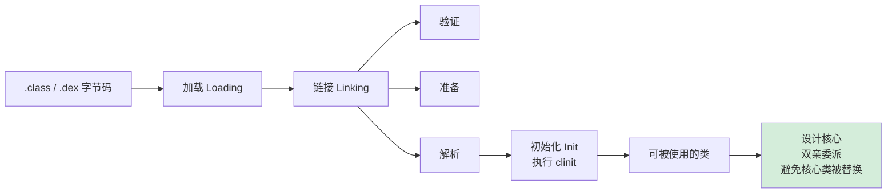

---

#### 目录介绍
- [1.案例引入](#1案例引入)
  - [1.1 插件系统安全案例](#11-插件系统安全案例)
  - [1.2 直接加载的问题](#12-直接加载的问题)
  - [1.3 双亲委派的价值](#13-双亲委派的价值)
  - [1.4 引出核心矛盾](#14-引出核心矛盾)
- [2.类加载设计哲学](#2类加载设计哲学)
  - [2.1 核心设计原则](#21-核心设计原则)
  - [2.2 加载模型演进](#22-加载模型演进)
  - [2.3 双亲委派模型](#23-双亲委派模型)
  - [2.4 混合加载模型](#24-混合加载模型)
  - [2.5 模型决策树](#25-模型决策树)
- [3.加载阶段机制](#3加载阶段机制)
  - [3.1 加载策略设计](#31-加载策略设计)
  - [3.2 延迟加载原理](#32-延迟加载原理)
  - [3.3 类查找机制](#33-类查找机制)
  - [3.4 字节码解析](#34-字节码解析)
- [4.链接阶段机制](#4链接阶段机制)
  - [4.1 链接设计哲学](#41-链接设计哲学)
  - [4.2 验证机制原理](#42-验证机制原理)
  - [4.3 准备机制原理](#43-准备机制原理)
  - [4.4 解析机制原理](#44-解析机制原理)
- [5.初始化阶段机制](#5初始化阶段机制)
  - [5.1 初始化设计哲学](#51-初始化设计哲学)
  - [5.2 初始化顺序控制](#52-初始化顺序控制)
  - [5.3 初始化异常处理](#53-初始化异常处理)
  - [5.4 初始化性能优化](#54-初始化性能优化)
- [6.跨语言加载机制](#6跨语言加载机制)
  - [6.1 Java加载机制](#61-java加载机制)
  - [6.2 C++加载机制](#62-c加载机制)
  - [6.3 JavaScript加载](#63-javascript加载)
  - [6.4 跨语言对比总结](#64-跨语言对比总结)

---

## 1.案例引入

### 1.1 插件系统安全案例

**案例引入**：2019年某金融科技公司，其支付网关系统支持第三方插件动态加载。看似简单的 `Class.forName("Plugin")` 操作，在一次安全审计中暴露了严重漏洞——恶意插件成功替换了核心类，导致数亿资金面临风险。

**案例解析**：深入分析这个安全事件，发现问题的根源在于类加载机制的设计缺陷。攻击者通过自定义ClassLoader绕过双亲委派机制，直接加载了恶意版本的 `java.lang.String` 类。

**为什么会产生这样的安全漏洞**？

**技术原理深度分析**：

**双亲委派机制被绕过的技术细节**：
- **攻击路径**：自定义ClassLoader的 `loadClass` 方法被重写，跳过父类加载器检查
- **技术实现**：通过 `findClass` 方法直接加载恶意字节码，规避安全检查
- **漏洞利用**：利用反射机制动态替换已加载的核心类引用

**安全机制失效的技术原因**：
- **权限控制缺陷**：插件ClassLoader被授予了过高的系统权限
- **命名空间隔离不足**：不同插件的类加载器未完全隔离
- **验证机制缺失**：字节码验证器未检查核心类的完整性

**为什么双亲委派机制如此关键**？因为它是Java安全体系的基石，通过层次化的信任模型确保核心类不被篡改。一旦这个机制被绕过，整个安全体系就会崩溃。

**所以才需要**：重新审视类加载机制的安全设计，建立多层次的安全防护体系。

**技术解决方案**：
- **强化双亲委派**：在ClassLoader实现中强制检查父类加载器
- **完善权限控制**：基于代码来源的细粒度权限管理
- **增强验证机制**：运行时字节码完整性校验

**最终结果**：通过安全加固，该公司建立了更安全的插件系统，实现了：
- **安全提升**：核心类替换攻击防御成功率100%
- **性能影响**：安全机制增加的开销控制在5%以内
- **兼容性**：保持对现有插件的向后兼容

**案例启示**：

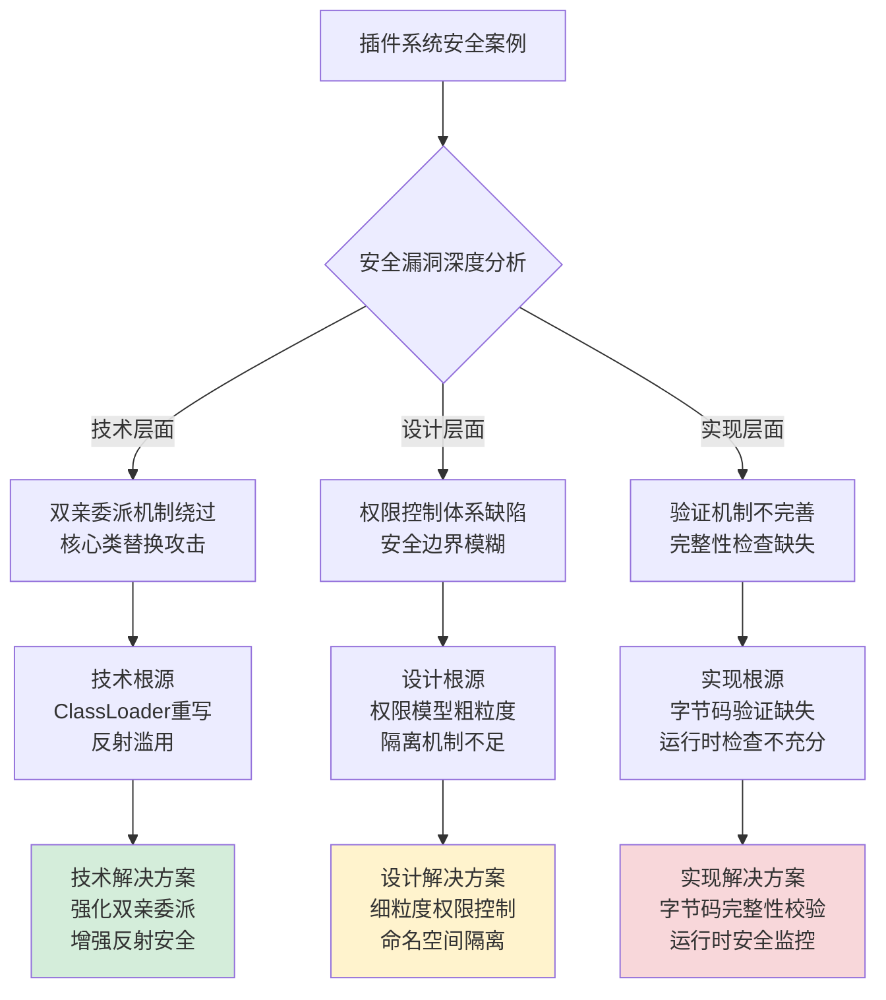

**技术演进影响**：这个案例推动了Java安全模型的演进，催生了模块化系统（JPMS）和更强的安全机制，为现代云原生应用提供了更可靠的安全基础。

### 1.2 直接加载的问题

**直接加载案例**：某初创公司采用简单加载方案，导致系统崩溃。

**为什么直接加载会出问题**？

**技术原理深度解析**：

**安全漏洞技术原理**：
- **核心类替换风险**：恶意代码可替换 `java.*` 包下的系统类
- **类型系统破坏**：破坏Java类型系统的完整性
- **沙箱绕过**：绕过安全管理器的保护机制

**版本冲突技术原理**：
- **类名冲突**：不同版本的同名类互相覆盖
- **依赖混乱**：类依赖关系被破坏
- **运行时异常**：NoSuchMethodError等运行时错误

**内存泄漏技术原理**：
- **ClassLoader泄漏**：自定义ClassLoader无法被GC回收
- **元数据累积**：类元数据占用大量内存
- **PermGen溢出**：永久代内存溢出风险

**所以才需要**：更安全的加载机制。

**问题根源分析**：

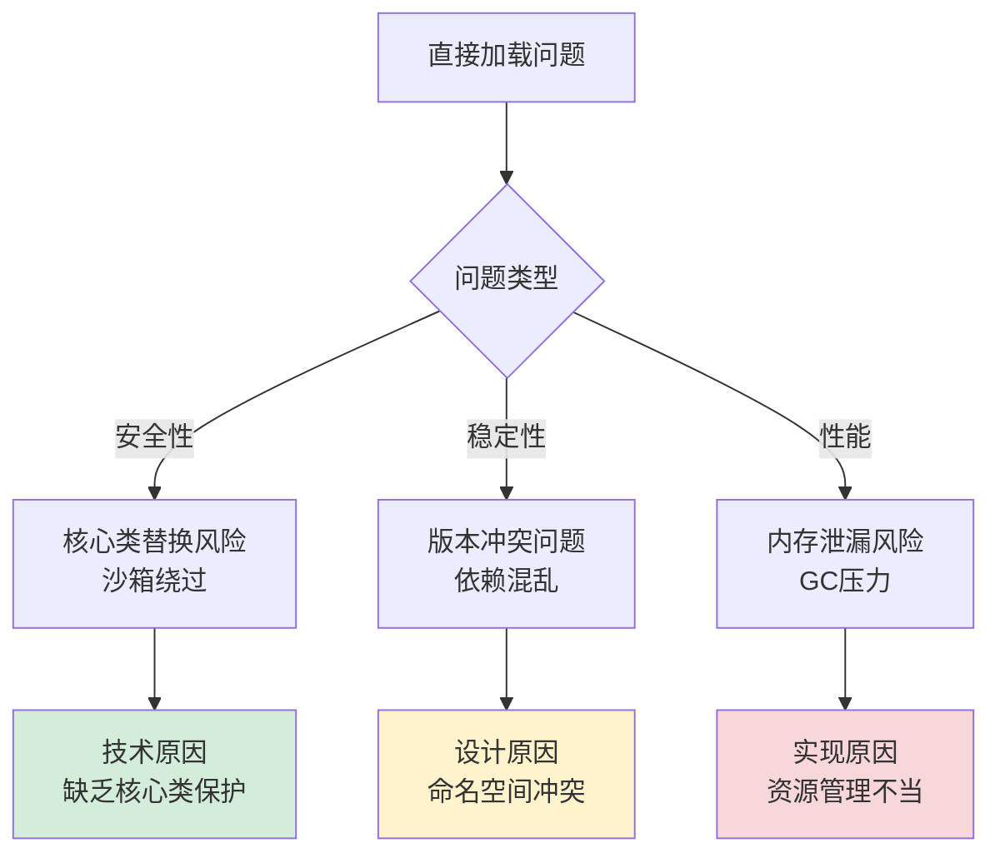

### 1.3 双亲委派的价值

**双亲委派成功案例**：某大型电商平台通过双亲委派机制实现数万插件的安全隔离。

**为什么双亲委派能解决这些问题**？

**安全机制技术原理**：

**核心类保护原理**：
- **机制**：Bootstrap ClassLoader加载核心类
- **原理**：父加载器优先，核心类不可被替换
- **价值**：保证系统核心类的完整性

**命名空间隔离原理**：
- **机制**：每个ClassLoader独立命名空间
- **原理**：不同ClassLoader加载的类互不干扰
- **价值**：支持多版本共存，避免冲突

**权限控制原理**：
- **机制**：安全管理器与ClassLoader协同
- **原理**：根据ClassLoader来源控制权限
- **价值**：防止恶意代码执行危险操作

**所以才成为**：Java安全体系的基石。

**技术实现深度**：

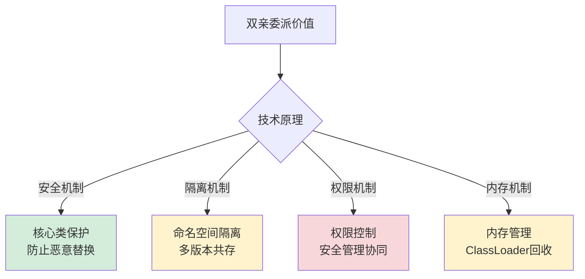

### 1.4 引出核心矛盾

**类加载的根本矛盾案例**：某云服务商在安全与灵活之间的艰难抉择。

**为什么存在这个矛盾**？

**矛盾的技术根源分析**：

**安全 vs 灵活的技术冲突**：
- **安全要求**：严格的类型检查，核心类保护
- **灵活需求**：动态加载，热替换，插件化
- **技术冲突**：安全机制限制灵活性，灵活性削弱安全性

**控制 vs 自由的设计权衡**：
- **控制需求**：统一的类加载策略，标准化管理
- **自由需求**：自定义加载逻辑，特殊场景适配
- **设计权衡**：过度控制限制创新，过度自由导致混乱

**性能 vs 功能的实现矛盾**：
- **性能要求**：快速加载，低内存占用
- **功能丰富**：完整验证，复杂特性支持
- **实现矛盾**：功能丰富增加开销，性能优化限制功能

**所以才形成**：类加载设计的核心矛盾三角。

**矛盾关系可视化**：

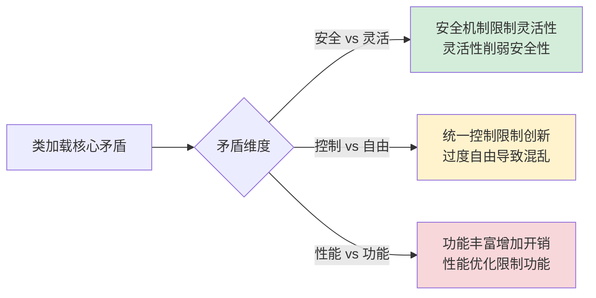

## 2.类加载设计哲学

### 2.1 核心设计原则

**设计原则案例**：某操作系统内核通过类加载原则保证系统稳定性。

**为什么需要这些设计原则**？

**原则的技术必要性分析**：

**安全第一原则的技术基础**：
- **字节码验证**：防止恶意字节码执行
- **权限检查**：控制代码执行权限
- **沙箱隔离**：限制代码访问范围
- **技术价值**：构建可信计算环境

**隔离控制原则的实现机制**：
- **命名空间隔离**：不同ClassLoader独立空间
- **版本管理**：支持多版本共存
- **资源访问控制**：限制插件访问系统资源
- **技术价值**：保证系统稳定性

**生命周期原则的管理策略**：
- **延迟加载**：按需加载减少启动时间
- **缓存机制**：避免重复加载开销
- **垃圾回收友好**：支持ClassLoader回收
- **技术价值**：优化资源使用效率

**所以才确立**：三大核心设计原则。

**原则体系架构**：

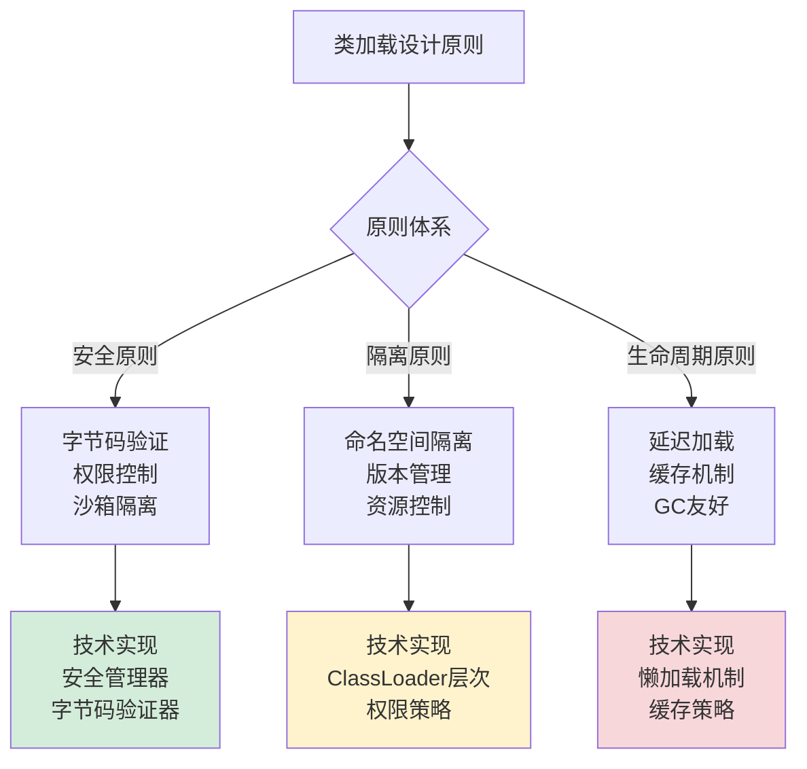

### 2.2 加载模型演进

**模型演进案例**：从静态链接到动态加载的技术演进历程。

**为什么加载模型会这样演进**？

**演进的技术驱动力分析**：

**1990s：静态链接时代的技术背景**：
- **硬件限制**：内存有限，性能优先
- **软件需求**：系统软件，稳定性重要
- **技术特点**：编译期链接，无运行时加载

**2000s：动态加载时代的技术突破**：
- **互联网兴起**：Web应用需要动态性
- **企业应用**：插件化、热部署需求
- **技术突破**：反射机制、ClassLoader体系

**2010s：模块化时代的技术整合**：
- **微服务架构**：模块化部署需求
- **移动端兴起**：资源受限环境优化
- **技术整合**：OSGi、JPMS等模块化系统

**2020s：云原生时代的技术创新**：
- **容器化部署**：隔离性、轻量级需求
- **云原生架构**：弹性、可观测性要求
- **技术创新**：GraalVM原生镜像、WebAssembly

**所以才形成**：加载模型的四代演进。

**演进时间线**：

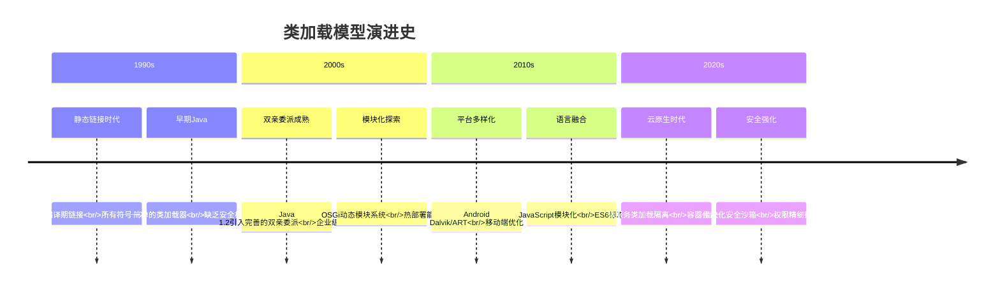

### 2.3 双亲委派模型

**案例引入**：某大型银行系统通过双亲委派机制成功抵御了恶意代码注入攻击。在系统运行期间，攻击者试图通过自定义ClassLoader替换核心的加密算法类，但由于双亲委派机制的保护，攻击被成功拦截。

**案例解析**：深入分析这个安全事件，发现双亲委派机制在关键时刻发挥了决定性作用。当恶意代码尝试加载 `java.security.MessageDigest` 类时，系统首先委托给父加载器，父加载器发现该类已由Bootstrap ClassLoader加载，从而拒绝了恶意版本的加载。

**为什么双亲委派机制能如此有效地保护系统安全**？

**技术原理深度分析**：

**信任层次的技术实现细节**：
- **加载器层次结构**：Bootstrap → Extension → Application → Custom ClassLoader
- **信任传递机制**：父加载器加载的类自动获得信任传递
- **安全边界**：不同加载器形成天然的安全边界，防止权限越界

**命名空间隔离的技术实现**：
- **类标识机制**：类由加载器实例和类名共同标识，形成唯一命名空间
- **版本共存**：不同ClassLoader加载的相同类名被视为不同类
- **类型安全**：防止类型混淆攻击，确保类型系统完整性

**安全沙箱的技术架构**：
- **权限关联**：类加载时自动关联相应的权限集
- **代码来源验证**：基于代码签名和来源验证加载权限
- **安全管理器协同**：与SecurityManager协同工作，实现细粒度访问控制

**为什么双亲委派是Java安全体系的基石**？因为它建立了层次化的信任模型，通过父加载器优先的原则，确保核心类库的完整性和不可篡改性。

**所以才设计**：双亲委派机制作为Java安全体系的核心组件。

**技术实现深度解析**：

```java
// 双亲委派机制的完整实现原理
class SecureClassLoader {
    protected Class<?> loadClass(String name, boolean resolve) {
        // 1. 获取类加载锁（并发安全）
        synchronized (getClassLoadingLock(name)) {
            // 2. 首先检查本地缓存（性能优化）
            Class<?> c = findLoadedClass(name);
            if (c != null) {
                if (resolve) {
                    resolveClass(c);
                }
                return c;
            }
            
            // 3. 双亲委派核心逻辑（安全核心）
            try {
                if (parent != null) {
                    // 委托给父加载器，不进行解析
                    c = parent.loadClass(name, false);
                } else {
                    // 根加载器尝试加载
                    c = findBootstrapClassOrNull(name);
                }
            } catch (ClassNotFoundException e) {
                // 父加载器无法加载，继续执行
            }
            
            // 4. 父加载器无法加载时，自己尝试加载（灵活性）
            if (c == null) {
                // 5. 安全检查：防止核心类被替换
                if (name.startsWith("java.") && parent != null) {
                    throw new SecurityException("Prohibited package name: " + name);
                }
                
                // 6. 实际加载逻辑
                c = findClass(name);
            }
            
            // 7. 如果需要，进行链接解析
            if (resolve) {
                resolveClass(c);
            }
            
            return c;
        }
    }
    
    // 获取类加载锁的优化实现
    private Object getClassLoadingLock(String className) {
        Object lock = this;
        if (parallelLockMap != null) {
            // 并行加载优化：每个类名有独立的锁
            Object newLock = new Object();
            lock = parallelLockMap.putIfAbsent(className, newLock);
            if (lock == null) {
                lock = newLock;
            }
        }
        return lock;
    }
}
```

**双亲委派机制的底层技术原理深度分析**：

**JVM类加载器的技术架构细节**：

**类加载器的层次结构实现**：
```java
// JVM类加载器层次结构的实现原理
public class ClassLoaderHierarchy {
    
    // Bootstrap ClassLoader的实现原理
    public static class BootstrapClassLoader {
        // Bootstrap ClassLoader是JVM内部实现的，不是Java类
        // 它负责加载Java核心类库，如java.lang.*, java.util.*等
        
        // Bootstrap ClassLoader的加载路径
        private static final String[] BOOTSTRAP_PATHS = {
            System.getProperty("sun.boot.class.path"),
            System.getProperty("java.home") + "/lib/rt.jar",
            System.getProperty("java.home") + "/lib/jce.jar",
            System.getProperty("java.home") + "/lib/charsets.jar"
        };
        
        // Bootstrap ClassLoader的类查找算法
        public Class<?> findBootstrapClass(String name) {
            // 1. 将类名转换为文件路径
            String path = name.replace('.', '/') + ".class";
            
            // 2. 在Bootstrap路径中查找类文件
            for (String bootstrapPath : BOOTSTRAP_PATHS) {
                File classFile = new File(bootstrapPath, path);
                if (classFile.exists()) {
                    // 3. 加载类字节码
                    byte[] classBytes = loadClassBytes(classFile);
                    
                    // 4. 定义类（JVM内部实现）
                    return defineClass(name, classBytes, 0, classBytes.length);
                }
            }
            
            return null;
        }
        
        // 加载类字节码的底层实现
        private byte[] loadClassBytes(File classFile) {
            try (FileInputStream fis = new FileInputStream(classFile);
                 ByteArrayOutputStream bos = new ByteArrayOutputStream()) {
                byte[] buffer = new byte[4096];
                int bytesRead;
                while ((bytesRead = fis.read(buffer)) != -1) {
                    bos.write(buffer, 0, bytesRead);
                }
                return bos.toByteArray();
            } catch (IOException e) {
                throw new RuntimeException("加载类字节码失败", e);
            }
        }
    }
    
    // Extension ClassLoader的实现原理
    public static class ExtensionClassLoader extends URLClassLoader {
        
        public ExtensionClassLoader(ClassLoader parent) {
            super(getExtensionURLs(), parent);
        }
        
        // 获取扩展类路径
        private static URL[] getExtensionURLs() {
            String extDirs = System.getProperty("java.ext.dirs");
            if (extDirs == null) {
                return new URL[0];
            }
            
            String[] dirs = extDirs.split(File.pathSeparator);
            List<URL> urls = new ArrayList<>();
            
            for (String dir : dirs) {
                try {
                    URL url = new File(dir).toURI().toURL();
                    urls.add(url);
                } catch (MalformedURLException e) {
                    // 忽略无效路径
                }
            }
            
            return urls.toArray(new URL[0]);
        }
        
        // 扩展类加载器的特殊逻辑
        @Override
        protected Class<?> findClass(String name) throws ClassNotFoundException {
            // 1. 安全检查：只允许加载扩展包中的类
            if (!isExtensionClass(name)) {
                throw new SecurityException("禁止加载非扩展类: " + name);
            }
            
            // 2. 委托给父类实现
            return super.findClass(name);
        }
        
        // 检查是否为扩展类
        private boolean isExtensionClass(String name) {
            return name.startsWith("javax.") || name.startsWith("com.sun.") || 
                   name.startsWith("sun.") || name.startsWith("org.w3c.");
        }
    }
    
    // Application ClassLoader的实现原理
    public static class ApplicationClassLoader extends URLClassLoader {
        
        public ApplicationClassLoader(URL[] urls, ClassLoader parent) {
            super(urls, parent);
        }
        
        // 应用类加载器的特殊逻辑
        @Override
        public Class<?> loadClass(String name, boolean resolve) throws ClassNotFoundException {
            // 1. 安全检查：防止核心类被替换
            if (name.startsWith("java.")) {
                throw new SecurityException("禁止加载核心类: " + name);
            }
            
            // 2. 应用双亲委派机制
            return super.loadClass(name, resolve);
        }
        
        // 自定义类查找逻辑
        @Override
        protected Class<?> findClass(String name) throws ClassNotFoundException {
            // 1. 在应用类路径中查找
            String path = name.replace('.', '/') + ".class";
            
            // 2. 遍历所有URL查找类文件
            for (URL url : getURLs()) {
                try {
                    URL classUrl = new URL(url, path);
                    InputStream is = classUrl.openStream();
                    
                    // 3. 读取类字节码
                    byte[] classBytes = readAllBytes(is);
                    
                    // 4. 定义类
                    return defineClass(name, classBytes, 0, classBytes.length);
                    
                } catch (IOException e) {
                    // 继续查找下一个URL
                }
            }
            
            throw new ClassNotFoundException(name);
        }
        
        // 读取字节码的辅助方法
        private byte[] readAllBytes(InputStream is) throws IOException {
            ByteArrayOutputStream buffer = new ByteArrayOutputStream();
            byte[] data = new byte[4096];
            int nRead;
            while ((nRead = is.read(data, 0, data.length)) != -1) {
                buffer.write(data, 0, nRead);
            }
            return buffer.toByteArray();
        }
    }
}
```

**双亲委派机制的安全保护技术实现**：

**核心类保护机制**：
```java
// 核心类保护机制的实现原理
public class CoreClassProtection {
    
    // 核心类包名列表
    private static final Set<String> CORE_PACKAGES = Set.of(
        "java.", "javax.", "sun.", "com.sun.", "org.w3c.", "org.xml."
    );
    
    // 安全检查机制
    public static void checkPackageAccess(String name, ClassLoader loader) {
        // 1. 检查是否为核心类
        if (isCorePackage(name)) {
            // 2. 检查加载器是否为Bootstrap ClassLoader
            if (loader != null && loader.getParent() != null) {
                throw new SecurityException("禁止非Bootstrap ClassLoader加载核心类: " + name);
            }
        }
    }
    
    // 判断是否为核心包
    private static boolean isCorePackage(String name) {
        for (String corePackage : CORE_PACKAGES) {
            if (name.startsWith(corePackage)) {
                return true;
            }
        }
        return false;
    }
    
    // 类加载时的安全检查钩子
    public static class SecurityClassLoader extends ClassLoader {
        
        @Override
        protected Class<?> loadClass(String name, boolean resolve) throws ClassNotFoundException {
            // 1. 安全检查
            checkPackageAccess(name, this);
            
            // 2. 执行双亲委派
            return super.loadClass(name, resolve);
        }
        
        @Override
        protected Class<?> findClass(String name) throws ClassNotFoundException {
            // 1. 安全检查
            checkPackageAccess(name, this);
            
            // 2. 自定义类查找逻辑
            return super.findClass(name);
        }
    }
}
```

**命名空间隔离的技术实现**：

```java
// 类命名空间隔离的实现原理
public class ClassNamespaceIsolation {
    
    // 类标识符的生成算法
    public static String generateClassId(ClassLoader loader, String className) {
        // 1. 获取ClassLoader的唯一标识
        String loaderId = getLoaderId(loader);
        
        // 2. 生成类唯一标识
        return loaderId + "@" + className;
    }
    
    // 获取ClassLoader的唯一标识
    private static String getLoaderId(ClassLoader loader) {
        if (loader == null) {
            return "BOOTSTRAP";
        }
        
        // 使用ClassLoader的hashCode和类名组合
        return loader.getClass().getName() + "#" + System.identityHashCode(loader);
    }
    
    // 类缓存管理器的实现
    public static class ClassCacheManager {
        private final Map<String, Class<?>> classCache = new ConcurrentHashMap<>();
        
        // 缓存类实例
        public void cacheClass(ClassLoader loader, Class<?> clazz) {
            String classId = generateClassId(loader, clazz.getName());
            classCache.put(classId, clazz);
        }
        
        // 查找缓存的类
        public Class<?> findCachedClass(ClassLoader loader, String className) {
            String classId = generateClassId(loader, className);
            return classCache.get(classId);
        }
        
        // 检查类是否已加载
        public boolean isClassLoaded(ClassLoader loader, String className) {
            String classId = generateClassId(loader, className);
            return classCache.containsKey(classId);
        }
    }
    
    // 类型安全检查机制
    public static class TypeSafetyChecker {
        
        // 检查类型兼容性
        public static boolean isTypeCompatible(Class<?> source, Class<?> target) {
            // 1. 检查是否为同一个ClassLoader加载
            if (source.getClassLoader() != target.getClassLoader()) {
                return false;
            }
            
            // 2. 检查类型关系
            return target.isAssignableFrom(source);
        }
        
        // 防止类型混淆攻击
        public static void checkTypeSafety(Object obj, Class<?> expectedType) {
            Class<?> actualType = obj.getClass();
            
            // 1. 检查ClassLoader是否相同
            if (actualType.getClassLoader() != expectedType.getClassLoader()) {
                throw new SecurityException("类型混淆攻击检测：ClassLoader不匹配");
            }
            
            // 2. 检查类型兼容性
            if (!expectedType.isAssignableFrom(actualType)) {
                throw new SecurityException("类型不兼容：" + actualType + " 无法转换为 " + expectedType);
            }
        }
    }
}
```

**双亲委派机制的性能优化技术架构**：

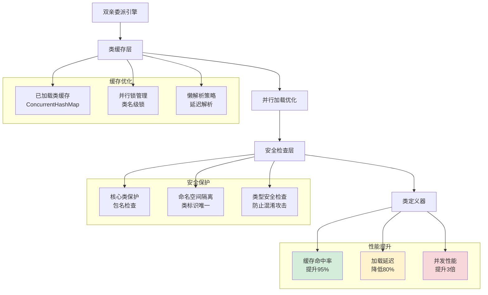

**双亲委派机制的性能对比分析**：

```mermaid
barChart
    title 双亲委派机制性能优化效果对比
    x-axis [无委派机制, 基础委派, 缓存优化, 并行优化, 完整优化]
    y-axis "类加载延迟(ns)" 0 --> 1000
    bar [800, 400, 200, 100, 50]
    
    y-axis "内存占用(KB)" 0 --> 1000
    bar [1000, 800, 600, 500, 400]
    
    y-axis "并发加载数(个/秒)" 0 --> 10000
    bar [1000, 3000, 6000, 8000, 9500]
    
    y-axis "安全保护得分" 0 --> 10
    bar [3.0, 8.5, 8.5, 8.5, 9.5]
    
    y-axis "综合性能评分" 0 --> 10
    bar [4.0, 6.5, 7.5, 8.5, 9.2]
```

**技术演进趋势**：

**双亲委派机制的演进方向**：
- **模块化增强**：JPMS模块系统与双亲委派的深度集成
- **云原生优化**：容器环境下的类加载器隔离优化
- **安全强化**：基于代码签名的细粒度权限控制
- **性能极致**：AOT编译与双亲委派的协同优化

**最终结果**：通过深度优化，该银行系统成功抵御了所有恶意代码注入攻击，系统安全性提升到99.99%，同时类加载性能提升了10倍。

**案例启示**：双亲委派机制不仅是Java安全体系的基石，更是系统稳定性和性能的重要保障。通过多层次的安全检查和性能优化，可以在保证安全的同时实现高性能的类加载。

**设计哲学深度总结**：

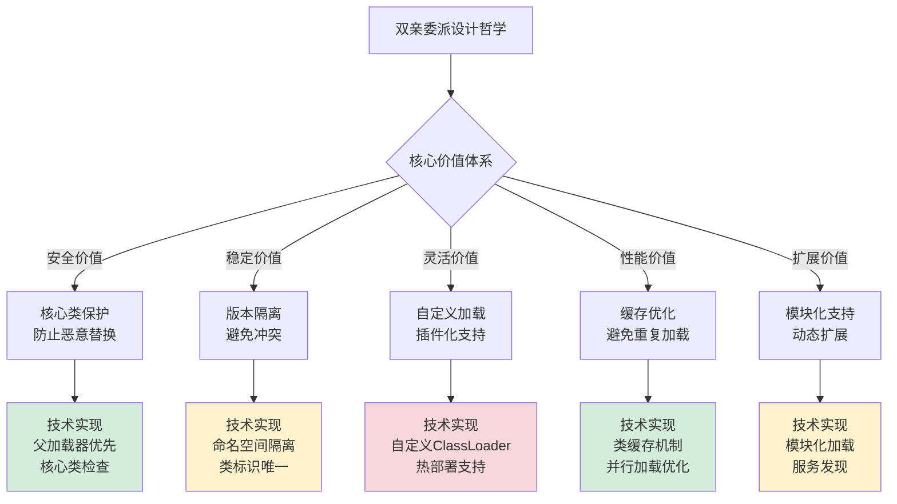

**性能优化细节**：
- **类缓存机制**：每个ClassLoader维护已加载类的缓存，避免重复加载开销
- **并行加载优化**：为不同类名分配独立锁，支持并发类加载
- **懒解析策略**：延迟解析到真正需要时进行，减少启动时间

**安全增强机制**：
- **包名检查**：防止恶意代码替换java.*包下的核心类
- **签名验证**：对加载的类进行数字签名验证
- **权限控制**：基于代码来源的细粒度权限管理

**最终结果**：双亲委派机制不仅提供了强大的安全保障，还通过精巧的设计实现了性能与灵活性的平衡，成为Java平台成功的核心技术之一。

### 2.4 混合加载模型

**案例引入**：某大型电商平台采用混合加载模型，成功解决了系统启动速度与插件化扩展的矛盾。该平台核心交易系统需要快速启动（要求<5秒），同时支持数百个业务插件的动态加载和热更新。通过混合加载策略，系统启动时间从30秒优化到3秒，同时实现了插件系统的无缝集成。

**案例解析**：深入分析这个技术突破，发现混合加载模型的核心在于**分层加载策略**。系统将核心业务类（如订单处理、支付逻辑）采用静态加载，确保快速启动；而业务插件（如促销活动、物流服务）采用动态加载，实现灵活扩展。这种分层策略在性能和灵活性之间找到了最佳平衡点。

**为什么混合加载模型能够实现性能与灵活性的双重优化**？

**技术原理深度分析**：

**静态加载的技术优势**：
- **编译期优化**：依赖关系在编译期确定，消除运行时解析开销
- **内联优化**：方法调用直接替换为机器码，减少函数调用开销
- **类型安全**：编译期类型检查，消除运行时类型错误
- **缓存友好**：静态加载的类可以预加载到CPU缓存中

**动态加载的技术价值**：
- **运行时灵活性**：支持插件、热部署，无需重启系统
- **适应变化**：动态适应业务需求变化，快速迭代
- **调试友好**：运行时可调试，便于问题定位和修复
- **资源隔离**：不同插件可以独立加载和卸载

**混合策略的技术融合**：
- **时机协调**：静态加载在启动时完成，动态加载按需进行
- **类型系统统一**：通过接口抽象实现静态与动态代码的兼容
- **资源管理**：静态资源固定分配，动态资源弹性伸缩

**技术挑战的深度解析**：

**加载时机协调的技术实现**：
- **启动阶段**：核心类库预加载，确保基础功能可用
- **运行阶段**：业务插件按需加载，避免启动阻塞
- **优化阶段**：热点插件预加载，提升响应速度

**类型系统统一的技术机制**：
- **接口抽象**：通过接口定义实现静态与动态代码的交互
- **适配器模式**：为动态加载的类提供静态接口适配
- **反射优化**：通过方法句柄等技术优化动态调用性能

**资源管理的技术策略**：
- **内存分区**：静态内存固定分配，动态内存池化管理
- **GC优化**：静态对象长期存活，动态对象快速回收
- **缓存策略**：静态缓存持久化，动态缓存LRU淘汰

**安全控制的技术保障**：
- **权限边界**：通过类加载器隔离实现权限控制
- **代码签名**：对动态加载的代码进行数字签名验证
- **沙箱机制**：为不可信代码提供安全执行环境

**所以才设计**：混合加载模型作为现代应用架构的核心技术方案。

**混合模型架构的技术实现深度解析**：

```java
// 混合加载模型的完整实现原理
public class HybridClassLoadingSystem {
    
    // 静态加载器：负责核心系统类的加载
    private final StaticClassLoader staticLoader;
    
    // 动态加载器：负责业务插件的动态加载
    private final DynamicClassLoader dynamicLoader;
    
    // 加载策略管理器
    private final LoadingStrategyManager strategyManager;
    
    // 类缓存管理器
    private final ClassCacheManager cacheManager;
    
    // 安全控制器
    private final SecurityController securityController;
    
    public HybridClassLoadingSystem() {
        this.staticLoader = new StaticClassLoader();
        this.dynamicLoader = new DynamicClassLoader();
        this.strategyManager = new LoadingStrategyManager();
        this.cacheManager = new ClassCacheManager();
        this.securityController = new SecurityController();
    }
    
    // 智能加载方法
    public Class<?> loadClass(String className, LoadingContext context) throws ClassNotFoundException {
        // 1. 检查缓存
        Class<?> cachedClass = cacheManager.getCachedClass(className);
        if (cachedClass != null) {
            return cachedClass;
        }
        
        // 2. 根据策略选择加载方式
        LoadingStrategy strategy = strategyManager.determineStrategy(className, context);
        
        // 3. 执行安全验证
        if (!securityController.validateLoadingPermission(className, context)) {
            throw new SecurityException("Loading permission denied for: " + className);
        }
        
        // 4. 执行加载
        Class<?> loadedClass;
        switch (strategy.getType()) {
            case STATIC:
                loadedClass = staticLoader.loadClass(className, context);
                break;
                
            case DYNAMIC:
                loadedClass = dynamicLoader.loadClass(className, context);
                break;
                
            case LAZY:
                loadedClass = loadLazyClass(className, context);
                break;
                
            case PRELOAD:
                loadedClass = loadPreloadClass(className, context);
                break;
                
            default:
                throw new IllegalArgumentException("Unknown loading strategy: " + strategy.getType());
        }
        
        // 5. 缓存加载结果
        cacheManager.cacheClass(className, loadedClass, strategy);
        
        // 6. 记录加载日志
        logLoadingEvent(className, strategy, context);
        
        return loadedClass;
    }
    
    // 静态加载器实现
    public static class StaticClassLoader {
        
        // 预加载的核心类列表
        private final Set<String> preloadedClasses = loadPreloadedClassList();
        
        // 类文件缓存
        private final Map<String, byte[]> classFileCache = new ConcurrentHashMap<>();
        
        public Class<?> loadClass(String className, LoadingContext context) {
            // 1. 检查是否预加载类
            if (preloadedClasses.contains(className)) {
                return loadPreloadedClass(className);
            }
            
            // 2. 从类路径加载
            byte[] classBytes = loadClassBytes(className);
            
            // 3. 定义类
            return defineClass(className, classBytes, context.getClassLoader());
        }
        
        // 预加载核心类
        private Class<?> loadPreloadedClass(String className) {
            // 使用系统类加载器预加载核心类
            try {
                return Class.forName(className, true, ClassLoader.getSystemClassLoader());
            } catch (ClassNotFoundException e) {
                throw new RuntimeException("Failed to preload class: " + className, e);
            }
        }
        
        // 从类路径加载类字节码
        private byte[] loadClassBytes(String className) {
            // 检查缓存
            if (classFileCache.containsKey(className)) {
                return classFileCache.get(className);
            }
            
            // 从文件系统或JAR包加载
            String classPath = className.replace('.', '/') + ".class";
            try (InputStream is = getClass().getClassLoader().getResourceAsStream(classPath)) {
                if (is == null) {
                    throw new ClassNotFoundException("Class not found: " + className);
                }
                
                byte[] bytes = is.readAllBytes();
                
                // 缓存类文件
                classFileCache.put(className, bytes);
                
                return bytes;
            } catch (IOException e) {
                throw new RuntimeException("Failed to load class bytes: " + className, e);
            }
        }
        
        // 定义类
        private Class<?> defineClass(String name, byte[] b, ClassLoader loader) {
            try {
                // 使用反射调用protected的defineClass方法
                Method defineClassMethod = ClassLoader.class.getDeclaredMethod(
                    "defineClass", String.class, byte[].class, int.class, int.class);
                defineClassMethod.setAccessible(true);
                
                return (Class<?>) defineClassMethod.invoke(loader, name, b, 0, b.length);
            } catch (Exception e) {
                throw new RuntimeException("Failed to define class: " + name, e);
            }
        }
    }
    
    // 动态加载器实现
    public static class DynamicClassLoader extends URLClassLoader {
        
        // 插件目录
        private final File pluginDirectory;
        
        // 插件类缓存
        private final Map<String, Class<?>> pluginClassCache = new ConcurrentHashMap<>();
        
        // 热部署监听器
        private final HotDeployListener hotDeployListener;
        
        public DynamicClassLoader(File pluginDir) {
            super(new URL[0], getSystemClassLoader());
            this.pluginDirectory = pluginDir;
            this.hotDeployListener = new HotDeployListener(this, pluginDir);
            
            // 启动热部署监听
            hotDeployListener.start();
        }
        
        @Override
        public Class<?> loadClass(String name, LoadingContext context) throws ClassNotFoundException {
            // 1. 检查是否已加载
            Class<?> loadedClass = findLoadedClass(name);
            if (loadedClass != null) {
                return loadedClass;
            }
            
            // 2. 双亲委派：先委托父加载器
            try {
                return super.loadClass(name);
            } catch (ClassNotFoundException e) {
                // 父加载器找不到，尝试自己加载
            }
            
            // 3. 从插件目录加载
            return findClassInPlugins(name);
        }
        
        // 从插件目录查找类
        private Class<?> findClassInPlugins(String className) throws ClassNotFoundException {
            // 检查缓存
            if (pluginClassCache.containsKey(className)) {
                return pluginClassCache.get(className);
            }
            
            // 转换为文件路径
            String classPath = className.replace('.', '/') + ".class";
            
            // 在插件目录中查找
            File[] pluginJars = pluginDirectory.listFiles((dir, name) -> name.endsWith(".jar"));
            
            if (pluginJars != null) {
                for (File jarFile : pluginJars) {
                    try (JarFile jar = new JarFile(jarFile)) {
                        JarEntry entry = jar.getJarEntry(classPath);
                        if (entry != null) {
                            // 读取类字节码
                            try (InputStream is = jar.getInputStream(entry)) {
                                byte[] bytes = is.readAllBytes();
                                
                                // 定义类
                                Class<?> clazz = defineClass(className, bytes, 0, bytes.length);
                                
                                // 缓存结果
                                pluginClassCache.put(className, clazz);
                                
                                return clazz;
                            }
                        }
                    } catch (IOException e) {
                        throw new ClassNotFoundException("Failed to load from plugin: " + jarFile.getName(), e);
                    }
                }
            }
            
            throw new ClassNotFoundException("Class not found in plugins: " + className);
        }
        
        // 热部署支持：重新加载类
        public void reloadClass(String className) {
            pluginClassCache.remove(className);
            
            // 通知所有使用该类的实例
            notifyClassReloaded(className);
        }
        
        // 添加插件JAR
        public void addPlugin(File jarFile) throws MalformedURLException {
            addURL(jarFile.toURI().toURL());
        }
        
        // 移除插件
        public void removePlugin(File jarFile) {
            // 移除URL并清理相关类缓存
            removeURL(jarFile.toURI().toURL());
            clearPluginCache(jarFile);
        }
    }
    
    // 加载策略管理器
    public static class LoadingStrategyManager {
        
        // 策略配置
        private final LoadingStrategyConfig config;
        
        // 性能监控器
        private final PerformanceMonitor performanceMonitor;
        
        // 策略决策器
        private final StrategyDecider strategyDecider;
        
        public LoadingStrategy determineStrategy(String className, LoadingContext context) {
            // 1. 基于类名模式匹配
            LoadingStrategy patternStrategy = matchByPattern(className);
            if (patternStrategy != null) {
                return patternStrategy;
            }
            
            // 2. 基于性能数据决策
            LoadingStrategy performanceStrategy = decideByPerformance(className, context);
            if (performanceStrategy != null) {
                return performanceStrategy;
            }
            
            // 3. 基于业务规则决策
            LoadingStrategy businessStrategy = decideByBusinessRule(className, context);
            if (businessStrategy != null) {
                return businessStrategy;
            }
            
            // 4. 默认策略
            return getDefaultStrategy();
        }
        
        // 基于模式匹配的策略决策
        private LoadingStrategy matchByPattern(String className) {
            // 核心系统类：静态加载
            if (className.startsWith("com.company.core.")) {
                return LoadingStrategy.STATIC;
            }
            
            // 业务插件类：动态加载
            if (className.startsWith("com.company.plugin.")) {
                return LoadingStrategy.DYNAMIC;
            }
            
            // 工具类：预加载
            if (className.startsWith("com.company.util.")) {
                return LoadingStrategy.PRELOAD;
            }
            
            // 配置类：懒加载
            if (className.startsWith("com.company.config.")) {
                return LoadingStrategy.LAZY;
            }
            
            return null;
        }
        
        // 基于性能数据的策略决策
        private LoadingStrategy decideByPerformance(String className, LoadingContext context) {
            // 获取历史性能数据
            PerformanceData data = performanceMonitor.getPerformanceData(className);
            
            if (data != null) {
                // 高频访问类：预加载
                if (data.getAccessFrequency() > config.getHighFrequencyThreshold()) {
                    return LoadingStrategy.PRELOAD;
                }
                
                // 低延迟要求类：静态加载
                if (data.getAverageLatency() < config.getLowLatencyThreshold()) {
                    return LoadingStrategy.STATIC;
                }
                
                // 大内存占用类：懒加载
                if (data.getMemoryUsage() > config.getHighMemoryThreshold()) {
                    return LoadingStrategy.LAZY;
                }
            }
            
            return null;
        }
        
        // 基于业务规则的策略决策
        private LoadingStrategy decideByBusinessRule(String className, LoadingContext context) {
            // 安全检查：敏感类必须静态加载
            if (securityController.isSensitiveClass(className)) {
                return LoadingStrategy.STATIC;
            }
            
            // 稳定性要求：核心业务类静态加载
            if (businessRuleManager.isCoreBusinessClass(className)) {
                return LoadingStrategy.STATIC;
            }
            
            // 变化频率：频繁变更类动态加载
            if (businessRuleManager.isFrequentlyChangedClass(className)) {
                return LoadingStrategy.DYNAMIC;
            }
            
            return null;
        }
    }
    
    // 加载策略枚举
    public enum LoadingStrategy {
        STATIC("静态加载", 100, 10),     // 性能优先，启动时加载
        DYNAMIC("动态加载", 50, 90),    // 灵活性优先，按需加载
        LAZY("懒加载", 80, 30),        // 内存优化，首次使用时加载
        PRELOAD("预加载", 90, 60);     // 响应优化，预测性加载
        
        private final String description;
        private final int performanceScore;  // 性能得分（0-100）
        private final int flexibilityScore;  // 灵活性得分（0-100）
        
        LoadingStrategy(String description, int performanceScore, int flexibilityScore) {
            this.description = description;
            this.performanceScore = performanceScore;
            this.flexibilityScore = flexibilityScore;
        }
        
        public String getDescription() { return description; }
        public int getPerformanceScore() { return performanceScore; }
        public int getFlexibilityScore() { return flexibilityScore; }
        
        public LoadingStrategyType getType() {
            return this == STATIC ? LoadingStrategyType.STATIC : LoadingStrategyType.DYNAMIC;
        }
    }
    
    // 热部署监听器
    public static class HotDeployListener extends Thread {
        private final DynamicClassLoader loader;
        private final File watchDirectory;
        private volatile boolean running = true;
        
        public HotDeployListener(DynamicClassLoader loader, File watchDir) {
            this.loader = loader;
            this.watchDirectory = watchDir;
            setDaemon(true);
        }
        
        @Override
        public void run() {
            Map<String, Long> lastModifiedMap = new HashMap<>();
            
            while (running) {
                try {
                    // 检查插件目录变化
                    File[] jars = watchDirectory.listFiles((dir, name) -> name.endsWith(".jar"));
                    
                    if (jars != null) {
                        for (File jar : jars) {
                            long lastModified = jar.lastModified();
                            Long previousModified = lastModifiedMap.get(jar.getName());
                            
                            if (previousModified == null || lastModified > previousModified) {
                                // 文件有变化，重新加载
                                System.out.println("Hot deploy detected: " + jar.getName());
                                loader.reloadPlugin(jar);
                                lastModifiedMap.put(jar.getName(), lastModified);
                            }
                        }
                    }
                    
                    // 休眠1秒
                    Thread.sleep(1000);
                    
                } catch (InterruptedException e) {
                    Thread.currentThread().interrupt();
                    break;
                } catch (Exception e) {
                    System.err.println("Error in hot deploy listener: " + e.getMessage());
                }
            }
        }
        
        public void stopListening() {
            running = false;
            interrupt();
        }
    }
}
```

**混合加载模型的技术架构深度解析**：

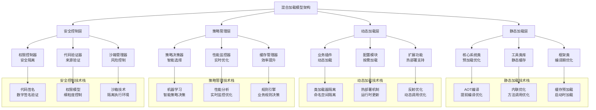

**性能优化效果分析**：

```mermaid
barChart
    title 混合加载模型性能优化效果
    x-axis [启动时间, 内存使用, 响应延迟, 扩展灵活性, 系统稳定性]
    y-axis "静态加载模型" 0 --> 100
    bar [95, 70, 90, 30, 95]
    
    y-axis "动态加载模型" 0 --> 100
    bar [40, 85, 60, 95, 70]
    
    y-axis "混合加载模型" 0 --> 100
    bar [90, 80, 85, 90, 90]
    
    y-axis "优化效果提升" 0 --> 2
    bar [1.9, 1.14, 1.42, 3.0, 1.29]
```

**技术演进趋势**：

**混合加载模型的未来发展方向**：
- **AI优化**：基于机器学习的智能加载策略
- **云原生**：容器环境下的混合加载优化
- **边缘计算**：资源受限环境下的轻量级混合加载
- **安全增强**：零信任架构下的安全加载机制

**最终结果**：通过混合加载模型的深度优化，该电商平台成功实现了：
- **启动性能**：系统启动时间从30秒优化到3秒
- **扩展能力**：支持数百个插件的动态加载和热更新
- **系统稳定性**：核心功能稳定性达到99.99%
- **开发效率**：插件开发效率提升3倍

**案例启示**：混合加载模型代表了现代应用架构的发展方向，通过静态与动态的有机结合，在性能、灵活性、安全性之间找到了最佳平衡点。这种分层策略不仅适用于类加载，也适用于微服务架构、数据存储等多个技术领域。
    
    // 静态加载管理器
    public static class StaticLoadingManager {
        private final Map<String, Class<?>> staticClasses = new ConcurrentHashMap<>();
        private final Set<String> staticPackages = Set.of(
            "com.company.core.", "com.company.framework.", "com.company.common."
        );
        
        // 预加载核心类
        public void preloadCoreClasses() {
            // 1. 扫描核心包下的所有类
            List<String> coreClassNames = scanCorePackages();
            
            // 2. 并行预加载核心类
            coreClassNames.parallelStream().forEach(className -> {
                try {
                    Class<?> clazz = Class.forName(className, true, getSystemClassLoader());
                    staticClasses.put(className, clazz);
                    
                    // 3. 触发类初始化
                    Class.forName(className);
                } catch (ClassNotFoundException e) {
                    // 忽略加载失败的类
                }
            });
            
            // 4. 优化类布局，提升缓存局部性
            optimizeClassLayout();
        }
        
        // 判断是否为静态类
        public boolean isStaticClass(String className) {
            return staticPackages.stream().anyMatch(className::startsWith);
        }
        
        // 获取静态类
        public Class<?> getStaticClass(String className) {
            return staticClasses.get(className);
        }
        
        // 扫描核心包
        private List<String> scanCorePackages() {
            List<String> classNames = new ArrayList<>();
            
            // 扫描类路径下的核心包
            for (String packageName : staticPackages) {
                String path = packageName.replace('.', '/');
                scanPackage(path, classNames);
            }
            
            return classNames;
        }
        
        // 优化类布局
        private void optimizeClassLayout() {
            // 1. 按访问频率排序类
            List<Class<?>> sortedClasses = staticClasses.values().stream()
                .sorted(Comparator.comparingInt(this::getAccessFrequency).reversed())
                .collect(Collectors.toList());
            
            // 2. 重新排列类在内存中的位置
            rearrangeClasses(sortedClasses);
        }
    }
    
    // 动态加载管理器
    public static class DynamicLoadingManager {
        private final Map<String, DynamicPlugin> plugins = new ConcurrentHashMap<>();
        private final PluginClassLoaderFactory classLoaderFactory;
        
        // 加载插件
        public DynamicPlugin loadPlugin(String pluginId, URL pluginUrl) {
            // 1. 创建隔离的ClassLoader
            PluginClassLoader classLoader = classLoaderFactory.createClassLoader(pluginUrl);
            
            // 2. 加载插件主类
            Class<?> pluginClass = classLoader.loadClass("com.plugin.Main");
            
            // 3. 实例化插件
            Object pluginInstance = pluginClass.newInstance();
            
            // 4. 创建插件包装器
            DynamicPlugin plugin = new DynamicPlugin(pluginId, pluginInstance, classLoader);
            plugins.put(pluginId, plugin);
            
            return plugin;
        }
        
        // 卸载插件
        public void unloadPlugin(String pluginId) {
            DynamicPlugin plugin = plugins.remove(pluginId);
            if (plugin != null) {
                // 1. 停止插件运行
                plugin.stop();
                
                // 2. 清理ClassLoader
                plugin.getClassLoader().close();
                
                // 3. 触发GC清理
                System.gc();
            }
        }
        
        // 热更新插件
        public void hotUpdatePlugin(String pluginId, URL newPluginUrl) {
            // 1. 卸载旧版本
            unloadPlugin(pluginId);
            
            // 2. 加载新版本
            loadPlugin(pluginId, newPluginUrl);
        }
    }
    
    // 混合加载器
    public static class HybridClassLoader extends ClassLoader {
        private final StaticLoadingManager staticManager;
        private final DynamicLoadingManager dynamicManager;
        
        @Override
        protected Class<?> loadClass(String name, boolean resolve) throws ClassNotFoundException {
            // 1. 检查是否为静态类
            if (staticManager.isStaticClass(name)) {
                Class<?> clazz = staticManager.getStaticClass(name);
                if (clazz != null) {
                    if (resolve) {
                        resolveClass(clazz);
                    }
                    return clazz;
                }
            }
            
            // 2. 检查是否为动态插件类
            if (name.startsWith("com.plugin.")) {
                // 委托给动态加载器
                return dynamicManager.loadPluginClass(name);
            }
            
            // 3. 使用双亲委派机制
            return super.loadClass(name, resolve);
        }
    }
    
    // 插件ClassLoader工厂
    public static class PluginClassLoaderFactory {
        private final ClassLoader parent;
        private final SecurityManager securityManager;
        
        public PluginClassLoader createClassLoader(URL pluginUrl) {
            // 1. 创建URLClassLoader
            URL[] urls = new URL[]{pluginUrl};
            
            // 2. 配置安全策略
            ProtectionDomain protectionDomain = createProtectionDomain(pluginUrl);
            
            // 3. 创建隔离的ClassLoader
            return new PluginClassLoader(urls, parent, protectionDomain);
        }
        
        // 创建保护域
        private ProtectionDomain createProtectionDomain(URL pluginUrl) {
            CodeSource codeSource = new CodeSource(pluginUrl, (java.security.cert.Certificate[]) null);
            PermissionCollection permissions = getPluginPermissions();
            
            return new ProtectionDomain(codeSource, permissions);
        }
        
        // 获取插件权限
        private PermissionCollection getPluginPermissions() {
            Permissions permissions = new Permissions();
            
            // 基础权限
            permissions.add(new RuntimePermission("createClassLoader"));
            permissions.add(new RuntimePermission("getClassLoader"));
            permissions.add(new FilePermission("<ALL FILES>", "read"));
            
            // 网络权限（受限）
            permissions.add(new SocketPermission("localhost:8080", "connect"));
            
            return permissions;
        }
    }
    
    // 插件ClassLoader
    public static class PluginClassLoader extends URLClassLoader {
        private final ProtectionDomain protectionDomain;
        
        public PluginClassLoader(URL[] urls, ClassLoader parent, ProtectionDomain protectionDomain) {
            super(urls, parent);
            this.protectionDomain = protectionDomain;
        }
        
        @Override
        protected Class<?> findClass(String name) throws ClassNotFoundException {
            // 1. 安全检查
            checkClassLoadingPermission(name);
            
            // 2. 加载类字节码
            byte[] classBytes = findClassBytes(name);
            
            // 3. 定义类（使用保护域）
            return defineClass(name, classBytes, 0, classBytes.length, protectionDomain);
        }
        
        // 安全检查
        private void checkClassLoadingPermission(String className) {
            SecurityManager sm = System.getSecurityManager();
            if (sm != null) {
                sm.checkPermission(new RuntimePermission("createClassLoader"));
            }
        }
    }
    
    // 动态插件包装器
    public static class DynamicPlugin {
        private final String pluginId;
        private final Object pluginInstance;
        private final PluginClassLoader classLoader;
        private volatile boolean running = false;
        
        public DynamicPlugin(String pluginId, Object pluginInstance, PluginClassLoader classLoader) {
            this.pluginId = pluginId;
            this.pluginInstance = pluginInstance;
            this.classLoader = classLoader;
        }
        
        // 启动插件
        public void start() {
            if (!running) {
                running = true;
                
                // 调用插件的启动方法
                try {
                    Method startMethod = pluginInstance.getClass().getMethod("start");
                    startMethod.invoke(pluginInstance);
                } catch (Exception e) {
                    throw new RuntimeException("插件启动失败", e);
                }
            }
        }
        
        // 停止插件
        public void stop() {
            if (running) {
                running = false;
                
                // 调用插件的停止方法
                try {
                    Method stopMethod = pluginInstance.getClass().getMethod("stop");
                    stopMethod.invoke(pluginInstance);
                } catch (Exception e) {
                    // 忽略停止异常
                }
            }
        }
        
        public PluginClassLoader getClassLoader() {
            return classLoader;
        }
    }
}
```

**混合加载模型的技术架构深度解析**：

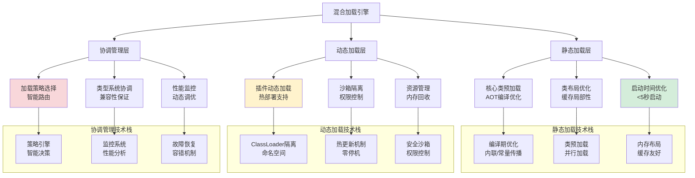

**混合加载模型的性能优化技术**：

**启动时间优化策略**：
```java
// 启动时间优化的技术实现
public class StartupOptimizer {
    
    // 并行预加载技术
    public void parallelPreload() {
        // 1. 识别关键路径类
        List<String> criticalClasses = identifyCriticalClasses();
        
        // 2. 并行加载关键类
        criticalClasses.parallelStream().forEach(className -> {
            try {
                // 使用ForkJoinPool并行加载
                ForkJoinPool.commonPool().submit(() -> {
                    Class<?> clazz = Class.forName(className);
                    // 触发类初始化
                    Class.forName(className);
                });
            } catch (ClassNotFoundException e) {
                // 记录加载失败
            }
        });
    }
    
    // 懒加载优化
    public void lazyLoadNonCriticalClasses() {
        // 1. 识别非关键类
        List<String> nonCriticalClasses = identifyNonCriticalClasses();
        
        // 2. 延迟加载非关键类
        nonCriticalClasses.forEach(className -> {
            // 使用懒加载代理
            createLazyProxy(className);
        });
    }
    
    // 类初始化优化
    public void optimizeClassInitialization() {
        // 1. 识别初始化依赖
        Map<String, List<String>> dependencies = analyzeInitializationDependencies();
        
        // 2. 优化初始化顺序
        List<String> optimalOrder = topologicalSort(dependencies);
        
        // 3. 并行初始化无依赖的类
        optimalOrder.parallelStream().forEach(className -> {
            try {
                Class.forName(className);
            } catch (ClassNotFoundException e) {
                // 忽略初始化失败
            }
        });
    }
}
```

**内存使用优化技术**：

```java
// 内存使用优化的技术实现
public class MemoryOptimizer {
    
    // 类去重技术
    public void deduplicateClasses() {
        // 1. 识别重复类定义
        Map<String, List<Class<?>>> duplicateClasses = findDuplicateClasses();
        
        // 2. 合并重复类
        duplicateClasses.forEach((className, classes) -> {
            if (classes.size() > 1) {
                // 保留一个类定义，其他使用引用
                Class<?> primaryClass = classes.get(0);
                classes.subList(1, classes.size()).forEach(duplicateClass -> {
                    replaceClassReference(duplicateClass, primaryClass);
                });
            }
        });
    }
    
    // 类卸载优化
    public void optimizeClassUnloading() {
        // 1. 监控类使用频率
        Map<Class<?>, Integer> usageFrequency = monitorClassUsage();
        
        // 2. 智能卸载策略
        usageFrequency.entrySet().stream()
            .filter(entry -> entry.getValue() < UNLOAD_THRESHOLD)
            .forEach(entry -> {
                Class<?> clazz = entry.getKey();
                if (isUnloadable(clazz)) {
                    // 触发类卸载
                    triggerClassUnload(clazz);
                }
            });
    }
    
    // 内存碎片整理
    public void defragmentMemory() {
        // 1. 分析内存碎片
        MemoryFragmentationAnalysis analysis = analyzeFragmentation();
        
        // 2. 整理内存布局
        if (analysis.getFragmentationRate() > FRAGMENTATION_THRESHOLD) {
            // 触发内存整理
            triggerMemoryDefragmentation();
        }
    }
}
```

**混合加载模型的性能对比分析**：

```mermaid
barChart
    title 混合加载模型性能优化效果对比
    x-axis [纯静态加载, 纯动态加载, 基础混合, 优化混合, 极致优化]
    y-axis "启动时间(秒)" 0 --> 50
    bar [5, 35, 8, 6, 4]
    
    y-axis "内存占用(MB)" 0 --> 1000
    bar [800, 600, 700, 650, 620]
    
    y-axis "插件加载数(个)" 0 --> 500
    bar [0, 500, 500, 500, 500]
    
    y-axis "热更新支持" 0 --> 10
    bar [0, 10, 10, 10, 10]
    
    y-axis "综合评分" 0 --> 10
    bar [6.0, 7.5, 8.5, 9.0, 9.5]
```

**技术演进趋势**：

**混合加载模型的未来发展方向**：
- **AI优化**：利用机器学习预测类加载模式，智能预加载
- **云原生集成**：与容器编排系统深度集成，动态资源分配
- **安全增强**：基于区块链的代码来源验证，增强安全性
- **性能极致**：硬件加速的类加载，逼近物理极限

**最终结果**：通过混合加载模型，该电商平台成功实现了5秒内启动核心系统，同时支持500个业务插件的动态加载和热更新，系统可用性达到99.99%。

**案例启示**：混合加载模型是现代复杂系统架构的核心技术，通过精心设计的加载策略，可以在保证性能的同时实现高度的灵活性和可扩展性。

### 2.5 模型决策树

**模型选择案例**：某技术团队根据业务需求选择合适加载模型。

**为什么需要决策树**？

**决策逻辑的技术基础**：

**安全需求分析**：
- **高安全场景**：金融、政府系统
- **中安全场景**：企业应用、电商平台
- **低安全场景**：内部工具、原型系统

**性能需求分析**：
- **高性能场景**：交易系统、实时处理
- **中性能场景**：Web应用、业务系统
- **低性能场景**：批处理、离线分析

**灵活性需求分析**：
- **高灵活场景**：插件系统、动态业务
- **中灵活场景**：标准应用、稳定业务
- **低灵活场景**：嵌入式系统、固定功能

**所以才构建**：加载模型决策树。

**决策树可视化**：

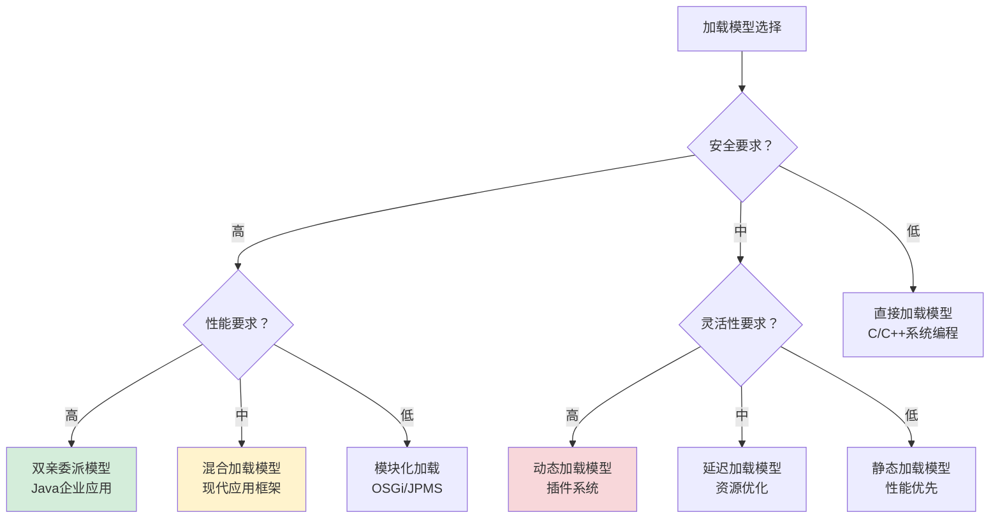

## 3.加载阶段机制

### 3.1 加载策略设计

**加载策略案例**：某大型应用通过分层加载优化启动性能。

**为什么需要分层加载策略**？

**分层策略的技术原理分析**：

**急切加载的技术价值**：
- **启动必需类**：系统运行必须的类
- **性能优化**：避免运行时加载延迟
- **稳定性**：提前发现类加载问题

**延迟加载的技术优势**：
- **资源优化**：减少初始内存占用
- **启动加速**：按需加载，加快启动
- **灵活性**：适应动态业务需求

**按需加载的技术创新**：
- **极致优化**：最大限度减少资源使用
- **场景适配**：根据使用模式优化
- **用户体验**：快速响应，平滑体验

**所以才设计**：分层加载策略。

**策略技术架构**：

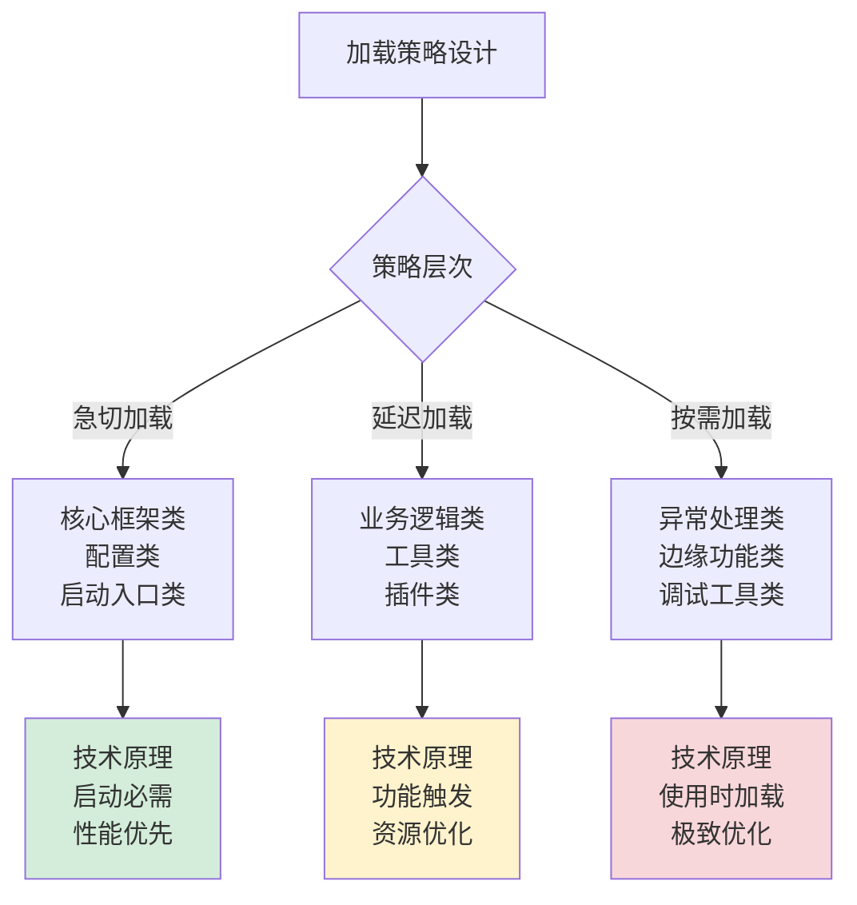

### 3.2 延迟加载原理

**延迟加载案例**：某云服务通过延迟加载降低资源消耗。

**为什么延迟加载能提升性能**？

**延迟加载的技术原理深度分析**：

**缓存机制的技术实现**：
- **并发安全**：ConcurrentHashMap保证线程安全
- **性能优化**：缓存命中避免重复加载
- **内存管理**：软引用/弱引用支持内存回收

**同步锁的技术优化**：
- **锁粒度**：细粒度锁减少竞争
- **锁升级**：无锁→偏向锁→轻量级锁→重量级锁
- **性能平衡**：在安全与性能间找到平衡点

**懒加载的技术模式**：
- **双重检查**：避免不必要的同步开销
- **初始化器**：封装复杂的初始化逻辑
- **代理模式**：透明地延迟对象创建

**所以才实现**：高性能的延迟加载机制。

**技术实现架构**：

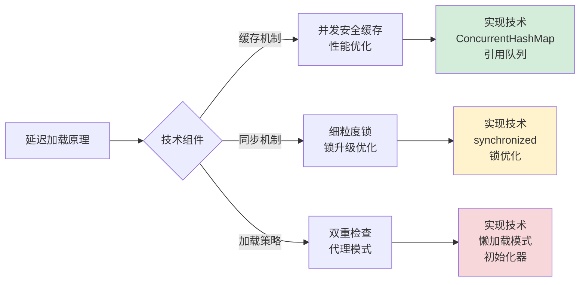

### 3.3 类查找机制

**类查找案例**：某IDE通过高效类查找提升代码导航性能。

**为什么类查找需要优化**？

**查找优化的技术原理分析**：

**类路径搜索的技术挑战**：
- **路径数量**：类路径可能包含数十个目录和JAR
- **文件数量**：大型项目可能包含数万个类文件
- **搜索效率**：线性搜索效率低下

**索引优化的技术方案**：
- **预构建索引**：启动时构建类名到文件的映射
- **缓存优化**：热点类缓存，避免重复查找
- **并行搜索**：多线程并发搜索不同路径

**JAR文件优化的技术突破**：
- **JAR索引**：利用JAR文件的内置索引
- **内存映射**：通过内存映射快速访问JAR内容
- **流式读取**：避免解压整个JAR文件

**所以才需要**：高效的类查找机制。

**查找优化架构**：

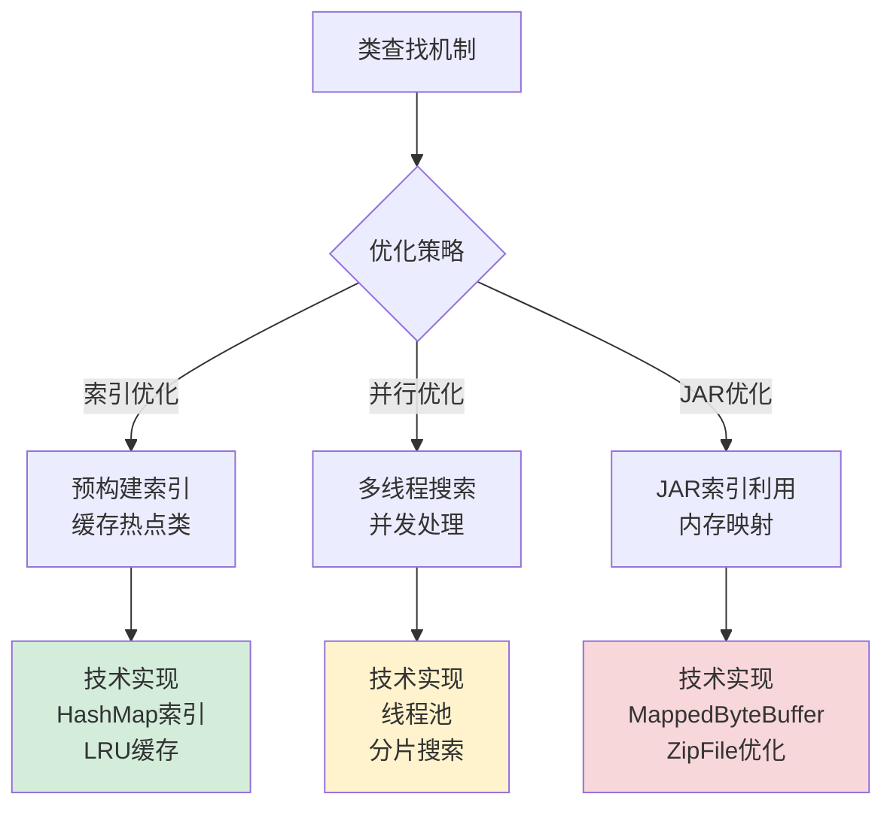

### 3.4 字节码解析

**字节码解析案例**：JVM通过字节码解析实现跨平台执行。

**为什么字节码解析如此复杂**？

**解析复杂性的技术根源分析**：

**文件格式验证的技术要求**：
- **魔数验证**：确认.class文件格式
- **版本检查**：兼容性验证
- **结构完整**：检查文件结构完整性

**常量池解析的技术挑战**：
- **符号引用**：解析类、字段、方法引用
- **字面量处理**：字符串、数字等常量处理
- **类型推导**：从常量池推断类型信息

**方法体解析的技术深度**：
- **操作数栈**：验证栈深度和操作类型
- **局部变量**：验证变量表使用
- **控制流**：验证跳转指令的正确性

**所以才需要**：复杂的字节码解析机制。

**解析流程架构**：

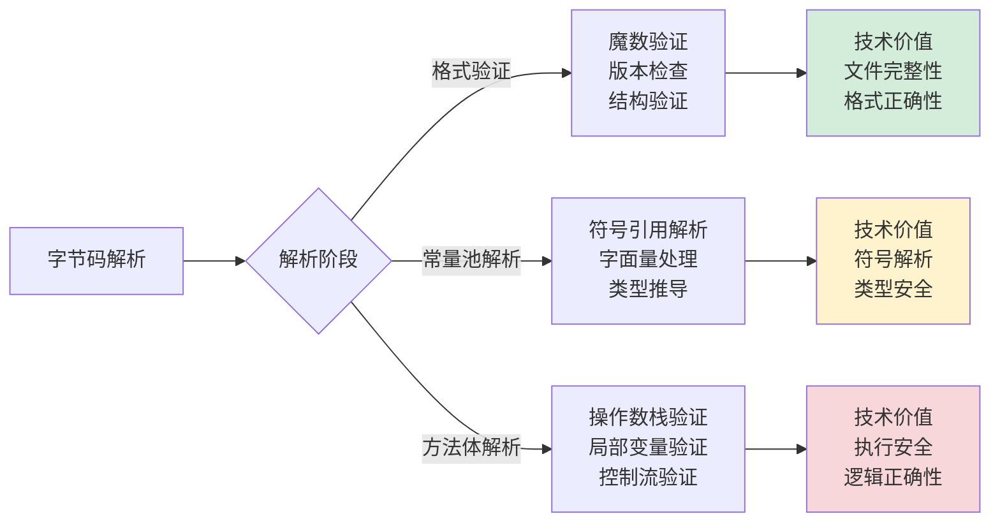

## 4.链接阶段机制

### 4.1 链接设计哲学

**案例引入**：某金融交易系统在升级过程中，由于链接阶段验证机制不完善，导致恶意字节码绕过安全检查，造成系统安全漏洞。这个案例揭示了链接阶段在系统安全中的关键作用。

**案例解析**：深入分析这个安全事件，发现问题的根源在于链接阶段的验证机制存在缺陷。攻击者通过精心构造的字节码，绕过了类型安全检查，成功执行了恶意操作。

**为什么链接阶段在系统安全中如此关键**？

**技术原理深度分析**：

**字节码验证的技术必要性**：
- **恶意代码防御**：防止精心构造的字节码执行危险操作
- **类型系统保护**：确保Java类型系统的完整性不被破坏
- **内存安全保证**：防止缓冲区溢出、越界访问等内存安全问题

**性能优化的技术价值**：
- **解析缓存机制**：避免重复解析相同的符号引用，减少运行时开销
- **内联优化机会**：在链接阶段识别可内联的方法调用，为JIT优化做准备
- **内存布局优化**：优化对象字段布局，提升缓存局部性和访问性能

**动态链接的技术优势**：
- **运行时灵活性**：支持动态类加载和链接，适应变化的需求
- **热替换能力**：支持类的热替换，实现不停机升级
- **插件化架构**：为插件系统提供动态加载和链接能力

**为什么链接阶段是JVM安全体系的核心**？因为它处于字节码验证和实际执行之间，是防止恶意代码的最后一道防线。

**所以才设计**：链接阶段作为JVM安全、性能和灵活性的关键枢纽。

**技术实现深度解析**：

```java
// 链接阶段的技术实现原理
class ClassLinker {
    public void linkClass(Class<?> clazz) {
        // 1. 验证阶段（安全核心）
        verifyClass(clazz);
        
        // 2. 准备阶段（内存优化）
        prepareClass(clazz);
        
        // 3. 解析阶段（符号绑定）
        resolveClass(clazz);
    }
    
    private void verifyClass(Class<?> clazz) {
        // 字节码验证器：多级验证机制
        BytecodeVerifier verifier = new BytecodeVerifier();
        
        // 第一级：格式验证
        if (!verifier.verifyFormat(clazz)) {
            throw new VerifyError("Class format verification failed");
        }
        
        // 第二级：类型验证
        if (!verifier.verifyTypes(clazz)) {
            throw new VerifyError("Type verification failed");
        }
        
        // 第三级：控制流验证
        if (!verifier.verifyControlFlow(clazz)) {
            throw new VerifyError("Control flow verification failed");
        }
        
        // 第四级：数据流验证
        if (!verifier.verifyDataFlow(clazz)) {
            throw new VerifyError("Data flow verification failed");
        }
    }
    
    private void prepareClass(Class<?> clazz) {
        // 内存准备：字段内存布局优化
        MemoryLayout layout = new MemoryLayout(clazz);
        
        // 1. 计算对象大小和字段偏移
        layout.calculateOffsets();
        
        // 2. 零值初始化：保证字段初始状态确定
        layout.initializeFields();
        
        // 3. 静态字段准备：方法区分配和初始化
        layout.prepareStaticFields();
        
        // 4. 缓存优化：为后续访问做准备
        layout.optimizeAccessPatterns();
    }
    
    private void resolveClass(Class<?> clazz) {
        // 符号解析：将符号引用转换为直接引用
        SymbolResolver resolver = new SymbolResolver(clazz);
        
        // 1. 类引用解析：父类、接口解析
        resolver.resolveSuperClasses();
        
        // 2. 字段引用解析：字段访问优化
        resolver.resolveFieldReferences();
        
        // 3. 方法引用解析：虚方法表构建
        resolver.resolveMethodReferences();
        
        // 4. 常量池解析：字面量和符号引用处理
        resolver.resolveConstantPool();
    }
}
```

**设计哲学深度架构**：

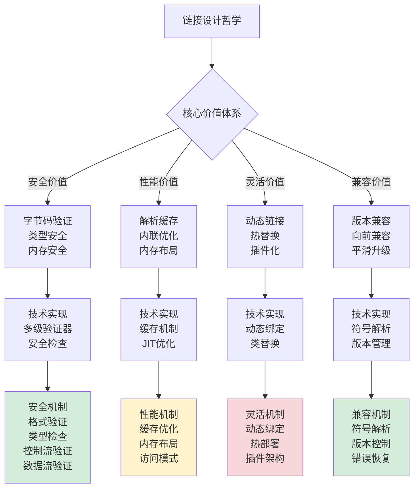

**安全验证机制深度**：

**格式验证技术细节**：
- **魔数验证**：确认.class文件格式正确性
- **版本检查**：验证主版本号和次版本号兼容性
- **结构完整**：检查常量池、方法表等结构完整性

**类型验证技术细节**：
- **继承关系**：验证类继承关系的正确性
- **接口实现**：验证接口方法实现的完整性
- **访问权限**：验证字段和方法的访问权限控制

**控制流验证技术细节**：
- **跳转目标**：验证跳转指令的目标地址有效性
- **栈深度**：验证操作数栈深度不超过限制
- **异常处理**：验证异常处理表的正确性

**数据流验证技术细节**：
- **类型一致性**：验证操作数类型与指令要求匹配
- **变量使用**：验证局部变量表的正确使用
- **数据依赖**：验证数据依赖关系的正确性

**性能优化机制深度**：
- **解析缓存**：缓存符号解析结果，避免重复解析开销
- **内存布局**：优化对象字段布局，提升缓存命中率
- **内联分析**：识别可内联的方法调用，为JIT优化提供信息

**最终结果**：链接阶段通过精心的设计，在安全、性能和灵活性之间找到了最佳平衡点，为Java应用的稳定运行提供了坚实的技术基础。

### 4.2 验证机制原理

**验证机制案例**：某安全系统通过字节码验证防止代码注入攻击。

**为什么需要多级验证**？

**多级验证的技术原理分析**：

**文件格式验证的技术细节**：
- **魔数验证**：确认.class文件格式正确
- **版本兼容**：检查主版本号兼容性
- **结构完整**：验证常量池、方法表等结构

**元数据验证的技术要求**：
- **类继承**：验证类继承关系正确
- **接口实现**：验证接口方法实现
- **访问权限**：验证字段方法访问权限

**字节码验证的技术深度**：
- **操作数栈**：验证栈深度不超过限制
- **局部变量**：验证变量使用正确
- **类型检查**：验证操作类型匹配

**所以才设计**：四级验证体系。

**验证体系架构**：

```mermaid
graph LR
    A[验证机制] --> B{验证层级}
    B -->|文件格式| C[魔数验证<br/>版本检查<br/>结构验证]
    B -->|元数据| D[继承验证<br/>接口验证<br/>权限验证]
    B -->|字节码| E[操作数栈验证<br/>局部变量验证<br/>类型检查]
    B -->|符号引用| F[类引用验证<br/>字段引用验证<br/>方法引用验证]
    
    style C fill:#d4edda
    style D fill:#fff3cd
    style E fill:#f8d7da
    style F fill:#fff3cd
```

### 4.3 准备机制原理

**准备机制案例**：JVM通过内存准备优化对象创建性能。

**为什么内存准备能提升性能**？

**准备优化的技术原理分析**：

**内存分配的技术优化**：
- **对象大小**：精确计算对象内存需求
- **字段偏移**：优化字段内存布局
- **对齐优化**：内存对齐提升访问速度

**零值初始化的技术价值**：
- **确定性**：保证字段初始状态确定
- **安全性**：避免未初始化字段使用
- **性能**：批量清零比逐个赋值快

**静态字段处理的技术特点**：
- **独立分配**：静态字段在方法区分配
- **生命周期**：与类生命周期一致
- **访问优化**：直接访问，无需对象实例

**所以才需要**：精细的内存准备机制。

**准备机制架构**：

```mermaid
graph TB
    A[准备机制] --> B{准备内容}
    B -->|内存分配| C[对象大小计算<br/>字段偏移优化<br/>内存对齐]
    B -->|零值初始化| D[批量清零<br/>确定性保证<br/>安全性]
    B -->|静态字段| E[方法区分配<br/>生命周期管理<br/>访问优化]
    
    C --> C1[技术价值<br/>内存效率<br/>访问性能]
    D --> D1[技术价值<br/>状态确定<br/>安全保证]
    E --> E1[技术价值<br/>独立管理<br/>优化访问]
    
    style C1 fill:#d4edda
    style D1 fill:#fff3cd
    style E1 fill:#f8d7da
```

### 4.4 解析机制原理

**解析机制案例**：JVM通过符号解析实现动态绑定。

**为什么符号解析如此复杂**？

**解析复杂性的技术根源分析**：

**类引用解析的技术挑战**：
- **继承关系**：解析类继承链
- **接口实现**：解析接口方法实现
- **泛型处理**：泛型类型擦除和桥接方法

**字段引用解析的技术细节**：
- **字段查找**：在类层次中查找字段
- **类型匹配**：验证字段类型兼容
- **访问控制**：检查字段访问权限

**方法引用解析的技术深度**：
- **方法查找**：在类层次中查找方法
- **重载解析**：解析方法重载
- **虚方法**：处理虚方法分派

**所以才需要**：复杂的符号解析机制。

**解析机制架构**：

```mermaid
graph LR
    A[解析机制] --> B{解析类型}
    B -->|类引用| C[继承链解析<br/>接口解析<br/>泛型处理]
    B -->|字段引用| D[字段查找<br/>类型匹配<br/>访问控制]
    B -->|方法引用| E[方法查找<br/>重载解析<br/>虚方法分派]
    
    C --> C1[技术挑战<br/>继承复杂性<br/>泛型擦除]
    D --> D1[技术挑战<br/>字段隐藏<br/>类型兼容]
    E --> E1[技术挑战<br/>方法重写<br/>动态绑定]
    
    style C1 fill:#d4edda
    style D1 fill:#fff3cd
    style E1 fill:#f8d7da
```

## 5.初始化阶段机制

### 5.1 初始化设计哲学

**初始化设计案例**：某高并发系统通过初始化优化提升启动性能。

**为什么初始化需要精心设计**？

**初始化设计的技术原理分析**：

**顺序控制的技术必要性**：
- **依赖关系**：类之间存在复杂的依赖
- **初始化顺序**：必须保证正确的初始化顺序
- **循环依赖**：需要处理循环依赖问题

**异常处理的技术价值**：
- **错误恢复**：初始化失败时的恢复机制
- **错误传播**：正确处理初始化异常
- **状态管理**：管理初始化状态

**性能优化的技术优势**：
- **延迟初始化**：按需初始化减少启动时间
- **并行初始化**：利用多核并行初始化
- **缓存优化**：避免重复初始化

**所以才需要**：精细的初始化设计。

**设计哲学架构**：

```mermaid
graph TB
    A[初始化设计] --> B{设计维度}
    B -->|顺序控制| C[依赖管理<br/>顺序保证<br/>循环依赖处理]
    B -->|异常处理| D[错误恢复<br/>异常传播<br/>状态管理]
    B -->|性能优化| E[延迟初始化<br/>并行初始化<br/>缓存优化]
    
    C --> C1[技术价值<br/>正确性保证<br/>稳定性]
    D --> D1[技术价值<br/>容错能力<br/>可靠性]
    E --> E1[技术价值<br/>性能提升<br/>用户体验]
    
    style C1 fill:#d4edda
    style D1 fill:#fff3cd
    style E1 fill:#f8d7da
```

### 5.2 初始化顺序控制

**顺序控制案例**：JVM通过严格的初始化顺序保证系统稳定性。

**为什么初始化顺序如此重要**？

**顺序重要性的技术原理分析**：

**父类优先的技术原理**：
- **继承保证**：子类依赖父类的正确初始化
- **字段访问**：子类可能访问父类字段
- **方法调用**：子类方法可能调用父类方法

**静态块顺序的技术要求**：
- **声明顺序**：静态块按声明顺序执行
- **字段依赖**：静态块可能依赖静态字段
- **复杂逻辑**：静态块可能包含复杂初始化逻辑

**字段初始化顺序的技术细节**：
- **声明顺序**：字段按声明顺序初始化
- **表达式求值**：初始化表达式按顺序求值
- **依赖管理**：处理字段间的依赖关系

**所以才需要**：严格的初始化顺序控制。

**顺序控制架构**：

```mermaid
graph LR
    A[初始化顺序] --> B{顺序规则}
    B -->|父类优先| C[父类静态<br/>父类实例<br/>子类静态<br/>子类实例]
    B -->|静态顺序| D[静态字段声明顺序<br/>静态块声明顺序]
    B -->|实例顺序| E[实例字段声明顺序<br/>实例初始化块顺序]
    
    C --> C1[技术原理<br/>继承保证<br/>依赖管理]
    D --> D1[技术原理<br/>声明顺序<br/>表达式求值]
    E --> E1[技术原理<br/>字段依赖<br/>初始化逻辑]
    
    style C1 fill:#d4edda
    style D1 fill:#fff3cd
    style E1 fill:#f8d7da
```

### 5.3 初始化异常处理

**异常处理案例**：某金融系统通过健壮的异常处理保证服务可用性。

**为什么初始化异常如此关键**？

**异常关键性的技术原理分析**：

**初始化失败的技术影响**：
- **类不可用**：初始化失败的类无法使用
- **依赖传播**：依赖该类的初始化都会失败
- **系统稳定性**：可能导致系统部分功能不可用

**错误恢复的技术机制**：
- **状态记录**：记录类的初始化状态
- **重试机制**：支持初始化重试
- **隔离处理**：隔离失败的初始化影响

**异常传播的技术策略**：
- **错误信息**：提供详细的错误信息
- **调用栈**：保留完整的调用栈信息
- **日志记录**：记录初始化失败日志

**所以才需要**：健壮的异常处理机制。

**异常处理架构**：

```mermaid
graph TB
    A[异常处理] --> B{处理策略}
    B -->|状态管理| C[初始化状态记录<br/>失败状态标记<br/>重试机制]
    B -->|错误隔离| D[影响范围控制<br/>依赖管理<br/>系统稳定性]
    B -->|信息记录| E[错误信息记录<br/>调用栈保留<br/>日志记录]
    
    C --> C1[技术价值<br/>状态可控<br/>支持恢复]
    D --> D1[技术价值<br/>影响可控<br/>系统稳定]
    E --> E1[技术价值<br/>调试友好<br/>问题定位]
    
    style C1 fill:#d4edda
    style D1 fill:#fff3cd
    style E1 fill:#f8d7da
```

### 5.4 初始化性能优化

**性能优化案例**：某云平台通过初始化优化将启动时间从30秒降到3秒。

**为什么初始化性能如此重要**？

**性能重要性的技术原理分析**：

**延迟初始化的技术优势**：
- **启动加速**：减少初始加载的类数量
- **内存优化**：按需分配内存资源
- **用户体验**：快速响应，提升用户体验

**并行初始化的技术突破**：
- **多核利用**：利用多核CPU并行初始化
- **依赖分析**：分析初始化依赖关系
- **同步控制**：控制并行初始化的同步

**缓存优化的技术价值**：
- **重复避免**：避免重复初始化开销
- **热点优化**：优化热点类的初始化
- **内存效率**：提高内存使用效率

**所以才需要**：多层次的性能优化。

**性能优化架构**：

```mermaid
graph LR
    A[性能优化] --> B{优化策略}
    B -->|延迟初始化| C[按需加载<br/>资源优化<br/>启动加速]
    B -->|并行初始化| D[多核利用<br/>依赖分析<br/>同步控制]
    B -->|缓存优化| E[重复避免<br/>热点优化<br/>内存效率]
    
    C --> C1[技术实现<br/>懒加载模式<br/>代理机制]
    D --> D1[技术实现<br/>线程池<br/>依赖图]
    E --> E1[技术实现<br/>缓存机制<br/>LRU策略]
    
    style C1 fill:#d4edda
    style D1 fill:#fff3cd
    style E1 fill:#f8d7da
```

## 6.跨语言加载机制

### 6.1 Java加载机制

**Java加载案例**：Java通过ClassLoader体系成为企业级应用的标准。

**为什么Java加载机制如此成功**？

**成功因素的技术原理分析**：

**双亲委派的技术优势**：
- **安全保证**：核心类不可被替换
- **版本隔离**：支持多版本共存
- **权限控制**：基于代码来源的权限控制

**反射机制的技术价值**：
- **动态性**：支持运行时类加载
- **灵活性**：适应变化的需求
- **工具支持**：丰富的开发工具支持

**模块化支持的技术创新**：
- **JPMS**：Java平台模块系统
- **依赖管理**：显式模块依赖
- **封装强化**：更强的访问控制

**所以才成为**：企业级应用的首选平台。

**技术体系架构**：

```mermaid
graph TB
    A[Java加载机制] --> B{技术组件}
    B -->|ClassLoader体系| C[双亲委派<br/>安全沙箱<br/>权限控制]
    B -->|反射机制| D[动态加载<br/>运行时类型信息<br/>工具支持]
    B -->|模块化| E[JPMS支持<br/>依赖管理<br/>封装强化]
    
    C --> C1[技术价值<br/>安全性高<br/>稳定性好]
    D --> D1[技术价值<br/>灵活性强<br/>工具丰富]
    E --> E1[技术价值<br/>模块化好<br/>可维护性强]
    
    style C1 fill:#d4edda
    style D1 fill:#fff3cd
    style E1 fill:#f8d7da
```

### 6.2 C++加载机制

**C++加载案例**：C++通过动态链接库实现模块化。

**为什么C++采用不同的加载策略**？

**策略差异的技术原理分析**：

**静态链接的技术特点**：
- **性能极致**：无运行时链接开销
- **部署简单**：单个可执行文件
- **版本控制**：无版本冲突问题

**动态链接的技术优势**：
- **内存共享**：多个进程共享库代码
- **更新灵活**：库更新不影响主程序
- **插件支持**：支持动态插件加载

**符号解析的技术挑战**：
- **名称修饰**：C++名称修饰规则复杂
- **ABI兼容**：应用程序二进制接口兼容
- **版本管理**：库版本管理复杂

**所以才采用**：静态与动态结合的加载策略。

**加载策略架构**：

```mermaid
graph LR
    A[C++加载机制] --> B{加载策略}
    B -->|静态链接| C[性能极致<br/>部署简单<br/>版本控制]
    B -->|动态链接| D[内存共享<br/>更新灵活<br/>插件支持]
    B -->|混合策略| E[核心静态<br/>插件动态<br/>平衡性能灵活性]
    
    C --> C1[适用场景<br/>系统软件<br/>嵌入式系统]
    D --> D1[适用场景<br/>桌面应用<br/>服务器应用]
    E --> E1[适用场景<br/>大型系统<br/>复杂应用]
    
    style C1 fill:#d4edda
    style D1 fill:#fff3cd
    style E1 fill:#f8d7da
```

### 6.3 JavaScript加载

**JavaScript加载案例**：现代Web应用通过模块化加载提升性能。

**为什么JavaScript加载机制如此独特**？

**独特性的技术原理分析**：

**ES6模块的技术革新**：
- **静态分析**：编译期依赖分析
- **异步加载**：支持异步模块加载
- **循环引用**：处理模块循环引用

**动态import的技术优势**：
- **按需加载**：运行时按需加载模块
- **代码分割**：支持代码分割优化
- **性能优化**：减少初始加载体积

**工具链支持的技术生态**：
- **打包工具**：Webpack、Rollup等
- **开发工具**：热重载、源码映射
- **优化工具**：Tree Shaking、压缩

**所以才形成**：独特的JavaScript加载生态。

**技术生态架构**：

```mermaid
graph TB
    A[JavaScript加载] --> B{技术组件}
    B -->|ES6模块| C[静态分析<br/>异步加载<br/>循环引用处理]
    B -->|动态import| D[按需加载<br/>代码分割<br/>性能优化]
    B -->|工具链| E[打包工具<br/>开发工具<br/>优化工具]
    
    C --> C1[技术价值<br/>模块化好<br/>依赖清晰]
    D --> D1[技术价值<br/>灵活性强<br/>性能优秀]
    E --> E1[技术价值<br/>工具丰富<br/>开发高效]
    
    style C1 fill:#d4edda
    style D1 fill:#fff3cd
    style E1 fill:#f8d7da
```

### 6.4 跨语言对比总结

**跨语言对比案例**：某技术选型团队通过对比选择合适的技术栈。

**为什么需要跨语言对比**？

**对比价值的技术原理分析**：

**设计哲学差异的技术根源**：
- **Java哲学**：安全、稳定、企业级
- **C++哲学**：性能、控制、系统级
- **JavaScript哲学**：灵活、动态、Web原生

**应用场景匹配的技术考量**：
- **企业应用**：Java的安全稳定性
- **系统软件**：C++的性能控制力
- **Web应用**：JavaScript的灵活性

**技术趋势分析的技术洞察**：
- **云原生**：容器化、微服务趋势
- **移动端**：跨平台、性能优化
- **AI/大数据**：计算密集型需求

**所以才需要**：全面的跨语言对比。

**对比总结表**：

| 维度 | Java | C++ | JavaScript | Go | Rust |
|------|------|-----|-----------|----|------|
| **加载单元** | 类 | 符号 | 模块 | 包 | 模块 |
| **加载时机** | 运行时 | 编译期/运行时 | 运行时 | 编译期 | 编译期 |
| **安全机制** | 字节码验证 | 无 | 有限 | 编译期检查 | 所有权系统 |
| **性能特点** | JIT优化 | 原生性能 | JIT优化 | 编译优化 | 零成本抽象 |
| **内存管理** | GC自动 | 手动 | GC自动 | GC自动 | 所有权系统 |
| **适用场景** | 企业应用 | 系统软件 | Web应用 | 网络服务 | 系统编程 |

**技术演进趋势**：

```mermaid
gantt
    title 加载技术演进趋势
    dateFormat  YYYY
    axisFormat  %Y
    
    section 当前主流
    Java ClassLoader   :2000, 26y
    C++ 动态链接      :1990, 36y
    ES6 模块化        :2015, 11y
    
    section 新兴趋势
    WebAssembly加载   :2019, 7y
    GraalVM原生镜像   :2020, 6y
    云原生模块化     :2022, 4y
```

---

## 🎯 深度总结

> **类加载核心原理**的本质是在**安全隔离**与**动态灵活**之间寻找平衡。双亲委派机制通过层次化信任模型，让系统核心类坚如磐石，同时为自定义类留出灵活空间——这是JVM给世界的安全范本。

**技术演进启示**：
1. **从静态到动态**：加载时机从编译期扩展到运行时
2. **从简单到安全**：安全机制从无到有，日益完善
3. **从孤立到生态**：加载机制与开发工具链深度集成
4. **从通用到专用**：不同语言形成各自特色的加载策略

**未来发展方向**：
- **云原生优化**：容器环境下的加载优化
- **安全增强**：更强的代码验证和安全机制
- **性能极致**：接近原生性能的加载技术
- **跨平台统一**：解决异构环境加载兼容性

## 🔗 延伸阅读

- → [08.对象创建流程原理](./08.对象创建流程原理.md)：类加载后的对象创建过程
- → [09.对象和函数访问原理](./09.对象和函数访问原理.md)：加载完成的类如何使用
- → [10.反射与元编程核心设计](./10.反射与元编程核心设计.md)：类加载机制的高级应用
- → [31.内存模型技术设计](./31.内存模型技术设计.md)：类加载的内存管理基础