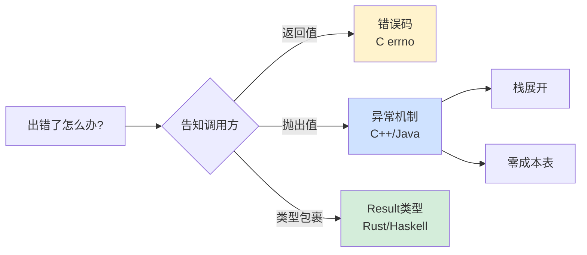
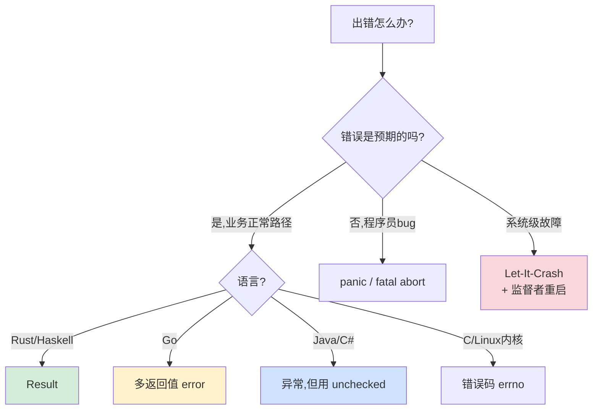

# 2.8 异常机制设计原理

> 📍 **本篇位置**：第 2 卷 · 运行时模型 · 第 8 篇（本卷收束篇）
> 🎯 **核心矛盾**：**"错误"是程序员每天都要面对的事，但"如何处理错误"却是各大语言分歧最大的设计——为什么 C 没有原生异常、C++ 有、Java 强制 checked、Go 拒绝异常、Rust 用类型系统？这背后是一场持续 50 年的哲学战争**
> 🧭 **设计灵魂**：异常机制不是"语法糖"——它是**"非局部跳转 + 栈展开 + 资源清理"的精密协作**。所有"零成本异常"的承诺，本质是把成本压到"罕见的失败路径"，让"常见的成功路径"完全免费
> 🌐 **跨语言覆盖**：C errno · C++ DWARF / SJLJ 异常 · Java checked/unchecked · C# / .NET · Go panic+error · Rust Result · Swift throws · Erlang let-it-crash
> 🔗 **延伸阅读**：← [2.7 反射与元编程核心设计](./2.7.反射与元编程核心设计.md) · ← [2.4 函数调用栈与栈帧设计](./2.4.函数调用栈与栈帧设计.md) · → [3.x 并发错误处理](../03.并发的设计/) · → [5.x RPC 错误传播](../05.交互和系统/)

---

> 程序员每天都在写 `try / catch`，但很少有人停下来追问：**异常机制究竟是怎么实现的？为什么 C 没有原生异常而 C++ 有？为什么"零成本异常"是一种常见的承诺，"零成本"在哪里？为什么 Rust / Go 选择了完全不同的错误处理范式？**
>
> 本章从一次令人崩溃的"异常吞掉"线上事故切入，把异常机制还原成"控制流的非局部跳转 + 栈展开"，并对比几大主流语言的设计选择，理解错误处理的根本权衡。

### 目录介绍
- [00.真实事故引入](#00真实事故引入)
  - [0.1 异常吞掉资金事故](#01-异常吞掉资金事故)
  - [0.2 灵魂三问引出](#02-灵魂三问引出)
  - [0.3 本篇的探索路径](#03-本篇的探索路径)
  - [0.4 为什么这个问题值得讲透](#04-为什么这个问题值得讲透)
- [01.错误处理的三大范式](#01错误处理的三大范式)
  - [1.1 范式 1：错误码（C 风格）](#11-范式-1错误码c-风格)
  - [1.2 范式2：异常机制风格](#12-范式2异常机制风格)
  - [1.3 范式3：Result类型](#13-范式3result类型)
  - [1.4 三大范式对比](#14-三大范式对比)
- [02.异常的底层实现：栈展开](#02异常的底层实现栈展开)
  - [2.1 throw 物理上做了什么](#21-throw-物理上做了什么)
  - [2.2 异常表（exception table）](#22-异常表exception-table)
  - [2.3 析构finally精准触发](#23-析构finally精准触发)
  - [2.4 跨语言边界抛异常的灾难](#24-跨语言边界抛异常的灾难)
- [03.零成本异常的真相](#03零成本异常的真相)
  - [3.1 零成本指的是哪部分零成本](#31-零成本指的是哪部分零成本)
  - [3.2 零成本的物理实现：表驱动](#32-零成本的物理实现表驱动)
  - [3.3 异常路径的真实代价](#33-异常路径的真实代价)
  - [3.4 SJLJ vs 表驱动：两种实现对比](#34-sjlj-vs-表驱动两种实现对比)
  - [3.5 为什么高性能场景禁用异常](#35-为什么高性能场景禁用异常)
  - [3.6 Java异常的特殊代价：堆栈追踪](#36-java异常的特殊代价堆栈追踪)
- [04.Checked vs Unchecked之争](#04checked-vs-unchecked之争)
  - [4.1 Checked 异常的初衷](#41-checked-异常的初衷)
  - [4.2 Checked 异常的实际灾难](#42-checked-异常的实际灾难)
  - [4.3 现代语言的反思](#43-现代语言的反思)
  - [4.4 现代 Java 的实际选择](#44-现代-java-的实际选择)
- [05.Go 与 Rust 的另一种答卷](#05go-与-rust-的另一种答卷)
  - [5.1 Go 的方案：error 是普通值](#51-go-的方案error-是普通值)
  - [5.2 Go panic/recover：逃生通道](#52-go-panicrecover逃生通道)
  - [5.3 Rust方案：Result+?+panic](#53-rust方案resultpanic)
  - [5.4 Rust Result vs Go error](#54-rust-result-vs-go-error)
- [06.Erlang 的"Let It Crash" 哲学](#06erlang-的let-it-crash-哲学)
  - [6.1 不要修复错误，让它崩溃](#61-不要修复错误让它崩溃)
  - [6.2 OTP 的监督树](#62-otp-的监督树)
  - [6.3 Erlang 哲学的现代影响](#63-erlang-哲学的现代影响)
- [07.经典陷阱与生产级反模式](#07经典陷阱与生产级反模式)
  - [7.1 陷阱一：catch吃异常](#71-陷阱一catch吃异常)
  - [7.2 陷阱二：catch 范围太宽](#72-陷阱二catch-范围太宽)
  - [7.3 陷阱三：用异常做控制流](#73-陷阱三用异常做控制流)
  - [7.4 陷阱四：finally return吞异常](#74-陷阱四finally-return吞异常)
  - [7.5 陷阱五：异常链丢失原始堆栈](#75-陷阱五异常链丢失原始堆栈)
  - [7.6 陷阱六：不用try-with-resources](#76-陷阱六不用try-with-resources)
  - [7.7 陷阱七：吞InterruptedException](#77-陷阱七吞interruptedexception)
- [08.一句话总结](#08一句话总结)
  - [8.1 三层认知阶梯](#81-三层认知阶梯)
  - [8.2 错误处理范式选择决策树](#82-错误处理范式选择决策树)
  - [8.3 七字真言](#83-七字真言)
  - [8.4 第 2 卷的收束](#84-第-2-卷的收束)

---

## 00.真实事故引入

### 0.1 异常吞掉资金事故

我曾接手过一个支付对账系统，它每天凌晨从上游取一份对账文件，解析后写入数据库。某天财务报告：**月底对账数据少了 12 万笔**。

排查发现："对账写入"任务**从来没有真正写过数据库**——它跑了 30 天，每天都"看起来成功"，但实际什么也没做。

代码长这样：

```java
public void reconcile(File file) {
    try {
        List<Record> records = parser.parse(file);   // 解析
        for (Record r : records) {
            try {
                dao.insert(r);                       // 数据库写入
            } catch (Exception e) {
                // 静默忽略单条失败
            }
        }
        log.info("Reconciled {} records", records.size());  // 报告成功
    } catch (Exception e) {
        log.warn("Reconciliation issue: {}", e.getMessage());   // 简陋日志
    }
}
```

**根因**：

```
parser.parse(file) 抛出 NumberFormatException（某条记录字段格式变了）
  ↓
被外层 catch (Exception) 吃掉
  ↓
records 是 null，但代码继续执行
  ↓
NullPointerException 又被外层 catch 吃掉
  ↓
log.warn 输出 "Reconciliation issue: null"
  ↓
监控系统看到 ERROR 级别没有触发，认为正常
  ↓
30 天每天都这样，业务方完全不知情
```

**修复方案不是"修 bug"——是修整套异常处理哲学**：

```java
// ❌ 错误模式
catch (Exception e) {
    log.warn("...", e.getMessage());  // 只打消息，丢掉堆栈
}

// ✅ 正确模式
catch (Exception e) {
    log.error("Reconciliation failed for file {}", file, e);  // 完整堆栈
    monitor.alert(AlertLevel.CRITICAL, "对账失败");
    throw new ReconciliationException(file, e);   // 抛出包装异常
}
```

**这次事故损失 12 万 × 单笔金额 ≈ 数百万**——根因是 **`catch (Exception e) {}`** 这个看似"防御性"的写法，实际上是金融系统最危险的反模式。

### 0.2 灵魂三问引出

这次事故让我反复追问三个问题：

1. **`catch (Exception e)` 在语法上完全合法，为什么实际上是"反人类"的写法？** —— 异常机制的设计意图到底是什么？
2. **Java 的"零成本异常"指的是哪部分零成本？正常运行时是不是真的没开销？** —— 异常机制的物理实现是什么？
3. **Rust 和 Go 都是 21 世纪的新语言，为什么不约而同地"放弃异常"？** —— 异常机制是不是过时了？

如果你能回答这三个问题，你就理解了**为什么"错误处理"是 50 年来最有争议的语言设计话题之一**。

### 0.3 本篇的探索路径



### 0.4 为什么这个问题值得讲透

我想抛三个**几乎所有工程师都答错**的问题：

1. **为什么 Linux 内核绝对禁止使用 C++ 异常？** —— 因为内核栈很小、内核要求确定性时间，异常的栈展开慢且不可预测。
2. **为什么 Rust 区分 `Result` 和 `panic`？** —— Result 是"预期的错误"，panic 是"程序逻辑 bug"。两者完全不同。
3. **为什么 Erlang 的 actor 模型反而欢迎崩溃？** —— "let it crash" 哲学认为重启比修复更可靠。

读完本章你会懂：**错误处理不是"语法选择"——它反映了一个语言对"控制流"和"程序员心智模型"的根本立场**。

---

## 01.错误处理的三大范式

### 1.1 范式 1：错误码（C 风格）

最朴素的方案——**把"出错与否"作为返回值**：

```c
int read_file(const char* path, char* buf, int size) {
    int fd = open(path, O_RDONLY);
    if (fd < 0) return -1;            // ← 错误码
    
    int n = read(fd, buf, size);
    if (n < 0) {
        close(fd);
        return -2;
    }
    
    close(fd);
    return n;
}

// 调用方
int n = read_file("a.txt", buf, 1024);
if (n < 0) {
    fprintf(stderr, "error %d: %s\n", n, strerror(errno));
    return EXIT_FAILURE;
}
```

**优点**：

```
1. 简单：没有任何"魔法"，return 就是 return
2. 可预测：每个调用点都看得到错误处理路径
3. 高效：return 一个 int 几乎零成本
4. 适合系统编程：Linux 内核全部用错误码
```

**缺点**：

```
1. 极易被遗漏：if (n < 0) 这一行很容易忘
2. 信号占用：返回值既要表达"成功结果"又要表达"错误"
3. 错误信息丢失：errno 是全局变量，多线程混乱（要用 errno_r）
4. 不能跨多层函数：每层都要手动检查 + 传递
```

**Linus Torvalds 一直坚持错误码**——他多次在内核邮件列表里痛斥 C++ 异常："**异常是程序员偷懒的借口**"。Linux 内核因此积累了大量 `goto err_unwind` 的清理模式：

```c
int complex_op() {
    int err = 0;
    
    void* a = alloc_a();
    if (!a) return -ENOMEM;
    
    void* b = alloc_b();
    if (!b) { err = -ENOMEM; goto err_free_a; }
    
    void* c = alloc_c();
    if (!c) { err = -ENOMEM; goto err_free_b; }
    
    // ... 业务 ...
    return 0;
    
err_free_b: free(b);
err_free_a: free(a);
    return err;
}
```

**这就是"无异常 RAII"的代价**——大量样板代码，但**每条清理路径都显式可见、可审查**。这正是内核需要的特性。

### 1.2 范式2：异常机制风格

**把"错误"和"正常返回"完全分离**：

```java
public byte[] readFile(String path) throws IOException {
    try (InputStream in = new FileInputStream(path)) {
        return in.readAllBytes();
    }
    // 如果出错，IOException 自动从这里"飞出"
    // 调用方的 try/catch 接住
}

// 调用方
try {
    byte[] data = readFile("a.txt");
    process(data);  // 失败时这里不会执行
} catch (IOException e) {
    log.error("Read failed", e);
}
```

**优点**：

```
1. 正常路径"看起来很干净"——没有错误检查噪音
2. 错误自动向上传播——不用每层手动转发
3. 错误对象携带丰富信息（消息、堆栈、原因链）
4. RAII / try-with-resources 自动清理资源
```

**缺点**：

```
1. "隐藏的控制流"：从代码看不出哪里会抛
2. 异常路径性能差：栈展开慢
3. 跨 ABI 边界灾难：异常无法跨语言（详见 §2.4）
4. 容易滥用：catch (Exception) {} 让错误悄悄消失
```

§0.1 那个事故就是**异常机制最大缺点的体现**——`catch (Exception)` 太容易写出，而它就是"信息黑洞"。

### 1.3 范式3：Result类型

**用类型系统强制处理错误**：

```rust
fn read_file(path: &str) -> Result<Vec<u8>, io::Error> {
    let mut f = File::open(path)?;            // ? 自动传播错误
    let mut buf = Vec::new();
    f.read_to_end(&mut buf)?;
    Ok(buf)
}

// 调用方
match read_file("a.txt") {
    Ok(data) => process(&data),
    Err(e) => eprintln!("read failed: {}", e),
}
```

**核心思想**：错误不是"控制流"——错误是**返回值的一部分，被类型系统严格管理**。

**优点**：

```
1. 编译期保证：忘记处理错误 → 编译失败
2. 控制流可见：所有可能失败的调用都标记 ? 或 match
3. 零运行时开销：Result 编译为简单的标签联合体
4. 没有"非局部跳转"，CPU 友好
```

**缺点**：

```
1. 噪音：每个可能失败的调用都要写 ?
2. 早期阅读门槛高
3. 难以表达"应该永远不发生"的错误（要用 panic）
```

### 1.4 三大范式对比

| 维度 | 错误码 | 异常 | Result |
|---|---|---|---|
| **代表语言** | C, Go (error) | C++, Java, Python, C# | Rust, Haskell, OCaml |
| **正常路径性能** | 一般 | 极快（零开销）| 一般 |
| **错误路径性能** | 一般 | 慢（栈展开） | 一般 |
| **强制处理** | 不强制（可忽略）| 不强制（可吞掉） | 强制（类型系统） |
| **信息丰富度** | 低（一个 int）| 高（堆栈+消息）| 中（值+可选堆栈）|
| **跨 ABI** | 容易 | 困难 | 容易 |
| **可预测性** | 高 | 低（隐式跳转）| 高 |
| **代码噪音** | 高（每次检查）| 低（只在边界）| 中（每次 ?）|

**没有"最好"的范式——只有"最适合场景"的范式**。这是过去 50 年的共识。

---

## 02.异常的底层实现：栈展开

### 2.1 throw 物理上做了什么

```cpp
void deep() {
    File f("a.txt");
    Lock l(mtx);
    throw std::runtime_error("error");   // ← 这一行
}
```

`throw` 这一行 CPU 实际做了：

```
1. 用 __cxa_allocate_exception 分配异常对象
2. 用 __cxa_throw 启动栈展开过程
   - 查找当前帧的"展开信息"（.eh_frame 表）
   - 调用当前帧的析构函数（按"构造的逆序"）
     • 调用 Lock::~Lock()
     • 调用 File::~File()
   - 弹出当前栈帧，返回上一帧
   - 重复，直到找到匹配的 catch 块
3. 跳转到 catch 块的代码
4. 把异常对象作为参数传给 catch
```

**这是一个非常复杂的过程**——它**跨越多个栈帧、调用多个析构函数、查询多张表**。和正常的 `return` 完全不同。

### 2.2 异常表（exception table）

现代 C++ 编译器（GCC, Clang）用 **DWARF 格式的异常表** 实现栈展开：

```
.eh_frame 段（编译器自动生成）：

每个函数都有一个条目：
  起始地址 - 结束地址
  Common Information Entry (CIE)
  Frame Description Entry (FDE)：
    - 栈帧大小、寄存器布局
    - 哪个 PC 范围对应哪个 try 块
    - 每个 try 块的 catch 列表
    - 每个局部对象的析构函数
    - landing pad（catch 入口地址）
```

**关键洞察**：**这张表只在异常发生时才被读取**。正常执行时，CPU 完全感知不到它的存在——这就是"零成本"的物理基础。

### 2.3 析构finally精准触发

考虑：

```cpp
void mid() {
    Lock l1(m1);
    {
        Lock l2(m2);
        throw runtime_error("oops");
    }
    // 这里不会到达
}
```

栈展开器要精确地：

1. 在 throw 时，l2 已构造、l1 已构造
2. **必须先析构 l2，再析构 l1**（构造的逆序）
3. **不能析构那些"还未构造完"的对象**

这要求异常表非常精确——它得告诉栈展开器："**在 PC = X 这一刻，l1 和 l2 都活着；在 PC = Y 这一刻，只有 l1 活着**"。

**编译器的工作**：在每个对象构造点和析构点设立"标签"，把整个函数划分成"区段"，每段对应不同的"活跃对象集合"。栈展开器根据当前 PC 找到对应区段，调用相应析构函数。

**Java 的 finally 是类似机制**：

```java
try {
    risky();
} finally {
    cleanup();   // 无论 risky 是否抛异常都执行
}
```

字节码层面有专门的 **exception table**：

```
exception_table:
  from   to   target   type
  0      6    9        any         <- 任何异常都跳到 9（finally 块）
```

JVM 的栈展开机制和 C++ DWARF 在抽象层面是同一种设计。

### 2.4 跨语言边界抛异常的灾难

如果你写过 JNI 或 Cgo，可能遇到过这个谜题：

```cpp
// C++ 函数被 Java 通过 JNI 调用
extern "C" JNIEXPORT void JNICALL Java_Foo_bar(JNIEnv* env, jobject obj) {
    throw std::runtime_error("oops");   // ★ 异常穿过 JVM 边界
}
```

**结果**：JVM 整体 crash，core dump，**不是 Java 异常**。

**根因**：

```
C++ 异常用 DWARF .eh_frame 表展开
JVM 的栈帧是 JIT 生成的，没有 .eh_frame 注册（或注册的是 JVM 内部的处理器）
栈展开器找不到合适的 catch 块 → terminate() → abort
```

**铁律**：**异常不能跨越语言/ABI 边界**。在 JNI、Cgo、Python C 扩展中，必须在 C/C++ 层 catch 所有异常，转换成对方语言的错误码或异常对象：

```cpp
extern "C" JNIEXPORT void JNICALL Java_Foo_bar(JNIEnv* env, jobject obj) {
    try {
        risky_cpp_call();
    } catch (const std::exception& e) {
        // 转换成 Java 异常
        jclass exClass = env->FindClass("java/lang/RuntimeException");
        env->ThrowNew(exClass, e.what());
    } catch (...) {
        jclass exClass = env->FindClass("java/lang/Error");
        env->ThrowNew(exClass, "unknown C++ error");
    }
}
```

---

## 03.零成本异常的真相

### 3.1 零成本指的是哪部分零成本

**"零成本异常"（Zero-cost exceptions）** 是 C++ 社区常听到的承诺。但它的精确含义是：

> **当异常没有发生时，异常机制的运行时开销为零**。

注意三个限定：

1. **"没有发生时"**——异常发生时绝对不是零成本
2. **"运行时开销"**——编译时间和二进制体积有显著开销
3. **"为零"**——和没有 try/catch 的代码生成的机器码完全一样

### 3.2 零成本的物理实现：表驱动

回顾 §2.2——异常表 .eh_frame 段只在异常发生时被读取。

**没有异常时**：

```assembly
; try 块外面的代码 vs try 块里面的代码
; 编译后的机器码"几乎一模一样"

func:
    push rbp
    mov rbp, rsp
    ; 函数体（无论是否在 try 块里都是这个）
    ; 没有"setjmp"、没有"标记 try 开始"的指令
    pop rbp
    ret

; .eh_frame 段（没异常时不被加载到 cache）：
;   func 的栈帧布局
;   try 块从 PC=10 到 PC=50
;   catch 块的入口在 PC=200
;   ...
```

**结果**：try/catch 在 happy path 上完全免费。

### 3.3 异常路径的真实代价

但**抛出异常时**：

```
1. malloc 异常对象          ~100ns
2. 查 .eh_frame 表（多次）   ~1000ns
3. 调用 N 个析构函数         ~N × 50ns
4. 跨越 N 层栈帧             ~N × 100ns
5. 跳到 catch 块             ~100ns

总计：抛一次异常约 5-50 微秒（视栈深度而定）
```

**对比正常 return**：~5 纳秒。**异常路径慢 1000-10000 倍**。

**实测数据**（Java HotSpot）：

```
普通方法返回：           ~5 ns
return 一个错误码：     ~6 ns
抛出 + catch 异常：     ~5000 ns（不带堆栈）
                      ~50000 ns（带堆栈，Throwable.getStackTrace）
```

**所以异常绝对不能用作"控制流"**——只能用于"罕见错误"。

### 3.4 SJLJ vs 表驱动：两种实现对比

**早期 GCC 用 setjmp/longjmp（SJLJ）实现 C++ 异常**：

```c
// 编译后伪代码
void mid() {
    jmp_buf buf;
    if (setjmp(buf) == 0) {        // ← 进入 try 块时
        push_jmp_handler(&buf);    // 注册到全局链表
        risky();
        pop_jmp_handler();          // 退出时取消注册
    } else {
        // catch 块代码
    }
}
```

**SJLJ 的代价**：

```
正常路径：每次进入 try 都要 setjmp（保存所有寄存器到 buf）
         每次离开 try 都要 pop 全局链表
         → 即使没有异常，每个 try 都要 200-500ns

抛出路径：longjmp（恢复寄存器，跳转）很快
```

**这不是零成本**——它把成本压在了"每次 try"上。

**为什么 SJLJ 还存在？** 因为它**简单**——不需要复杂的 .eh_frame 表，对编译器要求低。**Windows 32 位**长期用 SJLJ；现代 64 位 Linux/macOS/Windows 都用表驱动。

### 3.5 为什么高性能场景禁用异常

**Linux 内核、Google C++ 风格指南、Game 引擎**普遍禁用异常：

**理由 1：栈大小固定**

```
内核栈通常只有 8KB
异常对象本身就要占栈空间
栈展开过程要访问表、调用多个函数 → 栈很快爆
```

**理由 2：要求确定性时间**

```
实时系统（音频、游戏 60fps、机械控制）：
  正常代码可以预测延迟
  异常一旦抛出，延迟可能从 1ns 跳到 100µs
  → 帧率掉到地板
```

**理由 3：二进制体积**

```
.eh_frame 段通常占 10-30% 的最终二进制体积
游戏机、嵌入式设备容量有限
```

**理由 4：跨平台一致性**

```
不同 C++ 实现的异常实现各异（GCC 用 DWARF、MSVC 用 SEH、Apple 用 SjLj）
为了一份代码跑在所有平台上 → 干脆不用异常
```

**Google C++ 风格指南的原话**："异常会让代码难以推理；在我们的代码库里，异常会引入更多 bug 而不是减少。"

### 3.6 Java异常的特殊代价：堆栈追踪

Java 的 `new Throwable()` 默认会**抓取整个调用栈**：

```java
public Throwable() {
    fillInStackTrace();   // 遍历整个栈，记录每一帧的类名/方法名/行号
}
```

**fillInStackTrace** 是 native 方法，单次调用 ~10-30 微秒。**这是 Java 异常比 C++ 异常慢得多的根因**。

**优化技巧**：

```java
// 高频路径用"无堆栈异常"
public class FastException extends Exception {
    @Override
    public synchronized Throwable fillInStackTrace() {
        return this;   // 跳过栈追踪
    }
}

// 或用静态实例（Spring/Netty 内部用）
private static final FastException CACHED = new FastException();
throw CACHED;   // 复用同一个对象
```

**但这违反了异常的初衷**——失去了堆栈信息。**只在极少数高频路径（如响应式框架的内部信号）才用**。

---

## 04.Checked vs Unchecked之争

### 4.1 Checked 异常的初衷

Java 是**唯一一个把"异常类型"加入函数签名"**的主流语言：

```java
// 必须声明 throws，否则编译失败
public byte[] readFile(String path) throws IOException {
    return Files.readAllBytes(Paths.get(path));
}

// 调用方必须 try/catch 或继续 throws
byte[] data = readFile("a.txt");   // 编译错误：unhandled IOException
```

**James Gosling 1995 年的设计意图**：

```
强制程序员"明确思考每个错误如何处理"
让 API 的失败模式作为接口契约的一部分
让编译器帮你检查"是否处理了所有错误"
```

**这是"编译期错误处理保证"**——理论上很美好。

### 4.2 Checked 异常的实际灾难

**问题 1：到处冒泡的样板代码**

```java
public void processFile(String path) throws IOException, ParseException, SQLException {
    String content = readFile(path);    // throws IOException
    Data data = parse(content);          // throws ParseException
    db.save(data);                       // throws SQLException
}

public void processBatch(List<String> paths) throws IOException, ParseException, SQLException {
    for (String p : paths) processFile(p);
}

public void runJob() throws IOException, ParseException, SQLException, InterruptedException {
    processBatch(getFiles());
    Thread.sleep(1000);   // throws InterruptedException
}
```

**调用链每一层都要重复声明 throws**——非常恶心。

**问题 2：Lambda 和函数式接口的灾难**

```java
// Stream.map 接受 Function<T,R>，Function.apply 不能 throws
list.stream()
    .map(s -> Files.readAllBytes(Paths.get(s)))   // ← 编译错误！
    .collect(Collectors.toList());

// 必须包装：
list.stream()
    .map(s -> {
        try {
            return Files.readAllBytes(Paths.get(s));
        } catch (IOException e) {
            throw new UncheckedIOException(e);   // 转成 unchecked
        }
    })
    .collect(Collectors.toList());
```

**Java 8 引入函数式接口后，checked 异常和 Lambda 的兼容性问题彻底暴露**。

**问题 3：程序员 emoji 化"throws Exception"**

```java
public void doWork() throws Exception {  // 偷懒：throws 所有
    ...
}
```

**这等于没声明**——失去了 checked 的全部意义。

**问题 4：吞异常（§0.1 那个事故）**

```java
try {
    risky();
} catch (Exception e) {
    // 什么都不写，让代码编译过
}
```

**Checked 异常的本意是"强制处理"，但实际效果是"强制写代码"——程序员选最简单的"什么都不做"**。

### 4.3 现代语言的反思

**几乎所有 2000 年后的语言都拒绝了 checked 异常**：

| 语言 | Checked 异常 | 理由 |
|---|---|---|
| C++ | 早期 throw spec，C++17 完全废弃 | 实际维护负担 > 收益 |
| C# | 没有 | Anders Hejlsberg："Java 的 checked 是失败的实验" |
| Python | 没有 | 简洁优于显式 |
| Kotlin | 没有 | 兼容 Java，但内部不强制 |
| Scala | 没有 | 函数式风格用 Try / Either |
| Swift | 有但简化（throws，不细分类型）| Apple 的折中 |

**Anders Hejlsberg（C# 设计者）2003 年访谈**：

> "Throws 子句在小型程序里很美好，但放到大型项目里就崩溃了——它把你的接口和'实现细节'紧紧绑定。如果一个方法新加了一个调用，throws 列表就要改，所有调用方都要改——这是个连锁反应灾难。"

### 4.4 现代 Java 的实际选择

主流 Java 项目（Spring、Netty）的实践：

```java
// 几乎所有自定义异常都继承 RuntimeException（unchecked）
public class BusinessException extends RuntimeException { ... }

// 或者把 checked 包装成 unchecked
catch (IOException e) {
    throw new UncheckedIOException(e);
}
```

**Spring 的核心准则**："**让 SQLException、IOException 等 checked 异常停留在 framework 层，业务层只用 unchecked**。"

**这是 Java 社区对 Gosling 原始设计的事实背叛**——但工程上是正确的选择。

---

## 05.Go 与 Rust 的另一种答卷

§0.2 第三题。**为什么 21 世纪两大新语言都"放弃"了异常？**

### 5.1 Go 的方案：error 是普通值

Go 的核心理念："**错误是值，不是控制流**"。

```go
func readFile(path string) ([]byte, error) {
    f, err := os.Open(path)
    if err != nil {
        return nil, err
    }
    defer f.Close()
    
    return io.ReadAll(f)
}

// 调用方
data, err := readFile("a.txt")
if err != nil {
    log.Printf("read failed: %v", err)
    return
}
process(data)
```

**Go 的设计哲学**：

```
1. error 是最普通的接口：interface { Error() string }
2. 多返回值让"结果+错误"自然表达
3. defer 提供资源清理（替代析构函数）
4. 强制 if err != nil 检查 → 错误处理可见
```

**优点**：

```
+ 控制流完全显式
+ 没有"非局部跳转"
+ 编译简单
+ 错误可以加上业务上下文（fmt.Errorf("processing %s: %w", path, err)）
```

**缺点**：

```
- 大量 if err != nil 噪音
- 容易忘记包装错误（丢失上下文）
- 不强制处理（编译器不报错）
```

**Rob Pike（Go 创始人之一）的观点**："**编程语言不应该把错误处理隐藏起来——错误处理就是程序的一部分，应该和正常逻辑同等可见**。"

### 5.2 Go panic/recover：逃生通道

但 Go 并没有完全抛弃异常机制——它保留了 `panic` 和 `recover`：

```go
func safe() (result string, err error) {
    defer func() {
        if r := recover(); r != nil {
            err = fmt.Errorf("panic: %v", r)
        }
    }()
    
    risky()  // 可能 panic
    return "ok", nil
}
```

**panic 的设计哲学**：

```
panic 不是"异常机制" —— 它是"程序无法继续"的信号
适用场景：
  - 不可能出现的状态（assertion failure）
  - 程序员 bug（nil pointer dereference）
  - 初始化失败

正常错误绝对不要用 panic
panic 应该一路传播到顶层并 crash —— recover 是"最后的捕网"
```

**对比 Java 异常**：

| 维度 | Go panic | Java exception |
|---|---|---|
| **设计意图** | 程序无法继续 | 任何错误情形 |
| **使用频率** | 极少（一年用几次） | 频繁（业务错误也用） |
| **栈展开** | 是 | 是 |
| **跨边界** | 在 goroutine 内传播 | 在线程内传播 |

### 5.3 Rust方案：Result+?+panic

Rust 是更激进的"类型化错误"派：

```rust
// 普通错误：用 Result
fn read_file(path: &str) -> Result<Vec<u8>, io::Error> {
    let mut f = File::open(path)?;          // ? 自动传播
    let mut buf = Vec::new();
    f.read_to_end(&mut buf)?;
    Ok(buf)
}

// 程序员 bug：用 panic!
fn divide(a: i32, b: i32) -> i32 {
    if b == 0 {
        panic!("division by zero");          // 这是 bug，不是错误
    }
    a / b
}
```

**Rust 的关键创新**：

**`?` 运算符**——一个字符替代了 Go 的 `if err != nil { return err }`：

```rust
let f = File::open(path)?;
// 等价于：
let f = match File::open(path) {
    Ok(v) => v,
    Err(e) => return Err(e.into()),
};
```

**类型系统的双重强制**：

```rust
let result = read_file("a.txt");
// result 是 Result<Vec<u8>, io::Error>
// 不能直接 .len()——必须 match 或 unwrap

result.len()    // ❌ 编译错误：Result 没有 len 方法
result?.len()   // ✅ 用 ? 解包（错误自动传播）
result.unwrap().len()   // ⚠️ 错误时直接 panic
```

**这就是 Rust 安全的核心**——**编译器强制你思考每个错误**。

### 5.4 Rust Result vs Go error

| 维度 | Go error | Rust Result |
|---|---|---|
| **类型化** | error 是统一接口 | Result<T, E> 错误类型可特化 |
| **编译期强制** | 不强制（可以忽略返回值）| 强制（unused Result 警告 / 编译错误）|
| **传播** | if err != nil 显式 | ? 简洁 |
| **组合** | 难以组合 | Result 实现了 Monad，可链式调用 |
| **零运行时开销** | 是 | 是 |

**两种设计的根本差异**：

```
Go：相信程序员，提供简单工具
Rust：不相信程序员，让编译器把关
```

**这反映了不同的工程哲学**——Go 是"实用主义+经验"，Rust 是"形式化+静态保证"。

---

## 06.Erlang 的"Let It Crash" 哲学

最反直觉的错误处理哲学来自 **Erlang**——电信级容错系统的奠基者。

### 6.1 不要修复错误，让它崩溃

Erlang 的设计原则：

```
1. 别试图在出错的进程里修复错误
2. 让错误进程立即崩溃
3. 用监督者（Supervisor）重启它
4. 用最干净的初始状态恢复
```

**为什么？** Joe Armstrong（Erlang 之父）的论证：

> 一个进程进入了"未预期的状态"——这意味着你的代码逻辑出了 bug。在这个状态下试图"恢复"只会让事情变得更糟（变量损坏、共享状态污染、资源泄漏）。**最干净的方法是：扔掉这个进程，启动一个全新的**。

### 6.2 OTP 的监督树

```
            Root Supervisor
           /              \
      WebSupervisor    DBSupervisor
       /     \          /        \
    Worker  Worker    Pool      Cache
    
任何 Worker 崩溃 → 它的 Supervisor 重启它
Supervisor 崩溃 → 上级 Supervisor 重启它（连同所有子进程）
重启策略：
  one_for_one      只重启崩溃的一个
  one_for_all      重启所有兄弟
  rest_for_one     重启崩溃的及其后启动的
```

**这就是 WhatsApp 用 200 台服务器扛住 4 亿用户的秘诀**——单进程崩溃几毫秒就能恢复，对外表现为"完全可用"。

### 6.3 Erlang 哲学的现代影响

**Akka（Scala/Java）**：直接照搬 Erlang OTP，actor 模型 + 监督树。
**Kubernetes**：Pod 重启策略本质上是"let-it-crash"在容器编排上的实现——容器健康检查失败 → kill → 重启。
**Rust 的 panic + thread restart**：Web 服务一个请求 panic 不会拖垮整个进程。
**微服务的"快速失败 + 重试"**：每个服务都可以崩溃，只要能快速重启。

**这是一种"系统级"的容错思想**——**单个组件的可靠性不重要，系统整体能恢复才重要**。

---

## 07.经典陷阱与生产级反模式

### 7.1 陷阱一：catch吃异常

**铁律**：**永远不要 catch 后什么都不做**。至少要 log + 抛出包装异常。

```java
// ❌ 致命
try { ... } catch (Exception e) { }

// ❌ 一般差
try { ... } catch (Exception e) { 
    log.warn(e.getMessage());   // 没堆栈
}

// ✅ 正确
try { ... } catch (Exception e) {
    log.error("operation X failed", e);   // 完整堆栈
    throw new BusinessException("X failed", e);
}
```

### 7.2 陷阱二：catch 范围太宽

```java
// ❌ 只想 catch IOException，结果连 NullPointerException 都吞了
try {
    file.read();
    user.process();   // NPE 也被吞
} catch (Exception e) {
    log.error("io issue");
}

// ✅ 精确 catch
try {
    file.read();
} catch (IOException e) {
    log.error("read failed", e);
}
user.process();   // NPE 不会被吞
```

### 7.3 陷阱三：用异常做控制流

```java
// ❌ 极差
public boolean isInteger(String s) {
    try {
        Integer.parseInt(s);
        return true;
    } catch (NumberFormatException e) {
        return false;   // 抛/接异常成本巨大
    }
}

// ✅ 用条件判断
public boolean isInteger(String s) {
    if (s == null || s.isEmpty()) return false;
    for (int i = 0; i < s.length(); i++) {
        char c = s.charAt(i);
        if (!Character.isDigit(c) && !(i == 0 && c == '-')) return false;
    }
    return true;
}
```

**异常路径慢 1000 倍**——大量调用 isInteger 时，第一种实现会让 CPU 烤焦。

### 7.4 陷阱四：finally return吞异常

```java
public int risky() {
    try {
        throw new RuntimeException("oops");
    } finally {
        return 42;   // ★ finally 的 return 把异常吞了！返回 42
    }
}
```

**Java 特性**：finally 块的 return / break / continue 会**取消**主块的异常和返回。

**修复**：永远不要在 finally 里 return / break / continue。

### 7.5 陷阱五：异常链丢失原始堆栈

```java
// ❌ 丢失原因
try {
    risky();
} catch (IOException e) {
    throw new BusinessException("oops");   // 没传 e
}

// ✅ 保留原因链
catch (IOException e) {
    throw new BusinessException("oops", e);
}
```

**异常链是排查的命脉**——丢了 cause 等于丢了所有。

### 7.6 陷阱六：不用try-with-resources

```java
// ❌ 老代码
InputStream in = null;
try {
    in = new FileInputStream(path);
    // ...
} finally {
    if (in != null) in.close();   // close 也可能抛异常，吞掉主异常
}

// ✅ Java 7+
try (InputStream in = new FileInputStream(path)) {
    // ...
}   // 自动 close，且正确处理"主异常 vs close 异常"的优先级
```

### 7.7 陷阱七：吞InterruptedException

```java
// ❌ 致命：丢失中断信号
try {
    Thread.sleep(1000);
} catch (InterruptedException e) {
    log.warn("interrupted");   // 没恢复中断标志
}

// ✅ 正确
try {
    Thread.sleep(1000);
} catch (InterruptedException e) {
    Thread.currentThread().interrupt();   // 重新设置中断标志
    throw new RuntimeException(e);
}
```

**InterruptedException 是 Java 多线程编程最易错的点之一**——吞掉它会让上游线程池的关闭机制失效。详见 [3.x 线程池设计](../03.并发的设计/)。

---

## 08.一句话总结

### 8.1 三层认知阶梯

```
第一层（知其然）：会写 try/catch、知道 throws、知道 finally
  ↓
第二层（知其所以然）：理解栈展开、零成本异常、checked vs unchecked、Result 类型
  ↓
第三层（知其将所以然）：能根据场景选择错误处理范式（异常 / 错误码 / Result / let-it-crash）
```

读完本章后，你应该能回答开头§0.2 提出的三个问题：

1. **`catch (Exception e)` 为什么是反人类？** → 它把"任何错误"都同一对待，丢失了精确的错误类型信息，且容易"什么也不做地吞掉"——异常机制的初衷是"让错误明显并强制处理"，吞异常完全违背初衷。
2. **零成本异常的零在哪？** → 在"happy path"（没有异常时）零开销——异常表 .eh_frame 段只在抛出时被加载。但抛出时慢 1000-10000 倍，是真正昂贵的"罕见路径"。
3. **Rust/Go 为什么放弃异常？** → 异常的"非局部跳转"让控制流不可见、跨 ABI 边界灾难、容易被滥用。21 世纪的语言追求"显式控制流 + 类型化错误"，是对 Java 异常滥用的反思。

### 8.2 错误处理范式选择决策树



### 8.3 七字真言

1. **永不吞异常**——至少 log + rethrow，否则就是金融事故的种子。
2. **catch 要精确**——别用 `catch (Exception)`。
3. **异常不做控制流**——抛/接成本是 return 的 1000 倍。
4. **保留 cause 链**——`new BizException(msg, e)`，别丢 e。
5. **InterruptedException 必须重设**——吞中断 = 线程池失控。
6. **try-with-resources 是必须**——手写 finally 是耻辱。
7. **跨 ABI 必转换**——异常不能跨 JNI / Cgo / FFI。

### 8.4 第 2 卷的收束

至此第 2 卷"运行时模型"全部结束。我们走过了：

- [2.1](./2.1.类的加载核心原理.md) 类的加载——程序如何从字节码变成可执行实体
- [2.2](./2.2.对象创建流程原理.md) 对象创建——new 关键字背后的全部工作
- [2.3](./2.3.对象和函数访问原理.md) 对象与函数访问——成员访问和方法调用的物理实现
- [2.4](./2.4.函数调用栈与栈帧设计.md) 调用栈——函数调用的物理痕迹
- [2.5](./2.5.字节码与虚拟机执行原理.md) 字节码与 VM——逻辑 CPU 的本质
- [2.6](./2.6.JIT与运行时优化.md) JIT——运行时的性能魔法
- [2.7](./2.7.反射与元编程核心设计.md) 反射与元编程——程序操纵自身
- 2.8 异常机制——错误处理的哲学战争（本篇）

**贯穿这 8 篇的核心主题是同一个**——**在"硬件现实"和"编程语言抽象"之间，运行时系统做了大量精密工作，让我们享受高级抽象的同时不损失（太多）性能**。

下一卷 [第 3 卷 并发之道](../03.并发的设计/) 我们会进入更复杂的领域——**当多个执行线索同时存在时，世界变得多么不同**。从"一个 CPU 核心顺序执行"到"多核并发竞争"，这是过去 20 年最大的复杂度跃迁。

---

## 🔗 延伸阅读

- 同卷上篇：[2.7 反射与元编程核心设计](./2.7.反射与元编程核心设计.md) ｜ [2.4 函数调用栈与栈帧设计](./2.4.函数调用栈与栈帧设计.md)
- 下卷开篇：[3.x 并发模型基础](../03.并发的设计/)
- 工程层面：[5.x RPC 错误传播与重试](../05.交互和系统/)
- 经典文献：
  - *Exceptional C++*（Herb Sutter，C++ 异常设计的圣经）
  - *Effective Java Item 69-77*（Joshua Bloch，Java 异常最佳实践）
  - *Programming Erlang*（Joe Armstrong，let-it-crash 哲学的源头）
  - *The Rust Programming Language - Error Handling*（Rust 官方书）
  - *Errors are Values*（Rob Pike 的 Go 博客文章）
  - *The Trouble with Checked Exceptions*（Anders Hejlsberg vs Bruce Eckel 经典访谈）
