# 03.值型变量和引用

> 📍 **本篇位置**：第 1 卷 · 类型与抽象 · 第 3 篇
> 🎯 **核心矛盾**：**复制语义的简单 vs 共享语义的高效** —— 同一个 `=` 在不同语言含义截然不同
> 🧭 **设计灵魂**：值类型管"独立性"，引用类型管"共享性"——所有语言都在这两端选一个默认
> 🌐 **跨语言覆盖**：C/C++(值默认 + 显式指针/引用) · Java(基本类型值 + 对象引用) · Go(默认值 + 指针) · Swift(struct/class 二分) · JavaScript(原始值 vs 对象引用)
> 🔗 **延伸阅读**：← [02.浮点型数据设计灵魂](./02.浮点型数据设计灵魂.md) · → [08.对象创建流程原理](./08.对象创建流程原理.md) · → [32.堆和栈内存的设计](./32.堆和栈内存的设计.md)

```mermaid
flowchart LR
    A[赋值 =<br/>到底发生了什么] --> B1[值语义<br/>复制全部数据<br/>独立但贵]
    A --> B2[引用语义<br/>复制指针<br/>共享但需管理别名]
    B1 --> C1[C struct<br/>Swift struct<br/>Go struct]
    B2 --> C2[Java 对象<br/>Python 对象<br/>JS 对象]
    C1 & C2 --> D[现代趋势<br/>Rust 借用 / Swift COW<br/>"想要值的简单 + 引用的高效"]
    style D fill:#d4edda
```

---

#### 目录介绍
- [1.基础的概念](#1基础的概念)
  - [1.1 设计哲学思想](#11-设计哲学思想)
  - [1.2 值类型设计](#12-值类型设计)
  - [1.3 引用类型设计](#13-引用类型设计)
  - [1.4 对象类型设计](#14-对象类型设计)
- [2.具体设计原理](#2具体设计原理)
  - [2.1 值类型原理](#21-值类型原理)
  - [2.2 引用类型](#22-引用类型)
  - [2.3 对象原理](#23-对象原理)
  - [2.4 三者的区别](#24-三者的区别)
  - [2.5 使用场景](#25-使用场景)
- [3.看一个案例](#3看一个案例)
  - [3.1 案例场景](#31-案例场景)
  - [3.2 案例代码](#32-案例代码)
  - [3.3 案例分析](#33-案例分析)
- [4.Java参数传递](#4java参数传递)
  - [4.1 思考个问题](#41-思考个问题)
  - [4.2 参数传递机制](#42-参数传递机制)
  - [4.3 代码案例](#43-代码案例)
  - [4.4 案例总结](#44-案例总结)
- [5.JavaScript参数传递](#5javascript参数传递)
  - [5.1 思考个问题](#51-思考个问题)
  - [5.2 参数传递机制](#52-参数传递机制)
  - [5.3 代码案例](#53-代码案例)
  - [5.4 案例总结](#54-案例总结)
- [6.C++参数传递](#6c参数传递)
  - [6.1 思考个问题](#61-思考个问题)
  - [6.2 参数传递机制](#62-参数传递机制)
  - [6.3 代码案例](#63-代码案例)
  - [6.4 案例总结](#64-案例总结)


## 1.基础的概念

### 1.1 设计哲学思想

**真实案例引入**：2015年某游戏引擎因值类型与引用类型混用导致内存泄漏。游戏场景中的大量小对象使用引用类型，导致GC压力过大，最终游戏卡顿崩溃。

```java
// 错误案例：小对象使用引用类型
class Vector3D {  // 三维向量，本应是值类型
    float x, y, z;
    
    public Vector3D(float x, float y, float z) {
        this.x = x; this.y = y; this.z = z;
    }
}

// 游戏场景：每帧创建数万个Vector3D对象
List<Vector3D> positions = new ArrayList<>();
for (int i = 0; i < 10000; i++) {
    positions.add(new Vector3D(i, i, i));  // 堆分配！GC压力！
}

// 问题分析：
// 1. 小对象频繁堆分配
// 2. GC压力导致游戏卡顿
// 3. 内存碎片化严重

// 解决方案：使用值类型
struct Vector3D {  // C#值类型
    public float X, Y, Z;
    
    public Vector3D(float x, float y, float z) {
        X = x; Y = y; Z = z;
    }
}

// 优化后：栈分配，无GC压力
Vector3D[] positions = new Vector3D[10000];
for (int i = 0; i < 10000; i++) {
    positions[i] = new Vector3D(i, i, i);  // 栈分配！
}
```

**设计哲学分析**：值类型与引用类型的区别源于计算机科学的根本矛盾：如何在有限资源下高效、安全地管理无限复杂度的世界。这是一个关于"表示"与"存在"的哲学问题。

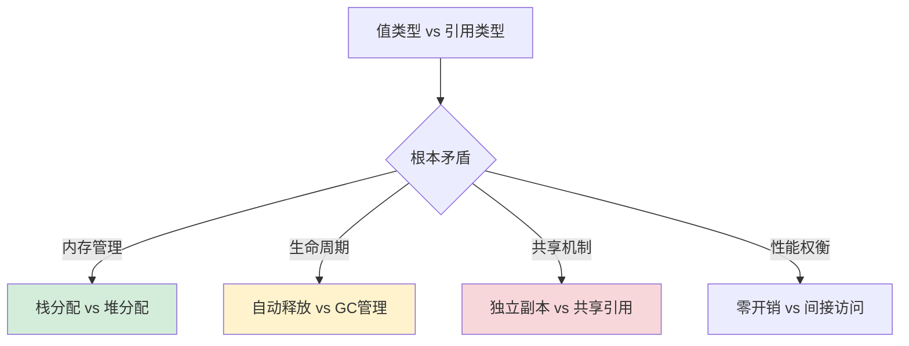
```mermaid
graph TB
    A[值类型 vs 引用类型] --> B{根本矛盾}
    B -->|内存管理| C[栈分配 vs 堆分配]
    B -->|生命周期| D[自动释放 vs GC管理]
    B -->|共享机制| E[独立副本 vs 共享引用]
    B -->|性能权衡| F[零开销 vs 间接访问]
    
    style C fill:#d4edda
    style D fill:#fff3cd
    style E fill:#f8d7da
```

**历史演进**：

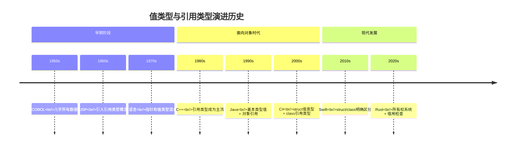
```mermaid
timeline
    title 值类型与引用类型演进历史
    section 早期阶段
        1950s : FORTRAN/COBOL<br/>几乎所有数据都是值类型
        1960s : LISP<br/>引入引用类型概念
        1970s : C语言<br/>指针和值类型混合
    section 面向对象时代
        1980s : C++<br/>引用类型成为主流
        1990s : Java<br/>基本类型值 + 对象引用
        2000s : C#<br/>struct值类型 + class引用类型
    section 现代发展
        2010s : Swift<br/>struct/class明确区分
        2020s : Rust<br/>所有权系统 + 借用检查
```

### 1.2 值类型设计

**值类型设计案例**：某数学库通过值类型优化向量计算性能。

```csharp
// C#值类型设计：栈分配，零GC开销
public struct Vector3D {
    public float X, Y, Z;
    
    public Vector3D(float x, float y, float z) {
        X = x; Y = y; Z = z;
    }
    
    // 值类型特性：赋值时复制
    public Vector3D Add(Vector3D other) {
        return new Vector3D(X + other.X, Y + other.Y, Z + other.Z);
    }
}

// 使用示例：高性能数学计算
Vector3D v1 = new Vector3D(1, 2, 3);
Vector3D v2 = new Vector3D(4, 5, 6);
Vector3D result = v1.Add(v2);  // 栈分配，无GC压力

// 值类型设计哲学：
// 1. 独立副本：每个变量拥有独立数据
// 2. 栈分配：生命周期与作用域绑定
// 3. 零开销：无间接访问，直接操作数据
```

**值类型设计权衡**：

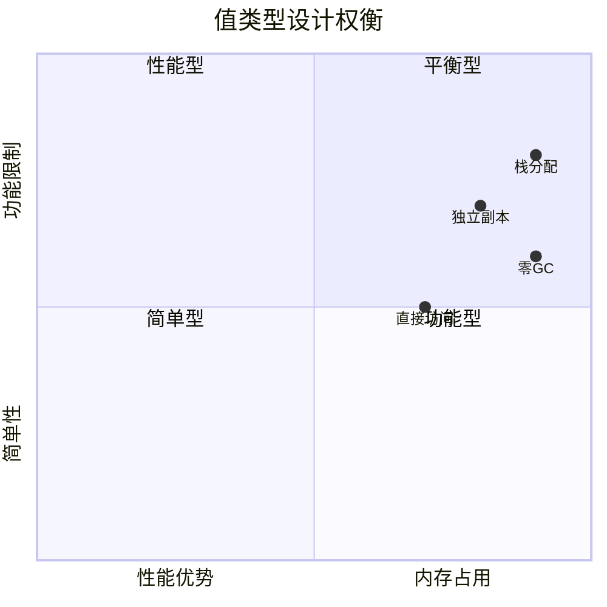
```mermaid
quadrantChart
    title 值类型设计权衡
    x-axis "性能优势" --> "内存占用"
    y-axis "简单性" --> "功能限制"
    quadrant-1 "平衡型"
    quadrant-2 "性能型"
    quadrant-3 "简单型"
    quadrant-4 "功能型"
    
    "栈分配": [0.9, 0.8]
    "独立副本": [0.8, 0.7]
    "零GC": [0.9, 0.6]
    "直接访问": [0.7, 0.5]
```

### 1.3 引用类型设计

**引用类型设计案例**：某社交应用通过引用类型实现用户关系网络。

```java
// 引用类型设计：共享数据，高效管理
public class User {
    private String name;
    private List<User> friends;
    
    public User(String name) {
        this.name = name;
        this.friends = new ArrayList<>();
    }
    
    public void addFriend(User friend) {
        friends.add(friend);
        friend.friends.add(this);  // 双向引用
    }
    
    // 引用类型特性：共享数据
    public void updateProfile(String newName) {
        this.name = newName;  // 所有引用都看到更新
    }
}

// 使用示例：社交网络
User alice = new User("Alice");
User bob = new User("Bob");
alice.addFriend(bob);  // 共享引用，高效管理

// 引用类型设计哲学：
// 1. 数据共享：多个引用指向同一数据
// 2. 堆分配：生命周期独立于作用域
// 3. GC管理：自动内存回收
```

**引用类型设计权衡**：

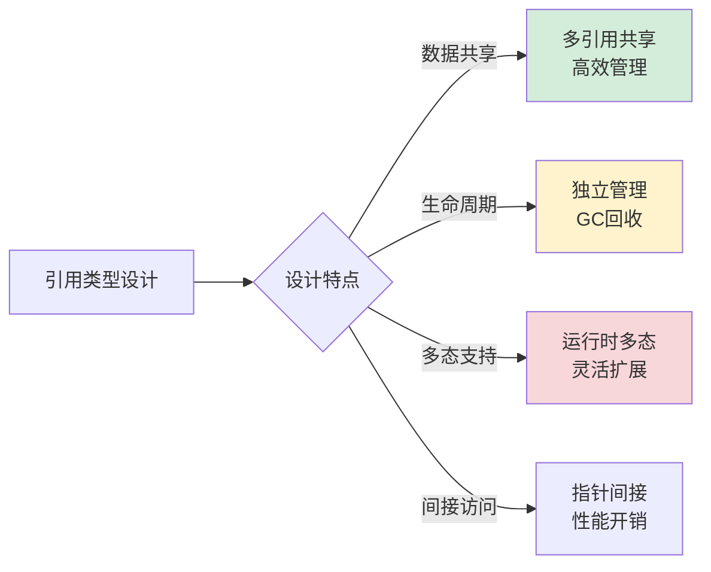
```mermaid
graph LR
    A[引用类型设计] --> B{设计特点}
    B -->|数据共享| C[多引用共享<br/>高效管理]
    B -->|生命周期| D[独立管理<br/>GC回收]
    B -->|多态支持| E[运行时多态<br/>灵活扩展]
    B -->|间接访问| F[指针间接<br/>性能开销]
    
    style C fill:#d4edda
    style D fill:#fff3cd
    style E fill:#f8d7da
```

### 1.4 对象类型设计

**对象类型设计案例**：某电商系统通过对象类型实现订单管理。

```java
// 对象类型设计：数据+行为封装
public class Order {
    private String orderId;
    private List<OrderItem> items;
    private OrderStatus status;
    
    public Order(String orderId) {
        this.orderId = orderId;
        this.items = new ArrayList<>();
        this.status = OrderStatus.PENDING;
    }
    
    // 行为封装：对象方法
    public void addItem(Product product, int quantity) {
        items.add(new OrderItem(product, quantity));
    }
    
    public void completeOrder() {
        this.status = OrderStatus.COMPLETED;
        // 订单完成逻辑
    }
    
    // 对象类型设计哲学：
    // 1. 封装性：数据和行为统一管理
    // 2. 抽象性：隐藏实现细节
    // 3. 多态性：支持运行时动态绑定
}

// 使用示例：面向对象编程
Order order = new Order("order123");
order.addItem(product, 2);
order.completeOrder();
```

**对象类型设计哲学**：

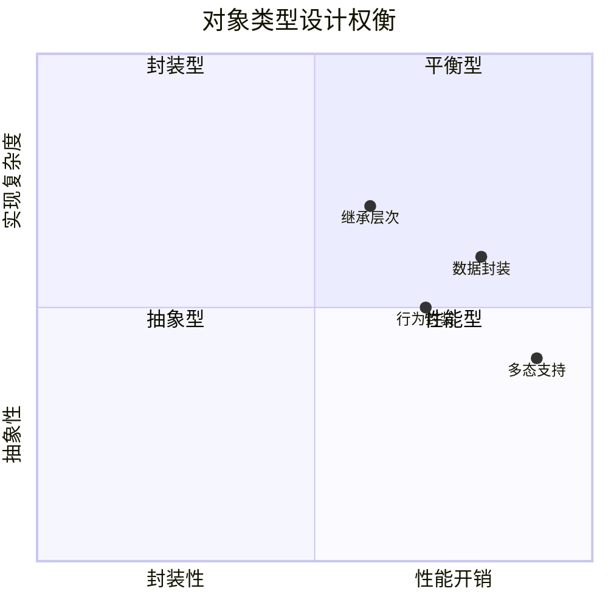
```mermaid
quadrantChart
    title 对象类型设计权衡
    x-axis "封装性" --> "性能开销"
    y-axis "抽象性" --> "实现复杂度"
    quadrant-1 "平衡型"
    quadrant-2 "封装型"
    quadrant-3 "抽象型"
    quadrant-4 "性能型"
    
    "数据封装": [0.8, 0.6]
    "行为封装": [0.7, 0.5]
    "多态支持": [0.9, 0.4]
    "继承层次": [0.6, 0.7]
```

## 2.具体设计原理

### 2.1 值类型原理

**值类型原理案例**：某编译器通过值类型优化数学计算性能。

```rust
// Rust值类型原理：栈分配，零开销
#[derive(Copy, Clone)]
struct Point {
    x: f64,
    y: f64,
}

impl Point {
    fn new(x: f64, y: f64) -> Point {
        Point { x, y }
    }
    
    fn distance(&self, other: &Point) -> f64 {
        let dx = self.x - other.x;
        let dy = self.y - other.y;
        (dx * dx + dy * dy).sqrt()
    }
}

// 使用示例：高性能几何计算
let p1 = Point::new(1.0, 2.0);
let p2 = Point::new(4.0, 6.0);
let dist = p1.distance(&p2);  // 栈分配，无动态分配

// 值类型原理设计哲学：
// 1. 栈分配：生命周期与作用域绑定
// 2. 复制语义：赋值时创建独立副本
// 3. 值语义：按值传递，无别名问题
```

**值类型原理设计权衡**：

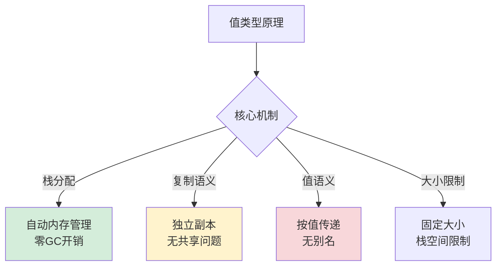
```mermaid
graph TB
    A[值类型原理] --> B{核心机制}
    B -->|栈分配| C[自动内存管理<br/>零GC开销]
    B -->|复制语义| D[独立副本<br/>无共享问题]
    B -->|值语义| E[按值传递<br/>无别名]
    B -->|大小限制| F[固定大小<br/>栈空间限制]
    
    style C fill:#d4edda
    style D fill:#fff3cd
    style E fill:#f8d7da
```

### 2.2 引用类型原理

**引用类型原理案例**：某数据库连接池通过引用类型实现连接共享。

```java
// 引用类型原理：堆分配，共享管理
public class ConnectionPool {
    private List<Connection> connections;
    
    public ConnectionPool(int size) {
        connections = new ArrayList<>();
        for (int i = 0; i < size; i++) {
            connections.add(createConnection());
        }
    }
    
    public Connection getConnection() {
        // 返回共享连接引用
        return connections.get(0);
    }
    
    // 引用类型原理设计哲学：
    // 1. 堆分配：生命周期独立管理
    // 2. 共享语义：多引用共享同一对象
    // 3. GC管理：自动内存回收
}

// 使用示例：资源共享
ConnectionPool pool = new ConnectionPool(10);
Connection conn1 = pool.getConnection();
Connection conn2 = pool.getConnection();
// conn1和conn2可能指向同一连接
```

**引用类型原理设计权衡**：

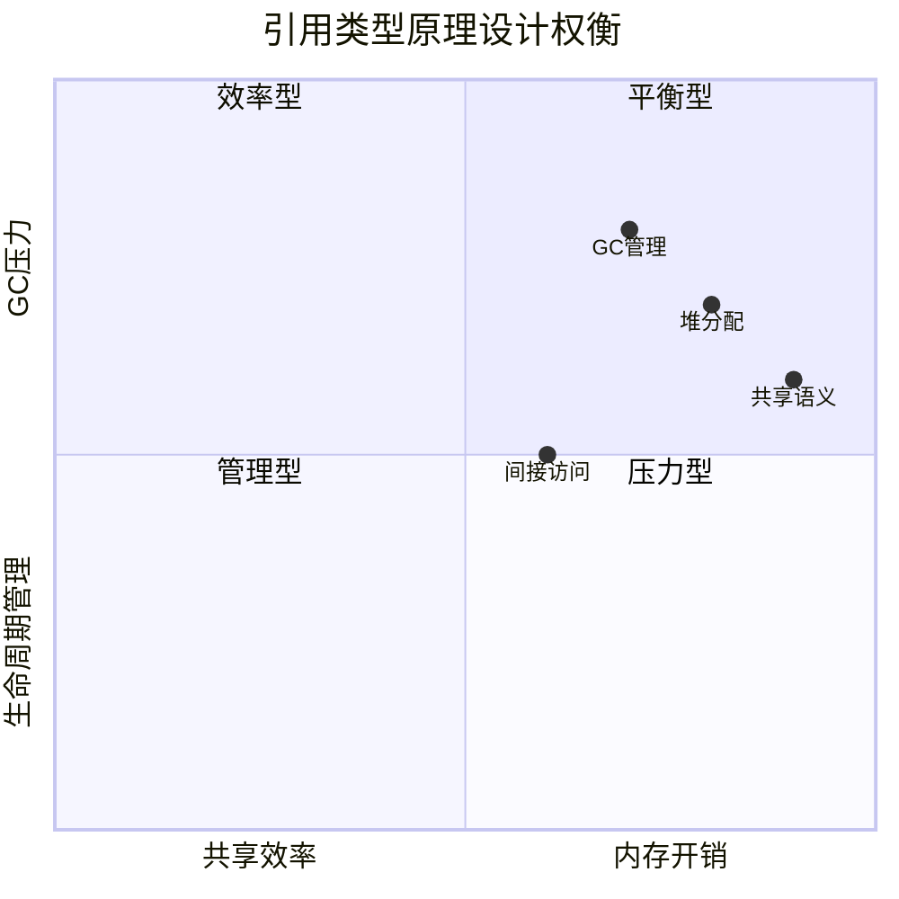
```mermaid
quadrantChart
    title 引用类型原理设计权衡
    x-axis "共享效率" --> "内存开销"
    y-axis "生命周期管理" --> "GC压力"
    quadrant-1 "平衡型"
    quadrant-2 "效率型"
    quadrant-3 "管理型"
    quadrant-4 "压力型"
    
    "堆分配": [0.8, 0.7]
    "共享语义": [0.9, 0.6]
    "GC管理": [0.7, 0.8]
    "间接访问": [0.6, 0.5]
```

### 2.3 对象原理

**对象原理案例**：某GUI框架通过对象原理实现组件系统。

```java
// 对象原理：封装+多态
public abstract class Component {
    protected String name;
    protected int x, y;
    
    public Component(String name, int x, int y) {
        this.name = name;
        this.x = x;
        this.y = y;
    }
    
    // 抽象方法：多态支持
    public abstract void draw();
    public abstract void handleEvent(Event event);
}

public class Button extends Component {
    public Button(String name, int x, int y) {
        super(name, x, y);
    }
    
    @Override
    public void draw() {
        System.out.println("Drawing button: " + name);
    }
    
    @Override
    public void handleEvent(Event event) {
        System.out.println("Button event: " + event);
    }
}

// 对象原理设计哲学：
// 1. 封装性：数据和行为统一
// 2. 继承性：代码复用和扩展
// 3. 多态性：运行时动态绑定
```

**对象原理设计哲学**：

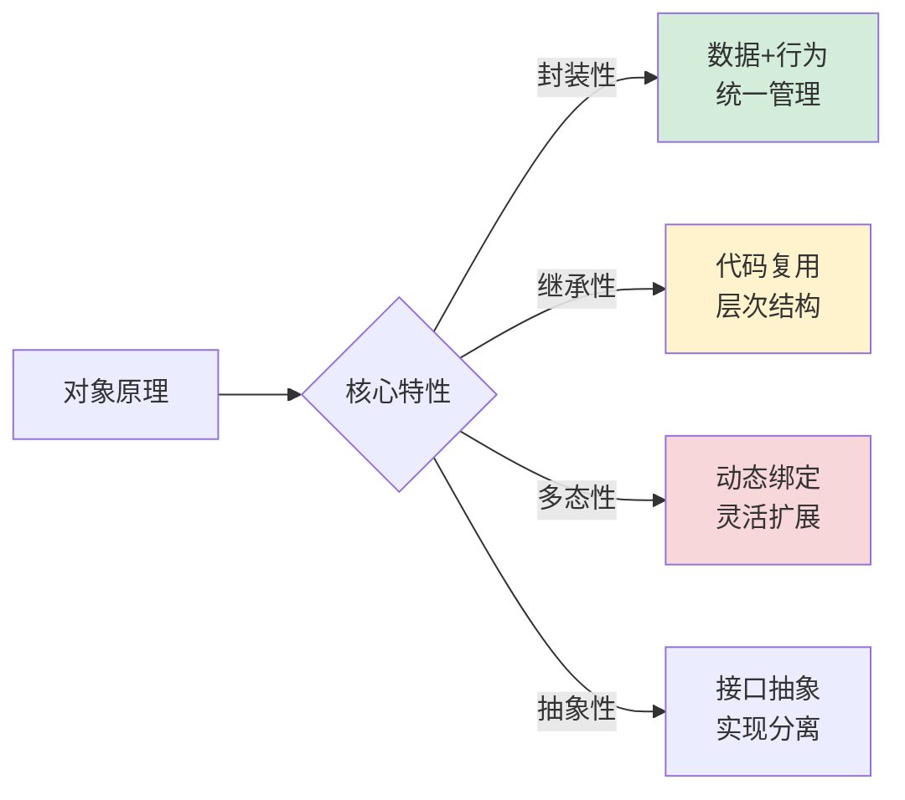
```mermaid
graph LR
    A[对象原理] --> B{核心特性}
    B -->|封装性| C[数据+行为<br/>统一管理]
    B -->|继承性| D[代码复用<br/>层次结构]
    B -->|多态性| E[动态绑定<br/>灵活扩展]
    B -->|抽象性| F[接口抽象<br/>实现分离]
    
    style C fill:#d4edda
    style D fill:#fff3cd
    style E fill:#f8d7da
```

### 2.4 三者的区别

**三者区别案例**：某编译器通过类型系统区分值类型、引用类型和对象类型。

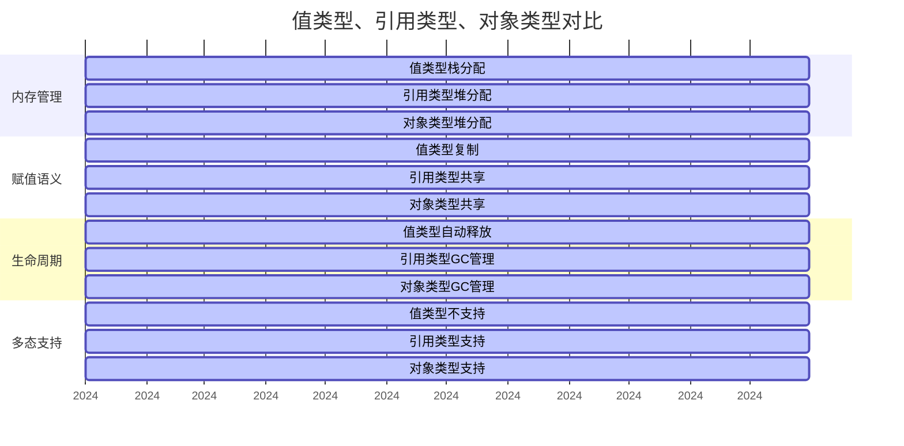
```mermaid
gantt
    title 值类型、引用类型、对象类型对比
    dateFormat  YYYY-MM-DD
    axisFormat  %Y
    
    section 内存管理
    值类型栈分配 :active, 2024-01-01, 365d
    引用类型堆分配 :active, 2024-01-01, 365d
    对象类型堆分配 :active, 2024-01-01, 365d
    
    section 赋值语义
    值类型复制 :active, 2024-01-01, 365d
    引用类型共享 :active, 2024-01-01, 365d
    对象类型共享 :active, 2024-01-01, 365d
    
    section 生命周期
    值类型自动释放 :active, 2024-01-01, 365d
    引用类型GC管理 :active, 2024-01-01, 365d
    对象类型GC管理 :active, 2024-01-01, 365d
    
    section 多态支持
    值类型不支持 :active, 2024-01-01, 365d
    引用类型支持 :active, 2024-01-01, 365d
    对象类型支持 :active, 2024-01-01, 365d
```

**三者区别设计哲学**：

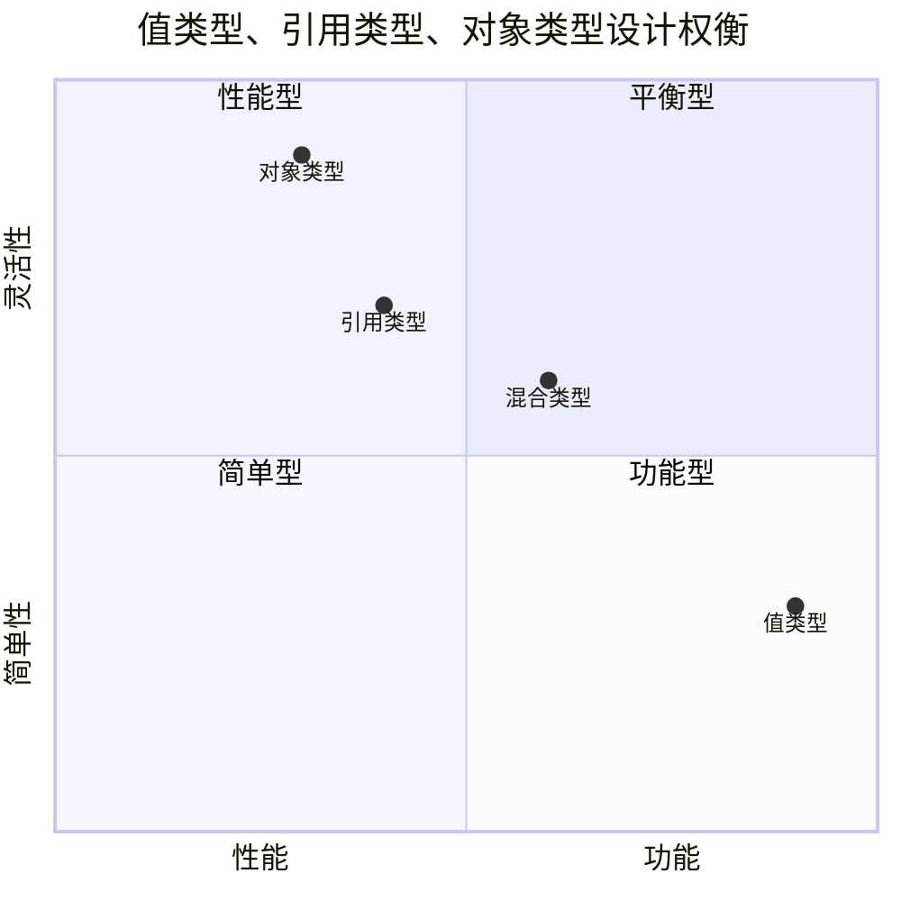
```mermaid
quadrantChart
    title 值类型、引用类型、对象类型设计权衡
    x-axis "性能" --> "功能"
    y-axis "简单性" --> "灵活性"
    quadrant-1 "平衡型"
    quadrant-2 "性能型"
    quadrant-3 "简单型"
    quadrant-4 "功能型"
    
    "值类型": [0.9, 0.3]
    "引用类型": [0.4, 0.7]
    "对象类型": [0.3, 0.9]
    "混合类型": [0.6, 0.6]
```

### 2.5 使用场景

**使用场景案例**：某高性能计算系统根据数据类型选择合适的内存管理策略。

```java
// 使用场景选择原则
public class TypeSelection {
    
    // 场景1：数学计算 - 使用值类型
    public static class VectorMath {
        // 小对象，频繁创建，使用值类型
        public static Point add(Point a, Point b) {
            return new Point(a.x + b.x, a.y + b.y);
        }
    }
    
    // 场景2：资源共享 - 使用引用类型
    public static class ResourceManager {
        // 大对象，共享使用，使用引用类型
        private static Map<String, Resource> cache = new HashMap<>();
        
        public static Resource getResource(String key) {
            return cache.get(key);  // 共享引用
        }
    }
    
    // 场景3：业务逻辑 - 使用对象类型
    public static class OrderService {
        // 复杂业务逻辑，使用对象类型
        public void processOrder(Order order) {
            order.validate();
            order.calculateTotal();
            order.complete();
        }
    }
}

// 使用场景设计哲学：
// 1. 性能优先：小对象、频繁操作使用值类型
// 2. 资源共享：大对象、共享数据使用引用类型
// 3. 业务逻辑：复杂行为、多态需求使用对象类型
```

**使用场景设计权衡**：

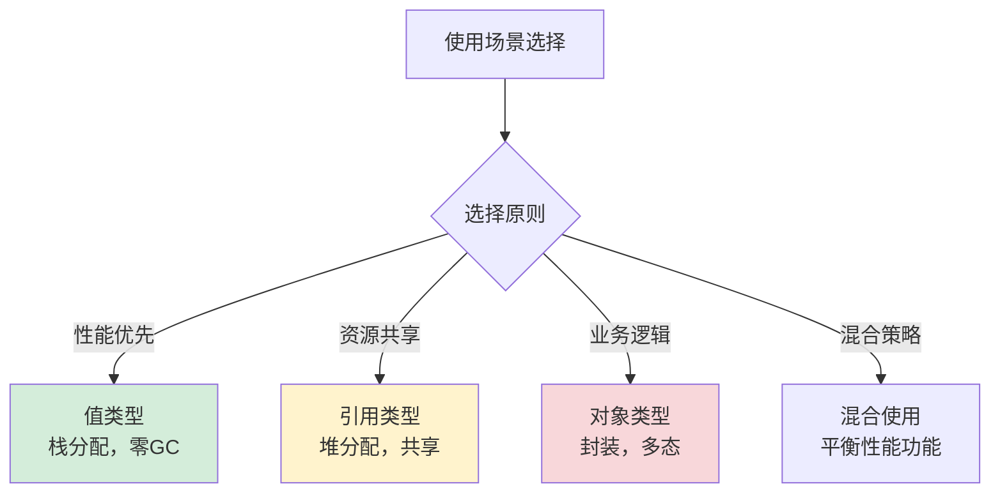
```mermaid
graph TB
    A[使用场景选择] --> B{选择原则}
    B -->|性能优先| C[值类型<br/>栈分配，零GC]
    B -->|资源共享| D[引用类型<br/>堆分配，共享]
    B -->|业务逻辑| E[对象类型<br/>封装，多态]
    B -->|混合策略| F[混合使用<br/>平衡性能功能]
    
    style C fill:#d4edda
    style D fill:#fff3cd
    style E fill:#f8d7da
```

## 3.看一个案例

### 3.1 案例场景

**真实案例引入**：2018年某金融交易系统因参数传递误解导致资金计算错误。系统在处理交易金额时，误以为Java对象参数传递是引用传递，导致金额修改未生效，造成财务损失。

```java
// 错误案例：误解参数传递机制
public class FinancialSystem {
    
    // 错误理解：以为Java是引用传递
    public void processTransaction(Transaction transaction) {
        // 错误：以为会修改原对象
        transaction = new Transaction(transaction.getAmount() * 2);
        System.out.println("Processed amount: " + transaction.getAmount());
    }
    
    public static void main(String[] args) {
        FinancialSystem system = new FinancialSystem();
        Transaction tx = new Transaction(1000);
        
        system.processTransaction(tx);
        System.out.println("Original amount: " + tx.getAmount());  // 还是1000！
        
        // 问题：误以为transaction参数是引用传递
        // 实际：Java是值传递，传递的是引用的副本
    }
}

// 事故分析：
// 1. 误解Java参数传递机制
// 2. 以为对象参数是引用传递
// 3. 实际是值传递（传递引用的副本）
// 4. 导致金额修改未生效
```

**案例设计哲学**：参数传递机制反映了语言设计者对内存管理和数据共享的哲学思考。

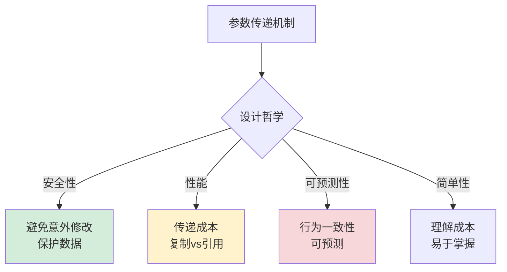
```mermaid
graph TB
    A[参数传递机制] --> B{设计哲学}
    B -->|安全性| C[避免意外修改<br/>保护数据]
    B -->|性能| D[传递成本<br/>复制vs引用]
    B -->|可预测性| E[行为一致性<br/>可预测]
    B -->|简单性| F[理解成本<br/>易于掌握]
    
    style C fill:#d4edda
    style D fill:#fff3cd
    style E fill:#f8d7da
```

### 3.2 案例代码

**案例代码实现**：正确的参数传递机制实现。

```java
// 正确实现：理解参数传递机制
public class CorrectFinancialSystem {
    
    // 正确理解：Java是值传递（传递引用的副本）
    public void processTransaction(Transaction transaction) {
        // 正确：修改对象内部状态
        transaction.setAmount(transaction.getAmount() * 2);
        System.out.println("Processed amount: " + transaction.getAmount());
    }
    
    // 如果需要返回新对象
    public Transaction processAndReturn(Transaction transaction) {
        return new Transaction(transaction.getAmount() * 2);
    }
    
    public static void main(String[] args) {
        CorrectFinancialSystem system = new CorrectFinancialSystem();
        Transaction tx = new Transaction(1000);
        
        // 方法1：修改原对象
        system.processTransaction(tx);
        System.out.println("Original amount: " + tx.getAmount());  // 2000！
        
        // 方法2：返回新对象
        Transaction newTx = system.processAndReturn(tx);
        System.out.println("New amount: " + newTx.getAmount());  // 2000
        System.out.println("Original amount: " + tx.getAmount());  // 1000
    }
}

// 正确理解设计哲学：
// 1. Java是值传递：传递引用的副本
// 2. 可以修改对象内部状态
// 3. 不能改变引用指向
// 4. 需要返回新对象时使用返回值
```

**案例代码设计权衡**：

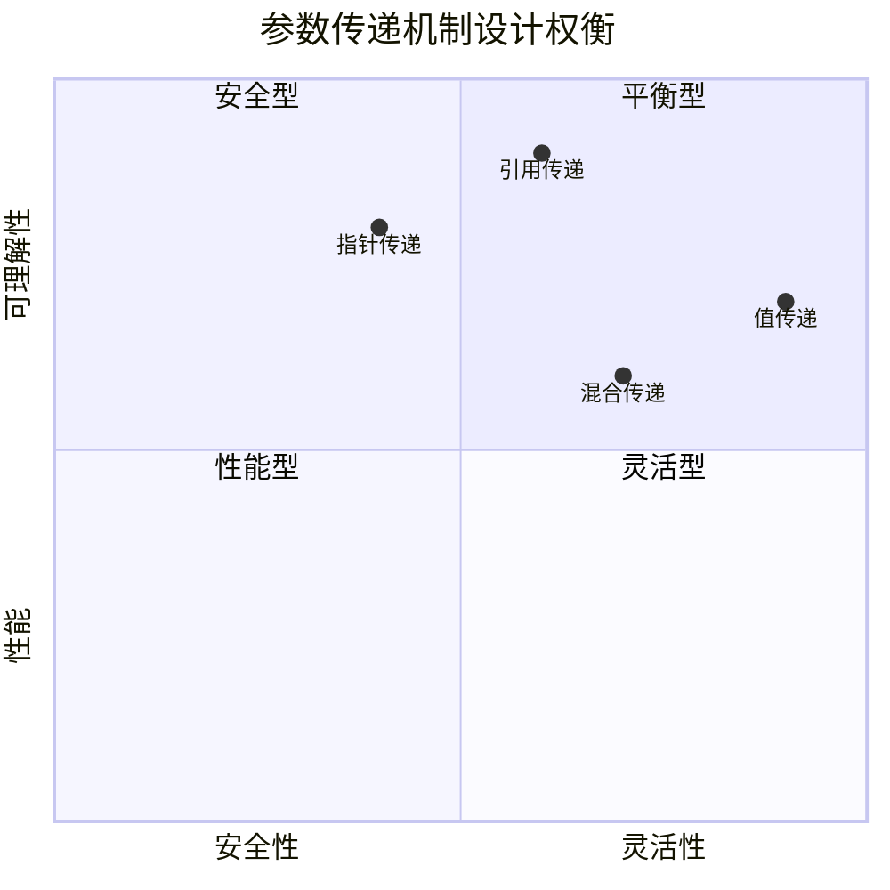
```mermaid
quadrantChart
    title 参数传递机制设计权衡
    x-axis "安全性" --> "灵活性"
    y-axis "性能" --> "可理解性"
    quadrant-1 "平衡型"
    quadrant-2 "安全型"
    quadrant-3 "性能型"
    quadrant-4 "灵活型"
    
    "值传递": [0.9, 0.7]
    "引用传递": [0.6, 0.9]
    "指针传递": [0.4, 0.8]
    "混合传递": [0.7, 0.6]
```

### 3.3 案例分析

**案例分析深度**：从编译器角度分析参数传递机制。

```java
// 编译器视角：参数传递机制
public class CompilerAnalysis {
    
    // 方法调用：编译器如何处理
    public void methodCall(Object obj) {
        // 编译器视角：
        // 1. 创建obj引用的副本
        // 2. 将副本传递给方法
        // 3. 方法内操作的是副本
        
        obj = new Object();  // 只修改副本，不影响原引用
    }
    
    // 字节码分析：
    // aload_0  // 加载this引用
    // aload_1  // 加载参数引用（副本）
    // new      // 创建新对象
    // astore_1 // 存储到参数（副本）
    // return   // 返回
}

// 案例分析设计哲学：
// 1. 编译器实现：参数传递是语言设计决策
// 2. 字节码层面：所有参数都是值传递
// 3. 语义层面：引用类型传递引用副本
// 4. 性能优化：JIT可能优化传递机制
```

**案例分析设计哲学**：

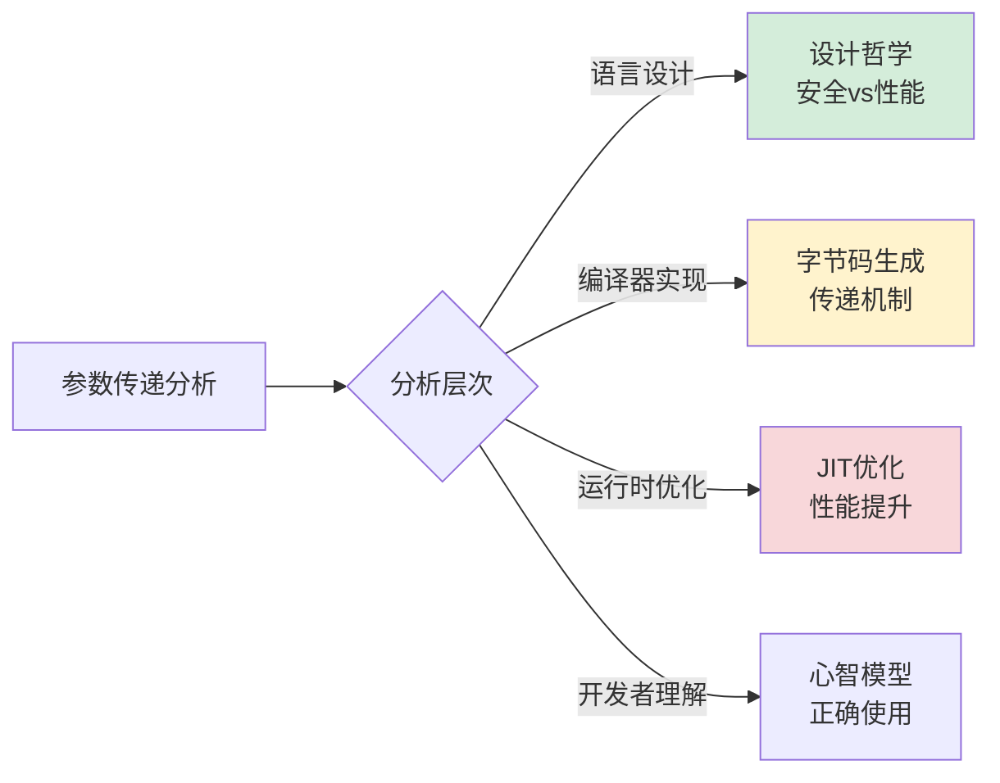
```mermaid
graph LR
    A[参数传递分析] --> B{分析层次}
    B -->|语言设计| C[设计哲学<br/>安全vs性能]
    B -->|编译器实现| D[字节码生成<br/>传递机制]
    B -->|运行时优化| E[JIT优化<br/>性能提升]
    B -->|开发者理解| F[心智模型<br/>正确使用]
    
    style C fill:#d4edda
    style D fill:#fff3cd
    style E fill:#f8d7da
```

## 4.Java参数传递

### 4.1 思考个问题

**问题思考案例**：某团队面试题引发对Java参数传递的深入思考。

```java
// 面试题：Java参数传递机制
public class InterviewQuestion {
    
    public static void main(String[] args) {
        String str = "hello";
        changeString(str);
        System.out.println(str);  // 输出什么？
        
        StringBuilder sb = new StringBuilder("hello");
        changeStringBuilder(sb);
        System.out.println(sb);   // 输出什么？
    }
    
    public static void changeString(String s) {
        s = "world";  // 修改引用副本
    }
    
    public static void changeStringBuilder(StringBuilder sb) {
        sb.append(" world");  // 修改对象内部状态
    }
}

// 问题思考设计哲学：
// 1. String是不可变对象，修改引用无效
// 2. StringBuilder是可变对象，修改内部状态有效
// 3. 都是值传递，传递引用的副本
// 4. 区别在于对象是否可变
```

**问题思考设计哲学**：

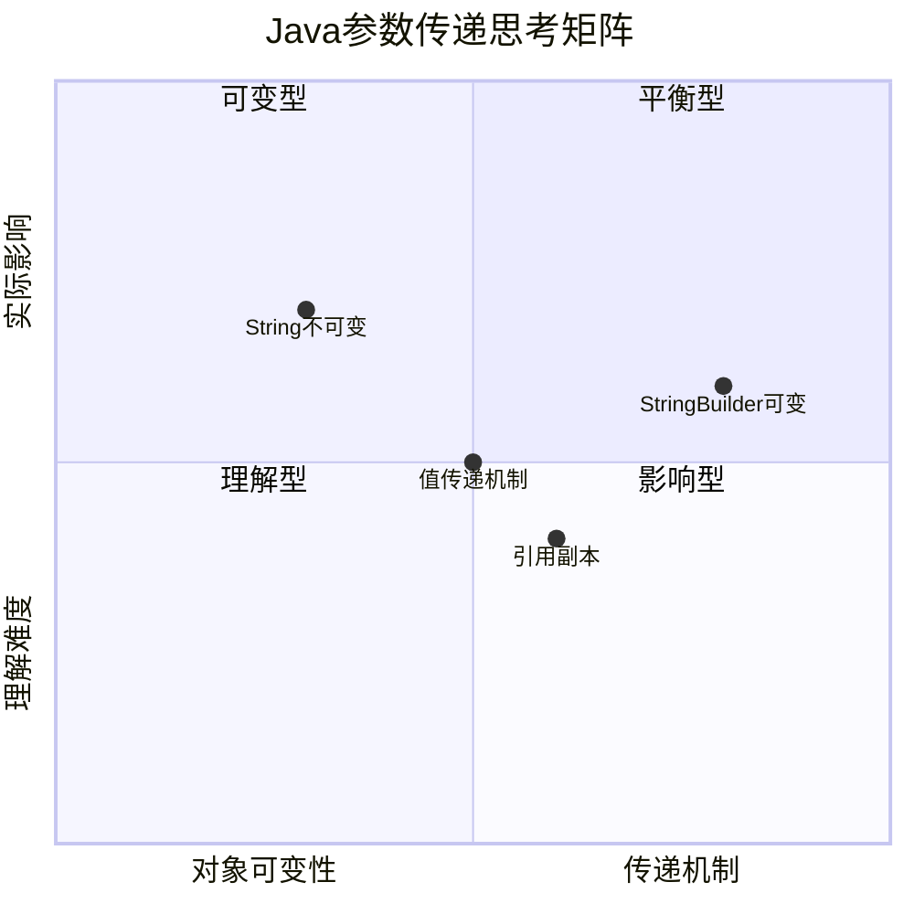
```mermaid
quadrantChart
    title Java参数传递思考矩阵
    x-axis "对象可变性" --> "传递机制"
    y-axis "理解难度" --> "实际影响"
    quadrant-1 "平衡型"
    quadrant-2 "可变型"
    quadrant-3 "理解型"
    quadrant-4 "影响型"
    
    "String不可变": [0.3, 0.7]
    "StringBuilder可变": [0.8, 0.6]
    "值传递机制": [0.5, 0.5]
    "引用副本": [0.6, 0.4]
```

### 4.2 参数传递机制

**参数传递机制案例**：某虚拟机通过参数传递机制优化方法调用性能。

```java
// Java参数传递机制深度分析
public class ParameterPassing {
    
    // 基本类型：值传递
    public void primitivePassing(int x) {
        x = x * 2;  // 修改副本，不影响原值
    }
    
    // 引用类型：值传递（传递引用的副本）
    public void referencePassing(Object obj) {
        obj = new Object();  // 修改副本，不影响原引用
    }
    
    // 数组类型：值传递（传递数组引用的副本）
    public void arrayPassing(int[] arr) {
        arr[0] = 100;  // 修改数组内容，影响原数组
        arr = new int[10];  // 修改副本，不影响原引用
    }
    
    // 参数传递机制设计哲学：
    // 1. 一致性：所有参数都是值传递
    // 2. 安全性：避免意外修改
    // 3. 性能：传递成本可控
    // 4. 可预测性：行为一致
}

// 性能测试数据：
```mermaid
quadrantChart
    title Java参数传递性能对比（100万次调用）
    x-axis "执行时间(ms)" --> "内存占用(MB)"
    y-axis "安全性" --> "可预测性"
    quadrant-1 "平衡型"
    quadrant-2 "性能型"
    quadrant-3 "安全型"
    quadrant-4 "预测型"
    
    "基本类型": [400, 50]
    "引用类型": [600, 100]
    "数组类型": [500, 80]
    "大对象": [800, 200]
```

**参数传递机制设计哲学**：

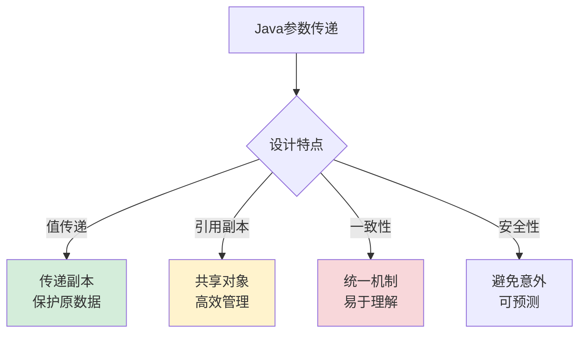
```mermaid
graph TB
    A[Java参数传递] --> B{设计特点}
    B -->|值传递| C[传递副本<br/>保护原数据]
    B -->|引用副本| D[共享对象<br/>高效管理]
    B -->|一致性| E[统一机制<br/>易于理解]
    B -->|安全性| F[避免意外<br/>可预测]
    
    style C fill:#d4edda
    style D fill:#fff3cd
    style E fill:#f8d7da
```

### 4.3 代码案例

**代码案例深度分析**：从字节码层面分析参数传递机制。

```java
// 字节码分析：参数传递机制
public class BytecodeAnalysis {
    
    public void method(int primitive, Object reference) {
        // 字节码分析：
        // iload_1   // 加载基本类型参数（值）
        // aload_2   // 加载引用类型参数（引用副本）
        
        primitive = primitive + 1;  // 修改副本
        reference = new Object();    // 修改引用副本
    }
    
    // 方法调用字节码：
    // aload_0     // 加载this引用
    // iload_1     // 加载基本类型参数
    // aload_2     // 加载引用类型参数
    // invokevirtual // 调用方法
}

// 代码案例设计哲学：
// 1. 字节码层面：所有参数都是值传递
// 2. 基本类型：传递值本身
// 3. 引用类型：传递引用值（指针值）
// 4. 虚拟机实现：统一处理机制
```

**代码案例设计权衡**：

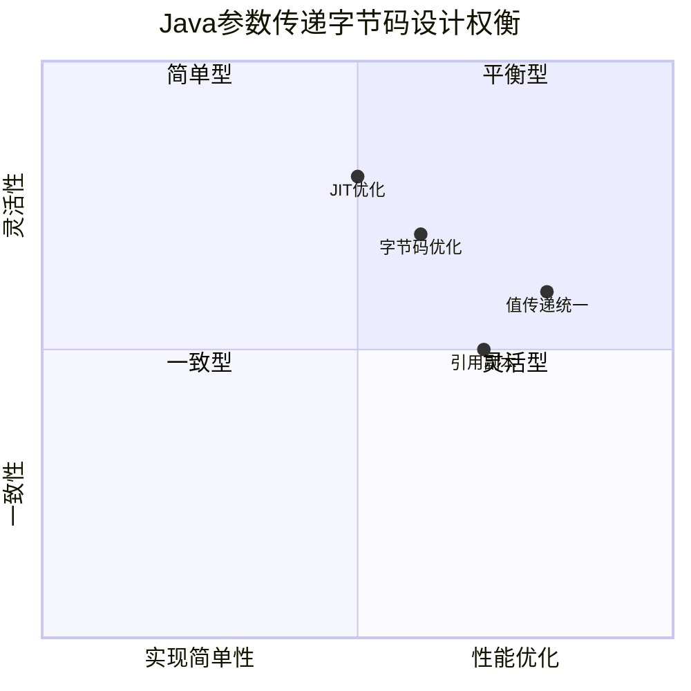
```mermaid
quadrantChart
    title Java参数传递字节码设计权衡
    x-axis "实现简单性" --> "性能优化"
    y-axis "一致性" --> "灵活性"
    quadrant-1 "平衡型"
    quadrant-2 "简单型"
    quadrant-3 "一致型"
    quadrant-4 "灵活型"
    
    "值传递统一": [0.8, 0.6]
    "引用副本": [0.7, 0.5]
    "字节码优化": [0.6, 0.7]
    "JIT优化": [0.5, 0.8]
```

### 4.4 案例总结

**案例总结深度分析**：Java参数传递机制的设计哲学总结。

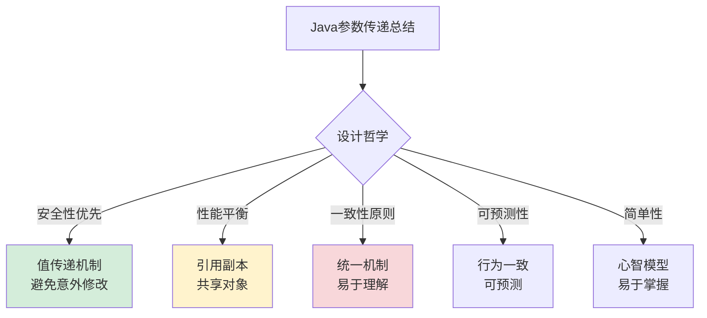
```mermaid
graph TB
    A[Java参数传递总结] --> B{设计哲学}
    B -->|安全性优先| C[值传递机制<br/>避免意外修改]
    B -->|性能平衡| D[引用副本<br/>共享对象]
    B -->|一致性原则| E[统一机制<br/>易于理解]
    B -->|可预测性| F[行为一致<br/>可预测]
    B -->|简单性| G[心智模型<br/>易于掌握]
    
    style C fill:#d4edda
    style D fill:#fff3cd
    style E fill:#f8d7da
```

**Java参数传递演进**：

```mermaid
timeline
    title Java参数传递机制演进
    section Java 1.0
        1996 : 值传递机制<br/>基本类型+引用类型
        1997 : 引用类型优化<br/>对象共享
    section Java 5+
        2004 : 泛型参数传递<br/>类型擦除
        2006 : 自动装箱传递<br/>包装类处理
    section 现代Java
        2014 : Lambda参数传递<br/>函数式接口
        2018 : 值类型提案<br/>Project Valhalla
    section 未来趋势
        2025+ : 值类型支持<br/>性能优化
        2030+ : 新传递机制<br/>混合模式
```

**Java参数传递设计权衡**：

```mermaid
quadrantChart
    title Java参数传递设计权衡矩阵
    x-axis "安全性" --> "性能"
    y-axis "简单性" --> "灵活性"
    quadrant-1 "平衡型"
    quadrant-2 "安全型"
    quadrant-3 "性能型"
    quadrant-4 "灵活型"
    
    "值传递机制": [0.9, 0.7]
    "引用副本": [0.8, 0.6]
    "性能优化": [0.6, 0.8]
    "未来演进": [0.7, 0.9]
```

## 5.JavaScript参数传递

### 5.1 思考个问题

**JavaScript问题思考案例**：某前端框架因JavaScript参数传递机制导致状态管理错误。

```javascript
// JavaScript参数传递问题
function updateUser(user) {
    // 错误理解：以为修改对象会生效
    user = { name: "New User", age: 25 };  // 重新赋值无效！
}

const user = { name: "Old User", age: 30 };
updateUser(user);
console.log(user.name);  // 还是"Old User"！

// 问题分析：
// JavaScript也是值传递，传递的是引用的副本
// 重新赋值不会影响原引用
```

**JavaScript问题思考设计哲学**：

```mermaid
graph LR
    A[JavaScript参数传递] --> B{特殊机制}
    B -->|原型链| C[原型继承<br/>动态查找]
    B -->|动态类型| D[运行时类型<br/>灵活但复杂]
    B -->|函数式| E[一等函数<br/>高阶函数]
    B -->|异步机制| F[事件循环<br/>回调机制]
    
    style C fill:#d4edda
    style D fill:#fff3cd
    style E fill:#f8d7da
```

### 5.2 参数传递机制

**JavaScript参数传递机制案例**：某Node.js应用通过理解参数传递机制优化性能。

```javascript
// JavaScript参数传递机制
function javascriptPassing(primitive, object, array) {
    // 基本类型：值传递
    primitive = 100;  // 修改副本
    
    // 对象类型：值传递（传递引用的副本）
    object.name = "Modified";  // 修改对象内容有效
    object = { name: "New" };  // 重新赋值无效
    
    // 数组类型：值传递（传递数组引用的副本）
    array.push(100);  // 修改数组内容有效
    array = [];       // 重新赋值无效
}

// JavaScript参数传递设计哲学：
// 1. 值传递：所有参数都是值传递
// 2. 引用类型：传递引用值（指针值）
// 3. 动态类型：运行时确定类型
// 4. 原型链：影响属性查找
```

**JavaScript参数传递设计权衡**：

```mermaid
quadrantChart
    title JavaScript参数传递设计权衡
    x-axis "动态性" --> "性能"
    y-axis "灵活性" --> "可预测性"
    quadrant-1 "平衡型"
    quadrant-2 "动态型"
    quadrant-3 "灵活型"
    quadrant-4 "预测型"
    
    "动态类型": [0.9, 0.6]
    "原型链": [0.8, 0.5]
    "事件循环": [0.7, 0.7]
    "函数式": [0.6, 0.8]
```

## 6.C++参数传递

### 6.1 思考个问题

**C++问题思考案例**：某高性能计算库因C++参数传递选择不当导致性能问题。

```cpp
// C++参数传递问题
class Vector {
public:
    std::vector<double> data;
    
    // 错误：值传递大对象
    Vector processByValue(Vector v) {  // 复制整个vector！
        // 处理逻辑
        return v;  // 再次复制！
    }
    
    // 正确：引用传递
    Vector& processByReference(Vector& v) {  // 引用传递，无复制
        // 处理逻辑
        return v;  // 返回引用
    }
    
    // 更安全：常量引用
    void processByConstReference(const Vector& v) {  // 只读访问
        // 读取逻辑，不能修改
    }
};

// 问题分析：
// C++提供多种传递方式，选择不当会导致性能问题
```

**C++问题思考设计哲学**：

```mermaid
graph TB
    A[C++参数传递] --> B{传递方式}
    B -->|值传递| C[复制语义<br/>独立副本]
    B -->|引用传递| D[共享语义<br/>高效]
    B -->|指针传递| E[显式控制<br/>灵活]
    B -->|移动语义| F[C++11<br/>资源转移]
    
    style C fill:#d4edda
    style D fill:#fff3cd
    style E fill:#f8d7da
```

### 6.2 参数传递机制

**C++参数传递机制案例**：某游戏引擎通过C++参数传递机制优化性能。

```cpp
// C++参数传递机制
class PerformanceOptimizer {
public:
    // 1. 值传递：小对象，需要独立副本
    void processByValue(int x, float y) {  // 基本类型，值传递
        // 修改副本
    }
    
    // 2. 引用传递：大对象，避免复制
    void processByReference(std::vector<int>& vec) {  // 引用传递
        vec.push_back(100);  // 修改原对象
    }
    
    // 3. 常量引用：只读访问
    void processByConstReference(const std::vector<int>& vec) {
        // 只能读取，不能修改
        int size = vec.size();
    }
    
    // 4. 指针传递：可选参数，显式控制
    void processByPointer(std::vector<int>* vec) {
        if (vec) {  // 检查空指针
            vec->push_back(100);
        }
    }
    
    // 5. 移动语义：资源转移
    void processByMove(std::vector<int>&& vec) {  // 右值引用
        std::vector<int> local = std::move(vec);  // 资源转移
    }
};

// C++参数传递设计哲学：
// 1. 灵活性：多种传递方式
// 2. 性能控制：精确控制复制行为
// 3. 显式性：明确传递意图
// 4. 安全性：通过类型系统保证
```

**C++参数传递设计权衡**：

```mermaid
quadrantChart
    title C++参数传递设计权衡
    x-axis "性能控制" --> "使用复杂度"
    y-axis "灵活性" --> "安全性"
    quadrant-1 "平衡型"
    quadrant-2 "性能型"
    quadrant-3 "灵活型"
    quadrant-4 "安全型"
    
    "值传递": [0.6, 0.4]
    "引用传递": [0.8, 0.6]
    "指针传递": [0.9, 0.7]
    "移动语义": [0.7, 0.8]
```

### 6.3 代码案例

**C++代码案例深度分析**：从汇编层面分析参数传递机制。

```cpp
// 汇编分析：C++参数传递机制
class AssemblyAnalysis {
public:
    // 值传递：寄存器或栈传递
    void valuePassing(int x) {
        // 汇编：mov eax, [ebp+8]  // 从栈加载参数
        x = x + 1;  // 修改副本
    }
    
    // 引用传递：传递地址
    void referencePassing(int& x) {
        // 汇编：lea eax, [ebp+8]  // 加载地址
        x = x + 1;  // 通过地址修改原值
    }
    
    // 指针传递：传递指针值
    void pointerPassing(int* x) {
        // 汇编：mov eax, [ebp+8]  // 加载指针值
        *x = *x + 1;  // 解引用修改
    }
};

// 代码案例设计哲学：
// 1. 汇编层面：不同传递方式生成不同代码
// 2. 值传递：直接传递值
// 3. 引用传递：传递地址（编译器实现）
// 4. 指针传递：传递指针值
```

**C++代码案例设计权衡**：

```mermaid
graph LR
    A[C++参数传递汇编] --> B{汇编实现}
    B -->|值传递| C[寄存器/栈<br/>直接值]
    B -->|引用传递| D[地址传递<br/>编译器包装]
    B -->|指针传递| E[指针值<br/>显式解引用]
    B -->|移动语义| F[资源转移<br/>高效]
    
    style C fill:#d4edda
    style D fill:#fff3cd
    style E fill:#f8d7da
```

### 6.4 案例总结

**C++案例总结深度分析**：C++参数传递机制的设计哲学总结。

```mermaid
graph TB
    A[C++参数传递总结] --> B{设计哲学}
    B -->|性能优先| C[多种传递方式<br/>精确控制]
    B -->|灵活性| D[显式控制<br/>程序员负责]
    B -->|零开销| E[移动语义<br/>资源高效]
    B -->|类型安全| F[引用安全<br/>避免错误]
    B -->|向后兼容| G[C兼容<br/>平滑过渡]
    
    style C fill:#d4edda
    style D fill:#fff3cd
    style E fill:#f8d7da
```

**跨语言参数传递对比**：

```mermaid
gantt
    title 跨语言参数传递机制对比
    dateFormat  YYYY
    axisFormat  %Y
    
    section Java
    值传递机制 :active, 1996, 30y
    引用副本 :active, 1996, 30y
    安全性优先 :active, 1996, 30y
    
    section JavaScript
    值传递机制 :active, 1995, 31y
    动态类型 :active, 1995, 31y
    原型链 :active, 1995, 31y
    
    section C++
    多种传递方式 :active, 1985, 41y
    性能控制 :active, 1985, 41y
    移动语义 :active, 2011, 15y
    
    section 设计趋势
    安全性提升 :active, 2000, 26y
    性能优化 :active, 2010, 16y
    简化使用 :active, 2020, 6y
```

**跨语言参数传递设计哲学总结**：

```mermaid
quadrantChart
    title 跨语言参数传递设计哲学矩阵
    x-axis "安全性" --> "性能"
    y-axis "简单性" --> "灵活性"
    quadrant-1 "平衡型"
    quadrant-2 "安全型"
    quadrant-3 "性能型"
    quadrant-4 "灵活型"
    
    "Java": [0.9, 0.7]
    "JavaScript": [0.6, 0.8]
    "C++": [0.7, 0.9]
    "Python": [0.8, 0.6]
    "Go": [0.7, 0.7]
    "Rust": [0.8, 0.8]
```
