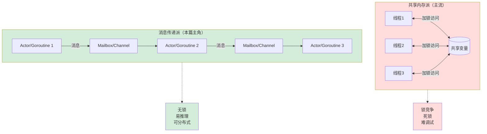
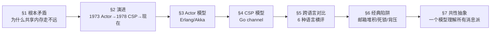
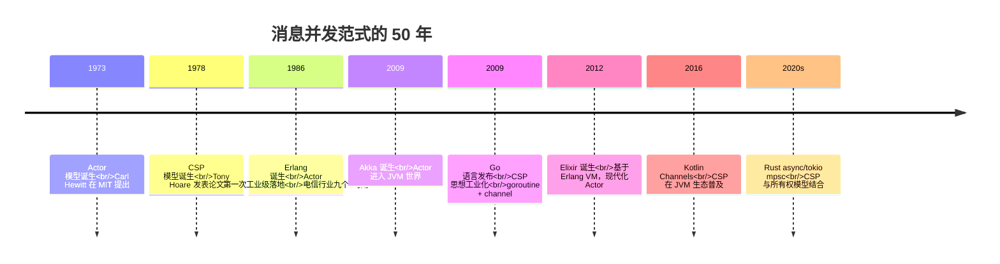
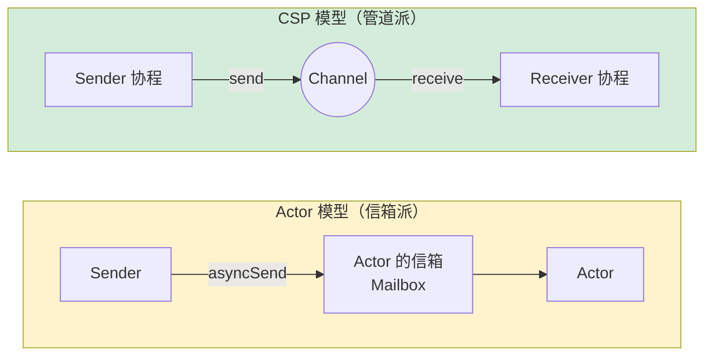
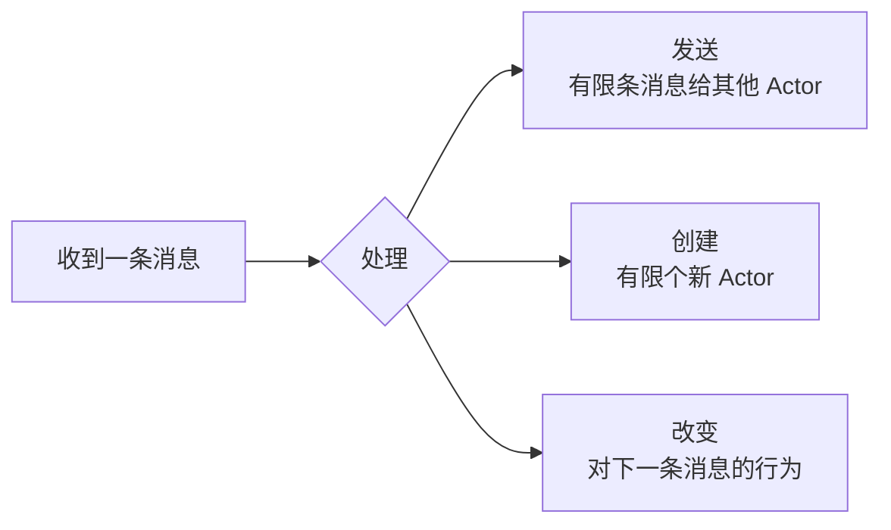
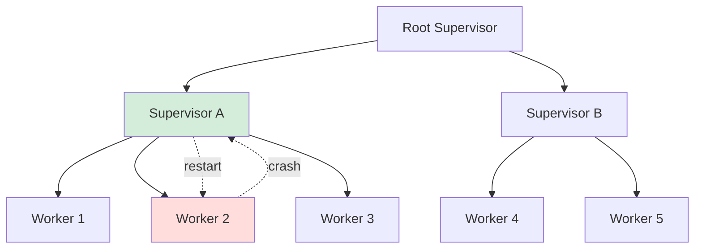
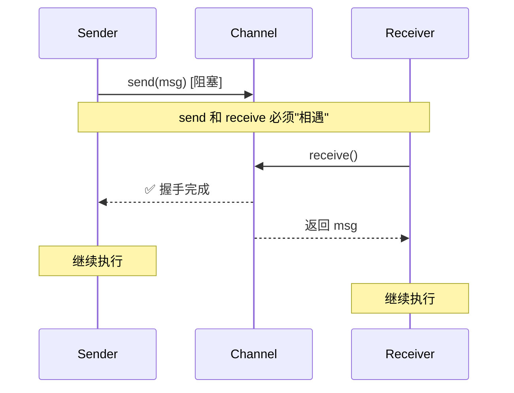
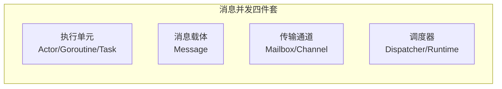
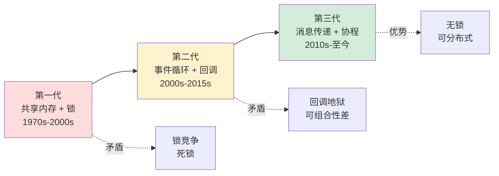

# 24. Actor 与 CSP 并发模型｜不共享内存的另一派

> 前一篇 [23.协程核心设计思想](./23.协程核心设计思想.md) 讲了"一个任务如何被挂起和恢复"。
>
> 这一篇要回答的是更根本的问题：**如果根本不允许任务之间共享内存，并发还能怎么做？**
>
> 这就是 Actor 和 CSP 两大模型的起点——**"Don't communicate by sharing memory; share memory by communicating."**

---

## 🗺 一张图看懂这篇讲什么



**本篇的知识地图**：



---

## §1 根本矛盾｜共享内存为什么走不远

### 1.1 共享内存的"四大不可能"

假如你有 16 核 CPU，16 个线程同时改一个 `HashMap`——会发生什么？

```java
// 线程 A
map.put("count", map.get("count") + 1);

// 线程 B
map.put("count", map.get("count") + 1);
```

即使每一步都"看起来"线程安全，整体依然错——这是 [16.并发Bug源头](./16.并发Bug源头由来.md) 讲过的**原子性破坏**。

为了解决它，工程界发明了**一整套锁体系**：

```text
mutex → reentrant lock → read-write lock → segment lock
     → optimistic lock → CAS → lock-free → wait-free
```

但锁带来了新矛盾——**"四大不可能"**：

| 问题 | 表现 | 本质 |
|------|------|------|
| **① 可组合性差** | 两个线程安全的对象组合起来不一定线程安全 | 锁不是代数可组合的 |
| **② 易死锁** | `A → lock1 → lock2`，`B → lock2 → lock1` | 顺序依赖 |
| **③ 性能崩塌** | 锁竞争下吞吐反而下降 | 缓存失效 + 线程阻塞 |
| **④ 分布式失效** | 多机之间无法共享内存锁 | 锁依赖共享地址空间 |

问题 ④ 是致命的——**单机再怎么优化也没用**，云原生时代必须跨机器。

### 1.2 逆向思考

> 既然共享内存+锁这条路走到头了，**能不能反过来——干脆不要共享内存？**

这就是 Actor 和 CSP 共同的出发点：

- **每个并发单元都有自己的私有状态，谁也碰不了；**
- **想让别人做事？发一条消息过去。**

这一下解决了所有四大问题：

- 无共享 → **无锁**（问题 ①②③）；
- 只靠消息 → **消息可以跨进程/跨机器**（问题 ④）。

这不是技巧，是**并发哲学的分水岭**。

---

## §2 设计演进｜从 1973 到现在



两条路径其实是**同一个哲学**（不共享内存、只传消息）下的**两种流派**。

### 2.1 Actor vs CSP 的核心差异



关键差异一张表看透：

| 维度 | Actor | CSP |
|------|-------|-----|
| **一等公民** | **Actor**（有身份） | **Channel**（有身份） |
| **消息去向** | 指定收件人（Actor 地址） | 指定通道（任意消费者） |
| **同步性** | 默认**异步**（发了就走） | 默认**同步**（阻塞等对方收） |
| **缓冲** | 信箱天然有缓冲 | 需显式声明 `make(chan T, N)` |
| **耦合度** | 发送方要知道 Actor 地址 | 发送方只知道 channel，不知道谁在收 |
| **典型语言** | Erlang / Elixir / Akka | Go / Occam / Kotlin Channel |
| **天然适合** | **分布式系统**（Actor 天然可远程） | **单机高并发**（channel 靠共享内存实现） |

**记忆口诀**：

> **Actor 像邮件系统**——你要知道对方邮箱地址；
> **CSP 像水管**——谁接在管子另一头不重要。

---

## §3 Actor 模型详解

### 3.1 Actor 的"三条公理"

Hewitt 1973 年定义的 Actor 本体非常干净——**一个 Actor 只能做 3 件事**：



就这三条——**没有共享变量、没有锁、没有 await**。

### 3.2 Erlang：Actor 的"原教旨主义"

Erlang 是 Actor 第一次工业化落地，电信公司（爱立信）用它做出了**九个 9 可用性**（31ms/年停机）的交换机：

```erlang
%% 定义一个计数器 Actor
counter(Count) ->
    receive
        {increment, From} ->
            NewCount = Count + 1,
            From ! {value, NewCount},
            counter(NewCount);                    % 尾递归 = 新状态
        stop ->
            ok
    end.

%% 启动 + 使用
Pid = spawn(fun() -> counter(0) end).
Pid ! {increment, self()}.                        % 异步发送
receive {value, V} -> io:format("~p~n", [V]) end. % 接收回复
```

看两个关键点：

1. **`spawn` 启动的 Actor 在 BEAM 虚拟机里是"进程"**——轻量级到**一台机器能跑 200 万个**；
2. **Actor 状态靠"递归调用自己"维护**——`counter(NewCount)` 就是"我下一次用新状态处理下一条消息"。这是函数式 + Actor 的精髓。

### 3.3 Akka：Actor 在 JVM 的现代化

JVM 没有原生 Actor，Akka 用线程池 + 任务队列模拟出来：

```scala
import akka.actor._

class Counter extends Actor {
  var count = 0                                  // 私有状态，线程不可见
  def receive = {
    case "increment" => count += 1
    case "get"       => sender() ! count         // 回发给发送者
  }
}

// 使用
val system = ActorSystem("demo")
val counter = system.actorOf(Props[Counter](), "counter")
counter ! "increment"                             // 异步，永远不阻塞
counter ! "increment"
counter ? "get"                                   // ask 模式，返回 Future
```

**关键设计**：Akka 里一个 `ActorSystem` 默认用**几个线程**跑**几万个 Actor**——和 Erlang 一样是 M:N 模型。

### 3.4 Actor 的杀手锏：监督树（Supervision Tree）

这是 Actor 模型**真正独有的武器**——其他并发模型几乎没有：



"**Let it crash**"——Erlang 的经典哲学：

- Worker 挂了，**不要 try/catch**，直接崩；
- Supervisor 检测到崩溃，**自动重启**它；
- 重启策略可配置：one-for-one / one-for-all / rest-for-one。

这就是为什么电信系统能做到"九个 9"——**故障被隔离在单个 Actor，整体不受影响**。

---

## §4 CSP 模型详解

### 4.1 CSP 的"反常识"起点

Hoare 1978 年的 CSP 论文有个反直觉的设计：

> **通信本身是同步点。**

也就是说——**不是"发消息 + 收消息"，而是"发 + 收同时发生才算成立"**。



这叫 **rendezvous（会合）**——**通信和同步二合一**。

### 4.2 Go：CSP 的工业化

Go 直接把 channel 做成了一等公民：

```go
func main() {
    ch := make(chan int)                          // 无缓冲 = 同步

    go func() {
        ch <- 42                                  // 发送，阻塞直到有人收
    }()

    v := <-ch                                     // 接收
    fmt.Println(v)
}
```

**无缓冲 channel 就是 Hoare 原版 CSP**——发送方阻塞直到接收方到达。

Go 也允许**有缓冲**（偏离原版，更实用）：

```go
ch := make(chan int, 100)                         // 有缓冲 = 异步（除非满）
```

### 4.3 select：CSP 的"多路复用"

Go 的 `select` 对应 CSP 论文里的 **guarded command**——在多个通信上等待：

```go
select {
case msg := <-ch1:
    fmt.Println("from ch1:", msg)
case msg := <-ch2:
    fmt.Println("from ch2:", msg)
case ch3 <- 99:
    fmt.Println("sent to ch3")
case <-time.After(1 * time.Second):
    fmt.Println("timeout")                        // 内置超时
}
```

**这是 CSP 的精髓**——用"语法层面的非确定性选择"替代了所有复杂的条件锁。

### 4.4 经典模式：Pipeline

CSP 最漂亮的地方是**管道级联**：

```go
// 阶段 1: 生成数字
gen := func() <-chan int {
    out := make(chan int)
    go func() {
        defer close(out)
        for i := 0; i < 100; i++ { out <- i }
    }()
    return out
}

// 阶段 2: 平方
square := func(in <-chan int) <-chan int {
    out := make(chan int)
    go func() {
        defer close(out)
        for v := range in { out <- v * v }
    }()
    return out
}

// 组装：一行搞定
for v := range square(gen()) {
    fmt.Println(v)
}
```

**每个阶段都是一个 goroutine，彼此靠 channel 相连**——这就是现代数据流处理的底层形态（Flink、Spark Streaming 的思想源头）。

---

## §5 跨语言对比｜六种语言的消息并发

### 5.1 横评表

| 语言 | 范式 | 并发单元 | 通信原语 | 远程能力 | 监督/容错 |
|------|------|---------|---------|---------|-----------|
| **Erlang** | Actor | BEAM Process | `!` / `receive` | 🟢 原生 | 🟢 Supervision Tree |
| **Elixir** | Actor | BEAM Process | `send/receive` | 🟢 原生 | 🟢 OTP |
| **Akka (Scala/Java)** | Actor | ActorRef | `tell/ask` | 🟢 Akka Cluster | 🟢 Supervision |
| **Go** | CSP | goroutine | channel + select | 🟡 需库（gRPC 等） | 🔴 手动 recover |
| **Kotlin** | CSP | coroutine | `Channel` / `Flow` | 🔴 单机 | 🟡 SupervisorJob |
| **Rust (tokio)** | CSP-ish | async task | `mpsc/oneshot/broadcast` | 🔴 单机 | 🔴 手动 |

**规律**：

- **Actor 流派 = 天然分布式 + 容错强**（代价：API 比较"重"）；
- **CSP 流派 = 单机极致性能 + 语法美**（代价：分布式要靠外部框架）。

### 5.2 同一个问题，5 种语言怎么写

**问题**：启动一个 Worker，接收 3 条"+1"消息，打印结果。

**Erlang**
```erlang
Worker = spawn(fun Loop() ->
    receive
        {add, N} -> io:format("~p~n", [N + 1]), Loop()
    end
end),
Worker ! {add, 10}.
```

**Akka (Scala)**
```scala
class Worker extends Actor {
  def receive = { case n: Int => println(n + 1) }
}
val w = system.actorOf(Props[Worker]())
w ! 10
```

**Go**
```go
ch := make(chan int)
go func() {
    for n := range ch { fmt.Println(n + 1) }
}()
ch <- 10
```

**Kotlin**
```kotlin
val ch = Channel<Int>()
launch {
    for (n in ch) println(n + 1)
}
ch.send(10)
```

**Rust (tokio)**
```rust
let (tx, mut rx) = mpsc::channel::<i32>(32);
tokio::spawn(async move {
    while let Some(n) = rx.recv().await { println!("{}", n + 1); }
});
tx.send(10).await.unwrap();
```

**观察**：

- 核心骨架完全一样——**"创建通信载体 + 启动并发单元 + 发消息"**；
- 区别在**阻塞语义、缓冲、错误处理**——这些都是二阶细节。

---

## §6 经典陷阱

### 陷阱 ①｜邮箱无限堆积（Actor 独有）

**表现**：生产速度 > 消费速度，邮箱越堆越大，最终 OOM。

```erlang
%% 危险：邮箱无上限
Worker ! HugeMessage,
Worker ! HugeMessage,
Worker ! HugeMessage.   %% 发一万次都不报错，直到内存爆
```

**对策**：
- **背压（backpressure）**——Akka Streams、GenStage 自带；
- **有界邮箱**——Akka 可配置 `BoundedMailbox`，满了就抛异常或丢弃；
- **主动拉取（pull 模式）**——让消费者向生产者要，而不是生产者推。

### 陷阱 ②｜Channel 死锁（CSP 独有）

**表现**：发送方阻塞在 `ch <-`，因为根本没人在另一头收。

```go
func main() {
    ch := make(chan int)
    ch <- 42                    // ❌ 永远阻塞
    fmt.Println(<-ch)
}
// fatal error: all goroutines are asleep - deadlock!
```

**对策**：
- **明确所有权**：谁 close channel（通常是 sender）；
- **用 select + timeout 兜底**：
```go
select {
case ch <- 42:
case <-time.After(1 * time.Second):
    return errors.New("send timeout")
}
```

### 陷阱 ③｜消息顺序假设

**常见错误**：假设 Actor A 发给 B 的消息**一定按顺序到达**。

**真相**：
- Erlang/Akka **同一对 sender-receiver 之间顺序保留**，但**跨不同 sender 不保证**；
- 跨节点（Akka Cluster）甚至同一对之间也可能乱序（取决于传输层）。

**对策**：需要强顺序时，**在消息里带序号**，接收方自己排。

### 陷阱 ④｜Actor 内阻塞操作

**错误示范**：
```scala
class BadActor extends Actor {
  def receive = {
    case _ =>
      Thread.sleep(5000)        // ❌ 霸占线程池
      val r = httpClient.get("...") // ❌ 同步 IO
  }
}
```

**后果**：一个 Actor 阻塞 = **整个 dispatcher 的 N 个线程都可能被拖死**。

**对策**：
- **把阻塞操作放到专门的 dispatcher**（Akka 支持按 Actor 配置）；
- **或者用 Future + pipeTo**，不要直接在 receive 里同步等。

### 陷阱 ⑤｜"伪 CSP"：把 channel 当锁用

```go
// ❌ 把 channel 当互斥量用（反模式）
var ch = make(chan struct{}, 1)
func criticalSection() {
    ch <- struct{}{}           // 伪 lock
    defer func() { <-ch }()    // 伪 unlock
    // ...
}
```

**为什么不好**：
- **性能**：channel 比 mutex 慢 10+ 倍（要过调度器）；
- **语义错乱**：CSP 的本意是"传递消息"，不是"保护临界区"；
- **Go 官方规定**：**"互斥问题用 `sync.Mutex`，通信问题用 channel"**。

---

## §7 共性抽象｜一个模型理解所有消息派

### 7.1 剥去语法的"共性骨架"

去掉所有语言语法后，**消息派并发**的最小模型只有 4 个要素：



- **执行单元**：带私有状态，别人碰不到；
- **消息载体**：不可变（通常），在单元间传递；
- **传输通道**：可能带缓冲、可能跨节点；
- **调度器**：决定"这个单元什么时候跑"——M:N 到物理线程。

**任何消息派并发模型都是这四件套的不同组合**。

### 7.2 三代并发范式的哲学演进



第三代**把前两代融合了**——单机用 CSP/Actor 避免锁，多机用 Actor/RPC 打破地址空间限制。

### 7.3 选型决策表

工程上怎么选？

| 你的场景 | 推荐 | 理由 |
|----------|------|------|
| **单机高并发数据流** | Go / Kotlin Channel | CSP pipeline 最顺手 |
| **分布式容错系统** | Erlang / Elixir / Akka | 监督树 + 远程透明 |
| **混合微服务** | Akka / Actix | Actor + gRPC/HTTP |
| **CPU 密集 + 低延迟** | Rust tokio + mpsc | 零成本抽象 |
| **遗留 Java 系统升级** | Akka / Vert.x | 渐进式 |

> **没有"最好"，只有"最匹配"**——核心看你的瓶颈在**通信**还是**计算**。

### 7.4 回到本专栏的内链

本篇和以下几篇是**并发卷的高阶闭环**：

- [15.并发编程设计思想](./15.并发编程设计思想.md) —— 并发三大核心（分工/同步/互斥）
- [18.锁核心设计和思想](./18.锁核心设计和思想.md) —— "共享内存派"的终极武器
- [21.异步和同步的设计](./21.异步和同步的设计.md) —— 回调 → async/await 的演进
- [22.单线程模型的思想](./22.单线程模型的思想.md) —— JS 的事件循环哲学
- [23.协程核心设计思想](./23.协程核心设计思想.md) —— "挂起/恢复"的机器本质
- **👉 本篇 24** —— **不共享内存的另一派**（Actor / CSP）
- [25-27.线程池设计](./25.线程池的设计思想.md) —— 底层的资源池化

**这 7 篇串起来读，你就拥有了完整的现代并发世界观**。

---

## 🎯 一句话总结

> **Actor 和 CSP 的本质，是把"如何保证并发正确"的问题从"如何正确加锁"翻译成了"如何正确设计消息"。**
>
> 这不是技巧升级，是**哲学升级**——
>
> - 共享内存派：**问题出在内存怎么写**；
> - 消息传递派：**问题出在消息怎么传**。
>
> 后者之所以赢得了 2020s 的云原生时代，是因为**消息天然可以跨机器，内存永远不能**。

---

## 📎 延伸阅读

- **前置推荐**：[23.协程核心设计思想](./23.协程核心设计思想.md)（执行单元的挂起/恢复机制）
- **对照阅读**：[18.锁核心设计和思想](./18.锁核心设计和思想.md)（共享内存派的代表）
- **相关模式**：[生产者-消费者模式](../07.巧学设计模式/)（消息队列的模式原型）
- **下一站**：[25.线程池的设计思想](./25.线程池的设计思想.md)（所有并发模型底层的资源管理）
- **并发卷压轴**：[28.结构化并发设计思想](./28.结构化并发设计思想.md)（把所有并发任务都装进"大括号"的范式革命）

---

> 本篇是**并发卷 14 篇**的第 12 篇。读到这里，你已经走完"从硬件中断 → 锁 → CAS → 协程 → 消息传递"的完整链路——**你眼里的并发，应该已经完全不一样了**。
