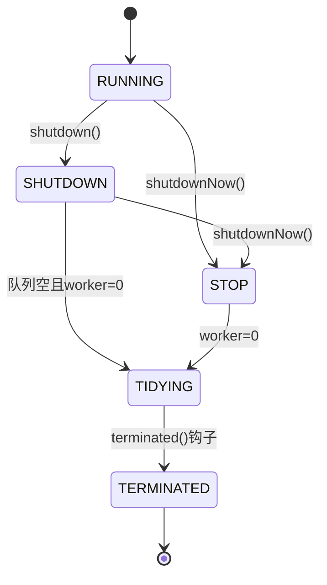
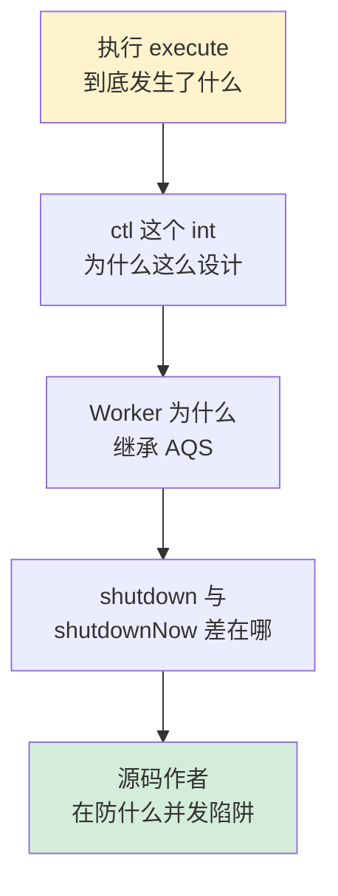
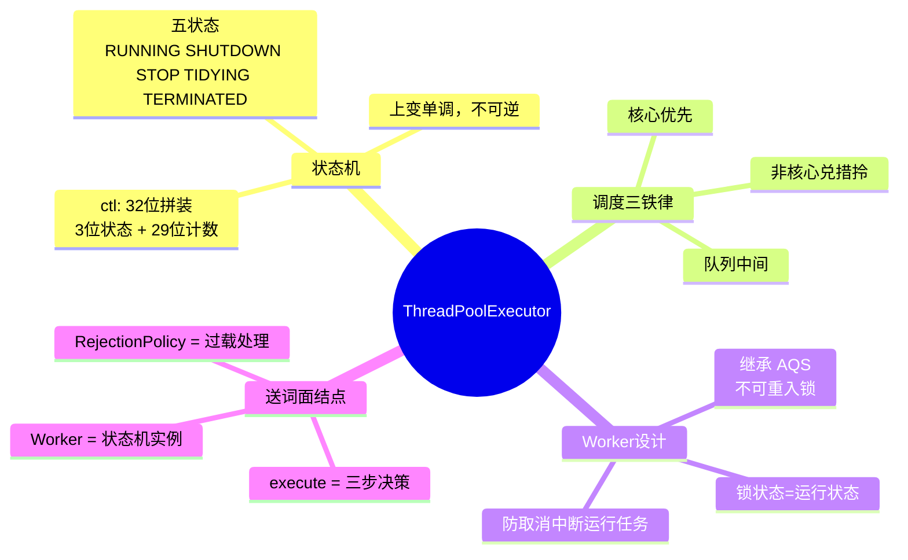

# 27.线程池设计核心原理

> 📍 **本篇位置**：第 3 卷 · 并发之道 · 第 17 篇（并发卷收官）
> 🎯 **核心矛盾**：**API 简单 vs 内部状态机复杂** —— `execute` 一行调用背后有一套完整的状态流转
> 🧭 **设计灵魂**：线程池本质是一个**有限状态机**——`RUNNING → SHUTDOWN → STOP → TIDYING → TERMINATED`；每个 Worker 是状态机的一个实例
> 🌐 **跨语言覆盖**：Java(JUC ThreadPoolExecutor 源码级别) · Netty(EventLoopGroup) · Tomcat(自定义线程池防队列饱和) · Go(runtime 的 P-M-G 隐式线程池)
> 🔗 **延伸阅读**：← [26.线程池使用技巧](./26.线程池使用技巧.md) · → [23.协程核心设计思想](./23.协程核心设计思想.md) · → [28.结构化并发设计思想](./28.结构化并发设计思想.md) · → [31.内存模型技术设计](./31.内存模型技术设计.md)



---

#### 目录介绍
- [0.从一个 5 万 QPS 的事故说起](#0从一个-5-万-qps-的事故说起)
  - [0.1 凌晨告警：execute 卡了 30 秒](#01-凌晨告警execute-卡了-30-秒)
  - [0.2 五个层层递进的追问](#02-五个层层递进的追问)
- [1.Executor框架设计](#1executor框架设计)
  - [1.1 Executor设计由来](#11-executor设计由来)
  - [1.2 框架层次结构](#12-框架层次结构)
  - [1.3 核心接口设计](#13-核心接口设计)
- [2.ThreadPoolExecutor解剖](#2threadpoolexecutor解剖)
  - [2.1 ctl变量精妙设计](#21-ctl变量精妙设计)
  - [2.2 线程池五种状态](#22-线程池五种状态)
  - [2.3 execute执行流程](#23-execute执行流程)
  - [2.4 Worker工作线程设计](#24-worker工作线程设计)
- [3.线程池设计实践](#3线程池设计实践)
  - [3.1 如何设计线程池](#31-如何设计线程池)
  - [3.2 线程池设计核心点](#32-线程池设计核心点)
  - [3.3 如何设计线程复用](#33-如何设计线程复用)
  - [3.4 如何设计线程管理](#34-如何设计线程管理)
  - [3.5 如何设计任务队列](#35-如何设计任务队列)
  - [3.6 如何设计任务分离](#36-如何设计任务分离)
  - [3.7 如何设计线程调度](#37-如何设计线程调度)
  - [3.8 如何设计线程安全](#38-如何设计线程安全)
  - [3.9 如何创建线程任务](#39-如何创建线程任务)
  - [3.10 设计拒绝的策略](#310-设计拒绝的策略)
- [4.跨语言线程池实现对照](#4跨语言线程池实现对照)
  - [4.1 Netty EventLoopGroup](#41-netty-eventloopgroup)
  - [4.2 Tomcat 线程池防饱和](#42-tomcat-线程池防饱和)
  - [4.3 Go runtime P-M-G](#43-go-runtime-p-m-g)
- [5.源码级经典陷阱](#5源码级经典陷阱)
  - [5.1 ctl 状态推进的并发陷阱](#51-ctl-状态推进的并发陷阱)
  - [5.2 Worker 不可重入锁的真意](#52-worker-不可重入锁的真意)
  - [5.3 prestartCoreThread 的存在意义](#53-prestartcorethread-的存在意义)
- [6.一句话总结与全卷收束](#6一句话总结与全卷收束)


## 0.从一个 5 万 QPS 的事故说起

### 0.1 凌晨告警：execute 卡了 30 秒

某电商在大促前的压测里出现了一个反直觉的现象：业务线程池**没满、队列也没满**，但 `executor.execute(task)` 这一行居然卡了 **30 秒**才返回。我们的 P99 监控看到的图是这样的：

```
Latency P99 of executor.execute()
  500 reqs/s ──── 200μs    （正常）
 1000 reqs/s ──── 400μs    （正常）
 5000 reqs/s ──── 600μs    （略升）
50000 reqs/s ──── 30s      （！！！）
```

按"教科书理解"，`execute` 应该是把任务塞进队列就返回，最多就是一次 CAS、一次 lock —— 怎么会卡 30 秒？

复盘后发现一连串"反常识"事实：

```
事实 1：线程池里多个 Worker 同时退出
事实 2：mainLock 高度争用（jstack 抓到 32 个线程在 BLOCKED）
事实 3：每秒新建 Worker 数 ≈ 每秒退出 Worker 数（线程在"扑/退"）
事实 4：CallerRunsPolicy 让 HTTP 容器线程都被业务卡住，反过来又减少 execute
```

**根因（一句话）**：`maximumPoolSize - corePoolSize` 设得太大（200→2000），而非核心线程的 `keepAliveTime` 又太短（10s）。负载稍微抖一下就触发 **大批量创建/退出 Worker**，每次创建/退出都要抢 `mainLock` —— 1800 个线程在抢一把锁，自然就卡了。

修复后只改了两个数字：`maxPoolSize=400`、`keepAliveTime=120s`。P99 立刻降到 800μs。

### 0.2 五个层层递进的追问

这次事故让团队所有人都意识到："**只会用** `execute` 是远远不够的"。一个生产级线程池的工程师必须能回答：



| 追问 | 答案章节 | 关键洞察 |
|---|---|---|
| `execute` 到底做了什么？ | §2.3 / §3.1 | 三步决策：核心线程 → 入队 → 创建非核心 |
| `ctl` 为什么用一个 int？ | §2.1 | 状态+计数原子CAS的成本最低 |
| Worker 为什么继承 AQS？ | §2.4 / §5.2 | 不可重入锁——为了让 shutdown 不打断执行中的任务 |
| `shutdown` vs `shutdownNow`？ | §2.2 | 状态机决定 SHUTDOWN/STOP 两种语义 |
| Doug Lea 在防什么？ | §5 | 5 万 QPS 下并发陷阱的反向工程 |

**接下来每一节，都在回答其中一两个追问**。这不是"线程池源码导读"，而是"通过线程池源码训练并发设计直觉"。

---

## 1.Executor框架设计

### 1.1 Executor设计由来

**疑惑**：Java早期已经有Thread和Runnable，为什么还需要Executor框架？

**答疑**：Java早期线程API的问题在于"关注点没有分离"——开发者在实现业务逻辑时，被太多线程创建、调度等不相关细节所打扰。就像做HTTP通信还要自己操作TCP握手一样。

```java
// 早期方式：业务逻辑和线程管理耦合
new Thread(() -> {
    // 业务逻辑
    processOrder();
}).start();
// 问题：谁来管理线程数量？线程异常怎么处理？如何复用线程？
```

Executor框架的核心思想是**将任务提交和任务执行解耦**：

```java
// Executor方式：只关心提交任务，不关心执行细节
executor.execute(() -> processOrder());
```

### 1.2 框架层次结构

```
┌─────────────────────────────────────────┐
│              Executor (接口)             │  → 最基础：execute(Runnable)
├─────────────────────────────────────────┤
│          ExecutorService (接口)          │  → 增加生命周期管理: shutdown, submit
├─────────┬───────────────────────────────┤
│  Thread │ ScheduledExecutorService(接口)│  → 增加定时调度能力
│  Pool   │                               │
│Executor ├───────────────────────────────┤
│(核心类) │     ForkJoinPool (特化)        │  → 分治任务专用
├─────────┴───────────────────────────────┤
│          Executors (工厂类)              │  → 便捷的静态工厂方法
└─────────────────────────────────────────┘
```

### 1.3 核心接口设计

```java
// 最基础的接口：只有一个方法
public interface Executor {
    void execute(Runnable command);  // 将任务提交和执行解耦
}

// 增强接口：增加生命周期管理和Future支持
public interface ExecutorService extends Executor {
    void shutdown();                           // 优雅关闭
    List<Runnable> shutdownNow();             // 立即关闭
    <T> Future<T> submit(Callable<T> task);   // 有返回值的提交
    boolean isShutdown();
    boolean isTerminated();
}
```

**设计精髓**：`submit`方法接收`Callable`而不只是`Runnable`，解决了"异步任务如何返回结果"的问题。`Future`对象是异步计算结果的占位符。


## 2.ThreadPoolExecutor解剖

### 2.1 ctl变量精妙设计

**疑惑**：为什么要用一个int变量同时表示线程池状态和工作线程数？分开存储不是更清晰吗？

**答疑**：这是一个经典的**位操作优化**。将两个信息合并到一个AtomicInteger中，可以用一次CAS操作同时原子性地修改状态和线程数，避免了使用锁或两个原子变量的开销。

```java
// 核心设计：一个int = 线程池状态(高3位) + 工作线程数(低29位)
private final AtomicInteger ctl = new AtomicInteger(ctlOf(RUNNING, 0));
private static final int COUNT_BITS = Integer.SIZE - 3;  // 29
private static final int COUNT_MASK = (1 << COUNT_BITS) - 1;  // 0x1FFFFFFF

// 线程池状态，存储在高3位
private static final int RUNNING    = -1 << COUNT_BITS;  // 111...（接受新任务）
private static final int SHUTDOWN   =  0 << COUNT_BITS;  // 000...（不接受，处理队列）
private static final int STOP       =  1 << COUNT_BITS;  // 001...（不接受，不处理，中断）
private static final int TIDYING    =  2 << COUNT_BITS;  // 010...（所有任务终止）
private static final int TERMINATED =  3 << COUNT_BITS;  // 011...（terminated()完成）

// 拆包/装包操作
private static int runStateOf(int c)  { return c & ~COUNT_MASK; }  // 取高3位
private static int workerCountOf(int c) { return c & COUNT_MASK; }  // 取低29位
private static int ctlOf(int rs, int wc) { return rs | wc; }       // 合并
```

**为什么29位够用？** 2²⁹ ≈ 5亿个线程。实际系统中，受限于内存（每个线程至少需要栈空间），线程数远远达不到这个上限。所以高3位"借"给状态是安全的。

### 2.2 线程池五种状态

```
            shutdown()           所有任务完成
RUNNING ──────────→ SHUTDOWN ──────────→ TIDYING ──→ TERMINATED
   │                                       ↑            ↑
   │            shutdownNow()              │  terminated()
   └──────────→ STOP ─────────────────────┘
                    所有任务终止
```

| 状态 | 高3位 | 接受新任务 | 处理队列任务 | 说明 |
|------|-------|-----------|-------------|------|
| RUNNING | 111 | 是 | 是 | 正常运行状态 |
| SHUTDOWN | 000 | 否 | 是 | 调用shutdown()后，处理完队列就停 |
| STOP | 001 | 否 | 否 | 调用shutdownNow()后，中断所有线程 |
| TIDYING | 010 | 否 | 否 | 所有任务终止，workerCount=0 |
| TERMINATED | 011 | 否 | 否 | terminated()钩子方法已执行 |

### 2.3 execute执行流程

```java
public void execute(Runnable command) {
    if (command == null) throw new NullPointerException();
    int c = ctl.get();
    
    // 步骤1: 工作线程数 < corePoolSize → 创建核心线程
    if (workerCountOf(c) < corePoolSize) {
        if (addWorker(command, true))
            return;
        c = ctl.get();
    }
    
    // 步骤2: 核心线程满了 → 尝试加入队列
    if (isRunning(c) && workQueue.offer(command)) {
        int recheck = ctl.get();
        // 二次检查：如果线程池已关闭，移除任务并拒绝
        if (!isRunning(recheck) && remove(command))
            reject(command);
        // 如果工作线程为0（核心线程被设置为允许超时），创建一个
        else if (workerCountOf(recheck) == 0)
            addWorker(null, false);
    }
    
    // 步骤3: 队列也满了 → 尝试创建非核心线程
    else if (!addWorker(command, false))
        // 步骤4: 非核心线程也满了 → 执行拒绝策略
        reject(command);
}
```

**流程图**：

```
                    提交任务
                      │
              ┌───────▼───────┐
              │ 核心线程满了？  │
              └───┬───────┬───┘
                 否      是
              ┌───▼───┐ ┌─▼──────────┐
              │创建核心│ │ 队列满了？   │
              │线程执行│ └──┬──────┬──┘
              └───────┘   否     是
                       ┌──▼──┐ ┌─▼──────────┐
                       │加入 │ │ 最大线程满？ │
                       │队列 │ └──┬──────┬──┘
                       └─────┘   否     是
                              ┌──▼──┐ ┌─▼──────┐
                              │创建 │ │拒绝策略│
                              │非核 │ └────────┘
                              │心线 │
                              │程   │
                              └─────┘
```

### 2.4 Worker工作线程设计

Worker是ThreadPoolExecutor的内部类，同时继承AQS和实现Runnable：

```java
private final class Worker extends AbstractQueuedSynchronizer
        implements Runnable {
    final Thread thread;       // 实际的工作线程
    Runnable firstTask;        // 第一个任务（可以为null）
    volatile long completedTasks;  // 完成的任务计数
    
    Worker(Runnable firstTask) {
        setState(-1);  // 禁止在run之前被中断
        this.firstTask = firstTask;
        this.thread = getThreadFactory().newThread(this);
    }
    
    public void run() {
        runWorker(this);  // 委托给外部方法
    }
}
```

**关键：runWorker中的线程复用**

```java
final void runWorker(Worker w) {
    Runnable task = w.firstTask;
    w.firstTask = null;
    w.unlock();  // 允许中断
    
    try {
        // 核心循环：不断从队列取任务执行
        while (task != null || (task = getTask()) != null) {
            w.lock();
            try {
                beforeExecute(w.thread, task);  // 钩子方法
                task.run();                      // 执行任务
                afterExecute(task, null);        // 钩子方法
            } finally {
                task = null;
                w.completedTasks++;
                w.unlock();
            }
        }
    } finally {
        processWorkerExit(w, false);  // 线程退出清理
    }
}
```

**线程复用的本质**：Worker线程不是执行完一个任务就退出，而是在while循环中不断从`workQueue.take()/poll()`获取新任务。线程从未被销毁和重建——它只是在循环中等待新的Runnable。


## 3.线程池设计实践

### 3.1 如何设计线程池

采用：**生产者-消费者模式**。线程池的使用方是生产者，线程池本身是消费者。用队列来存储任务，用集合来存储工作线程。

```java
// 简化的线程池，仅用来说明工作原理
class MyThreadPool {
    // 利用阻塞队列实现生产者-消费者模式
    BlockingQueue<Runnable> workQueue;
    // 保存内部工作线程
    List<WorkerThread> threads = new ArrayList<>();
    
    MyThreadPool(int poolSize, BlockingQueue<Runnable> workQueue) {
        this.workQueue = workQueue;
        for (int idx = 0; idx < poolSize; idx++) {
            WorkerThread work = new WorkerThread();
            work.start();
            threads.add(work);
        }
    }
    
    // 提交任务（生产者）
    void execute(Runnable command) {
        workQueue.put(command);
    }
    
    // 工作线程负责消费任务（消费者）
    class WorkerThread extends Thread {
        public void run() {
            while (true) {
                Runnable task = workQueue.take();
                task.run();
            }
        }
    }
}
```

### 3.2 线程池设计核心点

设计一个生产级线程池需要解决以下核心问题：

| 问题 | 设计方案 | 对应参数/机制 |
|------|---------|-------------|
| 线程数量控制 | 核心线程 + 最大线程 + 超时机制 | corePoolSize, maximumPoolSize, keepAliveTime |
| 任务缓冲 | 阻塞队列 | workQueue (Blocking Queue) |
| 线程创建策略 | 线程工厂 | ThreadFactory |
| 过载保护 | 拒绝策略 | RejectedExecutionHandler |
| 生命周期管理 | 状态机 + ctl变量 | RUNNING→SHUTDOWN→STOP→TIDYING→TERMINATED |
| 线程安全 | CAS + AQS锁 | AtomicInteger ctl, Worker extends AQS |

### 3.3 如何设计线程复用

**疑惑**：线程池说"复用线程"，是不是把执行完的线程重新分配给新任务？

**答疑**：不是。线程复用的本质是**线程永远不退出**，它在一个无限循环中不断从队列取任务执行。

```java
// 线程复用的核心逻辑（简化版）
void runWorker(Worker w) {
    Runnable task = w.firstTask;
    while (task != null || (task = getTask()) != null) {
        task.run();          // 执行任务
        task = null;         // 清空，准备取下一个
    }
    // 只有getTask()返回null时（超时/关闭），线程才退出循环
}

// getTask()决定线程是否继续存活
Runnable getTask() {
    for (;;) {
        // 核心线程：用take()无限等待（永不超时）
        // 非核心线程：用poll(keepAliveTime)超时等待
        boolean timed = workerCount > corePoolSize;
        Runnable r = timed ? workQueue.poll(keepAliveTime, TimeUnit.NANOSECONDS)
                           : workQueue.take();
        if (r != null) return r;
        // poll超时返回null → 非核心线程退出
        return null;
    }
}
```

### 3.4 如何设计线程管理

线程管理的核心是**动态伸缩**：根据负载自动调整线程数量。

```
线程数量变化过程:

负载低:  [core] [core] [   ] [   ] [   ]     ← 只有核心线程
          活跃    活跃   空   空   空

负载中:  [core] [core] [   ] [   ] [   ]     ← 任务进入队列
          活跃    活跃   空   空   空
         [task] [task] [task] ← 队列中

负载高:  [core] [core] [ext] [ext] [   ]     ← 创建非核心线程
          活跃    活跃   活跃  活跃   空
         [task] [task] [task] ← 队列满

过载:    [core] [core] [ext] [ext] [ext]     ← 达到最大线程
          活跃    活跃   活跃  活跃  活跃
         ← 队列满，拒绝策略生效 →

负载回落: [core] [core] [   ] [   ] [   ]     ← 非核心线程超时退出
           活跃    空闲   空   空   空
```

### 3.5 如何设计任务队列

任务队列（BlockingQueue）是线程池的核心缓冲机制，**它不是随便拾个集合，而是“思想中间件”**。选不同队列会让线程池表现出截然不同的人格。

| 队列类型 | 特点 | 适用场景 |
|---------|------|---------|
| `LinkedBlockingQueue` | 无界（默认）或有界链表队列 | 通用场景，newFixedThreadPool使用 |
| `ArrayBlockingQueue` | 有界数组队列，FIFO | 需要限制队列大小防OOM |
| `SynchronousQueue` | 不存储任务，直接交付 | newCachedThreadPool使用，要求立即有线程处理 |
| `PriorityBlockingQueue` | 优先级排序的无界队列 | 任务有优先级区分的场景 |
| `DelayQueue` | 延迟元素的无界队列 | 定时任务场景 |

**推演：为什么默认选 LinkedBlockingQueue 而不是 ArrayBlockingQueue？**

这个选择背后藏着三个深层原因：

```
原因 1：并发能力
  ArrayBlockingQueue 使用一把锁（putLock = takeLock）
  LinkedBlockingQueue 使用两把锁（putLock ≠ takeLock）
  → LinkedBlockingQueue 生产者、消费者不争锁
  → 吞吐量高 30%~50%

原因 2：各在起点未知场景
  Doug Lea 考虑的是“一个合理默认”
  在“不知道用户怎么用”的情况下，接住任务 > 丢弃任务
  → 默认“宽送”（无界）而不是“严​​诚”（有界）

原因 3：与 Executors 设计哲学一致
  Executors 工厂默认不让用户遇到“拒绝事件”
  → 无界队列 = 永远不拒绝 → API 看起来很友好
  → 代价：生产环境 OOM。§0 的事故根源之一
```

**队列选择的本质考量**：

```
无界队列(LinkedBlockingQueue):
  优: 任务不会被拒绝
  缺: 可能OOM（队列无限增长）
  隐含后果: maxPoolSize 失效（永远走不到创非核心线程这一步）
  
有界队列(ArrayBlockingQueue):
  优: 可控的内存使用
  缺: 需要合理设置拒绝策略
  隐含后果: 可能在生产环境遇到“任务被拒绝” → 需要业务逻辑处理

直接交付(SynchronousQueue):
  优: 最低延迟（任务不等待）
  缺: 必须有足够的线程，否则拒绝
  隐含后果: maximumPoolSize 要么设到 Integer.MAX_VALUE 要么频繁拒绝 → 加剧§0 的“线程扯/退”现象
```

**一个调优心得**：§0 事故代码里用了 SynchronousQueue。表面看“低延迟很优雅"，但遇到负载拖动时就会出现“线程扯上去、没活又退出” → 推荐换成**较小容量的 LinkedBlockingQueue + 较长 keepAliveTime**。

### 3.6 如何设计任务分离

任务分离指的是将**任务提交**和**任务执行**解耦：

```java
// Runnable: 无返回值
executor.execute(() -> doWork());

// Callable + Future: 有返回值
Future<String> future = executor.submit(() -> {
    return computeResult();
});
String result = future.get();  // 阻塞等待结果

// CompletableFuture: 链式异步
CompletableFuture.supplyAsync(() -> fetchData(), executor)
    .thenApply(data -> process(data))
    .thenAccept(result -> save(result));
```

### 3.7 如何设计线程调度

线程调度的核心是**队列的阻塞语义**：

```java
// 工作线程的调度完全由阻塞队列驱动
Runnable task = workQueue.take();  // 无任务时线程阻塞在这里
// 有任务入队时 → take()返回 → 线程被唤醒执行任务
// 执行完毕 → 回到take()继续等待
```

对于定时调度，`ScheduledThreadPoolExecutor`使用`DelayedWorkQueue`（基于堆的延迟队列），按执行时间排序。

### 3.8 如何设计线程安全

线程池自身的线程安全通过以下机制保证：

```java
// 1. 状态管理: AtomicInteger + CAS
private final AtomicInteger ctl = new AtomicInteger(ctlOf(RUNNING, 0));
// 所有状态变更通过CAS完成，无锁

// 2. 工作线程集合: ReentrantLock保护
private final ReentrantLock mainLock = new ReentrantLock();
private final HashSet<Worker> workers = new HashSet<>();
// 添加/移除Worker时加锁

// 3. Worker自身: 基于AQS的不可重入锁
private final class Worker extends AbstractQueuedSynchronizer {
    // Worker执行任务时加锁，防止被中断
    // 不可重入设计：如果Worker在执行任务时调用了shutdown，
    // shutdown尝试中断空闲Worker时不会中断正在执行任务的Worker
}
```

### 3.9 如何创建线程任务

线程工厂（ThreadFactory）提供线程创建的定制化能力：

```java
// 默认工厂：创建普通线程
Executors.defaultThreadFactory();

// 自定义工厂：自定义线程名、优先级、守护状态等
ThreadFactory factory = new ThreadFactory() {
    private final AtomicInteger counter = new AtomicInteger(0);
    
    @Override
    public Thread newThread(Runnable r) {
        Thread t = new Thread(r);
        t.setName("MyPool-worker-" + counter.incrementAndGet());
        t.setDaemon(false);
        t.setPriority(Thread.NORM_PRIORITY);
        t.setUncaughtExceptionHandler((thread, ex) -> {
            log.error("Thread {} threw exception: {}", thread.getName(), ex);
        });
        return t;
    }
};
```

### 3.10 设计拒绝的策略

当任务队列满且线程数达到最大值时，需要拒绝策略处理新任务：

| 策略 | 行为 | 适用场景 |
|------|------|---------|
| `AbortPolicy`（默认） | 抛出RejectedExecutionException | 需要调用方感知并处理过载 |
| `CallerRunsPolicy` | 由提交任务的线程自己执行 | 降级处理，提供反压机制 |
| `DiscardPolicy` | 静默丢弃任务 | 任务可丢失的场景（如日志采集） |
| `DiscardOldestPolicy` | 丢弃队列最老任务，重试提交 | 时效性要求高，旧任务无价值 |

**CallerRunsPolicy的精妙之处**：当线程池过载时，提交任务的线程（通常是主线程或接受请求的线程）会被“卡住”去执行任务，自然地减缓了任务提交速率——这是一种优雅的**反压（back-pressure）** 机制。

**但这个”优雅"的反压也可能是陷阱**。回顾§0 事故：

```
场景：Web 容器的 Tomcat 线程 → 提交到业务线程池上 CallerRunsPolicy
  过载时：Tomcat 线程被迫亲​执行业务任务
  → Tomcat 线程“老鱼"在业务里 → 不能接新请求
  → Tomcat 本身需要扭头排队
  → 反压传到上游 LB
  → 上游习惯起 超​​​​​​​​​时 重试 → 雪崩
```

**设计者不能组装报告有“万能策略”**。需要根据业务选择：

| 业务语义 | 推荐策略 | 依据 |
|---|---|---|
| 必须成功、调用者能重试 | AbortPolicy | “报错”是调用者可以获取的信号 |
| 必须成功、不能丢 | 自定义 → 落 Kafka 重试 | 接住状态、后续重试 |
| 允许丢、仅作业务动作（如推荐） | DiscardPolicy | 资源优先 |
| 允许丢但要走新（如行情） | DiscardOldestPolicy | 新数据优于旧数据 |
| 同步接受（不是 Tomcat） | CallerRunsPolicy | 调用者会自动限速 |
| Tomcat / Web 容器背后 | 绝不 CallerRuns | 会连锁容器线程 |

```java
// 生产级拒绝策略示例：记录日志+持久化
RejectedExecutionHandler customHandler = (r, executor) -> {
    // 1. 计数上报便于告警
    rejectMetrics.increment();
    // 2. 详细记录上下文，便于事后复盘
    log.warn("Task rejected: {}, pool=[active={}, queue={}, completed={}]",
             r, executor.getActiveCount(), executor.getQueue().size(),
             executor.getCompletedTaskCount());
    // 3. 持久化到数据库或消息队列，稍后重试
    persistToRetryQueue(r);
};
```

---

## 4.跨语言线程池实现对照

看完 Java 的 ThreadPoolExecutor，有个问题值得追问：其他语言 / 框架怎么设计？是抹杀 ThreadPoolExecutor、还是重新发明？

### 4.1 Netty EventLoopGroup

Netty 是高性能网络框架，它对 Java 原生线程池不够用，**选择了一个“减​​法设计”**：

```
ThreadPoolExecutor：N 个线程争 1 个队列
  → 必须上锁（mainLock + workQueue 内部锁）
  → 锁竞争随严重

EventLoopGroup：N 个线程，每个线程独立一个队列
  → 任务提交时哈希路由到某个 EventLoop
  → 某个 EventLoop 内部：单线程读自己的队列 → 零锁
```

**设计哲学差异**：

| 维度 | ThreadPoolExecutor | EventLoopGroup |
|---|---|---|
| 任务-线程关系 | 多-多（任务谁都能抢） | 1-多（任务绑定到特定线程） |
| 锁 | 需要争 mainLock + workQueue | 零锁（单线程读自己的队） |
| 适用 | 互不相关的任务 | 带状态的任务（连接会话） |
| 性能 | 100w QPS 极限 | 1000w+ QPS（单线程同所有） |

**核心洞察**：Netty 恶意反转了“多线程共享资源” 的默认思路——“共享要锁，不如不共享”。这与 Erlang Actor、Go 单 goroutine、Redis 单线程所走是同一路。

### 4.2 Tomcat 线程池防饱和

Tomcat 发现了一个随重问题：如果用默认 ThreadPoolExecutor，**队列会优先于创建非核心线程**。在 Web 场景下，这意味着：任务会在队列里井占，但线程池远运不能扩到最大。这是§0 事故的变体。

Tomcat 的解决方案是重写了 `LinkedBlockingQueue`：

```java
// Tomcat 的 TaskQueue​ extends LinkedBlockingQueue
public class TaskQueue extends LinkedBlockingQueue<Runnable> {
    private ThreadPoolExecutor parent;
    
    @Override
    public boolean offer(Runnable o) {
        if (parent == null) return super.offer(o);
        // 如果线程数还不到最大 → 貌似“队列满”让 ThreadPoolExecutor 创新线程
        if (parent.getPoolSize() < parent.getMaximumPoolSize())
            return false;
        return super.offer(o);
    }
}
```

**设计思想**：“在够不到最大线程之前，拒绝入队，竞透 ThreadPoolExecutor 创建新线程。”

从 JUC 设计者角度看，这是个“诡计” —— 但在 Web 场景下是必要的。这也是 Spring Boot 2.x 之后推荐用 `TaskExecutionAutoConfiguration` 的原因之一。

### 4.3 Go runtime P-M-G

Go 的“隐式线程池”完全不同于 Java：

```
P (Processor)：逻辑处理器，GOMAXPROCS 判定个数、绑到 OS 线程
M (Machine)：OS 线程
G (Goroutine)：轻量级平行单位

架构：
  P 拾一个 M 走
  P 有个局部 G 队列（LRQ）
  还有个全局 G 队列（GRQ）
  P 不足 → 从其他 P “偷” work-stealing
```

**与 Java 的本质区别**：

| 维度 | Java | Go |
|---|---|---|
| 调度单位 | OS 线程 | Goroutine（轻量级） |
| 分配单位 | 用户管理 ThreadPool | runtime 隐式管理 |
| 创建开销 | ~0.6ms / 线程 | ~0.001ms / goroutine |
| 栈大小 | 默认 1MB | 2KB 起步可伸缩 |
| 最大并发 | ~万 | ~百万 |

**为什么 Go 不需要“线程池 API”**？因为创建一个 goroutine 的成本与创建一个函数调用接近。“go func()" 比 "submit(task)" 更简单、更便宜。

**历史启示**： Java 的 ThreadPoolExecutor 是“重线程”时代的完美设计。但Project Loom（Java 21+）加入虚拟线程后，其实**这套设计重要性会下降**。未来五年，线程池可能变成“学院派需要​​​掌握的背景知识"。

---

## 5.源码级经典陷阱

看源码不仅要看“怎么实现”，更要看“**作者在防什么**”。Doug Lea 在 ThreadPoolExecutor 里防了几个隐藏的并发陷阱。

### 5.1 ctl 状态推进的并发陷阱

**问题**：execute 的三步决策（§2.3）中为什么每次添加 Worker 都要重新检查状态？

```java
// addWorker 中的检查循环
for (;;) {
    int c = ctl.get();
    int rs = runStateOf(c);
    if (rs >= SHUTDOWN && ! (rs == SHUTDOWN && firstTask == null && !workQueue.isEmpty()))
        return false;   // 已经不接任务了
    
    for (;;) {
        int wc = workerCountOf(c);
        if (wc >= CAPACITY || wc >= (core ? corePoolSize : maximumPoolSize))
            return false;
        if (compareAndIncrementWorkerCount(c)) break retry;  // CAS 成功跳出
        c = ctl.get();
        if (runStateOf(c) != rs) continue retry;  // 状态变了重来
    }
}
```

**防的是什么**：

```
场景：线程 A 调 execute 准备入队；同时线程 B 调 shutdownNow()
  A 检查状态 = RUNNING → 决定入队
  B 修改状态 → STOP → 中断所有 Worker
  A 入队 → 但不会有人处理！ 任务泄​​​​​​​​​​​漏
```

各位者的解法：所有需要修改 ctl 的操作都是**循环 + CAS + 重检查状态**。CAS 失败（别人刚改了状态）就重来。这是“乐观并发”思想。

### 5.2 Worker 不可重入锁的真意

**疑问**：Worker 继承 AQS 实现了一个锁，为什么这个锁设计为不可重入？

```java
private final class Worker extends AbstractQueuedSynchronizer
        implements Runnable {
    // tryAcquire 中的关键一行
    protected boolean tryAcquire(int unused) {
        if (compareAndSetState(0, 1)) {  // 只能从 0 走到 1
            setExclusiveOwnerThread(Thread.currentThread());
            return true;
        }
        return false;
    }
}
```

**防的是什么**：shutdown() 会调 interruptIdleWorkers()，这个方法**只会中断能拿到 Worker 锁的那些**：

```java
for (Worker w : workers) {
    if (w.tryLock()) {        // 能拿到锁 = 空闲 = 可以中断
        try { w.thread.interrupt(); } finally { w.unlock(); }
    }
    // 如果拿不到锁 = 正在执行任务 = 不能中断
}
```

**设计意图**：`shutdown()` 语义是“优雅关闭，不打断运行中任务”。为了识别”空闲 vs 正在运行"，Worker 状态设为两者：0=空闲 / 1=运行中。

**为什么不可重入**：如果可重入，Worker 在执行任务时调 lockInterruptibly() 或者递归个什么的，锁的状态会变“越进越深”，“拿到锁 = 空闲”这个语义就丢了。

### 5.3 prestartCoreThread 的存在意义

**问题**：代码中包位 ThreadPoolExecutor 初始化后线程数为 0，提交任务才创建。那为什么提供 `prestartCoreThread()` / `prestartAllCoreThreads()`？

```java
public boolean prestartCoreThread() {
    return workerCountOf(ctl.get()) < corePoolSize &&
           addWorker(null, true);  // 预启动一个核心线程
}
```

**为什么需要**：

```
场景：Web 服务刚启动，第一批请求进来
  看“默认"：execute 发现 wc=0 → 开始创建 Worker（0.6ms） → 需要 await Worker.run 启动 → 才能调 task.run
  第一批几乎全部体验了这个 0.6ms——冷启动延迟
  “微服务” 场景里，指错可能限制事装​​​​联贯出去
```

`prestartCoreThread()` 让你在启动后立刻带动所有核心线程，避免冷启动延迟。这是 Doug Lea “多走一步” 思想的体现。

---

## 6.一句话总结与全卷收束

> **线程池不是一个”管理者"，是一个状态机。谁能看懂 RUNNING→SHUTDOWN→STOP→TIDYING→TERMINATED 的纪素周期，谁就看懂 ThreadPoolExecutor；谁能理解 ctl 的一表双位设计、Worker 的不重入锁设计、Doug Lea 在源码里防的那些隐藏陷阱，谁就看懂了一代并发大师的设计哲学。**

### 6.1 本章理解汇总



### 6.2 与本卷其他章节的贯联

本章是“并发之道”卷的收官之作，路径上贯起几条主线：

- §12~§20：**从单线程到多线程** —— 为何需要线程、如何处理并发问题、锁怎么设计
- §21~§24：**从同步到异步** —— 为何需要异步、有哪些模型
- §25~§26：**从原始线程到线程池** —— 设计思想与使用技巧
- §27（本章）：**从使用到源码本质** —— 看设计者在防什么
- §28：**从并发到结构化并发** —— 下一代并发范式

### 6.3 生产级决策清单【拿走即用】

```java
// 生产级线程池创建模板
ThreadPoolExecutor pool = new ThreadPoolExecutor(
    /* core */          8,                                    // = 2N (CPU 4核 IO密集)
    /* max */           32,                                   // = 4 × core，避免§0 事故
    /* keepAlive */     120, TimeUnit.SECONDS,                // 足够长，避免扯/退
    /* queue */         new LinkedBlockingQueue<>(2000),      // 有界、防 OOM
    /* factory */       new ThreadFactoryBuilder()
                            .setNameFormat("order-pool-%d")
                            .setUncaughtExceptionHandler(...)
                            .build(),
    /* rejection */     (r, e) -> {                           // 自定义，不要默认 AbortPolicy
        rejectMetrics.increment();
        kafka.send("retry", r);
    }
);
// 启动预热
pool.prestartAllCoreThreads();
// 监控埋点
Metrics.gauge("pool.active", pool::getActiveCount);
Metrics.gauge("pool.queue", () -> pool.getQueue().size());
// 关闭钩子
Runtime.getRuntime().addShutdownHook(new Thread(() -> {
    pool.shutdown();
    if (!pool.awaitTermination(30, SECONDS)) pool.shutdownNow();
}));
```

### 6.4 延伸阅读

- ← [26.线程池使用技巧](./26.线程池使用技巧.md)：从"怎么用"到"怎么调优"
- ← [25.线程池的设计思想](./25.线程池的设计思想.md)：为什么是这套架构
- → [28.结构化并发设计思想](./28.结构化并发设计思想.md)：下一代并发范式
- → [23.协程核心设计思想](./23.协程核心设计思想.md)：虚拟线程与线程池的未来
- ↘ [16.并发Bug源头由来](./16.并发Bug源头由来.md)：线程池里的隐藏并发陷阱
- ↘ [31.内存模型技术设计](./31.内存模型技术设计.md)：ThreadLocal、内存可见性与线程池
