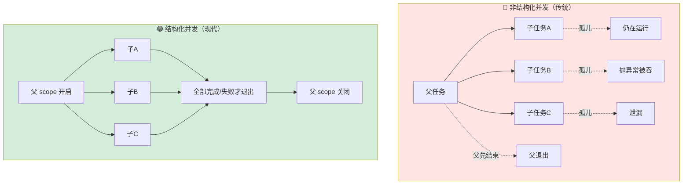
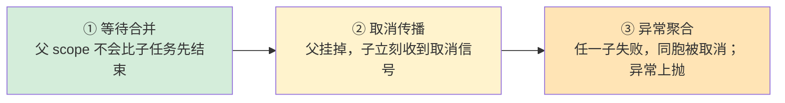
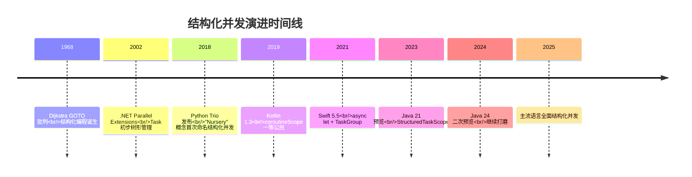
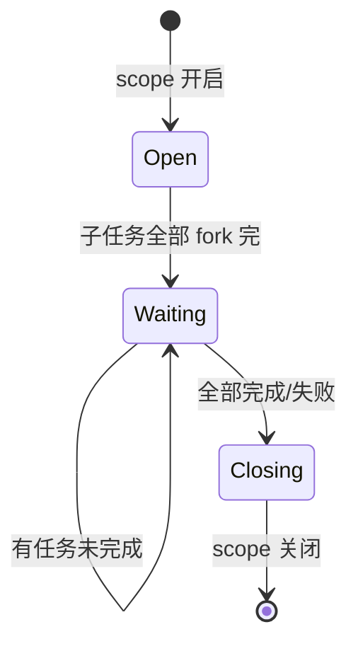
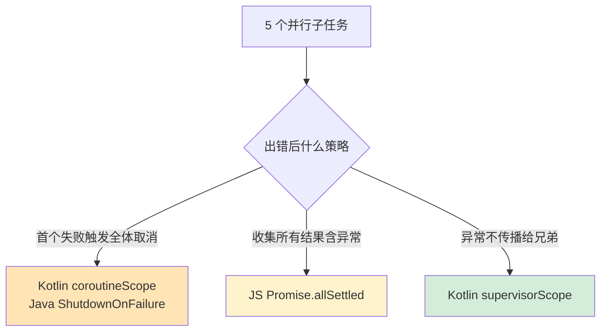
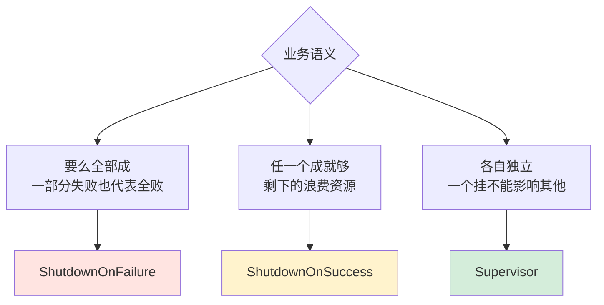
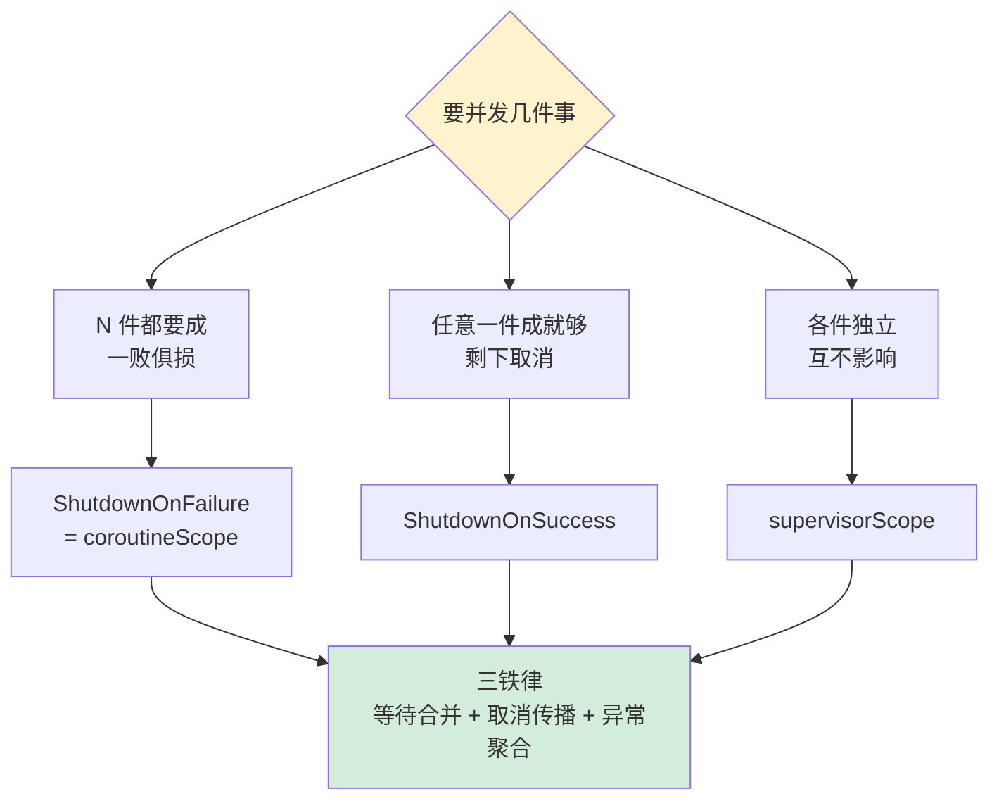

# 28.结构化并发设计思想

> 📍 **本篇位置**：第 3 卷 · 并发之道 · 第 18 篇（并发卷压轴 · 范式革命）
> 🎯 **核心矛盾**：**任务可以随便开 vs 谁来负责它们的终止、错误、取消？** —— 传统 `new Thread`/`go f()`/`Task.Run` 都是"撒出去就不管"，留下了泄漏、幽灵任务、错误吞没三大深坑
> 🧭 **设计灵魂**：把**并发任务的生命周期**和**词法作用域**绑定——**"函数不返回，它开出的任何子任务都不能存活"**。并发结构回到了顺序代码的"大括号即生命周期"的简单性
> 🌐 **跨语言覆盖**：Kotlin(coroutineScope / supervisorScope) · Swift(async let / TaskGroup) · Java 21(StructuredTaskScope 预览) · Python Trio(nursery 首创) · C#(Task.WhenAll 半结构化) · JS(Promise.all 半结构化)
> 🔗 **延伸阅读**：← [23.协程核心设计思想](./23.协程核心设计思想.md) · ← [24.Actor与CSP并发模型](./24.Actor与CSP并发模型.md) · ← [27.线程池设计核心原理](./27.线程池设计核心原理.md) · → [31.内存模型技术设计](./31.内存模型技术设计.md)



---

#### 目录介绍
- [1.根本矛盾：并发为什么难](#1根本矛盾并发为什么难)
  - [1.1 一个真实的生产事故](#11-一个真实的生产事故)
  - [1.2 传统并发的三大深坑](#12-传统并发的三大深坑)
  - [1.3 Goto 十年与并发今日](#13-goto-十年与并发今日)
- [2.设计灵魂：词法作用域 = 生命周期](#2设计灵魂词法作用域--生命周期)
  - [2.1 结构化并发的一行定义](#21-结构化并发的一行定义)
  - [2.2 三条不可违反的铁律](#22-三条不可违反的铁律)
  - [2.3 顺序 vs 并发代码对照](#23-顺序-vs-并发代码对照)
- [3.设计演进史](#3设计演进史)
  - [3.1 2018 Trio 率先提出 Nursery](#31-2018-trio-率先提出-nursery)
  - [3.2 2019 Kotlin 一等支持](#32-2019-kotlin-一等支持)
  - [3.3 2021 Swift async/await 落地](#33-2021-swift-asyncawait-落地)
  - [3.4 2023 Java 21 预览](#34-2023-java-21-预览)
- [4.跨语言实现对照](#4跨语言实现对照)
  - [4.1 Kotlin：coroutineScope](#41-kotlincoroutinescope)
  - [4.2 Swift：async let 与 TaskGroup](#42-swiftasync-let-与-taskgroup)
  - [4.3 Java 21：StructuredTaskScope](#43-java-21structuredtaskscope)
  - [4.4 Python Trio：nursery 始祖](#44-python-trionursery-始祖)
  - [4.5 半结构化：Promise.all 与 Task.WhenAll](#45-半结构化promiseall-与-taskwhenall)
  - [4.6 Go：为什么选择了 context 而非 scope](#46-go为什么选择了-context-而非-scope)
- [5.核心机制三要素](#5核心机制三要素)
  - [5.1 等待合并](#51-等待合并)
  - [5.2 取消传播](#52-取消传播)
  - [5.3 异常聚合](#53-异常聚合)
- [6.常见策略：Scope 的三种人格](#6常见策略scope-的三种人格)
  - [6.1 ShutdownOnFailure 全员皆输](#61-shutdownonfailure-全员皆输)
  - [6.2 ShutdownOnSuccess 一胜即返](#62-shutdownonsuccess-一胜即返)
  - [6.3 Supervisor 各自独立](#63-supervisor-各自独立)
- [7.经典陷阱与生产事故复盘](#7经典陷阱与生产事故复盘)
  - [7.1 忘记 await](#71-忘记-await)
  - [7.2 scope 泄漏](#72-scope-泄漏)
  - [7.3 CPU 密集混入 Scope](#73-cpu-密集混入-scope)
  - [7.4 取消信号被吞掉](#74-取消信号被吞掉)
  - [7.5 超时嵌套错位](#75-超时嵌套错位)
- [8.一句话总结与决策图](#8一句话总结与决策图)

---

## 1.根本矛盾：并发为什么难

### 1.1 一个真实的生产事故

一个电商下单接口，要并行查 3 个下游：库存、价格、优惠券。老代码是这样写的：

```java
// 非结构化版本
public Order placeOrder(long uid, long sku) {
    CompletableFuture<Stock>  f1 = CompletableFuture.supplyAsync(() -> stockSvc.get(sku));
    CompletableFuture<Price>  f2 = CompletableFuture.supplyAsync(() -> priceSvc.get(sku));
    CompletableFuture<Coupon> f3 = CompletableFuture.supplyAsync(() -> couponSvc.get(uid));
    // 三个 future 已经在共享线程池里跑了
    Stock s  = f1.join();
    Price p  = f2.join();
    Coupon c = f3.join();
    return merge(s, p, c);
}
```

生产一晚上出了 4 个问题：

1. **泄漏**：客户端超时断连后，没人 cancel，`f1/f2/f3` 仍在下游轰炸
2. **幽灵任务**：优惠券挂了抛异常，但上游已经 `f1.join()` 成功返回，`f3` 的异常被吞
3. **CPU 雪崩**：线程池饱和，高峰期 `supplyAsync` 直接排队 30s
4. **追查困难**：日志里 `Thread-pool-worker-17` 根本不知道是哪个请求

根因是同一个：**并发任务的生命周期 没有被任何"结构"托管**。

### 1.2 传统并发的三大深坑

| 深坑 | 典型表现 | 代价 |
|---|---|---|
| **泄漏** | 父任务已退出/超时，子任务继续跑 | 连接打爆、CPU 烧穿 |
| **吞异常** | 一个子任务抛了，其他成功了，错被忽略 | 脏数据、难定位 |
| **取消无效** | 父任务取消，子任务收不到信号 | 资源长尾、关机卡住 |

### 1.3 Goto 十年与并发今日

1968 年 Dijkstra 写下《Go To Statement Considered Harmful》——他不是说 `goto` 有 bug，而是**"goto 破坏了代码的结构性"**：你看着一段代码，不知道它什么时候能结束，不知道它跳到了哪里。

**"结构化编程"** 给出的解药是——**任何控制流必须在词法块内开始和结束**：`if`/`for`/`while`/函数调用，大括号一闭，控制流回归主流。

> Nathaniel J. Smith（Trio 作者）在 2018 年的名文《Notes on structured concurrency, or: Go statement considered harmful》直接类比：**`go func()` 就是并发领域的 goto**——它开了一条线程控制流，却不告诉调用者"这条流什么时候汇合"。

结构化并发，就是**把 Dijkstra 那套规矩搬到并发世界**。

---

## 2.设计灵魂：词法作用域 = 生命周期

### 2.1 结构化并发的一行定义

> **在一个词法块里开启的所有并发任务，必须在离开这个块之前全部终结（完成、失败或取消）。**

```kotlin
// Kotlin 伪码
suspend fun fetchAll(): Triple<A, B, C> = coroutineScope {
    val a = async { fetchA() }    // 子协程1
    val b = async { fetchB() }    // 子协程2
    val c = async { fetchC() }    // 子协程3
    Triple(a.await(), b.await(), c.await())
    // ⬇⬇⬇ 如果这里任意一个抛异常，其他两个自动取消
    // ⬇⬇⬇ coroutineScope 函数不返回直到三个都结束
}
// 离开这一行时，保证没有任何后台任务"遗留"
```

### 2.2 三条不可违反的铁律



任何自称"结构化并发"的实现，都必须同时满足这三点。

### 2.3 顺序 vs 并发代码对照

```
┌─────────────────────────────────────────────┐
│ 顺序代码                │ 结构化并发代码     │
├─────────────────────────────────────────────┤
│ {                       │ scope {            │
│   step1()               │   fork { step1() } │
│   step2()               │   fork { step2() } │
│   step3()               │   fork { step3() } │
│ }   ← 顺序全完         │ }   ← 并发全完    │
├─────────────────────────────────────────────┤
│ "块结束时 = 步骤全完成" │ "块结束时 = 任务全完成" │
└─────────────────────────────────────────────┘
```

这种对称性让并发代码**具备了和顺序代码一样的"本地推理"能力**——你看着一个 `{}`，能断言它退出时所有异步行为都已收尾。

---

## 3.设计演进史



### 3.1 2018 Trio 率先提出 Nursery

Python 库 Trio 的作者 Nathaniel J. Smith 发表了《Notes on structured concurrency, or: Go statement considered harmful》——**"nursery（托儿所）"** 这个名字首次给这种模式命名：

```python
async with trio.open_nursery() as nursery:
    nursery.start_soon(task_a)
    nursery.start_soon(task_b)
    nursery.start_soon(task_c)
# 退出 with 之前，三个 task 必然都已结束
```

这篇文章是整个领域的起点。

### 3.2 2019 Kotlin 一等支持

Kotlin Coroutines 把结构化并发从"库"提升到**"语言哲学"**——每个协程**必须有一个父 scope**，否则编译器拒绝：

```kotlin
GlobalScope.launch { ... }   // ⚠️ IDE 强警告：unstructured concurrency
coroutineScope { launch { ... } }  // ✅ 推荐
```

### 3.3 2021 Swift async/await 落地

Apple 的 Swift Concurrency Proposal SE-0304 直接写明**"Structured Concurrency"** 是目标之一，提供：
- `async let`：声明式并发
- `TaskGroup`：命令式并发
- Task 取消自动随父任务传播

### 3.4 2023 Java 21 预览

JEP 453 `StructuredTaskScope`——Java 终于承认 `ExecutorService.submit` 的非结构化问题，并给出新 API。预计 Java 25/26 稳定。

---

## 4.跨语言实现对照

### 4.1 Kotlin：coroutineScope

```kotlin
suspend fun fetchUser(id: Long): User = coroutineScope {
    val profile = async { httpGet("/profile/$id") }
    val orders  = async { httpGet("/orders/$id") }
    val score   = async { httpGet("/score/$id") }
    User(profile.await(), orders.await(), score.await())
    // 任一 async 抛异常 → 其余两个立即 CancellationException
    // coroutineScope 会等三个都结束（完成或取消）才返回
}
```

两种 scope 人格：

| API | 行为 | 使用场景 |
|---|---|---|
| `coroutineScope` | 任一子异常 → 取消所有同胞 → 向上抛 | 下单聚合类任务（要么都成） |
| `supervisorScope` | 子异常不影响同胞，独立上抛 | UI 多区块加载（一个失败不拖垮其他） |

### 4.2 Swift：async let 与 TaskGroup

**声明式（async let，适合固定数量任务）**：

```swift
func fetchUser(id: Int) async throws -> User {
    async let profile = httpGet("/profile/\(id)")
    async let orders  = httpGet("/orders/\(id)")
    async let score   = httpGet("/score/\(id)")
    return try await User(profile, orders, score)
}
```

**命令式（TaskGroup，适合动态数量任务）**：

```swift
func fetchAll(ids: [Int]) async throws -> [Data] {
    try await withThrowingTaskGroup(of: Data.self) { group in
        for id in ids {
            group.addTask { try await httpGet("/item/\(id)") }
        }
        var results: [Data] = []
        for try await data in group { results.append(data) }
        return results
    }
}
```

Swift 还明确了**取消协作点（Task.checkCancellation()）**——任务必须周期性检查取消信号，这是结构化并发的基础能力。

### 4.3 Java 21：StructuredTaskScope

```java
User fetchUser(long id) throws Exception {
    try (var scope = new StructuredTaskScope.ShutdownOnFailure()) {
        Supplier<Profile> p = scope.fork(() -> httpGet("/profile/" + id, Profile.class));
        Supplier<Orders>  o = scope.fork(() -> httpGet("/orders/"  + id, Orders.class));
        Supplier<Score>   s = scope.fork(() -> httpGet("/score/"   + id, Score.class));

        scope.join();           // 等待全部结束或首个失败
        scope.throwIfFailed();  // 失败则抛出

        return new User(p.get(), o.get(), s.get());
    }   // ← try-with-resources 保证 scope 关闭
}
```

**关键设计**：
- 绑定在**虚拟线程（Project Loom）** 之上——每个 `fork` 启动的是虚拟线程，结构化并发才有现实意义
- `try-with-resources` 复用 Java 既有结构，保证"离开块 = scope 关闭"

### 4.4 Python Trio：nursery 始祖

```python
import trio

async def fetch_user(uid):
    async with trio.open_nursery() as nursery:
        result = {}
        async def _fetch(key, url):
            result[key] = await http_get(url)

        nursery.start_soon(_fetch, "profile", f"/profile/{uid}")
        nursery.start_soon(_fetch, "orders",  f"/orders/{uid}")
        nursery.start_soon(_fetch, "score",   f"/score/{uid}")
    # 退出 async with 前全部完成
    return User(**result)
```

Trio 甚至**不暴露非结构化 API**——你根本没法启动一个无主任务，这是最极端（也最纯粹）的设计。

### 4.5 半结构化：Promise.all 与 Task.WhenAll

JavaScript 的 `Promise.all` 和 .NET 的 `Task.WhenAll`**看起来像结构化并发**，但少了关键一环——**取消传播**：

```javascript
// JavaScript：半结构化
async function fetchUser(id) {
    const [p, o, s] = await Promise.all([
        httpGet(`/profile/${id}`),
        httpGet(`/orders/${id}`),
        httpGet(`/score/${id}`)   // ← 这里抛了
    ]);
    // profile 和 orders 的 HTTP 请求仍然在后台跑完，不会被取消
    return new User(p, o, s);
}
```

JS 社区正在推 `AbortSignal.any()` 和 `Promise.try` 补齐这个洞。

### 4.6 Go：为什么选择了 context 而非 scope

Go 社区曾激烈讨论是否引入结构化并发，最终选择了**`context.Context` + `errgroup`** 路线：

```go
func fetchUser(ctx context.Context, id int64) (*User, error) {
    g, ctx := errgroup.WithContext(ctx)
    var p Profile; var o Orders; var s Score
    g.Go(func() error { return httpGet(ctx, "/profile", id, &p) })
    g.Go(func() error { return httpGet(ctx, "/orders",  id, &o) })
    g.Go(func() error { return httpGet(ctx, "/score",   id, &s) })
    if err := g.Wait(); err != nil { return nil, err }
    return &User{p, o, s}, nil
}
```

这种路线**不是词法结构化**——靠程序员手动传 `ctx`，一旦忘传就退化回 `go func()` 的老问题。这是 Go 设计的一处争议点。

---

## 5.核心机制三要素

这三个机制不是独立设计的——**它们互相依赖、缺一不可**。少任何一个，“结构化并发”就崩为“半结构化”（这是 Promise.all 永远跟不上 Kotlin coroutineScope 的根本原因）。

### 5.1 等待合并

**问题驱动**：“scope 何时能退出”这个问题听上去简单，但它是判别一个实现是否“结构化”的首要标准。

scope 退出的前提：**所有子任务都已结束（完成 / 失败 / 取消）**。



**为什么这条是底线？反例验证**

考虑另一种“似是而非”的设计：scope 可以在某个子任务还在跑的时候退出。这就是 Java `ExecutorService.submit` 的现状：

```java
// 反例：可以提前退出的 “scope”
ExecutorService es = Executors.newFixedThreadPool(4);
Future<?> f1 = es.submit(() -> heavyWork());
Future<?> f2 = es.submit(() -> heavyWork());
// 函数马上返回，但 f1 / f2 还在跑
// 调用者完全不知道这些任务什么时候结束
```

这个设计造成三个必然后果：

```
后果 1：调用者无法推理"函数返回后发生了什么"
后果 2：错误发生在返回之后 → 无人接住
后果 3：资源生命周期被拉长 → 泄漏
```

这就是为什么“等待合并”不能被省略。它是“结构化”三个字最本质的体现：**函数返回 ⇔ 所有并发动作已结束**。

**实现层面的难点**

“等全部结束”听起来简单，但实现起来有几个难点：

- **如果”全部结束"需要 30 秒，调用者愿意等吗？** → 需要超时机制，到点后发出取消信号
- **子任务玩”中心 forking"（子任务里又 fork 子任务）怎么办？** → 递归地按树状等到叶子节点全部结束
- **谁负责检查”都结束了"？** → scope 本身维护子任务计数器（似似 WaitGroup）

Kotlin/Swift/Java 的实现中都有一个计数器，fork 时 +1，子任务结束时 -1，计数器归零才等于 scope 可以关闭。

### 5.2 取消传播

**问题驱动**：父 scope 被外部取消了。子任务怎么知道？这个问题是“结构化与半结构化”的分水岭。

```
父 scope 被取消
  └─ 向所有活着的子任务广播 CancellationException
        └─ 子任务挂起点检查到取消信号
              └─ 抛出或协作式退出
```

**为什么是“協作式”取消而非“强制中断”？**

“强制中断”听起来更干脆，为什么不选？历史上是选过的——Java `Thread.stop()`、Python `PyThreadState_SetAsyncExc()`，**都仅 deprecated 了**。原因是：

```
考虑：子任务刚拿到锁，在修改并发数据结构到一半
  → 被强制中断 → 锁未释放、数据结构损坏
  → 下一个尝试拿锁的线程永远阻塞
```

**关键设计决策**：取消必须在**挂起点（suspension point）**生效——`await`/`delay`/`yield` 这些地方。纯CPU 循环不会被中断。这是为什么“取消要打得到”的背后，隐含了 **“子任务要有足够频繁的挂起点”** 这条隐性契约。

**传播是双向的？**

```
父 → 子：取消传播（父被取消，子跟着取消）     → 三要素之一
子 → 父：异常传播（子出错，可能触发父取消同胞） → 三要素之三
兄弟间：不直接传播，经由父 scope 传递
```

这是一个“树状传播模型”，与 Erlang OTP 的 supervisor tree 思想同源。

### 5.3 异常聚合

**问题驱动**：并行运行 5 个子任务，2 个抛了异常。谁的异常传出去？剩下 3 个怎么办？



三种主流策略：

| 策略 | 行为 | 代表 | 适用场景 |
|---|---|---|---|
| **First-failure** | 首个异常触发全员取消，只传首个 | Kotlin coroutineScope / Java ShutdownOnFailure | 聚合查询，必须全部成功 |
| **All-settled** | 收集所有结果（含异常） | JS Promise.allSettled | 多独立任务都要跳起来记录结果 |
| **Supervisor** | 异常不传播给兄弟 | Kotlin supervisorScope | UI 多区块，各自独立 |

**还有一个隔​​成​​​​​​​​​​​​​​​​​​​​​问题：同胞反过来也抛了异常怎么办？**

```
场景：3 个子任务并行
  任务 1：刚刚成功了
  任务 2：抛了 IOException → 触发取消同胞
  任务 3：被取消中 → 报错误不是 IOException，是 CancellationException
          但 finally 里还发生了 SQLException（老锁未释放造成）

父 scope 抱哪个异常扣作主错误？
```

**主流策略**：以首个“真错误”为主（IOException），后续的 SQLException 作为 `addSuppressed()` 附带。Java 7+ 的 `Throwable.addSuppressed()` API 就是为这个场景设计的。

---

## 6.常见策略：Scope 的三种人格

理论上 scope 可以定制任意策略，但在实践中几乎所有场景都能归为这三种人格。**为什么是这三种？因为这三种对应三种“商业语义”**。



### 6.1 ShutdownOnFailure 全员皆输

**语义抱戊**：“我要的是一分完整的拼图，少一块其他都没意义。”

```java
try (var scope = new StructuredTaskScope.ShutdownOnFailure()) {
    var u = scope.fork(userApi::get);
    var o = scope.fork(orderApi::get);
    scope.join();
    scope.throwIfFailed();  // 任一失败全员取消
}
```

**为什么这个设计是默认选项**？

在业务世界里，“聚合查询”是最常见的并发场景：

- 商品详情页：同时拉商品、评论、推荐、库存
- 下单接口：同时查库存、价格、优惠券
- 用户 dashboard：同时拉个人信息、账户余额、近期订单

这些场景都有一个共同特征：**部分成功 ≡ 全部失败**。返回一个有商品但没价格的头是比直接报错更可怕的事。所以：发现出错 → 立即取消同胞 → 释放资源 → 上报。

**现实优势**：
```
场景：后端 A B C 三个依赖。A 100ms、B 200ms、C 刚事故超时 30s
ShutdownOnFailure: 200ms 发现 C 超时 → 取消 A B → 上报。总耗时约 200ms
无结构化：30s 后才发现某个失败，A B 在后台扊完成了但结果被丢掉
```

### 6.2 ShutdownOnSuccess 一胜即返

**语义抱戊**：“谁快用谁，我要的是结果本身，谁给都一样。”

```java
// 多源冗余：谁快用谁，其他立即取消
try (var scope = new StructuredTaskScope.ShutdownOnSuccess<String>()) {
    scope.fork(() -> queryMirror1());
    scope.fork(() -> queryMirror2());
    scope.fork(() -> queryMirror3());
    scope.join();
    return scope.result();  // 第一个成功的结果
}
```

**设计补​​​​​​​​​​​​​​​​​​​​​​​​能出现的场景是三类**：

```
1）多源冗余：同一个资源重复存在于多个镜像
   → GitHub Maven 镜像、NPM 镜像、Linux 镜像双备份
2）备援容灾：主路、避难路、备用路同时走
   → 资金交易系统主同同备
3）A/B 择优：多个策略同时跳起来，谁先出结果用谁
   → 推荐系统多策略获胜
```

**隐​含​费​用​抱​戊**：这个策略是**用资源换延迟**。三个镜像同时查，三份带宽。仅适用于“快”重要于“资源”的场景。

### 6.3 Supervisor 各自独立

**语义抱戊**：“这几个任务本来就不是一体，一个崩不能拖垄其他。”

```kotlin
supervisorScope {
    launch { loadAvatar() }    // 头像加载失败
    launch { loadProfile() }   // 不影响简介继续加载
    launch { loadFeed() }      // 不影响动态继续加载
}
```

**为什么会出现这种需求？**

与 ShutdownOnFailure 完全相反的语义。应用场景：

- **UI 多区块加载**：头像加载失败不应该让简介空白
- **后台同步任务**：多个独立的同步脚本，各自重试
- **多接口上报**：同时上报到各个、Sentry、Bugly，一个挂不影响其他

**为什么 “各自独立” 不能用 ShutdownOnFailure 达到？**

出错事会发现个他的独立任务出错后，ShutdownOnFailure 会取消同胞 → 本来能成功的被取消了。需要 supervisor 语义“子任务之间没有原子性要求”。

**隐​​​​​​​​​​​​​​含抱戊**：需要调用者手动多付一件事——**收集各个子任务的错误状态**。Kotlin 里你需要手动 `try { ... } catch` 每个 `launch`。这不是 Supervisor 的 bug，是它语义上的必然代价。

---

## 7.经典陷阱与生产事故复盘

结构化并发不是银弹——就算语言提供了 scope，程序员也可能用出“似是而非”的代码。以下是五个高频陷阱，都发生过真实事故。

### 7.1 忘记 await

```kotlin
// ❌ 错误：async 启动了但没 await
coroutineScope {
    async { doWork() }   // Deferred 被丢弃，异常也被吞
}

// ✅ 正确：用 launch 或记得 await
coroutineScope {
    launch { doWork() }   // 异常会传播到 scope
}
```

**生产复盘**：某金融公司交易系统，占记帐主任务中 `async { writeAuditLog() }` 后没 await——主任务返回成功，但审计日志的 IOException 被吞。三个月后会计对账发现 30 万笔记录缺失审计日志。

**防御**：

- Kotlin：启用 IDE 检查“deferred is unused” 告警
- Java：`-Werror -Xlint:all` 启用“unused result”
- 什么不需要返回值就用 `launch` / `Runnable`，不要用 `async` / `Callable`

### 7.2 scope 泄漏

```java
// ❌ 错误：把 scope 保存到字段或静态变量
class Service {
    private StructuredTaskScope scope;   // 反模式！
    void startAll() { scope = new ...(); scope.fork(...); }
}

// ✅ 正确：scope 只在一个函数的局部
void handle() {
    try (var scope = new ...()) { ... }
}
```

**为什么这是陷阱**：

```
scope 生命周期 ≡ 某个词法块生命周期
  → 一旦把 scope 存入字段，scope 生命周期 ≡ 对象生命周期
  → 取消词法块拼接 → “结构化”的三个字都不成立了
```

原则：**scope 的生命周期 = 单个函数的栈帧生命周期**。一旦扩出去，“结构化”就瓦解了。

**生产复盘**：某出行 App 在首页中创建了 `lifecycleScope.launch { fetchAll() }`，但 `fetchAll` 内部又使用了一个全局 `MainScope`。全局​ scope 与 Activity 生命周期无关——页面关闭后 仗​​​​​​​​​​​​​​​​​​​​​​​​​​​​​​​​​​​​​​​​​​​​​​​​​​​​​​​​​​​​​​​​​​​​​​​​​​​​​​​​​​​​​​​​​​​​​​​​​​​​​​​​​​​​​​​​​​​​​​​​​​​​​​​​​​​​​​​​​​​​​​​​​​​​​​​​​​​​​​​​​​​​​​​​​​​​​​​​​​​​​​​​​​​​​​​​​​​​​​​​​​​​​​​​​​​​​​​​​​​​​​​​​​​​​​​​​​​​​​​​​​​​​​​​​​​​​​​​​​​​​​​​​​​​​​​​​​​​​​​​​​​​​​​​​​​​​​​​​​​​​​​​​​​​​​​​​​​​​​​然在后台 HTTP 轰炸，成为服务器负载峰值的间接原因。

### 7.3 CPU 密集混入 Scope

```kotlin
coroutineScope {
    launch {
        while (true) {
            computeHeavy()    // ⚠️ 没有挂起点，取消信号进不来
        }
    }
}
```

**为什么会出错**：取消是协作式的，需要子任务在某个挂起点检查。CPU 密集代码不挂起，取消信号会被“冷漠拒之”。结果：外部超时了 → scope 调 cancel 了 → 但子任务不为所动 → scope 远远不能退出 → 调用者被愿为永久。

**修正**：CPU 密集任务要周期性 `yield()` / `ensureActive()`，给取消机制留窗口：

```kotlin
coroutineScope {
    launch(Dispatchers.Default) {
        for (i in 0..1_000_000) {
            computeHeavy()
            if (i % 100 == 0) ensureActive()  // 周期性检查取消
        }
    }
}
```

### 7.4 取消信号被吞掉

“取消信号”的本质是一个特殊的异常（`CancellationException`）。一个“贪心十足”的 try-catch 会把它吞掉：

```kotlin
// ❌ 错误：吞掉 CancellationException
launch {
    try {
        downloadFile()
    } catch (e: Exception) {     // 同时吞掉业务异常 + 取消异常
        log.error("下载失败", e)
        showError()
    }
}
```

代码看起来没毛病，但隐身限阳都：用户中途取消下载后，仃​然会看到 “下载失败” 弹框。

**修正**：

```kotlin
launch {
    try {
        downloadFile()
    } catch (e: CancellationException) {
        throw e   // 取消必须重新抛出！
    } catch (e: Exception) {
        log.error("下载失败", e)
        showError()
    }
}
```

Kotlin 1.6+ 提供了 `currentCoroutineContext().ensureActive()` 助助友为“检查后重报”。

### 7.5 超时嵌套错位

```kotlin
// ❌ 错误：双层超时
withTimeout(5_000) {
    coroutineScope {
        launch {
            withTimeout(10_000) {     // 内层比外层更长
                heavyTask()
            }
        }
    }
}
```

5秒后外层超时，发送取消信号 → 内层还在等自己的 10 秒超时到。可能产生资源跨层泄漏。

**原则**：内层超时 ≤ 外层超时。内层只是“推提提快”的机制，不能被用来“超过父超时”。

---

## 8.一句话总结与决策图



> **结构化并发把 Dijkstra "大括号即生命周期" 的顺序代码铁律搬到了并发世界——函数不返回，它开出的任何后台任务都不能溜走。**

核心收获：

1. 传统 `go func()` / `new Thread` / `Task.Run` **是并发领域的 goto**——它们的罪不在于 bug，而在于"破坏结构"
2. 结构化并发的三条铁律：**等待合并 + 取消传播 + 异常聚合**，缺一不可
3. 半结构化（`Promise.all` / `Task.WhenAll`）不算，关键看**取消是否随父传播**
4. Scope 三种人格覆盖绝大多数场景：**ShutdownOnFailure / ShutdownOnSuccess / Supervisor**
5. 真正把它做成一等公民的语言：**Trio（最纯）、Kotlin、Swift、Java 21+**；Go 靠 context 走了另一条路

---

**延伸阅读**：
- ← [23.协程核心设计思想](./23.协程核心设计思想.md)：结构化并发的载体——协程的挂起/恢复机制
- ← [24.Actor与CSP并发模型](./24.Actor与CSP并发模型.md)：消息派，不共享内存的另一种并发观
- ← [27.线程池设计核心原理](./27.线程池设计核心原理.md)：非结构化的"老世界"——为什么它需要被 scope 托管
- → [31.内存模型技术设计](./31.内存模型技术设计.md)：跨任务状态可见性，是结构化并发也绕不开的话题
- → [21.异步和同步的设计](./21.异步和同步的设计.md)：async/await 的演进，是结构化并发的前置能力
