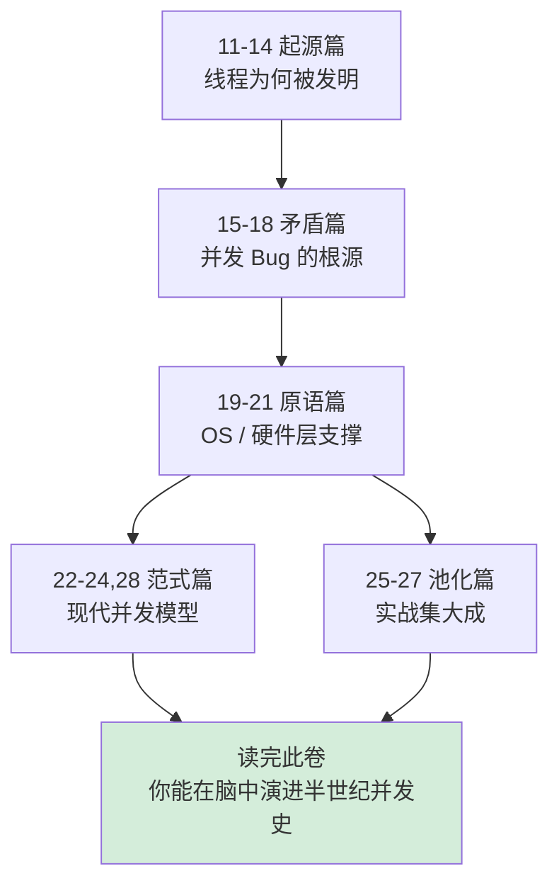

# 第 3 卷｜并发之道

> **专栏分量最重的一卷**——18 篇文章，从硬件原子指令到结构化并发，把并发编程半个世纪的进化史完整走一遍。

---

## 🎯 这一卷要回答什么

并发是程序员永恒的痛点。你也许写过 `synchronized`、`AtomicInteger`、`async/await`、`channel`，但能回答下面这些"为什么"吗？

- **线程到底是软件概念还是硬件概念？** 没有 OS 之前世界上有没有"线程"？
- **共享内存和消息传递**——为什么 Erlang 选了一条路、Java 选了另一条？两条路真的不能合并吗？
- 为什么并发 Bug 可以归纳成**只有三种**（可见性 / 原子性 / 有序性）？
- **CAS 解决了什么矛盾？** 为什么硬件层面有了 LOCK#，软件层面还需要循环 CAS？
- 协程是 1958 年发明的，**为什么 2018 年才在 Kotlin / Swift / Java 21 集中爆发**？
- **结构化并发**——为什么 Nathaniel Smith 说"goroutine 跟 goto 一样有害"？

这一卷不只是教你"用哪个 API"，而是带你看见：**每一个并发原语都是某个具体矛盾在某个历史时间点的最优解**。

---

## 📖 篇章总览（18 篇）

### 🌱 起源篇（4 篇）：理解线程为何而生

| 序号 | 文档 | 核心矛盾 |
|------|------|---------|
| 11 | [线程前世今生探索](./11.线程前世今生探索.md) | 进程不够用？1:1 / N:1 / M:N 模型如何演进 |
| 12 | [线程通信设计思想](./12.线程通信设计思想.md) | 共享内存 vs 消息传递 —— 两条路线的硬件根因 |
| 13 | [线程异常设计原理](./13.线程异常设计原理.md) | 异常从硬件中断到语言层面经历了什么 |
| 14 | [多线程并发经典案例](./14.多线程并发经典案例.md) | 售票问题：3 行代码引出 3 类 Bug |

### 🔥 矛盾篇（4 篇）：理解并发 Bug 的根源

| 序号 | 文档 | 核心矛盾 |
|------|------|---------|
| 15 | [并发编程设计思想](./15.并发编程设计思想.md) | 分工 → 同步 → 互斥，并发的三大命题 |
| 16 | [并发 Bug 源头由来](./16.并发Bug源头由来.md) | 可见性 / 原子性 / 有序性 —— 三种 Bug 的硬件根因 |
| 17 | [并发编程安全设计](./17.并发编程安全设计.md) | 不可变 / TLS / 读写分离 / 无锁 —— 四种避坑策略 |
| 18 | [锁核心设计和思想](./18.锁核心设计和思想.md) | 从 LOCK# 指令到 Java 锁升级的完整链路 |

### ⚙️ 原语篇（3 篇）：理解 OS 与硬件层

| 序号 | 文档 | 核心矛盾 |
|------|------|---------|
| 19 | [并发上下文切换原理](./19.并发上下文切换原理.md) | 进程 / 线程 / 协程切换代价的根本差异 |
| 20 | [理解 CAS 设计由来](./20.理解CAS设计由来.md) | 从哲学到硬件，CAS 的 ABA 与解法 |
| 21 | [异步和同步的设计](./21.异步和同步的设计.md) | 同步 → 多线程 → 回调 → async/await 的演进 |

### 🚀 范式篇（4 篇）：理解现代并发模型

| 序号 | 文档 | 核心矛盾 |
|------|------|---------|
| 22 | [单线程模型的思想](./22.单线程模型的思想.md) | 单线程为何反而能高并发？ |
| 23 | [协程核心设计思想](./23.协程核心设计思想.md) | "挂起 / 恢复" 的机器本质；有栈 vs 无栈 |
| 24 | [Actor 与 CSP 并发模型](./24.Actor与CSP并发模型.md) | Erlang 的 Actor vs Go channel 的 CSP |
| 28 | [结构化并发设计思想](./28.结构化并发设计思想.md) | Kotlin / Swift / Java 21 / Trio 让并发"回归大括号" |

### 🏊 池化篇（3 篇）：把前面所有原理用起来

| 序号 | 文档 | 核心矛盾 |
|------|------|---------|
| 25 | [线程池的设计思想](./25.线程池的设计思想.md) | 池化思想的本质：生产者 - 消费者 |
| 26 | [线程池使用技巧](./26.线程池使用技巧.md) | 7 大参数调优实战 |
| 27 | [线程池设计核心原理](./27.线程池设计核心原理.md) | ctl 变量、状态机、Worker 模型 |

---

## 🔗 知识脉络



---

## 🌉 与其他卷的承接

- **承接第 2 卷**：第 2 卷讲对象布局，本卷的"锁升级"恰恰是 mark word 的 2 个 bit 在做状态机。
- **通往第 4 卷**：内存模型（JMM / C++ MM）是并发原语正确性的基础。
- **通往第 5 卷**：第 5 卷"消息机制"本质就是单线程模型 + 事件循环 + 无锁队列。

---

## 💡 学完你能回答

- 为什么 `volatile` 不能保证原子性，但能保证可见性？硬件上是怎么实现的？
- `synchronized` 的偏向锁、轻量级锁、重量级锁，性能差距究竟有多少？什么场景该选哪个？
- async/await 不就是回调的语法糖吗？JVM 字节码层面有什么不同？
- 为什么 Go 不需要线程池？Goroutine 调度的 GMP 模型究竟解决了什么矛盾？
- 线程池 corePoolSize、maximumPoolSize、queueCapacity 三者的"死亡组合"是什么？

---

## ⚠️ 学习节奏建议

这卷信息密度极高，**强烈不建议三天打鱼**。推荐：

```
第 1 周：11-14（起源）+ 15-16（前两篇矛盾）   循序渐进
第 2 周：17-18（安全 + 锁）+ 19-21（原语）    硬核硬啃
第 3 周：22-24,28（现代范式）                深入新世界
第 4 周：25-27（线程池实战）                  落地总结
```

并发是个**只能靠理解、不能靠记忆**的领域。当你能在脑子里画出"一行代码触发的所有内存屏障 / cache 同步 / OS 调度"时，这一卷才算真正读完。
