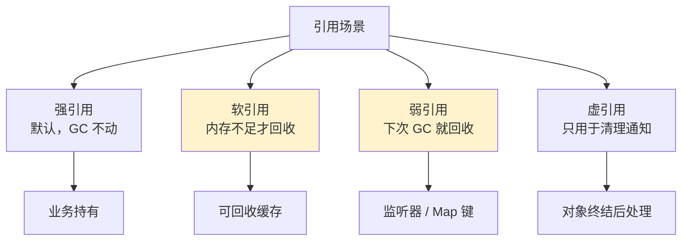
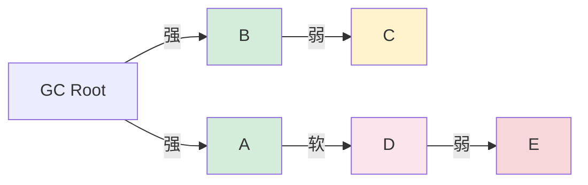

# 34.多种引用技术设计

> 📍 **本篇位置**：第 4 卷 · 内存与资源 · 第 4 篇
> 🎯 **核心矛盾**：**内存可达 vs 业务可丢** —— 有时候你希望"持有对象但允许 GC 回收它"
> 🧭 **设计灵魂**：引用分级（**强/软/弱/虚**）是给 GC 看的"优先级标签"；**缓存 = 软引用、监听 = 弱引用** 是最典型的应用矩阵
> 🌐 **跨语言覆盖**：Java(StrongReference / SoftReference / WeakReference / PhantomReference) · Swift(strong / weak / unowned) · Python(weakref 模块) · JavaScript(WeakMap / WeakSet / WeakRef) · C++(shared_ptr / weak_ptr)
> 🔗 **延伸阅读**：← [33.内存回收机制设计](./33.内存回收机制设计.md) · → [35.数据拷贝设计原理](./35.数据拷贝设计原理.md)



---

#### 目录介绍
- [00.Activity泄漏200MB事故说起](#00activity泄漏200mb事故说起)
  - [0.1 用户投诉与崩溃日志](#01-用户投诉与崩溃日志)
  - [0.2 用 LeakCanary 看泄漏链](#02-用-leakcanary-看泄漏链)
  - [0.3 老司机的灵魂三问](#03-老司机的灵魂三问)
  - [0.4 这次事故揭示了什么](#04-这次事故揭示了什么)
  - [0.5 五个递进追问](#05-五个递进追问)
- [01.单一引用世界的困境](#01单一引用世界的困境)
  - [1.1 朴素世界：只有持有与不持有](#11-朴素世界只有持有与不持有)
  - [1.2 困境一：循环引用→泄漏](#12-困境一循环引用泄漏)
  - [1.3 困境二：缓存膨胀→OOM](#13-困境二缓存膨胀oom)
  - [1.4 困境三：观察者隐式泄漏](#14-困境三观察者隐式泄漏)
  - [1.5 困境四：临时关联无法表达](#15-困境四临时关联无法表达)
- [02.分级表达：引用强度设计哲学](#02分级表达引用强度设计哲学)
  - [2.1 现实世界的类比](#21-现实世界的类比)
  - [2.2 引用强度的偏序关系](#22-引用强度的偏序关系)
  - [2.3 三条核心设计原则](#23-三条核心设计原则)
- [03.可达性模型：GC 看到的世界](#03可达性模型gc-看到的世界)
  - [3.1 可达性层次的精确定义](#31-可达性层次的精确定义)
  - [3.2 最强路径决定一切](#32-最强路径决定一切)
  - [3.3 引用计数vs追踪式语义差异](#33-引用计数vs追踪式语义差异)
- [04.强引用：默认却最危险](#04强引用默认却最危险)
  - [4.1 为什么强引用是默认](#41-为什么强引用是默认)
  - [4.2 引用计数实现：shared_ptr控制块](#42-引用计数实现shared_ptr控制块)
  - [4.3 追踪式实现：可达性边](#43-追踪式实现可达性边)
  - [4.4 强引用的两种致命陷阱](#44-强引用的两种致命陷阱)
- [05.软引用：可回收的缓存](#05软引用可回收的缓存)
  - [5.1 一个图片缓存的真实演化](#51-一个图片缓存的真实演化)
  - [5.2 LRU 时间戳机制的精妙](#52-lru-时间戳机制的精妙)
  - [5.3 为什么只有 Java 有原生软引用](#53-为什么只有-java-有原生软引用)
  - [5.4 软引用的真实陷阱](#54-软引用的真实陷阱)
- [06.弱引用：解耦持有与生命](#06弱引用解耦持有与生命)
  - [6.1 弱引用解决的根本矛盾](#61-弱引用解决的根本矛盾)
  - [6.2 打破循环引用：weak_ptr 的工程艺术](#62-打破循环引用weak_ptr-的工程艺术)
  - [6.3 监听器泄漏：weak 的拿手戏](#63-监听器泄漏weak-的拿手戏)
  - [6.4 weak vs unowned：Swift 的精细化](#64-weak-vs-unownedswift-的精细化)
  - [6.5 弱引用的访问模式](#65-弱引用的访问模式)
- [07.虚引用：比 finalize 更安全](#07虚引用比-finalize-更安全)
  - [7.1 finalize 为什么是反模式](#71-finalize-为什么是反模式)
  - [7.2 PhantomReference 的设计巧思](#72-phantomreference-的设计巧思)
  - [7.3 JavaScript FinalizationRegistry](#73-javascript-finalizationregistry)
- [08.跨语言引用全景](#08跨语言引用全景)
  - [8.1 全景对比表](#81-全景对比表)
  - [8.2 C++ 最精细：四级智能指针](#82-c-最精细四级智能指针)
  - [8.3 Java 最完整：四种引用类型](#83-java-最完整四种引用类型)
  - [8.4 ObjC/Swift 最优雅：side table](#84-objcswift-最优雅side-table)
- [09.实战案例与陷阱](#09实战案例与陷阱)
  - [9.1 Android Activity 泄漏的标准修法](#91-android-activity-泄漏的标准修法)
  - [9.2 LRU 缓存的最佳实践](#92-lru-缓存的最佳实践)
  - [9.3 EventBus 监听器自动清理](#93-eventbus-监听器自动清理)
  - [9.4 ThreadLocal + 弱引用的精妙](#94-threadlocal--弱引用的精妙)
- [10.一句话总结](#10一句话总结)

---

## 00.Activity泄漏200MB事故说起

### 0.1 用户投诉与崩溃日志

某社交 App，2022 年版本上线后客服收到大量反馈：

> "App 用一会就崩"  
> "进了某个详情页几次再退回来，App 直接挂"  
> "新版本特别费内存，开几个聊天就发烫"

研发拿到崩溃报告，看到的是 OOM：

```
java.lang.OutOfMemoryError: Failed to allocate a 32 byte allocation
  with 4194304 free bytes and 4MB until OOM
  Allocated bytes: 192 MB
  Allocated objects: 1,234,567
```

**192 MB 堆内存几乎填满**——但用户主观上"只是聊了几个朋友"。研发把 hprof 拖到 Android Studio Profiler，看到了魔幻一幕：

```
Heap Histogram:
  ChatDetailActivity 的实例数：23 个 ★ 异常
  ChatDetailActivity 持有的 Bitmap：47 个 × 4MB = 188MB
```

**用户只打开过一次详情页**，但内存里有 23 个 Activity 实例，每个还死死握着自己的 Bitmap——**典型内存泄漏**。

### 0.2 用 LeakCanary 看泄漏链

接入 LeakCanary 重现一次后，泄漏链清晰展示：

```
GC ROOT (static field)
  ↓
EventBus.INSTANCE (单例，永不释放)
  ↓
EventBus.subscribers (HashMap)
  ↓ 
Subscriber 包装对象
  ↓
ChatDetailActivity.this (★ 泄漏点)
  ↓
ChatDetailActivity.recyclerView
  ↓
ChatDetailActivity.bitmaps (47 张图)
```

代码里：

```java
public class ChatDetailActivity extends AppCompatActivity {
    @Override
    protected void onCreate(Bundle savedInstanceState) {
        super.onCreate(savedInstanceState);
        EventBus.getDefault().register(this);  // 注册
        // ... 加载 47 张表情大图 ...
    }
    
    @Override
    protected void onDestroy() {
        super.onDestroy();
        // ★ 忘了 EventBus.getDefault().unregister(this);
    }
    
    @Subscribe
    public void onEvent(ChatEvent event) { ... }
}
```

**问题清晰了**：忘记 `unregister`，EventBus 单例（GC Root 链上）永远强引用着 Activity，Activity 永远不会被回收。每打开一次详情页就新泄漏一个 Activity（连同它的 47 张图）。

### 0.3 老司机的灵魂三问

复盘会上，架构师没追究"为什么忘了 unregister"，他问的是更深的问题：

**问题 1**：为什么 EventBus 必须用强引用？

```
工程师：API 设计就这样啊。
架构师：错。EventBus 持有的是"监听器"——监听器的语义本来就是
       "你不在了我就不通知你"。这种语义天然适合弱引用。
       但 EventBus 选了强引用，就把"内存管理"的责任推给了使用者。
工程师：那为啥业界 EventBus 都用强引用？
架构师：历史原因 + 性能考虑（弱引用 lookup 略慢）。但代价就是
       全行业的 Android 开发者都要养成"每个 register 配一个 unregister"
       的肌肉记忆——一旦疏忽就泄漏。
```

**问题 2**：为什么不直接禁用单例 EventBus？

```
工程师：单例多方便啊。
架构师：单例本身没错——错的是"单例的强引用网络"。
       如果 EventBus 的 subscribers 改成 WeakReference 列表，
       Activity 销毁后 GC 自然清理，单例也安全。
       
       这就是"弱引用"作为工具的核心价值：
       让"被持有者"不被"持有者"绑架。
```

**问题 3**：为什么 Bitmap 没用软引用？

```
工程师：47 张图不大啊，一共才 188MB。
架构师：单看不大，但叠加 23 个泄漏 Activity 就 4GB+。
       即便没泄漏，47 张图都强引用也不合理——
       用户滚动到下面就用不到上面的图了，应该让 GC 在内存紧时回收。
       这就是 SoftReference 的用武之地。
```

### 0.4 这次事故揭示了什么

工程师的本能直觉是"对象嘛，要么用，要么不用"——这是**单一引用模型**。但现实复杂得多：

```
我以为：
  我持有它 = 我"用"它 = 它必须活着

实际：
  "持有"和"使用"不是一回事
  "短期持有"和"长期持有"不是一回事
  "持有它"和"被它持有"不是一回事
  
   ↓ 引用类型多样化的根本动机
   
  我需要一种语言，能精确表达"我和这个对象的关系类型"
```

| 关系类型 | 例子 | 应该用什么 |
|---|---|---|
| 我拥有它，它必须活着 | 业务实体（订单、用户） | 强引用 |
| 我用它做缓存，内存紧时可以丢 | 图片缓存、DNS 缓存 | 软引用 |
| 我"认识"它，但不是它的主人 | 监听器、子→父反向引用 | 弱引用 |
| 它死的时候告诉我一声 | 释放 native 资源 | 虚引用 |

**这次事故的根因**：工程师只有"持有/不持有"两种语言，无法表达"我想监听但不想当主人"——结果就是要么泄漏（强引用监听），要么没法监听（不持有）。**多种引用就是为了给程序员一套精确的"关系语言"。**

### 0.5 五个递进追问

本文要回答下面五个问题：

| 追问 | 章节 |
|---|---|
| 单一引用模型为什么在工程上行不通？ | §01 |
| 引用强度从哪里来？为什么必须分四级？ | §02 / §03 |
| 强引用为什么是"默认却最危险"？ | §04 |
| 软/弱/虚引用各自解决什么具体问题？ | §05 / §06 / §07 |
| 不同语言的设计为何如此不同？ | §08 |

---

## 01.单一引用世界的困境

### 1.1 朴素世界：只有持有与不持有

如果你是 1995 年设计 Java 的人，最自然的引用模型是这样：

```java
Object obj = new Object();   // 我持有它 → 它活着
obj = null;                  // 我不持有它 → 它可能被回收
```

简单优雅，符合直觉。早期 Java（1.0/1.1）就只有这一种引用。但很快发现行不通——**几个真实场景把这个模型逼到墙角**。

### 1.2 困境一：循环引用→泄漏

引用计数语言（如早期 Python）会被这段代码直接干翻：

```python
class Parent:
    def __init__(self):
        self.child = None
class Child:
    def __init__(self):
        self.parent = None

p = Parent()
c = Child()
p.child = c        # c.refcount = 2
c.parent = p       # p.refcount = 2

del p              # p.refcount = 1（来自 c）
del c              # c.refcount = 1（来自 p）

# ★ 外部已经没人能访问 p 和 c，但它们的 refcount 都不为 0
# ★ 永远不会被释放
```

可达性分析的语言（Java/Go/JS）天然规避了这个问题——但即便如此，**循环引用仍然是设计 API 时的坑**：你写 Parent 持有 Child，Child 反向持有 Parent，谁都没问题；但当架构变了（比如 Child 被作为单例缓存），Parent 就可能被无意中长期持有。

### 1.3 困境二：缓存膨胀→OOM

设想你写一个图片缓存：

```java
class ImageCache {
    private Map<String, Bitmap> cache = new HashMap<>();
    
    public Bitmap get(String url) {
        if (!cache.containsKey(url)) {
            cache.put(url, downloadAndDecode(url));
        }
        return cache.get(url);
    }
}
```

朴素模型下，**缓存就是泄漏**——所有加载过的图片永远在内存里。一个图片浏览 App 运行 10 分钟可能就 OOM。

加 size 限制？

```java
if (cache.size() > 100) {
    cache.removeFirst();  // LRU 淘汰
}
```

但 100 是拍脑袋——低端机内存只有 1GB，单图 2MB，100 张就 200MB——**OOM**。设小点比如 20 张？又起不到缓存的作用——**频繁 cache miss**。

**根本矛盾**：你**不知道运行时内存还剩多少**——朴素模型让缓存大小变成"拍脑袋"的玄学。

### 1.4 困境三：观察者隐式泄漏

§0 事故的根因——观察者模式：

```java
EventBus.register(activity);   // EventBus 持有 activity 强引用

// activity 用户离开页面销毁了，但是：
//   - EventBus 单例还在 → static field 是 GC Root
//   - 单例 → subscribers list → activity
//   - 强可达 → activity 永远不会回收
//   - activity 持有的所有内部状态（Bitmap、子 View）也都泄漏
```

**这不是某个程序员粗心，这是一个设计模式在朴素引用模型下的根本性缺陷**：观察者模式的语义本来就是"我观察你，你不在了我就不观察了"，但强引用强行把这种关系变成了"我观察你，你必须为我而活"。

### 1.5 困境四：临时关联无法表达

最后一类场景——你想知道一个对象**还在不在**，但不想"持有"它：

```
做缓存的元数据：缓存里有一个 Buffer，业务想"看看这个 Buffer 还在不在"
做调试工具：调试器想"跟踪某个对象的生命周期"
做插件系统：插件想"如果宿主对象还活着就调它的回调"
```

这种"我和它有联系，但联系不应该让它活着"的关系，朴素模型完全无法表达——你要么持有（让它活），要么不持有（失去联系）。**没有中间态**。

---

## 02.分级表达：引用强度设计哲学

### 2.1 现实世界的类比

类比现实世界的物品关系，引用分级一下子就说清楚了：

```
强引用 = 房产证       你拥有这栋房子，只要证在，房子不能拆
弱引用 = 知道地址     你知道那里有栋房子，但房子拆了你也没办法
软引用 = 租约         正常情况你能住，但房东急需资金时可以收回
虚引用 = 拆迁通知     你不能住（不能访问），但房子拆时你会收到通知
```

**关键洞察**：现实世界从来都不是"拥有 / 不拥有"两元论——租约、登记、知情、通知，每种关系强度都有对应的法律工具。**编程语言要让你的对象关系也享受同样的精度**。

### 2.2 引用强度的偏序关系

四种引用形成一条严格的全序：

```
Strong > Soft > Weak > Phantom > None
   │       │       │       │
 绝不回收  OOM前回收 任意GC回收 已回收（仅通知）
```

GC 决策算法的本质是：

```
对每个对象，找出从 GC Root 到它的所有路径
取其中"最强"的那条 → 决定该对象的可达性等级

强可达 → 永不回收
软可达 → OOM 前回收
弱可达 → 下次 GC 回收
虚可达 → 已回收，等待清理通知
不可达 → 立刻回收
```



- A：强可达（保留）
- B：强可达（保留）
- C：弱可达（B 不直接强引用 C，最强是弱）
- D：软可达（OOM 时回收）
- E：弱可达（D 是软，再弱一级）

**核心规则：等级取最强**——这是规则的精妙处，也是工程师容易踩坑的地方。**§0 事故里把 Activity 加到 EventBus 的 list，那条强引用一旦存在，无论你在别处用多少弱引用都没用**。

### 2.3 三条核心设计原则

#### 原则一：默认安全，显式降级

```
强引用是默认行为（最安全），弱化引用需要程序员显式声明：
  Object o = new Object();      // 强（默认）
  WeakReference<Object> w = new WeakReference<>(o);  // 弱（显式）
```

**为什么？** 因为新手如果默认是弱，会写出大量"看似工作其实随时崩"的代码。强为默认，把所有"想让 GC 介入"的责任明确地转移给资深开发者。

#### 原则二：GC 可介入性

```
引用强度 = 程序员告诉 GC 的"回收优先级"
强引用：GC 绝不能碰
软引用：GC 在 OOM 前可以碰
弱引用：GC 任何时候都能碰
虚引用：GC 已经碰了，只是通知你
```

**关键洞察**：GC 不是"自动"，是"按指令"——程序员通过引用类型给 GC 下达精确指令。

#### 原则三：关注点分离

```
"使用对象"和"管理对象生命周期"是两个独立关注点。
多种引用让程序员可以只参与使用，把生命周期决策委托给运行时。
```

§0 事故里，EventBus 想做的是"使用 Activity 的回调"，不应该承担"决定 Activity 生命周期"的责任——但强引用把两件事捆死了。**用 WeakReference 就能让 EventBus 只管"使用"，把"生命周期"还给 Activity**。

---

## 03.可达性模型：GC 看到的世界

### 3.1 可达性层次的精确定义

Java 官方定义了五个等级，越底下的越接近"被回收"：

```
Strongly Reachable    至少有一条强引用路径从 Root 到达
   ↓
Softly Reachable      所有路径中最强的是软引用
   ↓
Weakly Reachable      所有路径中最强的是弱引用
   ↓
Phantom Reachable     所有路径中最强的是虚引用（已加入 ReferenceQueue）
   ↓
Unreachable           没有路径，立刻回收
```

**这五个等级是 Java GC 算法实际采用的判断标准**——每次 GC，按这个顺序处理：
1. 标记所有强可达对象 → 保留
2. 内存不足？标记软可达对象 → 回收
3. 标记弱可达对象 → 回收
4. 虚可达对象 → 加入 ReferenceQueue
5. 不可达 → 直接回收

### 3.2 最强路径决定一切

**核心规则**：对象的可达性 = 从 GC Root 到该对象的所有路径中，**最强**的那条路径决定。

来看一个真实困惑：

```java
WeakReference<Bitmap> weakRef;
List<Bitmap> strongList;   // 业务的另一处强持有

Bitmap bm = loadImage();
weakRef = new WeakReference<>(bm);
strongList.add(bm);

// 现在 bm 的可达性？
// 路径1：strongList → bm（强）
// 路径2：weakRef → bm（弱）
// 取最强 → 强可达 → 永不回收
```

**这就是 §0 事故的核心**——只要 EventBus 的 strong 持有还在，无论别处有多少 WeakReference 都没意义。**只有"切断所有强引用路径"，弱化引用才生效**。

### 3.3 引用计数vs追踪式语义差异

不同 GC 模型对引用类型的实现完全不同：

```
引用计数模型（C++/OC/Swift/Python）：
  强引用 = refcount + 1
  弱引用 = weak_count + 1, 不增加 refcount
  refcount == 0 → 释放对象
  weak_count == 0 → 释放控制块

追踪式 GC 模型（Java/C#/Go/JS）：
  强引用 = GC 遍历时跟踪的边
  弱引用 = GC 遍历时不跟踪的边
  不可达 → 回收
```

**实现方式不同，但语义对齐**——这就是抽象的力量：底层细节五花八门，上层 API 对开发者表现为"强 / 弱"两类标签。

---

## 04.强引用：默认却最危险

### 4.1 为什么强引用是默认

强引用是大多数语言的"零表达"——你写 `Object o = new Object()` 就有了一个强引用。它对应的是最直觉的"我拥有它"语义：

```java
Order order = new Order();   // 我创建了 order，它必须存活，直到我不再需要它
```

**默认必须是强引用，原因有三**：

1. **新手友好**：刚学语言的人不需要懂"引用类型"概念也能正确写代码
2. **大多数场景适用**：业务中 80%+ 的对象关系本来就是"我持有它"
3. **错误成本低**：用强引用最坏是泄漏（容易诊断），用弱引用最坏是 NullPointerException（隐晦难查）

但默认强引用也是**最常见 Bug 源**——它过于宽松，让你不思考就写出"长期持有"的代码。

### 4.2 引用计数实现：shared_ptr控制块

C++ 的 `shared_ptr` 是引用计数强引用的典范。其内存布局：

```
shared_ptr<T> sp1            shared_ptr<T> sp2
    │                              │
    ▼                              ▼
┌─────────────┐              ┌─────────────┐
│  ptr (T*)   │              │  ptr (T*)   │
│  ctrl_block │──┐         ┌─│  ctrl_block │
└─────────────┘  │         │ └─────────────┘
                 ▼         ▼
            ┌──────────────────────┐
            │ Control Block        │
            │  strong_count = 2    │  ← sp1, sp2 都持有
            │  weak_count = 0      │
            │  ptr → 实际对象       │
            │  deleter             │
            └──────────────────────┘
                       │
                       ▼
               ┌────────────┐
               │  T 对象    │
               └────────────┘
```

**关键操作**：

```cpp
shared_ptr<T> sp = make_shared<T>();   // strong_count = 1
{
    shared_ptr<T> sp2 = sp;            // strong_count = 2（atomic ++）
    // sp2 离开作用域 → strong_count = 1（atomic --）
}
// sp 离开作用域 → strong_count = 0 → 析构对象
```

**精妙处**：所有计数操作都是**原子的**（用 CAS），保证多线程安全。但代价是每次拷贝/销毁都有原子指令开销（约 10ns），高频场景能感知到。

### 4.3 追踪式实现：可达性边

Java/Go 的强引用没有"计数"，只是 GC 遍历对象图时跟踪的一条边：

```
GC Roots（栈、static、活动线程）
    │
    ├── Object A（被栈引用 → 强可达）
    │     └── Object B（被 A 强引用 → 强可达）
    │
    └── Object C（被 static 引用 → 强可达）

Object D（没人引用 → 不可达 → 下次 GC 回收）
```

**优点**：赋值、拷贝零开销（普通指针操作）。**代价**：必须等 GC 周期才能回收（不像 RC 立即回收）。

### 4.4 强引用的两种致命陷阱

#### 陷阱一：意外延长生命周期（§0 事故根因）

```java
class Activity {
    private Listener listener = ...;
}

EventBus.register(activity);   // ★ Bus 单例持有 listener，listener 持有 activity
                              //   → activity 被绑死
```

**修法**：让 EventBus 持有弱引用，或者强制 unregister。

#### 陷阱二：循环强引用（引用计数语言）

```python
class Node:
    def __init__(self):
        self.next = None

a = Node(); b = Node()
a.next = b; b.next = a  # 循环
del a, b                # refcount 都不归零 → 永不释放
```

**修法**：把其中一个改成弱引用打破循环（详见 §6.2）。

---

## 05.软引用：可回收的缓存

### 5.1 一个图片缓存的真实演化

回到 §0 事故的 47 张大图——演化路径如下：

#### v1：朴素 HashMap

```java
Map<String, Bitmap> cache = new HashMap<>();
cache.put(url, bitmap);   // 永久强持有 → OOM
```

#### v2：固定大小 LRU

```java
Map<String, Bitmap> cache = new LinkedHashMap<>(100, 0.75f, true) {
    protected boolean removeEldestEntry(Map.Entry<...> e) {
        return size() > 100;   // 超过 100 张淘汰
    }
};
```

**问题**：100 是拍脑袋——低端机 200MB（OOM）、高端机太少（频繁 miss）。

#### v3：SoftReference（自适应）

```java
Map<String, SoftReference<Bitmap>> cache = new HashMap<>();
cache.put(url, new SoftReference<>(bitmap));

Bitmap get(String url) {
    SoftReference<Bitmap> ref = cache.get(url);
    Bitmap bm = ref != null ? ref.get() : null;
    if (bm == null) {
        bm = loadAndDecode(url);
        cache.put(url, new SoftReference<>(bm));
    }
    return bm;
}
```

**精妙处**：缓存大小由 JVM 根据内存压力**自动**调节：
- 内存充足 → 全部保留 → 高命中率
- 内存紧张 → JVM 自动回收 → 永远不会 OOM

**这就是软引用的核心价值——把"何时该淘汰"的决定权从程序员让渡给 GC**。

### 5.2 LRU 时间戳机制的精妙

JVM 内部对 SoftReference 的回收策略不是"OOM 才回收"那么粗糙，而是基于**时间戳 LRU**：

```
回收条件: clock - timestamp > threshold
            │           │            │
            │           │            └── -XX:SoftRefLRUPolicyMSPerMB 控制
            │           └── 该对象最近一次被 get() 的时间
            └── 当前时间

threshold = 空闲堆MB × MSPerMB
```

**举个例子**：
- 默认 `MSPerMB = 1000ms/MB`
- 空闲堆 100MB → threshold = 100,000ms = 100 秒
- 一个 SoftReference 100 秒没被 `get()` → 下次 GC 回收

**当内存紧张时**：
- 空闲堆 10MB → threshold = 10 秒
- 大量 SoftRef 因为"10 秒没被访问" 被回收

**当内存爆了**：
- 空闲堆 0MB → threshold = 0
- 所有 SoftRef 立刻回收，避免 OOM

**这是一种自适应淘汰算法**——内存越紧，"过期"越快；内存充足，几乎不淘汰。

### 5.3 为何只有Java有原生软引用

| 语言 | 原因 |
|---|---|
| **Java** | JVM 直接控制内存压力 + 时间戳，能精确实施"内存紧时回收"语义 |
| **C++** | 没有 GC，"内存紧"无法被运行时感知。可手动实现（LRU + 内存监控） |
| **JavaScript** | 引擎（V8）内部对老生代有类似优化，但**不暴露给开发者**。`WeakRef` 只提供弱引用语义 |
| **Go** | 一直没有；社区呼声高但 Go 团队认为"会让 GC 算法复杂化" |
| **Python** | 没有；缓存通常用 `functools.lru_cache` 手动管理 |

**SoftReference 是 JVM 特殊性的产物**——它建立在"GC 能精确感知内存压力 + 时间戳"的基础上，这是托管运行时（JVM）特有的能力。

### 5.4 软引用的真实陷阱

#### 陷阱一：以为软引用 = 永远的缓存

```
错误预期：放进 SoftReference 的东西，内存够就一直在
实际情况：JVM 根据 LRU 时间戳，可能 30 秒没访问就回收

→ 缓存命中率可能远低于预期
```

#### 陷阱二：缓存 key 的强引用

```java
Map<String, SoftReference<Bitmap>> cache;

cache.put(longString, ref);
// ★ longString 自身是强引用，永不回收
// ★ 即使 Bitmap 被回收，HashMap 里还残留一堆 String → SoftReference(null) 的垃圾 entry
```

**修法**：定期遍历清理 `ref.get() == null` 的 entry，或用专门的缓存库（Caffeine、Guava Cache）。

---

## 06.弱引用：解耦持有与生命

### 6.1 弱引用解决的根本矛盾

弱引用解决的根本矛盾用一句话说清楚：

> **"我需要访问这个对象，但不应该决定它的生死。"**

四个典型场景：

```
1. 监听器：我观察你，你死了我就不观察了
2. 双向引用（子→父）：父决定子的生死，子不应该反向锁住父
3. 调试/监控：我跟踪对象但不持有它
4. 弱键 Map：用对象做 key，对象消失时 entry 自动清理
```

### 6.2 打破循环引用：weak_ptr工程艺术

C++ 中**强引用循环 = 死亡**：

```cpp
class Parent {
    shared_ptr<Child> child;
};
class Child {
    shared_ptr<Parent> parent;   // ★ 强引用回去 → 循环
};

auto p = make_shared<Parent>();
auto c = make_shared<Child>();
p->child = c;     // c.refcount = 2
c->parent = p;    // p.refcount = 2

// p 和 c 离开作用域：
//   p.refcount = 1 → 不析构
//   c.refcount = 1 → 不析构
//   → 永久泄漏
```

**修法**：让其中一边降级为 weak_ptr：

```cpp
class Child {
    weak_ptr<Parent> parent;    // ★ 弱引用，不增加 strong_count
};

p->child = c;                   // c.refcount = 2
c->parent = p;                  // p.refcount = 1（weak 不增）

// p 和 c 离开作用域：
//   p.refcount = 0 → 析构 Parent
//   Parent 析构释放 child → c.refcount = 1
//   c 离开作用域 → c.refcount = 0 → 析构
//   → 完美释放
```

**weak_ptr 的内存布局精妙**：

```
shared_ptr A → ─┐                ┌── ┐
shared_ptr B → ─┼─→ Control Block│   │── ┘
weak_ptr   W → ─┘   strong_cnt=2 │   │
                    weak_cnt=1   │   │── ┐
                    ptr ─────────┼───┼─→ │ T 对象
                                 │   │   │
                                 │   │   └── ┘
                                 │   │
                    A, B 销毁后：   │   │
                    strong_cnt=0 │   │── ┐
                    weak_cnt=1   │   │   │ (已析构)
                    ptr ──X──────┼───┼─→ │
                                 │   │   └── ┘
                                 │   │
                W.lock() 返回空 shared_ptr （安全检测）
```

**两阶段回收**：strong_cnt=0 时析构对象，但**控制块保留**（因为还有 weak），weak_cnt=0 时才释放控制块。这样 weak_ptr 总能安全检测对象是否已死，**永不悬空**。

### 6.3 监听器泄漏：weak 的拿手戏

§0 事故的标准修法：

```java
// Bus 内部用 WeakReference 存监听器
class EventBus {
    private List<WeakReference<Listener>> listeners = new ArrayList<>();
    
    public void register(Listener l) {
        listeners.add(new WeakReference<>(l));
    }
    
    public void fire(Event e) {
        Iterator<WeakReference<Listener>> it = listeners.iterator();
        while (it.hasNext()) {
            Listener l = it.next().get();
            if (l == null) {
                it.remove();   // 自动清理已被 GC 的监听器
            } else {
                l.onEvent(e);
            }
        }
    }
}
```

**结果**：Activity 销毁后没人强引用它，弱引用不阻止 GC，下次 GC 自动回收 + EventBus 自动清理 entry。**用户连 unregister 都不用调了**。

但实际生产里，EventBus（如 GreenRobot 的）默认仍用强引用——因为弱引用 lookup 略慢、且有"消息丢失"的隐患（监听器被 GC 后消息再来就没人收了）。这是工程取舍——**没有银弹**。

### 6.4 weak vs unowned：Swift的精细化

Swift 把弱引用分成两种：

```swift
weak var delegate: MyDelegate?    // 自动 nil-out
unowned var parent: Parent        // 不 nil-out，访问会crash（类似悬空指针）
```

**weak**：
- 对象销毁时自动置为 nil
- 访问时类型是 Optional（要用 `?` 或 `!`）
- 实现需要 side table 追踪 → 有运行时开销
- **适用场景**：生命周期不可预测的引用关系

**unowned**：
- 对象销毁时**不**置 nil（依然指着已死对象）
- 类型不是 Optional（直接访问）
- 不需要 side table → **零开销**
- **适用场景**：你 100% 确定 unowned 的对象不会先死（如：child 不可能比 parent 活得久）

**为什么 Swift 要分两种？** 因为弱引用的实现成本不可忽略——side table 在某些紧凑场景（如游戏引擎）会成为瓶颈。给程序员一个"我保证生命周期"的逃生门，是 Swift 对性能敏感场景的让步。

### 6.5 弱引用的访问模式

弱引用使用必须遵循"先检查再用"模式——这是它的核心契约：

```cpp
// C++
if (auto sp = weak.lock()) {
    sp->doSomething();   // 提升为 shared_ptr 后安全使用
}
```

```java
// Java
Object obj = weakRef.get();
if (obj != null) {
    // 使用 obj
}
```

```javascript
// JS
const obj = weakRef.deref();
if (obj !== undefined) {
    // 使用 obj
}
```

**这种"防御式访问"是弱引用与强引用的根本区别**——你必须接受"对象可能已死"的现实，把空指针处理写到业务逻辑里。

---

## 07.虚引用：比finalize更安全

### 7.1 finalize 为什么是反模式

Java 早期提供 `finalize()` 方法，让对象在被 GC 前做清理：

```java
class FileHandle {
    @Override
    protected void finalize() throws Throwable {
        closeNativeFile();   // 释放 native 资源
        super.finalize();
    }
}
```

听起来很合理——但 `finalize()` 是 Java 历史上**最大的设计错误之一**：

#### 问题一：执行时机完全不可控

```
finalize 在专门的"finalizer 线程"中执行
该线程优先级低 → 可能延迟数秒甚至数分钟
对象一直占着 native 资源不释放 → 文件句柄耗尽
```

#### 问题二：可能不被执行

```
JVM 退出时不保证执行所有 finalize
finalize 抛异常会被吞 → 静默失败
```

#### 问题三：对象可能在 finalize 中"复活"

```java
@Override
protected void finalize() {
    GlobalContainer.add(this);   // ★ 把自己塞回 GC Root 链
    // → 对象重新可达，不会被回收
    // → 下次 GC 时如果再次不可达，finalize 不会再调用（已调用过了）
    // → 资源泄漏
}
```

#### 问题四：性能差

```
带 finalize 的对象：分配慢、回收要走两轮 GC（一轮入队，一轮真回收）
```

**Java 9 把 `Object.finalize()` 标记 `@Deprecated`，建议用 PhantomReference + Cleaner 替代。**

### 7.2 PhantomReference设计巧思

PhantomReference 解决了 finalize 所有问题：

```java
ReferenceQueue<Object> queue = new ReferenceQueue<>();
PhantomReference<HeavyResource> phantom = 
    new PhantomReference<>(resource, queue);

// 清理线程
new Thread(() -> {
    while (true) {
        Reference<?> ref = queue.remove();   // 阻塞等待对象死亡通知
        cleanupNativeResource();   // 此时对象已被 GC，安全清理
    }
}).start();
```

**精妙处**：

1. **`get()` 永远返回 null** —— 你拿不到对象本身，**杜绝了 finalize 里"复活"的可能**
2. **对象被 GC 后，PhantomReference 入 ReferenceQueue** —— 你在自己的清理线程中处理，不依赖 JVM finalizer 线程
3. **必须配合 ReferenceQueue 才有意义** —— API 设计强制了正确的使用方式

Java 9+ 的 `Cleaner` API 就是基于 PhantomReference 的封装：

```java
class HeavyResource implements AutoCloseable {
    private static final Cleaner cleaner = Cleaner.create();
    private final Cleaner.Cleanable cleanable;
    
    public HeavyResource() {
        this.cleanable = cleaner.register(this, () -> {
            closeNative();   // 对象被 GC 时自动调用
        });
    }
    
    @Override
    public void close() {
        cleanable.clean();   // 也支持显式清理
    }
}
```

### 7.3 JavaScript FinalizationRegistry

JavaScript 在 ES2021 引入了等价物：

```javascript
const registry = new FinalizationRegistry((token) => {
    console.log("对象被 GC 了，token =", token);
});

let obj = { data: "important" };
registry.register(obj, "obj-1");

obj = null;       // 对象不可达
// 某次 GC 后，回调被调用：log("...token = obj-1")
```

**注意事项**：
- 回调时机不保证（GC 决定）
- 不应在回调中执行关键业务逻辑
- 主要用于"通知 + 清理 native 资源"

---

## 08.跨语言引用全景

### 8.1 全景对比表

```
┌──────────┬──────────┬──────────┬──────────┬──────────────────┬────────────────────┐
│ 语言      │ 强引用    │ 弱引用    │ 软引用    │ 虚引用 / 终结     │ 内存管理模型        │
├──────────┼──────────┼──────────┼──────────┼──────────────────┼────────────────────┤
│ Java     │ 默认     │ WeakRef  │ SoftRef  │ PhantomRef       │ 追踪式 GC          │
│ C++      │ shared_ptr │ weak_ptr │ 无      │ 无               │ 引用计数(RAII)     │
│ ObjC     │ strong   │ weak     │ 无       │ 无               │ ARC                │
│ Swift    │ strong   │ weak/unowned │ 无   │ deinit           │ ARC                │
│ JS       │ 默认     │ WeakRef  │ 无       │ FinalizationReg  │ 追踪式 GC          │
│ Python   │ 默认     │ weakref  │ 无       │ __del__ (差)     │ RC + 循环检测      │
│ C        │ 裸指针   │ 无       │ 无       │ 无               │ 纯手动             │
│ Rust     │ Rc/Arc  │ Weak     │ 无       │ Drop trait       │ 所有权 + 借用检查   │
│ Go       │ 默认     │ 无（提案中）│ 无     │ runtime.SetFinalizer │ 追踪式 GC      │
│ C#       │ 默认     │ WeakRef  │ 无       │ Finalize/Dispose │ 追踪式 GC          │
└──────────┴──────────┴──────────┴──────────┴──────────────────┴────────────────────┘
```

**有趣观察**：
- **只有 Java 有四级齐全**（强/软/弱/虚）
- **大部分语言只有"强 + 弱"**（够用但不优雅）
- **Rust 没有弱引用语义之外的需求**（所有权系统已经把循环引用挡在编译期）

### 8.2 C++ 最精细：四级智能指针

```
┌───────────────┬─────────────────────────────┬──────────────────┐
│ 类型           │ 语义                         │ 开销              │
├───────────────┼─────────────────────────────┼──────────────────┤
│ T*（裸指针）   │ 无所有权，纯地址             │ 0                │
│ T&（引用）     │ 别名，不可为空               │ 0                │
│ unique_ptr<T> │ 独占所有权，不可拷贝         │ 0（零成本抽象）  │
│ shared_ptr<T> │ 共享所有权，引用计数         │ 控制块 + atomic   │
│ weak_ptr<T>   │ 非拥有观察，可检测失效       │ 控制块引用       │
└───────────────┴─────────────────────────────┴──────────────────┘
```

**unique_ptr 是 C++ 独有精华**：
- 编译期保证只有一个拥有者
- 零运行时开销（同裸指针）
- 转移所有权用 `std::move`

```cpp
unique_ptr<Order> p = make_unique<Order>();
unique_ptr<Order> q = move(p);   // p 变 nullptr
// 整个过程 0 运行时开销
```

C++ 的引用体系最精细——但代价是程序员要懂 5+ 种引用类型，学习曲线陡峭。

### 8.3 Java 最完整：四种引用类型

Java 是唯一原生提供四级引用的主流语言：

```
              Reference
                 │
       ┌─────────┼─────────┬─────────┐
       │         │         │         │
    Strong     Soft      Weak     Phantom
     默认      OOM 前回收   下次 GC 回收  终结后通知
                  │         │         │
                  └─────┬───┘         │
                        │             │
                  可通过 get()       get() 始终 null
                  获取对象            必须配合 ReferenceQueue
```

四级体系的设计代价是**API 复杂**，但好处是**精准表达 + 全场景覆盖**——这是 Java"企业级语言"的设计哲学。

### 8.4 ObjC/Swift最优雅：side table

OC/Swift 只有两级（strong + weak），但实现极其优雅。OC Runtime 在所有 Class 实例之外维护一个全局 **side table**：

```c
struct SideTable {
    spinlock_t lock;
    RefcountMap refcounts;        // 每个对象的引用计数
    weak_table_t weak_table;      // 对象地址 → 弱引用列表
};
```

**对象析构时：**

```c
void objc_destructInstance(id obj) {
    // 1. 调用对象的 dealloc
    
    // 2. 遍历 weak_table，把所有指向 obj 的弱引用置 nil
    weak_clear_no_lock(&table.weak_table, obj);
    // ★ 这就是为什么 weak 指针在对象死亡后访问得到 nil 而不是野指针
}
```

**为什么这是优雅设计？**
- 弱引用置 nil 是**自动的**（不像 C++ 的 weak_ptr 需要手动 lock 检查）
- 实现局限在 runtime 层，不污染语言语法
- 程序员心智负担：只用记 `weak` / `strong`，访问 weak 仍然是普通语法

**代价**：side table 维护本身有内存和锁开销——iOS 上 weak 引用比 strong 慢 ~3-5 倍。这就是 Swift `unowned` 存在的理由——给"100% 确定生命周期"场景一个零开销逃生门。

---

## 09.实战案例与陷阱

### 9.1 Android Activity泄漏标准修法

回到 §0 事故，标准修法清单：

```kotlin
// 修法 1：必须 unregister
override fun onDestroy() {
    EventBus.getDefault().unregister(this)
    super.onDestroy()
}

// 修法 2：用生命周期感知组件（推荐）
lifecycle.addObserver(object : DefaultLifecycleObserver {
    override fun onCreate(owner: LifecycleOwner) {
        EventBus.getDefault().register(this@MyActivity)
    }
    override fun onDestroy(owner: LifecycleOwner) {
        EventBus.getDefault().unregister(this@MyActivity)
    }
})

// 修法 3：Handler 内部类要用静态类 + WeakReference
class MyActivity {
    private val handler = SafeHandler(this)
    
    private static class SafeHandler(activity: MyActivity) : Handler() {
        private val ref = WeakReference(activity)
        
        override fun handleMessage(msg: Message) {
            ref.get()?.handleMessage(msg)
        }
    }
}

// 修法 4：用 LiveData / Flow 替代 EventBus（终极方案）
viewModel.events.observe(this) { event ->
    handleEvent(event)
    // observe(this) 自动绑定 lifecycle，无需手动 unregister
}
```

### 9.2 LRU 缓存的最佳实践

```java
// 不要：纯 SoftReference（命中率不可控）
Map<String, SoftReference<Bitmap>> badCache = new HashMap<>();

// 推荐：LRU 主缓存 + SoftReference 二级（兜底）
class TwoLevelCache {
    private final LinkedHashMap<String, Bitmap> lru = new LinkedHashMap<>(100, 0.75f, true) {
        protected boolean removeEldestEntry(Map.Entry<String, Bitmap> e) {
            if (size() > 100) {
                // 淘汰时降级为 SoftReference，给 GC 决定权
                soft.put(e.getKey(), new SoftReference<>(e.getValue()));
                return true;
            }
            return false;
        }
    };
    private final Map<String, SoftReference<Bitmap>> soft = new ConcurrentHashMap<>();
    
    public Bitmap get(String key) {
        Bitmap bm = lru.get(key);
        if (bm != null) return bm;
        SoftReference<Bitmap> ref = soft.get(key);
        bm = ref != null ? ref.get() : null;
        if (bm != null) {
            lru.put(key, bm);   // 提升回 LRU 主区
            soft.remove(key);
        }
        return bm;
    }
}
```

**两级设计的精妙**：LRU 保证常用图必中（命中率可控），SoftReference 二级兜底（内存够时不浪费空间）。**Glide / Picasso 等专业图片库都用类似设计**。

### 9.3 EventBus 监听器自动清理

终极方案——用 WeakReference 让监听器自动清理：

```java
class WeakEventBus {
    private final List<WeakReference<EventListener>> listeners = new CopyOnWriteArrayList<>();
    
    public void register(EventListener l) {
        listeners.add(new WeakReference<>(l));
    }
    
    public void fire(Event e) {
        Iterator<WeakReference<EventListener>> it = listeners.iterator();
        while (it.hasNext()) {
            EventListener l = it.next().get();
            if (l == null) {
                it.remove();   // 监听器已被 GC，清理 entry
            } else {
                l.onEvent(e);
            }
        }
    }
}
```

**注意**：监听器**必须有外部强引用持有**，否则一注册就被 GC：

```java
EventListener listener = e -> handle(e);
bus.register(listener);   // ★ 必须保持 listener 引用，否则下次 GC 就没了

// 错误写法：
bus.register(e -> handle(e));   // ★ 这个 lambda 没人持有，立刻被 GC
```

### 9.4 ThreadLocal+弱引用的精妙

ThreadLocal 内部 Map 用弱引用做 key，背后是非常精妙的设计：

```java
// ThreadLocalMap.Entry 的简化版
static class Entry extends WeakReference<ThreadLocal<?>> {
    Object value;
    Entry(ThreadLocal<?> k, Object v) {
        super(k);   // ★ key 是弱引用
        value = v;
    }
}
```

**为什么 key 用弱引用？**

```
场景：业务持有 ThreadLocal 实例 → ThreadLocal 实例不会被回收
当业务把 ThreadLocal 引用置空后：
   - 如果 key 是强引用 → ThreadLocalMap 还持有 ThreadLocal → 永远泄漏
   - 如果 key 是弱引用 → ThreadLocal 可以被回收 → entry 可以被清理
```

**但 value 是强引用**——这就是 ThreadLocal 著名的"内存泄漏"原因：

```
ThreadLocal 被 GC → entry.key = null
但 entry.value 还在 → 仍占用内存
线程不结束 → ThreadLocalMap 不消失 → value 永远泄漏
```

**修法**：每次用完调 `threadLocal.remove()` 清理 value。这是 ThreadLocal 文档明确要求的——**弱引用解决了一半问题，另一半要靠程序员显式清理**。

---

## 10.一句话总结

### 10.1 三层认知阶梯

| 阶段 | 思维 | 表现 |
|---|---|---|
| 初级 | "对象就一种引用" | 写出大量泄漏代码 |
| 中级 | "知道有强弱软虚四种" | 能改 bug |
| 高级 | **"按对象关系类型选引用类型"** | 写代码时就考虑生命周期对齐 |

### 10.2 引用选择决策清单

```
问 1：你和这个对象的关系是什么？
   ├─ 我拥有它，它必须活着 → 强引用（默认）
   ├─ 我做缓存，内存紧时可以丢 → 软引用 / LRU
   ├─ 我观察它，它死了我也接受 → 弱引用
   └─ 它死的时候我要做清理 → 虚引用 / Cleaner

问 2：要持有对象多久？
   ├─ 短期（方法栈内） → 强引用没问题
   ├─ 中期（请求生命周期） → 强引用 + 主动清理
   ├─ 长期（业务生命周期） → 强引用 + 弱引用解循环
   └─ 全生命周期（单例） → 必须用弱引用持有外部对象

问 3：是不是观察者模式？
   └─ 必然要考虑弱引用——观察者语义 ≠ 所有权语义

问 4：是不是缓存？
   └─ 必然要考虑软引用 / LRU——缓存语义 ≠ 必须保留
```

### 10.3 设计哲学一句话

> **多种引用是程序员对 GC 的"语言"——你用强表达"必须活"，用弱表达"我观察但不主张"，用软表达"内存紧时可丢"，用虚表达"死了告诉我"。**
>
> **§0 事故的根因不是"忘了 unregister"，而是 EventBus API 强迫了"持有 = 锁定生命周期"的捆绑——一旦解开这个捆绑（让 EventBus 用 WeakReference），事故从语言层面就被消除。**
>
> **好的引用设计让正确的代码自然写出来，错误的代码难以写出来。**

### 10.4 与本卷其它章节的呼应

```
33.内存回收机制设计      ─→ GC 算法识别引用类型并按级处理
35.数据拷贝设计原理      ─→ 浅拷贝是引用拷贝，深拷贝是对象拷贝
32.堆和栈内存的设计      ─→ 引用底层是地址，地址在栈或堆
03.第3卷-并发之道        ─→ 引用计数的原子操作是并发难点
07.类的加载核心原理      ─→ Class 对象本身也通过引用维护
```

### 10.5 延伸阅读

- 论文：*Reference Counting Object Lifecycle Management*（Bacon, 2003）
- 文档：[Java 9 java.lang.ref Package](https://docs.oracle.com/javase/9/docs/api/java/lang/ref/package-summary.html)
- 书籍：《Effective Java》Item 7（消除过期对象引用）
- 源码：HotSpot `share/gc/shared/referenceProcessor.cpp` —— Java 引用处理器
- 工具：MAT / LeakCanary / VisualVM —— 引用泄漏定位
