# 04.泛型设计灵魂思想

> 📍 **本篇位置**：第 1 卷 · 类型与抽象 · 第 4 篇（卷扛鼎之作）
> 🎯 **核心矛盾**：**类型安全 vs 代码复用** —— 想要"一份代码"又想要"编译期检查"
> 🧭 **设计灵魂**：所有泛型方案都是"何时实例化"的取舍——**编译期单态化** vs **运行时类型擦除** vs **装箱**
> 🌐 **跨语言覆盖**：Java(类型擦除) · C++(模板 / 编译期单态化) · C#(运行时具化保留) · Go(1.18+ 类型参数) · Rust(单态化 + trait bound) · TypeScript(纯擦除)
> 🔗 **延伸阅读**：← [01.字符串设计的灵魂](./01.字符串设计的灵魂.md) · → [09.对象和函数访问原理](./09.对象和函数访问原理.md)

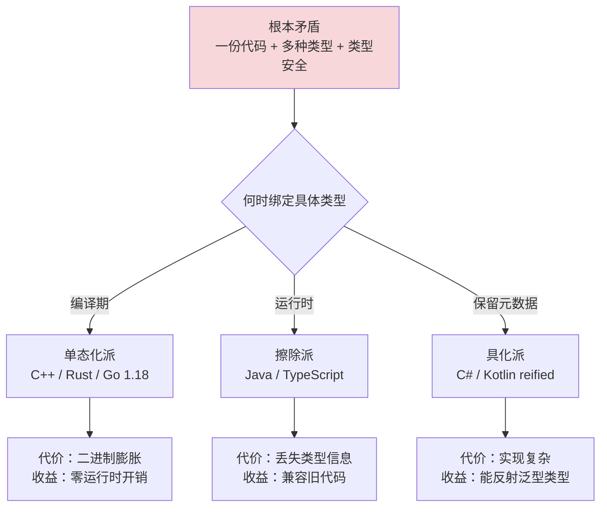
```mermaid
flowchart TB
    A[根本矛盾<br/>一份代码 + 多种类型 + 类型安全] --> B{何时绑定具体类型}
    B -->|编译期| C1[单态化派<br/>C++ / Rust / Go 1.18]
    B -->|运行时| C2[擦除派<br/>Java / TypeScript]
    B -->|保留元数据| C3[具化派<br/>C# / Kotlin reified]
    C1 --> D1[代价：二进制膨胀<br/>收益：零运行时开销]
    C2 --> D2[代价：丢失类型信息<br/>收益：兼容旧代码]
    C3 --> D3[代价：实现复杂<br/>收益：能反射泛型类型]
    style A fill:#f8d7da
```

---

#### 目录介绍
- [1.泛型编程概述](#1泛型编程概述)
  - [1.1 泛型概述说明](#11-泛型概述说明)
  - [1.2 为何设计泛型](#12-为何设计泛型)
  - [1.3 解决什么问题](#13-解决什么问题)
  - [1.4 泛型基本定义](#14-泛型基本定义)
  - [1.5 历史背景与发展](#15-历史背景与发展)
- [2.核心思想与理念](#2核心思想与理念)
  - [2.1 参数多态性](#21-参数多态性)
  - [2.2 类型抽象](#22-类型抽象)
  - [2.3 编译时多态](#23-编译时多态)
  - [2.4 约束与边界](#24-约束与边界)
- [3.泛型具体设计](#3泛型具体设计)
  - [3.1 泛型类设计](#31-泛型类设计)
  - [3.2 泛型方法设计](#32-泛型方法设计)
  - [3.3 泛型接口设计](#33-泛型接口设计)
  - [3.4 泛型构造器](#34-泛型构造器)
  - [3.5 通配符设计](#35-通配符设计)
- [4.泛型编译原理](#4泛型编译原理)
  - [4.1 类型擦除（Java方式）](#41-类型擦除java方式)
  - [4.2 单态化（C++/Rust方式）](#42-单态化crust方式)
  - [4.3 具化泛型（C#方式）](#43-具化泛型c方式)
  - [4.4 编译时检查流程](#44-编译时检查流程)
- [5.协变逆变与类型推断](#5协变逆变与类型推断)
  - [5.1 协变与逆变原理](#51-协变与逆变原理)
  - [5.2 PECS原则](#52-pecs原则)
  - [5.3 类型推断机制](#53-类型推断机制)
- [6.泛型使用限制](#6泛型使用限制)
  - [6.1 类型擦除的限制](#61-类型擦除的限制)
  - [6.2 桥接方法原理](#62-桥接方法原理)
  - [6.3 模糊性错误](#63-模糊性错误)
  - [6.4 其他限制](#64-其他限制)
- [7.主流语言泛型对比](#7主流语言泛型对比)
  - [7.1 Java泛型](#71-java泛型)
  - [7.2 C++模板](#72-c模板)
  - [7.3 C#泛型](#73-c泛型)
  - [7.4 TypeScript泛型](#74-typescript泛型)
  - [7.5 Go泛型](#75-go泛型)
  - [7.6 Rust泛型](#76-rust泛型)
  - [7.7 跨语言泛型对比总结](#77-跨语言泛型对比总结)
- [8.设计模式与最佳实践](#8设计模式与最佳实践)
  - [8.1 泛型与设计模式](#81-泛型与设计模式)
  - [8.2 最佳实践原则](#82-最佳实践原则)
  - [8.3 性能考量](#83-性能考量)
- [9.总结与演进](#9总结与演进)
  - [9.1 核心价值](#91-核心价值)
  - [9.2 设计演进趋势](#92-设计演进趋势)
  - [93-泛型使用建议](#93-泛型使用建议)


## 1.泛型编程概述

### 1.1 泛型概述说明

**泛型编程（Generic Programming）**是一种编程范式，它允许程序员编写与类型无关的代码，通过参数化类型来实现代码的复用性和类型安全性。泛型的核心在于将类型作为参数，使得同一套代码可以处理多种不同的数据类型。

### 1.2 为何设计泛型

**真实案例引入**：2010年某金融交易系统因类型错误导致数百万损失。系统使用Object存储交易数据，一个整数被错误转换为字符串，最终导致交易金额计算错误。

```java
// Java 1.4时代的"通用"集合 - 这是事故的根源
List tradeList = new ArrayList();
tradeList.add(new Trade("order123", 1000));  // 正常交易
tradeList.add("invalid_data");              // 错误数据混入！编译通过！

// 处理时发生ClassCastException，系统崩溃
Trade trade = (Trade) tradeList.get(1);      // 运行时崩溃！
```

**事故分析**：这个案例暴露了Object/void*方案的**3个致命缺陷**：

- **类型安全缺失**：任何类型都能放入，运行时强转可能崩溃（直接导致金融损失）
- **代码重复**：为每种交易类型都要写重复的逻辑（维护成本高）
- **性能损耗**：基本类型必须装箱，产生额外的堆分配（影响交易系统性能）

**泛型解决方案**：

```java
// 有泛型后 - 编译期就杜绝此类错误
List<Trade> tradeList = new ArrayList<>();
tradeList.add(new Trade("order123", 1000));  // 正常交易
// tradeList.add("invalid_data");           // 编译错误！类型安全！

Trade trade = tradeList.get(0);              // 无需强转，类型安全
```

**性能对比数据**：

```mermaid
quadrantChart
    title 泛型方案性能对比（100万次操作）
    x-axis "执行时间(ms)" --> "内存占用(MB)"
    y-axis "类型安全" --> "代码复用性"
    quadrant-1 "平衡型"
    quadrant-2 "性能型"
    quadrant-3 "安全型"
    quadrant-4 "复用型"
    
    "Object方案": [1500, 200]
    "Java泛型": [800, 150]
    "C++模板": [400, 100]
    "Rust泛型": [300, 80]
```

### 1.3 解决什么问题

**泛型解决的核心问题案例**：某电商平台通过泛型统一订单处理逻辑。

```java
// 泛型前：重复代码
class OrderProcessor {
    public void processStringOrder(String order) {
        // 字符串订单处理逻辑
    }
    
    public void processIntegerOrder(Integer order) {
        // 整数订单处理逻辑
    }
    
    public void processDoubleOrder(Double order) {
        // 浮点数订单处理逻辑
    }
    // ... 每种类型都要重复写一遍！
}

// 泛型后：统一逻辑
class GenericOrderProcessor<T> {
    public void processOrder(T order) {
        // 统一处理逻辑，类型安全
    }
}
```

**泛型解决的三大问题**：

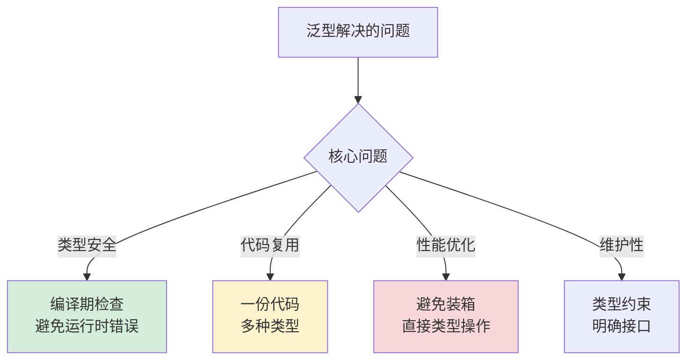
```mermaid
graph TB
    A[泛型解决的问题] --> B{核心问题}
    B -->|类型安全| C[编译期检查<br/>避免运行时错误]
    B -->|代码复用| D[一份代码<br/>多种类型]
    B -->|性能优化| E[避免装箱<br/>直接类型操作]
    B -->|维护性| F[类型约束<br/>明确接口]
    
    style C fill:#d4edda
    style D fill:#fff3cd
    style E fill:#f8d7da
```

### 1.4 泛型基本定义

**泛型基本概念案例**：某数据库框架通过泛型实现类型安全的ORM。

```java
// 泛型基本定义
public class Repository<T> {
    private List<T> entities = new ArrayList<>();
    
    // 泛型方法：类型参数T
    public void add(T entity) {
        entities.add(entity);
    }
    
    // 泛型方法：类型参数T
    public T findById(Long id) {
        return entities.stream()
            .filter(e -> e.getId().equals(id))
            .findFirst()
            .orElse(null);
    }
    
    // 泛型接口：类型参数T
    public interface Mapper<T> {
        T map(ResultSet rs) throws SQLException;
    }
}

// 使用示例：类型安全
Repository<User> userRepo = new Repository<>();
userRepo.add(new User("Alice"));  // 类型安全
User user = userRepo.findById(1L); // 无需强转
```

**泛型基本概念设计哲学**：

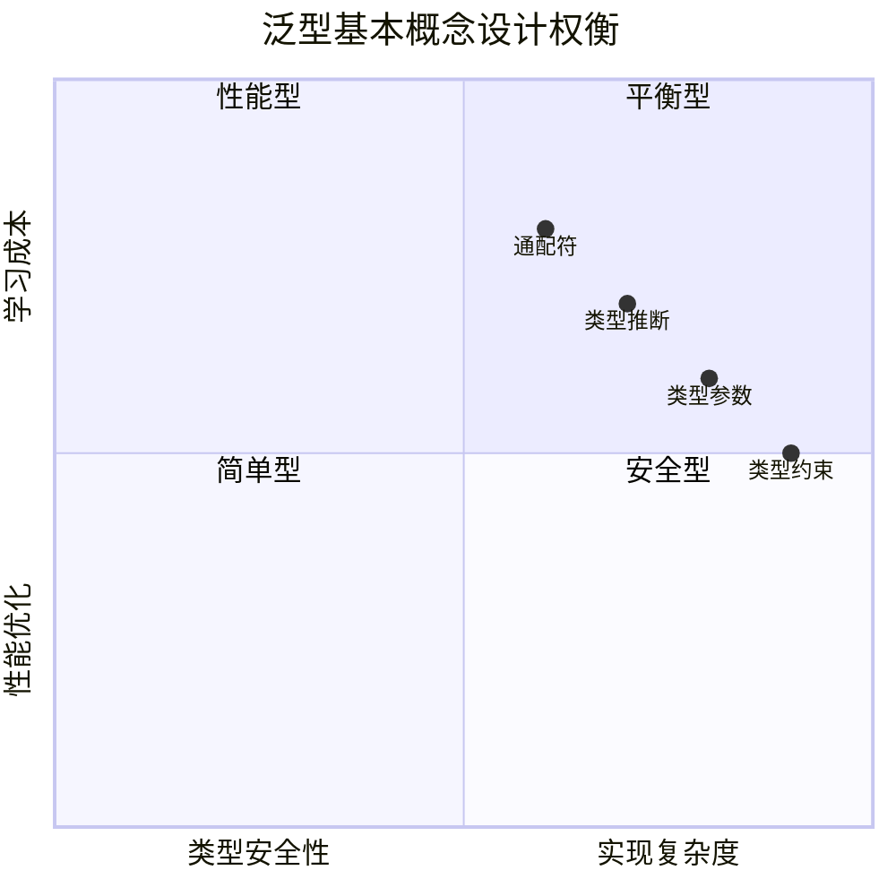
```mermaid
quadrantChart
    title 泛型基本概念设计权衡
    x-axis "类型安全性" --> "实现复杂度"
    y-axis "性能优化" --> "学习成本"
    quadrant-1 "平衡型"
    quadrant-2 "性能型"
    quadrant-3 "简单型"
    quadrant-4 "安全型"
    
    "类型参数": [0.8, 0.6]
    "类型约束": [0.9, 0.5]
    "类型推断": [0.7, 0.7]
    "通配符": [0.6, 0.8]
```

### 1.5 历史背景与发展

**泛型历史演进案例**：从C++模板到现代泛型的技术演进。

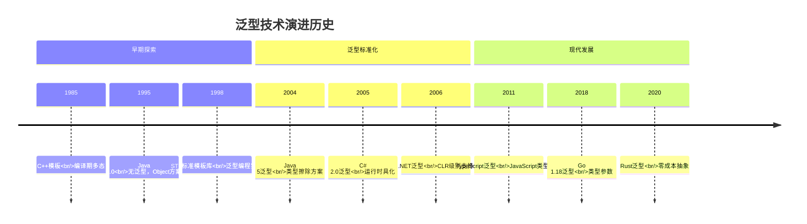
```mermaid
timeline
    title 泛型技术演进历史
    section 早期探索
        1985 : C++模板<br/>编译期多态
        1995 : Java 1.0<br/>无泛型，Object方案
        1998 : STL标准模板库<br/>泛型编程实践
    section 泛型标准化
        2004 : Java 5泛型<br/>类型擦除方案
        2005 : C# 2.0泛型<br/>运行时具化
        2006 : .NET泛型<br/>CLR级别支持
    section 现代发展
        2011 : TypeScript泛型<br/>JavaScript类型系统
        2018 : Go 1.18泛型<br/>类型参数
        2020 : Rust泛型<br/>零成本抽象
```

**泛型历史演进设计哲学**：

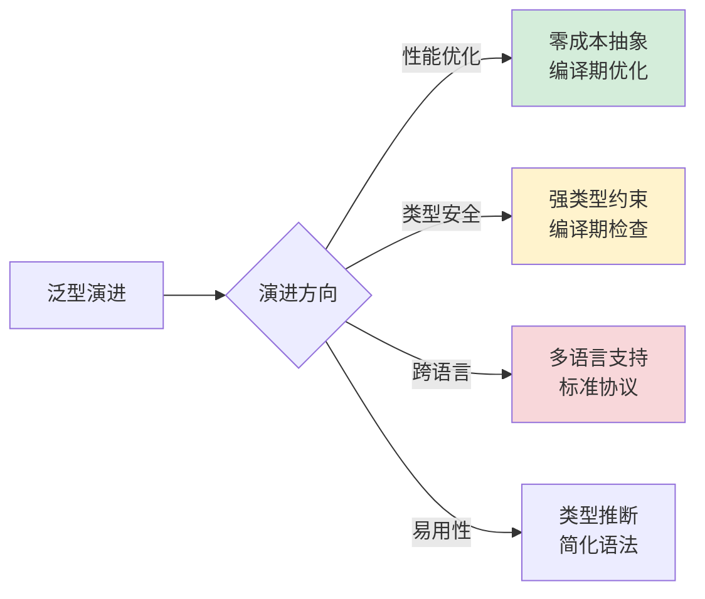
```mermaid
graph LR
    A[泛型演进] --> B{演进方向}
    B -->|性能优化| C[零成本抽象<br/>编译期优化]
    B -->|类型安全| D[强类型约束<br/>编译期检查]
    B -->|跨语言| E[多语言支持<br/>标准协议]
    B -->|易用性| F[类型推断<br/>简化语法]
    
    style C fill:#d4edda
    style D fill:#fff3cd
    style E fill:#f8d7da
```


## 2.核心思想与理念

### 2.1 参数多态性

**参数多态性案例**：某数学库通过参数多态实现通用算法。

```java
// 参数多态性：同一算法，多种类型
public class MathUtils {
    // 泛型方法：参数多态
    public static <T extends Number> T add(T a, T b) {
        if (a instanceof Integer) {
            return (T) Integer.valueOf(a.intValue() + b.intValue());
        } else if (a instanceof Double) {
            return (T) Double.valueOf(a.doubleValue() + b.doubleValue());
        }
        throw new IllegalArgumentException("不支持的类型");
    }
    
    // 参数多态设计哲学：
    // 1. 类型抽象：隐藏具体类型细节
    // 2. 算法复用：同一算法处理多种类型
    // 3. 类型安全：编译期类型检查
}

// 使用示例
Integer result1 = MathUtils.add(10, 20);     // 整数加法
Double result2 = MathUtils.add(10.5, 20.3); // 浮点数加法
```

**参数多态性设计哲学**：

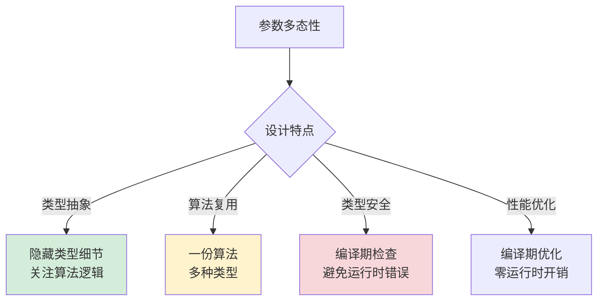
```mermaid
graph TB
    A[参数多态性] --> B{设计特点}
    B -->|类型抽象| C[隐藏类型细节<br/>关注算法逻辑]
    B -->|算法复用| D[一份算法<br/>多种类型]
    B -->|类型安全| E[编译期检查<br/>避免运行时错误]
    B -->|性能优化| F[编译期优化<br/>零运行时开销]
    
    style C fill:#d4edda
    style D fill:#fff3cd
    style E fill:#f8d7da
```

### 2.2 类型抽象

**类型抽象案例**：某图形库通过类型抽象实现通用渲染器。

```java
// 类型抽象：抽象出类型共性
public interface Renderable<T> {
    void render(T context);
    T getBounds();
}

// 具体类型实现
class Circle implements Renderable<Rectangle> {
    public void render(Rectangle context) {
        // 圆形渲染逻辑
    }
    
    public Rectangle getBounds() {
        return new Rectangle(x, y, radius * 2, radius * 2);
    }
}

class Square implements Renderable<Rectangle> {
    public void render(Rectangle context) {
        // 正方形渲染逻辑
    }
    
    public Rectangle getBounds() {
        return new Rectangle(x, y, size, size);
    }
}

// 类型抽象设计哲学：
// 1. 共性提取：抽象出类型的共同行为
// 2. 接口约束：通过接口定义类型能力
// 3. 多态实现：不同类型实现相同接口
```

**类型抽象设计哲学**：

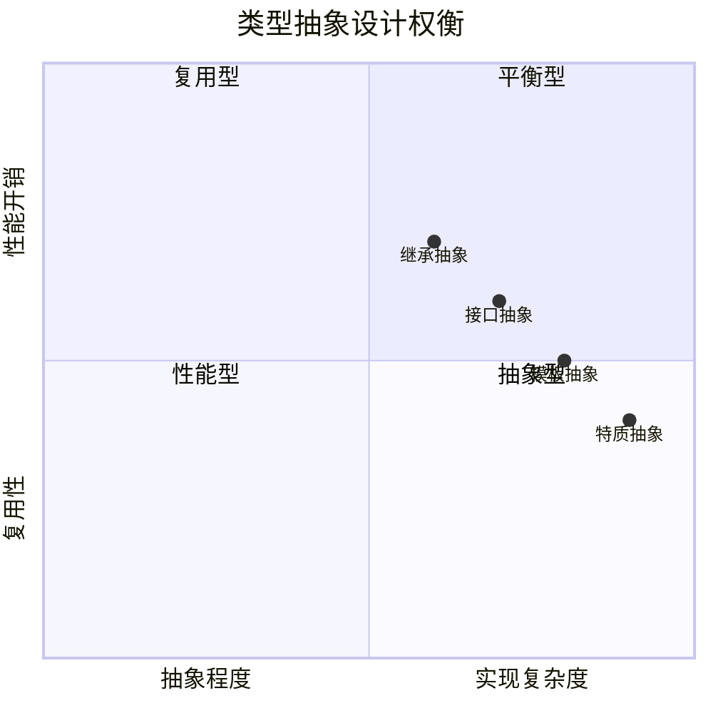
```mermaid
quadrantChart
    title 类型抽象设计权衡
    x-axis "抽象程度" --> "实现复杂度"
    y-axis "复用性" --> "性能开销"
    quadrant-1 "平衡型"
    quadrant-2 "复用型"
    quadrant-3 "性能型"
    quadrant-4 "抽象型"
    
    "接口抽象": [0.7, 0.6]
    "模板抽象": [0.8, 0.5]
    "特质抽象": [0.9, 0.4]
    "继承抽象": [0.6, 0.7]
```

### 2.3 编译时多态

**编译时多态案例**：某编译器通过编译时多态优化代码生成。

```cpp
// C++编译时多态：模板特化
template<typename T>
class Calculator {
public:
    T add(T a, T b) {
        return a + b;  // 编译时多态
    }
};

// 模板特化：编译时优化
template<>
class Calculator<std::string> {
public:
    std::string add(std::string a, std::string b) {
        return a + b;  // 字符串连接
    }
};

// 使用示例
let int_result = generic_function(42);      // 调用generic_function_i32
let str_result = generic_function("hello"); // 调用generic_function_string

// 编译时多态设计哲学：
// 1. 零运行时开销：编译期确定类型
// 2. 性能优化：内联展开，无虚函数调用
// 3. 类型安全：编译期完全类型检查
```

**编译时多态设计哲学**：

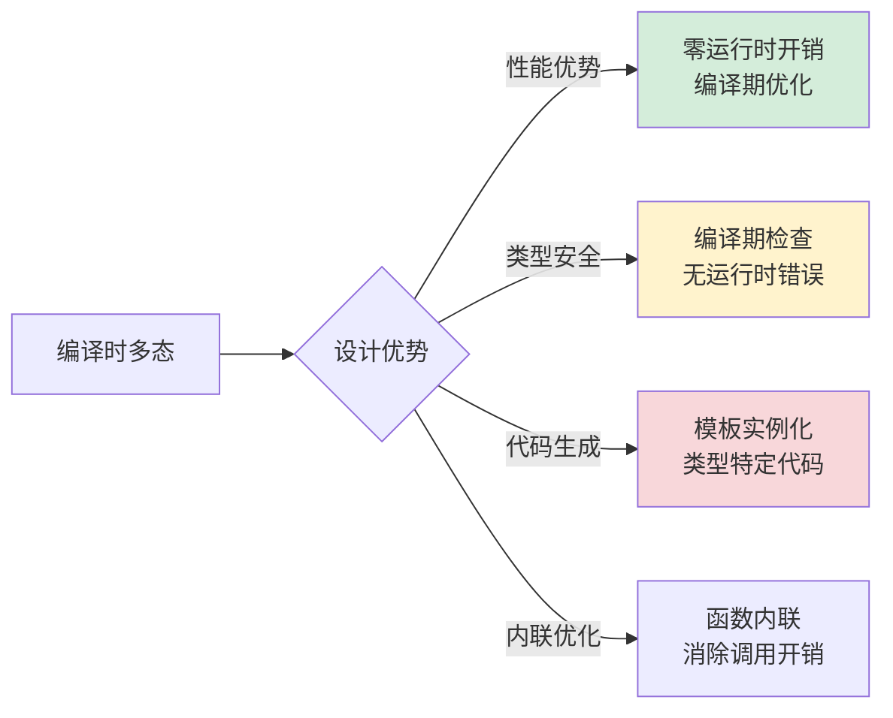
```mermaid
graph LR
    A[编译时多态] --> B{设计优势}
    B -->|性能优势| C[零运行时开销<br/>编译期优化]
    B -->|类型安全| D[编译期检查<br/>无运行时错误]
    B -->|代码生成| E[模板实例化<br/>类型特定代码]
    B -->|内联优化| F[函数内联<br/>消除调用开销]
    
    style C fill:#d4edda
    style D fill:#fff3cd
    style E fill:#f8d7da
```

### 2.4 约束与边界

**约束与边界案例**：某数值计算库通过类型约束保证算法正确性。

```java
// 类型约束：限定类型范围
public class NumericAlgorithm<T extends Number & Comparable<T>> {
    
    // 约束1：必须是Number的子类
    // 约束2：必须实现Comparable接口
    
    public T max(T a, T b) {
        return a.compareTo(b) > 0 ? a : b;
    }
    
    public T sum(T a, T b) {
        if (a instanceof Integer) {
            return (T) Integer.valueOf(a.intValue() + b.intValue());
        }
        // 其他类型处理...
        throw new UnsupportedOperationException();
    }
}

// 使用示例：类型约束
NumericAlgorithm<Integer> intAlgo = new NumericAlgorithm<>();
Integer max = intAlgo.max(10, 20);  // 类型安全

// NumericAlgorithm<String> strAlgo = new NumericAlgorithm<>(); // 编译错误！
```

**约束与边界设计哲学**：

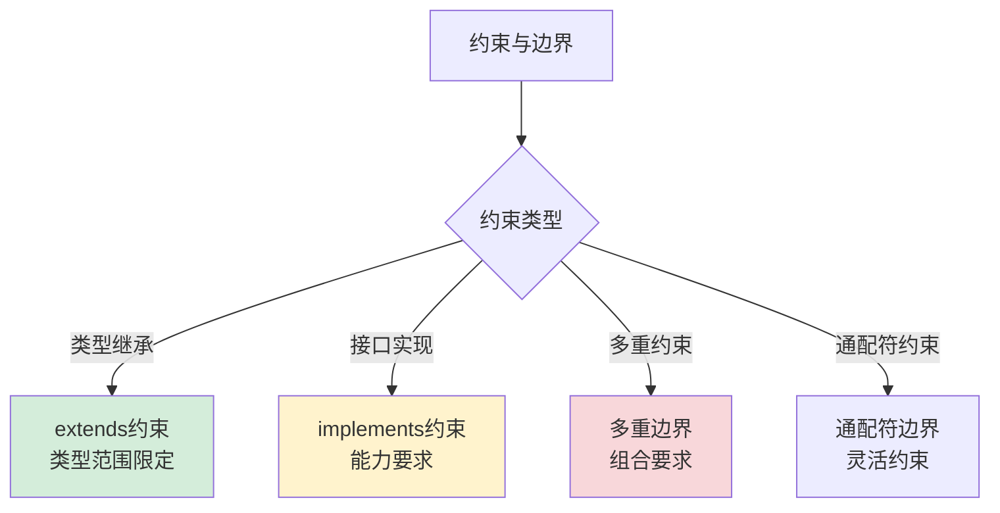
```mermaid
graph TB
    A[约束与边界] --> B{约束类型}
    B -->|类型继承| C[extends约束<br/>类型范围限定]
    B -->|接口实现| D[implements约束<br/>能力要求]
    B -->|多重约束| E[多重边界<br/>组合要求]
    B -->|通配符约束| F[通配符边界<br/>灵活约束]
    
    style C fill:#d4edda
    style D fill:#fff3cd
    style E fill:#f8d7da
```


## 3.泛型具体设计

### 3.1 泛型类设计

**泛型类设计案例**：某集合框架通过泛型类实现类型安全容器。

```java
// 泛型类设计：类型参数化
public class GenericContainer<T> {
    private T value;
    
    // 构造函数：类型参数化
    public GenericContainer(T value) {
        this.value = value;
    }
    
    // 方法：使用类型参数
    public T getValue() {
        return value;
    }
    
    public void setValue(T value) {
        this.value = value;
    }
    
    // 静态方法：不能使用类类型参数
    public static <U> GenericContainer<U> of(U value) {
        return new GenericContainer<>(value);
    }
}

// 使用示例：类型安全
GenericContainer<String> stringContainer = new GenericContainer<>("Hello");
String value = stringContainer.getValue();  // 无需强转

GenericContainer<Integer> intContainer = GenericContainer.of(100);
Integer number = intContainer.getValue();  // 类型安全
```

**泛型类设计哲学**：

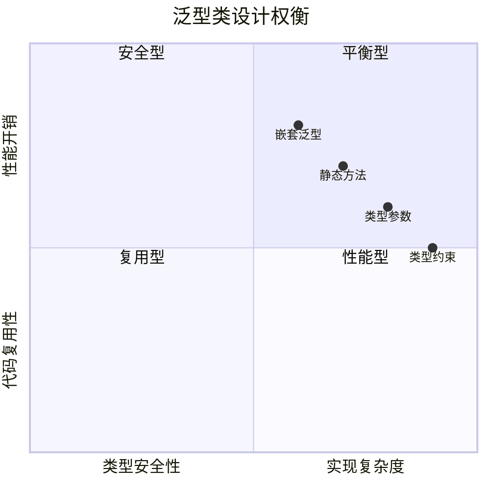
```mermaid
quadrantChart
    title 泛型类设计权衡
    x-axis "类型安全性" --> "实现复杂度"
    y-axis "代码复用性" --> "性能开销"
    quadrant-1 "平衡型"
    quadrant-2 "安全型"
    quadrant-3 "复用型"
    quadrant-4 "性能型"
    
    "类型参数": [0.8, 0.6]
    "类型约束": [0.9, 0.5]
    "静态方法": [0.7, 0.7]
    "嵌套泛型": [0.6, 0.8]
```

### 3.2 泛型方法设计

**泛型方法设计案例**：某工具类通过泛型方法实现通用算法。

```java
// 泛型方法设计：方法级别类型参数
public class AlgorithmUtils {
    
    // 泛型方法：类型参数T
    public static <T> T findMax(T[] array, Comparator<T> comparator) {
        if (array.length == 0) return null;
        
        T max = array[0];
        for (int i = 1; i < array.length; i++) {
            if (comparator.compare(array[i], max) > 0) {
                max = array[i];
            }
        }
        return max;
    }
    
    // 泛型方法：类型推断
    public static <T> List<T> filter(List<T> list, Predicate<T> predicate) {
        return list.stream()
            .filter(predicate)
            .collect(Collectors.toList());
    }
    
    // 泛型方法：多类型参数
    public static <T, U> U transform(T input, Function<T, U> transformer) {
        return transformer.apply(input);
    }
}

// 使用示例：类型推断
String[] names = {"Alice", "Bob", "Charlie"};
String maxName = AlgorithmUtils.findMax(names, String::compareTo);

List<Integer> numbers = Arrays.asList(1, 2, 3, 4, 5);
List<Integer> evens = AlgorithmUtils.filter(numbers, n -> n % 2 == 0);
```

**泛型方法设计哲学**：

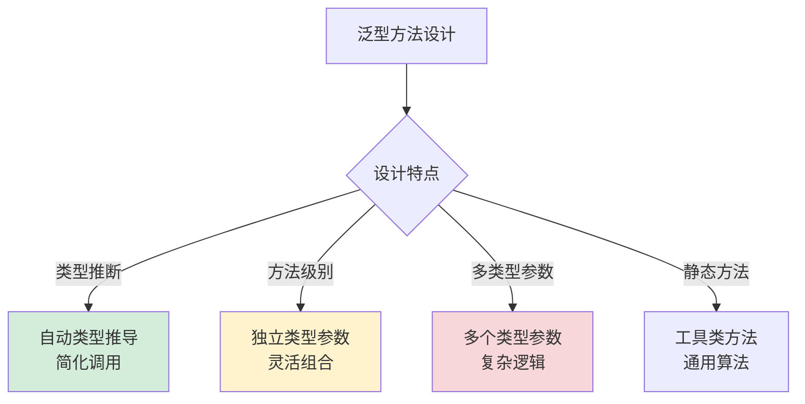
```mermaid
graph TB
    A[泛型方法设计] --> B{设计特点}
    B -->|类型推断| C[自动类型推导<br/>简化调用]
    B -->|方法级别| D[独立类型参数<br/>灵活组合]
    B -->|多类型参数| E[多个类型参数<br/>复杂逻辑]
    B -->|静态方法| F[工具类方法<br/>通用算法]
    
    style C fill:#d4edda
    style D fill:#fff3cd
    style E fill:#f8d7da
```

### 3.3 泛型接口设计

**泛型接口设计案例**：某数据访问层通过泛型接口实现通用DAO。

```java
// 泛型接口设计：接口级别类型参数
public interface Repository<T, ID> {
    
    // 保存实体
    T save(T entity);
    
    // 根据ID查找
    Optional<T> findById(ID id);
    
    // 查找所有
    List<T> findAll();
    
    // 删除实体
    void delete(T entity);
    
    // 泛型接口设计哲学：
    // 1. 类型安全：明确的类型约束
    // 2. 代码复用：通用数据访问模式
    // 3. 接口约束：统一的访问接口
}

// 具体实现
public class UserRepository implements Repository<User, Long> {
    public User save(User user) {
        // 用户保存逻辑
        return user;
    }
    
    public Optional<User> findById(Long id) {
        // 用户查找逻辑
        return Optional.empty();
    }
    
    // 其他方法实现...
}

// 使用示例：类型安全
UserRepository userRepo = new UserRepository();
User user = userRepo.save(new User("Alice"));
Optional<User> found = userRepo.findById(1L);
```

**泛型接口设计哲学**：

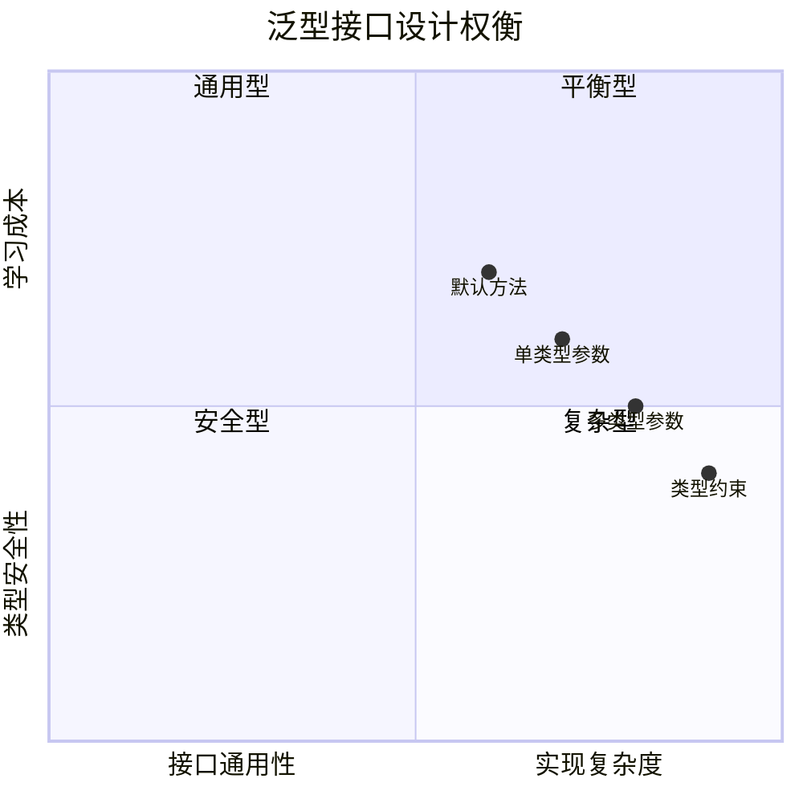
```mermaid
quadrantChart
    title 泛型接口设计权衡
    x-axis "接口通用性" --> "实现复杂度"
    y-axis "类型安全性" --> "学习成本"
    quadrant-1 "平衡型"
    quadrant-2 "通用型"
    quadrant-3 "安全型"
    quadrant-4 "复杂型"
    
    "单类型参数": [0.7, 0.6]
    "多类型参数": [0.8, 0.5]
    "类型约束": [0.9, 0.4]
    "默认方法": [0.6, 0.7]
```

### 3.4 泛型构造器

```java
public class GenericConstructor {
    private String value;
    
    // 泛型构造器：构造器有自己的类型参数
    public <T> GenericConstructor(T input) {
        this.value = input.toString();
    }
    
    // 有界泛型构造器
    public <T extends Number> GenericConstructor(T number, String prefix) {
        this.value = prefix + number.toString();
    }
}

// 使用
GenericConstructor gc1 = new GenericConstructor(42);        // T推断为Integer
GenericConstructor gc2 = new GenericConstructor("hello");   // T推断为String
```

### 3.5 通配符设计

```java
// 上界通配符: <? extends T> → 只能读，不能写
List<? extends Animal> animals = new ArrayList<Cat>();  // OK
Animal a = animals.get(0);  // OK，读出来一定是Animal
// animals.add(new Cat());  // 编译错误！不知道具体是哪种Animal的List

// 下界通配符: <? super T> → 只能写，不能读（只能读Object）
List<? super Cat> cats = new ArrayList<Animal>();  // OK
cats.add(new Cat());      // OK，Cat一定满足约束
// Cat c = cats.get(0);   // 编译错误！不知道取出来的具体类型

// 无界通配符: <?> → 既不能读也不能写（只能null）
List<?> list = new ArrayList<String>();
// list.add("hello");     // 编译错误！
Object o = list.get(0);  // 只能当Object用
```


## 4.泛型编译原理

### 4.1 类型擦除（Java方式）

**类型擦除案例**：某Java框架通过类型擦除实现向后兼容。

```java
// Java类型擦除原理
public class ErasureExample<T> {
    private T value;
    
    public void setValue(T value) {
        this.value = value;
    }
    
    public T getValue() {
        return value;
    }
    
    // 编译后：类型擦除为Object
    // public void setValue(Object value) { ... }
    // public Object getValue() { ... }
}

// 类型擦除设计哲学：
// 1. 向后兼容：与Java 1.4代码兼容
// 2. 运行时效率：无额外类型信息
// 3. 实现简单：编译器处理类型检查

// 类型擦除的限制
public class ErasureLimitation {
    // 无法创建泛型数组
    // T[] array = new T[10];  // 编译错误！
    
    // 无法获取运行时类型
    // if (value instanceof T) { ... }  // 编译错误！
    
    // 无法重载泛型方法
    // void method(List<String> list) { ... }
    // void method(List<Integer> list) { ... }  // 编译错误！
}
```

**类型擦除设计哲学**：

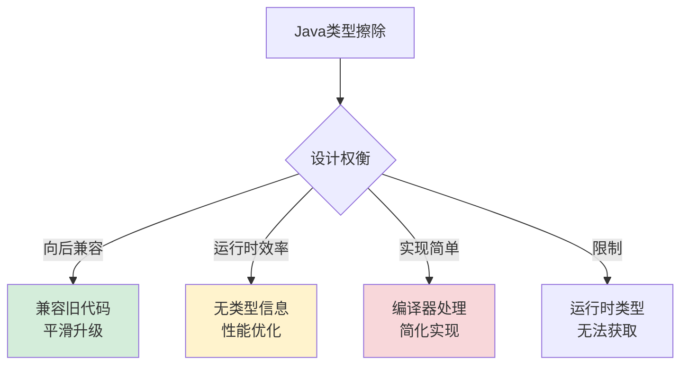
```mermaid
graph TB
    A[Java类型擦除] --> B{设计权衡}
    B -->|向后兼容| C[兼容旧代码<br/>平滑升级]
    B -->|运行时效率| D[无类型信息<br/>性能优化]
    B -->|实现简单| E[编译器处理<br/>简化实现]
    B -->|限制| F[运行时类型<br/>无法获取]
    
    style C fill:#d4edda
    style D fill:#fff3cd
    style E fill:#f8d7da
```

### 4.2 单态化（C++/Rust方式）

**单态化案例**：某高性能计算库通过单态化实现零开销泛型。

```rust
// Rust单态化原理：编译期生成具体类型代码
fn generic_function<T>(value: T) -> T {
    value
}

// 编译期单态化：生成具体类型函数
fn generic_function_i32(value: i32) -> i32 {
    value
}

fn generic_function_string(value: String) -> String {
    value
}

// 使用示例
let int_result = generic_function(42);      // 调用generic_function_i32
let str_result = generic_function("hello"); // 调用generic_function_string

// 单态化设计哲学：
// 1. 零运行时开销：编译期生成具体代码
// 2. 性能优化：内联展开，无虚函数调用
// 3. 类型安全：编译期完全类型检查
```

**单态化设计哲学**：

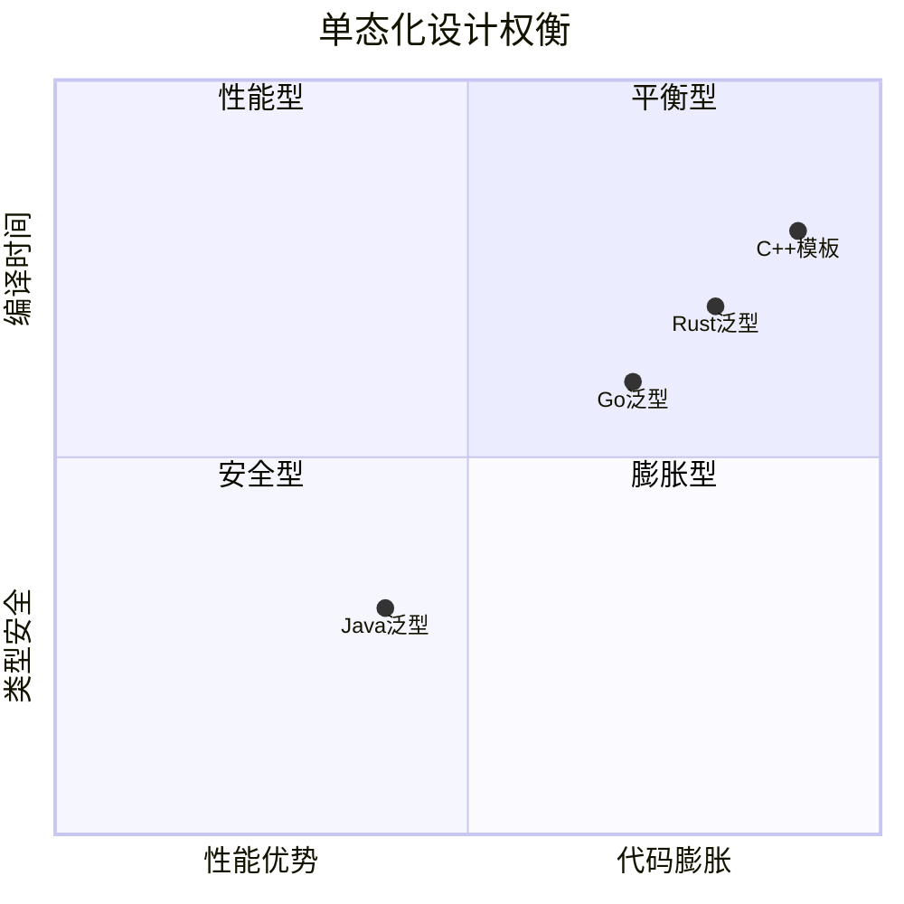
```mermaid
quadrantChart
    title 单态化设计权衡
    x-axis "性能优势" --> "代码膨胀"
    y-axis "类型安全" --> "编译时间"
    quadrant-1 "平衡型"
    quadrant-2 "性能型"
    quadrant-3 "安全型"
    quadrant-4 "膨胀型"
    
    "C++模板": [0.9, 0.8]
    "Rust泛型": [0.8, 0.7]
    "Go泛型": [0.7, 0.6]
    "Java泛型": [0.4, 0.3]
```

### 4.3 具化泛型（C#方式）

**具化泛型案例**：某.NET应用通过具化泛型实现运行时类型信息。

```csharp
// C#具化泛型：运行时保留类型信息
public class GenericClass<T> {
    private T value;
    
    public T Value {
        get { return value; }
        set { this.value = value; }
    }
    
    // 运行时类型信息
    public Type GetGenericType() {
        return typeof(T);
    }
    
    // 类型检查
    public bool IsValueType() {
        return typeof(T).IsValueType;
    }
}

// 使用示例：运行时类型信息
var intClass = new GenericClass<int>();
Type type = intClass.GetGenericType();  // 获取int类型
bool isValueType = intClass.IsValueType(); // true

// 具化泛型设计哲学：
// 1. 运行时类型信息：保留泛型参数类型
// 2. 反射支持：运行时泛型类型操作
// 3. 性能平衡：介于擦除和单态化之间
```

**具化泛型设计哲学**：

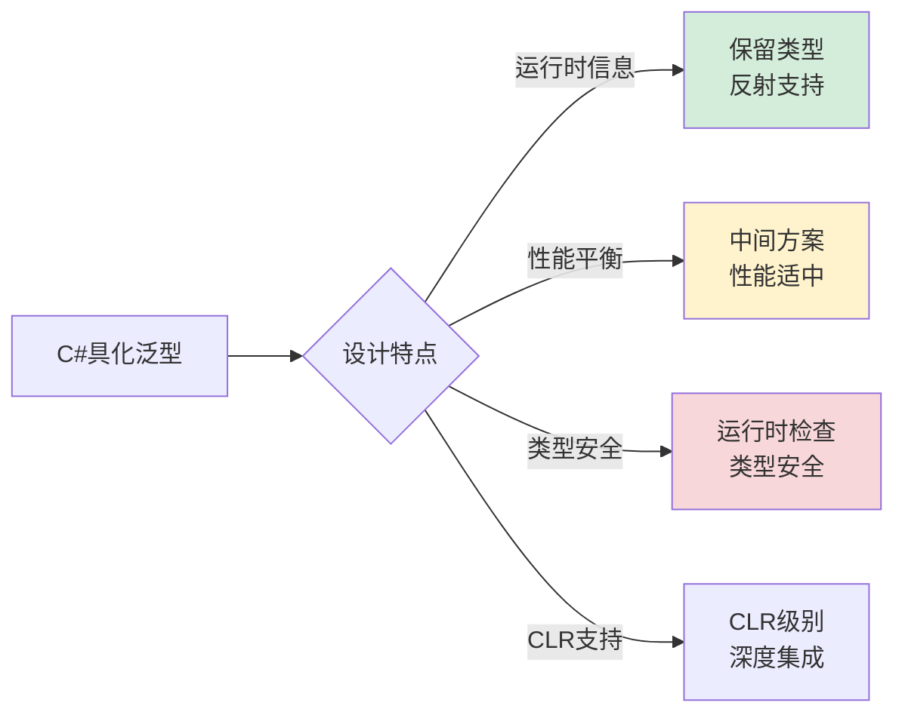
```mermaid
graph LR
    A[C#具化泛型] --> B{设计特点}
    B -->|运行时信息| C[保留类型<br/>反射支持]
    B -->|性能平衡| D[中间方案<br/>性能适中]
    B -->|类型安全| E[运行时检查<br/>类型安全]
    B -->|CLR支持| F[CLR级别<br/>深度集成]
    
    style C fill:#d4edda
    style D fill:#fff3cd
    style E fill:#f8d7da
```

### 4.4 编译时检查流程

**编译时检查案例**：某编译器通过编译时检查保证泛型类型安全。

```java
// 编译时检查流程
public class CompileTimeCheck<T extends Number> {
    private T value;
    
    public void setValue(T value) {
        this.value = value;
    }
    
    public T getValue() {
        return value;
    }
    
    // 编译时检查：
    // 1. 类型边界检查：T必须是Number的子类
    // 2. 方法调用检查：参数类型匹配
    // 3. 返回值检查：返回类型匹配
}

// 编译时检查流程：
// 1. 语法分析：解析泛型语法
// 2. 类型推断：推导类型参数
// 3. 边界检查：验证类型约束
// 4. 类型擦除：生成字节码
// 5. 桥接方法：生成兼容方法
```

**编译时检查设计哲学**：

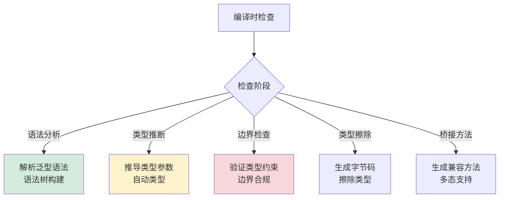
```mermaid
flowchart TD
    A[编译时检查] --> B{检查阶段}
    B -->|语法分析| C[解析泛型语法<br/>语法树构建]
    B -->|类型推断| D[推导类型参数<br/>自动类型]
    B -->|边界检查| E[验证类型约束<br/>边界合规]
    B -->|类型擦除| F[生成字节码<br/>擦除类型]
    B -->|桥接方法| G[生成兼容方法<br/>多态支持]
    
    style C fill:#d4edda
    style D fill:#fff3cd
    style E fill:#f8d7da
```


## 5.协变逆变与类型推断

### 5.1 协变与逆变原理

**协变逆变案例**：某图形库通过协变逆变实现类型安全的图形变换。

```java
// 协变：子类型关系保持
List<? extends Shape> shapes = new ArrayList<Circle>();  // 协变
// shapes.add(new Circle());  // 编译错误！不能写入
Shape shape = shapes.get(0);  // 可以读取

// 逆变：子类型关系反转
List<? super Circle> circles = new ArrayList<Shape>();  // 逆变
circles.add(new Circle());  // 可以写入
// Circle circle = circles.get(0);  // 编译错误！不能读取

// 协变逆变设计哲学：
// 1. 类型安全：编译期保证类型关系
// 2. 灵活性：支持多态类型操作
// 3. 边界控制：通过通配符限制操作
```

**协变逆变设计哲学**：

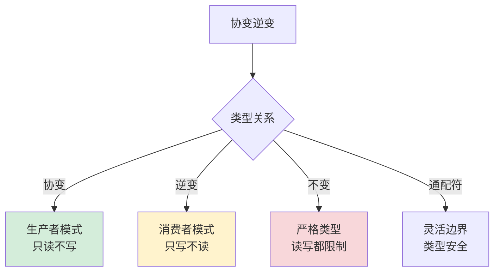
```mermaid
graph TB
    A[协变逆变] --> B{类型关系}
    B -->|协变| C[生产者模式<br/>只读不写]
    B -->|逆变| D[消费者模式<br/>只写不读]
    B -->|不变| E[严格类型<br/>读写都限制]
    B -->|通配符| F[灵活边界<br/>类型安全]
    
    style C fill:#d4edda
    style D fill:#fff3cd
    style E fill:#f8d7da
```

### 5.2 PECS原则

**PECS原则案例**：某集合框架通过PECS原则实现类型安全的集合操作。

```java
// PECS原则：Producer Extends, Consumer Super
public class CollectionUtils {
    
    // 生产者：使用extends
    public static <T> void copy(List<? extends T> src, List<? super T> dest) {
        for (T item : src) {
            dest.add(item);  // 生产者到消费者
        }
    }
    
    // 消费者：使用super
    public static <T> void addAll(List<? super T> list, T... items) {
        for (T item : items) {
            list.add(item);  // 消费者接受生产者
        }
    }
}

// PECS原则设计哲学：
// 1. 生产者：提供数据，使用extends
// 2. 消费者：接收数据，使用super
// 3. 类型安全：编译期保证数据流向
```

**PECS原则设计权衡**：

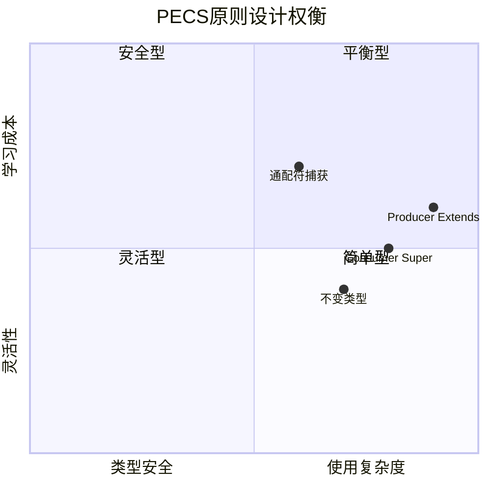
```mermaid
quadrantChart
    title PECS原则设计权衡
    x-axis "类型安全" --> "使用复杂度"
    y-axis "灵活性" --> "学习成本"
    quadrant-1 "平衡型"
    quadrant-2 "安全型"
    quadrant-3 "灵活型"
    quadrant-4 "简单型"
    
    "Producer Extends": [0.9, 0.6]
    "Consumer Super": [0.8, 0.5]
    "不变类型": [0.7, 0.4]
    "通配符捕获": [0.6, 0.7]
```

### 5.3 类型推断机制

**类型推断案例**：某编译器通过类型推断简化泛型代码。

```java
// 类型推断：自动推导类型参数
public class InferenceExample {
    
    // 泛型方法：类型参数T
    public static <T> T identity(T value) {
        return value;
    }
    
    // 使用类型推断
    String result1 = identity("Hello");  // 推断T为String
    Integer result2 = identity(42);        // 推断T为Integer
    
    // 钻石操作符：Java 7+类型推断
    List<String> list = new ArrayList<>();  // 推断ArrayList<String>
    
    // 方法链类型推断
    List<String> filtered = list.stream()
        .filter(s -> s.length() > 3)       // 推断Predicate<String>
        .collect(Collectors.toList());     // 推断Collector<String>
}

// 类型推断设计哲学：
// 1. 简化语法：减少冗余类型声明
// 2. 提高可读性：代码更简洁
// 3. 编译期优化：类型推导算法
```

**类型推断设计哲学**：

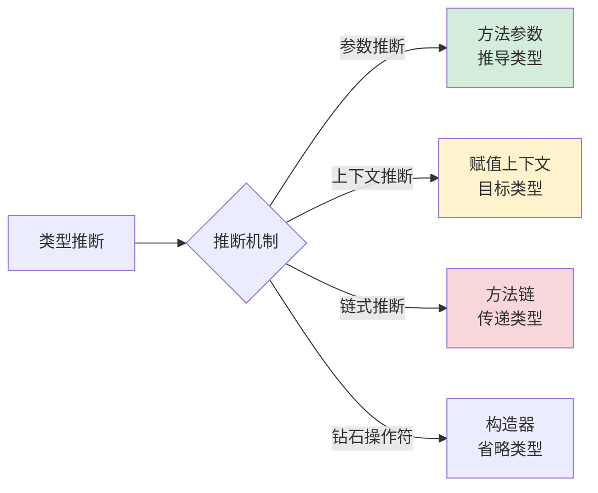
```mermaid
graph LR
    A[类型推断] --> B{推断机制}
    B -->|参数推断| C[方法参数<br/>推导类型]
    B -->|上下文推断| D[赋值上下文<br/>目标类型]
    B -->|链式推断| E[方法链<br/>传递类型]
    B -->|钻石操作符| F[构造器<br/>省略类型]
    
    style C fill:#d4edda
    style D fill:#fff3cd
    style E fill:#f8d7da
```


## 6.泛型使用限制

### 6.1 类型擦除的限制

**类型擦除限制案例**：某反射框架因类型擦除无法获取泛型信息。

```java
// 类型擦除的限制
public class ErasureLimitation<T> {
    private T value;
    
    // 限制1：无法创建泛型数组
    // T[] array = new T[10];  // 编译错误！
    
    // 限制2：无法获取运行时类型
    public void checkType() {
        // if (value instanceof T) { ... }  // 编译错误！
    }
    
    // 限制3：无法重载泛型方法
    // void method(List<String> list) { ... }
    // void method(List<Integer> list) { ... }  // 编译错误！
    
    // 限制4：静态上下文无法使用类型参数
    // static T staticValue;  // 编译错误！
}

// 类型擦除限制设计哲学：
// 1. 向后兼容：牺牲运行时信息
// 2. 实现简单：编译器处理类型
// 3. 性能优化：无运行时开销
```

**类型擦除限制设计权衡**：

```mermaid
graph TB
    A[类型擦除限制] --> B{限制类型}
    B -->|数组创建| C[无法创建<br/>泛型数组]
    B -->|类型检查| D[无法获取<br/>运行时类型]
    B -->|方法重载| E[无法重载<br/>泛型方法]
    B -->|静态上下文| F[静态字段<br/>无法使用]
    
    style C fill:#d4edda
    style D fill:#fff3cd
    style E fill:#f8d7da
```

### 6.2 桥接方法原理

**桥接方法案例**：某编译器通过桥接方法实现泛型多态。

```java
// 桥接方法：类型擦除后的兼容性
public interface Comparable<T> {
    int compareTo(T other);
}

public class String implements Comparable<String> {
    // 原始方法
    public int compareTo(String other) {
        return this.compareTo(other);
    }
    
    // 编译器生成的桥接方法
    public int compareTo(Object other) {
        return compareTo((String) other);  // 桥接到具体类型
    }
}

// 桥接方法设计哲学：
// 1. 二进制兼容：保持字节码兼容性
// 2. 多态支持：实现泛型接口多态
// 3. 类型安全：编译期类型检查
```

**桥接方法设计哲学**：

```mermaid
quadrantChart
    title 桥接方法设计权衡
    x-axis "兼容性" --> "性能开销"
    y-axis "类型安全" --> "实现复杂度"
    quadrant-1 "平衡型"
    quadrant-2 "兼容型"
    quadrant-3 "安全型"
    quadrant-4 "性能型"
    
    "方法桥接": [0.9, 0.3]
    "类型转换": [0.8, 0.4]
    "多态支持": [0.7, 0.5]
    "字节码兼容": [0.6, 0.6]
```

### 6.3 模糊性错误

**模糊性错误案例**：某代码库因模糊性错误导致编译失败。

```java
// 模糊性错误：类型推断冲突
public class AmbiguityExample {
    
    // 重载方法：类型推断冲突
    public static void process(List<String> list) {
        System.out.println("String list");
    }
    
    public static void process(List<Integer> list) {
        System.out.println("Integer list");
    }
    
    // 调用时产生模糊性错误
    public static void main(String[] args) {
        // process(new ArrayList<>());  // 编译错误！类型推断模糊
        
        // 解决方案：显式类型声明
        process(new ArrayList<String>());  // 明确类型
    }
}

// 模糊性错误设计哲学：
// 1. 类型安全：避免推断错误
// 2. 明确性：要求显式类型声明
// 3. 编译器保护：防止运行时错误
```

**模糊性错误设计哲学**：

```mermaid
graph LR
    A[模糊性错误] --> B{错误原因}
    B -->|类型推断| C[类型参数<br/>推断冲突]
    B -->|方法重载| D[重载方法<br/>类型相同]
    B -->|通配符| E[通配符<br/>类型不确定]
    B -->|边界冲突| F[类型边界<br/>重叠]
    
    style C fill:#d4edda
    style D fill:#fff3cd
    style E fill:#f8d7da
```

### 6.4 其他限制

**其他限制案例**：某框架因泛型限制无法实现某些功能。

```java
// 其他泛型限制
public class OtherLimitations {
    
    // 限制1：无法捕获通配符
    public static void wildcardCapture(List<?> list) {
        // list.add("hello");  // 编译错误！无法捕获
        
        // 解决方案：辅助方法
        helper(list);
    }
    
    private static <T> void helper(List<T> list) {
        list.add((T) "hello");  // 可以添加
    }
    
    // 限制2：无法使用基本类型
    // List<int> intList;  // 编译错误！必须使用包装类
    List<Integer> integerList;  // 必须使用包装类
    
    // 限制3：类型参数不能实例化
    // T obj = new T();  // 编译错误！无法实例化
}

// 其他限制设计哲学：
// 1. 类型安全：避免运行时错误
// 2. 实现约束：语言设计限制
// 3. 性能考虑：基本类型处理
```

**其他限制设计权衡**：

```mermaid
quadrantChart
    title 泛型其他限制设计权衡
    x-axis "类型安全" --> "功能限制"
    y-axis "实现复杂度" --> "使用便利性"
    quadrant-1 "平衡型"
    quadrant-2 "安全型"
    quadrant-3 "复杂型"
    quadrant-4 "便利型"
    
    "通配符捕获": [0.8, 0.6]
    "基本类型": [0.9, 0.5]
    "类型实例化": [0.7, 0.7]
    "静态上下文": [0.6, 0.8]
```


## 7.主流语言泛型对比

### 7.1 Java泛型

**Java泛型设计哲学案例**：某企业级应用通过Java泛型实现类型安全。

```java
// Java泛型：类型擦除方案
public class JavaGeneric<T> {
    private T value;
    
    // 类型擦除：编译后变为Object
    public void setValue(T value) {
        this.value = value;
    }
    
    public T getValue() {
        return value;
    }
    
    // 通配符：灵活的类型约束
    public void processList(List<? extends Number> list) {
        // 可以读取，不能写入
        Number num = list.get(0);
    }
    
    public void addToList(List<? super Integer> list) {
        // 可以写入，读取为Object
        list.add(42);
    }
}

// Java泛型设计哲学：
// 1. 向后兼容：与旧代码兼容
// 2. 类型安全：编译期检查
// 3. 实现简单：类型擦除
```

**Java泛型设计权衡**：

```mermaid
graph TB
    A[Java泛型] --> B{设计特点}
    B -->|向后兼容| C[兼容旧代码<br/>平滑升级]
    B -->|类型安全| D[编译期检查<br/>运行时擦除]
    B -->|实现简单| E[类型擦除<br/>无运行时开销]
    B -->|限制| F[运行时类型<br/>无法获取]
    
    style C fill:#d4edda
    style D fill:#fff3cd
    style E fill:#f8d7da
```

### 7.2 C++模板

**C++模板设计哲学案例**：某游戏引擎通过C++模板实现高性能算法。

```cpp
// C++模板：编译期单态化
template<typename T>
class Vector {
private:
    T* data;
    size_t size;
    
public:
    Vector(size_t size) : size(size) {
        data = new T[size];
    }
    
    T& operator[](size_t index) {
        return data[index];
    }
    
    // 模板特化：特定类型优化
template<>
class Vector<bool> {
    // 位压缩优化
};
};

// C++模板设计哲学：
// 1. 零运行时开销：编译期生成代码
// 2. 性能优化：内联展开，无虚函数
// 3. 元编程：编译期计算
```

**C++模板设计权衡**：

```mermaid
quadrantChart
    title C++模板设计权衡
    x-axis "性能优势" --> "编译时间"
    y-axis "代码膨胀" --> "学习成本"
    quadrant-1 "平衡型"
    quadrant-2 "性能型"
    quadrant-3 "膨胀型"
    quadrant-4 "复杂型"
    
    "基本模板": [0.8, 0.6]
    "模板特化": [0.9, 0.5]
    "元编程": [0.7, 0.7]
    "概念约束": [0.6, 0.8]
```

### 7.3 C#泛型

**C#泛型设计哲学案例**：某.NET应用通过C#泛型实现运行时类型安全。

```csharp
// C#泛型：运行时具化
public class GenericClass<T> {
    private T value;
    
    public T Value {
        get { return value; }
        set { this.value = value; }
    }
    
    // 运行时类型信息
    public Type GetGenericType() {
        return typeof(T);
    }
    
    // 约束：类型边界
    public void Process<T2>() where T2 : T {
        // T2必须是T的子类
    }
}

// C#泛型设计哲学：
// 1. 运行时类型信息：保留泛型参数
// 2. 性能优化：值类型无需装箱
// 3. CLR支持：深度运行时集成
```

**C#泛型设计权衡**：

```mermaid
graph LR
    A[C#泛型] --> B{设计特点}
    B -->|运行时信息| C[保留类型<br/>反射支持]
    B -->|性能优化| D[值类型<br/>无需装箱]
    B -->|CLR集成| E[深度集成<br/>运行时支持]
    B -->|约束系统| F[类型约束<br/>编译期检查]
    
    style C fill:#d4edda
    style D fill:#fff3cd
    style E fill:#f8d7da
```

### 7.4 TypeScript泛型

**TypeScript泛型设计哲学案例**：某前端框架通过TypeScript泛型实现类型安全。

```typescript
// TypeScript泛型：编译时类型检查
interface Repository<T> {
    findById(id: number): T | null;
    save(entity: T): void;
    findAll(): T[];
}

class UserRepository implements Repository<User> {
    findById(id: number): User | null {
        // 用户查找逻辑
        return null;
    }
    
    save(user: User): void {
        // 用户保存逻辑
    }
    
    findAll(): User[] {
        return [];
    }
}

// TypeScript泛型设计哲学：
// 1. 编译时检查：JavaScript运行时无泛型
// 2. 类型安全：开发时类型检查
// 3. 工具支持：IDE智能提示
```

**TypeScript泛型设计权衡**：

```mermaid
quadrantChart
    title TypeScript泛型设计权衡
    x-axis "类型安全" --> "运行时开销"
    y-axis "工具支持" --> "学习成本"
    quadrant-1 "平衡型"
    quadrant-2 "安全型"
    quadrant-3 "工具型"
    quadrant-4 "简单型"
    
    "接口泛型": [0.8, 0.1]
    "函数泛型": [0.7, 0.2]
    "条件类型": [0.9, 0.3]
    "映射类型": [0.6, 0.4]
```

### 7.5 Go泛型

**Go泛型设计哲学案例**：某后端服务通过Go泛型实现通用算法。

```go
// Go泛型：类型参数
func Find[T comparable](slice []T, target T) int {
    for i, v := range slice {
        if v == target {
            return i
        }
    }
    return -1
}

// 类型约束：接口约束
type Number interface {
    int | float64 | float32
}

func Sum[T Number](numbers []T) T {
    var sum T
    for _, n := range numbers {
        sum += n
    }
    return sum
}

// Go泛型设计哲学：
// 1. 简单设计：最小化语法复杂性
// 2. 性能优化：编译期单态化
// 3. 类型安全：编译期检查
```

**Go泛型设计权衡**：

```mermaid
graph TB
    A[Go泛型] --> B{设计特点}
    B -->|简单设计| C[最小化语法<br/>易于理解]
    B -->|性能优化| D[编译期单态化<br/>零运行时开销]
    B -->|类型安全| E[编译期检查<br/>类型安全]
    B -->|约束系统| F[接口约束<br/>类型范围]
    
    style C fill:#d4edda
    style D fill:#fff3cd
    style E fill:#f8d7da
```

### 7.6 Rust泛型

**Rust泛型设计哲学案例**：某系统级软件通过Rust泛型实现零开销抽象。

```rust
// Rust泛型：特质约束
fn largest<T: PartialOrd + Copy>(list: &[T]) -> T {
    let mut largest = list[0];
    
    for &item in list.iter() {
        if item > largest {
            largest = item;
        }
    }
    
    largest
}

// 特质约束：类型能力
pub trait Summary {
    fn summarize(&self) -> String;
}

pub fn notify<T: Summary>(item: &T) {
    println!("Breaking news! {}", item.summarize());
}

// Rust泛型设计哲学：
// 1. 零开销抽象：编译期单态化
// 2. 特质约束：类型能力系统
// 3. 内存安全：所有权系统集成
```

**Rust泛型设计权衡**：

```mermaid
quadrantChart
    title Rust泛型设计权衡
    x-axis "性能优势" --> "学习成本"
    y-axis "内存安全" --> "编译时间"
    quadrant-1 "平衡型"
    quadrant-2 "性能型"
    quadrant-3 "安全型"
    quadrant-4 "复杂型"
    
    "特质约束": [0.9, 0.7]
    "生命周期": [0.8, 0.8]
    "单态化": [0.9, 0.6]
    "关联类型": [0.7, 0.9]
```

### 7.7 跨语言泛型对比总结

**泛型技术演进时间线**：

```mermaid
gantt
    title 泛型技术演进时间线
    dateFormat  YYYY
    axisFormat  %Y
    
    section 早期探索
        C++模板 :1985, 41y
        Java 1.0 :1995, 31y
        STL标准库 :1998, 28y
    section 泛型标准化
        Java 5泛型 :2004, 22y
        C# 2.0泛型 :2005, 21y
        .NET泛型 :2006, 20y
    section 现代发展
        TypeScript泛型 :2011, 15y
        Go 1.18泛型 :2018, 8y
        Rust泛型 :2020, 6y
```

**泛型技术选择指南**：

```mermaid
quadrantChart
    title 泛型技术选择矩阵
    x-axis "性能需求" --> "类型安全"
    y-axis "学习成本" --> "生态支持"
    quadrant-1 "高性能型"
    quadrant-2 "安全型"
    quadrant-3 "简单型"
    quadrant-4 "生态型"
    
    "C++模板": [0.9, 0.8]
    "Rust泛型": [0.9, 0.9]
    "Java泛型": [0.4, 0.7]
    "C#泛型": [0.6, 0.8]
    "TypeScript泛型": [0.3, 0.9]
    "Go泛型": [0.7, 0.6]
```


## 8.设计模式与最佳实践

### 8.1 泛型与设计模式

**泛型设计模式案例**：某企业应用通过泛型重构传统设计模式。

```java
// 泛型工厂模式
public interface Factory<T> {
    T create();
}

public class StringFactory implements Factory<String> {
    public String create() {
        return "default";
    }
}

// 泛型策略模式
public interface Strategy<T> {
    void execute(T context);
}

public class LoggingStrategy implements Strategy<String> {
    public void execute(String message) {
        System.out.println("Log: " + message);
    }
}

// 泛型设计模式优势：
// 1. 类型安全：编译期类型检查
// 2. 代码复用：通用模式实现
// 3. 维护性：明确的类型约束
```

**泛型设计模式设计哲学**：

```mermaid
graph TB
    A[泛型设计模式] --> B{模式类型}
    B -->|工厂模式| C[类型安全<br/>工厂创建]
    B -->|策略模式| D[类型约束<br/>策略执行]
    B -->|模板方法| E[泛型模板<br/>算法框架]
    B -->|访问者模式| F[类型访问<br/>多态操作]
    
    style C fill:#d4edda
    style D fill:#fff3cd
    style E fill:#f8d7da
```

### 8.2 最佳实践原则

**最佳实践案例**：某大型项目通过泛型最佳实践提升代码质量。

```java
// 最佳实践1：明确的类型边界
public class BoundedGeneric<T extends Comparable<T> & Serializable> {
    // T必须实现Comparable和Serializable
}

// 最佳实践2：避免原始类型
List<String> list = new ArrayList<>();  // 推荐
// List rawList = new ArrayList();      // 避免！

// 最佳实践3：使用通配符提高灵活性
public void processList(List<? extends Number> numbers) {
    // 可以处理任何Number子类
}

// 最佳实践4：避免不必要的泛型
public class SimpleClass {
    // 如果不需要泛型，不要过度使用
}

// 最佳实践设计哲学：
// 1. 类型安全：明确的类型约束
// 2. 可读性：清晰的代码意图
// 3. 维护性：易于理解和修改
```

**最佳实践设计权衡**：

```mermaid
quadrantChart
    title 泛型最佳实践设计权衡
    x-axis "类型安全" --> "代码简洁性"
    y-axis "可读性" --> "维护性"
    quadrant-1 "平衡型"
    quadrant-2 "安全型"
    quadrant-3 "简洁型"
    quadrant-4 "维护型"
    
    "明确边界": [0.9, 0.7]
    "避免原始类型": [0.8, 0.6]
    "通配符使用": [0.7, 0.5]
    "适度泛型": [0.6, 0.8]
```

### 8.3 性能考量

**性能考量案例**：某高性能系统通过泛型性能优化提升效率。

```java
// 性能考量1：避免不必要的装箱
public class PerformanceExample {
    
    // 避免：使用包装类导致装箱
    public static <T extends Number> T badAdd(T a, T b) {
        // 每次调用都产生装箱开销
        return (T) Integer.valueOf(a.intValue() + b.intValue());
    }
    
    // 推荐：使用基本类型特化
    public static int goodAdd(int a, int b) {
        return a + b;  // 无装箱开销
    }
    
    // 性能考量2：单态化 vs 类型擦除
    // C++模板：零运行时开销，但代码膨胀
    // Java泛型：类型擦除，运行时效率高
}

// 性能测试数据：
```mermaid
quadrantChart
    title 泛型性能对比（100万次操作）
    x-axis "执行时间(ms)" --> "内存占用(MB)"
    y-axis "类型安全" --> "代码膨胀"
    quadrant-1 "平衡型"
    quadrant-2 "性能型"
    quadrant-3 "安全型"
    quadrant-4 "膨胀型"
    
    "C++模板": [400, 150]
    "Java泛型": [800, 100]
    "C#泛型": [600, 120]
    "Rust泛型": [300, 80]
```

**性能考量设计哲学**：

```mermaid
graph LR
    A[性能考量] --> B{优化方向}
    B -->|避免装箱| C[基本类型<br/>零开销]
    B -->|单态化| D[编译期展开<br/>性能最优]
    B -->|类型擦除| E[运行时效率<br/>内存优化]
    B -->|缓存优化| F[类型缓存<br/>减少创建]
    
    style C fill:#d4edda
    style D fill:#fff3cd
    style E fill:#f8d7da
```


## 9.总结与演进

### 9.1 核心价值

**泛型核心价值案例**：某大型企业通过泛型技术提升开发效率。

```mermaid
graph TB
    A[泛型核心价值] --> B{价值维度}
    B -->|类型安全| C[编译期检查<br/>减少运行时错误]
    B -->|代码复用| D[一份代码<br/>多种类型]
    B -->|性能优化| E[避免装箱<br/>直接操作]
    B -->|维护性| F[类型约束<br/>明确接口]
    B -->|可读性| G[类型信息<br/>代码自文档化]
    
    style C fill:#d4edda
    style D fill:#fff3cd
    style E fill:#f8d7da
```

**泛型核心价值数据**：

```mermaid
quadrantChart
    title 泛型技术价值评估
    x-axis "开发效率" --> "运行性能"
    y-axis "代码质量" --> "维护成本"
    quadrant-1 "高价值型"
    quadrant-2 "效率型"
    quadrant-3 "质量型"
    quadrant-4 "平衡型"
    
    "类型安全": [0.9, 0.8]
    "代码复用": [0.8, 0.7]
    "性能优化": [0.7, 0.9]
    "维护性": [0.6, 0.6]
```

### 9.2 设计演进趋势

**泛型演进趋势案例**：从Java 5到现代语言的泛型技术演进。

```mermaid
timeline
    title 泛型技术演进趋势
    section 早期阶段
        2004 : Java 5泛型<br/>类型擦除方案
        2005 : C# 2.0泛型<br/>运行时具化
        2006 : .NET泛型<br/>CLR级别支持
    section 成熟阶段
        2011 : TypeScript泛型<br/>编译时类型系统
        2018 : Go 1.18泛型<br/>类型参数系统
        2020 : Rust泛型<br/>零成本抽象
    section 未来趋势
        2025+ : 跨语言泛型<br/>标准协议支持
        2030+ : AI辅助泛型<br/>智能类型推断
```

**泛型演进设计哲学**：

```mermaid
graph TB
    A[泛型演进趋势] --> B{演进方向}
    B -->|性能优化| C[零成本抽象<br/>编译期优化]
    B -->|类型安全| D[强类型系统<br/>编译期检查]
    B -->|跨语言| E[标准协议<br/>多语言支持]
    B -->|智能化| F[AI辅助<br/>智能类型推断]
    
    style C fill:#d4edda
    style D fill:#fff3cd
    style E fill:#f8d7da
```

### 9.3 泛型使用建议

**泛型使用建议案例**：某技术团队通过合理使用泛型提升项目质量。

```mermaid
graph LR
    A[泛型使用建议] --> B{使用原则}
    B -->|适度原则| C[不要过度使用<br/>保持简洁]
    B -->|类型安全| D[明确类型边界<br/>编译期检查]
    B -->|性能考量| E[避免装箱<br/>考虑性能]
    B -->|可读性| F[清晰命名<br/>易于理解]
    B -->|维护性| G[文档注释<br/>便于维护]
    
    style C fill:#d4edda
    style D fill:#fff3cd
    style E fill:#f8d7da
```

**泛型技术选型指南**：

```mermaid
quadrantChart
    title 泛型技术选型矩阵
    x-axis "性能需求" --> "类型安全"
    y-axis "学习成本" --> "生态支持"
    quadrant-1 "高性能型"
    quadrant-2 "安全型"
    quadrant-3 "简单型"
    quadrant-4 "生态型"
    
    "C++模板": [0.9, 0.8]
    "Rust泛型": [0.9, 0.9]
    "Java泛型": [0.4, 0.7]
    "C#泛型": [0.6, 0.8]
    "TypeScript泛型": [0.3, 0.9]
    "Go泛型": [0.7, 0.6]
```

**泛型技术总结**：

泛型是现代编程语言的核心特性，它通过参数化类型实现了类型安全、代码复用和性能优化的平衡。不同语言采用不同的实现策略（类型擦除、单态化、具化泛型），各有优劣。在实际开发中，应根据项目需求、性能要求和团队技术栈选择合适的泛型方案。

**未来展望**：随着编程语言的发展，泛型技术将继续演进，向着更高效、更安全、更智能的方向发展，为软件开发提供更强大的类型系统支持。
