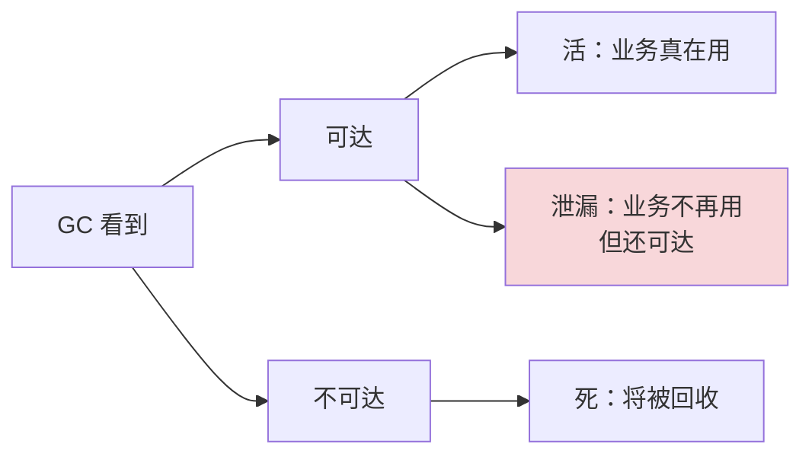
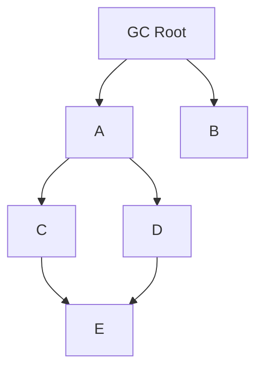
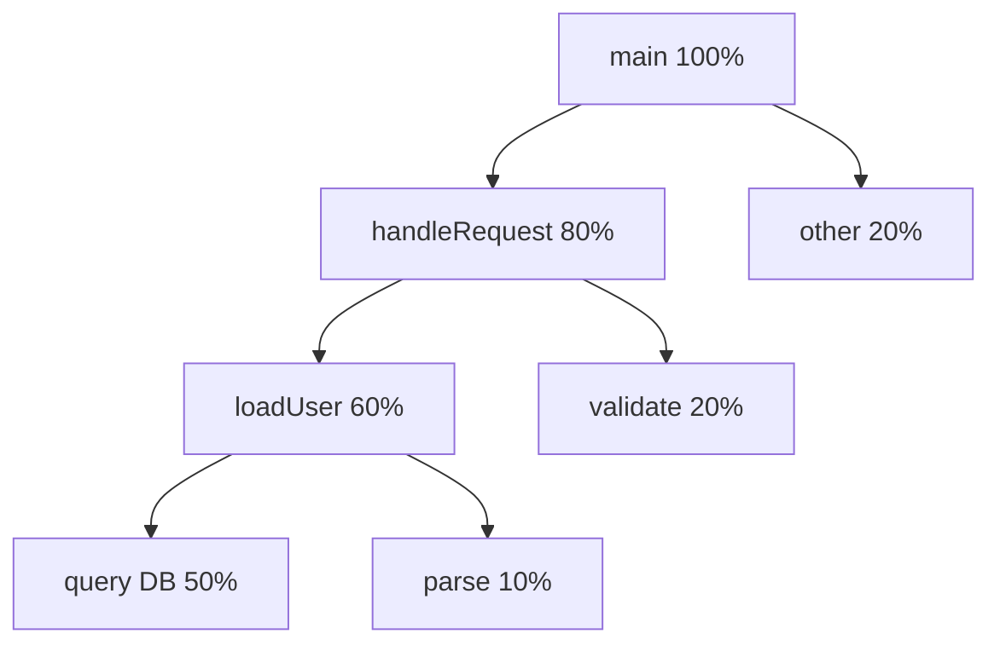

# 4.7 内存泄漏与诊断原理

> 📍 **本篇位置**：第 4 卷 · 内存的真相 · 第 7 篇
> 🎯 **核心矛盾**：**有了 GC 还会泄漏？是的，而且泄漏比手动管理时代更隐蔽——监听器忘反注册、缓存无界、ThreadLocal 没清理、单例持有 Activity……比泄漏本身更难的是"找出凶手"**
> 🧭 **设计灵魂**：**内存泄漏诊断的全部哲学，是把"看不见"变成"看得见"**——Heap Dump 把瞬时内存"快照"成可分析的文件，Reference Chain 把"GC 为什么不回收"的原因可视化，Profiler 把"分配热点"暴露出来。**好的诊断工具 = 让看不见的东西看得见**
> 🌐 **跨平台覆盖**：JVM Heap Dump + MAT · Android LeakCanary · iOS MLeaksFinder · Go pprof · Node.js heap snapshot · Python tracemalloc · C++ Valgrind / ASan
> 🔗 **延伸阅读**：← [4.5 内存回收机制设计](./4.5.内存回收机制设计.md) · ← [4.6 多种引用技术设计](./4.6.多种引用技术设计.md) · → [4.8 数据拷贝设计原理](./4.8.数据拷贝设计原理.md)

---

> 4.5/4.6 我们看到了 GC 怎么"自动管理"内存，引用技术怎么控制对象生命周期。**但工程现实是残酷的**——**即便有 GC，内存泄漏依然普遍存在**。
>
> 比泄漏本身更难的，是**如何把泄漏暴露出来**。本篇从一次"OOM 救火"的全过程切入，剖开 Profiler、Heap Dump、引用链分析这些工具背后的原理——**把"诊断内存"从黑魔法变成可解释的工程方法**。

#### 目录介绍
- [00.真实事故引入](#00真实事故引入)
- [01.内存泄漏的本质：可达但无用](#01内存泄漏的本质可达但无用)
- [02.引用链分析：找到根因的核心方法](#02引用链分析找到根因的核心方法)
- [03.Heap Dump 的工程原理](#03heap-dump-的工程原理)
- [04.Profiler 是如何"看到"分配的](#04profiler-是如何看到分配的)
- [05.移动端的特殊难题](#05移动端的特殊难题)
- [06.跨平台诊断工具对照](#06跨平台诊断工具对照)
- [07.经典陷阱与生产级反模式](#07经典陷阱与生产级反模式)
- [08.一句话总结](#08一句话总结)

---

## 00.真实事故引入

### 0.1 服务每天午夜准时 OOM——8GB 堆 dump 找不到"凶手"

我曾在一个支付系统当过半夜救火队长。某次告警惊心动魄：

```
00:00:00  服务运行正常，内存 4.2GB
00:30:00  内存 6.1GB（开始警觉）
01:00:00  内存 7.8GB（接近 -Xmx 8GB）
01:15:00  Full GC 频繁，每分钟 5 次
01:23:00  OutOfMemoryError，服务进程死亡
01:25:00  k8s 重启服务，重新开始循环
```

每天准点炸——**24 小时一次**。开发同事的反应：

> "GC 应该会回收啊？怎么会泄漏？JVM 不是号称 'no memory leak'？"

我们先做了最直接的——**dump 堆**：

```bash
jmap -dump:live,format=b,file=heap.bin <pid>
# 8GB 的 dump 文件，传到本地分析
```

**用 Eclipse MAT 打开后**——一个让人崩溃的画面：

```
所有对象按 retained size 排序：

第 1 名：byte[]            占用 6.5GB
        ↑ 这是个数组，没用，但占了 80% 的堆！
        
第 2 名：HashMap$Entry[]   占用 800MB
第 3 名：String           占用 400MB
...
```

**新人的反应**：直接看名字根本看不出问题——`byte[]` 是字节数组，到处都在用。哪个 byte[] 是凶手？

这就是新人和老司机的差距——**找泄漏的核心不是"看占了多少"，是"看谁持有它"**。

我们用 MAT 的 **Path to GC Root**：

```
byte[7,000,000,000 bytes]
    ↑ referenced by
RequestContext.body
    ↑ referenced by  
ThreadLocal$ThreadLocalMap.Entry.value
    ↑ referenced by
Thread[name="http-nio-exec-42"]    ← GC Root
```

**真相大白**：

```
请求处理的 RequestContext 用 ThreadLocal 存了 request body
处理完后没有调 ThreadLocal.remove()
线程是 Tomcat 线程池里的——长期存活，永不回收
ThreadLocal Map 里挂着的 RequestContext 永远活着
RequestContext 持有的 body（可能 10MB）也永远活着

Tomcat 200 个线程 × 平均每个累积 ~30MB body = 6GB 泄漏
```

**修复仅一行**：

```java
try {
    process(request);
} finally {
    contextHolder.remove();   // ★ ThreadLocal.remove
}
```

**这次救火让我刻骨铭心地体会到**：

```
GC 解决的是"垃圾"——没人引用的对象自动回收
GC 解决不了"还有人引用但业务已经不用"——这是泄漏的本质
泄漏的根因永远是"逻辑错误"，工具能做的是"暴露"它
```

### 0.2 一个 100MB/天的"看不见"泄漏

另一个故事。有一个 Android App，用户反馈"用一会儿就卡"。我们一开始查 CPU、查网络、查图片解码——都没头绪。

最后接 LeakCanary，扫描日志：

```
LEAK FOUND in com.app.MainActivity:
  static field MyManager.instance     ← 泄漏链起点
  ↓
  field MyManager.lastActivity
  ↓
  com.app.MainActivity                ← 应该被回收的 Activity
  
Retained: 18.3MB
```

**根因**：

```java
public class MyManager {
    private static MyManager instance;       // ✓ 单例，OK
    private Activity lastActivity;           // ⚠️ 这里出问题
    
    public void init(Activity activity) {
        lastActivity = activity;             // ⚠️ 持有 Activity 引用
    }
}
```

```
用户从 MainActivity 跳转到 DetailActivity → MainActivity 应该被回收
但 MyManager.instance.lastActivity 还指向 MainActivity
→ MainActivity 永远活着
→ 持有的 Bitmap、View、ContextWrapper 全活着（18MB）

每跳转一次→留下一个 MainActivity 实例→慢慢卡爆
```

**修复**：

```java
private WeakReference<Activity> lastActivity;
```

**这就是 Android 圈最经典的内存泄漏模式**——**长生命周期对象持有短生命周期对象**。

### 0.3 灵魂三问

这两次事故让我反复追问：

1. **既然有 GC，为什么还会内存泄漏？这不是和"自动内存管理"的承诺矛盾吗？** —— 这反映了 GC 的根本局限是什么？
2. **为什么 LeakCanary、MAT、pprof 这些工具都依赖"引用链分析"？** —— 这个方法论的物理基础是什么？
3. **8GB 堆 dump 看起来"啥都有"，凭什么能在分钟级找到泄漏？** —— 工具是怎么从海量对象中"快速定位元凶"的？

### 0.4 五个层层递进的追问

要把"内存泄漏诊断"讲透，需要递进回答：

1. **GC 看到的"活" ≠ 业务想要的"活"——这个鸿沟从哪来？**
2. **泄漏的几种"经典模式"——它们都是同一种本质？**
3. **GC Roots 是什么——为什么追溯它就能找到泄漏？**
4. **Heap Dump 的格式和算法——为什么 8GB 能秒级分析？**
5. **Profiler 怎么"实时"采样——它会不会自己拖慢服务？**

### 0.5 探索路径


### 0.6 为什么这个问题值得用一整章讲透

我想抛三个问题：

1. **为什么"诊断"是工程师的核心能力，但没有几个学校教？** —— 因为它是经验型的，没有标准答案。
2. **为什么 LeakCanary 在 Square 内部诞生时，几乎"重新定义"了 Android 性能优化？** —— 因为它把"事后查"变成"实时报"。
3. **为什么 Go pprof 和 Java MAT 设计哲学完全不同？** —— 一个是"采样统计"，一个是"快照分析"，反映了语言运行时的不同性格。

读完本章你会懂：**诊断 = 让看不见的变成看得见的——而每种工具都是一面"特殊的眼镜"**。

---

## 01.内存泄漏的本质：可达但无用

### 1.1 GC 看到的"活" ≠ 业务认为的"活"

这是 GC 时代内存泄漏的**本质矛盾**：

```
GC 的判断标准（机械）：
  对象从 GC Root 可达 → 活
  
业务的判断标准（语义）：
  对象在未来还会被使用 → 活
```

**这两者永远有鸿沟**——GC 不知道"业务上是否还需要"，只知道"是否可达"。



**§0.3 第一题答案**——**GC 解决的是"自动找垃圾"，但什么是"垃圾"由可达性定义；只要还可达，GC 就当成"活"，哪怕业务已经不要了**。

### 1.2 泄漏的四种典型范式

经过多年踩坑，我把 GC 时代的内存泄漏归纳为 **4 种范式**：

#### 范式 1：集合无界增长

```java
// ❌ 缓存无 LRU 上限
private static Map<String, byte[]> cache = new HashMap<>();

public byte[] load(String key) {
    if (!cache.containsKey(key)) {
        cache.put(key, loadFromDisk(key));   // 永远在塞，从不淘汰
    }
    return cache.get(key);
}
```

**症状**：每个独特的 key 都会留下一份数据——永远不释放。

**修复**：

```java
private static Map<String, byte[]> cache =
    new LinkedHashMap<String, byte[]>(16, 0.75f, true) {
        @Override
        protected boolean removeEldestEntry(Map.Entry e) {
            return size() > 1000;   // ★ 限制大小
        }
    };

// 或用 Caffeine、Guava Cache
Cache<String, byte[]> cache = Caffeine.newBuilder()
    .maximumSize(1000)
    .expireAfterAccess(10, TimeUnit.MINUTES)
    .build();
```

#### 范式 2：静态字段持有

```java
// ❌ 静态字段持有"会变化"的对象
public class Holder {
    private static List<User> users = new ArrayList<>();
    
    public void addUser(User u) {
        users.add(u);   // 永远只增不减
    }
}
```

**症状**：static 是 GC Root——其引用的所有内容永生。

**修复**：避免静态字段持有"业务会变化"的对象。

#### 范式 3：注册中心未反注册

```java
// ❌ 注册了监听器但忘记取消
EventBus.register(this);
// 直到 EventBus 自己消亡，this 就活着
```

**症状**：观察者模式经典坑——subscribe 但忘了 unsubscribe。

**修复**：成对出现 register/unregister，配合 `try-finally` 或 RAII。

#### 范式 4：闭包/内部类持有外部

```kotlin
// ❌ 在 Activity 中启动延迟任务
fun onCreate() {
    Handler().postDelayed({
        updateUI()   // 闭包隐式持有 Activity
    }, 60_000)
}
// 用户立刻退出 Activity → 但闭包持有 → Activity 不能回收
```

**修复**：

```kotlin
val handler = Handler()
val task = Runnable { updateUI() }
handler.postDelayed(task, 60_000)

override fun onDestroy() {
    handler.removeCallbacks(task)   // 取消延迟任务
}
```

### 1.3 §0.4 第二题：四种范式的共同本质

这四种范式看似不同，**但本质上都是同一句话**：

> **"长生命周期"对象持有了"短生命周期"对象。**

```
范式 1：static 缓存（永生）持有 byte[]（应该短命）
范式 2：static 字段（永生）持有 User（应该短命）
范式 3：EventBus（永生）持有 Listener（应该和 Activity 同寿）
范式 4：Handler（持有 Looper，永生）持有 Closure（应该和 Activity 同寿）
```

**这就是泄漏诊断的"思维模型"**——**永远找"谁活得太久了"**。

### 1.4 资源泄漏 vs 内存泄漏

容易混淆的概念：

| 类型 | 例子 | 后果 |
|---|---|---|
| **内存泄漏** | 对象不释放 | 内存涨 → OOM |
| **资源泄漏** | 文件描述符、Socket、数据库连接不关闭 | FD 用尽、连接池耗尽 |
| **句柄泄漏** | OS 级别句柄（HANDLE）不关闭 | 句柄耗尽 |

**这三种泄漏经常同时发生**——比如 InputStream 没关，既泄漏了对象，又泄漏了文件 FD。

**通用解药**：try-with-resources / RAII / context manager。

---

## 02.引用链分析：找到根因的核心方法

### 2.1 GC Roots：泄漏分析的"起点"

**§0.4 第三题**。GC Roots 是什么？

```
GC 把"绝对存活"的几类对象作为根：
  1. 当前线程栈帧中的局部变量
  2. 静态字段（static field）
  3. JNI 引用（native 代码持有）
  4. 系统类加载器（boot ClassLoader）
  5. 同步监视器（synchronized 持有的对象）
  
从这些根出发，可达的对象都"活"
```

**所以泄漏分析的关键步骤**：

```
1. 找到泄漏对象（如那 6GB 的 byte[]）
2. 追溯它的"path to GC Root"
3. 看这条路径上"哪一段不该存在"
4. 修复那一段
```

### 2.2 Shallow Size vs Retained Size

MAT 等工具会显示两个尺寸概念：

| 指标 | 含义 |
|---|---|
| **Shallow Size** | 对象自己占的字节（不含其引用的对象）|
| **Retained Size** | 该对象死掉后能"释放"多少字节（包含其独占的引用链）|

**典型例子**：

```java
class A {
    private B b = new B();   // B 实例 100MB
}

A a = new A();
// a 的 Shallow Size：~16 字节（A 的对象头 + b 引用）
// a 的 Retained Size：~100MB（如果只有 a 引用 B）
```

**找泄漏看 Retained Size**——那 6GB 的 byte[] 自己 Shallow 就是 6GB，但 ThreadLocal Map 的 Retained Size 才是真正告诉你"删掉这个能回收 6GB"的指标。

### 2.3 支配树（Dominator Tree）

**§0.4 第四题**。MAT 8GB dump 秒级找泄漏的"魔法"——**Dominator Tree**。

**支配关系**：

```
节点 A "支配" 节点 B：
  从 GC Root 到 B 的所有路径都必经 A
  
含义：A 死了，B 必然死
```

**支配树**：以 GC Root 为根，每个节点的父节点是它的"直接支配者"。



```
支配树（重新组织）：
Root → A → C → E
         → D
       → B

如果 A 死 → C/D/E 全死
如果 C 死 → E 不一定死（D 还活着，D 也指向 E）

→ 但如果 D 也死（A 死会带走 D），E 才死
```

**支配树的工程意义**：

```
"删掉 A 能回收多少"= A 的子树总大小 = A 的 Retained Size
排序：找 Retained Size 最大的 → 最可疑的泄漏候选
```

**这就是 MAT 能在分钟级处理 8GB dump 的算法基础**——支配树构建是 O(N log N)，远比朴素遍历快。

### 2.4 Path to GC Root 算法

```python
def path_to_root(target):
    queue = [(target, [target])]
    visited = {target}
    
    while queue:
        node, path = queue.pop(0)
        if is_gc_root(node):
            return path
        
        for parent in incoming_refs(node):
            if parent not in visited:
                visited.add(parent)
                queue.append((parent, path + [parent]))
    
    return None
```

**复杂度**：O(N + E)，其中 N 是对象数，E 是引用边数。

**MAT 的优化**：建索引让 `incoming_refs` 是 O(1) 查询。

---

## 03.Heap Dump 的工程原理

### 3.1 触发时机

```bash
# 主动 dump
jmap -dump:live,format=b,file=heap.bin <pid>

# 自动：OOM 时 dump
java -XX:+HeapDumpOnOutOfMemoryError -XX:HeapDumpPath=/data/dumps ...

# 通过 jcmd
jcmd <pid> GC.heap_dump /tmp/heap.bin
```

### 3.2 STW 代价

**Heap Dump 不是"快照"——它需要遍历整个堆**。期间通常要 **STW**：

```
1. JVM 暂停所有应用线程（safepoint）
2. 遍历所有对象，写入文件
3. 恢复线程
```

**代价**：

```
8GB 堆 → dump 时间约 30-60 秒
期间应用 100% 暂停！
```

**生产经验**：

```
不要随便 dump 大堆——会让服务"假死"
配置 OOM 自动 dump 时，目录磁盘要够（dump 文件 = 堆大小）
高峰期不 dump，低峰期或维护窗口
```

### 3.3 HPROF 格式

JVM Heap Dump 的标准格式：

```
HPROF Header
[String table]                ← 字符串池
[Class info]                  ← 类元数据
[Object instances]
  for each object:
    object id, class id, fields
[GC Roots]                    ← 标记哪些是根
```

**HPROF 设计的精妙**：

```
对象 ID 是"地址"——可以唯一定位
引用通过 ID 表示——重建对象图只需 ID 查表
GC Roots 单独标记——分析起点明确
```

### 3.4 增量 / 流式 dump

8GB dump 会让服务停 1 分钟——这在生产环境通常不可接受。

**演进**：

```
Java 11+：JFR（Java Flight Recorder）支持持续记录
  低开销（< 1%）
  可以记录"分配热点"等信息
  
但 JFR 不能替代 Heap Dump——分析"当前内存"还得用 dump
```

**Live Heap Dump（OpenJ9 / Azul）**：

```
不需要 STW
利用并发标记的快照
代价：dump 期间内存用量翻倍
```

---

## 04.Profiler 是如何"看到"分配的

### 4.1 采样式 vs 精确式

**采样式（Sampling）**：

```
每隔 N 毫秒"快照"一次调用栈
统计哪个方法最频繁出现 → 那是热点
```

**精确式（Tracing/Instrumentation）**：

```
对每次方法调用、每次 new 都打点
精确但开销大
```

**对比**：

| 方式 | 精度 | 开销 |
|---|---|---|
| 采样 | 统计意义 | 1-3% |
| 精确 | 100% | 50%-300% |

**生产用采样**——开销可接受。

### 4.2 Allocation Tracking 的实现

**§0.4 第五题**。Profiler 怎么"看到"分配？

**字节码插桩**：

```java
// 原始字节码：
new Foo
dup
invokespecial <init>

// 插桩后：
new Foo
dup
invokestatic Profiler.recordAllocation     ← 插入这一行
dup
invokespecial <init>
```

**性能代价**：每次 new 多一次方法调用——5-30% 开销。

**JVMTI 的"采样分配"（JDK 11+）**：

```
JVM 内部按频率采样（如每 512KB 分配采一个）
不需要插桩
开销 < 1%
适合生产环境
```

### 4.3 火焰图：把调用栈压成一张图



**火焰图的精妙**：

```
横轴：栈中各方法的"占比"（按 CPU 时间或分配量）
纵轴：调用栈深度
颜色：方法类型（用户代码 vs JVM vs Native）

→ 一眼看出热点：宽 = 多消耗
→ 一眼找到调用路径：纵向延伸 = 调用关系
```

**Brendan Gregg 2011 年发明火焰图——彻底改变了性能分析**：

```
之前：看一堆百分比表格，难以理解全貌
之后：一张图直观看出热点路径
```

### 4.4 Async Profiler

JVM 性能分析的"标准答案"——**async-profiler**：

```bash
./async-profiler -d 60 -f flame.html <pid>
```

**核心优势**：

```
1. 用 perf_events 采样（不依赖 safepoint）
2. 能采 CPU、Allocation、Lock、Wall Clock
3. 直接生成火焰图
4. 开销 < 1%
```

**这是生产环境的"瑞士军刀"**。

---

## 05.移动端的特殊难题

### 5.1 LeakCanary：Android 泄漏诊断的革命

**§0.6 第二题答案**。LeakCanary 是 Square 公司开源的 Android 泄漏检测工具，几乎"重新定义"了 Android 性能优化。

**核心原理**——**WeakReference + ReferenceQueue**：

```kotlin
// 1. Activity 销毁时
override fun onDestroy() {
    super.onDestroy()
    LeakCanary.watch(this)
}

// 2. LeakCanary 内部
fun watch(activity: Activity) {
    val ref = WeakReference(activity, refQueue)
    expectedRefs.add(ref)
}

// 3. 5 秒后检查
fun check() {
    System.gc()
    // 等一会，让 GC 跑完
    
    val collected = pollFromQueue(refQueue)
    val leaked = expectedRefs - collected
    
    for (ref in leaked) {
        // 这个 ref 应该被回收但没回收 → 泄漏！
        dumpHeap()              // 触发 Heap Dump
        analyzePathToRoot(ref)  // 找泄漏路径
        notify()                // 通知开发
    }
}
```

**关键技术点**：

```
1. 用 WeakReference——不阻止 GC
2. 用 ReferenceQueue——GC 回收时会通知
3. 主动 System.gc()——加快验证
4. 触发 Heap Dump 后离线分析路径
```

**为什么 LeakCanary 这么受欢迎**：

```
之前：发布前测试时偶尔做一次 dump 分析（事后诸葛亮）
LeakCanary：开发期实时报告泄漏（事中预防）

→ 把"罕见的、专家级"的诊断变成"日常的、自动的"流程
```

### 5.2 iOS 的 MLeaksFinder

iOS 没有 GC（用 ARC——引用计数），泄漏更隐蔽：

```objc
// 经典坑：循环引用
self.block = ^{
    [self doSomething];   // self 持有 block，block 持有 self
};
```

**MLeaksFinder（微信开源）的思路**：

```
1. ViewController.dismiss 后
2. 等 2 秒
3. 用 weak 检查它是否真的释放了
4. 没释放 → 警告
```

**对比 LeakCanary**：

```
LeakCanary：依赖 GC 机制（WeakRef + Queue）
MLeaksFinder：依赖 ARC + 延迟检查

→ 两者实现机制不同，但思路一致：检测"该死的对象没死"
```

### 5.3 Native 代码泄漏：Valgrind / ASan

C/C++ 没有 GC——必须 free。**Valgrind**：

```bash
valgrind --leak-check=full ./myapp
```

**输出**：

```
==12345== 1,024 bytes in 1 blocks are definitely lost in loss record 1 of 2
==12345==    at 0x4C2E0BF: malloc (in vgpreload_memcheck)
==12345==    by 0x40058A: process (foo.c:42)
==12345==    by 0x4006A0: main (foo.c:80)
```

**精确定位到行**——但代价是程序慢 10-50 倍。

**AddressSanitizer（ASan）**：

```bash
clang -fsanitize=address ...
```

**核心**：编译期插桩，运行时检查。性能损失只有 2-3 倍——**生产前测试可接受**。

---

## 06.跨平台诊断工具对照

### 6.1 工具矩阵

| 平台 | 主力工具 | 特色 |
|---|---|---|
| **JVM** | MAT, JProfiler, async-profiler, JFR | 生态成熟，Dominator Tree |
| **Android** | LeakCanary, Android Studio Profiler | 实时报警 |
| **iOS** | Instruments, MLeaksFinder | Allocations, Leaks |
| **Go** | pprof | 采样统计 |
| **Node.js** | heap snapshot, clinic.js | V8 工具链 |
| **Python** | tracemalloc, objgraph | 引用图可视化 |
| **C/C++** | Valgrind, ASan | 精确但慢 |
| **Rust** | heaptrack, valgrind | 编译期消灭多数 |

### 6.2 §0.6 第三题：Go pprof vs Java MAT 的设计哲学

**Go pprof**——**采样统计哲学**：

```bash
go tool pprof http://localhost:6060/debug/pprof/heap
```

```
默认每分配 512KB 采一个样
统计"哪个 stack trace 分配最多"

输出：
  flat   flat%   sum%    cum   cum%
   2GB  60.00%  60.00%  2GB  60.00%   loadFromDB
 800MB  20.00%  80.00%  800MB 20.00%   parseRequest
 ...
```

**Java MAT**——**快照分析哲学**：

```
基于 Heap Dump（一个时刻的完整快照）
通过 Dominator Tree、Path to GC Root 找"具体的对象"
```

**两种哲学的根源**：

```
Go：runtime 控制力强，采样开销低 → 倾向"持续轻采样"
Java：堆大但分析丰富 → 倾向"事后深度分析快照"

Go pprof 像"心电图"——持续监测趋势
Java MAT 像"CT"——拍一张图细看
```

### 6.3 Node.js heap snapshot

```javascript
const v8 = require('v8');
v8.writeHeapSnapshot('./snap.heapsnapshot');
// 用 Chrome DevTools 打开
```

**JavaScript 闭包泄漏经典坑**：

```javascript
function setup() {
    const big = new Array(1_000_000);
    return function() {
        // 即便不用 big，闭包仍然持有！
        return 1;
    };
}
const fn = setup();   // big 永远活着
```

**修复**：

```javascript
function setup() {
    const big = new Array(1_000_000);
    const result = compute(big);   // 用完
    big = null;                    // 显式断开
    return function() { return result; };
}
```

### 6.4 Python tracemalloc

```python
import tracemalloc
tracemalloc.start()

# 你的代码

snapshot = tracemalloc.take_snapshot()
top_stats = snapshot.statistics('lineno')

for stat in top_stats[:10]:
    print(stat)
```

**Python 的特殊难题**——**循环引用**：

```python
class Node:
    def __init__(self):
        self.next = None

a = Node()
b = Node()
a.next = b
b.next = a   # 循环！

del a
del b
# 引用计数都不为 0 → 不会立刻回收
# Python 的循环垃圾收集器会处理（但有延迟）
```

---

## 07.经典陷阱与生产级反模式

### 7.1 陷阱一：监听器忘记反注册（§1.2 范式 3）

```java
// ❌ EventBus.register 后忘记 unregister
class MyFragment extends Fragment {
    @Override
    public void onCreate(Bundle b) {
        EventBus.getDefault().register(this);
    }
    // 没写 onDestroy 里的 unregister
}
```

**修复**：

```java
@Override
public void onDestroy() {
    super.onDestroy();
    EventBus.getDefault().unregister(this);
}
```

### 7.2 陷阱二：缓存无界（§1.2 范式 1）

```java
// ❌ 无上限缓存
private Map<String, Object> cache = new ConcurrentHashMap<>();
```

**修复**：用有限大小 + 过期策略的缓存。

### 7.3 陷阱三：ThreadLocal 没清理（§0.1）

```java
// ❌ 线程池里的线程长寿，ThreadLocal 不清就泄漏
private static ThreadLocal<Context> context = new ThreadLocal<>();

void process(Request req) {
    context.set(new Context(req));
    // 处理...
    // 没 remove
}
```

**修复**：

```java
try {
    context.set(new Context(req));
    // 处理
} finally {
    context.remove();
}
```

### 7.4 陷阱四：单例持有 Activity（§0.2）

```java
// ❌ 单例长生命周期，持有短生命周期 Activity
public static MyManager instance;
private Context context;

public static MyManager getInstance(Context c) {
    if (instance == null) instance = new MyManager(c);   // ⚠️ 如果 c 是 Activity
    return instance;
}
```

**修复**：

```java
public static MyManager getInstance(Context c) {
    if (instance == null) instance = new MyManager(c.getApplicationContext());   // ★
    return instance;
}
```

### 7.5 陷阱五：内部类隐式持有外部

```java
// ❌ 非静态内部类持有外部 this
class MyActivity extends Activity {
    private Handler handler = new Handler() {   // 非静态内部类
        @Override
        public void handleMessage(Message m) { ... }
    };
}
```

**修复**：

```java
private static class SafeHandler extends Handler {
    private final WeakReference<MyActivity> ref;
    
    SafeHandler(MyActivity a) {
        ref = new WeakReference<>(a);
    }
}
```

### 7.6 陷阱六：监控指标缺失

生产环境必须有以下监控：

```
JVM 堆使用率（Old Gen 涨势）
GC 频率和耗时
Metaspace 增长（class 泄漏）
线程数（线程泄漏）
文件描述符数（FD 泄漏）
```

**告警阈值**：

```
Old Gen > 80% 持续 5 分钟 → WARN
Full GC 每分钟 > 1 次 → ERROR
线程数 > 上限的 80% → WARN
```

### 7.7 陷阱七：在生产 dump 大堆

```
dump 8GB 堆 → STW 30 秒
对延迟敏感的服务直接挂掉
```

**正确做法**：

```
1. 先用 jstat / 监控指标观察
2. 在低峰期 dump
3. 优先 dump live（jmap -dump:live）排除 dead 对象
4. 或者用 JFR 持续记录，避免单次大 dump
```

---

## 08.一句话总结

### 8.1 三层认知阶梯

```
第一层（知其然）：知道用 MAT / LeakCanary 找泄漏
  ↓
第二层（知其所以然）：理解 GC Roots、Dominator Tree、Heap Dump 格式
  ↓
第三层（知其将所以然）：能设计可观测系统、定制 Profiler、做容量规划
```

读完本章后，你应该能回答开头§0.3 提出的三个问题：

1. **既然有 GC，为什么还泄漏？** → GC 解决"不可达对象"，但 GC 时代的泄漏是"还可达但业务不再需要"——这是逻辑错误，工具帮不了。
2. **为什么都依赖"引用链分析"？** → 因为找泄漏 = 找"谁持有这个本应消亡的对象"，引用链是唯一答案。
3. **8GB dump 怎么秒级分析？** → Dominator Tree 算法 O(N log N)，加上索引让 incoming reference 查询 O(1)。

### 8.2 诊断流程图

```mermaid
flowchart TD
    A[内存涨/OOM 告警] --> B{何时发生?}
    B -->|周期性| B1[查定时任务/缓存]
    B -->|渐进式| B2[查泄漏]
    B -->|突发| B3[查流量/请求]
    
    B2 --> C[采集 Heap Dump]
    C --> D[MAT 打开]
    D --> E[Dominator Tree<br/>看 Retained Size 大头]
    E --> F[Path to GC Root]
    F --> G[识别"长寿对象持有短命对象"]
    G --> H[修复]
    H --> I[复测]
    
    style E fill:#cfe2ff
    style F fill:#d4edda
    style G fill:#fff3cd
```

### 8.3 七字真言

1. **GC 不是免死金牌**——逻辑泄漏 GC 看不见。
2. **找泄漏看 Retained Size**——不是看 Shallow。
3. **永远顺着引用链向上**——找"谁活得太久"。
4. **静态字段是头号嫌疑**——天然的 GC Root。
5. **生命周期不匹配 = 泄漏**——长寿持短命的对象。
6. **生产环境慎用 dump**——用 JFR 或采样。
7. **配套监控不可缺**——内存、GC、FD、线程数。

### 8.4 与下篇的承接

至此**第 4 卷"内存的真相"前 7 篇全部结束**。我们走过了：

- **4.1 虚拟内存与地址空间**：内存抽象的根基
- **4.2 内存模型技术设计**：可见性的硬件基础
- **4.3 堆和栈内存的设计**：两种分配策略
- **4.4 内存对齐与缓存局部性**：性能的隐形约束
- **4.5 内存回收机制设计**：自动 GC 的工程
- **4.6 多种引用技术设计**：生命周期的精细控制
- **4.7 内存泄漏与诊断原理**：把"看不见"变成"看得见"

下一篇 [4.8 数据拷贝设计原理](./4.8.数据拷贝设计原理.md) 是本卷的收束——讨论"内存搬运"的工程艺术：从浅拷贝/深拷贝、到 zero-copy、再到 mmap 和 sendfile。**所有数据传输的性能优化，最终都归结为"少搬一次"**。

---

## 🔗 延伸阅读

- 同卷上篇：[4.5 内存回收机制设计](./4.5.内存回收机制设计.md) ｜ [4.6 多种引用技术设计](./4.6.多种引用技术设计.md)
- 同卷下篇：[4.8 数据拷贝设计原理](./4.8.数据拷贝设计原理.md)
- 经典文献：
  - *Eclipse MAT User Guide*（Eclipse 官方）—— Dominator Tree 算法的权威解释
  - *Java Performance: The Definitive Guide*（Scott Oaks）—— 第 7 章 Heap 分析
  - *Mature Optimization Handbook*（Carlos Bueno）—— 性能诊断方法论
  - *LeakCanary 源码与博客*（Square）—— Android 泄漏检测工业级方案
  - *Brendan Gregg's Flame Graphs*（brendangregg.com）—— 火焰图发明者博客
  - *Go pprof 文档*（Google）—— Go 性能诊断官方指南
  - *Valgrind Manual*（valgrind.org）—— Native 内存诊断的圣经

