# 41.消息机制设计思想

> 📍 **本篇位置**：第 5 卷 · 系统交互 · 第 2 篇（本卷入口大文）
> 🎯 **核心矛盾**：**异步事件 vs 顺序执行** —— UI 主线程必须串行处理事件，但事件来源天然并发
> 🧭 **设计灵魂**：所有平台 UI 框架最后都殊途同归——**事件循环 + 消息队列 + 单线程派发**
> 🌐 **跨语言覆盖**：Android(Looper/Handler/MessageQueue) · iOS(RunLoop/Source) · Web(Event Loop / Task Queue) · Qt(信号槽) · Win32(GetMessage / DispatchMessage)
> 🔗 **延伸阅读**：← [22.单线程模型的思想](./22.单线程模型的思想.md) · → [40.窗口核心设计思想](./40.窗口核心设计思想.md) · → [42.手势事件设计灵魂](./42.手势事件设计灵魂.md)

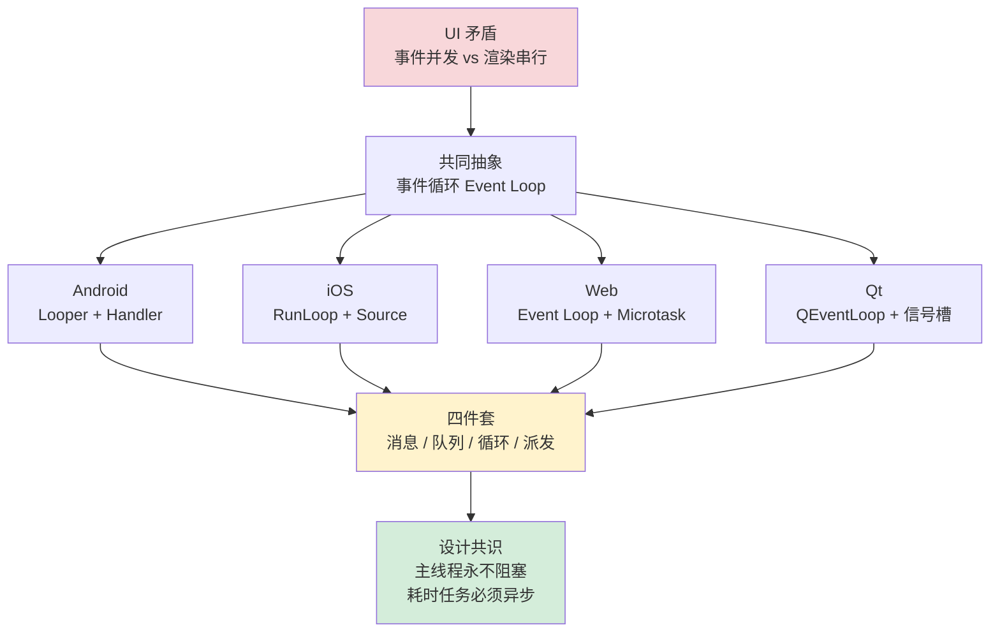
```mermaid
flowchart TB
    A[UI 矛盾<br/>事件并发 vs 渲染串行] --> B[共同抽象<br/>事件循环 Event Loop]
    B --> C1[Android<br/>Looper + Handler]
    B --> C2[iOS<br/>RunLoop + Source]
    B --> C3[Web<br/>Event Loop + Microtask]
    B --> C4[Qt<br/>QEventLoop + 信号槽]
    C1 & C2 & C3 & C4 --> D[四件套<br/>消息 / 队列 / 循环 / 派发]
    D --> E[设计共识<br/>主线程永不阻塞<br/>耗时任务必须异步]
    style A fill:#f8d7da
    style D fill:#fff3cd
    style E fill:#d4edda
```

---

#### 目录介绍
- [01.概述与背景](#01概述与背景)
  - [1.1 消息机制背景](#11-消息机制背景)
  - [1.2 主要解决问题](#12-主要解决问题)
  - [1.3 设计目标](#13-设计目标)
  - [1.4 设计哲学思想](#14-设计哲学思想)
  - [1.5 核心设计原则](#15-核心设计原则)
- [02.不同平台机制](#02不同平台机制)
  - [2.1 Android消息机制](#21-android消息机制)
  - [2.2 iOS消息机制](#22-ios消息机制)
  - [2.3 Web消息机制](#23-web消息机制)
  - [2.4 平台对比分析](#24-平台对比分析)
  - [2.5 抽象能力对比](#25-抽象能力对比)
  - [2.6 通用抽象思路](#26-通用抽象思路)
  - [2.7 设计核心洞察](#27-设计核心洞察)
- [03.消息机制架构](#03消息机制架构)
  - [3.1 整体架构图](#31-整体架构图)
  - [3.2 核心组件类图](#32-核心组件类图)
  - [3.3 分层架构设计思想](#33-分层架构设计思想)
  - [3.4 组件协作设计思想](#34-组件协作设计思想)
- [04.消息体设计原理](#04消息体设计原理)
  - [4.1 消息结构设计](#41-消息结构设计)
  - [4.2 对象池设计思想](#42-对象池设计思想)
  - [4.3 同步和异步消息](#43-同步和异步消息)
  - [4.4 消息类型分类](#44-消息类型分类)
  - [4.5 消息体设计的权衡](#45-消息体设计的权衡)
- [05.消息队列设计](#05消息队列设计)
  - [5.1 队列数据结构](#51-队列数据结构)
  - [5.2 为什么用链表不用数组](#52-为什么用链表不用数组)
  - [5.3 消息入队算法](#53-消息入队算法)
  - [5.4 队列核心实现](#54-队列核心实现)
  - [5.5 阻塞唤醒设计思想](#55-阻塞唤醒设计思想)
  - [5.6 队列管理策略](#56-队列管理策略)
- [06.消息处理器设计](#06消息处理器设计)
  - [6.1 Handler设计模式](#61-handler设计模式)
  - [6.2 处理器抽象](#62-处理器抽象)
  - [6.3 消息分发机制](#63-消息分发机制)
  - [6.4 责任链与策略的融合](#64-责任链与策略的融合)
  - [6.5 生命周期管理](#65-生命周期管理)
  - [6.6 最佳实践建议](#66-最佳实践建议)
- [07.Looper设计原理](#07looper设计原理)
  - [7.1 Looper设计思想](#71-looper设计思想)
  - [7.2 Looper工作流程](#72-looper工作流程)
  - [7.3 Looper核心实现](#73-looper核心实现)
  - [7.4 ThreadLocal绑定设计](#74-threadlocal绑定设计)
  - [7.5 多Looper架构设计](#75-多looper架构设计)
  - [7.6 支持多Looper](#76-支持多looper)
- [08.线程安全设计思想](#08线程安全设计思想)
  - [8.1 为什么不加锁也安全](#81-为什么不加锁也安全)
  - [8.2 生产者消费者模型](#82-生产者消费者模型)
  - [8.3 内存可见性保证](#83-内存可见性保证)
  - [8.4 线程安全的边界](#84-线程安全的边界)
- [09.性能优化设计思想](#09性能优化设计思想)
  - [9.1 对象复用与零分配](#91-对象复用与零分配)
  - [9.2 阻塞策略与CPU节能](#92-阻塞策略与cpu节能)
  - [9.3 同步屏障与优先级反转](#93-同步屏障与优先级反转)
  - [9.4 IdleHandler巧妙设计](#94-idlehandler巧妙设计)
- [10.设计思想总结与演进](#10设计思想总结与演进)
  - [10.1 核心设计模式提炼](#101-核心设计模式提炼)
  - [10.2 消息机制的哲学本质](#102-消息机制的哲学本质)
  - [10.3 从消息机制看架构演进](#103-从消息机制看架构演进)
  - [10.4 跨领域思想迁移](#104-跨领域思想迁移)


## 01.概述与背景

### 1.1 消息机制背景

在现代移动应用开发中，消息机制是解决异步编程和线程间通信的核心技术。要理解它为什么重要，我们可以从一个生活中的场景开始。

**生活类比：餐厅的前台与后厨**

想象一个繁忙的餐厅。前台服务员（UI线程）负责接待客人、呈现菜品；后厨（工作线程）负责烧菜。如果服务员自己去后厨炒菜（在UI线程执行耗时操作），前台就没人接待客人了，客人会直接离开（应用卡顿、ANR）。

合理的做法是：服务员把点菜单（消息）贴到后厨窗口（消息队列），后厨看到订单就开始做菜，做好了再通过窗口把菜递出来（回调到主线程）。这个"窗口"就是消息机制的雏形。

消息机制的设计背景和必要性体现在以下几个层面：

- **多线程环境**: 现代应用需要同时处理UI渲染、网络请求、数据库操作、传感器数据等多种任务，单线程无法胜任
- **异步编程需求**: 如果所有操作都在主线程同步执行，一个网络请求就可能冻结界面数秒，用户体验极差
- **事件驱动架构**: 用户的触摸、滑动、系统的电量变化、网络状态切换——这些都是随机发生的"事件"，需要一个统一的机制来接收和分发
- **线程安全**: 多个线程同时读写同一块内存，就像多个厨师同时往一个盘子里装菜，结果必然混乱。消息机制通过"排队"的方式，让操作有序进行

从更宏观的视角看，消息机制不是某个平台的特有设计，而是计算机科学中一个**跨越半个世纪的经典范式**。从早期操作系统的中断处理、Windows的消息泵（Message Pump），到现代的Actor模型、事件驱动架构，消息机制的思想一脉相承。理解它的设计哲学，远比记住某个API的用法更有价值。

### 1.2 主要解决问题

**疑惑**：为什么Android，iOS等不采用多线程直接更新UI的方式？

**答疑**：这个问题看似简单，背后却蕴含着深刻的架构决策。如果允许多线程同时修改UI，就需要对所有UI操作加锁，这会带来三个严重问题：

1. **性能下降**：每次UI操作都需要获取锁，频繁的锁竞争会严重影响渲染性能。UI操作是高频行为（每秒60帧意味着每16ms就要完成一次完整渲染），加锁的开销在这个时间尺度下是不可接受的。
2. **死锁风险**：复杂的UI操作涉及多个View层级（父View、子View、兄弟View），多线程加锁容易产生死锁。想象线程A锁住了父View等待子View，线程B锁住了子View等待父View——死锁就发生了。
3. **复杂度爆炸**：如果每个UI组件都要考虑线程安全，开发者的心智负担会急剧增加，代码的可维护性会大幅下降。

Handler消息机制正是为了解决线程间通信问题而设计的。它的核心智慧在于：**不是让UI变成线程安全的，而是确保UI操作只在一个线程上执行**。通过消息队列，任意线程都能向主线程投递"请求"，由主线程按序处理。这是一种"化并发为串行"的设计哲学——看似降低了并发度，实则大幅简化了系统复杂度。

这种设计思想在软件工程中非常常见：**约束反而带来自由**。正如Go语言的设计哲学"Don't communicate by sharing memory; share memory by communicating"，消息机制用"通信"替代了"共享"，用"约定"替代了"加锁"。

### 1.3 设计目标

| 目标 | 描述 | 实现方式 | 设计思想 |
|------|------|----------|----------|
| **线程安全** | 确保多线程环境下的数据一致性 | 消息队列同步机制 | 化并发为串行，约束即自由 |
| **高性能** | 最小化消息传递开销 | 对象池复用+高效链表 | 零分配理念，减少GC压力 |
| **易用性** | 提供简洁的API接口 | 封装复杂的底层实现 | 门面模式，隐藏复杂度 |
| **可扩展性** | 支持自定义消息类型和处理器 | 回调+继承+拦截器 | 开闭原则，策略模式 |
| **可靠性** | 保证消息不丢失，按序处理 | 时间排序的单链表 | FIFO思想+优先级扩展 |
| **低功耗** | 无消息时不占用CPU | epoll/kqueue阻塞等待 | 事件驱动，按需唤醒 |

### 1.4 设计哲学思想

消息机制作为现代操作系统和应用框架的基础设施，体现了多个重要的设计哲学。这些哲学不仅指导了消息机制的设计，也是理解所有优秀架构设计的钥匙。

**哲学一：解耦——让生产者不必认识消费者**

消息机制最核心的设计哲学就是**解耦**。发送消息的线程（生产者）不需要知道谁会处理这个消息，它只需要把消息投递到队列中。处理消息的线程（消费者）也不需要知道消息是谁发的，它只需要从队列中取出消息并处理。

这就像你在公司里通过邮件系统发一封工作邮件。你不需要亲自走到对方工位前等他处理完，你只需要发出去，对方会在合适的时间看到并处理。邮件系统（消息队列）充当了中介，让发件人和收件人在时间和空间上都解耦了。

**哲学二：串行化——用秩序换取安全**

消息队列的第二个哲学是**串行化**。多个线程并发发送的消息，最终都会被排成一个有序的队列，由目标线程逐一处理。这种设计放弃了并行处理的"效率"，换取了确定性和安全性。

这里体现了一个深刻的工程权衡：在UI渲染这个场景下，**正确性远比速度重要**。一个偶尔出现的显示错误比界面稍微慢一点要严重得多。消息队列通过牺牲微小的延迟，换取了绝对的线程安全，这是一个非常划算的交易。

**哲学三：异步化——不等待就是最好的优化**

消息机制的第三个哲学是**异步化**。发送消息的线程不需要等待消息被处理完就可以继续执行自己的任务。这意味着：

- 工作线程发送一个"更新UI"的消息后，可以立即开始处理下一个任务
- 主线程不会因为工作线程的阻塞而卡住
- 整个系统的吞吐量得到了最大化

异步化的设计思想在整个计算机科学中无处不在：从CPU的流水线设计、操作系统的中断机制，到网络协议的异步IO、消息中间件的发布订阅模式，都是同一个哲学的不同表现形式。

**哲学四：事件驱动——被动等待优于主动轮询**

消息机制采用事件驱动模型，这意味着Looper不会不停地去"问"消息队列"有没有新消息"（轮询），而是在没有消息的时候进入休眠，有新消息到来时被唤醒（事件通知）。

```
轮询模式（低效）：
while(true) {
    if (hasMessage()) { process(); }
    else { /* 空转浪费CPU */ }
}

事件驱动模式（高效）：
while(true) {
    message = blockingWait();  // 没消息就休眠，有消息被唤醒
    process(message);
}
```

这种设计在操作系统层面通过epoll（Linux）、kqueue（macOS/iOS）等机制实现，让线程在等待时几乎不消耗CPU资源。这也是为什么手机在待机状态下主线程的Looper一直在运行，但电量消耗却很低的原因。

**哲学五：分层抽象——每一层只关心自己的职责**

消息机制的设计体现了清晰的分层思想。从上到下：

1. **API层**（Handler）：开发者只需要调用sendMessage/post，不需要关心底层实现
2. **调度层**（Looper/MessageQueue）：负责消息的排序、存储、分发，不关心消息的内容
3. **系统层**（epoll/kqueue）：负责高效的IO多路复用和线程唤醒，不关心上层的业务逻辑

每一层都有明确的职责边界，上层不需要知道下层的实现细节，下层也不需要知道上层的业务逻辑。这种分层设计让整个系统既灵活又稳定——你可以替换底层的阻塞机制（比如从epoll换成io_uring），而不需要修改上层的任何代码。

### 1.5 核心设计原则

| 设计原则 | Android实现 | iOS实现 | 设计意图 |
|----------|-------------|---------|----------|
| **单一职责** | Handler专注消息处理 | RunLoop专注事件循环 | 每个组件职责明确 |
| **开闭原则** | 可扩展Handler类型 | 可添加RunLoop Source | 对扩展开放，对修改封闭 |
| **依赖倒置** | 基于接口回调 | 基于delegate模式 | 依赖抽象而非具体实现 |
| **接口隔离** | 不同类型的消息接口 | 不同类型的事件源 | 客户端不依赖不需要的接口 |
| **最少知识** | 通过消息解耦 | 通过事件解耦 | 减少组件间直接依赖 |

## 02.不同平台机制

理解消息机制的设计思想，最好的方式是对比不同平台的实现。Android、iOS、Web三大平台面对的是同一个问题——"如何在不阻塞主线程的前提下，安全高效地处理异步事件"——但它们走了不同的技术路线。对比这些差异，能帮助我们抽取出真正通用的设计原理。

### 2.1 Android消息机制

Android的消息机制是最"显式"的设计。它把消息机制的每一个环节都暴露为独立的类：Message（消息体）、MessageQueue（消息队列）、Handler（消息处理器）、Looper（事件循环）。这种设计的好处是职责清晰、易于理解，缺点是API相对冗长。

Handler消息机制的四大组件：

```
┌──────────────────────────────────────────────────┐
│                    Thread                         │
│  ┌──────────┐    ┌──────────────┐                │
│  │ Handler   │───→│ MessageQueue │                │
│  │ 消息处理器 │    │ 消息队列      │                │
│  └──────────┘    │ ┌──────────┐ │  ┌──────────┐  │
│       ↑          │ │ Message  │ │  │  Looper   │  │
│       │          │ │ Message  │←│──│ 消息循环   │  │
│       │          │ │ Message  │ │  │           │  │
│  处理消息        │ └──────────┘ │  └──────────┘  │
│                  └──────────────┘                │
└──────────────────────────────────────────────────┘
```

消息机制的调用次序：

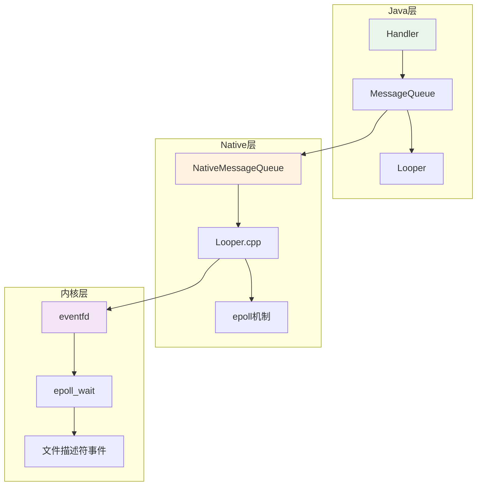
```mermaid
graph TB
    subgraph "Java层"
        A[Handler] --> B[MessageQueue]
        B --> C[Looper]
    end
    
    subgraph "Native层"
        D[NativeMessageQueue] --> E[Looper.cpp]
        E --> F[epoll机制]
    end
    
    subgraph "内核层"
        G[eventfd] --> H[epoll_wait]
        H --> I[文件描述符事件]
    end
    
    B --> D
    E --> G
    
    style A fill:#e8f5e8
    style D fill:#fff3e0
    style G fill:#f3e5f5
```

Android消息机制的设计思想，体现了**分层架构**和**责任链模式**的设计思想：

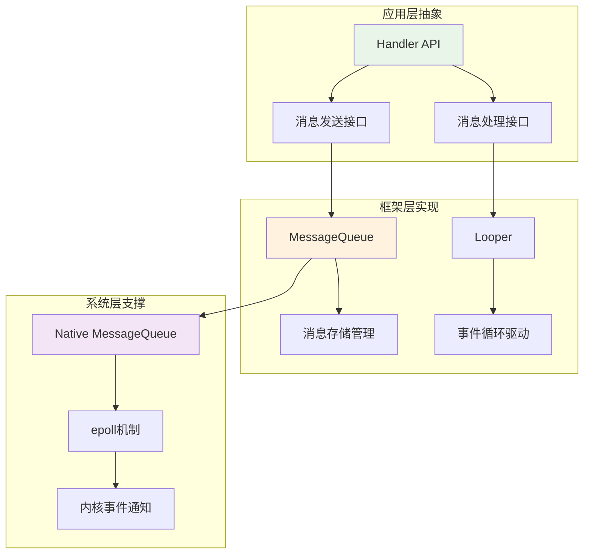
```mermaid
graph TB
    subgraph "应用层抽象"
        A[Handler API] --> B[消息发送接口]
        A --> C[消息处理接口]
    end
    
    subgraph "框架层实现"
        D[MessageQueue] --> E[消息存储管理]
        F[Looper] --> G[事件循环驱动]
    end
    
    subgraph "系统层支撑"
        H[Native MessageQueue] --> I[epoll机制]
        I --> J[内核事件通知]
    end
    
    B --> D
    C --> F
    D --> H
    
    style A fill:#e8f5e8
    style D fill:#fff3e0
    style H fill:#f3e5f5
```

**Android设计思想的深层分析**：

Android消息机制的设计蕴含着一个深刻的架构原则——**关注点分离（Separation of Concerns）**。四大组件各自承担一个且仅一个职责：

- **Message**：只关心"携带什么数据"，不关心如何传输和处理
- **MessageQueue**：只关心"如何存储和排序消息"，不关心消息的内容
- **Handler**：只关心"如何处理消息"，不关心消息从哪里来
- **Looper**：只关心"如何驱动消息循环"，不关心循环中处理什么

这种设计的好处是，当需要修改某个环节时（比如优化消息排序算法），只需要修改对应的组件，不会影响其他组件。这正是SOLID原则中"单一职责原则"的完美实践。

另一个值得关注的设计选择是：Android选择在Java层和Native层都实现了消息队列。Java层负责消息的逻辑管理（入队、排序、分发），Native层负责高效的线程阻塞/唤醒（通过epoll）。这种"逻辑与性能分离"的设计思想，让上层开发者不需要理解epoll就能使用消息机制，同时底层又能获得接近内核级别的性能。

### 2.2 iOS消息机制

与Android不同，iOS的RunLoop采用了**模式驱动**的设计思想。RunLoop不只是一个简单的事件循环，它引入了"模式（Mode）"的概念——同一个RunLoop在不同模式下会处理不同的事件源。这就像一个人可以在"工作模式"和"休闲模式"之间切换，在工作模式下只处理工作相关的事务，在休闲模式下只关注娱乐活动。

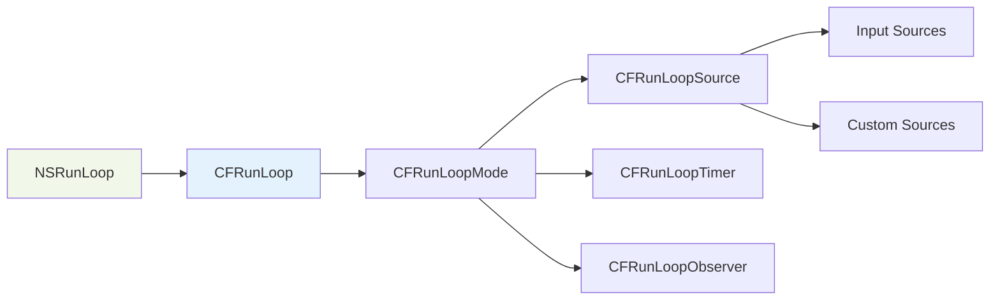
```mermaid
graph LR
    A[CFRunLoop] --> B[CFRunLoopMode]
    B --> C[CFRunLoopSource]
    B --> D[CFRunLoopTimer]
    B --> E[CFRunLoopObserver]
    
    F[NSRunLoop] --> A
    
    C --> G[Input Sources]
    C --> H[Custom Sources]
    
    style A fill:#e3f2fd
    style F fill:#f1f8e9
```

iOS的RunLoop体现了**模式驱动**和**事件源抽象**的设计思想。这种设计背后有一个精妙的考量：在不同的运行场景下，应该优先处理不同类型的事件。例如，当用户正在滑动列表时（UITrackingRunLoopMode），系统应该优先处理触摸事件和UI更新，而暂时搁置网络回调等低优先级任务。这种"场景切换"的设计思想，比Android的纯时间排序更灵活，但也更复杂。

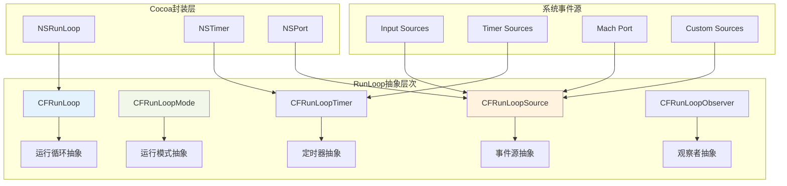
```mermaid
graph TB
    subgraph "RunLoop抽象层次"
        A[CFRunLoop] --> B[运行循环抽象]
        C[CFRunLoopMode] --> D[运行模式抽象]
        E[CFRunLoopSource] --> F[事件源抽象]
        G[CFRunLoopTimer] --> H[定时器抽象]
        I[CFRunLoopObserver] --> J[观察者抽象]
    end
    
    subgraph "Cocoa封装层"
        K[NSRunLoop] --> A
        L[NSTimer] --> G
        M[NSPort] --> E
    end
    
    subgraph "系统事件源"
        N[Input Sources] --> E
        O[Timer Sources] --> G
        P[Mach Port] --> E
        Q[Custom Sources] --> E
    end
    
    style A fill:#e3f2fd
    style C fill:#f1f8e9
    style E fill:#fff3e0
```

模式抽象（Mode Abstraction）

```objc
// RunLoop模式的抽象设计
typedef struct __CFRunLoopMode {
    CFStringRef _name;              // 模式名称抽象
    CFMutableSetRef _sources0;      // Source0事件源集合抽象
    CFMutableSetRef _sources1;      // Source1事件源集合抽象
    CFMutableArrayRef _observers;   // 观察者集合抽象
    CFMutableArrayRef _timers;      // 定时器集合抽象
    CFMutableDictionaryRef _portToV1SourceMap; // 端口映射抽象
} CFRunLoopMode;

// 预定义模式的抽象
FOUNDATION_EXPORT CFStringRef const kCFRunLoopDefaultMode;     // 默认模式
FOUNDATION_EXPORT CFStringRef const kCFRunLoopCommonModes;     // 通用模式标记
```

**抽象设计特点**：

1. **模式隔离**: 不同模式下的事件源完全隔离，实现了运行时的上下文抽象
2. **集合管理**: 通过集合抽象管理不同类型的事件源
3. **动态切换**: 支持运行时动态切换模式，实现了行为的抽象切换

事件源抽象（Source Abstraction）

```objc
// Source0: 用户事件源抽象
typedef struct {
    CFIndex version;
    void *  info;
    const void *(*retain)(const void *info);
    void    (*release)(const void *info);
    CFStringRef (*copyDescription)(const void *info);
    Boolean (*equal)(const void *info1, const void *info2);
    CFHashCode  (*hash)(const void *info);
    void    (*schedule)(void *info, CFRunLoopRef rl, CFStringRef mode);
    void    (*cancel)(void *info, CFRunLoopRef rl, CFStringRef mode);
    void    (*perform)(void *info);  // 事件处理抽象
} CFRunLoopSourceContext;

// Source1: 系统事件源抽象
typedef struct {
    CFIndex version;
    void *  info;
    const void *(*retain)(const void *info);
    void    (*release)(const void *info);
    CFStringRef (*copyDescription)(const void *info);
    Boolean (*equal)(const void *info1, const void *info2);
    CFHashCode  (*hash)(const void *info);
    mach_port_t (*getPort)(void *info);     // 端口获取抽象
    void *  (*perform)(void *msg, CFIndex size, CFAllocatorRef allocator, void *info);
} CFRunLoopSourceContext1;
```

**抽象能力体现**：

1. **事件类型抽象**: Source0抽象用户事件，Source1抽象系统事件
2. **生命周期抽象**: 通过函数指针抽象事件源的生命周期管理
3. **处理逻辑抽象**: 通过回调函数抽象事件的具体处理逻辑

观察者抽象（Observer Abstraction）

```objc
// RunLoop状态观察抽象
typedef CF_OPTIONS(CFOptionFlags, CFRunLoopActivity) {
    kCFRunLoopEntry         = (1UL << 0),    // 进入RunLoop
    kCFRunLoopBeforeTimers  = (1UL << 1),    // 处理Timer前
    kCFRunLoopBeforeSources = (1UL << 2),    // 处理Source前
    kCFRunLoopBeforeWaiting = (1UL << 5),    // 进入休眠前
    kCFRunLoopAfterWaiting  = (1UL << 6),    // 休眠后唤醒
    kCFRunLoopExit          = (1UL << 7),    // 退出RunLoop
    kCFRunLoopAllActivities = 0x0FFFFFFFU    // 所有状态
};

// 观察者回调抽象
typedef void (*CFRunLoopObserverCallBack)(CFRunLoopObserverRef observer, 
                                          CFRunLoopActivity activity, 
                                          void *info);
```

**抽象设计优势**：

1. **状态抽象**: 将RunLoop的复杂状态抽象为有限的几个关键节点
2. **监控抽象**: 提供统一的监控接口，抽象了状态变化的通知机制
3. **扩展抽象**: 支持自定义观察者，实现了监控逻辑的抽象扩展

**iOS设计思想的深层分析**：

iOS RunLoop的设计体现了**有限状态机（FSM）**的思想。RunLoop在运行过程中会经历一系列确定的状态转换：Entry → BeforeTimers → BeforeSources → BeforeWaiting → AfterWaiting → Exit。通过Observer机制，开发者可以在任意状态转换点插入自己的逻辑（比如在BeforeWaiting时进行性能监控，在AfterWaiting时统计唤醒原因）。

这种"可观察的状态机"设计思想非常强大。它让RunLoop不仅仅是一个黑盒，而是一个**透明的、可监控的、可扩展的**事件处理引擎。苹果利用这个机制实现了AutoreleasePool的自动管理（在BeforeWaiting时清理临时对象）、卡顿监测（在BeforeSources前后插入计时器）等重要功能。

与Android相比，iOS的设计更强调"场景化"。Android通过时间戳对消息进行全局排序，所有消息共享一个队列；iOS通过Mode机制将事件源分组管理，在不同场景下激活不同的事件组。这是两种不同的调度哲学：**全局排序 vs 场景隔离**。两种都有道理，选择取决于具体的使用场景。

### 2.3 Web消息机制

Web的Event Loop是三个平台中最"极端"的设计——它直接宣告：**只有一个线程**。JavaScript从设计之初就是单线程语言，这个决定看似激进，实则深思熟虑。

核心理念：JavaScript 是单线程语言，通过 Event Loop 实现异步非阻塞，核心解决 "不阻塞主线程" 的问题。Web的设计思想是：既然多线程会带来复杂的同步问题，那就彻底消灭多线程。所有代码都在同一个线程上执行，通过事件循环实现"伪并发"。这种设计牺牲了真正的并行计算能力，但换来了极其简单的编程模型——开发者永远不需要考虑锁、竞态条件、死锁等多线程问题。

```
┌───────────────────────────┐
│       宏任务队列            │ ← setTimeout、setInterval、I/O、UI渲染
│  (MacroTask Queue/Task)   │
└──────────────┬────────────┘
│
▼
┌───────────────────────────┐
│       微任务队列            │ ← Promise.then、MutationObserver
│  (MicroTask Queue/Job)    │
└──────────────┬────────────┘
│
▼
┌───────────────────────────┐
│  动画帧回调队列             │ ← requestAnimationFrame
│  (Animation Frame Queue)  │
└───────────────────────────┘
```

来看下执行优先级：

```javascript
// 执行顺序示例
console.log('1');  // 同步任务
setTimeout(() => console.log('2'), 0);  // 宏任务
Promise.resolve().then(() => {
console.log('3');  // 微任务
Promise.resolve().then(() => console.log('4'));  // 嵌套微任务
});
console.log('5');  // 同步任务

// 输出：1 → 5 → 3 → 4 → 2
```

**Web设计思想的深层分析**：

Web Event Loop最巧妙的设计是**微任务/宏任务的优先级分层**。同样是异步任务，Promise回调（微任务）的优先级高于setTimeout（宏任务）。这种分层不是随意的，它背后有清晰的设计意图：

- **微任务**代表的是"当前操作的后续步骤"，比如一个网络请求完成后的数据处理，应该尽快执行
- **宏任务**代表的是"独立的新操作"，比如一个定时器触发，可以稍后执行
- **渲染帧回调**代表的是"UI更新"，应该在一批微任务完成后、下一批宏任务之前执行

这种优先级设计保证了：数据更新（微任务）→ UI渲染（rAF）→ 新任务处理（宏任务）的合理顺序。如果把所有异步任务混在一个队列里，就无法保证"数据更新完再刷新UI"这样的合理顺序。

Web的Event Loop还体现了一个重要的设计思想：**约束驱动创新**。正因为只有一个线程，JavaScript社区发明了回调、Promise、async/await等一系列优雅的异步编程方案，这些方案后来反过来影响了其他语言（如Kotlin的协程、Swift的async/await）。

### 2.4 平台对比分析

| 特性 | Android Handler | iOS RunLoop | Web Event Loop |
|------|-----------------|-------------|----------------|
| **消息队列** | MessageQueue | CFRunLoopMode | Task Queue |
| **事件循环** | Looper.loop() | CFRunLoopRun | Event Loop |
| **线程模型** | 多线程支持 | 主要在主线程 | 单线程 |
| **底层机制** | epoll | kqueue/select | libuv |
| **优先级** | 时间排序 | Mode切换 | 微任务/宏任务 |


### 2.5 抽象能力对比

| 抽象维度 | Android | iOS | Web | 抽象程度评价 |
|----------|---------|-----|-----|--------------|
| **消息抽象** | Message类统一抽象 | 多种Source类型抽象 | Event对象抽象 | Android最统一 |
| **队列抽象** | 单一MessageQueue | 多Mode管理 | 多Queue分层 | iOS最灵活 |
| **处理抽象** | Handler统一处理 | 回调函数处理 | Promise/async处理 | Web最现代 |
| **时间抽象** | when字段+延时 | Timer独立抽象 | setTimeout分离 | iOS最清晰 |
| **生命周期** | prepare/loop/quit | run/stop模式 | 自动管理 | Android最明确 |


### 2.6 通用抽象思路

所有平台都采用了事件驱动的抽象模型：

```mermaid
sequenceDiagram
    participant Producer as 事件生产者
    participant Queue as 事件队列
    participant Loop as 事件循环
    participant Handler as 事件处理器
    
    Note over Producer,Handler: 通用事件驱动抽象模型
    
    Producer->>Queue: 产生事件
    Queue->>Queue: 事件排队
    Loop->>Queue: 获取事件
    Queue->>Loop: 返回事件
    Loop->>Handler: 分发事件
    Handler->>Handler: 处理事件
    Handler-->>Loop: 处理完成
    Loop->>Queue: 继续获取
```

### 2.7 设计核心洞察

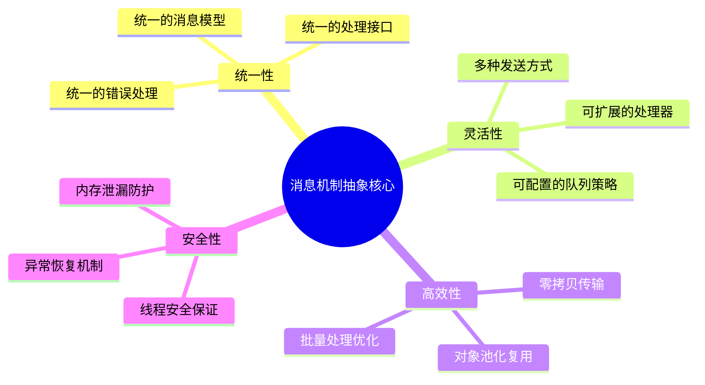
```mermaid
mindmap
  root((消息机制抽象核心))
    统一性
      统一的消息模型
      统一的处理接口
      统一的错误处理
    灵活性
      多种发送方式
      可扩展的处理器
      可配置的队列策略
    高效性
      对象池化复用
      零拷贝传输
      批量处理优化
    安全性
      线程安全保证
      内存泄漏防护
      异常恢复机制
```

从三个平台的对比中，我们可以提炼出消息机制的**四个本质要素**，无论平台如何变化，这四个要素始终存在：

1. **消息体（Message/Event）**：承载数据的容器。无论是Android的Message对象、iOS的Source事件、还是Web的Event对象，它们都在回答同一个问题：要传递什么信息？
2. **消息队列（Queue）**：存储和排序消息的数据结构。它是生产者和消费者之间的缓冲区，解耦了消息的发送和处理。
3. **事件循环（Loop）**：驱动消息处理的引擎。它不停地从队列中取出消息并分发，是整个机制运转的动力来源。
4. **消息处理器（Handler/Callback）**：最终执行业务逻辑的组件。它决定了"收到消息后做什么"。

理解了这四个要素，你会发现消息机制的思想无处不在：Redis的事件循环、Nginx的事件驱动架构、Kafka的消息队列、甚至人体的神经系统（感觉神经收集信号→脊髓传递→大脑处理→运动神经响应），都是同一个模式的不同表现形式。

## 03.消息机制架构

消息机制的架构设计是其灵魂所在。一个好的架构，不仅能解决当前的问题，还能优雅地应对未来的变化。消息机制的架构之所以经久不衰（Android从1.0到现在架构几乎未变），正是因为它在简洁性和灵活性之间找到了完美的平衡点。

### 3.1 整体架构图

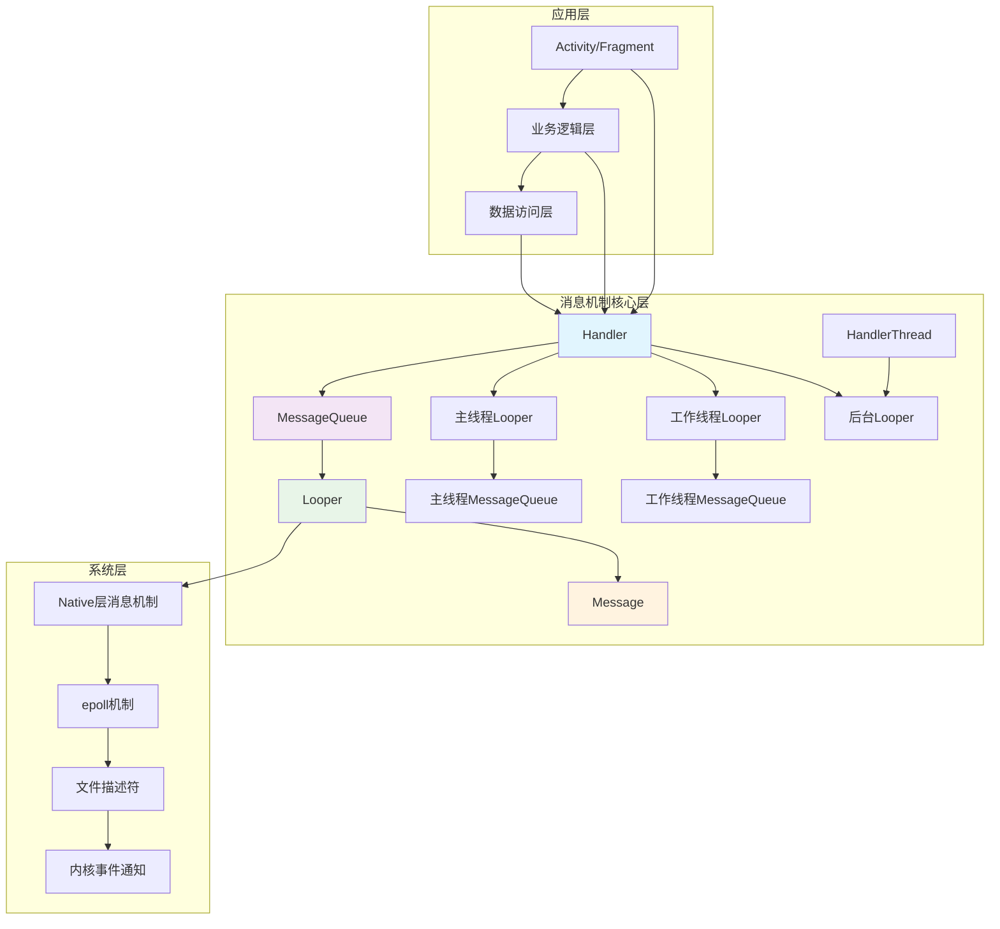
```mermaid
graph TB
    subgraph "应用层"
        A[Activity/Fragment] --> B[业务逻辑层]
        B --> C[数据访问层]
    end
    
    subgraph "消息机制核心层"
        D[Handler] --> E[MessageQueue]
        E --> F[Looper]
        F --> G[Message]
        
        H[主线程Looper] --> I[主线程MessageQueue]
        J[工作线程Looper] --> K[工作线程MessageQueue]
        
        L[HandlerThread] --> M[后台Looper]
    end
    
    subgraph "系统层"
        N[Native层消息机制] --> O[epoll机制]
        O --> P[文件描述符]
        P --> Q[内核事件通知]
    end
    
    A --> D
    B --> D
    C --> D
    
    D --> H
    D --> J
    D --> M
    
    F --> N
    
    style D fill:#e1f5fe
    style E fill:#f3e5f5
    style F fill:#e8f5e8
    style G fill:#fff3e0
```

### 3.2 核心组件类图

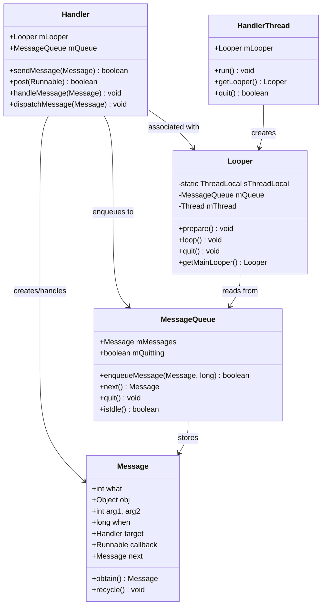
```mermaid
classDiagram
    class Message {
        +int what
        +Object obj
        +int arg1, arg2
        +long when
        +Handler target
        +Runnable callback
        +Message next
        +obtain() Message
        +recycle() void
    }
    
    class Handler {
        +Looper mLooper
        +MessageQueue mQueue
        +sendMessage(Message) boolean
        +post(Runnable) boolean
        +handleMessage(Message) void
        +dispatchMessage(Message) void
    }
    
    class MessageQueue {
        +Message mMessages
        +boolean mQuitting
        +enqueueMessage(Message, long) boolean
        +next() Message
        +quit() void
        +isIdle() boolean
    }
    
    class Looper {
        -static ThreadLocal sThreadLocal
        -MessageQueue mQueue
        -Thread mThread
        +prepare() void
        +loop() void
        +quit() void
        +getMainLooper() Looper
    }
    
    class HandlerThread {
        +Looper mLooper
        +run() void
        +getLooper() Looper
        +quit() boolean
    }
    
    Handler --> Message : creates/handles
    Handler --> MessageQueue : enqueues to
    Handler --> Looper : associated with
    MessageQueue --> Message : stores
    Looper --> MessageQueue : reads from
    HandlerThread --> Looper : creates
```

### 3.3 分层架构设计思想

消息机制的架构设计体现了经典的**三层架构思想**，每一层都有明确的职责边界和抽象级别：

**第一层：API层（Handler）——面向开发者的"门面"**

Handler是开发者唯一需要直接打交道的组件。它提供了极其简洁的API：`sendMessage()`发送消息，`handleMessage()`处理消息。开发者不需要知道消息是如何排队的、Looper是如何运转的、底层是用什么机制阻塞的。这就是**门面模式（Facade Pattern）**的经典应用——用一个简单的接口封装复杂的子系统。

好的API设计有一个特点：**简单的事情简单做，复杂的事情可以做**。Handler的设计完美体现了这一点。最简单的用法只需要两行代码（发送+处理），但如果你需要延时消息、异步消息、同步屏障等高级功能，Handler也都支持。

**第二层：调度层（Looper + MessageQueue）——系统的"中枢神经"**

Looper和MessageQueue组成了消息机制的调度中心。它们不关心消息的内容，只关心消息的"时间"和"顺序"。这种设计体现了**信息隐藏原则**——调度层把消息当作不透明的"信封"来处理，不需要拆开看里面写了什么。

这一层还体现了**单一数据流（Unidirectional Data Flow）**的思想：消息只能从队列的一端进入、从另一端取出，不允许"插队"（除了同步屏障机制），也不允许"退回"。这种单向流动保证了消息处理的确定性——相同顺序的消息，一定会产生相同的结果。

**第三层：系统层（epoll/kqueue）——底层的"心跳"**

这一层负责最底层的线程阻塞和唤醒。当消息队列为空时，线程不能空转（浪费CPU），也不能退出（那就死了）。解决方案是让线程在系统层面"睡眠"，直到有新消息到来时被"唤醒"。

这里用到了操作系统提供的IO多路复用机制（Linux的epoll、macOS的kqueue）。虽然消息队列并不是IO操作，但Android巧妙地利用了eventfd（一种特殊的文件描述符）来将"消息到来"这个事件转换为"文件描述符可读"事件，从而复用了epoll的高效等待机制。这种**技术复用**的设计思想值得学习——不必为每个新问题发明新的轮子，而是巧妙地利用已有的成熟基础设施。

### 3.4 组件协作设计思想

四大组件的协作关系体现了**生产者-消费者模式**和**中介者模式**的融合：

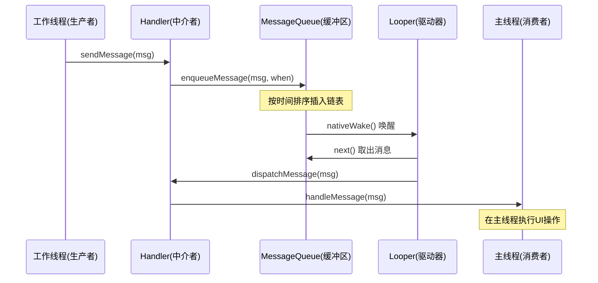
```mermaid
sequenceDiagram
    participant WorkThread as 工作线程(生产者)
    participant Handler as Handler(中介者)
    participant Queue as MessageQueue(缓冲区)
    participant Looper as Looper(驱动器)
    participant MainThread as 主线程(消费者)
    
    WorkThread->>Handler: sendMessage(msg)
    Handler->>Queue: enqueueMessage(msg, when)
    Note over Queue: 按时间排序插入链表
    Queue->>Looper: nativeWake() 唤醒
    Looper->>Queue: next() 取出消息
    Looper->>Handler: dispatchMessage(msg)
    Handler->>MainThread: handleMessage(msg)
    Note over MainThread: 在主线程执行UI操作
```

组件之间的协作有三个关键的设计特点：

1. **间接通信**：工作线程不直接调用主线程的方法，而是通过消息队列间接通信。这种间接性带来了时间解耦（发送和处理不必同时发生）和空间解耦（发送者不需要持有接收者的引用）。

2. **角色分工**：每个组件扮演一个且仅一个角色——Handler是"翻译官"（把业务需求翻译成消息）、MessageQueue是"排队系统"（维护消息的顺序）、Looper是"调度员"（不停地取消息分发消息）。这种清晰的角色分工让系统易于理解、调试和维护。

3. **生命周期绑定**：Looper绑定到线程、Handler绑定到Looper、Message绑定到Handler。这种层层绑定的设计确保了消息总能被正确地路由到目标线程——无论你在哪个线程发送消息，它最终都会在Handler所绑定的Looper线程上被处理。

## 04.消息体设计原理

### 4.1 消息结构设计

消息是消息机制的基本单元，其设计需要考虑性能、内存管理和扩展性。一个好的消息体设计，就像一个好的"信封"设计——它需要足够轻便（性能好）、足够结实（不丢数据）、足够灵活（能装各种内容）。

我们来逐字段分析Message的设计智慧：

```java
public final class Message implements Parcelable {
    // 消息标识符
    public int what;
    
    // 简单数据参数
    public int arg1;
    public int arg2;
    
    // 复杂数据对象
    public Object obj;
    
    // 消息携带的数据包
    Bundle data;
    
    // 消息处理器
    Handler target;
    
    // 回调函数
    Runnable callback;
    
    // 消息发送时间
    long when;
    
    // 链表指针（用于消息队列）
    Message next;
    
    // 消息池相关
    private static final Object sPoolSync = new Object();
    private static Message sPool;
    private static int sPoolSize = 0;
    private static final int MAX_POOL_SIZE = 50;
}
```

**设计思想分析**：

- **数据抽象**: 通过`what`、`obj`、`Bundle`等提供多层次的数据抽象。`what`是轻量级标识，适合简单场景；`obj`可以携带任意对象，适合复杂场景；`Bundle`提供键值对存储，适合结构化数据。这种"渐进式复杂度"的设计，让简单的需求不需要付出额外的开销。
- **行为抽象**: 通过`Handler`和`Runnable`抽象消息的处理行为。`target`字段记录了"谁来处理这个消息"，`callback`字段记录了"具体怎么处理"。消息本身既携带了数据，也携带了行为，这是一种**命令模式（Command Pattern）**的体现。
- **时间抽象**: 通过`when`字段抽象消息的时间属性。它不是表示"消息何时发送的"，而是表示"消息何时应该被处理"。这个微妙的区别很重要——它让消息队列可以实现延时消息和定时消息。
- **结构抽象**: 通过`next`指针形成链表结构。Message既是数据的载体，也是链表的节点，这种"自包含"的设计避免了额外的Node对象分配，节省了内存。

### 4.2 对象池设计思想

Message的对象池（Object Pool）设计是整个消息机制中最精妙的性能优化之一。在一个典型的Android应用中，每秒可能会创建和销毁几十甚至上百个Message对象。如果每次都通过`new Message()`来创建，不仅会产生大量的堆内存分配开销，还会给垃圾回收器（GC）带来巨大压力，导致界面掉帧。

对象池的核心思想是**复用**：用完的Message不销毁，而是放回一个"池子"里；下次需要Message时，先从池子里取，取不到再创建新的。

```java
// 从对象池获取Message（而不是new）
public static Message obtain() {
    synchronized (sPoolSync) {
        if (sPool != null) {
            Message m = sPool;
            sPool = m.next;
            m.next = null;
            m.flags = 0;
            sPoolSize--;
            return m;
        }
    }
    return new Message();
}

// 使用完毕后回收到对象池
void recycleUnchecked() {
    flags = FLAG_IN_USE;
    what = 0;
    arg1 = 0;
    arg2 = 0;
    obj = null;
    replyTo = null;
    sendingUid = UID_NONE;
    workSourceUid = UID_NONE;
    when = 0;
    target = null;
    callback = null;
    data = null;
    
    synchronized (sPoolSync) {
        if (sPoolSize < MAX_POOL_SIZE) {
            next = sPool;
            sPool = this;
            sPoolSize++;
        }
    }
}
```

这个对象池的设计有几个值得深入思考的细节：

**1. 用链表实现池而不是数组/List**

对象池使用Message自身的`next`指针形成单链表，而不是额外创建一个ArrayList来存储。这避免了额外的容器对象分配，同时入池和出池都是O(1)操作（头部插入/取出）。这种"利用数据结构自身特性"的设计在底层框架中非常常见。

**2. 池大小有上限（MAX_POOL_SIZE = 50）**

对象池不是越大越好。过大的池会长期占用内存，过小的池又起不到复用的效果。50这个数字是经验值——在绝大多数场景下，同时"在路上"的消息不会超过50个。超过上限的Message会被正常GC回收，不会造成内存泄漏。

**3. 回收时清除所有字段**

`recycleUnchecked()`方法在回收时会将所有字段重置为初始值。这不仅是为了避免"脏数据"（上一次使用残留的数据影响下一次使用），更是为了**防止内存泄漏**——如果`obj`字段引用了一个大对象（比如Bitmap），不清除就会导致这个大对象无法被GC回收。

**4. 同步锁的最小化**

对象池的操作使用了`synchronized(sPoolSync)`，但锁的粒度被控制在最小范围内——只在实际操作链表的几行代码上加锁。这是**细粒度锁**设计思想的体现，在保证线程安全的同时最小化了锁竞争。

### 4.3 同步和异步消息

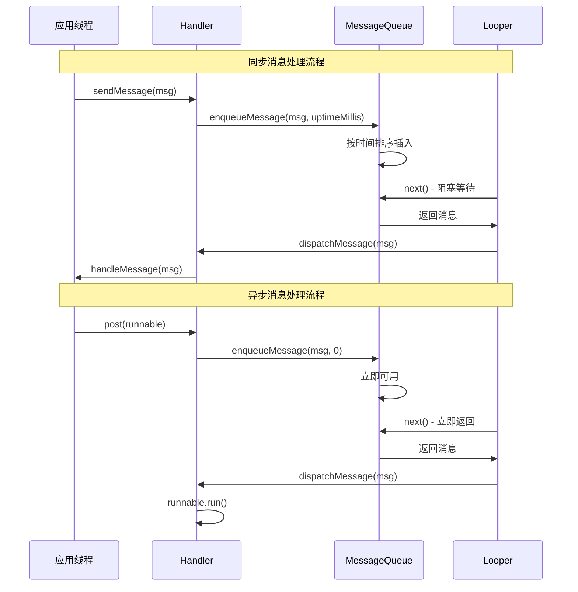
```mermaid
sequenceDiagram
    participant App as 应用线程
    participant Handler as Handler
    participant Queue as MessageQueue
    participant Looper as Looper
    
    Note over App,Looper: 同步消息处理流程
    App->>Handler: sendMessage(msg)
    Handler->>Queue: enqueueMessage(msg, uptimeMillis)
    Queue->>Queue: 按时间排序插入
    Looper->>Queue: next() - 阻塞等待
    Queue->>Looper: 返回消息
    Looper->>Handler: dispatchMessage(msg)
    Handler->>App: handleMessage(msg)
    
    Note over App,Looper: 异步消息处理流程
    App->>Handler: post(runnable)
    Handler->>Queue: enqueueMessage(msg, 0)
    Queue->>Queue: 立即可用
    Looper->>Queue: next() - 立即返回
    Queue->>Looper: 返回消息
    Looper->>Handler: dispatchMessage(msg)
    Handler->>Handler: runnable.run()
```

### 4.4 消息类型分类

| 消息类型 | 特点 | 使用场景 | 处理方式 |
|----------|------|----------|----------|
| **普通消息** | 按时间顺序处理 | 一般业务逻辑 | handleMessage() |
| **延时消息** | 指定时间后处理 | 定时任务、超时处理 | sendMessageDelayed() |
| **屏障消息** | 阻塞同步消息 | 优先处理异步消息 | postSyncBarrier() |
| **异步消息** | 不受屏障影响 | UI刷新、高优先级任务 | setAsynchronous(true) |
| **空闲消息** | 队列空闲时处理 | 资源清理、预加载 | IdleHandler |

消息类型的设计体现了**优先级调度**的思想。在一个真实的应用中，不同类型的任务有不同的紧急程度。UI刷新任务（VSYNC信号触发的绘制）必须在16ms内完成，否则就会掉帧；而资源预加载、日志上报等任务则可以在空闲时再处理。通过同步屏障+异步消息的组合，系统可以确保高优先级任务（如屏幕刷新）即使在消息队列繁忙时也能被优先处理。

### 4.5 消息体设计的权衡

回顾整个消息体的设计，我们可以看到几个关键的**设计权衡（Design Trade-offs）**：

**通用性 vs 性能**：Message使用`Object obj`来携带数据，这意味着任何类型都可以作为消息数据。但这也带来了装箱/拆箱的开销（如果传递基本类型），以及类型安全的缺失（需要在处理端做类型转换）。为了缓解这个问题，Android提供了`arg1`和`arg2`两个int字段用于传递最常见的整数参数，避免了对简单场景的过度抽象。

**内存 vs 速度**：对象池用额外的内存（最多50个空闲Message对象常驻内存）换取了分配速度的提升。这是一个典型的"空间换时间"权衡。在移动设备上，内存是有限的，但CPU周期更加宝贵（影响流畅度），因此这个权衡是合理的。

**简洁性 vs 安全性**：Message的字段都是public的，任何人都可以修改。这牺牲了封装性，但换来了使用的简洁性（不需要大量的getter/setter调用）。Google在这里做了一个务实的选择——Message是框架内部频繁使用的对象，性能优先于封装。

## 05.消息队列设计

消息队列是消息机制的"脊椎"——它连接着消息的生产者和消费者，承担着存储、排序和调度的核心职责。一个优秀的消息队列设计，需要在以下几个维度取得平衡：插入效率（消息来了要快速入队）、取出效率（Looper要快速拿到下一个消息）、内存效率（不能浪费太多内存）、线程安全（多线程并发操作不能出错）。

### 5.1 队列数据结构

消息队列采用**单链表**结构，按照消息的执行时间（when字段）进行排序：

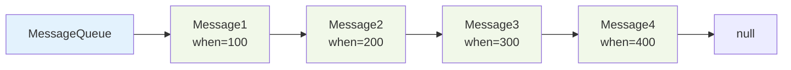
```mermaid
graph LR
    A[MessageQueue] --> B[Message1<br/>when=100]
    B --> C[Message2<br/>when=200]
    C --> D[Message3<br/>when=300]
    D --> E[Message4<br/>when=400]
    E --> F[null]
    
    style A fill:#e3f2fd
    style B fill:#f1f8e9
    style C fill:#f1f8e9
    style D fill:#f1f8e9
    style E fill:#f1f8e9
```

### 5.2 为什么用链表不用数组

这是一个经常被问到的问题，答案涉及到对使用场景的深刻理解。

**场景分析**：消息队列的操作特点是——频繁地在中间位置插入（因为要按时间排序），频繁地从头部取出，几乎不需要随机访问（不需要"取出第5个消息"这样的操作）。

| 操作 | 数组(ArrayList) | 链表(LinkedList) | 消息队列需求 |
|------|-----------------|------------------|--------------|
| 头部取出 | O(n) 需要移动所有元素 | O(1) 直接取头节点 | 非常频繁 |
| 中间插入 | O(n) 需要移动后续元素 | O(1) 修改指针即可 | 频繁 |
| 随机访问 | O(1) 直接索引 | O(n) 需要遍历 | 几乎不需要 |
| 内存分配 | 需要连续内存，扩容时要拷贝 | 离散分配，无需扩容 | 消息数量不确定 |

链表在这个场景下完胜数组。但还有一个更巧妙的设计细节：Android没有使用标准库的LinkedList，而是让Message自身充当链表节点（通过`next`字段）。这避免了额外的Node对象分配，进一步减少了内存开销和GC压力。

这种"数据结构即节点"的设计模式在高性能系统中非常常见。Linux内核的链表（`list_head`）也采用了类似的"侵入式链表"设计——不是把数据放进链表节点，而是把链表指针嵌入到数据结构中。这种设计思想的本质是：**消除间接层，让数据和结构合二为一**。

### 5.3 消息入队算法

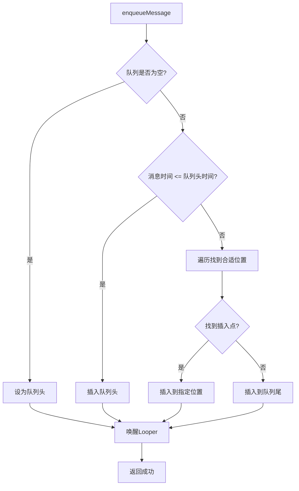
```mermaid
flowchart TD
    A[enqueueMessage] --> B{队列是否为空?}
    B -->|是| C[设为队列头]
    B -->|否| D{消息时间 <= 队列头时间?}
    D -->|是| E[插入队列头]
    D -->|否| F[遍历找到合适位置]
    F --> G{找到插入点?}
    G -->|是| H[插入到指定位置]
    G -->|否| I[插入到队列尾]
    
    C --> J[唤醒Looper]
    E --> J
    H --> J
    I --> J
    
    J --> K[返回成功]
```

### 5.4 队列核心实现

```java
public final class MessageQueue {
    Message mMessages; // 队列头
    private final Object mLock = new Object();
    
    boolean enqueueMessage(Message msg, long when) {
        synchronized (mLock) {
            msg.when = when;
            Message p = mMessages;
            boolean needWake;
            
            // 插入到队列头部
            if (p == null || when == 0 || when < p.when) {
                msg.next = p;
                mMessages = msg;
                needWake = mBlocked;
            } else {
                // 找到合适的插入位置
                needWake = mBlocked && p.target == null && msg.isAsynchronous();
                Message prev;
                for (;;) {
                    prev = p;
                    p = p.next;
                    if (p == null || when < p.when) {
                        break;
                    }
                    if (needWake && p.isAsynchronous()) {
                        needWake = false;
                    }
                }
                msg.next = p;
                prev.next = msg;
            }
            
            // 唤醒等待的Looper
            if (needWake) {
                nativeWake(mPtr);
            }
        }
        return true;
    }
}
```

入队算法的设计体现了**有序插入**的思想。它不是简单的"先进先出"（FIFO），而是按照`when`字段进行排序插入。这意味着一个延时5秒的消息，即使比一个延时1秒的消息先发送，也会排在后面。这种"按截止时间排序"的思想在操作系统的调度算法中叫做**Earliest Deadline First（EDF）**，是实时系统中常用的调度策略。

另一个值得注意的细节是`needWake`的判断逻辑。不是每次入队都需要唤醒Looper——只有当新消息插入到队列头部（意味着它是当前最紧急的消息），并且Looper当前处于阻塞状态时，才需要唤醒。这种**按需唤醒**的设计避免了不必要的系统调用开销。

### 5.5 阻塞唤醒设计思想

消息队列的阻塞/唤醒机制是整个消息机制中最底层也最关键的设计。它需要解决一个看似简单实则困难的问题：**当没有消息需要处理时，线程应该怎么办？**

**方案一：忙等待（Busy Waiting）** —— 不断循环检查队列是否有新消息

```
while (queue.isEmpty()) {
    // 空转，不断消耗CPU
}
```

这是最简单的方案，但也是最浪费的。线程会100%占用CPU核心，在移动设备上会迅速耗尽电量。

**方案二：Sleep轮询** —— 定期睡眠然后检查

```
while (queue.isEmpty()) {
    Thread.sleep(10);  // 每10ms检查一次
}
```

比忙等待好一些，但有两个问题：sleep时间太短浪费CPU，太长则消息处理延迟增大。而且sleep的精度受操作系统调度影响，无法保证准确性。

**方案三：条件等待（推荐）** —— 通过操作系统机制精确等待

```
// 入队时
nativeWake(mPtr);  // 通过eventfd写入数据唤醒

// 出队时
nativePollOnce(mPtr, timeout);  // 通过epoll_wait精确等待
```

Android选择了第三种方案。它通过Linux的**epoll + eventfd**机制实现了精确的阻塞/唤醒：

- **epoll**：Linux的IO多路复用机制，可以让线程在等待时完全不消耗CPU
- **eventfd**：一种轻量级的进程间通知机制，可以用来唤醒在epoll上等待的线程
- **超时等待**：如果队列中最早的消息还没到执行时间，epoll_wait会设置一个精确的超时时间，到时自动唤醒

这种设计的精妙之处在于：线程在等待时的CPU占用为零，唤醒的延迟为微秒级，超时的精度为纳秒级。这就是为什么Android的主线程可以在待机状态下连续运行数天，却几乎不消耗电量的原因。

### 5.6 队列管理策略

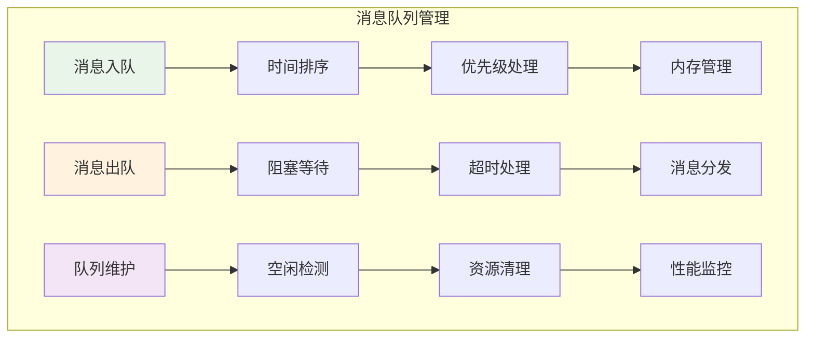
```mermaid
graph TB
    subgraph "消息队列管理"
        A[消息入队] --> B[时间排序]
        B --> C[优先级处理]
        C --> D[内存管理]
        
        E[消息出队] --> F[阻塞等待]
        F --> G[超时处理]
        G --> H[消息分发]
        
        I[队列维护] --> J[空闲检测]
        J --> K[资源清理]
        K --> L[性能监控]
    end
    
    style A fill:#e8f5e8
    style E fill:#fff3e0
    style I fill:#f3e5f5
```

## 06.消息处理器设计

Handler是消息机制中开发者接触最多的组件，也是设计模式应用最丰富的组件。它同时扮演着消息的"发送者"和"处理者"两个角色，这种双重身份的设计让消息的发送和处理可以在同一个对象中完成，简化了API的使用。

### 6.1 Handler设计模式

Handler采用**策略模式**和**模板方法模式**，提供灵活的消息处理机制：

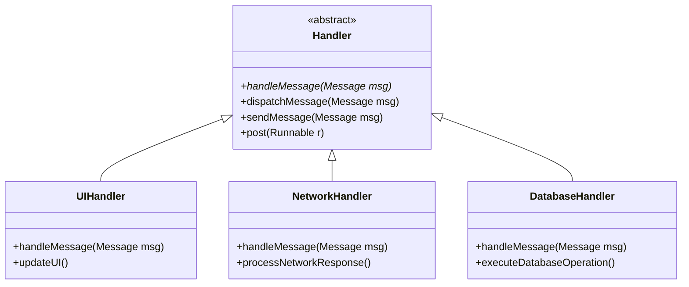
```mermaid
classDiagram
    class Handler {
        <<abstract>>
        +handleMessage(Message msg)*
        +dispatchMessage(Message msg)
        +sendMessage(Message msg)
        +post(Runnable r)
    }
    
    class UIHandler {
        +handleMessage(Message msg)
        +updateUI()
    }
    
    class NetworkHandler {
        +handleMessage(Message msg)
        +processNetworkResponse()
    }
    
    class DatabaseHandler {
        +handleMessage(Message msg)
        +executeDatabaseOperation()
    }
    
    Handler <|-- UIHandler
    Handler <|-- NetworkHandler
    Handler <|-- DatabaseHandler
```

### 6.2 处理器抽象

```java
public class Handler {
    // 抽象能力1: 消息分发的抽象
    public void dispatchMessage(Message msg) {
        if (msg.callback != null) {
            handleCallback(msg);        // 回调方式抽象
        } else {
            if (mCallback != null) {
                if (mCallback.handleMessage(msg)) {
                    return;             // 拦截器方式抽象
                }
            }
            handleMessage(msg);         // 继承方式抽象
        }
    }
    
    // 抽象能力2: 消息发送的抽象
    public final boolean sendMessage(Message msg) {
        return sendMessageDelayed(msg, 0);
    }
    
    public final boolean sendMessageDelayed(Message msg, long delayMillis) {
        if (delayMillis < 0) {
            delayMillis = 0;
        }
        return sendMessageAtTime(msg, SystemClock.uptimeMillis() + delayMillis);
    }
    
    // 抽象能力3: 时间处理的抽象
    public boolean sendMessageAtTime(Message msg, long uptimeMillis) {
        MessageQueue queue = mQueue;
        if (queue == null) {
            return false;
        }
        return enqueueMessage(queue, msg, uptimeMillis);
    }
}
```

**抽象能力体现**：
1. **处理方式抽象**: 支持回调、拦截器、继承三种处理方式
2. **时间维度抽象**: 将立即发送、延时发送、定时发送统一抽象
3. **错误处理抽象**: 统一的异常处理和容错机制


### 6.3 消息分发机制

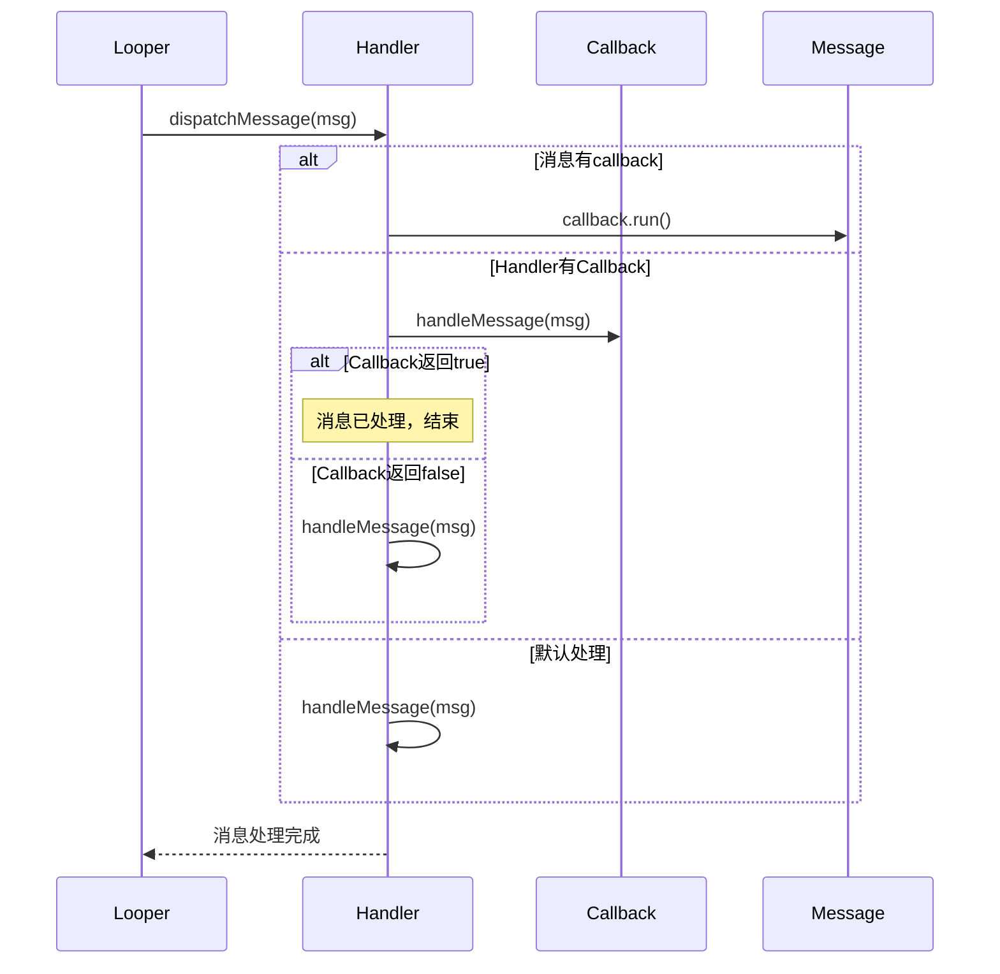
```mermaid
sequenceDiagram
    participant Looper as Looper
    participant Handler as Handler
    participant Callback as Callback
    participant Message as Message
    
    Looper->>Handler: dispatchMessage(msg)
    
    alt 消息有callback
        Handler->>Message: callback.run()
    else Handler有Callback
        Handler->>Callback: handleMessage(msg)
        alt Callback返回true
            Note over Handler: 消息已处理，结束
        else Callback返回false
            Handler->>Handler: handleMessage(msg)
        end
    else 默认处理
        Handler->>Handler: handleMessage(msg)
    end
    
    Handler-->>Looper: 消息处理完成
```

### 6.4 责任链与策略的融合

Handler的`dispatchMessage()`方法是整个消息处理器中设计最精妙的部分。它在短短十几行代码中融合了三种设计模式：

**策略模式（Strategy Pattern）**：消息的处理方式不是固定的，而是可以在运行时选择。你可以选择通过Runnable回调处理、通过Callback接口处理、或通过继承handleMessage()处理。每种方式都是一种"策略"，开发者可以根据场景选择最合适的方式。

```
// 策略1：最简洁——直接传Runnable
handler.post(() -> textView.setText("更新完成"));

// 策略2：最灵活——通过Callback拦截
Handler handler = new Handler(Looper.getMainLooper(), msg -> {
    // 可以决定是否"消费"这个消息
    if (msg.what == 1) { return true; }  // 已处理，不再往下传
    return false;  // 未处理，继续传给handleMessage
});

// 策略3：最传统——继承重写
class MyHandler extends Handler {
    @Override
    public void handleMessage(Message msg) {
        // 通过what字段分类处理
    }
}
```

**责任链模式（Chain of Responsibility）**：消息的处理形成了一条链——先检查Runnable回调，再检查Callback接口，最后走handleMessage()。如果前面的环节"消费"了消息（处理并返回true），后面的环节就不会执行。这种"逐级传递、有一个处理就停止"的模式，正是责任链模式的经典表现。

**模板方法模式（Template Method）**：`dispatchMessage()`定义了消息分发的"骨架算法"（先检查callback→再检查Callback→最后handleMessage），子类只需要重写`handleMessage()`这一个方法就能定制处理逻辑，而不需要改变整个分发流程。这让框架层面的逻辑不可变，业务层面的逻辑可定制。

这三种模式的融合体现了一个深刻的设计原则：**提供默认行为，允许自定义覆盖**。对于简单场景，用`post(Runnable)`一行代码搞定；对于需要拦截的场景，用Callback加一层过滤；对于复杂的分类处理，继承Handler重写handleMessage()。三种方式覆盖了从简单到复杂的全部需求，而且彼此之间可以叠加使用。

### 6.5 生命周期管理

Handler的生命周期管理是Android内存泄漏问题的高发区，也是理解消息机制设计边界的关键。

**问题的根源**：Handler持有Looper的引用，Looper持有MessageQueue的引用，MessageQueue持有Message的引用，Message持有Handler的引用（target字段）。如果Handler是Activity的内部类（隐式持有Activity引用），那么一条延时消息就会形成这样的引用链：

```
Message.target → Handler → Activity（已经销毁但无法被GC回收）
```

**生命类比**：这就像你已经搬离了旧公寓（Activity销毁），但快递柜里还有一个寄给你的包裹（延时消息），快递柜因此无法清空你的格子（内存无法回收）。

**设计上的解决方案**：

1. **弱引用Handler**：Handler通过WeakReference持有外部类的引用，当外部类被GC回收时，弱引用会自动清空

```java
static class SafeHandler extends Handler {
    private final WeakReference<Activity> activityRef;
    
    SafeHandler(Activity activity) {
        this.activityRef = new WeakReference<>(activity);
    }
    
    @Override
    public void handleMessage(Message msg) {
        Activity activity = activityRef.get();
        if (activity != null && !activity.isFinishing()) {
            // 安全地操作Activity
        }
    }
}
```

2. **生命周期绑定清理**：在Activity/Fragment销毁时，主动移除所有待处理的消息

```java
@Override
protected void onDestroy() {
    super.onDestroy();
    handler.removeCallbacksAndMessages(null);  // 清除所有消息和回调
}
```

3. **Lifecycle-aware Handler**：现代Android开发中，可以利用Lifecycle组件自动管理Handler的生命周期，在组件销毁时自动取消未处理的消息。

**设计思想总结**：Handler的生命周期问题本质上是一个**所有权（Ownership）**问题——谁拥有Handler？谁有权决定Handler何时停止工作？好的设计应该让Handler的生命周期与其使用者（Activity/Fragment）保持一致。这种"谁创建谁负责清理"的设计思想，在所有资源管理场景中都是适用的。

### 6.6 最佳实践建议

| 实践 | 说明 | 代码示例 |
|------|------|----------|
| **使用Message.obtain()** | 复用消息对象，减少GC | `Message.obtain(handler, what, obj)` |
| **及时清理Handler** | 避免内存泄漏 | `handler.removeCallbacksAndMessages(null)` |
| **使用WeakReference** | 防止Activity泄漏 | `WeakReference<Activity> activityRef` |
| **合理设置消息优先级** | 保证重要消息及时处理 | `msg.setAsynchronous(true)` |
| **避免在Handler中执行耗时操作** | 防止ANR | 使用线程池处理耗时任务 |


## 07.Looper设计原理

Looper是消息机制的"心脏"。如果说MessageQueue是"血管"（存储和传递消息），Handler是"大脑"（决定如何处理消息），那么Looper就是那个不停跳动的心脏——它驱动着整个系统的运转。理解Looper的设计，是理解整个消息机制最关键的一步。

### 7.1 Looper设计思想

Looper是消息机制的核心驱动器，采用**事件循环（Event Loop）**模式。事件循环是一个在计算机科学中有着50多年历史的经典模式，从早期的操作系统内核到现代的Node.js，都采用了同样的设计思路。

其核心设计思想包括：

1. **单线程模型**: 每个线程最多只能有一个Looper。这是通过ThreadLocal实现的"一对一绑定"，从根本上避免了一个线程被多个Looper竞争驱动的混乱局面。
2. **事件驱动**: Looper不主动产生任何行为，它只是被动地从消息队列中取出消息并分发。这种"被动响应"的设计让系统的行为完全由消息（事件）决定，具有良好的可预测性。
3. **阻塞等待**: 没有消息时进入休眠状态，而不是空转。这就像一个值班医生——有病人来就立即处理，没有病人时就休息，但随时可以被叫醒。
4. **优雅退出**: 提供`quit()`和`quitSafely()`两种退出方式。前者立即退出（丢弃未处理的消息），后者处理完队列中的消息再退出。这种"安全关闭"的设计思想在服务器编程中也很常见。

```java
public final class Looper {
    // 抽象能力1: 线程绑定抽象
    static final ThreadLocal<Looper> sThreadLocal = new ThreadLocal<Looper>();
    
    // 抽象能力2: 事件循环抽象
    public static void loop() {
        final Looper me = myLooper();
        final MessageQueue queue = me.mQueue;
        
        // 无限循环的抽象实现
        for (;;) {
            Message msg = queue.next(); // 可能阻塞
            if (msg == null) {
                return; // 退出循环的抽象条件
            }
            
            // 消息分发的抽象
            try {
                msg.target.dispatchMessage(msg);
            } catch (Exception exception) {
                throw exception;
            } finally {
                msg.recycleUnchecked();
            }
        }
    }
    
    // 抽象能力3: 生命周期抽象
    public void quit() {
        mQueue.quit(false);
    }
    
    public void quitSafely() {
        mQueue.quit(true);
    }
}
```

### 7.2 Looper工作流程

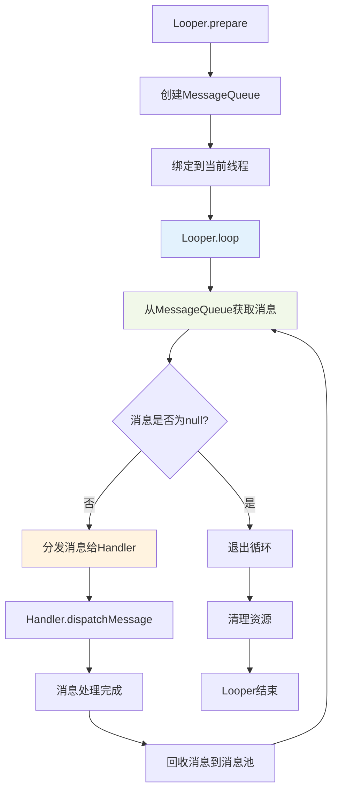
```mermaid
flowchart TD
    A[Looper.prepare] --> B[创建MessageQueue]
    B --> C[绑定到当前线程]
    C --> D[Looper.loop]
    
    D --> E[从MessageQueue获取消息]
    E --> F{消息是否为null?}
    F -->|是| G[退出循环]
    F -->|否| H[分发消息给Handler]
    
    H --> I[Handler.dispatchMessage]
    I --> J[消息处理完成]
    J --> K[回收消息到消息池]
    K --> E
    
    G --> L[清理资源]
    L --> M[Looper结束]
    
    style D fill:#e3f2fd
    style E fill:#f1f8e9
    style H fill:#fff3e0
```

### 7.3 Looper核心实现

```java
public final class Looper {
    static final ThreadLocal<Looper> sThreadLocal = new ThreadLocal<Looper>();
    private static Looper sMainLooper;
    
    final MessageQueue mQueue;
    final Thread mThread;
    
    public static void prepare() {
        prepare(true);
    }
    
    private static void prepare(boolean quitAllowed) {
        if (sThreadLocal.get() != null) {
            throw new RuntimeException("Only one Looper may be created per thread");
        }
        sThreadLocal.set(new Looper(quitAllowed));
    }
    
    public static void loop() {
        final Looper me = myLooper();
        if (me == null) {
            throw new RuntimeException("No Looper; Looper.prepare() wasn't called on this thread.");
        }
        
        final MessageQueue queue = me.mQueue;
        
        for (;;) {
            Message msg = queue.next(); // 可能阻塞
            if (msg == null) {
                // 没有消息表示消息队列正在退出
                return;
            }
            
            try {
                msg.target.dispatchMessage(msg);
            } finally {
                msg.recycleUnchecked();
            }
        }
    }
}
```

### 7.4 ThreadLocal绑定设计

Looper使用ThreadLocal实现线程绑定，这是整个消息机制中最优雅的设计之一。

**什么是ThreadLocal**：ThreadLocal是一种"线程局部变量"机制。每个线程通过同一个ThreadLocal对象读写数据时，实际上读写的是各自线程内部的独立副本。就像一个共享的储物柜系统——每个人用同一把钥匙（ThreadLocal引用）打开储物柜，但打开的是各自的柜子（线程本地存储）。

**为什么用ThreadLocal而不是HashMap**：

```java
// 方案A：用Map存储线程和Looper的映射（不够好）
static Map<Thread, Looper> looperMap = new ConcurrentHashMap<>();

// 方案B：用ThreadLocal存储（Android的选择）
static final ThreadLocal<Looper> sThreadLocal = new ThreadLocal<>();
```

方案A需要ConcurrentHashMap来保证线程安全，每次访问都要计算hash值、可能触发锁竞争。方案B直接在线程的内部存储空间（Thread.threadLocals）中读写，无需加锁、无需hash计算，性能更好。

**ThreadLocal在这里的设计意义**：

1. **强制一对一绑定**：`prepare()`方法在设置前先检查ThreadLocal是否已有值，如果有就抛异常。这确保了每个线程最多只能有一个Looper，从设计层面杜绝了"一个线程被多个Looper驱动"的错误。
2. **隐式传递上下文**：任何在该线程上执行的代码，都可以通过`Looper.myLooper()`获取当前线程的Looper，不需要显式传参。这种"隐式上下文"的设计让API更简洁。
3. **自然的生命周期管理**：当线程结束时，线程的ThreadLocalMap会被自然清理，Looper也随之被回收。不需要额外的清理逻辑。

这种设计思想在很多框架中都有应用：Spring的RequestContextHolder用ThreadLocal存储HTTP请求上下文、SLF4J的MDC用ThreadLocal存储日志上下文、数据库连接池用ThreadLocal存储当前线程的连接。**ThreadLocal的本质是一种"线程级别的单例模式"**——在每个线程内部，某个对象是唯一的。

### 7.5 多Looper架构设计

应用可以有多个Looper，每个线程最多一个：

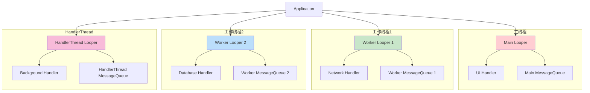
```mermaid
graph TB
    subgraph "主线程"
        A[Main Looper] --> B[UI Handler]
        A --> C[Main MessageQueue]
    end
    
    subgraph "工作线程1"
        D[Worker Looper 1] --> E[Network Handler]
        D --> F[Worker MessageQueue 1]
    end
    
    subgraph "工作线程2"
        G[Worker Looper 2] --> H[Database Handler]
        G --> I[Worker MessageQueue 2]
    end
    
    subgraph "HandlerThread"
        J[HandlerThread Looper] --> K[Background Handler]
        J --> L[HandlerThread MessageQueue]
    end
    
    M[Application] --> A
    M --> D
    M --> G
    M --> J
    
    style A fill:#ffcdd2
    style D fill:#c8e6c9
    style G fill:#bbdefb
    style J fill:#f8bbd9
```

### 7.6 支持多Looper

| 原因 | 说明 | 优势 |
|------|------|------|
| **线程隔离** | 不同线程处理不同类型任务 | 避免相互影响，提高稳定性 |
| **性能优化** | 分散处理负载 | 充分利用多核CPU资源 |
| **职责分离** | UI线程专注界面更新 | 后台线程处理耗时操作 |
| **优先级管理** | 不同优先级的任务分离 | 保证关键任务及时处理 |


## 08.线程安全设计思想

消息机制的线程安全设计是其最核心的价值所在。它用一种巧妙的方式，在不大量使用锁的前提下，实现了多线程环境下的安全通信。理解这种设计思想，对于理解并发编程有着深远的意义。

### 8.1 为什么不加锁也安全

很多人看到消息机制的代码时会疑惑：Handler可以在任意线程调用sendMessage()，Looper在另一个线程调用loop()处理消息，为什么不会出现线程安全问题？

答案的关键在于：**消息机制并没有"不加锁"，它只是把锁的范围控制到了最小**。

整个消息机制中只有**一个地方**需要加锁——MessageQueue的`enqueueMessage()`和`next()`方法。这两个方法用`synchronized`保护了链表的操作。但更重要的是，消息机制的设计从架构层面**消除了大部分需要加锁的场景**：

**为什么消息处理不需要加锁**：因为消息的处理（handleMessage）总是在目标线程上串行执行的。Looper.loop()是一个单线程的循环：取一个消息→处理完→再取下一个。不存在两个消息同时被处理的情况，自然也就不需要加锁。

**为什么消息发送只需要队列锁**：因为sendMessage()最终只做了一件事——把Message插入到链表中。链表操作本身就只需要修改几个指针，加锁的时间极短（纳秒级）。

这种设计的精髓可以用一句话概括：**在生产端加最小的锁（队列操作），在消费端不加锁（串行处理）**。这就像超市的收银台——所有顾客（消息生产者）排队结账（入队需要排队），但收银员（Looper）只需要一个一个处理，不需要同时应对多个顾客。

### 8.2 生产者消费者模型

消息机制是**生产者-消费者模式**的经典实现。多个工作线程是生产者（通过Handler投递消息），Looper所在的线程是消费者（从队列取出消息处理），MessageQueue是两者之间的缓冲区。

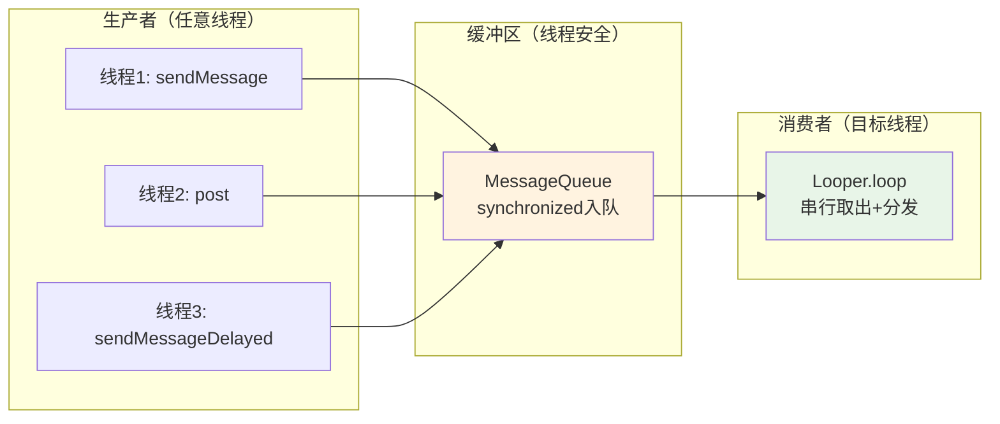
```mermaid
graph LR
    subgraph "生产者（任意线程）"
        A[线程1: sendMessage] 
        B[线程2: post]
        C[线程3: sendMessageDelayed]
    end
    
    subgraph "缓冲区（线程安全）"
        D[MessageQueue<br/>synchronized入队]
    end
    
    subgraph "消费者（目标线程）"
        E[Looper.loop<br/>串行取出+分发]
    end
    
    A --> D
    B --> D
    C --> D
    D --> E
    
    style D fill:#fff3e0
    style E fill:#e8f5e8
```

这个模型的设计有三个关键的平衡点：

**1. 缓冲区的大小**：Android的MessageQueue没有容量限制（理论上可以无限入队）。这是因为消息都是轻量级对象（尤其是通过对象池复用后），而且在正常情况下消息会被快速消费。如果真的出现消息堆积（说明主线程被阻塞了），问题的根源不在队列，而在消费端。

**2. 阻塞策略**：生产者永远不会阻塞（enqueueMessage总是成功的），消费者在队列为空时阻塞（通过epoll等待）。这种"只阻塞消费者"的设计保证了生产者（工作线程）的执行不会被延迟。

**3. 消息的所有权转移**：一旦Message被enqueue到队列中，它的"所有权"就从发送线程转移到了Looper线程。发送线程不应该再修改这个Message的任何字段。这种"单一所有权"的设计思想在Rust语言中被提升为了语言层面的机制（所有权系统），而Android在Java层面通过约定（convention）来实现。

### 8.3 内存可见性保证

在多线程编程中，除了"操作的原子性"之外，还有一个容易被忽略的问题——**内存可见性**。一个线程修改了变量的值，另一个线程可能看不到最新的值（因为CPU缓存、编译器优化等原因）。

消息机制如何保证可见性？关键在于`synchronized`关键字。Java内存模型保证：

- 进入synchronized块时，会从主存中重新读取变量的最新值
- 退出synchronized块时，会将修改后的值刷新到主存

由于Message的入队（enqueueMessage）和出队（next）都在synchronized块中执行，这就保证了：

1. **入队时**：发送线程在synchronized块退出前，对Message各字段的设置会被刷新到主存
2. **出队时**：Looper线程在synchronized块进入后，会读取到Message各字段的最新值

换句话说，`synchronized`在这里不仅保证了链表操作的原子性，还附带解决了内存可见性问题。这是一种**一石二鸟**的设计——用一把锁同时解决两个问题。

### 8.4 线程安全的边界

理解消息机制的线程安全边界非常重要。消息机制保证的是**消息传递过程的线程安全**，而不是**消息处理逻辑的线程安全**。

具体来说：

| 保证安全的 | 不保证安全的 |
|-----------|-------------|
| Message入队和出队 | handleMessage()内部的共享变量操作 |
| Message字段的可见性传递 | Message.obj引用的可变对象的修改 |
| Looper的串行消息处理 | 多个Handler共享数据的并发访问 |

一个常见的误解是："只要通过Handler发消息就线程安全了"。实际上，如果你在handleMessage()中访问了没有同步保护的共享变量，仍然可能出现线程安全问题。消息机制解决的是**通信的安全性**，而不是**共享数据的安全性**。

正确的做法是：通过消息传递数据（而不是共享数据），让所有对共享状态的修改都在同一个线程（通常是主线程）上完成。这就是消息机制设计哲学的核心——**用通信代替共享**。


## 09.性能优化设计思想

消息机制作为应用框架最底层、调用最频繁的基础设施，其性能至关重要。Android团队在消息机制的设计中运用了多种精妙的性能优化技术，这些技术的设计思想值得深入学习。

### 9.1 对象复用与零分配

在高频调用的代码路径上，对象分配是最大的性能杀手之一。每次`new`操作都需要在堆上分配内存，累积起来会触发频繁的GC（垃圾回收），导致应用掉帧。

消息机制通过**对象池（Object Pool）**实现了"零分配"的理想状态。在稳态运行中（对象池已经"热"起来之后），`Message.obtain()`几乎不需要分配新对象，而是从池中取出已有的对象重置后复用。

```
第一阶段（冷启动）：
obtain() → new Message()     // 池为空，需要分配
obtain() → new Message()     // 池为空，需要分配
recycle() → 放回池中          // 开始填充池
recycle() → 放回池中

第二阶段（稳态运行）：
obtain() → 从池中取出         // 零分配！
recycle() → 放回池中          // 零分配！
obtain() → 从池中取出         // 零分配！
recycle() → 放回池中
```

这种"冷启动+热稳态"的性能特征在很多高性能系统中都能看到：数据库连接池、线程池、Netty的ByteBuf池等。核心思想是：**让对象在创建后尽可能长时间地被复用，而不是频繁地创建和销毁**。

### 9.2 阻塞策略与CPU节能

消息机制的阻塞策略是"绿色计算"的典范。在手机待机状态下，主线程的Looper一直在运行，但几乎不消耗电量。这是如何做到的？

**分级阻塞策略**：

```
场景1：队列中有立即执行的消息
→ 立即返回，不阻塞（零延迟）

场景2：队列中最早的消息还需要等100ms
→ epoll_wait(100ms)超时唤醒（精确等待）

场景3：队列为空
→ epoll_wait(-1)无限等待（完全休眠）
```

这种分级策略的精妙之处在于：**它根据"下一条消息还有多久要处理"来动态调整等待时间**。不是固定的"每10ms检查一次"（浪费CPU），也不是"有消息才唤醒"（延时消息怎么办？），而是精确计算出需要等待的时间。

从操作系统的角度看，一个在epoll_wait上阻塞的线程：
- CPU占用率为零（线程被移出CPU调度队列）
- 不参与时间片轮转（不和其他线程竞争CPU）
- 唤醒延迟极低（内核通过中断机制直接唤醒，微秒级）

### 9.3 同步屏障与优先级反转

同步屏障（Sync Barrier）是Android消息机制中最巧妙也最容易被忽略的设计。它解决了一个经典的调度问题——**优先级反转（Priority Inversion）**。

**问题场景**：主线程的消息队列中可能同时有普通业务消息和VSYNC信号（屏幕刷新信号）。如果队列中堆积了大量业务消息，VSYNC信号必须排在后面等待，就会导致界面掉帧。

**解决方案**：在VSYNC信号到来前，先插入一个"同步屏障"。同步屏障会阻止所有普通消息（同步消息）的出队，只允许标记为"异步"的消息（如VSYNC回调消息）通过。

```
正常队列：[业务消息A] → [业务消息B] → [VSYNC消息] → [业务消息C]
处理顺序：A → B → VSYNC → C（VSYNC被阻塞了！）

插入屏障后：[屏障] → [业务消息A] → [业务消息B] → [VSYNC消息] → [业务消息C]
处理顺序：VSYNC → （移除屏障）→ A → B → C（VSYNC优先处理！）
```

这种设计的核心思想是：**在不改变消息模型的前提下，通过引入"控制消息"来改变调度行为**。同步屏障本身就是一个特殊的Message（target为null），它不携带任何业务数据，唯一的作用就是改变队列的出队策略。这种"数据平面和控制平面分离"的设计思想，在网络协议（如TCP的控制报文）、数据库（如WAL日志）等领域也有广泛应用。

### 9.4 IdleHandler巧妙设计

IdleHandler是消息机制中一个容易被忽视但非常精巧的设计。它允许你注册一个回调，**当消息队列空闲时（没有消息要处理或下一条消息还没到执行时间）自动触发**。

**设计动机**：有些任务不紧急，但也需要在主线程执行（比如GC通知、Activity的销毁回调、预加载资源等）。如果用普通消息发送，它会和其他消息一起排队，可能影响重要消息的处理；如果用延时消息，又无法确定合适的延时时间。IdleHandler提供了一种完美的方案：**利用主线程的"空隙时间"来处理低优先级任务**。

```java
Looper.myQueue().addIdleHandler(new MessageQueue.IdleHandler() {
    @Override
    public boolean queueIdle() {
        // 在这里执行低优先级的任务
        // 比如：预加载下一页数据、清理临时缓存、上报统计数据
        
        return false;  // false: 执行一次后自动移除
                        // true: 每次空闲都执行
    }
});
```

IdleHandler的设计体现了**资源利用最大化**的思想。CPU的空闲时间是"免费"的，与其让线程白白等待，不如利用这段时间做些有用的事。这种思想在操作系统中也有对应——Linux内核在CPU空闲时会执行RCU回调（延迟释放内存）、进行内存页面压缩等后台任务。

**IdleHandler的执行时机**：

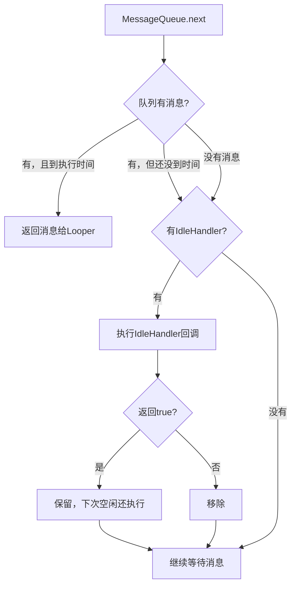
```mermaid
flowchart TD
    A[MessageQueue.next] --> B{队列有消息?}
    B -->|有，且到执行时间| C[返回消息给Looper]
    B -->|有，但还没到时间| D{有IdleHandler?}
    B -->|没有消息| D
    D -->|有| E[执行IdleHandler回调]
    E --> F{返回true?}
    F -->|是| G[保留，下次空闲还执行]
    F -->|否| H[移除]
    G --> I[继续等待消息]
    H --> I
    D -->|没有| I
```

使用IdleHandler需要注意一个重要的设计约束：**IdleHandler中的代码不能耗时太长**。因为一旦新消息到来，Looper需要尽快处理，而此时如果IdleHandler还没执行完，新消息就会被延迟。这是一个典型的**合作式调度**约束——每个参与者都要自觉地控制自己的执行时间。


## 10.设计思想总结与演进

### 10.1 核心设计模式提炼

回顾整个消息机制的设计，我们可以提炼出以下核心设计模式，这些模式不仅在消息机制中有用，在更广泛的软件设计中也有着普遍的指导意义：

| 设计模式 | 在消息机制中的应用 | 通用价值 |
|----------|-------------------|----------|
| **生产者-消费者** | 多线程发送→单线程处理 | 解耦生产和消费的速率 |
| **命令模式** | Message封装了"做什么"和"数据" | 将请求封装为对象 |
| **策略模式** | 三种消息处理方式可选 | 运行时选择算法 |
| **责任链模式** | callback→Callback→handleMessage | 请求的逐级传递和处理 |
| **模板方法模式** | dispatchMessage定义处理骨架 | 固定流程，可变步骤 |
| **门面模式** | Handler封装复杂的底层操作 | 简化子系统的使用 |
| **享元模式** | Message对象池 | 共享细粒度对象以减少开销 |
| **观察者模式** | IdleHandler监听空闲事件 | 状态变化的自动通知 |

这些模式在消息机制中不是孤立存在的，而是相互配合、有机融合的。这也是真正优秀的设计的特点——**多个简单的模式组合起来，解决一个复杂的问题，而每个模式各自承担一小部分职责**。

### 10.2 消息机制的哲学本质

如果用一句话概括消息机制的设计哲学，那就是：**用空间换时间，用串行换安全，用间接换解耦**。

**用空间换时间**：消息队列占用了额外的内存空间来存储待处理的消息，但换来了生产者和消费者可以以不同的速率工作。对象池占用了额外的内存来缓存空闲的Message对象，但换来了几乎零分配的性能。

**用串行换安全**：所有消息在目标线程上串行处理，牺牲了并行处理的可能性，但彻底消除了竞态条件、死锁等多线程问题。在UI渲染这个场景下，这个交易无比划算。

**用间接换解耦**：消息的发送者不直接调用接收者的方法，而是通过消息队列间接通信。多了一层间接性（indirection），但换来了发送者和接收者在时间、空间、实现上的完全解耦。

这三个"换"背后有一个共同的设计哲学：**没有银弹，只有权衡（trade-off）**。好的设计不是追求极致的性能、极致的安全或极致的灵活，而是在具体场景下找到最合适的平衡点。

### 10.3 从消息机制看架构演进

消息机制的设计思想，实际上是更大规模架构的缩影。从消息机制到消息中间件，从线程间通信到进程间通信再到服务间通信，核心思想是一脉相承的：

```mermaid
graph TB
    subgraph "线程级（消息机制）"
        A[Handler/Looper] --> B[线程间通信]
    end
    
    subgraph "进程级（IPC）"
        C[Binder/AIDL] --> D[进程间通信]
    end
    
    subgraph "服务级（消息中间件）"
        E[Kafka/RabbitMQ] --> F[服务间通信]
    end
    
    subgraph "系统级（事件驱动架构）"
        G[Event Sourcing/CQRS] --> H[系统间通信]
    end
    
    B --> D
    D --> F
    F --> H
    
    style A fill:#e8f5e8
    style C fill:#fff3e0
    style E fill:#e3f2fd
    style G fill:#f3e5f5
```

| 层级 | 消息体 | 消息队列 | 事件循环 | 处理器 |
|------|--------|----------|----------|--------|
| **线程级** | Message | MessageQueue | Looper | Handler |
| **进程级** | Parcel | Binder驱动缓冲区 | Binder线程池 | Service/AIDL |
| **服务级** | Event/Command | Kafka Topic | Consumer Group | Event Handler |
| **系统级** | Domain Event | Event Store | Event Processor | Saga/Process Manager |

可以看到，无论在哪个层级，都离不开"消息+队列+循环+处理器"这四个要素。理解了Handler消息机制，你就掌握了理解整个消息驱动架构的钥匙。

### 10.4 跨领域思想迁移

消息机制的设计思想可以迁移到很多看似不相关的领域：

**1. 异步化思想 → 微服务架构**

消息机制中"发送消息后立即返回"的异步思想，在微服务架构中演变为"事件驱动架构"。服务A不直接调用服务B，而是发布一个事件到消息总线，服务B订阅并处理。这种模式让服务之间完全解耦，每个服务可以独立部署、独立扩展。

**2. 对象池思想 → 数据库连接池**

Message对象池的设计思想直接迁移到了数据库连接池（HikariCP、Druid）、线程池（ThreadPoolExecutor）、HTTP连接池等场景。核心都是同一个道理：**创建成本高的对象，用完不销毁，放回池中等待下次复用**。

**3. 事件循环思想 → 游戏引擎**

游戏引擎的核心就是一个事件循环（Game Loop）：每一帧都在处理输入事件、更新游戏状态、渲染画面。Android的主线程Looper和Unity的MonoBehaviour.Update()在设计思想上是完全相同的。

**4. 串行化思想 → Redis单线程模型**

Redis选择单线程处理所有命令，和Android选择单线程处理所有UI消息是同一个设计决策。它们都发现：在特定场景下，单线程串行处理比多线程并行处理更快——因为省去了锁竞争、上下文切换的开销。Redis每秒能处理10万+命令，Android主线程能保证60fps的流畅渲染，都证明了这一设计思想的正确性。

**5. 优先级队列思想 → 操作系统调度**

消息队列按时间排序的设计，本质上是一个优先级队列（优先级=执行时间越早优先级越高）。操作系统的进程调度器也使用类似的设计：实时进程优先于普通进程，高优先级进程优先于低优先级进程。Linux的CFS（Completely Fair Scheduler）调度器使用红黑树来管理进程的执行顺序，和MessageQueue使用链表管理消息的执行顺序，是同一种"按优先级调度"的设计思想。

---

**最后总结**：消息机制看似只是一个简单的"发消息-收消息"模型，但它背后蕴含着解耦、异步、串行化、事件驱动、对象复用、分层抽象等众多经典的设计思想。这些思想的价值远超消息机制本身——它们是理解和设计所有复杂系统的基础。当你下次遇到"多个组件需要通信"的问题时，不妨想想消息机制的设计：**不要让它们直接对话，给它们一个邮箱（消息队列），让它们写信（发消息）。**


