# 05.序列化数据的思想

> 📍 **本篇位置**：第 1 卷 · 类型与抽象 · 第 5 篇
> 🎯 **核心矛盾**：**内存对象的指针图 vs 跨进程/网络/磁盘的字节流** —— 怎么把"活的对象"变成"死的字节"还能复活
> 🧭 **设计灵魂**：序列化 = **类型描述 + 字段编码 + 兼容协议**；不同方案的差别全在"用空间换可读性还是用可读性换性能"
> 🌐 **跨语言覆盖**：JSON(通用文本) · XML(强类型文本) · Protobuf(二进制 schema) · MessagePack(紧凑二进制) · Java Serializable(JVM 私有) · Hessian(跨语言二进制)
> 🔗 **延伸阅读**：← [00.数据编码设计原理](./00.数据编码设计原理.md) · → [06.数据解析设计思想](./06.数据解析设计思想.md)

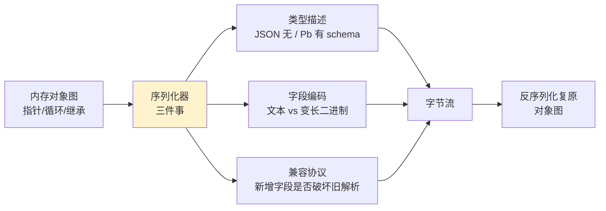

---

#### 目录介绍
- [01.为什么要序列化](#01为什么要序列化)
  - [1.1 序列化定义](#11-序列化定义)
  - [1.2 核心需求](#12-核心需求)
  - [1.3 应用场景](#13-应用场景)
- [02.序列化怎么做](#02序列化怎么做)
  - [2.1 序列化流程](#21-序列化流程)
  - [2.2 关键步骤](#22-关键步骤)
  - [2.3 核心设计原则](#23-核心设计原则)
- [03.设计方案对比](#03设计方案对比)
  - [3.1 多种方案对比](#31-多种方案对比)
  - [3.2 技术架构对比](#32-技术架构对比)
  - [3.3 基于反射序列化](#33-基于反射序列化)
  - [3.4 基于代码生成序列化](#34-基于代码生成序列化)
- [04.序列化原理](#04序列化原理)
  - [4.1 核心实现原理](#41-核心实现原理)
  - [4.2 内存布局分析](#42-内存布局分析)
  - [4.3 类型系统映射](#43-类型系统映射)
- [05.序列化数据安全](#05序列化数据安全)
  - [5.1 安全威胁模型](#51-安全威胁模型)
  - [5.2 加密保护](#52-加密保护)
  - [5.3 完整性校验](#53-完整性校验)
  - [5.4 白名单机制](#54-白名单机制)
  - [5.5 沙箱反序列化](#55-沙箱反序列化)
- [06.架构设计](#06架构设计)
  - [6.1 序列化整体架构](#61-序列化整体架构)
  - [6.2 组件设计](#62-组件设计)
  - [6.3 数据流设计](#63-数据流设计)


## 01.为什么要序列化

### 1.1 序列化定义

序列化（Serialization）是将内存中的对象状态转换为可存储或传输格式的过程。反序列化（Deserialization）则是将序列化后的数据重新转换为内存对象的过程。

### 1.2 核心需求

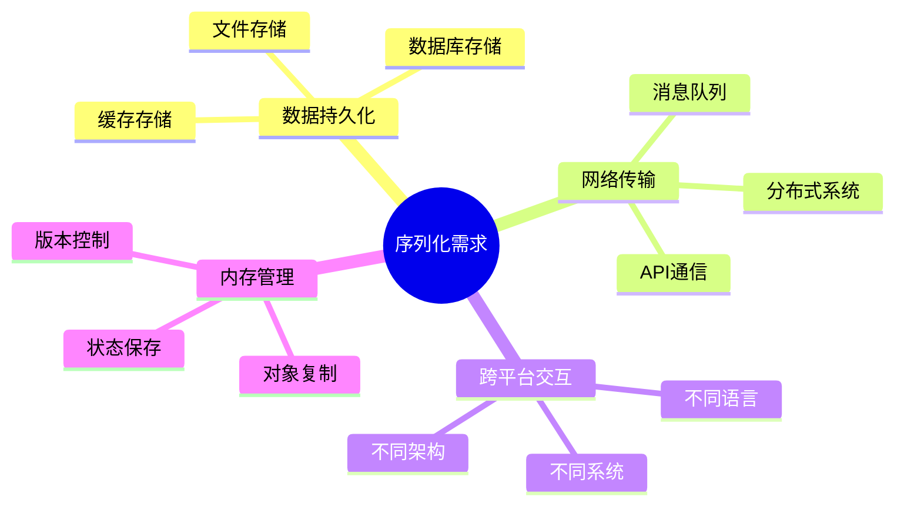

### 1.3 应用场景

| 场景 | 描述 | 示例 |
|------|------|------|
| **网络通信** | 在网络中传输复杂对象 | REST API、RPC调用 |
| **数据持久化** | 将对象保存到存储介质 | 数据库、文件系统 |
| **缓存机制** | 临时存储对象状态 | Redis、Memcached |
| **分布式系统** | 跨服务传输数据 | 微服务、消息队列 |
| **深拷贝** | 完整复制对象 | 对象克隆、状态备份 |

## 02.序列化怎么做

### 2.1 序列化流程

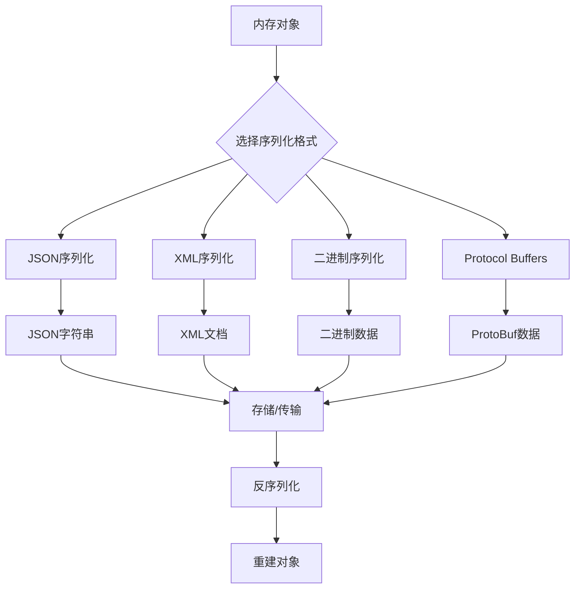

### 2.2 关键步骤

1. **对象分析**：识别对象结构和属性
2. **格式选择**：根据需求选择序列化格式
3. **数据转换**：将对象转换为目标格式
4. **数据验证**：确保序列化数据完整性
5. **存储/传输**：保存或发送序列化数据


### 2.3 核心设计原则

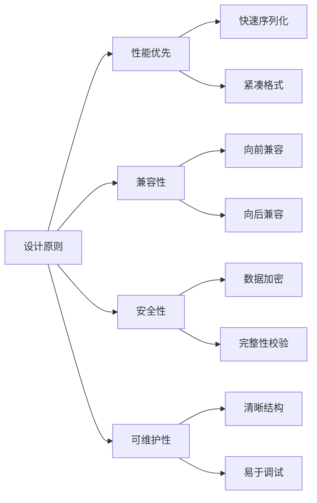

## 03.设计方案对比

### 3.1 多种方案对比

| 方案 | 优点 | 缺点 | 适用场景 |
|------|------|------|----------|
| **JSON** | 人类可读、跨语言、简单 | 体积大、类型信息丢失 | Web API、配置文件 |
| **XML** | 结构化、可扩展、标准化 | 冗余大、解析复杂 | 企业系统、配置管理 |
| **Protocol Buffers** | 高效、强类型、版本兼容 | 需要定义文件、二进制 | 微服务、高性能系统 |
| **MessagePack** | 紧凑、快速、类型保持 | 二进制格式、调试困难 | 游戏、实时系统 |
| **Avro** | Schema演进、压缩率高 | 复杂性高、学习成本 | 大数据、流处理 |

### 3.2 技术架构对比

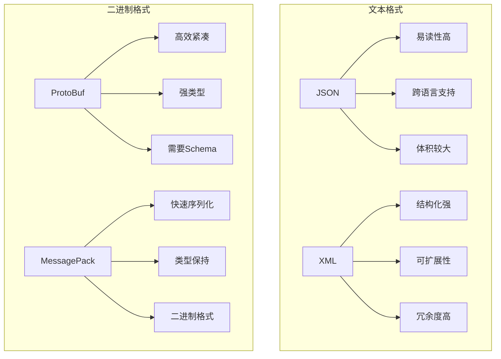

### 3.3 基于反射序列化

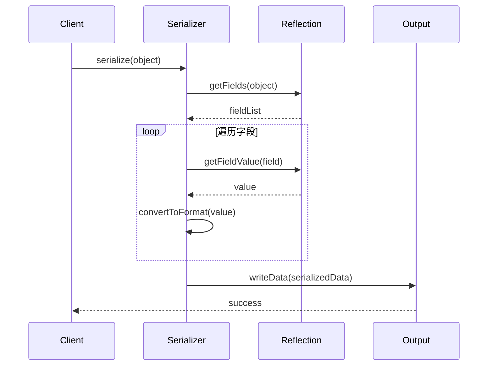

### 3.4 基于代码生成序列化

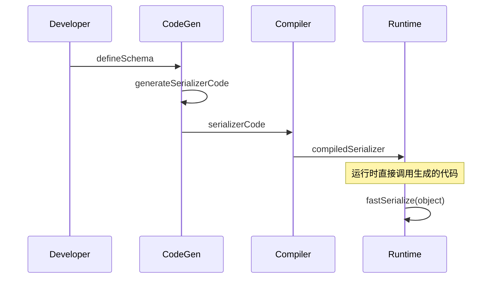

## 04.序列化原理

### 4.1 核心实现原理

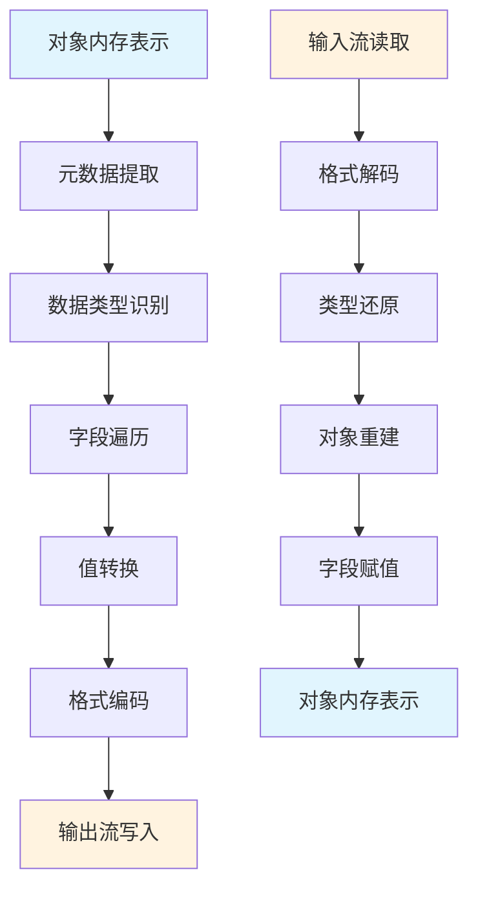

### 4.2 内存布局分析

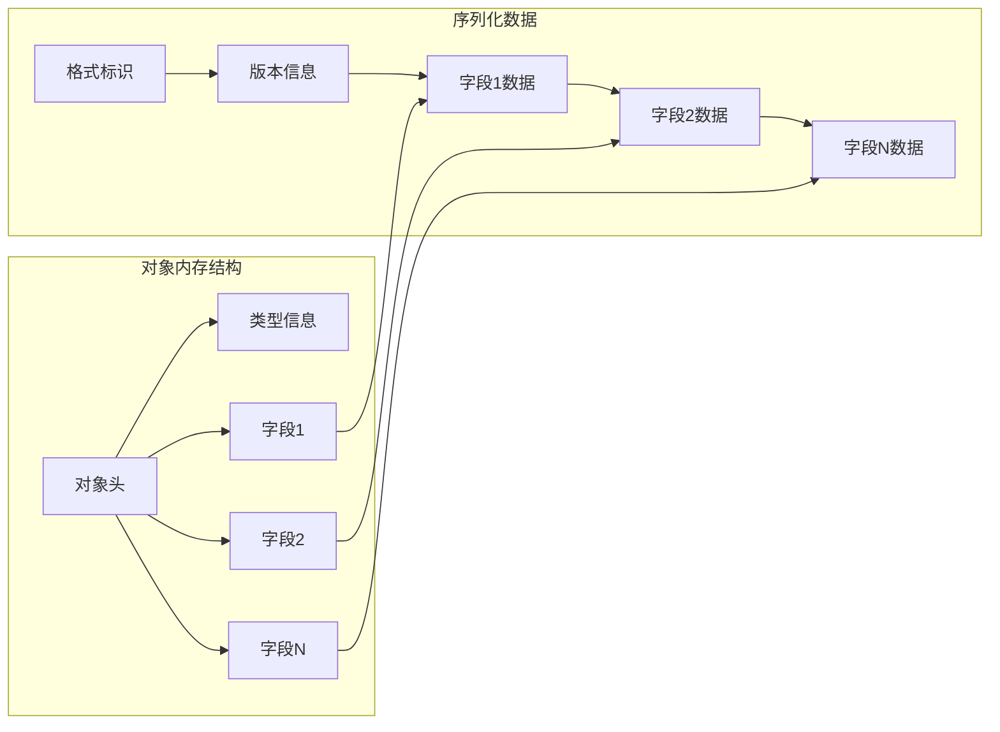

### 4.3 类型系统映射

| 源类型 | JSON | XML | ProtoBuf | MessagePack |
|--------|------|-----|----------|-------------|
| **整数** | number | text | varint | int |
| **浮点数** | number | text | fixed64 | float |
| **字符串** | string | text | string | str |
| **布尔值** | boolean | text | bool | bool |
| **数组** | array | elements | repeated | array |
| **对象** | object | element | message | map |
| **null** | null | empty | optional | nil |

## 05.序列化数据安全
### 5.1 安全威胁模型

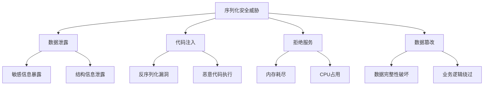

### 5.2 加密保护

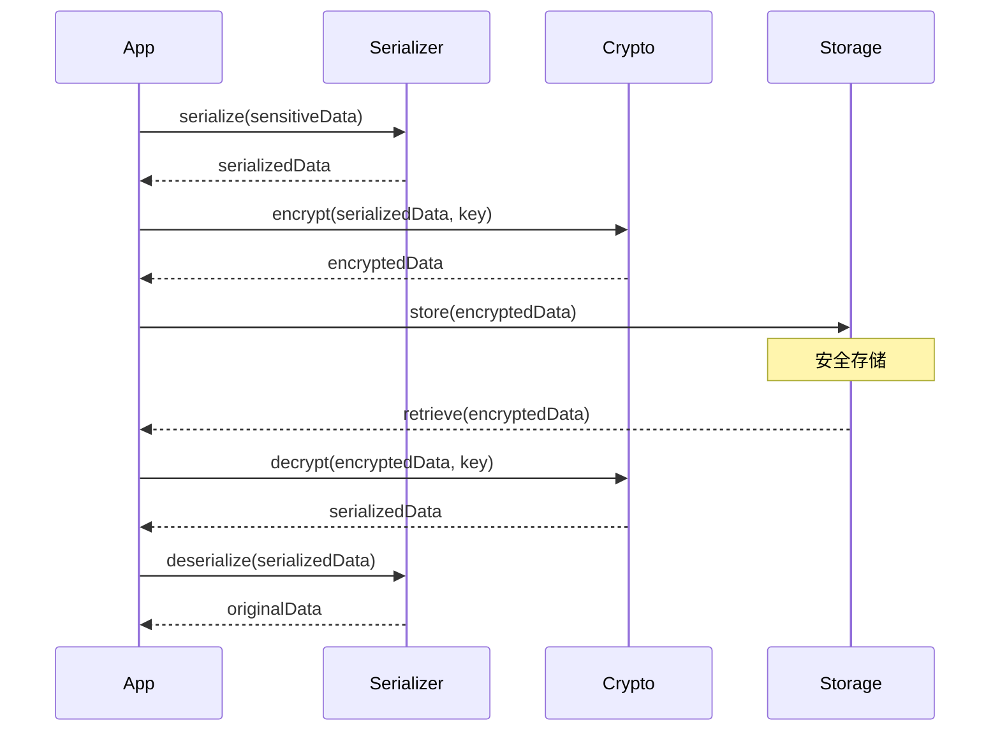

### 5.3 完整性校验

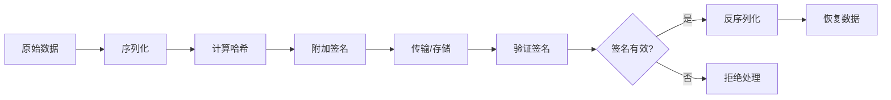


### 5.4 白名单机制

```typescript
interface SerializationWhitelist {
    allowedClasses: Set<string>;
    allowedFields: Map<string, Set<string>>;
    maxDepth: number;
    maxSize: number;
}

class SecureSerializer {
    private whitelist: SerializationWhitelist;
    
    serialize(obj: any): string {
        this.validateObject(obj);
        return this.doSerialize(obj);
    }
    
    private validateObject(obj: any, depth = 0): void {
        if (depth > this.whitelist.maxDepth) {
            throw new Error('Max depth exceeded');
        }
        
        const className = obj.constructor.name;
        if (!this.whitelist.allowedClasses.has(className)) {
            throw new Error(`Class ${className} not allowed`);
        }
    }
}
```

### 5.5 沙箱反序列化

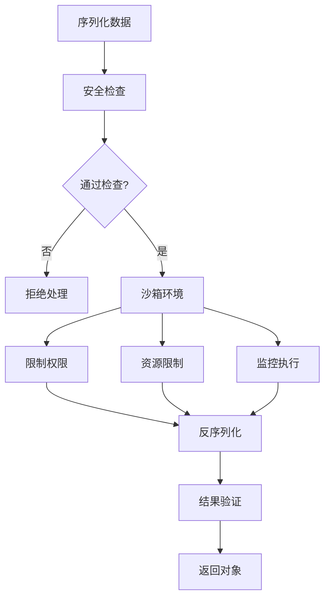

## 06.架构设计

### 6.1 序列化整体架构

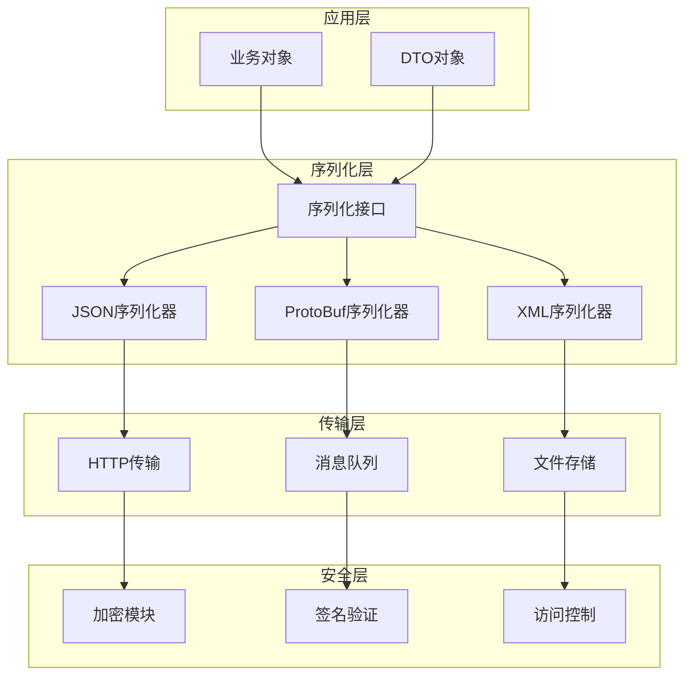

### 6.2 组件设计

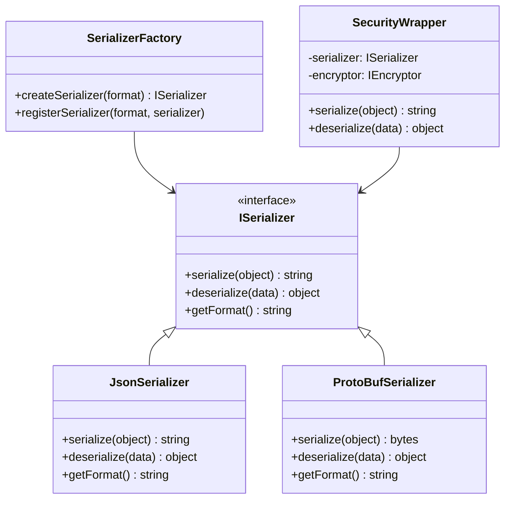

### 6.3 数据流设计

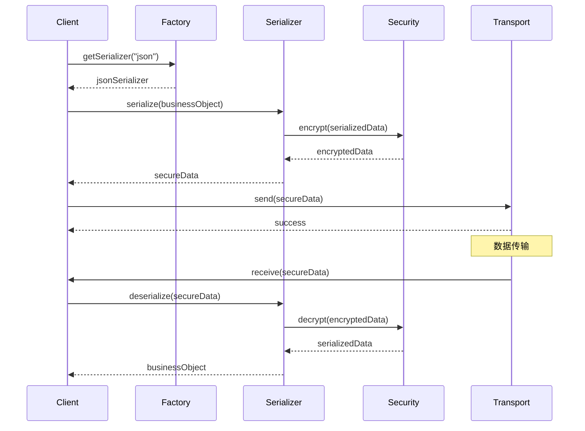


## 07.序列化性能优化

### 7.1 序列化性能影响因素

序列化和反序列化的性能取决于多个因素：

| 因素 | 影响 | 优化建议 |
|------|------|---------|
| 数据大小 | 直接影响传输和存储开销 | 选择紧凑的序列化格式 |
| 对象复杂度 | 嵌套层级深的对象序列化开销大 | 扁平化数据结构 |
| 反射开销 | 基于反射的方案性能较差 | 使用代码生成方案 |
| 编解码算法 | 文本编码比二进制编码慢 | 高性能场景使用二进制格式 |

### 7.2 各方案性能对比

```
序列化速度（越小越快）：
ProtoBuf     ████████  (~1x)
FlatBuffers  ██████    (~0.8x，零拷贝)
MessagePack  ████████████  (~1.5x)
JSON         ████████████████████  (~3-5x)
XML          ████████████████████████████  (~5-10x)

序列化大小（越小越好）：
ProtoBuf     ████████  (~1x)
FlatBuffers  ██████████  (~1.2x)
MessagePack  ████████████  (~1.5x)
JSON         ████████████████████  (~2-3x)
XML          ████████████████████████████  (~3-5x)
```

### 7.3 序列化优化实践

**1. 减少序列化数据量**

```java
// 不好的做法：序列化整个对象
@Serializable
class UserInfo {
    String name;
    String password;  // 敏感数据不应序列化
    String avatar;    // 大字段按需序列化
    List<Order> orders; // 关联数据按需加载
}

// 好的做法：只序列化必要字段
@Serializable
class UserDTO {
    String name;
    String avatarUrl; // 只传URL，不传二进制数据
}
```

**2. 使用对象池减少GC**

频繁序列化/反序列化会产生大量临时对象，使用对象池可以减少GC压力。

**3. 流式处理大数据**

对于大型数据集，不应一次性序列化到内存，而应使用流式处理：
- JSON：使用 Jackson Streaming API 或 Gson JsonReader
- ProtoBuf：使用 CodedOutputStream 分块写入
- XML：使用 SAX 或 StAX 解析器

## 08.序列化设计总结

### 8.1 序列化核心原则

1. **选择合适的格式**：根据场景选择，不要一刀切
2. **版本兼容**：设计时就考虑向前/向后兼容
3. **安全优先**：反序列化是常见的攻击向量，必须做白名单校验
4. **性能意识**：在性能敏感场景使用二进制格式

### 8.2 常见陷阱

- Java原生序列化存在严重安全漏洞（反序列化攻击），不建议在网络传输中使用
- JSON不支持二进制数据，需要Base64编码，会增加约33%的数据量
- ProtoBuf的字段编号一旦分配就不能修改，需要提前规划
- 循环引用会导致序列化栈溢出

### 8.3 技术选型建议

| 场景 | 推荐方案 | 原因 |
|------|---------|------|
| Web API | JSON | 可读性好，前端友好 |
| 微服务RPC | ProtoBuf/gRPC | 高性能，强类型 |
| 配置文件 | YAML/TOML | 可读性好，支持注释 |
| 大数据存储 | Avro/Parquet | 列式存储，压缩效率高 |
| 实时通信 | ProtoBuf/MessagePack | 低延迟，小体积 |
| 跨平台传输 | JSON/ProtoBuf | 广泛支持 |


