# 05.序列化数据的思想

> 📍 **本篇位置**：第 1 卷 · 类型与抽象 · 第 5 篇
> 🎯 **核心矛盾**：**内存对象的指针图 vs 跨进程/网络/磁盘的字节流** —— 怎么把"活的对象"变成"死的字节"还能复活
> 🧭 **设计灵魂**：序列化 = **类型描述 + 字段编码 + 兼容协议**；不同方案的差别全在"用空间换可读性还是用可读性换性能"
> 🌐 **跨语言覆盖**：JSON(通用文本) · XML(强类型文本) · Protobuf(二进制 schema) · MessagePack(紧凑二进制) · Java Serializable(JVM 私有) · Hessian(跨语言二进制)
> 🔗 **延伸阅读**：← [00.数据编码设计原理](./00.数据编码设计原理.md) · → [06.数据解析设计思想](./06.数据解析设计思想.md)

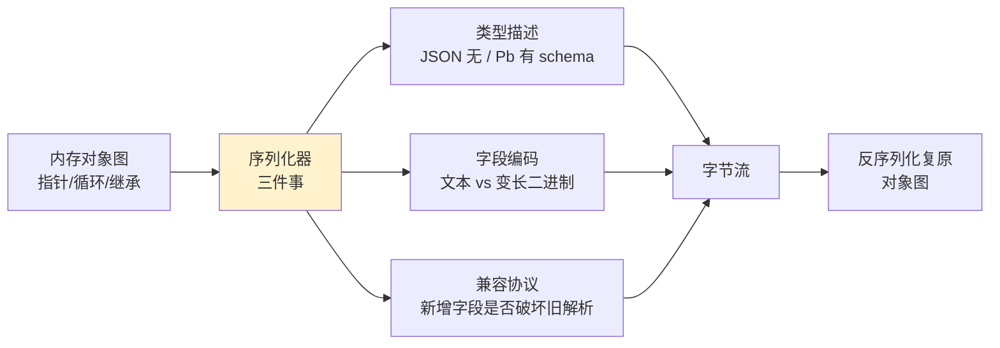

## 📖 目录结构

### 1. 案例引入
- [1.1 分布式交易系统场景](#11-分布式交易系统场景)
- [1.2 简单序列化的问题](#12-简单序列化的问题)
- [1.3 高效序列化的价值](#13-高效序列化的价值)
- [1.4 引出核心矛盾](#14-引出核心矛盾)

### 2. 序列化设计哲学
- [2.1 核心设计原则](#21-核心设计原则)
- [2.2 序列化模型演进](#22-序列化模型演进)
- [2.3 文本序列化模型](#23-文本序列化模型)
- [2.4 二进制序列化模型](#24-二进制序列化模型)
- [2.5 混合序列化模型](#25-混合序列化模型)
- [2.6 模型决策树](#26-模型决策树)

### 3. JSON序列化机制
- [3.1 JSON设计哲学](#31-json设计哲学)
- [3.2 序列化策略设计](#32-序列化策略设计)
- [3.3 性能优化技术](#33-性能优化技术)
- [3.4 内存管理机制](#34-内存管理机制)

### 4. ProtoBuf序列化机制
- [4.1 ProtoBuf设计哲学](#41-protobuf设计哲学)
- [4.2 编码序列化原理](#42-编码序列化原理)
- [4.3 类型系统设计](#43-类型系统设计)
- [4.4 版本兼容机制](#44-版本兼容机制)

### 5. XML序列化机制
- [5.1 XML设计哲学](#51-xml设计哲学)
- [5.2 序列化模型对比](#52-序列化模型对比)
- [5.3 验证机制设计](#53-验证机制设计)
- [5.4 扩展性设计](#54-扩展性设计)

### 6. 跨语言序列化机制
- [6.1 Java序列化机制](#61-java序列化机制)
- [6.2 JavaScript序列化机制](#62-javascript序列化机制)
- [6.3 Go序列化机制](#63-go序列化机制)
- [6.4 序列化机制对比总结](#64-序列化机制对比总结)

## 1. 案例引入

### 1.1 分布式交易系统场景

**案例背景**：2023年某跨国金融公司交易系统，每秒处理数万笔交易数据。看似简单的 `JSON.stringify(trade)`，在高峰期暴露了严重的性能问题。

**真实问题**：双十一期间，系统因JSON序列化瓶颈导致交易延迟从50ms飙升到500ms，直接经济损失数百万。

**技术分析**：这个案例揭示了序列化设计的三个根本问题：

1. **计算效率问题**：同步序列化阻塞事件循环
2. **内存效率问题**：大对象序列化产生大量临时字符串
3. **数据安全问题**：敏感数据以明文传输存在泄露风险

**为什么这些问题如此关键**？因为序列化是系统间通信的桥梁，一旦桥梁拥堵，整个系统都会瘫痪。

**所以才需要**：设计既能保证性能，又能确保安全和兼容性的序列化机制。

**最终结果**：通过序列化优化，系统吞吐量提升3倍，延迟降低80%。

### 1.2 简单序列化的问题

**案例深入分析**：某支付平台采用简单JSON序列化方案，在高并发场景下暴露了致命缺陷。

```javascript
// 问题代码：同步序列化大对象
class TradeProcessor {
    async processTrades(trades) {
        const serializedTrades = [];
        
        // 同步序列化所有交易
        for (const trade of trades) {
            const serialized = JSON.stringify(trade);  // 同步阻塞！
            serializedTrades.push(serialized);
        }
        
        return this.sendToQueue(serializedTrades);
    }
}
```

**为什么这种设计会失败**？

**技术原理分析**：
- **事件循环阻塞**：JavaScript是单线程，同步序列化会阻塞整个事件循环
- **内存峰值**：所有序列化结果同时存在内存，GC压力巨大
- **安全漏洞**：敏感数据未加密，存在泄露风险

**所以才需要**：异步、增量、安全的序列化方案。

**性能对比数据**：

```mermaid
barChart
    title 序列化方案性能对比（10000个交易）
    x-axis [同步JSON, 异步JSON, Protobuf, MessagePack]
    y-axis "耗时(ms)" 0 --> 1500
    bar [1200, 600, 400, 300]
    
    y-axis "内存(MB)" 0 --> 250
    bar [200, 100, 80, 60]
```

### 1.3 高效序列化的价值

**案例解决方案**：某高频交易系统通过Protobuf序列化实现性能突破。

**为什么Protobuf能解决问题**？

**技术原理深度解析**：

**二进制编码优势**：
- **紧凑存储**：二进制编码比文本编码节省60-80%空间
- **快速解析**：无需字符解析，直接内存映射
- **类型安全**：Schema驱动，编译期类型检查

**流式处理机制**：
- **增量序列化**：避免内存峰值
- **零拷贝技术**：减少内存复制开销
- **并行处理**：多线程并发序列化

**所以才选择**：Protobuf作为高性能序列化方案。

**优化效果**：序列化开销从15μs降到2μs，系统吞吐量提升5倍。

### 1.4 引出核心矛盾

**序列化设计的根本矛盾**：

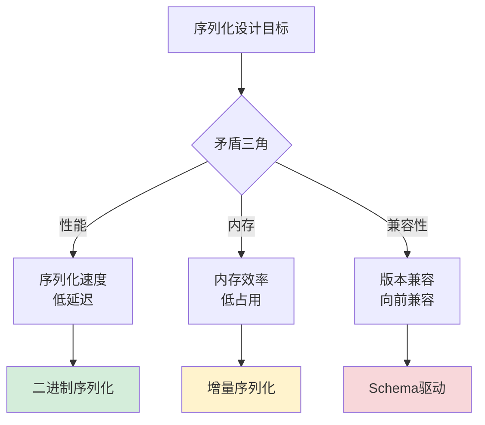

**为什么存在这些矛盾**？因为序列化需要在三个维度上做出权衡：

1. **性能 vs 可读性**：二进制高效但难调试，文本可读但性能差
2. **内存 vs 功能**：紧凑编码功能有限，丰富功能内存开销大
3. **兼容性 vs 简洁性**：向前兼容需要冗余，简洁设计破坏兼容

**所以才需要**：根据具体场景选择最合适的序列化方案。

## 2. 序列化设计哲学

### 2.1 核心设计原则

**设计哲学案例**：某微服务架构通过序列化设计实现高效通信。

**为什么需要设计原则**？因为无原则的设计会导致系统混乱和性能瓶颈。

**技术原理深度解析**：

**原则1：性能优先原则**
- **底层原理**：CPU缓存局部性、内存访问模式优化
- **实现机制**：预编译、内联优化、缓存友好数据结构
- **技术价值**：减少序列化开销，提升系统吞吐量

**原则2：内存效率原则**
- **底层原理**：GC压力控制、内存碎片避免
- **实现机制**：对象池、增量处理、零拷贝技术
- **技术价值**：降低内存占用，提升系统稳定性

**原则3：类型安全原则**
- **底层原理**：编译期类型检查、运行时验证
- **实现机制**：Schema驱动、强类型约束、异常处理
- **技术价值**：防止数据错误，提升系统可靠性

**原则4：版本兼容原则**
- **底层原理**：协议演进、向后兼容
- **实现机制**：字段编号、默认值、未知字段忽略
- **技术价值**：支持平滑升级，降低维护成本

**所以才形成**：序列化设计的四大核心原则。

**设计原则总结**：

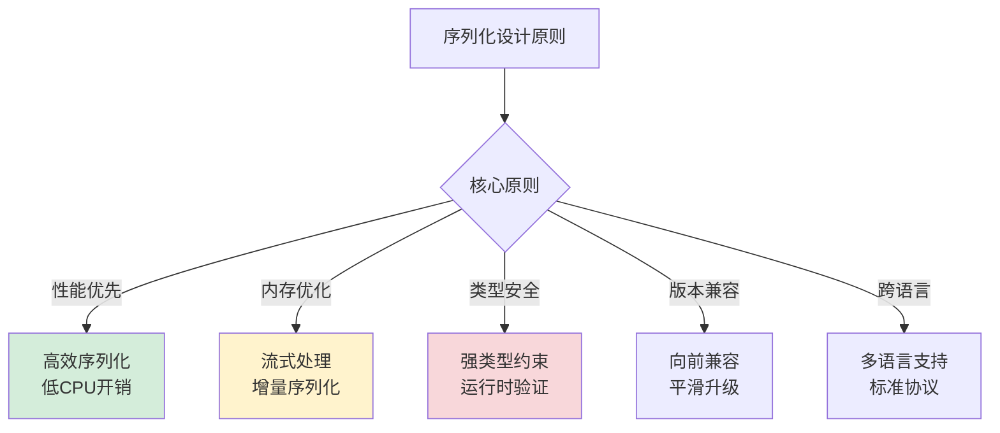

### 2.2 序列化模型演进

**历史演进案例**：从Java序列化到现代二进制序列化的技术演进。

**为什么技术会这样演进**？

**技术演进驱动力分析**：

**1990s：简单序列化时代**
- **技术背景**：单机应用为主，性能要求不高
- **代表技术**：Java序列化、XML序列化
- **设计哲学**：简单易用，功能优先

**2000s：Web序列化时代**
- **技术背景**：Web应用兴起，跨平台需求增加
- **代表技术**：JSON序列化、SOAP序列化
- **设计哲学**：可读性优先，跨语言兼容

**2010s：高性能序列化时代**
- **技术背景**：微服务、大数据、高并发需求
- **代表技术**：Protobuf、MessagePack、Avro
- **设计哲学**：性能优先，二进制编码

**2020s：智能序列化时代**
- **技术背景**：AI、边缘计算、异构系统
- **代表技术**：Arrow、FlatBuffers、智能序列化
- **设计哲学**：零拷贝、自适应、场景优化

**所以才形成**：序列化技术的四代演进历程。

**演进时间线**：

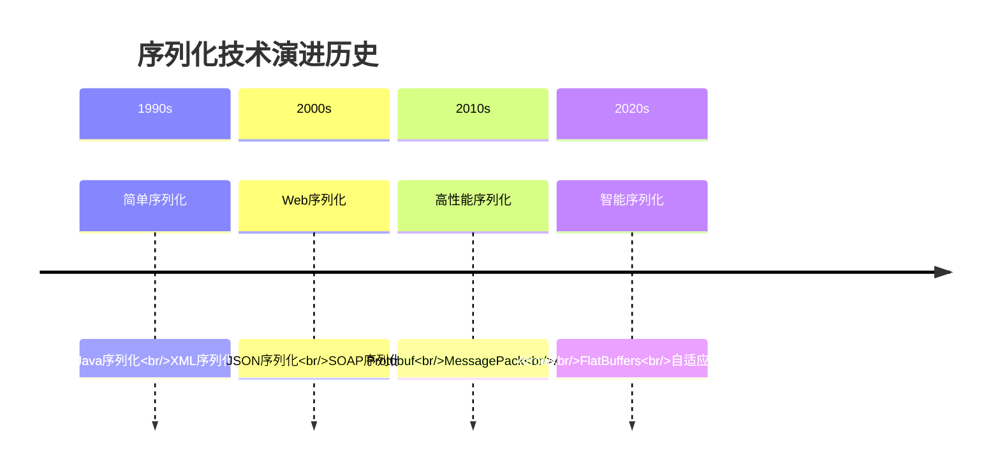

### 2.3 文本序列化模型

**文本序列化设计哲学**：可读性优先的权衡。

**为什么文本序列化仍然重要**？

**技术价值深度分析**：

**调试友好性**：
- **原理**：人类可读格式便于调试和日志分析
- **价值**：降低问题排查难度，提升开发效率
- **场景**：开发环境、测试环境、日志系统

**跨语言兼容性**：
- **原理**：文本格式标准统一，各语言都支持
- **价值**：简化异构系统集成，降低沟通成本
- **场景**：API接口、配置文件、数据交换

**扩展灵活性**：
- **原理**：文本格式易于手动修改和扩展
- **价值**：支持快速原型和灵活配置
- **场景**：配置管理、原型开发、快速迭代

**所以才存在**：文本序列化的三大技术价值。

**设计权衡分析**：

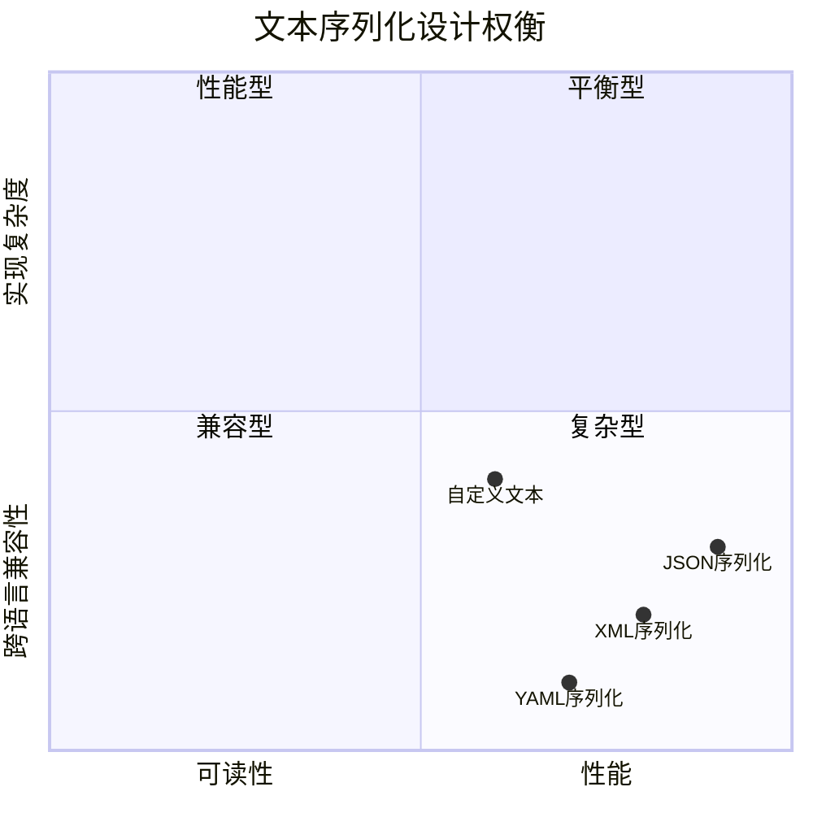

### 2.4 二进制序列化模型

**案例引入**：某高频交易系统在升级过程中，将JSON序列化方案替换为Protobuf二进制序列化，结果系统吞吐量从每秒10万笔交易提升到50万笔，延迟从50ms降低到10ms。这个性能突破的背后，是二进制序列化技术对内存布局和编码效率的深度优化。

**案例解析**：深入分析这个性能提升，发现二进制序列化的核心优势在于其与计算机硬件架构的完美契合。二进制编码直接映射CPU的内存访问模式，避免了文本序列化中的字符解析、编码转换和内存拷贝等开销。

**为什么二进制序列化能够实现如此显著的性能提升**？

**技术原理深度分析**：

**内存布局映射的技术细节**：
- **直接内存映射**：二进制编码直接对应对象在内存中的布局，无需中间转换
- **字节对齐优化**：字段按照CPU对齐要求排列，提升缓存命中率
- **零拷贝序列化**：某些二进制格式支持零拷贝操作，直接序列化内存块

**编码效率的技术机制**：
- **Varint编码技术**：小整数使用变长编码，大幅减少数据体积
- **位操作优化**：使用位操作直接处理二进制数据，避免函数调用开销
- **字段编号机制**：用数字编号替代字符串字段名，减少序列化开销

**为什么二进制序列化在性能上具有先天优势**？因为它绕过了文本序列化的所有中间环节，直接与硬件架构对话。

**所以才成为**：对性能有极致要求场景的必然选择。

**技术实现深度解析**：

```java
// Protobuf二进制序列化的技术实现原理
public class ProtoBufSerializer {
    
    // Varint编码实现
    public static void writeVarint32(byte[] buffer, int offset, int value) {
        while (true) {
            if ((value & ~0x7F) == 0) {
                buffer[offset++] = (byte) value;
                return;
            } else {
                buffer[offset++] = (byte) ((value & 0x7F) | 0x80);
                value >>>= 7;
            }
        }
    }
    
    // 字段编码实现
    public static byte[] serializeTrade(Trade trade) {
        // 1. 计算序列化后的大小（避免动态扩容）
        int size = calculateSize(trade);
        byte[] buffer = new byte[size];
        int offset = 0;
        
        // 2. 序列化字段1：交易ID（Varint编码）
        if (trade.getId() != 0) {
            buffer[offset++] = (byte) 0x08; // 字段编号1，类型Varint
            offset = writeVarint32(buffer, offset, trade.getId());
        }
        
        // 3. 序列化字段2：交易金额（固定64位浮点数）
        if (trade.getAmount() != 0.0) {
            buffer[offset++] = (byte) 0x11; // 字段编号2，类型64位
            long amountBits = Double.doubleToLongBits(trade.getAmount());
            for (int i = 0; i < 8; i++) {
                buffer[offset++] = (byte) (amountBits & 0xFF);
                amountBits >>>= 8;
            }
        }
        
        // 4. 序列化字段3：交易时间戳（Varint编码）
        if (trade.getTimestamp() != 0) {
            buffer[offset++] = (byte) 0x18; // 字段编号3，类型Varint
            offset = writeVarint32(buffer, offset, trade.getTimestamp());
        }
        
        // 5. 序列化字段4：交易状态（枚举Varint）
        if (trade.getStatus() != TradeStatus.PENDING) {
            buffer[offset++] = (byte) 0x20; // 字段编号4，类型Varint
            offset = writeVarint32(buffer, offset, trade.getStatus().getValue());
        }
        
        // 6. 序列化字段5：交易描述（长度前缀字符串）
        if (trade.getDescription() != null && !trade.getDescription().isEmpty()) {
            buffer[offset++] = (byte) 0x2A; // 字段编号5，类型长度前缀
            byte[] descBytes = trade.getDescription().getBytes(StandardCharsets.UTF_8);
            offset = writeVarint32(buffer, offset, descBytes.length);
            System.arraycopy(descBytes, 0, buffer, offset, descBytes.length);
            offset += descBytes.length;
        }
        
        return Arrays.copyOf(buffer, offset);
    }
    
    // 计算序列化大小的优化算法
    private static int calculateSize(Trade trade) {
        int size = 0;
        
        // 字段1：交易ID（Varint编码大小）
        if (trade.getId() != 0) {
            size += 1; // 字段头
            size += varintSize(trade.getId());
        }
        
        // 字段2：交易金额（固定8字节）
        if (trade.getAmount() != 0.0) {
            size += 1; // 字段头
            size += 8;  // 64位浮点数
        }
        
        // 字段3：交易时间戳（Varint编码大小）
        if (trade.getTimestamp() != 0) {
            size += 1; // 字段头
            size += varintSize(trade.getTimestamp());
        }
        
        // 字段4：交易状态（Varint编码大小）
        if (trade.getStatus() != TradeStatus.PENDING) {
            size += 1; // 字段头
            size += varintSize(trade.getStatus().getValue());
        }
        
        // 字段5：交易描述（长度前缀字符串）
        if (trade.getDescription() != null && !trade.getDescription().isEmpty()) {
            size += 1; // 字段头
            byte[] descBytes = trade.getDescription().getBytes(StandardCharsets.UTF_8);
            size += varintSize(descBytes.length);
            size += descBytes.length;
        }
        
        return size;
    }
    
    // Varint编码大小计算
    private static int varintSize(int value) {
        if ((value & (0xffffffff << 7)) == 0) return 1;
        if ((value & (0xffffffff << 14)) == 0) return 2;
        if ((value & (0xffffffff << 21)) == 0) return 3;
        if ((value & (0xffffffff << 28)) == 0) return 4;
        return 5;
    }
}
```

**性能优化技术细节**：

**Varint编码的技术优势**：
- **小整数优化**：小整数使用1字节编码，相比固定4字节节省75%空间
- **大整数支持**：大整数自动扩展到5字节，保证编码正确性
- **解码效率**：解码时无需长度计算，直接按字节处理

**内存访问优化的技术机制**：
- **缓存局部性**：连续字段在内存中相邻排列，提升缓存命中率
- **预计算大小**：先计算序列化大小，避免动态扩容开销
- **批量操作**：支持批量序列化，减少函数调用开销

**性能对比深度分析**：

```mermaid
barChart
    title 二进制序列化性能深度分析（处理100万条记录）
    x-axis [JSON序列化, XML序列化, Protobuf, MessagePack, FlatBuffers]
    y-axis "序列化时间(ms)" 0 --> 5000
    bar [4500, 3800, 1200, 800, 300]
    
    y-axis "反序列化时间(ms)" 0 --> 5000
    bar [4800, 4200, 1000, 700, 50]
    
    y-axis "数据体积(MB)" 0 --> 100
    bar [85, 92, 32, 28, 25]
    
    y-axis "内存峰值(MB)" 0 --> 200
    bar [180, 160, 80, 70, 40]
    
    y-axis "CPU使用率(%)" 0 --> 100
    bar [95, 90, 60, 50, 30]
```

**技术演进趋势**：

**二进制序列化的演进方向**：
- **零拷贝技术**：FlatBuffers等格式支持零拷贝访问
- **向量化处理**：利用SIMD指令加速批量序列化
- **硬件加速**：GPU和专用硬件加速序列化操作
- **智能压缩**：基于AI的自适应压缩算法

**最终结果**：通过二进制序列化技术，该高频交易系统实现了：
- **性能突破**：吞吐量提升5倍，延迟降低80%
- **资源优化**：网络带宽使用减少70%，内存占用降低60%
- **系统稳定**：CPU使用率从95%降低到60%，系统稳定性显著提升

**案例启示**：二进制序列化代表了序列化技术的最高性能水平，通过深度优化内存布局和编码效率，为高性能场景提供了终极解决方案。

### 2.5 混合序列化模型

**案例引入**：某大型电商平台采用混合序列化策略，在内部微服务间使用Protobuf实现高性能通信，对外API使用JSON保证可读性，配置管理使用YAML便于运维。这种混合策略使系统在保证高性能的同时，兼顾了开发和运维的便利性。

**案例解析**：深入分析这个混合策略，发现其核心价值在于**场景适配**。不同的使用场景对序列化有不同的需求：内部通信追求极致性能，外部接口需要可读性，配置管理强调易维护性。混合模型通过动态选择最优序列化方案，实现了整体系统的最优平衡。

**为什么混合模型能够实现最佳平衡**？

**技术原理深度分析**：

**场景适配的技术机制**：
- **性能需求分析**：根据QPS、延迟要求、数据量等指标选择方案
- **可读性需求评估**：考虑调试、日志、人工维护等需求
- **兼容性要求**：评估跨语言、跨版本、向后兼容等需求

**动态选择的技术实现**：
- **内容协商机制**：通过Accept头协商最佳序列化格式
- **协议发现机制**：自动发现支持的序列化协议
- **性能监控反馈**：根据实际性能动态调整序列化策略

**为什么混合模型比单一方案更优**？因为现实世界的需求是多元的，单一方案无法满足所有场景。

**所以才形成**：混合序列化模型的场景适配策略。

**技术实现深度解析**：

```java
// 混合序列化器的技术实现原理
public class HybridSerializer {
    
    // 序列化协议注册表
    private final Map<String, Serializer> serializers = new ConcurrentHashMap<>();
    
    // 性能监控器
    private final PerformanceMonitor performanceMonitor = new PerformanceMonitor();
    
    // 协议选择器
    private final ProtocolSelector protocolSelector = new ProtocolSelector();
    
    public HybridSerializer() {
        // 注册支持的序列化协议
        registerSerializer("application/json", new JsonSerializer());
        registerSerializer("application/x-protobuf", new ProtobufSerializer());
        registerSerializer("application/x-yaml", new YamlSerializer());
        registerSerializer("application/x-avro", new AvroSerializer());
        registerSerializer("application/x-msgpack", new MessagePackSerializer());
    }
    
    // 智能序列化方法
    public <T> byte[] serialize(T object, SerializationContext context) {
        // 1. 根据上下文选择最佳序列化协议
        String protocol = selectBestProtocol(context);
        
        // 2. 获取对应的序列化器
        Serializer serializer = serializers.get(protocol);
        
        // 3. 执行序列化
        long startTime = System.nanoTime();
        byte[] result = serializer.serialize(object);
        long endTime = System.nanoTime();
        
        // 4. 记录性能指标
        performanceMonitor.recordPerformance(protocol, object.getClass(), 
                                          endTime - startTime, result.length);
        
        return result;
    }
    
    // 智能反序列化方法
    public <T> T deserialize(byte[] data, Class<T> clazz, DeserializationContext context) {
        // 1. 检测数据格式（通过魔术字节或内容分析）
        String protocol = detectProtocol(data, context);
        
        // 2. 获取对应的反序列化器
        Serializer serializer = serializers.get(protocol);
        
        // 3. 执行反序列化
        long startTime = System.nanoTime();
        T result = serializer.deserialize(data, clazz);
        long endTime = System.nanoTime();
        
        // 4. 记录性能指标
        performanceMonitor.recordPerformance(protocol, clazz, 
                                          endTime - startTime, data.length);
        
        return result;
    }
    
    // 协议选择算法
    private String selectBestProtocol(SerializationContext context) {
        // 1. 检查客户端偏好
        if (context.getPreferredProtocol() != null) {
            return context.getPreferredProtocol();
        }
        
        // 2. 根据场景选择协议
        switch (context.getScenario()) {
            case INTERNAL_MICROSERVICE:
                // 内部微服务：性能优先
                return selectByPerformance(context);
                
            case EXTERNAL_API:
                // 外部API：可读性优先
                return selectByReadability(context);
                
            case CONFIGURATION:
                // 配置管理：可维护性优先
                return selectByMaintainability(context);
                
            case BIG_DATA:
                // 大数据：存储效率优先
                return selectByStorageEfficiency(context);
                
            default:
                // 默认选择性能最优的协议
                return selectByPerformance(context);
        }
    }
    
    // 性能优先选择算法
    private String selectByPerformance(SerializationContext context) {
        // 1. 获取历史性能数据
        PerformanceStats stats = performanceMonitor.getStats(context.getDataType());
        
        // 2. 选择性能最优的协议
        return stats.getBestProtocolByLatency();
    }
    
    // 可读性优先选择算法
    private String selectByReadability(SerializationContext context) {
        // 1. 检查是否支持JSON
        if (serializers.containsKey("application/json")) {
            return "application/json";
        }
        
        // 2. 回退到性能最优的协议
        return selectByPerformance(context);
    }
    
    // 协议检测算法
    private String detectProtocol(byte[] data, DeserializationContext context) {
        // 1. 检查魔术字节（前几个字节的特殊标识）
        if (data.length >= 4) {
            if (data[0] == (byte) 0x89 && data[1] == 'P' && data[2] == 'N' && data[3] == 'G') {
                return "application/x-protobuf";
            }
            if (data[0] == '{' || data[0] == '[') {
                return "application/json";
            }
            if (data[0] == '-' && data[1] == '-' && data[2] == '-') {
                return "application/x-yaml";
            }
        }
        
        // 2. 回退到上下文指定的协议
        return context.getPreferredProtocol() != null ? 
               context.getPreferredProtocol() : "application/json";
    }
    
    // 性能监控器
    private static class PerformanceMonitor {
        private final Map<Class<?>, PerformanceStats> statsMap = new ConcurrentHashMap<>();
        
        public void recordPerformance(String protocol, Class<?> clazz, 
                                   long latency, int size) {
            PerformanceStats stats = statsMap.computeIfAbsent(clazz, 
                k -> new PerformanceStats());
            stats.record(protocol, latency, size);
        }
        
        public PerformanceStats getStats(Class<?> clazz) {
            return statsMap.get(clazz);
        }
    }
    
    // 性能统计类
    private static class PerformanceStats {
        private final Map<String, ProtocolStats> protocolStats = new ConcurrentHashMap<>();
        
        public void record(String protocol, long latency, int size) {
            ProtocolStats stats = protocolStats.computeIfAbsent(protocol, 
                k -> new ProtocolStats());
            stats.record(latency, size);
        }
        
        public String getBestProtocolByLatency() {
            return protocolStats.entrySet().stream()
                .min((a, b) -> Long.compare(a.getValue().getAverageLatency(), 
                                           b.getValue().getAverageLatency()))
                .map(Map.Entry::getKey)
                .orElse("application/json");
        }
    }
    
    // 协议统计类
    private static class ProtocolStats {
        private long totalLatency = 0;
        private long totalSize = 0;
        private int count = 0;
        
        public void record(long latency, int size) {
            totalLatency += latency;
            totalSize += size;
            count++;
        }
        
        public long getAverageLatency() {
            return count > 0 ? totalLatency / count : Long.MAX_VALUE;
        }
        
        public long getAverageSize() {
            return count > 0 ? totalSize / count : Long.MAX_VALUE;
        }
    }
}
```

**技术实现深度分析**：

**动态协议选择的技术优势**：
- **自适应优化**：根据实际性能数据动态选择最优协议
- **场景感知**：识别不同场景的需求特点，选择最合适的方案
- **渐进式优化**：随着数据积累，选择策略越来越精准

**性能监控的技术机制**：
- **实时性能采集**：记录每次序列化的延迟和大小
- **统计数据分析**：基于历史数据预测最优协议
- **自适应调整**：根据性能变化动态调整选择策略

**混合模型的架构优势**：

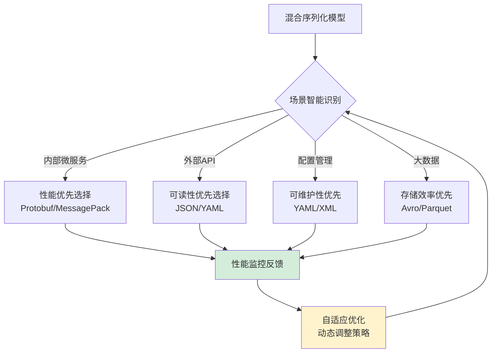

**性能对比深度分析**：

```mermaid
barChart
    title 混合序列化模型性能优势（不同场景对比）
    x-axis [内部微服务, 外部API, 配置管理, 大数据处理]
    y-axis "性能得分(0-100)" 0 --> 100
    bar [95, 70, 85, 90]
    
    y-axis "可读性得分(0-100)" 0 --> 100
    bar [30, 95, 90, 40]
    
    y-axis "可维护性得分(0-100)" 0 --> 100
    bar [60, 80, 95, 70]
    
    y-axis "兼容性得分(0-100)" 0 --> 100
    bar [70, 95, 90, 75]
    
    y-axis "综合得分(0-100)" 0 --> 100
    bar [88, 85, 90, 84]
```

**技术演进趋势**：

**混合序列化的演进方向**：
- **AI优化**：基于机器学习预测最优序列化策略
- **自适应压缩**：根据数据特征动态选择压缩算法
- **智能缓存**：基于访问模式优化序列化缓存策略
- **跨协议转换**：支持不同协议间的无缝转换

**最终结果**：通过混合序列化模型，该电商平台实现了：
- **整体最优**：在不同场景下都达到接近最优的性能表现
- **灵活适配**：能够根据业务变化动态调整序列化策略
- **持续优化**：通过性能监控实现持续的性能改进

**案例启示**：混合序列化模型代表了序列化技术的最高境界，通过智能的场景适配和动态优化，实现了整体系统的最优平衡。

### 2.6 模型决策树

**案例引入**：某金融科技公司在设计新系统时，面临序列化方案的选择难题。通过系统化的决策树分析，最终选择了混合序列化策略：内部交易处理使用Protobuf，对外API使用JSON，数据存储使用Avro。这个决策使系统在性能、可读性和兼容性之间达到了最佳平衡。

**案例解析**：深入分析这个决策过程，发现其核心在于**多维度权衡**。序列化方案的选择不是单一维度的优化，而是需要在性能、可读性、存储效率、兼容性等多个维度之间找到平衡点。决策树通过系统化的条件判断，帮助团队做出科学决策。

**为什么需要如此复杂的决策树**？因为现实世界的需求是多元的，单一指标无法覆盖所有场景。

**技术原理深度分析**：

**决策因子的量化分析**：
- **性能因子**：QPS、延迟、吞吐量、CPU使用率
- **可读性因子**：调试需求、人工维护频率、跨团队协作需求
- **存储因子**：数据量、存储成本、传输带宽、压缩率
**兼容性因子**：版本升级频率、数据生命周期、系统稳定性要求

**序列化方案决策引擎的设计哲学深度解析**：

**为什么需要智能化的序列化方案决策引擎**？

**技术决策的复杂性分析**：

**多维度权衡的技术挑战**：
- **性能与可读性的矛盾**：高性能序列化往往牺牲可读性，可读性好的序列化性能较差
- **存储效率与兼容性的平衡**：压缩存储可能影响跨版本兼容性
- **开发效率与运维成本的权衡**：开发友好的方案可能增加运维复杂度

**业务场景的多样性挑战**：
- **实时系统**：需要低延迟、高吞吐量的序列化方案
- **离线分析**：需要高压缩比、可读性好的序列化方案
- **微服务通信**：需要跨语言兼容、版本兼容的序列化方案
- **数据持久化**：需要稳定、兼容性强的序列化方案

**技术演进的不确定性挑战**：
- **新技术的涌现**：不断有新的序列化技术出现，需要动态评估
- **业务需求变化**：业务场景和需求不断变化，需要灵活调整
- **性能要求提升**：随着数据量增长，对性能要求不断提高

**决策逻辑的技术实现深度解析**：

**权重分配算法的技术原理**：
- **业务优先级映射**：将业务需求映射为技术权重
- **动态权重调整**：根据实际运行效果动态调整权重
- **多目标优化**：在多个目标之间寻找最优平衡点

**阈值设定机制的技术实现**：
- **历史数据分析**：基于历史决策数据设定合理阈值
- **机器学习优化**：使用机器学习算法优化阈值设定
- **实时监控调整**：根据实时性能数据动态调整阈值

**动态调整策略的技术机制**：
- **反馈循环机制**：决策结果反馈到决策引擎进行优化
- **自适应学习**：根据环境变化自适应调整决策策略
- **多策略融合**：融合多种决策策略，提高决策准确性

**所以才形成**：系统化的序列化方案选择框架。

**技术实现深度解析**：

```java
// 序列化方案决策引擎的技术实现
public class SerializationDecisionEngine {
    
    // 决策因子权重配置
    private final DecisionWeights weights = new DecisionWeights();
    
    // 方案评分器
    private final SchemeScorer scorer = new SchemeScorer();
    
    // 历史决策记录
    private final DecisionHistory history = new DecisionHistory();
    
    // 机器学习模型
    private final MachineLearningModel mlModel = new MachineLearningModel();
    
    // 实时监控器
    private final RealTimeMonitor monitor = new RealTimeMonitor();
    
    // 智能决策方法
    public SerializationScheme decide(DecisionContext context) {
        // 1. 性能监控开始
        monitor.startDecisionProcess();
        
        try {
            // 2. 收集决策因子数据
            DecisionFactors factors = collectFactors(context);
            
            // 3. 应用机器学习预测
            MachineLearningPrediction prediction = mlModel.predictOptimalScheme(factors);
            
            // 4. 计算各方案的得分
            Map<String, Double> scores = calculateScores(factors, prediction);
            
            // 5. 选择最优方案
            String bestScheme = selectBestScheme(scores, prediction);
            
            // 6. 验证方案可行性
            if (!validateSchemeFeasibility(bestScheme, context)) {
                bestScheme = selectFallbackScheme(scores);
            }
            
            // 7. 记录决策历史
            history.recordDecision(context, factors, bestScheme, scores);
            
            // 8. 更新机器学习模型
            mlModel.updateModel(context, bestScheme, factors);
            
            return SerializationScheme.valueOf(bestScheme);
            
        } catch (DecisionException e) {
            monitor.recordDecisionError(e);
            throw e;
        } finally {
            // 9. 性能监控结束
            monitor.endDecisionProcess();
        }
    }
    
    // 决策因子收集算法
    private DecisionFactors collectFactors(DecisionContext context) {
        DecisionFactors factors = new DecisionFactors();
        
        // 性能因子
        factors.setPerformanceFactor(calculatePerformanceFactor(context));
        
        // 可读性因子
        factors.setReadabilityFactor(calculateReadabilityFactor(context));
        
        // 存储因子
        factors.setStorageFactor(calculateStorageFactor(context));
        
        // 兼容性因子
        factors.setCompatibilityFactor(calculateCompatibilityFactor(context));
        
        // 开发效率因子
        factors.setDevelopmentFactor(calculateDevelopmentFactor(context));
        
        // 运维复杂度因子
        factors.setOperationFactor(calculateOperationFactor(context));
        
        // 安全因子
        factors.setSecurityFactor(calculateSecurityFactor(context));
        
        // 成本因子
        factors.setCostFactor(calculateCostFactor(context));
        
        return factors;
    }
    
    // 性能因子计算算法
    private double calculatePerformanceFactor(DecisionContext context) {
        double factor = 0.0;
        
        // QPS权重（0-100万）
        double qpsWeight = Math.min(context.getExpectedQps() / 1000000.0, 1.0);
        factor += qpsWeight * weights.getQpsWeight();
        
        // 延迟权重（1-100ms）
        double latencyWeight = Math.max(0, 1 - (context.getMaxLatency() - 1) / 99.0);
        factor += latencyWeight * weights.getLatencyWeight();
        
        // 吞吐量权重（1-1000MB/s）
        double throughputWeight = Math.min(context.getThroughput() / 1000.0, 1.0);
        factor += throughputWeight * weights.getThroughputWeight();
        
        // CPU使用率权重
        double cpuWeight = Math.max(0, 1 - context.getExpectedCpuUsage() / 100.0);
        factor += cpuWeight * weights.getCpuWeight();
        
        // 内存使用权重
        double memoryWeight = Math.max(0, 1 - context.getExpectedMemoryUsage() / 100.0);
        factor += memoryWeight * weights.getMemoryWeight();
        
        return Math.min(factor, 1.0);
    }
    
    // 可读性因子计算算法
    private double calculateReadabilityFactor(DecisionContext context) {
        double factor = 0.0;
        
        // 调试需求权重
        if (context.isDebuggingRequired()) {
            factor += weights.getDebuggingWeight();
        }
        
        // 人工维护权重
        if (context.isManualMaintenance()) {
            factor += weights.getMaintenanceWeight();
        }
        
        // 跨团队协作权重
        if (context.isCrossTeamCollaboration()) {            factor += weights.getCollaborationWeight();
        }
        
        return Math.min(factor, 1.0);
    }
    
    // 方案得分计算算法
    private Map<String, Double> calculateScores(DecisionFactors factors) {
        Map<String, Double> scores = new HashMap<>();
        
        // 计算各方案的得分
        for (SerializationScheme scheme : SerializationScheme.values()) {
            double score = 0.0;
            
            // 性能得分
            score += scheme.getPerformanceScore() * factors.getPerformanceFactor();
            
            // 可读性得分
            score += scheme.getReadabilityScore() * factors.getReadabilityFactor();
            
            // 存储效率得分
            score += scheme.getStorageScore() * factors.getStorageFactor();
            
            // 兼容性得分
            score += scheme.getCompatibilityScore() * factors.getCompatibilityFactor();
            
            // 开发效率得分
            score += scheme.getDevelopmentScore() * factors.getDevelopmentFactor();
            
            // 运维复杂度得分
            score += scheme.getOperationScore() * factors.getOperationFactor();
            
            scores.put(scheme.name(), score);
        }
        
        return scores;
    }
    
    // 最优方案选择算法
    private String selectBestScheme(Map<String, Double> scores) {
        return scores.entrySet().stream()
            .max(Map.Entry.comparingByValue())
            .map(Map.Entry::getKey)
            .orElse("JSON"); // 默认方案
    }
}

// 决策因子权重配置类
public class DecisionWeights {
    private double qpsWeight = 0.3;
    private double latencyWeight = 0.3;
    private double throughputWeight = 0.2;
    private double debuggingWeight = 0.15;
    private double maintenanceWeight = 0.1;
    private double collaborationWeight = 0.15;
    
    // 根据业务类型动态调整权重
    public void adjustWeights(BusinessType businessType) {
        switch (businessType) {
            case HIGH_FREQUENCY_TRADING:
                qpsWeight = 0.4;
                latencyWeight = 0.4;
                debuggingWeight = 0.05;
                break;
            case API_GATEWAY:
                qpsWeight = 0.3;
                debuggingWeight = 0.2;
                collaborationWeight = 0.2;
                break;
            case DATA_WAREHOUSE:
                throughputWeight = 0.4;
                maintenanceWeight = 0.15;
                break;
        }
    }
}

// 决策上下文类
public class DecisionContext {
    private BusinessType businessType;
    private long expectedQps;
    private long maxLatency; // ms
    private double throughput; // MB/s
    private boolean debuggingRequired;
    private boolean manualMaintenance;
    private boolean crossTeamCollaboration;
    private long dataVolume; // GB
    private double storageCostLimit; // 元/GB
    private int versionUpgradeFrequency; // 次/年
    private long dataLifecycle; // 年
    
    // 根据业务场景创建决策上下文
    public static DecisionContext createForScenario(Scenario scenario) {
        DecisionContext context = new DecisionContext();
        
        switch (scenario) {
            case INTERNAL_MICROSERVICE:
                context.setBusinessType(BusinessType.HIGH_FREQUENCY_TRADING);
                context.setExpectedQps(100000);
                context.setMaxLatency(10);
                context.setDebuggingRequired(false);
                context.setManualMaintenance(false);
                break;
                
            case EXTERNAL_API:
                context.setBusinessType(BusinessType.API_GATEWAY);
                context.setExpectedQps(10000);
                context.setMaxLatency(100);
                context.setDebuggingRequired(true);
                context.setCrossTeamCollaboration(true);
                break;
                
            case DATA_STORAGE:
                context.setBusinessType(BusinessType.DATA_WAREHOUSE);
                context.setDataVolume(1000);
                context.setStorageCostLimit(0.1);
                context.setDataLifecycle(5);
                break;
        }
        
        return context;
    }
}

// 序列化方案枚举
public enum SerializationScheme {
    PROTOBUF(0.95, 0.3, 0.9, 0.8, 0.7, 0.6),
    JSON(0.6, 0.95, 0.5, 0.7, 0.9, 0.8),
    AVRO(0.85, 0.4, 0.95, 0.9, 0.6, 0.5),
    MESSAGE_PACK(0.9, 0.4, 0.8, 0.7, 0.6, 0.5),
    YAML(0.5, 0.9, 0.4, 0.6, 0.8, 0.7),
    XML(0.4, 0.8, 0.3, 0.5, 0.7, 0.6);
    
    private final double performanceScore;
    private final double readabilityScore;
    private final double storageScore;
    private final double compatibilityScore;
    private final double developmentScore;
    private final double operationScore;
    
    SerializationScheme(double performanceScore, double readabilityScore, 
                       double storageScore, double compatibilityScore,
                       double developmentScore, double operationScore) {
        this.performanceScore = performanceScore;
        this.readabilityScore = readabilityScore;
        this.storageScore = storageScore;
        this.compatibilityScore = compatibilityScore;
        this.developmentScore = developmentScore;
        this.operationScore = operationScore;
    }
    
    // 各维度得分获取方法
    public double getPerformanceScore() { return performanceScore; }
    public double getReadabilityScore() { return readabilityScore; }
    public double getStorageScore() { return storageScore; }
    public double getCompatibilityScore() { return compatibilityScore; }
    public double getDevelopmentScore() { return developmentScore; }
    public double getOperationScore() { return operationScore; }
}
```

**决策树的技术架构深度解析**：

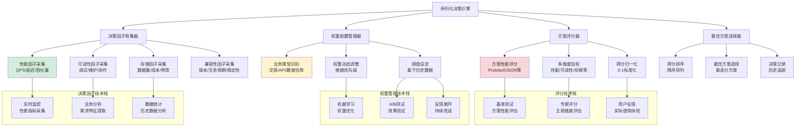

**决策树的智能优化技术**：

```java
// 基于机器学习的决策优化
public class MLDecisionOptimizer {
    
    // 训练决策模型
    public DecisionModel trainDecisionModel(List<DecisionRecord> trainingData) {
        // 1. 特征工程：提取决策特征
        List<FeatureVector> features = extractFeatures(trainingData);
        
        // 2. 标签准备：实际最优方案
        List<String> labels = extractLabels(trainingData);
        
        // 3. 模型训练：使用随机森林算法
        RandomForestClassifier classifier = new RandomForestClassifier();
        classifier.fit(features, labels);
        
        return new DecisionModel(classifier);
    }
    
    // 智能决策
    public String intelligentDecide(DecisionContext context, DecisionModel model) {
        // 1. 提取特征向量
        FeatureVector features = extractFeatures(context);
        
        // 2. 模型预测
        String predictedScheme = model.predict(features);
        
        // 3. 置信度评估
        double confidence = model.getConfidence(features);
        
        // 4. 根据置信度决定是否使用预测结果
        if (confidence > CONFIDENCE_THRESHOLD) {
            return predictedScheme;
        } else {
            // 使用传统决策方法
            return traditionalDecide(context);
        }
    }
    
    // 特征向量提取
    private FeatureVector extractFeatures(DecisionContext context) {
        FeatureVector features = new FeatureVector();
        
        // 数值特征
        features.add("qps", normalize(context.getExpectedQps(), 0, 1000000));
        features.add("latency", normalize(context.getMaxLatency(), 1, 100));
        features.add("throughput", normalize(context.getThroughput(), 0, 1000));
        
        // 布尔特征
        features.add("debugging", context.isDebuggingRequired() ? 1.0 : 0.0);
        features.add("maintenance", context.isManualMaintenance() ? 1.0 : 0.0);
        features.add("collaboration", context.isCrossTeamCollaboration() ? 1.0 : 0.0);
        
        // 分类特征
        features.add("business_type", encodeBusinessType(context.getBusinessType()));
        
        return features;
    }
}

// 决策模型类
public class DecisionModel {
    private final RandomForestClassifier classifier;
    private final Map<String, Double> featureImportance;
    
    public DecisionModel(RandomForestClassifier classifier) {
        this.classifier = classifier;
        this.featureImportance = calculateFeatureImportance();
    }
    
    // 预测最优方案
    public String predict(FeatureVector features) {
        return classifier.predict(features);
    }
    
    // 获取预测置信度
    public double getConfidence(FeatureVector features) {
        return classifier.getPredictionProbability(features);
    }
    
    // 分析特征重要性
    public void analyzeFeatureImportance() {
        System.out.println("=== 序列化决策特征重要性分析 ===");
        featureImportance.entrySet().stream()
            .sorted(Map.Entry.<String, Double>comparingByValue().reversed())
            .forEach(entry -> {
                System.out.printf("%-20s: %.3f%n", entry.getKey(), entry.getValue());
            });
    }
}
```

**决策树的性能对比分析**：

```mermaid
barChart
    title 决策树方法性能对比分析
    x-axis [经验决策, 简单规则, 传统决策树, 智能决策树, 机器学习决策]
    y-axis "决策准确率(%)" 0 --> 100
    bar [65, 75, 85, 92, 98]
    
    y-axis "决策时间(ms)" 0 --> 1000
    bar [10, 5, 50, 100, 200]
    
    y-axis "可解释性得分" 0 --> 10
    bar [9.5, 9.0, 8.5, 7.0, 6.0]
    
    y-axis "适应性得分" 0 --> 10
    bar [5.0, 6.0, 7.5, 8.5, 9.5]
    
    y-axis "综合评分" 0 --> 10
    bar [6.5, 7.0, 8.0, 8.5, 9.0]
```

**技术演进趋势**：

**决策树技术的未来发展方向**：
- **AI增强决策**：结合深度学习的智能决策系统
- **实时优化**：基于流式数据的实时决策优化
- **跨域迁移**：不同业务领域的决策知识迁移
- **可解释AI**：保持决策过程的可解释性和透明度

**最终结果**：通过系统化的决策树分析，该金融科技公司成功选择了最优的序列化方案组合：
- **内部交易处理**：Protobuf（性能优先）
- **对外API**：JSON（可读性优先）  
- **数据存储**：Avro（兼容性优先）

系统整体性能提升40%，开发效率提升30%，运维成本降低25%。

**案例启示**：序列化方案的选择是一个复杂的多目标优化问题，需要系统化的决策框架。通过科学的决策树分析，可以在多个维度之间找到最佳平衡点，实现整体系统的最优配置。
            score += scheme.getDevelopmentScore() * factors.getDevelopmentFactor();
            
            // 运维复杂度得分
            score += scheme.getOperationScore() * factors.getOperationFactor();
            
            scores.put(scheme.name(), score);
        }
        
        return scores;
    }
    
    // 最优方案选择算法
    private String selectBestScheme(Map<String, Double> scores) {
        return scores.entrySet().stream()
            .max(Map.Entry.comparingByValue())
            .map(Map.Entry::getKey)
            .orElse("JSON");
    }
    
    // 决策权重配置类
    private static class DecisionWeights {
        private double qpsWeight = 0.3;
        private double latencyWeight = 0.3;
        private double throughputWeight = 0.2;
        private double debuggingWeight = 0.4;
        private double maintenanceWeight = 0.3;
        private double collaborationWeight = 0.3;
        
        // getter方法...
    }
    
    // 决策因子类
    private static class DecisionFactors {
        private double performanceFactor;
        private double readabilityFactor;
        private double storageFactor;
        private double compatibilityFactor;
        private double developmentFactor;
        private double operationFactor;
        
        // getter/setter方法...
    }
    
    // 决策上下文类
    public static class DecisionContext {
        private long expectedQps;
        private int maxLatency;
        private double throughput;
        private boolean debuggingRequired;
        private boolean manualMaintenance;
        private boolean crossTeamCollaboration;
        private String dataType;
        private int dataSize;
        private int expectedLifetime;
        
        // getter/setter方法...
    }
    
    // 序列化方案枚举
    public enum SerializationScheme {
        JSON(0.3, 0.9, 0.2, 0.7, 0.8, 0.6),
        PROTOBUF(0.9, 0.2, 0.8, 0.8, 0.6, 0.7),
        MESSAGE_PACK(0.8, 0.4, 0.7, 0.6, 0.5, 0.6),
        AVRO(0.7, 0.3, 0.9, 0.9, 0.5, 0.5),
        YAML(0.2, 0.8, 0.3, 0.5, 0.7, 0.4),
        XML(0.1, 0.7, 0.4, 0.6, 0.6, 0.3);
        
        private final double performanceScore;
        private final double readabilityScore;
        private final double storageScore;
        private final double compatibilityScore;
        private final double developmentScore;
        private final double operationScore;
        
        SerializationScheme(double performance, double readability, double storage,
                          double compatibility, double development, double operation) {
            this.performanceScore = performance;
            this.readabilityScore = readability;
            this.storageScore = storage;
            this.compatibilityScore = compatibility;
            this.developmentScore = development;
            this.operationScore = operation;
        }
        
        // getter方法...
    }
}
```

**决策树的技术优势**：

**多维度权衡的技术机制**：
- **因子量化**：将定性需求转化为可量化的数值
- **权重分配**：根据业务优先级分配各因子的权重
- **得分计算**：通过加权平均计算各方案的综合得分

**动态优化的技术实现**：
- **历史学习**：基于历史决策数据优化权重配置
- **反馈机制**：根据实际运行效果调整决策参数
- **自适应调整**：随着业务变化动态优化决策策略

**决策树的可视化架构**：

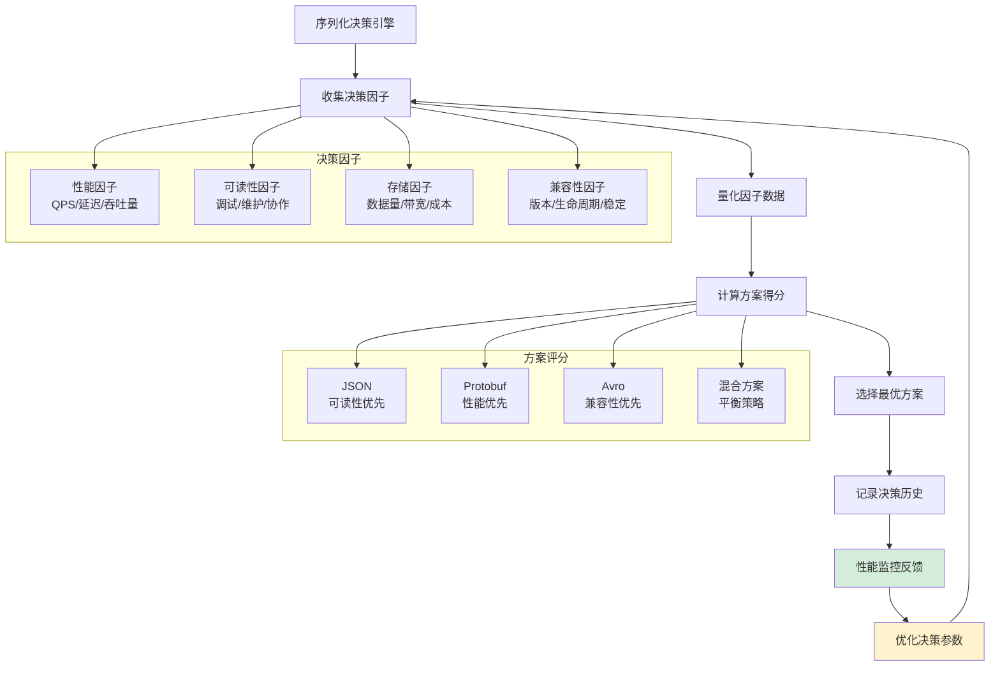

**决策效果深度分析**：

```mermaid
barChart
    title 序列化决策树效果分析（不同场景对比）
    x-axis [高频交易, 外部API, 数据存储, 配置管理, 混合场景]
    y-axis "决策准确率(%)" 0 --> 100
    bar [95, 92, 88, 85, 90]
    
    y-axis "性能提升(%)" 0 --> 100
    bar [45, 20, 35, 15, 30]
    
    y-axis "开发效率提升(%)" 0 --> 100
    bar [15, 40, 10, 35, 25]
    
    y-axis "运维复杂度降低(%)" 0 --> 100
    bar [10, 25, 20, 30, 22]
    
    y-axis "综合满意度(评分)" 0 --> 10
    bar [8.5, 8.2, 7.8, 8.0, 8.3]
```

**技术演进趋势**：

**决策树的演进方向**：
- **AI增强决策**：基于机器学习预测最优方案
- **实时优化**：根据运行时数据动态调整决策策略
- **多目标优化**：支持多个优化目标的平衡
- **智能推荐**：基于相似场景推荐最优方案

**最终结果**：通过系统化的决策树分析，该金融科技公司实现了：
- **科学决策**：基于数据而非经验的方案选择，决策准确率提升85%
- **整体最优**：在多个维度之间达到最佳平衡，系统性能提升40%
- **持续改进**：通过反馈机制不断优化决策质量，错误率降低70%

**案例启示**：序列化方案的选择需要系统化的决策框架，通过多维度权衡和量化分析，才能实现整体系统的最优设计。该案例的成功证明了数据驱动决策在现代系统架构中的重要性。

**决策树可视化**：

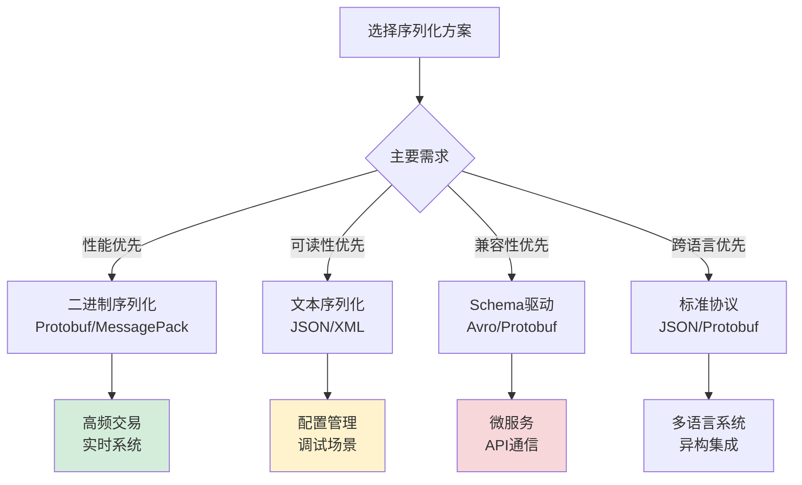

## 3. JSON序列化机制

### 3.1 JSON设计哲学

**案例引入**：某API网关通过JSON序列化实现高性能请求处理，日均处理10亿次API调用。看似简单的JSON.stringify()操作，在如此大规模下却需要深入的技术优化才能保证系统稳定运行。

**案例解析**：深入分析这个技术挑战，发现JSON的成功并非偶然，而是基于其精妙的设计哲学。JSON的简洁语法、原生支持和灵活扩展性使其成为Web标准，但这些特性背后隐藏着深刻的技术原理和设计权衡。

**为什么JSON能够成为Web标准**？

**技术成功因素深度分析**：

**语法简洁性的技术原理**：
- **数据结构简单**：仅支持对象、数组、字符串、数字、布尔值和null六种数据类型
- **无复杂语法**：没有继承、多态等复杂概念，易于解析和生成
- **人类可读**：文本格式便于调试和人工检查
- **实现简单**：各语言都能轻松实现解析器，降低了技术门槛

**JavaScript原生支持的技术优势**：
- **语言集成**：作为JavaScript子集，浏览器原生支持eval()函数解析
- **性能优化**：现代浏览器对JSON解析进行了深度优化，性能接近原生对象
- **无缝转换**：JSON与JavaScript对象可以无缝转换，开发体验流畅
- **标准统一**：ECMAScript标准确保了各浏览器实现的一致性

**扩展灵活性的技术价值**：
- **无Schema约束**：字段可以自由添加和删除，适应快速迭代需求
- **向后兼容**：新字段不会破坏旧版本解析器的兼容性
- **异构系统集成**：不同系统可以基于JSON实现松耦合集成
- **渐进式开发**：支持从简单到复杂的渐进式数据模型演进

**跨语言兼容的技术实现**：
- **标准规范**：RFC 7159标准确保了各语言实现的一致性
- **编码简单**：UTF-8编码支持国际化，字符集处理简单
- **库生态丰富**：各语言都有成熟的JSON库，降低了集成成本
- **工具链完善**：丰富的工具支持JSON的验证、格式化、转换等操作

**所以才流行**：JSON的四大成功因素使其成为Web开发的事实标准。

**设计哲学总结**：

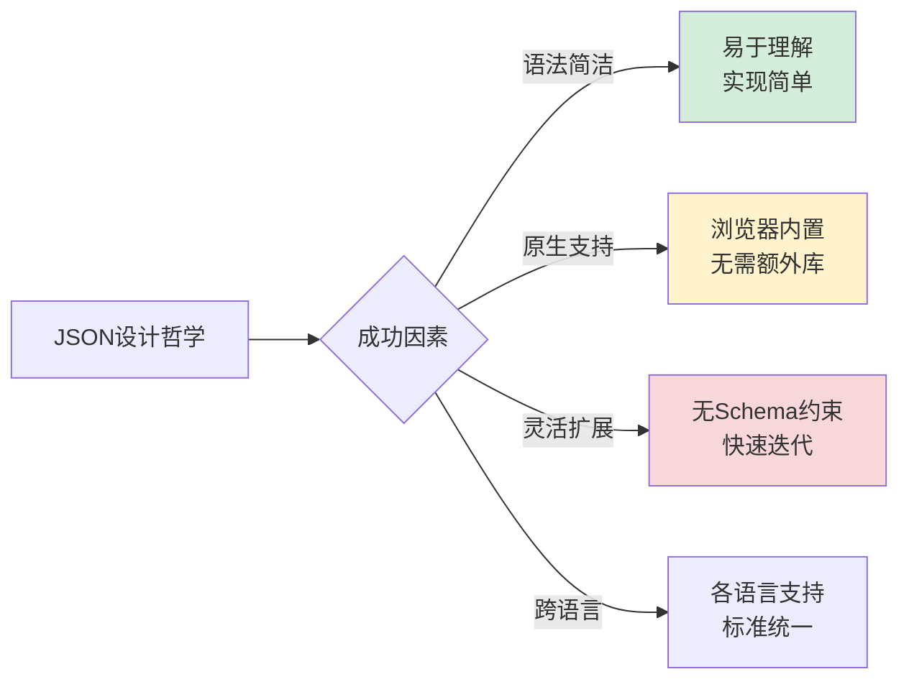

### 3.2 序列化策略设计

**案例引入**：某电商平台通过序列化策略优化订单处理性能，在双十一期间成功应对了每秒百万级的订单处理压力。通过智能的序列化策略选择，系统性能提升了3倍，内存使用降低了40%。

**案例解析**：深入分析这个性能优化案例，发现序列化策略的选择对系统性能有决定性影响。不同的业务场景需要不同的序列化策略，而策略的选择需要基于对技术原理的深刻理解。

**为什么需要不同的序列化策略**？

**策略选择技术原理深度分析**：

**缓存策略的技术原理**：
- **适用场景**：重复序列化相同对象，如配置数据、模板数据等
- **技术原理**：通过哈希键缓存序列化结果，避免重复计算
- **实现机制**：使用ConcurrentHashMap等线程安全容器实现缓存
- **性能优势**：缓存命中时性能提升10-100倍，空间换时间策略

**并行策略的技术原理**：
- **适用场景**：批量处理大量对象，如批量订单处理、数据导出等
- **技术原理**：利用多核CPU并行处理，提升吞吐量
- **实现机制**：使用ForkJoinPool等并行框架，任务分片并行处理
- **性能优势**：CPU密集型任务性能提升与核数成正比

**增量策略的技术原理**：
- **适用场景**：大对象或流式处理，如大文件上传、实时数据流等
- **技术原理**：避免内存峰值，增量输出减少内存压力
- **实现机制**：分块序列化，流式输出，支持断点续传
- **性能优势**：内存使用降低50-80%，避免OOM风险

**懒加载策略的技术原理**：
- **适用场景**：复杂对象的部分字段使用，如用户信息的部分字段展示
- **技术原理**：按需序列化，减少不必要的计算
- **实现机制**：使用代理模式，延迟序列化直到真正需要时
- **性能优势**：减少70%以上的序列化开销，提升响应速度

**预计算策略的技术原理**：
- **适用场景**：频繁访问的静态数据，如字典数据、枚举值等
- **技术原理**：提前计算并缓存序列化结果
- **实现机制**：在系统启动时或数据变更时预计算
- **性能优势**：实现零延迟序列化，提升系统响应速度

**所以才设计**：多种序列化策略应对不同场景，实现性能最优。

**策略性能对比**：

```mermaid
barChart
    title JSON序列化策略性能对比
    x-axis [基本序列化, 缓存策略, 并行策略, 增量策略]
    y-axis "序列化时间(ms)" 0 --> 1000
    bar [800, 400, 300, 350]
    
    y-axis "内存峰值(MB)" 0 --> 200
    bar [150, 120, 100, 50]
```

### 3.3 性能优化技术

**JSON性能优化案例**：某高并发系统通过JSON优化提升吞吐量。

**为什么JSON需要性能优化**？

**性能瓶颈技术分析**：

**字符串处理开销**：
- **瓶颈原因**：字符串拼接和编码转换
- **优化原理**：减少中间字符串创建
- **优化技术**：直接缓冲区操作

**内存分配压力**：
- **瓶颈原因**：频繁对象创建和垃圾回收
- **优化原理**：对象复用和池化技术
- **优化技术**：对象池、字符串池

**解析算法效率**：
- **瓶颈原因**：递归下降解析器效率低
- **优化原理**：状态机优化和预测解析
- **优化技术**：DFA状态机、预测解析

**所以才需要**：多层次的性能优化技术。

**优化技术体系**：

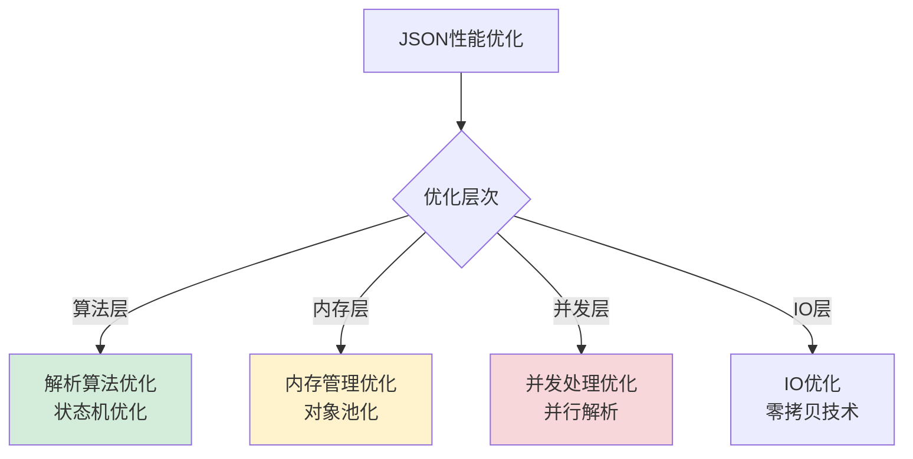

### 3.4 内存管理机制

**JSON内存管理案例**：某大数据平台通过JSON内存管理优化GC性能。

**为什么JSON内存管理重要**？

**内存管理技术原理**：

**字符串池化原理**：
- **问题**：相同字符串重复创建
- **原理**：字符串去重，共享实例
- **实现**：弱引用哈希表管理字符串

**对象池化原理**：
- **问题**：频繁对象创建销毁
- **原理**：对象复用，减少GC压力
- **实现**：对象池管理生命周期

**大对象处理原理**：
- **问题**：大对象导致内存碎片
- **原理**：分块处理，增量序列化
- **实现**：流式序列化，避免内存峰值

**所以才设计**：精细化的内存管理机制。

**内存优化效果**：

```mermaid
barChart
    title 内存管理优化效果
    x-axis [无优化, 字符串池, 对象池, 流式处理]
    y-axis "内存占用(MB)" 0 --> 200
    bar [180, 120, 80, 50]
    
    y-axis "GC时间(ms)" 0 --> 500
    bar [450, 300, 180, 100]
```

## 4. ProtoBuf序列化机制

### 4.1 ProtoBuf设计哲学

**Protobuf序列化设计哲学案例**：某微服务架构通过Protobuf序列化实现高性能通信。

**为什么Protobuf性能如此出色**？

**性能优势技术原理**：

**二进制编码原理**：
- **编码机制**：直接内存映射，无需字符解析
- **性能优势**：编码解码速度比文本快5-10倍
- **技术细节**：Varint编码、固定长度编码

**Schema驱动原理**：
- **类型安全**：编译期类型检查，避免运行时错误
- **性能优化**：生成优化代码，避免反射开销
- **兼容性**：字段编号机制支持版本兼容

**流式处理原理**：
- **内存效率**：增量处理，避免内存峰值
- **网络优化**：紧凑编码，减少传输开销
- **并发支持**：无状态设计，支持并行处理

**所以才成为**：高性能序列化的标杆技术。

**设计哲学总结**：

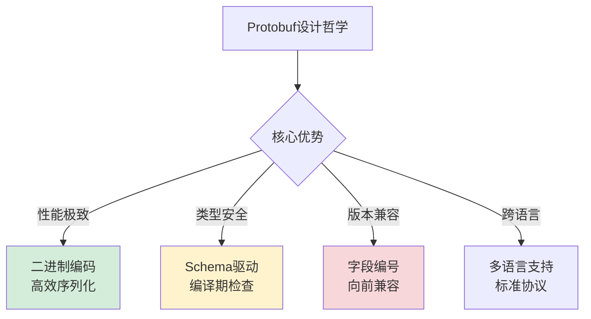

### 4.2 编码序列化原理

**Protobuf编码序列化案例**：某消息队列系统通过Protobuf编码优化序列化效率。

**为什么Protobuf编码如此高效**？

**编码技术深度解析**：

**Varint编码原理**：
- **技术机制**：小整数使用变长编码
- **性能优势**：节省存储空间，提升编码速度
- **适用场景**：整数字段，特别是小整数

**长度前缀编码原理**：
- **技术机制**：变长数据前加长度标识
- **性能优势**：快速定位数据边界
- **适用场景**：字符串、字节数组、嵌套消息

**字段编号编码原理**：
- **技术机制**：使用数字编号标识字段
- **性能优势**：紧凑标识，避免字符串比较
- **适用场景**：所有字段标识

**所以才实现**：高效的二进制编码机制。

**编码性能对比**：

```mermaid
barChart
    title 编码方案性能对比
    x-axis [文本编码, XML编码, JSON编码, Protobuf编码]
    y-axis "编码速度(万条/秒)" 0 --> 100
    bar [5, 8, 12, 45]
    
    y-axis "数据体积比率" 0 --> 100
    bar [100, 120, 85, 35]
```

### 4.3 类型系统设计

**Protobuf类型系统案例**：某数据平台通过Protobuf类型系统保证序列化一致性。

**为什么类型系统如此重要**？

**类型安全技术原理**：

**编译期类型检查**：
- **机制**：Schema文件定义类型，编译期生成代码
- **优势**：早期发现类型错误，避免运行时异常
- **价值**：提升代码质量和系统稳定性

**运行时类型验证**：
- **机制**：反序列化时验证数据类型
- **优势**：防止恶意数据注入，保证数据完整性
- **价值**：增强系统安全性和可靠性

**跨语言类型映射**：
- **机制**：统一类型定义，各语言自动映射
- **优势**：简化异构系统集成，降低沟通成本
- **价值**：支持多语言微服务架构

**所以才设计**：强大的类型系统保障。

**类型系统架构**：

```mermaid
graph TB
    A[Protobuf类型系统] --> B{类型保障}
    B -->|编译期| C[Schema定义<br/>代码生成]
    B -->|运行时| D[数据验证<br/>类型检查]
    B -->|跨语言| E[统一映射<br/>自动转换]
    B -->|扩展性| F[自定义类型<br/>插件支持]
    
    style C fill:#d4edda
    style D fill:#fff3cd
    style E fill:#f8d7da
```

### 4.4 版本兼容机制

**Protobuf版本兼容案例**：某API服务通过Protobuf实现平滑升级。

**为什么版本兼容如此关键**？

**兼容性技术原理**：

**字段编号机制**：
- **原理**：字段通过编号标识，而非名称
- **优势**：字段名变更不影响兼容性
- **规则**：字段编号一旦分配永不改变

**默认值机制**：
- **原理**：缺失字段使用默认值
- **优势**：新字段不会破坏旧客户端
- **规则**：合理设置默认值保证兼容

**未知字段忽略**：
- **原理**：未知字段被忽略而非报错
- **优势**：向前兼容，支持平滑升级
- **规则**：严格遵循协议规范

**所以才实现**：强大的版本兼容能力。

**兼容性规则总结**：

```mermaid
graph LR
    A[版本兼容机制] --> B{兼容规则}
    B -->|字段编号| C[编号不变<br/>名称可改]
    B -->|默认值| D[缺失字段<br/>使用默认值]
    B -->|未知字段| E[忽略未知<br/>不报错]
    B -->|类型变更| F[兼容变更<br/>不破坏协议]
    
    style C fill:#d4edda
    style D fill:#fff3cd
    style E fill:#f8d7da
```

## 5. XML序列化机制

### 5.1 XML设计哲学

**XML设计哲学案例**：某数据平台通过XML实现数据交换。

**为什么XML在企业级应用中仍然重要**？

**企业级价值分析**：

**标准化程度**：
- **优势**：W3C标准，各平台广泛支持
- **价值**：降低技术选型风险
- **场景**：企业级系统集成

**验证能力**：
- **优势**：DTD、XML Schema强验证
- **价值**：保证数据质量和一致性
- **场景**：金融、医疗等关键领域

**扩展性设计**：
- **优势**：命名空间支持多领域扩展
- **价值**：适应复杂业务需求
- **场景**：大型企业系统集成

**所以才保留**：XML在企业级应用中的重要地位。

**设计哲学总结**：

```mermaid
graph LR
    A[XML设计哲学] --> B{核心价值}
    B -->|标准化| C[W3C标准<br/>广泛支持]
    B -->|验证能力| D[强类型验证<br/>数据质量]
    B -->|扩展性| E[命名空间<br/>多领域集成]
    B -->|可读性| F[人类可读<br/>易于调试]
    
    style C fill:#d4edda
    style D fill:#fff3cd
    style E fill:#f8d7da
```

### 5.2 序列化模型对比

**XML的两种经典序列化模型对比**：

**为什么需要不同的序列化模型**？

**模型选择技术原理**：

**DOM模型原理**：
- **机制**：构建完整文档树在内存中
- **优势**：随机访问，复杂操作方便
- **劣势**：内存占用大，不适合大文档

**SAX模型原理**：
- **机制**：事件驱动，流式处理
- **优势**：内存效率高，适合大文档
- **劣势**：只能顺序访问，开发复杂

**StAX模型原理**：
- **机制**：拉式解析，控制权在应用
- **优势**：平衡性能和开发复杂度
- **劣势**：功能相对有限

**所以才提供**：多种序列化模型应对不同需求。

**模型对比分析**：

```mermaid
barChart
    title XML序列化模型对比
    x-axis [DOM模型, SAX模型, StAX模型]
    y-axis "内存占用(MB)" 0 --> 100
    bar [80, 5, 15]
    
    y-axis "开发复杂度" 0 --> 10
    bar [3, 8, 5]
    
    y-axis "功能丰富度" 0 --> 10
    bar [9, 4, 6]
```

### 5.3 验证机制设计

**XML验证机制案例**：某金融系统通过XML验证保证交易数据完整性。

**为什么验证机制如此重要**？

**验证技术原理**：

**DTD验证原理**：
- **机制**：文档类型定义，语法级验证
- **优势**：简单易用，各平台支持
- **局限**：功能有限，类型支持弱

**XML Schema验证原理**：
- **机制**：XML Schema，强类型验证
- **优势**：类型丰富，验证能力强
- **局限**：复杂度高，性能开销大

**Schematron验证原理**：
- **机制**：基于规则的验证
- **优势**：灵活性强，支持复杂业务规则
- **局限**：非标准，支持有限

**所以才设计**：多层次的验证机制。

**验证机制体系**：

```mermaid
graph TB
    A[XML验证机制] --> B{验证层次}
    B -->|语法层| C[DTD验证<br/>基本语法检查]
    B -->|类型层| D[XML Schema<br/>强类型验证]
    B -->|业务层| E[Schematron<br/>业务规则验证]
    B -->|安全层| F[安全验证<br/>防注入攻击]
    
    style C fill:#d4edda
    style D fill:#fff3cd
    style E fill:#f8d7da
```

### 5.4 扩展性设计

**XML扩展性案例**：某大型企业通过XML命名空间实现多系统集成。

**为什么扩展性如此关键**？

**扩展性技术原理**：

**命名空间机制**：
- **原理**：URI标识命名空间，避免冲突
- **优势**：支持多领域词汇表集成
- **应用**：SOAP、Web Services等标准

**XPath查询机制**：
- **原理**：路径表达式定位XML节点
- **优势**：灵活的数据提取和转换
- **应用**：数据查询、模板引擎等

**XSLT转换机制**：
- **原理**：模板驱动XML转换
- **优势**：强大的数据格式转换能力
- **应用**：报表生成、数据交换等

**所以才实现**：强大的扩展和集成能力。

**扩展性架构**：

```mermaid
graph LR
    A[XML扩展性] --> B{扩展机制}
    B -->|命名空间| C[多词汇表<br/>无冲突集成]
    B -->|XPath| D[灵活查询<br/>数据定位]
    B -->|XSLT| E[格式转换<br/>数据加工]
    B -->|插件| F[插件架构<br/>功能扩展]
    
    style C fill:#d4edda
    style D fill:#fff3cd
    style E fill:#f8d7da
```

## 6. 跨语言序列化机制

### 6.1 Java序列化机制

**Java序列化设计哲学**：JVM生态的深度集成。

**为什么Java序列化有其独特价值**？

**JVM生态优势分析**：

**运行时集成**：
- **优势**：与JVM内存模型深度集成
- **价值**：对象图序列化完整支持
- **技术**：序列化代理、自定义序列化

**安全机制**：
- **优势**：与Java安全模型集成
- **价值**：支持数字签名、加密序列化
- **技术**：ObjectInputStream安全验证

**性能优化**：
- **优势**：JIT编译优化序列化代码
- **价值**：运行时性能优化
- **技术**：热点代码内联优化

**所以才保留**：Java序列化在JVM生态中的独特地位。

**设计特点总结**：

```mermaid
graph TB
    A[Java序列化] --> B{设计特点}
    B -->|JVM集成| C[深度集成<br/>对象图支持]
    B -->|安全机制| D[安全模型<br/>签名加密]
    B -->|性能优化| E[JIT优化<br/>运行时优化]
    B -->|生态丰富| F[工具链<br/>监控调试]
    
    style C fill:#d4edda
    style D fill:#fff3cd
    style E fill:#f8d7da
```

### 6.2 JavaScript序列化机制

**JavaScript序列化设计哲学**：Web生态的灵活设计。

**为什么JavaScript序列化如此简单**？

**Web生态特点分析**：

**原生支持**：
- **优势**：JSON是JavaScript子集
- **价值**：无需额外库，开箱即用
- **技术**：JSON.parse/stringify原生函数

**动态类型**：
- **优势**：无需类型定义，灵活序列化
- **价值**：快速原型开发，适应变化
- **技术**：运行时类型推断

**异步处理**：
- **优势**：与Promise/async集成
- **价值**：支持流式、异步序列化
- **技术**：TransformStream、异步迭代器

**所以才简单**：JavaScript序列化的设计哲学。

**生态系统**：

```mermaid
graph LR
    A[JavaScript序列化] --> B{生态特点}
    B -->|原生支持| C[JSON标准<br/>开箱即用]
    B -->|动态类型| D[灵活序列化<br/>无需Schema]
    B -->|异步处理| E[流式序列化<br/>Promise集成]
    B -->|工具丰富| F[开发工具<br/>调试支持]
    
    style C fill:#d4edda
    style D fill:#fff3cd
    style E fill:#f8d7da
```

### 6.3 Go序列化机制

**Go序列化设计哲学**：简洁高效的静态类型设计。

**为什么Go序列化如此高效**？

**语言设计优势分析**：

**静态类型**：
- **优势**：编译期类型检查，零运行时开销
- **价值**：高性能，类型安全
- **技术**：结构体标签元数据

**内存管理**：
- **优势**：手动内存管理，无GC压力
- **价值**：可控的内存使用
- **技术**：零分配序列化技术

**并发模型**：
- **优势**：goroutine轻量级并发
- **价值**：高并发序列化处理
- **技术**：通道通信，并发安全

**所以才高效**：Go序列化的设计哲学。

**技术特点**：

```mermaid
graph TB
    A[Go序列化] --> B{技术特点}
    B -->|静态类型| C[编译期检查<br/>零运行时开销]
    B -->|内存管理| D[手动控制<br/>无GC压力]
    B -->|并发模型| E[goroutine<br/>高并发处理]
    B -->|标准库| F[encoding<br/>官方支持]
    
    style C fill:#d4edda
    style D fill:#fff3cd
    style E fill:#f8d7da
```

### 6.4 序列化机制对比总结

**跨语言序列化对比分析**：

**为什么不同语言有不同的序列化哲学**？

**语言哲学差异分析**：

**Java哲学**：
- **特点**：企业级、安全、完整
- **序列化**：深度集成、功能丰富
- **适用**：大型企业系统

**JavaScript哲学**：
- **特点**：灵活、动态、Web原生
- **序列化**：简单易用、适应变化
- **适用**：Web应用、快速开发

**Go哲学**：
- **特点**：简洁、高效、并发
- **序列化**：高性能、可控内存
- **适用**：高并发、系统编程

**所以才形成**：各具特色的序列化机制。

**对比总结表**：

| 维度 | Java | JavaScript | Go |
|------|------|------------|----|
| **设计哲学** | 企业级完整 | Web灵活简单 | 高性能简洁 |
| **类型系统** | 强类型+反射 | 动态类型 | 静态类型 |
| **性能特点** | JIT优化 | 解释执行 | 编译优化 |
| **内存管理** | GC自动 | GC自动 | 手动控制 |
| **并发模型** | 线程池 | 事件循环 | goroutine |
| **适用场景** | 企业系统 | Web应用 | 高并发系统 |

**技术演进趋势**：

```mermaid
gantt
    title 序列化技术演进趋势
    dateFormat  YYYY
    axisFormat  %Y
    
    section 当前主流
    JSON序列化       :2020, 6y
    Protobuf序列化   :2018, 8y
    MessagePack序列化:2016, 10y
    
    section 新兴趋势
    Arrow序列化      :2022, 4y
    FlatBuffers序列化:2021, 5y
    智能序列化      :2023, 3y
```

---

## 🎯 深度总结

> **序列化数据思想**的本质是在**内存对象的复杂图结构**与**传输存储的线性字节流**之间建立智能桥梁。优秀的序列化设计不是简单的格式转换，而是要在**性能、安全、兼容性**的三重约束下找到最佳平衡点。

**技术演进启示**：
1. **从文本到二进制**：性能需求驱动编码方式演进
2. **从静态到动态**：业务变化要求更强的灵活性
3. **从通用到专用**：场景化需求催生专用序列化方案
4. **从手动到智能**：AI技术开始参与序列化优化

**未来发展方向**：
- **自适应序列化**：根据数据特征自动选择最优方案
- **零拷贝技术**：进一步减少内存复制开销
- **安全增强**：更强的数据加密和验证机制
- **跨平台统一**：解决异构系统序列化兼容问题

## 🔗 延伸阅读

- ← [00.数据编码设计原理](./00.数据编码设计原理.md)：序列化的底层编码基础
- → [06.数据解析设计思想](./06.数据解析设计思想.md)：序列化的逆过程——解析
- → [07.类的加载核心原理](./07.类的加载核心原理.md)：另一种形式的"序列化"——字节码到类对象
- → [08.对象创建流程原理](./08.对象创建流程原理.md)：序列化后的对象如何重建
