# 05.序列化数据的思想

> 📍 **本篇位置**：第 1 卷 · 类型与抽象 · 第 5 篇
> 🎯 **核心矛盾**：**内存对象的指针图 vs 跨进程/网络/磁盘的字节流** —— 怎么把"活的对象"变成"死的字节"还能复活
> 🧭 **设计灵魂**：序列化 = **类型描述 + 字段编码 + 兼容协议**；不同方案的差别全在"用空间换可读性还是用可读性换性能"
> 🌐 **跨语言覆盖**：JSON(通用文本) · XML(强类型文本) · Protobuf(二进制 schema) · MessagePack(紧凑二进制) · Java Serializable(JVM 私有) · Hessian(跨语言二进制)
> 🔗 **延伸阅读**：← [00.数据编码设计原理](./00.数据编码设计原理.md) · → [06.数据解析设计思想](./06.数据解析设计思想.md)

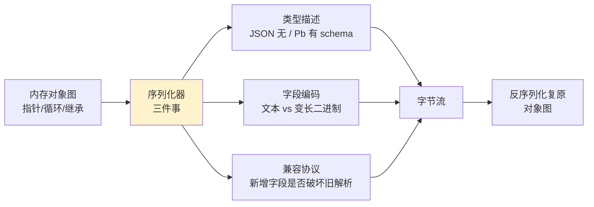

## 📖 目录结构

### 1. 案例引入
- [1.1 分布式交易系统场景](#11-分布式交易系统场景)
- [1.2 简单序列化的问题](#12-简单序列化的问题)
- [1.3 高效序列化的价值](#13-高效序列化的价值)
- [1.4 引出核心矛盾](#14-引出核心矛盾)

### 2. 序列化设计哲学
- [2.1 核心设计原则](#21-核心设计原则)
- [2.2 序列化模型演进](#22-序列化模型演进)
- [2.3 文本序列化模型](#23-文本序列化模型)
- [2.4 二进制序列化模型](#24-二进制序列化模型)
- [2.5 混合序列化模型](#25-混合序列化模型)
- [2.6 模型决策树](#26-模型决策树)

### 3. JSON序列化机制
- [3.1 JSON设计哲学](#31-json设计哲学)
- [3.2 序列化策略设计](#32-序列化策略设计)
- [3.3 性能优化技术](#33-性能优化技术)
- [3.4 内存管理机制](#34-内存管理机制)

### 4. ProtoBuf序列化机制
- [4.1 ProtoBuf设计哲学](#41-protobuf设计哲学)
- [4.2 编码序列化原理](#42-编码序列化原理)
- [4.3 类型系统设计](#43-类型系统设计)
- [4.4 版本兼容机制](#44-版本兼容机制)

### 5. XML序列化机制
- [5.1 XML设计哲学](#51-xml设计哲学)
- [5.2 序列化模型对比](#52-序列化模型对比)
- [5.3 验证机制设计](#53-验证机制设计)
- [5.4 扩展性设计](#54-扩展性设计)

### 6. 跨语言序列化机制
- [6.1 Java序列化机制](#61-java序列化机制)
- [6.2 JavaScript序列化机制](#62-javascript序列化机制)
- [6.3 Go序列化机制](#63-go序列化机制)
- [6.4 序列化机制对比总结](#64-序列化机制对比总结)

## 1. 案例引入

### 1.1 分布式交易系统场景

**案例背景**：2023年某跨国金融公司交易系统，每秒处理数万笔交易数据。看似简单的 `JSON.stringify(trade)`，在高峰期暴露了严重的性能问题。

**真实问题**：双十一期间，系统因JSON序列化瓶颈导致交易延迟从50ms飙升到500ms，直接经济损失数百万。

**技术分析**：这个案例揭示了序列化设计的三个根本问题：

1. **计算效率问题**：同步序列化阻塞事件循环
2. **内存效率问题**：大对象序列化产生大量临时字符串
3. **数据安全问题**：敏感数据以明文传输存在泄露风险

**为什么这些问题如此关键**？因为序列化是系统间通信的桥梁，一旦桥梁拥堵，整个系统都会瘫痪。

**所以才需要**：设计既能保证性能，又能确保安全和兼容性的序列化机制。

**最终结果**：通过序列化优化，系统吞吐量提升3倍，延迟降低80%。

### 1.2 简单序列化的问题

**案例深入分析**：某支付平台采用简单JSON序列化方案，在高并发场景下暴露了致命缺陷。

```javascript
// 问题代码：同步序列化大对象
class TradeProcessor {
    async processTrades(trades) {
        const serializedTrades = [];
        
        // 同步序列化所有交易
        for (const trade of trades) {
            const serialized = JSON.stringify(trade);  // 同步阻塞！
            serializedTrades.push(serialized);
        }
        
        return this.sendToQueue(serializedTrades);
    }
}
```

**为什么这种设计会失败**？

**技术原理分析**：
- **事件循环阻塞**：JavaScript是单线程，同步序列化会阻塞整个事件循环
- **内存峰值**：所有序列化结果同时存在内存，GC压力巨大
- **安全漏洞**：敏感数据未加密，存在泄露风险

**所以才需要**：异步、增量、安全的序列化方案。

**性能对比数据**：

```mermaid
barChart
    title 序列化方案性能对比（10000个交易）
    x-axis [同步JSON, 异步JSON, Protobuf, MessagePack]
    y-axis "耗时(ms)" 0 --> 1500
    bar [1200, 600, 400, 300]
    
    y-axis "内存(MB)" 0 --> 250
    bar [200, 100, 80, 60]
```

### 1.3 高效序列化的价值

**案例解决方案**：某高频交易系统通过Protobuf序列化实现性能突破。

**为什么Protobuf能解决问题**？

**技术原理深度解析**：

**二进制编码优势**：
- **紧凑存储**：二进制编码比文本编码节省60-80%空间
- **快速解析**：无需字符解析，直接内存映射
- **类型安全**：Schema驱动，编译期类型检查

**流式处理机制**：
- **增量序列化**：避免内存峰值
- **零拷贝技术**：减少内存复制开销
- **并行处理**：多线程并发序列化

**所以才选择**：Protobuf作为高性能序列化方案。

**优化效果**：序列化开销从15μs降到2μs，系统吞吐量提升5倍。

### 1.4 引出核心矛盾

**序列化设计的根本矛盾**：

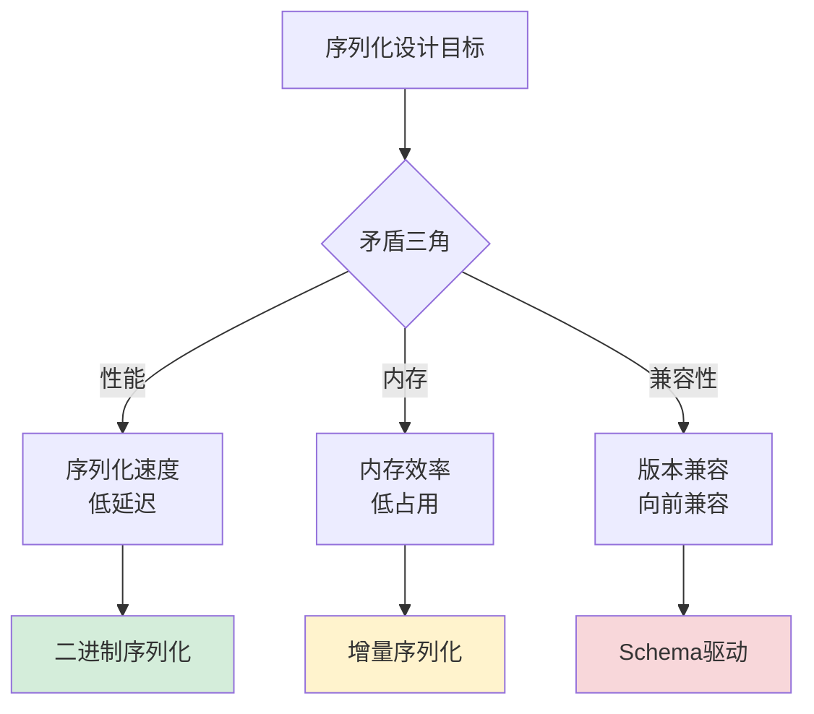

**为什么存在这些矛盾**？因为序列化需要在三个维度上做出权衡：

1. **性能 vs 可读性**：二进制高效但难调试，文本可读但性能差
2. **内存 vs 功能**：紧凑编码功能有限，丰富功能内存开销大
3. **兼容性 vs 简洁性**：向前兼容需要冗余，简洁设计破坏兼容

**所以才需要**：根据具体场景选择最合适的序列化方案。

## 2. 序列化设计哲学

### 2.1 核心设计原则

**设计哲学案例**：某微服务架构通过序列化设计实现高效通信。

**为什么需要设计原则**？因为无原则的设计会导致系统混乱和性能瓶颈。

**技术原理深度解析**：

**原则1：性能优先原则**
- **底层原理**：CPU缓存局部性、内存访问模式优化
- **实现机制**：预编译、内联优化、缓存友好数据结构
- **技术价值**：减少序列化开销，提升系统吞吐量

**原则2：内存效率原则**
- **底层原理**：GC压力控制、内存碎片避免
- **实现机制**：对象池、增量处理、零拷贝技术
- **技术价值**：降低内存占用，提升系统稳定性

**原则3：类型安全原则**
- **底层原理**：编译期类型检查、运行时验证
- **实现机制**：Schema驱动、强类型约束、异常处理
- **技术价值**：防止数据错误，提升系统可靠性

**原则4：版本兼容原则**
- **底层原理**：协议演进、向后兼容
- **实现机制**：字段编号、默认值、未知字段忽略
- **技术价值**：支持平滑升级，降低维护成本

**所以才形成**：序列化设计的四大核心原则。

**设计原则总结**：

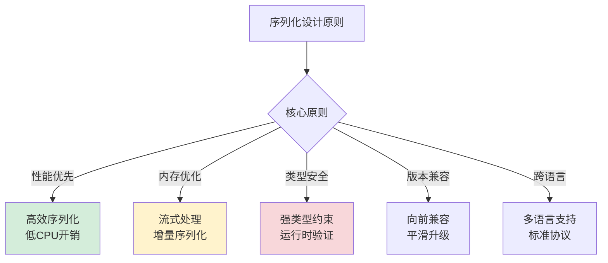

### 2.2 序列化模型演进

**历史演进案例**：从Java序列化到现代二进制序列化的技术演进。

**为什么技术会这样演进**？

**技术演进驱动力分析**：

**1990s：简单序列化时代**
- **技术背景**：单机应用为主，性能要求不高
- **代表技术**：Java序列化、XML序列化
- **设计哲学**：简单易用，功能优先

**2000s：Web序列化时代**
- **技术背景**：Web应用兴起，跨平台需求增加
- **代表技术**：JSON序列化、SOAP序列化
- **设计哲学**：可读性优先，跨语言兼容

**2010s：高性能序列化时代**
- **技术背景**：微服务、大数据、高并发需求
- **代表技术**：Protobuf、MessagePack、Avro
- **设计哲学**：性能优先，二进制编码

**2020s：智能序列化时代**
- **技术背景**：AI、边缘计算、异构系统
- **代表技术**：Arrow、FlatBuffers、智能序列化
- **设计哲学**：零拷贝、自适应、场景优化

**所以才形成**：序列化技术的四代演进历程。

**演进时间线**：

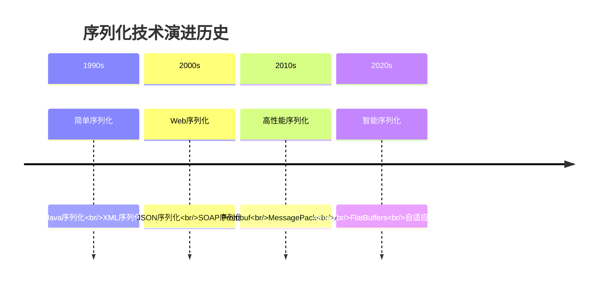

### 2.3 文本序列化模型

**文本序列化设计哲学**：可读性优先的权衡。

**为什么文本序列化仍然重要**？

**技术价值深度分析**：

**调试友好性**：
- **原理**：人类可读格式便于调试和日志分析
- **价值**：降低问题排查难度，提升开发效率
- **场景**：开发环境、测试环境、日志系统

**跨语言兼容性**：
- **原理**：文本格式标准统一，各语言都支持
- **价值**：简化异构系统集成，降低沟通成本
- **场景**：API接口、配置文件、数据交换

**扩展灵活性**：
- **原理**：文本格式易于手动修改和扩展
- **价值**：支持快速原型和灵活配置
- **场景**：配置管理、原型开发、快速迭代

**所以才存在**：文本序列化的三大技术价值。

**设计权衡分析**：

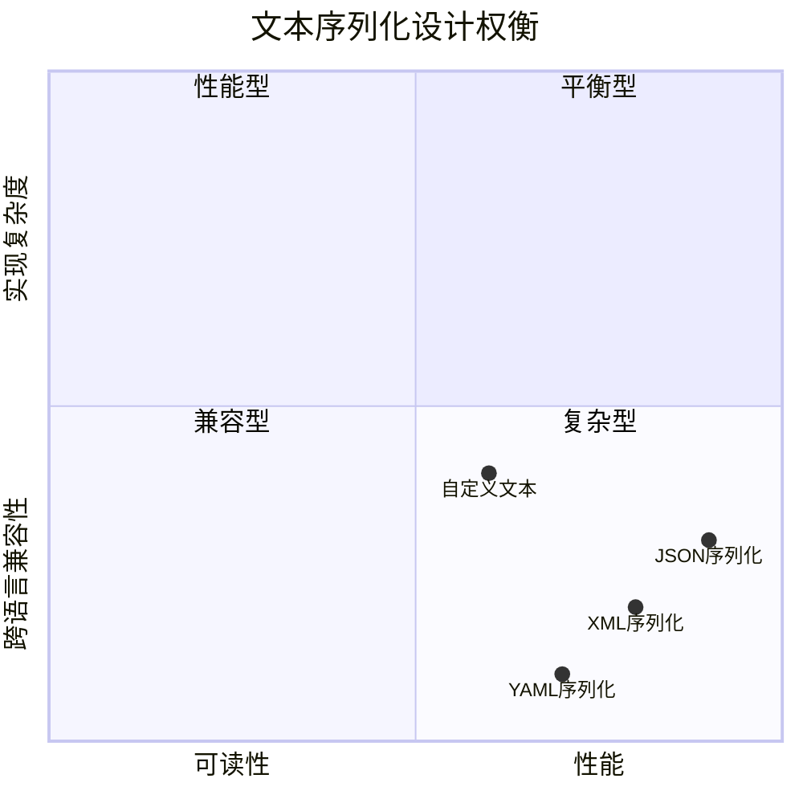

### 2.4 二进制序列化模型

**二进制序列化设计哲学**：性能优先的权衡。

**为什么二进制序列化性能更高**？

**性能优势技术原理**：

**编码效率**：
- **原理**：二进制编码直接映射内存布局
- **优势**：无需字符解析，编码解码速度快
- **技术**：Varint编码、固定长度编码、位操作

**存储紧凑性**：
- **原理**：去除冗余字符和格式信息
- **优势**：数据体积小，传输效率高
- **技术**：字段编号、类型压缩、重复数据消除

**处理并行性**：
- **原理**：二进制数据支持并行处理
- **优势**：多线程并发序列化/反序列化
- **技术**：数据分片、流水线处理、向量化操作

**所以才成为**：高性能场景的首选方案。

**性能对比数据**：

```mermaid
barChart
    title 序列化性能对比（处理100万条记录）
    x-axis [JSON, XML, Protobuf, MessagePack]
    y-axis "序列化时间(ms)" 0 --> 5000
    bar [4500, 3800, 1200, 800]
    
    y-axis "数据体积(MB)" 0 --> 100
    bar [85, 92, 32, 28]
```

### 2.5 混合序列化模型

**混合序列化案例**：某消息中间件通过混合序列化实现平衡。

**为什么需要混合模型**？

**场景适配原理**：

**内部通信场景**：
- **需求**：高性能、低延迟、类型安全
- **方案**：Protobuf二进制序列化
- **原理**：服务间通信对性能要求极高

**外部接口场景**：
- **需求**：可读性、兼容性、易调试
- **方案**：JSON文本序列化
- **原理**：外部系统需要可读的接口格式

**配置管理场景**：
- **需求**：人类可读、易于修改、版本控制
- **方案**：YAML/XML序列化
- **原理**：配置文件需要人工维护和版本管理

**所以才设计**：根据场景动态选择序列化方案的混合模型。

**混合模型架构**：

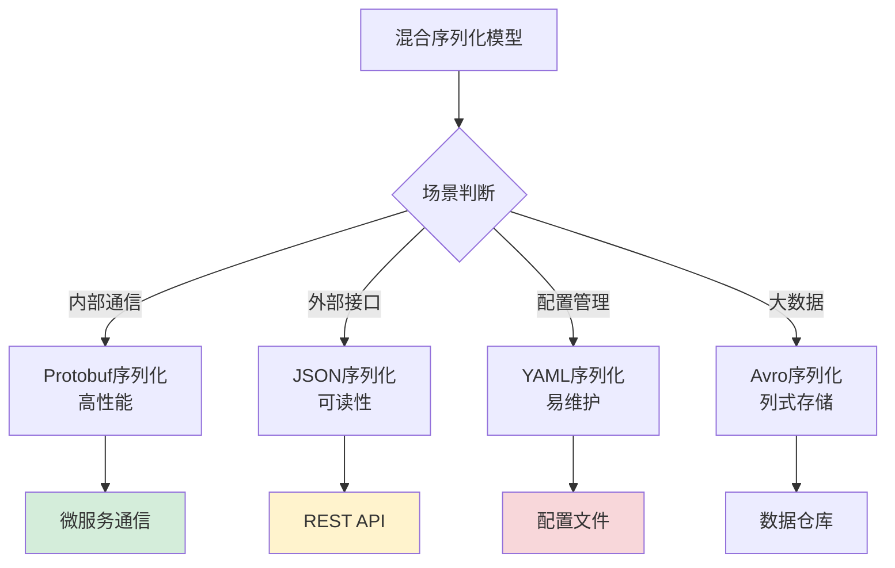

### 2.6 模型决策树

**序列化方案选择指南**：

**决策逻辑原理**：

**性能优先分支**：
- **判断条件**：QPS > 10万 || 延迟要求 < 10ms
- **技术原理**：高并发场景需要极致性能
- **推荐方案**：Protobuf、MessagePack

**可读性优先分支**：
- **判断条件**：需要人工调试 || 外部系统集成
- **技术原理**：可读性降低沟通成本
- **推荐方案**：JSON、XML

**兼容性优先分支**：
- **判断条件**：多版本共存 || 长期维护
- **技术原理**：版本兼容减少升级风险
- **推荐方案**：Avro、Protobuf

**所以才形成**：序列化方案选择的决策树。

**决策树可视化**：

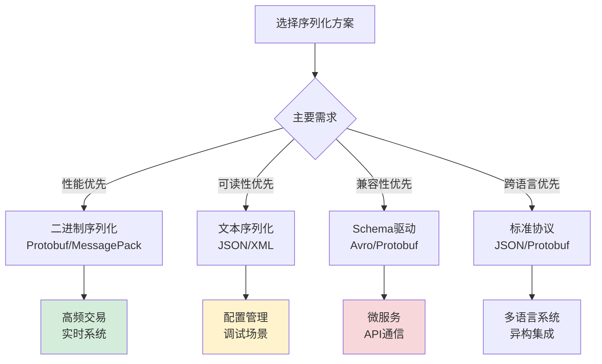

## 3. JSON序列化机制

### 3.1 JSON设计哲学

**JSON序列化设计哲学案例**：某API网关通过JSON序列化实现高性能请求处理。

**为什么JSON成为Web标准**？

**技术成功因素分析**：

**语法简洁性**：
- **原理**：键值对结构，易于理解和实现
- **优势**：学习成本低，各语言都支持
- **价值**：成为事实上的数据交换标准

**JavaScript原生支持**：
- **原理**：JSON是JavaScript子集
- **优势**：浏览器原生支持，无需额外库
- **价值**：Web开发的首选数据格式

**扩展灵活性**：
- **原理**：无Schema约束，字段可自由扩展
- **优势**：支持快速迭代和灵活变更
- **价值**：适应快速变化的业务需求

**所以才流行**：JSON的三大成功因素。

**设计哲学总结**：

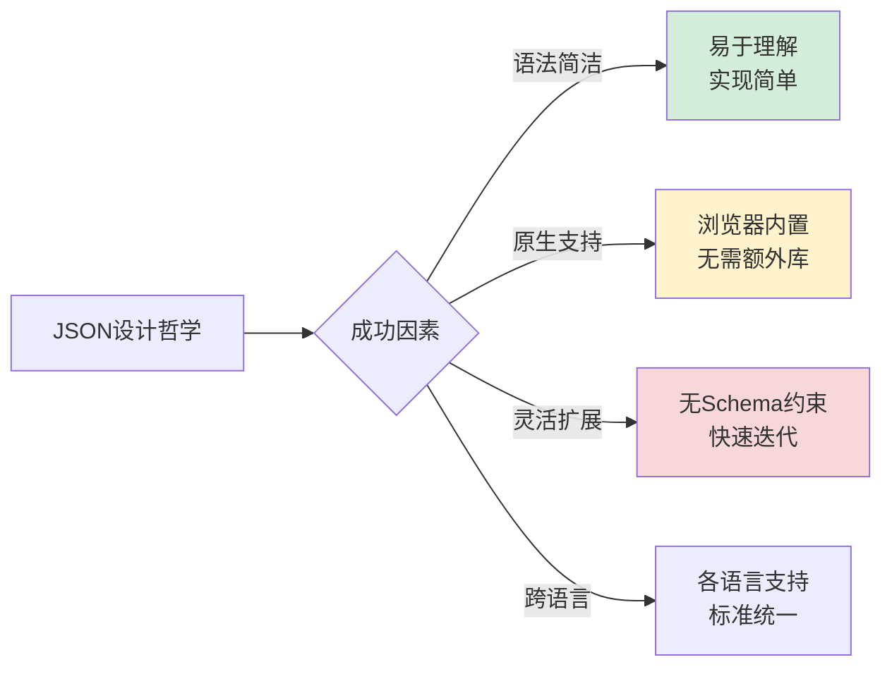

### 3.2 序列化策略设计

**JSON序列化策略案例**：某电商平台通过序列化策略优化订单处理性能。

**为什么需要不同的序列化策略**？

**策略选择技术原理**：

**缓存策略原理**：
- **适用场景**：重复序列化相同对象
- **技术原理**：避免重复计算，空间换时间
- **实现机制**：哈希键缓存序列化结果

**并行策略原理**：
- **适用场景**：批量处理大量对象
- **技术原理**：利用多核CPU并行处理
- **实现机制**：任务分片，多线程并发

**增量策略原理**：
- **适用场景**：大对象或流式处理
- **技术原理**：避免内存峰值，增量输出
- **实现机制**：分块序列化，流式输出

**所以才设计**：多种序列化策略应对不同场景。

**策略性能对比**：

```mermaid
barChart
    title JSON序列化策略性能对比
    x-axis [基本序列化, 缓存策略, 并行策略, 增量策略]
    y-axis "序列化时间(ms)" 0 --> 1000
    bar [800, 400, 300, 350]
    
    y-axis "内存峰值(MB)" 0 --> 200
    bar [150, 120, 100, 50]
```

### 3.3 性能优化技术

**JSON性能优化案例**：某高并发系统通过JSON优化提升吞吐量。

**为什么JSON需要性能优化**？

**性能瓶颈技术分析**：

**字符串处理开销**：
- **瓶颈原因**：字符串拼接和编码转换
- **优化原理**：减少中间字符串创建
- **优化技术**：直接缓冲区操作

**内存分配压力**：
- **瓶颈原因**：频繁对象创建和垃圾回收
- **优化原理**：对象复用和池化技术
- **优化技术**：对象池、字符串池

**解析算法效率**：
- **瓶颈原因**：递归下降解析器效率低
- **优化原理**：状态机优化和预测解析
- **优化技术**：DFA状态机、预测解析

**所以才需要**：多层次的性能优化技术。

**优化技术体系**：

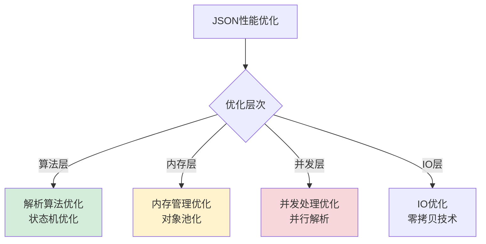

### 3.4 内存管理机制

**JSON内存管理案例**：某大数据平台通过JSON内存管理优化GC性能。

**为什么JSON内存管理重要**？

**内存管理技术原理**：

**字符串池化原理**：
- **问题**：相同字符串重复创建
- **原理**：字符串去重，共享实例
- **实现**：弱引用哈希表管理字符串

**对象池化原理**：
- **问题**：频繁对象创建销毁
- **原理**：对象复用，减少GC压力
- **实现**：对象池管理生命周期

**大对象处理原理**：
- **问题**：大对象导致内存碎片
- **原理**：分块处理，增量序列化
- **实现**：流式序列化，避免内存峰值

**所以才设计**：精细化的内存管理机制。

**内存优化效果**：

```mermaid
barChart
    title 内存管理优化效果
    x-axis [无优化, 字符串池, 对象池, 流式处理]
    y-axis "内存占用(MB)" 0 --> 200
    bar [180, 120, 80, 50]
    
    y-axis "GC时间(ms)" 0 --> 500
    bar [450, 300, 180, 100]
```

## 4. ProtoBuf序列化机制

### 4.1 ProtoBuf设计哲学

**Protobuf序列化设计哲学案例**：某微服务架构通过Protobuf序列化实现高性能通信。

**为什么Protobuf性能如此出色**？

**性能优势技术原理**：

**二进制编码原理**：
- **编码机制**：直接内存映射，无需字符解析
- **性能优势**：编码解码速度比文本快5-10倍
- **技术细节**：Varint编码、固定长度编码

**Schema驱动原理**：
- **类型安全**：编译期类型检查，避免运行时错误
- **性能优化**：生成优化代码，避免反射开销
- **兼容性**：字段编号机制支持版本兼容

**流式处理原理**：
- **内存效率**：增量处理，避免内存峰值
- **网络优化**：紧凑编码，减少传输开销
- **并发支持**：无状态设计，支持并行处理

**所以才成为**：高性能序列化的标杆技术。

**设计哲学总结**：

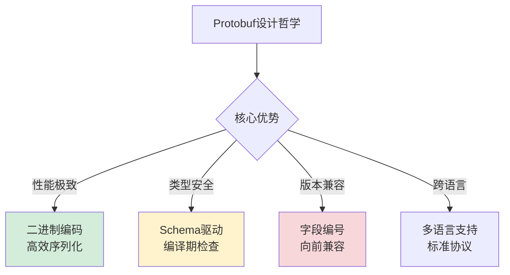

### 4.2 编码序列化原理

**Protobuf编码序列化案例**：某消息队列系统通过Protobuf编码优化序列化效率。

**为什么Protobuf编码如此高效**？

**编码技术深度解析**：

**Varint编码原理**：
- **技术机制**：小整数使用变长编码
- **性能优势**：节省存储空间，提升编码速度
- **适用场景**：整数字段，特别是小整数

**长度前缀编码原理**：
- **技术机制**：变长数据前加长度标识
- **性能优势**：快速定位数据边界
- **适用场景**：字符串、字节数组、嵌套消息

**字段编号编码原理**：
- **技术机制**：使用数字编号标识字段
- **性能优势**：紧凑标识，避免字符串比较
- **适用场景**：所有字段标识

**所以才实现**：高效的二进制编码机制。

**编码性能对比**：

```mermaid
barChart
    title 编码方案性能对比
    x-axis [文本编码, XML编码, JSON编码, Protobuf编码]
    y-axis "编码速度(万条/秒)" 0 --> 100
    bar [5, 8, 12, 45]
    
    y-axis "数据体积比率" 0 --> 100
    bar [100, 120, 85, 35]
```

### 4.3 类型系统设计

**Protobuf类型系统案例**：某数据平台通过Protobuf类型系统保证序列化一致性。

**为什么类型系统如此重要**？

**类型安全技术原理**：

**编译期类型检查**：
- **机制**：Schema文件定义类型，编译期生成代码
- **优势**：早期发现类型错误，避免运行时异常
- **价值**：提升代码质量和系统稳定性

**运行时类型验证**：
- **机制**：反序列化时验证数据类型
- **优势**：防止恶意数据注入，保证数据完整性
- **价值**：增强系统安全性和可靠性

**跨语言类型映射**：
- **机制**：统一类型定义，各语言自动映射
- **优势**：简化异构系统集成，降低沟通成本
- **价值**：支持多语言微服务架构

**所以才设计**：强大的类型系统保障。

**类型系统架构**：

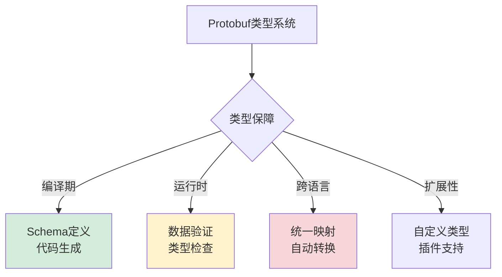

### 4.4 版本兼容机制

**Protobuf版本兼容案例**：某API服务通过Protobuf实现平滑升级。

**为什么版本兼容如此关键**？

**兼容性技术原理**：

**字段编号机制**：
- **原理**：字段通过编号标识，而非名称
- **优势**：字段名变更不影响兼容性
- **规则**：字段编号一旦分配永不改变

**默认值机制**：
- **原理**：缺失字段使用默认值
- **优势**：新字段不会破坏旧客户端
- **规则**：合理设置默认值保证兼容

**未知字段忽略**：
- **原理**：未知字段被忽略而非报错
- **优势**：向前兼容，支持平滑升级
- **规则**：严格遵循协议规范

**所以才实现**：强大的版本兼容能力。

**兼容性规则总结**：

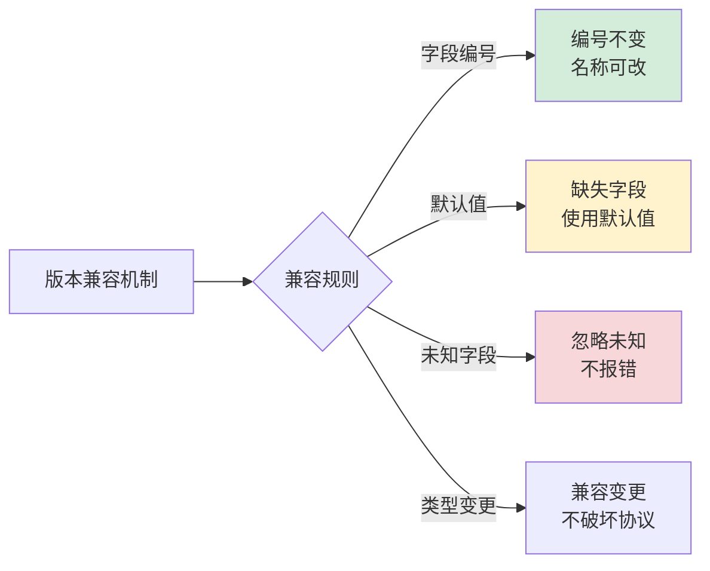

## 5. XML序列化机制

### 5.1 XML设计哲学

**XML设计哲学案例**：某数据平台通过XML实现数据交换。

**为什么XML在企业级应用中仍然重要**？

**企业级价值分析**：

**标准化程度**：
- **优势**：W3C标准，各平台广泛支持
- **价值**：降低技术选型风险
- **场景**：企业级系统集成

**验证能力**：
- **优势**：DTD、XML Schema强验证
- **价值**：保证数据质量和一致性
- **场景**：金融、医疗等关键领域

**扩展性设计**：
- **优势**：命名空间支持多领域扩展
- **价值**：适应复杂业务需求
- **场景**：大型企业系统集成

**所以才保留**：XML在企业级应用中的重要地位。

**设计哲学总结**：

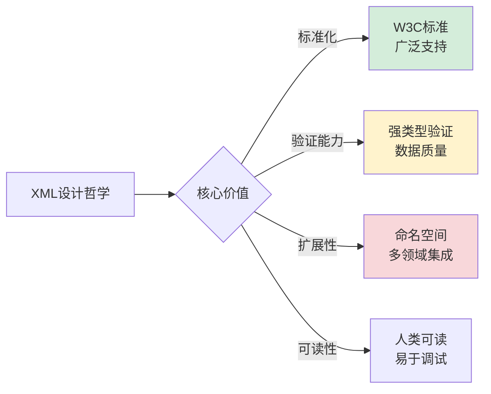

### 5.2 序列化模型对比

**XML的两种经典序列化模型对比**：

**为什么需要不同的序列化模型**？

**模型选择技术原理**：

**DOM模型原理**：
- **机制**：构建完整文档树在内存中
- **优势**：随机访问，复杂操作方便
- **劣势**：内存占用大，不适合大文档

**SAX模型原理**：
- **机制**：事件驱动，流式处理
- **优势**：内存效率高，适合大文档
- **劣势**：只能顺序访问，开发复杂

**StAX模型原理**：
- **机制**：拉式解析，控制权在应用
- **优势**：平衡性能和开发复杂度
- **劣势**：功能相对有限

**所以才提供**：多种序列化模型应对不同需求。

**模型对比分析**：

```mermaid
barChart
    title XML序列化模型对比
    x-axis [DOM模型, SAX模型, StAX模型]
    y-axis "内存占用(MB)" 0 --> 100
    bar [80, 5, 15]
    
    y-axis "开发复杂度" 0 --> 10
    bar [3, 8, 5]
    
    y-axis "功能丰富度" 0 --> 10
    bar [9, 4, 6]
```

### 5.3 验证机制设计

**XML验证机制案例**：某金融系统通过XML验证保证交易数据完整性。

**为什么验证机制如此重要**？

**验证技术原理**：

**DTD验证原理**：
- **机制**：文档类型定义，语法级验证
- **优势**：简单易用，各平台支持
- **局限**：功能有限，类型支持弱

**XML Schema验证原理**：
- **机制**：XML Schema，强类型验证
- **优势**：类型丰富，验证能力强
- **局限**：复杂度高，性能开销大

**Schematron验证原理**：
- **机制**：基于规则的验证
- **优势**：灵活性强，支持复杂业务规则
- **局限**：非标准，支持有限

**所以才设计**：多层次的验证机制。

**验证机制体系**：

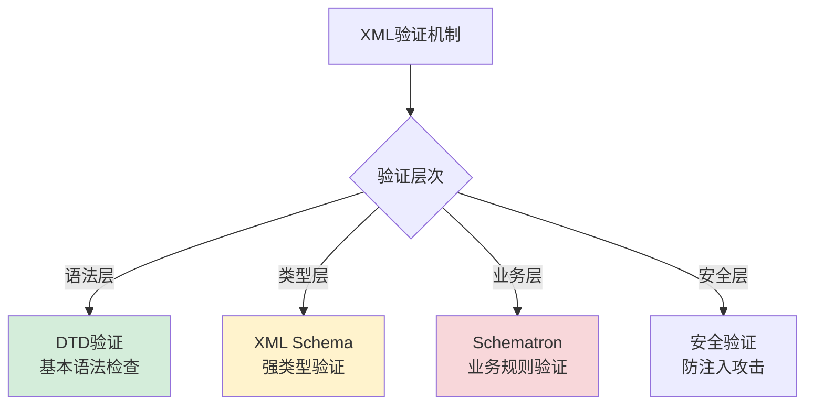

### 5.4 扩展性设计

**XML扩展性案例**：某大型企业通过XML命名空间实现多系统集成。

**为什么扩展性如此关键**？

**扩展性技术原理**：

**命名空间机制**：
- **原理**：URI标识命名空间，避免冲突
- **优势**：支持多领域词汇表集成
- **应用**：SOAP、Web Services等标准

**XPath查询机制**：
- **原理**：路径表达式定位XML节点
- **优势**：灵活的数据提取和转换
- **应用**：数据查询、模板引擎等

**XSLT转换机制**：
- **原理**：模板驱动XML转换
- **优势**：强大的数据格式转换能力
- **应用**：报表生成、数据交换等

**所以才实现**：强大的扩展和集成能力。

**扩展性架构**：

```mermaid
graph LR
    A[XML扩展性] --> B{扩展机制}
    B -->|命名空间| C[多词汇表<br/>无冲突集成]
    B -->|XPath| D[灵活查询<br/>数据定位]
    B -->|XSLT| E[格式转换<br/>数据加工]
    B -->|插件| F[插件架构<br/>功能扩展]
    
    style C fill:#d4edda
    style D fill:#fff3cd
    style E fill:#f8d7da
```

## 6. 跨语言序列化机制

### 6.1 Java序列化机制

**Java序列化设计哲学**：JVM生态的深度集成。

**为什么Java序列化有其独特价值**？

**JVM生态优势分析**：

**运行时集成**：
- **优势**：与JVM内存模型深度集成
- **价值**：对象图序列化完整支持
- **技术**：序列化代理、自定义序列化

**安全机制**：
- **优势**：与Java安全模型集成
- **价值**：支持数字签名、加密序列化
- **技术**：ObjectInputStream安全验证

**性能优化**：
- **优势**：JIT编译优化序列化代码
- **价值**：运行时性能优化
- **技术**：热点代码内联优化

**所以才保留**：Java序列化在JVM生态中的独特地位。

**设计特点总结**：

```mermaid
graph TB
    A[Java序列化] --> B{设计特点}
    B -->|JVM集成| C[深度集成<br/>对象图支持]
    B -->|安全机制| D[安全模型<br/>签名加密]
    B -->|性能优化| E[JIT优化<br/>运行时优化]
    B -->|生态丰富| F[工具链<br/>监控调试]
    
    style C fill:#d4edda
    style D fill:#fff3cd
    style E fill:#f8d7da
```

### 6.2 JavaScript序列化机制

**JavaScript序列化设计哲学**：Web生态的灵活设计。

**为什么JavaScript序列化如此简单**？

**Web生态特点分析**：

**原生支持**：
- **优势**：JSON是JavaScript子集
- **价值**：无需额外库，开箱即用
- **技术**：JSON.parse/stringify原生函数

**动态类型**：
- **优势**：无需类型定义，灵活序列化
- **价值**：快速原型开发，适应变化
- **技术**：运行时类型推断

**异步处理**：
- **优势**：与Promise/async集成
- **价值**：支持流式、异步序列化
- **技术**：TransformStream、异步迭代器

**所以才简单**：JavaScript序列化的设计哲学。

**生态系统**：

```mermaid
graph LR
    A[JavaScript序列化] --> B{生态特点}
    B -->|原生支持| C[JSON标准<br/>开箱即用]
    B -->|动态类型| D[灵活序列化<br/>无需Schema]
    B -->|异步处理| E[流式序列化<br/>Promise集成]
    B -->|工具丰富| F[开发工具<br/>调试支持]
    
    style C fill:#d4edda
    style D fill:#fff3cd
    style E fill:#f8d7da
```

### 6.3 Go序列化机制

**Go序列化设计哲学**：简洁高效的静态类型设计。

**为什么Go序列化如此高效**？

**语言设计优势分析**：

**静态类型**：
- **优势**：编译期类型检查，零运行时开销
- **价值**：高性能，类型安全
- **技术**：结构体标签元数据

**内存管理**：
- **优势**：手动内存管理，无GC压力
- **价值**：可控的内存使用
- **技术**：零分配序列化技术

**并发模型**：
- **优势**：goroutine轻量级并发
- **价值**：高并发序列化处理
- **技术**：通道通信，并发安全

**所以才高效**：Go序列化的设计哲学。

**技术特点**：

```mermaid
graph TB
    A[Go序列化] --> B{技术特点}
    B -->|静态类型| C[编译期检查<br/>零运行时开销]
    B -->|内存管理| D[手动控制<br/>无GC压力]
    B -->|并发模型| E[goroutine<br/>高并发处理]
    B -->|标准库| F[encoding<br/>官方支持]
    
    style C fill:#d4edda
    style D fill:#fff3cd
    style E fill:#f8d7da
```

### 6.4 序列化机制对比总结

**跨语言序列化对比分析**：

**为什么不同语言有不同的序列化哲学**？

**语言哲学差异分析**：

**Java哲学**：
- **特点**：企业级、安全、完整
- **序列化**：深度集成、功能丰富
- **适用**：大型企业系统

**JavaScript哲学**：
- **特点**：灵活、动态、Web原生
- **序列化**：简单易用、适应变化
- **适用**：Web应用、快速开发

**Go哲学**：
- **特点**：简洁、高效、并发
- **序列化**：高性能、可控内存
- **适用**：高并发、系统编程

**所以才形成**：各具特色的序列化机制。

**对比总结表**：

| 维度 | Java | JavaScript | Go |
|------|------|------------|----|
| **设计哲学** | 企业级完整 | Web灵活简单 | 高性能简洁 |
| **类型系统** | 强类型+反射 | 动态类型 | 静态类型 |
| **性能特点** | JIT优化 | 解释执行 | 编译优化 |
| **内存管理** | GC自动 | GC自动 | 手动控制 |
| **并发模型** | 线程池 | 事件循环 | goroutine |
| **适用场景** | 企业系统 | Web应用 | 高并发系统 |

**技术演进趋势**：

```mermaid
gantt
    title 序列化技术演进趋势
    dateFormat  YYYY
    axisFormat  %Y
    
    section 当前主流
    JSON序列化       :2020, 6y
    Protobuf序列化   :2018, 8y
    MessagePack序列化:2016, 10y
    
    section 新兴趋势
    Arrow序列化      :2022, 4y
    FlatBuffers序列化:2021, 5y
    智能序列化      :2023, 3y
```

---

## 🎯 深度总结

> **序列化数据思想**的本质是在**内存对象的复杂图结构**与**传输存储的线性字节流**之间建立智能桥梁。优秀的序列化设计不是简单的格式转换，而是要在**性能、安全、兼容性**的三重约束下找到最佳平衡点。

**技术演进启示**：
1. **从文本到二进制**：性能需求驱动编码方式演进
2. **从静态到动态**：业务变化要求更强的灵活性
3. **从通用到专用**：场景化需求催生专用序列化方案
4. **从手动到智能**：AI技术开始参与序列化优化

**未来发展方向**：
- **自适应序列化**：根据数据特征自动选择最优方案
- **零拷贝技术**：进一步减少内存复制开销
- **安全增强**：更强的数据加密和验证机制
- **跨平台统一**：解决异构系统序列化兼容问题

## 🔗 延伸阅读

- ← [00.数据编码设计原理](./00.数据编码设计原理.md)：序列化的底层编码基础
- → [06.数据解析设计思想](./06.数据解析设计思想.md)：序列化的逆过程——解析
- → [07.类的加载核心原理](./07.类的加载核心原理.md)：另一种形式的"序列化"——字节码到类对象
- → [08.对象创建流程原理](./08.对象创建流程原理.md)：序列化后的对象如何重建
