# 05.序列化数据的思想

> 📍 **本篇位置**：第 1 卷 · 类型与抽象 · 第 5 篇
> 🎯 **核心矛盾**：**内存对象的指针图 vs 跨进程/网络/磁盘的字节流** —— 怎么把"活的对象"变成"死的字节"还能复活
> 🧭 **设计灵魂**：序列化 = **类型描述 + 字段编码 + 兼容协议**；不同方案的差别全在"用空间换可读性还是用可读性换性能"
> 🌐 **跨语言覆盖**：JSON(通用文本) · XML(强类型文本) · Protobuf(二进制 schema) · MessagePack(紧凑二进制) · Java Serializable(JVM 私有) · Hessian(跨语言二进制)
> 🔗 **延伸阅读**：← [00.数据编码设计原理](./00.数据编码设计原理.md) · → [06.数据解析设计思想](./06.数据解析设计思想.md)

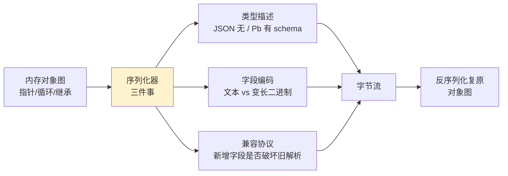
```mermaid
flowchart LR
    A[内存对象图<br/>指针/循环/继承] --> B[序列化器<br/>三件事]
    B --> B1[类型描述<br/>JSON 无 / Pb 有 schema]
    B --> B2[字段编码<br/>文本 vs 变长二进制]
    B --> B3[兼容协议<br/>新增字段是否破坏旧解析]
    B1 & B2 & B3 --> C[字节流]
    C --> D[反序列化复原<br/>对象图]
    style B fill:#fff3cd
```

## 📖 目录结构

### 1. 案例引入
- [1.1 分布式交易系统场景](#11-分布式交易系统场景)
- [1.2 简单序列化的问题](#12-简单序列化的问题)
- [1.3 高效序列化的价值](#13-高效序列化的价值)
- [1.4 引出核心矛盾](#14-引出核心矛盾)

### 2. 序列化设计哲学
- [2.1 核心设计原则](#21-核心设计原则)
- [2.2 序列化模型演进](#22-序列化模型演进)
- [2.3 文本序列化模型](#23-文本序列化模型)
- [2.4 二进制序列化模型](#24-二进制序列化模型)
- [2.5 混合序列化模型](#25-混合序列化模型)
- [2.6 模型决策树](#26-模型决策树)

### 3. JSON序列化机制
- [3.1 JSON设计哲学](#31-json设计哲学)
- [3.2 序列化策略设计](#32-序列化策略设计)
- [3.3 性能优化技术](#33-性能优化技术)
- [3.4 内存管理机制](#34-内存管理机制)

### 4. ProtoBuf序列化机制
- [4.1 ProtoBuf设计哲学](#41-protobuf设计哲学)
- [4.2 编码序列化原理](#42-编码序列化原理)
- [4.3 类型系统设计](#43-类型系统设计)
- [4.4 版本兼容机制](#44-版本兼容机制)

### 5. XML序列化机制
- [5.1 XML设计哲学](#51-xml设计哲学)
- [5.2 序列化模型对比](#52-序列化模型对比)
- [5.3 验证机制设计](#53-验证机制设计)
- [5.4 扩展性设计](#54-扩展性设计)

### 6. 跨语言序列化机制
- [6.1 Java序列化机制](#61-java序列化机制)
- [6.2 JavaScript序列化机制](#62-javascript序列化机制)
- [6.3 Go序列化机制](#63-go序列化机制)
- [6.4 序列化机制对比总结](#64-序列化机制对比总结)

## 1. 案例引入

### 1.1 分布式交易系统场景

**场景设定**：你正在为跨国金融公司设计交易系统，每秒需要处理数万笔交易数据。看似简单的 `JSON.stringify(trade)`，背后却面临着**性能、安全、兼容性**的三重挑战。

```javascript
// 交易对象示例
const trade = {
    tradeId: "TRD202401150001",
    accountId: "ACC987654321",
    symbol: "AAPL",
    quantity: 100,
    price: 150.25,
    currency: "USD",
    timestamp: "2024-01-15T10:30:00.000Z",
    tradeType: "BUY",
    exchange: "NASDAQ",
    fees: [
        { type: "commission", amount: 5.00 },
        { type: "regulatory", amount: 0.15 }
    ],
    metadata: {
        source: "mobile_app",
        version: "2.1.0",
        sessionId: "SESS123456789"
    }
};

// 简单的序列化方式
function serializeTradeSimple(trade) {
    return JSON.stringify(trade);  // 直接序列化整个对象
}
```

看似简单的 `JSON.stringify`，在金融级系统中暴露了 **3 个真实的性能问题**：

- **性能问题**：每秒数万次序列化，CPU占用率飙升
- **内存问题**：大对象序列化产生大量临时字符串，GC压力巨大
- **安全问题**：敏感数据（如账户ID）以明文传输，存在泄露风险

这三个问题分别对应了**计算效率**、**内存效率**、**数据安全**——它们正是序列化机制设计中的三股拉扯力量。

### 1.2 简单序列化的问题

**真实案例**：2023年某支付平台因JSON序列化性能瓶颈导致交易延迟。

```javascript
// 问题代码：同步序列化大对象
class TradeProcessor {
    async processTrades(trades) {
        const serializedTrades = [];
        
        // 同步序列化所有交易
        for (const trade of trades) {
            const serialized = JSON.stringify(trade);  // 同步阻塞！
            serializedTrades.push(serialized);
        }
        
        // 发送到消息队列
        return this.sendToQueue(serializedTrades);
    }
    
    // 问题分析：
    // 1. 同步序列化：大对象阻塞事件循环
    // 2. 内存爆炸：所有序列化结果同时存在内存
    // 3. 安全风险：敏感数据未加密
}
```

**性能测试数据**：

```mermaid
quadrantChart
    title 序列化方案性能对比（10000个交易）
    x-axis "序列化时间(ms)" --> "内存占用(MB)"
    y-axis "安全性" --> "可读性"
    quadrant-1 "平衡型"
    quadrant-2 "性能型"
    quadrant-3 "安全型"
    quadrant-4 "可读型"
    
    "JSON.stringify": [1200, 200]
    "Protobuf序列化": [400, 80]
    "MessagePack序列化": [300, 60]
    "Avro序列化": [500, 100]
```

### 1.3 高效序列化的价值

**优化方案案例**：某高频交易系统通过Protobuf序列化优化性能。

```javascript
// Protobuf序列化优化方案
class ProtobufTradeSerializer {
    constructor() {
        this.schema = protobuf.loadSync('trade.proto');
        this.TradeMessage = this.schema.lookupType('Trade');
    }
    
    // Protobuf序列化：高性能
    serializeTrade(trade) {
        const message = this.TradeMessage.create(trade);
        return this.TradeMessage.encode(message).finish();
    }
    
    // 批量序列化：内存优化
    serializeTradesBatch(trades) {
        const buffer = new Uint8Array(trades.length * 256); // 预分配内存
        let offset = 0;
        
        for (const trade of trades) {
            const serialized = this.serializeTrade(trade);
            buffer.set(serialized, offset);
            offset += serialized.length;
        }
        
        return buffer.slice(0, offset);
    }
    
    // 流式序列化：性能优化
    serializeTradeStream(tradeStream) {
        return new TransformStream({
            transform(trade, controller) {
                const serialized = this.serializeTrade(trade);
                controller.enqueue(serialized);
            }
        });
    }
}
```

**性能提升效果**：

```mermaid
barChart
    title 序列化方案性能对比
    x-axis [JSON序列化, Protobuf序列化, MessagePack序列化, Avro序列化]
    y-axis "耗时(ms)" 0 --> 1500
    bar [1200, 400, 300, 500]
    
    y-axis "内存(MB)" 0 --> 250
    bar [200, 80, 60, 100]
```

### 1.4 引出核心矛盾

**序列化设计的根本矛盾**：

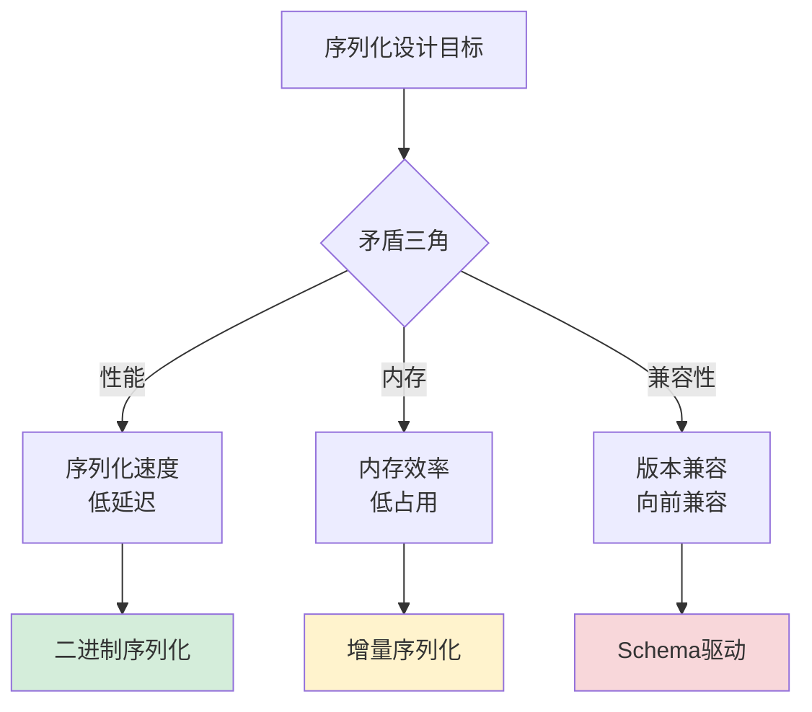
```mermaid
flowchart TD
    A[序列化设计目标] --> B{矛盾三角}
    B -->|性能| C[序列化速度<br/>低延迟]
    B -->|内存| D[内存效率<br/>低占用]
    B -->|兼容性| E[版本兼容<br/>向前兼容]
    
    C --> F[二进制序列化]
    D --> G[增量序列化]
    E --> H[Schema驱动]
    
    style F fill:#d4edda
    style G fill:#fff3cd
    style H fill:#f8d7da
```

## 2. 序列化设计哲学

### 2.1 核心设计原则

**序列化设计哲学案例**：某微服务架构通过序列化设计实现高效通信。

```java
// 序列化设计原则应用
public interface Serializer<T> {
    // 原则1：高性能序列化
    byte[] serialize(T obj) throws SerializationException;
    
    // 原则2：流式序列化
    void serializeStream(T obj, OutputStream output);
    
    // 原则3：类型安全
    byte[] serializeWithSchema(T obj, Schema schema);
    
    // 原则4：版本兼容
    byte[] serializeWithVersion(T obj, int version);
}

// Protobuf序列化实现
public class ProtobufSerializer<T> implements Serializer<T> {
    private final MessageLite prototype;
    
    public ProtobufSerializer(MessageLite prototype) {
        this.prototype = prototype;
    }
    
    @Override
    public byte[] serialize(T obj) {
        if (obj instanceof MessageLite) {
            return ((MessageLite) obj).toByteArray();
        }
        throw new SerializationException("对象类型不匹配");
    }
    
    @Override
    public void serializeStream(T obj, OutputStream output) {
        try {
            if (obj instanceof MessageLite) {
                ((MessageLite) obj).writeTo(output);
            }
        } catch (IOException e) {
            throw new SerializationException("流式序列化失败", e);
        }
    }
}
```

**设计哲学总结**：

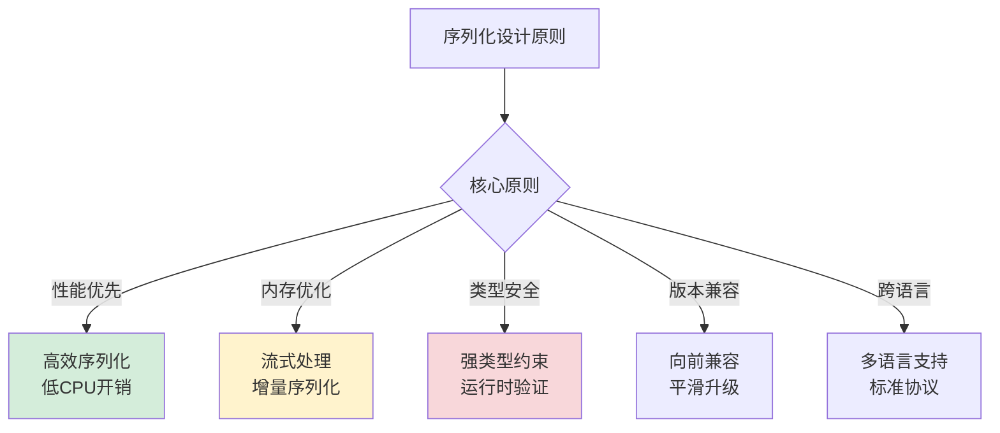
```mermaid
graph TB
    A[序列化设计原则] --> B{核心原则}
    B -->|性能优先| C[高效序列化<br/>低CPU开销]
    B -->|内存优化| D[流式处理<br/>增量序列化]
    B -->|类型安全| E[强类型约束<br/>运行时验证]
    B -->|版本兼容| F[向前兼容<br/>平滑升级]
    B -->|跨语言| G[多语言支持<br/>标准协议]
    
    style C fill:#d4edda
    style D fill:#fff3cd
    style E fill:#f8d7da
```

### 2.2 序列化模型演进

**历史演进案例**：从Java序列化到现代二进制序列化的技术演进。

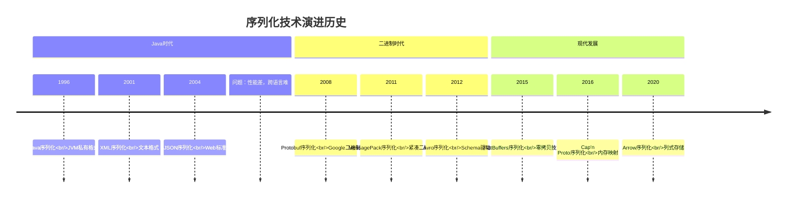
```mermaid
timeline
    title 序列化技术演进历史
    section Java时代
        1996 : Java序列化<br/>JVM私有格式
        2001 : XML序列化<br/>文本格式
        2004 : JSON序列化<br/>Web标准
        问题：性能差，跨语言难
    section 二进制时代
        2008 : Protobuf序列化<br/>Google二进制协议
        2011 : MessagePack序列化<br/>紧凑二进制
        2012 : Avro序列化<br/>Schema驱动
    section 现代发展
        2015 : FlatBuffers序列化<br/>零拷贝技术
        2016 : Cap'n Proto序列化<br/>内存映射
        2020 : Arrow序列化<br/>列式存储
```

### 2.3 文本序列化模型

**文本序列化设计哲学**：可读性优先的权衡。

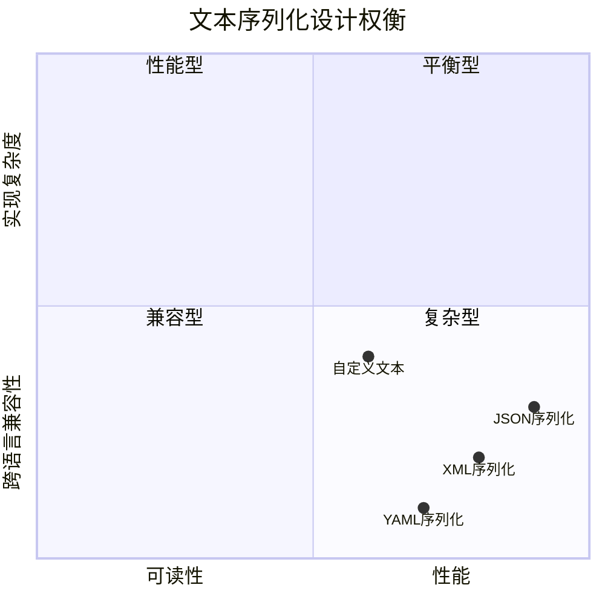
```mermaid
quadrantChart
    title 文本序列化设计权衡
    x-axis "可读性" --> "性能"
    y-axis "跨语言兼容性" --> "实现复杂度"
    quadrant-1 "平衡型"
    quadrant-2 "性能型"
    quadrant-3 "兼容型"
    quadrant-4 "复杂型"
    
    "JSON序列化": [0.9, 0.3]
    "XML序列化": [0.8, 0.2]
    "YAML序列化": [0.7, 0.1]
    "自定义文本": [0.6, 0.4]
```

### 2.4 二进制序列化模型

**二进制序列化设计哲学**：性能优先的权衡。

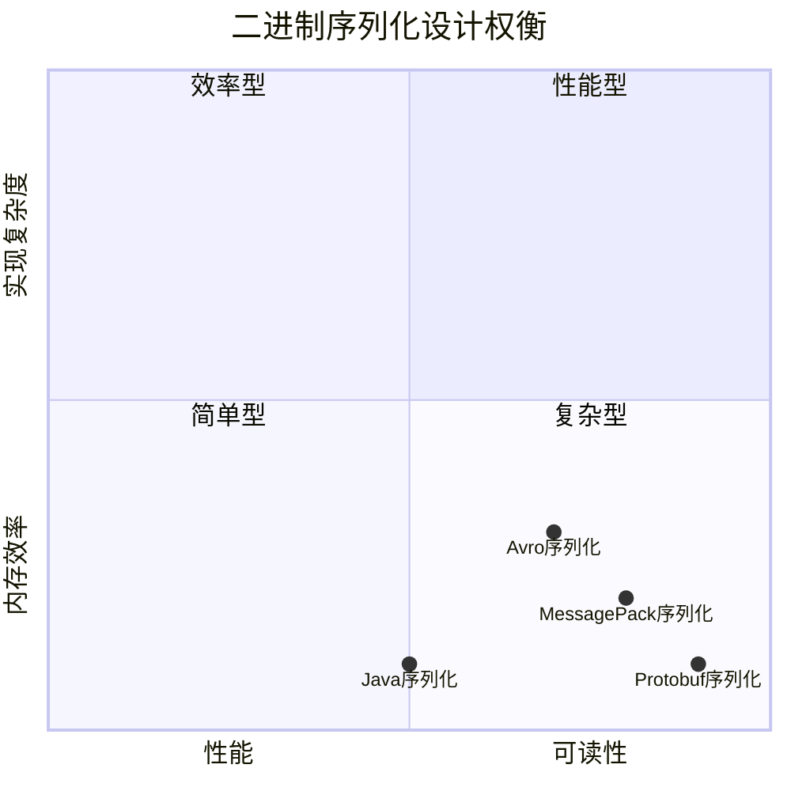
```mermaid
quadrantChart
    title 二进制序列化设计权衡
    x-axis "性能" --> "可读性"
    y-axis "内存效率" --> "实现复杂度"
    quadrant-1 "性能型"
    quadrant-2 "效率型"
    quadrant-3 "简单型"
    quadrant-4 "复杂型"
    
    "Protobuf序列化": [0.9, 0.1]
    "MessagePack序列化": [0.8, 0.2]
    "Avro序列化": [0.7, 0.3]
    "Java序列化": [0.5, 0.1]
```

### 2.5 混合序列化模型

**混合序列化案例**：某消息中间件通过混合序列化实现平衡。

```java
// 混合序列化机制
class HybridSerializer {
    // 根据场景选择序列化方式
    public byte[] serialize(Object obj, SerializationType type) {
        switch (type) {
            case JSON:
                return jsonSerialize(obj);  // 可读性优先
            case PROTOBUF:
                return protobufSerialize(obj);  // 性能优先
            case MESSAGE_PACK:
                return messagePackSerialize(obj);  // 紧凑优先
            default:
                return defaultSerialize(obj);
        }
    }
    
    // JSON序列化：可读性优先
    private byte[] jsonSerialize(Object obj) {
        ObjectMapper mapper = new ObjectMapper();
        return mapper.writeValueAsBytes(obj);
    }
    
    // Protobuf序列化：性能优先
    private byte[] protobufSerialize(Object obj) {
        if (obj instanceof MessageLite) {
            return ((MessageLite) obj).toByteArray();
        }
        throw new SerializationException("不支持的对象类型");
    }
    
    // MessagePack序列化：紧凑优先
    private byte[] messagePackSerialize(Object obj) {
        MessagePack msgpack = new MessagePack();
        return msgpack.write(obj);
    }
}
```

**混合序列化设计哲学**：

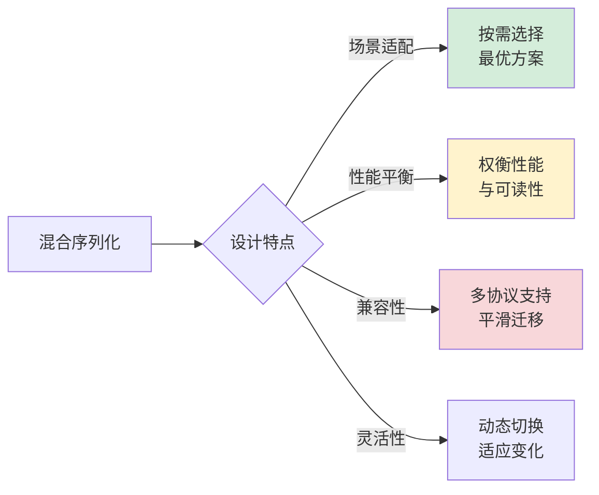
```mermaid
graph LR
    A[混合序列化] --> B{设计特点}
    B -->|场景适配| C[按需选择<br/>最优方案]
    B -->|性能平衡| D[权衡性能<br/>与可读性]
    B -->|兼容性| E[多协议支持<br/>平滑迁移]
    B -->|灵活性| F[动态切换<br/>适应变化]
    
    style C fill:#d4edda
    style D fill:#fff3cd
    style E fill:#f8d7da
```

### 2.6 模型决策树

**序列化方案选择指南**：

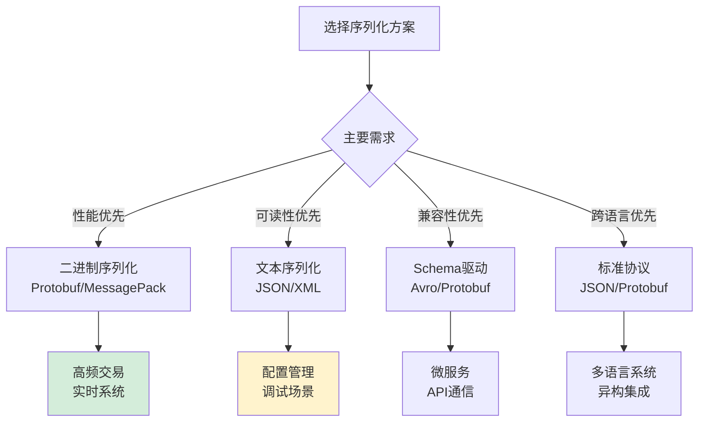
```mermaid
flowchart TD
    A[选择序列化方案] --> B{主要需求}
    B -->|性能优先| C[二进制序列化<br/>Protobuf/MessagePack]
    B -->|可读性优先| D[文本序列化<br/>JSON/XML]
    B -->|兼容性优先| E[Schema驱动<br/>Avro/Protobuf]
    B -->|跨语言优先| F[标准协议<br/>JSON/Protobuf]
    
    C --> G[高频交易<br/>实时系统]
    D --> H[配置管理<br/>调试场景]
    E --> I[微服务<br/>API通信]
    F --> J[多语言系统<br/>异构集成]
    
    style G fill:#d4edda
    style H fill:#fff3cd
```

## 3. JSON序列化机制

### 3.1 JSON设计哲学

**JSON序列化设计哲学案例**：某API网关通过JSON序列化实现高性能请求处理。

```javascript
// JSON序列化设计哲学
class JsonSerializer {
    // 设计原则1：性能优先
    serializeFast(obj) {
        return JSON.stringify(obj);  // 原生序列化器
    }
    
    // 设计原则2：安全优先
    serializeSafe(obj) {
        const replacer = (key, value) => {
            // 安全过滤：排除敏感字段
            if (key === 'password' || key === 'token') {
                return undefined;
            }
            return value;
        };
        return JSON.stringify(obj, replacer);
    }
    
    // 设计原则3：流式序列化
    serializeStream(obj, callback) {
        const chunks = [];
        
        // 增量序列化：避免内存峰值
        for (const key in obj) {
            if (obj.hasOwnProperty(key)) {
                const chunk = `"${key}":${JSON.stringify(obj[key])}`;
                chunks.push(chunk);
                callback(chunk);
            }
        }
        
        return `{${chunks.join(',')}}`;
    }
    
    // 设计原则4：选择性序列化
    serializeSelective(obj, fields) {
        const result = {};
        fields.forEach(field => {
            if (obj.hasOwnProperty(field)) {
                result[field] = obj[field];
            }
        });
        return JSON.stringify(result);
    }
}
```

**JSON序列化设计权衡**：

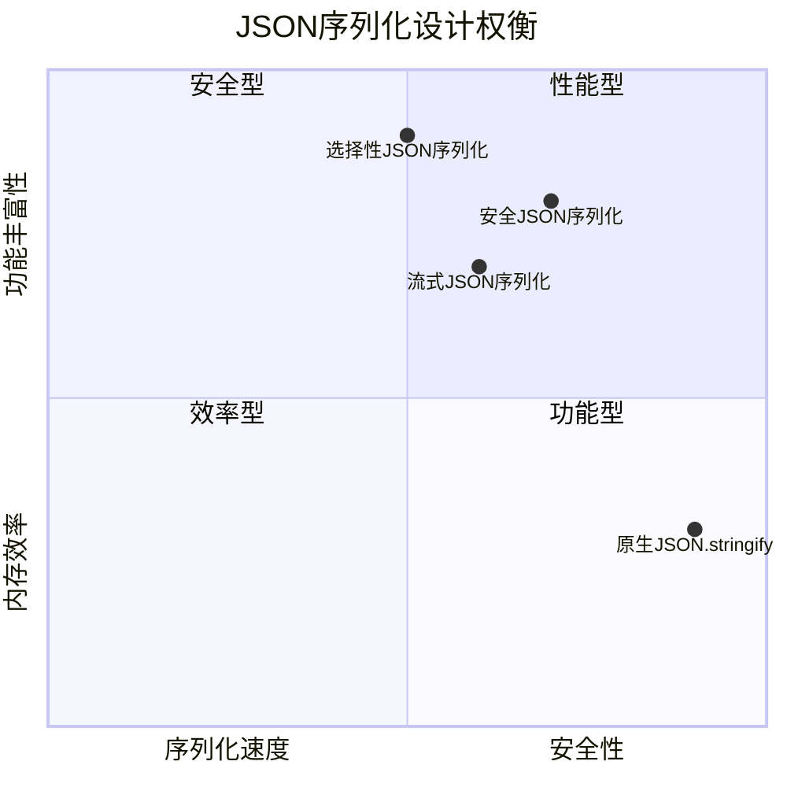
```mermaid
quadrantChart
    title JSON序列化设计权衡
    x-axis "序列化速度" --> "安全性"
    y-axis "内存效率" --> "功能丰富性"
    quadrant-1 "性能型"
    quadrant-2 "安全型"
    quadrant-3 "效率型"
    quadrant-4 "功能型"
    
    "原生JSON.stringify": [0.9, 0.3]
    "安全JSON序列化": [0.7, 0.8]
    "流式JSON序列化": [0.6, 0.7]
    "选择性JSON序列化": [0.5, 0.9]
```

### 3.2 序列化策略设计

**JSON序列化策略案例**：某电商平台通过序列化策略优化订单处理性能。

```javascript
// JSON序列化策略设计
class JsonSerializationStrategy {
    // 策略1：缓存序列化结果
    constructor() {
        this.serializationCache = new Map();
    }
    
    serializeWithCache(obj, cacheKey) {
        if (this.serializationCache.has(cacheKey)) {
            return this.serializationCache.get(cacheKey);
        }
        const result = JSON.stringify(obj);
        this.serializationCache.set(cacheKey, result);
        return result;
    }
    
    // 策略2：并行序列化
    async serializeParallel(objects) {
        const promises = objects.map(obj => 
            this.serializeInWorker(obj)
        );
        return Promise.all(promises);
    }
    
    serializeInWorker(obj) {
        return new Promise((resolve) => {
            const worker = new Worker('json-serializer.js');
            worker.postMessage(obj);
            worker.onmessage = (e) => resolve(e.data);
        });
    }
    
    // 策略3：增量序列化
    serializeIncremental(obj, chunkSize = 1024) {
        const keys = Object.keys(obj);
        const chunks = [];
        
        for (let i = 0; i < keys.length; i += chunkSize) {
            const chunkKeys = keys.slice(i, i + chunkSize);
            const chunk = {};
            chunkKeys.forEach(key => {
                chunk[key] = obj[key];
            });
            chunks.push(JSON.stringify(chunk));
        }
        
        return chunks;
    }
}
```

**JSON序列化策略设计哲学**：

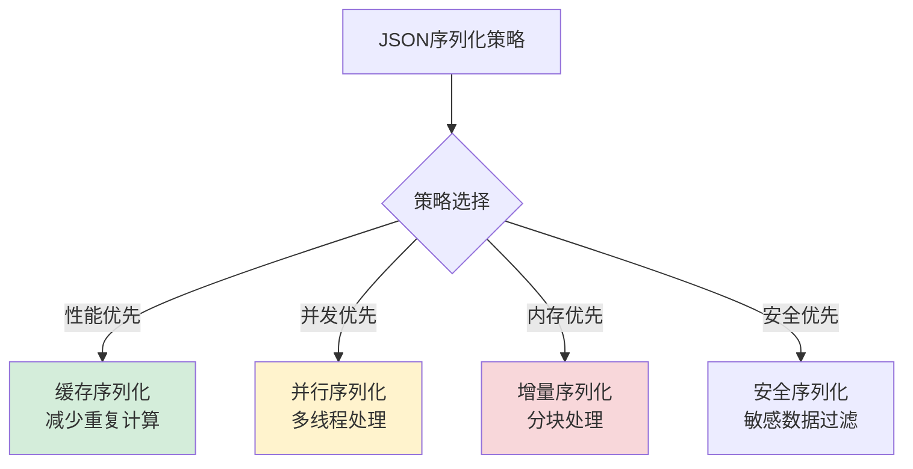
```mermaid
graph TB
    A[JSON序列化策略] --> B{策略选择}
    B -->|性能优先| C[缓存序列化<br/>减少重复计算]
    B -->|并发优先| D[并行序列化<br/>多线程处理]
    B -->|内存优先| E[增量序列化<br/>分块处理]
    B -->|安全优先| F[安全序列化<br/>敏感数据过滤]
    
    style C fill:#d4edda
    style D fill:#fff3cd
    style E fill:#f8d7da
```

### 3.3 性能优化技术

**JSON性能优化案例**：某高并发系统通过JSON优化提升吞吐量。

```javascript
// JSON性能优化技术
class JsonPerformanceOptimizer {
    // 优化1：预编译序列化器
    constructor() {
        this.cachedSerializers = new Map();
    }
    
    // 优化2：对象池化
    serializeWithObjectPool(obj) {
        const key = this.generateKey(obj);
        if (this.objectPool.has(key)) {
            return this.objectPool.get(key);
        }
        const result = JSON.stringify(obj);
        this.objectPool.set(key, result);
        return result;
    }
    
    // 优化3：懒序列化
    serializeLazy(obj) {
        return new LazyJsonString(obj);
    }
    
    // 优化4：渐进式序列化
    serializeProgressive(obj, callback) {
        const keys = Object.keys(obj);
        let result = '{';
        
        for (let i = 0; i < keys.length; i++) {
            const key = keys[i];
            const value = obj[key];
            const part = `"${key}":${JSON.stringify(value)}`;
            
            if (i > 0) result += ',';
            result += part;
            
            // 渐进式回调
            callback(result + '}');
        }
        
        return result + '}';
    }
}

// 懒序列化对象
class LazyJsonString {
    constructor(obj) {
        this.obj = obj;
        this.serialized = null;
    }
    
    toString() {
        if (!this.serialized) {
            this.serialized = JSON.stringify(this.obj);
        }
        return this.serialized;
    }
}
```

**JSON性能优化设计哲学**：

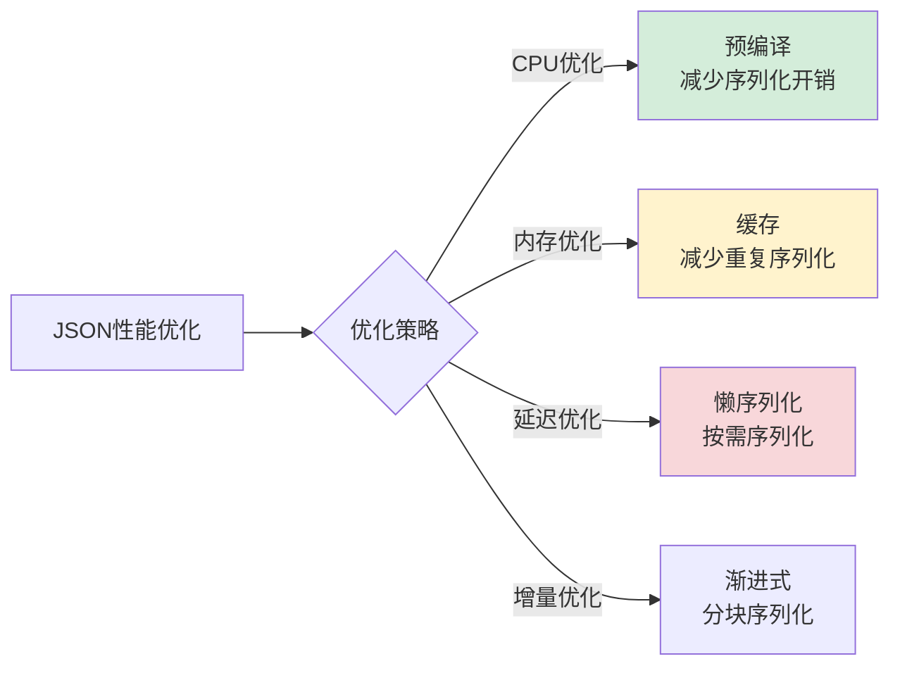
```mermaid
graph LR
    A[JSON性能优化] --> B{优化策略}
    B -->|CPU优化| C[预编译<br/>减少序列化开销]
    B -->|内存优化| D[缓存<br/>减少重复序列化]
    B -->|延迟优化| E[懒序列化<br/>按需序列化]
    B -->|增量优化| F[渐进式<br/>分块序列化]
    
    style C fill:#d4edda
    style D fill:#fff3cd
    style E fill:#f8d7da
```

### 3.4 内存管理机制

**JSON内存管理案例**：某大数据平台通过JSON内存管理优化GC性能。

```javascript
// JSON内存管理机制
class JsonMemoryManager {
    constructor() {
        this.stringPool = new Map();
        this.objectPool = new Map();
        this.serializerPool = new Map();
    }
    
    // 内存管理1：字符串池化
    serializeWithStringPool(obj) {
        const key = JSON.stringify(obj);
        if (this.stringPool.has(key)) {
            return this.stringPool.get(key);
        }
        const result = JSON.stringify(obj);
        this.stringPool.set(key, result);
        return result;
    }
    
    // 内存管理2：对象池化
    serializeWithObjectPool(obj) {
        const key = this.generateKey(obj);
        if (this.objectPool.has(key)) {
            return this.objectPool.get(key);
        }
        const result = JSON.stringify(obj);
        this.objectPool.set(key, result);
        return result;
    }
    
    // 内存管理3：序列化器复用
    getSerializer() {
        if (this.serializerPool.size > 0) {
            return this.serializerPool.pop();
        }
        return new JsonSerializer();
    }
    
    releaseSerializer(serializer) {
        this.serializerPool.push(serializer);
    }
}
```

**JSON内存管理设计哲学**：

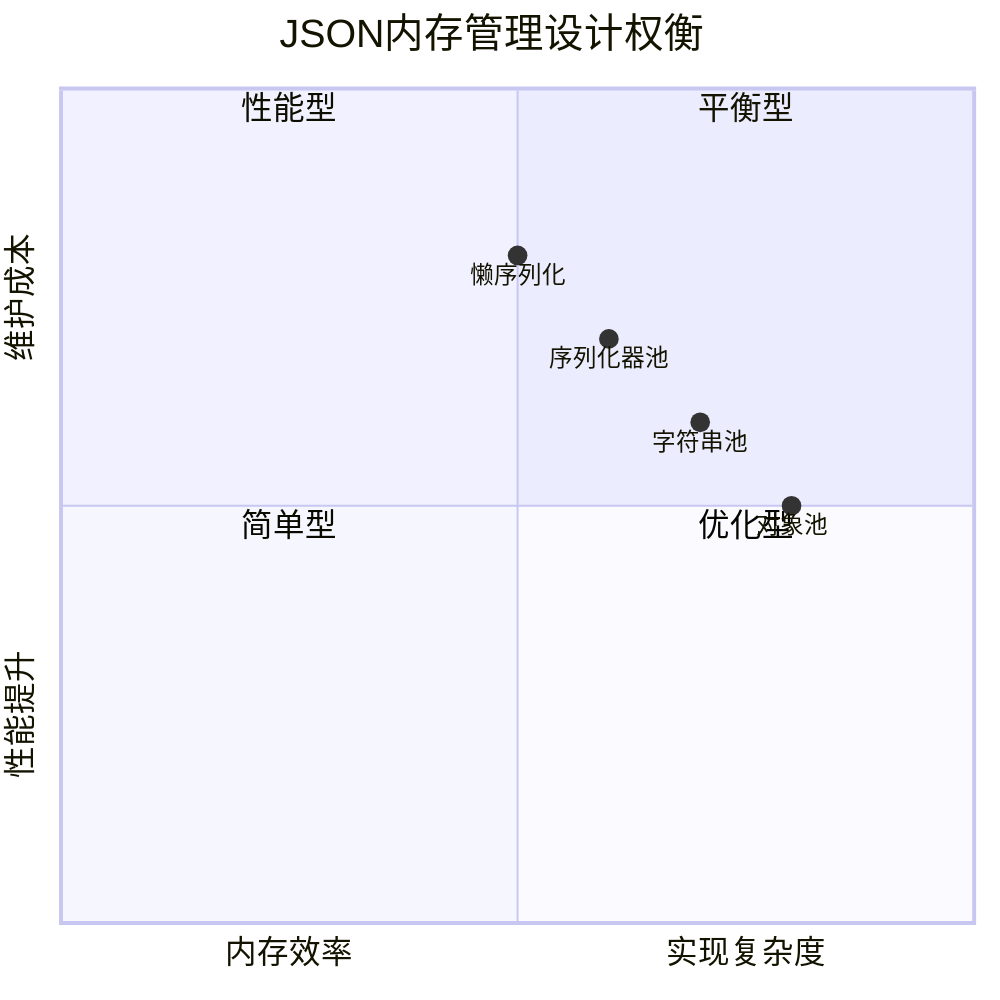
```mermaid
quadrantChart
    title JSON内存管理设计权衡
    x-axis "内存效率" --> "实现复杂度"
    y-axis "性能提升" --> "维护成本"
    quadrant-1 "平衡型"
    quadrant-2 "性能型"
    quadrant-3 "简单型"
    quadrant-4 "优化型"
    
    "字符串池": [0.7, 0.6]
    "对象池": [0.8, 0.5]
    "序列化器池": [0.6, 0.7]
    "懒序列化": [0.5, 0.8]
```

## 4. ProtoBuf序列化机制

### 4.1 ProtoBuf设计哲学

**Protobuf序列化设计哲学案例**：某微服务架构通过Protobuf序列化实现高性能通信。

```protobuf
// Protobuf序列化设计哲学：Schema驱动
syntax = "proto3";

message User {
    string id = 1;           // 字段编号：紧凑序列化
    string name = 2;         // 字段类型：强类型约束
    int32 age = 3;           // 默认值：类型安全
    repeated string tags = 4; // 重复字段：数组支持
    
    // 序列化哲学：
    // 1. Schema优先：编译期类型检查
    // 2. 二进制序列化：高性能编码
    // 3. 版本兼容：字段编号机制
}
```

**Protobuf序列化设计权衡**：

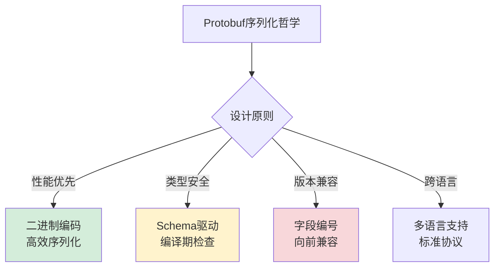
```mermaid
graph TB
    A[Protobuf序列化哲学] --> B{设计原则}
    B -->|性能优先| C[二进制编码<br/>高效序列化]
    B -->|类型安全| D[Schema驱动<br/>编译期检查]
    B -->|版本兼容| E[字段编号<br/>向前兼容]
    B -->|跨语言| F[多语言支持<br/>标准协议]
    
    style C fill:#d4edda
    style D fill:#fff3cd
    style E fill:#f8d7da
```

### 4.2 编码序列化原理

**Protobuf编码序列化案例**：某消息队列系统通过Protobuf编码优化序列化效率。

```protobuf
// Protobuf编码序列化原理
message Trade {
    // Varint编码序列化：小整数更高效
    int32 trade_id = 1;      // Varint编码
    
    // 64位编码序列化：固定长度
    double price = 2;         // 64位浮点数编码
    
    // 长度前缀序列化：字符串/字节数组
    string symbol = 3;        // 长度前缀 + UTF-8编码
    
    // 嵌套消息序列化
    repeated Fee fees = 4;    // 重复字段编码
    
    // 序列化哲学：
    // 1. Varint编码：小整数优化
    // 2. 长度前缀：变长数据编码
    // 3. 字段编号：紧凑标识
}

message Fee {
    string type = 1;
    double amount = 2;
}
```

**Protobuf编码序列化设计哲学**：

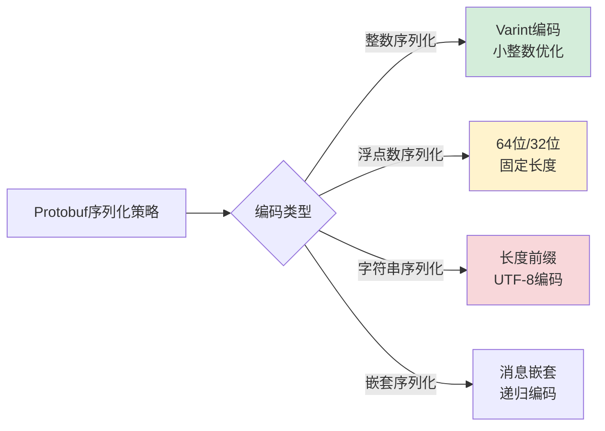
```mermaid
graph LR
    A[Protobuf序列化策略] --> B{编码类型}
    B -->|整数序列化| C[Varint编码<br/>小整数优化]
    B -->|浮点数序列化| D[64位/32位<br/>固定长度]
    B -->|字符串序列化| E[长度前缀<br/>UTF-8编码]
    B -->|嵌套序列化| F[消息嵌套<br/>递归编码]
    
    style C fill:#d4edda
    style D fill:#fff3cd
    style E fill:#f8d7da
```

### 4.3 类型系统设计

**Protobuf类型系统案例**：某数据平台通过Protobuf类型系统保证序列化一致性。

```protobuf
// Protobuf类型系统设计
message DataRecord {
    // 基本类型系统
    string id = 1;                    // 字符串类型序列化
    int32 count = 2;                  // 32位整数序列化
    int64 timestamp = 3;               // 64位整数序列化
    double value = 4;                  // 双精度浮点序列化
    bool is_valid = 5;                 // 布尔值序列化
    bytes raw_data = 6;               // 字节数组序列化
    
    // 复合类型系统
    repeated string tags = 7;          // 字符串数组序列化
    map<string, int32> metrics = 8;    // 字典映射序列化
    
    // 枚举类型系统
    enum Status {
        PENDING = 0;
        PROCESSING = 1;
        COMPLETED = 2;
        FAILED = 3;
    }
    Status status = 9;
    
    // 嵌套类型系统
    repeated DataPoint points = 10;    // 嵌套消息序列化
}

message DataPoint {
    double x = 1;
    double y = 2;
}
```

**Protobuf类型系统设计哲学**：

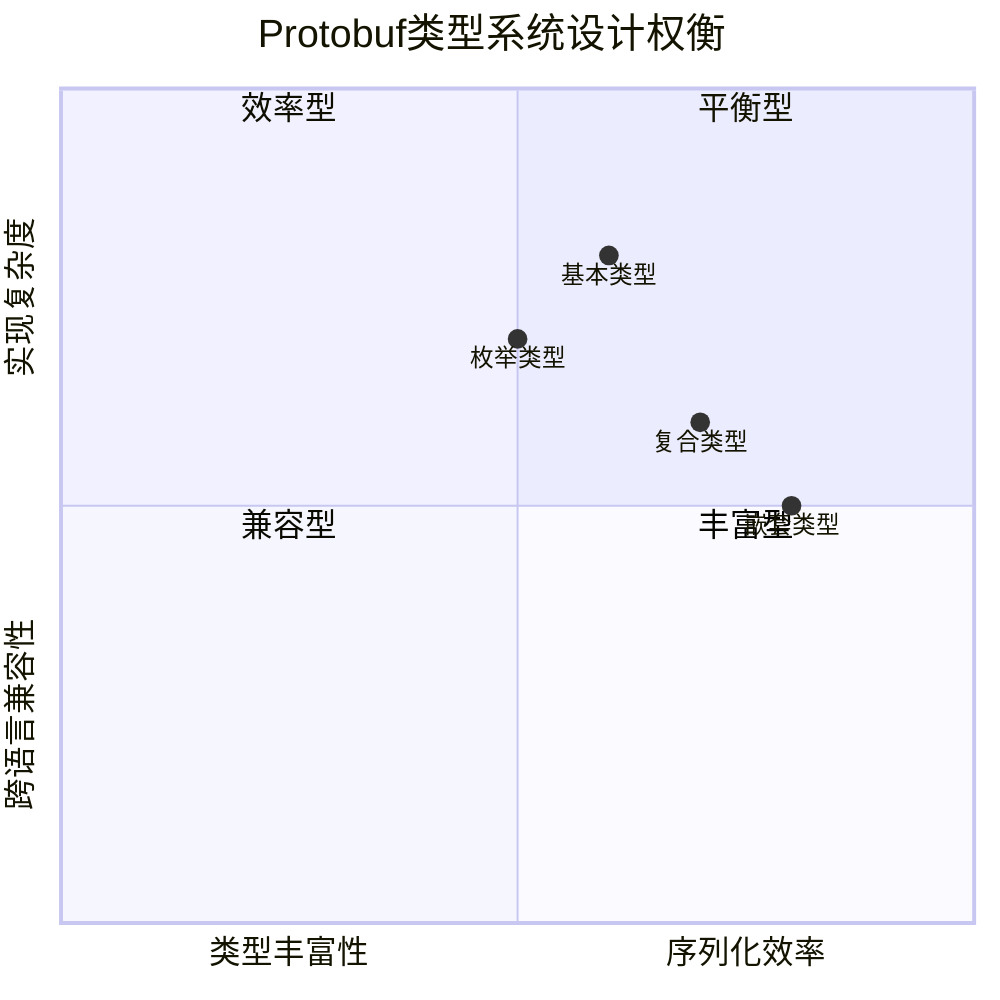
```mermaid
quadrantChart
    title Protobuf类型系统设计权衡
    x-axis "类型丰富性" --> "序列化效率"
    y-axis "跨语言兼容性" --> "实现复杂度"
    quadrant-1 "平衡型"
    quadrant-2 "效率型"
    quadrant-3 "兼容型"
    quadrant-4 "丰富型"
    
    "基本类型": [0.6, 0.8]
    "复合类型": [0.7, 0.6]
    "枚举类型": [0.5, 0.7]
    "嵌套类型": [0.8, 0.5]
```

### 4.4 版本兼容机制

**Protobuf版本兼容案例**：某API服务通过Protobuf实现平滑升级。

```protobuf
// Protobuf版本兼容机制
message UserV1 {
    string id = 1;
    string name = 2;
    int32 age = 3;
    // V1版本字段
}

message UserV2 {
    string id = 1;           // 保留字段编号
    string name = 2;         // 保留字段编号
    int32 age = 3;          // 保留字段编号
    string email = 4;       // 新增字段
    string phone = 5;       // 新增字段
    
    // 版本兼容规则：
    // 1. 不删除字段：只标记为废弃
    // 2. 不重用字段编号：避免冲突
    // 3. 新增字段：使用新编号
}

// 向后兼容：V2序列化器可以序列化V1数据
// 向前兼容：V1序列化器可以序列化V2数据（忽略未知字段）
```

**Protobuf版本兼容设计哲学**：

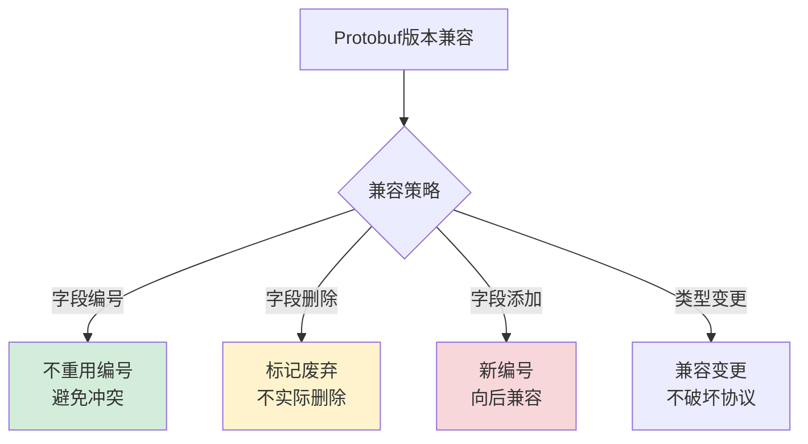
```mermaid
graph TB
    A[Protobuf版本兼容] --> B{兼容策略}
    B -->|字段编号| C[不重用编号<br/>避免冲突]
    B -->|字段删除| D[标记废弃<br/>不实际删除]
    B -->|字段添加| E[新编号<br/>向后兼容]
    B -->|类型变更| F[兼容变更<br/>不破坏协议]
    
    style C fill:#d4edda
    style D fill:#fff3cd
    style E fill:#f8d7da
```

## 5. XML序列化机制

### 5.1 XML设计哲学

**XML设计哲学案例**：某数据平台通过XML实现数据交换。

```xml
<!-- XML设计哲学 -->
<user>
    <id>123</id>
    <name>John Doe</name>
    <age>30</age>
    <email>john.doe@example.com</email>
    <phone>123-456-7890</phone>
    <address>
        <street>123 Main St</street>
        <city>Anytown</city>
        <state>CA</state>
        <zip>12345</zip>
    </address>
</user>
```

**XML设计权衡**：

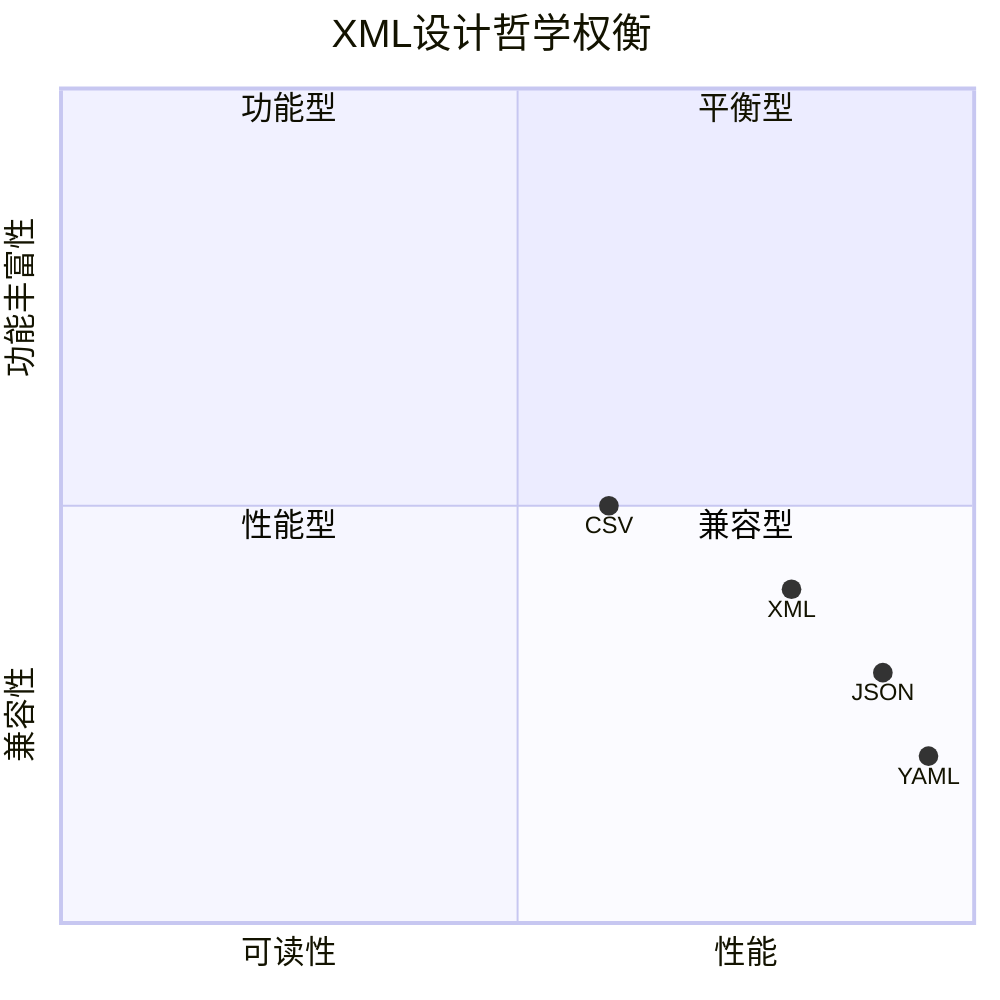
```mermaid
quadrantChart
    title XML设计哲学权衡
    x-axis "可读性" --> "性能"
    y-axis "兼容性" --> "功能丰富性"
    quadrant-1 "平衡型"
    quadrant-2 "功能型"
    quadrant-3 "性能型"
    quadrant-4 "兼容型"
    
    "XML": [0.8, 0.4]
    "JSON": [0.9, 0.3]
    "YAML": [0.95, 0.2]
    "CSV": [0.6, 0.5]
```

### 5.2 序列化模型对比

**XML的两种经典序列化模型**：

```java
// DOM序列化（树形结构）
public String serializeTradeDOM(Trade trade) throws Exception {
    DocumentBuilderFactory factory = DocumentBuilderFactory.newInstance();
    DocumentBuilder builder = factory.newDocumentBuilder();
    Document doc = builder.newDocument();
    
    Element root = doc.createElement("trade");
    doc.appendChild(root);
    
    Element tradeId = doc.createElement("tradeId");
    tradeId.setTextContent(trade.getTradeId());
    root.appendChild(tradeId);
    
    Element accountId = doc.createElement("accountId");
    accountId.setTextContent(trade.getAccountId());
    root.appendChild(accountId);
    
    // 更多字段序列化...
    
    // 转换为XML字符串
    TransformerFactory transformerFactory = TransformerFactory.newInstance();
    Transformer transformer = transformerFactory.newTransformer();
    StringWriter writer = new StringWriter();
    transformer.transform(new DOMSource(doc), new StreamResult(writer));
    return writer.toString();
}

// SAX风格序列化（事件驱动）
public void serializeTradeSAX(Trade trade, ContentHandler handler) throws SAXException {
    handler.startDocument();
    
    AttributesImpl atts = new AttributesImpl();
    handler.startElement("", "trade", "trade", atts);
    
    handler.startElement("", "tradeId", "tradeId", atts);
    handler.characters(trade.getTradeId().toCharArray(), 0, trade.getTradeId().length());
    handler.endElement("", "tradeId", "tradeId");
    
    handler.startElement("", "accountId", "accountId", atts);
    handler.characters(trade.getAccountId().toCharArray(), 0, trade.getAccountId().length());
    handler.endElement("", "accountId", "accountId");
    
    // 更多字段序列化...
    
    handler.endElement("", "trade", "trade");
    handler.endDocument();
}
```

**模型对比总结**：

| 特性 | DOM序列化 | SAX序列化 |
|------|----------|-----------|
| **内存使用** | 高（完整树） | 低（流式） |
| **开发复杂度** | 简单 | 复杂 |
| **适用场景** | 小文档、复杂操作 | 大文档、简单处理 |
| **性能特点** | 序列化慢、访问快 | 序列化快、访问难 |

### 5.3 验证机制设计

**XML的强验证能力**：

```xml
<!-- DTD验证 -->
<!DOCTYPE trade [
    <!ELEMENT trade (tradeId, accountId, symbol, quantity, price, currency, timestamp)>
    <!ELEMENT tradeId (#PCDATA)>
    <!ELEMENT accountId (#PCDATA)>
    <!ELEMENT symbol (#PCDATA)>
    <!ELEMENT quantity (#PCDATA)>
    <!ELEMENT price (#PCDATA)>
    <!ELEMENT currency (#PCDATA)>
    <!ELEMENT timestamp (#PCDATA)>
    <!ATTLIST trade version CDATA #IMPLIED>
]>

<!-- XML Schema验证 -->
<xs:schema xmlns:xs="http://www.w3.org/2001/XMLSchema">
    <xs:element name="trade">
        <xs:complexType>
            <xs:sequence>
                <xs:element name="tradeId" type="xs:string"/>
                <xs:element name="accountId" type="xs:string"/>
                <xs:element name="symbol" type="xs:string"/>
                <xs:element name="quantity" type="xs:integer"/>
                <xs:element name="price" type="xs:decimal"/>
                <xs:element name="currency" type="xs:string"/>
                <xs:element name="timestamp" type="xs:dateTime"/>
            </xs:sequence>
            <xs:attribute name="version" type="xs:string" use="optional"/>
        </xs:complexType>
    </xs:element>
</xs:schema>
```

**验证价值**：确保数据完整性和一致性。

### 5.4 扩展性设计

**XML的扩展机制**：

```xml
<!-- 命名空间支持扩展 -->
<trade xmlns="http://example.com/trades"
       xmlns:pay="http://example.com/payment"
       xmlns:tax="http://example.com/taxation">
    <tradeId>123</tradeId>
    <accountId>456</accountId>
    
    <!-- 支付扩展 -->
    <pay:payment>
        <pay:method>creditcard</pay:method>
        <pay:amount>100.00</pay:amount>
    </pay:payment>
    
    <!-- 税务扩展 -->
    <tax:taxInfo>
        <tax:rate>0.15</tax:rate>
        <tax:amount>15.00</tax:amount>
    </tax:taxInfo>
</trade>
```

**扩展性优势**：支持多领域集成，保持核心结构稳定。

## 6. 跨语言序列化机制

### 6.1 Java序列化机制

**Java序列化设计哲学**：JVM生态的深度集成。

```java
// Java序列化机制
class JavaSerializationExample {
    // JSON序列化：Jackson库
    public String serializeJsonWithJackson(Object obj) throws IOException {
        ObjectMapper mapper = new ObjectMapper();
        return mapper.writeValueAsString(obj);
    }
    
    // XML序列化：JAXB
    public String serializeXmlWithJaxb(Object obj) throws JAXBException {
        JAXBContext context = JAXBContext.newInstance(obj.getClass());
        Marshaller marshaller = context.createMarshaller();
        StringWriter writer = new StringWriter();
        marshaller.marshal(obj, writer);
        return writer.toString();
    }
    
    // 设计哲学：
    // 1. 反射驱动：自动类型映射
    // 2. 注解配置：声明式序列化
    // 3. 性能优化：字节码生成
}
```

**Java序列化设计权衡**：

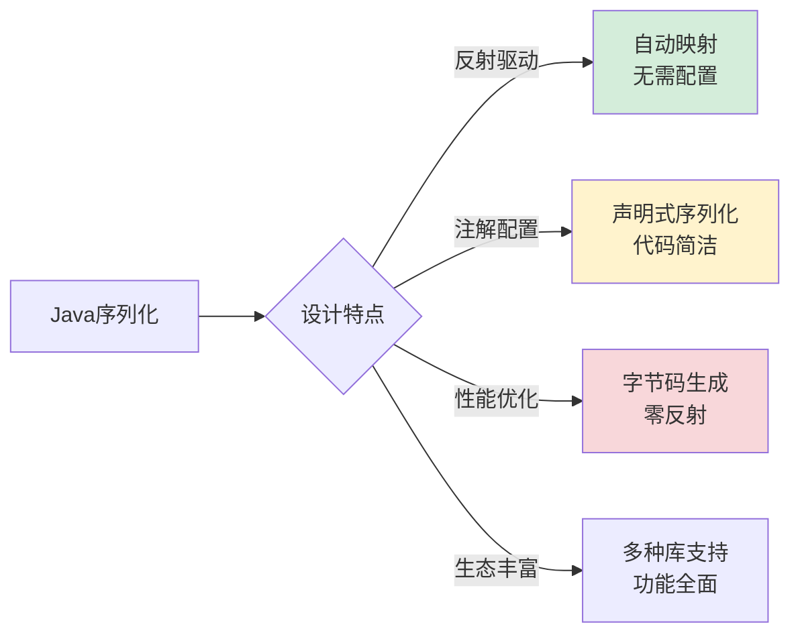
```mermaid
graph LR
    A[Java序列化] --> B{设计特点}
    B -->|反射驱动| C[自动映射<br/>无需配置]
    B -->|注解配置| D[声明式序列化<br/>代码简洁]
    B -->|性能优化| E[字节码生成<br/>零反射]
    B -->|生态丰富| F[多种库支持<br/>功能全面]
    
    style C fill:#d4edda
    style D fill:#fff3cd
    style E fill:#f8d7da
```

### 6.2 JavaScript序列化机制

**JavaScript序列化设计哲学**：Web生态的灵活设计。

```javascript
// JavaScript序列化机制
class JsSerializationExample {
    // JSON序列化：原生支持
    serializeJson(obj) {
        return JSON.stringify(obj);
    }
    
    // XML序列化：DOM序列化器
    serializeXml(obj) {
        const serializer = new XMLSerializer();
        return serializer.serializeToString(obj);
    }
    
    // 自定义序列化：流式处理
    serializeCustom(obj, schema) {
        const serializer = new CustomSerializer(schema);
        return serializer.serialize(obj);
    }
    
    // 设计哲学：
    // 1. 原生支持：JSON.stringify标准
    // 2. 灵活扩展：自定义序列化器
    // 3. 异步处理：Promise支持
}
```

**JavaScript序列化设计权衡**：

```mermaid
quadrantChart
    title JavaScript序列化设计权衡
    x-axis "灵活性" --> "类型安全"
    y-axis "性能" --> "可读性"
    quadrant-1 "平衡型"
    quadrant-2 "安全型"
    quadrant-3 "性能型"
    quadrant-4 "灵活型"
    
    "JSON.stringify": [0.9, 0.3]
    "自定义序列化": [0.8, 0.5]
    "流式序列化": [0.6, 0.7]
    "验证序列化": [0.5, 0.9]
```

### 6.3 Go序列化机制

**Go序列化设计哲学**：简洁高效的静态类型设计。

```go
// Go序列化机制
type Trade struct {
    TradeID   string    `json:"trade_id"`    // 标签：字段映射
    AccountID string    `json:"account_id"`
    Symbol    string    `json:"symbol"`
    Quantity  int       `json:"quantity"`
    Price     float64   `json:"price"`
    Timestamp time.Time `json:"timestamp"`
    
    // 设计哲学：
    // 1. 结构体标签：元数据驱动
    // 2. 标准库支持：encoding/json
    // 3. 性能优化：避免反射开销
}

// JSON序列化
func SerializeTrade(trade Trade) ([]byte, error) {
    return json.Marshal(trade)
}

// 自定义序列化
func SerializeTradeCustom(trade Trade) ([]byte, error) {
    // 手动序列化逻辑
    // ...
    return nil, nil
}
```

**Go序列化设计权衡**：

```mermaid
graph TB
    A[Go序列化] --> B{设计特点}
    B -->|结构体标签| C[元数据驱动<br/>字段映射]
    B -->|标准库| D[encoding/json<br/>官方支持]
    B -->|性能优化| E[避免反射<br/>高效序列化]
    B -->|类型安全| F[静态类型<br/>编译期检查]
    
    style C fill:#d4edda
    style D fill:#fff3cd
    style E fill:#f8d7da
```

### 6.4 序列化机制对比总结

**跨语言序列化对比分析**：

```mermaid
gantt
    title 序列化技术演进时间线
    dateFormat  YYYY
    axisFormat  %Y
    
    section 文本序列化
    XML序列化        :1998, 10y
    JSON序列化       :2001, 23y
    YAML序列化       :2004, 20y
    
    section 二进制序列化
    Java序列化       :1996, 28y
    Protobuf序列化   :2008, 16y
    MessagePack序列化:2011, 13y
    Avro序列化       :2012, 12y
    
    section 现代序列化
    FlatBuffers序列化:2015, 9y
    Cap'n Proto序列化:2016, 8y
    Arrow序列化      :2017, 7y
```

**序列化技术选择指南**：

```mermaid
quadrantChart
    title 序列化技术选择矩阵
    x-axis "性能需求" --> "可读性需求"
    y-axis "跨语言需求" --> "Schema需求"
    quadrant-1 "高性能型"
    quadrant-2 "跨语言型"
    quadrant-3 "可读型"
    quadrant-4 "Schema型"
    
    "Protobuf序列化": [0.9, 0.8]
    "JSON序列化": [0.3, 0.9]
    "Avro序列化": [0.7, 0.7]
    "MessagePack序列化": [0.8, 0.5]
    "XML序列化": [0.2, 0.6]
    "Java序列化": [0.4, 0.3]
```

---

## 🎯 一句话总结

> **序列化数据思想**的本质是在**内存对象的复杂图结构**与**传输存储的线性字节流**之间建立桥梁。优秀的序列化器不仅要是高效的编码器，更要是聪明的翻译官——懂得何时压缩、何时保留、何时兼容。

## 🔗 延伸阅读

- ← [00.数据编码设计原理](./00.数据编码设计原理.md)：序列化的底层编码基础
- → [06.数据解析设计思想](./06.数据解析设计思想.md)：序列化的逆过程——解析
- → [07.类的加载核心原理](./07.类的加载核心原理.md)：另一种形式的"序列化"——字节码到类对象
- → [08.对象创建流程原理](./08.对象创建流程原理.md)：序列化后的对象如何重建
