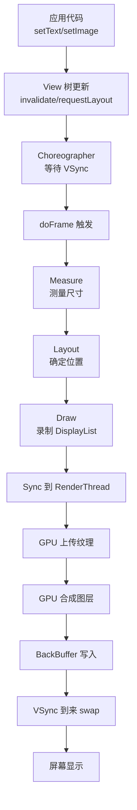
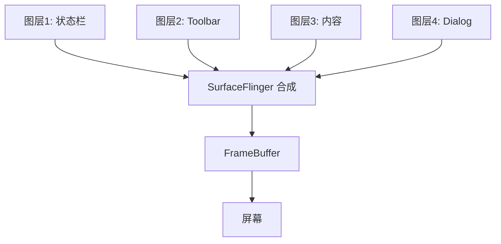
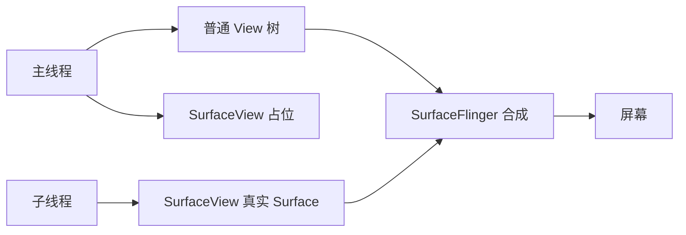
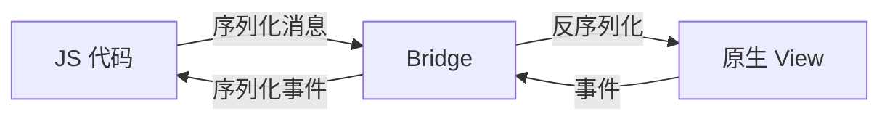

# 41.视图加载渲染设计

#### 目录介绍
- [00.从一次"60帧变6帧"事故说起](#00从一次60帧变6帧事故说起)
    - [0.1 用户投诉：滑一下卡到怀疑手机坏了](#01-用户投诉滑一下卡到怀疑手机坏了)
    - [0.2 老板的灵魂三问](#02-老板的灵魂三问)
    - [0.3 用慢动作回放看真相](#03-用慢动作回放看真相)
    - [0.4 这个事故揭示了什么](#04-这个事故揭示了什么)
    - [0.5 五个层层递进的追问](#05-五个层层递进的追问)
    - [0.6 三层解药预演](#06-三层解药预演)
- [01.视图渲染的本质](#01视图渲染的本质)
    - [1.1 屏幕上为什么能看到东西](#11-屏幕上为什么能看到东西)
    - [1.2 从像素到视图：渲染管线](#12-从像素到视图渲染管线)
    - [1.3 帧、刷新率、VSync 的三角](#13-帧刷新率vsync-的三角)
    - [1.4 16.6ms 的死亡线](#14-166ms-的死亡线)
- [02.视图加载的完整生命周期](#02视图加载的完整生命周期)
    - [2.1 LayoutInflater 做了什么](#21-layoutinflater-做了什么)
    - [2.2 为什么 inflate 这么慢](#22-为什么-inflate-这么慢)
    - [2.3 视图树的构建过程](#23-视图树的构建过程)
    - [2.4 视图加载的优化点](#24-视图加载的优化点)
- [03.三大渲染阶段：Measure、Layout、Draw](#03三大渲染阶段measurelayoutdraw)
    - [3.1 为什么必须分三阶段](#31-为什么必须分三阶段)
    - [3.2 Measure：尺寸协商](#32-measure尺寸协商)
    - [3.3 Layout：位置确定](#33-layout位置确定)
    - [3.4 Draw：像素绘制](#34-draw像素绘制)
    - [3.5 三阶段的复杂度陷阱](#35-三阶段的复杂度陷阱)
- [04.GPU 与硬件加速](#04gpu-与硬件加速)
    - [4.1 CPU 画 vs GPU 画](#41-cpu-画-vs-gpu-画)
    - [4.2 DisplayList：录制式绘制](#42-displaylist录制式绘制)
    - [4.3 图层与合成](#43-图层与合成)
    - [4.4 硬件加速的代价](#44-硬件加速的代价)
- [05.重绘机制与失效传播](#05重绘机制与失效传播)
    - [5.1 invalidate 与 requestLayout 的边界](#51-invalidate-与-requestlayout-的边界)
    - [5.2 脏区域的最小化算法](#52-脏区域的最小化算法)
    - [5.3 重绘风暴的真实案例](#53-重绘风暴的真实案例)
- [06.视图复用与回收](#06视图复用与回收)
    - [6.1 RecyclerView 的四级缓存](#61-recyclerview-的四级缓存)
    - [6.2 ViewHolder 模式的本质](#62-viewholder-模式的本质)
    - [6.3 复用导致的"鬼影"问题](#63-复用导致的鬼影问题)
- [07.异步渲染与离屏缓冲](#07异步渲染与离屏缓冲)
    - [7.1 主线程的"绘制锁链"](#71-主线程的绘制锁链)
    - [7.2 离屏 Bitmap 与 SurfaceView](#72-离屏-bitmap-与-surfaceview)
    - [7.3 Skia / Metal / Vulkan 的演进](#73-skia--metal--vulkan-的演进)
- [08.跨平台渲染机制对比](#08跨平台渲染机制对比)
    - [8.1 Android：View Hierarchy](#81-androidview-hierarchy)
    - [8.2 iOS：CALayer 与 Core Animation](#82-ioscalayer-与-core-animation)
    - [8.3 Web：DOM + CSSOM + Render Tree](#83-webdom--cssom--render-tree)
    - [8.4 Flutter：自绘引擎](#84-flutter自绘引擎)
    - [8.5 React Native：桥接式架构](#85-react-native桥接式架构)
- [09.经典陷阱与生产级反模式](#09经典陷阱与生产级反模式)
    - [9.1 onDraw 里 new 对象](#91-陷阱一在-ondraw-里-new-对象)
    - [9.2 过度绘制的隐形杀手](#92-陷阱二过度绘制的隐形杀手)
    - [9.3 嵌套布局的指数爆炸](#93-陷阱三嵌套布局的指数爆炸)
    - [9.4 主线程加载大图导致掉帧](#94-陷阱四主线程加载大图导致掉帧)
    - [9.5 动画期间触发 requestLayout](#95-陷阱五动画期间触发-requestlayout)
- [10.一句话总结：渲染的设计哲学](#10一句话总结渲染的设计哲学)


## 00.从一次"60帧变6帧"事故说起

### 0.1 用户投诉：滑一下卡到怀疑手机坏了

某资讯类 App 2021 年改版了首页，把原来的列表改成了"信息流瀑布流"——卡片里有图、有标题、有作者头像、有点赞数、有评论预览。设计师对效果很满意，开发也按设计稿一比一还原，QA 在测试机上跑也没报问题。

灰度上线后第二天，舆情监控爆了：

> "新版本太卡了，滑一下手机要愣 1 秒"
> "我手机才换的，怎么用你们 App 跟用 5 年前的破手机似的"
> "已卸载，等你们修好再来"

工程师调出代码，**坚信代码没问题**：

```xml
<!-- 卡片布局 item_news_card.xml -->
<LinearLayout android:orientation="vertical">
    <RelativeLayout>           <!-- 头像 + 作者名 -->
        <ImageView .../>
        <TextView .../>
    </RelativeLayout>
    <FrameLayout>              <!-- 封面图 -->
        <ImageView .../>
        <LinearLayout>         <!-- 浮在图上的标签 -->
            <TextView .../>
        </LinearLayout>
    </FrameLayout>
    <LinearLayout>             <!-- 标题 + 摘要 -->
        <TextView .../>
        <TextView .../>
    </LinearLayout>
    <RelativeLayout>           <!-- 点赞、评论、分享 -->
        <LinearLayout> ... </LinearLayout>
        <LinearLayout> ... </LinearLayout>
        <LinearLayout> ... </LinearLayout>
    </RelativeLayout>
</LinearLayout>
```

"代码就这样啊，每个卡片不就是几个 View 嘛，怎么就卡了？"

### 0.2 老板的灵魂三问

**问题 1**：你算过一个卡片有多少个 View 吗？

```
工程师：嗯……大概十几个吧。
老板：你打开 Android Studio 的 Layout Inspector 数一下。
工程师：（数完）……一个卡片 23 个 View，屏幕里能显示 4 个卡片，
       加上 Toolbar、Tab 栏，整个屏幕大约 110 个 View。
老板：那你知道一帧 16.6ms，要走完 measure → layout → draw 三遍吗？
     110 个 View 你嵌套了 5 层，measure 一次理论上要遍历多少次？
工程师：……（脸色发白）
```

**问题 2**：QA 测试机为什么测不出来？

```
工程师：QA 用的是高端机 Pixel 5，我自己也用顶配机调试。
老板：用户的手机平均水平是什么？中低端千元机。
     CPU 性能差 3 倍、内存带宽差 5 倍、GPU 差 10 倍——
     在你机器上 5ms 渲染完，到用户手里就是 50ms。
工程师：那怎么办？我又不能买一堆千元机来测。
老板：你可以打开"开发者选项 → GPU 呈现模式分析"，看每一帧的渲染时间柱状图。
     那个柱子超过绿线（16ms）几次，用户就感觉"卡"几次。
```

**问题 3**：为什么这种 Bug 在产品早期没发现？

```
工程师：旧版列表也有图、有文字，怎么就没卡过？
老板：旧版每个 item 是 3 层嵌套、8 个 View；新版是 5 层嵌套、23 个 View。
     View 数量是 3 倍，嵌套深度是 1.5 倍——
     measure 的时间复杂度大致是 O(View数 × 深度)，
     总复杂度差了 4-5 倍。这不是"加点东西"，这是"质变"。
工程师：……
```

### 0.3 用慢动作回放看真相

打开 Systrace，把滑动时的一帧扒开看：

```
一帧的预算：16.6ms（60Hz 屏幕）
─────────────────────────────────────────────────────
[输入事件分发]      0.5ms   ← 用户手指坐标传到 App
[doFrame 开始]
  ├─ Animations    1.2ms   ← 动画推进
  ├─ Traversal
  │   ├─ measure   ★ 8.4ms  ← 嵌套布局递归测量（杀手在这）
  │   ├─ layout    ★ 4.1ms  ← 嵌套布局递归布局
  │   └─ draw      ★ 6.2ms  ← 23 个 View × 4 张卡片 × 各种圆角阴影
  └─ Sync to RT    1.8ms
[GPU 合成 + 显示]   3.5ms
─────────────────────────────────────────────────────
合计：              25.7ms     ★ 超出 9.1ms

后果：丢帧 → 这一帧显示上一帧的内容 → 用户看到"卡顿"
连续滑动 1 秒：
  理论应该出 60 帧
  实际只出 ≈ 39 帧
  → 这就是"60 帧变 6 帧"用户的主观感受根因
```

```
View 树嵌套深度引发的雪崩：

LinearLayout(根)                      ← 第 1 次 measure
  ├─ RelativeLayout (头像区)          ← 第 2 次 measure
  │    ├─ ImageView                   ← 第 3 次 measure
  │    └─ TextView                    ← 第 3 次 measure
  ├─ FrameLayout (封面区)             ← 第 2 次 measure
  │    ├─ ImageView                   ← 第 3 次 measure
  │    └─ LinearLayout                ← 第 3 次 measure
  │         └─ TextView               ← 第 4 次 measure
  ├─ LinearLayout (文本区)            ← 第 2 次 measure
  │    ├─ TextView                    ← 第 3 次 measure（且 RelativeLayout 会触发二次测量！）
  │    └─ TextView                    ← 第 3 次 measure
  └─ RelativeLayout (操作区)          ← 第 2 次 measure
       ├─ LinearLayout × 3            ← 第 3 次 measure × 3
            └─ ...                    ← 第 4 次 × 9

★ RelativeLayout 内部还会触发"两轮 measure"
   → 实际 measure 调用次数比"View 数"多一倍以上
```

### 0.4 这个事故揭示了什么

工程师对"渲染"的直觉建立在**"View 摆好就显示出来了"**的朴素心智模型上：

```
我以为：
  写好 XML → setContentView → 屏幕显示
  中间发生了什么不需要我关心

实际：
  写好 XML → LayoutInflater 反射创建 View → measure 递归遍历
  → layout 递归遍历 → draw 递归遍历 → DisplayList 录制
  → GPU 上传 → 合成 → 显示
  每一步都是 CPU/GPU 时间的真实消耗，每 16.6ms 必须全部走完
```

**这个错位，本质上是"声明式 XML"和"命令式渲染"之间的张力**：

| 视角 | 你看到的 | 实际发生的 |
|---|---|---|
| 写代码 | 声明式 XML，描述"长啥样" | 一棵静态描述 |
| 框架内部 | 把 XML 翻译为 View 树 | 上百个对象 + 引用关系 |
| 每一帧 | "重新展示这个 View 树" | 递归遍历 + 测量 + 布局 + 绘制 + GPU 上传 |

整个视图渲染设计的核心矛盾就藏在这里：

> **"声明长啥样"看起来很轻，"每帧把它变成像素"非常重。中间所有优化机制，都是为了在 16.6ms 里走完这一切。**

### 0.5 五个层层递进的追问

带着"60 帧变 6 帧"的事故，整篇文章其实就是在回答下面五个递进的问题：

| 追问 | 答案章节 |
|---|---|
| 为什么屏幕能看到东西？像素是怎么来的？ | §01 |
| XML 到 View 的过程为什么这么慢？ | §02 |
| 为什么必须 measure → layout → draw 三阶段？合一不行吗？ | §03 |
| 既然慢，能不能让 GPU 帮忙？硬件加速到底加速了什么？ | §04 / §07 |
| 不同平台（iOS/Web/Flutter）面对同样问题，给出的答案为什么不同？ | §08 |

### 0.6 三层解药预演

后面会展开，这里先把三把"解药"清单列出来，让读者带着对照感往下读：

```
解药 1（拍平 View 树）：
   减少嵌套深度，用 ConstraintLayout 替代多层 LinearLayout
   → measure 复杂度从 O(深度²) 降到 O(View 数)
   代价：XML 可读性下降，约束关系需要仔细设计

解药 2（异步预加载）：
   把 inflate / 大图解码搬到子线程
   → 主线程腾出时间专心 measure/layout/draw
   代价：需要 AsyncLayoutInflater、需要 Bitmap 池

解药 3（自绘引擎）：
   抛弃系统 View，自己用 Canvas/Skia 直接画
   → 一个 onDraw 干完，没有递归遍历
   代价：失去无障碍、复用、动画系统的红利
   典型代表：Flutter / 微信朋友圈 Feed
```

带着这次事故的"具体感"，进入正题——你将看到，**所有抽象的"渲染管线、硬件加速、复用回收"原理，最终都能落到这次卡顿事故的根因图上**。

---

## 01.视图渲染的本质

### 1.1 屏幕上为什么能看到东西

要理解"视图渲染"，先要理解**屏幕是怎么显示一个像素的**。这是后续所有优化的物理基石。

#### 像素的物理本质

一块手机屏幕（以常见 1080×2400 分辨率为例）由 **2,592,000 个像素**组成。每个像素由三个子像素（红、绿、蓝）构成，每个子像素能输出 256 级亮度（8 位）。每个像素需要 24 位（3 字节）来描述颜色，加上 alpha 通道就是 32 位（4 字节）。

```
一帧画面的像素总数据量：
   1080 × 2400 × 4 = 10.36 MB

如果要 60 帧/秒：
   10.36 MB × 60 = 622 MB/s 的数据带宽

→ 你的每次"滑一下"，屏幕背后就有 622 MB/s 在流动
```

**这个数字说明了为什么渲染必须靠硬件加速**——纯 CPU 一秒钟搬运 622 MB 像素数据，再加上"算每个像素该是什么颜色"的计算，根本不可能在 16.6ms 内完成。

#### 帧缓冲区（Framebuffer）

屏幕显示的本质是：**显示控制器周期性地从一块叫"帧缓冲区"的内存里读像素数据，转成电信号驱动屏幕**。

```
内存中的帧缓冲区          显示控制器                 屏幕
┌─────────────────┐                              ┌──────┐
│ 像素 (0,0): RGB │  ──→ 60 次/秒读取       ──→ 电信号 │      │
│ 像素 (0,1): RGB │                              │      │
│ ...             │                              │      │
│ 像素 (n,n): RGB │                              └──────┘
└─────────────────┘
```

**App 渲染的本质，就是"在 16.6ms 内把帧缓冲区填好"。** 你写的 XML、调用的 `setText()`、加载的图片，最终都是要变成帧缓冲区里那 1000 万个像素的 RGB 值。

#### 双缓冲与撕裂

如果只有一块帧缓冲区，会发生什么？

```
时刻 T1：屏幕正在读取第 800 行像素
时刻 T2：CPU 正好在重新写入第 600 行
        → 屏幕这一帧上半是新画面、下半是旧画面 → "撕裂"
```

解决方案是**双缓冲（Double Buffering）**：

```
   FrontBuffer (屏幕正在读)        BackBuffer (CPU 正在写)
   ┌──────────┐                    ┌──────────┐
   │ 当前帧    │  ←─ 屏幕读取       │ 下一帧    │ ← App 写入
   └──────────┘                    └──────────┘

   写完后：交换两个 buffer 的角色（swap）
```

为了让"swap"发生在屏幕没在读的时候，引入了 **VSync 信号**——屏幕每完成一次刷新，发一个信号，告诉系统"现在可以 swap 了"。这就是 §1.3 要展开的核心。

### 1.2 从像素到视图：渲染管线

视图渲染管线就是"从应用代码到屏幕像素"的完整流水线。Android 平台的简化版本：



**关键洞察**：这条管线是**生产者-消费者结构**——应用是生产者（产帧）、屏幕是消费者（每 16.6ms 消费一帧）。如果生产者跟不上消费者，就丢帧；如果生产者太快，多余的帧浪费掉。VSync 就是这条流水线的"节拍器"。

### 1.3 帧、刷新率、VSync 的三角

#### 三个基本概念的精确定义

| 名词 | 含义 | 决定方 |
|---|---|---|
| **刷新率（Refresh Rate）** | 屏幕每秒读取帧缓冲区多少次 | 硬件（屏幕） |
| **帧率（Frame Rate / FPS）** | App 每秒生成多少帧 | 软件（App + 系统） |
| **VSync** | 屏幕完成一帧刷新时发出的信号 | 硬件 → 系统 → App |

**它们的关系是"目标-能力-同步"三角**：

```
   屏幕能力（刷新率）       App 能力（帧率）
   ─────────────         ─────────────
   60Hz、90Hz、120Hz       60FPS、30FPS……
        ↓                       ↓
        └──── VSync 同步 ─────┘
              （以慢的为准）
```

如果屏幕 60Hz、App 跑得动 60FPS，**完美**——每 16.6ms 屏幕读一帧、App 也产一帧，丝滑。

如果屏幕 60Hz、App 只能跑 30FPS，**App 每两次 VSync 才产一帧** → 用户看到每帧都"展示了 33ms" → 主观感受"卡顿"。

如果屏幕 120Hz、App 只能跑 60FPS，**奇数帧屏幕没东西可读，重复显示上一帧** → 高刷新率屏的红利没拿到。

#### 探索过程：为什么是 60Hz 这个数字

读者可能会问：为什么屏幕选择 60Hz 而不是 30Hz 或 200Hz？这背后有人眼生理学的根因：

```
人眼的视觉暂留：
   ≥ 24Hz：感觉"流畅"（电影 24fps 的根因）
   ≥ 30Hz：感觉"基本不卡"
   ≥ 60Hz：感觉"丝滑"
   ≥ 90Hz：能感受到"更跟手"
   ≥ 120Hz：能感受到，但提升幅度递减
   ≥ 240Hz：竞技玩家能感知，普通人难分辨
```

60Hz 是 1990 年代 CRT 显示器年代留下的工业标准，平衡了"流畅感"和"成本/带宽"。**这也解释了为什么 16.6ms 这个魔法数字成了所有移动开发的死亡线**。

#### Android 的 Choreographer：VSync 的中转站

Android 4.1（Project Butter）引入了 `Choreographer`，把 VSync 信号包装成可消费的"帧节拍"：

```java
// 简化的 Choreographer 工作机制
class Choreographer {
    void onVsync(long frameTimeNanos) {
        // 1. 处理输入事件（触摸事件分发）
        doCallbacks(CALLBACK_INPUT, frameTimeNanos);
        // 2. 推进动画
        doCallbacks(CALLBACK_ANIMATION, frameTimeNanos);
        // 3. 触发遍历（measure/layout/draw）
        doCallbacks(CALLBACK_TRAVERSAL, frameTimeNanos);
        // 4. Commit
        doCallbacks(CALLBACK_COMMIT, frameTimeNanos);
    }
}
```

**关键设计**：所有渲染相关任务"对齐到 VSync"——不在乱七八糟的时刻执行，而是在帧的节拍上集中执行。这是把"乱节拍"变"齐节拍"的经典调度优化。

### 1.4 16.6ms 的死亡线

#### 为什么是 16.6ms

```
60 FPS = 60 帧 / 1000ms = 1 帧 / 16.66ms
```

这意味着：**App 必须在 16.6ms 内完成"接收输入 + 计算 + 测量 + 布局 + 绘制 + GPU 上传"全部工作。** 超出，就丢帧。

#### 16.6ms 实际能用多少？

并不是所有 16.6ms 都给 App 用。系统也要消耗：

```
一帧 16.6ms 的真实分配（Android 典型场景）：
─────────────────────────────────────────
[输入事件]         0.5-1ms    ← 系统层
[动画系统]         0.5-1ms    ← 系统层
[App 业务代码]     可用预算
[App 测量布局绘制] 可用预算
[同步到渲染线程]   1-2ms      ← 系统层
[GPU 合成]         2-4ms      ← 系统层
─────────────────────────────────────────
留给 App 的实际预算：≈ 8-12ms
```

**这就是为什么很多老工程师说"主线程一个任务超过 8ms 就要警觉"**——不是 16ms 是死亡线，而是 **8ms 才是安全线**。

#### 跳过一帧 vs 持续掉帧

```
偶尔一帧 17ms：    用户感觉不到
连续 2 帧 17ms：   用户能感觉"轻微滞后"
连续 5 帧 17ms：   用户明确感觉"卡了一下"
某帧 100ms：       用户感觉"卡死"，可能去 kill 进程
```

**Android 9+ 引入 ANR 阈值是 5 秒，但用户的耐心阈值早在 200ms 就用光了。** 这是为什么"流畅"是产品体验的基线，而不是优化项。

#### 这一段的认知跃迁

| 表层认知 | 深层认知 |
|---|---|
| "60 帧就是流畅" | 60 帧只是"不卡"的最低线，120 帧才是"丝滑" |
| "App 全权使用 16.6ms" | App 实际只能用 8-12ms，系统占走一半 |
| "刷新率 = 帧率" | 刷新率是硬件能力、帧率是软件实际，**取小值生效** |
| "VSync 是个信号" | VSync 是整个渲染调度的节拍器，所有任务对齐它 |

带着对"16.6ms 死亡线"的物理理解，下面 §02 我们看具体的"加载视图"过程是怎么烧时间的。


## 02.视图加载的完整生命周期

### 2.1 LayoutInflater 做了什么

回到 §0 事故现场——23 个 View 的卡片是怎么"从 XML 变出来"的？答案藏在 `LayoutInflater.inflate()` 里。

#### inflate 的三大步骤

```java
// 简化版 inflate 内部流程
public View inflate(int resource, ViewGroup root) {
    // ① 解析 XML（IO + 反序列化）
    XmlPullParser parser = res.getLayout(resource);
    
    // ② 递归创建 View 对象（反射 + 构造）
    View result = createViewFromTag(parser);
    rInflate(parser, result, attrs);  // 递归处理子节点
    
    // ③ 应用属性（属性解析 + setter 调用）
    return result;
}
```

**第 ① 步：XML 解析**

XML 文件不是直接存 ASCII，而是被 AAPT 工具预编译为**二进制 XML**（节省解析时间）。但即使是二进制，也要：
- 从 APK 里读出来（IO，可能从磁盘）
- 解析为 Token 流（CPU）
- 拿 Token 流递归构建 View 树

**第 ② 步：反射创建 View**

```java
// LayoutInflater 内部
View createView(String name, ...) {
    Class<?> clazz = mContext.getClassLoader().loadClass(name);
    Constructor<?> constructor = clazz.getConstructor(Context.class, AttributeSet.class);
    return (View) constructor.newInstance(mContext, attrs);
}
```

`loadClass + getConstructor + newInstance` 三连**反射调用**，每次约 0.3-1ms。一个 23 个 View 的卡片就是 7-23ms 的反射开销——**这一项就足以打爆一帧的预算。**

**第 ③ 步：属性应用**

每个 XML 属性（`android:layout_width`、`android:textColor`...）都要：
- 从 AttributeSet 里查找
- 通过 TypedArray 解析为对应类型
- 调用对应的 setter

一个 TextView 大约有 50+ 个属性，全部解析约 0.5-2ms。

#### 实测数据

社区有人做过严谨测试（红米 Note 千元机，2018 年）：

| View 数 | inflate 时间 |
|---|---|
| 10 | 12ms |
| 50 | 60ms |
| 100 | 120ms |
| 200 | 280ms |

**inflate 是线性增长，但常数极大。一个 100 View 的复杂列表 item，光 inflate 就吃掉 7 帧。**

### 2.2 为什么 inflate 这么慢

知道了"哪三步"还不够，要追问"为什么慢"。

#### 慢源 1：反射的开销

JVM 反射调用比直接调用慢 **10-100 倍**：

```
直接 new TextView(ctx)：     ~100ns
反射 newInstance：           ~10000-30000ns（含权限检查、参数封箱、安全检查）
```

**为什么必须用反射？** 因为 XML 里写的是字符串 `"TextView"`，编译期不知道具体类型——必须运行时根据字符串查类。这是"声明式 XML"的天然代价。

#### 慢源 2：属性解析的查表 + 类型转换

```xml
<TextView android:textColor="@color/red" />
```

这一行属性背后的工作：

```
① "@color/red" → 资源 ID（编译期完成）
② 资源 ID → 资源表查找 → ColorStateList 对象
③ TypedArray.getColorStateList() → 类型检查 + 封装
④ TextView.setTextColor() → 内部 invalidate
```

**每个属性都要走这一遭。** 50 个属性 × 100 个 View = 5000 次查表。

#### 慢源 3：主线程阻塞

inflate 是**完全同步**的。它运行在主线程，期间无法处理触摸事件、无法推进动画。

```
用户操作时间线：
   触摸 ──→ inflate 60ms ──→ 响应
                ↑
        这 60ms 屏幕没有反馈，用户感觉"按下没反应"
```

#### 三条解药

```
解药 1：AsyncLayoutInflater（异步 inflate）
   把 inflate 搬到子线程，inflate 完后回主线程 attach
   收益：主线程零阻塞
   代价：某些 View（带 Handler 的）不能异步 inflate

解药 2：预加载（Preload）
   App 启动时空闲期，提前 inflate 常用布局到缓存
   收益：到使用时是 O(1) 取出
   代价：内存占用增加

解药 3：代码生成（X2C / Litho / Compose）
   用注解处理器把 XML 编译为等价 Java 代码
   收益：消灭反射 + XML 解析，速度提升 5-10 倍
   代价：构建复杂度增加，调试难度增加
```

**Jetpack Compose 走的是更激进的路线**——直接砍掉 XML，让 UI 用 Kotlin 函数声明，编译器把它转成增量更新的 Tree。这是从根本上重新设计渲染架构。

### 2.3 视图树的构建过程

inflate 完成后，App 拿到的是一棵**View 树**——根 View 持有子 View 引用，子 View 持有孙 View 引用，递归下去。

```
         Activity 的 DecorView
                  │
          ┌───────┴───────┐
       StatusBar      ContentView
                          │
                  ┌───────┴───────┐
                Toolbar         RecyclerView
                                    │
                          ┌─────────┴─────────┐
                      ItemCard 1          ItemCard 2 ...
                          │
                  ┌───────┼───────┐
              Avatar    Title   Cover ...
```

#### 树的两个关键属性

**1. 父子引用**：每个 View 持有 `mParent`，每个 ViewGroup 持有子 View 列表。这让"事件分发"、"焦点遍历"、"递归 measure" 成为可能。

**2. LayoutParams 的协商语义**：每个 View 持有 `LayoutParams`，描述"我希望多大"——但这只是**子的请求**，最终大小由父的 measure 决定。

```java
// 子 View 的 layout_width = "match_parent"
// 含义：我希望和父一样宽
// 但实际宽 = 父的 measure 算出来给我的宽

// 父 View 的 onMeasure 会调用：
child.measure(widthSpec, heightSpec);
// widthSpec 由父根据自身宽度和子的 LayoutParams 推导
```

**这种"协商式"测量是 Android 视图系统的核心设计**，§3.2 详谈。

### 2.4 视图加载的优化点

#### 优化清单（按性价比排序）

| 优化 | 收益 | 成本 | 适用场景 |
|---|---|---|---|
| 减少 View 数量 | ★★★★★ | 低 | 普适 |
| 减少嵌套深度 | ★★★★★ | 低 | 列表 item |
| ViewStub 延迟加载 | ★★★★ | 低 | 不常显示的子 View |
| AsyncLayoutInflater | ★★★ | 中 | 启动页、首页 |
| 预加载缓存 | ★★★ | 中 | 高频使用的布局 |
| ConstraintLayout 替代嵌套 | ★★★★ | 中 | 复杂布局 |
| Compose 重写 | ★★★★★ | 极高 | 新项目或重大重构 |
| 自绘 View 替代 ViewGroup | ★★★★ | 高 | 性能极致场景 |

#### 真实案例：把 23 → 8 的瘦身

回到 §0 事故，工程师最终的修复方案：

```xml
<!-- 改造前：23 个 View，5 层嵌套 -->
<LinearLayout>
    <RelativeLayout> <!-- 头像区 -->
        <ImageView/> <TextView/>
    </RelativeLayout>
    <FrameLayout> <!-- 封面区 -->
        <ImageView/>
        <LinearLayout><TextView/></LinearLayout>
    </FrameLayout>
    ...
</LinearLayout>

<!-- 改造后：8 个 View，1 层嵌套 -->
<androidx.constraintlayout.widget.ConstraintLayout>
    <ImageView id="avatar" />
    <TextView id="author" />
    <ImageView id="cover" />
    <TextView id="tag" />        <!-- 直接约束在 cover 右上 -->
    <TextView id="title" />
    <TextView id="summary" />
    <LinearLayout id="actions"/>  <!-- 操作区保留一层 -->
</androidx.constraintlayout.widget.ConstraintLayout>
```

**改造效果**：
- View 数：23 → 8（-65%）
- 嵌套深度：5 → 2（-60%）
- inflate 时间：35ms → 12ms（-66%）
- 滑动帧率：39FPS → 58FPS（接近满帧）


## 03.三大渲染阶段：Measure、Layout、Draw

### 3.1 为什么必须分三阶段

读者可能会问：既然要画一个 View，为什么不能一次性"画完"？要分 measure、layout、draw 三步？

#### 探索过程：从"一次画完"到"必须分阶段"

**假设方案 A：不分阶段，直接画**

```
draw(view, x=0, y=0):
   把 view 画在 (0,0)
   遍历子 view，挨个画在(0,0), (50,0), (100,0)...
```

这套思路对**绝对定位**（每个 View 写死 x/y/w/h）的系统是工作的——但现实中：

```xml
<TextView android:layout_width="wrap_content" />
                        ↑
            "我的宽度由内容决定"
            ↑
           需要先知道"内容"才能算宽度
           需要先知道"我多宽"才能给我画
```

**假设方案 B：每个 View 自己算自己的尺寸**

问题：

```xml
<LinearLayout android:orientation="horizontal">
    <TextView android:layout_width="wrap_content" />   <!-- A：随内容 -->
    <TextView android:layout_width="match_parent" />   <!-- B：占满剩下的 -->
</LinearLayout>
```

B 的宽度依赖 A 的宽度（B = 父 - A），所以**测量必须有顺序**：先测父能给多少、再下发到子、子算完反报父、父最终决定。

**这个"协商过程"必须先于"画"完成**——这就是为什么 measure 是第一个阶段。

**假设方案 C：测量完直接画**

为什么 measure 完还要 layout？

```
measure 算出每个 View "多大"，但没说"在哪"。
   TextView 算出 100×40，但放在父的(0,0)还是(50,30)？
   → 这是 layout 决定的
```

`measure` 算 **size**，`layout` 算 **position**——两个阶段管两件事。

**最后才是 draw**——拿着 size 和 position 画进画布。

#### 三阶段的因果链

```mermaid
flowchart LR
    M[Measure<br/>"我多大"] --> L[Layout<br/>"我在哪"]
    L --> D[Draw<br/>"长啥样"]
    M -. 必须先 .- L
    L -. 必须先 .- D
```

**这是个严格的拓扑顺序**。任何一阶段提前修改另一阶段的输入，整条链就要重来——这正是 §5.1 要展开的 `requestLayout` 与 `invalidate` 的边界。

### 3.2 Measure：尺寸协商

#### MeasureSpec：父子之间的"语言"

Measure 阶段的核心数据结构是 `MeasureSpec`——一个 32 位整数，高 2 位是模式、低 30 位是尺寸：

| 模式 | 含义 | 典型来源 |
|---|---|---|
| `EXACTLY` | "你必须就是这么大" | match_parent、写死 dp |
| `AT_MOST` | "你最多这么大" | wrap_content |
| `UNSPECIFIED` | "你想多大就多大" | ScrollView 的子视图 |

**这是父对子说的话**。父说了"你最多 300dp"，子根据自己的内容决定要 200dp 还是 300dp，然后报告给父。

#### Measure 的递归过程

```java
// ViewGroup.onMeasure 的核心模板
protected void onMeasure(int widthSpec, int heightSpec) {
    for (View child : children) {
        // 1. 父根据自己的 spec + 子的 LayoutParams，推导子的 spec
        int childWidthSpec = getChildMeasureSpec(widthSpec, padding, child.layoutParams.width);
        int childHeightSpec = getChildMeasureSpec(heightSpec, padding, child.layoutParams.height);
        // 2. 让子 measure
        child.measure(childWidthSpec, childHeightSpec);
    }
    // 3. 父根据所有子的尺寸，算自己的尺寸
    int totalWidth = sumOf(child.getMeasuredWidth() for child in children);
    int totalHeight = max(child.getMeasuredHeight() for child in children);
    // 4. 报告自己的尺寸
    setMeasuredDimension(totalWidth, totalHeight);
}
```

#### "二次测量"陷阱

某些 ViewGroup（如 `RelativeLayout`、`LinearLayout` 带 `weight`）会**对子做两次测量**：

```
第一次 measure：算每个子"自然尺寸"
第二次 measure：根据 weight 比例重新分配空间，重新 measure

→ 子的 onMeasure 被调用两次
→ 如果子内部还有 RelativeLayout，孙的 onMeasure 被调用 4 次
→ 嵌套 5 层 → 32 次（指数爆炸）
```

**这就是 §0 事故里"V 数 23 但 measure 调用 80+ 次"的根因**。修复方法：

```
方案 A：用 ConstraintLayout（一次测量搞定）
方案 B：避免 LinearLayout 嵌套使用 weight
方案 C：用 weight=1 时设 layout_width=0dp（避免歧义）
```

#### Measure 的复杂度分析

```
理想情况（无二次测量）：    O(N)，N 是 View 总数
有二次测量的嵌套：           O(N × 2^D)，D 是嵌套深度

例：N=100, D=5
   理想：100 次
   有二次测量：100 × 32 = 3200 次
   差距：32 倍
```

**这是为什么"扁平化布局"是性能优化的第一原则**——它直接砍掉了指数项。

### 3.3 Layout：位置确定

Layout 阶段比 measure 简单——拿着 measure 阶段算好的尺寸，确定每个 View 的左上角坐标。

```java
// ViewGroup.onLayout 模板
protected void onLayout(boolean changed, int l, int t, int r, int b) {
    int childLeft = paddingLeft;
    int childTop = paddingTop;
    for (View child : children) {
        int childWidth = child.getMeasuredWidth();
        int childHeight = child.getMeasuredHeight();
        child.layout(childLeft, childTop, childLeft + childWidth, childTop + childHeight);
        childLeft += childWidth;  // 横向排列
    }
}
```

#### Layout 的输出：四个数

每个 View 经过 layout 后，得到 `mLeft`, `mTop`, `mRight`, `mBottom` 四个像素坐标。这些坐标是**相对父 View** 的，不是屏幕绝对坐标。

```
DecorView (0,0,1080,2400)
   └── ContentView (0,160,1080,2400)
          └── RecyclerView (0,200,1080,2300)
                 └── ItemCard (0,0,1080,400)   ← 相对 RecyclerView
                        └── Avatar (20,20,80,80) ← 相对 ItemCard
```

**屏幕绝对坐标 = 一路加上去**。这个递归累加在事件分发、滚动计算时频繁发生。

### 3.4 Draw：像素绘制

#### Draw 的六步

`View.draw()` 内部是一个标准化的六步流程：

```java
// View.draw 简化版
public void draw(Canvas canvas) {
    // 1. 绘制背景
    drawBackground(canvas);
    // 2. 保存 Canvas 状态（用于 fading edge）
    if (hasFading) saveLayer();
    // 3. 绘制自身内容（onDraw）
    onDraw(canvas);
    // 4. 绘制子 View（dispatchDraw）
    dispatchDraw(canvas);
    // 5. 绘制 fading edge
    if (hasFading) drawFading(canvas);
    // 6. 绘制装饰（滚动条、前景）
    onDrawForeground(canvas);
}
```

**关键点**：父 View 先画自己（`onDraw`），再画子 View（`dispatchDraw`）——这是**深度优先后序遍历**，符合"画家算法"（远的先画、近的后画）。

#### Canvas 是什么

`Canvas` 不是真正的画布，而是**绘制命令的接收器**：

```java
canvas.drawRect(...);     // 不是真画矩形
canvas.drawText(...);     // 不是真画文字
canvas.drawBitmap(...);   // 不是真画图

// 它做的是：把这些命令录制成 DisplayList（详见 §4.2）
// 真正画到像素的是后续的 GPU 阶段
```

这是一个**"命令模式"** + **"延迟执行"** 的设计——绘制命令先录制，再批量交给 GPU 执行。

### 3.5 三阶段的复杂度陷阱

#### 一帧的总复杂度

```
单帧总耗时 ≈ Measure时间 + Layout时间 + Draw时间
         ≈ O(View数 × Measure倍数) 
         + O(View数) 
         + O(像素数)
```

**Measure 是嵌套循环 + 二次测量 → 最容易爆**
**Layout 是单次遍历 → 通常不是瓶颈**  
**Draw 是 onDraw 内的工作量 → 取决于绘制命令复杂度（圆角、阴影、blur）**

#### 三阶段的优化优先级

```
1. 先优化 Measure（拍平嵌套、避免 RelativeLayout/weight）
2. 再优化 Draw（减少 onDraw 内分配、避免过度绘制）
3. Layout 一般无需优化
4. 极致场景：自绘替代整棵子树
```

#### 这一段的认知跃迁

| 表层认知 | 深层认知 |
|---|---|
| "渲染就是画" | 渲染是"测量→定位→绘制"三阶段，每阶段独立优化 |
| "Measure 就是算大小" | Measure 是父子协商，可能因 weight/RelativeLayout 二次测量 |
| "嵌套深一点没关系" | 嵌套 + 二次测量是**指数级**复杂度 |
| "Draw 慢是因为内容多" | Draw 慢更多因为"过度绘制"（同一像素被画 N 次）|


## 04.GPU 与硬件加速

### 4.1 CPU 画 vs GPU 画

#### 软件渲染时代（Android 3.0 之前）

App 的所有绘制都由 CPU 完成：

```
CPU 拿到一个 drawRect 命令：
   for y in rect.top..rect.bottom:
       for x in rect.left..rect.right:
           framebuffer[y*width + x] = color
```

**CPU 画一个 1080×2400 全屏矩形**：
```
2,592,000 像素 × 1 个写操作 = 2.6M 次写入
单核 CPU @ 1GHz：约 2.6ms（仅写）
加上颜色混合（alpha）、抗锯齿：5-10ms
```

**画一张图片**：解码 + 缩放 + 滤镜，可能 50-200ms。**这就是为什么早期 Android（< 3.0）滚动列表很卡**——所有像素 CPU 一个一个填。

#### 硬件加速（GPU）的引入

Android 3.0（Honeycomb）默认开启 GPU 加速。GPU 的特点：

| 维度 | CPU | GPU |
|---|---|---|
| 核心数 | 4-8 | 几百到几千 |
| 单核能力 | 强 | 弱 |
| 适合任务 | 串行、复杂分支 | 并行、批量数据 |
| 像素填充 | 慢 | 极快（专用硬件单元） |

**画一个矩形**：GPU 把 2.6M 像素分给 1000 个核同时填 → 微秒级。**画一张图片**：上传纹理后，缩放、blur 都是硬件单元一个指令搞定。

#### 关键转变：从"画到内存"到"录命令给 GPU"

GPU 加速后，CPU 不再直接写 framebuffer，而是：

```
CPU：把绘制意图序列化为命令（DisplayList）
GPU：解析命令、执行批量像素填充、写入 framebuffer
```

这个转变是 §4.2 DisplayList 的核心。

### 4.2 DisplayList：录制式绘制

#### DisplayList 是什么

DisplayList 是**一份"绘制命令的序列化记录"**，类似：

```
DisplayList for ItemCard:
   ① drawColor(white)           // 背景
   ② drawBitmap(avatar, 20, 20) // 头像
   ③ drawText("作者", 100, 35)  // 作者名
   ④ drawBitmap(cover, 0, 80)   // 封面
   ⑤ drawText("标题", 20, 320)  // 标题
   ...
```

**关键性质**：DisplayList 一旦录制，**只要 View 内容不变，下一帧可以直接重放**——不需要重新走 onDraw。

#### 为什么 DisplayList 能加速？

**场景 1：视图不变，只是平移**

```
没有 DisplayList：
   每帧都重新调 onDraw → 重新 measure 文本宽度、重新算路径
   
有 DisplayList：
   onDraw 不重跑，直接修改"平移矩阵"
   GPU 在矩阵变换后直接重放命令
   → 滚动列表的 90% 工作量被消除
```

**场景 2：批量绘制合并**

GPU 喜欢"一次画 1000 个矩形"而不是"画 1000 次矩形"。DisplayList 收集所有命令后，可以批量提交：

```
朴素：1000 次 GL 调用（每次有进入 GPU 的开销）
DisplayList 优化：1 次批量提交 1000 个矩形
→ 性能提升数十倍
```

#### onDraw 的真实身份

很多人误解 `onDraw` 是"画到屏幕"。其实它是"录制 DisplayList"：

```java
// 你写的 onDraw
public void onDraw(Canvas canvas) {
    canvas.drawCircle(50, 50, 30, paint);
    // ↑ 实际是：DisplayListCanvas.drawCircle()
    // 把这个命令存到 DisplayList，并不真画
}
```

**这就是为什么 onDraw 里 new 对象那么致命**——onDraw 每帧都跑（如果有动画），new 对象就是每秒 60 次 GC 压力。详见 §9.1。

### 4.3 图层与合成

#### 图层（Layer）

复杂 UI 由多个图层合成：

```
最终屏幕 = 状态栏图层 + Toolbar 图层 + 内容图层 + Dialog 图层 + 软键盘图层
            ↑                                          
            每个独立的 Surface（GPU 内存中的纹理）
```

每个图层独立渲染、独立缓存，GPU 在合成阶段把它们按 Z 序叠加：



#### View 的图层模式

每个 View 可以选择三种图层模式：

| 模式 | 含义 | 适用 |
|---|---|---|
| `LAYER_TYPE_NONE` | 无独立图层，跟父一起渲染 | 默认 |
| `LAYER_TYPE_HARDWARE` | 独立 GPU 图层 | 需要 alpha 动画的 View |
| `LAYER_TYPE_SOFTWARE` | 独立 CPU Bitmap | 复杂自绘但少更新的 View |

**关键案例：alpha 动画**

```
默认情况下，对一个 ViewGroup 做 alpha 动画：
   每帧都要重新画整个 ViewGroup 及其子树（且每个像素 × alpha）
   
设置 LAYER_TYPE_HARDWARE：
   ViewGroup 渲染到独立纹理（一次性）
   每帧 GPU 只对这张纹理整体应用 alpha（一行命令）
   → 性能提升 10 倍
```

但**动画结束后必须把 layer 改回 NONE**，否则那张纹理永远占着 GPU 内存。

### 4.4 硬件加速的代价

#### 代价 1：GPU 内存占用

每张纹理占 GPU 内存（VRAM）：

```
1080×2400 ARGB 纹理 = 10.4 MB
20 个图层（典型 App）= 200+ MB GPU 内存
```

低端机 GPU 内存可能只有 1GB，App 不能无限制创建图层。

#### 代价 2：上传带宽

CPU 算好的内容（比如位图）要传到 GPU：

```
PCIe / 内存总线带宽 ≈ 5-20 GB/s
传一张 1080p 位图 ≈ 10MB / 10GB/s = 1ms
传 50 张 = 50ms ★ 一帧预算就没了
```

**这是为什么"位图缓存"是关键**——已经在 GPU 的纹理不要再传第二次。

#### 代价 3：某些 API 不支持硬件加速

```
Canvas.drawPath()                ← 复杂路径，部分参数不支持
Canvas.drawTextOnPath()           ← 不支持
Paint.setXfermode()                ← 部分混合模式不支持
Paint.setMaskFilter() (BlurMaskFilter) ← 不支持
```

碰到这些 API 会**自动回退到软件渲染**——表现为帧率突然跳水。这是很多自绘 View 的隐藏陷阱。

#### 代价 4：渲染线程的复杂性

GPU 加速引入了独立的 RenderThread：

```
主线程：onDraw → 录制 DisplayList → 同步给 RenderThread
RenderThread：解析 DisplayList → 调 OpenGL/Vulkan → GPU
```

两个线程之间的同步（Sync）本身就有开销。在 §0 的事故 trace 里，"Sync to RT"花了 1.8ms，这个时间是 GPU 加速的"固定税"。

#### 这一段的认知跃迁

| 表层认知 | 深层认知 |
|---|---|
| "硬件加速 = 更快" | 硬件加速通过"录制+批量+并行"三种方式提速，但有内存代价 |
| "onDraw 就是画" | onDraw 是"录命令"，真正的画在 GPU |
| "alpha 动画很卡" | alpha 动画不卡——前提是用 LAYER_TYPE_HARDWARE 暂时锁定纹理 |
| "GPU 万能" | GPU 在某些 API 上会回退软件渲染，且 VRAM 有限 |


## 05.重绘机制与失效传播

### 5.1 invalidate 与 requestLayout 的边界

回到 §0 事故现场——为什么有时改一个 `setText` 卡得要命，有时改一个 `setBackgroundColor` 没事？秘密就在这两个方法的差别。

#### invalidate vs requestLayout 的精确边界

| 方法 | 触发什么 | 适用变更 |
|---|---|---|
| `invalidate()` | **只重画 Draw** | 颜色、文字内容（宽度不变时）、图片切换 |
| `requestLayout()` | **重新 Measure + Layout + Draw** | 任何尺寸变化、padding 变化、子 View 增删 |

**关键洞察**：`invalidate` 是"便宜的"，`requestLayout` 是"昂贵的"——后者要走完整三阶段。

#### 哪些 setter 会触发哪个

```java
// 只触发 invalidate（廉价）
setBackgroundColor()      ← 颜色变了，尺寸不变
setAlpha()                ← 透明度变了
setRotation()             ← 旋转变了
setVisibility(INVISIBLE)  ← 还占位，不需要重 layout

// 触发 requestLayout（昂贵）
setText("新文本")         ← 文本可能改变 wrap_content 宽度
setVisibility(GONE)       ← 不占位了，影响兄弟布局
setPadding()              ← 自身可用空间变了
setLayoutParams()         ← 直接改尺寸约束

// 既触发 requestLayout 又触发 invalidate
setLayoutParams() (尺寸变化)
addView() / removeView()
```

#### 失效传播的"涟漪效应"

当一个子 View 调 `requestLayout`：

```
ChildView.requestLayout()
   ↓
   父.requestLayout()    ← 因为子可能让父变大
   ↓
   爷.requestLayout()    ← 因为父可能让爷变大
   ↓
   ...一路传到 ViewRootImpl
   ↓
   下一帧 doFrame：从根开始重新 Measure → Layout → Draw 整个失效路径
```

**这就是为什么"在嵌套深的列表里频繁 setText 会卡"**——每次 setText 都让整条链上的祖先都要重新 measure。

#### 一个真实坑：滚动中调 setVisibility

```java
// 列表 item 里的代码
override fun onBindViewHolder(holder, position) {
    if (data.hasTag) {
        holder.tagView.visibility = VISIBLE   // 触发 requestLayout
    } else {
        holder.tagView.visibility = GONE      // 触发 requestLayout
    }
}
```

每次复用 ViewHolder 都会让一条链 requestLayout，**滚动时会把 RecyclerView 的滚动平滑性打散**。修复：

```kotlin
// 方案 A：用 INVISIBLE 替代 GONE（保留位置，无需 layout）
tagView.visibility = if (data.hasTag) VISIBLE else INVISIBLE

// 方案 B：宽度高度提前在 XML 写死（不用 wrap_content）
// 这样 setText 也只触发 invalidate

// 方案 C：用占位 View 而非动态显示/隐藏
```

### 5.2 脏区域的最小化算法

#### 脏区域（Dirty Region）

不是每次 invalidate 都重画整个屏幕。系统会算出**最小重画区域**：

```
View A 调用 invalidate()
   ↓
   View A 的 mPrivateFlags 标 PFLAG_DIRTY
   ↓
   一路向上传递，每个父记录"被脏的子区域"
   ↓
   ViewRootImpl 拿到一个矩形：脏区域
   ↓
   只让这个矩形内的 View 重画
```

```
屏幕 1080×2400：

    ┌───────────────┐
    │               │
    │   ┌───┐       │   ← View A 脏了，
    │   │ A │       │      只重画这个矩形
    │   └───┘       │
    │               │
    └───────────────┘
```

**收益**：屏幕的 90% 区域不用重画 → CPU/GPU 工作量大幅下降。

#### Clip 优化

GPU 在重放 DisplayList 时也用裁剪：

```
DisplayList 有 100 条命令
脏区域只覆盖 10 条命令对应的视图
→ GPU 跳过另外 90 条（通过 Clip 测试）
```

#### 这一机制的"破坏者"

某些操作会让脏区域优化失效：

```
1. 整窗动画（屏幕级 Translation）
   → 整屏脏，无法局部优化
   
2. 频繁 invalidate 不同位置
   → 多个脏矩形合并成大矩形 → 接近全屏脏

3. 透明度动画
   → 透明区域下方也要重画 → 脏区域穿透多层
```

### 5.3 重绘风暴的真实案例

#### 案例：聊天消息列表的 64 帧/秒发热

某社交 App 进入聊天页面，CPU 占用瞬间打到 100%、机身发烫。开发者一筹莫展——代码看起来很正常。

**Systrace 揭示真相**：

```
每秒 doFrame 触发 64 次（高于 60 因为 Choreographer 有时会赶帧）
每帧触发 RecyclerView 的全量 measure + layout
每次都要遍历 50 个 ViewHolder
```

**根因代码**：

```java
// 在线状态 dot 的实现
public class OnlineDotView extends View {
    Paint pulsePaint;
    
    @Override
    protected void onDraw(Canvas canvas) {
        canvas.drawCircle(...);
        invalidate();  // ★ 罪魁祸首
    }
}
```

`onDraw` 里再 `invalidate()` —— 形成**自激式重绘**：每帧都把自己标脏，每帧都重画。50 个 ViewHolder 都有这个 dot，**整页 50 个 View 每帧都要重画**。

**修复**：

```java
@Override
protected void onDraw(Canvas canvas) {
    canvas.drawCircle(..., currentRadius);
    if (animating) {
        currentRadius = computeNextRadius();
        // 用 ValueAnimator 推进，而不是 onDraw 里递归
        if (System.currentTimeMillis() - lastFrameTime < 16) {
            postInvalidateOnAnimation();  // ✅ 对齐 VSync
        }
    }
}
```

#### 重绘风暴的诊断清单

```
1. 打开 开发者选项 → GPU 呈现模式分析
   看到柱子持续高于绿线 → 怀疑重绘风暴

2. 命令行：adb shell dumpsys gfxinfo <package>
   看 "Janky frames" 比例 > 5% 即异常

3. Systrace：抓 5 秒，看 doFrame 频率
   稳定状态下不应该持续 60 帧/秒（应该是触发驱动）

4. 自动化检测：
   重写 invalidate()，统计每秒调用次数，超阈值告警
```


## 06.视图复用与回收

### 6.1 RecyclerView 的四级缓存

#### 为什么需要复用

如果列表有 1000 个 item，朴素实现要创建 1000 个 ViewHolder：

```
1000 × (inflate 30ms + bind 5ms) = 35 秒
加上 1000 × 23 个 View = 23000 个对象 = 几百 MB
→ 用户进列表卡 35 秒 + 直接 OOM
```

**核心思想**：屏幕上同时只能显示 ~10 个 item，**复用这 10 个就够了**。这就是 RecyclerView 的核心设计。

#### 四级缓存详解

```
       ┌─────────────────────────────────────────┐
       │                屏幕                      │
       │  ┌───┐ ┌───┐ ┌───┐ ┌───┐ ┌───┐         │ ← 屏幕内的 ViewHolder
       │  └───┘ └───┘ └───┘ └───┘ └───┘         │
       └─────────────────────────────────────────┘
                          │
                  ┌───────┴───────┐
                  ↓               ↓
          ┌───────────────┐ ┌───────────────┐
          │ Scrap (一级)  │ │ Cache (二级)  │
          │ 即将复用       │ │ 默认 size=2   │
          └───────────────┘ └───────────────┘
                                  │
                          ┌───────┴───────┐
                          ↓               ↓
                  ┌───────────────┐ ┌───────────────┐
                  │ ViewCacheExt   │ │ RecycledPool  │
                  │ (三级 自定义)  │ │ (四级 类型池) │
                  └───────────────┘ └───────────────┘
```

| 级别 | 名称 | 复用方式 | 是否需 onBindViewHolder |
|---|---|---|---|
| 1 | Scrap | 屏内"暂存" | ❌ 不需要重 bind |
| 2 | Cache | 离屏不远（默认 2） | ❌ 不需要重 bind |
| 3 | ViewCacheExtension | 业务自定义 | 取决实现 |
| 4 | RecycledViewPool | 全 Adapter 共享 | ✅ 需要重 bind |

**这个分级设计的精妙之处**：

```
Scrap：滚动一个像素就移出屏幕 → 立刻可能要回来 → 不重 bind 最快
Cache：滚动两屏就回来 → 数据可能没变 → 不重 bind 节约
Pool：滚动一万个 item → 数据肯定不一样 → 重 bind 重用 ViewHolder 对象
```

**它解决了"复用激进 vs 保守"的两难**——按"离开时间长度"分级处理。

### 6.2 ViewHolder 模式的本质

#### ViewHolder 是什么

```java
public class NewsItemViewHolder extends RecyclerView.ViewHolder {
    TextView title;
    ImageView avatar;
    
    public NewsItemViewHolder(View itemView) {
        super(itemView);
        title = itemView.findViewById(R.id.title);
        avatar = itemView.findViewById(R.id.avatar);
    }
}
```

#### 它解决了什么真实问题

**问题 1：findViewById 是慢的**

```
findViewById 实现：
   从 ViewGroup 的 children 数组开始递归查找
   平均 O(View数 / 2)
   100 个 View 的 item，每次 findViewById 约 0.05-0.2ms
   每个 item 5 个 findViewById = 0.25-1ms
   滚动每秒切换 10 个 item = 2.5-10ms 浪费
```

ViewHolder 把 findViewById 从"每次 bind"提前到"创建时"——只在 onCreateViewHolder 调一次。

**问题 2：垃圾回收压力**

```
没有 ViewHolder：
   每次滚动一个 item 出屏：丢弃整个 View
   每次滚动一个 item 入屏：重新 inflate 整个 View
   → 每秒 GC 压力大
   
有 ViewHolder + 复用：
   View 对象被重用
   → GC 压力极低
```

#### ViewHolder 的"形状契约"

复用的前提是**所有 ViewHolder 形状一致**：

```java
// 复用时：从池里拿一个 NewsItemViewHolder
holder = pool.getViewHolder(VIEW_TYPE_NEWS);

// 假设这个 holder 之前展示的是新闻 A，现在要展示新闻 B
// 因为它们都是 NewsItemViewHolder（同一布局），
// 只需要 setText、setImage 即可
onBindViewHolder(holder, position);
```

如果布局不同（比如有的 item 是新闻、有的是广告），用 `getItemViewType()` 区分类型，每种类型独立池。

### 6.3 复用导致的"鬼影"问题

#### 鬼影现场

社交 App 的列表，用户报告：

> "我滑下去看到自己的头像出现在别人的消息上"

代码：

```java
@Override
public void onBindViewHolder(holder, position) {
    User user = data.get(position);
    // 异步加载头像
    api.loadAvatar(user.id, new Callback() {
        public void onSuccess(Bitmap bm) {
            holder.avatar.setImageBitmap(bm);  // ★ 鬼影根源
        }
    });
}
```

**事故时序**：

```
T1: position=10 复用 holderX → 异步请求用户 10 的头像
T2: 用户飞速滑动，holderX 复用给 position=50 → 显示用户 50
T3: T1 的回调到了 → setImageBitmap(用户 10 的头像)
    → holderX 当前在 position=50，显示出"用户 50 的位置上是用户 10 的头像"
```

#### 三种修复方案

```kotlin
// 方案 1：取消旧请求
override fun onBindViewHolder(holder, position) {
    holder.cancelPreviousLoad()
    val user = data[position]
    holder.currentLoadId = api.loadAvatar(user.id) { bm ->
        if (holder.currentLoadId == thisRequest)  // 校验
            holder.avatar.setImageBitmap(bm)
    }
}

// 方案 2：tag 校验
override fun onBindViewHolder(holder, position) {
    val user = data[position]
    holder.avatar.tag = user.id
    api.loadAvatar(user.id) { bm ->
        if (holder.avatar.tag == user.id)  // 比对 tag
            holder.avatar.setImageBitmap(bm)
    }
}

// 方案 3：用专业图片库（Glide/Coil/Picasso）
override fun onBindViewHolder(holder, position) {
    Glide.with(holder.avatar)
         .load(user.avatarUrl)
         .into(holder.avatar)   
    // Glide 内部已经处理了取消旧请求 + tag 校验
}
```

**Glide / Coil 等专业图片库存在的根本理由就是这个鬼影问题**——业界踩坑十年得出的标准答案。

#### 这一段的认知跃迁

| 表层认知 | 深层认知 |
|---|---|
| "RecyclerView 就是带复用的列表" | RecyclerView 是 4 级缓存的精细调度系统 |
| "ViewHolder 就是缓存 View 引用" | ViewHolder 解决 findViewById + GC 双重问题 |
| "复用就是同一个 View 显示不同数据" | 复用引发"鬼影"——异步任务必须感知复用 |


## 07.异步渲染与离屏缓冲

### 7.1 主线程的"绘制锁链"

回到 §0 事故现场——为什么 inflate、measure、draw **全在主线程**？

#### 历史原因

Android 1.0（2008）选择"主线程渲染"是因为：

```
当时手机是单核 CPU
分线程的开销 > 收益
GPU 还没普及
```

但 2010 年后多核普及、GPU 加速引入，**主线程渲染就成了历史包袱**。

#### 主线程"绑死"的真实代价

```
你在主线程：
   setOnClickListener，处理触摸事件
   onResume，处理生命周期
   inflate，加载布局
   measure / layout / draw，渲染
   网络回调（如果忘记切线程）
   GC 也偶尔停在主线程

→ 任何一项卡 200ms，用户都能感知
→ 任何一项卡 5s，ANR
```

**这就是为什么 Android 一直在"把工作搬出主线程"**：
- API 11：HardwareAccelerated（GPU 渲染搬到 RenderThread）
- API 21：RenderThread 默认开启
- API 28：AsyncLayoutInflater（异步 inflate）
- Compose（2021）：状态驱动 + 增量渲染，进一步减轻主线程

### 7.2 离屏 Bitmap 与 SurfaceView

#### 离屏渲染（Off-screen Rendering）

把绘制结果先画到一张内存里的 Bitmap，再把 Bitmap 一次性贴到屏幕：

```
传统：
   每帧从头画 → CPU 重复劳动
   
离屏：
   一次性把复杂内容画到 Bitmap（哪怕花 100ms）
   每帧只是"贴 Bitmap"（< 1ms）
   → 内容不变时性能极佳
```

**典型场景**：

```
- 复杂图表（K 线图、热力图）：用户看的是静态结果
- 自定义高复杂度 View：避免每帧重算
- 模糊背景：blur 一次缓存，反复使用
```

**API**：`view.setLayerType(LAYER_TYPE_SOFTWARE, null)` 强制软件离屏，`LAYER_TYPE_HARDWARE` 强制 GPU 离屏。

#### SurfaceView：跳出 View 系统的"逃生通道"

普通 View 受主线程绑定。**SurfaceView 提供独立的渲染表面，可以在子线程渲染**：



**典型应用**：
- 视频播放（每秒 30 帧解码 + 渲染都在子线程）
- 摄像头预览
- 游戏（高帧率独立渲染循环）

**代价**：
- SurfaceView 不在 View 树里，不能做普通 View 的动画
- z 序管理复杂（默认在所有 View 之下，需要 setZOrderOnTop）
- API 24 后有 TextureView / SurfaceView 的进一步演进（如 SurfaceControl）

### 7.3 Skia / Metal / Vulkan 的演进

#### 图形 API 的代际

```
OpenGL ES（2003）：
   驱动层抽象，状态机式 API
   每次调用都有"驱动检查"开销
   
Vulkan（2016）：
   显式控制 GPU
   预编译命令缓冲，运行时几乎零开销
   性能比 OpenGL 高 30-50%（高端机型）
   
Metal（iOS, 2014）：
   苹果版本的 Vulkan
   与 iOS 渲染深度集成
```

#### Skia：跨平台的 2D 绘图引擎

Skia 是 Google 开源的 2D 绘图引擎，是 **Android、Chrome、Flutter** 共同的底层：

```
你写 Canvas.drawRect(...)
    ↓
Android Canvas API（JNI）
    ↓
Skia 引擎
    ↓
后端选择：
   - GL Backend（OpenGL ES）
   - Vulkan Backend（Android 7+）
   - Metal Backend（iOS via Flutter）
```

**Skia 的存在让"上层 API 不变、底层换 GPU"成为可能**——Android 12 把 Skia 默认后端从 GL 换成 Vulkan，应用代码零修改。

#### 演进趋势：Compose / SwiftUI 的"声明式 + 增量"

```
传统命令式：
   你告诉系统"现在 setText、现在 setVisibility"
   系统不知道哪些会变，只能粗粒度重画
   
Compose / SwiftUI 声明式：
   你描述"UI 状态 = f(数据状态)"
   框架对比新旧状态，只重画真正变化的部分
   → "智能脏区域"自动化
```

这是渲染系统从"命令式"走向"声明式"的范式转变——**也是 §0 事故的终极解药：让框架替你算谁该重画**。


## 08.跨平台渲染机制对比

### 8.1 Android：View Hierarchy

```
应用层：View 树（XML 或 Compose）
   ↓
Choreographer 调度
   ↓
ViewRootImpl 三阶段
   ↓
Skia / OpenGL / Vulkan
   ↓
SurfaceFlinger 合成
   ↓
屏幕
```

**特点**：
- 系统提供完整 View 工具箱（TextView、ImageView、RecyclerView...）
- 优势：开发快、无障碍/输入法/复制粘贴等系统服务无缝集成
- 劣势：声明式抽象 + 命令式渲染的张力，复杂场景容易卡

### 8.2 iOS：CALayer 与 Core Animation

```
应用层：UIView
   ↓
每个 UIView 拥有一个 CALayer（核心渲染单元）
   ↓
Core Animation（隐式动画 + 图层合成）
   ↓
Metal
   ↓
显示
```

**关键差异**：

| 维度 | Android View | iOS UIView/CALayer |
|---|---|---|
| 渲染单元 | View | CALayer（更底层） |
| 动画 | 显式调 ValueAnimator | **隐式**——改 layer 属性自动动画 |
| 离屏渲染 | 显式 setLayerType | 自动（圆角、阴影等触发） |
| 三阶段 | measure/layout/draw | layout/display（无独立 measure） |

**iOS 的优势**：CALayer 默认每个属性变化都有动画。`layer.opacity = 0.5` 会自动产生 0.25s 渐变。开发者得到"动画免费"的体验。

**iOS 的代价**：圆角、阴影、mask 触发离屏渲染——很容易出"屏幕外"性能瓶颈。`shouldRasterize` 和 `cornerRadius` 配合不当能让 60FPS 跌到 20FPS。

### 8.3 Web：DOM + CSSOM + Render Tree

```
HTML → DOM 树
CSS → CSSOM 树
   ↓ 合并
Render Tree
   ↓
Layout（Reflow）
   ↓
Paint
   ↓
Composite（图层合成）
   ↓
屏幕
```

**Web 的渲染特点**：

| 阶段 | Web 术语 | Android 类比 |
|---|---|---|
| 计算样式 | Recalc Style | （隐含在 measure 内） |
| 布局 | Layout / Reflow | measure + layout |
| 绘制 | Paint | onDraw |
| 合成 | Composite | RenderThread + GPU 合成 |

**触发"重排"的代价**：

```javascript
element.style.width = '200px';   // 触发 Reflow（昂贵）
element.style.color = 'red';     // 触发 Repaint（中等）
element.style.transform = 'translate(100px,0)'; // 只 Composite（最便宜）
```

**这就是 Web 性能优化的口诀"能 transform 不要 left/top"**——transform 是图层合成，不触发布局。

### 8.4 Flutter：自绘引擎

```
Dart 代码（声明式 Widget）
   ↓
Element 树（实例化）
   ↓
RenderObject 树（实际渲染）
   ↓
Skia 直接画
   ↓
屏幕
```

**Flutter 最激进的设计**：**没有任何系统 View**——所有像素都是 Skia 自己画。

**优势**：
- 跨平台像素级一致（Android/iOS 长得完全一样）
- 无系统 View 开销，自己控制 measure/layout
- 60FPS / 120FPS 能力强

**劣势**：
- 输入法、文本选择、无障碍要自己实现（早期版本极差）
- 包体积大（要带 Skia 引擎，约 4-5MB）
- 丢失了系统 View 的"原生感"（早期版本 ScrollView 滚动手感不对）

### 8.5 React Native：桥接式架构

```
JS 代码（声明式）
   ↓
JS Bridge（异步序列化通信）
   ↓
原生 View（Android View / iOS UIView）
   ↓
原生渲染管线
   ↓
屏幕
```

**RN 的核心赌注**：复用原生 View，但用 JS 写逻辑。

**架构图**：



**优势**：UI 是真正的原生 View，原生感觉强。

**劣势**：JS-原生 之间的 Bridge 是异步的，复杂动画 / 高频交互（每帧都要过 Bridge）会卡。**这是 RN 新架构（Fabric + JSI）正在解决的问题**——把异步 Bridge 改为同步直接调用。

#### 五种架构的设计哲学对比

| 框架 | 哲学 | 适合 |
|---|---|---|
| Android View | "提供完整 UI 工具箱" | 标准 App |
| iOS UIView | "图层 + 隐式动画" | 体验细腻的 App |
| Web | "文档 + 流式布局" | 文档型应用 + 富交互 |
| Flutter | "自绘 + 一致性" | 跨平台一致的 App |
| React Native | "JS + 原生 View" | 大量动态化需求 |

**没有银弹**——选哪个取决于"你最在意什么"。


## 09.经典陷阱与生产级反模式

### 9.1 陷阱一：在 onDraw 里 new 对象

#### 现场代码

```java
@Override
protected void onDraw(Canvas canvas) {
    Paint paint = new Paint();           // ★ 每帧 new
    paint.setColor(Color.RED);
    Rect rect = new Rect(0, 0, 100, 100); // ★ 每帧 new
    canvas.drawRect(rect, paint);
}
```

#### 为什么是灾难

```
60 FPS × 2 个对象 = 120 个对象/秒
若 ViewGroup 有 50 个 View 都这样 = 6000 对象/秒
→ Eden 区快速填满 → 频繁 Young GC
→ Young GC 期间主线程暂停 → 掉帧
```

**Lint 工具会直接报警**："Avoid object allocations during draw operations"。

#### 修复

```java
// 成员变量持有
private final Paint paint = new Paint();
private final Rect rect = new Rect();

@Override
protected void onDraw(Canvas canvas) {
    paint.setColor(Color.RED);
    rect.set(0, 0, 100, 100);
    canvas.drawRect(rect, paint);
}
```

#### 衍生陷阱

```
- onMeasure 里 new ArrayList<>             ← 每次 measure 都 new
- getter 里返回 new XXX                     ← 调用方一旦在 onDraw 调用即灾难
- onDraw 里调 String.format()              ← StringBuilder + char[] 大量分配
```

### 9.2 陷阱二：过度绘制的隐形杀手

#### 什么是过度绘制（Overdraw）

同一像素被画了多次——只有最后一次有效，前面都浪费。

```
背景层：白色背景        ← 像素 (100, 100) 被画成白色
卡片背景：灰色          ← 像素 (100, 100) 被画成灰色
图标背景：绿色          ← 像素 (100, 100) 被画成绿色
图标本身：图标色        ← 像素 (100, 100) 最终颜色

→ 同一像素被画 4 次，前 3 次浪费
```

Android 开发者选项有"调试 GPU 过度绘制"模式：
- 蓝色：1 次（正常）
- 绿色：2 次（可接受）
- 浅红：3 次（需优化）
- 深红：4 次以上（必须优化）

#### 常见过度绘制源

```xml
<!-- 反模式：层层背景叠加 -->
<LinearLayout android:background="@color/white">
    <LinearLayout android:background="@color/white"> <!-- 重复 -->
        <FrameLayout android:background="@color/white"> <!-- 重复 -->
            <TextView android:background="@color/white"/> <!-- 重复 -->
        </FrameLayout>
    </LinearLayout>
</LinearLayout>
```

**修复**：

```xml
<!-- 只在最外层设背景，去掉内层 -->
<LinearLayout android:background="@color/white">
    <LinearLayout>
        <FrameLayout>
            <TextView/>
        </FrameLayout>
    </LinearLayout>
</LinearLayout>
```

进一步：移除 Window 的默认背景（如果你的 App 已经有自己的背景）：

```xml
<!-- styles.xml -->
<style name="AppTheme">
    <item name="android:windowBackground">@null</item>  <!-- 减一层 -->
</style>
```

### 9.3 陷阱三：嵌套布局的指数爆炸

#### 现场

```xml
<LinearLayout> <!-- 6 层嵌套 -->
    <RelativeLayout>
        <LinearLayout android:weightSum="3">
            <LinearLayout android:layout_weight="1">
                <FrameLayout>
                    <RelativeLayout>
                        ...
                    </RelativeLayout>
                </FrameLayout>
            </LinearLayout>
        </LinearLayout>
    </RelativeLayout>
</LinearLayout>
```

#### 为什么爆炸

- LinearLayout 带 weight → 二次测量（×2）
- RelativeLayout → 二次测量（×2）
- 嵌套 6 层 → 2^6 = 64 倍 measure 次数

#### 修复：扁平化 + ConstraintLayout

```xml
<androidx.constraintlayout.widget.ConstraintLayout>
    <View id="A" app:layout_constraintStart_toStartOf="parent" .../>
    <View id="B" app:layout_constraintStart_toEndOf="@id/A" .../>
    <View id="C" app:layout_constraintTop_toBottomOf="@id/B" .../>
</androidx.constraintlayout.widget.ConstraintLayout>
```

ConstraintLayout 用一次约束求解器，避免嵌套 + 二次测量 → **复杂度从 O(2^D) 降到 O(N)**。

### 9.4 陷阱四：主线程加载大图导致掉帧

#### 现场

```java
imageView.setImageBitmap(BitmapFactory.decodeFile(path));
```

#### 隐藏代价

```
解码一张 4032×3024 的相机原图：
   1. 读文件（IO）：50-200ms
   2. 解码 JPEG：100-500ms
   3. 在内存创建 Bitmap：4032×3024×4 = 48MB
   
→ 主线程卡 200ms-700ms
→ 用户看到"按下没反应"
```

#### 修复

```kotlin
// 方案 1：异步解码 + 采样
lifecycleScope.launch(Dispatchers.IO) {
    val opts = BitmapFactory.Options().apply {
        inSampleSize = 4  // 1/4 大小，内存降到 3MB
    }
    val bm = BitmapFactory.decodeFile(path, opts)
    withContext(Dispatchers.Main) {
        imageView.setImageBitmap(bm)
    }
}

// 方案 2：用 Glide / Coil（推荐）
Glide.with(imageView).load(path).into(imageView)
// 内置异步、内存复用、缓存、生命周期管理
```

### 9.5 陷阱五：动画期间触发 requestLayout

#### 现场

```java
ValueAnimator animator = ValueAnimator.ofFloat(0, 100);
animator.addUpdateListener(animation -> {
    float value = (float) animation.getAnimatedValue();
    LayoutParams lp = view.getLayoutParams();
    lp.width = (int) value;  // ★ 触发 requestLayout
    view.setLayoutParams(lp);
});
```

#### 为什么卡

```
每帧 60 次：
   动画值变化 → setLayoutParams → requestLayout
   → 整个 View 树重 measure + layout + draw
   → 60 帧每帧都做整树工作
```

#### 修复：用 transform 类属性

```java
ValueAnimator animator = ValueAnimator.ofFloat(0, 100);
animator.addUpdateListener(animation -> {
    float value = (float) animation.getAnimatedValue();
    view.setScaleX(value / view.getWidth());  // 只触发 invalidate
});
```

**setTranslationX/Y、setScaleX/Y、setRotation、setAlpha 都不触发 requestLayout**——它们只影响绘制矩阵，是"GPU 友好动画"。

#### 一句话原则

> **动画用 transform 类属性，不要改 LayoutParams。**

ObjectAnimator 走属性路径，自动选择最优实现：

```java
ObjectAnimator.ofFloat(view, "translationX", 0, 100).start();
```


## 10.一句话总结：渲染的设计哲学

### 10.1 渲染的三层认知阶梯

| 阶段 | 思维方式 | 典型工具 |
|---|---|---|
| 初级 | "写好 XML 就行" | findViewById + setText |
| 中级 | "分析 measure/layout/draw 复杂度" | Layout Inspector + Systrace |
| 高级 | **"用声明式 + 增量更新让渲染自动最优"** | Compose / SwiftUI / Flutter |

### 10.2 优化决策清单（贴工位旁边）

```
问 1：你卡在哪一阶段？
   ├─ inflate 慢 → 异步 inflate / 预加载 / 减少 View 数
   ├─ measure 慢 → 拍平嵌套 / 用 ConstraintLayout
   ├─ layout 慢 → 极少出现，先排除其他
   ├─ draw 慢 → 减少过度绘制 / 优化 onDraw 内分配
   └─ GPU 合成慢 → 减少图层 / 减少透明叠加

问 2：动画时卡？
   ├─ 改 LayoutParams → 改 setTranslation/setScale
   ├─ 复杂自绘 + 动画 → setLayerType(HARDWARE)
   └─ 复杂背景 + alpha → 离屏 Bitmap 缓存

问 3：列表卡？
   ├─ ViewHolder 复用没做 → 改 RecyclerView
   ├─ 异步任务竞态（鬼影）→ Glide / 取消旧请求
   ├─ onBindViewHolder 慢 → 异步化 / 预计算
   └─ Item 复杂 → 减少 View 数 / 自绘合一

问 4：启动慢？
   ├─ inflate 多 → AsyncLayoutInflater + ViewStub
   ├─ Activity 启动多个组件 → 延迟初始化
   └─ 主题闪屏 → SplashScreen API

问 5：根本性卡？
   └─ 考虑迁移到 Compose / Flutter（声明式 + 增量）
```

### 10.3 设计哲学一句话

> **"渲染问题"的最优解，往往是"让框架算谁该重画"——把"哪里变了"的判断从程序员脑子里赶出去。**
>
> Android 用 invalidate/requestLayout 显式控制，iOS 用 CALayer 隐式动画，Web 用 Reflow/Repaint/Composite 三档，Flutter 用 RenderObject 自绘，Compose/SwiftUI 用声明式 + 增量比较。**这一路演进的方向，就是把"什么时候重画、重画哪里"的责任从开发者手里转移到框架。**

回到 §0 的"60 帧变 6 帧"事故：真正的"零卡顿"修复不是把 XML 写得更精巧，而是让 UI 描述变成函数式声明——框架算出"这一帧只有点赞数变了，只重画那一个 TextView"。**Bug 在源头被消灭，而不是在症状上修补。**

### 10.4 与本卷其它章节的呼应

```
05.序列化数据的思想       ─→ XML inflate 是反序列化的特例
09.对象和函数访问原理     ─→ 反射开销是 inflate 慢的根因
33.内存回收机制设计       ─→ onDraw 里 new 对象引发 GC 风暴
35.数据拷贝设计原理       ─→ 离屏 Bitmap 是写时复制的应用
40.窗口核心设计思想       ─→ Window 是 View 树的根容器
42.手势事件设计灵魂       ─→ 触摸事件分发依赖 View 树结构
```

### 10.5 延伸阅读

- 官方文档：[Rendering and Layout](https://developer.android.com/topic/performance/rendering)
- 论文：*RenderingNG: Chrome's Next-Gen Rendering Architecture*
- 书籍：《Android 应用性能实战》（杨臻）
- 源码：`ViewRootImpl.performTraversals()` —— 三阶段调度的核心
- 工具：Perfetto / Systrace / Layout Inspector / GPU 调试器