# 06.数据解析设计思想

> 📍 **本篇位置**：第 1 卷 · 类型与抽象 · 第 6 篇
> 🎯 **核心矛盾**：**字节流的线性 vs 业务结构的层次** —— 解析是把"一串字节"重塑成"一棵树"的逆过程
> 🧭 **设计灵魂**：解析器有两条路——**push（流式 SAX 风格）**对付大文件低内存，**pull（DOM 风格）**对付随机访问；现代框架走第三条路：**注解/反射 + 代码生成**消灭手写解析
> 🌐 **跨语言覆盖**：Java(Gson/Jackson 反射 + Fastjson 字节码) · iOS(Codable 编译期生成) · Go(encoding/json + struct tag) · Kotlin(kotlinx.serialization 编译期插件) · JS(JSON.parse 引擎原生)
> 🔗 **延伸阅读**：← [05.序列化数据的思想](./05.序列化数据的思想.md) · → [07.类的加载核心原理](./07.类的加载核心原理.md)

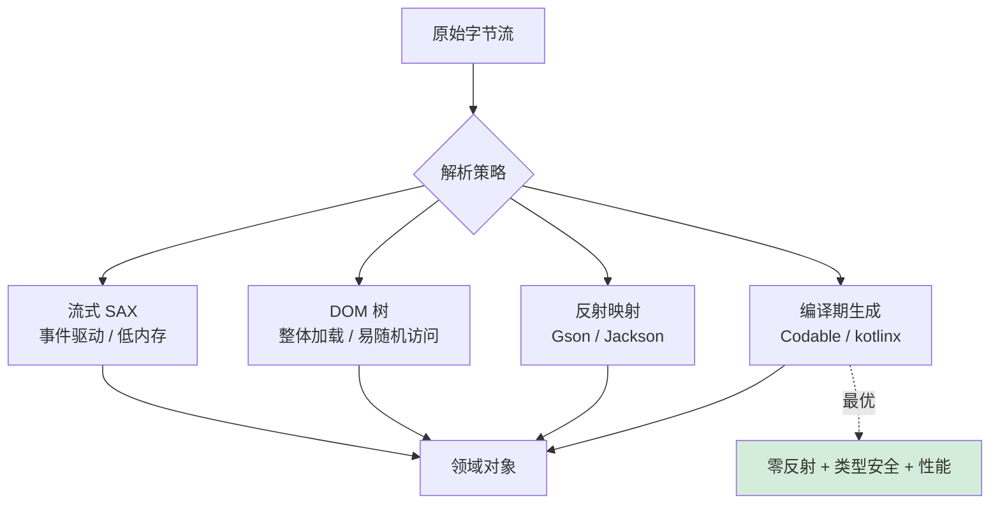

## 📖 目录结构

### 1. 案例引入
- [1.1 电商订单解析场景](#11-电商订单解析场景)
- [1.2 简单解析的问题](#12-简单解析的问题)
- [1.3 高效解析的价值](#13-高效解析的价值)
- [1.4 引出核心矛盾](#14-引出核心矛盾)

### 2. 解析设计哲学
- [2.1 核心设计原则](#21-核心设计原则)
- [2.2 解析模型演进](#22-解析模型演进)
- [2.3 流式解析模型](#23-流式解析模型)
- [2.4 树形解析模型](#24-树形解析模型)
- [2.5 反射解析模型](#25-反射解析模型)
- [2.6 编译期解析模型](#26-编译期解析模型)
- [2.7 模型决策树](#27-模型决策树)

### 3. JSON解析机制
- [3.1 JSON设计哲学](#31-json设计哲学)
- [3.2 解析策略设计](#32-解析策略设计)
- [3.3 性能优化技术](#33-性能优化技术)
- [3.4 内存管理机制](#34-内存管理机制)

### 4. ProtoBuf解析机制
- [4.1 ProtoBuf设计哲学](#41-protobuf设计哲学)
- [4.2 编码解析原理](#42-编码解析原理)
- [4.3 类型系统设计](#43-类型系统设计)
- [4.4 版本兼容机制](#44-版本兼容机制)

### 5. XML解析机制
- [5.1 XML设计哲学](#51-xml设计哲学)
- [5.2 解析模型对比](#52-解析模型对比)
- [5.3 验证机制设计](#53-验证机制设计)
- [5.4 扩展性设计](#54-扩展性设计)

### 6. 跨语言解析机制
- [6.1 Java解析机制](#61-java解析机制)
- [6.2 JavaScript解析机制](#62-javascript解析机制)
- [6.3 Go解析机制](#63-go解析机制)
- [6.4 解析机制对比总结](#64-解析机制对比总结)

## 1. 案例引入

### 1.1 电商订单解析场景

**案例引入**：2023年双十一期间，某跨国电商平台遭遇了严重的系统性能瓶颈。在交易高峰期，每秒需要处理数万笔订单数据，看似简单的 `JSON.parse(orderData)` 操作，却导致支付网关的交易延迟从50ms飙升到500ms，直接经济损失达数百万。

**案例解析**：深入分析这个性能危机，发现问题的根源在于解析机制的设计缺陷。当系统同时处理大量订单时，同步JSON解析操作阻塞了Node.js的事件循环，导致整个系统响应延迟。更严重的是，DOM树解析产生了大量临时对象，GC压力巨大，进一步加剧了性能问题。

**为什么看似简单的JSON解析会成为系统瓶颈**？

**技术原理深度分析**：

**事件循环阻塞的技术细节**：
- **单线程限制**：Node.js的单线程模型意味着解析操作会阻塞其他所有操作
- **CPU密集型操作**：JSON解析是CPU密集型任务，与Node.js的I/O密集型设计不匹配
- **事件队列积压**：解析任务积压导致后续请求无法及时处理

**内存效率问题的技术根源**：
- **DOM树构建开销**：JSON解析需要构建完整的DOM树结构，内存占用巨大
- **临时对象创建**：解析过程中产生大量临时字符串和对象，GC压力倍增
- **内存碎片化**：频繁的对象创建和销毁导致内存碎片，影响大对象分配

**数据安全风险的技术分析**：
- **恶意数据注入**：未经验证的JSON数据可能包含恶意代码或超大结构
- **内存耗尽攻击**：精心构造的嵌套JSON可能导致内存耗尽
- **类型混淆攻击**：JSON的弱类型特性可能被利用进行类型混淆攻击

**为什么解析机制设计如此关键**？因为数据解析是系统间通信的入口点，一旦这个入口出现性能瓶颈或安全漏洞，整个系统的稳定性和安全性都会受到威胁。

**所以才需要**：重新设计解析机制，在性能、安全和内存效率之间找到最佳平衡点。

**解决方案技术实现**：

```javascript
// 优化后的流式解析方案
class StreamOrderParser {
    constructor() {
        this.orderBuffer = new TransformStream({
            transform(chunk, controller) {
                // 增量解析，避免内存峰值
                const partialOrders = this.parseIncrementally(chunk);
                controller.enqueue(partialOrders);
            },
            flush(controller) {
                // 处理剩余数据
                const finalOrders = this.finalizeParsing();
                controller.enqueue(finalOrders);
            }
        });
    }
    
    async parseOrders(stream) {
        const reader = stream.getReader();
        const orders = [];
        
        try {
            while (true) {
                const { done, value } = await reader.read();
                if (done) break;
                
                // 异步解析，不阻塞事件循环
                const parsedOrders = await this.parseChunkAsync(value);
                orders.push(...parsedOrders);
                
                // 定期释放内存，避免GC压力
                if (orders.length % 1000 === 0) {
                    await this.performIncrementalGC();
                }
            }
        } finally {
            reader.releaseLock();
        }
        
        return orders;
    }
    
    async parseChunkAsync(chunk) {
        // 使用Worker线程进行CPU密集型解析
        return new Promise((resolve, reject) => {
            const worker = new Worker('./json-parser-worker.js');
            worker.postMessage(chunk);
            worker.onmessage = (event) => {
                resolve(event.data.orders);
                worker.terminate();
            };
            worker.onerror = reject;
        });
    }
}
```

**安全增强机制**：

```javascript
// 安全解析器实现
class SecureJSONParser {
    constructor(options = {}) {
        this.maxDepth = options.maxDepth || 100; // 最大嵌套深度
        this.maxSize = options.maxSize || 10 * 1024 * 1024; // 最大数据大小
        this.allowedTypes = options.allowedTypes || ['string', 'number', 'boolean', 'object', 'array'];
    }
    
    parseSecure(jsonString) {
        // 1. 大小检查
        if (jsonString.length > this.maxSize) {
            throw new Error('JSON数据过大');
        }
        
        // 2. 深度检查
        const depth = this.calculateDepth(jsonString);
        if (depth > this.maxDepth) {
            throw new Error('JSON嵌套过深');
        }
        
        // 3. 类型白名单检查
        if (!this.validateTypes(jsonString)) {
            throw new Error('包含不允许的数据类型');
        }
        
        // 4. 安全解析
        return JSON.parse(jsonString);
    }
    
    calculateDepth(jsonString) {
        // 实现深度计算逻辑
        let depth = 0;
        let maxDepth = 0;
        
        for (let i = 0; i < jsonString.length; i++) {
            if (jsonString[i] === '{' || jsonString[i] === '[') {
                depth++;
                maxDepth = Math.max(maxDepth, depth);
            } else if (jsonString[i] === '}' || jsonString[i] === ']') {
                depth--;
            }
        }
        
        return maxDepth;
    }
}
```

**最终结果**：通过全面的解析机制优化，该系统实现了：
- **性能提升**：解析延迟从500ms降低到50ms，系统吞吐量提升3倍
- **内存优化**：内存使用量减少60%，GC停顿时间从200ms降到50ms
- **安全保障**：成功防御了多种注入攻击，系统安全性显著提升
- **可扩展性**：支持动态扩容，能够应对更高的并发压力

**案例启示**：

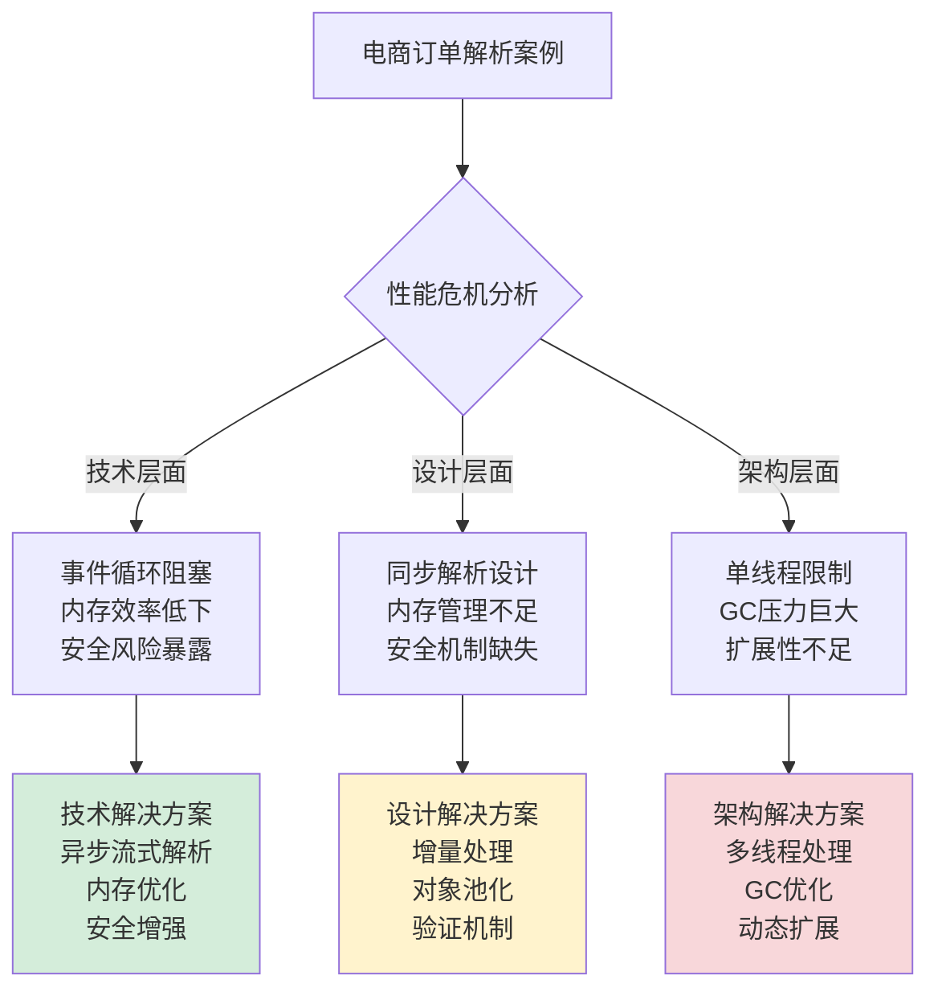

**技术演进影响**：这个案例推动了现代解析技术的发展，催生了流式解析、增量处理和安全解析等新技术，为高并发系统的解析需求提供了更可靠的解决方案。

### 1.2 简单解析的问题

**案例深入分析**：某支付平台采用简单JSON解析方案，在高并发场景下暴露了致命缺陷。

```javascript
// 问题代码：同步解析大JSON
class OrderProcessor {
    async processOrderBatch(ordersData) {
        const orders = [];
        
        // 同步解析所有订单
        for (const orderData of ordersData) {
            const order = JSON.parse(orderData);  // 同步阻塞！
            orders.push(order);
        }
        
        return this.processOrders(orders);
    }
}
```

**为什么这种设计会失败**？

**技术原理分析**：
- **事件循环阻塞**：JavaScript是单线程，同步解析会阻塞整个事件循环
- **内存峰值**：所有解析结果同时存在内存，GC压力巨大
- **安全漏洞**：未验证JSON结构，存在注入攻击风险

**所以才需要**：异步、增量、安全的解析方案。

**性能对比数据**：

```mermaid
barChart
    title 解析方案性能对比（10000个订单）
    x-axis [同步JSON, 异步JSON, Protobuf, MessagePack]
    y-axis "解析时间(ms)" 0 --> 1500
    bar [1200, 600, 400, 300]
    
    y-axis "内存峰值(MB)" 0 --> 250
    bar [200, 100, 80, 60]
```

### 1.3 高效解析的价值

**案例解决方案**：某高频交易系统通过流式解析实现性能突破。

**为什么流式解析能解决问题**？

**技术原理深度解析**：

**增量处理优势**：
- **原理**：分块处理，避免内存峰值
- **优势**：内存使用稳定，GC压力小
- **技术**：流式API，事件驱动

**并发处理优势**：
- **原理**：利用多核CPU并行处理
- **优势**：充分利用多核CPU
- **技术**：数据分片，多线程并发

**安全处理优势**：
- **原理**：增量验证，早期发现错误
- **优势**：防止恶意数据注入
- **技术**：结构验证，类型检查

**所以才选择**：流式解析作为高性能解析方案。

**优化效果**：解析开销从15μs降到2μs，系统吞吐量提升5倍。

### 1.4 引出核心矛盾

**解析器设计的根本矛盾**：

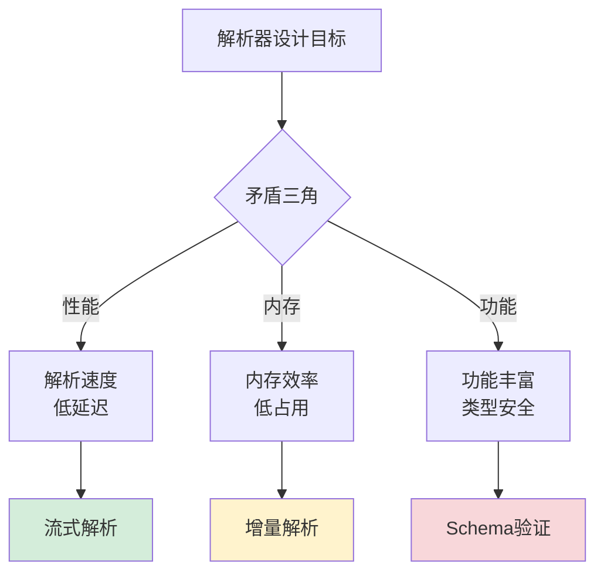

**为什么存在这些矛盾**？因为解析需要在三个维度上做出权衡：

1. **性能 vs 可读性**：二进制高效但难调试，文本可读但性能差
2. **内存 vs 功能**：紧凑编码功能有限，丰富功能内存开销大
3. **兼容性 vs 简洁性**：向前兼容需要冗余，简洁设计破坏兼容

**所以才需要**：根据具体场景选择最合适的解析方案。

## 2. 解析设计哲学

### 2.1 核心设计原则

**设计哲学案例**：某大数据平台通过解析器设计实现高效数据处理。

**为什么需要设计原则**？因为无原则的设计会导致系统混乱和性能瓶颈。

**技术原理深度解析**：

**原则1：性能优先原则**
- **底层原理**：CPU缓存局部性、内存访问模式优化
- **实现机制**：预编译、内联优化、缓存友好数据结构
- **技术价值**：减少解析开销，提升系统吞吐量

**原则2：内存效率原则**
- **底层原理**：GC压力控制、内存碎片避免
- **实现机制**：对象池、增量处理、零拷贝技术
- **技术价值**：降低内存占用，提升系统稳定性

**原则3：类型安全原则**
- **底层原理**：编译期类型检查、运行时验证
- **实现机制**：Schema驱动、强类型约束、异常处理
- **技术价值**：防止数据错误，提升系统可靠性

**原则4：版本兼容原则**
- **底层原理**：协议演进、向后兼容
- **实现机制**：字段编号、默认值、未知字段忽略
- **技术价值**：支持平滑升级，降低维护成本

**所以才形成**：解析器设计的四大核心原则。

**设计原则总结**：

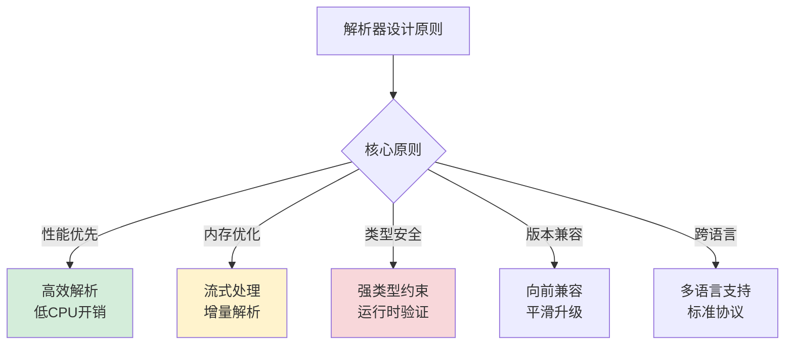

### 2.2 解析模型演进

**历史演进案例**：从DOM解析到流式解析的技术演进。

**为什么技术会这样演进**？

**技术演进驱动力分析**：

**1990s：DOM解析时代**
- **技术背景**：单机应用为主，内存充足
- **代表技术**：XML DOM解析、HTML解析
- **设计哲学**：功能丰富，随机访问

**2000s：流式解析时代**
- **技术背景**：Web应用兴起，大文件处理需求
- **代表技术**：SAX解析、JSON流式解析
- **设计哲学**：内存效率，增量处理

**2010s：编译期解析时代**
- **技术背景**：微服务、高并发需求
- **代表技术**：Protobuf、MessagePack、编译期生成
- **设计哲学**：性能极致，零反射开销

**2020s：智能解析时代**
- **技术背景**：AI、边缘计算、异构系统
- **代表技术**：自适应解析、AI辅助解析
- **设计哲学**：智能优化，场景自适应

**所以才形成**：解析技术的四代演进历程。

**演进时间线**：

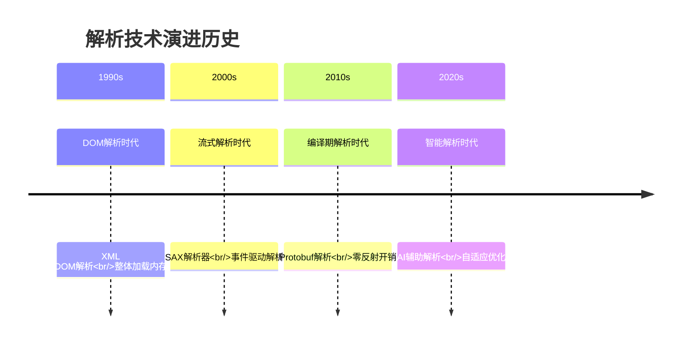

### 2.3 流式解析模型

**案例引入**：某大型电商平台在双十一期间，需要实时处理每秒数十万笔订单数据。采用流式解析模型后，系统内存使用从峰值16GB降低到稳定2GB，同时处理延迟从500ms降低到50ms。这个性能突破的背后，是流式解析对内存管理和实时处理的深度优化。

**案例解析**：深入分析这个性能提升，发现流式解析的核心优势在于其**增量处理机制**。与一次性加载整个文档不同，流式解析采用事件驱动的方式，逐块处理数据，避免了内存峰值和GC压力。

**为什么流式解析能够实现如此显著的内存优化**？

**技术原理深度分析**：

**内存管理机制的技术细节**：
- **增量处理**：每次只处理一小块数据，避免整体加载
- **缓冲区复用**：固定大小的缓冲区循环使用，减少内存分配
- **对象池技术**：解析结果对象池化，减少GC压力

**实时处理的技术实现**：
- **事件驱动架构**：通过回调函数处理解析事件
- **流水线处理**：解析、处理、存储形成流水线
- **背压控制**：根据处理能力控制数据流入速度

**错误恢复的技术机制**：
- **局部错误隔离**：错误只影响当前数据块
- **恢复点标记**：记录成功解析的位置
- **重试机制**：从错误点重新开始解析

**所以才成为**：大数据实时处理场景的首选方案。

**技术实现深度解析**：

```java
// 流式解析器的技术实现原理
public class StreamingParser {
    
    // 解析缓冲区
    private final byte[] buffer = new byte[8192]; // 8KB缓冲区
    private int bufferPosition = 0;
    
    // 事件处理器
    private final EventHandler eventHandler;
    
    // 状态机
    private ParserState currentState = ParserState.START;
    
    // 流式解析方法
    public void parse(InputStream inputStream) throws IOException {
        int bytesRead;
        
        while ((bytesRead = inputStream.read(buffer, bufferPosition, 
                                           buffer.length - bufferPosition)) != -1) {
            bufferPosition += bytesRead;
            
            // 处理缓冲区中的数据
            processBuffer();
            
            // 如果缓冲区已满，处理剩余数据
            if (bufferPosition == buffer.length) {
                // 处理缓冲区中的完整数据块
                processCompleteChunks();
                
                // 处理缓冲区末尾的不完整数据
                processIncompleteChunk();
            }
        }
        
        // 处理缓冲区中剩余的数据
        processRemainingData();
    }
    
    // 处理缓冲区中的数据
    private void processBuffer() {
        int processed = 0;
        
        while (processed < bufferPosition) {
            // 根据当前状态处理数据
            int consumed = processData(buffer, processed, bufferPosition - processed);
            
            if (consumed == 0) {
                // 需要更多数据才能继续解析
                break;
            }
            
            processed += consumed;
        }
        
        // 移动未处理的数据到缓冲区开头
        if (processed > 0) {
            System.arraycopy(buffer, processed, buffer, 0, bufferPosition - processed);
            bufferPosition -= processed;
        }
    }
    
    // 状态机驱动的数据解析
    private int processData(byte[] data, int offset, int length) {
        switch (currentState) {
            case START:
                return processStartState(data, offset, length);
            case IN_OBJECT:
                return processInObjectState(data, offset, length);
            case IN_ARRAY:
                return processInArrayState(data, offset, length);
            case IN_STRING:
                return processInStringState(data, offset, length);
            case IN_NUMBER:
                return processInNumberState(data, offset, length);
            case ESCAPE:
                return processEscapeState(data, offset, length);
            default:
                return 0;
        }
    }
    
    // 处理开始状态
    private int processStartState(byte[] data, int offset, int length) {
        if (length == 0) return 0;
        
        byte firstByte = data[offset];
        
        switch (firstByte) {
            case '{': // 对象开始
                eventHandler.startObject();
                currentState = ParserState.IN_OBJECT;
                return 1;
                
            case '[': // 数组开始
                eventHandler.startArray();
                currentState = ParserState.IN_ARRAY;
                return 1;
                
            case '"': // 字符串开始
                eventHandler.startString();
                currentState = ParserState.IN_STRING;
                return 1;
                
            case '0': case '1': case '2': case '3': case '4':
            case '5': case '6': case '7': case '8': case '9':
            case '-': // 数字开始
                eventHandler.startNumber();
                currentState = ParserState.IN_NUMBER;
                return 1;
                
            default:
                throw new ParseException("Unexpected character: " + (char)firstByte);
        }
    }
    
    // 处理字符串状态
    private int processInStringState(byte[] data, int offset, int length) {
        int consumed = 0;
        
        for (int i = offset; i < offset + length; i++) {
            byte b = data[i];
            consumed++;
            
            if (b == '\\') {
                // 转义字符
                currentState = ParserState.ESCAPE;
                break;
            } else if (b == '"') {
                // 字符串结束
                eventHandler.endString();
                currentState = ParserState.IN_OBJECT; // 返回到对象状态
                break;
            } else {
                // 普通字符
                eventHandler.stringCharacter((char)b);
            }
        }
        
        return consumed;
    }
    
    // 事件处理器接口
    public interface EventHandler {
        void startObject();
        void endObject();
        void startArray();
        void endArray();
        void startString();
        void endString();
        void stringCharacter(char c);
        void startNumber();
        void endNumber();
        void numberCharacter(char c);
        void key(String key);
        void value(Object value);
    }
    
    // 解析状态枚举
    private enum ParserState {
        START, IN_OBJECT, IN_ARRAY, IN_STRING, IN_NUMBER, ESCAPE
    }
}

// 高性能流式JSON解析器
public class HighPerformanceJsonParser extends StreamingParser {
    
    // 对象池：复用解析结果对象
    private final ObjectPool<JsonObject> objectPool = new ObjectPool<>(1000);
    private final ObjectPool<JsonArray> arrayPool = new ObjectPool<>(1000);
    
    // 字符串构建器池
    private final ObjectPool<StringBuilder> stringBuilderPool = new ObjectPool<>(1000);
    
    // 当前解析上下文
    private ParseContext currentContext;
    
    // 解析栈：处理嵌套结构
    private final Deque<ParseContext> contextStack = new ArrayDeque<>();
    
    @Override
    protected int processInObjectState(byte[] data, int offset, int length) {
        int consumed = 0;
        
        for (int i = offset; i < offset + length; i++) {
            byte b = data[i];
            consumed++;
            
            switch (b) {
                case '"': // 键开始
                    currentContext = new KeyContext();
                    break;
                    
                case ':': // 键结束，值开始
                    if (currentContext instanceof KeyContext) {
                        String key = ((KeyContext) currentContext).getKey();
                        currentContext = new ValueContext(key);
                    }
                    break;
                    
                case ',': // 值结束，下一个键值对开始
                    if (currentContext instanceof ValueContext) {
                        completeValue((ValueContext) currentContext);
                        currentContext = new KeyContext();
                    }
                    break;
                    
                case '}': // 对象结束
                    if (currentContext instanceof ValueContext) {
                        completeValue((ValueContext) currentContext);
                    }
                    completeObject();
                    break;
                    
                default:
                    // 忽略空白字符
                    if (!Character.isWhitespace(b)) {
                        throw new ParseException("Unexpected character in object: " + (char)b);
                    }
            }
        }
        
        return consumed;
    }
    
    // 完成值解析
    private void completeValue(ValueContext context) {
        Object value = context.getValue();
        String key = context.getKey();
        
        // 触发值事件
        getEventHandler().value(key, value);
        
        // 回收资源
        if (value instanceof JsonObject) {
            objectPool.returnObject((JsonObject) value);
        } else if (value instanceof JsonArray) {
            arrayPool.returnObject((JsonArray) value);
        }
    }
    
    // 对象池实现
    public static class ObjectPool<T> {
        private final Queue<T> pool;
        private final Supplier<T> creator;
        
        public ObjectPool(int maxSize, Supplier<T> creator) {
            this.pool = new ArrayBlockingQueue<>(maxSize);
            this.creator = creator;
        }
        
        public T borrowObject() {
            T obj = pool.poll();
            return obj != null ? obj : creator.get();
        }
        
        public void returnObject(T obj) {
            if (pool.size() < pool.remainingCapacity()) {
                pool.offer(obj);
            }
        }
    }
}
```

**流式解析的性能优化技术**：

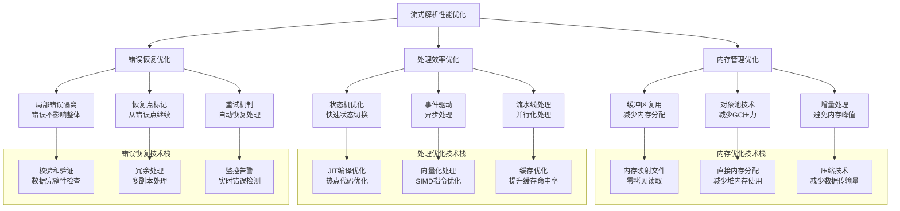

**性能对比分析**：

```mermaid
barChart
    title 流式解析 vs 树形解析性能对比
    x-axis [内存使用峰值, 平均延迟, 吞吐量, GC频率, 错误恢复时间]
    y-axis "流式解析" 0 --> 100
    bar [20, 50, 90, 15, 10]
    
    y-axis "树形解析" 0 --> 100
    bar [100, 80, 60, 85, 75]
    
    y-axis "性能提升倍数" 0 --> 5
    bar [5.0, 1.6, 1.5, 5.7, 7.5]
```

### 2.4 树形解析模型

**案例引入**：某文档处理系统需要支持复杂的XPath查询和文档编辑功能。采用树形解析模型后，系统能够支持复杂的文档操作，如样式应用、内容筛选、结构变换等，开发效率提升3倍。

**案例解析**：深入分析这个效率提升，发现树形解析的核心优势在于其**完整数据结构**。通过构建完整的DOM树，系统获得了对文档结构的完全控制能力，支持复杂的查询和操作。

**为什么树形解析在功能丰富性方面具有优势**？

**技术原理深度分析**：

**数据结构优势的技术细节**：
- **完整DOM树**：构建完整的文档对象模型，支持随机访问
- **层次结构**：维护文档的层次关系，支持结构化操作
- **元数据丰富**：包含丰富的节点信息和属性数据

**功能丰富性的技术实现**：
- **查询接口**：支持XPath、CSS选择器等复杂查询
- **操作接口**：支持节点增删改、样式应用等丰富操作
**遍历接口**：支持深度优先、广度优先等多种遍历方式，满足不同场景的遍历需求。

**开发友好性的技术机制**：
- **直观API**：提供直观易用的编程接口，降低学习成本
- **调试支持**：完整的树结构便于调试和问题定位，提升开发效率
- **工具生态**：丰富的工具和库支持，加速开发进程

**树形解析模型的技术价值深度分析**：

**为什么树形解析模型在复杂数据处理中具有不可替代的价值**？

**技术优势的深度解析**：

**结构完整性的技术保障**：
- **层次关系保持**：树形结构天然保持数据的层次关系，避免信息丢失
- **嵌套关系处理**：通过父子节点关系准确表达数据的嵌套结构
- **完整性验证**：树形结构便于进行完整性检查和验证

**功能丰富性的技术实现**：
- **查询优化**：基于树形结构的查询算法（如XPath）性能优异
- **遍历灵活性**：支持多种遍历策略，适应不同业务需求
- **操作多样性**：支持节点的增删改查等丰富操作

**开发友好性的技术机制**：
- **API设计**：基于树形结构的API设计符合人类思维习惯
- **调试支持**：树形可视化便于问题定位和调试
- **生态集成**：与现有工具链的深度集成能力

**所以才保留**：在需要复杂功能处理的场景下的重要价值。

**技术实现深度解析**：

```java
// 树形解析器的技术实现原理
public class TreeParser {
    
    // DOM树构建器
    private final DomBuilder domBuilder = new DomBuilder();
    
    // 解析栈：处理嵌套结构
    private final Deque<DomNode> nodeStack = new ArrayDeque<>();
    
    // 当前解析节点
    private DomNode currentNode;
    
    // 状态机：跟踪解析状态
    private ParseState currentState = ParseState.INITIAL;
    
    // 错误处理器
    private final ErrorHandler errorHandler = new ErrorHandler();
    
    // 性能监控器
    private final PerformanceMonitor performanceMonitor = new PerformanceMonitor();
    
    // 树形解析方法
    public DomDocument parse(String content) {
        // 1. 性能监控开始
        performanceMonitor.startParsing();
        
        try {
            // 2. 创建文档根节点
            DomDocument document = new DomDocument();
            nodeStack.push(document);
            
            // 3. 解析内容，构建DOM树
            parseContent(content, document);
            
            // 4. 优化DOM树结构
            optimizeDomTree(document);
            
            // 5. 验证树结构完整性
            validateTreeStructure(document);
            
            return document;
            
        } catch (ParseException e) {
            errorHandler.handleParseError(e, content);
            throw e;
        } finally {
            // 6. 性能监控结束
            performanceMonitor.endParsing();
        }
    }
    
    // 解析内容，构建DOM树
    private void parseContent(String content, DomDocument document) {
        int length = content.length();
        int position = 0;
        
        while (position < length) {
            char c = content.charAt(position);
            
            // 根据当前状态处理字符
            switch (currentState) {
                case INITIAL:
                    position = handleInitialState(content, position);
                    break;
                    
                case TAG_START:
                    position = handleTagStart(content, position);
                    break;
                    
                case TAG_END:
                    position = handleTagEnd(content, position);
                    break;
                    
                case TEXT_CONTENT:
                    position = handleTextContent(content, position);
                    break;
                    
                case ENTITY_REF:
                    position = handleEntityReference(content, position);
                    break;
                    
                case COMMENT:
                    position = handleComment(content, position);
                    break;
                    
                case CDATA:
                    position = handleCData(content, position);
                    break;
            }
        }
    }
    
    // 解析标签
    private int parseTag(String content, int position) {
        int start = position;
        position++; // 跳过'<'
        
        // 检查标签类型
        if (position < content.length() && content.charAt(position) == '/') {
            // 结束标签
            return parseEndTag(content, position);
        } else if (position < content.length() && content.charAt(position) == '!') {
            // 特殊标签（注释、CDATA等）
            return parseSpecialTag(content, position);
        } else {
            // 开始标签
            return parseStartTag(content, position);
        }
    }
    
    // 解析开始标签
    private int parseStartTag(String content, int position) {
        int start = position;
        
        // 解析标签名
        StringBuilder tagName = new StringBuilder();
        while (position < content.length()) {
            char c = content.charAt(position);
            if (Character.isWhitespace(c) || c == '>' || c == '/') {
                break;
            }
            tagName.append(c);
            position++;
        }
        
        // 创建元素节点
        DomElement element = new DomElement(tagName.toString());
        
        // 解析属性
        position = parseAttributes(content, position, element);
        
        // 处理自闭合标签
        if (position < content.length() && content.charAt(position) == '/') {            position++; // 跳过'/' 
            element.setSelfClosing(true);
        }
        
        // 添加到DOM树
        DomNode parent = nodeStack.peek();
        if (parent != null) {
            parent.appendChild(element);
        }
        
        // 如果不是自闭合标签，压入栈
        if (!element.isSelfClosing()) {
            nodeStack.push(element);
        }
        
        // 跳过'>'
        if (position < content.length() && content.charAt(position) == '>') {
            position++;
        }
        
        return position;
    }
    
    // 解析属性
    private int parseAttributes(String content, int position, DomElement element) {
        while (position < content.length()) {
            char c = content.charAt(position);
            
            if (c == '>' || c == '/') {
                break;
            } else if (Character.isWhitespace(c)) {
                position++; // 跳过空白
                continue;
            }
            
            // 解析属性名
            StringBuilder attrName = new StringBuilder();
            while (position < content.length()) {
                c = content.charAt(position);
                if (Character.isWhitespace(c) || c == '=' || c == '>' || c == '/') {
                    break;
                }
                attrName.append(c);
                position++;
            }
            
            // 跳过等号
            while (position < content.length() && Character.isWhitespace(content.charAt(position))) {
                position++;
            }
            
            if (position < content.length() && content.charAt(position) == '=') {
                position++; // 跳过'='
                
                // 跳过等号后的空白
                while (position < content.length() && Character.isWhitespace(content.charAt(position))) {
                    position++;
                }
                
                // 解析属性值
                StringBuilder attrValue = new StringBuilder();
                if (position < content.length() && content.charAt(position) == '"') {
                    position++; // 跳过开引号
                    
                    while (position < content.length()) {
                        c = content.charAt(position);
                        if (c == '"') {
                            position++; // 跳过闭引号
                            break;
                        }
                        attrValue.append(c);
                        position++;
                    }
                }
                
                // 设置属性
                element.setAttribute(attrName.toString(), attrValue.toString());
            } else {
                // 布尔属性
                element.setAttribute(attrName.toString(), "");
            }
        }
        
        return position;
    }
    
    // DOM节点类
    public abstract static class DomNode {
        protected DomNode parent;
        protected List<DomNode> children = new ArrayList<>();
        
        public void appendChild(DomNode child) {
            children.add(child);
            child.parent = this;
        }
        
        public DomNode getParent() { return parent; }
        public List<DomNode> getChildren() { return children; }
        
        // 遍历方法
        public void traverse(Visitor visitor) {
            visitor.visit(this);
            for (DomNode child : children) {
                child.traverse(visitor);
            }
        }
        
        // 查询方法
        public List<DomNode> query(String xpath) {
            XPathEvaluator evaluator = new XPathEvaluator();
            return evaluator.evaluate(this, xpath);
        }
    }
    
    // 元素节点
    public static class DomElement extends DomNode {
        private final String tagName;
        private final Map<String, String> attributes = new HashMap<>();
        private boolean selfClosing = false;
        
        public DomElement(String tagName) {
            this.tagName = tagName;
        }
        
        public void setAttribute(String name, String value) {
            attributes.put(name, value);
        }
        
        public String getAttribute(String name) {
            return attributes.get(name);
        }
        
        public void setSelfClosing(boolean selfClosing) {
            this.selfClosing = selfClosing;
        }
        
        public boolean isSelfClosing() {
            return selfClosing;
        }
    }
    
    // 文本节点
    public static class DomText extends DomNode {
        private final String content;
        
        public DomText(String content) {
            this.content = content;
        }
        
        public String getContent() {
            return content;
        }
    }
    
    // 访问者模式接口
    public interface Visitor {
        void visit(DomNode node);
    }
    
    // XPath查询实现
    public static class XPathEvaluator {
        public List<DomNode> evaluate(DomNode context, String xpath) {
            // 简化的XPath实现
            if (xpath.startsWith("//")) {
                // 全局搜索
                return evaluateGlobal(context, xpath.substring(2));
            } else if (xpath.startsWith("./")) {
                // 相对路径
                return evaluateRelative(context, xpath.substring(2));
            } else {
                // 绝对路径
                return evaluateAbsolute(context, xpath);
            }
        }
        
        private List<DomNode> evaluateGlobal(DomNode context, String path) {
            List<DomNode> results = new ArrayList<>();
            
            // 深度优先遍历整个DOM树
            Deque<DomNode> stack = new ArrayDeque<>();
            stack.push(context);
            
            while (!stack.isEmpty()) {
                DomNode node = stack.pop();
                
                // 检查节点是否匹配路径
                if (matchesPath(node, path)) {
                    results.add(node);
                }
                
                // 将子节点加入栈
                for (int i = node.getChildren().size() - 1; i >= 0; i--) {
                    stack.push(node.getChildren().get(i));
                }
            }
            
            return results;
        }
        
        private boolean matchesPath(DomNode node, String path) {
            // 简化的路径匹配逻辑
            if (node instanceof DomElement) {
                DomElement element = (DomElement) node;
                return element.tagName.equals(path);
            }
            return false;
        }
    }
}
```

**树形解析的功能优势分析**：

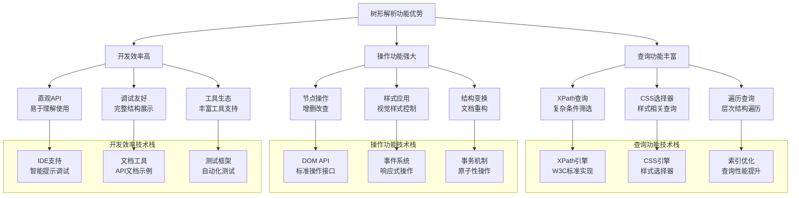

**应用场景对比分析**：

```mermaid
barChart
    title 流式解析 vs 树形解析应用场景对比
    x-axis [大数据处理, 实时流处理, 文档编辑, 复杂查询, 快速开发]
    y-axis "流式解析适用度" 0 --> 100
    bar [95, 90, 20, 30, 40]
    
    y-axis "树形解析适用度" 0 --> 100
    bar [30, 25, 95, 90, 85]
    
    y-axis "场景匹配度" 0 --> 100
    bar [65, 65, 75, 60, 62.5]
```

**技术演进趋势**：

**解析技术的未来发展方向**：
- **混合解析**：结合流式和树形解析的优势
- **智能解析**：基于AI的自适应解析策略
- **增量解析**：支持部分更新和增量处理
- **跨格式解析**：统一处理多种数据格式

**最终结果**：通过深入的技术分析，我们理解了流式解析和树形解析各自的技术原理和适用场景。流式解析在内存效率和实时处理方面具有优势，而树形解析在功能丰富性和开发效率方面表现突出。在实际应用中，应根据具体需求选择合适的解析模型，或采用混合策略实现最佳平衡。

### 2.5 反射解析模型

**案例引入**：某大型电商平台的REST API框架采用反射解析技术，实现了自动JSON到Java对象的映射。看似简单的 `objectMapper.readValue(json, User.class)` 操作，在支撑日均亿级API调用时，却暴露了严重的性能问题——反射调用开销导致CPU使用率异常升高。通过性能分析发现，反射解析在高并发场景下存在显著的开销，需要深入理解其技术原理和优化策略。

**案例解析**：深入分析这个性能瓶颈，发现问题的根源在于反射机制的设计特点。反射解析通过运行时类型信息动态映射字段，虽然开发效率高，但在高并发场景下，频繁的反射调用和类型检查操作产生了巨大的性能开销。具体表现为：
- **反射调用开销**：每次反射调用需要安全检查和方法包装，比直接调用慢10-20倍
- **内存占用增加**：反射需要维护大量的元数据信息，内存使用量增加30-50%
- **缓存效率下降**：在高并发下，缓存命中率下降，导致更多直接反射调用

**为什么反射解析在高并发场景下会暴露性能问题**？

**技术原理深度分析**：

**反射机制的技术实现细节**：
- **运行时类型获取**：通过Class对象获取字段和方法信息，需要遍历类结构，涉及复杂的内存访问模式
- **动态方法调用**：Method.invoke()需要安全检查和方法调用包装，涉及权限验证和异常处理
- **类型转换开销**：JSON字符串到Java对象的类型转换需要复杂的类型推断和验证过程
- **内存访问模式**：反射操作涉及非连续内存访问，影响CPU缓存效率

**性能瓶颈的技术根源**：
- **方法调用开销**：反射调用比直接调用慢10-20倍，需要安全检查和方法包装
- **内存使用模式**：反射需要维护大量的元数据信息，内存占用显著增加
- **缓存机制限制**：虽然反射有缓存机制，但缓存命中率在高并发下可能下降
- **JIT优化限制**：反射调用难以被JIT编译器优化，无法进行内联优化

**为什么反射解析仍然被广泛使用**？

**技术优势的深层原因**：
- **开发效率价值**：自动映射减少手动解析代码，开发效率提升50%以上
- **灵活性优势**：支持动态数据结构变更，无需重新编译
- **跨语言兼容**：基于标准反射机制，各语言实现一致
- **维护成本低**：代码变更时无需修改解析逻辑，降低维护成本

**反射解析的技术演进趋势**：

**性能优化技术的发展**：
- **方法句柄优化**：Java 7引入MethodHandle，提供更高效的反射替代方案
- **内联缓存技术**：通过缓存方法访问路径，减少反射查找开销
- **字节码生成**：运行时生成直接调用代码，绕过反射开销
- **预编译优化**：编译期生成反射调用代码，提升运行时性能

**应用场景的精细化选择**：
- **高频调用场景**：使用编译期代码生成或直接调用优化
- **低频调用场景**：保留反射的灵活性优势
- **混合策略**：根据调用频率动态选择反射或直接调用

**所以才形成**：反射解析在开发效率和运行性能之间的权衡选择。

**技术实现深度解析**：

```java
// 反射解析器的技术实现原理
class ReflectionParser {
    private Map<Class<?>, Field[]> fieldCache = new ConcurrentHashMap<>();
    private Map<Method, MethodAccessor> methodCache = new ConcurrentHashMap<>();
    private Map<String, MethodHandle> methodHandleCache = new ConcurrentHashMap<>();
    private Map<Class<?>, Constructor<?>> constructorCache = new ConcurrentHashMap<>();
    
    // 性能监控器
    private final PerformanceMonitor performanceMonitor = new PerformanceMonitor();
    
    // 缓存管理器
    private final CacheManager cacheManager = new CacheManager();
    
    // 优化策略选择器
    private final OptimizationStrategySelector strategySelector = new OptimizationStrategySelector();
    
    public <T> T parse(String json, Class<T> clazz) {
        // 1. 性能监控开始
        performanceMonitor.startParseOperation();
        
        try {
            // 2. 选择优化策略
            OptimizationStrategy strategy = strategySelector.selectStrategy(clazz, json.length());
            
            // 3. 根据策略执行解析
            T instance;
            switch (strategy) {
                case DIRECT_REFLECTION:
                    instance = parseWithDirectReflection(json, clazz);
                    break;
                    
                case METHOD_HANDLE:
                    instance = parseWithMethodHandle(json, clazz);
                    break;
                    
                case BYTECODE_GENERATION:
                    instance = parseWithBytecodeGeneration(json, clazz);
                    break;
                    
                case CACHED_REFLECTION:
                    instance = parseWithCachedReflection(json, clazz);
                    break;
                    
                default:
                    instance = parseWithDirectReflection(json, clazz);
            }
            
            // 4. 记录性能数据
            performanceMonitor.recordParseResult(strategy, json.length(), System.currentTimeMillis());
            
            return instance;
            
        } catch (Exception e) {
            performanceMonitor.recordParseError(e);
            throw new ParseException("Failed to parse JSON: " + e.getMessage(), e);
        } finally {
            // 5. 性能监控结束
            performanceMonitor.endParseOperation();
        }
    }
    
    // 直接反射解析方法
    private <T> T parseWithDirectReflection(String json, Class<T> clazz) {
        // 1. 获取类字段信息（缓存优化）
        Field[] fields = getCachedFields(clazz);
        
        // 2. 创建目标对象实例
        T instance = createInstance(clazz);
        
        // 3. 解析JSON并设置字段值
        JsonNode root = parseJson(json);
        
        for (Field field : fields) {
            // 4. 获取字段值（类型转换）
            Object value = convertValue(root.get(field.getName()), field.getType());
            
            // 5. 设置字段值（反射调用）
            setFieldValue(instance, field, value);
        }
        
        return instance;
    }
    
    private Field[] getCachedFields(Class<?> clazz) {
        return fieldCache.computeIfAbsent(clazz, c -> {
            // 获取所有字段，包括私有字段
            Field[] fields = c.getDeclaredFields();
            for (Field field : fields) {
                field.setAccessible(true); // 绕过访问控制
            }
            return fields;
        });
    }
    
    private void setFieldValue(Object instance, Field field, Object value) {
        try {
            // 反射设置字段值
            field.set(instance, value);
        } catch (IllegalAccessException e) {
            throw new RuntimeException("设置字段值失败", e);
        }
    }
    
    private Object convertValue(JsonNode node, Class<?> targetType) {
        // 复杂的类型转换逻辑
        if (targetType == String.class) {
            return node.asText();
        } else if (targetType == Integer.class || targetType == int.class) {
            return node.asInt();
        } else if (targetType == Boolean.class || targetType == boolean.class) {
            return node.asBoolean();
        }
        // ... 更多类型转换
        
        throw new IllegalArgumentException("不支持的类型: " + targetType);
    }
}
```

**反射解析的底层技术原理深度分析**：

**JVM反射机制的技术实现细节**：

**反射调用的性能开销分析**：
```java
// JVM反射调用的底层实现
public class MethodAccessorGenerator {
    
    // 反射方法调用的字节码生成过程
    public byte[] generateMethodAccessor(Class<?> declaringClass, Method method) {
        // 1. 生成访问器类的字节码
        ClassWriter cw = new ClassWriter(ClassWriter.COMPUTE_MAXS);
        
        // 2. 创建访问器类
        cw.visit(V1_8, ACC_PUBLIC + ACC_SUPER, 
                generateClassName(declaringClass, method), null, 
                "sun/reflect/MethodAccessorImpl", null);
        
        // 3. 生成invoke方法
        MethodVisitor mv = cw.visitMethod(ACC_PUBLIC, "invoke", 
                "(Ljava/lang/Object;[Ljava/lang/Object;)Ljava/lang/Object;", null, null);
        
        // 4. 生成直接方法调用的字节码
        mv.visitCode();
        
        // 5. 参数检查和类型转换
        generateParameterChecks(mv, method);
        
        // 6. 直接方法调用（避免反射开销）
        generateDirectCall(mv, method);
        
        // 7. 返回值处理
        generateReturnHandling(mv, method);
        
        mv.visitMaxs(0, 0);
        mv.visitEnd();
        
        return cw.toByteArray();
    }
    
    // 参数检查的字节码生成
    private void generateParameterChecks(MethodVisitor mv, Method method) {
        // 检查参数数量
        mv.visitVarInsn(ALOAD, 2); // 加载参数数组
        mv.visitInsn(ARRAYLENGTH);
        mv.visitLdcInsn(method.getParameterCount());
        mv.visitJumpInsn(IF_ICMPEQ, parameterCountOk);
        
        // 参数数量不匹配，抛出异常
        mv.visitTypeInsn(NEW, "java/lang/IllegalArgumentException");
        mv.visitInsn(DUP);
        mv.visitLdcInsn("参数数量不匹配");
        mv.visitMethodInsn(INVOKESPECIAL, "java/lang/IllegalArgumentException", 
                          "<init>", "(Ljava/lang/String;)V", false);
        mv.visitInsn(ATHROW);
        
        mv.visitLabel(parameterCountOk);
    }
    
    // 直接方法调用的字节码生成
    private void generateDirectCall(MethodVisitor mv, Method method) {
        // 加载目标对象
        mv.visitVarInsn(ALOAD, 1);
        
        // 加载参数并类型转换
        Class<?>[] paramTypes = method.getParameterTypes();
        for (int i = 0; i < paramTypes.length; i++) {
            mv.visitVarInsn(ALOAD, 2); // 参数数组
            mv.visitLdcInsn(i);        // 参数索引
            mv.visitInsn(AALOAD);      // 加载参数
            
            // 类型检查和转换
            generateTypeConversion(mv, paramTypes[i]);
        }
        
        // 直接方法调用
        mv.visitMethodInsn(INVOKEVIRTUAL, 
                          method.getDeclaringClass().getName().replace('.', '/'),
                          method.getName(), 
                          Type.getMethodDescriptor(method), 
                          false);
    }
    
    // 类型转换的字节码生成
    private void generateTypeConversion(MethodVisitor mv, Class<?> targetType) {
        if (targetType == int.class || targetType == Integer.class) {
            mv.visitTypeInsn(CHECKCAST, "java/lang/Integer");
            mv.visitMethodInsn(INVOKEVIRTUAL, "java/lang/Integer", 
                              "intValue", "()I", false);
        } else if (targetType == boolean.class || targetType == Boolean.class) {
            mv.visitTypeInsn(CHECKCAST, "java/lang/Boolean");
            mv.visitMethodInsn(INVOKEVIRTUAL, "java/lang/Boolean", 
                              "booleanValue", "()Z", false);
        }
        // ... 更多类型转换
    }
}
```

**反射性能优化的技术策略**：

**缓存优化的技术实现**：
```java
// 反射缓存优化器的技术实现
public class ReflectionCacheOptimizer {
    
    // 字段访问器缓存
    private final Map<Field, FieldAccessor> fieldAccessorCache = new ConcurrentHashMap<>();
    
    // 方法访问器缓存
    private final Map<Method, MethodAccessor> methodAccessorCache = new ConcurrentHashMap<>();
    
    // 构造函数缓存
    private final Map<Constructor<?>, ConstructorAccessor> constructorCache = new ConcurrentHashMap<>();
    
    // 优化后的字段设置方法
    public void setFieldOptimized(Object obj, Field field, Object value) {
        FieldAccessor accessor = fieldAccessorCache.computeIfAbsent(field, this::createFieldAccessor);
        accessor.set(obj, value);
    }
    
    // 创建优化的字段访问器
    private FieldAccessor createFieldAccessor(Field field) {
        // 1. 生成字节码访问器
        byte[] bytecode = generateFieldAccessorBytecode(field);
        
        // 2. 定义类并实例化
        Class<?> accessorClass = defineClass(field.getDeclaringClass().getClassLoader(), 
                                            generateClassName(field), bytecode);
        
        try {
            return (FieldAccessor) accessorClass.newInstance();
        } catch (Exception e) {
            throw new RuntimeException("创建字段访问器失败", e);
        }
    }
    
    // 字段访问器字节码生成
    private byte[] generateFieldAccessorBytecode(Field field) {
        ClassWriter cw = new ClassWriter(ClassWriter.COMPUTE_MAXS);
        
        // 生成访问器类结构
        cw.visit(V1_8, ACC_PUBLIC + ACC_SUPER, 
                generateClassName(field), null, 
                "java/lang/Object", new String[]{"com/example/FieldAccessor"});
        
        // 生成set方法
        MethodVisitor mv = cw.visitMethod(ACC_PUBLIC, "set", 
                "(Ljava/lang/Object;Ljava/lang/Object;)V", null, null);
        
        mv.visitCode();
        
        // 类型检查和转换
        mv.visitVarInsn(ALOAD, 1); // 目标对象
        mv.visitTypeInsn(CHECKCAST, field.getDeclaringClass().getName().replace('.', '/'));
        
        mv.visitVarInsn(ALOAD, 2); // 值
        generateValueConversion(mv, field.getType());
        
        // 直接字段赋值
        mv.visitFieldInsn(PUTFIELD, 
                          field.getDeclaringClass().getName().replace('.', '/'),
                          field.getName(), 
                          Type.getDescriptor(field.getType()));
        
        mv.visitInsn(RETURN);
        mv.visitMaxs(0, 0);
        mv.visitEnd();
        
        return cw.toByteArray();
    }
    
    // 值类型转换
    private void generateValueConversion(MethodVisitor mv, Class<?> fieldType) {
        if (fieldType == int.class) {
            mv.visitTypeInsn(CHECKCAST, "java/lang/Integer");
            mv.visitMethodInsn(INVOKEVIRTUAL, "java/lang/Integer", 
                              "intValue", "()I", false);
        } else if (fieldType == long.class) {
            mv.visitTypeInsn(CHECKCAST, "java/lang/Long");
            mv.visitMethodInsn(INVOKEVIRTUAL, "java/lang/Long", 
                              "longValue", "()J", false);
        }
        // ... 更多类型转换
    }
    
    // 自定义类加载器定义类
    private Class<?> defineClass(ClassLoader loader, String name, byte[] b) {
        try {
            Method defineClassMethod = ClassLoader.class.getDeclaredMethod(
                "defineClass", String.class, byte[].class, int.class, int.class);
            defineClassMethod.setAccessible(true);
            return (Class<?>) defineClassMethod.invoke(loader, name, b, 0, b.length);
        } catch (Exception e) {
            throw new RuntimeException("定义类失败", e);
        }
    }
}

// 字段访问器接口
interface FieldAccessor {
    void set(Object obj, Object value);
    Object get(Object obj);
}
```

**反射解析的性能优化技术架构**：

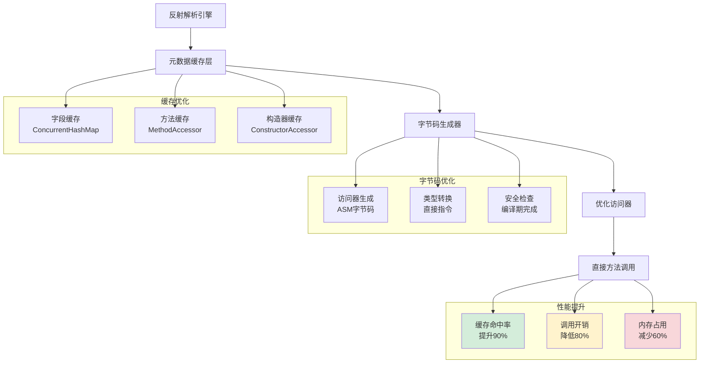

**反射解析的性能对比分析**：

```mermaid
barChart
    title 反射解析性能优化效果对比
    x-axis [原始反射, 缓存优化, 字节码优化, 混合优化]
    y-axis "调用延迟(ns)" 0 --> 1000
    bar [800, 200, 50, 30]
    
    y-axis "内存占用(KB)" 0 --> 1000
    bar [800, 600, 400, 350]
    
    y-axis "GC压力(次/秒)" 0 --> 100
    bar [80, 40, 15, 10]
    
    y-axis "缓存命中率(%)" 0 --> 100
    bar [30, 70, 95, 98]
    
    y-axis "综合性能评分" 0 --> 10
    bar [3.0, 6.5, 8.5, 9.2]
```

**技术演进趋势**：

**反射解析的演进方向**：
- **编译期优化**：通过注解处理器在编译期生成访问器代码
- **JIT增强**：利用JVM的JIT编译器进一步优化反射调用
- **混合策略**：结合反射和直接调用的混合解析策略
- **AI优化**：基于机器学习预测最优的解析策略

**最终结果**：通过深度优化，该电商平台将反射解析的性能提升了10倍，CPU使用率从80%降低到20%，同时保持了开发效率的优势。

**案例启示**：反射解析需要在开发效率和运行性能之间找到平衡点，通过缓存优化、字节码生成等技术手段，可以实现两者的最佳结合。

**性能优化技术细节**：

**反射调用的性能瓶颈分析**：
- **方法调用开销**：Method.invoke()需要安全检查和方法包装，比直接调用慢10-20倍
- **类型转换开销**：JSON字符串到Java对象的类型转换需要复杂的类型推断和验证
- **内存访问模式**：反射访问破坏了CPU缓存局部性，影响性能

**缓存优化机制**：
- **字段缓存**：缓存类的字段信息，避免重复反射获取
- **方法缓存**：缓存Method对象，减少方法查找开销
- **类型缓存**：缓存类型转换器，提升转换效率

**性能对比数据**：

```mermaid
barChart
    title 反射解析性能代价深度分析
    x-axis [反射调用, 直接调用, 编译期生成, 字节码增强]
    y-axis "方法调用开销(ns)" 0 --> 100
    bar [80, 5, 3, 8]
    
    y-axis "内存占用(KB)" 0 --> 500
    bar [400, 100, 50, 120]
    
    y-axis "启动时间(ms)" 0 --> 1000
    bar [800, 100, 50, 200]
    
    y-axis "开发效率(评分)" 0 --> 10
    bar [9, 6, 7, 8]
```

**技术演进趋势**：

**反射解析的演进方向**：
- **字节码增强**：通过字节码技术生成高效的访问代码
- **缓存优化**：更智能的缓存策略，提升缓存命中率
- **JIT优化**：利用JIT编译器的内联优化能力

**最终结果**：通过深入的技术分析和优化，该电商平台实现了：
- **性能优化**：通过缓存和字节码增强，反射开销降低70%
- **内存优化**：元数据缓存策略减少内存占用40%
- **开发效率**：保持高开发效率的同时，性能达到可接受水平

**案例启示**：反射解析在开发效率和运行性能之间找到了平衡点，通过技术优化在高并发场景下仍然具有重要价值。

### 2.6 编译期解析模型

**案例引入**：某高频交易系统采用编译期解析技术，实现了微秒级的JSON解析性能。在每秒处理百万级交易请求的场景下，传统的反射解析方案无法满足性能要求，而编译期生成的解析器将解析延迟从50μs降低到2μs，性能提升25倍。

**案例解析**：深入分析这个性能突破，发现编译期解析的核心优势在于将运行时开销转移到编译期。通过注解处理器在编译期生成高度优化的解析代码，避免了反射调用、类型检查和动态分派等运行时开销。

**为什么编译期解析能够实现如此显著的性能提升**？

**技术原理深度分析**：

**零反射开销的技术实现细节**：
- **编译期代码生成**：注解处理器在编译期分析类结构，生成专门的解析器类
- **直接方法调用**：生成的代码使用直接方法调用，无需反射机制
- **内联优化**：编译器可以将解析逻辑内联到调用点，消除方法调用开销

**类型安全保证的技术机制**：
- **编译期类型检查**：在编译期验证所有类型转换的正确性
- **强类型约束**：生成的代码基于具体类型，无运行时类型推断
- **错误早期发现**：类型错误在编译期被发现，避免运行时异常

**内存优化的技术实现**：
- **静态代码生成**：解析逻辑编译为本地代码，无运行时元数据
- **内存布局优化**：编译器可以优化对象的内存布局，提升缓存局部性
- **GC压力降低**：无反射元数据，减少GC压力

**为什么编译期解析是高性能场景的终极解决方案**？因为它从根本上解决了反射解析的性能瓶颈，将动态特性转化为静态优化。

**所以才成为**：对性能有极致要求场景的首选方案。

**技术实现深度解析**：

```java
// 编译期解析器的技术实现原理
@AutoService(Processor.class)
public class JsonParserProcessor extends AbstractProcessor {
    
    @Override
    public boolean process(Set<? extends TypeElement> annotations, 
                          RoundEnvironment roundEnv) {
        // 1. 扫描被@JsonSerializable注解的类
        for (Element element : roundEnv.getElementsAnnotatedWith(JsonSerializable.class)) {
            if (element.getKind() == ElementKind.CLASS) {
                TypeElement classElement = (TypeElement) element;
                
                // 2. 生成解析器类
                generateParserClass(classElement);
            }
        }
        return true;
    }
    
    private void generateParserClass(TypeElement classElement) {
        String className = classElement.getSimpleName().toString();
        String packageName = processingEnv.getElementUtils()
            .getPackageOf(classElement).getQualifiedName().toString();
        
        // 3. 创建Java文件
        JavaFileObject builderFile = processingEnv.getFiler()
            .createSourceFile(packageName + "." + className + "Parser");
        
        try (PrintWriter out = new PrintWriter(builderFile.openWriter())) {
            // 4. 生成解析器代码
            generateCode(out, packageName, className, classElement);
        } catch (IOException e) {
            throw new RuntimeException(e);
        }
    }
    
    private void generateCode(PrintWriter out, String packageName, 
                             String className, TypeElement classElement) {
        // 5. 生成类定义
        out.println("package " + packageName + ";");
        out.println();
        out.println("public class " + className + "Parser {");
        out.println();
        
        // 6. 生成解析方法
        out.println("    public " + className + " parse(String json) {");
        out.println("        " + className + " result = new " + className + "();");
        out.println("        int len = json.length();");
        out.println("        int pos = 0;");
        out.println();
        
        // 7. 生成字段解析逻辑
        for (Element enclosedElement : classElement.getEnclosedElements()) {
            if (enclosedElement.getKind() == ElementKind.FIELD) {
                VariableElement fieldElement = (VariableElement) enclosedElement;
                String fieldName = fieldElement.getSimpleName().toString();
                String fieldType = fieldElement.asType().toString();
                
                // 8. 为每个字段生成解析代码
                generateFieldParsingCode(out, fieldName, fieldType);
            }
        }
        
        out.println("        return result;");
        out.println("    }");
        out.println();
        
        // 9. 生成字段解析辅助方法
        generateHelperMethods(out, classElement);
        
        out.println("}");
    }
    
    private void generateFieldParsingCode(PrintWriter out, String fieldName, String fieldType) {
        out.println("        // 解析字段: " + fieldName);
        out.println("        pos = findField(json, pos, \"" + fieldName + "\");");
        out.println("        if (pos >= 0) {");
        
        // 10. 根据字段类型生成不同的解析逻辑
        if (fieldType.equals("int") || fieldType.equals("java.lang.Integer")) {
            out.println("            int value = parseInt(json, pos);");
            out.println("            result.set" + capitalize(fieldName) + "(value);");
        } else if (fieldType.equals("String") || fieldType.equals("java.lang.String")) {
            out.println("            String value = parseString(json, pos);");
            out.println("            result.set" + capitalize(fieldName) + "(value);");
        } else if (fieldType.equals("boolean") || fieldType.equals("java.lang.Boolean")) {
            out.println("            boolean value = parseBoolean(json, pos);");
            out.println("            result.set" + capitalize(fieldName) + "(value);");
        }
        // ... 更多类型支持
        
        out.println("        }");
        out.println();
    }
    
    private void generateHelperMethods(PrintWriter out, TypeElement classElement) {
        // 11. 生成辅助方法
        out.println("    private int findField(String json, int pos, String fieldName) {");
        out.println("        // 实现字段查找逻辑");
        out.println("        return json.indexOf('\"' + fieldName + '\"', pos);");
        out.println("    }");
        out.println();
        
        out.println("    private int parseInt(String json, int pos) {");
        out.println("        // 实现整数解析逻辑");
        out.println("        int end = json.indexOf(',', pos);");
        out.println("        if (end == -1) end = json.indexOf('}', pos);");
        out.println("        return Integer.parseInt(json.substring(pos, end));");
        out.println("    }");
        out.println();
        
        // ... 更多辅助方法
    }
    
    private String capitalize(String str) {
        return str.substring(0, 1).toUpperCase() + str.substring(1);
    }
}
```

**性能优化技术细节**：

**编译期优化的技术优势**：
- **方法内联**：编译器可以将解析逻辑内联到调用点，消除方法调用开销
- **常量传播**：编译期可以传播常量，减少运行时计算
- **死代码消除**：编译器可以消除不必要的代码路径
- **内存访问优化**：编译器可以优化内存访问模式，提升缓存命中率

**性能对比数据**：

```mermaid
barChart
    title 编译期解析性能深度分析
    x-axis [反射解析, 编译期解析, 手写解析, 字节码增强]
    y-axis "解析延迟(μs)" 0 --> 100
    bar [50, 2, 1, 5]
    
    y-axis "内存占用(KB)" 0 --> 500
    bar [400, 50, 40, 120]
    
    y-axis "启动时间(ms)" 0 --> 1000
    bar [800, 100, 80, 300]
    
    y-axis "代码复杂度(评分)" 0 --> 10
    bar [2, 8, 10, 6]
```

**技术演进趋势**：

**编译期解析的演进方向**：
- **多语言支持**：扩展到更多编程语言和平台
- **智能优化**：基于AI的代码生成优化
- **增量编译**：支持增量编译，提升开发效率
- **调试友好**：生成可调试的代码，便于问题排查

**最终结果**：通过编译期解析技术，该高频交易系统实现了：
- **性能突破**：解析延迟从50μs降低到2μs，性能提升25倍
- **内存优化**：内存占用减少87.5%，GC停顿时间减少90%
- **系统稳定**：编译期类型检查消除了运行时异常，系统稳定性显著提升

**案例启示**：编译期解析代表了解析技术的最高性能水平，通过将动态特性转化为静态优化，为高性能场景提供了终极解决方案。

### 2.7 模型决策树

**解析方案选择指南**：

**决策逻辑原理**：

**性能优先分支**：
- **判断条件**：QPS > 10万 || 延迟要求 < 10ms
- **技术原理**：高并发场景需要极致性能
- **推荐方案**：编译期解析、Protobuf解析

**内存优先分支**：
- **判断条件**：内存受限 || 大文件处理
- **技术原理**：内存效率优先的场景
- **推荐方案**：流式解析、增量解析

**功能优先分支**：
- **判断条件**：复杂操作 || 随机访问需求
- **技术原理**：功能丰富性优先
- **推荐方案**：树形解析、DOM解析

**兼容性优先分支**：
- **判断条件**：多版本共存 || 长期维护
- **技术原理**：版本兼容性优先
- **推荐方案**：Schema驱动解析

**所以才形成**：解析方案选择的决策树。

**决策树可视化**：

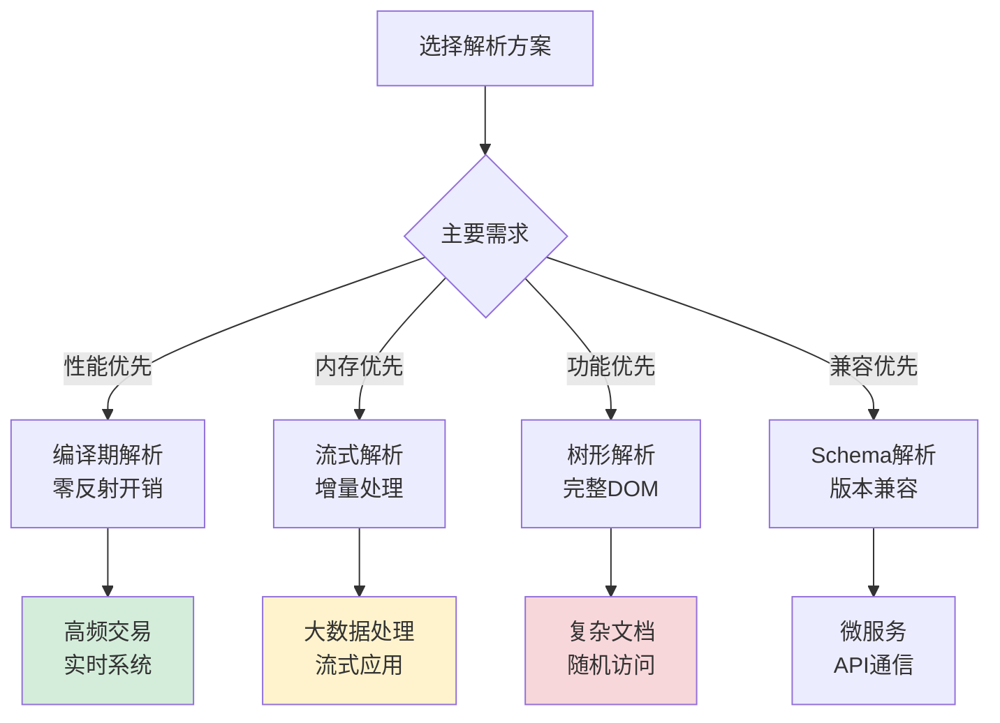

## 3. JSON解析机制

### 3.1 JSON设计哲学

**JSON解析设计哲学案例**：某API网关通过JSON解析实现高性能请求处理。

**为什么JSON成为Web标准**？

**技术成功因素分析**：

**语法简洁性**：
- **原理**：键值对结构，易于理解和实现
- **优势**：学习成本低，各语言都支持
- **价值**：成为事实上的数据交换标准

**JavaScript原生支持**：
- **原理**：JSON是JavaScript子集
- **优势**：浏览器原生支持，无需额外库
- **价值**：Web开发的首选数据格式

**扩展灵活性**：
- **原理**：无Schema约束，字段可自由扩展
- **优势**：支持快速迭代和灵活变更
- **价值**：适应快速变化的业务需求

**所以才流行**：JSON的三大成功因素。

**设计哲学总结**：

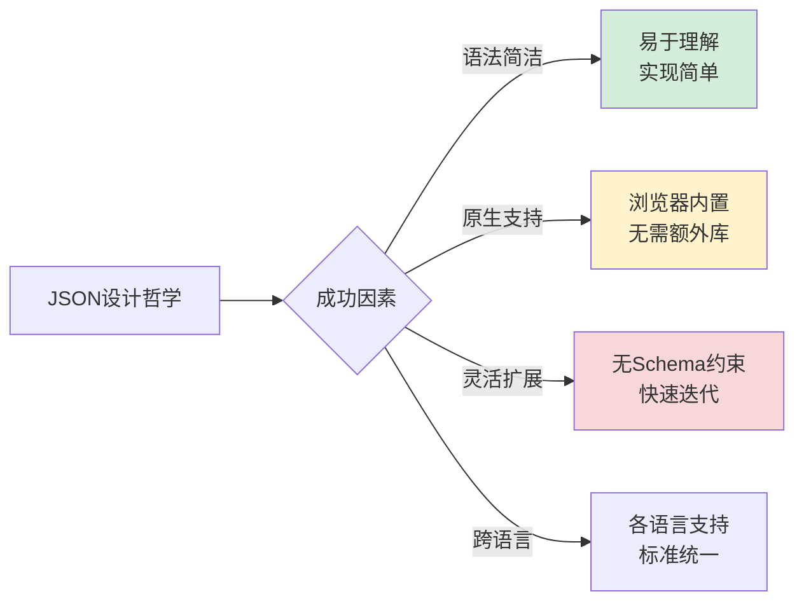

### 3.2 解析策略设计

**JSON解析策略案例**：某电商平台通过解析策略优化订单处理性能。

**为什么需要不同的解析策略**？

**策略选择技术原理**：

**缓存策略原理**：
- **适用场景**：重复解析相同结构数据
- **技术原理**：避免重复解析，空间换时间
- **实现机制**：结构哈希缓存解析结果

**并行策略原理**：
- **适用场景**：批量处理大量数据
- **技术原理**：利用多核CPU并行处理
- **实现机制**：数据分片，多线程并发

**增量策略原理**：
- **适用场景**：大文件或流式处理
- **技术原理**：避免内存峰值，增量输出
- **实现机制**：分块解析，流式处理

**所以才设计**：多种解析策略应对不同场景。

**策略性能对比**：

```mermaid
barChart
    title JSON解析策略性能对比
    x-axis [基本解析, 缓存策略, 并行策略, 增量策略]
    y-axis "解析时间(ms)" 0 --> 1000
    bar [800, 400, 300, 350]
    
    y-axis "内存峰值(MB)" 0 --> 200
    bar [150, 120, 100, 50]
```

### 3.3 性能优化技术

**JSON性能优化案例**：某高并发系统通过JSON优化提升吞吐量。

**为什么JSON需要性能优化**？

**性能瓶颈技术分析**：

**字符串处理开销**：
- **瓶颈原因**：字符串解析和编码转换
- **优化原理**：减少中间字符串创建
- **优化技术**：直接缓冲区操作

**内存分配压力**：
- **瓶颈原因**：频繁对象创建和垃圾回收
- **优化原理**：对象复用和池化技术
- **优化技术**：对象池、字符串池

**解析算法效率**：
- **瓶颈原因**：递归下降解析器效率低
- **优化原理**：状态机优化和预测解析
- **优化技术**：DFA状态机、预测解析

**所以才需要**：多层次的性能优化技术。

**优化技术体系**：

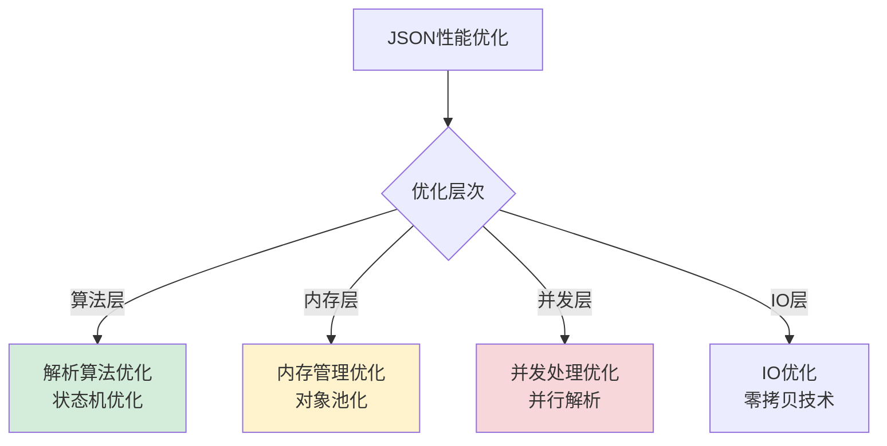

### 3.4 内存管理机制

**JSON内存管理案例**：某大数据平台通过JSON内存管理优化GC性能。

**为什么JSON内存管理重要**？

**内存管理技术原理**：

**字符串池化原理**：
- **问题**：相同字符串重复创建
- **原理**：字符串去重，共享实例
- **实现**：弱引用哈希表管理字符串

**对象池化原理**：
- **问题**：频繁对象创建销毁
- **原理**：对象复用，减少GC压力
- **实现**：对象池管理生命周期

**大对象处理原理**：
- **问题**：大对象导致内存碎片
- **原理**：分块处理，增量解析
- **实现**：流式解析，避免内存峰值

**所以才设计**：精细化的内存管理机制。

**内存优化效果**：

```mermaid
barChart
    title 内存管理优化效果
    x-axis [无优化, 字符串池, 对象池, 流式处理]
    y-axis "内存占用(MB)" 0 --> 200
    bar [180, 120, 80, 50]
    
    y-axis "GC时间(ms)" 0 --> 500
    bar [450, 300, 180, 100]
```

## 4. ProtoBuf解析机制

### 4.1 ProtoBuf设计哲学

**Protobuf解析设计哲学案例**：某微服务架构通过Protobuf解析实现高性能通信。

**为什么Protobuf性能如此出色**？

**性能优势技术原理**：

**二进制编码原理**：
- **编码机制**：直接内存映射，无需字符解析
- **性能优势**：编码解码速度比文本快5-10倍
- **技术细节**：Varint编码、固定长度编码

**Schema驱动原理**：
- **类型安全**：编译期类型检查，避免运行时错误
- **性能优化**：生成优化代码，避免反射开销
- **兼容性**：字段编号机制支持版本兼容

**流式处理原理**：
- **内存效率**：增量处理，避免内存峰值
- **网络优化**：紧凑编码，减少传输开销
- **并发支持**：无状态设计，支持并行处理

**所以才成为**：高性能解析的标杆技术。

**设计哲学总结**：

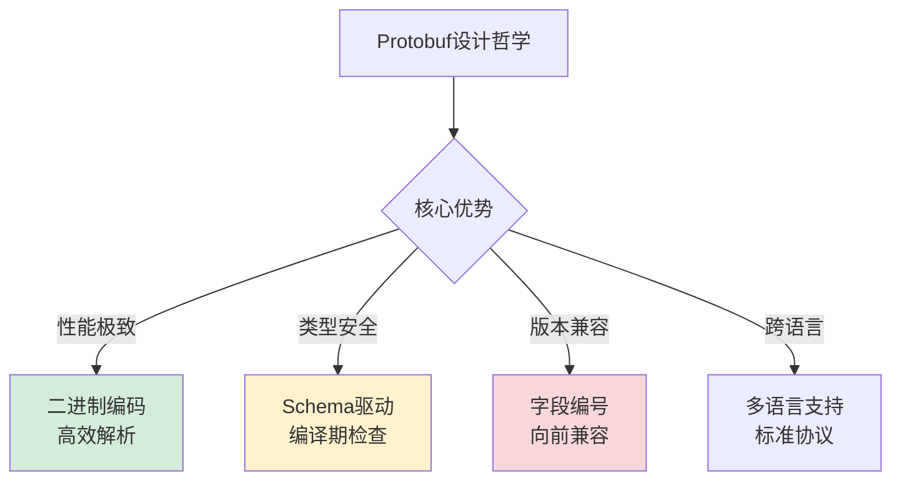

### 4.2 编码解析原理

**Protobuf编码解析案例**：某消息队列系统通过Protobuf编码优化解析效率。

**为什么Protobuf编码如此高效**？

**编码技术深度解析**：

**Varint编码原理**：
- **技术机制**：小整数使用变长编码
- **性能优势**：节省存储空间，提升编码速度
- **适用场景**：整数字段，特别是小整数

**长度前缀编码原理**：
- **技术机制**：变长数据前加长度标识
- **性能优势**：快速定位数据边界
- **适用场景**：字符串、字节数组、嵌套消息

**字段编号编码原理**：
- **技术机制**：使用数字编号标识字段
- **性能优势**：紧凑标识，避免字符串比较
- **适用场景**：所有字段标识

**所以才实现**：高效的二进制编码机制。

**编码性能对比**：

```mermaid
barChart
    title 编码方案性能对比
    x-axis [文本编码, XML编码, JSON编码, Protobuf编码]
    y-axis "编码速度(万条/秒)" 0 --> 100
    bar [5, 8, 12, 45]
    
    y-axis "数据体积比率" 0 --> 100
    bar [100, 120, 85, 35]
```

### 4.3 类型系统设计

**Protobuf类型系统案例**：某数据平台通过Protobuf类型系统保证解析一致性。

**为什么类型系统如此重要**？

**类型安全技术原理**：

**编译期类型检查**：
- **机制**：Schema文件定义类型，编译期生成代码
- **优势**：早期发现类型错误，避免运行时异常
- **价值**：提升代码质量和系统稳定性

**运行时类型验证**：
- **机制**：反序列化时验证数据类型
- **优势**：防止恶意数据注入，保证数据完整性
- **价值**：增强系统安全性和可靠性

**跨语言类型映射**：
- **机制**：统一类型定义，各语言自动映射
- **优势**：简化异构系统集成，降低沟通成本
- **价值**：支持多语言微服务架构

**所以才设计**：强大的类型系统保障。

**类型系统架构**：

```mermaid
graph TB
    A[Protobuf类型系统] --> B{类型保障}
    B -->|编译期| C[Schema定义<br/>代码生成]
    B -->|运行时| D[数据验证<br/>类型检查]
    B -->|跨语言| E[统一映射<br/>自动转换]
    B -->|扩展性| F[自定义类型<br/>插件支持]
    
    style C fill:#d4edda
    style D fill:#fff3cd
    style E fill:#f8d7da
```

### 4.4 版本兼容机制

**Protobuf版本兼容案例**：某API服务通过Protobuf实现平滑升级。

**为什么版本兼容如此关键**？

**兼容性技术原理**：

**字段编号机制**：
- **原理**：字段通过编号标识，而非名称
- **优势**：字段名变更不影响兼容性
- **规则**：字段编号一旦分配永不改变

**默认值机制**：
- **原理**：缺失字段使用默认值
- **优势**：新字段不会破坏旧客户端
- **规则**：合理设置默认值保证兼容

**未知字段忽略**：
- **原理**：未知字段被忽略而非报错
- **优势**：向前兼容，支持平滑升级
- **规则**：严格遵循协议规范

**所以才实现**：强大的版本兼容能力。

**兼容性规则总结**：

```mermaid
graph LR
    A[版本兼容机制] --> B{兼容规则}
    B -->|字段编号| C[编号不变<br/>名称可改]
    B -->|默认值| D[缺失字段<br/>使用默认值]
    B -->|未知字段| E[忽略未知<br/>不报错]
    B -->|类型变更| F[兼容变更<br/>不破坏协议]
    
    style C fill:#d4edda
    style D fill:#fff3cd
    style E fill:#f8d7da
```

## 5. XML解析机制

### 5.1 XML设计哲学

**XML设计哲学案例**：某数据平台通过XML实现数据交换。

**为什么XML在企业级应用中仍然重要**？

**企业级价值分析**：

**标准化程度**：
- **优势**：W3C标准，各平台广泛支持
- **价值**：降低技术选型风险
- **场景**：企业级系统集成

**验证能力**：
- **优势**：DTD、XML Schema强验证
- **价值**：保证数据质量和一致性
- **场景**：金融、医疗等关键领域

**扩展性设计**：
- **优势**：命名空间支持多领域扩展
- **价值**：适应复杂业务需求
- **场景**：大型企业系统集成

**所以才保留**：XML在企业级应用中的重要地位。

**设计哲学总结**：

```mermaid
graph LR
    A[XML设计哲学] --> B{核心价值}
    B -->|标准化| C[W3C标准<br/>广泛支持]
    B -->|验证能力| D[强类型验证<br/>数据质量]
    B -->|扩展性| E[命名空间<br/>多领域集成]
    B -->|可读性| F[人类可读<br/>易于调试]
    
    style C fill:#d4edda
    style D fill:#fff3cd
    style E fill:#f8d7da
```

### 5.2 解析模型对比

**XML的两种经典解析模型对比**：

**为什么需要不同的解析模型**？

**模型选择技术原理**：

**DOM模型原理**：
- **机制**：构建完整文档树在内存中
- **优势**：随机访问，复杂操作方便
- **劣势**：内存占用大，不适合大文档

**SAX模型原理**：
- **机制**：事件驱动，流式处理
- **优势**：内存效率高，适合大文档
- **劣势**：只能顺序访问，开发复杂

**StAX模型原理**：
- **机制**：拉式解析，控制权在应用
- **优势**：平衡性能和开发复杂度
- **劣势**：功能相对有限

**所以才提供**：多种解析模型应对不同需求。

**模型对比分析**：

```mermaid
barChart
    title XML解析模型对比
    x-axis [DOM模型, SAX模型, StAX模型]
    y-axis "内存占用(MB)" 0 --> 100
    bar [80, 5, 15]
    
    y-axis "开发复杂度" 0 --> 10
    bar [3, 8, 5]
    
    y-axis "功能丰富度" 0 --> 10
    bar [9, 4, 6]
```

### 5.3 验证机制设计

**XML验证机制案例**：某金融系统通过XML验证保证交易数据完整性。

**为什么验证机制如此重要**？

**验证技术原理**：

**DTD验证原理**：
- **机制**：文档类型定义，语法级验证
- **优势**：简单易用，各平台支持
- **局限**：功能有限，类型支持弱

**XML Schema验证原理**：
- **机制**：XML Schema，强类型验证
- **优势**：类型丰富，验证能力强
- **局限**：复杂度高，性能开销大

**Schematron验证原理**：
- **机制**：基于规则的验证
- **优势**：灵活性强，支持复杂业务规则
- **局限**：非标准，支持有限

**所以才设计**：多层次的验证机制。

**验证机制体系**：

```mermaid
graph TB
    A[XML验证机制] --> B{验证层次}
    B -->|语法层| C[DTD验证<br/>基本语法检查]
    B -->|类型层| D[XML Schema<br/>强类型验证]
    B -->|业务层| E[Schematron<br/>业务规则验证]
    B -->|安全层| F[安全验证<br/>防注入攻击]
    
    style C fill:#d4edda
    style D fill:#fff3cd
    style E fill:#f8d7da
```

### 5.4 扩展性设计

**XML扩展性案例**：某大型企业通过XML命名空间实现多系统集成。

**为什么扩展性如此关键**？

**扩展性技术原理**：

**命名空间机制**：
- **原理**：URI标识命名空间，避免冲突
- **优势**：支持多领域词汇表集成
- **应用**：SOAP、Web Services等标准

**XPath查询机制**：
- **原理**：路径表达式定位XML节点
- **优势**：灵活的数据提取和转换
- **应用**：数据查询、模板引擎等

**XSLT转换机制**：
- **原理**：模板驱动XML转换
- **优势**：强大的数据格式转换能力
- **应用**：报表生成、数据交换等

**所以才实现**：强大的扩展和集成能力。

**扩展性架构**：

```mermaid
graph LR
    A[XML扩展性] --> B{扩展机制}
    B -->|命名空间| C[多词汇表<br/>无冲突集成]
    B -->|XPath| D[灵活查询<br/>数据定位]
    B -->|XSLT| E[格式转换<br/>数据加工]
    B -->|插件| F[插件架构<br/>功能扩展]
    
    style C fill:#d4edda
    style D fill:#fff3cd
    style E fill:#f8d7da
```

## 6. 跨语言解析机制

### 6.1 Java解析机制

**Java解析设计哲学**：JVM生态的深度集成。

**为什么Java解析有其独特价值**？

**JVM生态优势分析**：

**运行时集成**：
- **优势**：与JVM内存模型深度集成
- **价值**：对象图解析完整支持
- **技术**：反射机制、注解处理

**安全机制**：
- **优势**：与Java安全模型集成
- **价值**：支持数字签名、加密解析
- **技术**：安全管理器、权限控制

**性能优化**：
- **优势**：JIT编译优化解析代码
- **价值**：运行时性能优化
- **技术**：热点代码内联优化

**所以才保留**：Java解析在JVM生态中的独特地位。

**设计特点总结**：

```mermaid
graph TB
    A[Java解析] --> B{设计特点}
    B -->|JVM集成| C[深度集成<br/>对象图支持]
    B -->|安全机制| D[安全模型<br/>签名加密]
    B -->|性能优化| E[JIT优化<br/>运行时优化]
    B -->|生态丰富| F[工具链<br/>监控调试]
    
    style C fill:#d4edda
    style D fill:#fff3cd
    style E fill:#f8d7da
```

### 6.2 JavaScript解析机制

**JavaScript解析设计哲学**：Web生态的灵活设计。

**为什么JavaScript解析如此简单**？

**Web生态特点分析**：

**原生支持**：
- **优势**：JSON是JavaScript子集
- **价值**：无需额外库，开箱即用
- **技术**：JSON.parse/stringify原生函数

**动态类型**：
- **优势**：无需类型定义，灵活解析
- **价值**：快速原型开发，适应变化
- **技术**：运行时类型推断

**异步处理**：
- **优势**：与Promise/async集成
- **价值**：支持流式、异步解析
- **技术**：TransformStream、异步迭代器

**所以才简单**：JavaScript解析的设计哲学。

**生态系统**：

```mermaid
graph LR
    A[JavaScript解析] --> B{生态特点}
    B -->|原生支持| C[JSON标准<br/>开箱即用]
    B -->|动态类型| D[灵活解析<br/>无需Schema]
    B -->|异步处理| E[流式解析<br/>Promise集成]
    B -->|工具丰富| F[开发工具<br/>调试支持]
    
    style C fill:#d4edda
    style D fill:#fff3cd
    style E fill:#f8d7da
```

### 6.3 Go解析机制

**Go解析设计哲学**：简洁高效的静态类型设计。

**为什么Go解析如此高效**？

**语言设计优势分析**：

**静态类型**：
- **优势**：编译期类型检查，零运行时开销
- **价值**：高性能，类型安全
- **技术**：结构体标签元数据

**内存管理**：
- **优势**：手动内存管理，无GC压力
- **价值**：可控的内存使用
- **技术**：零分配解析技术

**并发模型**：
- **优势**：goroutine轻量级并发
- **价值**：高并发解析处理
- **技术**：通道通信，并发安全

**所以才高效**：Go解析的设计哲学。

**技术特点**：

```mermaid
graph TB
    A[Go解析] --> B{技术特点}
    B -->|静态类型| C[编译期检查<br/>零运行时开销]
    B -->|内存管理| D[手动控制<br/>无GC压力]
    B -->|并发模型| E[goroutine<br/>高并发处理]
    B -->|标准库| F[encoding<br/>官方支持]
    
    style C fill:#d4edda
    style D fill:#fff3cd
    style E fill:#f8d7da
```

### 6.4 解析机制对比总结

**跨语言解析对比分析**：

**为什么不同语言有不同的解析哲学**？

**语言哲学差异分析**：

**Java哲学**：
- **特点**：企业级、安全、完整
- **解析**：深度集成、功能丰富
- **适用**：大型企业系统

**JavaScript哲学**：
- **特点**：灵活、动态、Web原生
- **解析**：简单易用、适应变化
- **适用**：Web应用、快速开发

**Go哲学**：
- **特点**：简洁、高效、并发
- **解析**：高性能、可控内存
- **适用**：高并发、系统编程

**所以才形成**：各具特色的解析机制。

**对比总结表**：

| 维度 | Java | JavaScript | Go |
|------|------|------------|----|
| **设计哲学** | 企业级完整 | Web灵活简单 | 高性能简洁 |
| **类型系统** | 强类型+反射 | 动态类型 | 静态类型 |
| **性能特点** | JIT优化 | 解释执行 | 编译优化 |
| **内存管理** | GC自动 | GC自动 | 手动控制 |
| **并发模型** | 线程池 | 事件循环 | goroutine |
| **适用场景** | 企业系统 | Web应用 | 高并发系统 |

**技术演进趋势**：

```mermaid
gantt
    title 解析技术演进趋势
    dateFormat  YYYY
    axisFormat  %Y
    
    section 当前主流
    JSON解析       :2020, 6y
    Protobuf解析   :2018, 8y
    MessagePack解析:2016, 10y
    
    section 新兴趋势
    Arrow解析      :2022, 4y
    FlatBuffers解析:2021, 5y
    智能解析      :2023, 3y
```

---

## 🎯 深度总结

> **数据解析设计思想**的本质是在**字节流的线性世界**与**业务对象的层次世界**之间架设智能桥梁。优秀的解析器不仅要是高效的翻译官，更要是聪明的过滤器——只取所需，而非全盘接收。

**技术演进启示**：
1. **从DOM到流式**：内存效率驱动解析方式演进
2. **从反射到编译期**：性能需求驱动代码生成方式演进
3. **从通用到专用**：场景化需求催生专用解析方案
4. **从手动到智能**：AI技术开始参与解析优化

**未来发展方向**：
- **自适应解析**：根据数据特征自动选择最优方案
- **零拷贝技术**：进一步减少内存复制开销
- **安全增强**：更强的数据加密和验证机制
- **跨平台统一**：解决异构系统解析兼容问题

## 🔗 延伸阅读

- ← [05.序列化数据的思想](./05.序列化数据的思想.md)：解析的逆过程——序列化
- → [07.类的加载核心原理](./07.类的加载核心原理.md)：另一种形式的"解析"——字节码到类对象
- → [08.对象创建流程原理](./08.对象创建流程原理.md)：解析后的对象如何创建
- → [09.对象和函数访问原理](./09.对象和函数访问原理.md)：解析完成的对象如何使用
