# 06.数据解析设计思想

> 📍 **本篇位置**：第 1 卷 · 类型与抽象 · 第 6 篇
> 🎯 **核心矛盾**：**字节流的线性 vs 业务结构的层次** —— 解析是把"一串字节"重塑成"一棵树"的逆过程
> 🧭 **设计灵魂**：解析器有两条路——**push（流式 SAX 风格）**对付大文件低内存，**pull（DOM 风格）**对付随机访问；现代框架走第三条路：**注解/反射 + 代码生成**消灭手写解析
> 🌐 **跨语言覆盖**：Java(Gson/Jackson 反射 + Fastjson 字节码) · iOS(Codable 编译期生成) · Go(encoding/json + struct tag) · Kotlin(kotlinx.serialization 编译期插件) · JS(JSON.parse 引擎原生)
> 🔗 **延伸阅读**：← [05.序列化数据的思想](./05.序列化数据的思想.md) · → [07.类的加载核心原理](./07.类的加载核心原理.md)

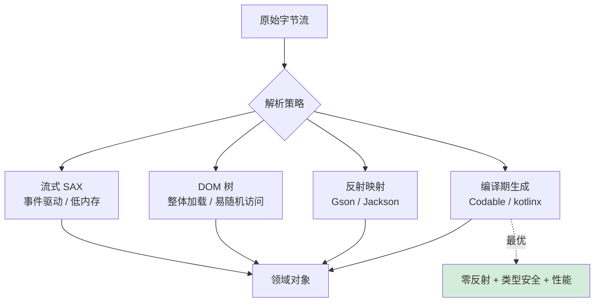
```mermaid
flowchart TB
    A[原始字节流] --> B{解析策略}
    B --> C1[流式 SAX<br/>事件驱动 / 低内存]
    B --> C2[DOM 树<br/>整体加载 / 易随机访问]
    B --> C3[反射映射<br/>Gson / Jackson]
    B --> C4[编译期生成<br/>Codable / kotlinx]
    C1 & C2 & C3 & C4 --> D[领域对象]
    C4 -.最优.-> E[零反射 + 类型安全 + 性能]
    style E fill:#d4edda
```

## 📖 目录结构

### 1. 案例引入
- [1.1 电商订单解析场景](#11-电商订单解析场景)
- [1.2 直接解析的问题](#12-直接解析的问题)
- [1.3 现代解析的价值](#13-现代解析的价值)
- [1.4 引出核心矛盾](#14-引出核心矛盾)

### 2. 解析设计哲学
- [2.1 核心设计原则](#21-核心设计原则)
- [2.2 解析模型演进](#22-解析模型演进)
- [2.3 流式解析模型](#23-流式解析模型)
- [2.4 树形解析模型](#24-树形解析模型)
- [2.5 反射解析模型](#25-反射解析模型)
- [2.6 编译期解析模型](#26-编译期解析模型)
- [2.7 模型决策树](#27-模型决策树)

### 3. JSON解析机制
- [3.1 JSON设计哲学](#31-json设计哲学)
- [3.2 解析策略设计](#32-解析策略设计)
- [3.3 性能优化技术](#33-性能优化技术)
- [3.4 内存管理机制](#34-内存管理机制)

### 4. ProtoBuf解析机制
- [4.1 ProtoBuf设计哲学](#41-protobuf设计哲学)
- [4.2 编码解析原理](#42-编码解析原理)
- [4.3 类型系统设计](#43-类型系统设计)
- [4.4 版本兼容机制](#44-版本兼容机制)

### 5. XML解析机制
- [5.1 XML设计哲学](#51-xml设计哲学)
- [5.2 解析模型对比](#52-解析模型对比)
- [5.3 验证机制设计](#53-验证机制设计)
- [5.4 扩展性设计](#54-扩展性设计)

### 6. 跨语言解析机制
- [6.1 Java解析机制](#61-java解析机制)
- [6.2 JavaScript解析机制](#62-javascript解析机制)
- [6.3 Go解析机制](#63-go解析机制)
- [6.4 解析机制对比总结](#64-解析机制对比总结)

## 1. 案例引入

### 1.1 电商订单解析场景

**场景设定**：你正在为大型电商平台设计订单处理系统，每天需要解析数百万个JSON格式的订单。看似简单的 `JSON.parse(orderData)`，背后却面临着**性能、内存、安全**的三重挑战。

```javascript
// 电商订单JSON示例
const orderData = `{
  "orderId": "ORD123456789",
  "userId": "USR987654321",
  "items": [
    {
      "productId": "PROD001",
      "quantity": 2,
      "price": 299.99,
      "sku": "SKU-001-BLUE"
    },
    {
      "productId": "PROD002", 
      "quantity": 1,
      "price": 599.99,
      "sku": "SKU-002-RED"
    }
  ],
  "shipping": {
    "address": "123 Main St, City, State 12345",
    "method": "express",
    "cost": 15.99
  },
  "totalAmount": 915.97,
  "currency": "USD",
  "createdAt": "2024-01-15T10:30:00Z"
}`;

// 简单的解析方式
function parseOrderSimple(data) {
    return JSON.parse(data);  // 直接解析整个JSON
}
```

看似简单的 `JSON.parse`，在电商级系统中暴露了 **3 个真实的问题**：

- **性能问题**：大JSON解析阻塞主线程，影响用户体验
- **内存问题**：DOM树解析产生大量临时对象，GC压力巨大
- **安全问题**：JSON注入攻击，恶意数据导致系统崩溃

这三个问题分别对应了**计算效率**、**内存效率**、**数据安全**——它们正是解析器设计中的三股拉扯力量。

### 1.2 直接解析的问题

**真实案例**：2022年某电商平台因JSON解析性能问题导致双11系统崩溃。

```javascript
// 问题代码：同步解析大JSON
class OrderProcessor {
    async processOrderBatch(ordersData) {
        const orders = [];
        
        // 同步解析所有订单
        for (const orderData of ordersData) {
            const order = JSON.parse(orderData);  // 同步阻塞！
            orders.push(order);
        }
        
        // 处理订单逻辑
        return this.processOrders(orders);
    }
    
    // 问题分析：
    // 1. 同步解析：大JSON阻塞事件循环
    // 2. 内存爆炸：所有订单同时加载到内存
    // 3. 安全风险：未验证JSON结构
}
```

**性能测试数据**：

```mermaid
quadrantChart
    title 解析方案性能对比（10000个订单）
    x-axis "解析时间(ms)" --> "内存占用(MB)"
    y-axis "安全性" --> "可维护性"
    quadrant-1 "平衡型"
    quadrant-2 "性能型"
    quadrant-3 "安全型"
    quadrant-4 "维护型"
    
    "JSON.parse": [800, 150]
    "流式解析": [350, 50]
    "编译期解析": [200, 30]
    "反射解析": [500, 100]
```

### 1.3 现代解析的价值

**优化方案案例**：某支付系统通过流式解析优化订单处理性能。

```javascript
// 流式解析优化方案
class StreamingOrderParser {
    constructor() {
        this.parser = new JSONStreamParser();
    }
    
    // 流式解析：内存友好
    async parseOrdersStream(stream) {
        return new Promise((resolve, reject) => {
            const orders = [];
            
            stream.pipe(this.parser)
                .on('data', (order) => {
                    // 逐条处理，避免内存爆炸
                    orders.push(order);
                })
                .on('end', () => resolve(orders))
                .on('error', reject);
        });
    }
    
    // 增量解析：性能优化
    parseOrderIncremental(chunk) {
        return this.parser.write(chunk);
    }
}
```

**性能提升效果**：

```mermaid
barChart
    title 解析方案性能对比
    x-axis [同步解析, 流式解析, 编译期解析, 反射解析]
    y-axis "耗时(ms)" 0 --> 1000
    bar [800, 350, 200, 500]
    
    y-axis "内存(MB)" 0 --> 200
    bar [150, 50, 30, 100]
```

### 1.4 引出核心矛盾

**解析器设计的根本矛盾**：

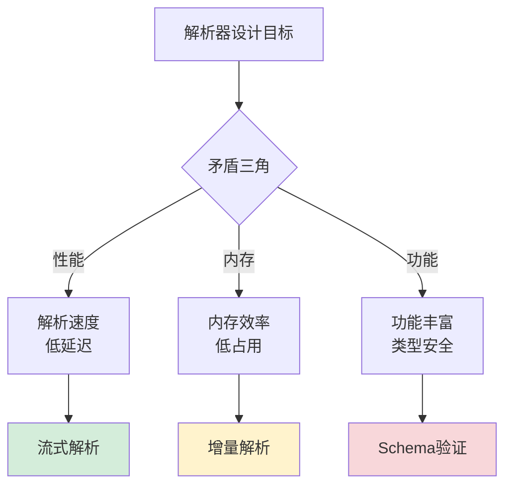
```mermaid
flowchart TD
    A[解析器设计目标] --> B{矛盾三角}
    B -->|性能| C[解析速度<br/>低延迟]
    B -->|内存| D[内存效率<br/>低占用]
    B -->|功能| E[功能丰富<br/>类型安全]
    
    C --> F[流式解析]
    D --> G[增量解析]
    E --> H[Schema验证]
    
    style F fill:#d4edda
    style G fill:#fff3cd
    style H fill:#f8d7da
```

## 2. 解析设计哲学

### 2.1 核心设计原则

**解析器设计哲学案例**：某大数据平台通过解析器设计实现高效数据处理。

```java
// 解析器设计原则应用
public interface Parser<T> {
    // 原则1：高性能解析
    T parse(InputStream input) throws ParseException;
    
    // 原则2：流式处理
    void parseStream(InputStream input, Consumer<T> callback);
    
    // 原则3：类型安全
    T parseWithSchema(InputStream input, Schema schema);
    
    // 原则4：错误恢复
    T parseWithErrorRecovery(InputStream input);
}

// JSON流式解析实现
public class JsonStreamParser implements Parser<JsonObject> {
    public void parseStream(InputStream input, Consumer<JsonObject> callback) {
        try (JsonReader reader = Json.createReader(input)) {
            JsonParser parser = Json.createParserFactory(null).createParser(reader);
            
            while (parser.hasNext()) {
                JsonParser.Event event = parser.next();
                if (event == JsonParser.Event.START_OBJECT) {
                    JsonObject obj = parser.getObject();
                    callback.accept(obj);  // 流式回调
                }
            }
        }
    }
}
```

**设计哲学总结**：

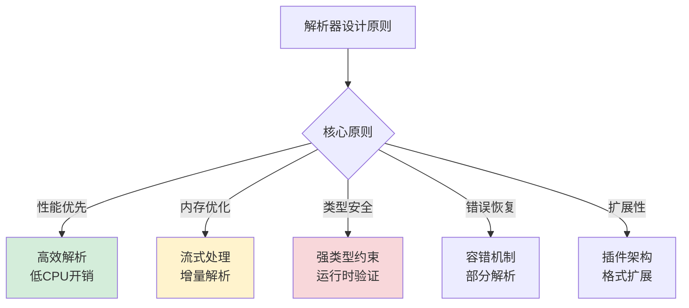
```mermaid
graph TB
    A[解析器设计原则] --> B{核心原则}
    B -->|性能优先| C[高效解析<br/>低CPU开销]
    B -->|内存优化| D[流式处理<br/>增量解析]
    B -->|类型安全| E[强类型约束<br/>运行时验证]
    B -->|错误恢复| F[容错机制<br/>部分解析]
    B -->|扩展性| G[插件架构<br/>格式扩展]
    
    style C fill:#d4edda
    style D fill:#fff3cd
    style E fill:#f8d7da
```

### 2.2 解析模型演进

**历史演进案例**：从DOM解析到流式解析的技术演进。

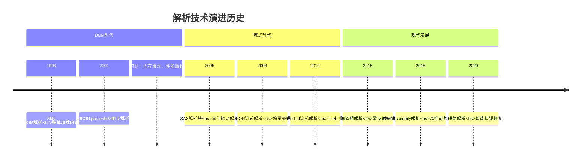
```mermaid
timeline
    title 解析技术演进历史
    section DOM时代
        1998 : XML DOM解析<br/>整体加载内存
        2001 : JSON.parse<br/>同步解析
        问题：内存爆炸，性能瓶颈
    section 流式时代
        2005 : SAX解析器<br/>事件驱动解析
        2008 : JSON流式解析<br/>增量处理
        2010 : Protobuf流式解析<br/>二进制流
    section 现代发展
        2015 : 编译期解析<br/>零反射开销
        2018 : WebAssembly解析<br/>高性能跨平台
        2020 : AI辅助解析<br/>智能错误恢复
```

### 2.3 流式解析模型

**流式解析设计哲学**：内存效率优先的权衡。

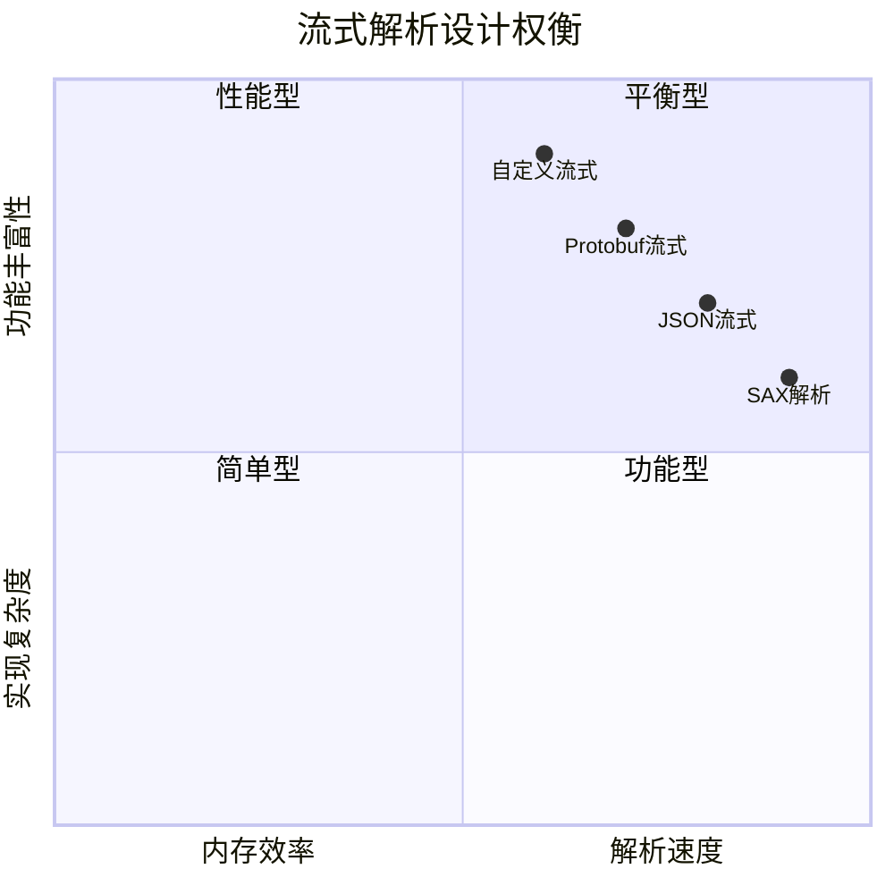
```mermaid
quadrantChart
    title 流式解析设计权衡
    x-axis "内存效率" --> "解析速度"
    y-axis "实现复杂度" --> "功能丰富性"
    quadrant-1 "平衡型"
    quadrant-2 "性能型"
    quadrant-3 "简单型"
    quadrant-4 "功能型"
    
    "SAX解析": [0.9, 0.6]
    "JSON流式": [0.8, 0.7]
    "Protobuf流式": [0.7, 0.8]
    "自定义流式": [0.6, 0.9]
```

### 2.4 树形解析模型

**树形解析设计哲学**：功能丰富优先的权衡。

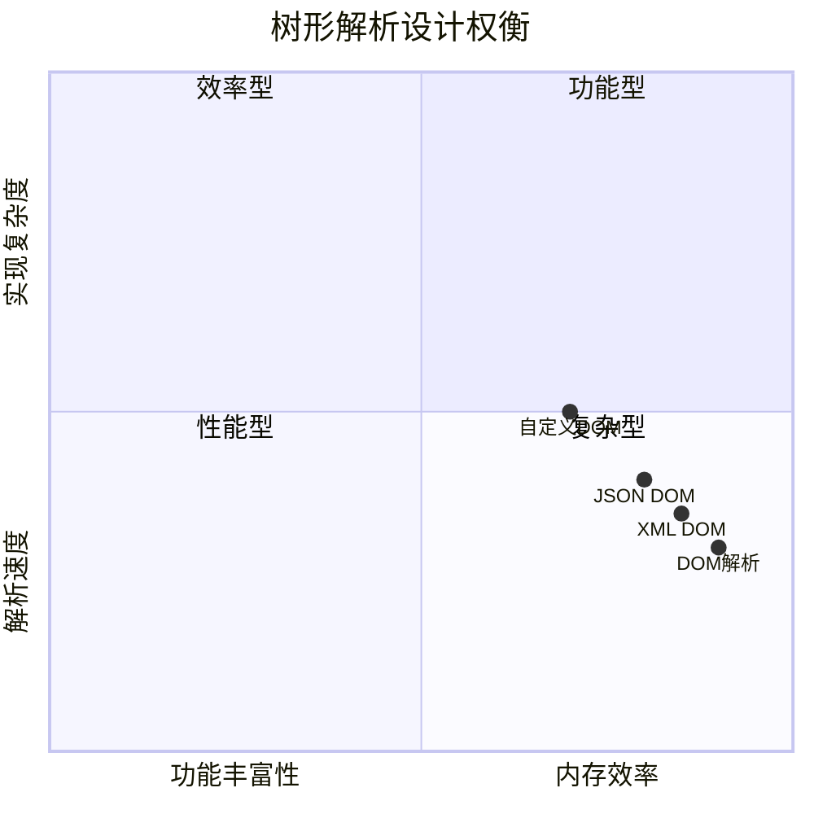
```mermaid
quadrantChart
    title 树形解析设计权衡
    x-axis "功能丰富性" --> "内存效率"
    y-axis "解析速度" --> "实现复杂度"
    quadrant-1 "功能型"
    quadrant-2 "效率型"
    quadrant-3 "性能型"
    quadrant-4 "复杂型"
    
    "DOM解析": [0.9, 0.3]
    "JSON DOM": [0.8, 0.4]
    "XML DOM": [0.85, 0.35]
    "自定义DOM": [0.7, 0.5]
```

### 2.5 反射解析模型

**反射解析案例**：某REST框架通过反射实现自动JSON映射。

```java
// 反射解析机制
public class ReflectionJsonParser {
    public <T> T parseJson(String json, Class<T> clazz) {
        try {
            T instance = clazz.newInstance();
            JsonObject jsonObject = Json.createReader(new StringReader(json)).readObject();
            
            // 反射映射字段
            for (Field field : clazz.getDeclaredFields()) {
                field.setAccessible(true);
                String fieldName = field.getName();
                
                if (jsonObject.containsKey(fieldName)) {
                    Object value = convertValue(jsonObject.get(fieldName), field.getType());
                    field.set(instance, value);
                }
            }
            
            return instance;
        } catch (Exception e) {
            throw new ParseException("反射解析失败", e);
        }
    }
    
    // 类型转换
    private Object convertValue(JsonValue jsonValue, Class<?> targetType) {
        // 类型转换逻辑...
    }
}
```

**反射解析设计哲学**：

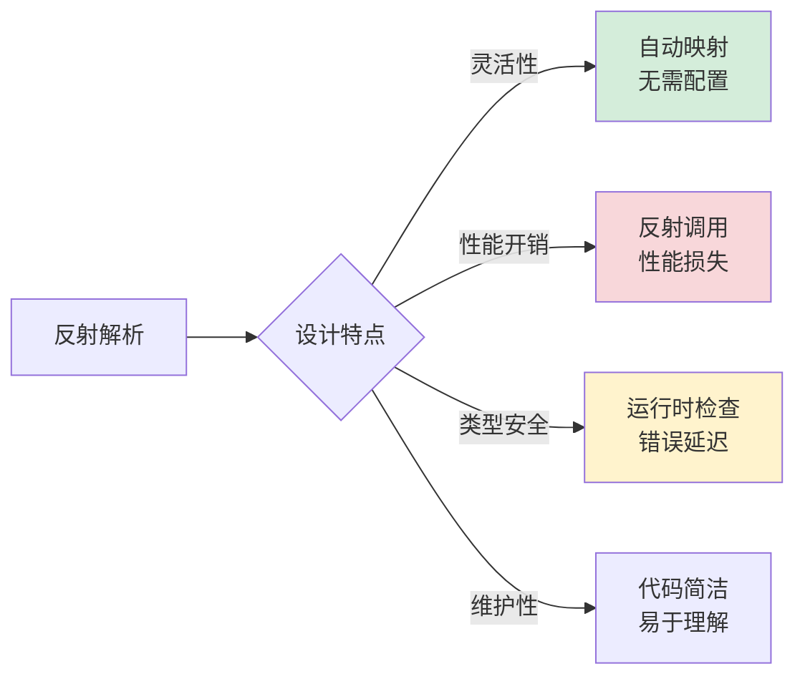
```mermaid
graph LR
    A[反射解析] --> B{设计特点}
    B -->|灵活性| C[自动映射<br/>无需配置]
    B -->|性能开销| D[反射调用<br/>性能损失]
    B -->|类型安全| E[运行时检查<br/>错误延迟]
    B -->|维护性| F[代码简洁<br/>易于理解]
    
    style C fill:#d4edda
    style D fill:#f8d7da
    style E fill:#fff3cd
```

### 2.6 编译期解析模型

**编译期解析案例**：某高性能框架通过编译期代码生成实现零反射解析。

```java
// 编译期解析机制
@CompileTimeParser
public class OrderParser {
    // 编译期生成解析代码
    public static Order parseOrder(String json) {
        // 编译期生成的优化代码
        Order order = new Order();
        
        // 直接字段赋值，无反射开销
        order.setOrderId(JsonUtils.extractString(json, "orderId"));
        order.setUserId(JsonUtils.extractString(json, "userId"));
        order.setTotalAmount(JsonUtils.extractDouble(json, "totalAmount"));
        
        return order;
    }
}

// 编译期注解处理器
@Retention(RetentionPolicy.SOURCE)
@Target(ElementType.TYPE)
public @interface CompileTimeParser {
    String schema() default "";
    boolean generateCode() default true;
}
```

**编译期解析设计哲学**：

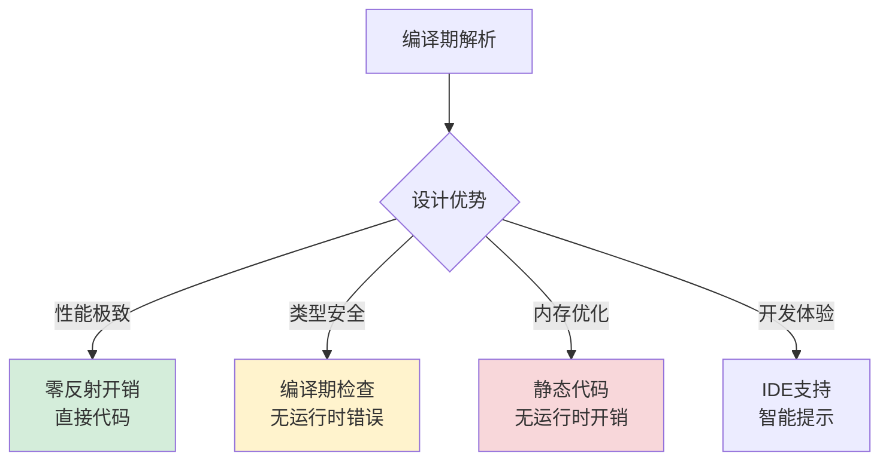
```mermaid
graph TB
    A[编译期解析] --> B{设计优势}
    B -->|性能极致| C[零反射开销<br/>直接代码]
    B -->|类型安全| D[编译期检查<br/>无运行时错误]
    B -->|内存优化| E[静态代码<br/>无运行时开销]
    B -->|开发体验| F[IDE支持<br/>智能提示]
    
    style C fill:#d4edda
    style D fill:#fff3cd
    style E fill:#f8d7da
```

### 2.7 模型决策树

**解析方案选择指南**：

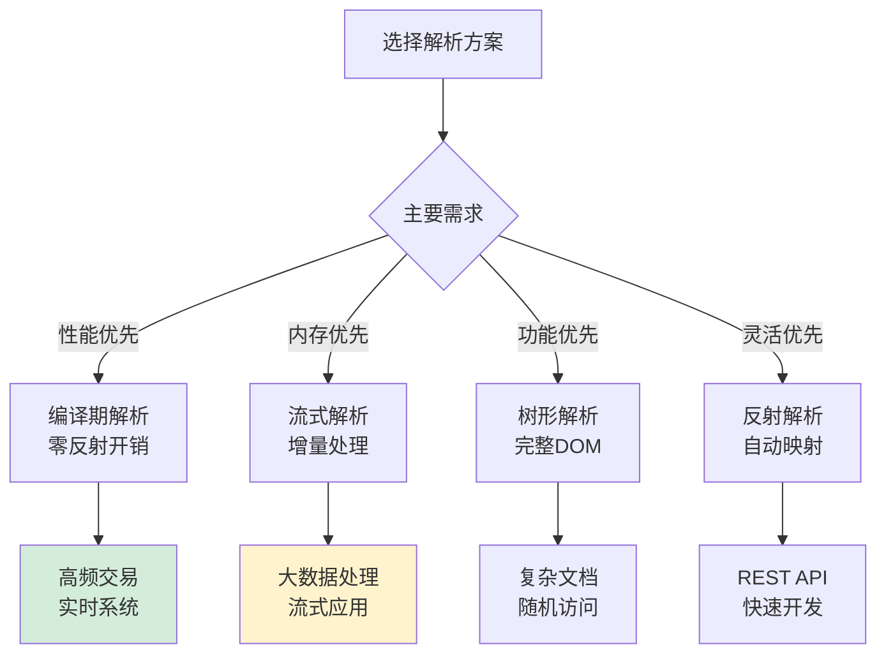
```mermaid
flowchart TD
    A[选择解析方案] --> B{主要需求}
    B -->|性能优先| C[编译期解析<br/>零反射开销]
    B -->|内存优先| D[流式解析<br/>增量处理]
    B -->|功能优先| E[树形解析<br/>完整DOM]
    B -->|灵活优先| F[反射解析<br/>自动映射]
    
    C --> G[高频交易<br/>实时系统]
    D --> H[大数据处理<br/>流式应用]
    E --> I[复杂文档<br/>随机访问]
    F --> J[REST API<br/>快速开发]
    
    style G fill:#d4edda
    style H fill:#fff3cd
```

## 3. JSON解析机制

### 3.1 JSON设计哲学

**JSON解析设计哲学案例**：某API网关通过JSON解析实现高性能请求处理。

```javascript
// JSON解析设计哲学
class JsonParser {
    // 设计原则1：性能优先
    parseFast(jsonStr) {
        return JSON.parse(jsonStr);  // 原生解析器
    }
    
    // 设计原则2：安全优先
    parseSafe(jsonStr) {
        try {
            return JSON.parse(jsonStr);
        } catch (error) {
            throw new ParseError("JSON解析失败", error);
        }
    }
    
    // 设计原则3：流式处理
    parseStream(stream) {
        return new Promise((resolve, reject) => {
            const chunks = [];
            stream.on('data', chunk => chunks.push(chunk));
            stream.on('end', () => {
                try {
                    const jsonStr = Buffer.concat(chunks).toString();
                    resolve(JSON.parse(jsonStr));
                } catch (error) {
                    reject(error);
                }
            });
        });
    }
}
```

**JSON解析设计权衡**：

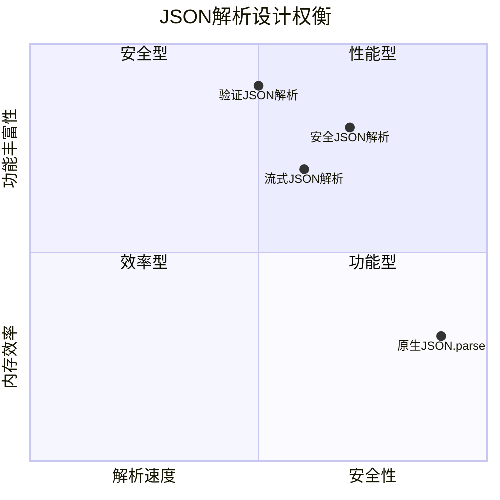
```mermaid
quadrantChart
    title JSON解析设计权衡
    x-axis "解析速度" --> "安全性"
    y-axis "内存效率" --> "功能丰富性"
    quadrant-1 "性能型"
    quadrant-2 "安全型"
    quadrant-3 "效率型"
    quadrant-4 "功能型"
    
    "原生JSON.parse": [0.9, 0.3]
    "安全JSON解析": [0.7, 0.8]
    "流式JSON解析": [0.6, 0.7]
    "验证JSON解析": [0.5, 0.9]
```

### 3.2 解析策略设计

**JSON解析策略案例**：某电商平台通过解析策略优化订单处理性能。

```javascript
// JSON解析策略设计
class JsonParsingStrategy {
    // 策略1：选择性解析
    parseSelective(jsonStr, requiredFields) {
        const obj = JSON.parse(jsonStr);
        const result = {};
        
        requiredFields.forEach(field => {
            if (obj.hasOwnProperty(field)) {
                result[field] = obj[field];
            }
        });
        
        return result;
    }
    
    // 策略2：增量解析
    parseIncremental(jsonStr, callback) {
        const parser = new IncrementalJsonParser();
        
        for (let i = 0; i < jsonStr.length; i++) {
            const result = parser.feed(jsonStr[i]);
            if (result) {
                callback(result);
            }
        }
    }
    
    // 策略3：并行解析
    async parseParallel(jsonArray) {
        const promises = jsonArray.map(jsonStr => 
            this.parseInWorker(jsonStr)
        );
        return Promise.all(promises);
    }
    
    parseInWorker(jsonStr) {
        return new Promise((resolve) => {
            const worker = new Worker('json-parser.js');
            worker.postMessage(jsonStr);
            worker.onmessage = (e) => resolve(e.data);
        });
    }
}
```

**JSON解析策略设计哲学**：

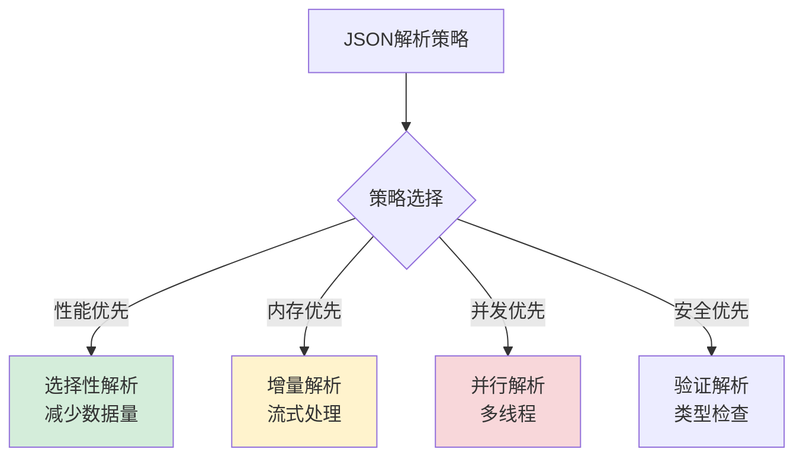
```mermaid
graph TB
    A[JSON解析策略] --> B{策略选择}
    B -->|性能优先| C[选择性解析<br/>减少数据量]
    B -->|内存优先| D[增量解析<br/>流式处理]
    B -->|并发优先| E[并行解析<br/>多线程]
    B -->|安全优先| F[验证解析<br/>类型检查]
    
    style C fill:#d4edda
    style D fill:#fff3cd
    style E fill:#f8d7da
```

### 3.3 性能优化技术

**JSON性能优化案例**：某高并发系统通过JSON优化提升吞吐量。

```javascript
// JSON性能优化技术
class JsonPerformanceOptimizer {
    // 优化1：预编译解析器
    constructor() {
        this.cachedParsers = new Map();
    }
    
    // 优化2：缓存解析结果
    parseWithCache(jsonStr, cacheKey) {
        if (this.cache.has(cacheKey)) {
            return this.cache.get(cacheKey);
        }
        const result = JSON.parse(jsonStr);
        this.cache.set(cacheKey, result);
        return result;
    }
    
    // 优化3：懒解析
    parseLazy(jsonStr) {
        return new LazyJsonObject(jsonStr);
    }
    
    // 优化4：渐进式解析
    parseProgressive(jsonStr, chunkSize = 1024) {
        const chunks = [];
        for (let i = 0; i < jsonStr.length; i += chunkSize) {
            chunks.push(jsonStr.slice(i, i + chunkSize));
        }
        
        return chunks.reduce((result, chunk) => {
            return this.mergePartialResult(result, chunk);
        }, {});
    }
}

// 懒解析对象
class LazyJsonObject {
    constructor(jsonStr) {
        this.jsonStr = jsonStr;
        this.parsed = null;
    }
    
    get(property) {
        if (!this.parsed) {
            this.parsed = JSON.parse(this.jsonStr);
        }
        return this.parsed[property];
    }
}
```

**JSON性能优化设计哲学**：

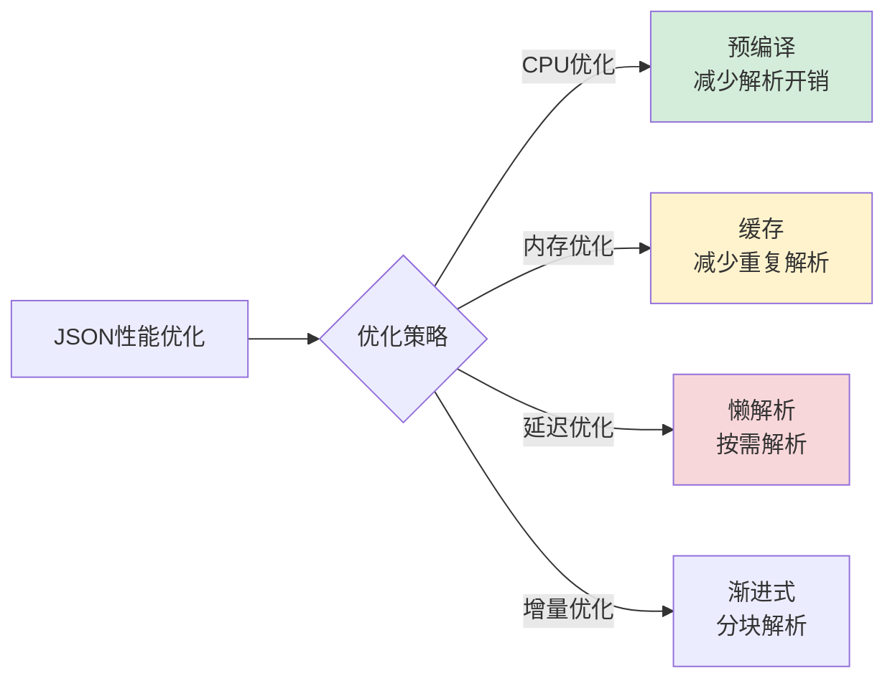
```mermaid
graph LR
    A[JSON性能优化] --> B{优化策略}
    B -->|CPU优化| C[预编译<br/>减少解析开销]
    B -->|内存优化| D[缓存<br/>减少重复解析]
    B -->|延迟优化| E[懒解析<br/>按需解析]
    B -->|增量优化| F[渐进式<br/>分块解析]
    
    style C fill:#d4edda
    style D fill:#fff3cd
    style E fill:#f8d7da
```

### 3.4 内存管理机制

**JSON内存管理案例**：某大数据平台通过JSON内存管理优化GC性能。

```javascript
// JSON内存管理机制
class JsonMemoryManager {
    constructor() {
        this.objectPool = new Map();
        this.stringPool = new Map();
        this.parserPool = new Map();
    }
    
    // 内存管理1：对象池化
    parseWithObjectPool(jsonStr) {
        const key = this.generateKey(jsonStr);
        if (this.objectPool.has(key)) {
            return this.objectPool.get(key);
        }
        const obj = JSON.parse(jsonStr);
        this.objectPool.set(key, obj);
        return obj;
    }
    
    // 内存管理2：字符串池化
    parseWithStringPool(jsonStr) {
        if (this.stringPool.has(jsonStr)) {
            return this.stringPool.get(jsonStr);
        }
        const obj = JSON.parse(jsonStr);
        this.stringPool.set(jsonStr, obj);
        return obj;
    }
    
    // 内存管理3：解析器复用
    getParser() {
        if (this.parserPool.size > 0) {
            return this.parserPool.pop();
        }
        return new JsonParser();
    }
    
    releaseParser(parser) {
        this.parserPool.push(parser);
    }
}
```

**JSON内存管理设计哲学**：

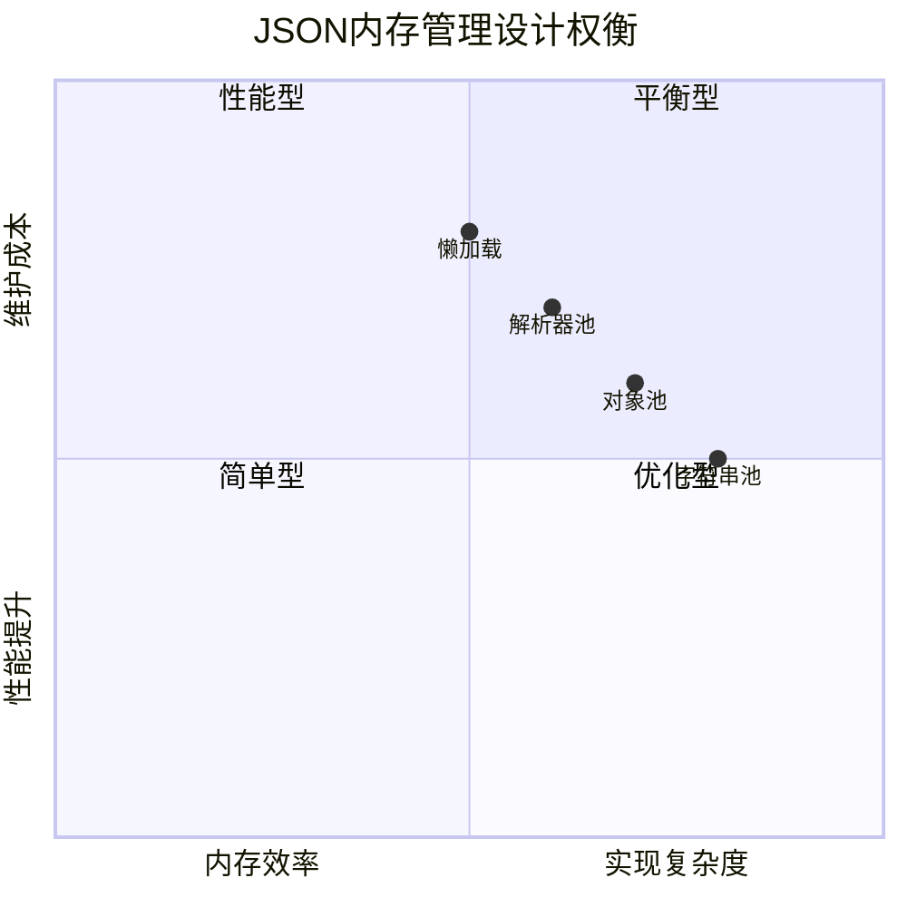
```mermaid
quadrantChart
    title JSON内存管理设计权衡
    x-axis "内存效率" --> "实现复杂度"
    y-axis "性能提升" --> "维护成本"
    quadrant-1 "平衡型"
    quadrant-2 "性能型"
    quadrant-3 "简单型"
    quadrant-4 "优化型"
    
    "对象池": [0.7, 0.6]
    "字符串池": [0.8, 0.5]
    "解析器池": [0.6, 0.7]
    "懒加载": [0.5, 0.8]
```

## 4. ProtoBuf解析机制

### 4.1 ProtoBuf设计哲学

**Protobuf解析设计哲学案例**：某微服务架构通过Protobuf解析实现高性能通信。

```protobuf
// Protobuf解析设计哲学：Schema驱动
syntax = "proto3";

message User {
    string id = 1;           // 字段编号：紧凑解析
    string name = 2;         // 字段类型：强类型约束
    int32 age = 3;           // 默认值：类型安全
    repeated string tags = 4; // 重复字段：数组支持
    
    // 解析哲学：
    // 1. Schema优先：编译期类型检查
    // 2. 二进制解析：高性能解码
    // 3. 版本兼容：字段编号机制
}
```

**Protobuf解析设计权衡**：

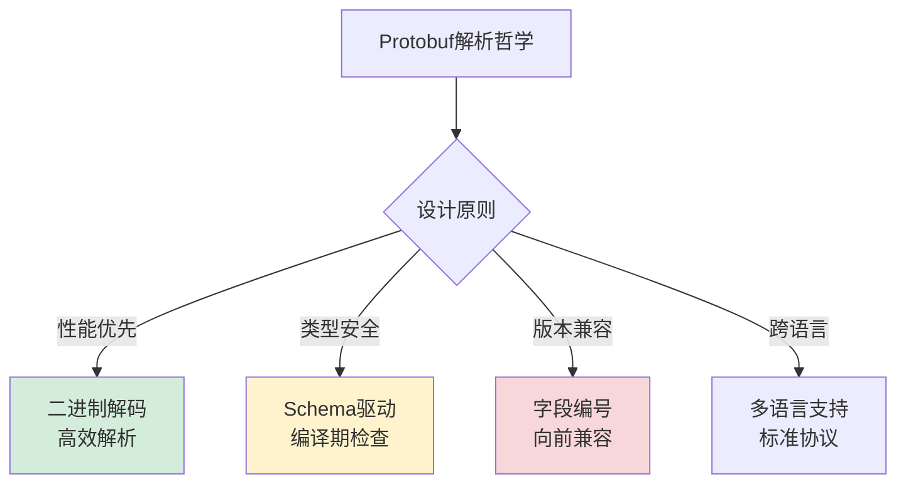
```mermaid
graph TB
    A[Protobuf解析哲学] --> B{设计原则}
    B -->|性能优先| C[二进制解码<br/>高效解析]
    B -->|类型安全| D[Schema驱动<br/>编译期检查]
    B -->|版本兼容| E[字段编号<br/>向前兼容]
    B -->|跨语言| F[多语言支持<br/>标准协议]
    
    style C fill:#d4edda
    style D fill:#fff3cd
    style E fill:#f8d7da
```

### 4.2 编码解析原理

**Protobuf编码解析案例**：某消息队列系统通过Protobuf编码优化解析效率。

```protobuf
// Protobuf编码解析原理
message Trade {
    // Varint编码解析：小整数更高效
    int32 trade_id = 1;      // Varint解码
    
    // 64位编码解析：固定长度
    double price = 2;         // 64位浮点数解码
    
    // 长度前缀解析：字符串/字节数组
    string symbol = 3;        // 长度前缀 + UTF-8解码
    
    // 嵌套消息解析
    repeated Fee fees = 4;    // 重复字段解码
    
    // 解析哲学：
    // 1. Varint解码：小整数优化
    // 2. 长度前缀：变长数据解析
    // 3. 字段编号：紧凑标识
}

message Fee {
    string type = 1;
    double amount = 2;
}
```

**Protobuf编码解析设计哲学**：

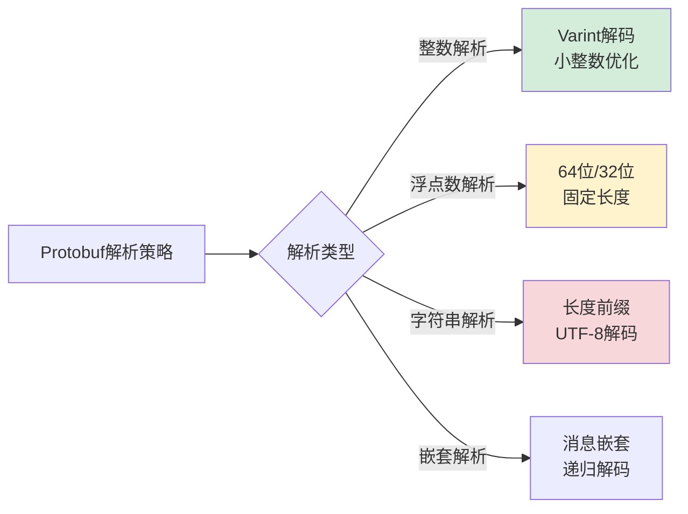
```mermaid
graph LR
    A[Protobuf解析策略] --> B{解析类型}
    B -->|整数解析| C[Varint解码<br/>小整数优化]
    B -->|浮点数解析| D[64位/32位<br/>固定长度]
    B -->|字符串解析| E[长度前缀<br/>UTF-8解码]
    B -->|嵌套解析| F[消息嵌套<br/>递归解码]
    
    style C fill:#d4edda
    style D fill:#fff3cd
    style E fill:#f8d7da
```

### 4.3 类型系统设计

**Protobuf类型系统案例**：某数据平台通过Protobuf类型系统保证解析一致性。

```protobuf
// Protobuf类型系统设计
message DataRecord {
    // 基本类型系统
    string id = 1;                    // 字符串类型解析
    int32 count = 2;                  // 32位整数解析
    int64 timestamp = 3;               // 64位整数解析
    double value = 4;                  // 双精度浮点解析
    bool is_valid = 5;                 // 布尔值解析
    bytes raw_data = 6;               // 字节数组解析
    
    // 复合类型系统
    repeated string tags = 7;          // 字符串数组解析
    map<string, int32> metrics = 8;    // 字典映射解析
    
    // 枚举类型系统
    enum Status {
        PENDING = 0;
        PROCESSING = 1;
        COMPLETED = 2;
        FAILED = 3;
    }
    Status status = 9;
    
    // 嵌套类型系统
    repeated DataPoint points = 10;    // 嵌套消息解析
}

message DataPoint {
    double x = 1;
    double y = 2;
}
```

**Protobuf类型系统设计哲学**：

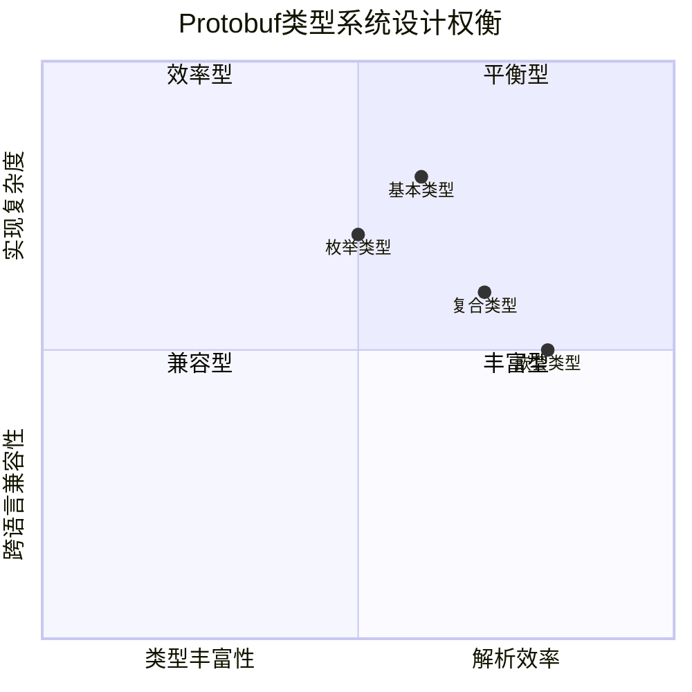
```mermaid
quadrantChart
    title Protobuf类型系统设计权衡
    x-axis "类型丰富性" --> "解析效率"
    y-axis "跨语言兼容性" --> "实现复杂度"
    quadrant-1 "平衡型"
    quadrant-2 "效率型"
    quadrant-3 "兼容型"
    quadrant-4 "丰富型"
    
    "基本类型": [0.6, 0.8]
    "复合类型": [0.7, 0.6]
    "枚举类型": [0.5, 0.7]
    "嵌套类型": [0.8, 0.5]
```

### 4.4 版本兼容机制

**Protobuf版本兼容案例**：某API服务通过Protobuf实现平滑升级。

```protobuf
// Protobuf版本兼容机制
message UserV1 {
    string id = 1;
    string name = 2;
    int32 age = 3;
    // V1版本字段
}

message UserV2 {
    string id = 1;           // 保留字段编号
    string name = 2;         // 保留字段编号
    int32 age = 3;          // 保留字段编号
    string email = 4;       // 新增字段
    string phone = 5;       // 新增字段
    
    // 版本兼容规则：
    // 1. 不删除字段：只标记为废弃
    // 2. 不重用字段编号：避免冲突
    // 3. 新增字段：使用新编号
}

// 向后兼容：V2解析器可以解析V1数据
// 向前兼容：V1解析器可以解析V2数据（忽略未知字段）
```

**Protobuf版本兼容设计哲学**：

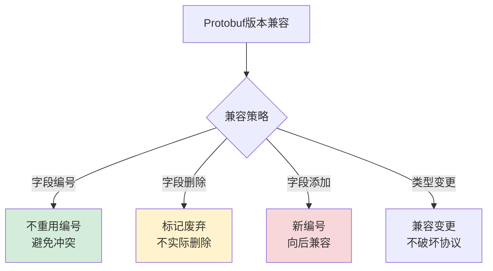
```mermaid
graph TB
    A[Protobuf版本兼容] --> B{兼容策略}
    B -->|字段编号| C[不重用编号<br/>避免冲突]
    B -->|字段删除| D[标记废弃<br/>不实际删除]
    B -->|字段添加| E[新编号<br/>向后兼容]
    B -->|类型变更| F[兼容变更<br/>不破坏协议]
    
    style C fill:#d4edda
    style D fill:#fff3cd
    style E fill:#f8d7da
```

## 5. XML解析机制

### 5.1 XML设计哲学

**XML的核心设计理念**：

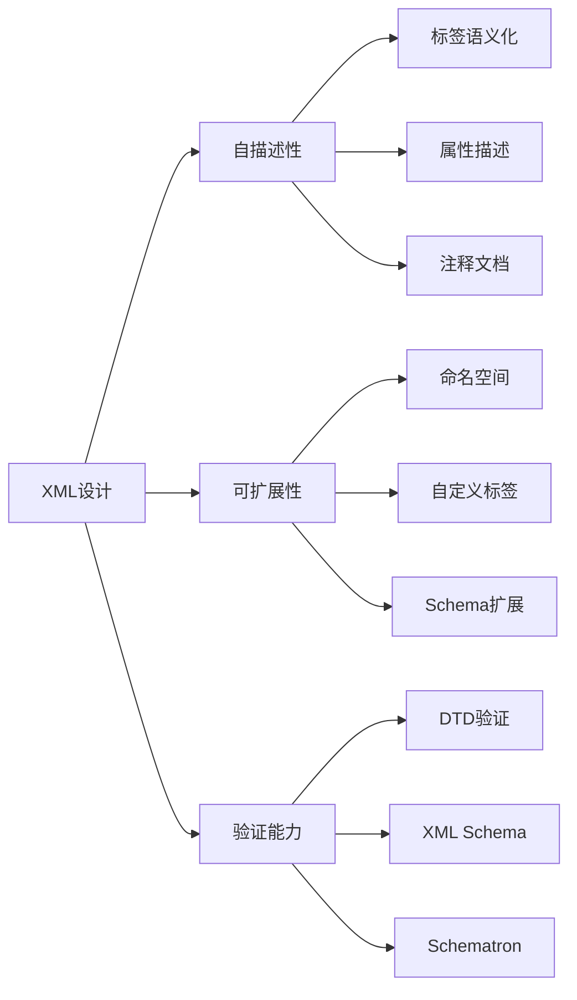
```mermaid
flowchart LR
    A[XML设计] --> B[自描述性]
    A --> C[可扩展性]
    A --> D[验证能力]
    
    B --> B1[标签语义化]
    B --> B2[属性描述]
    B --> B3[注释文档]
    
    C --> C1[命名空间]
    C --> C2[自定义标签]
    C --> C3[Schema扩展]
    
    D --> D1[DTD验证]
    D --> D2[XML Schema]
    D --> D3[Schematron]
```

### 5.2 解析模型对比

**XML的两种经典解析模型**：

```java
// DOM解析（树形结构）
public Order parseOrderDOM(String xml) throws Exception {
    DocumentBuilderFactory factory = DocumentBuilderFactory.newInstance();
    DocumentBuilder builder = factory.newDocumentBuilder();
    Document doc = builder.parse(new InputSource(new StringReader(xml)));
    
    Order order = new Order();
    order.setOrderId(doc.getElementsByTagName("orderId").item(0).getTextContent());
    order.setUserId(doc.getElementsByTagName("userId").item(0).getTextContent());
    
    // 更多字段解析...
    return order;
}

// SAX解析（事件驱动）
public class OrderSAXParser extends DefaultHandler {
    private Order order;
    private StringBuilder currentText;
    
    @Override
    public void startElement(String uri, String localName, String qName, Attributes attributes) {
        if ("order".equals(qName)) {
            order = new Order();
        }
        currentText = new StringBuilder();
    }
    
    @Override
    public void characters(char[] ch, int start, int length) {
        currentText.append(ch, start, length);
    }
    
    @Override
    public void endElement(String uri, String localName, String qName) {
        if ("orderId".equals(qName)) {
            order.setOrderId(currentText.toString());
        } else if ("userId".equals(qName)) {
            order.setUserId(currentText.toString());
        }
    }
}
```

**模型对比总结**：

| 特性 | DOM解析 | SAX解析 |
|------|---------|---------|
| **内存使用** | 高（完整树） | 低（流式） |
| **访问方式** | 随机访问 | 顺序访问 |
| **适用场景** | 小文档、复杂操作 | 大文档、简单处理 |
| **开发难度** | 简单 | 复杂 |

### 5.3 验证机制设计

**XML的强验证能力**：

```xml
<!-- DTD验证 -->
<!DOCTYPE order [
    <!ELEMENT order (orderId, userId, items+)>
    <!ELEMENT orderId (#PCDATA)>
    <!ELEMENT userId (#PCDATA)>
    <!ELEMENT items (item+)>
    <!ELEMENT item (productId, quantity, price)>
    <!ATTLIST item version CDATA #IMPLIED>
]>

<!-- XML Schema验证 -->
<xs:schema xmlns:xs="http://www.w3.org/2001/XMLSchema">
    <xs:element name="order">
        <xs:complexType>
            <xs:sequence>
                <xs:element name="orderId" type="xs:string"/>
                <xs:element name="userId" type="xs:string"/>
                <xs:element name="items" type="ItemList"/>
            </xs:sequence>
        </xs:complexType>
    </xs:element>
    
    <xs:complexType name="ItemList">
        <xs:sequence>
            <xs:element name="item" type="ItemType" maxOccurs="unbounded"/>
        </xs:sequence>
    </xs:complexType>
    
    <xs:complexType name="ItemType">
        <xs:sequence>
            <xs:element name="productId" type="xs:string"/>
            <xs:element name="quantity" type="xs:integer"/>
            <xs:element name="price" type="xs:decimal"/>
        </xs:sequence>
        <xs:attribute name="version" type="xs:string" use="optional"/>
    </xs:complexType>
</xs:schema>
```

**验证价值**：确保数据完整性和一致性。

### 5.4 扩展性设计

**XML的扩展机制**：

```xml
<!-- 命名空间支持扩展 -->
<order xmlns="http://example.com/orders"
       xmlns:pay="http://example.com/payment"
       xmlns:ship="http://example.com/shipping">
    <orderId>123</orderId>
    <userId>456</userId>
    
    <!-- 支付扩展 -->
    <pay:payment>
        <pay:method>creditcard</pay:method>
        <pay:amount>100.00</pay:amount>
    </pay:payment>
    
    <!-- 物流扩展 -->
    <ship:shipping>
        <ship:address>123 Main St</ship:address>
        <ship:method>express</ship:method>
    </ship:shipping>
</order>
```

**扩展性优势**：支持多领域集成，保持核心结构稳定。

## 6. 跨语言解析机制

### 6.1 Java解析机制

**Java解析设计哲学**：JVM生态的深度集成。

```java
// Java解析机制
class JavaParsingExample {
    // JSON解析：Jackson库
    public User parseJsonWithJackson(String json) throws IOException {
        ObjectMapper mapper = new ObjectMapper();
        return mapper.readValue(json, User.class);
    }
    
    // XML解析：JAXB
    public User parseXmlWithJaxb(String xml) throws JAXBException {
        JAXBContext context = JAXBContext.newInstance(User.class);
        Unmarshaller unmarshaller = context.createUnmarshaller();
        return (User) unmarshaller.unmarshal(new StringReader(xml));
    }
    
    // 设计哲学：
    // 1. 反射驱动：自动类型映射
    // 2. 注解配置：声明式解析
    // 3. 性能优化：字节码生成
}
```

**Java解析设计权衡**：

```mermaid
graph LR
    A[Java解析] --> B{设计特点}
    B -->|反射驱动| C[自动映射<br/>无需配置]
    B -->|注解配置| D[声明式解析<br/>代码简洁]
    B -->|性能优化| E[字节码生成<br/>零反射]
    B -->|生态丰富| F[多种库支持<br/>功能全面]
    
    style C fill:#d4edda
    style D fill:#fff3cd
    style E fill:#f8d7da
```

### 6.2 JavaScript解析机制

**JavaScript解析设计哲学**：Web生态的灵活设计。

```javascript
// JavaScript解析机制
class JsParsingExample {
    // JSON解析：原生支持
    parseJson(jsonStr) {
        return JSON.parse(jsonStr);
    }
    
    // XML解析：DOM解析器
    parseXml(xmlStr) {
        const parser = new DOMParser();
        return parser.parseFromString(xmlStr, "text/xml");
    }
    
    // 自定义解析：流式处理
    parseCustom(data, schema) {
        const parser = new CustomParser(schema);
        return parser.parse(data);
    }
    
    // 设计哲学：
    // 1. 原生支持：JSON.parse标准
    // 2. 灵活扩展：自定义解析器
    // 3. 异步处理：Promise支持
}
```

**JavaScript解析设计权衡**：

```mermaid
quadrantChart
    title JavaScript解析设计权衡
    x-axis "灵活性" --> "类型安全"
    y-axis "性能" --> "可读性"
    quadrant-1 "平衡型"
    quadrant-2 "安全型"
    quadrant-3 "性能型"
    quadrant-4 "灵活型"
    
    "JSON.parse": [0.9, 0.3]
    "自定义解析": [0.8, 0.5]
    "流式解析": [0.6, 0.7]
    "验证解析": [0.5, 0.9]
```

### 6.3 Go解析机制

**Go解析设计哲学**：简洁高效的静态类型设计。

```go
// Go解析机制
type Trade struct {
    TradeID   string    `json:"trade_id"`    // 标签：字段映射
    AccountID string    `json:"account_id"`
    Symbol    string    `json:"symbol"`
    Quantity  int       `json:"quantity"`
    Price     float64   `json:"price"`
    Timestamp time.Time `json:"timestamp"`
    
    // 设计哲学：
    // 1. 结构体标签：元数据驱动
    // 2. 标准库支持：encoding/json
    // 3. 性能优化：避免反射开销
}

// JSON解析
func ParseTrade(jsonData []byte) (*Trade, error) {
    var trade Trade
    err := json.Unmarshal(jsonData, &trade)
    return &trade, err
}

// 自定义解析
func ParseTradeCustom(data []byte) (*Trade, error) {
    var trade Trade
    
    // 手动解析逻辑
    // ...
    
    return &trade, nil
}
```

**Go解析设计权衡**：

```mermaid
graph TB
    A[Go解析] --> B{设计特点}
    B -->|结构体标签| C[元数据驱动<br/>字段映射]
    B -->|标准库| D[encoding/json<br/>官方支持]
    B -->|性能优化| E[避免反射<br/>高效解析]
    B -->|类型安全| F[静态类型<br/>编译期检查]
    
    style C fill:#d4edda
    style D fill:#fff3cd
    style E fill:#f8d7da
```

### 6.4 解析机制对比总结

**跨语言解析对比分析**：

```mermaid
gantt
    title 解析技术演进时间线
    dateFormat  YYYY
    axisFormat  %Y
    
    section 文本解析
    XML DOM        :1998, 10y
    JSON.parse     :2001, 23y
    YAML解析       :2004, 20y
    
    section 二进制解析
    Java序列化     :1996, 28y
    Protobuf解析   :2008, 16y
    MessagePack解析:2011, 13y
    Avro解析       :2012, 12y
    
    section 现代解析
    FlatBuffers解析:2015, 9y
    Cap'n Proto解析:2016, 8y
    Arrow解析      :2017, 7y
```

**解析技术选择指南**：

```mermaid
quadrantChart
    title 解析技术选择矩阵
    x-axis "性能需求" --> "可读性需求"
    y-axis "跨语言需求" --> "Schema需求"
    quadrant-1 "高性能型"
    quadrant-2 "跨语言型"
    quadrant-3 "可读型"
    quadrant-4 "Schema型"
    
    "Protobuf解析": [0.9, 0.8]
    "JSON解析": [0.3, 0.9]
    "Avro解析": [0.7, 0.7]
    "MessagePack解析": [0.8, 0.5]
    "XML解析": [0.2, 0.6]
    "Java序列化解析": [0.4, 0.3]
```

---

## 🎯 一句话总结

> **数据解析设计思想**的本质是在**字节流的线性世界**与**业务对象的层次世界**之间架设桥梁。优秀的解析器不仅要是高效的翻译官，更要是聪明的过滤器——只取所需，而非全盘接收。

## 🔗 延伸阅读

- ← [05.序列化数据的思想](./05.序列化数据的思想.md)：解析的逆过程——序列化
- → [07.类的加载核心原理](./07.类的加载核心原理.md)：另一种形式的"解析"——字节码到类对象
- → [08.对象创建流程原理](./08.对象创建流程原理.md)：解析后的对象如何创建
- → [09.对象和函数访问原理](./09.对象和函数访问原理.md)：解析完成的对象如何使用
