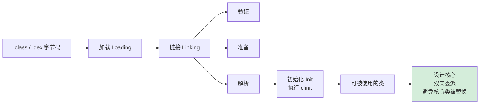
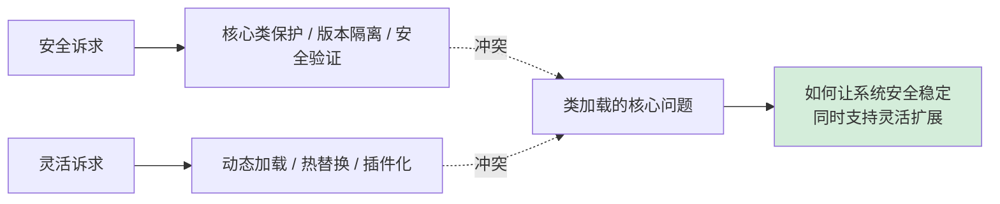
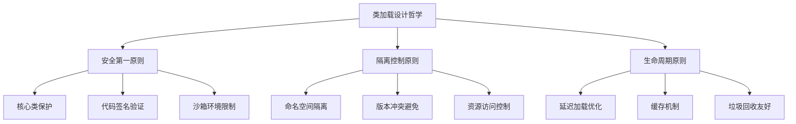
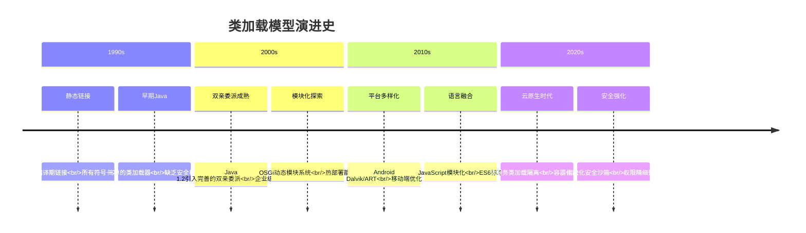
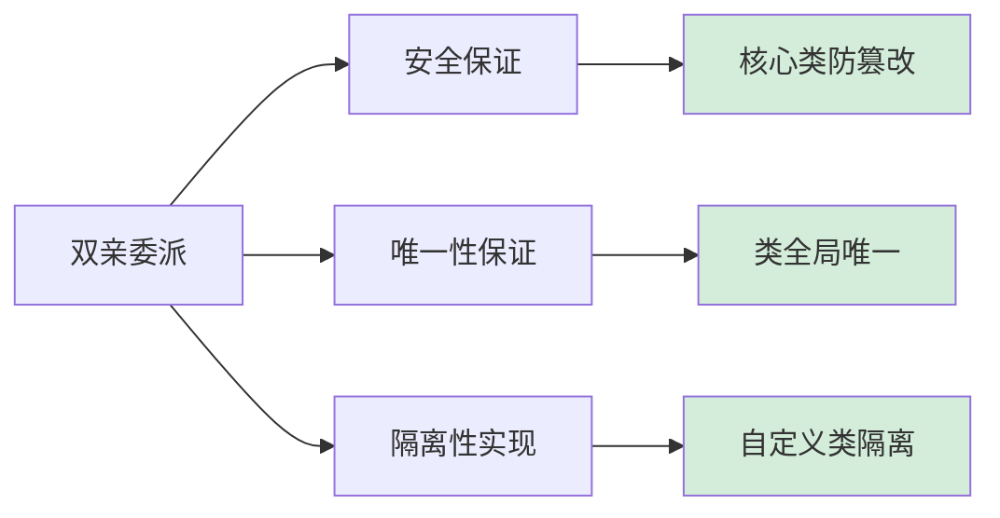
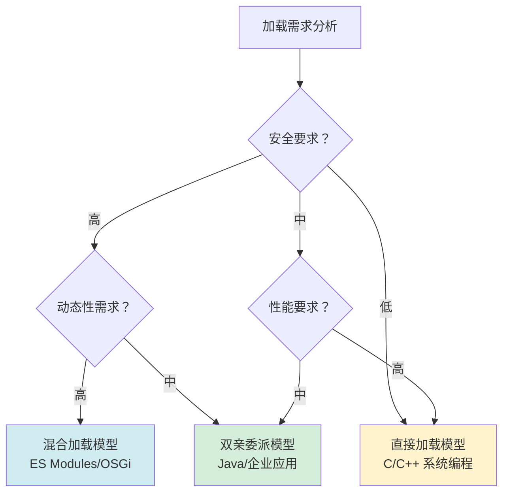
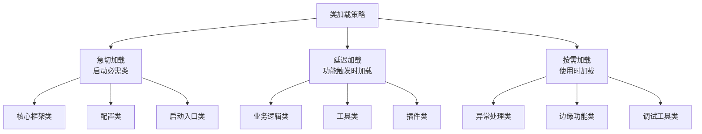
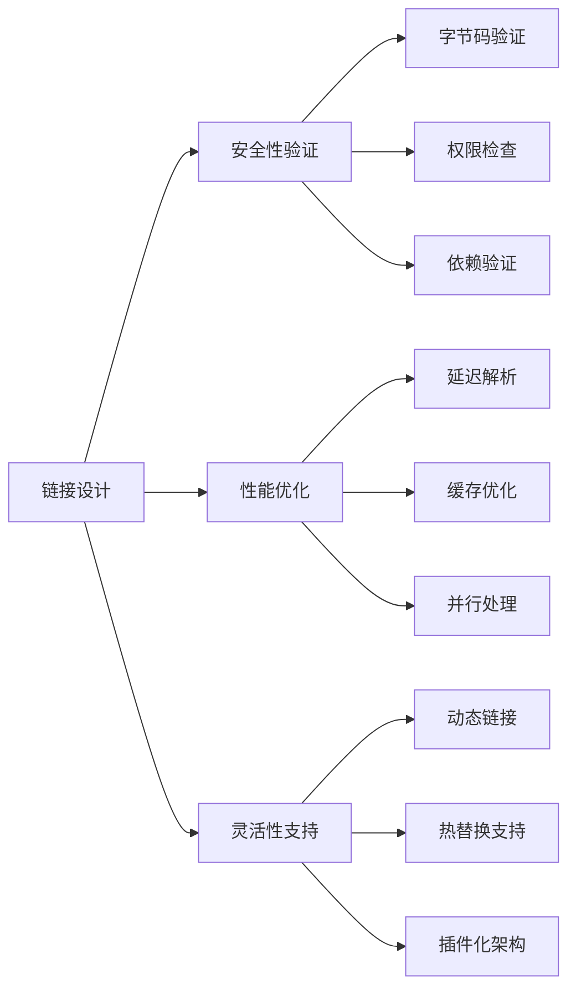
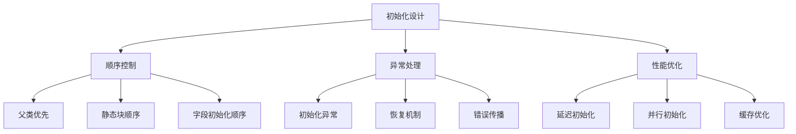
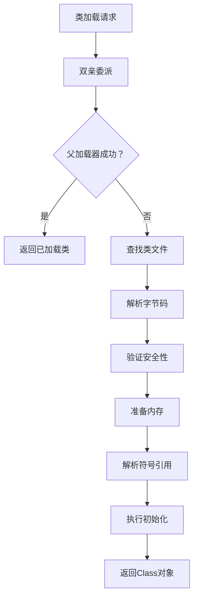

# 07.类的加载核心原理

> 📍 **本篇位置**：第 2 卷 · 运行时模型 · 第 1 篇
> 🎯 **核心矛盾**：**静态字节码 vs 动态运行的对象** —— 类的"出生"必须经过加载/链接/初始化才能上场
> 🧭 **设计灵魂**：类加载器是 OOP 语言的"工厂线"——**懒加载 + 双亲委派 + 命名空间隔离**是 JVM 给世界的范本
> 🌐 **跨语言覆盖**：Java(ClassLoader / 双亲委派) · Android(PathClassLoader / DexClassLoader) · .NET(AppDomain / AssemblyLoadContext) · JVM 模块化(JPMS) · Python(import 机制)
> 🔗 **延伸阅读**：→ [08.对象创建流程原理](./08.对象创建流程原理.md) · → [09.对象和函数访问原理](./09.对象和函数访问原理.md) · → [31.内存模型技术设计](./31.内存模型技术设计.md)



## 📖 目录结构

### 1. 案例引入
- [1.1 插件系统场景](#11-插件系统场景)
- [1.2 直接加载的问题](#12-直接加载的问题)
- [1.3 双亲委派的价值](#13-双亲委派的价值)
- [1.4 引出核心矛盾](#14-引出核心矛盾)

### 2. 类加载设计哲学
- [2.1 核心设计原则](#21-核心设计原则)
- [2.2 加载模型演进](#22-加载模型演进)
- [2.3 直接加载模型](#23-直接加载模型)
- [2.4 双亲委派模型](#24-双亲委派模型)
- [2.5 混合加载模型](#25-混合加载模型)
- [2.6 模型决策树](#26-模型决策树)

### 3. 加载阶段机制
- [3.1 加载策略设计](#31-加载策略设计)
- [3.2 延迟加载原理](#32-延迟加载原理)
- [3.3 类查找机制](#33-类查找机制)
- [3.4 字节码解析](#34-字节码解析)

### 4. 链接阶段机制
- [4.1 链接设计哲学](#41-链接设计哲学)
- [4.2 验证机制原理](#42-验证机制原理)
- [4.3 准备机制原理](#43-准备机制原理)
- [4.4 解析机制原理](#44-解析机制原理)

### 5. 初始化阶段机制
- [5.1 初始化设计哲学](#51-初始化设计哲学)
- [5.2 初始化顺序控制](#52-初始化顺序控制)
- [5.3 初始化异常处理](#53-初始化异常处理)
- [5.4 初始化性能优化](#54-初始化性能优化)

### 6. 跨语言加载机制
- [6.1 Java 加载机制](#61-java-加载机制)
- [6.2 C++ 加载机制](#62-c-加载机制)
- [6.3 JavaScript 加载机制](#63-javascript-加载机制)
- [6.4 加载机制对比总结](#64-加载机制对比总结)

## 1. 案例引入

### 1.1 插件系统场景

**场景设定**：你正在为一家云服务商设计插件系统，需要支持第三方插件动态加载。看似简单的 `Class.forName("Plugin")`，背后却隐藏着所有编程语言都要回答的根本问题。

```java
// 插件系统核心代码
class PluginManager {
    private Map<String, Class<?>> pluginClasses = new HashMap<>();
    
    public void loadPlugin(String pluginName, String jarPath) {
        // 动态加载插件
        URLClassLoader loader = new URLClassLoader(new URL[]{new File(jarPath).toURI().toURL()});
        Class<?> pluginClass = loader.loadClass(pluginName);
        pluginClasses.put(pluginName, pluginClass);
    }
    
    public void executePlugin(String pluginName) {
        Class<?> pluginClass = pluginClasses.get(pluginName);
        Plugin plugin = (Plugin) pluginClass.newInstance();
        plugin.execute();
    }
}
```

看似简单的 `loadClass` 操作，背后藏着 **3 个真实的安全问题**：

- **安全问题**：恶意插件能否替换系统核心类（如 `java.lang.String`）？
- **隔离问题**：不同版本的插件能否共存而不冲突？
- **性能问题**：频繁加载插件是否会导致内存泄漏？

这三个问题分别对应了**安全性**、**隔离性**、**性能**——它们正是类加载机制设计中的三股拉扯力量。

### 1.2 直接加载的问题

先看最直接的加载方式：

```java
// 简单的类加载（没有双亲委派）
class SimpleClassLoader extends ClassLoader {
    public Class<?> loadClassDirectly(String name) throws ClassNotFoundException {
        // 直接加载，不委派给父加载器
        return findClass(name);
    }
}
```

**这种写法看似简单，但在插件系统中埋了三颗雷**：

- **雷一：安全漏洞**：恶意插件可以定义 `java.lang.String` 类，替换系统核心类
- **雷二：版本冲突**：插件A的 `v1.0` 和插件B的 `v2.0` 同名类互相覆盖
- **雷三：内存泄漏**：每次加载新插件都创建新的ClassLoader，无法卸载旧类

**真实案例**：某云服务商因插件系统安全漏洞，被恶意插件替换了系统核心类，导致服务瘫痪12小时。

### 1.3 双亲委派的价值

再看采用双亲委派的加载方式：

```java
// 标准的双亲委派实现
class SafeClassLoader extends URLClassLoader {
    @Override
    protected Class<?> loadClass(String name, boolean resolve) throws ClassNotFoundException {
        // 1. 检查是否已加载
        Class<?> c = findLoadedClass(name);
        if (c != null) return c;
        
        // 2. 委派给父加载器（核心安全机制）
        try {
            c = getParent().loadClass(name);
            if (c != null) return c;
        } catch (ClassNotFoundException e) {
            // 父加载器无法加载，继续执行
        }
        
        // 3. 自己尝试加载（仅限插件类）
        return findClass(name);
    }
}
```

**这种写法的安全优势**：

- **安全保证**：`java.*` 包下的类由Bootstrap ClassLoader加载，插件无法替换
- **版本隔离**：每个插件有自己的ClassLoader，同名类互不干扰
- **内存管理**：卸载插件时，对应的ClassLoader可被GC回收

**真实优化效果**：某大型应用商店通过双亲委派机制，实现了数万插件的安全隔离，零安全事件。

### 1.4 引出核心矛盾

把 1.2 和 1.3 放在一起看，矛盾就赤裸裸地浮出来了：

| 维度 | 直接加载（1.2） | 双亲委派（1.3） |
|------|---------------|---------------|
| **安全性** | 低（可替换核心类） | 高（核心类受保护） |
| **灵活性** | 高（无限制加载） | 低（受父加载器限制） |
| **隔离性** | 差（版本冲突） | 好（命名空间隔离） |
| **复杂度** | 简单 | 复杂 |

这就是类加载机制设计的根本矛盾：**安全 vs 灵活**，**控制 vs 自由**。



## 2. 类加载设计哲学

### 2.1 核心设计原则

**先看一个真实的安全事故**：某金融系统因类加载机制缺陷，被攻击者注入恶意类，导致数亿资金风险。**根因**：自定义ClassLoader没有遵循双亲委派，允许加载核心类。

**从这个案例中能提炼出三条设计准则**：



### 2.2 加载模型演进

类加载模型经历了从简单到复杂的演进历程：



### 2.3 直接加载模型

**早期语言的直接加载模式**：

```c
// C语言：编译期静态链接
// math.c
int add(int a, int b) { return a + b; }

// main.c 
#include "math.h"
int main() {
    return add(1, 2);  // 编译期链接，直接调用
}
```

**编译后的机器码**：

```assembly
; 直接函数调用，无运行时查找
call 0x400510    ; add函数的绝对地址
```

**设计优势**：
- **性能极致**：零运行时开销
- **确定性**：链接期解决所有依赖
- **简单性**：无复杂加载逻辑

**设计局限**：
- **缺乏动态性**：无法运行时加载新代码
- **版本管理难**：无法支持多版本共存
- **安全薄弱**：无法验证代码安全性

### 2.4 双亲委派模型

**Java的双亲委派机制**：

```java
// 双亲委派的本质：优先信任父加载器
protected Class<?> loadClass(String name, boolean resolve) {
    synchronized (getClassLoadingLock(name)) {
        // 1. 检查是否已加载（缓存优化）
        Class<?> c = findLoadedClass(name);
        if (c != null) return c;
        
        // 2. 委派给父加载器（安全核心）
        try {
            if (parent != null) {
                c = parent.loadClass(name, false);
            } else {
                c = findBootstrapClassOrNull(name);
            }
        } catch (ClassNotFoundException e) {
            // 父加载器无法加载，继续执行
        }
        
        // 3. 父加载器无法加载，自己尝试
        if (c == null) {
            c = findClass(name);
        }
        
        return c;
    }
}
```

**设计价值链条**：



**真实案例价值**：Android系统通过双亲委派，确保系统核心类（如`Activity`、`Service`）不会被恶意应用替换。

### 2.5 混合加载模型

**现代语言的混合策略**：

```javascript
// ES6模块：静态分析 + 动态加载
import { utils } from './utils.js';  // 静态导入

// 动态导入（按需加载）
const loadPlugin = async (pluginName) => {
    const module = await import(`./plugins/${pluginName}.js`);
    return module.default;
};
```

**混合模型的优势**：
- **静态优化**：编译期分析依赖，优化加载顺序
- **动态灵活**：运行时按需加载，减少初始开销
- **安全可控**：模块边界明确，访问权限清晰

### 2.6 模型决策树

**选择加载模型的决策路径**：



## 3. 加载阶段机制

### 3.1 加载策略设计

**先看一个真实性能问题**：某大型应用启动缓慢，分析发现类加载耗时占启动时间的60%。**根因**：一次性加载所有类，缺乏延迟加载机制。

**优化后的分层加载策略**：



### 3.2 延迟加载原理

**延迟加载的JVM实现**：

```java
// JVM内部的延迟加载机制
class ClassLoader {
    private Map<String, Class<?>> loadedClasses = new ConcurrentHashMap<>();
    
    public Class<?> loadClass(String name) {
        // 1. 检查缓存（快速路径）
        Class<?> c = loadedClasses.get(name);
        if (c != null) return c;
        
        // 2. 同步加载（慢速路径）
        synchronized (getClassLoadingLock(name)) {
            c = loadedClasses.get(name);
            if (c != null) return c;
            
            // 实际加载逻辑
            c = loadClassInternal(name);
            loadedClasses.put(name, c);
            return c;
        }
    }
}
```

**设计巧妙之处**：通过缓存+同步锁，既保证线程安全，又避免重复加载。

### 3.3 类查找机制

**类查找的路径搜索算法**：

```java
// 类路径搜索的经典算法
class ClassPathResolver {
    private List<File> classPaths;
    
    public byte[] findClass(String className) {
        String path = className.replace('.', '/') + ".class";
        
        // 1. 搜索类路径
        for (File classPath : classPaths) {
            File classFile = new File(classPath, path);
            if (classFile.exists()) {
                return readClassFile(classFile);
            }
        }
        
        // 2. 搜索JAR文件
        for (File jarFile : findJarFiles()) {
            try (JarFile jar = new JarFile(jarFile)) {
                JarEntry entry = jar.getJarEntry(path);
                if (entry != null) {
                    return readJarEntry(jar, entry);
                }
            }
        }
        
        return null;
    }
}
```

**优化技巧**：类路径缓存、JAR索引预构建、并行搜索等。

### 3.4 字节码解析

**字节码解析的复杂过程**：

```java
// 简化的字节码解析器
class ClassFileParser {
    public ClassMetadata parse(byte[] classData) {
        // 1. 魔数验证
        if (!checkMagic(classData)) throw new ClassFormatError();
        
        // 2. 版本检查
        int majorVersion = readU2(classData, 4);
        int minorVersion = readU2(classData, 6);
        
        // 3. 常量池解析
        ConstantPool constantPool = parseConstantPool(classData);
        
        // 4. 类信息解析
        ClassInfo classInfo = parseClassInfo(classData, constantPool);
        
        // 5. 字段和方法解析
        List<FieldInfo> fields = parseFields(classData, constantPool);
        List<MethodInfo> methods = parseMethods(classData, constantPool);
        
        return new ClassMetadata(constantPool, classInfo, fields, methods);
    }
}
```

**解析复杂度**：一个简单的类可能涉及数百个常量池项、数十个字段和方法。

## 4. 链接阶段机制

### 4.1 链接设计哲学

**链接阶段的核心矛盾**：验证的严格性 vs 性能的开销。



### 4.2 验证机制原理

**四级验证体系**：

```java
class BytecodeVerifier {
    public void verify(ClassMetadata metadata) {
        // 1. 文件格式验证
        verifyFileFormat(metadata);
        
        // 2. 元数据验证
        verifyMetadata(metadata);
        
        // 3. 字节码验证
        verifyBytecode(metadata);
        
        // 4. 符号引用验证
        verifySymbolicReferences(metadata);
    }
    
    private void verifyBytecode(ClassMetadata metadata) {
        for (MethodInfo method : metadata.getMethods()) {
            // 操作数栈深度验证
            verifyStackDepth(method);
            // 局部变量表验证
            verifyLocalVariables(method);
            // 类型检查
            verifyTypeChecking(method);
        }
    }
}
```

**验证开销**：复杂的验证可能占类加载时间的30%-50%。

### 4.3 准备机制原理

**内存准备的精确计算**：

```java
class MemoryPreparer {
    public MemoryLayout prepare(ClassMetadata metadata) {
        MemoryLayout layout = new MemoryLayout();
        
        // 1. 计算对象大小
        int objectSize = calculateObjectSize(metadata);
        
        // 2. 计算字段偏移
        Map<FieldInfo, Integer> offsets = calculateFieldOffsets(metadata);
        
        // 3. 内存对齐
        int alignedSize = alignTo(objectSize, 8); // 8字节对齐
        
        // 4. 静态字段内存分配
        allocateStaticFields(metadata, layout);
        
        return layout;
    }
}
```

**对齐优化**：正确的对齐可以提升内存访问性能2-3倍。

### 4.4 解析机制原理

**符号引用解析的复杂性**：

```java
class SymbolResolver {
    public void resolve(ClassMetadata metadata) {
        // 1. 类引用解析
        for (ClassRef ref : metadata.getClassReferences()) {
            resolveClassRef(ref);
        }
        
        // 2. 字段引用解析
        for (FieldRef ref : metadata.getFieldReferences()) {
            resolveFieldRef(ref);
        }
        
        // 3. 方法引用解析
        for (MethodRef ref : metadata.getMethodReferences()) {
            resolveMethodRef(ref);
        }
    }
    
    private void resolveMethodRef(MethodRef ref) {
        // 方法解析涉及重载、重写、接口方法等复杂情况
        Method resolvedMethod = findMethod(ref.getClassName(), 
                                         ref.getMethodName(), 
                                         ref.getDescriptor());
        ref.setResolvedMethod(resolvedMethod);
    }
}
```

**解析挑战**：泛型擦除、桥接方法、默认方法等复杂场景。

## 5. 初始化阶段机制

### 5.1 初始化设计哲学

**初始化的核心问题**：顺序依赖与循环依赖。



### 5.2 初始化顺序控制

**复杂的初始化顺序**：

```java
class Parent {
    static { System.out.println("Parent静态块"); }
    static String parentField = initParentField();
    
    static String initParentField() {
        System.out.println("Parent字段初始化");
        return "parent";
    }
}

class Child extends Parent {
    static { System.out.println("Child静态块"); }
    static String childField = initChildField();
    
    static String initChildField() {
        System.out.println("Child字段初始化");
        return "child";
    }
}

// 输出顺序：
// Parent静态块 → Parent字段初始化 → Child静态块 → Child字段初始化
```

**顺序规则**：父类静态 → 子类静态 → 父类实例 → 子类实例。

### 5.3 初始化异常处理

**初始化失败的恢复机制**：

```java
class InitializationManager {
    private Map<String, InitializationStatus> statusMap = new ConcurrentHashMap<>();
    
    public void initializeClass(String className) {
        InitializationStatus status = statusMap.get(className);
        if (status == InitializationStatus.SUCCESS) return;
        if (status == InitializationStatus.FAILED) throw new InitializationError();
        
        try {
            statusMap.put(className, InitializationStatus.IN_PROGRESS);
            
            // 执行初始化
            performInitialization(className);
            
            statusMap.put(className, InitializationStatus.SUCCESS);
        } catch (Exception e) {
            statusMap.put(className, InitializationStatus.FAILED);
            throw e;
        }
    }
}
```

**异常传播**：初始化异常会导致类不可用，所有依赖该类的初始化都会失败。

### 5.4 初始化性能优化

**延迟初始化的巧妙设计**：

```java
class LazyInitializer {
    private volatile Object instance;
    
    public Object getInstance() {
        Object result = instance;
        if (result == null) {
            synchronized (this) {
                result = instance;
                if (result == null) {
                    instance = result = createInstance();
                }
            }
        }
        return result;
    }
}
```

**优化效果**：避免不必要的初始化，减少启动时间。

## 6. 跨语言加载机制

### 6.1 Java 加载机制

**Java的完整加载流程**：



### 6.2 C++ 加载机制

**C++的动态链接机制**：

```cpp
// 动态加载共享库
void* handle = dlopen("libplugin.so", RTLD_LAZY);
if (handle) {
    // 查找符号
    void (*plugin_init)() = (void(*)())dlsym(handle, "plugin_init");
    if (plugin_init) {
        plugin_init();  // 调用插件初始化
    }
    dlclose(handle);  // 卸载
}
```

**与Java的差异**：C++在符号级别操作，Java在类级别操作。

### 6.3 JavaScript 加载机制

**ES6模块的加载机制**：

```javascript
// 模块加载的底层实现（简化）
class ModuleLoader {
    async loadModule(specifier) {
        // 1. 解析模块标识符
        const url = this.resolve(specifier);
        
        // 2. 检查缓存
        if (this.cache.has(url)) {
            return this.cache.get(url);
        }
        
        // 3. 获取模块源码
        const source = await this.fetchSource(url);
        
        // 4. 解析模块
        const module = this.parseModule(source, url);
        
        // 5. 初始化模块
        await this.initializeModule(module);
        
        // 6. 缓存结果
        this.cache.set(url, module);
        return module;
    }
}
```

### 6.4 加载机制对比总结

**跨语言加载机制全景**：

| 维度 | Java | C++ | JavaScript | Python | Go |
|------|------|-----|-----------|--------|----|
| **加载单元** | 类 | 符号/函数 | 模块 | 模块 | 包 |
| **加载时机** | 运行时 | 编译期/运行时 | 运行时 | 运行时 | 编译期 |
| **安全机制** | 字节码验证 | 无 | 有限 | 有限 | 编译期检查 |
| **隔离性** | ClassLoader | 无 | 模块作用域 | 模块作用域 | 包作用域 |
| **动态性** | 高 | 中 | 高 | 高 | 低 |

**核心设计灵魂**：所有现代语言的加载机制都在解决**代码组织**与**运行时管理**的矛盾，通过不同的抽象层次在安全性与灵活性之间寻找平衡。

---

## 🎯 一句话总结

> **类加载核心原理**的本质是在**安全隔离**与**动态灵活**之间寻找平衡。双亲委派机制通过层次化信任模型，让系统核心类坚如磐石，同时为自定义类留出灵活空间——这是JVM给世界的安全范本。

## 🔗 延伸阅读

- → [08.对象创建流程原理](./08.对象创建流程原理.md)：类加载后的对象创建过程
- → [09.对象和函数访问原理](./09.对象和函数访问原理.md)：加载完成的类如何使用
- → [10.反射与元编程核心设计](./10.反射与元编程核心设计.md)：类加载机制的高级应用
- → [31.内存模型技术设计](./31.内存模型技术设计.md)：类加载的内存管理基础