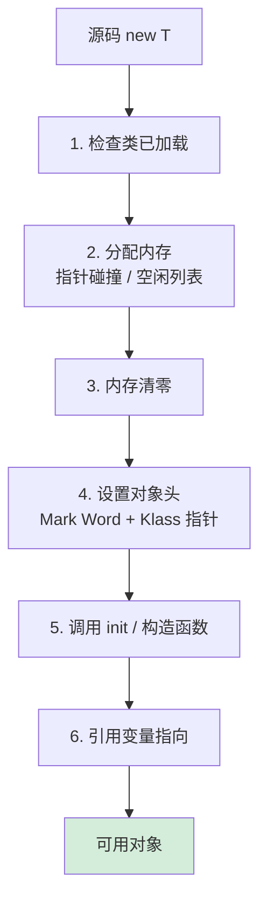

# 08.对象创建流程原理

> 📍 **本篇位置**：第 2 卷 · 运行时模型 · 第 2 篇
> 🎯 **核心矛盾**：**一个 `new` 的轻巧 vs 背后 7 步重活** —— 分配空间 / 初始化字段 / 设置头 / 调用构造 / 注册引用 缺一不可
> 🧭 **设计灵魂**：对象创建本质是"**类元数据 → 内存布局 → 可达图节点**"三段式；TLAB / 内存对齐 / 偏向锁标记 全发生在这里
> 🌐 **跨语言覆盖**：Java(new + TLAB + 对象头 Mark Word) · C++(new = 分配 + 构造 + 异常安全) · Swift(类对象引用计数初始化) · Go(make/new 二分) · Python(__new__ + __init__)
> 🔗 **延伸阅读**：← [07.类的加载核心原理](./07.类的加载核心原理.md) · → [09.对象和函数访问原理](./09.对象和函数访问原理.md) · → [10.反射与元编程核心设计](./10.反射与元编程核心设计.md)



---

#### 目录介绍
- [01.对象创建案例](#01对象创建案例)
  - [1.1 来看一个案例](#11-来看一个案例)
  - [1.2 案例分析](#12-案例分析)
  - [1.3 案例思考一下](#13-案例思考一下)
  - [1.4 对象创建优化](#14-对象创建优化)
- [02.类加载检查](#02类加载检查)
  - [2.1 理解类加载](#21-理解类加载)
- [03.内存分配](#03内存分配)
  - [3.1 内存分配案例](#31-内存分配案例)
- [04.初始化零值](#04初始化零值)
  - [4.1 理解零值](#41-理解零值)
- [05.设置对象头](#05设置对象头)
  - [5.1 理解设置对象头](#51-理解设置对象头)
  - [5.2 对象布局](#52-对象布局)
  - [5.3 对象头](#53-对象头)
  - [5.4 实例数据](#54-实例数据)
  - [5.5 对齐填充](#55-对齐填充)
  - [5.6 查看对象布局](#56-查看对象布局)
- [06.执行<init>方法](#06执行init方法)
  - [6.1 理解<init>](#61-理解init)
- [07.返回对象引用](#07返回对象引用)


## 01.对象创建案例

### 1.1 来看一个案例

我们定义两个类：`Person` 和 `Student`，其中 `Student` 继承自 `Person`。通过 `Student` 类的对象创建过程，展示 Java 对象创建的详细步骤。

```java
// 父类
class Person {
    String name;
    int age;

    // 父类构造方法
    Person(String name, int age) {
        this.name = name;
        this.age = age;
        System.out.println("Person 构造方法被调用");
    }

    void display() {
        System.out.println("Name: " + name + ", Age: " + age);
    }
}

// 子类
class Student extends Person {
    int studentId;

    // 子类构造方法
    Student(String name, int age, int studentId) {
        super(name, age); // 调用父类构造方法
        this.studentId = studentId;
        System.out.println("Student 构造方法被调用");
    }

    void display() {
        super.display(); // 调用父类方法
        System.out.println("Student ID: " + studentId);
    }
}

// 测试类
public class Main {
    public static void main(String[] args) {
        // 创建 Student 对象
        Student student = new Student("Alice", 20, 12345);
        student.display();
    }
}
```

**程序输出**

```
Person 构造方法被调用
Student 构造方法被调用
Name: Alice, Age: 20
Student ID: 12345
```

### 1.2 案例分析

1. **类加载检查**：
  - JVM 遇到 `new Student("Alice", 20, 12345)` 时，首先检查 `Student` 类是否已加载。
  - 如果 `Student` 类未被加载，JVM 会触发类加载过程（加载、验证、准备、解析、初始化）。
  - 由于 `Student` 继承自 `Person`，JVM 也会检查并加载 `Person` 类（如果未加载）。

2. **内存分配**：
  - JVM 在堆内存中为 `Student` 对象分配空间。
  - 分配的空间包括：
    - 对象头（Mark Word 和 Klass Pointer）。
    - 父类 `Person` 的实例变量（`name` 和 `age`）。
    - 子类 `Student` 的实例变量（`studentId`）。

3. **初始化零值**：
  - JVM 将对象的字段初始化为默认值：
    - `name` 初始化为 `null`。
    - `age` 初始化为 `0`。
    - `studentId` 初始化为 `0`。

4. **设置对象头**：
  - JVM 设置 `Student` 对象的对象头，包括：
    - **Mark Word**：存储对象的运行时数据（如哈希码、锁状态等）。
    - **Klass Pointer**：指向 `Student` 类的元数据。

5. **执行构造方法**：
  - JVM 调用 `Student` 类的构造方法：
    - 首先调用父类 `Person` 的构造方法（通过 `super(name, age)`），初始化 `name` 和 `age`，并输出 `Person 构造方法被调用`。
    - 然后初始化 `studentId`，并输出 `Student 构造方法被调用`。

6. **返回对象引用**：
  - 对象创建完成后，JVM 将 `Student` 对象的引用返回给 `student` 变量。

7. **调用对象方法**：
  - 通过 `student.display()` 调用 `Student` 类的 `display` 方法：
    - 首先调用父类 `Person` 的 `display` 方法，输出 `Name: Alice, Age: 20`。
    - 然后输出 `Student ID: 12345`。


### 1.3 案例思考一下

1. **类加载**：在对象创建之前，JVM 需要确保 `Student` 类和 `Person` 类都已加载。类加载过程包括加载、验证、准备、解析和初始化。
2. **内存分配**：JVM 在堆内存中为 `Student` 对象分配空间。分配的大小取决于对象的字段和对齐填充。
3. **初始化零值**：在调用构造方法之前，JVM 会将对象的字段初始化为默认值，确保对象的状态是确定的。
4. **构造方法调用**：构造方法用于初始化对象的字段。子类的构造方法会先调用父类的构造方法，确保父类的字段被正确初始化。
5. **对象引用**：对象创建完成后，JVM 将对象的引用返回给调用者。调用者可以通过引用访问对象的字段和方法。

### 1.4 对象创建优化

1. **对象池**：对于频繁创建和销毁的对象，可以使用对象池（如 `ThreadLocal` 或第三方库）来减少内存分配和垃圾回收的开销。
2. **减少对象创建**：尽量避免在循环或高频调用的方法中创建对象。
3. **使用基本类型**：在性能敏感的场景中，尽量使用基本类型（如 `int`、`long`）而不是包装类型（如 `Integer`、`Long`）。
4. **内存对齐**：通过合理设计类的字段顺序，可以减少内存对齐带来的填充字节，从而节省内存。

## 02.类加载检查

### 2.1 理解类加载

当 JVM 遇到 `new` 关键字时，首先检查对应的类是否已经加载。

如果类未被加载，JVM 会触发类加载过程（加载、验证、准备、解析、初始化）。

## 03.内存分配

### 3.1 内存分配案例

JVM 在堆内存中为对象分配空间。内存分配的方式取决于 JVM 的实现和垃圾回收器的策略，常见的方式包括：

- **指针碰撞（Bump the Pointer）**：适用于内存规整的情况，通过移动指针分配内存。
- **空闲列表（Free List）**：适用于内存不规整的情况，从空闲列表中查找合适的内存块。

## 04.初始化零值

### 4.1 理解零值

**初始化零值**：JVM 将对象的内存空间初始化为零值（如 `0`、`null` 等）。这一步确保对象的字段在没有显式赋值时具有默认值。

**初始化零值**：
- 初始化零值是为了确保对象的字段在没有显式赋值时具有默认值。
- 例如，`int` 类型的字段默认值为 `0`，引用类型的字段默认值为 `null`。


## 05.设置对象头

### 5.1 理解设置对象头

对象头包含对象的运行时数据和类元数据。在 64 位 JVM 中，对象头通常占用 12 字节（Mark Word 8 字节 + Klass Pointer 4 字节）。

**设置对象头**：JVM 设置对象的对象头（Object Header），包括：

- **Mark Word**：存储对象的运行时数据（如哈希码、锁状态等）。
- **Klass Pointer**：指向对象的类元数据（`Klass` 对象）。

### 5.2 对象布局

1. **对象头（Object Header）**： 对象头是每个 Java 对象的元数据部分，包含以下信息：
   - **Mark Word**：存储对象的运行时数据，如哈希码、锁状态（偏向锁、轻量级锁、重量级锁）、GC 分代年龄等。
   - **Klass Pointer**：指向对象的类元数据（`Klass` 对象），用于确定对象的类型。
   - **数组长度（可选）**：如果对象是数组，对象头还会包含数组的长度。
2. **实例数据（Instance Data）**：
    - 实例数据是对象的实际字段值，包括：父类继承的字段。当前类定义的字段。
    - 字段的存储顺序受 JVM 实现和字段类型的影响，通常按照以下规则排列：
        - 基本类型（如 `int`、`long`）优先存储。
        - 引用类型（如对象引用）次之。
        - 字段的排列顺序可能会受到对齐填充的影响。
3. **对齐填充（Padding）**：
    - 对齐填充是为了满足内存对齐要求而添加的额外字节。
    - JVM 通常要求对象的大小是 8 字节的倍数，因此会在对象末尾添加填充字节。

### 5.3 对象头

**Mark Word**

Mark Word 是对象头的一部分，用于存储对象的运行时数据。它的内容会根据对象的状态动态变化，例如：

- **无锁状态**：存储对象的哈希码、GC 分代年龄等。
- **偏向锁状态**：存储偏向线程 ID、偏向时间戳等。
- **轻量级锁状态**：存储指向栈中锁记录的指针。
- **重量级锁状态**：存储指向监视器（Monitor）的指针。
- **GC 标记状态**：存储 GC 相关的标记信息。

**Klass Pointer**

- Klass Pointer 指向对象的类元数据（`Klass` 对象），用于确定对象的类型。
- 在 64 位 JVM 中，Klass Pointer 通常是 64 位，但可以通过压缩指针（Compressed Oops）优化为 32 位。

**数组长度**

- 如果对象是数组，对象头会额外包含一个 32 位的字段，用于存储数组的长度。

### 5.4 实例数据

实例数据是对象的实际字段值，存储顺序受以下因素影响：

1. **字段类型**： 基本类型（如 `int`、`long`）优先存储。引用类型（如对象引用）次之。
2. **字段顺序**： 父类字段优先存储，子类字段次之。 字段的声明顺序也会影响存储顺序。
3. **对齐填充**：字段之间可能会添加填充字节以满足对齐要求。

### 5.5 对齐填充

对齐填充是为了满足内存对齐要求而添加的额外字节。JVM 通常要求对象的大小是 8 字节的倍数，因此会在对象末尾添加填充字节。对齐填充的目的是提高内存访问效率。

**Java 对象布局示例**：以下是一个简单的 Java 类及其对象布局的示例：

```java
class MyClass {
    int a;
    long b;
    Object c;
}
```

在 64 位 JVM 中，假设使用压缩指针（Compressed Oops），对象布局可能如下：

| 部分          | 大小（字节） | 说明                          |
|---------------|--------------|-------------------------------|
| Mark Word     | 8            | 对象的运行时数据               |
| Klass Pointer | 4            | 指向类元数据的指针（压缩指针） |
| `int a`       | 4            | 实例字段 `a`                   |
| `long b`      | 8            | 实例字段 `b`                   |
| `Object c`    | 4            | 实例字段 `c`（压缩指针）       |
| 对齐填充      | 4            | 填充字节，使对象大小为 8 的倍数 |

对象总大小为 32 字节。

### 5.6 查看对象布局

**如何查看 Java 对象布局**。可以使用以下工具查看 Java 对象布局：

1. **JOL（Java Object Layout）**：JOL 是一个开源工具，用于分析 Java 对象的内存布局。 示例代码：

```java
import org.openjdk.jol.info.ClassLayout;

public class Main {
    public static void main(String[] args) {
        MyClass obj = new MyClass();
        System.out.println(ClassLayout.parseInstance(obj).toPrintable());
    }
}
```

输出示例：

```bash
MyClass object internals:
OFFSET  SIZE   TYPE DESCRIPTION
     0    12        (object header)
    12     4    int MyClass.a
    16     8   long MyClass.b
    24     4   Object MyClass.c
    28     4        (loss due to the next object alignment)
Instance size: 32 bytes
```

2. **JVM 参数**：使用 JVM 参数 `-XX:+PrintFieldLayout` 可以打印对象的字段布局（仅适用于某些 JVM 实现）。

Java 对象布局包括对象头、实例数据和对齐填充三部分：

1. **对象头**：存储对象的运行时数据和类元数据。
2. **实例数据**：存储对象的字段值。
3. **对齐填充**：满足内存对齐要求。

## 06.执行<init>方法

### 6.1 理解<init>

**执行 `<init>` 方法**：JVM 调用对象的构造方法（`<init>` 方法），包括：

- 父类的构造方法（通过 `super()` 调用）。
- 当前类的实例变量初始化代码。
- 当前类的构造方法体。

## 07.返回对象引用

对象创建完成后，JVM 将对象的堆内存地址赋给栈上的引用变量。此时对象才"真正可用"。

值得注意的是，`new`操作并非原子操作，它包含三个步骤：①分配内存 → ②初始化对象 → ③将引用指向内存地址。在多线程环境下，由于指令重排序，步骤②和③可能被交换，这是双重检查锁定（DCL）单例模式需要`volatile`关键字的根本原因。

## 08.跨语言对象创建对比

不同语言的对象创建机制反映了各自的设计哲学：

| 阶段 | Java | C++ | Python | JavaScript | Go |
|------|------|-----|--------|-----------|-----|
| **内存分配** | 堆上分配（GC管理） | 栈或堆（程序员决定） | 堆上分配（GC管理） | 堆上分配（GC管理） | 逃逸分析决定栈/堆 |
| **初始化** | 零值→构造器 | 构造函数 | `__init__` | 构造函数/字面量 | 零值→可选初始化 |
| **继承初始化** | 必须调用super() | 初始化列表 | 显式调用super() | 显式调用super() | 组合代替继承 |
| **内存回收** | GC自动回收 | 析构函数/RAII | GC自动回收 | GC自动回收 | GC自动回收 |

**C++的独特之处**：C++是唯一允许在栈上创建对象的主流OOP语言。栈上对象随作用域结束自动析构（RAII模式），避免了GC的不确定性。通过`new`在堆上创建时，需要手动`delete`或使用智能指针(`unique_ptr`/`shared_ptr`)管理生命周期。

**Go的设计简化**：Go没有构造函数，对象创建就是简单的内存分配+零值初始化。通过编译器的逃逸分析(escape analysis)自动决定对象分配在栈还是堆上，既保证了安全性，又优化了性能。


## 09.对象创建性能优化

### 9.1 减少对象创建

频繁创建对象会给GC带来压力，常见的优化手段：

**对象池（Object Pool）**

对于创建开销大、生命周期短的对象，使用对象池可以显著提升性能：

```java
// Android中的Message对象池
Message msg = Message.obtain(); // 从池中获取，而非new
// 使用完后
msg.recycle(); // 归还到池中
```

适用场景：数据库连接池、线程池、网络连接池、Android中的Handler Message等。

**享元模式（Flyweight）**

将对象的内在状态和外在状态分离，共享内在状态不变的对象：

```java
// Integer缓存池（-128~127）
Integer a = Integer.valueOf(100); // 从缓存获取
Integer b = Integer.valueOf(100); // 同一个对象
System.out.println(a == b); // true

// 超出缓存范围
Integer c = Integer.valueOf(200);
Integer d = Integer.valueOf(200);
System.out.println(c == d); // false
```

**延迟初始化（Lazy Initialization）**

只在真正需要时才创建对象：

```java
class HeavyResource {
    private ExpensiveObject resource;
    
    public ExpensiveObject getResource() {
        if (resource == null) {
            resource = new ExpensiveObject(); // 延迟创建
        }
        return resource;
    }
}
```

### 9.2 内存分配优化

**栈上分配（逃逸分析）**

JVM通过逃逸分析（Escape Analysis）判断对象是否会逃逸出方法作用域。如果不会逃逸，可以在栈上分配，随方法返回自动释放，无需GC：

```java
public void process() {
    // point不会逃逸出方法
    Point point = new Point(1, 2);
    int distance = point.distance();
    // point在方法返回后自动释放
}
```

**TLAB（Thread Local Allocation Buffer）**

JVM为每个线程分配独立的内存缓冲区（TLAB），线程在自己的TLAB中分配对象时无需加锁，提升了多线程下的内存分配性能。

TLAB的工作原理：
1. 每个线程获得一块Eden区的小区域
2. 对象分配直接在TLAB中进行（指针碰撞），无锁
3. TLAB用完后，申请新的TLAB
4. 大对象直接在共享区域分配

### 9.3 对象布局优化

**内存对齐的影响**

Java对象的字段按照对齐规则排列，可能产生内存空洞（padding）。了解这一点有助于优化内存使用：

```java
// 不好的布局（假设64位系统）
class BadLayout {
    boolean a; // 1字节 + 7字节padding
    long b;    // 8字节
    boolean c; // 1字节 + 7字节padding
    long d;    // 8字节
    // 总计32字节
}

// 好的布局
class GoodLayout {
    long b;    // 8字节
    long d;    // 8字节
    boolean a; // 1字节
    boolean c; // 1字节 + 6字节padding
    // 总计24字节，节省了25%
}
```

**压缩指针（CompressedOops）**

64位JVM默认开启压缩指针，将8字节的对象引用压缩为4字节（堆内存<32GB时）。这不仅减少了内存占用，还能提升CPU缓存命中率。

### 9.4 各语言对象创建对比

**Rust的零成本抽象**

```rust
// Rust编译时确定类型和大小，零运行时开销
struct Point { x: f64, y: f64 }

let p = Point { x: 1.0, y: 2.0 }; // 栈上分配
let p_box = Box::new(Point { x: 1.0, y: 2.0 }); // 堆上分配
```

Rust没有运行时类型信息（RTTI），没有虚表（除非使用trait对象），对象创建几乎是零开销的内存写入。

**Kotlin的简化**

```kotlin
// Kotlin的data class自动生成equals、hashCode、toString、copy
data class User(val name: String, val age: Int)

val user = User("Alice", 30)
val copy = user.copy(age = 31) // 修改部分字段创建新对象
```

## 10.对象创建设计总结

### 10.1 核心要点

1. **对象创建不是免费的**：每次new都涉及内存分配、零值初始化、构造函数调用等步骤
2. **理解内存布局**：对象头、实例数据、对齐填充决定了对象的实际内存大小
3. **优化策略**：对象池、享元模式、延迟初始化、逃逸分析等手段可以显著减少创建开销
4. **跨语言思考**：不同语言的对象创建机制反映了不同的设计权衡

### 10.2 面试高频问题

**Q: new对象的过程是原子的吗？**

不是。new操作包含三步：①分配内存 ②初始化对象 ③引用赋值。由于指令重排，多线程下可能出现引用指向未初始化对象的问题，这是DCL单例需要volatile的原因。

**Q: 对象一定在堆上分配吗？**

不一定。JVM通过逃逸分析，可以将不逃逸的对象在栈上分配，甚至直接拆解为标量（标量替换）。

**Q: Java对象至少占多少字节？**

在64位JVM（开启压缩指针）中，对象头占12字节（8字节Mark Word + 4字节类指针），加上8字节对齐，最小对象占16字节。


