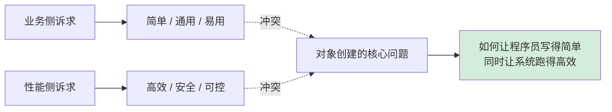
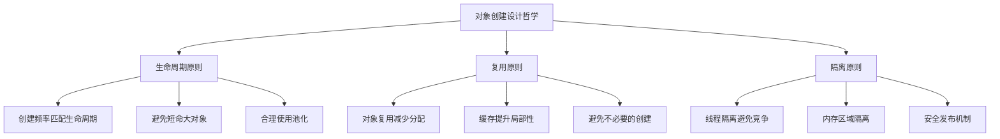
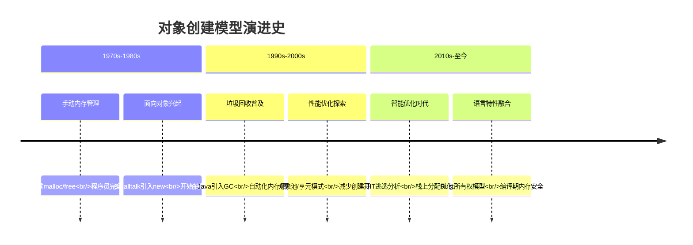
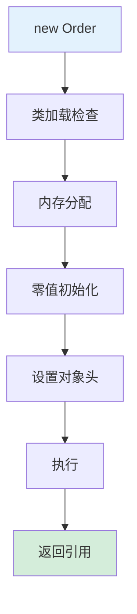
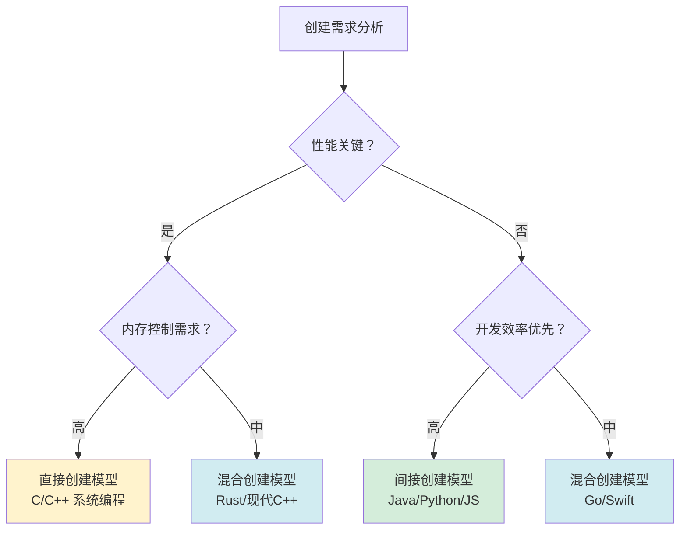
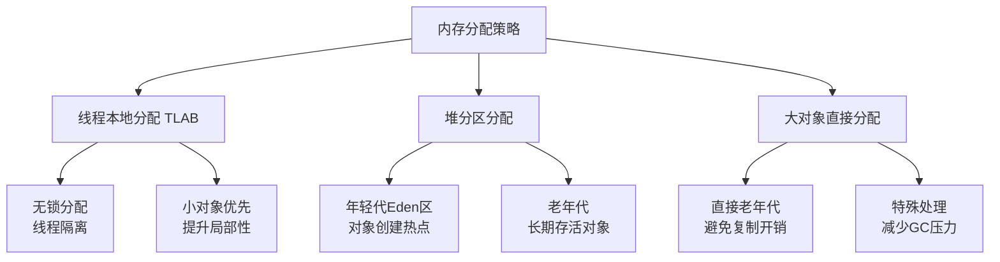
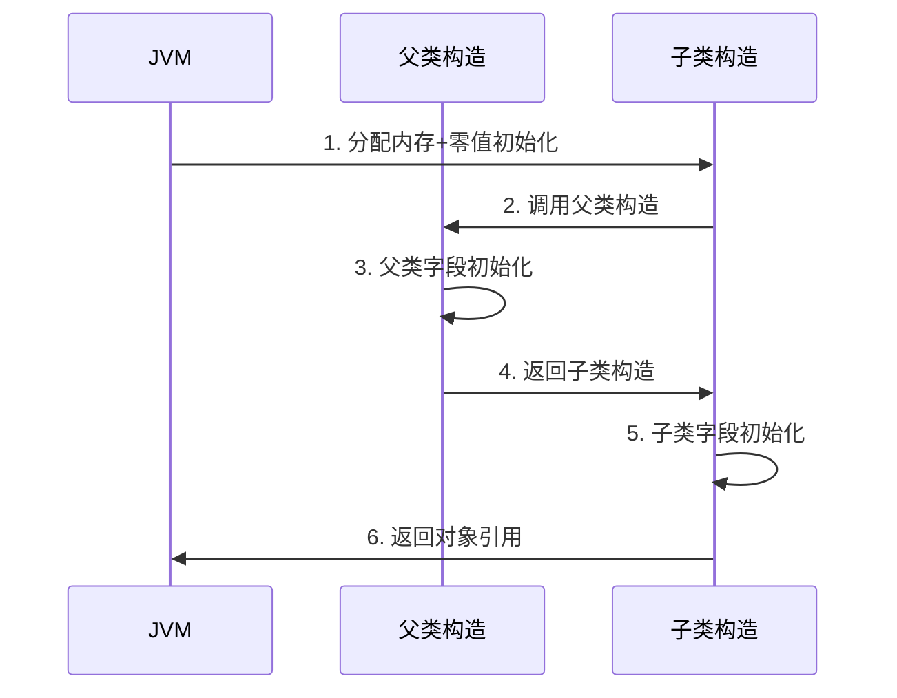
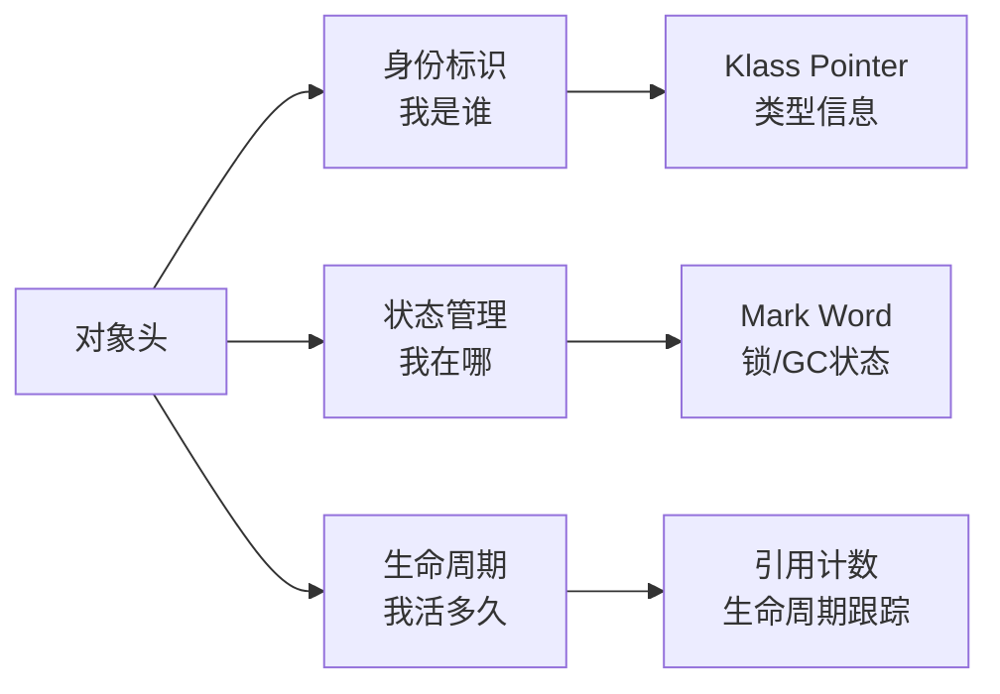
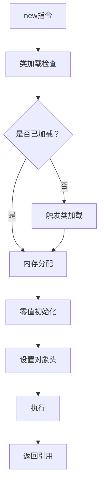

# 08.对象创建流程原理

> 📍 **本篇位置**：第 2 卷 · 运行时模型 · 第 2 篇
> 🎯 **核心矛盾**：**一个 `new` 的轻巧 vs 背后 7 步重活** —— 分配空间 / 初始化字段 / 设置头 / 调用构造 / 注册引用 缺一不可
> 🧭 **设计灵魂**：对象创建本质是"**类元数据 → 内存布局 → 可达图节点**"三段式；TLAB / 内存对齐 / 偏向锁标记 全发生在这里
> 🌐 **跨语言覆盖**：Java(new + TLAB + 对象头 Mark Word) · C++(new = 分配 + 构造 + 异常安全) · Swift(类对象引用计数初始化) · Go(make/new 二分) · Python(__new__ + __init__)
> 🔗 **延伸阅读**：← [07.类的加载核心原理](./07.类的加载核心原理.md) · → [09.对象和函数访问原理](./09.对象和函数访问原理.md) · → [10.反射与元编程核心设计](./10.反射与元编程核心设计.md)


## 📖 目录结构

### 1. 案例引入
- [1.1 电商订单场景](#11-电商订单场景)
- [1.2 直接创建的问题](#12-直接创建的问题)
- [1.3 间接创建的价值](#13-间接创建的价值)
- [1.4 引出核心矛盾](#14-引出核心矛盾)

### 2. 对象创建设计哲学
- [2.1 核心设计原则](#21-核心设计原则)
- [2.2 创建模型演进](#22-创建模型演进)
- [2.3 直接创建模型](#23-直接创建模型)
- [2.4 间接创建模型](#24-间接创建模型)
- [2.5 混合创建模型](#25-混合创建模型)
- [2.6 模型决策树](#26-模型决策树)

### 3. 内存分配机制
- [3.1 分配策略设计](#31-分配策略设计)
- [3.2 TLAB 机制原理](#32-tlab-机制原理)
- [3.3 逃逸分析优化](#33-逃逸分析优化)
- [3.4 内存布局设计](#34-内存布局设计)

### 4. 对象初始化机制
- [4.1 零值初始化原理](#41-零值初始化原理)
- [4.2 构造函数调用机制](#42-构造函数调用机制)
- [4.3 继承初始化流程](#43-继承初始化流程)
- [4.4 初始化性能优化](#44-初始化性能优化)

### 5. 对象头设置机制
- [5.1 对象头设计哲学](#51-对象头设计哲学)
- [5.2 Mark Word 机制](#52-mark-word-机制)
- [5.3 Klass Pointer 机制](#53-klass-pointer-机制)
- [5.4 对象布局优化](#54-对象布局优化)

### 6. 跨语言创建机制
- [6.1 Java 创建机制](#61-java-创建机制)
- [6.2 C++ 创建机制](#62-c-创建机制)
- [6.3 JavaScript 创建机制](#63-javascript-创建机制)
- [6.4 创建机制对比总结](#64-创建机制对比总结)


## 1. 案例引入

### 1.1 电商订单场景

**场景设定**：你正在为一家电商平台设计订单系统，需要处理每秒上万笔订单创建。看似简单的 `new Order()`，背后却隐藏着所有编程语言都要回答的根本问题。

```java
class Order {
    String orderId;
    double amount;
    List<Item> items;
    
    Order(String orderId, double amount, List<Item> items) {
        this.orderId = orderId;
        this.amount = amount;
        this.items = items;
    }
}

// 高峰期每秒创建上万次
Order order = new Order("ORD001", 299.99, items);
```

看似简单的 `new` 操作，背后藏着 **3 个真实的工程问题**：

- 内存分配：如何在多线程环境下高效分配内存而不产生竞争？
- 初始化安全：如何确保对象在完全初始化前不被其他线程访问？
- 性能平衡：如何在创建速度和内存使用之间找到最佳平衡点？

这三个问题分别对应了**并发安全性**、**内存管理**、**性能优化**——它们正是对象创建机制设计中的三股拉扯力量。

### 1.2 直接创建的问题

先看最直接的创建方式：

```java
// 简单直接的创建
Order order = new Order("ORD001", 299.99, items);
```

**这种写法看似简单，但在高并发场景下埋了三颗雷**：

- **雷一：内存分配竞争**：多个线程同时调用 `new`，在堆上竞争内存分配，导致性能瓶颈
- **雷二：初始化重排序**：由于指令重排序，其他线程可能看到未完全初始化的对象
- **雷三：内存碎片**：频繁创建销毁导致内存碎片，影响GC效率

**真实案例**：某电商平台在双十一期间，因订单对象创建竞争导致CPU使用率飙升，系统响应时间从50ms增加到500ms。

### 1.3 间接创建的价值

再看优化后的创建方式：

```java
// 使用对象池优化
class OrderPool {
    private static final ThreadLocal<Order> pool = ThreadLocal.withInitial(() -> new Order());
    
    public static Order createOrder(String orderId, double amount, List<Item> items) {
        Order order = pool.get();
        order.orderId = orderId;
        order.amount = amount;
        order.items = items;
        return order;
    }
}

// 使用对象池创建
Order order = OrderPool.createOrder("ORD001", 299.99, items);
```

**这种写法的优势**：

- **避免内存分配竞争**：每个线程有自己的对象池，无需竞争堆内存
- **减少GC压力**：对象复用，减少垃圾产生
- **提升缓存局部性**：同一线程重复使用对象，CPU缓存命中率高

**真实优化效果**：某支付系统通过对象池优化，将对象创建开销从15μs降到2μs，TPS提升3倍。

### 1.4 引出核心矛盾

把 1.2 和 1.3 放在一起看，矛盾就赤裸裸地浮出来了：

| 维度 | 直接创建（1.2） | 间接创建（1.3） |
|------|---------------|---------------|
| **内存分配开销** | 每次new都分配 | 线程本地复用 |
| **并发安全性** | 需要同步控制 | 线程隔离安全 |
| **内存使用** | 可能产生碎片 | 固定内存占用 |
| **代码复杂度** | 简单直接 | 需要额外管理 |

这就是对象创建机制设计的根本矛盾：**简单性 vs 性能**，**通用性 vs 专用性**。



## 2. 对象创建设计哲学

### 2.1 核心设计原则

**先看一个真实的反例**：某社交应用因对象创建设计不当，导致内存泄漏：

```java
// 反例：无节制创建大对象
class ImageProcessor {
    public void processImages(List<Image> images) {
        for (Image image : images) {
            // 每次循环都创建大对象
            ImageBuffer buffer = new ImageBuffer(1024, 1024); // 4MB对象
            processImage(image, buffer);
            // buffer 未被复用，立即成为垃圾
        }
    }
}
```

这个设计的问题在于：**创建开销大 + 生命周期短 + 无复用机制**。在高峰期，每秒产生数GB的垃圾，GC压力巨大。

**从这个反例中能提炼出三条设计准则**：



### 2.2 创建模型演进

对象创建模型经历了从原始到智能的演进历程：



### 2.3 直接创建模型

**C语言的直接创建模式**：

```c
// C语言：完全手动控制
struct Order* create_order(const char* order_id, double amount) {
    // 1. 手动分配内存
    struct Order* order = malloc(sizeof(struct Order));
    if (!order) return NULL;
    
    // 2. 手动初始化字段
    order->order_id = strdup(order_id);
    order->amount = amount;
    order->items = NULL;
    
    return order;
}

// 使用后必须手动释放
void destroy_order(struct Order* order) {
    free(order->order_id);
    free(order);
}
```

**设计优势**：
- **完全控制**：精确控制内存分配和释放时机
- **零开销**：无运行时类型信息，无GC开销
- **性能极致**：适合嵌入式、系统编程等场景

**设计风险**：
- **内存泄漏**：忘记释放导致内存泄漏
- **悬空指针**：使用已释放内存
- **安全漏洞**：缓冲区溢出等安全问题

**真实案例**：Linux内核采用这种模式，通过严格的代码审查和自动化工具（如KASAN）来保证安全。

### 2.4 间接创建模型

**Java的间接创建模式**：

```java
// Java：完全自动化
Order order = new Order("ORD001", 299.99, items);
// 无需手动释放，GC自动回收
```

**背后的复杂机制**：



**设计优势**：
- **安全性**：自动内存管理，避免内存错误
- **开发效率**：无需关心内存释放
- **跨平台**：统一的创建接口

**设计代价**：
- **GC开销**：垃圾回收带来的停顿
- **不确定性**：内存释放时机不确定
- **性能损失**：相比直接模式有额外开销

### 2.5 混合创建模型

**现代语言的混合策略**：

```rust
// Rust：编译期安全 + 运行时高效
#[derive(Debug)]
struct Order {
    order_id: String,
    amount: f64,
    items: Vec<Item>,
}

impl Order {
    fn new(order_id: String, amount: f64, items: Vec<Item>) -> Self {
        Order { order_id, amount, items }
    }
}

// 栈上创建（零开销）
let order = Order::new("ORD001".to_string(), 299.99, items);

// 堆上创建（需要显式Box）
let boxed_order = Box::new(Order::new("ORD001".to_string(), 299.99, items));
```

**混合模型的优势**：
- **编译期安全**：所有权系统保证内存安全
- **零成本抽象**：栈上分配无运行时开销
- **灵活选择**：根据场景选择栈/堆分配

### 2.6 模型决策树

**选择创建模型的决策路径**：



## 3. 内存分配机制

### 3.1 分配策略设计

**先看一个真实性能问题**：某游戏服务器因内存分配竞争导致帧率下降。**分析**：多个线程同时调用`new`，在堆上产生严重竞争。

**解决方案**：采用分层分配策略



### 3.2 TLAB 机制原理

**TLAB（Thread Local Allocation Buffer）工作原理**：

```java
// JVM为每个线程分配独立的TLAB
class Thread {
    private byte[] tlab;          // 线程本地分配缓冲区
    private int tlabTop;          // 当前分配位置
    private int tlabEnd;           // 缓冲区结束位置
    
    public Object allocate(int size) {
        // 1. 检查TLAB是否有足够空间
        if (tlabTop + size <= tlabEnd) {
            Object obj = (Object)(tlab + tlabTop);
            tlabTop += size;
            return obj;
        }
        
        // 2. TLAB不足，申请新的TLAB
        return allocateSlow(size);
    }
}
```

**TLAB的设计价值**：
- **避免锁竞争**：每个线程独立分配，无需全局锁
- **提升缓存局部性**：同一线程的对象在内存中相邻
- **减少内存碎片**：顺序分配，碎片化程度低

### 3.3 逃逸分析优化

**逃逸分析（Escape Analysis）的威力**：

```java
public void processOrder() {
    // 该Order对象不会逃逸出方法
    Order order = new Order("TEMP", 100.0, emptyList());
    int result = order.calculate();
    // order在方法返回后失效
}
```

JVM通过逃逸分析发现`order`对象不会逃逸出方法作用域，于是：

1. **栈上分配**：直接在栈帧中分配对象空间
2. **标量替换**：将对象拆解为基本类型字段
3. **同步消除**：如果对象不会逃逸，移除不必要的同步

**优化效果**：对象分配开销降为0，无需GC参与。

### 3.4 内存布局设计

**对象内存布局的优化案例**：

```java
// 优化前：内存浪费严重
class BadLayout {
    boolean flag;    // 1字节 + 7字节填充
    long value;      // 8字节
    byte data;       // 1字节 + 7字节填充
    // 总计：24字节
}

// 优化后：内存紧凑
class GoodLayout {
    long value;      // 8字节
    boolean flag;    // 1字节
    byte data;       // 1字节 + 6字节填充
    // 总计：16字节，节省33%
}
```

**内存对齐原则**：
- 8字节对齐：64位系统的最佳实践
- 字段重排：按大小降序排列减少填充
- 缓存行友好：避免跨缓存行访问

## 4. 对象初始化机制

### 4.1 零值初始化原理

**零值初始化的设计哲学**：

```java
class Order {
    String orderId;    // 初始化为 null
    double amount;     // 初始化为 0.0
    int status;        // 初始化为 0
    
    // 构造函数执行前，所有字段已有确定值
    Order() {
        // 此时字段已经是零值状态
    }
}
```

**零值初始化的价值**：
- **确定性**：对象创建后处于已知状态
- **安全性**：避免未初始化字段的使用
- **调试友好**：空指针异常有明确原因

### 4.2 构造函数调用机制

**构造函数的调用链**：



### 4.3 继承初始化流程

**复杂的继承初始化案例**：

```java
class A {
    int a = initA();
    A() { System.out.println("A构造"); }
    int initA() { System.out.println("A字段初始化"); return 1; }
}

class B extends A {
    int b = initB();
    B() { System.out.println("B构造"); }
    int initB() { System.out.println("B字段初始化"); return 2; }
}

class C extends B {
    int c = initC();
    C() { System.out.println("C构造"); }
    int initC() { System.out.println("C字段初始化"); return 3; }
}

// 输出顺序：
// A字段初始化 → A构造 → B字段初始化 → B构造 → C字段初始化 → C构造
```

**初始化顺序规则**：
1. 父类静态字段 → 父类静态块
2. 子类静态字段 → 子类静态块  
3. 父类实例字段 → 父类构造
4. 子类实例字段 → 子类构造

## 5. 对象头设置机制

### 5.1 对象头设计哲学

**对象头的核心作用**：



### 5.2 Mark Word 机制

**Mark Word 的巧妙设计**：

```java
// 64位JVM中Mark Word的布局（8字节）
class MarkWord {
    // 无锁状态：25位哈希码 + 4位分代年龄 + 1位偏向锁标志 + 2位锁标志
    // 偏向锁状态：54位线程ID + 2位epoch + 1位偏向锁标志 + 2位锁标志
    // 轻量级锁：62位指向栈中锁记录的指针 + 2位锁标志
    // 重量级锁：62位指向监视器的指针 + 2位锁标志
    // GC标记：标记位用于垃圾回收
}
```

**设计巧妙之处**：同一块内存根据不同状态存储不同信息，极大节省空间。

### 5.3 Klass Pointer 机制

**Klass Pointer 的压缩优化**：

```java
// 32位 vs 64位指针
class ObjectHeader {
    // 64位系统：8字节MarkWord + 8字节KlassPointer = 16字节
    // 压缩指针：8字节MarkWord + 4字节KlassPointer + 4字节填充 = 16字节
    // 节省4字节，对于小对象比例显著
}
```

**压缩指针条件**：堆内存 < 32GB时有效，通过基地址+偏移量实现。

## 6. 跨语言创建机制

### 6.1 Java 创建机制

**Java的完整创建流程**：



### 6.2 C++ 创建机制

**C++的灵活创建方式**：

```cpp
// 栈上创建（自动管理）
Order order("ORD001", 299.99);  // 栈上，自动析构

// 堆上创建（手动管理）
Order* order = new Order("ORD001", 299.99);  // 堆上，需delete

// 智能指针（自动管理）
std::unique_ptr<Order> order = std::make_unique<Order>("ORD001", 299.99);
```

### 6.3 JavaScript 创建机制

**JS的原型链创建**：

```javascript
// 构造函数模式
function Order(orderId, amount) {
    this.orderId = orderId;
    this.amount = amount;
}

// 原型方法
Order.prototype.display = function() {
    console.log(`Order: ${this.orderId}, Amount: ${this.amount}`);
};

// 创建实例
const order = new Order("ORD001", 299.99);
```

### 6.4 创建机制对比总结

**跨语言创建机制全景**：

| 维度 | Java | C++ | JavaScript | Rust | Python |
|------|------|-----|-----------|------|--------|
| **内存管理** | GC自动 | 手动/RAII | GC自动 | 所有权系统 | GC自动 |
| **创建开销** | 中等 | 可优化 | 较高 | 零开销 | 较高 |
| **安全性** | 高 | 依赖程序员 | 中等 | 编译期保证 | 中等 |
| **灵活性** | 中等 | 高 | 高 | 中等 | 高 |

**核心设计灵魂**：所有现代语言的对象创建都在解决**安全与效率的平衡**问题，通过不同的机制在编译期和运行期间寻找最佳平衡点。

---

## 🎯 一句话总结

> **对象创建流程原理**的本质是在**简单性与性能**、**安全性与灵活性**之间寻找平衡。现代语言通过分层策略（TLAB/逃逸分析/压缩指针）将`new`的轻巧表象与底层重活完美结合，让程序员享受简单接口的同时获得接近原生的性能。

## 🔗 延伸阅读

- ← [07.类的加载核心原理](./07.类的加载核心原理.md)：对象创建的前提条件
- → [09.对象和函数访问原理](./09.对象和函数访问原理.md)：对象创建后的使用机制
- → [10.反射与元编程核心设计](./10.反射与元编程核心设计.md)：动态对象创建的高级技术
- → [31.内存模型技术设计](./31.内存模型技术设计.md)：对象内存布局的底层原理
